# 第一章：树莓派的卡通化器和皮肤转换器

本章将展示如何为桌面和如树莓派等小型嵌入式系统编写一些图像处理过滤器。首先，我们为桌面（使用 C/C++）开发它，然后将项目移植到树莓派上，因为这是为嵌入式设备开发时推荐的场景。本章将涵盖以下主题：

+   如何将现实生活中的图像转换为素描草图

+   如何将图像转换为绘画并在其上叠加草图以产生卡通效果

+   一个恐怖的邪恶模式，用于创建反派角色而不是正面角色

+   一个基本的皮肤检测器和皮肤颜色转换器，可以给某人绿色的外星皮肤

+   最后，如何基于我们的桌面应用程序创建嵌入式系统

注意，一个**嵌入式系统**基本上是将计算机主板放置在产品或设备内部，用于执行特定任务，而**树莓派**是构建嵌入式系统的一个非常低廉且流行的主板：

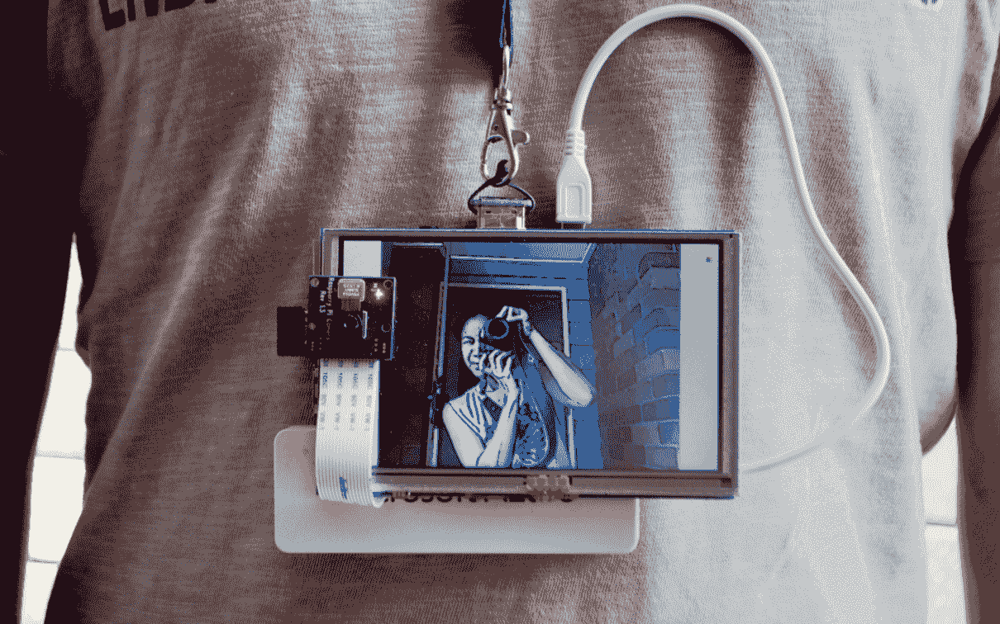

上一张图片展示了本章完成后你可以制作的内容：一个可穿戴的电池供电的树莓派加屏幕，可以将每个人变成卡通人物！

我们希望使现实世界的相机帧自动看起来像是从卡通中来的。基本思路是填充平面部分一些颜色，然后在强边缘上画粗线。换句话说，平面区域应该变得更加平坦，边缘应该变得更加明显。我们将检测边缘，平滑平面区域，并在其上重新绘制增强的边缘，以产生卡通或漫画效果。

在开发嵌入式计算机视觉系统时，在将其移植到嵌入式系统之前先构建一个完全工作的桌面版本是一个好主意，因为与嵌入式系统相比，开发桌面程序和调试要容易得多！因此，本章将从完整的卡通化器桌面程序开始，你可以使用你喜欢的 IDE（例如，Visual Studio、XCode、Eclipse、QtCreator）创建它。在桌面上运行正常后，最后一节将展示如何基于桌面版本创建嵌入式系统。许多嵌入式项目需要为嵌入式系统编写一些自定义代码，例如使用不同的输入和输出或使用一些平台特定的代码优化。然而，对于本章，我们实际上将在嵌入式系统和桌面系统上运行相同的代码，所以我们只需要创建一个项目。

该应用程序使用**OpenCV** GUI 窗口，初始化摄像头，并且对于每一帧摄像头图像，它都会调用`cartoonifyImage()`函数，其中包含本章的大部分代码。然后，它在 GUI 窗口上显示处理后的图像。本章将解释如何从头开始使用 USB 摄像头创建桌面应用程序，以及使用树莓派摄像头模块的基于桌面应用程序的嵌入式系统。因此，首先你会在你喜欢的 IDE 中创建一个桌面项目，创建一个`main.cpp`文件来保存以下章节中给出的 GUI 代码，例如主循环、摄像头功能、键盘输入，并且你会创建一个`cartoon.cpp`文件，其中包含图像处理操作，大部分本章的代码都在一个名为`cartoonifyImage()`的函数中。

本书的全源代码可在[`github.com/MasteringOpenCV/code`](http://github.com/MasteringOpenCV/code)找到。

# 访问摄像头

要访问计算机的摄像头或相机设备，你可以简单地在`cv::VideoCapture`对象上调用`open()`函数（OpenCV 访问你的相机设备的方法），并将 0 作为默认的摄像头 ID 号传递。一些计算机连接了多个摄像头，或者它们不是作为默认的摄像头 0 工作，因此允许用户将所需的摄像头编号作为命令行参数传递是一种常见的做法，例如，他们可能想尝试摄像头 1、2 或-1。我们还将尝试使用`cv::VideoCapture::set()`将摄像头分辨率设置为 640x480，以便在高清摄像头上运行更快。

根据你的摄像头型号、驱动程序或系统，OpenCV 可能不会更改你摄像头的属性。对于这个项目来说并不重要，所以如果你发现它不能与你的摄像头一起工作，请不要担心。

你可以将此代码放在`main.cpp`文件的`main()`函数中：

```py
    int cameraNumber = 0; 
    if (argc> 1) 
    cameraNumber = atoi(argv[1]); 

    // Get access to the camera. 
    cv::VideoCapture camera; 
    camera.open(cameraNumber); 
    if (!camera.isOpened()) { 
      std::cerr<<"ERROR: Could not access the camera or video!"<< 
      std::endl; 
      exit(1); 
    } 

    // Try to set the camera resolution. 
    camera.set(cv::CV_CAP_PROP_FRAME_WIDTH, 640); 
    camera.set(cv::CV_CAP_PROP_FRAME_HEIGHT, 480);

```

在摄像头初始化之后，你可以将当前摄像头图像作为`cv::Mat`对象（OpenCV 的图像容器）捕获。你可以通过使用 C++流操作符从你的`cv::VideoCapture`对象到`cv::Mat`对象来捕获每一帧摄像头图像，就像你从控制台获取输入一样。

OpenCV 使得从视频文件（如 AVI 或 MP4 文件）或网络流中捕获帧变得非常容易，而不是从摄像头中捕获。你不需要传递整数，如`camera.open(0)`，而是传递一个字符串，如`camera.open("my_video.avi")`，然后像处理摄像头一样捕获帧。本书提供的源代码中有一个`initCamera()`函数，它可以打开摄像头、视频文件或网络流。

# 桌面应用程序的主摄像头处理循环

如果您想使用 OpenCV 在屏幕上显示 GUI 窗口，您需要调用`cv::namedWindow()`函数，然后对每个图像调用`cv::imshow()`函数，但您还必须对每个帧调用一次`cv::waitKey()`，否则您的窗口将完全不会更新！调用`cv::waitKey(0)`将无限期等待，直到用户在窗口中按下一个键，但一个正数，例如`waitKey(20)`或更高，将至少等待那么多的毫秒。

将此主循环放入`main.cpp`文件中，作为您实时相机应用程序的基础：

```py
     while (true) { 
      // Grab the next camera frame. 
      cv::Mat cameraFrame; 
      camera>>cameraFrame; 
      if (cameraFrame.empty()) { 
        std::cerr<<"ERROR: Couldn't grab a camera frame."<< 
        std::endl; 
        exit(1); 
      } 
      // Create a blank output image, that we will draw onto. 
      cv::Mat displayedFrame(cameraFrame.size(), cv::CV_8UC3); 

      // Run the cartoonifier filter on the camera frame. 
      cartoonifyImage(cameraFrame, displayedFrame); 

      // Display the processed image onto the screen. 
      imshow("Cartoonifier", displayedFrame); 

      // IMPORTANT: Wait for atleast 20 milliseconds, 
      // so that the image can be displayed on the screen! 
      // Also checks if a key was pressed in the GUI window. 
      // Note that it should be a "char" to support Linux. 
      char keypress = cv::waitKey(20);  // Needed to see anything! 
      if (keypress == 27) {   // Escape Key 
        // Quit the program! 
        break; 
      } 
    }//end while

```

# 生成黑白素描

要获得相机帧的素描（黑白绘图），我们将使用边缘检测滤波器，而要获得彩色绘画，我们将使用边缘保持滤波器（双边滤波器）来进一步平滑平坦区域，同时保持边缘完整。通过将素描绘制叠加在彩色绘画之上，我们获得卡通效果，如之前截图中的最终应用程序所示。

有许多不同的边缘检测滤波器，例如 Sobel、Scharr、拉普拉斯滤波器或 Canny 边缘检测器。我们将使用拉普拉斯边缘滤波器，因为它产生的边缘与手绘草图相比最为相似，与 Sobel 或 Scharr 相比相当一致，与 Canny 边缘检测器相比则相当干净，但更容易受到相机帧中随机噪声的影响，因此线图在帧之间往往会发生剧烈变化。

尽管如此，我们仍然需要在使用拉普拉斯边缘滤波器之前减少图像中的噪声。我们将使用中值滤波器，因为它擅长去除噪声同时保持边缘锐利，但比双边滤波器慢。由于拉普拉斯滤波器使用灰度图像，我们必须将 OpenCV 的默认 BGR 格式转换为灰度。在您的空`cartoon.cpp`文件中，将此代码放在顶部，这样您就可以在不输入`cv::`和`std::`的情况下访问 OpenCV 和 STD C++模板：

```py
    // Include OpenCV's C++ Interface 
    #include "opencv2/opencv.hpp" 

    using namespace cv; 
    using namespace std;

```

将此代码和所有剩余代码放入您的`cartoon.cpp`文件中的`cartoonifyImage()`函数中：

```py
    Mat gray; 
    cvtColor(srcColor, gray, CV_BGR2GRAY); 
    const int MEDIAN_BLUR_FILTER_SIZE = 7; 
    medianBlur(gray, gray, MEDIAN_BLUR_FILTER_SIZE); 
    Mat edges; 
    const int LAPLACIAN_FILTER_SIZE = 5; 
 Laplacian(gray, edges, CV_8U, LAPLACIAN_FILTER_SIZE);

```

拉普拉斯滤波器产生的边缘亮度各异，因此为了使边缘看起来更像素描，我们应用二值阈值使边缘要么是白色要么是黑色：

```py
    Mat mask; 
    const int EDGES_THRESHOLD = 80; 
 threshold(edges, mask, EDGES_THRESHOLD, 255, THRESH_BINARY_INV);

```

在以下图中，您可以看到原始图像（左侧）和生成的类似素描的边缘掩码（右侧）。在我们生成彩色绘画（稍后解释）之后，我们也将此边缘掩码放在顶部，以获得黑色线图：

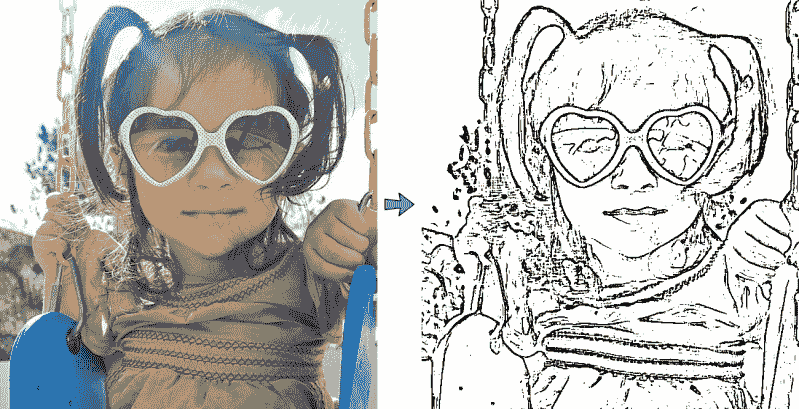

# 生成彩色绘画和卡通

强大的双边滤波器可以平滑平坦区域，同时保持边缘锐利；因此，它非常适合作为自动卡通化或绘画滤镜，除了它极其缓慢（即以秒或甚至分钟计算，而不是毫秒！）之外。因此，我们将使用一些技巧来获得一个不错的卡通化效果，同时仍然以可接受的速度运行。我们可以使用的一个最重要的技巧是，我们可以在较低的分辨率下执行双边滤波，它仍然会产生与全分辨率相似的效果，但运行得更快。让我们将总像素数减少四分之一（例如，宽度和高度各减半）：

```py
    Size size = srcColor.size(); 
    Size smallSize; 
    smallSize.width = size.width/2; 
    smallSize.height = size.height/2; 
    Mat smallImg = Mat(smallSize, CV_8UC3); 
 resize(srcColor, smallImg, smallSize, 0,0, INTER_LINEAR);

```

我们不会应用一个大的双边滤波器，而是会应用许多小的双边滤波器，以在更短的时间内产生强烈的卡通效果。我们将截断滤波器（见下图），这样它就只使用达到令人信服结果所需的最小滤波器尺寸（例如，即使钟形曲线宽度为 21 像素，也只使用 9x9 的滤波器尺寸）。这个截断滤波器将应用滤波器的大部分（灰色区域），而不会在滤波器的次要部分（曲线下的白色区域）上浪费时间，因此它将运行得快几倍：

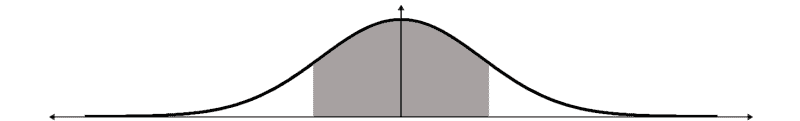

因此，我们有四个参数控制双边滤波器：颜色强度、位置强度、大小和重复计数。我们需要一个临时的`Mat`，因为`bilateralFilter()`函数不能覆盖其输入（称为*就地处理*），但我们可以应用一个存储临时`Mat`的滤波器，然后应用另一个存储输入的滤波器：

```py
    Mat tmp = Mat(smallSize, CV_8UC3); 
    int repetitions = 7;  // Repetitions for strong cartoon effect. 
    for (int i=0; i<repetitions; i++) { 
      int ksize = 9;     // Filter size. Has large effect on speed.  
      double sigmaColor = 9;    // Filter color strength. 
      double sigmaSpace = 7;    // Spatial strength. Affects speed. 
 bilateralFilter(smallImg, tmp, ksize, sigmaColor, sigmaSpace); bilateralFilter(tmp, smallImg, ksize, sigmaColor, sigmaSpace); 
    }

```

记住，这是应用于缩小后的图像，因此我们需要将图像扩展回原始大小。然后我们可以叠加之前找到的边缘蒙版。要将边缘蒙版*草图*叠加到双边滤波器*绘画*（下图的左侧），我们可以从黑色背景开始，并复制*草图*蒙版中不是边缘的*绘画*像素：

```py
    Mat bigImg; 
    resize(smallImg, bigImg, size, 0,0, INTER_LINEAR); 
    dst.setTo(0); 
 bigImg.copyTo(dst, mask);

```

结果是原始照片的卡通版本，如图中右侧所示，其中在绘画上叠加了*草图*蒙版：


# 使用边缘滤镜生成邪恶模式

卡通和漫画总是有好的和坏的角色。通过合适的边缘滤镜组合，可以从看起来最无辜的人那里生成一个令人恐惧的图像！技巧是使用一个小边缘滤镜，它将在整个图像中找到许多边缘，然后使用一个小中值滤波器合并这些边缘。

我们将在一个带有一些噪声减少的灰度图像上执行此操作，因此之前将原始图像转换为灰度并应用 7x7 中值滤波器的代码仍然应该使用（以下图中第一幅图像显示了灰度中值模糊的输出）。我们不需要跟随拉普拉斯滤波器和二值阈值，如果我们沿着*x*和*y*应用 3x3 Scharr 梯度滤波器（图中第二幅图像），然后使用一个非常低的截止值的二值阈值（图中第三幅图像），以及 3x3 中值模糊，就可以得到最终的**邪恶**蒙版（图中第四幅图像）：

```py
    Mat gray;
    cvtColor(srcColor, gray, CV_BGR2GRAY);
    const int MEDIAN_BLUR_FILTER_SIZE = 7;
    medianBlur(gray, gray, MEDIAN_BLUR_FILTER_SIZE);
    Mat edges, edges2;
    Scharr(srcGray, edges, CV_8U, 1, 0);
    Scharr(srcGray, edges2, CV_8U, 1, 0, -1);
    edges += edges2;
    // Combine the x & y edges together.
    const int EVIL_EDGE_THRESHOLD = 12
    threshold(edges, mask, EVIL_EDGE_THRESHOLD, 255,
    THRESH_BINARY_INV);
    medianBlur(mask, mask, 3)

```

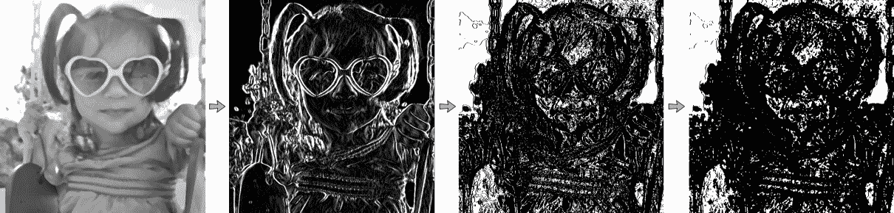

现在我们有了**邪恶**蒙版，我们可以像处理常规的**草图**边缘蒙版一样将此蒙版叠加到**卡通化**的绘画图像上。最终结果显示在以下图的右侧：

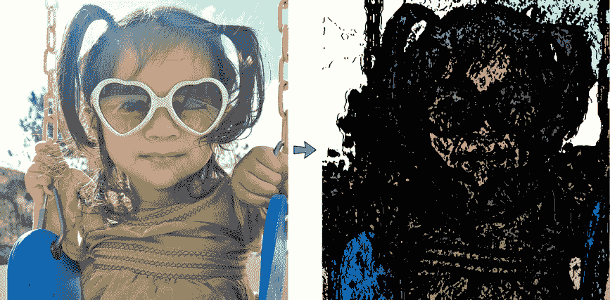

# 使用皮肤检测生成外星人模式

现在我们有了**草图**模式、**卡通**模式（**绘画**+**草图**蒙版）和**邪恶**模式（**绘画**+**邪恶**蒙版），为了好玩，让我们尝试更复杂的东西：一个**外星人**模式，通过检测面部皮肤区域，然后将皮肤颜色变为绿色。

# 皮肤检测算法

在检测皮肤区域方面，有许多不同的技术被使用，从简单的使用**RGB（红-绿-蓝）**、**HSV（色调-饱和度-亮度）**值或颜色直方图计算和重新投影的颜色阈值，到复杂的混合模型机器学习算法，这些算法需要在**CIELab**颜色空间中进行相机校准，并使用许多样本面部进行离线训练，等等。但是，即使是复杂的方法也不一定在各种相机、照明条件和皮肤类型下都能稳健地工作。由于我们希望我们的皮肤检测在嵌入式设备上运行，无需任何校准或训练，而我们只是使用皮肤检测作为有趣的图像过滤器，因此对我们来说，使用简单的皮肤检测方法就足够了。然而，树莓派相机模块中的微型相机传感器的颜色响应往往会显著变化，我们希望支持任何肤色的人的皮肤检测，但无需任何校准，因此我们需要比简单的颜色阈值更稳健的方法。

例如，一个简单的 HSV 皮肤检测器可以将其色调颜色相当红色、饱和度相当高但不是极高、亮度不是太暗或极度明亮的任何像素视为皮肤。但是，手机或树莓派相机模块中的相机通常有很差的白平衡，因此一个人的皮肤可能看起来是略带蓝色而不是红色，等等，这将是简单 HSV 阈值的一个主要问题。

一个更稳健的解决方案是使用 Haar 或 LBP 级联分类器进行人脸检测（见第六章，*使用特征脸或费舍尔脸进行人脸识别*)，然后查看检测到的脸部中间像素的颜色范围，因为你知道那些像素应该是实际人的皮肤像素。然后你可以在整个图像或附近区域扫描与脸部中心颜色相似的像素。这个方法的优势是，无论检测到的人的皮肤颜色如何，甚至如果他们的皮肤在相机图像中看起来有些蓝色或红色，都极有可能找到至少一些真正的皮肤区域。

不幸的是，使用级联分类器进行人脸检测在当前的嵌入式设备上相当慢，因此这种方法可能对某些实时嵌入式应用来说不太理想。另一方面，我们可以利用这样一个事实，对于移动应用和一些嵌入式系统，可以预期用户将直接从非常近的距离面对相机，因此要求用户将脸部放置在特定的位置和距离是合理的，而不是试图检测他们脸部的位置和大小。这是许多手机应用的基础，应用会要求用户将脸部放置在某个位置，或者手动在屏幕上拖动点来显示照片中脸部角的位置。所以让我们简单地绘制屏幕中央的脸部轮廓，并要求用户将脸部移动到显示的位置和大小。

# 向用户展示他们应该将脸部放在哪里

当第一次启动*外星人*模式时，我们将在相机帧上绘制脸部轮廓，以便用户知道他们的脸部应该放在哪里。我们将绘制一个覆盖 70%图像高度的椭圆，具有固定的宽高比 0.72，这样脸部就不会因为相机的宽高比而变得太瘦或太胖：

```py
    // Draw the color face onto a black background. 
    Mat faceOutline = Mat::zeros(size, CV_8UC3); 
    Scalar color = CV_RGB(255,255,0);    // Yellow. 
    int thickness = 4; 

    // Use 70% of the screen height as the face height. 
    int sw = size.width; 
    int sh = size.height; 
    int faceH = sh/2 * 70/100;  // "faceH" is radius of the ellipse. 

    // Scale the width to be the same nice shape for any screen width.   
    int faceW = faceH * 72/100; 
    // Draw the face outline. 
    ellipse(faceOutline, Point(sw/2, sh/2), Size(faceW, faceH), 
 0, 0, 360, color, thickness, CV_AA);

```

为了更明显地表明这是一个脸部，我们还可以绘制两个眼睛轮廓。而不是将眼睛画成椭圆，我们可以通过绘制眼睛顶部和底部的截断椭圆来给它增加一点现实感（见以下图示），因为我们可以在使用`ellipse()`函数绘制时指定起始和结束角度：

```py
    // Draw the eye outlines, as 2 arcs per eye. 
    int eyeW = faceW * 23/100; 
    int eyeH = faceH * 11/100; 
    int eyeX = faceW * 48/100; 
    int eyeY = faceH * 13/100; 
    Size eyeSize = Size(eyeW, eyeH); 

    // Set the angle and shift for the eye half ellipses. 
    int eyeA = 15; // angle in degrees. 
    int eyeYshift = 11; 

    // Draw the top of the right eye. 
    ellipse(faceOutline, Point(sw/2 - eyeX, sh/2 -eyeY), 
    eyeSize, 0, 180+eyeA, 360-eyeA, color, thickness, CV_AA); 

    // Draw the bottom of the right eye. 
    ellipse(faceOutline, Point(sw/2 - eyeX, sh/2 - eyeY-eyeYshift), 
    eyeSize, 0, 0+eyeA, 180-eyeA, color, thickness, CV_AA); 

    // Draw the top of the left eye. 
    ellipse(faceOutline, Point(sw/2 + eyeX, sh/2 - eyeY), 
    eyeSize, 0, 180+eyeA, 360-eyeA, color, thickness, CV_AA); 

    // Draw the bottom of the left eye. 
    ellipse(faceOutline, Point(sw/2 + eyeX, sh/2 - eyeY-eyeYshift), 
 eyeSize, 0, 0+eyeA, 180-eyeA, color, thickness, CV_AA);

```

我们可以用同样的方法来绘制嘴巴的底部：

```py
    // Draw the bottom lip of the mouth. 
    int mouthY = faceH * 48/100; 
    int mouthW = faceW * 45/100; 
    int mouthH = faceH * 6/100; 
    ellipse(faceOutline, Point(sw/2, sh/2 + mouthY), Size(mouthW, 
 mouthH), 0, 0, 180, color, thickness, CV_AA);

```

为了让用户更清楚地知道应该将脸部放在显示的位置，让我们在屏幕上写一条信息！

```py
    // Draw anti-aliased text. 
    int fontFace = FONT_HERSHEY_COMPLEX; 
    float fontScale = 1.0f; 
    int fontThickness = 2; 
    char *szMsg = "Put your face here"; 
    putText(faceOutline, szMsg, Point(sw * 23/100, sh * 10/100), 
 fontFace, fontScale, color, fontThickness, CV_AA);

```

现在我们已经画出了脸部轮廓，我们可以通过使用透明度混合将其叠加到显示的图像上，以将卡通化图像与绘制的轮廓结合：

```py
    addWeighted(dst, 1.0, faceOutline, 0.7, 0, dst, CV_8UC3);

```

这导致了以下图中的轮廓，显示了用户应该将脸部放在哪里，因此我们不需要检测脸部位置：


# 肌肤颜色改变器的实现

而不是先检测肤色然后检测具有该肤色的区域，我们可以使用 OpenCV 的`floodFill()`函数，这个函数在很多图像编辑软件中的桶填充工具类似。我们知道屏幕中间的区域应该是皮肤像素（因为我们要求用户将脸部放在中间），所以要将整个脸部变成绿色皮肤，我们只需在中心像素上应用绿色填充，这将始终使脸部的一些部分变成绿色。实际上，颜色、饱和度和亮度在脸的不同部分可能不同，所以除非阈值非常低，否则填充通常不会覆盖脸部所有的皮肤像素。因此，我们不是在图像的中心应用单个填充，而是在脸部周围六个不同的点应用填充，这些点应该是皮肤像素。

OpenCV 的`floodFill()`的一个不错的特点是它可以将填充绘制到外部图像中，而不是修改输入图像。因此，这个功能可以给我们一个掩码图像，用于调整皮肤像素的颜色，而无需改变亮度或饱和度，产生比所有皮肤像素都变成相同的绿色像素（丢失显著的面部细节）更逼真的图像。

在 RGB 颜色空间中，肤色改变的效果并不好，因为你希望脸部亮度可以变化，但肤色变化不大，而 RGB 没有将亮度与颜色分开。一个解决方案是使用 HSV 颜色空间，因为它将亮度从颜色（色调）以及色彩的鲜艳程度（饱和度）中分离出来。不幸的是，HSV 将色调值围绕红色进行循环，由于皮肤主要是红色，这意味着你需要同时处理*色调 < 10%*和*色调 > 90%，因为这两个都是红色。因此，我们将使用**Y'CrCb**颜色空间（OpenCV 中 YUV 的变体），因为它将亮度与颜色分开，并且对于典型的皮肤颜色只有一个值范围，而不是两个。请注意，大多数相机、图像和视频在转换为 RGB 之前实际上使用某种类型的 YUV 作为它们的颜色空间，所以在许多情况下，你可以免费获得 YUV 图像，而无需自己转换。

由于我们希望我们的外星模式看起来像卡通，我们将在图像已经被卡通化之后应用*外星*滤镜。换句话说，我们有权访问双边滤波器产生的缩小颜色图像，以及完整的边缘掩码。皮肤检测在低分辨率下通常效果更好，因为它相当于分析每个高分辨率像素邻居的平均值（或低频信号而不是高频噪声信号）。所以让我们以双边滤波器相同的缩小比例工作（半宽度和半高度）。让我们将绘画图像转换为 YUV：

```py
    Mat yuv = Mat(smallSize, CV_8UC3); 
 cvtColor(smallImg, yuv, CV_BGR2YCrCb);

```

我们还需要缩小边缘掩码，使其与绘画图像具有相同的比例。在使用 OpenCV 的`floodFill()`函数时存在一个复杂问题，当存储到单独的掩码图像中时，掩码应围绕整个图像有 1 像素的边界，因此如果输入图像大小为*WxH*像素，则单独的掩码图像大小应为*(W+2) x (H+2)*像素。但是`floodFill()`函数也允许我们使用边缘初始化掩码，这样洪水填充算法将确保它不会交叉。让我们利用这个特性，希望它能帮助防止洪水填充扩展到面部之外。因此，我们需要提供两个掩码图像：一个是*WxH*大小的边缘掩码，另一个图像是大小完全相同的边缘掩码，但为*(W+2)x(H+2)*，因为它应包括图像周围的边界。可能存在多个`cv::Mat`对象（或头文件）引用相同的数据，或者甚至有一个`cv::Mat`对象引用另一个`cv::Mat`图像的子区域。因此，我们不是分配两个单独的图像并将边缘掩码像素复制过来，而是分配一个包含边界的单个掩码图像，并创建一个额外的*WxH*大小的`cv::Mat`头文件（它仅引用洪水填充掩码中的感兴趣区域，不包括边界）。换句话说，只有一个大小为*(W+2)x(H+2)*的像素数组，但有两个`cv::Mat`对象，其中一个是引用整个*(W+2)x(H+2)*图像，另一个是引用该图像中间的*WxH*区域：

```py
    int sw = smallSize.width; 
    int sh = smallSize.height; 
    Mat mask, maskPlusBorder; 
 maskPlusBorder = Mat::zeros(sh+2, sw+2, CV_8UC1);
 mask = maskPlusBorder(Rect(1,1,sw,sh));
 // mask is now in maskPlusBorder.
    resize(edges, mask, smallSize);     // Put edges in both of them.

```

边缘掩码（如图中左侧所示）充满了强和弱边缘，但我们只想保留强边缘，因此我们将应用二值阈值（结果如图中中间图像所示）。为了连接边缘之间的某些间隙，我们将结合形态学算子`dilate()`和`erode()`来消除一些间隙（也称为闭合算子），结果如图中右侧所示：

```py
    const int EDGES_THRESHOLD = 80; 
    threshold(mask, mask, EDGES_THRESHOLD, 255, THRESH_BINARY); 
    dilate(mask, mask, Mat()); 
    erode(mask, mask, Mat());

```

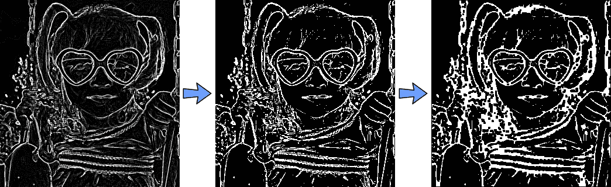

如前所述，我们想在面部周围多个点应用洪水填充，以确保包括整个面部的各种颜色和阴影。让我们选择六个点，围绕鼻子、面颊和额头，如图中左侧所示。请注意，这些值取决于之前绘制的面部轮廓：

```py
    int const NUM_SKIN_POINTS = 6; 
    Point skinPts[NUM_SKIN_POINTS]; 
    skinPts[0] = Point(sw/2,          sh/2 - sh/6); 
    skinPts[1] = Point(sw/2 - sw/11,  sh/2 - sh/6); 
    skinPts[2] = Point(sw/2 + sw/11,  sh/2 - sh/6); 
    skinPts[3] = Point(sw/2,          sh/2 + sh/16); 
    skinPts[4] = Point(sw/2 - sw/9,   sh/2 + sh/16); 
    skinPts[5] = Point(sw/2 + sw/9,   sh/2 + sh/16);

```

现在我们只需要找到洪水填充的一些良好的上下限。记住，这是在*Y'CrCb*颜色空间中进行的，所以我们基本上决定亮度可以变化多少，红色分量可以变化多少，以及蓝色分量可以变化多少。我们希望亮度变化很大，包括阴影、高光和反射，但我们不希望颜色变化很大：

```py
    const int LOWER_Y = 60; 
    const int UPPER_Y = 80; 
    const int LOWER_Cr = 25; 
    const int UPPER_Cr = 15; 
    const int LOWER_Cb = 20; 
    const int UPPER_Cb = 15; 
    Scalar lowerDiff = Scalar(LOWER_Y, LOWER_Cr, LOWER_Cb); 
    Scalar upperDiff = Scalar(UPPER_Y, UPPER_Cr, UPPER_Cb);

```

我们将使用带有默认标志的`floodFill()`函数，除了我们希望将其存储到外部掩码中，因此必须指定`FLOODFILL_MASK_ONLY`：

```py
    const int CONNECTED_COMPONENTS = 4;  // To fill diagonally, use 8\.       
    const int flags = CONNECTED_COMPONENTS | FLOODFILL_FIXED_RANGE  
      | FLOODFILL_MASK_ONLY; 
    Mat edgeMask = mask.clone();    // Keep a copy of the edge mask. 
    // "maskPlusBorder" is initialized with edges to block floodFill(). 
    for (int i = 0; i < NUM_SKIN_POINTS; i++) { 
      floodFill(yuv, maskPlusBorder, skinPts[i], Scalar(), NULL, 
        lowerDiff, upperDiff, flags); 
    }

```

下图左侧显示了六个洪水填充位置（以圆圈表示），图例右侧显示了生成的外部掩码，其中皮肤以灰色显示，边缘以白色显示。请注意，右侧图像已被修改以供本书使用，以便皮肤像素（值为 1）清晰可见：

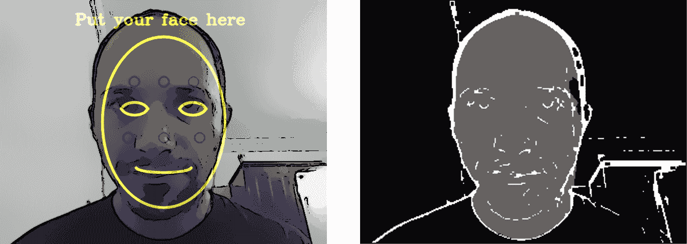

上一个图例右侧显示的`mask`图像现在包含以下内容：

+   边缘像素的值为 255

+   皮肤区域的像素值为 1

+   其余像素的值为 0

同时，`edgeMask`仅包含边缘像素（值为 255）。因此，要仅获取皮肤像素，我们可以从其中移除边缘：

```py
    mask -= edgeMask;

```

`mask`变量现在仅包含皮肤像素的 1 和非皮肤像素的 0。要更改原始图像的皮肤颜色和亮度，我们可以使用`cv::add()`函数与皮肤掩码一起使用，以增加原始 BGR 图像中的绿色分量：

```py
    int Red = 0; 
    int Green = 70; 
    int Blue = 0; 
 add(smallImgBGR, CV_RGB(Red, Green, Blue), smallImgBGR, mask);

```

下图显示了左侧的原始图像和右侧的最终外星人卡通图像，其中现在至少有六个面部部分将变为绿色！

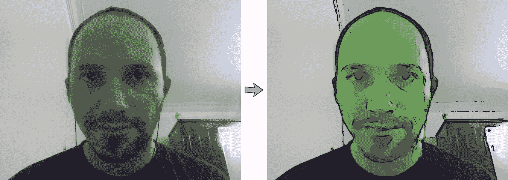

注意，我们已经使皮肤看起来更绿也更亮（看起来像在黑暗中发光的外星人）。如果您只想改变皮肤颜色而不使其变亮，可以使用其他颜色变换方法，例如在绿色上添加 70，同时从红色和蓝色中减去 70，或者使用`cvtColor(src, dst, "CV_BGR2HSV_FULL")`转换为 HSV 颜色空间，并调整色调和饱和度。

### 减少草图图像中的随机胡椒噪声

智能手机中的大多数小型摄像头、RPi 摄像头模块和一些网络摄像头都有明显的图像噪声。这通常是可接受的，但它对我们的 5x5 拉普拉斯边缘过滤器有很大的影响。边缘掩码（如图所示为草图模式）通常会有成千上万的黑色像素小团块，称为**胡椒噪声**，由几个相邻的黑色像素在白色背景中组成。我们已经在使用中值滤波器，这通常足以去除胡椒噪声，但在此情况下可能不够强大。我们的边缘掩码主要是纯白色背景（值为 255）和一些黑色边缘（值为 0）以及噪声点（也是值为 0）。我们可以使用标准的闭合形态学算子，但它将去除很多边缘。因此，我们将应用一个自定义过滤器，该过滤器移除完全被白色像素包围的小黑色区域。这将去除很多噪声，同时对实际边缘的影响很小。

我们将扫描图像中的黑色像素，并在每个黑色像素周围检查 5x5 平方区域的边界，看是否所有 5x5 边界像素都是白色。如果它们都是白色，那么我们知道我们有一个小的黑色噪声岛，因此我们将整个块填充为白色像素以去除黑色岛屿。为了简化我们的 5x5 过滤器，我们将忽略图像周围的两个边界像素，并保持它们不变。

下图显示了左侧的 Android 平板电脑上的原始图像，中间是草图模式，显示了中间的小黑点椒噪声，右侧显示了我们的椒噪声去除结果，皮肤看起来更干净：

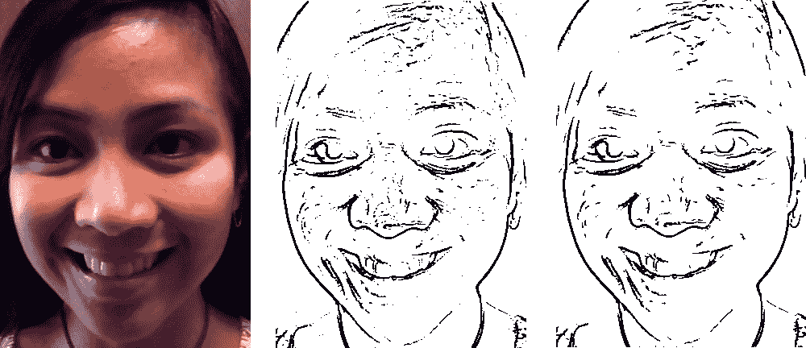

以下代码可以命名为`removePepperNoise()`函数，以简化图像的编辑：

```py
    void removePepperNoise(Mat &mask) 
    { 
      for (int y=2; y<mask.rows-2; y++) { 
        // Get access to each of the 5 rows near this pixel. 
        uchar *pUp2 = mask.ptr(y-2); 
        uchar *pUp1 = mask.ptr(y-1); 
        uchar *pThis = mask.ptr(y); 
        uchar *pDown1 = mask.ptr(y+1); 
        uchar *pDown2 = mask.ptr(y+2); 

        // Skip the first (and last) 2 pixels on each row. 
        pThis += 2; 
        pUp1 += 2; 
        pUp2 += 2; 
        pDown1 += 2; 
        pDown2 += 2; 
        for (int x=2; x<mask.cols-2; x++) { 
          uchar value = *pThis;  // Get pixel value (0 or 255). 
          // Check if it's a black pixel surrounded bywhite 
          // pixels (ie: whether it is an "island" of black). 
          if (value == 0) { 
            bool above, left, below, right, surroundings; 
            above = *(pUp2 - 2) && *(pUp2 - 1) && *(pUp2) && 
            *(pUp2 + 1) && *(pUp2 + 2); 
            left = *(pUp1 - 2) && *(pThis - 2) && *(pDown1 - 2); 
            below = *(pDown2 - 2) && *(pDown2 - 1) && *(pDown2) 
              &&*(pDown2 + 1) && *(pDown2 + 2); 
            right = *(pUp1 + 2) && *(pThis + 2) && *(pDown1 + 2); 
            surroundings = above && left && below && right; 
            if (surroundings == true) { 
              // Fill the whole 5x5 block as white. Since we  
              // knowthe 5x5 borders are already white, we just 
              // need tofill the 3x3 inner region. 
              *(pUp1 - 1) = 255; 
              *(pUp1 + 0) = 255; 
              *(pUp1 + 1) = 255; 
              *(pThis - 1) = 255; 
              *(pThis + 0) = 255; 
              *(pThis + 1) = 255; 
              *(pDown1 - 1) = 255; 
              *(pDown1 + 0) = 255; 
              *(pDown1 + 1) = 255; 
              // Since we just covered the whole 5x5 block with 
              // white, we know the next 2 pixels won't be 
              // black,so skip the next 2 pixels on the right. 
              pThis += 2; 
              pUp1 += 2; 
              pUp2 += 2; 
              pDown1 += 2; 
              pDown2 += 2; 
            } 
          } 
          // Move to the next pixel on the right. 
          pThis++; 
          pUp1++; 
          pUp2++; 
          pDown1++; 
          pDown2++; 
        } 
      } 
    }

```

就这样！在不同的模式下运行应用程序，直到你准备好将其迁移到嵌入式系统！

### 从桌面迁移到嵌入式系统

现在程序在桌面上运行良好，我们可以从它制作一个嵌入式系统。这里给出的细节是针对 Raspberry Pi 的，但类似的步骤也适用于为其他嵌入式 Linux 系统开发，如 BeagleBone、ODROID、Olimex、Jetson 等。

在嵌入式系统上运行我们的代码有几种不同的选择，每种选择在不同场景下都有一些优缺点。

编译嵌入式设备代码有两种常见方法：

1.  将源代码从桌面复制到设备上，并在设备上直接编译。这通常被称为**原生编译**，因为我们是在最终运行代码的同一系统上本地编译代码。

1.  在桌面上编译所有代码，但使用特殊方法生成设备的代码，然后将最终的可执行程序复制到设备上。这通常被称为**交叉编译**，因为你需要一个特殊的编译器，它知道如何为其他类型的 CPU 生成代码。

与原生编译相比，交叉编译通常配置起来要困难得多，尤其是如果你使用了多个共享库。但是，由于你的桌面通常比你的嵌入式设备快得多，交叉编译在编译大型项目时通常要快得多。如果你预计要编译你的项目数百次，以便在几个月内对其进行工作，并且你的设备与桌面相比相当慢，比如与桌面相比非常慢的 Raspberry Pi 1 或 Raspberry Pi Zero，那么交叉编译是一个好主意。但在大多数情况下，特别是对于小型简单项目，你应该坚持使用原生编译，因为它更容易。

注意，你项目中使用的所有库也需要为设备编译，因此你需要为你的设备编译 OpenCV。在 Raspberry Pi 1 上本地编译 OpenCV 可能需要数小时，而桌面交叉编译 OpenCV 可能只需 15 分钟。但通常你只需要编译一次 OpenCV，然后你就可以为所有项目使用它，所以大多数情况下，坚持使用项目的原生编译（包括 OpenCV 的原生编译）仍然是值得的。

在嵌入式系统上运行代码也有几种选择：

+   使用与桌面相同的输入和输出方法，例如相同的视频文件或 USB 摄像头或键盘作为输入，并以与桌面相同的方式将文本或图形显示到 HDMI 显示器上。

+   使用特殊的输入和输出设备。例如，你不必坐在桌前使用 USB 摄像头和键盘作为输入，并将输出显示到桌面显示器上，你可以使用特殊的树莓派摄像头模块作为视频输入，使用定制的 GPIO 推按钮或传感器作为输入，并使用 7 英寸 MIPI DSI 屏幕或 GPIO LED 灯作为输出，然后通过一个通用的**便携式 USB 充电器**为所有设备供电，你就可以将整个计算机平台背在背包里，或者将其固定在自行车上！

+   另一个选择是将数据流进或流出嵌入式设备到其他计算机，或者甚至使用一个设备来输出摄像头数据，另一个设备来使用这些数据。例如，你可以使用 Gstreamer 框架来配置树莓派，从其摄像头模块流式传输 H.264 压缩视频到以太网网络或通过 Wi-Fi，这样局域网中的强大 PC 或服务器机架或亚马逊 AWS 云计算服务就可以在其他地方处理视频流。这种方法允许使用一个小巧廉价的摄像头设备，在需要位于其他地方的大量处理资源的复杂项目中使用。

如果你确实希望在设备上执行计算机视觉，请注意，一些低成本嵌入式设备，如树莓派 1、树莓派 Zero 和 BeagleBone Black，其计算能力比桌面或甚至廉价的上网本或智能手机慢得多，可能比你的桌面慢 10-50 倍，因此根据你的应用，你可能需要一个功能强大的嵌入式设备，或者像之前提到的那样将视频流到另一台计算机。如果你不需要太多的计算能力（例如，你只需要每 2 秒处理一帧，或者你只需要使用 160x120 的图像分辨率），那么运行一些计算机视觉的树莓派 Zero 可能足够快以满足你的需求。但许多计算机视觉系统需要更多的计算能力，因此如果你想在设备上执行计算机视觉，你通常会想要使用一个速度更快的设备，其 CPU 在 2 GHz 范围内，例如树莓派 3、ODROID-XU4 或 Jetson TK1。

### 为开发嵌入式设备代码的设备设置

让我们从尽可能简单开始，使用 USB 键盘和鼠标以及 HDMI 显示器，就像我们的桌面系统一样，在设备上本地编译代码，并在设备上运行我们的代码。我们的第一步将是将代码复制到设备上，安装构建工具，并在嵌入式系统上编译 OpenCV 和我们的源代码。

许多嵌入式设备，如 Raspberry Pi，都有一个 HDMI 端口和至少一个 USB 端口。因此，开始使用嵌入式设备的最简单方法是连接一个 HDMI 显示器和 USB 键盘和鼠标，以配置设置并查看输出，同时在您的桌面机器上开发代码并进行测试。如果您有一个备用的 HDMI 显示器，可以将其连接到设备上，但如果您没有备用的 HDMI 显示器，您可能需要考虑购买一个小型 HDMI 屏幕专门用于您的嵌入式设备。

此外，如果您没有备用的 USB 键盘和鼠标，您可能需要考虑购买一个带有单个 USB 无线接收器的无线键盘和鼠标，这样您只需为键盘和鼠标使用一个 USB 端口。许多嵌入式设备使用 5V 电源，但它们通常需要的电力（电流）比桌面或笔记本电脑的 USB 端口提供的要多。因此，您应该获得一个单独的 5V USB 充电器（至少 1.5 安培，*理想情况下 2.5 安培*），或者一个可携带的 USB 电池充电器，可以提供至少 1.5 安培的输出电流。您的设备可能大多数时候只需要 0.5 安培的电流，但偶尔它可能需要超过 1 安培的电流，因此使用至少 1.5 安培或更高额定功率的电源很重要，否则您的设备可能会偶尔重新启动，或者某些硬件在关键时刻可能会出现异常行为，或者文件系统可能会损坏，您会丢失文件！如果您不使用摄像头或配件，1 安培的电源可能足够好，但 2.0-2.5 安培更安全。

例如，以下照片展示了一个方便的设置，包括一个 Raspberry Pi 3，一张质量良好的 8 GB micro-SD 卡，售价 10 美元 ([`ebay.to/2ayp6Bo`](http://ebay.to/2ayp6Bo))，一个 5 英寸 HDMI 触摸屏，售价 30-45 美元 ([`bit.ly/2aHQO2G`](http://bit.ly/2aHQO2G))，一个无线 USB 键盘和鼠标，售价 30 美元 ([`ebay.to/2aN2oXi`](http://ebay.to/2aN2oXi))，一个 **5V 2.5A** 电源，售价 5 美元 ([`ebay.to/2aCBLVK`](http://ebay.to/2aCBLVK))，一个 USB 摄像头，例如非常快速的 **PS3 Eye**，只需 5 美元 ([`ebay.to/2aVWCUS`](http://ebay.to/2aVWCUS))，一个 Raspberry Pi Camera Module v1 或 v2，售价 15-30 美元 ([`bit.ly/2aF9PxD`](http://bit.ly/2aF9PxD))，以及一根网线，售价 2 美元 ([`ebay.to/2aznnjd`](http://ebay.to/2aznnjd))，将 Raspberry Pi 连接到与您的开发 PC 或笔记本电脑相同的局域网。请注意，这个 HDMI 屏幕是专门为 Raspberry Pi 设计的，因为屏幕直接插在下面的 Raspberry Pi 上，并有一个 HDMI 公对公适配器（如右手边照片所示）供 Raspberry Pi 使用，因此您不需要 HDMI 线，而其他屏幕可能需要 HDMI 线 ([`ebay.to/2aW4Fko`](http://ebay.to/2aW4Fko)) 或 MIPI DSI 或 SPI 线。另外，请注意，一些屏幕和触摸屏在它们工作之前需要配置，而大多数 HDMI 屏幕则无需配置即可工作：

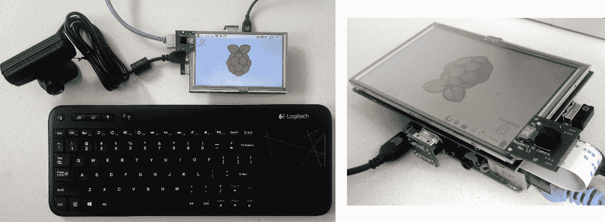

注意黑色 USB 摄像头（位于 LCD 最左侧），Raspberry Pi 摄像头模块（绿色和黑色的板子位于 LCD 的左上角），Raspberry Pi 板（位于 LCD 下方），HDMI 适配器（连接 LCD 和下方的 Raspberry Pi），蓝色以太网线（插入路由器），小型 USB 无线键盘和鼠标适配器，以及微型 USB 电源线（插入**5V 2.5A**电源供应）。

### 配置新的 Raspberry Pi

以下步骤仅适用于 Raspberry Pi（也称为**RPi**），如果您使用的是不同的嵌入式设备或您想要不同的设置类型，请在网络上搜索如何设置您的板子。要设置 RPi 1、2 或 3（包括其变体，如 RPi Zero、RPi2B、3B 等，以及如果您插入 USB 以太网适配器，RPi 1A+），请按照以下步骤操作：

1.  获取一张至少 8 GB 的较新、*高质量的小型 SD 卡*。如果您使用的是廉价的微型 SD 卡或已经多次使用且质量下降的旧微型 SD 卡，它可能不足以可靠地启动 RPi，因此如果您在启动 RPi 时遇到问题，应尝试使用高质量 Class 10 微型 SD 卡（例如 SanDisk Ultra 或更好），这种卡声称至少可以处理 45 MB/s 或可以处理 4K 视频。

1.  下载并将最新的**Raspbian IMG**（不是 NOOBS）烧录到微型 SD 卡上。请注意，*烧录 IMG 与简单地将文件复制到 SD 卡不同*。访问[`www.raspberrypi.org/documentation/installation/installing-images/`](https://www.raspberrypi.org/documentation/installation/installing-images/)，按照您桌面操作系统的说明将 Raspbian 烧录到微型 SD 卡。请注意，您将丢失卡上之前存在的任何文件。

1.  将 USB 键盘、鼠标和 HDMI 显示器插入 RPi，这样您就可以轻松运行一些命令并查看输出。

1.  将 RPi 插入至少 1.5A、理想情况下 2.5A 或更高电压的 5V USB 电源。计算机 USB 端口不够强大。

1.  在启动 Raspbian Linux 时，您应该会看到许多页面文本滚动，然后大约 1 到 2 分钟后应该就绪。

1.  如果启动后只显示一个带有一些文本（如下载了**Raspbian Lite**）的黑屏控制台，您处于纯文本登录提示符。通过输入用户名`pi`并按*Enter*键登录。然后输入密码`raspberry`并再次按*Enter*键。

1.  或者，如果它启动到图形显示，请点击顶部的黑色终端图标以打开 shell（命令提示符）。

1.  在您的 RPi 中初始化一些设置：

+   输入`sudo raspi-config`并按*Enter*键（见以下截图）。

+   首先，运行**扩展文件系统**，然后完成并重新启动您的设备，这样 Raspberry Pi 就可以使用整个微型 SD 卡。

+   如果您使用的是普通（美国）键盘，而不是英国键盘，在国际化选项中，将其更改为通用 104 键键盘，其他，英语（美国），然后对于`AltGr`和类似的问题，只需按*Enter*键，除非您使用的是特殊键盘。

+   在启用摄像头中，启用 RPi 摄像头模块。

+   在超频选项中，设置为 RPi2 或类似型号，以便设备运行更快（但会产生更多热量）。

+   在高级选项中，启用 SSH 服务器。

+   在高级选项中，如果您使用的是 Raspberry Pi 2 或 3，**将内存分割更改为 256MB**，以便 GPU 有足够的 RAM 进行视频处理。对于 Raspberry Pi 1 或 Zero，使用 64MB 或默认值。

+   完成后重启设备。

1.  （可选）删除 Wolfram，以在您的 SD 卡上节省 600MB 的空间：

```py
 sudo apt-get purge -y wolfram-engine

```

可以使用`sudo apt-get install wolfram-engine`重新安装。

要查看 SD 卡上的剩余空间，运行`df -h | head -2`

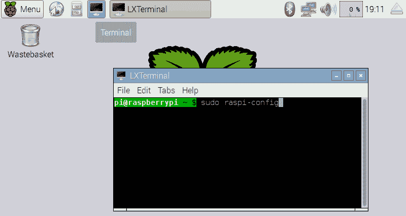

1.  假设您已将 RPi 连接到您的互联网路由器，它应该已经具有互联网访问权限。因此，将您的 RPi 更新到最新的 RPi 固件、软件位置、操作系统和软件。**警告**：许多 Raspberry Pi 教程建议您运行`sudo rpi-update`；然而，近年来运行`rpi-update`已不再是一个好主意，因为它可能会给您带来不稳定的系统或固件。以下说明将更新您的 Raspberry Pi，使其具有稳定的软件和固件（请注意，这些命令可能需要 1 小时左右）：

```py
      sudo apt-get -y update
 sudo apt-get -y upgrade
 sudo apt-get -y dist-upgrade
 sudo reboot

```

1.  查找设备的 IP 地址：

```py
      hostname -I

```

1.  尝试从您的桌面访问设备。

例如，假设设备的 IP 地址是`192.168.2.101`。

在 Linux 桌面上：

```py
      ssh-X pi@192.168.2.101

```

或者在一个 Windows 桌面上：

+   下载、安装并运行 PuTTY

+   然后在 PuTTY 中，连接到 IP 地址（192.168.2.101），

+   使用用户`pi`和密码`raspberry`

1.  （可选）如果您希望您的命令提示符与命令颜色不同，并在每个命令后显示错误值：

```py
      nano ~/.bashrc

```

将此行添加到末尾：

```py
 PS1="[e[0;44m]u@h: w ($?) $[e[0m] "

```

保存文件（按*Ctrl* + *X*，然后按*Y*，然后按*Enter*）。

开始使用新设置：

```py
      source ~/.bashrc

```

1.  要禁用 Raspbian 中的屏幕保护程序/屏幕空白省电功能，以防止在空闲时关闭屏幕：

```py
      sudo nano /etc/lightdm/lightdm.conf

```

+   查找说`#xserver-command=X`的行（通过按*Alt* + *G*跳转到行 87，然后输入`87`并按*Enter*）。

+   更改为：`**xserver-command=X -s 0 dpms**`

+   保存文件（按*Ctrl* + *X*然后按*Y*然后按*Enter*）。

```py
    sudo reboot

```

您现在应该准备好开始在设备上开发了！

### 在嵌入式设备上安装 OpenCV

在基于 Debian 的嵌入式设备（如 Raspberry Pi）上安装 OpenCV 及其所有依赖项有一个非常简单的方法：

```py
    sudo apt-get install libopencv-dev

```

然而，这可能会安装来自 1 或 2 年前的旧版 OpenCV。

要在 Raspberry Pi 这样的嵌入式设备上安装 OpenCV 的最新版本，我们需要从源代码构建 OpenCV。首先，我们安装一个编译器和构建系统，然后安装 OpenCV 所需的库，最后安装 OpenCV 本身。请注意，在 Linux 上从源代码编译 OpenCV 的步骤，无论是为桌面还是为嵌入式编译都是相同的。本书提供了一个名为`install_opencv_from_source.sh`的 Linux 脚本；建议您将文件复制到 Raspberry Pi 上（例如，使用 USB 闪存驱动器）并运行脚本以下载、构建和安装 OpenCV，包括潜在的 CPU 多核和**ARM NEON SIMD**优化（取决于硬件支持）：

```py
    chmod +x install_opencv_from_source.sh
./install_opencv_from_source.sh

```

如果有任何错误，脚本将停止；例如，如果您没有互联网访问，或者依赖包与您已经安装的其他东西冲突。如果脚本因错误而停止，请尝试使用网络上的信息来解决该错误，然后再次运行脚本。脚本将快速检查所有之前的步骤，然后从上次停止的地方继续。请注意，根据您的硬件和软件，这可能需要 20 分钟到 12 小时不等！

高度推荐每次安装 OpenCV 后都构建和运行几个 OpenCV 示例，这样当您构建自己的代码时遇到问题时，至少您会知道问题是不是 OpenCV 安装的问题，或者是不是代码本身的问题。

让我们尝试构建简单的*edge*示例程序。如果我们尝试使用相同的 Linux 命令从 OpenCV 2 构建它，我们会得到一个构建错误：

```py
cd ~/opencv-3.*/samples/cpp
g++ edge.cpp -lopencv_core -lopencv_imgproc -lopencv_highgui 
-o edge
/usr/bin/ld: /tmp/ccDqLWSz.o: undefined reference to symbol '_ZN2cv6imreadERKNS_6StringEi'
/usr/local/lib/libopencv_imgcodecs.so.3.1: error adding symbols: DSO missing from command line
collect2: error: ld returned 1 exit status

```

那个错误信息的倒数第二行告诉我们命令行中缺少了一个库，所以我们只需要在链接到其他 OpenCV 库的命令旁边添加`-lopencv_imgcodecs`。现在您知道如何修复在编译 OpenCV 3 程序时遇到该错误信息的问题。所以让我们正确地做：

```py
cd ~/opencv-3.*/samples/cpp
g++ edge.cpp -lopencv_core -lopencv_imgproc -lopencv_highgui 
-lopencv_imgcodecs -o edge

```

成功了！所以现在您可以运行程序：

```py
    ./edge

```

在键盘上按*Ctrl* + *C*来退出程序。请注意，如果尝试在 SSH 终端中运行命令而没有将窗口重定向到设备的 LCD 屏幕上，*edge*程序可能会崩溃。所以如果您使用 SSH 远程运行程序，请在命令前添加*DISPLAY=:0*：

```py
    DISPLAY=:0 ./edge

```

您还应该将 USB 摄像头插入设备并测试它是否工作：

```py
g++ starter_video.cpp -lopencv_core -lopencv_imgproc
-lopencv_highgui -lopencv_imgcodecs -lopencv_videoio \
-o starter_video
DISPLAY=:0 ./starter_video 0

```

注意：如果您没有 USB 摄像头，可以使用视频文件进行测试：

```py
    DISPLAY=:0 ./starter_video ../data/768x576.avi

```

现在 OpenCV 已成功安装在您的设备上，您可以运行我们之前开发的 Cartoonifier 应用程序。将`Cartoonifier`文件夹复制到设备上（例如，使用 USB 闪存驱动器或使用`scp`通过网络复制文件）。然后像为桌面一样构建代码：

```py
cd ~/Cartoonifier
export OpenCV_DIR="~/opencv-3.1.0/build"
mkdir build
cd build
cmake -D OpenCV_DIR=$OpenCV_DIR ..
make

```

然后运行它：

```py
DISPLAY=:0 ./Cartoonifier

```

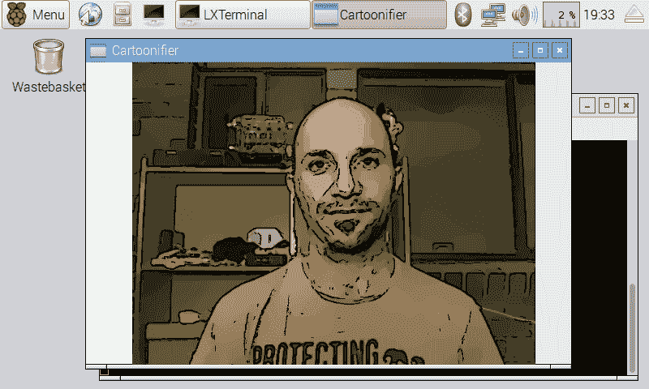

### 使用 Raspberry Pi 摄像头模块

在 Raspberry Pi 上使用 USB 摄像头可以方便地支持在桌面和嵌入式设备上具有相同的行为和代码，但你可能考虑使用官方的 Raspberry Pi 摄像头模块（简称**RPi Cams**）。它们与 USB 摄像头相比，有一些优缺点。

RPi 摄像头使用特殊的 MIPI CSI 摄像头格式，专为智能手机摄像头设计，以减少功耗。与 USB 相比，它们具有更小的物理尺寸、更快的带宽、更高的分辨率、更高的帧率和更低的延迟。大多数 USB 2.0 摄像头只能提供 640x480 或 1280x720 30 FPS 的视频，因为 USB 2.0 对于任何更高的速度都太慢（除非是一些昂贵的 USB 摄像头，它们在板上进行视频压缩），而 USB 3.0 仍然太贵。而智能手机摄像头（包括 RPi 摄像头）通常可以提供 1920x1080 30 FPS 或甚至超高清/4K 分辨率。实际上，RPi Cam v1 可以在$5 的 Raspberry Pi Zero 上提供高达 2592x1944 15 FPS 或 1920x1080 30 FPS 的视频，这得益于使用了 MIPI CSI 摄像头和 Raspberry Pi 内部兼容的视频处理 ISP 和 GPU 硬件。RPi 摄像头还支持在 90 FPS 模式下使用 640x480（例如用于慢动作捕捉），这对于实时计算机视觉非常有用，因为你可以看到每一帧中的非常小的运动，而不是难以分析的大运动。

然而，RPi 摄像头是一个简单的电路板，对电气干扰、静电或物理损伤非常敏感（只需用手指轻轻触摸那根小橙色的扁平电缆，就可能导致视频干扰，甚至永久损坏你的摄像头！）大扁平白色电缆的敏感性较低，但它对电气噪声或物理损伤仍然非常敏感。RPi 摄像头附带一根非常短的 15 厘米电缆。你可以在 eBay 上购买第三方电缆，长度在 5 厘米到 1 米之间，但 50 厘米或更长的电缆可靠性较低，而 USB 摄像头可以使用 2 米到 5 米的电缆，并且可以插入 USB 集线器或主动延长线以实现更长的距离。

目前有几种不同的 RPi Cam 型号，特别是没有内部红外滤光片的 NoIR 版本；因此，NoIR 相机可以轻易地在黑暗中看到（如果你有一个不可见红外光源），或者比包含内部红外滤光片的普通相机更清晰地看到红外激光或信号。RPi Cam 也有两种不同的版本：RPi Cam v1.3 和 RPi Cam v2.1，其中 v2.1 使用更宽的视角镜头和索尼 8 百万像素传感器，而不是 5 百万像素的**OmniVision**传感器，并且在低光照条件下有更好的运动支持，并增加了 3240x2464 视频在 15 FPS 的支持，以及可能在 720p 下高达 120 FPS 的视频。然而，USB 网络摄像头有数千种不同的形状和版本，这使得找到专门的网络摄像头（如防水或工业级网络摄像头）变得容易，而不是需要你为 RPi Cam 创建自己的定制外壳。

IP 相机也是另一个可以选择的相机接口，它可以允许使用 Raspberry Pi 进行 1080p 或更高分辨率的视频，并且 IP 相机不仅支持非常长的电缆，而且有可能通过互联网在世界上的任何地方工作。但是，与 USB 网络摄像头或 RPi Cam 相比，IP 相机与 OpenCV 的接口并不那么简单。

在过去，RPi Cams 和官方驱动程序与 OpenCV 不直接兼容；你通常需要使用自定义驱动程序并修改你的代码，以便从 RPi Cams 捕获帧，但现在你可以以与 USB 网络摄像头完全相同的方式在 OpenCV 中访问 RPi Cam！多亏了 v4l2 驱动程序的最近改进，一旦加载了 v4l2 驱动程序，RPi Cam 将像普通 USB 网络摄像头一样出现在`/dev/video0`或`/dev/video1`文件中。因此，传统的 OpenCV 网络摄像头代码，如`cv::VideoCapture(0)`，将能够像网络摄像头一样使用它。

#### 安装 Raspberry Pi Camera Module 驱动程序

首先，让我们暂时加载 RPi Cam 的 v4l2 驱动程序，以确保我们的相机已经正确连接：

```py
    sudo modprobe bcm2835-v4l2

```

如果命令失败（如果它在控制台打印了错误消息，或者它冻结了，或者命令返回了除了 0 以外的数字），那么可能你的相机没有正确连接。关闭并从你的 RPi 上拔掉电源，然后再次尝试连接扁平的白色电缆，查看网络上的照片以确保它以正确的方式连接。如果是以正确的方式连接的，那么可能在你关闭 RPi 上的锁定标签之前，电缆没有完全插入。还要检查你是否在之前配置 Raspberry Pi 时忘记了点击启用相机，使用`sudoraspi-config`命令。

如果命令成功（如果命令返回了 0 并且没有错误打印到控制台），那么我们可以通过将其添加到`/etc/modules`文件的底部，确保 RPi Cam 的 v4l2 驱动程序在启动时始终加载：

```py
sudo nano /etc/modules
# Load the Raspberry Pi Camera Module v4l2 driver on bootup:
bcm2835-v4l2

```

保存文件并重启你的 RPi 后，你应该能够运行`ls /dev/video*`来查看你的 RPi 上可用的摄像头列表。如果 RPi 摄像头是你板上唯一连接的摄像头，你应该看到它是默认摄像头（`/dev/video0`），或者如果你还连接了一个 USB 摄像头，它将是`/dev/video0`或`/dev/video1`。

让我们使用我们之前编译的`starter_video`示例程序来测试 RPi 摄像头：

```py
    cd ~/opencv-3.*/samples/cpp
DISPLAY=:0 ./starter_video 0

```

如果显示错误的摄像头，尝试`DISPLAY=:0 ./starter_video 1`。

现在我们知道 RPi 摄像头在 OpenCV 中工作正常，让我们尝试运行卡通化器：

```py
    cd ~/Cartoonifier
DISPLAY=:0 ./Cartoonifier 0

```

或者`DISPLAY=:0 ./Cartoonifier 1`用于其他摄像头。

### 使卡通化器全屏运行

在嵌入式系统中，你通常希望你的应用程序全屏显示，并隐藏 Linux GUI 和菜单。OpenCV 提供了一个简单的方法来设置全屏窗口属性，但请确保你使用`NORMAL`标志创建了窗口：

```py
// Create a fullscreen GUI window for display on the screen.
namedWindow(windowName, WINDOW_NORMAL);
setWindowProperty(windowName, WND_PROP_FULLSCREEN,
CV_WINDOW_FULLSCREEN);

```

### 隐藏鼠标光标

你可能会注意到，即使你不想在嵌入式系统中使用鼠标，鼠标光标仍然显示在你的窗口上方。要隐藏鼠标光标，你可以使用`xdotool`命令将其移动到右下角像素，这样它就不那么显眼了，但如果你偶尔需要将鼠标插入进行设备调试，它仍然可用。安装`xdotool`并创建一个简短的 Linux 脚本来与卡通化器一起运行：

```py
sudo apt-get install -y xdotool
cd ~/Cartoonifier/build
nano runCartoonifier.sh
#!/bin/sh
# Move the mouse cursor to the screen's bottom-right pixel.
xdotoolmousemove 3000 3000
# Run Cartoonifier with any arguments given.
/home/pi/Cartoonifier/build/Cartoonifier "$@"

```

最后，使你的脚本可执行：

```py
chmod +x runCartoonifier.sh

```

尝试运行你的脚本，以确保它工作：

```py
DISPLAY=:0 ./runCartoonifier.sh

```

### 启动后自动运行卡通化器

通常在构建嵌入式设备时，你希望设备启动后自动执行你的应用程序，而不是要求用户手动运行。为了在设备完全启动并登录到图形桌面后自动运行我们的应用程序，创建一个包含特定内容的`autostart`文件夹，其中包含脚本或应用程序的完整路径：

```py
    mkdir ~/.config/autostart
nano ~/.config/autostart/Cartoonifier.desktop
 [Desktop Entry]
 Type=Application
 Exec=/home/pi/Cartoonifier/build/runCartoonifier.sh
 X-GNOME-Autostart-enabled=true

```

现在，无论何时你开启设备或重启它，卡通化器都将开始运行！

### 桌面与嵌入式系统上卡通化器的速度比较

你会注意到代码在 Raspberry Pi 上的运行速度比在桌面上的运行速度慢得多！到目前为止，让它运行得更快的最简单两种方法是用更快的设备或使用更小的摄像头分辨率。以下表格显示了桌面、RPi 1、RPi 2、RPi 3 和 Jetson TK1 上卡通化器的*草图*和*绘画*模式的某些帧率，**每秒帧数**（**FPS**）。请注意，这些速度没有进行任何自定义优化，并且只在单个 CPU 核心上运行，时间包括将图像渲染到屏幕上的时间。所使用的 USB 摄像头是运行在 640x480 的快速 PS3 Eye 摄像头，因为它是目前市场上速度最快且价格低廉的摄像头。

值得注意的是，Cartoonifier 只使用单个 CPU 核心，但列出的所有设备都有四个 CPU 核心，除了 RPi 1 只有一个核心，许多 x86 计算机有超线程技术，可以提供大约八个 CPU 核心。所以如果你编写的代码能够高效地利用多个 CPU 核心（或 GPU），速度可能会比单线程的数值快 1.5 到 3 倍：

| **Computer** | **Sketch mode** | **Paint mode** |
| --- | --- | --- |
| Intel Core i7 PC | 20 FPS | 2.7 FPS |
| Jetson TK1ARM CPU | 16 FPS | 2.3 FPS |
| Raspberry Pi 3 | 4.3 FPS | 0.32 FPS (3 seconds/frame) |
| Raspberry Pi 2 | 3.2 FPS | 0.28 FPS (4 seconds/frame) |
| Raspberry Pi Zero | 2.5 FPS | 0.21 FPS (5 seconds/frame) |
| Raspberry Pi 1 | 1.9 FPS | 0.12 FPS (8 seconds/frame) |

注意到 Raspberry Pi 在运行代码时非常慢，尤其是*Paint*模式，因此我们将尝试简单地更改相机和相机的分辨率。

#### 更改相机和相机分辨率

以下表格显示了在 Raspberry Pi 2 上使用不同类型的相机和不同相机分辨率时*Sketch*模式的速度对比：

| **Hardware** | **640x480 resolution** | **320x240 resolution** |
| --- | --- | --- |
| RPi 2 with RPi Cam | 3.8 FPS | 12.9 FPS |
| RPi 2 with PS3 Eye webcam | 3.2 FPS | 11.7 FPS |
| RPi 2 with unbranded webcam | 1.8 FPS | 7.4 FPS |

如您所见，当使用 RPi Cam 在 320x240 分辨率下时，似乎我们已经有一个足够好的解决方案来享受一些乐趣，即使它不在我们更希望的 20-30 FPS 范围内。

### 在台式机和嵌入式系统上运行 Cartoonifier 的功耗对比

我们已经看到，各种嵌入式设备比台式机慢，从 RPi 1 大约比台式机慢 20 倍，到 Jetson TK1 大约比台式机慢 1.5 倍。但对于某些任务来说，如果这意味着电池消耗也会显著降低，允许使用小电池或降低服务器全年电费成本，低速度是可以接受的。

Raspberry Pi 即使对于相同的处理器也有不同的型号，例如 Raspberry Pi 1B、Zero 和 1A+，它们的运行速度相似，但功耗差异很大。MIPI CSI 相机，如 RPi Cam，也比网络摄像头耗电少。以下表格显示了运行相同 Cartoonifier 代码的不同硬件所消耗的电能。Raspberry Pi 的功耗测量方法如下所示的照片，使用简单的 USB 电流监控器（例如，J7-T Safety Tester--[h t t p ://b i t . l y /2aS Z a 6H](http://bit.ly/2aSZa6H)--售价 5 美元），以及一个 DMM 万用表来测量其他设备：

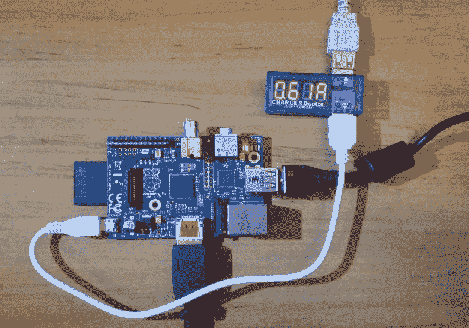

**Idle Power**测量的是计算机运行但未使用任何主要应用程序时的功耗，而**Cartoonifier Power**测量的是 Cartoonifier 运行时的功耗。**效率**是指 640x480 *Sketch*模式下 Cartoonifier Power 与 Cartoonifier Speed 的比值。

| **Hardware** | **Idle Power** | **Cartoonifier Power** | **Efficiency** |
| --- | --- | --- | --- |
| RPi Zero 与 PS3 Eye | 1.2 瓦 | 1.8 瓦 | 1.4 帧每瓦 |
| RPi 1A+与 PS3 Eye | **1.1 瓦** | **1.5 瓦** | 1.1 帧每瓦 |
| RPi 1B 与 PS3 Eye | 2.4 瓦 | 3.2 瓦 | 0.5 帧每瓦 |
| RPi 2B 与 PS3 Eye | 1.8 瓦 | 2.2 瓦 | 1.4 帧每瓦 |
| RPi 3B 与 PS3 Eye | 2.0 瓦 | 2.5 瓦 | 1.7 帧每瓦 |
| Jetson TK1 与 PS3 Eye | 2.8 瓦 | 4.3 瓦 | **3.7 帧每瓦** |
| 配备 PS3 Eye 的 Core i7 笔记本电脑 | 14.0 瓦 | 39.0 瓦 | 0.5 帧每瓦 |

我们可以看到 RPi 1A+使用的功率最少，但最节能的选项是 Jetson TK1 和 Raspberry Pi 3B。有趣的是，原始的 Raspberry Pi（RPi1B）的效率与 x86 笔记本电脑大致相同。所有后续的 Raspberry Pi 都比原始的（RPi 1B）节能得多。

**免责声明**：作者曾是 NVIDIA 的前员工，该公司生产了 Jetson TK1，但相信结果和结论是真实的。

让我们也看看与 Raspberry Pi 兼容的不同摄像头的功耗：

| **硬件** | **空闲功耗** | **卡通化器功耗** | **效率** |
| --- | --- | --- | --- |
| RPi Zero 与 PS3 Eye | 1.2 瓦 | 1.8 瓦 | 1.4 帧每瓦 |
| RPi Zero 与 RPi Cam v1.3 | 0.6 瓦 | 1.5 瓦 | 2.1 帧每瓦 |
| RPi Zero 与 RPi Cam v2.1 | **0.55 瓦** | **1.3 瓦** | **2.4 帧每瓦** |

我们可以看到 RPi Cam v2.1 比 RPi Cam v1.3 略节能，但比 USB 摄像头节能得多。

#### 从 Raspberry Pi 向高性能计算机传输视频流

感谢所有现代 ARM 设备（包括 Raspberry Pi）中的硬件加速视频编码器，这些设备可以作为在嵌入式设备上执行计算机视觉的有效替代方案，即使用该设备仅捕获视频，并通过网络实时传输到 PC 或服务器机架。所有 Raspberry Pi 型号都包含相同的视频编码器硬件，因此带有 Pi Cam 的 RPi 1A+或 RPi Zero 是一个很好的低成本、低功耗便携式视频流媒体服务器选项。Raspberry Pi 3 增加了 Wi-Fi，以提供额外的便携式功能。

有多种方法可以从 Raspberry Pi 传输实时摄像头视频，例如使用官方的 RPi V4L2 摄像头驱动程序，使 RPi Cam 看起来像是一个网络摄像头，然后使用 Gstreamer、liveMedia、netcat 或 VLC 在网络中传输视频。然而，这些方法通常引入 1 到 2 秒的延迟，并且通常需要自定义 OpenCV 客户端代码或学习如何高效地使用 Gstreamer。因此，以下部分将展示如何使用名为**UV4L**的替代摄像头驱动程序同时执行摄像头捕获和网络流：

1.  按照以下链接在 Raspberry Pi 上安装 UV4L：[`www.linux-projects.org/uv4l/installation/`](http://www.linux-projects.org/uv4l/installation/):

```py
 curl http://www.linux-projects.org/listing/uv4l_repo/lrkey.asc sudo apt-key add -
 sudo su
 echo "# UV4L camera streaming repo:">> /etc/apt/sources.list
 echo "deb http://www.linux-   
        projects.org/listing/uv4l_repo/raspbian/jessie main">> 
        /etc/apt/sources.list
 exit
 sudo apt-get update
 sudo apt-get install uv4l uv4l-raspicam uv4l-server

```

1.  手动运行 UV4L 流媒体服务器（在 RPi 上）以检查其是否工作：

```py
      sudo killall uv4l
sudo LD_PRELOAD=/usr/lib/uv4l/uv4lext/armv6l/libuv4lext.so 
uv4l -v7 -f --sched-rr --mem-lock --auto-video_nr
--driverraspicam --encoding mjpeg
--width 640 --height 480 --framerate15

```

1.  从您的桌面测试摄像头的网络流：

+   安装 VLC 媒体播放器。

+   文件 | 打开网络流 | 访问[h t t p ://192\. 168\. 2\. 111:8080/s t r e a m /v i d e o . m j p e g](http://192.168.2.111:8080/stream/video.mjpeg)。

+   将 URL 调整为您的树莓派的 IP 地址。在 RPi 上运行`hostname -I`以找到其 IP 地址。

1.  现在让 UV4L 服务器在启动时自动运行：

```py
      sudo apt-get install uv4l-raspicam-extras

```

1.  在`uv4l-raspicam.conf`中编辑您想要的任何 UV4L 服务器设置，例如分辨率和帧率：

```py
      sudo nano /etc/uv4l/uv4l-raspicam.conf
 drop-bad-frames = yes 
 nopreview = yes
 width = 640
 height = 480
 framerate = 24
 sudo reboot

```

1.  现在我们可以告诉 OpenCV 将其作为网络流使用，就像它是网络摄像头一样。只要您的 OpenCV 安装可以内部使用 FFMPEG，OpenCV 就能像网络摄像头一样从 MJPEG 网络流中抓取帧：

```py
      ./Cartoonifier http://192.168.2.101:8080/stream/video.mjpeg

```

您的树莓派现在正在使用 UV4L 将 640x480 分辨率的 24 FPS 实时视频流传输到运行在*Sketch*模式的 Cartoonifier 的 PC 上，大约达到 19 FPS（延迟 0.4 秒）。注意，这几乎与直接在 PC 上使用 PS3 Eye 网络摄像头（20 FPS）的速度相同！

注意，当您将视频流到 OpenCV 时，它将无法设置摄像头分辨率；您需要调整 UV4L 服务器设置以更改摄像头分辨率。另外请注意，我们本可以流式传输 H.264 视频，它使用较低的带宽，但某些计算机视觉算法处理不了 H.264 这样的视频压缩，所以 MJPEG 比 H.264 引起的问题要少。

如果您已安装了官方的 RPi V4L2 驱动程序和 UV4L 驱动程序，它们都将作为摄像头 0 和 1（设备`/dev/video0`和`/dev/video1`）可用，但您一次只能使用一个摄像头驱动程序。

### 定制您的嵌入式系统！

现在您已经创建了一个完整的嵌入式 Cartoonifier 系统，并且您知道它的工作原理以及各个部分的作用，您应该对其进行定制！使视频全屏，更改 GUI，或更改应用程序的行为和工作流程，或更改 Cartoonifier 的过滤器常数，或皮肤检测算法，或用您自己的项目想法替换 Cartoonifier 代码。或者将视频流到云端进行处理！

您可以通过多种方式改进皮肤检测算法，例如使用更复杂的皮肤检测算法（例如，使用来自许多最近 CVPR 或 ICCV 会议论文的经过训练的高斯模型[`www.cvpapers.com`](http://www.cvpapers.com/)），或者向皮肤检测器添加人脸检测（参见第六章的*Face detection*部分，*Face Recognition using Eigenfaces and Fisherfaces*），以便检测用户的面部位置，而不是要求用户将面部置于屏幕中央。请注意，在某些设备或高分辨率摄像头上进行人脸检测可能需要几秒钟，因此它们在当前的实时应用中可能受到限制。但是，嵌入式系统平台每年都在变快，所以这可能会随着时间的推移而变得不那么成问题。

加速嵌入式计算机视觉应用最显著的方法是尽可能降低相机分辨率（例如，0.5 百万像素而不是 5 百万像素），尽可能少地分配和释放图像，尽可能少地进行图像格式转换。在某些情况下，可能存在一些优化的图像处理或数学库，或者来自您设备 CPU 供应商的 OpenCV 优化版本（例如，Broadcom、NVIDIA Tegra、Texas Instruments OMAP、Samsung Exynos），或者针对您的 CPU 系列（例如，ARM Cortex-A9）。

为了使定制嵌入式和桌面图像处理代码更容易，这本书附带`ImageUtils.cpp`和`ImageUtils.h`文件，以帮助您进行实验。它们包括`printMatInfo()`等函数，该函数会打印有关`cv::Mat`对象的大量信息，使调试 OpenCV 变得更容易。还有计时宏，可以轻松地将详细的计时统计信息添加到您的 C/C++代码中。例如：

```py
    DECLARE_TIMING(myFilter); 

    void myImageFunction(Mat img) { 
      printMatInfo(img, "input"); 

      START_TIMING(myFilter); 
      bilateralFilter(img, ...); 
      STOP_TIMING(myFilter); 
      SHOW_TIMING(myFilter, "My Filter"); 
    }

```

您将在控制台看到如下类似的内容：

```py
    input: 800w600h 3ch 8bpp, range[19,255][17,243][47,251] 
    My Filter: time: 213ms (ave=215ms min=197ms max=312ms, across 57 runs).

```

这在您的 OpenCV 代码未按预期工作时很有用，尤其是在嵌入式开发中，通常很难使用 IDE 调试器。

# 摘要

本章展示了多种不同类型的图像处理滤镜，可用于生成各种卡通效果，从类似铅笔素描的普通草图模式，到类似彩色绘画的绘画模式，再到在绘画模式之上叠加*草图*模式以呈现卡通效果。它还展示了可以获得其他有趣的效果，例如大大增强噪边界的邪恶模式，以及将人脸皮肤变为明亮的绿色的外星人模式。

有许多商业智能手机应用程序可以对用户的脸部执行类似有趣的特效，例如卡通滤镜和肤色改变器。还有使用类似概念的专业工具，例如皮肤平滑视频后期处理工具，它试图通过平滑皮肤来美化女性的脸部，同时保持边缘和非皮肤区域的清晰，以便使她们的脸看起来更年轻。

本章展示了如何通过遵循首先开发一个可工作的桌面版本的建议指南，然后将应用程序移植到嵌入式系统，并创建一个适合嵌入式应用程序的用户界面。图像处理代码在这两个项目之间共享，以便读者可以修改桌面应用程序的卡通滤镜，并轻松地在嵌入式系统中看到这些修改。

请记住，这本书包括 Linux 的 OpenCV 安装脚本以及所有讨论项目的完整源代码。
