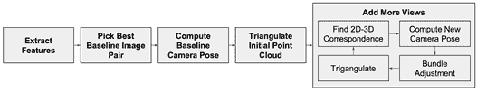
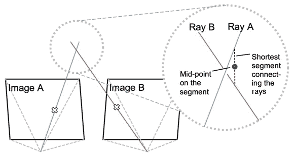
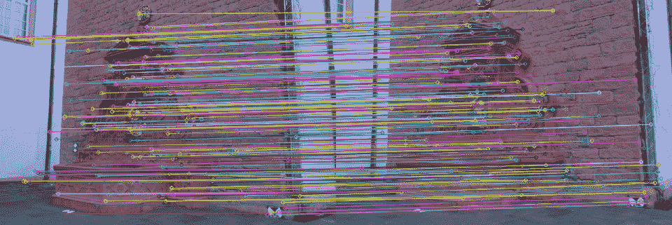
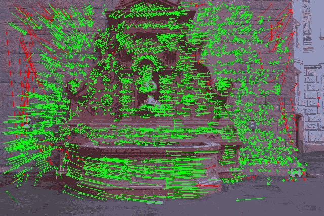
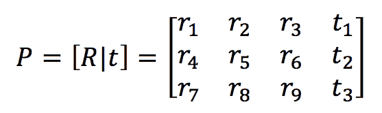
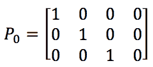
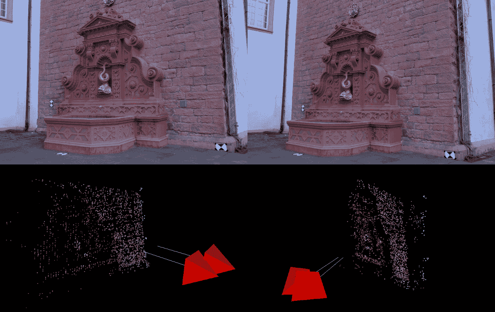
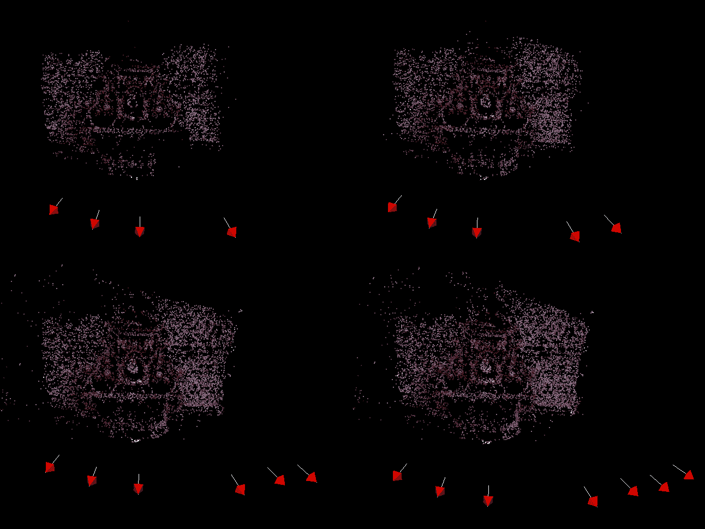
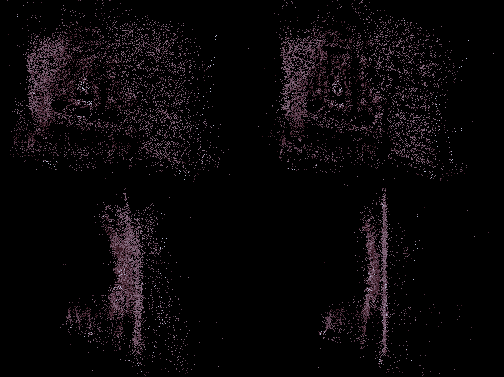

# 使用 OpenCV 探索运动结构

在本章中，我们将讨论**运动结构**（**SfM**）的概念，或者更确切地说，使用 OpenCV 的 API 帮助我们从相机运动中提取几何结构。首先，让我们将使用单相机（通常称为**单目**方法）和离散且稀疏的帧集而不是连续视频流来约束 SfM 的非常宽泛的方法。这两个约束将极大地简化我们在接下来的页面中将要绘制的系统，并帮助我们理解任何 SfM 方法的基本原理。为了实现我们的方法，我们将遵循 Hartley 和 Zisserman（以下简称 H&Z）的步伐，正如他们在其开创性著作《计算机视觉中的多视图几何》的第九章至第十二章中所记录的。

在本章中，我们将涵盖以下内容：

+   运动结构概念

+   从一对图像中估计相机运动

+   重建场景

+   从多个视角重建

+   优化重建

在本章中，我们假设使用的是校准过的相机，即事先已经校准过的相机。*校准*是计算机视觉中的一个普遍操作，在 OpenCV 中通过命令行工具完全支持，并在前几章中进行了讨论。因此，我们假设存在相机内参参数，这些参数体现在 K 矩阵和畸变系数向量中——这是校准过程的输出。

为了在语言上明确，从现在开始，我们将把相机称为场景的单个视图，而不是成像的光学和硬件。相机在空间中有一个 3D 位置（平移）和一个 3D 观察方向（方向）。通常，我们将其描述为具有 6 个**自由度**（**DOF**）的相机姿态，有时也称为**外参数**。因此，在两个相机之间，存在一个 3D 平移元素（空间中的移动）和一个观察方向的 3D 旋转。

我们还将统一场景中的点、世界、真实或 3D 的术语，它们都是指存在于我们真实世界中的点。同样，图像中的点或 2D 点也是指图像坐标中的点，这些点是在该位置和时间被投影到相机传感器上的某个真实 3D 点的图像坐标。

在本章的代码部分，您将注意到对*计算机视觉中的多视图几何*的引用，例如`// HZ 9.12`。这指的是该书的第九章的第 12 个方程。此外，文本将包括代码摘录；而完整的可运行代码包含在随书附带的材料中。

下面的流程图描述了我们将要实现的 SfM 流程中的过程。我们首先通过在图像集中匹配的二维特征和两个摄像头的位姿计算，对场景的初始重建点云进行三角测量。然后，我们通过将更多点匹配到正在形成的点云中，计算摄像头位姿并对它们的匹配点进行三角测量，来添加更多视图到重建中。在此之间，我们还将执行捆绑调整以最小化重建中的误差。所有步骤都在本章的下一节中详细说明，包括相关的代码片段、指向有用的 OpenCV 函数的指针和数学推理：



# 运动结构概念

我们首先应该区分的是立体（或实际上任何多视图）与使用校准设备和运动结构（SfM）进行的三维重建之间的区别。由两个或更多摄像头组成的设备假设我们已经知道了摄像头之间的*运动*，而在 SfM 中，我们并不知道这种运动是什么，我们希望找到它。从简单观点来看，校准设备允许更精确地重建三维几何形状，因为没有误差在估计摄像头之间的距离和旋转，这些信息已经已知。实现 SfM 系统的第一步是找到摄像头之间的运动。OpenCV 可以通过多种方式帮助我们获得这种运动，特别是使用`findFundamentalMat`和`findEssentialMat`函数。

让我们思考一下选择 SfM 算法背后的目标。在大多数情况下，我们希望获得场景的几何形状，例如，物体相对于摄像头的位置以及它们的形状。在找到描绘相同场景、从合理相似的角度拍摄的两个摄像头之间的运动后，我们现在希望重建几何形状。在计算机视觉术语中，这被称为**三角测量**，并且有众多方法可以实现。这可能通过射线交点来完成，其中我们构建两条射线——一条来自每个摄像头的投影中心，以及每个图像平面上的一点。这些射线在空间中的交点理想情况下将交于一个 3D 点，该点在每个摄像头中成像，如图所示：



在现实中，射线交点非常不可靠；H&Z 建议不要使用它。这是因为射线通常不会相交，这使我们不得不退回到使用连接两条射线的最短线段的中点。OpenCV 包含一个用于更精确形式三角测量的简单 API——`triangulatePoints`函数，因此我们不需要自己编写这部分代码。

在你学习了如何从两个视图中恢复 3D 几何形状之后，我们将看到如何将同一场景的更多视图纳入以获得更丰富的重建。在那个阶段，大多数 SfM 方法试图通过在 *重建细化* 部分中通过 **捆绑调整** 来优化我们相机的估计位置和 3D 点的集合。OpenCV 在其新的图像拼接工具箱中包含了捆绑调整的手段。然而，与 OpenCV 和 C++ 一起工作的美妙之处在于，有大量的外部工具可以轻松集成到流程中。因此，我们将看到如何集成外部捆绑调整器，即 Ceres 非线性优化包。

现在我们已经概述了使用 OpenCV 进行 SfM 的方法，我们将看到每个元素是如何实现的。

# 从一对图像中估计相机运动

在我们着手实际找到两个相机之间的运动之前，让我们检查一下我们执行此操作时拥有的输入和工具。首先，我们有来自（希望不是极端的）不同空间位置的同一场景的两个图像。这是一个强大的资产，我们将确保我们使用它。至于工具，我们应该看看那些对图像、相机和场景施加约束的数学对象。

两个非常有用的数学对象是基本矩阵（用 `F` 表示）和基本矩阵（用 `E` 表示），它们对场景的两个图像中的对应 2D 点施加约束。它们大部分是相似的，除了基本矩阵假设使用校准过的相机；对我们来说就是这样，所以我们将选择它。OpenCV 允许我们通过 `findFundamentalMat` 函数找到基本矩阵，通过 `findEssentialMatrix` 函数找到基本矩阵。找到基本矩阵的方法如下：

```py
    Mat E = findEssentialMat(leftPoints, rightPoints, focal, pp);

```

此函数利用左侧图像中的匹配点 `leftPoints` 和右侧图像中的匹配点 `rightPoints`（我们将在稍后讨论），以及来自相机校准的额外两条信息：焦距 `focal` 和主点 `pp`。

基本矩阵 \( E \) 是一个 3x3 的大矩阵，它对一个图像中的点 \( x \) 和对应图像中的点 \( x' \) 施加以下约束：

\( x'K^TEKx = 0 \)

这里，\( K \) 是校准矩阵。

这非常实用，正如我们即将看到的。我们使用的另一个重要事实是，基本矩阵是我们从图像中恢复两个相机位置所需的所有内容，尽管仅限于任意单位尺度。因此，如果我们获得了基本矩阵，我们就知道每个相机在空间中的位置以及它所朝向的方向。如果我们有足够的约束方程，我们可以轻松地计算出这个矩阵，因为每个方程都可以用来求解矩阵的一部分。实际上，OpenCV 内部仅使用五个点对来计算它，但通过**随机样本一致性算法（RANSAC**），可以使用更多的点对，这提供了更鲁棒的解决方案。

# 使用丰富特征描述符的点匹配

现在，我们将利用我们的约束方程来计算基本矩阵。为了获取我们的约束，请记住，对于图像 A 中的每个点，我们必须在图像 B 中找到一个相应的点。我们可以使用 OpenCV 广泛的 2D 特征匹配框架来实现这种匹配，该框架在过去几年中已经得到了很大的发展。

特征提取和描述符匹配是计算机视觉中的基本过程，并被用于许多方法来执行各种操作，例如，检测图像中物体的位置和方向，或者通过给定的查询在大型图像数据库中搜索相似图像。本质上，*特征提取*意味着在图像中选择将构成良好特征的点，并为它们计算描述符。*描述符*是一个描述图像中特征点周围环境的数字向量。不同的方法有不同的描述符向量的长度和数据类型。**描述符匹配**是使用其描述符在另一集中找到对应特征的过程。OpenCV 提供了非常简单且强大的方法来支持特征提取和匹配。

让我们考察一个非常简单的特征提取和匹配方案：

```py
    vector<KeyPoint> keypts1, keypts2; 
    Mat desc1, desc2; 

    // detect keypoints and extractORBdescriptors 
    Ptr<Feature2D>orb = ORB::create(2000); 
    orb->detectAndCompute(img1, noArray(), keypts1, desc1); 
    orb->detectAndCompute(img2, noArray(), keypts2, desc2); 

    // matching descriptors 
    Ptr<DescriptorMatcher>matcher 
    =DescriptorMatcher::create("BruteForce-Hamming"); 
    vector<DMatch> matches; 
    matcher->match(desc1, desc2, matches);

```

你可能已经看到了类似的 OpenCV 代码，但让我们快速回顾一下。我们的目标是获得三个元素：两张图像的特征点、它们的描述符以及这两组特征之间的匹配。OpenCV 提供了一系列特征检测器、描述符提取器和匹配器。在这个简单的例子中，我们使用 ORB 类来获取**Oriented BRIEF (ORB**)（其中，**BRIEF**代表**二进制鲁棒独立基本特征**)特征点的 2D 位置以及它们各自的描述符。ORB 可能比传统的 2D 特征（如**加速鲁棒特征（SURF**）或**尺度不变特征变换（SIFT**）更受欢迎，因为它不受知识产权的约束，并且已被证明在检测、计算和匹配方面更快。

我们使用一个*暴力*二进制匹配器来获取匹配，它简单地通过比较第一组中的每个特征与第二组中的每个特征来匹配两个特征集（因此称为*暴力*）。

在以下图像中，我们将看到来自 Fountain P11 序列的两张图像上的特征点匹配可以在[`cvlab.epfl.ch/~strecha/multiview/denseMVS.html`](http://cvlab.epfl.ch/~strecha/multiview/denseMVS.html)找到：



实际上，我们刚才进行的原始匹配只适用于一定水平，并且许多匹配可能是错误的。因此，大多数 SfM 方法都会对匹配进行某种形式的过滤，以确保正确性并减少错误。一种内置在 OpenCV 暴力匹配器中的过滤形式是**交叉检查过滤**。也就是说，如果一个图像的特征与另一个图像的特征匹配，并且反向检查也匹配第二个图像的特征与第一个图像的特征，那么这个匹配被认为是真实的。另一种常见的过滤机制，在提供的代码中使用，是基于两个图像是同一场景并且它们之间存在某种立体视觉关系的实际情况。在实践中，过滤器试图稳健地计算基础矩阵或本质矩阵，我们将在*寻找相机矩阵*部分学习到这些内容，并保留与这种计算有微小误差的特征对。

使用如 ORB 等丰富特征的一种替代方法是使用**光流**。以下信息框提供了一个关于光流的简要概述。可以使用光流代替描述符匹配来在两张图像之间找到所需的关键点匹配，而 SfM 管道的其他部分保持不变。OpenCV 最近扩展了其 API，可以从两张图像中获取光流场，现在它更快、更强大。

**光流**是将一个图像中选定的点匹配到另一个图像的过程，假设这两个图像是序列的一部分，并且彼此相对较近。大多数光流方法比较每个点周围的一个小区域，称为**搜索窗口**或补丁，从*图像 A*到*图像 B*中的相同区域。遵循计算机视觉中一个非常常见的规则，称为**亮度恒常约束**（以及其他名称），图像的小补丁不会从一个图像剧烈变化到另一个图像，因此它们减法的结果的幅度应该接近于零。除了匹配补丁之外，较新的光流方法使用一些额外的技术来获得更好的结果。其中一种是使用图像金字塔，这是图像的越来越小的缩放版本，允许从粗到细地工作，这是计算机视觉中一个非常常用的技巧。另一种方法是定义流场的全局约束，假设彼此靠近的点以相同方向移动。在 Packt 网站上可以找到关于 OpenCV 中光流方法的更深入回顾，章节名为*Developing Fluid Wall Using the Microsoft Kinect*。

# 寻找相机矩阵

现在我们已经获得了关键点的匹配，我们可以计算基础矩阵。然而，我们首先必须将匹配点对齐到两个数组中，其中一个数组中的索引与另一个数组中的相同索引相对应。这是由我们在“估计相机运动”部分看到的`findEssentialMat`函数所要求的。我们还需要将`KeyPoint`结构转换为`Point2f`结构。我们必须特别注意`DMatch`成员变量`queryIdx`和`trainIdx`，因为它们必须与我们在使用`DescriptorMatcher::match()`函数时的方式相匹配。以下代码部分展示了如何将匹配对齐到两个对应的二维点集，以及如何使用这些点集来找到基础矩阵：

```py
    vector<KeyPoint> leftKpts, rightKpts; 
    // ... obtain keypoints using a feature extractor 

    vector<DMatch> matches; 
    // ... obtain matches using a descriptor matcher 

    //align left and right point sets 
    vector<Point2f>leftPts, rightPts; 
    for(size_ti = 0; i < matches.size(); i++){ 
      // queryIdx is the "left" image 
      leftPts.push_back(leftKpts[matches[i].queryIdx].pt); 

      // trainIdx is the "right" image 
      rightPts.push_back(rightKpts[matches[i].trainIdx].pt); 
    } 

    //robustly find the Essential Matrix 
    Mat status; 
    Mat E = findEssentialMat( 
      leftPts,      // points from left image 
      rightPts,     // points from right image 
      focal,        // camera focal length factor 
      pp,           // camera principal point 
      cv::RANSAC,   // use RANSAC for a robust solution 
      0.999,        // desired solution confidence level 
      1.0,          // point-to-epipolar-line threshold 
      status);        // binary vector for inliers

```

我们可能稍后使用`status`二进制向量来修剪与恢复的基础矩阵对齐的点。查看以下图像以了解修剪后的点匹配的说明。红色箭头标记了在寻找矩阵过程中被移除的特征匹配，绿色箭头是保留的特征匹配：



现在我们已经准备好找到相机矩阵。这个过程在 H&Z 的书中被详细描述；然而，新的 OpenCV 3 API 通过引入`recoverPose`函数，使我们能够非常容易地完成这个任务。首先，我们将简要检查我们将要使用的相机矩阵的结构：



这是我们的相机姿态模型，它由两个元素组成：旋转（用**R**表示）和平移（用**t**表示）。有趣的是，它包含一个非常关键的方程：*x = PX*，其中*x*是图像上的一个 2D 点，*X*是空间中的一个 3D 点。还有更多内容，但这个矩阵给我们提供了图像点和场景点之间的重要关系。因此，既然我们已经有了寻找相机矩阵的动机，我们将看到它是如何实现的。以下代码部分展示了如何将基础矩阵分解为旋转和平移元素：

```py
    Mat E; 
    // ... find the essential matrix 

    Mat R, t; //placeholders for rotation and translation 

    //Find Pright camera matrix from the essential matrix 
    //Cheirality check is performed internally. 
    recoverPose(E, leftPts, rightPts, R, t, focal, pp, mask);

```

非常简单。不深入数学解释，将基础矩阵转换为旋转和平移是可能的，因为基础矩阵最初是由这两个元素组成的。严格来说，为了满足我们的好奇心，我们可以查看文献中出现的以下关于基础矩阵的方程：*E=[t][x]R*。我们看到它由（某种形式的）平移元素*t*和旋转元素*R*组成。

注意，在`recoverPose`函数中会内部执行一个**手性检查**。手性检查确保所有三角化的 3D 点都位于重建相机的**前方**。H&Z 表明，从基础矩阵恢复相机矩阵实际上有四种可能的解，但唯一正确的解是能够产生位于相机前方的三角化点的解，因此需要进行手性检查。我们将在下一节学习三角化和 3D 重建。

注意，我们刚才所做的只给我们提供了一个相机矩阵，而对于三角化，我们需要两个相机矩阵。这个操作假设一个相机矩阵是固定的和规范的（没有旋转和没有平移，放置在**世界原点**）：



我们从基础矩阵中恢复的另一个相机相对于固定的相机已经移动并旋转。这也意味着，我们从这两个相机矩阵中恢复的任何 3D 点都将具有第一个相机位于世界原点（0, 0, 0）。规范相机的假设正是`cv::recoverPose`的工作方式；然而，在其他情况下，**原点**相机的姿态矩阵可能不同于规范，但仍适用于 3D 点的三角化，正如我们稍后将看到的那样，当我们不使用`cv::recoverPose`来获取新的相机姿态矩阵时。

我们还可以考虑添加到我们方法中的一个额外内容是错误检查。很多时候，从点匹配计算基础矩阵是错误的，这会影响结果的相机矩阵。继续使用有缺陷的相机矩阵进行三角化是没有意义的。我们可以安装一个检查来查看旋转元素是否是有效的旋转矩阵。考虑到旋转矩阵必须有一个行列式为 1（或-1），我们可以简单地做以下操作：

```py
    bool CheckCoherentRotation(const cv::Mat_<double>& R) { 
      if(fabsf(determinant(R))-1.0 >EPS) { 
        cerr <<"rotation matrix is invalid" <<endl; 
        return false;  
      } 
      return true; 
    }

```

将`EPS`（来自 Epsilon）想象成一个非常小的数，它帮助我们应对 CPU 的数值计算限制。实际上，我们可能在代码中定义如下：

```py
    #define EPS 1E-07

```

现在，我们可以看到所有这些元素是如何组合成一个恢复`P`矩阵的函数。首先，我们将介绍一些便利的数据结构和类型简写：

```py
    typedef std::vector<cv::KeyPoint> Keypoints; 
    typedef std::vector<cv::Point2f>  Points2f; 
    typedef std::vector<cv::Point3f>  Points3f; 
    typedef std::vector<cv::DMatch>   Matching; 

    struct Features { //2D features  
      Keypoints keyPoints; 
      Points2f  points; 
      cv::Mat   descriptors; 
    }; 

    struct Intrinsics { //camera intrinsic parameters 
      cv::Mat K; 
      cv::Mat Kinv; 
      cv::Mat distortion; 
    };

```

现在我们可以编写相机矩阵查找函数：

```py
    void findCameraMatricesFromMatch( 
      const Intrinsics&   intrin, 
      const Matching&     matches, 
      const Features&     featuresLeft, 
      const Features&     featuresRight, 
      cv::Matx34f&        Pleft, 
      cv::Matx34f&        Pright) { 
      { 
        //Note: assuming fx = fy 
        const double focal = intrin.K.at<float>(0, 0);  
        const cv::Point2d pp(intrin.K.at<float>(0, 2),     
                             intrin.K.at<float>(1, 2)); 

        //align left and right point sets using the matching 
        Features left; 
        Features right; 
        GetAlignedPointsFromMatch( 
          featuresLeft,  
          featuresRight,  
          matches,  
          left,  
          right); 

        //find essential matrix 
        Mat E, mask; 
        E = findEssentialMat( 
          left.points,  
          right.points,  
          focal,  
          pp,  
          RANSAC,  
          0.999,  
          1.0,  
          mask); 

        Mat_<double> R, t; 

        //Find Pright camera matrix from the essential matrix 
        recoverPose(E, left.points, right.points, R, t, focal, pp, mask); 

        Pleft = Matx34f::eye(); 
        Pright = Matx34f(R(0,0), R(0,1), R(0,2), t(0), 
                         R(1,0), R(1,1), R(1,2), t(1), 
                         R(2,0), R(2,1), R(2,2), t(2)); 
      }

```

在这个阶段，我们已经拥有了重建场景所需的两个相机。一个是`Pleft`变量中的标准第一相机，另一个是通过`Pright`变量计算出的从基础矩阵得到的第二相机。

# 选择首先使用的图像对

由于我们场景的图像视图不止两个，我们必须选择从哪个两个视图开始重建。在他们的论文中，*Snavely 等人*建议选择具有最少单应性内点的两个视图。单应性是两个图像或位于平面上的点集之间的关系；**单应性矩阵**定义了一个平面到另一个平面的转换。对于图像或一组 2D 点，单应性矩阵的大小为 3x3。

当*Snavely 等人*寻找最低的内点比率时，他们实际上建议你计算所有图像对之间的单应性矩阵，并选择那些点大部分不与单应性矩阵对应的对。这意味着这两个视图中的场景几何不是平面的，或者至少，两个视图中的平面不相同，这有助于进行三维重建。对于重建，最好查看一个具有非平面几何的复杂场景，其中物体距离相机远近不一。

以下代码片段展示了如何使用 OpenCV 的`findHomography`函数来计算两个已经提取并匹配的特征点视图之间的内点数：

```py
    int findHomographyInliers( 
    const Features& left, 
    const Features& right, 
    const Matching& matches) { 
      //Get aligned feature vectors 
      Features alignedLeft; 
      Features alignedRight; 
      GetAlignedPointsFromMatch(left, right, matches, alignedLeft, 
      alignedRight); 

      //Calculate homography with at least 4 points 
      Mat inlierMask; 
      Mat homography; 
      if(matches.size() >= 4) { 
        homography = findHomography(alignedLeft.points,  
                                    alignedRight.points, 
                                    cv::RANSAC, RANSAC_THRESHOLD, 
                                    inlierMask); 
      } 

      if(matches.size() < 4 or homography.empty()) { 
        return 0; 
      } 

      return countNonZero(inlierMask); 
    }

```

下一步是对我们捆绑中的所有图像对视图执行此操作，并根据单应性内点与外点比率进行排序：

```py
    //sort pairwise matches to find the lowest Homography inliers 
    map<float, ImagePair>pairInliersCt; 
    const size_t numImages = mImages.size(); 

    //scan all possible image pairs (symmetric) 
    for (size_t i = 0; i < numImages - 1; i++) { 
      for (size_t j = i + 1; j < numImages; j++) { 

        if (mFeatureMatchMatrix[i][j].size() < MIN_POINT_CT) { 
          //Not enough points in matching 
          pairInliersCt[1.0] = {i, j}; 
          continue; 
       } 

        //Find number of homography inliers 
        const int numInliers = findHomographyInliers( 
          mImageFeatures[i], 
          mImageFeatures[j], 
          mFeatureMatchMatrix[i][j]); 

        const float inliersRatio =  
                    (float)numInliers /  
                    (float)(mFeatureMatchMatrix[i][j].size()); 

        pairInliersCt[inliersRatio] = {i, j}; 
      } 
    }

```

注意，`std::map<float, ImagePair>`将内部根据映射的键：内点比率进行排序。然后我们只需从映射的开头遍历，找到内点比率最低的图像对，如果这对不能使用，我们可以轻松地跳到下一个对。下一节将揭示我们如何使用这些相机对来获得场景的 3D 结构。

# 重建场景

接下来，我们探讨从我们迄今为止获得的信息中恢复场景的 3D 结构的问题。正如我们之前所做的那样，我们应该看看我们手头上的工具和信息，以实现这一目标。在前一节中，我们从基础矩阵中获得了两个相机矩阵；我们已经讨论了这些工具如何有助于获得空间中一点的 3D 位置。然后，我们可以回到我们的匹配点对，用数值数据填充我们的方程。点对也将有助于计算我们从所有近似计算中得到的误差。

现在是时候看看我们如何使用 OpenCV 来执行三角测量了。幸运的是，OpenCV 为我们提供了一系列函数，使得这个过程易于实现：`triangulatePoints`、`undistortPoints` 和 `convertPointsFromHomogeneous`。

记得我们有两个关键方程是从 2D 点匹配和 *P* 矩阵中产生的：*x=PX* 和 *x'= P'X*，其中 *x* 和 *x'* 是匹配的 2D 点，X 是由两个相机成像的真实世界 3D 点。如果我们检查这些方程，我们会看到代表 2D 点的 x 向量应该大小为 (*3x1*)，而代表 3D 点的 X 应该是 (*4x1*)。这两个点在向量中都有一个额外的条目；这被称为**齐次坐标**。我们使用这些坐标来简化三角测量过程。

方程式 *x = PX*（其中 *x* 是一个 2D 图像点，*X* 是一个世界 3D 点，而 *P* 是一个相机矩阵）缺少一个关键元素：相机标定参数矩阵，*K*。矩阵 K 用于将 2D 图像点从像素坐标转换为**归一化坐标**（在 [-1, 1] 范围内），从而消除对图像像素大小的依赖，这是绝对必要的。例如，在 320x240 图像中的一个 2D 点 *x[1] = (160, 120)*，在特定情况下可能会转换为 *x[1]' = (0, 0)*。为此，我们使用 `undistortPoints` 函数：

```py
    Vector<Point2f> points2d; //in 2D coordinates (x, y) 
    Mat normalizedPts;        //in homogeneous coordinates (x', y', 1) 

    undistortPoints(points2d, normalizedPts, K, Mat());

```

我们现在已准备好将归一化的 2D 图像点三角测量为 3D 世界点：

```py
    Matx34f Pleft, Pright; 
    //... findCameraMatricesFromMatch 

    Mat normLPts; 
    Mat normRPts; 
    //... undistortPoints 

    //the result is a set of 3D points in homogeneous coordinates (4D) 
    Mat pts3dHomog; 
    triangulatePoints(Pleft, Pright, normLPts, normRPts, pts3dHomog); 

    //convert from homogeneous to 3D world coordinates 
    Mat points3d; 
    convertPointsFromHomogeneous(pts3dHomog.t(), points3d);

```

在以下图像中，我们可以看到 Fountain P-11 序列中两幅图像的三角测量结果，[`cvlabwww.epfl.ch/data/multiview/denseMVS.html`](http://cvlabwww.epfl.ch/data/multiview/denseMVS.html)。顶部两幅图像是场景的原始两个视图，底部一对是两个视图重建的点云视图，包括观察喷泉的估计相机。我们可以看到红砖墙右侧部分的重建情况，以及从墙上突出的喷泉：



然而，正如我们之前讨论的，我们有一个问题，即重建仅限于比例。我们应该花点时间理解“限于比例”的含义。我们在两个相机之间获得的运动将有一个任意的测量单位，即它不是以厘米或英寸为单位，而只是一个给定的比例单位。我们的重建相机将相隔一个比例单位距离。如果我们决定稍后恢复更多相机，这将有很大的影响，因为每一对相机将有自己的比例单位，而不是一个共同的单位。

我们现在将讨论我们设置的误差度量如何帮助我们找到更鲁棒的重建方法。首先，我们应该注意，重投影意味着我们只需将三角化的 3D 点重新投影到相机上以获得重投影的 2D 点，然后我们比较原始 2D 点和重投影 2D 点之间的距离。如果这个距离很大，这意味着我们可能在三角化中存在误差，所以我们可能不想将这个点包含在最终结果中。我们的全局度量是平均重投影距离，可能会给我们一些关于我们的三角化整体表现的建议。高平均重投影率可能表明*P*矩阵存在问题，因此可能存在计算基础矩阵或匹配特征点的问题。为了重投影点，OpenCV 提供了`projectPoints`函数：

```py
    Mat x34f P; //camera pose matrix 
    Mat points3d;     //triangulated points 
    Points2d imgPts; //2D image points that correspond to 3D points 
    Mat K;             //camera intrinsics matrix 

    // ... triangulate points 

    //get rotation and translation elements 
    Mat R; 
    Rodrigues(P.get_minor<3, 3>(0, 0), rvec); 
    Mat t = P.get_minor<3, 1>(0, 3); 

    //reproject 3D points back into image coordinates 
    Mat projPts; 
    projectPoints(points3d, R, t, K, Mat(),projPts); 

    //check individual reprojection error 
    for (size_t i = 0; i < points3d.rows; i++) { 
      const double err = norm(projPts.at<Point2f>(i) - imgPts[i]); 

      //check if point reprojection error is too big 
      if (err > MIN_REPROJECTION_ERROR){ 
        // Point reprojection error is too big. 
      } 
    }

```

接下来，我们将探讨恢复更多观察同一场景的相机，并组合 3D 重建结果。

# 从多个视图中进行重建

既然我们已经知道了如何从两个相机中恢复运动和场景几何形状，似乎通过应用相同的过程简单地获取额外相机的参数和更多场景点似乎是件简单的事。实际上，这个问题并不简单，因为我们只能得到一个到比例的重建，并且每一对图片都有不同的比例。

从多个视图中正确重建 3D 场景数据有几种方法。一种实现**相机姿态估计**或**相机重投影**的方法是**透视 N 点**(**PnP**)算法，其中我们尝试使用*N*个 3D 场景点（我们已找到并对应于 2D 图像点）来求解新相机的位置。另一种方法是三角化更多点，看看它们如何适应我们现有的场景几何形状；这将通过**点云配准**告诉我们新相机的位置。在本节中，我们将讨论使用 OpenCV 的`solvePnP`函数实现第一种方法。

在这种重建中，我们选择的第一步是增量 3D 重建与相机重投影，目的是获取基线场景结构。因为我们将根据场景的已知结构寻找任何新相机的位置，所以我们需要找到一个初始结构来工作。我们可以使用之前讨论过的方法——例如，在第一帧和第二帧之间，通过找到相机矩阵（使用`findCameraMatricesFromMatch`函数）和三角化几何形状（使用`triangulatePoints`）来获取基线。

找到初始结构后，我们可以继续；然而，我们的方法需要做大量的记录。首先我们应该注意，`solvePnP`函数需要 3D 和 2D 点的齐次向量。齐次向量意味着一个向量中的第 i 个位置与另一个向量中的第 i^(th)个位置对齐。为了获得这些向量，我们需要找到我们之前恢复的 3D 点中的那些点，它们与我们的新帧中的 2D 点对齐。一种简单的方法是为云中的每个 3D 点附加一个表示它来自的 2D 点的向量。然后我们可以使用特征匹配来获取匹配对。

让我们按照以下方式引入一个 3D 点的新结构：

```py
    struct Point3DInMap { 
      // 3D point. 
      cv::Point3f p; 

      // Mapping from image index to a 2D point in that image's  
      // list of features that correspond to this 3D point. 
      std::map<int, int> originatingViews; 
    };

```

在 3D 点之上，它还保留了一个指向向量中 2D 点的索引，该向量是每个帧贡献给这个 3D 点的。当三角化新的 3D 点时，必须初始化`Point3DInMap::originatingViews`的信息，记录哪些相机参与了三角化。然后我们可以用它来从我们的 3D 点云追踪到每个帧中的 2D 点。

让我们添加一些便利的定义：

```py
    struct Image2D3DMatch { //Aligned vectors of 2D and 3D points 
      Points2f points2D; 
      Points3f points3D; 
    }; 

    //A mapping between an image and its set of 2D-3D aligned points 
    typedef std::map<int, Image2D3DMatch> Images2D3DMatches;

```

现在，让我们看看如何获取用于`solvePnP`的齐次 2D-3D 点向量。以下代码段说明了从现有的 3D 点云（包含原始的 2D 视图）中找到新图像中 2D 点的过程。简单来说，算法扫描云中的现有 3D 点，查看它们的原始 2D 点，并尝试找到匹配（通过特征描述符）到新图像中的 2D 点。如果找到这样的匹配，这可能表明这个 3D 点也出现在新图像的特定 2D 点上：

```py
    Images2D3DMatches matches; 

    //scan all pending new views 
    for (size_tnewView = 0; newView<images.size(); newView++) { 
      if (doneViews.find(newView) != doneViews.end()) { 
        continue; //skip done views 
      } 

    Image2D3DMatch match2D3D; 

    //scan all current cloud's 3D points 
    for (const Point3DInMap&p : currentCloud) { 

      //scan all originating views for that 3D cloud point 
      for (const auto& origViewAndPoint : p.originatingViews) { 

        //check for 2D-2D matching via the match matrix 
        int origViewIndex        = origViewAndPoint.first; 
        int origViewFeatureIndex = origViewAndPoint.second; 

        //match matrix is upper-triangular (not symmetric)  
        //so the left index must be the smaller one 
        bool isLeft = (origViewIndex <newView); 
        int leftVIdx = (isLeft) ? origViewIndex: newView; 
        int rightVIdx = (isLeft) ? newView : origViewIndex; 

        //scan all 2D-2D matches between originating and new views 
        for (const DMatch& m : matchMatrix[leftVIdx][rightVIdx]) { 
           int matched2DPointInNewView = -1; 

            //find a match for this new view with originating view 
            if (isLeft) { 
              //originating view is 'left' 
              if (m.queryIdx == origViewFeatureIndex) { 
                matched2DPointInNewView = m.trainIdx; 
              } 
            } else {
              //originating view is 'right' 
              if (m.trainIdx == origViewFeatureIndex) { 
                matched2DPointInNewView = m.queryIdx; 
              } 
            } 

            if (matched2DPointInNewView >= 0) { 
              //This point is matched in the new view 
              const Features& newFeat = imageFeatures[newView]; 

              //Add the 2D point form the new view 
              match2D3D.points2D.push_back( 
                newFeat.points[matched2DPointInNewView] 
              ); 

              //Add the 3D point 
              match2D3D.points3D.push_back(cloudPoint.p); 

              break; //look no further 
            } 
          } 
        } 
      } 
      matches[viewIdx] = match2D3D;  
    }

```

现在我们已经将场景中的 3D 点对齐到新帧中的 2D 点，我们可以使用它们来恢复相机位置如下：

```py
    Image2D3DMatch match; 
    //... find 2D-3D match 

    //Recover camera pose using 2D-3D correspondence 
    Mat rvec, tvec; 
    Mat inliers; 
    solvePnPRansac( 
      match.points3D,    //3D points 
      match.points2D,    //2D points 
      K,                   //Calibration intrinsics matrix 
      distortion,        //Calibration distortion coefficients 
      rvec,//Output extrinsics: Rotation vector 
      tvec,                //Output extrinsics: Translation vector 
      false,               //Don't use initial guess 
      100,                 //Iterations 
      RANSAC_THRESHOLD, //Reprojection error threshold 
      0.99,                //Confidence 
      inliers              //Output: inliers indicator vector 
    ); 

    //check if inliers-to-points ratio is too small 
    const float numInliers   = (float)countNonZero(inliers); 
    const float numPoints    = (float)match.points2D.size(); 
    const float inlierRatio = numInliers / numPoints; 

    if (inlierRatio < POSE_INLIERS_MINIMAL_RATIO) { 
      cerr << "Inliers ratio is too small: "  
           << numInliers<< " / " <<numPoints<< endl; 
      //perhaps a 'return;' statement 
    } 

    Mat_<double>R; 
    Rodrigues(rvec, R); //convert to a 3x3 rotation matrix 

    P(0, 0) = R(0, 0); P(0, 1) = R(0, 1); P(0, 2) = R(0, 2); 
    P(1, 0) = R(1, 0); P(1, 1) = R(1, 1); P(1, 2) = R(1, 2); 
    P(2, 0) = R(2, 0); P(2, 1) = R(2, 1); P(2, 2) = R(2, 2); 
    P(0, 3) = tvec.at<double>(0, 3); 
    P(1, 3) = tvec.at<double>(1, 3); 
    P(2, 3) = tvec.at<double>(2, 3);

```

注意，我们使用的是`solvePnPRansac`函数而不是`solvePnP`函数，因为它对异常值更鲁棒。现在我们有了新的`P`矩阵，我们可以简单地使用之前使用的`triangulatePoints`函数，并用更多的 3D 点填充我们的点云。

在以下图像中，我们看到的是 Fountain-P11 场景的增量重建，链接为 [`cvlabwww.epfl.ch/data/multiview/denseMVS.html`](http://cvlabwww.epfl.ch/data/multiview/denseMVS.html)，从第四张图像开始。左上角的图像是使用四张图像后的重建结果；参与重建的相机以红色金字塔的形式显示，白色线条表示方向。其他图像展示了增加更多相机如何向点云中添加更多点：



# 重建的细化

SfM 方法中最重要的部分之一是对重建场景进行精炼和优化，也称为**捆绑调整**（**BA**）。这是一个优化步骤，我们将收集到的所有数据拟合到一个单一模型中。我们优化了恢复的 3D 点的位置和相机的位置，以最小化重投影误差。换句话说，重新投影到图像上的恢复 3D 点应位于生成它们的原始 2D 特征点的位置附近。我们使用的 BA 过程将尝试最小化所有 3D 点的这个误差，从而形成一个包含数千个参数的非常大的同时线性方程组。

我们将使用**Ceres**库实现 BA 算法，这是 Google 的一个知名优化包。Ceres 内置了帮助进行 BA 的工具，例如自动微分和多种线性及非线性优化方案，这减少了代码量并增加了灵活性。

为了使事情简单且易于实现，我们将做出一些假设，而在实际的 SfM 系统中，这些假设不能被忽视。首先，我们将假设我们的相机具有简单的内在模型，具体来说，*x*和*y*方向上的焦距相同，投影中心正好位于图像的中间。我们进一步假设所有相机共享相同的内在参数，这意味着相同的相机以精确的配置（例如，缩放）拍摄了捆绑中的所有图像。这些假设大大减少了需要优化的参数数量，从而使得优化不仅更容易编码，而且收敛速度更快。

首先，我们将建模*误差函数*，有时也称为**成本函数**，简单来说，这是优化知道新参数有多好以及如何获得更好的参数的方式。我们可以编写以下使用 Ceres 自动微分机制的 functor：

```py
    // The pinhole camera is parameterized using 7 parameters: 
    // 3 for rotation, 3 for translation, 1 for focal length. 
    // The principal point is not modeled (assumed be located at the 
    // image center, and already subtracted from 'observed'),  
    // and focal_x = focal_y. 
    struct SimpleReprojectionError { 
      using namespace ceres; 

      SimpleReprojectionError(double observed_x, double observed_y) : 
      observed_x(observed_x), observed_y(observed_y) {} 

      template<typenameT> 
      bool operator()(const T* const camera,  
                      const T* const point, 
                      const T* const focal, 
                      T* residuals) const { 
        T p[3]; 
        // Rotate: camera[0,1,2] are the angle-axis rotation. 
        AngleAxisRotatePoint(camera, point, p); 

        // Translate: camera[3,4,5] are the translation. 
        p[0] += camera[3]; 
        p[1] += camera[4]; 
        p[2] += camera[5]; 

        // Perspective divide 
        const T xp = p[0] / p[2]; 
        const T yp = p[1] / p[2]; 

        // Compute projected point position (sans center of 
        // projection) 
        const T predicted_x = *focal * xp; 
        const T predicted_y = *focal * yp; 

        // The error is the difference between the predicted  
        // and observed position. 
        residuals[0] = predicted_x - T(observed_x); 
        residuals[1] = predicted_y - T(observed_y); 
        return true; 
      } 

      // A helper construction function 
      static CostFunction* Create(const double observed_x,  
      const double observed_y) { 
        return (newAutoDiffCostFunction<SimpleReprojectionError,  
        2, 6, 3, 1>( 
        newSimpleReprojectionError(observed_x,  
        observed_y))); 
      } 
      double observed_x; 
      double observed_y; 
    };

```

这个 functor 通过使用简化的外在和内在相机参数重新投影 3D 点，计算该 3D 点与其原始 2D 点之间的偏差。*x*和*y*方向上的误差被保存为残差，它指导优化过程。

BA 实现中包含了很多额外的代码，但它主要处理云 3D 点、起源 2D 点及其相应相机的簿记。读者可能希望查看书中附带的代码是如何实现这一点的。

以下图像显示了 BA 的影响。左侧的两个图像是调整前点云的视角点，右侧的图像显示了优化的云。变化非常显著，许多来自不同视角的三角化点之间的不匹配现在大部分已经合并。我们还可以注意到调整如何创建了一个远比以前更好的平面表面重建：



# 使用示例代码

我们可以在本书的支持材料中找到 SfM 的示例代码。现在我们将看到如何构建、运行并使用它。该代码使用了 **CMake**，这是一个类似于 Maven 或 SCons 的跨平台构建环境。我们还应该确保我们拥有以下所有先决条件来构建应用程序：

+   OpenCV v3.0 或更高版本

+   Ceres v1.11 或更高版本

+   Boost v1.54 或更高版本

首先，我们必须设置构建环境。为此，我们可以在其中放置所有构建相关文件的文件夹中创建一个名为 `build` 的文件夹；我们现在假设所有命令行操作都在 `build/` 文件夹内，尽管即使不使用 `build` 文件夹，过程也是相似的（直到文件的位置）。我们还应该确保 CMake 可以找到 boost 和 Ceres。

如果我们使用 Windows 作为操作系统，我们可以使用 Microsoft Visual Studio 来构建；因此，我们应该运行以下命令：

```py
cmake -G "Visual Studio 10" 

```

如果我们使用 Linux、Mac OS 或其他类 Unix 操作系统，我们将执行以下命令：

```py
cmake -G "Unix Makefiles" 

```

如果我们更喜欢在 Mac OS 上使用 XCode，请执行以下命令：

```py
cmake -G Xcode

```

CMake 还具有为 Eclipse、Codeblocks 等构建宏的能力。

在 CMake 完成创建环境后，我们就准备好构建了。如果我们使用类 Unix 系统，我们可以简单地执行 `make` 工具，否则我们应该使用我们的开发环境的构建过程。

构建完成后，我们应该得到一个名为 `ExploringSfM` 的可执行文件，该文件运行 SfM 过程。不带参数运行它

将导致以下结果：

```py
USAGE ./build/ExploringSfM [options] <input-directory>
-h [ --help ]                   Produce help message
-d [ --console-debug ] arg (=2) Debug output to console log level 
(0 = Trace, 4 = Error).
-v [ --visual-debug ] arg (=3)  Visual debug output to screen log    
    level
(0 = All, 4 = None).
-s [ --downscale ] arg (=1)     Downscale factor for input images.
-p [ --input-directory ] arg    Directory to find input images.
-o [ --output-prefix ] arg (=output) Prefix for output files.

```

要在图像集上执行过程，我们应该提供驱动器上的位置以查找图像文件。如果提供了有效位置，则过程应开始，我们应在屏幕上看到进度和调试信息。如果没有错误发生，则过程将以一条消息结束，表明从图像中产生的点云已保存到 PLY 文件中，这些文件可以在大多数 3D 编辑软件中打开。

# 摘要

在这一章中，我们看到了 OpenCV v3 如何帮助我们以简单编码和简单理解的方式接近运动结构（Structure from Motion）。OpenCV v3 的新 API 包含了许多有用的函数和数据结构，使我们的工作更加轻松，并有助于更清晰的实现。

然而，最先进的 SfM 方法要复杂得多。我们选择忽略许多问题以换取简单性，还有更多通常存在的错误检查。我们对 SfM 不同元素选择的方法也可以重新审视。例如，H&Z 提出了一种高度精确的三角测量方法，该方法在图像域中最小化了重投影误差。一些方法甚至在理解了多张图像中特征之间的关系后，就使用 N 视图三角测量。 

如果我们想要扩展和深化我们对结构光束测距（SfM）的了解，我们当然会从查看其他开源的 SfM 库中受益。一个特别有趣的项目是 libMV，它实现了一系列可互换的 SfM 元素，以获得最佳结果。华盛顿大学有一大批研究成果，提供了许多 SfM（Bundler 和 VisualSfM）的工具。这项工作启发了微软的一个在线产品**PhotoSynth**和 Adobe 的**123D Catch**。还有许多 SfM 的实现可以在网上找到，只需搜索就能找到很多。

另一个我们没有深入讨论的重要关系是 SfM 与视觉定位和制图的关系，更广为人知的是**同时定位与制图（SLAM）**方法。在这一章中，我们处理了一个给定的图像数据集和视频序列，在这些情况下使用 SfM 是实用的；然而，有些应用没有预先记录的数据集，必须在运行时启动重建。这个过程更广为人知的是**制图**，它在我们创建世界 3D 地图的同时进行，使用二维特征匹配和跟踪，并在三角测量之后完成。

在下一章中，我们将看到如何使用 OpenCV 从图像中提取车牌号码，利用机器学习中的各种技术。

# 参考文献

+   *Hartley, Richard, 和 Andrew Zisserman, 计算机视觉中的多视图几何，剑桥大学出版社，2003*

+   *Hartley, Richard I., 和 Peter Sturm; 三角测量，计算机视觉与图像理解 68.2 (1997): 146-157*

+   *Snavely, Noah, Steven M. Seitz, 和 Richard Szeliski; 照片旅游：在 3D 中探索照片收藏，ACM Transactions on Graphics (TOG). 第 25 卷. 第 3 期. ACM，2006*

+   *Strecha, Christoph, 等人，关于高分辨率图像的相机标定和多视图立体视觉的基准测试，IEEE 计算机视觉与模式识别会议（CVPR）2008*

+   [EPFL CVLab 多视图数据](http://cvlabwww.epfl.ch/data/multiview/denseMVS.htmlhttps://developer.blender.org/tag/libmv/)

+   [ccwu.me VSFM](http://ccwu.me/vsfm/)

+   [Cornell University Snavely's Bundler](http://www.cs.cornell.edu/~snavely/bundler/)

+   [PhotoSynth](http://photosynth.net)

+   [同时定位与地图构建](http://en.wikipedia.org/wiki/Simultaneous_localization_and_mapping)

+   [CMake 官网](http://www.cmake.org)

+   [Ceres Solver](http://ceres-solver.org)

+   [123D Catch](http://www.123dapp.com/catch)
