# 第三章：使用 SVM 和神经网络进行车牌识别

本章向我们介绍了创建**自动车牌识别**（**ANPR**）应用程序所需的步骤。根据不同的情况，有不同方法和技巧，例如红外摄像头、固定车辆位置、光照条件等。我们可以继续构建一个 ANPR 应用程序，以检测从 2 或 3 米远的车上拍摄的模糊光照条件下、非平行地面带有轻微透视畸变的汽车车牌。

本章的主要目的是向我们介绍图像分割和特征提取、模式识别基础以及两个重要的模式识别算法：**支持向量机**（**SVM**）和**人工神经网络**（**ANN**）。在本章中，我们将涵盖以下主题：

+   ANPR

+   车牌检测

+   车牌识别

# ANPR 简介

自动车牌识别，或称为**自动牌照识别**（**ALPR**）、**自动车辆识别**（**AVI**）或**汽车牌照识别**（**CPR**），是一种使用**光学字符识别**（**OCR**）和其他方法（如分割和检测）来读取车辆登记牌的监控方法。

在 ANPR 系统中，使用**红外**（**IR**）摄像头可以获得最佳结果，因为检测和 OCR 分割的分割步骤既简单又干净，并且它们最小化了错误。这是由于光的基本定律，其中最基本的定律是入射角等于反射角。当我们看到像平面镜这样的光滑表面时，我们可以看到这种基本的反射。从像纸张这样的粗糙表面反射会导致一种称为漫反射或散射反射的类型。然而，大多数国家车牌具有特殊特性，称为反光，即车牌的表面是用覆盖有数千个微小半球体的材料制成的，这些半球体使光线反射回光源，正如我们可以在以下图中看到的那样：

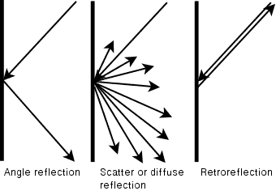

如果我们使用带有滤波耦合结构红外光投影仪的摄像头，我们可以仅检索红外光，然后，我们有一个非常高质量的图像进行分割，我们可以用这个图像随后检测和识别车牌号码，它不受任何光照环境的影响，如图所示：

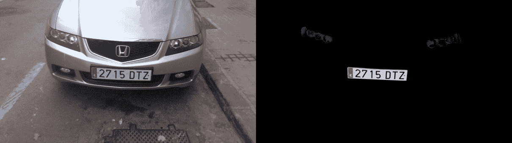

在本章中，我们不会使用红外照片；我们将使用普通照片，这样我们不会获得最佳结果，并且检测错误率和误识别率更高，与使用红外摄像头相比。然而，两种方法的步骤是相同的。

每个国家都有不同的车牌尺寸和规格。了解这些规格对于获得最佳结果和减少错误是有用的。每章中使用的算法都是为了解释 ANPR 的基本原理，具体针对西班牙使用的车牌，但我们也可以将其扩展到任何国家或规格。

在本章中，我们将使用西班牙的车牌。在西班牙，车牌有三种不同的尺寸和形状，但我们只会使用最常见的（大型）车牌，其宽度为 520 毫米，高度为 110 毫米。两组字符之间有一个 41 毫米的间隔，每个单独字符之间有一个 14 毫米的间隔。第一组字符有四个数字，第二组有三个字母，没有元音 A、E、I、O、U，也没有字母 N 或 Q。所有字符的尺寸为 45 毫米乘以 77 毫米。

这些数据对于字符分割很重要，因为我们既可以检查字符，也可以检查空白空间，以验证我们得到的是字符而不是其他图像块：

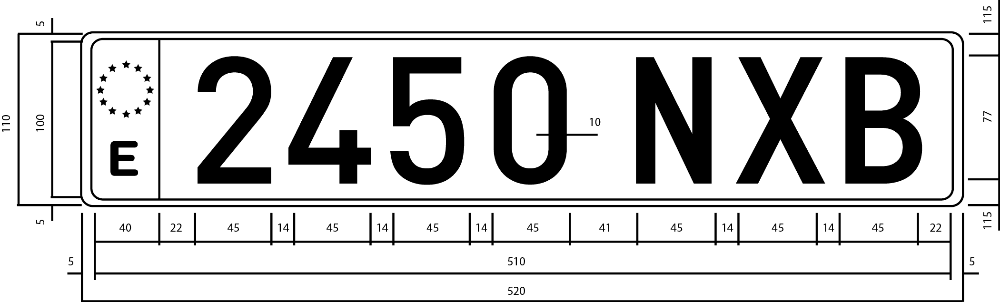

# ANPR 算法

在解释 ANPR 代码之前，我们需要定义 ANPR 算法中的主要步骤和任务。ANPR 分为两个主要步骤：车牌检测和车牌识别。车牌检测的目的是检测车牌在相机整个帧中的位置。当在图像中检测到车牌时，车牌段被传递到第二步（车牌识别），该步骤使用 OCR 算法来确定车牌上的字母数字字符。

在以下图中，我们可以看到两个主要算法步骤：车牌检测和车牌识别。在这些步骤之后，程序会在相机帧上绘制检测到的车牌字符。算法可能会返回错误的结果，或者可能不返回任何结果：

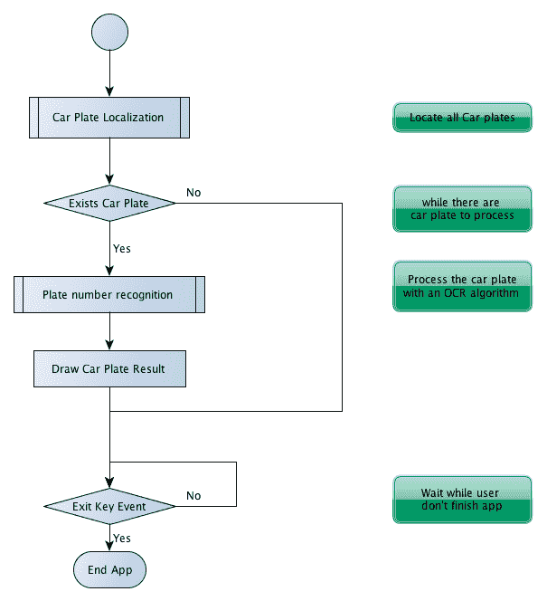

在前图中显示的每个步骤中，我们将定义三个在模式识别算法中常用的附加步骤。这些步骤如下：

1.  **分割**：这一步检测并移除图像中的每个块/感兴趣区域。

1.  **特征提取**：这一步从每个块中提取一组特征。

1.  **分类**：这一步从车牌识别步骤中提取每个字符，或者在车牌检测步骤中将每个图像块分类为“车牌”或“无车牌”。

在以下图中，我们可以看到整个算法应用中的这些模式识别步骤：

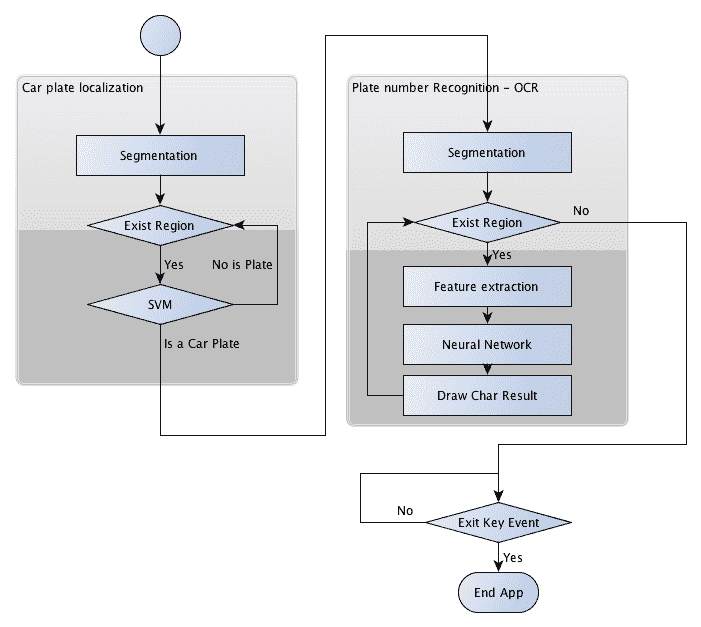

除了主要应用，其目的是检测和识别车牌号码之外，我们还将简要解释两个通常不会被解释的任务：

+   如何训练一个模式识别系统

+   如何评估它

然而，这些任务可能比主要应用更重要，因为我们如果不正确训练模式识别系统，我们的系统可能会失败并且无法正确工作；不同的模式需要不同的训练和评估。我们需要在不同的环境、条件和特征中评估我们的系统以获得最佳结果。这两个任务有时会一起使用，因为不同的特征可以产生我们在评估部分可以看到的不同结果。

# 车牌检测

在这一步，我们必须检测当前相机帧中的所有车牌。为了完成这个任务，我们将它分为两个主要步骤：分割和分割分类。特征步骤没有解释，因为我们使用图像块作为向量特征。

在第一步（分割）中，我们将应用不同的过滤器、形态学操作、轮廓算法和验证来检索可能包含车牌的图像部分。

在第二步（分类）中，我们将对每个图像块，即我们的特征，应用**支持向量机**（**SVM**）分类器。在创建我们的主要应用程序之前，我们将使用两个不同的类别进行训练：*车牌*和*非车牌*。我们将处理具有 800 像素宽度的并行正面视图彩色图像，这些图像是从 2 到 4 米远的车上拍摄的。这些要求对于正确的分割非常重要。如果我们创建一个多尺度图像算法，我们可以得到性能检测。

在下一张图像中，我们将展示所有涉及车牌检测的过程：

+   Sobel 滤波器

+   阈值操作

+   形态学闭运算

+   填充区域之一的掩码

+   红色表示可能检测到的车牌（特征图像）

+   SVM 分类器检测到的车牌

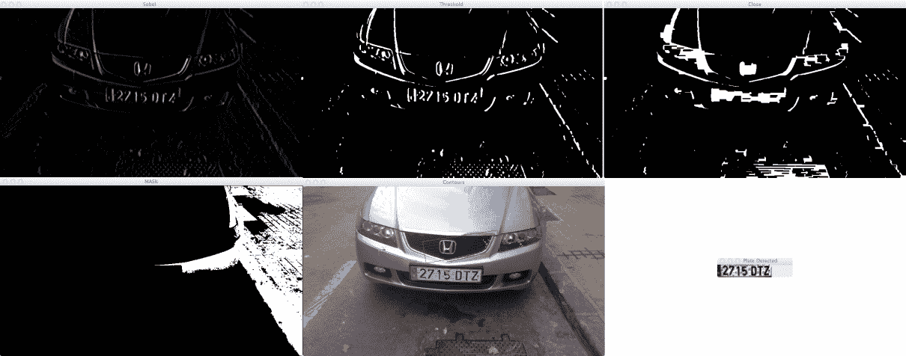

# 分割

分割是将图像分割成多个段的过程。这个过程是为了简化图像以便分析，并使特征提取更容易。

车牌分割的一个重要特征是车牌中垂直边缘的数量很高，假设图像是正面拍摄的，车牌没有旋转且没有透视失真。这个特征可以在第一个分割步骤中利用，以消除没有任何垂直边缘的区域。

在找到垂直边缘之前，我们需要将彩色图像转换为灰度图像（因为颜色在这个任务中帮不上忙）并移除来自相机或其他环境噪声产生的可能噪声。我们将应用 5x5 高斯模糊并去除噪声。如果我们不应用噪声去除方法，我们可以得到很多垂直边缘，这会导致检测失败：

```py
      //convert image to gray 
      Mat img_gray; 
      cvtColor(input, img_gray, CV_BGR2GRAY); 
      blur(img_gray, img_gray, Size(5,5));    

```

为了找到垂直边缘，我们将使用 Sobel 滤波器并找到第一个水平导数。导数是一个数学函数，它允许我们在图像上找到垂直边缘。OpenCV 中 Sobel 函数的定义如下：

```py
      void Sobel(InputArray src, OutputArray dst, int ddepth, int       
      xorder, int yorder, int ksize=3, double scale=1, double delta=0,        int borderType=BORDER_DEFAULT ) 

```

在这里，`ddepth`是目标图像深度；`xorder`是 x 导数的阶数；`yorder`是 y 导数的阶数；`ksize`是 1、3、5 或 7 的核大小；`scale`是计算导数值的可选因子；`delta`是可选的值，添加到结果中；`borderType`是像素插值方法。

然后，在我们的情况下，我们可以使用`xorder=1`、`yorder=0`和`ksize=3`：

```py
      //Find vertical lines. Car plates have high density of vertical        
      lines 
      Mat img_sobel; 
      Sobel(img_gray, img_sobel, CV_8U, 1, 0, 3, 1, 0); 

```

在应用 Sobel 滤波器之后，我们将应用阈值滤波器以获得一个二值图像，阈值值是通过 Otsu 方法获得的。Otsu 算法需要一个 8 位输入图像，并且 Otsu 方法自动确定最佳阈值值：

```py
      //threshold image 
      Mat img_threshold; 
      threshold(img_sobel, img_threshold, 0, 255,       
      CV_THRESH_OTSU+CV_THRESH_BINARY); 

```

要在阈值函数中定义 Otsu 方法，我们将类型参数与`CV_THRESH_OTSU`值组合，并且阈值值参数被忽略。

当定义`CV_THRESH_OTSU`值时，阈值函数返回 Otsu 算法获得的最佳阈值值。

通过应用闭形态学操作，我们可以移除每个垂直边缘线之间的空白空间，并连接所有具有高边缘数目的区域。在这个步骤中，我们有可能包含车牌的区域。

首先，我们将定义我们在形态学操作中使用的结构元素。我们将使用`getStructuringElement`函数定义一个具有 17x3 维度的矩形结构元素；在其他图像大小中可能不同：

```py
      Mat element = getStructuringElement(MORPH_RECT, Size(17, 3)); 

```

然后，我们将使用这个结构元素在`morphologyEx`函数中执行闭形态学操作：

```py
      morphologyEx(img_threshold, img_threshold, CV_MOP_CLOSE, 
      element); 

```

应用这些函数后，图像中将有可能包含车牌的区域；然而，大多数区域并不包含车牌。这些区域可以通过连通分量分析或使用`findContours`函数来分割。这个最后的函数以不同的方法和结果检索二值图像的轮廓。我们只需要获取具有任何层次关系和任何多边形逼近结果的轮廓：

```py
      //Find contours of possibles plates 
      vector< vector< Point>> contours; 
      findContours(img_threshold, 
                contours,            // a vector of contours 
                CV_RETR_EXTERNAL,    // retrieve the external contours 
                CV_CHAIN_APPROX_NONE); // all pixels of each contours 

```

对于每个检测到的轮廓，提取最小面积的边界矩形。OpenCV 提供了`minAreaRect`函数来完成这个任务。这个函数返回一个旋转的`RotatedRect`矩形类。然后，使用向量迭代器遍历每个轮廓，我们可以获取旋转矩形并在对每个区域进行分类之前进行一些初步验证：

```py
      //Start to iterate to each contour founded 
      vector<vector<Point>>::iterator itc= contours.begin(); 
      vector<RotatedRect> rects; 

      //Remove patch that has no inside limits of aspect ratio and      
      area.    
      while (itc!=contours.end()) { 
        //Create bounding rect of object 
          RotatedRect mr= minAreaRect(Mat(*itc)); 
          if(!verifySizes(mr)){ 
          itc= contours.erase(itc); 
          }else{ 
          ++itc; 
          rects.push_back(mr); 
        } 
      } 

```

我们根据检测到的区域的面积和宽高比进行基本验证。如果宽高比大约为*520/110 = 4.727272*（板宽除以板高），误差范围为 40%，并且板的高度基于至少 15 像素和最多 125 像素的面积，我们将考虑该区域可以是一个板。这些值取决于图像大小和相机位置：

```py
      bool DetectRegions::verifySizes(RotatedRect candidate ){ 

      float error=0.4; 
        //Spain car plate size: 52x11 aspect 4,7272 
      const float aspect=4.7272; 
        //Set a min and max area. All other patchs are discarded 
      int min= 15*aspect*15; // minimum area 
      int max= 125*aspect*125; // maximum area 
        //Get only patches that match to a respect ratio. 
      float rmin= aspect-aspect*error; 
      float rmax= aspect+aspect*error; 

      int area= candidate.size.height * candidate.size.width; 
      float r= (float)candidate.size.width /       
      (float)candidate.size.height; 
      if(r<1) 
          r= 1/r; 

      if(( area < min || area > max ) || ( r < rmin || r > rmax )){ 
          return false; 
      }else{ 
          return true; 
        } 
      } 

```

我们可以利用车牌的白色背景属性进行更多改进。所有车牌都有相同的背景颜色，我们可以使用填充算法来检索旋转矩形以进行精确裁剪。

裁剪车牌的第一步是获取靠近最后旋转矩形中心的几个种子。然后，我们将获取车牌在宽度和高度之间的最小尺寸，并使用它来生成靠近修补中心附近的随机种子。

我们想要选择白色区域，并且我们需要几个种子至少接触一个白色像素。然后，对于每个种子，我们使用`floodFill`函数来绘制一个新的掩码图像以存储新的最近裁剪区域：

```py
      for(int i=0; i< rects.size(); i++){ 
      //For better rect cropping for each possible box 
      //Make floodfill algorithm because the plate has white background 
      //And then we can retrieve more clearly the contour box 
        ircle(result, rects[i].center, 3, Scalar(0,255,0), -1); 
      //get the min size between width and height 
        float minSize=(rects[i].size.width < rects[i].size.height)?      
      rects[i].size.width:rects[i].size.height; 
      minSize=minSize-minSize*0.5; 
      //initialize rand and get 5 points around center for floodfill      
      algorithm 
      srand ( time(NULL) ); 
      //Initialize floodfill parameters and variables 
      Mat mask; 
      mask.create(input.rows + 2, input.cols + 2, CV_8UC1); 
      mask= Scalar::all(0); 
      int loDiff = 30; 
      int upDiff = 30; 
      int connectivity = 4; 
      int newMaskVal = 255; 
      int NumSeeds = 10; 
      Rect ccomp; 
      int flags = connectivity + (newMaskVal << 8 ) +             
      CV_FLOODFILL_FIXED_RANGE + CV_FLOODFILL_MASK_ONLY; 
      for(int j=0; j<NumSeeds; j++){ 
      Point seed; 
      seed.x=rects[i].center.x+rand()%(int)minSize-(minSize/2); 
      seed.y=rects[i].center.y+rand()%(int)minSize-(minSize/2); 
      circle(result, seed, 1, Scalar(0,255,255), -1); 
      int area = floodFill(input, mask, seed, Scalar(255,0,0), &ccomp,        Scalar(loDiff, loDiff, loDiff), Scalar(upDiff, upDiff, upDiff),  
      flags); 

```

`floodfill`函数从点种子开始填充一个连通组件的颜色到掩码图像中，并设置填充像素与像素邻居或像素种子之间的最大亮度/颜色差异：

```py
     intfloodFill(InputOutputArray image, InputOutputArray mask, Point       seed, Scalar newVal, Rect* rect=0, Scalar loDiff=Scalar(), Scalar       upDiff=Scalar(), int flags=4 ) 

```

`newval`参数是我们希望在填充图像时放入的新颜色。参数`loDiff`和`upDiff`是填充像素与相邻像素或像素种子之间的最大亮度/颜色差异。

参数`flag`是以下位组合：

+   **低位位**：这些位包含连接值，默认为 4 或 8，在函数中使用。连接性决定了哪些像素邻居被认为是

+   **高位位**：这些可以是 0 或以下值的组合-`CV_FLOODFILL_FIXED_RANGE`和`CV_FLOODFILL_MASK_ONLY`。

`CV_FLOODFILL_FIXED_RANGE`设置当前像素和种子像素之间的差异。`CV_FLOODFILL_MASK_ONLY`将只填充图像掩码而不会更改图像本身。

一旦我们有了裁剪掩码，我们将从图像掩码点获取最小面积矩形，并再次检查有效尺寸。对于每个掩码，白色像素获取位置并使用`minAreaRect`函数来检索最近的裁剪区域：

```py
      //Check new floodfill mask match for a correct patch. 
      //Get all points detected for get Minimal rotated Rect 
      vector<Point> pointsInterest; 
      Mat_<uchar>::iterator itMask= mask.begin<uchar>(); 
      Mat_<uchar>::iterator end= mask.end<uchar>(); 
      for( ; itMask!=end; ++itMask) 
        if(*itMask==255) 
          pointsInterest.push_back(itMask.pos()); 
      RotatedRect minRect = minAreaRect(pointsInterest); 
      if(verifySizes(minRect)){ 

```

分割过程已完成，并且我们有有效区域。现在，我们可以裁剪每个检测区域，去除可能的旋转，裁剪图像区域，调整图像大小，并均衡裁剪图像区域的光线。

首先，我们需要使用`getRotationMatrix2D`生成变换矩阵以去除检测区域中可能存在的旋转。我们需要注意高度，因为`RotatedRect`可以返回并旋转 90 度。因此，我们必须检查矩形纵横比，如果它小于`1`，我们需要将其旋转 90 度：

```py
      //Get rotation matrix 
      float r= (float)minRect.size.width / (float)minRect.size.height; 
      float angle=minRect.angle;     
      if(r<1) 
      angle=90+angle; 
      Mat rotmat= getRotationMatrix2D(minRect.center, angle,1); 

```

使用变换矩阵，我们现在可以使用`warpAffine`函数通过仿射变换（在几何中，仿射变换是一种将平行线映射为平行线的变换）来旋转输入图像。在这里，我们设置输入和目标图像、变换矩阵、输出大小（在我们的情况下与输入相同）以及要使用的插值方法。如果需要，我们可以定义边界方法和边界值：

```py
      //Create and rotate image 
      Mat img_rotated; 
      warpAffine(input, img_rotated, rotmat, input.size(), 
      CV_INTER_CUBIC); 

```

在我们对图像进行旋转后，我们将使用`getRectSubPix`裁剪图像，该函数裁剪并复制一个以点为中心的图像部分。如果图像已旋转，我们需要使用 C++的`swap`函数更改宽度和高度大小：

```py
      //Crop image 
      Size rect_size=minRect.size; 
      if(r < 1) 
      swap(rect_size.width, rect_size.height); 
      Mat img_crop; 
      getRectSubPix(img_rotated, rect_size, minRect.center, 
      img_crop); 

```

裁剪的图像不适合用于训练和分类，因为它们的大小不同。此外，每张图像都包含不同的光照条件，使它们更加不同。为了解决这个问题，我们将所有图像调整到相同的宽度和高度，并应用光直方图均衡化：

```py
      Mat resultResized; 
      resultResized.create(33,144, CV_8UC3); 
 resize(img_crop, resultResized, resultResized.size(), 0, 0,       
      INTER_CUBIC); 
      //Equalize croped image 
      Mat grayResult; 
      cvtColor(resultResized, grayResult, CV_BGR2GRAY); 
      blur(grayResult, grayResult, Size(3,3)); 
 equalizeHist(grayResult, grayResult);

```

对于每个检测到的区域，我们将裁剪的图像及其位置存储在一个向量中：

```py
      output.push_back(Plate(grayResult,minRect.boundingRect())); 

```

# 分类

在预处理和分割图像的所有可能部分之后，我们现在需要决定每个部分是否是（或不是）车牌。为此，我们将使用**支持向量机**（**SVM**）算法。

支持向量机是包含在最初为二元分类而创建的监督学习算法家族中的模式识别算法。监督学习是使用标记数据进行训练的机器学习算法技术。我们需要用一定数量的标记数据进行算法训练；每个数据集都需要有一个类别。

SVM 创建一个或多个超平面，用于区分每个数据类别。

一个经典的例子是定义两个类别的 2D 点集；SVM 搜索区分每个类的最佳直线：

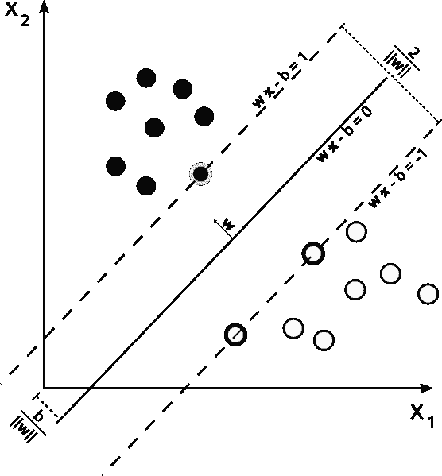

在任何分类之前的首要任务是训练我们的分类器；这是主应用之前的工作，被称为“离线训练”。这不是一项容易的工作，因为它需要足够的数据来训练系统，但更大的数据集并不总是意味着最好的结果。在我们的情况下，由于没有公开的车牌数据库，我们数据不足。因此，我们需要拍摄数百张汽车照片，然后对它们进行预处理和分割。

我们使用 75 张车牌图像和 35 张无车牌图像训练了我们的系统，这些图像具有 144x33 像素的分辨率。我们可以在以下图像中看到这些数据的样本。这不是一个大型数据集，但对于我们这一章来说已经足够了。在实际应用中，我们需要使用更多数据进行训练：

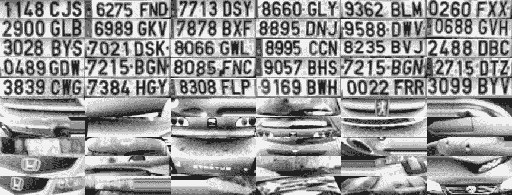

为了轻松理解机器学习的工作原理，我们将使用分类算法的图像像素特征（记住，有更好的方法和特征来训练 SVM，例如**主成分分析**（**PCA**）、傅里叶变换、纹理分析等等）。

为了使用`DetectRegions`类创建训练我们系统的图像并设置`savingRegions`变量为"true"以保存图像，我们需要这样做。我们可以使用`segmentAllFiles.sh`bash 脚本来对文件夹下的所有图像文件重复此过程。这可以从本书的源代码中获取：

为了使这个过程更容易，我们将所有处理和准备好的图像训练数据存储到一个 XML 文件中，以便直接与 SVM 函数一起使用。`trainSVM.cpp`应用程序使用文件夹和图像文件的数量创建这个文件。

机器学习 OpenCV 算法的训练数据存储在一个*N*x*M*矩阵中，其中*N*是样本数，*M*是特征数。每个数据集作为训练矩阵中的一行保存。

类别存储在另一个大小为*n*x1 的矩阵中，其中每个类别由一个浮点数标识。

OpenCV 通过`FileStorage`类提供了一个简单的方式来管理 XML 或 YAML 格式的数据文件。这个类允许我们存储和读取 OpenCV 变量和结构或我们的自定义变量。使用这个函数，我们可以读取训练数据矩阵和训练类别，并将其保存到`SVM_TrainingData`和`SVM_Classes`中：

```py
      FileStorage fs; 
      fs.open("SVM.xml", FileStorage::READ); 
      Mat SVM_TrainingData; 
      Mat SVM_Classes; 
      fs["TrainingData"] >>SVM_TrainingData; 
      fs["classes"] >>SVM_Classes; 

```

现在，我们已经有了`SVM_TrainingData`变量中的训练数据，以及`SVM_Classes`中的标签。然后，我们只需要创建一个训练数据对象，将数据和标签连接起来，以便在我们的机器学习算法中使用。为此，我们将使用`TrainData`类作为 OpenCV 指针`Ptr`类，如下所示：

```py
      Ptr<TrainData> trainData = TrainData::create(SVM_TrainingData,         
      ROW_SAMPLE, SVM_Classes); 

```

我们将使用`SVM`类和`Ptr`OpenCV 类来创建分类器对象：

```py
      Ptr<SVM> svmClassifier = SVM::create() 

```

现在，我们需要设置 SVM 参数，这些参数定义了在 SVM 算法中使用的基本参数。为此，我们只需要更改一些对象变量。经过不同的实验后，我们将选择下一个参数设置：

```py
      svmClassifier-
      >setTermCriteria(TermCriteria(TermCriteria::MAX_ITER, 1000,       
      0.01)); 
      svmClassifier->setC(0.1); 
      svmClassifier->setKernel(SVM::LINEAR); 

```

我们为训练选择了 1000 次迭代，C 参数变量优化为 0.1，最后使用核函数。

我们只需要使用`train`函数和训练数据来训练我们的分类器：

```py
      svmClassifier->train(trainData); 

```

我们的分类器已经准备好使用我们的 SVM 类的`predict`函数来预测一个可能裁剪的图像；这个函数返回类标识符`i`。在我们的情况下，我们将车牌类标记为 1，无车牌类标记为 0。然后，对于每个可能为车牌的检测区域，我们将使用 SVM 将其分类为车牌或无车牌，并仅保存正确的响应。以下代码是主应用程序中在线处理的一部分：

```py
      vector<Plate> plates; 
      for(int i=0; i< posible_regions.size(); i++) 
      { 
      Mat img=posible_regions[i].plateImg; 
      Mat p= img.reshape(1, 1);//convert img to 1 row m features 
      p.convertTo(p, CV_32FC1); 
 int response = (int)svmClassifier.predict( p ); 
      if(response==1) 
      plates.push_back(posible_regions[i]); 
      } 

```

# 车牌识别

许可证识别的第二步旨在使用光学字符识别技术检索车牌上的字符。对于每个检测到的车牌，我们将对每个字符进行分割，并使用人工神经网络机器学习算法来识别字符。在本节中，你还将学习如何评估分类算法。

# OCR 分割

首先，我们将获取一个车牌图像块作为输入，传递给具有均衡直方图的 OCR 分割函数。然后，我们只需要应用一个阈值滤波器，并使用这个阈值图像作为 Find Contours 算法的输入。我们可以在以下图像中观察到这个过程：

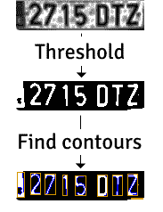

这个分割过程如下所示：

```py
      Mat img_threshold; 
      threshold(input, img_threshold, 60, 255, CV_THRESH_BINARY_INV); 
      if(DEBUG) 
      imshow("Threshold plate", img_threshold); 
      Mat img_contours; 
      img_threshold.copyTo(img_contours); 
      //Find contours of possibles characters 
      vector< vector< Point>> contours; 
      findContours(img_contours, 
          contours, // a vector of contours 
          CV_RETR_EXTERNAL, // retrieve the external contours 
          CV_CHAIN_APPROX_NONE); // all pixels of each contours 

```

我们使用了`CV_THRESH_BINARY_INV`参数来通过将白色输入值转换为黑色和黑色输入值转换为白色来反转阈值输出。这是获取每个字符轮廓所必需的，因为轮廓算法寻找白色像素。

对于每个检测到的轮廓，我们可以进行大小验证并移除所有大小较小或纵横比不正确的区域。在我们的情况下，字符的纵横比为 45/77，我们可以接受旋转或扭曲字符的 35%纵横比误差。如果一个区域高于 80%，我们将考虑该区域为黑色块而不是字符。对于计数面积，我们可以使用`countNonZero`函数，该函数计算值高于 0 的像素数量：

```py
      bool OCR::verifySizes(Mat r){ 
        //Char sizes 45x77 
      float aspect=45.0f/77.0f; 
      float charAspect= (float)r.cols/(float)r.rows; 
      float error=0.35; 
      float minHeight=15; 
      float maxHeight=28; 
        //We have a different aspect ratio for number 1, and it can be 
       ~0.2 
       float minAspect=0.2; 
      float maxAspect=aspect+aspect*error; 
        //area of pixels 
      float area=countNonZero(r); 
        //bb area 
      float bbArea=r.cols*r.rows; 
        //% of pixel in area 
      float percPixels=area/bbArea; 
      if(percPixels < 0.8 && charAspect > minAspect && charAspect <  
      maxAspect && r.rows >= minHeight && r.rows < maxHeight) 
        return true; 
       else 
        return false; 
      } 

```

如果一个分割的字符被验证，我们必须对其进行预处理，以设置所有字符相同的大小和位置，并使用辅助`CharSegment`类将其保存为向量。这个类保存了分割字符图像和我们需要按顺序排列字符的位置，因为 Find Contour 算法不会以正确和所需的顺序返回轮廓。

# 特征提取

对于每个分割的字符，下一步是提取用于训练的特征并对人工神经网络算法进行分类。

与车牌检测不同，用于 SVM 的特征提取步骤不使用所有图像像素。我们将应用在 OCR 中更常见的特征，这些特征包含水平和垂直累积直方图以及低分辨率图像样本。我们可以在下一张图像中更直观地看到这个特征，因为每个图像都有一个低分辨率的 5x5 图像和直方图累积：

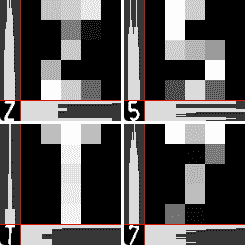

对于每个字符，我们将使用`countNonZero`函数计算具有非零值的行或列中的像素数量，并将其存储在名为`mhist`的新数据矩阵中。我们将使用`minMaxLoc`函数查找数据矩阵中的最大值，并使用`convertTo`函数将`mhist`的所有元素除以最大值来归一化。我们将创建`ProjectedHistogram`函数来创建具有二值图像和所需类型的直方图累积，该直方图累积以二进制图像和水平或垂直类型为输入：

```py
      Mat OCR::ProjectedHistogram(Mat img, int t) 
      { 
      int sz=(t)?img.rows:img.cols; 
      Mat mhist=Mat::zeros(1,sz,CV_32F); 

      for(int j=0; j<sz; j++){ 
      Mat data=(t)?img.row(j):img.col(j); 
      mhist.at<float>(j)=countNonZero(data); 
      } 

      //Normalize histogram 
      double min, max; 
      minMaxLoc(mhist, &min, &max); 

      if(max>0) 
      mhist.convertTo(mhist,-1 , 1.0f/max, 0); 

      return mhist; 
      } 

```

其他特征使用低分辨率样本图像。我们不会使用整个字符图像，而是创建一个低分辨率的字符，例如，一个 5x5 的字符。我们将使用 5x5、10x10、15x15 和 20x20 的字符来训练系统，然后评估哪个返回最佳结果以用于我们的系统。一旦我们有了所有特征，我们将创建一个由一行的*M*列组成的矩阵，其中列是特征：

```py
      Mat OCR::features(Mat in, int sizeData){ 
        //Histogram features 
 Mat vhist=ProjectedHistogram(in,VERTICAL);Mat       
      hhist=ProjectedHistogram(in,HORIZONTAL); 
        //Low data feature 
 Mat lowData;resize(in, lowData, Size(sizeData, sizeData) ); 
      int numCols=vhist.cols + hhist.cols + lowData.cols * 
      lowData.cols; 
      Mat out=Mat::zeros(1,numCols,CV_32F); 
        //Asign values to feature 
      int j=0; 
      for(int i=0; i<vhist.cols; i++){ 
        out.at<float>(j)=vhist.at<float>(i); j++;} 
      for(int i=0; i<hhist.cols; i++){ 
        out.at<float>(j)=hhist.at<float>(i); 
        j++;} 
      for(int x=0; x<lowData.cols; x++){ 
        for(int y=0; y<lowData.rows; y++){ 
          out.at<float>(j)=(float)lowData.at<unsigned char>(x,y); 
          j++; 
          } 
        } 
      return out; 
      } 

```

# OCR 分类

在分类步骤中，我们使用了人工神经网络机器学习算法，更具体地说，是一个**多层感知器**（**MLP**），这是最常用的 ANN 算法。

MLP 由一个包含输入层、输出层和一层或更多隐藏层的神经元网络组成。每一层都通过前一层和后一层的神经元连接。

以下示例表示一个三层感知器（是一个将实值向量输入映射到单个二进制值输出的二分类器），有三个输入、两个输出，隐藏层包含五个神经元：

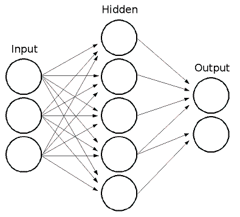

MLP 中的所有神经元都是相似的，每个神经元都有几个输入（前一个连接的神经元）和几个具有相同值的输出链接（下一个连接的神经元）。每个神经元通过加权输入的总和加上一个偏置项来计算输出值，并通过选定的激活函数进行转换：


有三种广泛使用的激活函数：恒等函数、Sigmoid 和高斯。最常见和默认的激活函数是 Sigmoid 函数；它将 alpha 和 beta 值设置为 1：

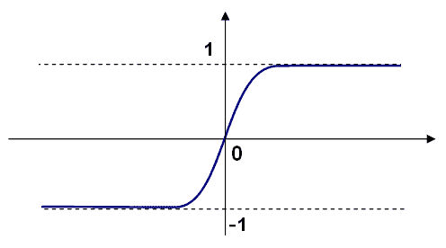

经过训练的 ANN 网络有一个具有特征的输入向量；它将值传递到隐藏层，并通过权重和激活函数计算结果。它将输出进一步传递到下游，直到它到达具有类别神经元数量的输出层。

每一层的权重、突触和神经元是通过训练 ANN 算法来计算和学习的。为了训练我们的分类器，我们将创建两个数据矩阵，就像我们在 SVM 训练中所做的那样，但训练标签略有不同。而不是一个*N*x1 的矩阵，其中*N*代表训练数据行数，1 是列，我们将使用标签编号标识符。我们必须创建一个*N*x*M*的矩阵，其中*N*是训练/样本数据，*M*是类别（在我们的情况下是 10 个数字和 20 个字母），并在位置*i*，*j*处设置 1，如果数据行*i*被分类为类别*j*：

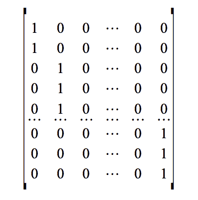

我们将创建一个`OCR::train`函数来创建所有需要的矩阵并训练我们的系统，包括训练数据矩阵、类别矩阵和隐藏层中的隐藏神经元数量。训练数据从 XML 文件中加载，就像我们在 SVM 训练中所做的那样。

我们必须定义每一层的神经元数量来初始化 ANN 类。在我们的示例中，我们将只使用一个隐藏层。然后，我们将定义一个一行三列的矩阵。第一列位置是特征数量，第二列位置是隐藏层上的隐藏神经元数量，第三列位置是类别数量。

OpenCV 定义了一个`ANN_MLP`类用于 ANN。使用`create`函数，我们可以初始化类指针，然后定义层数、神经元数量和激活函数。然后我们可以创建像 SVM 一样的训练数据，以及训练方法的`alpha`和`beta`参数：

```py
      void OCR::train(Mat TrainData, Mat classes, int nlayers){ 
      Mat_<int> layerSizes(1, 3); 
      layerSizes(0, 0) = data.cols; 
      layerSizes(0, 1) = nlayers; 
      layerSizes(0, 2) = numCharacters; 
      ann= ANN_MLP::create(); 
      ann->setLayerSizes(layerSizes); 
      ann->setActivationFunction(ANN_MLP::SIGMOID_SYM, 0, 0); 
      ann->setTrainMethod(ANN_MLP::BACKPROP, 0.0001, 0.0001); 

      //Prepare trainClases 
      //Create a mat with n trained data by m classes 
      Mat trainClasses; 
      trainClasses.create( TrainData.rows, numCharacters, CV_32FC1 ); 
      for( int i = 0; i <trainClasses.rows; i++ ) 
      { 
          for( int k = 0; k < trainClasses.cols; k++ ) 
          { 
            //If class of data i is same than a k class 
         if( k == classes.at<int>(i) ) 
             trainClasses.at<float>(i,k) = 1; 
               else 
                   trainClasses.at<float>(i,k) = 0; 
           } 
          } 

       Ptr<TrainData> trainData = TrainData::create(data, ROW_SAMPLE,           trainClasses); 
       //Learn classifier 
        ann->train( trainData ); 

      } 

```

训练后，我们可以使用`OCR::classify`函数对任何分割的牌照特征进行分类：

```py
      int OCR::classify(Mat f){ 
      int result=-1; 
      Mat output; 
 ann.predict(f, output); 
      Point maxLoc; 
      double maxVal; 
 minMaxLoc(output, 0, &maxVal, 0, &maxLoc); 
      //We need know where in output is the max val, the x (cols) is        
      the class. 
      return maxLoc.x; 
      } 

```

`ANN_MLP`类使用`predict`函数对类中的特征向量进行分类。与 SVM 的`classify`函数不同，ANN 预测函数返回一个行大小等于类数量的行，其中包含输入特征属于每个类的概率。

为了获得最佳结果，我们可以使用`minMaxLoc`函数获取最大和最小响应及其在矩阵中的位置。我们的字符类别由较高值的*x*位置指定：

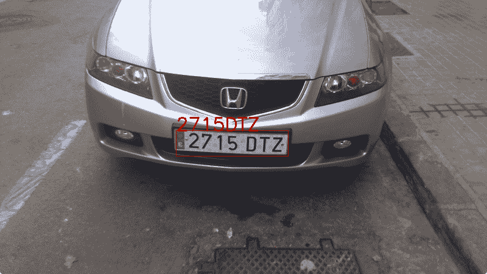

为了完成每个检测到的车牌，我们对其字符进行排序，并使用`Plate`类的`str()`函数返回一个字符串，我们可以在原始图像上绘制它：

```py
      string licensePlate=plate.str(); 
      rectangle(input_image, plate.position, Scalar(0,0,200)); 
      putText(input_image, licensePlate, Point(plate.position.x,              plate.position.y), CV_FONT_HERSHEY_SIMPLEX, 1, 
      Scalar(0,0,200),2); 

```

# 评估

我们的项目已经完成。然而，当我们训练像 OCR 这样的机器学习算法时，例如，我们需要知道最佳特征和参数以及如何纠正系统中的分类、识别和检测错误。

我们需要用不同的情况和参数评估我们的系统，并评估产生的错误，以便获得最小化这些错误的最佳参数。

在本章中，我们使用变量评估了 OCR 任务：低级分辨率图像特征的大小和隐藏层中隐藏神经元的数量。

我们创建了`evalOCR.cpp`应用程序，其中我们使用由`trainOCR.cpp`应用程序生成的 XML 训练数据文件。`OCR.xml`文件包含 5x5、10x10、15x15 和 20x20 下采样图像特征的训练数据矩阵：

```py
      Mat classes; 
      Mat trainingData; 
      //Read file storage. 
      FileStorage fs; 
      fs.open("OCR.xml", FileStorage::READ); 
      fs[data] >> trainingData; 
      fs["classes"] >> classes; 

```

评估应用程序获取每个下采样矩阵特征，并为训练获取 100 个随机行，以及用于测试 ANN 算法和检查错误的其它行。

在训练系统之前，我们将测试每个随机样本并检查其响应是否正确。如果响应不正确，我们将错误计数器变量增加，然后除以样本数量以评估。这表示使用随机数据进行训练的错误率在 0 到 1 之间：

```py
      float test(Mat samples, Mat classes){ 
      float errors=0; 
      for(int i=0; i<samples.rows; i++){ 
        int result= ocr.classify(samples.row(i)); 
        if(result!= classes.at<int>(i)) 
        errors++; 
      } 
      return errors/samples.rows; 
      } 

```

应用程序为每个样本大小返回输出命令行错误率。为了进行良好的评估，我们需要用不同的随机训练行训练应用程序。这会产生不同的测试错误值。然后，我们可以将所有错误加起来并得到平均值。为此任务，我们将创建 bash UNIX 脚本来自动化它：

```py
      #!/bin/bash 
      echo "#ITS t 5 t 10 t 15 t 20">data.txt 
      folder=$(pwd) 

      for numNeurons in 10 20 30 40 50 60 70 80 90 100 120 150 200 500 
      do 
      s5=0; 
      s10=0; 
      s15=0; 
      s20=0; 
      for j in {1..100} 
      do 
      echo $numNeurons $j 
      a=$($folder/build/evalOCR $numNeurons TrainingDataF5) 
      s5=$(echo "scale=4; $s5+$a" | bc -q 2>/dev/null) 

      a=$($folder/build/evalOCR $numNeurons TrainingDataF10) 
      s10=$(echo "scale=4; $s10+$a" | bc -q 2>/dev/null) 

      a=$($folder/build/evalOCR $numNeurons TrainingDataF15) 
      s15=$(echo "scale=4; $s15+$a" | bc -q 2>/dev/null) 

      a=$($folder/build/evalOCR $numNeurons TrainingDataF20) 
      s20=$(echo "scale=4; $s20+$a" | bc -q 2>/dev/null) 
      done 

      echo "$i t $s5 t $s10 t $s15 t $s20" 
      echo "$i t $s5 t $s10 t $s15 t $s20">>data.txt 
      done 

```

此脚本保存一个`data.txt`文件，其中包含每个大小和神经元隐藏层数量的所有结果。此文件可用于与*gnuplot*绘图。我们可以在以下图像中看到结果：

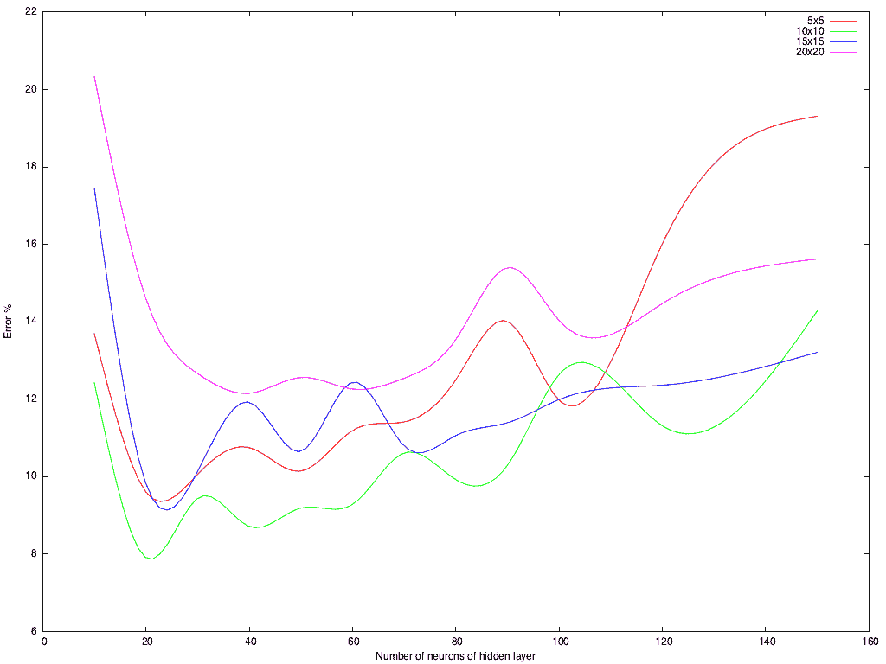

我们可以看到，最低的错误率超过 8%，使用了隐藏层中的 20 个神经元和从下采样到 10x10 图像块中提取的字符特征。

# 摘要

在本章中，你学习了自动车牌识别程序的工作原理及其两个重要步骤：车牌定位和车牌识别。

在第一步中，你学习了如何通过寻找可以放置牌照的区域来分割图像，并使用简单的启发式方法和 SVM 算法对带有*牌照*和*无牌照*的区块进行二分类。

在第二步中，你学习了如何使用查找轮廓算法进行分割，从每个字符中提取特征向量，并使用人工神经网络（ANN）对字符类中的每个特征进行分类。

你还学习了如何通过随机样本训练和不同的参数及特征来评估机器算法。

在下一章中，你将学习如何使用特征脸创建人脸识别应用程序。
