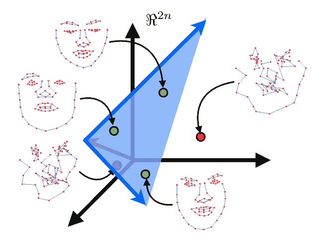
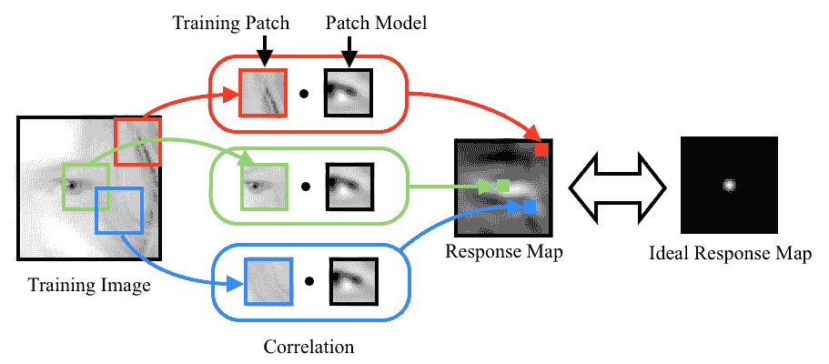
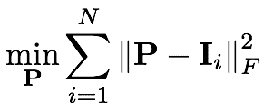
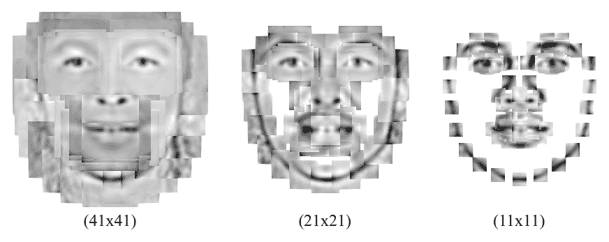
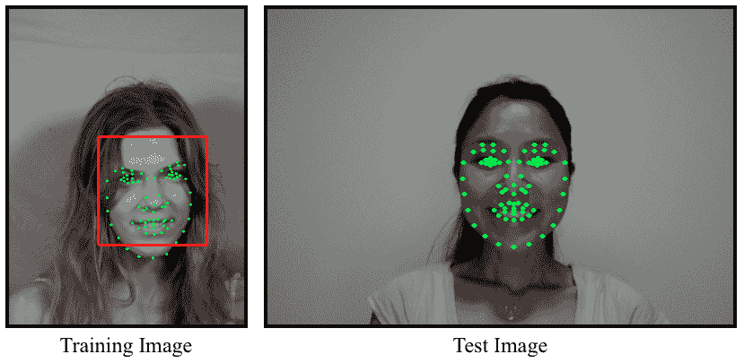

# 非刚性面部跟踪

非刚性面部跟踪，即在每个视频流帧中估计一个准密集的面部特征集，是一个难题，现代方法借鉴了多个相关领域的思想，包括计算机视觉、计算几何、机器学习和图像处理。这里的非刚性指的是面部特征之间的相对距离在面部表情和人群之间是变化的，并且与面部检测和跟踪不同，后者旨在仅找到每帧中面部位置，而不是面部特征配置。非刚性面部跟踪是一个热门的研究课题，已经持续了二十多年，但直到最近，各种方法才足够稳健，处理器足够快，使得商业应用的开发成为可能。

尽管商业级面部跟踪可以非常复杂，甚至对经验丰富的计算机视觉科学家来说也是一个挑战，但在本章中，我们将看到，在受限设置下表现合理的面部跟踪器可以使用适度的数学工具和 OpenCV 在线性代数、图像处理和可视化方面的强大功能来设计。这在需要跟踪的人事先已知，并且有图像和地标注释形式的训练数据可用时尤其如此。以下描述的技术将作为一个有用的起点和指南，以进一步追求更复杂的人脸跟踪系统。

本章的概述如下：

+   **概述**：本节涵盖面部跟踪的简要历史。

+   **工具**：本节概述了本章中使用的常见结构和约定。它包括面向对象设计、数据存储和表示，以及用于数据收集和注释的工具。

+   **几何约束**：本节描述了如何从训练数据中学习面部几何及其变化，并在跟踪过程中利用这些变化来约束解决方案。这包括将面部建模为线性形状模型以及如何将全局变换集成到其表示中。

+   **面部特征检测器**：本节描述了如何学习面部特征的外观以便在需要跟踪面部图像中检测它们。

+   **面部检测和初始化**：本节描述了如何使用面部检测来初始化跟踪过程。

+   **面部跟踪**：本节将之前描述的所有组件通过图像配准的过程组合成一个跟踪系统。讨论系统在哪些设置下可以预期表现最佳。

以下方块图说明了系统各个组件之间的关系：


注意，本章中采用的所有方法都遵循数据驱动范式，即所有使用的模型都是通过数据学习得到的，而不是在基于规则的设置中手工设计。因此，系统的每个组件都将涉及两个部分：训练和测试。训练从数据中构建模型，测试则将这些模型应用于新的未见数据。

# 概述

非刚性面部追踪首次在 20 世纪 90 年代初至中期流行起来，当时 Cootes 和 Taylor 推出了**主动形状模型**（**ASM**）。从那时起，大量研究致力于解决通用面部追踪的难题，并对 ASM 最初提出的方法进行了许多改进。第一个里程碑是在 2001 年将 ASM 扩展到**主动外观模型**（**AAM**），这也是由 Cootes 和 Taylor 完成的。这种方法后来在 2005 年中期通过 Baker 及其同事对图像扭曲的原理性处理而得到形式化。沿着这些方向的另一项工作是 Blanz 和 Vetter 的**3D 可变形模型**（**3DMM**），它类似于 AAM，不仅将图像纹理建模，而不是像 ASM 那样沿物体边界建模轮廓，而且更进一步，通过从面部激光扫描中学习的高度密集的 3D 数据来表示模型。从 2000 年代中期到晚期，面部追踪的研究重点从如何参数化面部转向了如何提出和优化跟踪算法的目标。机器学习社区的各种技术被应用于此，并取得了不同程度的成功。进入 21 世纪后，研究重点再次转移，这次转向了联合参数和目标设计策略，以确保全局解。

尽管对面部追踪的研究持续深入，但使用该技术的商业应用相对较少。尽管有大量免费开源代码包可用于多种常见方法，但业余爱好者和爱好者对该技术的采用也相对滞后。然而，在过去的两年里，公众对面部追踪的潜在用途重新产生了兴趣，并且商业级产品开始涌现。

# 工具

在深入研究面部追踪的复杂性之前，必须首先介绍一些常见的账务任务和约定，这些任务和约定适用于所有面部追踪方法。本节的其余部分将处理这些问题。感兴趣的读者可能希望在第一次阅读时跳过本节，直接跳到关于几何约束的部分。

# 面向对象设计

与面部检测和识别一样，从程序的角度来看，面部追踪由两个组件组成：数据和算法。算法通常通过参考预先存储的数据（即离线数据）作为指南，对传入的（即在线）数据进行某种操作。因此，将算法与它们依赖的数据相结合的面向对象设计是一种方便的设计选择。

在 OpenCV v2.x 版本中，引入了一个方便的 XML/YAML 文件存储类，它极大地简化了为算法组织离线数据的工作。为了利用这一功能，本章中描述的所有类都将实现读写序列化函数。以下是一个虚构的类`foo`的示例：

```py
    #include <opencv2/opencv.hpp> 
    using namespace cv; 
    class foo { 
      public: 
      Mat a; 
      type_b b; 
      void write(FileStorage &fs) const{ 
        assert(fs.isOpened()); 
        fs<< "{" << "a"  << a << "b"  << b << "}"; 
      } 
      void read(const FileNode& node){ 
        assert(node.type() == FileNode::MAP); 
        node["a"] >> a; node["b"] >> b; 
      } 
    };

```

在这里，`Mat`是 OpenCV 的矩阵类，`type_b`是一个（虚构的）用户定义的类，它也定义了序列化功能。I/O 函数`read`和`write`实现了序列化。`FileStorage`类支持两种可以序列化的数据结构。为了简单起见，在本章中，所有类将仅利用映射，其中每个存储的变量创建一个类型为`FileNode::MAP`的`FileNode`对象。这要求为每个元素分配一个唯一的键。尽管对键的选择是任意的，但为了保持一致性，我们将使用变量名作为标签。如前述代码片段所示，`read`和`write`函数采用了特别简单的形式，其中使用了流操作符（`<<`和`>>`）将数据插入和提取到`FileStorage`对象中。大多数 OpenCV 类都有`read`和`write`函数的实现，这使得存储它们包含的数据变得容易。

除了定义序列化函数外，还必须定义两个额外的函数，以便在`FileStorage`类中实现序列化，如下所示：

```py
    void write(FileStorage& fs, const string&, const foo& x) { 
      x.write(fs); 
    } 
    void read(const FileNode& node, foo& x,const foo& default){ 
      if(node.empty())x = d; else x.read(node); 
    }

```

由于这些两个函数在我们本节描述的所有类中功能相同，因此它们被模板化并在源代码中与本章相关的`ft.hpp`头文件中定义。最后，为了轻松保存和加载使用序列化功能的自定义类，头文件中也实现了这些模板化函数，如下所示：

```py
    template<class T> 
    T load_ft(const char* fname){ 
      T x; FileStorage f(fname,FileStorage::READ); 
      f["ft object"] >> x; f.release(); return x; 
    } 
    template<class T> 
    void save_ft(const char* fname,const T& x){ 
      FileStorage f(fname,FileStorage::WRITE); 
      f << "ft object" << x; f.release(); 
    }

```

注意，与对象关联的标签始终相同（即，`ft object`）。定义了这些函数后，保存和加载对象数据就变得轻松愉快了。以下示例展示了这一点：

```py
    #include "opencv_hotshots/ft/ft.hpp" 
    #include "foo.hpp" 
    int main() { 
      ... 
      foo A; save_ft<foo>("foo.xml",A); 
      ... 
      foo B = load_ft<foo>("foo.xml"); 
      ... 
    }

```

注意，`.xml`扩展名会导致生成 XML 格式的数据文件。对于任何其他扩展名，它默认为（更易于阅读的）YAML 格式。

# 数据收集 - 图像和视频标注

现代人脸追踪技术几乎完全是数据驱动的，也就是说，用于检测图像中面部特征位置的算法依赖于面部特征的外观模型以及它们相对位置之间的几何依赖关系。示例集越大，算法的行为就越稳健，因为它们对面部可以展现的变异性范围了解得越多。因此，构建人脸追踪算法的第一步是创建一个图像/视频标注工具，用户可以在每个示例图像中指定所需面部特征的位置。

# 训练数据类型

训练人脸跟踪算法的数据通常包括四个组成部分：

+   **图像**：该组成部分是一组包含整个面部的图像（静态图像或视频帧）。为了获得最佳效果，该集合应专门针对跟踪器随后部署的条件类型（即身份、照明、相机距离、捕获设备等）进行定制。此外，集合中的面部必须展现出预期应用所期望的头姿和面部表情的范围。

+   **标注**：该组成部分在每个图像中都有有序的手动标注位置，对应于要跟踪的每个面部特征。更多的面部特征通常会导致跟踪器更加鲁棒，因为跟踪算法可以使用它们的测量值相互强化。常见跟踪算法的计算成本通常与面部特征的数量成线性关系。

+   **对称指数**：该组成部分为每个面部特征点提供一个索引，用于定义其双边对称特征。这可以用来镜像训练图像，有效地将训练集大小加倍，并沿 *y* 轴对称化数据。

+   **连接指数**：该组成部分有一组标注的索引对，用于定义面部特征的语义解释。这些连接对于可视化跟踪结果非常有用。

下面的图像展示了这四个组成部分的可视化，从左到右分别是原始图像、面部特征标注、颜色编码的双边对称点、镜像图像以及标注和面部特征连接：


为了方便管理此类数据，实现存储和访问功能的类是一个有用的组成部分。OpenCV 的`ml`模块中的`CvMLData`类具有处理机器学习问题中常用的一般数据的函数。然而，它缺少处理人脸跟踪数据所需的函数。因此，在本章中，我们将使用在`ft_data.hpp`头文件中声明的`ft_data`类，该类专门考虑了人脸跟踪数据的特殊性。所有数据元素都被定义为类的公共成员，如下所示：

```py
    class ft_data{ 
      public: 
      vector<int> symmetry; 
      vector<Vec2i> connections; 
      vector<string> imnames; 
      vector<vector<Point2f>> points; 
      ... 
    }

```

`Vec2i` 和 `Point2f` 类型分别是 OpenCV 的两个整数字符串和二维浮点坐标类。`symmetry` 向量包含与面部特征点（由用户定义）数量相同数量的组件。每个 `connections` 定义了一对连接面部特征的零索引。由于训练集可能非常大，而不是直接存储图像，该类将每个图像的文件名存储在 `imnames` 成员变量中（注意，这要求图像位于相同的相对路径，以便文件名保持有效）。最后，对于每个训练图像，将面部特征位置作为浮点坐标的向量存储在 `points` 成员变量中。

`ft_data` 类实现了一系列方便的方法来访问数据。要访问数据集中的图像，`get_image` 函数会加载指定索引 `idx` 的图像，并可选择沿 y 轴进行镜像，如下所示：

```py
    Mat 
    ft_data::get_image( 
      const int idx,   //index of image to load from file 
      const int flag) { //0=gray,1=gray+flip,2=rgb,3=rgb+flip 
        if((idx < 0) || (idx >= (int)imnames.size()))return Mat(); 
        Mat img,im; 
        if(flag < 2) img = imread(imnames[idx],0); 
        else         img = imread(imnames[idx],1); 
        if(flag % 2 != 0) flip(img,im,1); 
        else              im = img; 
        return im; 
      }

```

传递给 OpenCV 的 `imread` 函数的 (`0`,`1`) 标志指定图像是作为三通道彩色图像还是单通道灰度图像加载。传递给 OpenCV 的 `flip` 函数的标志指定沿 *y* 轴的镜像。

要访问特定索引处的图像对应的点集，`get_points` 函数返回一个浮点坐标向量，可以选择如下镜像它们的索引：

```py
    vector<Point2f> 
    ft_data::get_points( 
    const int idx,        //index of image corresponding to points
    const bool flipped) { //is the image flipped around the y-axis? 
      if((idx < 0) || (idx >= (int)imnames.size())) 
      return vector<Point2f>(); 
      vector<Point2f> p = points[idx]; 
      if(flipped){ 
        Mat im = this->get_image(idx,0); int n = p.size(); 
        vector<Point2f> q(n); 
        for(int i = 0; i < n; i++){       
          q[i].x = im.cols-1-p[symmetry[i]].x; 
          q[i].y = p[symmetry[i]].y; 
        } return q; 
      } else return p; 
    }

```

注意，当指定镜像标志时，此函数会调用 `get_image` 函数。这是为了确定图像的宽度，以便正确镜像面部特征坐标。可以设计一个更有效的方法，只需简单地将图像宽度作为变量传递。最后，此函数展示了 `symmetry` 成员变量的实用性。特定索引的镜像特征位置只是 `symmetry` 变量中指定的索引处的特征位置，其 *x* 坐标翻转并偏移。

如果指定的索引超出了数据集存在的索引范围，`get_image` 和 `get_points` 函数都会返回空结构。也可能不是集合中的所有图像都有注释。可以设计处理缺失数据的面部跟踪算法；然而，这些实现通常相当复杂，并且超出了本章的范围。`ft_data` 类实现了一个函数，用于从其集合中删除没有对应注释的样本，如下所示：

```py
    void ft_data::rm_incomplete_samples(){ 
      int n = points[0].size(),N = points.size(); 
      for(int i = 1; i < N; i++)n = max(n,int(points[i].size())); 
      for(int i = 0; i < int(points.size()); i++){ 
        if(int(points[i].size()) != n){ 
          points.erase(points.begin()+i); 
          imnames.erase(imnames.begin()+i); i--; 
        } else { 
          int j = 0; 
          for(; j < n; j++) { 
            if((points[i][j].x <= 0) || 
            (points[i][j].y <= 0))break; 
          } 
          if(j < n) { 
            points.erase(points.begin()+i); 
            imnames.erase(imnames.begin()+i); i--; 
          } 
        } 
      } 
    }

```

假设具有最多注释的样本实例是规范样本。使用向量的 `erase` 函数从集合中删除具有少于该数量点的所有数据实例。还请注意，具有 (*x, y*) 坐标小于 1 的点在相应的图像中被视为缺失（可能是由于遮挡、可见性差或模糊）。

`ft_data` 类实现了 `read` 和 `write` 序列化函数，因此可以轻松存储和加载。例如，保存数据集可以像以下这样简单完成：

```py
    ft_data D;                          //instantiate data structure 
    ...                                 //populate data 
    save_ft<ft_data>("mydata.xml",D);   //save data

```

为了可视化数据集，`ft_data` 实现了多个绘图函数。它们的使用在 `visualize_annotations.cpp` 文件中有说明。这个简单的程序加载存储在命令行指定的文件中的注释数据，移除不完整的样本，并显示带有相应注释、对称性和连接的训练图像。这里展示了 OpenCV 的 `highgui` 模块的一些显著特性。尽管非常基础且不适合复杂的用户界面，但 OpenCV 的 `highgui` 模块在计算机视觉应用中加载和可视化数据和算法输出方面非常实用。这可能是 OpenCV 与其他计算机视觉库相比的一个区别特征。

# 注释工具

为了帮助生成本章代码中使用的注释，可以在 `annotate.cpp` 文件中找到一个基本的注释工具。该工具接受视频流作为输入，无论是来自文件还是来自摄像头。使用该工具的步骤如下：

1.  **捕获图像**：在这个第一步中，图像流显示在屏幕上，用户通过按 `S` 键选择要注释的图像。最适合注释的特征是那些最大限度地覆盖面部行为范围的特征，这些特征是面部追踪系统需要追踪的。

1.  **注释第一张图像**：在这个第二步中，用户被展示在上一阶段选中的第一张图像。然后用户继续点击图像上与需要追踪的面部特征相关的位置。

1.  **注释连接性**：在这个第三步中，为了更好地可视化形状，需要定义点的连接结构。在这里，用户被展示与之前阶段相同的图像，现在的任务是依次点击一系列点对，以构建面部模型的连接结构。

1.  **注释对称性**：在这个步骤中，仍然使用相同的图像，用户选择表现出双边对称性的点对。

1.  **注释剩余图像**：在这个最后一步中，这里的程序与 *步骤 2* 类似，但用户可以浏览图像集并对它们进行异步注释。

对此感兴趣的读者可能希望通过改进其可用性或甚至集成增量学习过程来改进此工具，其中在注释每张额外的图像后更新追踪模型，并随后使用它来初始化点以减少注释负担。

尽管一些公开可用的数据集可以与本章开发的代码一起使用（例如，参见下节中的描述），但标注工具可以用来构建特定于个人的面部跟踪模型，这些模型通常比它们的通用、独立于个人的对应模型表现要好得多。

# 预标注数据（MUCT 数据集）

开发人脸跟踪系统的一个阻碍因素是手动标注大量图像的繁琐且易出错的过程，每张图像都有大量标注点。为了简化这一过程，以便跟随本章的工作，可以从公开可用的 MUCT 数据集下载 [h t t p ://w w w /m i l b o . o r g /m u c t](http://www.milbo.org/muct) 。

该数据集包含 3,755 张带有 76 个关键点的面部图像。数据集中的受试者年龄和种族各异，并在多种不同的光照条件和头部姿势下进行拍摄。

要使用本章中的代码与 MUCT 数据集，请执行以下步骤：

1.  **下载图像集**：在这一步中，可以通过下载文件 `muct-a-jpg-v1.tar.gz` 到 `muct-e-jpg-v1.tar.gz` 并解压它们来获取数据集中的所有图像。这将生成一个新文件夹，其中将存储所有图像。

1.  **下载标注**：在这一步中，下载包含标注的文件 `muct-landmarks-v1.tar.gz`。将此文件保存并解压到与下载图像相同的文件夹中。

1.  **使用标注工具定义连接和对称性**：在这一步中，从命令行发出命令 `./annotate -m $mdir -d $odir`，其中 `$mdir` 表示保存 MUCT 数据集的文件夹，而 `$odir` 表示将包含作为 `ft_data` 对象存储的数据的 `annotations.yaml` 文件写入的文件夹。

鼓励使用 MUCT 数据集，以快速了解本章所述面部跟踪代码的功能。

# 几何约束

在人脸追踪中，几何指的是一组预定义点的空间配置，这些点对应于人类面部上的物理一致位置（例如眼角、鼻尖和眉毛边缘）。这些点的特定选择取决于应用，有些应用需要超过 100 个点的密集集合，而有些则只需要较稀疏的选择。然而，随着点数的增加，人脸追踪算法的鲁棒性通常会提高，因为它们各自的测量值可以通过它们之间的相对空间依赖性相互加强。例如，眼角的位置是预测鼻尖位置的良方。然而，通过增加点数来提高鲁棒性的改进是有极限的，性能通常在约 100 个点后趋于平稳。此外，用于描述面部的点集的增加会导致计算复杂性的线性增加。因此，对计算负载有严格限制的应用可能更适合使用较少的点。

也有这样的情况，更快的追踪往往会导致在线设置中更精确的追踪。这是因为，当帧被丢弃时，帧之间的感知运动增加，用于在每一帧中找到面部配置的优化算法必须搜索一个更大的特征点可能配置空间；当帧之间的位移变得过大时，这个过程通常会失败。总之，尽管有关于如何最佳设计面部特征点选择的通用指南，但要获得最佳性能，这种选择应该专门针对应用的领域进行定制。

面部几何通常被参数化为两个元素的组合：一个**全局变换**（刚体）和一个**局部变形**（非刚体）。全局变换负责解释面部在图像中的整体位置，这通常允许其无约束地变化（也就是说，面部可以出现在图像的任何位置）。这包括面部在图像中的(*x, y*)位置、平面内头部旋转以及面部在图像中的大小。另一方面，局部变形负责解释不同身份之间的面部形状差异以及表情之间的差异。与全局变换相比，这些局部变形通常受到更多的约束，这主要归因于面部特征的复杂结构配置。全局变换是二维坐标的通用函数，适用于任何类型的对象，而局部变形是特定于对象的，必须从训练数据集中学习。

在本节中，我们将描述人脸结构的几何模型的构建，这里称为形状模型。根据应用的不同，它可以捕捉单个个体的表情变化、人群之间面部形状的差异，或者两者的组合。该模型在 `shape_model` 类中实现，可以在 `shape_model.hpp` 和 `shape_model.cpp` 文件中找到。以下代码片段是 `shape_model` 类头文件的一部分，突出了其主要功能：

```py
    class shape_model { //2d linear shape model 
      public: 
      Mat p; //parameter vector (kx1) CV_32F 
      Mat V; //linear subspace (2nxk) CV_32F 
      Mat e; //parameter variance (kx1) CV_32F 
      Mat C; //connectivity (cx2) CV_32S 
      ... 
      void calc_params( 
      const vector<Point2f>&pts,  //points to compute parameters 
      const Mat &weight = Mat(),    //weight/point (nx1) CV_32F 
      const float c_factor = 3.0); //clamping factor 
      ... 
      vector<Point2f>              //shape described by parameters 
      calc_shape(); 
      ... 
      void train( 
      const vector<vector<Point2f>>&p, //N-example shapes 
      const vector<Vec2i>&con = vector<Vec2i>(),//connectivity 
      const float frac = 0.95, //fraction of variation to retain 
      const int kmax = 10);   //maximum number of modes to retain 
      ... 
    }

```

表示人脸形状变化的模型编码在子空间矩阵 `V` 和方差向量 `e` 中。参数向量 `p` 存储了相对于模型的形状编码。连接矩阵 `C` 也存储在这个类中，因为它仅与可视化人脸形状的实例相关。这个类中主要关注的三个函数是 `calc_params`、`calc_shape` 和 `train`。`calc_params` 函数将一组点投影到可能的人脸形状空间。它可以选择为要投影的每个点提供单独的置信权重。`calc_shape` 函数通过使用人脸模型（由 `V` 和 `e` 编码）解码参数向量 `p` 来生成一组点。`train` 函数从人脸形状的数据集中学习编码模型，每个数据集都由相同数量的点组成。`frac` 和 `kmax` 是训练过程的参数，可以根据手头的数据进行专门化。

在接下来的章节中，我们将详细说明这个类的功能，首先描述**Procrustes 分析**，这是一种刚性注册点集的方法，然后是用于表示局部变形的线性模型。`train_shape_model.cpp` 和 `visualize_shape_model.cpp` 文件中的程序分别训练和可视化形状模型。它们的用法将在本节末尾概述。

# Procrustes 分析

为了构建人脸形状的变形模型，我们首先必须处理原始标注数据，以去除与全局刚性运动相关的成分。在 2D 几何建模中，刚性运动通常表示为相似变换；这包括缩放、平面旋转和平移。以下图像说明了在相似变换下的允许的运动类型集合。从点集集合中去除全局刚性运动的过程称为**Procrustes 分析**。


从数学上讲，Procrustes 分析的目的是同时找到规范形状和相似性，并将每个数据实例转换，使其与规范形状对齐。在这里，对齐是通过每个转换形状与规范形状之间的最小二乘距离来衡量的。实现这一目标的迭代过程在 `shape_model` 类中如下实现：

```py
    #define fl at<float> 
    Mat shape_model::procrustes ( 
    const Mat &X,       //interleaved raw shape data as columns 
    const int itol,     //maximum number of iterations to try 
    const float ftol)   //convergence tolerance 
    { 
      int N = X.cols,n = X.rows/2; Mat Co,P = X.clone();//copy 
      for(int i = 0; i < N; i++){ 
        Mat p = P.col(i);            //i'th shape 
        float mx = 0,my = 0;         //compute centre of mass... 
        for(int j = 0; j < n; j++) { //for x and y separately 
          mx += p.fl(2*j); my += p.fl(2*j+1); 
        } 
        mx /= n; my /= n; 
        for(int j = 0; j < n; j++) {  //remove center of mass 
          p.fl(2*j) -= mx; p.fl(2*j+1) -= my; 
        } 
      } 
      for(int iter = 0; iter < itol; iter++) {     
        Mat C = P*Mat::ones(N,1,CV_32F)/N; //compute normalized... 
        normalize(C,C);                    //canonical shape 
        if(iter > 0) { if(norm(C,Co) < ftol) break; } //converged? 
        Co = C.clone();                               //remember current estimate 
        for(int i = 0; i < N; i++){ 
          Mat R = this->rot_scale_align(P.col(i),C); 
          for(int j = 0; j < n; j++) { //apply similarity transform 
            float x = P.fl(2*j,i), y = P.fl(2*j+1,i); 
            P.fl(2*j  ,i) = R.fl(0,0)*x + R.fl(0,1)*y; 
            P.fl(2*j+1,i) = R.fl(1,0)*x + R.fl(1,1)*y; 
          } 
        } 
      } return P; //returned procrustes aligned shapes 
    }

```

算法首先从每个形状实例的质量中心减去，然后通过一个迭代过程，交替计算规范形状，即所有形状的归一化平均值，以及旋转和缩放每个形状以最佳匹配规范形状。估计规范形状的归一化步骤是必要的，以固定问题的比例并防止所有形状缩小到零。这个锚定比例的选择是任意的；在这里，我们选择强制规范形状向量 `C` 的长度为 1.0，这是 OpenCV 的 `normalize` 函数的默认行为。通过 `rot_scale_align` 函数计算平面内旋转和缩放，以最佳对齐每个形状实例到当前规范形状的估计值如下：

```py
    Mat shape_model::rot_scale_align( 
      const Mat &src, //[x1;y1;...;xn;yn] vector of source shape 
      const Mat &dst) //destination shape 
      { 
        //construct linear system 
        int n = src.rows/2; 
        float a=0, b=0, d=0; 
        for(int i = 0; i < n; i++) { 
          d+= src.fl(2*i)*src.fl(2*i  )+src.fl(2*i+1)*src.fl(2*i+1); 
          a+= src.fl(2*i)*dst.fl(2*i  )+src.fl(2*i+1)*dst.fl(2*i+1); 
          b+= src.fl(2*i)*dst.fl(2*i+1)-src.fl(2*i+1)*dst.fl(2*i  ); 
        } 
        a /= d; b /= d;//solve linear system 
        return (Mat_<float>(2,2) << a,-b,b,a); 
      }

```

此函数最小化旋转形状和规范形状之间的以下最小二乘差异。从数学上讲，这可以写成如下：


在这里，最小二乘问题的解采用以下方程右侧所示方程的封闭形式解。请注意，我们不是求解与缩放 2D 旋转矩阵非线性相关的缩放和内平面旋转，而是求解变量（`a`，`b`）。这些变量与缩放和旋转矩阵的关系如下：


Procrustes 分析对原始标注形状数据的影响可视化如图所示。每个面部特征以独特的颜色显示。在平移归一化后，面部结构变得明显，面部特征的位置围绕其平均位置聚集。在迭代比例和旋转归一化过程之后，特征聚类变得更加紧凑，它们的分布更加代表面部变形引起的变异。这一点很重要，因为这是我们将在下一节尝试建模的变形。因此，Procrustes 分析的作用可以被视为对原始数据进行预处理操作，这将允许学习更好的面部局部变形模型：


# 线性形状模型

面部变形建模的目的是找到面部形状在身份和表情之间变化的紧凑参数表示。有许多方法可以实现这一目标，并且具有不同的复杂程度。其中最简单的一种是使用面部几何的线性表示。尽管它很简单，但它已被证明可以准确地捕捉面部变形的空间，尤其是在数据集中的面部大多处于正面姿态时。它还有优势，即推断其表示的参数是一个极其简单且成本极低的操作，与它的非线性对应物形成对比。这在将其部署到跟踪期间约束搜索过程时起着重要作用。

线性建模面部形状的主要思想在以下图像中得到了说明。在这里，一个由*N*个面部特征组成的面部形状被建模为 2*N*维空间中的一个单独的点。线性建模的目的是在 2*N*维空间中找到一个低维超平面，其中所有面部形状点都位于该超平面内（即图像中的绿色点）。由于这个超平面仅覆盖整个 2*N*维空间的一个子集，因此它通常被称为子空间。子空间的维度越低，面部表示就越紧凑，对跟踪过程施加的约束就越强。这通常会导致更鲁棒的跟踪。然而，在选择子空间的维度时应该小心，以确保它有足够的容量来涵盖所有面部的空间，但又不能太多以至于非面部形状位于其覆盖范围内（即图像中的红色点）。需要注意的是，当从单个人建模数据时，捕捉面部变异性的子空间通常比建模多个身份的子空间要紧凑得多。这就是为什么特定于个人的跟踪器比通用跟踪器表现更好的原因之一。



寻找最佳低维子空间以涵盖数据集的过程被称为**主成分分析**（**PCA**）。OpenCV 实现了一个用于计算 PCA 的类；然而，它需要预先指定保留的子空间维度数。由于这通常很难事先确定，一个常见的启发式方法是根据它所解释的总变异量的一部分来选择它。在`shape_model::train`函数中，PCA 的实现如下：

```py
    SVD svd(dY*dY.t()); 
    int m = min(min(kmax,N-1),n-1); 
    float vsum = 0; for(int i = 0; i < m; i++)vsum += svd.w.fl(i); 
    float v = 0; int k = 0; 
    for(k = 0; k < m; k++){ 
      v += svd.w.fl(k); if(v/vsum >= frac){k++; break;} 
    } 
    if(k > m)k = m; 
    Mat D = svd.u(Rect(0,0,k,2*n));

```

在这里，`dY` 变量的每一列表示减去均值后的 Procrustes 对齐形状。因此，**奇异值分解**（**SVD**）有效地应用于形状数据的协方差矩阵（即 `dY.t()*dY`）。OpenCV 的`SVD`类的`w`成员存储了数据主要变化方向上的方差，按从大到小的顺序排列。选择子空间维数的一种常见方法是选择能够保留数据总能量的一定分数 `frac` 的最小方向集，这由 `svd.w` 的条目表示。由于这些条目是按从大到小的顺序排列的，因此只需通过贪婪地评估变化性的前 `k` 个方向中的能量来枚举子空间选择。这些方向本身存储在 `SVD` 类的 `u` 成员中。`svd.w` 和 `svd.u` 成分通常分别被称为特征谱和特征向量。以下图显示了这两个组件的可视化：


注意，特征谱迅速下降，这表明数据中的大部分变化可以用低维子空间来建模。

# 结合局部-全局表示

图像帧中的形状是通过局部变形和全局变换的组合生成的。从数学上讲，这种参数化可能存在问题，因为这些变换的组合产生了一个非线性函数，该函数没有封闭形式的解。绕过这个问题的常见方法是将全局变换建模为线性子空间，并将其附加到变形子空间上。对于固定的形状，可以使用子空间来建模相似变换，如下所示：


在 `shape_model` 类中，这个子空间是通过 `calc_rigid_basis` 函数生成的。从该子空间生成的形状（即前述方程中的 `x` 和 `y` 分量）是 Procustes 对齐形状（即规范形状）的平均形状。除了以上所述的形式构建子空间外，矩阵的每一列都被归一化为单位长度。在 `shape_model::train` 函数中，上一节中描述的变量 `dY` 通过以下方式计算，即投影掉与刚性运动相关的数据分量：

```py
    Mat R = this->calc_rigid_basis(Y); //compute rigid subspace 
    Mat P = R.t()*Y; Mat dY = Y - R*P; //project-out rigidity

```

注意，这个投影是通过简单的矩阵乘法实现的。这是可能的，因为刚体子空间的列已经被长度归一化。这不会改变模型所涵盖的空间，仅仅意味着 `R.t()*R` 等于单位矩阵。

由于在学习变形模型之前已经从数据中移除了由刚性变换产生的可变性方向，因此得到的变形子空间将与刚性变换子空间正交。因此，将两个子空间连接起来，结果是一个面部形状的局部-全局线性表示，它也是正交归一的。这里的连接可以通过将两个子空间矩阵分配给组合子空间矩阵的子矩阵来实现，这是通过在 OpenCV 的`Mat`类中实现的 ROI 提取机制来完成的，如下所示：

```py
    V.create(2*n,4+k,CV_32F);                  //combined subspace 
    Mat Vr = V(Rect(0,0,4,2*n)); R.copyTo(Vr); //rigid subspace  
    Mat Vd = V(Rect(4,0,k,2*n)); D.copyTo(Vd); //nonrigid subspace

```

结果模型的正交性意味着可以轻松计算描述形状的参数，就像在`shape_model::calc_params`函数中所做的那样：

```py
    p = V.t()*s;

```

这里`s`是一个向量化的面部形状，而`p`存储表示它的面部子空间中的坐标。

关于线性建模面部形状的一个需要注意的最终点是，如何约束子空间坐标，使得使用它生成的形状仍然有效。在下面的图像中，展示了随着一个方向的可变性坐标值以四个标准差为增量增加时，位于子空间内的面部形状实例。请注意，对于较小的值，生成的形状仍然类似面部，但随着值的增大，形状会变差。


防止这种变形的简单方法是将子空间坐标值夹具在从数据集确定的允许区域内。对此的一个常见选择是在数据加减 3 个标准差内的箱型约束，这解释了数据中 99.7%的变化。这些夹具值是在找到子空间之后在`shape_model::train`函数中计算的，如下所示：

```py
    Mat Q = V.t()*X;               //project raw data onto subspace 
    for(int i = 0; i < N; i++) {   //normalize coordinates w.r.t scale 
      float v = Q.fl(0,i); Mat q = Q.col(i); q /= v; 
    } 
    e.create(4+k,1,CV_32F); multiply(Q,Q,Q); 
    for(int i = 0; i < 4+k; i++) { 
      if(i < 4)  e.fl(i) = -1;     //no clamping for rigid coefficients 
      else       e.fl(i) = Q.row(i).dot(Mat::ones(1,N,CV_32F))/(N-1); 
    }

```

注意，方差是在将第一维度的坐标（即尺度）归一化后，在子空间坐标`Q`上计算的。这防止了具有相对较大尺度的数据样本主导估计。此外，请注意，将负值分配给刚性子空间坐标的方差（即`V`的前四列）。`shape_model::clamp`函数检查特定方向的方差是否为负，并且只有在不是负值的情况下才应用夹具，如下所示：

```py
    void shape_model::clamp(const float c) { 
      //clamping as fraction of standard deviation 
      double scale = p.fl(0);        //extract scale 
      for(int i = 0; i < e.rows; i++) { 
        if(e.fl(i) < 0)continue;       //ignore rigid components 
        float v = c*sqrt(e.fl(i));     //c*standard deviations box 
        if(fabs(p.fl(i)/scale) > v) {  //preserve sign of coordinate 
          if(p.fl(i) > 0) p.fl(i) =  v*scale; //positive threshold 
          else            p.fl(i) = -v*scale; //negative threshold 
        } 
      } 
    }

```

原因在于训练数据通常是在人为设置下捕获的，其中面部在图像中垂直且居中，并且具有特定的尺度。将形状模型的刚性组件夹具到训练集中的配置将过于严格。最后，由于每个可变形坐标的方差是在尺度归一化框架中计算的，因此在夹具期间必须应用相同的缩放。

# 训练和可视化

可以在 `train_shape_model.cpp` 中找到一个从注释数据训练形状模型的示例程序。通过命令行参数 `argv[1]` 包含注释数据的路径，训练开始于将数据加载到内存中并移除不完整样本，如下所示：

```py
    ft_data data = load_ft<ft_data>(argv[1]); 
    data.rm_incomplete_samples();

```

然后将每个示例的注释以及可选的镜像对应物存储在一个向量中，然后再按照以下方式将它们传递给训练函数：

```py
    vector<vector<Point2f>> points; 
    for(int i = 0; i < int(data.points.size()); i++) { 
      points.push_back(data.get_points(i,false)); 
      if(mirror)points.push_back(data.get_points(i,true)); 
    }

```

然后通过一个函数调用 `shape_model::train` 来训练形状模型，如下所示：

```py
    shape_model smodel;       
    smodel.train(points,data.connections,frac,kmax);

```

在这里，`frac`（即保留变化的分数）和 `kmax`（即保留的最大特征向量数）可以通过命令行选项进行设置，尽管在大多数情况下，默认设置 0.95 和 20 通常效果很好。最后，通过命令行参数 `argv[2]` 包含保存训练好的形状模型的路径，可以通过单个函数调用执行保存，如下所示：

```py
   save_ft(argv[2],smodel);

```

这一步的简单性源于为 `shape_model` 类定义了 `read` 和 `write` 序列化函数。

为了可视化训练好的形状模型，`visualize_shape_model.cpp` 程序依次动画化每个方向学习到的非刚性变形。它首先按照以下方式将形状模型加载到内存中：

```py
    shape_model smodel = load_ft<shape_model>(argv[1]);

```

将模型放置在显示窗口中心的刚性参数如下计算：

```py
    int n = smodel.V.rows/2; 
    float scale = calc_scale(smodel.V.col(0),200); 
    float tranx = 
      n*150.0/smodel.V.col(2).dot(Mat::ones(2*n,1,CV_32F)); 
    float trany = 
      n*150.0/smodel.V.col(3).dot(Mat::ones(2*n,1,CV_32F));

```

在这里，`calc_scale` 函数找到生成宽度为 200 像素的面部形状的缩放系数。通过找到生成 150 像素平移的系数来计算平移分量（即，模型是均值中心化的，显示窗口大小为 300x300 像素）。

注意，`shape_model::V` 的第一列对应于缩放，第三和第四列分别对应于 `x` 和 `y` 平移。

然后生成一个参数值轨迹，它从零开始，移动到正极限，然后移动到负极限，最后回到零，如下所示：

```py
    vector<float> val; 
    for(int i = 0; i < 50; i++)val.push_back(float(i)/50); 
    for(int i = 0; i < 50; i++)val.push_back(float(50-i)/50); 
    for(int i = 0; i < 50; i++)val.push_back(-float(i)/50); 
    for(int i = 0; i < 50; i++)val.push_back(-float(50-i)/50);

```

在这里，动画的每个阶段由 50 个增量组成。这个轨迹

然后用于动画化面部模型并在显示窗口中渲染结果

如下所示：

```py
    Mat img(300,300,CV_8UC3); namedWindow("shape model"); 
    while(1) { 
      for(int k = 4; k < smodel.V.cols; k++){ 
        for(int j = 0; j < int(val.size()); j++){ 
          Mat p = Mat::zeros(smodel.V.cols,1,CV_32F); 
          p.at<float>(0) = scale; 
          p.at<float>(2) = tranx; 
          p.at<float>(3) = trany; 
          p.at<float>(k) = scale*val[j]*3.0* 
          sqrt(smodel.e.at<float>(k));   
          p.copyTo(smodel.p); img = Scalar::all(255); 
          vector<Point2f> q = smodel.calc_shape(); 
          draw_shape(img,q,smodel.C); 
          imshow("shape model",img); 
          if(waitKey(10) == 'q')return 0; 
        } 
      } 
    }

```

注意，刚性系数（即对应于 `shape_model::V` 的前四列）始终设置为之前计算出的值，以将面部放置在显示窗口的中心。

# 面部特征检测器

在图像中检测面部特征与通用对象检测有很强的相似性。OpenCV 有一个用于构建通用对象检测器的复杂函数集，其中最著名的是用于其实现中已知的 **Viola-Jones** **面部检测器** 的基于 Haar 特征检测器的级联。然而，有几个区分因素使得面部特征检测独特。这些如下：

+   **精度与鲁棒性**：在通用目标检测中，目标是找到图像中对象的大致位置；面部特征检测器需要给出特征位置的高度精确估计。在目标检测中，几个像素的误差被认为是无关紧要的，但在通过特征检测估计面部表情时，这可能会意味着微笑和皱眉之间的区别。

+   **有限空间支持带来的歧义**：通常假设在通用目标检测中，感兴趣的对象在图像中表现出足够的结构，可以可靠地区分出不包含该对象的图像区域。对于面部特征来说，这通常不是情况，因为面部特征通常具有有限的空间支持。这是因为不包含对象的图像区域可以表现出与面部特征非常相似的结构。例如，从以特征为中心的小边界框中看到的面部边缘特征，很容易与其他任何包含通过其中心的强烈边缘的图像块混淆。

+   **计算复杂度**：通用目标检测旨在找到图像中所有对象实例。另一方面，面部跟踪需要所有面部特征的位置，这通常在 20 到 100 个特征之间。因此，在构建一个能够实时运行的跟踪器时，能够高效地评估每个特征检测器的能力至关重要。

由于这些差异，用于面部跟踪的面部特征检测器通常是专门设计来满足这一目的的。当然，有许多通用目标检测技术被应用于面部特征检测器的例子。然而，在社区中似乎没有关于哪种表示最适合该问题的共识。

在本节中，我们将使用可能是最简单的模型之一：线性图像块来构建面部特征检测器。尽管它很简单，但只要在设计其学习过程时足够小心，我们就会看到这种表示实际上可以给出合理的面部特征位置估计，用于面部跟踪算法。此外，它们的简单性使得评估速度极快，使得实时面部跟踪成为可能。由于它们的表示形式为图像块，面部特征检测器因此被称为块模型。此模型在 `patch_model` 类中实现，可以在以下位置找到：

`patch_model.hpp` 和 `patch_model.cpp` 文件。以下代码片段是

`patch_model` 类的标题中突出其主要功能：

```py
    class patch_model{ 
      public: 
      Mat P; //normalized patch 
      ... 
      Mat                          //response map 
      calc_response( 
      const Mat &im,               //image patch of search region 
      const bool sum2one = false); //normalize to sum-to-one? 
      ... 
      void train(const vector<Mat>&images, //training image patches 
      const Size psize,                    //patch size 
      const float var = 1.0,               //ideal response variance 
      const float lambda = 1e-6,           //regularization weight 
      const float mu_init = 1e-3,          //initial step size 
      const int nsamples = 1000,           //number of samples 
      const bool visi = false);            //visualize process? 
      ... 
    };

```

用于检测面部特征的图像块模型存储在矩阵`P`中。此类中两个主要的功能是`calc_response`和`train`。`calc_response`函数评估搜索区域`im`上每个整数位移处的图像块模型的响应。`train`函数学习大小为`psize`的图像块模型`P`，在平均情况下，在训练集上产生的响应图与理想响应图尽可能接近。`var`、`lambda`、`mu_init`和`nsamples`是训练过程的参数，可以根据手头的数据进行调整以优化性能。

本节将详细阐述此类功能。我们首先讨论相关图像块及其训练过程，这将用于学习图像块模型。接下来，将描述`patch_models`类，它是一组每个面部特征的图像块模型，并具有考虑全局变换的功能。`train_patch_model.cpp`和`visualize_patch_model.cpp`程序分别训练和可视化图像块模型，其用法将在本节末尾关于面部特征检测器的部分中概述。

# 基于相关性的图像块模型

在学习检测器中，存在两种主要的竞争性范式：生成性和判别性。生成性方法学习图像块的下层表示，可以最好地生成对象的所有表现形态。另一方面，判别性方法学习一种表示，可以最好地区分对象的实例与其他对象，这些对象是模型在部署时可能遇到的对象。生成性方法的优势在于，所得到的模型编码了特定于对象的特征，允许对对象的全新实例进行视觉检查。属于生成性方法范式的流行方法之一是著名的`Eigenfaces`方法。判别性方法的优势在于，模型的全部能力直接针对手头的问题；从所有其他对象中区分对象的实例。也许最著名的判别性方法就是支持向量机。尽管这两种范式在许多情况下都可以很好地工作，但我们将看到，当将面部特征建模为图像块时，判别性范式远优于生成性范式。

注意，`Eigenfaces`和支持向量机方法最初是为分类而不是检测或图像对齐而开发的。然而，它们背后的数学概念已被证明适用于面部跟踪领域。

# 学习判别性图像块模型

给定一个标注数据集，特征检测器可以独立于彼此进行学习。判别性图像块模型的目的是构建一个图像块，当与包含面部特征的图像区域进行交叉相关时，在特征点处产生强烈的响应。从数学上讲，这可以表示为：


在这里，**P**表示图像块模型，**I**表示第 i 个训练图像，**I**(*a:b, c:d*)表示其左上角和右下角分别位于*(a, c)*和*(b, d)*的矩形区域。周期符号表示内积运算，**R**表示理想响应图。该方程的解是一个图像块模型，它生成的响应图在平均意义上，使用最小二乘标准测量时，最接近理想响应图。理想响应图**R**的一个明显选择是一个除了中心外所有地方都是零的矩阵（假设训练图像块以感兴趣的面部特征为中心）。在实践中，由于图像是手工标注的，总会存在标注错误。为了解决这个问题，通常将 R 描述为中心距离的衰减函数。一个好的选择是二维高斯分布，这相当于假设标注错误是高斯分布的。以下图显示了左外眼角的这种设置的可视化：



如前所述的学习目标通常以线性最小二乘的形式表示。因此，它提供了一个封闭形式的解。然而，这个问题的自由度；也就是说，变量可以变化以解决问题的方式的数量，等于图像块中的像素数。因此，求解最优图像块模型的计算成本和内存需求可能是制约因素，即使是对于中等大小的图像块；例如，一个 40x40 的图像块模型有 1,600 个自由度。

将学习问题作为线性方程组求解的一个有效替代方法是称为随机梯度下降的方法。通过将学习目标可视化为图像块模型自由度上的误差地形，随机梯度下降迭代地做出对地形梯度方向的近似估计，并朝相反方向迈出小步。对于我们的问题，梯度近似的计算可以通过仅考虑从训练集中随机选择的一个图像的学习目标梯度来完成：


在`patch_model`类中，这个学习过程在`train`函数中实现：

```py
    void patch_model::train( 
      const vector<Mat>&images, //featured centered training images 
      const Size psize,          //desired patch model size 
      const float var,           //variance of annotation error 
      const float lambda,        //regularization parameter 
      const float mu_init,       //initial step size 
      const int nsamples,        //number of stochastic samples 
      const bool visi) {         //visualise training process 
        int N = images.size(),n = psize.width*psize.height; 
        int dx = wsize.width-psize.width;      //center of response map 
        int dy = wsize.height-psize.height;    //... 
        Mat F(dy,dx,CV_32F);                   //ideal response map 
        for(int y = 0; y < dy; y++) { 
          float vy = (dy-1)/2 - y; 
          for(int x = 0; x < dx; x++) {
            float vx = (dx-1)/2 - x; 
            F.fl(y,x) = exp(-0.5*(vx*vx+vy*vy)/var); //Gaussian 
          } 
        } 
        normalize(F,F,0,1,NORM_MINMAX); //normalize to [0:1] range 

        //allocate memory 
        Mat I(wsize.height,wsize.width,CV_32F); 
        Mat dP(psize.height,psize.width,CV_32F); 
        Mat O = Mat::ones(psize.height,psize.width,CV_32F)/n; 
        P = Mat::zeros(psize.height,psize.width,CV_32F); 

        //optimise using stochastic gradient descent 
        RNG rn(getTickCount()); //random number generator 
        double mu=mu_init,step=pow(1e-8/mu_init,1.0/nsamples); 
        for(int sample = 0; sample < nsamples; sample++){ 
          int i = rn.uniform(0,N); //randomly sample image index 
          I = this->convert_image(images[i]); dP = 0.0; 
          for(int y = 0; y < dy; y++) { //compute stochastic gradient 
            for(int x = 0; x < dx; x++){ 
              Mat Wi=I(Rect(x,y,psize.width,psize.height)).clone(); 
              Wi -= Wi.dot(O); normalize(Wi,Wi); //normalize 
              dP += (F.fl(y,x) - P.dot(Wi))*Wi; 
            } 
          }     
          P += mu*(dP - lambda*P); //take a small step 
          mu *= step;              //reduce step size 
          ... 
        } return; 
      }

```

上一段代码中第一个突出显示的代码片段是计算理想响应图的地方。由于图像是以感兴趣的面部特征为中心的，因此响应图对所有样本都是相同的。在第二个突出显示的代码片段中，确定了步长大小的衰减率`step`，使得在`nsamples`次迭代后，步长将衰减到接近零的值。第三个突出显示的代码片段是计算随机梯度方向并用于更新补丁模型的地方。这里有两点需要注意。首先，用于训练的图像被传递到`patch_model::convert_image`函数，该函数将图像转换为单通道图像（如果它是彩色图像）并应用自然对数到图像像素强度：

```py
    I += 1.0; log(I,I);

```

在应用对数之前，每个像素都添加了一个偏置值 1，因为零的对数是未定义的。在训练图像上执行这种预处理的原因是因为对数尺度图像对对比度差异和光照条件变化更加鲁棒。以下图显示了两个面部图像，面部区域的对比度不同。在对数尺度图像中，图像之间的差异比在原始图像中要小得多。


关于更新方程的第二个需要注意的问题是减去`lambda*P`。这有效地限制了解的增长，这是一种在机器学习算法中常用于促进对未见数据的泛化的过程。缩放因子`lambda`由用户定义，通常与问题相关。然而，对于学习面部特征检测的补丁模型，通常一个较小的值效果很好。

# 生成性补丁模型与判别性补丁模型

尽管如前所述，判别性补丁模型可以很容易地学习，但考虑生成性补丁模型及其相应的训练机制是否足够简单以实现类似的结果是值得的。相关补丁模型的生成对应物是平均补丁。该模型的训练目标是构建一个尽可能接近通过最小二乘准则测量的所有面部特征示例的单个图像补丁：



这个问题的解决方案正好是所有特征中心化训练图像补丁的平均值。因此，从这个目标提供的解决方案来看，它要简单得多。

在以下图中，展示了通过交叉相关平均和关联补丁模型与示例图像获得的响应图比较。相应的平均和关联补丁模型也显示出来，其中像素值范围已归一化以供可视化。尽管两种补丁模型类型表现出一些相似之处，但它们生成的响应图差异很大。关联补丁模型生成的响应图在特征位置周围高度峰值，而平均补丁模型生成的响应图过于平滑，并且没有强烈地区分特征位置和附近的特征。检查补丁模型的外观，关联补丁模型主要是灰色，对应于未归一化像素范围中的零，而在面部特征显著区域周围放置了强烈的正负值。因此，它仅保留那些对区分错位配置有用的训练补丁组件，导致高度峰值响应。相比之下，平均补丁模型不编码错位数据的知识。因此，它不适合面部特征定位的任务，该任务的目的是区分对齐图像补丁与其局部平移版本：


# 考虑全局几何变换

到目前为止，我们假设训练图像是以面部特征为中心，并且相对于全局尺度和平移进行了归一化。在实践中，面部可以在图像中的任何尺度和平移下出现，因此在跟踪过程中。因此，必须设计一种机制来处理训练和测试条件之间的这种差异。一种方法是在部署期间预期遇到的范围内在尺度和平移上对训练图像进行人工扰动。然而，检测器作为关联补丁模型的形式过于简单，通常缺乏生成此类数据的有用响应图的能力。另一方面，关联补丁模型对尺度和平移的小扰动具有一定的鲁棒性。由于视频序列中连续帧之间的运动相对较小，可以利用前一帧中面部估计的全局变换来相对于尺度和平移归一化当前图像。要启用此过程，只需要选择一个学习关联补丁模型的参考帧。

`patch_models` 类存储了每个面部特征的关联补丁模型以及它们训练时的参考帧。直接与代码接口以获取特征检测的是 `patch_models` 类，而不是 `patch_model` 类。以下代码片段展示了该类的核心功能：

```py
    class patch_models { 
      public: 
      Mat reference;      //reference shape [x1;y1;...;xn;yn] 
      vector<patch_model> patches; //patch model/facial feature 
      ... 
      void train(ft_data &data,        //annotated image and shape data 
        const vector<Point2f>&ref,       //reference shape 
        const Size psize,           //desired patch size 
        const Size ssize,           //training search window size 
        const bool mirror = false,  //use mirrored training data 
        const float var = 1.0,      //variance of annotation error 
        const float lambda = 1e-6,  //regularisation weight 
        const float mu_init = 1e-3, //initial step size 
        const int nsamples = 1000,  //number of samples 
        const bool visi = false);   //visualise training procedure? 
        ... 
        vector<Point2f>//location of peak responses/feature in image 
  calc_peaks( 
          const Mat &im,    //image to detect features in 
          const vector<Point2f>&points, //current estimate of shape 
          const Size ssize = Size(21,21)); //search window size 
          ... 
      };

```

`reference` 形状存储为交织的 (*x, y*) 坐标集，这些坐标用于归一化训练图像的缩放和旋转，并在部署期间，测试图像的缩放和旋转。在 `patch_models::train` 函数中，这是通过首先使用 `patch_models::calc_simil` 函数计算给定图像的 `reference` 形状和标注形状之间的相似性变换来完成的，该函数解决了一个类似于 `shape_model::procrustes` 函数中的问题，尽管是针对一对形状。由于旋转和缩放在所有面部特征中是通用的，因此图像归一化过程只需要调整这个相似性变换，以考虑图像中每个特征的中心和归一化图像块的中心。在 `patch_models::train` 中，这是通过以下方式实现的：

```py
    Mat S = this->calc_simil(pt),A(2,3,CV_32F); 
    A.fl(0,0) = S.fl(0,0); A.fl(0,1) = S.fl(0,1); 
    A.fl(1,0) = S.fl(1,0); A.fl(1,1) = S.fl(1,1); 
    A.fl(0,2) = pt.fl(2*i  ) - (A.fl(0,0)*(wsize.width -1)/2 + 
    A.fl(0,1)*(wsize.height-1)/2); 
    A.fl(1,2) = pt.fl(2*i+1) - (A.fl(1,0)*(wsize.width -1)/2 + 
    A.fl(1,1)*(wsize.height-1)/2); 
    Mat I; warpAffine(im,I,A,wsize,INTER_LINEAR+WARP_INVERSE_MAP);

```

在这里，`wsize` 是归一化训练图像的总大小，它是补丁大小和搜索区域大小的总和。正如刚才提到的，从参考形状到标注形状 `pt` 的相似性变换的左上角（2x2）块，对应于变换的缩放和旋转组件，被保留在传递给 OpenCV 的 `warpAffine` 函数的仿射变换中。仿射变换 `A` 的最后一列是一个调整，它将在扭曲后使第 i 个面部特征位置在归一化图像中居中（即归一化平移）。最后，`cv::warpAffine` 函数具有默认的从图像到参考框架的扭曲设置。由于相似性变换是为了将 `reference` 形状转换到图像空间标注而计算的，因此需要设置 `WARP_INVERSE_MAP` 标志以确保函数按所需方向应用扭曲。在 `patch_models::calc_peaks` 函数中也执行了完全相同的程序，额外的步骤是重新使用在图像框架中参考形状和当前形状之间计算的相似性变换来反归一化检测到的面部特征，将它们适当地放置在图像中：

```py
    vector<Point2f> 
    patch_models::calc_peaks(const Mat &im, 
    const vector<Point2f>&points,const Size ssize){ 
    int n = points.size(); assert(n == int(patches.size())); 
    Mat pt = Mat(points).reshape(1,2*n); 
    Mat S = this->calc_simil(pt); 
    Mat Si = this->inv_simil(S); 
    vector<Point2f> pts = this->apply_simil(Si,points); 
    for(int i = 0; i < n; i++){ 
      Size wsize = ssize + patches[i].patch_size(); 
      Mat A(2,3,CV_32F),I;      
      A.fl(0,0) = S.fl(0,0); A.fl(0,1) = S.fl(0,1); 
      A.fl(1,0) = S.fl(1,0); A.fl(1,1) = S.fl(1,1); 
      A.fl(0,2) = pt.fl(2*i  ) - (A.fl(0,0)*(wsize.width -1)/2 + 
      A.fl(0,1)*(wsize.height-1)/2); 
      A.fl(1,2) = pt.fl(2*i+1) - (A.fl(1,0)*(wsize.width -1)/2 + 
      A.fl(1,1)*(wsize.height-1)/2); 
      warpAffine(im,I,A,wsize,INTER_LINEAR+WARP_INVERSE_MAP); 
      Mat R = patches[i].calc_response(I,false); 
      Point maxLoc; minMaxLoc(R,0,0,0,&maxLoc); 
      pts[i] = Point2f(pts[i].x + maxLoc.x - 0.5*ssize.width, 
      pts[i].y + maxLoc.y - 0.5*ssize.height); 
    } return this->apply_simil(S,pts);

```

在前面代码中第一个高亮的代码片段中，计算了前向和逆相似性变换。这里需要逆变换的原因是为了根据当前形状估计的归一化位置调整每个特征的响应图峰值。这必须在重新应用相似性变换，将面部特征位置的新估计放回图像框架之前完成。

`patch_models::apply_simil` 函数。

# 训练和可视化

从注释数据中训练补丁模型的示例程序可以在 `train_patch_model.cpp` 中找到。通过命令行参数 `argv[1]` 包含注释数据的路径，训练开始于将数据加载到内存中并移除不完整样本：

```py
    ft_data data = load_ft<ft_data>(argv[1]); 
    data.rm_incomplete_samples();

```

在 `patch_models` 类中，参考形状的最简单选择是训练集的平均形状，缩放到期望的大小。假设已经为该数据集训练了一个形状模型，则通过以下方式计算参考形状：首先加载存储在 `argv[2]` 中的形状模型：

```py
    shape_model smodel = load_ft<shape_model>(argv[2]);

```

这之后是计算缩放中心平均形状：

```py
    smodel.p = Scalar::all(0.0); 
    smodel.p.fl(0) = calc_scale(smodel.V.col(0),width); 
    vector<Point2f> r = smodel.calc_shape();

```

`calc_scale` 函数计算缩放因子，将平均形状（即 `shape_model::V` 的第一列）转换为宽度为 `width` 的形状。一旦定义了参考形状 `r`，就可以通过单个函数调用来训练补丁模型集：

```py
    patch_models pmodel;       
    pmodel.train(data,r,Size(psize,psize),Size(ssize,ssize));

```

参数 `width`、`psize` 和 `ssize` 的最佳选择取决于应用；然而，通常情况下，默认值 100、11 和 11 分别可以给出合理的结果。

尽管训练过程相当简单，但仍可能需要一些时间来完成。根据面部特征的数量、补丁的大小以及优化算法中的随机样本数量，训练过程可能需要几分钟到超过一小时。然而，由于每个补丁的训练可以独立于所有其他补丁进行，这个过程可以通过在多个处理器核心或机器上并行化训练过程来显著加速。

通过在多个处理器核心或机器上并行化训练过程，可以显著提高训练过程的效率。

一旦完成训练，就可以使用 `visualize_patch_model.cpp` 中的程序来可视化结果补丁模型。与 `visualize_shape_model.cpp` 程序一样，这里的目的是通过视觉检查结果来验证训练过程中是否出现了错误。程序生成所有补丁模型的合成图像，`patch_model::P`，每个都在参考形状 `patch_models::reference` 的相应特征位置中心，并显示围绕当前活动索引的补丁的边界矩形。使用 `cv::waitKey` 函数获取用户输入以选择活动补丁索引并终止程序。以下图像显示了为具有不同空间支持的补丁模型学习到的三个合成补丁图像示例。尽管使用了相同的训练数据，但修改补丁模型的空间支持似乎显著改变了补丁模型的结构。以这种方式检查结果可以提供对如何修改训练过程的参数，甚至整个训练过程本身，以优化特定应用的直觉：



# 面部检测和初始化

到目前为止所描述的人脸跟踪方法假设图像中的面部特征位于当前估计的合理距离内。尽管在跟踪期间这个假设是合理的，因为帧与帧之间的面部运动通常很小，但我们仍然面临着如何在序列的第一帧中初始化模型的两难困境。对于这个选择，一个明显的选择是使用 OpenCV 的内置级联检测器来找到面部。然而，模型在检测到的边界框内的放置将取决于跟踪的面部特征的选择。遵循本章中迄今为止所遵循的数据驱动范式，一个简单的解决方案是学习人脸检测边界框与面部特征之间的几何关系。

`face_detector`类实现了这个解决方案。以下是其声明的片段，突出了其功能：

```py
    class face_detector{ //face detector for initialisation 
      public: 
      string detector_fname; //file containing cascade classifier 
      Vec3f detector_offset; //offset from center of detection 
      Mat reference;         //reference shape 
      CascadeClassifier detector; //face detector 

      vector<Point2f>  //points describing detected face in image 
      detect(const Mat &im,          //image containing face 
        const float scaleFactor = 1.1,//scale increment 
        const int minNeighbours = 2,  //minimum neighborhood size 
      const Size minSize = Size(30,30));//minimum window size 

      void train(ft_data &data,         //training data 
        const string fname,             //cascade detector 
        const Mat &ref,                 //reference shape 
        const bool mirror = false,      //mirror data? 
        const bool visi = false,        //visualize training? 
        const float frac = 0.8,       //fraction of points in detection 
        const float scaleFactor = 1.1,  //scale increment 
        const int minNeighbours = 2,    //minimum neighbourhood size 
      const Size minSize = Size(30,30)); //minimum window size 
      ... 
    };

```

该类有四个公共成员变量：一个名为`detector_fname`的`cv::CascadeClassifier`类型对象的路径，一个从检测边界框到图像中面部位置和缩放的偏移量集`detector_offset`，一个放置在边界框中的参考形状`reference`，以及一个面部检测器`detector`。对面部跟踪系统最有用的主要功能是`face_detector::detect`，它接受一个图像作为输入，以及`cv::CascadeClassifier`类的标准选项，并返回图像中面部特征位置的粗略估计。其实现如下：

```py
    Mat gray; //convert image to grayscale and histogram equalize 
    if(im.channels() == 1)  gray = im; 
    else                    cvtColor(im,gray,CV_RGB2GRAY); 
    Mat eqIm; equalizeHist(gray,eqIm); 
    vector<Rect> faces; //detect largest face in image 
    detector.detectMultiScale(eqIm,faces,scaleFactor, minNeighbours,0 
      |CV_HAAR_FIND_BIGGEST_OBJECT 
      |CV_HAAR_SCALE_IMAGE,minSize); 
    if(faces.size() < 1) { return vector<Point2f>(); } 

Rect R = faces[0]; Vec3f scale = detector_offset*R.width; 
 int n = reference.rows/2; vector<Point2f> p(n); 
 for(int i = 0; i < n; i++){ //predict face placement 
 p[i].x = scale[2]*reference.fl(2*i  ) + R.x + 0.5 * R.width  + 
 scale[0]; 
 p[i].y = scale[2]*reference.fl(2*i+1) + R.y + 0.5 * R.height + 
 scale[1]; 
 } return p;

```

人脸以通常的方式在图像中被检测到，除了设置了`CV_HAAR_FIND_BIGGEST_OBJECT`标志，以便能够跟踪图像中最突出的面部。高亮显示的代码是按照检测到的面部边界框将参考形状放置在图像中的位置。`detector_offset`成员变量由三个部分组成：人脸中心与检测边界框中心的(x, y)偏移量，以及将参考形状调整大小以最佳匹配图像中人脸的缩放因子。所有这三个部分都是边界框宽度的线性函数。

在`face_detector::train`函数中，从标注的数据集中学习边界框宽度与`detector_offset`变量之间的线性关系。学习过程通过将训练数据加载到内存中并分配参考形状来启动：

```py
detector.load(fname.c_str()); detector_fname = fname; reference = ref.clone();

```

与`patch_models`类中的参考形状一样，对于参考形状的一个方便的选择是数据集中归一化的平均人脸形状。然后，`cv::CascadeClassifier`被应用于数据集中的每一张图像（以及可选的镜像图像），并对检测结果进行检查，以确保足够的标注点位于检测到的边界框内（参见本节末尾的图），以防止从误检中学习：

```py
    if(this->enough_bounded_points(pt,faces[0],frac)){ 
      Point2f center = this->center_of_mass(pt); 
      float w = faces[0].width; 
      xoffset.push_back((center.x - 
        (faces[0].x+0.5*faces[0].width ))/w); 
      yoffset.push_back((center.y - 
        (faces[0].y+0.5*faces[0].height))/w); 
      zoffset.push_back(this->calc_scale(pt)/w); 
    }

```

如果超过`frac`分数的注释点位于边界框内，则将该图像的宽度和偏移参数之间的线性关系添加为 STL `vector`类对象的新条目。在这里，`face_detector::center_of_mass`函数计算该图像注释点集的质量中心，而`face_detector::calc_scale`函数计算将参考形状转换为居中注释形状的缩放因子。一旦处理完所有图像，`detector_offset`变量被设置为所有图像特定偏移的中位数：

```py
    Mat X = Mat(xoffset),Xsort,Y = Mat(yoffset),Ysort,Z =    
      Mat(zoffset),Zsort; 
    cv::sort(X,Xsort,CV_SORT_EVERY_COLUMN|CV_SORT_ASCENDING); 
    int nx = Xsort.rows; 
    cv::sort(Y,Ysort,CV_SORT_EVERY_COLUMN|CV_SORT_ASCENDING); 
    int ny = Ysort.rows; 
    cv::sort(Z,Zsort,CV_SORT_EVERY_COLUMN|CV_SORT_ASCENDING); 
    int nz = Zsort.rows; 
    detector_offset = 
      Vec3f(Xsort.fl(nx/2),Ysort.fl(ny/2),Zsort.fl(nz/2));

```

与**形状和补丁**模型一样，`train_face_detector.cpp`中的简单程序是构建和保存`face_detector`对象以供跟踪器后续使用的示例。它首先加载注释数据和形状模型，并将参考形状设置为训练数据的均值中心平均（即`shape_model`类的身份形状）：

```py
    ft_data data = load_ft<ft_data>(argv[2]); 
    shape_model smodel = load_ft<shape_model>(argv[3]); 
    smodel.set_identity_params(); 
    vector<Point2f> r = smodel.calc_shape(); 
    Mat ref = Mat(r).reshape(1,2*r.size());

```

因此，训练和保存面部检测器包括两个函数调用：

```py
    face_detector detector; 
    detector.train(data,argv[1],ref,mirror,true,frac); 
    save_ft<face_detector>(argv[4],detector);

```

为了测试形状放置过程的性能，`visualize_face_detector.cpp`程序对视频或相机输入流中的每张图像调用`face_detector::detect`函数，并在屏幕上绘制结果。以下图显示了使用这种方法的结果示例。尽管放置的形状与图像中的个体不匹配，但其放置足够接近，可以使用下节描述的方法进行面部跟踪：



# 面部跟踪

面部跟踪问题可以表述为寻找一种高效且鲁棒的方法，将各种面部特征的独立检测与它们所表现出的几何依赖性结合起来，以便对序列中每张图像的面部特征位置进行准确估计。考虑到这一点，也许值得考虑几何依赖性是否真的必要。在下图中，显示了带有和不带有几何约束的面部特征检测结果。这些结果清楚地突出了捕捉面部特征之间空间相互依赖性的好处。这两种方法的相对性能是典型的，完全依赖检测会导致过度嘈杂的解决方案。原因在于，对于每个面部特征的响应图不能期望总是峰值出现在正确的位置。无论是因为图像噪声、光照变化还是表情变化，克服面部特征检测器局限性的唯一方法是通过利用它们之间共享的几何关系：


将面部几何形状纳入跟踪过程的一种特别简单但出奇有效的方法是将特征检测的输出投影到线性形状模型的子空间。这相当于最小化原始点与其在子空间上最接近的合理形状之间的距离。因此，当特征检测中的空间噪声接近高斯分布时，投影会产生最可能的解。在实践中，检测错误的分布有时并不遵循高斯分布，需要引入额外的机制来解释这一点。

# 面部跟踪实现

面部跟踪算法的实现可以在`face_tracker`类中找到（参见`face_tracker.cpp`和`face_tracker.hpp`）。以下代码是该头文件的一个片段，突出了其主要功能：

```py
    class face_tracker{ 
      public: 
      bool tracking;          //are we in tracking mode? 
      fps_timer timer;        //frames/second timer 
      vector<Point2f> points; //current tracked points 
      face_detector detector; //detector for initialisation 
      shape_model smodel;     //shape model 
      patch_models pmodel;    //feature detectors 

      face_tracker(){tracking = false;} 

      int                             //0 = failure 
      track(const Mat &im,            //image containing face 
      const face_tracker_params &p =  //fitting parameters 
      face_tracker_params());     //default tracking parameters 

      void 
      reset(){                            
        //reset tracker 
        tracking = false; timer.reset(); 
      } 
      ... 
      protected: 
      ... 
      vector<Point2f>   //points for fitted face in image 
      fit(const Mat &image,//image containing face 
      const vector<Point2f>&init,   //initial point estimates 
      const Size ssize = Size(21,21),//search region size 
      const bool robust = false,     //use robust fitting? 
      const int itol = 10,    //maximum number of iterations 
      const float ftol = 1e-3);      //convergence tolerance 
    };

```

该类具有`shape_model`、`patch_models`和`face_detector`类的公共成员实例。它使用这三个类的功能来实现跟踪。`timer`变量是`fps_timer`类的实例，用于跟踪`face_tracker::track`函数被调用的帧率，这对于分析补丁和形状模型配置对算法计算复杂性的影响是有用的。`tracking`成员变量是一个标志，用于指示跟踪过程的状态。当此标志设置为`false`时，如构造函数和`face_tracker::reset`函数中所示，跟踪器进入检测模式，其中`face_detector::detect`函数应用于下一个传入的图像以初始化模型。在跟踪模式下，用于推断下一个传入图像中面部特征位置的初始估计只是它们在上一帧中的位置。完整的跟踪算法简单地如下实现：

```py
    int face_tracker:: 
    track(const Mat &im,const face_tracker_params &p) { 
      Mat gray; //convert image to grayscale 
      if(im.channels()==1)  gray=im; 
      else                  cvtColor(im,gray,CV_RGB2GRAY); 
      if(!tracking) //initialize 
      points = detector.detect(gray,p.scaleFactor, 
        p.minNeighbours,p.minSize); 
      if((int)points.size() != smodel.npts()) return 0; 
      for(int level = 0; level < int(p.ssize.size()); level++) 
      points = this->fit(gray,points,p.ssize[level], 
        p.robust,p.itol,p.ftol); 
      tracking = true; timer.increment();  return 1; 
    }

```

除了簿记操作，例如设置适当的`跟踪`状态和增加跟踪时间之外，跟踪算法的核心是多级拟合过程，这在前面代码片段中已突出显示。拟合算法在`face_tracker::fit`函数中实现，并多次应用，使用存储在`face_tracker_params::ssize`中的不同搜索窗口大小，其中前一个阶段的输出用作下一个阶段的输入。在其最简单设置中，`face_tracker_params::ssize`函数在图像中当前形状估计的周围执行面部特征检测：

```py
    smodel.calc_params(init); 
    vector<Point2f> pts = smodel.calc_shape(); 
    vector<Point2f> peaks = pmodel.calc_peaks(image,pts,ssize);

```

它还将结果投影到面部形状的子空间：

```py
    smodel.calc_params(peaks);         
    pts = smodel.calc_shape();

```

为了处理面部特征检测位置中的粗大异常值，可以使用鲁棒模型拟合过程而不是简单的投影，通过将`robust`标志设置为`true`来实现。然而，在实践中，当使用衰减的搜索窗口大小时（即，在`face_tracker_params::ssize`中设置），这通常是不必要的，因为粗大异常值通常远离其在投影形状中的对应点，并且可能位于拟合过程下一级的搜索区域之外。因此，搜索区域大小减少的速率充当了一个增量异常值拒绝方案。

# 训练和可视化

与本章中详细描述的其他类别不同，训练`face_tracker`对象不涉及任何学习过程。它简单地通过`train_face_tracker.cpp`实现：

```py
    face_tracker tracker; 
    tracker.smodel = load_ft<shape_model>(argv[1]); 
    tracker.pmodel = load_ft<patch_models>(argv[2]); 
    tracker.detector = load_ft<face_detector>(argv[3]); 
    save_ft<face_tracker>(argv[4],tracker);

```

在这里，`arg[1]`到`argv[4]`包含`shape_model`、`patch_model`、`face_detector`和`face_tracker`对象的路径。`visualize_face_tracker.cpp`中面部跟踪器的可视化同样简单。通过`cv::VideoCapture`类从摄像头或视频文件中获取输入图像流，程序简单地循环直到流结束或用户按下 Q 键，跟踪每个进入的帧。用户还可以通过在任何时候按下 D 键来重置跟踪器。

# 通用模型与个人特定模型

在训练和跟踪过程中有许多变量可以调整以优化特定应用的性能。然而，跟踪质量的一个主要决定因素是跟踪器需要建模的形状和外观变化范围。作为一个例子，考虑通用模型与个人特定模型的情况。通用模型是使用来自多个身份、表情、光照条件和其他变化来源的标注数据进行训练的。相比之下，个人特定模型是专门为单个个体训练的。因此，它需要考虑的变化量要小得多。因此，个人特定跟踪通常比其通用对应物更准确，差异很大。

以下图像展示了这一点的示例。在这里，通用的模型是使用 MUCT 数据集进行训练的。个人特定的模型是通过使用本章前面描述的标注工具生成数据学习得到的。结果清楚地表明，个人特定的模型提供了显著更好的跟踪效果，能够捕捉复杂的表情和头部姿态变化，而通用模型甚至在一些简单的表情上似乎也显得有些吃力：


应该注意的是，本章中描述的面部跟踪方法是基础的方法，旨在突出大多数非刚性面部跟踪算法中使用的各种组件。为了补救众多方法

一些方法的缺点超出了本书的范围

需要专门的数学工具，而这些工具目前尚未得到 OpenCV 功能的支持。相对较少的商业级面部追踪软件

可用的包证明了这个问题在一般情况下的难度。

设置。尽管如此，本章中描述的简单方法在受限环境中可以非常出色地工作。

# 摘要

在本章中，我们构建了一个简单的面部追踪器，它仅使用适度的数学工具和 OpenCV 的基本图像处理和线性代数运算功能，在受限环境中可以合理工作。通过在每个追踪器的三个组成部分（形状模型、特征检测器和拟合算法）中采用更复杂的技术，可以改进这个简单的追踪器。本节中描述的追踪器的模块化设计应允许这三个组件被修改，而不会对其他组件的功能造成重大干扰。

# 参考文献

+   *普鲁克鲁斯特问题，Gower, John C. 和 Dijksterhuis, Garmt B, 牛津大学出版社，2004*.
