# 使用 AAM 和 POSIT 进行 3D 头部姿态估计

一个好的计算机视觉算法不能没有强大的、鲁棒的特性，以及广泛的泛化能力和坚实的数学基础。所有这些特性都伴随着 Timothy Cootes 主要开发的活动外观模型的工作。本章将教你如何使用 OpenCV 创建自己的**活动外观模型**（**AAM**），以及如何使用它来搜索模型在给定帧中的最接近位置。此外，你将学习如何使用 POSIT 算法以及如何将你的 3D 模型拟合到*姿态*图像中。有了所有这些工具，你将能够实时跟踪视频中的 3D 模型——这不是很棒吗？尽管示例侧重于头部姿态，但实际上任何可变形模型都可以使用相同的方法。

本章将涵盖以下主题：

+   活动外观模型概述

+   活动外观模型概述

+   模型实例化--与活动外观模型玩耍

+   AAM 搜索和拟合

+   POSIT

以下列表解释了你在本章中会遇到的一些术语：

+   **活动外观模型**（**AAM**）：这是一个包含其形状和纹理统计信息的对象模型。它是从对象中捕获形状和纹理变化的一种强大方式。

+   **活动形状模型**（**ASM**）：这是一个对象的形状的统计模型。它对于学习形状变化非常有用。

+   **主成分分析**（**PCA**）：这是一种正交线性变换，将数据转换到新的坐标系中，使得数据通过任何投影的最大方差都落在第一个坐标（称为第一个主成分）上，第二个最大方差落在第二个坐标上，依此类推。这个程序通常用于降维。在降低原始问题的维度时，可以使用更快的拟合算法。

+   **Delaunay 三角剖分（DT）**：对于平面上一组*P*个点，它是一种三角剖分，使得*P*中的任何点都不在三角剖分中任何三角形的外接圆内。它倾向于避免瘦三角形。这种三角剖分对于纹理映射是必需的。

+   **仿射变换**：这是任何可以用矩阵乘法后跟向量加法表示的变换。这可以用于纹理映射。

+   **从正写法和迭代缩放中提取姿态**（**POSIT**）：这是一个进行 3D 姿态估计的计算机视觉算法。

# 活动外观模型概述

简而言之，活动外观模型是结合纹理和形状的优良模型参数化，与一个高效的搜索算法相结合，该算法可以精确地告诉模型在图片框架中的位置和姿态。为了做到这一点，我们将从“活动形状模型”部分开始，并看到它们与地标位置更为紧密相关。主成分分析和一些实践经验将在以下部分中更好地描述。然后，我们将能够利用 OpenCV 的 Delaunay 函数和了解一些三角剖分。从那以后，我们将发展到在三角形纹理变形部分应用分片仿射变形，在那里我们可以从物体的纹理中获取信息。

当我们收集到足够的背景来构建一个好的模型时，我们可以在模型实例化部分玩转这些技术。然后，我们可以通过 AAM 搜索和拟合来解决逆问题。这些本身就是非常有用的算法，用于 2D 甚至可能是 3D 图像匹配。然而，当一个人能够让它工作的时候，为什么不将其与**POSIT**（**通过迭代进行正射投影和缩放姿态**）联系起来，这是另一个用于 3D 模型拟合的稳固算法呢？深入研究 POSIT 部分将为我们提供足够的信息，以便在 OpenCV 中使用它，你将在以下部分中学习如何将其与头模型结合。这样，我们可以使用 3D 模型来拟合已经匹配的 2D 框架。如果你想知道这将把我们带到哪里，那只是将 AAM 和 POSIT 逐帧结合，以获得变形模型的实时 3D 检测跟踪！这些细节将在从网络摄像头或视频文件进行跟踪的部分中介绍。

据说“一图胜千言”；想象一下如果我们得到*N*张图片。这样，我们之前提到的内容在以下截图中将很容易追踪：

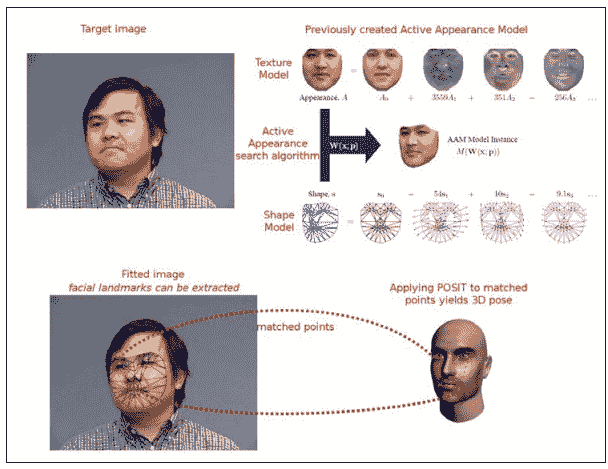

#### 章节算法概述

给定一张图像（前一张截图中的左上角图像），我们可以使用活动外观搜索算法来找到人头部的 2D 姿态。截图右上角的图像显示了用于搜索算法的先前训练好的活动外观模型。找到姿态后，可以使用 POSIT 来扩展结果到 3D 姿态。如果将此过程应用于视频序列，将获得检测的 3D 跟踪。

# 活动形状模型

如前所述，AAMs 需要形状模型，而这个角色由主动形状模型（ASMs）扮演。在接下来的章节中，我们将创建一个 ASM，它是一个形状变化的统计模型。形状模型是通过形状变化的组合生成的。需要一组标记的图像训练集，如 Timothy Cootes 在文章《主动形状模型--它们的训练和应用》中所述。为了构建人脸形状模型，需要几幅在人脸关键位置标记点的图像来描绘主要特征。以下截图显示了这样一个例子：

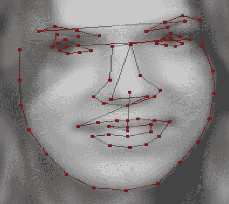

人脸上有 76 个标记点，这些点来自**MUCT**数据集。这些标记点通常手动标记，它们描绘了几个面部特征，如嘴巴轮廓、鼻子、眼睛、眉毛和面部形状，因为它们更容易追踪。

**Procrustes 分析**：一种用于分析形状集分布的统计形状分析方法。Procrustes 叠加通过最优地平移、旋转和均匀缩放对象来实现。

如果我们有前面提到的图像集，我们可以生成形状变化的统计模型。由于物体上的标记点描述了该物体的形状，我们将首先使用 Procrustes 分析将所有点集对齐到一个坐标系中，如果需要的话，然后通过一个向量*x*来表示每个形状。然后，我们将对数据进行主成分分析。然后我们可以使用以下公式来近似任何示例：

*x = x + Ps bs*

在前面的公式中，*x*是平均形状，*Ps*是一组正交变化模式，*bs*是一组形状参数。好吧，为了更好地理解这一点，我们将在本节的其余部分创建一个简单的应用程序，它将向我们展示如何处理 PCA 和形状模型。

为什么一定要使用 PCA 呢？因为 PCA 在减少我们模型参数数量时将真正帮助我们。我们还将看到，在本章稍后搜索给定图像时它能帮我们多少。以下是对 PCA 的描述（[`en.wikipedia.org/wiki/Principal_component_analysis`](http://en.wikipedia.org/wiki/Principal_component_analysis)）：

主成分分析（PCA）可以为用户提供一个低维度的图像，从其（在某种意义上）最有信息量的视角看，这是该对象的一个“影子”。这是通过仅使用前几个主成分来实现的，从而降低了变换数据的维度。

当我们看到以下图时，这一点变得清晰：

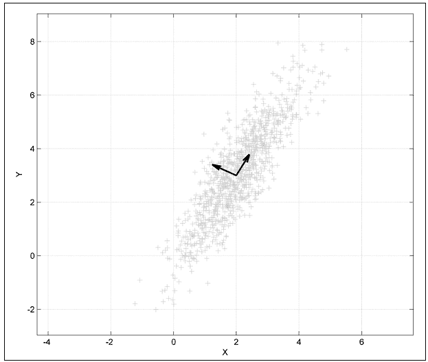

图像来源：[h t t p ://e n . w i k i p e d i a . o r g /w i k i /F i l e :G a u s s i a n S c a t t e r P C A . p n g](http://en.wikipedia.org/wiki/File:GaussianScatterPCA.png)

前面的图显示了以*(2,3)*为中心的多变量高斯分布的 PCA。显示的向量是协方差矩阵的特向量，它们的尾巴被移到了均值处。

这样，如果我们想用一个单参数来表示我们的模型，从指向截图右上角的方向的特向量取方向会是一个好主意。此外，通过稍微改变参数，我们可以外推数据并获得类似我们正在寻找的值。

# 了解 PCA

为了了解 PCA 如何帮助我们构建面部模型，我们将从一个主动形状模型开始，并测试一些参数。

由于面部检测和跟踪已经被研究了一段时间，因此在线上可以找到几个用于研究目的的面部数据库。我们将使用 IMM 数据库中的几个样本。

首先，让我们了解 PCA 类在 OpenCV 中的工作原理。我们可以从文档中得出结论，PCA 类用于计算一组向量的特殊基，这些基是来自输入向量集的协方差矩阵的主元向量。此类还可以使用投影和**反向投影**方法将向量转换到新坐标系中。这个新坐标系可以通过仅取其前几个分量来相当准确地近似。这意味着，我们可以用一个由投影向量在子空间中的坐标组成的更短的向量来表示来自高维空间的原向量。

由于我们希望用几个标量值来参数化，我们将主要使用类中的反向投影方法。它接受投影向量的主成分坐标并重建原始向量。如果我们保留了所有分量，我们可以检索原始向量，但如果只使用几个分量，差异将非常小；这就是使用 PCA 的原因之一。由于我们希望在原始向量周围有一些可变性，我们的参数化标量将能够外推原始数据。

此外，PCA 类可以将向量转换到由基定义的新坐标系中，并从该坐标系转换回来。从数学上讲，这意味着我们计算向量的投影，该投影是协方差矩阵的主元向量形成的子空间，正如文档中所示。

我们的方法是将我们的面部图像标注上地标，从而得到用于我们**点分布模型**（**PDM**）的训练集。如果我们有两个维度的*k*个对齐地标，我们的形状描述将看起来像这样：

*X = { x1, y1, x2, y2, ..., xk, yk}*

需要注意的是，我们需要对所有图像样本进行一致的标注。例如，如果第一幅图中嘴巴的左侧是地标编号*3*，那么在其他所有图像中它也必须是编号*3*。

这些特征点的序列将现在形成形状轮廓，给定的训练形状可以定义为向量。我们通常假设在这个空间中这种散布是高斯分布的，我们使用 PCA 来计算所有训练形状协方差矩阵的归一化特征向量和特征值。使用顶部的中心特征向量，我们将创建一个*2k * m*维度的矩阵，我们将称之为*P*。这样，每个特征向量描述了沿集合的变异的主模式。

现在，我们可以通过以下方程定义一个新的形状：

*X' = X' + Pb*

在这里，*X'*是所有训练图像的平均形状——我们只是平均每个特征点——而*b*是每个主成分的缩放值向量。这导致我们创建一个新的形状，通过修改*b*的值来实现。通常将*b*设置为在三个标准差内变化，以便生成的形状可以落在训练集内。

以下截图显示了三张不同图片的点标注嘴部特征点：

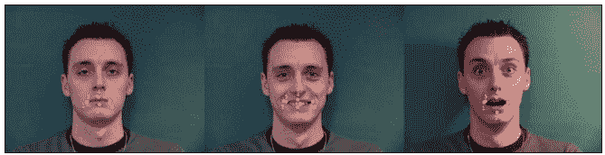

如前一个截图所示，形状是通过其特征点序列来描述的。可以使用像*GIMP*或*ImageJ*这样的程序，也可以在 OpenCV 中构建一个简单的应用程序来标注训练图像。我们假设用户已经完成了这个过程，并将点保存为所有训练图像的*x*和*y*特征点位置的序列，这些序列将被用于我们的 PCA 分析。然后，我们将在这个文件的第一个行添加两个参数，即训练图像的数量和读取列的数量。因此，对于*k*个 2D 点，这个数字将是*2*k*。

在以下数据中，我们有一个通过标注 IMM 数据库中的三个图像获得的该文件实例，其中*k*等于 5：

```py
 3 10 
    265 311 303 321 337 310 302 298 265 311 
    255 315 305 337 346 316 305 309 255 315 
    262 316 303 342 332 315 298 299 262 316

```

现在我们已经标注了图像，让我们将此数据转换为我们的形状模型。首先，将此数据加载到矩阵中。这将通过`loadPCA`函数实现。以下代码片段显示了`loadPCA`函数的使用：

```py
    PCA loadPCA(char* fileName, int& rows, int& cols,Mat& pcaset){ 
      FILE* in = fopen(fileName,"r"); 
      int a; 
      fscanf(in,"%d%d",&rows,&cols); 

      pcaset = Mat::eye(rows,cols,CV_64F); 
      int i,j; 

      for(i=0;i<rows;i++){ 
        for(j=0;j<cols;j++){ 
          fscanf(in,"%d",&a); 
          pcaset.at<double>(i,j) = a; 
        } 
      } 

      PCA pca(pcaset, // pass the data 
        Mat(), // we do not have a pre-computed mean vector, 
        // so let the PCA engine compute it 
        CV_PCA_DATA_AS_ROW, // indicate that the vectors 
        // are stored as matrix rows 
        // (use CV_PCA_DATA_AS_COL if the vectors are 
        // the matrix columns) 
        pcaset.cols// specify, how many principal components to retain 
      ); 
      return pca; 
    }

```

注意，我们的矩阵是在`pcaset = Mat::eye(rows,cols,CV_64F)`这一行创建的，并且为*2*k*个值分配了足够的空间。在两个`for`循环将数据加载到矩阵之后，我们使用数据、一个空矩阵（如果愿意，可以是我们预先计算的平均向量）调用 PCA 构造函数，如果只想计算一次。我们还指出，我们的向量将被存储为矩阵行，并且我们希望保持与成分数量相同的给定行数，尽管我们也可以只使用少数几个。

现在我们已经用我们的训练集填充了 PCA 对象，它拥有了根据参数回投影形状所需的一切。我们通过调用`PCA.backproject`，将参数作为行向量传递，并将回投影向量作为第二个参数接收来实现这一点：

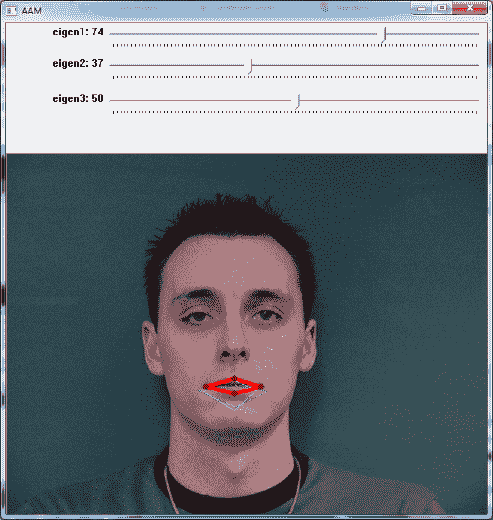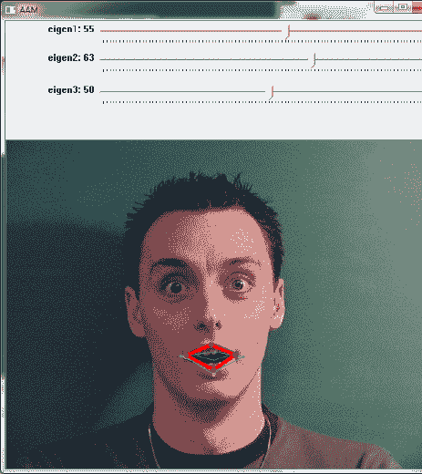

两个之前的截图显示了根据从滑块选择的参数选择的两个不同的形状配置。黄色和绿色的形状表示训练数据，而红色形状反映了从所选参数生成的形状。可以使用一个示例程序来实验 Active Shape Models，因为它允许用户尝试为模型尝试不同的参数。可以注意到，通过滑动条仅改变前两个标量值（对应于第一和第二种变化模式），我们可以得到一个非常接近训练形状的形状。这种可变性将帮助我们寻找 AAM 中的模型，因为它提供了插值形状。我们将在以下章节中讨论三角剖分、纹理、AAM 和 AAM 搜索。

# 三角剖分

由于我们寻找的形状可能会发生扭曲，例如开口的嘴巴，我们需要将我们的纹理映射回一个平均形状，然后对这种归一化纹理应用 PCA。为了做到这一点，我们将使用三角剖分。这个概念非常简单：我们将创建包含我们的标注点的三角形，然后从一个三角形映射到另一个三角形。OpenCV 附带一个名为`Subdiv2D`的便捷类，用于处理 Delaunay 三角剖分。你可以将其视为一种好的三角剖分，它将避免瘦三角形。

在数学和计算几何中，对于平面上点集*P*的 Delaunay 三角剖分是一个三角剖分 DT(P)，其中*P*中的任何点都不在 DT(P)中任何三角形的外接圆内。Delaunay 三角剖分最大化了三角剖分中所有三角形的最小角度；它们倾向于避免瘦三角形。这个三角剖分是以 Boris Delaunay 的名字命名的，因为他从 1934 年开始在这个领域的工作。

在创建了一个 Delaunay 细分之后，将使用`insert`成员函数将点填充到细分中。以下代码行将阐明直接使用三角剖分会是什么样的：

```py
    Subdiv2D* subdiv; 
    CvRect rect = { 0, 0, 640, 480 }; 

    subdiv = new Subdiv2D(rect); 

    std::vector<CvPoint> points; 

    //initialize points somehow 
    ... 

    //iterate through points inserting them in the subdivision 
    for(int i=0;i<points.size();i++){     
      float x = points.at(i).x; 
      float y = points.at(i).y; 
      Point2f fp(x, y); 
      subdiv->insert(fp); 
    }

```

注意，我们的点将位于一个矩形框架内，该框架作为参数传递给`Subdiv2D`。为了创建一个细分，我们需要实例化`Subdiv2D`类，如前所述。然后，为了创建三角剖分，我们需要使用`Subdiv2D`的`insert`方法插入点。这发生在前述代码中的`for`循环内。注意，点应该已经初始化，因为它们是我们通常用作输入的点。以下图显示了三角剖分可能的样子：

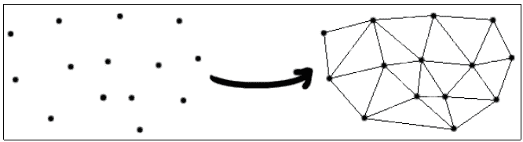

此图是前述代码对一组使用 Delaunay 算法生成三角剖分的点的输出。

为了遍历给定细分中的所有三角形，可以使用以下代码：

```py
    vector<Vec6f> triangleList; 

    subdiv->getTriangleList(triangleList); 
    vector<Point> pt(3); 

    for( size_t i = 0; i < triangleList.size(); i++ ) 
    { 
      Vec6f t = triangleList[i]; 
      pt[0] = Point(cvRound(t[0]), cvRound(t[1])); 
      pt[1] = Point(cvRound(t[2]), cvRound(t[3])); 
      pt[2] = Point(cvRound(t[4]), cvRound(t[5])); 
    }

```

给定一个细分，我们将通过一个`Vec6f`向量初始化其`triangleList`，这将为每组三个点节省空间，可以通过遍历`triangleList`获得，如前述`for`循环所示。

# 三角纹理扭曲

现在我们已经能够遍历细分三角形的各个部分，我们能够将原始标注图像中的一个三角形扭曲成生成的扭曲图像。这对于将纹理从原始形状映射到扭曲形状非常有用。以下代码片段将指导这个过程：

```py
    void warpTextureFromTriangle(Point2f srcTri[3], Mat originalImage, Point2f dstTri[3], Mat warp_final){ 

      Mat warp_mat(2, 3, CV_32FC1); 
      Mat warp_dst, warp_mask; 
      CvPoint trianglePoints[3]; 
      trianglePoints[0] = dstTri[0]; 
      trianglePoints[1] = dstTri[1]; 
      trianglePoints[2] = dstTri[2]; 
      warp_dst  = Mat::zeros(originalImage.rows, originalImage.cols, originalImage.type()); 
      warp_mask = Mat::zeros(originalImage.rows, originalImage.cols, originalImage.type()); 

      /// Get the Affine Transform 
      warp_mat = getAffineTransform(srcTri, dstTri); 

      /// Apply the Affine Transform to the src image 
      warpAffine(originalImage, warp_dst, warp_mat, warp_dst.size()); 
      cvFillConvexPoly(new IplImage(warp_mask), trianglePoints, 3, CV_RGB(255,255,255), CV_AA, 0);   
      warp_dst.copyTo(warp_final, warp_mask); 
    }

```

上述代码假设我们已经有三角形的顶点打包在`srcTri`数组中，目标顶点打包在`dstTri`数组中。2x3 的`warp_mat`矩阵用于从源三角形到目标三角形的仿射变换。更多信息可以参考 OpenCV 的`cvGetAffineTransform`文档：

`cvGetAffineTransform`函数以以下方式计算仿射变换的矩阵：

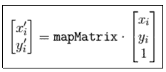

在前述方程中，目标*(i)*等于(*xi',yi'*)，源*(i)*等于(*xi, yi*)，而*i*等于*0, 1, 2*。

在检索到仿射矩阵后，我们可以将仿射变换应用于源图像。这是通过`warpAffine`函数完成的。由于我们不想在整个图像上执行此操作，我们只想关注我们的三角形，因此可以使用掩码来完成此任务。这样，最后一行只复制我们原始图像中的三角形，使用我们刚刚创建的掩码，该掩码是通过`cvFillConvexPoly`调用来创建的。

以下截图显示了将此过程应用于标注图像中每个三角形的结果。请注意，三角形被映射回面向观察者的对齐框架。此过程用于创建 AAM 的统计纹理：

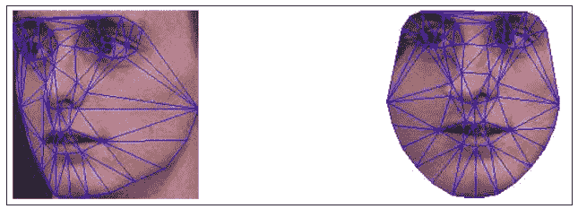

上述截图显示了将左图中所有映射的三角形扭曲到平均参考框架的结果。

# 模型实例化 - 玩转 AAM

AAMs 的一个有趣方面是它们能够轻松地插值我们训练图像上的模型。我们可以通过调整几个形状或模型参数来习惯它们的惊人表达能力。当我们改变形状参数时，我们的扭曲目标会根据训练的形状数据变化。另一方面，当外观参数被修改时，基础形状上的纹理也会被修改。我们的扭曲变换将把基础形状中的每个三角形转换到修改后的目标形状，这样我们就可以在张开嘴的上方合成一个闭嘴，如下面的截图所示：

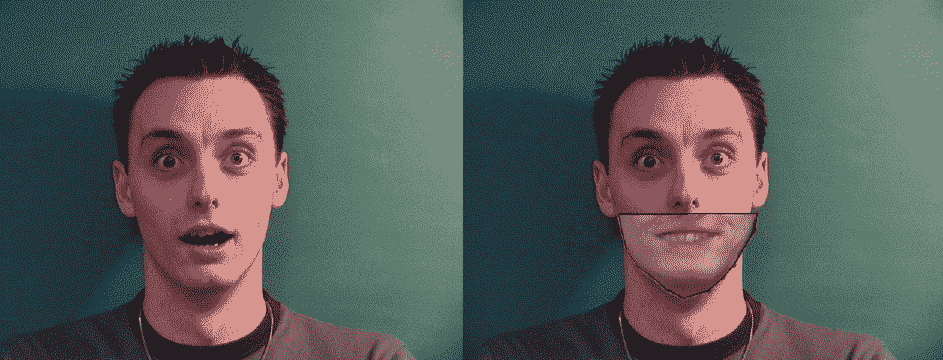

上述截图显示了通过在另一图像上对 Active Appearance Model 进行实例化而获得的合成闭嘴。它显示了如何将微笑的嘴巴与受人钦佩的面孔结合在一起，外推训练图像。

前面的截图是通过仅更改形状和纹理的三个参数获得的，这是 AAM 的目标。已经开发了一个示例应用程序，可在 [`www.packtpub.com/`](http://www.packtpub.com/) 上试用 AAM。实例化新模型只是滑动方程参数的问题，如 *获取 PCA 感觉* 部分中定义的那样。你应该注意，AAM 搜索和拟合依赖于这种灵活性，以找到与训练位置不同的给定捕获帧的最佳匹配。我们将在下一节中看到这一点。

# AAM 搜索和拟合

使用我们新鲜、新的组合形状和纹理模型，我们找到了一种描述面部如何不仅在形状上，而且在外观上发生变化的好方法。现在，我们想要找到哪组 *p* 形状和 *λ* 外观参数将使我们的模型尽可能接近给定的输入图像 *I(x)*。我们可以在 *I(x)* 的坐标系中自然地计算我们的实例化模型和给定输入图像之间的误差，或者将点映射回基础外观并计算那里的差异。我们将采用后一种方法。这样，我们想要最小化以下函数：

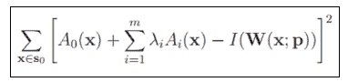

在前面的方程中，*S0* 表示像素 *x* 等于 *(x,y)T* 且位于 AAM 基础网格内部的像素集，*A0(x)* 是我们的基础网格纹理，*Ai(x)* 是来自 PCA 的外观图像，而 *W(x;p)* 是将像素从输入图像返回到基础网格框架的变形。

通过多年的研究，已经提出了几种用于这种最小化的方法。最初的想法是使用一种加性方法，其中 *∆pi* 和 *∆λi* 被计算为误差图像的线性函数，然后形状参数 *p* 和外观 *λ* 通过迭代更新为 *pi ← pi + ∆pi* 和 *λi ← λi + ∆λi*。尽管有时可以发生收敛，但增量并不总是依赖于当前参数，这可能会导致发散。另一种基于梯度下降算法的研究方法非常慢，因此寻求另一种找到收敛的方法。不是更新参数，而是整个变形可以更新。这种方式，Ian Mathews 和 Simon Baker 在一篇名为 *Active Appearance Models Revisited* 的著名论文中提出了一种组合方法。更多细节可以在论文中找到，但它在拟合方面的重要贡献是将最密集的计算带到了预计算步骤，正如以下截图所示：

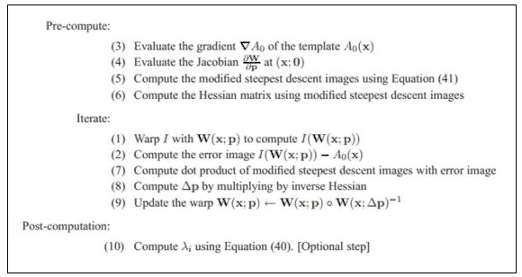

注意，更新是通过组合步骤发生的，正如步骤（9）所示（参见前面的截图）。以下截图显示了论文中的方程（40）和（41）：

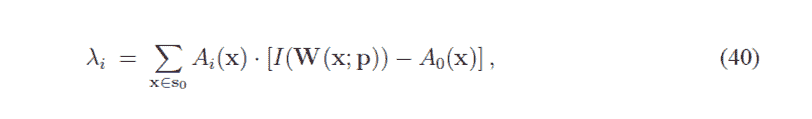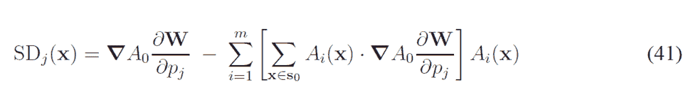

尽管前面提到的算法将从接近最终位置的位置开始大多数情况下都会很好地收敛，但在旋转、平移或比例有较大差异的情况下可能并非如此。我们可以通过全局 2D 相似变换的参数化来引入更多信息以促进收敛。这是论文中的方程*42*，如下所示：

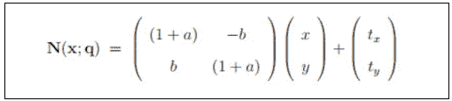

在前面的方程中，四个参数*q* = (*a*, *b*, *t[x]*, *t[y]*)有以下解释。第一对(*a*, *b*)与比例*k*和旋转*θ*相关：*a*等于*k* *cos θ - 1*，而*b = k sin θ*。第二对(*t[x]*, *t[y]*)是*x*和*y*平移，如*Active Appearance Models Revisited*论文中提出的那样。

通过更多的数学变换，您最终可以使用前面的算法通过全局 2D 变换找到最佳图像拟合。

由于组合变换算法具有几个性能优势，我们将使用 AAM Revisited 论文中描述的算法：*逆组合投影算法*。记住，在这个方法中，拟合过程中外观变化的影响可以预先计算或投影出去，从而提高 AAM 拟合性能。

下面的截图显示了使用逆组合投影和我们的 AAM 拟合算法在 MUCT 数据集的不同图像上的收敛情况：

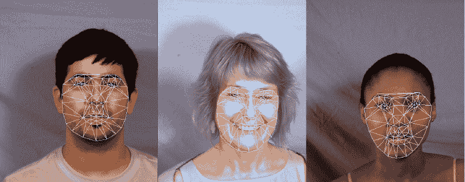

前面的截图显示了使用逆组合投影和我们的 AAM 拟合算法在 AAM 训练集外部面上成功收敛的情况。

# POSIT

在我们找到我们的特征点的 2D 位置后，我们可以使用 POSIT 推导出我们模型的 3D 姿态。3D 对象的位置*P*定义为 3 x 3 旋转矩阵*R*和 3D 平移向量*T*；因此，*P*等于*[ R | T ]*。

本节的大部分内容基于 Javier Barandiaran 的*OpenCV POSIT*教程。

正如其名所示，POSIT 在多次迭代中使用**从正射投影和缩放中获取姿态**（**POS**）算法，因此它是 POS 的迭代缩写。其工作假设是我们可以检测和匹配图像中对象四个或更多非共面的特征点，并且我们知道它们在对象上的相对几何形状。

该算法的主要思想是，假设所有模型点都在同一平面上，我们可以找到一个很好的对象姿态近似，因为它们的深度彼此之间并不非常不同，与相机到人脸的距离相比。在获得初始姿态后，通过求解线性系统找到对象的旋转矩阵和平移向量。然后，迭代地使用近似的姿态来更好地计算特征点的缩放正交投影，随后对这些投影而不是原始投影应用 POS。有关更多信息，您可以参考 DeMenton 的论文，*25 行代码中的基于模型的物体姿态*。

# 深入 POSIT

为了使 POSIT 能够工作，你需要至少四个非共面的 3D 模型点和它们在 2D 图像中的对应匹配。我们将为此添加一个终止条件，因为 POSIT 是一个迭代算法，通常是一定次数的迭代或距离参数。然后我们将调用包含在 `calib3d_c.h` 中的 `cvPOSIT` 函数，该函数会得到旋转矩阵和平移向量。

作为示例，我们将遵循 Javier Barandiaran 的教程，该教程使用 POSIT 获取一个立方体的姿态。模型是通过四个点创建的。它使用以下代码初始化：

```py
    float cubeSize = 10.0; 
    std::vector<CvPoint3D32f> modelPoints; 
    modelPoints.push_back(cvPoint3D32f(0.0f, 0.0f, 0.0f)); 
    modelPoints.push_back(cvPoint3D32f(0.0f, 0.0f, cubeSize)); 
    modelPoints.push_back(cvPoint3D32f(cubeSize, 0.0f, 0.0f)); 
    modelPoints.push_back(cvPoint3D32f(0.0f, cubeSize, 0.0f)); 
    CvPOSITObject *positObject = cvCreatePOSITObject( &modelPoints[0],   
      static_cast<int>(modelPoints.size()) );

```

注意，模型本身是通过 `cvCreatePOSITObject` 方法创建的，该方法返回一个 `CvPOSITObject` 方法，该方法将在 `cvPOSIT` 函数中使用。请注意，姿态计算将参照第一个模型点，这使得将其放置在原点是一个好主意。

然后，我们需要将 2D 图像点放入另一个向量中。记住，它们必须按照模型点插入的顺序放入数组中；这样，第 *i* 个 2D 图像点与第 *i* 个 3D 模型点匹配。这里的一个难点是，2D 图像点的原点位于图像中心，这可能需要你进行平移。你可以插入以下 2D 图像点（当然，它们将根据用户的匹配而变化）：

```py
    std::vector<CvPoint2D32f> srcImagePoints; 
    srcImagePoints.push_back( cvPoint2D32f( -48, -224 ) ); 
    srcImagePoints.push_back( cvPoint2D32f( -287, -174 ) ); 
    srcImagePoints.push_back( cvPoint2D32f( 132, -153 ) ); 
    srcImagePoints.push_back( cvPoint2D32f( -52, 149 ) );

```

现在，你只需要为矩阵分配内存，创建终止条件，然后调用 `cvPOSIT`，如下面的代码片段所示：

```py
    //Estimate the pose 
    float* rotation_matrix = new float[9]; 
    float* translation_vector = new float[3]; 
    CvTermCriteria criteria = cvTermCriteria(CV_TERMCRIT_EPS | 
      CV_TERMCRIT_ITER, 100, 1.0e-4f); 
    cvPOSIT( positObject, &srcImagePoints[0], FOCAL_LENGTH, criteria, 
      rotation_matrix, translation_vector );

```

迭代完成后，`cvPOSIT` 将结果存储在 `rotation_matrix` 和 `translation_vector` 中。以下截图显示了插入的 `srcImagePoints` 以及显示旋转和平移结果的坐标轴：

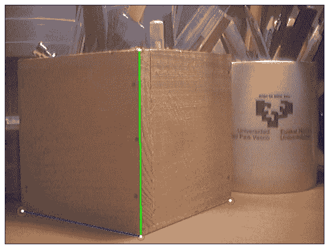

参考前面的截图，让我们看看以下输入点和运行 POSIT 算法的结果：

+   白色圆圈显示输入点，而坐标轴显示结果模型姿态。

+   确保你使用通过校准过程获得的相机焦距。你可能想检查 [第七章](https://www.packtpub.com/sites/default/files/downloads/NaturalFeatureTrackingforAugmentedReality.pdf) 中 *相机校准* 部分提供的校准过程之一，*自然特征跟踪增强现实*。当前 POSIT 的实现将只允许正方形像素，因此在 *x* 和 *y* 轴上不会有焦距的空间。

+   期望以下格式的旋转矩阵：

    +   [rot[0] rot[1] rot[2]]

    +   [rot[3] rot[4] rot[5]]

    +   [rot[6] rot[7] rot[8]]

+   平移向量将具有以下格式：

    +   [trans[0]]

    +   [trans[1]]

    +   [trans[2]]

# POSIT 和头部模型

为了将 POSIT 用作头部姿态的工具，你需要使用一个 3D 头部模型。可以从科英布拉大学系统与机器人研究所获得一个，可以在[`aifi.isr.uc.pt/Downloads/OpenGL/glAnthropometric3DModel.cpp`](http://aifi.isr.uc.pt/Downloads/OpenGL/glAnthropometric3DModel.cpp)找到。请注意，模型可以从它所说的位置获得：

```py
    float Model3D[58][3]= {{-7.308957,0.913869,0.000000}, ...

```

模型可以在以下截图中看到：

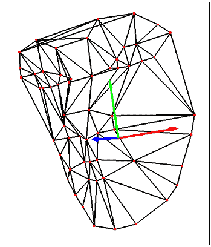

前面的截图显示了可用于 POSIT 的 58 点 3D 头部模型。

为了使 POSIT 工作，必须相应地匹配对应于 3D 头部模型的点。请注意，至少需要四个非共面的 3D 点和它们对应的 2D 投影才能使 POSIT 工作，因此这些必须作为参数传递，基本上就像在*深入 POSIT*部分所描述的那样。请注意，这个算法在匹配点数方面是线性的。以下截图显示了匹配应该如何进行：

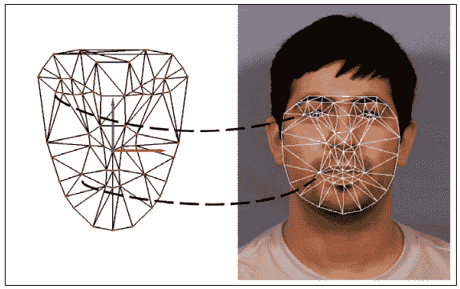

前面的截图显示了 3D 头部模型和 AAM 网格正确匹配的点。

# 从摄像头或视频文件进行跟踪

现在所有工具都已组装完毕，以实现 6 自由度的头部跟踪，我们可以将其应用于相机流或视频文件。OpenCV 提供了`VideoCapture`类，可以按以下方式使用（有关更多详细信息，请参阅第一章的*访问摄像头*部分，*Raspberry Pi 的卡通化皮肤变换器*）：

```py
    #include "opencv2/opencv.hpp" 

    using namespace cv; 

    int main(int, char**) 
    { 
      VideoCapture cap(0);// opens the default camera, could use a 
                        // video file path instead           

      if(!cap.isOpened()) // check if we succeeded 
        return -1; 

      AAM aam = loadPreviouslyTrainedAAM(); 
      HeadModel headModel = load3DHeadModel(); 
      Mapping mapping = mapAAMLandmarksToHeadModel(); 

      Pose2D pose = detectFacePosition(); 

      while(1) 
      { 
        Mat frame; 
        cap >> frame; // get a new frame from camera 

        Pose2D new2DPose = performAAMSearch(pose, aam); 
        Pose3D new3DPose = applyPOSIT(new2DPose, headModel, mapping); 

        if(waitKey(30) >= 0) break; 
      } 

      // the camera will be deinitialized automatically in VideoCapture 
      // destructor 
      return 0; 
    }

```

该算法的工作原理如下。通过`VideoCapture cap(0)`初始化视频捕获，以便使用默认的摄像头。现在我们已经使视频捕获工作，我们还需要加载我们训练好的活动外观模型，这将在`loadPreviouslyTrainedAAM`伪代码映射中发生。我们还将加载用于 POSIT 的 3D 头部模型以及我们的映射变量中地标点到 3D 头部点的映射。

在加载了所有需要的工具之后，我们需要从一个已知的姿态初始化算法，这是一个已知的 3D 位置、已知的旋转和一组已知的 AAM 参数。这可以通过 OpenCV 高度文档化的 Haar 特征分类器人脸检测器自动完成（更多细节请参阅第四章的*人脸检测*部分，*非刚性人脸跟踪*，或在 OpenCV 的级联分类器文档中），或者我们可以从先前标注的帧中手动初始化姿态。一种暴力方法，即对每个矩形运行 AAM 拟合，也可以使用，因为它在第一帧中会非常慢。请注意，我们所说的初始化是指通过它们的参数找到 AAM 的 2D 特征点。

当一切加载完成后，我们可以遍历由`while`循环定义的主循环。在这个循环中，我们首先查询下一个捕获的帧，然后运行一个主动外观模型拟合，以便我们可以在下一帧上找到特征点。由于当前位置在这一步非常重要，所以我们将其作为参数传递给伪代码函数`performAAMSearch(pose,aam)`。如果我们找到当前姿态，这通过错误图像收敛来表示，我们将获得下一个特征点位置，因此我们可以将它们提供给 POSIT。这发生在以下行，`applyPOSIT(new2DPose, headModel, mapping)`，其中新的 2D 姿态作为参数传递，以及我们之前加载的`headModel`和映射。之后，我们可以以坐标轴或增强现实模型的方式渲染获得的姿态中的任何 3D 模型。由于我们有特征点，可以通过模型参数化获得更多有趣的效果，例如张开嘴巴或改变眉毛位置。

由于此过程依赖于前一个姿态进行下一个估计，我们可能会累积误差并偏离头部位置。一种解决方案是在每次发生时重新初始化此过程，检查给定的错误图像阈值。另一个需要注意的因素是在跟踪时使用过滤器，因为可能会发生抖动。对于每个平移和旋转坐标的简单均值滤波器可以给出合理的结果。

# 摘要

在本章中，我们讨论了如何将主动外观模型（AAM）与 POSIT 算法结合以获得 3D 头部姿态。我们概述了如何创建、训练和操作 AAM，并且你可以将这些背景知识应用于任何其他领域，例如医学、成像或工业。除了处理 AAM 之外，我们还熟悉了 Delaunay 细分，并学习了如何使用这种有趣的结构作为三角网格。我们还展示了如何使用 OpenCV 函数在三角形上执行纹理映射。在 AAM 拟合中，我们还探讨了一个有趣的话题。尽管只描述了逆合成投影算法，但我们可以通过简单地使用其输出轻松地获得多年研究的结果。

在对 AAM 有足够的理论和实践之后，我们深入探讨了 POSIT 的细节，以便将 2D 测量与 3D 测量相结合，解释了如何通过模型点之间的匹配来拟合 3D 模型。我们通过展示如何通过检测使用在线人脸追踪器中的所有工具来结束本章，这产生了 6 个自由度的头部姿态——3 个用于旋转，3 个用于平移。本章的完整代码可以从[`www.packtpub.com/`](http://www.packtpub.com/)下载。

# 参考文献

+   *主动外观模型，T.F. Cootes, G. J. Edwards, 和 C. J. Taylor, ECCV, 2:484-498, 1998* ([`www.cs.cmu.edu/~efros/courses/AP06/Papers/cootes-eccv-98.pdf`](http://www.cs.cmu.edu/~efros/courses/AP06/Papers/cootes-eccv-98.pdf))

+   *主动形状模型及其训练与应用，T.F. Cootes，C.J. Taylor，D.H. Cooper，和 J. Graham，计算机视觉与图像理解，第 61 卷，第 38-59 页，1995 年，（[`www.wiau.man.ac.uk/~bim/Papers/cviu95.pdf`](http://www.wiau.man.ac.uk/~bim/Papers/cviu95.pdf))* 

+   *MUCT 标记人脸数据库，S. Milborrow，J. Morkel，和 F. Nicolls，南非模式识别协会，2010 年，（[`www.milbo.org/muct/`](http://www.milbo.org/muct/))* 

+   *IMM 人脸数据库 - 240 张人脸图像的注释数据集，Michael M. Nordstrom，Mads Larsen，Janusz Sierakowski，以及 Mikkel B.**Stegmann，丹麦技术大学信息与数学建模系，2004 年，（[`www2.imm.dtu.dk/~aam/datasets/datasets.html`](http://www2.imm.dtu.dk/~aam/datasets/datasets.html))* 

+   *关于空球面，B. Delaunay，苏联科学院院刊，数学和自然科学部，第 7 卷，第 793-800 页，1934 年*

+   *用于面部表情识别和单目头部姿态估计的主动外观模型，P. Martins，硕士论文，2008 年*

+   *重新审视主动外观模型，国际计算机视觉杂志，第 60 卷，第 2 期，第 135-164 页，I. Mathews 和 S. Baker，2004 年 11 月，（[`www.ri.cmu.edu/pub_files/pub4/matthews_iain_2004_2/matthews_iain_2004_2.pdf`](http://www.ri.cmu.edu/pub_files/pub4/matthews_iain_2004_2/matthews_iain_2004_2.pdf))* 

+   *POSIT 教程，Javier Barandiaran，（[`opencv.willowgarage.com/wiki/Posit`](http://opencv.willowgarage.com/wiki/Posit))* 

+   *25 行代码实现基于模型的物体姿态，国际计算机视觉杂志，第 15 卷，第 123-141 页，Dementhon 和 L.S Davis，1995 年，（[`www.cfar.umd.edu/~daniel/daniel_papersfordownload/Pose25Lines.pdf`](http://www.cfar.umd.edu/~daniel/daniel_papersfordownload/Pose25Lines.pdf))* 
