# 使用特征脸或费舍尔脸进行面部识别

本章涵盖以下内容：

+   面部检测

+   面部预处理

+   从收集到的面部训练机器学习算法

+   面部识别

+   完成细节

# 面部识别和面部检测简介

面部识别是将标签贴在已知面部上的过程。就像人类通过看到他们的面孔来识别家人、朋友和名人一样，计算机学习识别已知面部有许多技术。这些通常涉及四个主要步骤：

1.  **面部检测**：这是在图像中定位面部区域的过程（如下截图中心附近的大矩形）。这一步不关心这个人是谁，只关心它是一个人脸。

1.  **面部预处理**：这是调整面部图像以使其看起来更清晰并与其他面部相似的过程（如下截图顶部中央的小灰度面部图像）。

1.  **收集和学习面部**：这是保存许多预处理后的面部（对于应该被识别的每个人），然后学习如何识别它们的过程。

1.  **面部识别**：这是检查收集到的人中谁与相机中的面部最相似的过程（如下截图右上角的小矩形）。

注意，短语**面部识别**通常被公众用于查找面部位置（即面部检测，如步骤 1 中所述），但本书将使用正式的定义，面部识别指步骤 4，面部检测指*步骤 1*。

以下截图显示了最终的`WebcamFaceRec`项目，包括右上角的小矩形突出显示识别的人。同时注意旁边的置信度条，它位于预处理后的面部旁边（矩形标记面部顶部中央的小面部），在这种情况下，显示大约 70%的置信度，表明它已正确识别了正确的人：

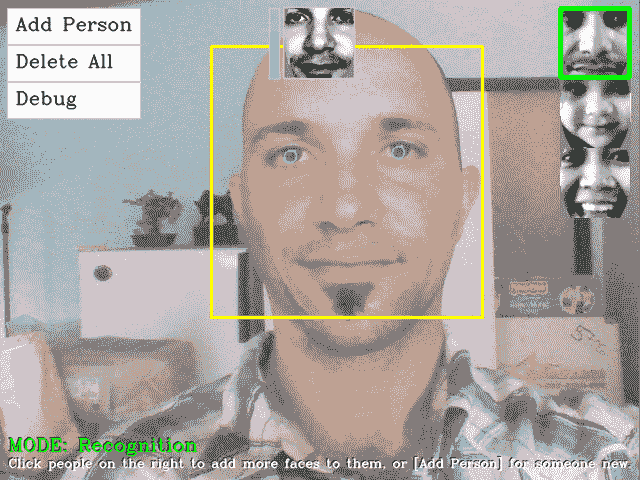

当前的人脸检测技术在现实世界条件下相当可靠，而当前的人脸识别技术在现实世界条件下使用时可靠性要低得多。例如，很容易找到显示人脸识别准确率超过 95%的研究论文，但当你自己测试这些相同的算法时，你可能会经常发现准确率低于 50%。这源于当前的人脸识别技术对图像中的精确条件非常敏感，例如光照类型、光照方向和阴影、人脸的精确方向、面部表情以及人的当前情绪。如果它们在训练（收集图像）以及测试（从摄像头图像）时都保持恒定，那么人脸识别应该会工作得很好，但如果人在训练时站在房间灯光的左侧，而在测试时站在摄像头的右侧，可能会得到相当糟糕的结果。因此，用于训练的数据集非常重要。

人脸预处理（*第二步*）旨在减少这些问题，例如确保人脸始终看起来具有相似的亮度和对比度，并可能确保人脸的特征始终位于相同的位置（例如将眼睛和/或鼻子对齐到某些位置）。一个良好的人脸预处理阶段将有助于提高整个人脸识别系统的可靠性，因此本章将重点介绍人脸预处理方法。

尽管媒体上关于人脸识别在安全方面的夸大其词，但单独依靠当前的人脸识别方法不太可能足够可靠，以用于任何真正的安全系统，但它们可以用于不需要高可靠性的目的，例如为进入房间或看到你时说出你名字的机器人播放个性化的音乐。还有各种人脸识别的实际扩展，如性别识别、年龄识别和情绪识别。

# 第一步 - 人脸检测

直到 2000 年，用于寻找面部的方法有很多种，但它们要么非常慢，要么非常不可靠，或者两者兼而有之。2001 年，Viola 和 Jones 发明了基于 Haar 的级联分类器用于物体检测，2002 年，Lienhart 和 Maydt 对其进行了改进。结果是，这个物体检测器既快（它可以在典型的桌面电脑上使用 VGA 摄像头实时检测面部）又可靠（它正确检测大约 95%的前置面部）。这个物体检测器彻底改变了面部识别领域（以及机器人学和计算机视觉领域），因为它最终实现了实时面部检测和面部识别，尤其是 Lienhart 本人还编写了与 OpenCV 一起免费提供的物体检测器！它不仅适用于正面面部，还适用于侧面视角的面部（称为侧面面部）、眼睛、嘴巴、鼻子、公司标志以及许多其他物体。

在 OpenCV v2.0 中，这个物体检测器被扩展，以使用 Ahonen、Hadid 和 Pietikäinen 在 2006 年的工作成果中的 LBP 特征进行检测，因为基于 LBP 的检测器可能比基于 Haar 的检测器快几倍，而且没有许多 Haar 检测器所面临的许可问题。

基于 Haar 的面部检测器的基本思想是，如果你观察大多数正面面部，眼睛所在区域应该比额头和脸颊暗，嘴巴所在区域应该比脸颊暗，等等。它通常进行大约 20 次这样的比较来决定是否为面部，但它必须在图像的每个可能位置和每个可能的面部大小上进行这种操作，因此实际上它通常每张图像都要进行数千次检查。基于 LBP 的面部检测器的基本思想与基于 Haar 的类似，但它使用像素强度比较的直方图，例如边缘、角点和平坦区域。

而不是让一个人决定哪些比较最能定义面部，基于 Haar 和 LBP 的面部检测器都可以自动训练，从大量图像中找到面部，信息存储为 XML 文件以供以后使用。这些级联分类器检测器通常使用至少 1,000 张独特的面部图像和 10,000 张非面部图像（例如树木、汽车和文本的照片）进行训练，即使在多核桌面电脑上训练过程也可能需要很长时间（通常 LBP 需要几个小时，而 Haar 需要一周！）幸运的是，OpenCV 附带了一些预训练的 Haar 和 LBP 检测器供你使用！实际上，你只需将不同的级联分类器 XML 文件加载到物体检测器中，就可以检测正面面部、侧面（侧面视角）面部、眼睛或鼻子，并根据你选择的 XML 文件选择 Haar 或 LBP 检测器。

# 使用 OpenCV 实现面部检测

如前所述，OpenCV v2.4 包含各种预训练的 XML 检测器，可用于不同的目的。以下表格列出了其中一些最受欢迎的 XML 文件：

| **级联分类器类型** | **XML 文件名** |
| --- | --- |
| 人脸检测器（默认） | `haarcascade_frontalface_default.xml` |
| 人脸检测器（快速 Haar） | `haarcascade_frontalface_alt2.xml` |
| 人脸检测器（快速 LBP） | `lbpcascade_frontalface.xml` |
| 轮廓（侧面）人脸检测器 | `haarcascade_profileface.xml` |
| 眼睛检测器（左眼和右眼分开） | `haarcascade_lefteye_2splits.xml` |
| 嘴巴检测器 | `haarcascade_mcs_mouth.xml` |
| 鼻子检测器 | `haarcascade_mcs_nose.xml` |
| 全身检测器 | `haarcascade_fullbody.xml` |

基于 Haar 的检测器存储在 OpenCV 根目录的 `datahaarcascades` 文件夹中，而基于 LBP 的检测器存储在 `datalbpcascades` 文件夹中，例如 `C:opencvdatalbpcascades`。

对于我们的面部识别项目，我们希望检测正面人脸，因此让我们使用 LBP 人脸检测器，因为它是最快的，并且没有专利许可问题。请注意，OpenCV v2.x 中包含的此预训练 LBP 人脸检测器没有像预训练的 Haar 人脸检测器那样经过良好的调整，因此如果您想要更可靠的人脸检测，则可能需要训练自己的 LBP 人脸检测器或使用 Haar 人脸检测器。

# 加载 Haar 或 LBP 检测器以进行物体或人脸检测

要执行物体或人脸检测，首先您必须使用 OpenCV 的 `CascadeClassifier` 类加载预训练的 XML 文件，如下所示：

```py
    CascadeClassifier faceDetector; 
    faceDetector.load(faceCascadeFilename);

```

通过提供不同的文件名，可以加载 Haar 或 LBP 检测器。在使用此功能时，一个常见的错误是提供错误的文件夹或文件名，但根据您的构建环境，`load()` 方法将返回 `false` 或生成一个 C++ 异常（并使用断言错误退出您的程序）。因此，最好将 `load()` 方法用 `try... catch` 块包围，并在出现问题时向用户显示一个友好的错误消息。许多初学者会跳过错误检查，但显示帮助消息对于用户来说至关重要，否则您可能会花费很长时间调试代码的其他部分，最终意识到某些内容没有正确加载。以下是一个简单的错误消息示例：

```py
    CascadeClassifier faceDetector; 
    try { 
      faceDetector.load(faceCascadeFilename); 
    } catch (cv::Exception e) {} 
    if ( faceDetector.empty() ) { 
      cerr << "ERROR: Couldn't load Face Detector ("; 
      cerr << faceCascadeFilename << ")!" << endl; 
      exit(1); 
    }

```

# 访问摄像头

要从计算机的摄像头或视频文件中捕获帧，您可以简单地调用 `VideoCapture::open()` 函数，传入摄像头编号或视频文件名，然后使用 C++ 流操作符捕获帧，如第一章“访问摄像头”部分所述，第一章，“Raspberry Pi 的卡通化器和皮肤变换器”。

# 使用 Haar 或 LBP 分类器检测物体

既然我们已经加载了分类器（初始化期间只加载一次），我们就可以用它来检测每个新摄像头帧中的人脸。但首先，我们应该对摄像头图像进行一些初始处理，以便进行人脸检测，具体步骤如下：

1.  **灰度颜色转换**：人脸检测仅适用于灰度图像。因此，我们应该将彩色摄像头帧转换为灰度。

1.  **缩小摄像头图像**：人脸检测的速度取决于输入图像的大小（对于大图像来说非常慢，但对于小图像来说很快），即使在低分辨率下，检测仍然相当可靠。因此，我们应该将摄像头图像缩小到更合理的大小（或者，如稍后所述，在检测器中将`minFeatureSize`变量的值设置得很大）。

1.  **直方图均衡化**：在低光照条件下，人脸检测的可靠性不高。因此，我们应该进行直方图均衡化以改善对比度和亮度。

# 灰度颜色转换

我们可以使用`cvtColor()`函数轻松地将 RGB 彩色图像转换为灰度。但我们应该只在知道我们有一个彩色图像的情况下这样做（也就是说，它不是一个灰度摄像头），并且我们必须指定输入图像的格式（通常在桌面上是 3 通道 BGR，在移动设备上是 4 通道 BGRA）。因此，我们应该允许三种不同的输入颜色格式，如下面的代码所示：

```py
    Mat gray; 
    if (img.channels() == 3) { 
      cvtColor(img, gray, CV_BGR2GRAY); 
    } 
    else if (img.channels() == 4) { 
      cvtColor(img, gray, CV_BGRA2GRAY); 
    } 
    else { 
      // Access the grayscale input image directly. 
      gray = img; 
    }

```

# 缩小摄像头图像

我们可以使用`resize()`函数将图像缩小到特定大小或缩放因子。人脸检测通常对任何大于 240x240 像素的图像大小效果都很好（除非你需要检测远离摄像头的面孔），因为人脸检测会寻找大于`minFeatureSize`（通常是 20x20 像素）的人脸。所以让我们将摄像头图像缩小到 320 像素宽；无论是 VGA 摄像头还是五百万像素的 HD 摄像头，这都无关紧要。同时，记住并放大检测结果也很重要，因为如果你在缩小的图像中检测到人脸，那么结果也会被缩小。请注意，你不必缩小输入图像，也可以在检测器中将`minFeatureSize`变量的值设置得很大。我们还必须确保图像不会变得过宽或过窄。例如，当 800x400 的宽屏图像缩小到 300x200 时，会使人物看起来很瘦。因此，我们必须保持输出图像的宽高比（宽度和高度的比率）与输入相同。让我们计算图像宽度需要缩小多少，然后应用相同的缩放因子到高度，如下所示：

```py
    const int DETECTION_WIDTH = 320; 
    // Possibly shrink the image, to run much faster. 
    Mat smallImg; 
    float scale = img.cols / (float) DETECTION_WIDTH; 
    if (img.cols > DETECTION_WIDTH) { 
      // Shrink the image while keeping the same aspect ratio. 
      int scaledHeight = cvRound(img.rows / scale); 
      resize(img, smallImg, Size(DETECTION_WIDTH, scaledHeight)); 
    } 
    else { 
      // Access the input directly since it is already small. 
      smallImg = img; 
    }

```

# 直方图均衡化

我们可以使用`equalizeHist()`函数轻松地进行直方图均衡化，以改善图像的对比度和亮度。有时这会使图像看起来很奇怪，但通常应该提高亮度和对比度，并有助于人脸检测。`equalizeHist()`函数的使用方法如下：

```py
    // Standardize the brightness & contrast, such as 
    // to improve dark images. 
    Mat equalizedImg; 
    equalizeHist(inputImg, equalizedImg);

```

# 检测人脸

现在我们已经将图像转换为灰度，缩小了图像，并均衡了直方图，我们就可以使用`CascadeClassifier::detectMultiScale()`函数来检测面部了！我们向此函数传递了许多参数：

+   `minFeatureSize`：此参数确定我们关心的最小面部大小，通常是 20x20 或 30x30 像素，但这取决于你的使用情况和图像大小。如果你在摄像头或智能手机上执行面部检测，其中面部始终非常靠近摄像头，你可以将其放大到 80 x 80 以获得更快的检测，或者如果你想检测远处的面部，例如在海滩上和朋友在一起，那么保持为 20x20。

+   `searchScaleFactor`：此参数确定要查找多少种不同大小的面部；通常它会是`1.1`，以获得良好的检测效果，或者`1.2`以获得更快的检测速度，但可能不会经常找到面部。

+   `minNeighbors`：此参数确定检测器应该有多确信它已经检测到面部，通常值为`3`，但如果你想获得更可靠的面部，即使许多面部没有被检测到，你也可以将其设置得更高。

+   `flags`：此参数允许你指定是否寻找所有面部（默认）或只寻找最大的面部（`CASCADE_FIND_BIGGEST_OBJECT`）。如果你只寻找最大的面部，它应该运行得更快。你可以添加几个其他参数来使检测速度提高大约 1%或 2%，例如`CASCADE_DO_ROUGH_SEARCH`或`CASCADE_SCALE_IMAGE`。

`detectMultiScale()`函数的输出将是一个`cv::Rect`类型对象的`std::vector`。例如，如果它检测到两个面部，那么它将在输出中存储两个矩形的数组。`detectMultiScale()`函数的使用方法如下：

```py
    int flags = CASCADE_SCALE_IMAGE; // Search for many faces. 
    Size minFeatureSize(20, 20);     // Smallest face size. 
    float searchScaleFactor = 1.1f;  // How many sizes to search. 
    int minNeighbors = 4;            // Reliability vs many faces. 

// Detect objects in the small grayscale image. 
std::vector<Rect> faces; 
faceDetector.detectMultiScale(img, faces, searchScaleFactor,  
                minNeighbors, flags, minFeatureSize);

```

我们可以通过查看我们矩形向量中存储的元素数量来查看是否检测到了任何面部；即，通过使用`objects.size()`函数。

如前所述，如果我们给面部检测器一个缩小的图像，结果也会缩小，所以如果我们想了解原始图像的面部区域，我们需要将其放大。我们还需要确保图像边缘的面部完全位于图像内，因为如果发生这种情况，OpenCV 现在会抛出异常，如下面的代码所示：

```py
    // Enlarge the results if the image was temporarily shrunk. 
    if (img.cols > scaledWidth) { 
      for (int i = 0; i < (int)objects.size(); i++ ) { 
        objects[i].x = cvRound(objects[i].x * scale); 
        objects[i].y = cvRound(objects[i].y * scale); 
        objects[i].width = cvRound(objects[i].width * scale); 
        objects[i].height = cvRound(objects[i].height * scale); 
      } 
    } 
    // If the object is on a border, keep it in the image. 
    for (int i = 0; i < (int)objects.size(); i++ ) { 
      if (objects[i].x < 0) 
        objects[i].x = 0; 
      if (objects[i].y < 0) 
        objects[i].y = 0; 
      if (objects[i].x + objects[i].width > img.cols) 
        objects[i].x = img.cols - objects[i].width; 
      if (objects[i].y + objects[i].height > img.rows) 
        objects[i].y = img.rows - objects[i].height; 
    }

```

注意，前面的代码将寻找图像中的所有面部，但如果你只关心一个面部，那么你可以按以下方式更改标志变量：

```py
    int flags = CASCADE_FIND_BIGGEST_OBJECT |  
                CASCADE_DO_ROUGH_SEARCH;

```

`WebcamFaceRec`项目包括 OpenCV 的 Haar 或 LBP 检测器的包装，以便更容易在图像中找到面部或眼睛。例如：

```py
    Rect faceRect;    // Stores the result of the detection, or -1\. 
    int scaledWidth = 320;     // Shrink the image before detection. 
    detectLargestObject(cameraImg, faceDetector, faceRect, scaledWidth); 
    if (faceRect.width > 0) 
      cout << "We detected a face!" << endl;

```

现在我们已经有一个面部矩形，我们可以用它以多种方式使用，例如从原始图像中提取或裁剪面部图像。以下代码允许我们访问面部：

```py
    // Access just the face within the camera image. 
    Mat faceImg = cameraImg(faceRect);

```

下图显示了面部检测器给出的典型矩形区域：

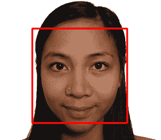

# 第 2 步 - 面部预处理

如前所述，人脸识别对光照条件、人脸朝向、面部表情等变化极为敏感，因此尽可能减少这些差异非常重要。否则，人脸识别算法通常会认为在相同条件下，两个人的面部之间的相似性比同一个人的两个面部之间的相似性更大。

最简单的人脸预处理形式就是使用 `equalizeHist()` 函数应用直方图均衡化，就像我们刚才对人脸检测所做的那样。这可能对于一些项目来说已经足够，在这些项目中，光照和位置条件不会发生很大变化。但是，为了在现实世界条件下的可靠性，我们需要许多复杂的技术，包括面部特征检测（例如，检测眼睛、鼻子、嘴巴和眉毛）。为了简单起见，本章将仅使用眼睛检测并忽略其他面部特征，如嘴巴和鼻子，这些特征不太有用。以下图像显示了使用本节将要介绍的技术对典型预处理人脸的放大视图。

# 眼睛检测

眼睛检测对于人脸预处理非常有用，因为对于正面人脸，你可以始终假设一个人的眼睛应该是水平的，并且位于脸的相对位置，并且在一个脸内应该有相当标准的位置和大小，尽管面部表情、光照条件、相机属性、与相机的距离等发生变化。当人脸检测器声称它检测到人脸但实际上是其他东西时，丢弃假阳性也是很有用的。同时被人脸检测器和两个眼睛检测器欺骗的情况很少见，所以如果你只处理检测到人脸和两个眼睛的图像，那么假阳性将不会很多（但也会处理更少的人脸，因为眼睛检测器不会像人脸检测器那样经常工作）。

OpenCV v2.4 附带的一些预训练的眼睛检测器可以检测睁眼或闭眼，而其中一些只能检测睁眼。

检测睁眼或闭眼的眼睛检测器如下：

+   `haarcascade_mcs_lefteye.xml`（以及 `haarcascade_mcs_righteye.xml`)

+   `haarcascade_lefteye_2splits.xml`（以及 `haarcascade_righteye_2splits.xml`）

仅检测睁眼的眼睛检测器如下：

+   `haarcascade_eye.xml`

+   `haarcascade_eye_tree_eyeglasses.xml`

由于睁眼或闭眼检测器指定了它们训练的是哪只眼睛，因此你需要为左右眼使用不同的检测器，而仅检测睁眼的检测器可以使用左右眼相同的检测器。

检测器 `haarcascade_eye_tree_eyeglasses.xml` 可以检测佩戴眼镜的人的眼睛，但如果他们不戴眼镜则不可靠。

如果 XML 文件名是*左眼*，那么它指的是人的实际左眼，所以在相机图像中它通常出现在脸的右侧，而不是左侧！

提到的四个眼检测器的列表按从最可靠到最不可靠的顺序排列，所以如果你知道你不需要找到戴眼镜的人，那么第一个检测器可能是最佳选择。

# 眼搜索区域

对于眼检测，重要的是将输入图像裁剪，仅显示大约的眼部区域，就像进行人脸检测然后裁剪到仅包含左眼的小矩形中（如果你使用的是左眼检测器）以及对于右眼检测器的相同操作。如果你在整个脸部或整个照片上仅进行眼检测，那么它将慢得多且可靠性较低。不同的眼检测器更适合脸部的不同区域；例如，`haarcascade_eye.xml`检测器在仅搜索实际眼睛周围非常紧密的区域时效果最佳，而`haarcascade_mcs_lefteye.xml`和`haarcascade_lefteye_2splits.xml`检测器在眼睛周围有较大区域时效果最佳。

下表列出了不同眼检测器（在使用 LBP 人脸检测器时）的一些良好的搜索区域，使用检测到的脸矩形内的相对坐标：

| **级联分类器** | **EYE_SX** | **EYE_SY** | **EYE_SW** | **EYE_SH** |
| --- | --- | --- | --- | --- |
| `haarcascade_eye.xml` | 0.16 | 0.26 | 0.30 | 0.28 |
| `haarcascade_mcs_lefteye.xml` | 0.10 | 0.19 | 0.40 | 0.36 |
| `haarcascade_lefteye_2splits.xml` | 0.12 | 0.17 | 0.37 | 0.36 |

这里是提取左眼和右眼区域的源代码

检测到的脸：

```py
    int leftX = cvRound(face.cols * EYE_SX); 
    int topY = cvRound(face.rows * EYE_SY); 
    int widthX = cvRound(face.cols * EYE_SW); 
    int heightY = cvRound(face.rows * EYE_SH); 
    int rightX = cvRound(face.cols * (1.0-EYE_SX-EYE_SW)); 

    Mat topLeftOfFace = faceImg(Rect(leftX, topY, widthX, heightY)); 
    Mat topRightOfFace = faceImg(Rect(rightX, topY, widthX, heightY));

```

下图显示了不同眼检测器的理想搜索区域，其中`haarcascade_eye.xml`和`haarcascade_eye_tree_eyeglasses.xml`文件最适合小搜索区域，而`haarcascade_mcs_*eye.xml`和`haarcascade_*eye_2splits.xml`文件最适合大搜索区域。请注意，检测到的脸矩形也显示出来，以给出眼搜索区域与检测到的脸矩形相比的大小概念：

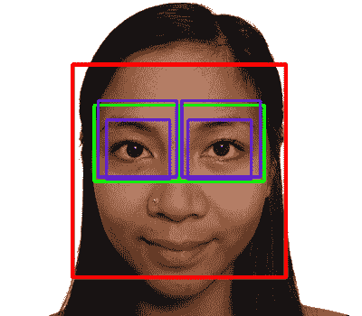

当使用前面表格中给出的眼搜索区域时，以下是不同眼检测器的近似检测特性：

| **级联分类器** | **可靠性** | **速度** | **检测到的眼睛** | **眼镜** |
| --- | --- | --- | --- | --- |
| `haarcascade_mcs_lefteye.xml` | 80% | 18 毫秒 | 开或闭 | 无 |
| `haarcascade_lefteye_2splits.xml` | 60% | 7 毫秒 | 开或闭 | 无 |
| `haarcascade_eye.xml` | 40% | 5 毫秒 | 仅开 | 无 |
| `haarcascade_eye_tree_eyeglasses.xml` | 15% | 10 毫秒 | 仅开 | 是 |

**可靠性**值显示了在无眼镜和双眼睁开的情况下，经过 LBP 正面面部检测后，双眼被检测到的频率。如果眼睛是闭着的，可靠性可能会下降，或者如果戴着眼镜，可靠性和速度都会下降。

**速度**值是以毫秒为单位，针对在 Intel Core i7 2.2 GHz（在 1000 张照片上平均）上缩放到 320x240 像素大小的图像。当找到眼睛时，速度通常比找不到眼睛时快得多，因为它必须扫描整个图像，但`haarcascade_mcs_lefteye.xml`仍然比其他眼睛检测器慢得多。

例如，如果你将照片缩小到 320x240 像素，对其执行直方图均衡化，使用 LBP 正面面部检测器获取面部，然后提取

使用`haarcascade_mcs_lefteye.xml`值从面部检测到**左眼区域**和**右眼区域**，然后对每个眼睛区域执行直方图均衡化。然后，如果你在左眼上使用`haarcascade_mcs_lefteye.xml`检测器（实际上位于图像的右上角）并在右眼上使用`haarcascade_mcs_righteye.xml`检测器（图像的左上部分），每个眼睛检测器应该在大约 90%的 LBP 检测到的正面面部照片中正常工作。所以如果你想检测两只眼睛，那么它应该在大约 80%

使用 LBP 检测到的正面面部照片。

注意，虽然建议在检测面部之前缩小相机图像，但你应使用完整的相机分辨率来检测眼睛，因为眼睛显然比面部小得多，因此你需要尽可能多的分辨率。

根据表格，似乎在选择要使用的眼睛检测器时，你应该决定是想检测闭眼还是只检测睁眼。并且记住，你甚至可以使用一个单眼检测器，如果它没有检测到眼睛，那么你可以尝试另一个。

对于许多任务，检测睁眼或闭眼的眼晴都是有用的，所以如果速度不是关键因素，最好首先使用`mcs_*eye`检测器进行搜索，如果失败，则使用`eye_2splits`检测器进行搜索。

但对于面部识别，如果一个人的眼睛是闭着的，那么他们的外观会有很大不同，因此最好首先使用普通的`haarcascade_eye`检测器进行搜索，如果失败，则使用`haarcascade_eye_tree_eyeglasses`检测器进行搜索。

我们可以使用与面部检测相同的`detectLargestObject()`函数来搜索眼睛，但在进行眼睛检测之前，我们指定完整的眼睛区域宽度以获得更好的眼睛检测。使用一个检测器很容易找到左眼，如果失败，则尝试另一个检测器（右眼也是如此）。眼睛检测的步骤如下：

```py
    CascadeClassifier eyeDetector1("haarcascade_eye.xml"); 
    CascadeClassifier eyeDetector2("haarcascade_eye_tree_eyeglasses.xml"); 
    ... 
    Rect leftEyeRect;    // Stores the detected eye. 
    // Search the left region using the 1st eye detector. 
    detectLargestObject(topLeftOfFace, eyeDetector1, leftEyeRect, 
    topLeftOfFace.cols); 
    // If it failed, search the left region using the 2nd eye  
    // detector. 
    if (leftEyeRect.width <= 0) 
      detectLargestObject(topLeftOfFace, eyeDetector2,  
                leftEyeRect, topLeftOfFace.cols); 
    // Get the left eye center if one of the eye detectors worked. 
    Point leftEye = Point(-1,-1); 
    if (leftEyeRect.width <= 0) { 
      leftEye.x = leftEyeRect.x + leftEyeRect.width/2 + leftX; 
      leftEye.y = leftEyeRect.y + leftEyeRect.height/2 + topY; 
    } 

    // Do the same for the right-eye 
    ... 

    // Check if both eyes were detected. 
    if (leftEye.x >= 0 && rightEye.x >= 0) { 
      ... 
    }

```

在检测到面部和两只眼睛后，我们将通过以下方式执行面部预处理：

+   **几何变换和裁剪**：这个过程将包括缩放、旋转和移动图像，以便眼睛对齐，然后从脸部图像中移除额头、下巴、耳朵和背景。

+   **左右两侧分别进行直方图均衡化**：这个过程独立地对脸部的左右两侧的亮度和对比度进行标准化。

+   **平滑**：这个过程使用双边滤波器减少图像噪声。

+   **椭圆形遮罩**：椭圆形遮罩从脸部图像中移除一些剩余的头发和背景。

以下图像显示了将步骤 1 到 4 应用于检测到的脸部预处理步骤。注意最终图像在脸部的两侧都有良好的亮度和对比度，而原始图像则没有：

# 几何变换

确保所有脸部都对齐在一起非常重要，否则人脸识别算法可能会将鼻子的部分与眼睛的部分进行比较，等等。刚刚看到的脸部检测输出将在一定程度上提供对齐的脸部，但并不非常准确（也就是说，脸部矩形不会始终从额头上的同一点开始）。

为了获得更好的对齐，我们将使用眼睛检测来对齐脸部，使得两个检测到的眼睛的位置在期望的位置上完美对齐。我们将使用`warpAffine()`函数进行几何变换，这是一个单一的操作，将完成以下四件事情：

+   旋转脸部，使得两个眼睛水平

+   将脸部缩放，使得两眼之间的距离始终相同

+   将脸部进行平移，使得眼睛始终水平居中并处于期望的高度

+   裁剪脸部的外部部分，因为我们想要裁剪掉图像背景、头发、额头、耳朵和下巴

仿射变换接受一个仿射矩阵，将两个检测到的眼睛位置变换为两个期望的眼睛位置，然后裁剪到期望的大小和位置。为了生成这个仿射矩阵，我们将获取眼睛之间的中心，计算两个检测到的眼睛出现的角度，并观察它们之间的距离，如下所示：

```py
    // Get the center between the 2 eyes. 
    Point2f eyesCenter; 
    eyesCenter.x = (leftEye.x + rightEye.x) * 0.5f; 
    eyesCenter.y = (leftEye.y + rightEye.y) * 0.5f; 

    // Get the angle between the 2 eyes. 
    double dy = (rightEye.y - leftEye.y); 
    double dx = (rightEye.x - leftEye.x); 
    double len = sqrt(dx*dx + dy*dy); 

    // Convert Radians to Degrees. 
    double angle = atan2(dy, dx) * 180.0/CV_PI; 

    // Hand measurements shown that the left eye center should  
    // ideally be roughly at (0.16, 0.14) of a scaled face image. 
    const double DESIRED_LEFT_EYE_X = 0.16; 
    const double DESIRED_RIGHT_EYE_X = (1.0f - 0.16); 

    // Get the amount we need to scale the image to be the desired 
    // fixed size we want. 
    const int DESIRED_FACE_WIDTH = 70; 
    const int DESIRED_FACE_HEIGHT = 70; 
    double desiredLen = (DESIRED_RIGHT_EYE_X - 0.16); 
    double scale = desiredLen * DESIRED_FACE_WIDTH / len;

```

现在我们可以变换脸部（旋转、缩放和移动），以使两个检测到的眼睛在理想的脸部中位于期望的眼睛位置，如下所示：

```py
    // Get the transformation matrix for the desired angle & size. 
    Mat rot_mat = getRotationMatrix2D(eyesCenter, angle, scale); 
    // Shift the center of the eyes to be the desired center. 
    double ex = DESIRED_FACE_WIDTH * 0.5f - eyesCenter.x; 
    double ey = DESIRED_FACE_HEIGHT * DESIRED_LEFT_EYE_Y -  
      eyesCenter.y; 
    rot_mat.at<double>(0, 2) += ex; 
    rot_mat.at<double>(1, 2) += ey; 
    // Transform the face image to the desired angle & size & 
    // position! Also clear the transformed image background to a  
    // default grey. 
    Mat warped = Mat(DESIRED_FACE_HEIGHT, DESIRED_FACE_WIDTH, 
      CV_8U, Scalar(128)); 
    warpAffine(gray, warped, rot_mat, warped.size());

```

# 左右两侧分别进行直方图均衡化

在现实世界的条件下，脸部的一半通常会有强烈的照明，而另一半则照明较弱。这对人脸识别算法有巨大的影响，因为同一张脸的左右两侧看起来像是非常不同的人。因此，我们将分别对脸部的左右两侧进行直方图均衡化，以使脸部的每一侧都具有标准化的亮度和对比度。

如果我们只是对左半部分应用直方图均衡化，然后再对右半部分应用直方图均衡化，我们会在中间看到一个非常明显的边缘，因为左右两侧的平均亮度很可能是不同的，因此为了消除这个边缘，我们将从左或右侧面逐渐向中心应用两个直方图均衡化，并将其与整个脸部的直方图均衡化混合，这样远左侧面将使用左直方图均衡化，远右侧面将使用右直方图均衡化，而中心将使用左或右值和整个脸部均衡化值的平滑混合。

以下图像显示了左均衡化、整体均衡化和右均衡化图像是如何混合在一起的：

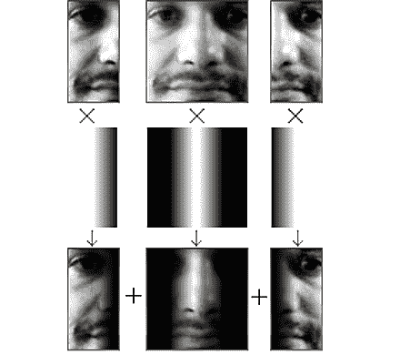

要执行此操作，我们需要整个脸部均衡化的副本，以及左半部分均衡化和右半部分均衡化的副本，具体操作如下：

```py
    int w = faceImg.cols; 
    int h = faceImg.rows; 
    Mat wholeFace; 
    equalizeHist(faceImg, wholeFace); 
    int midX = w/2; 
    Mat leftSide = faceImg(Rect(0,0, midX,h)); 
    Mat rightSide = faceImg(Rect(midX,0, w-midX,h)); 
    equalizeHist(leftSide, leftSide); 
    equalizeHist(rightSide, rightSide);

```

现在我们将这三张图像合并在一起。由于图像较小，我们可以通过使用`image.at<uchar>(y,x)`函数直接访问像素，即使它比较慢；因此，让我们通过直接访问三个输入图像和输出图像中的像素来合并这三张图像，如下所示：

```py
    for (int y=0; y<h; y++) { 
      for (int x=0; x<w; x++) { 
        int v; 
        if (x < w/4) { 
          // Left 25%: just use the left face. 
          v = leftSide.at<uchar>(y,x); 
        } 
        else if (x < w*2/4) { 
          // Mid-left 25%: blend the left face & whole face. 
          int lv = leftSide.at<uchar>(y,x); 
          int wv = wholeFace.at<uchar>(y,x); 
          // Blend more of the whole face as it moves 
          // further right along the face. 
          float f = (x - w*1/4) / (float)(w/4); 
          v = cvRound((1.0f - f) * lv + (f) * wv); 
        } 
        else if (x < w*3/4) { 
          // Mid-right 25%: blend right face & whole face. 
          int rv = rightSide.at<uchar>(y,x-midX); 
          int wv = wholeFace.at<uchar>(y,x); 
          // Blend more of the right-side face as it moves 
          // further right along the face. 
          float f = (x - w*2/4) / (float)(w/4); 
          v = cvRound((1.0f - f) * wv + (f) * rv); 
        } 
        else { 
          // Right 25%: just use the right face. 
          v = rightSide.at<uchar>(y,x-midX); 
        } 
        faceImg.at<uchar>(y,x) = v; 
      } // end x loop 
    } //end y loop

```

这种分离的直方图均衡化应该可以显著减少不同光照对脸部左右两侧的影响，但我们必须理解，它并不能完全消除单侧光照的影响，因为脸部是一个复杂的 3D 形状，有许多阴影。

# 平滑

为了减少像素噪声的影响，我们将在脸部使用双边滤波器，因为双边滤波器非常擅长在保持边缘清晰的同时平滑图像的大部分区域。直方图均衡化可以显著增加像素噪声，因此我们将滤波器强度设置为`20`以覆盖严重的像素噪声，但使用仅两个像素的邻域，因为我们想要大量平滑微小的像素噪声，而不是大图像区域，如下所示：

```py
    Mat filtered = Mat(warped.size(), CV_8U); 
    bilateralFilter(warped, filtered, 0, 20.0, 2.0);

```

# 椭圆形蒙版

尽管我们在进行几何变换时已经移除了大部分图像背景、额头和头发，但我们仍然可以应用一个椭圆形蒙版来移除一些角落区域，如颈部，这些区域可能因脸部而处于阴影中，尤其是如果脸部没有完美直视相机的话。为了创建这个蒙版，我们将在一个白色图像上绘制一个黑色填充的椭圆形。为了执行此操作，一个椭圆形的水平半径为 0.5（即完美覆盖脸部宽度），垂直半径为 0.8（因为脸部通常比宽），中心坐标为 0.5, 0.4，如下面的图像所示，其中椭圆形蒙版已经从脸部移除了一些不需要的角落：

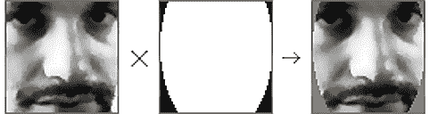

我们可以在调用`cv::setTo()`函数时应用掩码，该函数通常将整个图像设置为某个像素值，但因为我们提供了一个掩码图像，所以它只会将某些部分设置为给定的像素值。我们将用灰色填充图像，以便它与面部其余部分对比度更低：

```py
    // Draw a black-filled ellipse in the middle of the image. 
    // First we initialize the mask image to white (255). 
    Mat mask = Mat(warped.size(), CV_8UC1, Scalar(255)); 
    double dw = DESIRED_FACE_WIDTH; 
    double dh = DESIRED_FACE_HEIGHT; 
    Point faceCenter = Point( cvRound(dw * 0.5), 
      cvRound(dh * 0.4) ); 
    Size size = Size( cvRound(dw * 0.5), cvRound(dh * 0.8) ); 
    ellipse(mask, faceCenter, size, 0, 0, 360, Scalar(0),  
      CV_FILLED); 

    // Apply the elliptical mask on the face, to remove corners. 
    // Sets corners to gray, without touching the inner face. 
    filtered.setTo(Scalar(128), mask);

```

以下放大图像显示了所有面部预处理阶段的示例结果。请注意，它在不同亮度、面部旋转、摄像头角度、背景、灯光位置等方面对面部识别的一致性要好得多。这个预处理面部将被用作收集面部进行训练和尝试识别输入面部时的面部识别阶段的输入：

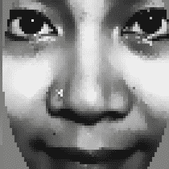

# 第 3 步 - 收集人脸并从中学习

收集人脸可以像将每个新预处理的面部放入来自摄像头的预处理面部数组中一样简单，以及将标签放入数组中（以指定面部是从哪个人那里拍摄的）。例如，您可以使用第一个人预处理的前 10 张面部和第二个人预处理的前 10 张面部，因此面部识别算法的输入将是一个包含 20 张预处理面部的数组和一个包含 20 个整数的数组（其中前 10 个数字是 0，接下来的 10 个数字是 1）。

面部识别算法将学习如何区分不同人的面部。这被称为训练阶段，收集的面部被称为训练集。面部识别算法完成训练后，您可以将其生成的知识保存到文件或内存中，然后用于识别摄像头前的人。这被称为测试阶段。如果您直接从摄像头输入使用，则预处理后的面部被称为测试图像；如果您使用多张图像（例如从图像文件文件夹中）进行测试，则称为测试集。

提供一个涵盖你预期在测试集中出现的各种变化的良好训练集非常重要。例如，如果你只使用正面直视的脸部进行测试（例如身份证照片），那么你只需要提供正面直视的脸部训练图像。但如果这个人可能向左或向上看，那么你应该确保训练集也包括这个人这样做时的脸部图像，否则面部识别算法将难以识别他们，因为他们的脸部看起来会相当不同。这也适用于其他因素，如面部表情（例如，如果训练集中的人总是微笑，但在测试集中不微笑）或光照方向（例如，训练集中强烈的灯光在左侧，但在测试集中在右侧），那么面部识别算法将难以识别他们。我们刚才看到的面部预处理步骤将有助于减少这些问题，但绝对不能消除这些因素，尤其是脸部朝向的方向，因为它对脸部所有元素的位置都有很大影响。

获得一个能够涵盖许多不同真实世界条件的良好训练集的一种方法，是让每个人从向左看，转到向上看，再转到向右看，然后向下看，最后直接向前看。然后，这个人将头部向侧面倾斜，并上下移动，同时改变面部表情，例如在微笑、愤怒和保持中性表情之间交替。如果每个人在收集面部图像时都遵循这样的常规，那么在真实世界条件下识别每个人的可能性会大得多。

为了获得更好的结果，应该再次在更多的一个或两个位置或方向上执行，例如通过将相机旋转 180 度，然后向与相机相反的方向行走，并重复整个程序，这样训练集就会包括许多不同的光照条件。

因此，一般来说，为每个人提供 100 个训练面部可能比每人只有 10 个训练面部给出更好的结果，但如果所有 100 个面部几乎完全相同，那么它仍然表现不佳，因为更重要的是训练集有足够的多样性来覆盖测试集，而不是仅仅拥有大量的面部。所以为了确保训练集中的面部不是都太相似，我们应在每个收集到的面部之间添加一个明显的延迟。例如，如果相机以每秒 30 帧的速度运行，那么当这个人没有时间移动时，它可能在几秒钟内收集 100 个面部，所以最好每秒只收集一个面部，同时这个人移动他们的面部。另一种提高训练集多样性的简单方法是在收集面部时，只有当它与之前收集到的面部明显不同时才收集。

# 收集预处理面部进行训练

为了确保收集新面部之间至少有 1 秒的间隔，我们需要测量已经过去的时间。这是按照以下步骤进行的：

```py
    // Check how long since the previous face was added. 
    double current_time = (double)getTickCount(); 
    double timeDiff_seconds = (current_time - 
      old_time) / getTickFrequency();

```

要比较两张图像的相似度，逐像素比较，你可以找到相对 L2 误差，这仅仅涉及从一张图像中减去另一张图像，求和其平方值，然后取其平方根。所以如果这个人完全没有移动，当前面部与之前面部的减法应该在每个像素上给出一个非常小的数字，但如果他们只在任何方向上稍微移动了一点，减去像素会给出一个大的数字，因此 L2 误差会很高。由于结果是所有像素的总和，所以这个值将取决于图像分辨率。因此，为了得到平均误差，我们应该将这个值除以图像中的总像素数。让我们把这个放入一个方便的函数`getSimilarity()`中，如下所示：

```py
    double getSimilarity(const Mat A, const Mat B) { 
      // Calculate the L2 relative error between the 2 images. 
      double errorL2 = norm(A, B, CV_L2); 
      // Scale the value since L2 is summed across all pixels. 
      double similarity = errorL2 / (double)(A.rows * A.cols); 
      return similarity; 
    } 

    ... 

    // Check if this face looks different from the previous face. 
    double imageDiff = MAX_DBL; 
    if (old_prepreprocessedFaceprepreprocessedFace.data) { 
      imageDiff = getSimilarity(preprocessedFace, 
        old_prepreprocessedFace); 
    }

```

如果图像没有太大移动，这个相似度通常会小于 0.2，

如果图像移动了，这个相似度会高于 0.4，所以让我们将 0.3 作为我们收集的阈值

一个新的面部。

我们可以采取许多技巧来获取更多的训练数据，例如使用镜像面部、添加随机噪声、将面部移动几个像素、按百分比缩放面部，或者旋转面部几个度（尽管我们在预处理面部时特意尝试去除这些效果！）。让我们将镜像面部添加到训练集中，这样我们就有了一个更大的训练集，同时减少了不对称面部的问题，或者如果用户在训练时总是稍微向左或向右倾斜，但在测试时没有这样做。这是按照以下步骤进行的：

```py
    // Only process the face if it's noticeably different from the 
    // previous frame and there has been a noticeable time gap. 
    if ((imageDiff > 0.3) && (timeDiff_seconds > 1.0)) { 
      // Also add the mirror image to the training set. 
      Mat mirroredFace; 
      flip(preprocessedFace, mirroredFace, 1); 

      // Add the face & mirrored face to the detected face lists. 
      preprocessedFaces.push_back(preprocessedFace); 
      preprocessedFaces.push_back(mirroredFace); 
      faceLabels.push_back(m_selectedPerson); 
      faceLabels.push_back(m_selectedPerson); 

      // Keep a copy of the processed face, 
      // to compare on next iteration. 
      old_prepreprocessedFace = preprocessedFace; 
      old_time = current_time; 
    }

```

这将收集预处理面部`std::vector`数组`preprocessedFaces`和`faceLabels`以及该人的标签或 ID 号（假设它在整数`m_selectedPerson`变量中）。

为了让用户更明显地意识到我们已经将他们的当前面部添加到集合中，您可以通过在整张图像上显示一个大的白色矩形或仅显示他们的面部几秒钟来实现视觉通知，使他们意识到已经拍摄了一张照片。使用 OpenCV 的 C++接口，您可以使用`+`重载的`cv::Mat`运算符向图像中的每个像素添加值，并将其裁剪到 255（使用`saturate_cast`，这样就不会从白色溢出到黑色！）假设`displayedFrame`将是应该显示的颜色摄像头帧的副本，在收集人脸的前面代码后插入此代码：

```py
    // Get access to the face region-of-interest. 
    Mat displayedFaceRegion = displayedFrame(faceRect); 
    // Add some brightness to each pixel of the face region. 
    displayedFaceRegion += CV_RGB(90,90,90);

```

# 从收集的人脸训练人脸识别系统

在为每个人收集足够的人脸以供识别后，您必须使用适合人脸识别的机器学习算法来训练系统学习数据。文献中有很多不同的人脸识别算法，其中最简单的是 Eigenfaces 和人工神经网络。Eigenfaces 通常比人工神经网络表现更好，尽管它很简单，但它的表现几乎与许多更复杂的人脸识别算法相当，因此它已成为初学者以及与新技术比较的基本人脸识别算法。

建议任何希望进一步研究人脸识别的读者阅读以下理论：

+   Eigenfaces（也称为**主成分分析**（**PCA**））

+   Fisherfaces（也称为**线性判别分析**（**LDA**））

+   其他经典的人脸识别算法（许多可以在[`www.face-rec.org/algorithms/`](http://www.face-rec.org/algorithms/)找到）

+   近期计算机视觉研究论文中更新的面部识别算法（如 CVPR 和 ICCV 在[`www.cvpapers.com/`](http://www.cvpapers.com/)），每年有数百篇面部识别论文发表

然而，您不需要理解这些算法的理论，就可以像本书中展示的那样使用它们。感谢 OpenCV 团队和 Philipp Wagner 的`libfacerec`贡献，OpenCV v2.4.1 提供了`cv::Algorithm`作为使用几种不同算法（甚至可以在运行时选择）进行人脸识别的简单通用方法，而不必理解它们是如何实现的。您可以通过使用`Algorithm::getList()`函数找到您版本 OpenCV 中可用的算法，例如以下代码：

```py
    vector<string> algorithms; 
    Algorithm::getList(algorithms); 
    cout << "Algorithms: " << algorithms.size() << endl; 
    for (int i=0; i<algorithms.size(); i++) { 
      cout << algorithms[i] << endl; 
    }

```

下面是 OpenCV v2.4.1 中可用的三种人脸识别算法：

+   `FaceRecognizer.Eigenfaces`：Eigenfaces，也称为 PCA，由 Turk 和 Pentland 于 1991 年首次使用。

+   `FaceRecognizer.Fisherfaces`：Fisherfaces，也称为 LDA，由 Belhumeur、Hespanha 和 Kriegman 于 1997 年发明。

+   `FaceRecognizer.LBPH`：局部二值模式直方图，由 Ahonen、Hadid 和 Pietikäinen 于 2004 年发明。

关于这些人脸识别算法实现的更多信息可以在 Philipp Wagner 的网站上找到，包括文档、示例和每个算法的 Python 等效代码（[`bytefish.de/blog`](http://bytefish.de/blog) 和 [`bytefish.de/dev/libfacerec/`](http://bytefish.de/dev/libfacerec/))。

这些人脸识别算法可以通过 OpenCV 的`contrib`模块中的`FaceRecognizer`类获得。由于动态链接，您的程序可能链接到了`contrib`模块，但在运行时实际上并没有加载（如果它被认为不是必需的）。因此，建议在尝试访问`FaceRecognizer`算法之前调用`cv::initModule_contrib()`函数。此函数仅从 OpenCV v2.4.1 版本开始提供，因此它还确保人脸识别算法至少在编译时对您可用：

```py
    // Load the "contrib" module is dynamically at runtime. 
    bool haveContribModule = initModule_contrib(); 
    if (!haveContribModule) { 
      cerr << "ERROR: The 'contrib' module is needed for "; 
      cerr << "FaceRecognizer but hasn't been loaded to OpenCV!"; 
      cerr << endl; 
      exit(1); 
    }

```

要使用人脸识别算法之一，我们必须使用`cv::Algorithm::create<FaceRecognizer>()`函数创建一个`FaceRecognizer`对象。我们将要使用的人脸识别算法的名称作为字符串传递给这个创建函数。这将使我们能够访问该算法，如果它在 OpenCV 版本中可用。因此，它可以作为一个运行时错误检查，以确保用户有 OpenCV v2.4.1 或更新的版本。例如：

```py
    string facerecAlgorithm = "FaceRecognizer.Fisherfaces"; 
    Ptr<FaceRecognizer> model; 
    // Use OpenCV's new FaceRecognizer in the "contrib" module: 
    model = Algorithm::create<FaceRecognizer>(facerecAlgorithm); 
    if (model.empty()) { 
      cerr << "ERROR: The FaceRecognizer [" << facerecAlgorithm; 
      cerr << "] is not available in your version of OpenCV. "; 
      cerr << "Please update to OpenCV v2.4.1 or newer." << endl; 
      exit(1); 
    }

```

一旦我们加载了`FaceRecognizer`算法，我们只需使用以下方式调用`FaceRecognizer::train()`函数，并传入我们收集到的面部数据：

```py
    // Do the actual training from the collected faces. 
    model->train(preprocessedFaces, faceLabels);

```

这一行代码将运行您所选的整个人脸识别训练算法（例如，Eigenfaces、Fisherfaces 或可能的其他算法）。如果您只有少数人，且每人少于 20 张脸，那么这次训练应该会非常快地完成，但如果您有很多人，且每人有很多张脸，那么`train()`函数可能需要几秒钟甚至几分钟来处理所有数据。

# 查看学习到的知识

虽然这不是必需的，但查看人脸识别算法在学习您的训练数据时生成的内部数据结构非常有用，尤其是如果您理解您选择的算法背后的理论，并希望验证它是否按预期工作或找出为什么它没有按预期工作。不同的算法可能有不同的内部数据结构，但幸运的是，对于主成分面（eigenfaces）和 Fisher 面（fisherfaces），它们是相同的，所以我们只需查看这两个。它们都基于 1D 特征向量矩阵，当作为 2D 图像查看时，看起来有点像人脸，因此在使用**Eigenface**算法时通常将特征向量称为 eigenfaces，在使用**Fisherface**算法时称为 fisherfaces。

简而言之，Eigenfaces 的基本原理是，它将计算一组特殊的图像（特征脸）和混合比（特征值），这些图像以不同的方式组合可以生成训练集中每个图像，同时也可以用来区分训练集中许多不同的脸图像。例如，如果训练集中的一些人脸有胡须，而另一些没有，那么至少会有一个特征脸显示出胡须，因此有胡须的训练人脸将会有一个高混合比的特征脸来显示它有胡须，而没有胡须的人脸将会有一个低混合比的特征向量。如果训练集中有五个人，每人有 20 张脸，那么将会有 100 个特征脸和特征值来区分训练集中的 100 张脸，实际上这些特征脸和特征值会被排序，前几个特征脸和特征值将是最重要的区分因素，而最后几个特征脸和特征值将只是随机像素噪声，实际上并不能帮助区分数据。因此，通常的做法是丢弃一些最后的特征脸，只保留前 50 个左右的特征脸。

与之相比，Fisherfaces 的基本原理是，它不是为训练集中每个图像计算一个特殊的特征向量和特征值，而是为每个人只计算一个特殊的特征向量和特征值。因此，在前面提到的例子中，有五个人，每人有 20 张脸，Eigenfaces 算法将使用 100 个特征脸和特征值，而 Fisherfaces 算法只需使用五个 fisherfaces 和特征值。

要访问 Eigenfaces 和 Fisherfaces 算法的内部数据结构，我们必须使用`cv::Algorithm::get()`函数在运行时获取它们，因为在编译时无法访问它们。这些数据结构作为数学计算的一部分内部使用，而不是用于图像处理，因此它们通常以介于 0.0 和 1.0 之间的浮点数存储，而不是介于 0 到 255 之间的 8 位`uchar`像素，类似于常规图像中的像素。此外，它们通常是 1D 行或列矩阵，或者构成更大矩阵的许多 1D 行或列之一。因此，在您能够显示这些内部数据结构之前，您必须将它们重塑为正确的矩形形状，并将它们转换为介于 0 到 255 之间的 8 位`uchar`像素。由于矩阵数据可能介于 0.0 到 1.0 或-1.0 到 1.0 或任何其他值，您可以使用带有`cv::NORM_MINMAX`选项的`cv::normalize()`函数来确保无论输入范围如何，它都输出介于 0 到 255 之间的数据。以下是一个创建函数以执行此重塑到矩形形状并将它们转换为 8 位像素的示例：

```py
    // Convert the matrix row or column (float matrix) to a 
    // rectangular 8-bit image that can be displayed or saved. 
    // Scales the values to be between 0 to 255\. 
    Mat getImageFrom1DFloatMat(const Mat matrixRow, int height) 
    { 
      // Make a rectangular shaped image instead of a single row. 
      Mat rectangularMat = matrixRow.reshape(1, height); 
      // Scale the values to be between 0 to 255 and store them  
      // as a regular 8-bit uchar image. 
      Mat dst; 
      normalize(rectangularMat, dst, 0, 255, NORM_MINMAX,  
        CV_8UC1); 
      return dst; 
    }

```

为了更容易调试 OpenCV 代码，尤其是在内部调试`cv::Algorithm`数据结构时，我们可以使用`ImageUtils.cpp`和`ImageUtils.h`文件来轻松显示有关`cv::Mat`结构的信息，如下所示：

```py
    Mat img = ...; 
    printMatInfo(img, "My Image");

```

你将在控制台看到类似以下内容打印出来：

```py
My Image: 640w480h 3ch 8bpp, range[79,253][20,58][18,87]

```

这表明它宽度为 640 个元素，高度为 480 个元素（即 640 x 480 的图像或 480 x 640 的矩阵，具体取决于你如何查看它），每个像素有三个通道，每个通道是 8 位的（即常规 BGR 图像），并且它显示了图像中每个颜色通道的最小值和最大值。

也可以通过使用`printMat()`函数而不是`printMatInfo()`函数来打印图像或矩阵的实际内容。这对于查看矩阵和多通道浮点矩阵非常有用，因为这些对于初学者来说可能相当难以查看。

`ImageUtils`代码主要是为 OpenCV 的 C 接口编写的，但随着时间的推移，它逐渐包括了更多的 C++接口。最新版本可以在[`shervinemami.info/openCV.html`](http://shervinemami.info/openCV.html)找到。

# 平均脸

无论是 Eigenfaces 算法还是 Fisherfaces 算法，它们首先计算平均脸，即所有训练图像的数学平均值，因此它们可以从每个面部图像中减去平均图像，以获得更好的面部识别结果。因此，让我们查看我们的训练集中的平均脸。在 Eigenfaces 和 Fisherfaces 实现中，平均脸被命名为`mean`，如下所示：

```py
    Mat averageFace = model->get<Mat>("mean"); 
    printMatInfo(averageFace, "averageFace (row)"); 
    // Convert a 1D float row matrix to a regular 8-bit image. 
    averageFace = getImageFrom1DFloatMat(averageFace, faceHeight); 
    printMatInfo(averageFace, "averageFace"); 
    imshow("averageFace", averageFace);

```

你现在应该在屏幕上看到类似以下（放大）的平均脸图像，它是一个男人、一个女人和一个婴儿的组合。你也应该在控制台上看到类似此处的文本：

```py
 averageFace (row): 4900w1h 1ch 64bpp, range[5.21,251.47]
 averageFace: 70w70h 1ch 8bpp, range[0,255]

```

图像将如图下所示截图所示：

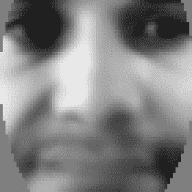

注意到`averageFace (row)`是一个 64 位浮点数的单行矩阵，而`averageFace`是一个覆盖整个范围的 8 位像素的矩形图像

从 0 到 255。

# 特征值、Eigenfaces 和 Fisherfaces

让我们查看特征值中的实际分量值（以文本形式）：

```py
    Mat eigenvalues = model->get<Mat>("eigenvalues"); 
    printMat(eigenvalues, "eigenvalues");

```

对于 Eigenfaces，每个面部都有一个特征值，所以如果我们有三个人各有四个面部，我们得到一个包含 12 个特征值的列向量，从最好到最差排序如下：

```py
    eigenvalues: 1w18h 1ch 64bpp, range[4.52e+04,2.02836e+06] 
    2.03e+06  
    1.09e+06 
    5.23e+05 
    4.04e+05 
    2.66e+05 
    2.31e+05 
    1.85e+05 
    1.23e+05 
    9.18e+04 
    7.61e+04  
    6.91e+04 
    4.52e+04

```

对于 Fisherfaces，每个额外的人只有一个特征值，所以如果有三个人各有四个面部，我们只得到一个包含两个特征值的行向量，如下所示：

```py
    eigenvalues: 2w1h 1ch 64bpp, range[152.4,316.6] 
    317, 152

```

要查看特征向量（作为特征脸或费舍尔脸图像），我们必须从大特征向量矩阵中提取它们作为列。由于 OpenCV 和 C/C++中的数据通常使用行主序存储在矩阵中，这意味着要提取一列，我们应该使用`Mat::clone()`函数来确保数据将是连续的，否则我们无法将数据重塑为矩形。一旦我们有一个连续的列`Mat`，我们就可以使用`getImageFrom1DFloatMat()`函数来显示特征向量，就像我们为平均脸所做的那样：

```py
    // Get the eigenvectors 
    Mat eigenvectors = model->get<Mat>("eigenvectors"); 
    printMatInfo(eigenvectors, "eigenvectors"); 

    // Show the best 20 eigenfaces 
    for (int i = 0; i < min(20, eigenvectors.cols); i++) { 
      // Create a continuous column vector from eigenvector #i. 
      Mat eigenvector = eigenvectors.col(i).clone(); 

      Mat eigenface = getImageFrom1DFloatMat(eigenvector, 
        faceHeight); 
      imshow(format("Eigenface%d", i), eigenface); 
    }

```

下图显示了特征向量作为图像。你可以看到，对于有四个脸的三个人的情况，存在 12 个特征脸（图的左侧）或两个费舍尔脸（图的右侧）：

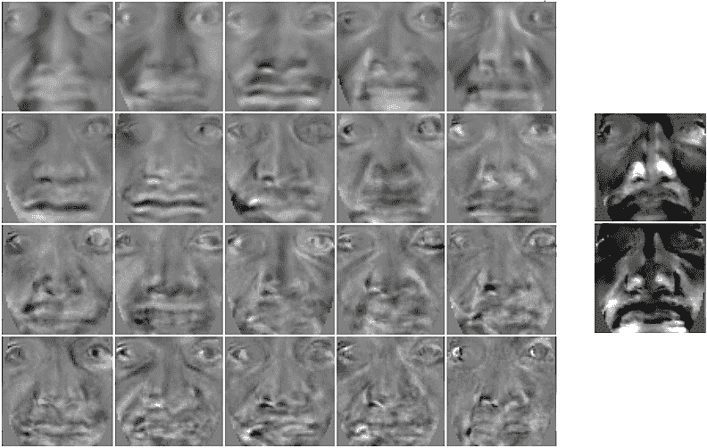

注意，特征脸和费舍尔脸似乎都有一些面部特征的相似之处，但它们实际上并不像脸。这仅仅是因为从它们中减去了平均脸，所以它们只是显示了每个特征脸与平均脸的差异。编号显示了它是哪个特征脸，因为它们总是从最重要的特征脸到最不重要的特征脸有序排列，如果你有 50 个或更多的特征脸，那么后面的特征脸通常会只显示随机的图像噪声，因此应该被丢弃。

# 第 4 步 - 面部识别

现在我们已经使用我们的训练图像和面部标签集训练了特征脸或费舍尔脸机器学习算法，我们终于准备好确定一个人的身份，仅从面部图像中！这一最后步骤被称为面部识别或面部识别。

# 面部识别 - 从面部识别人

感谢 OpenCV 的`FaceRecognizer`类，我们可以通过在面部图像上调用`FaceRecognizer::predict()`函数来简单地识别照片中的人

如下所示：

```py
    int identity = model->predict(preprocessedFace);

```

这个`identity`值将是我们最初在收集训练用面部时使用的标签号。例如，第一个人为 0，第二个人为 1，依此类推。

这个识别的问题在于，它总是会预测给定的人之一，即使输入的照片是未知的人或汽车的照片。它仍然会告诉你照片中最可能的人是谁，因此很难相信结果！解决方案是获得一个置信度指标，这样我们就可以判断结果有多可靠，如果看起来置信度太低，那么我们假设它是一个未知的人。

# 面部验证 - 验证是否为声称的人

为了确认预测结果是否可靠，或者是否应该将其视为未知的人，我们执行**面部验证**（也称为**面部认证**），以获得一个置信度指标，显示单个面部图像是否与声称的人相似（与我们所做的面部识别相反，我们比较的是单个面部图像与许多人）。

当你调用`predict()`函数时，OpenCV 的`FaceRecognizer`类可以返回一个置信度指标，但遗憾的是，置信度指标仅仅是基于特征子空间中的距离，因此它并不非常可靠。我们将使用的方法是使用*特征向量*和*特征值*来重建面部图像，并将这个重建图像与输入图像进行比较。如果这个人在训练集中包含了很多面部，那么从学习到的特征向量和特征值中重建应该会相当好，但如果这个人在训练集中没有任何面部（或者没有与测试图像具有相似照明和面部表情的面部），那么重建的面部将与输入面部非常不同，这表明它可能是一个未知的面部。

记得我们之前说过，Eigenfaces 和 Fisherfaces 算法是基于这样的观点：一个图像可以被大致表示为一组特征向量（特殊的面部图像）和特征值（混合比率）。因此，如果我们结合训练集中某个面部特征向量和特征值，我们应该能够获得一个相当接近原始训练图像的复制品。同样的原理也适用于与训练集相似的其他图像——如果我们结合训练的特征向量和与训练集相似的测试图像的特征值，我们应该能够重建一个与测试图像相似度较高的图像。

再次强调，OpenCV 的`FaceRecognizer`类通过使用`subspaceProject()`函数将图像投影到特征空间，以及使用`subspaceReconstruct()`函数从特征空间返回到图像空间，使得从任何输入图像生成重建人脸变得非常容易。技巧在于我们需要将其从浮点行矩阵转换为矩形 8 位图像（就像我们在显示平均人脸和特征人脸时做的那样），但我们不想归一化数据，因为它已经在理想的尺度上，可以与原始图像进行比较。如果我们归一化数据，它将与输入图像具有不同的亮度和对比度，这将使得仅通过使用 L2 相对误差来比较图像相似度变得困难。以下是实现方法：

```py
    // Get some required data from the FaceRecognizer model. 
    Mat eigenvectors = model->get<Mat>("eigenvectors"); 
    Mat averageFaceRow = model->get<Mat>("mean"); 

    // Project the input image onto the eigenspace. 
    Mat projection = subspaceProject(eigenvectors, averageFaceRow, 
      preprocessedFace.reshape(1,1)); 

    // Generate the reconstructed face back from the eigenspace. 
    Mat reconstructionRow = subspaceReconstruct(eigenvectors, 
      averageFaceRow, projection); 

    // Make it a rectangular shaped image instead of a single row. 
    Mat reconstructionMat = reconstructionRow.reshape(1,  
      faceHeight); 

    // Convert the floating-point pixels to regular 8-bit uchar. 
    Mat reconstructedFace = Mat(reconstructionMat.size(), CV_8U); 
    reconstructionMat.convertTo(reconstructedFace, CV_8U, 1, 0);

```

以下图像展示了两个典型的重建人脸。左侧的人脸重建得很好，因为它来自一个已知的人，而右侧的人脸重建得不好，因为它来自一个未知的人或者是一个已知的人但具有未知的照明条件/面部表情/面部方向：

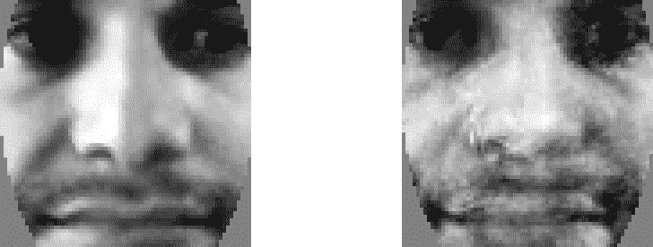

现在我们可以通过使用之前为比较两张图像而创建的相同的`getSimilarity()`函数来计算这个重建的面部与输入面部的相似度。其中，小于 0.3 的值意味着两张图像非常相似。对于 Eigenfaces，每个面部都有一个特征向量，因此重建通常效果很好，因此我们可以通常使用 0.5 的阈值，但 Fisherfaces 对每个人只有一个特征向量，因此重建效果不会很好，因此需要更高的阈值，比如 0.7。以下是实现方法：

```py
    similarity = getSimilarity(preprocessedFace, reconstructedFace); 
    if (similarity > UNKNOWN_PERSON_THRESHOLD) { 
      identity = -1;    // Unknown person. 
    }

```

现在，你只需将身份信息打印到控制台，或者将其用于你的想象所及之处！记住，这种面部识别方法和这种面部验证方法只有在训练它们时特定的条件下才是可靠的。因此，为了获得良好的识别精度，你需要确保每个人的训练集涵盖了预期的测试中的全部光照条件、面部表情和角度。面部预处理阶段有助于减少与光照条件和平面旋转（如果人将头部倾斜向左或右肩）的一些差异，但对于其他差异，如平面外旋转（如果人将头部转向左侧或右侧），只有在你的训练集中得到很好的覆盖时才会有效。

# 完成细节 - 保存和加载文件

你可以潜在地添加一个基于命令行的方法来处理输入文件并将它们保存到磁盘上，或者甚至将面部检测、面部预处理和/或面部识别作为网络服务执行，等等。对于这些类型的项目，通过使用`FaceRecognizer`类的`save`和`load`函数添加所需的功能相当容易。你可能还想在程序启动时保存训练数据然后加载它。

将训练模型保存到 XML 或 YML 文件非常简单：

```py
model->save("trainedModel.yml");

```

你可能还想保存预处理过的面部和标签数组，以便以后向训练集添加更多数据。

例如，以下是从文件中加载训练模型的示例代码。请注意，你必须指定最初用于创建训练模型的面部识别算法（例如，`FaceRecognizer.Eigenfaces`或`FaceRecognizer.Fisherfaces`）：

```py
    string facerecAlgorithm = "FaceRecognizer.Fisherfaces"; 
    model = Algorithm::create<FaceRecognizer>(facerecAlgorithm); 
    Mat labels; 
    try { 
      model->load("trainedModel.yml"); 
      labels = model->get<Mat>("labels"); 
    } catch (cv::Exception &e) {} 
    if (labels.rows <= 0) { 
      cerr << "ERROR: Couldn't load trained data from " 
              "[trainedModel.yml]!" << endl; 
      exit(1); 
    }

```

# 完成细节 - 制作一个漂亮且交互式的 GUI

尽管本章中给出的代码足以构建一个完整的面部识别系统，但仍需要一种方法将数据放入系统中，以及一种使用它的方法。许多用于研究的人脸识别系统会选择将文本文件作为理想的输入，列出静态图像文件在计算机上的存储位置，以及其他重要数据，例如人员的真实姓名或身份，以及面部区域的真实像素坐标（例如面部和眼睛中心的确切位置）。这些数据可以手动收集，或者由另一个面部识别系统收集。

理想输出将是一个文本文件，比较识别结果与地面实况，以便可以获得统计数据，用于比较面部识别系统与其他面部识别系统。

然而，由于本章中的人脸识别系统旨在学习以及实际娱乐目的，而不是与最新的研究方法竞争，因此拥有一个易于使用的 GUI，允许从实时摄像头交互式地进行面部收集、训练和测试，是非常有用的。因此，本节将提供一个提供这些功能的交互式 GUI。预期读者要么使用本书附带提供的 GUI，要么根据自身目的修改 GUI，或者忽略此 GUI 并设计自己的 GUI 以执行迄今为止讨论的人脸识别技术。

由于我们需要 GUI 执行多个任务，让我们创建一组 GUI 将具有的模式或状态，以及用户可以通过按钮或鼠标点击来更改模式：

+   **启动**：此状态加载并初始化数据和摄像头。

+   **检测**：此状态检测面部，并在预处理后显示，直到用户点击添加人员按钮。

+   **收集**：此状态收集当前人员的面部，直到用户在窗口中点击任何位置。这也会显示每个人的最新面部。用户点击现有人员之一或添加人员按钮，以收集不同人员的面部。

+   **训练**：在此状态下，系统使用收集到的所有人员的所有面部进行训练。

+   **识别**：这包括突出显示识别出的人员并显示置信度计。用户点击人员之一或添加人员按钮，以返回模式 2（*收集*）。

要退出，用户可以在窗口中的任何时间按*Esc*键。我们还可以添加一个删除所有模式，该模式将重新启动一个新的面部识别系统，以及一个切换额外调试信息显示的调试按钮。我们可以创建一个枚举的`mode`变量来显示当前模式。

# 绘制 GUI 元素

要在屏幕上显示当前模式，让我们创建一个函数来轻松绘制文本。OpenCV 提供了一个具有多种字体和抗锯齿的 `cv::putText()` 函数，但将其放置在正确位置可能有些棘手。幸运的是，还有一个 `cv::getTextSize()` 函数可以计算文本周围的边界框，因此我们可以创建一个包装函数来简化文本的放置。我们希望能够在窗口的任何边缘放置文本，并确保它完全可见，同时允许放置多行或多词文本，而不会相互覆盖。所以这里有一个包装函数，允许您指定左对齐或右对齐，以及指定顶部对齐或底部对齐，并返回边界框，这样我们就可以轻松地在窗口的任何角落或边缘绘制多行文本：

```py
    // Draw text into an image. Defaults to top-left-justified  
    // text, so give negative x coords for right-justified text, 
    // and/or negative y coords for bottom-justified text. 
    // Returns the bounding rect around the drawn text. 
    Rect drawString(Mat img, string text, Point coord, Scalar  
      color, float fontScale = 0.6f, int thickness = 1, 
      int fontFace = FONT_HERSHEY_COMPLEX);

```

现在要在 GUI 上显示当前模式，由于窗口的背景是摄像头视频流，如果我们直接在摄像头视频流上绘制文本，它可能与摄像头背景颜色相同！所以让我们只绘制一个与前景文本相隔 1 像素的黑色阴影文本。我们还可以在下面绘制一行有用的文本，以便用户知道要遵循的步骤。以下是如何使用 `drawString()` 函数绘制文本的示例：

```py
    string msg = "Click [Add Person] when ready to collect faces."; 
    // Draw it as black shadow & again as white text. 
    float txtSize = 0.4; 
    int BORDER = 10; 
    drawString (displayedFrame, msg, Point(BORDER, -BORDER-2), 
      CV_RGB(0,0,0), txtSize); 
    Rect rcHelp = drawString(displayedFrame, msg, Point(BORDER+1, 
      -BORDER-1), CV_RGB(255,255,255), txtSize);

```

以下部分截图显示了 GUI 窗口底部的模式和信息，叠加在相机图像之上：


我们提到过，我们想要一些 GUI 按钮，所以让我们创建一个函数来轻松绘制 GUI 按钮，如下所示：

```py
    // Draw a GUI button into the image, using drawString(). 
    // Can give a minWidth to have several buttons of same width. 
    // Returns the bounding rect around the drawn button. 
    Rect drawButton(Mat img, string text, Point coord, 
      int minWidth = 0) 
    { 
      const int B = 10; 
      Point textCoord = Point(coord.x + B, coord.y + B); 
      // Get the bounding box around the text. 
      Rect rcText = drawString(img, text, textCoord,  
        CV_RGB(0,0,0)); 
      // Draw a filled rectangle around the text. 
      Rect rcButton = Rect(rcText.x - B, rcText.y - B, 
        rcText.width + 2*B, rcText.height + 2*B); 
      // Set a minimum button width. 
      if (rcButton.width < minWidth) 
        rcButton.width = minWidth; 
      // Make a semi-transparent white rectangle. 
      Mat matButton = img(rcButton); 
      matButton += CV_RGB(90, 90, 90); 
      // Draw a non-transparent white border. 
      rectangle(img, rcButton, CV_RGB(200,200,200), 1, CV_AA); 

      // Draw the actual text that will be displayed. 
      drawString(img, text, textCoord, CV_RGB(10,55,20)); 

      return rcButton; 
    }

```

现在我们使用 `drawButton()` 函数创建几个可点击的 GUI 按钮，

它将始终显示在 GUI 的左上角，如下所示

部分截图：


正如我们提到的，GUI 程序有一些模式，它会在这些模式之间切换（作为一个有限状态机），从启动模式开始。我们将当前模式存储为 `m_mode` 变量。

# 启动模式

在启动模式下，我们只需要加载 XML 检测器文件以检测面部和眼睛，并初始化摄像头，这部分我们已经讨论过了。让我们也创建一个带有鼠标回调函数的主 GUI 窗口，当用户在我们的窗口中移动或点击鼠标时，OpenCV 将会调用这个函数。也许还需要将摄像头分辨率设置为合理的值；例如，如果摄像头支持的话，640x480。以下是实现方式：

```py
    // Create a GUI window for display on the screen. 
    namedWindow(windowName); 

    // Call "onMouse()" when the user clicks in the window. 
    setMouseCallback(windowName, onMouse, 0); 

    // Set the camera resolution. Only works for some systems. 
    videoCapture.set(CV_CAP_PROP_FRAME_WIDTH, 640); 
    videoCapture.set(CV_CAP_PROP_FRAME_HEIGHT, 480); 

    // We're already initialized, so let's start in Detection mode. 
    m_mode = MODE_DETECTION;

```

# 检测模式

在检测模式下，我们希望持续检测面部和眼睛，围绕它们绘制矩形或圆形以显示检测结果，并显示当前的预处理面部。实际上，我们希望无论处于哪种模式，这些内容都能显示出来。检测模式唯一特殊的地方是，当用户点击添加人员按钮时，它将切换到下一个模式（*收集*）。

如果您还记得本章之前提到的检测步骤，我们的检测阶段的输出将是：

+   `Mat preprocessedFace`: 预处理的脸部图像（如果检测到脸部和眼睛）

    were detected).

+   `Rect faceRect`: 检测到的脸部区域坐标。

+   `Point leftEye`, `rightEye`: 检测到的左右眼中心坐标。

因此，我们应该检查是否返回了预处理的脸部图像，并在检测到脸部和眼睛的情况下绘制围绕脸部和眼睛的矩形和圆圈，如下所示：

```py
    bool gotFaceAndEyes = false; 
    if (preprocessedFace.data) 
      gotFaceAndEyes = true; 

    if (faceRect.width > 0) { 
      // Draw an anti-aliased rectangle around the detected face. 
      rectangle(displayedFrame, faceRect, CV_RGB(255, 255, 0), 2, 
        CV_AA); 

      // Draw light-blue anti-aliased circles for the 2 eyes. 
      Scalar eyeColor = CV_RGB(0,255,255); 
      if (leftEye.x >= 0) {   // Check if the eye was detected 
        circle(displayedFrame, Point(faceRect.x + leftEye.x, 
          faceRect.y + leftEye.y), 6, eyeColor, 1, CV_AA); 
      } 
      if (rightEye.x >= 0) {   // Check if the eye was detected 
        circle(displayedFrame, Point(faceRect.x + rightEye.x,  
          faceRect.y + rightEye.y), 6, eyeColor, 1, CV_AA); 
      } 
    }

```

我们将在窗口顶部中央叠加当前预处理的脸部图像

as follows:

```py
    int cx = (displayedFrame.cols - faceWidth) / 2; 
    if (preprocessedFace.data) { 
      // Get a BGR version of the face, since the output is BGR. 
      Mat srcBGR = Mat(preprocessedFace.size(), CV_8UC3); 
      cvtColor(preprocessedFace, srcBGR, CV_GRAY2BGR); 

      // Get the destination ROI. 
      Rect dstRC = Rect(cx, BORDER, faceWidth, faceHeight); 
      Mat dstROI = displayedFrame(dstRC); 

      // Copy the pixels from src to dst. 
      srcBGR.copyTo(dstROI); 
    } 
    // Draw an anti-aliased border around the face. 
    rectangle(displayedFrame, Rect(cx-1, BORDER-1, faceWidth+2, 
      faceHeight+2), CV_RGB(200,200,200), 1, CV_AA);

```

以下截图显示了在检测模式下的显示 GUI。

预处理的脸部图像显示在顶部中央，检测到的脸部和

eyes are marked:

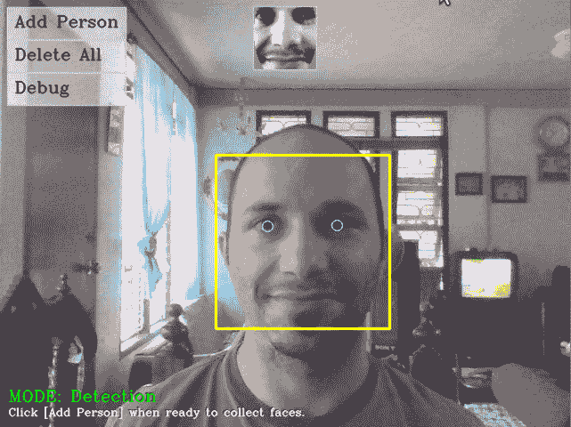

# 集合模式

当用户点击添加人员按钮以表示他们想要开始收集新人物的脸部图像时，我们进入集合模式。如前所述，我们将脸部收集限制为每秒一个脸部，并且只有当它与之前收集的脸部有显著变化时才进行收集。并且记住，我们决定收集不仅包括预处理的脸部，还包括预处理的镜像图像。

在集合模式中，我们希望显示每个已知人物的最新脸部图像，并允许用户点击其中之一以添加更多脸部图像，或者点击添加人员按钮以将新人物添加到集合中。用户必须点击窗口中间的某个位置以继续到下一个（*训练模式*）模式。

因此，首先我们需要为每个人收集的最新脸部图像保留一个引用。我们将通过更新整数数组`m_latestFaces`来完成此操作，该数组仅存储每个人员在大型`preprocessedFaces`数组（即所有人的所有脸部图像的集合）中的数组索引。由于我们也在该数组中存储了镜像脸部，我们想要引用倒数第二个脸部，而不是最后一个脸部。以下代码应附加到将新脸部（和镜像脸部）添加到`preprocessedFaces`数组的代码中，如下所示：

```py
    // Keep a reference to the latest face of each person. 
    m_latestFaces[m_selectedPerson] = preprocessedFaces.size() - 2;

```

我们只需要记住，每当添加或删除新人物时（例如，由于用户点击添加人员按钮），我们都要记得增长或缩小`m_latestFaces`数组。现在让我们按照以下方式显示收集到的每个人的最新脸部图像，在窗口的右侧（在后续的集合模式和识别模式中）：

```py
    m_gui_faces_left = displayedFrame.cols - BORDER - faceWidth; 
    m_gui_faces_top = BORDER; 
    for (int i=0; i<m_numPersons; i++) { 
      int index = m_latestFaces[i]; 
      if (index >= 0 && index < (int)preprocessedFaces.size()) { 
        Mat srcGray = preprocessedFaces[index]; 
        if (srcGray.data) { 
          // Get a BGR face, since the output is BGR. 
          Mat srcBGR = Mat(srcGray.size(), CV_8UC3); 
          cvtColor(srcGray, srcBGR, CV_GRAY2BGR); 

          // Get the destination ROI 
          int y = min(m_gui_faces_top + i * faceHeight, 
          displayedFrame.rows - faceHeight); 
          Rect dstRC = Rect(m_gui_faces_left, y, faceWidth, 
          faceHeight); 
          Mat dstROI = displayedFrame(dstRC); 

          // Copy the pixels from src to dst. 
          srcBGR.copyTo(dstROI); 
        } 
      } 
    }

```

我们还希望使用粗红色的边框突出显示当前正在收集的人物，如下所示：

```py
    if (m_mode == MODE_COLLECT_FACES) { 
      if (m_selectedPerson >= 0 && 
        m_selectedPerson < m_numPersons) { 
        int y = min(m_gui_faces_top + m_selectedPerson *  
        faceHeight, displayedFrame.rows - faceHeight); 
        Rect rc = Rect(m_gui_faces_left, y, faceWidth, faceHeight); 
        rectangle(displayedFrame, rc, CV_RGB(255,0,0), 3, CV_AA); 
      } 
    }

```

以下部分截图显示了收集到几个人的脸部图像时的典型显示。用户可以点击右上角的人来收集该人的更多脸部图像。

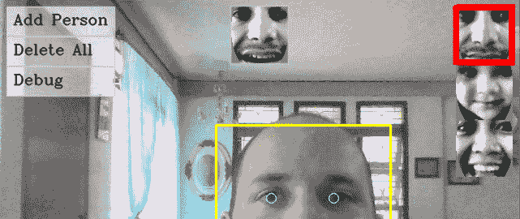

# 训练模式

当用户最终点击窗口中间时，面部识别算法将开始对所有收集到的面部进行训练。但重要的是要确保收集到了足够多的面部或人物，否则程序可能会崩溃。一般来说，这只需要确保训练集中至少有一个面部（这意味着至少有一个人）。但 Fisherfaces 算法寻找人物之间的比较，所以如果训练集中少于两个人，它也会崩溃。因此，我们必须检查所选的面部识别算法是否为 Fisherfaces。如果是的话，那么我们要求至少有两个人有面部，否则我们要求至少有一个人有面部。如果数据不足，程序将回到收集模式，以便用户在训练前添加更多面部。

为了检查是否至少有两个人收集到了面部，我们可以确保当用户点击添加人员按钮时，只有在没有空人员（即添加了但没有收集到任何面部的人）的情况下才会添加新人员。如果只有两个人，并且我们使用 Fisherfaces 算法，那么我们必须确保在收集模式下为最后一个人设置了`m_latestFaces`引用。`m_latestFaces[i]`在还没有为该人添加任何面部时初始化为-1，一旦为该人添加了面部，它就变为`0`或更高。这是按照以下方式完成的：

```py
    // Check if there is enough data to train from. 
    bool haveEnoughData = true; 
    if (!strcmp(facerecAlgorithm, "FaceRecognizer.Fisherfaces")) { 
      if ((m_numPersons < 2) || 
      (m_numPersons == 2 && m_latestFaces[1] < 0) ) { 
        cout << "Fisherfaces needs >= 2 people!" << endl; 
        haveEnoughData = false; 
      } 
    } 
    if (m_numPersons < 1 || preprocessedFaces.size() <= 0 || 
      preprocessedFaces.size() != faceLabels.size()) { 
      cout << "Need data before it can be learnt!" << endl; 
      haveEnoughData = false; 
    } 

    if (haveEnoughData) { 
      // Train collected faces using Eigenfaces or Fisherfaces. 
      model = learnCollectedFaces(preprocessedFaces, faceLabels, 
              facerecAlgorithm); 

      // Now that training is over, we can start recognizing! 
      m_mode = MODE_RECOGNITION; 
    } 
    else { 
      // Not enough training data, go back to Collection mode! 
      m_mode = MODE_COLLECT_FACES; 
    }

```

训练可能只需要几分之一秒，也可能需要几秒甚至几分钟，这取决于收集了多少数据。一旦收集到的面部训练完成，面部识别系统将自动进入*识别模式*。

# 识别模式

在识别模式下，预处理后的面部旁边会显示一个置信度计，这样用户就知道识别的可靠性。如果置信度高于未知阈值，它将在识别出的人周围画一个绿色的矩形，以便轻松显示结果。如果用户点击添加人员按钮或现有人员之一，程序将返回收集模式，以便用户可以添加更多面部进行进一步训练。

现在我们已经获得了识别出的身份和与重建面部的相似度，如前所述。为了显示置信度计，我们知道 L2 相似度值通常在 0 到 0.5 之间表示高置信度，在 0.5 到 1.0 之间表示低置信度，因此我们可以从 1.0 中减去它，以获得 0.0 到 1.0 之间的置信度水平。然后我们只需使用置信度水平作为以下所示的比例绘制一个填充矩形：

```py
    int cx = (displayedFrame.cols - faceWidth) / 2; 
    Point ptBottomRight = Point(cx - 5, BORDER + faceHeight); 
    Point ptTopLeft = Point(cx - 15, BORDER); 

    // Draw a gray line showing the threshold for "unknown" people. 
    Point ptThreshold = Point(ptTopLeft.x, ptBottomRight.y - 
      (1.0 - UNKNOWN_PERSON_THRESHOLD) * faceHeight); 
    rectangle(displayedFrame, ptThreshold, Point(ptBottomRight.x, 
    ptThreshold.y), CV_RGB(200,200,200), 1, CV_AA); 

    // Crop the confidence rating between 0 to 1 to fit in the bar. 
    double confidenceRatio = 1.0 - min(max(similarity, 0.0), 1.0); 
    Point ptConfidence = Point(ptTopLeft.x, ptBottomRight.y - 
      confidenceRatio * faceHeight); 

    // Show the light-blue confidence bar. 
    rectangle(displayedFrame, ptConfidence, ptBottomRight, 
      CV_RGB(0,255,255), CV_FILLED, CV_AA); 

    // Show the gray border of the bar. 
    rectangle(displayedFrame, ptTopLeft, ptBottomRight, 
      CV_RGB(200,200,200), 1, CV_AA);

```

为了突出显示识别出的人，我们在他们的面部周围画一个绿色的矩形。

如下所示：

```py
    if (identity >= 0 && identity < 1000) { 
      int y = min(m_gui_faces_top + identity * faceHeight, 
        displayedFrame.rows - faceHeight); 
      Rect rc = Rect(m_gui_faces_left, y, faceWidth, faceHeight); 
      rectangle(displayedFrame, rc, CV_RGB(0,255,0), 3, CV_AA); 
    }

```

以下部分截图显示了在识别模式下运行时的典型显示，显示了预处理后的面部旁边的置信度计。

在顶部中央，并突出显示右上角被识别的人。

# 检查和处理鼠标点击

现在我们已经绘制了所有 GUI 元素，我们只需要处理鼠标事件。当我们初始化显示窗口时，我们告诉 OpenCV 我们想要将鼠标事件回调到我们的`onMouse`函数。我们只关心鼠标点击，而不关心鼠标移动，所以我们首先跳过不是针对左鼠标按钮点击的鼠标事件，如下所示：

```py
    void onMouse(int event, int x, int y, int, void*) 
    { 
      if (event != CV_EVENT_LBUTTONDOWN) 
        return; 

      Point pt = Point(x,y); 

      ... (handle mouse clicks) 
      ... 
    }

```

由于我们在绘制按钮时获得了绘制的矩形边界，我们只需通过调用 OpenCV 的`inside()`函数来检查鼠标点击位置是否在我们的任何按钮区域内。现在我们可以检查我们创建的每个按钮。

当用户点击添加人员按钮时，我们只需将`m_numPersons`变量加 1，在`m_latestFaces`变量中分配更多空间，选择新的人员进行收集，并开始收集模式（无论我们之前处于哪种模式）。

但有一个复杂的问题；为了确保我们至少为每个

在训练时，如果还没有零人脸的人员，我们才会为新人分配空间。这将确保我们始终可以检查`m_latestFaces[m_numPersons-1]`的值，以查看是否为每个人收集到了人脸。这是如下进行的：

```py
    if (pt.inside(m_btnAddPerson)) { 
      // Ensure there isn't a person without collected faces. 
      if ((m_numPersons==0) || 
         (m_latestFaces[m_numPersons-1] >= 0)) { 
          // Add a new person. 
          m_numPersons++; 
          m_latestFaces.push_back(-1); 
      } 
      m_selectedPerson = m_numPersons - 1; 
      m_mode = MODE_COLLECT_FACES; 
    }

```

此方法可用于测试其他按钮点击，例如如下切换调试标志：

```py
    else if (pt.inside(m_btnDebug)) { 
      m_debug = !m_debug; 
    }

```

要处理删除所有按钮，我们需要清空我们主循环中局部的一些数据结构（即，不可从鼠标事件回调函数中访问），因此我们切换到删除所有模式，然后我们就可以在主循环内部删除所有内容。我们还必须处理用户点击主窗口（即，不是按钮）。如果他们点击了右侧的某个人，那么我们想要选择那个人并切换到收集模式。或者如果他们在收集模式时点击主窗口，那么我们想要切换到训练模式。这是如下进行的：

```py
    else { 
      // Check if the user clicked on a face from the list. 
      int clickedPerson = -1; 
      for (int i=0; i<m_numPersons; i++) { 
        if (m_gui_faces_top >= 0) { 
          Rect rcFace = Rect(m_gui_faces_left,  
          m_gui_faces_top + i * faceHeight, faceWidth, faceHeight); 
          if (pt.inside(rcFace)) { 
            clickedPerson = i; 
            break; 
          } 
        } 
      } 
      // Change the selected person, if the user clicked a face. 
      if (clickedPerson >= 0) { 
        // Change the current person & collect more photos. 
        m_selectedPerson = clickedPerson; 
        m_mode = MODE_COLLECT_FACES; 
      } 
      // Otherwise they clicked in the center. 
      else { 
        // Change to training mode if it was collecting faces. 
        if (m_mode == MODE_COLLECT_FACES) { 
            m_mode = MODE_TRAINING; 
        } 
      } 
    }

```

# 摘要

本章向您展示了创建实时人脸识别应用所需的所有步骤，包括足够的预处理以允许训练集条件与测试集条件之间的一些差异，仅使用基本算法。我们使用人脸检测来找到相机图像中人脸的位置，然后通过几种形式的人脸预处理来减少不同光照条件、相机和人脸方向以及面部表情的影响。然后，我们使用收集到的预处理人脸训练了一个 Eigenfaces 或 Fisherfaces 机器学习系统，并最终进行了人脸识别以确定该人是谁，如果是一个未知的人，则通过人脸验证提供一个置信度指标。

我们不是提供一个处理图像文件的离线命令行工具，而是将所有前面的步骤组合成一个自包含的实时 GUI 程序，以便立即使用面部识别系统。您应该能够根据您的需求修改系统的行为，例如允许计算机自动登录，或者如果您对提高识别可靠性感兴趣，您可以阅读关于面部识别最新进展的会议论文，以潜在地改进程序的每个步骤，直到它足够可靠以满足您的特定需求。例如，您可以改进面部预处理阶段，或使用更先进的机器学习算法，或基于[`www.face-rec.org/algorithms/`](http://www.face-rec.org/algorithms/)和[`www.cvpapers.com`](http://www.cvpapers.com)上的方法使用更好的面部验证算法。

# 参考文献

+   *使用简单特征级联快速对象检测*，*P. Viola*

    和 M.J. Jones*，*《IEEE Transactions on Computer Vision and Pattern Recognition》2001 年第 1 卷*,

    *pp. 511-518*

+   *用于快速对象检测的扩展 Haar-like 特征集*，*R. Lienhart 和 J. Maydt*，*《IEEE Transactions on Image Processing》2002 年第 1 卷*，*pp. 900-903*

+   *基于局部二值模式的面部描述：应用于面部识别*，*T. Ahonen, A. Hadid 和 M. Pietikäinen*，*《IEEE Transactions on Pattern Analysis and Machine Intelligence》2006 年第 28 卷第 12 期*，*pp. 2037-2041*

+   *《学习 OpenCV：使用 OpenCV 库进行计算机视觉》*，*G. Bradski 和 A. Kaehler*，*pp. 186-190*，*O'Reilly Media*.

+   *特征脸用于识别*，*M. Turk 和 A. Pentland*，*《Journal of Cognitive Neuroscience》第 3 卷*，*pp. 71-86*

+   *特征脸与 Fisher 脸：基于类特定线性投影的识别*，*P.N. Belhumeur, J. Hespanha 和 D. Kriegman*，*《IEEE Transactions on Pattern Analysis and Machine Intelligence》1997 年第 19 卷第 7 期*，*pp. 711-720*

+   *基于局部二值模式的面部识别*，*T. Ahonen, A. Hadid 和 M. Pietikäinen*，*《Computer Vision - ECCV 2004》*，*pp. 469-48*
