# 第四章. 广义线性模型

对于预测数值输出的回归任务，例如价格或温度，我们已经看到线性回归可能是一个好的起点。它易于训练且易于解释，尽管作为一个模型，它对数据和潜在的目标函数做出了严格的假设。在学习更高级的回归问题解决技术之前，我们将介绍**逻辑回归**。尽管其名称有些误导，但实际上这是我们第一个用于执行分类的模型。正如我们在第一章中学习的，“准备预测建模”，在分类问题中，我们的输出是定性的，因此由有限值的集合组成，我们称之为类别。我们将从考虑二元分类场景开始，我们试图区分两个类别，我们将任意地将它们标记为 0 和 1，稍后我们将扩展到区分多个类别。最后，我们将简要介绍其他回归方法，泊松回归和负二项回归。

# 使用线性回归进行分类

尽管我们知道分类问题涉及定性输出，但似乎很自然地会问我们是否可以使用我们现有的线性回归知识并将其应用于分类场景。我们可以通过训练一个线性回归模型来预测区间 [0, 1] 内的值来实现这一点，记住我们已经选择将两个类别标记为 0 和 1。然后，我们可以将阈值应用于我们模型的输出，这样，如果模型输出的值低于 0.5，我们就会预测类别 0；否则，我们就会预测类别 1。

以下图表展示了对于具有单个输入特征 X1 的简单线性回归和二元分类问题，这一概念。

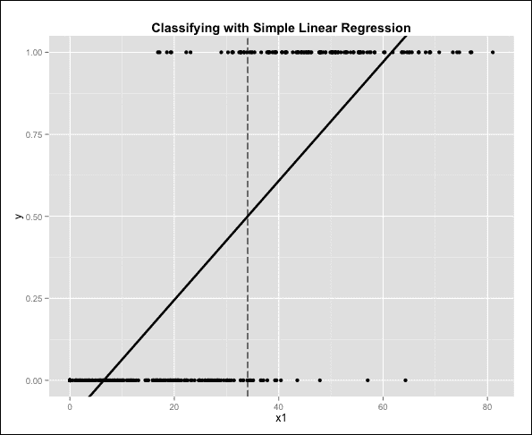

我们的目标变量 *y* 要么是 0，要么是 1，因此所有数据都位于两条水平线上。实线表示模型的输出，虚线表示决策边界，它出现在我们将模型预测输出的阈值设置为 0.5 时。虚线左侧的点被预测为属于类别 0，而右侧的点被预测为属于类别 1。

该模型显然并不完美，但它似乎确实正确分类了大部分数据。

尽管在这种情况下这是一个很好的近似，但这种方法在许多方面感觉并不正确。首先，尽管我们事先知道我们的输出变量被限制在区间[0, 1]内，因为我们只有两个类别，但线性回归的原始输出预测的值超出了这个范围。我们可以从输入特征*X1*的值非常低或非常高的图中看到这一点。其次，线性回归旨在解决最小化均方误差的问题，这似乎不适合我们这种情况。我们的目标实际上是找到一种方法来分离两个类别，而不是最小化与最佳拟合线的均方误差。因此，决策边界的位置对高杠杆点的存在非常敏感。正如我们在第二章“线性回归”中讨论的那样，高杠杆点是那些由于至少一个输入特征的极端值而远离大部分数据的点。

下面的图展示了高杠杆点对我们分类器的影响：

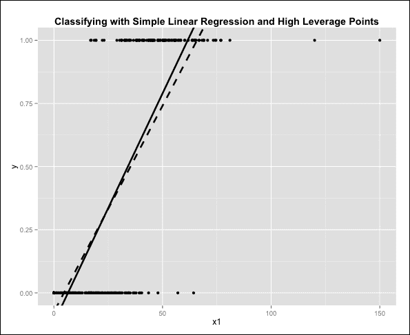

这里，数据与之前完全相同，只是我们为类别 1 添加了两个新的观测值，这两个观测值在特征*X1*上的值相对较高，因此出现在图表的右侧。现在理想情况下，因为这两个新添加的观测值已经处于我们预测类别 1 的图表区域，它们不应该对我们的决策边界产生太大的影响。由于我们正在最小化均方误差，旧的线性回归线（以实线表示）现在已经向右移动（以虚线表示）。因此，我们的新线性回归线在*y*轴上与 0.5 相交的点已经向右移动。因此，仅添加两个新点就明显将我们的决策边界向右移动。

逻辑回归通过提供一个输出值在区间[0,1]内且使用与线性回归完全不同的优化标准进行训练，解决了所有这些问题，因此我们不再通过最小化均方误差来拟合函数，正如我们现在将看到的。

# 逻辑回归简介

在逻辑回归中，输入特征与线性回归一样进行线性缩放；然而，结果随后被作为输入传递给**逻辑函数**。这个函数对其输入进行非线性转换，并确保输出值的范围，即解释为输入属于类别 1 的概率，位于区间[0,1]内。逻辑函数的形式如下：

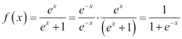

这里是逻辑函数的图示：

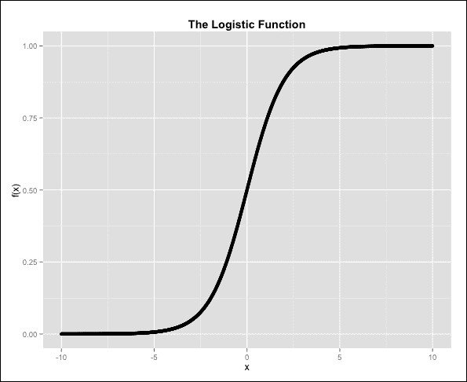

当 *x = 0* 时，逻辑函数取值为 0.5。当 *x* 趋向于 *+∞* 时，分母中的指数消失，函数趋近于值 1。当 *x* 趋向于 *-∞* 时，指数以及分母趋向于无限大，函数趋近于值 0。因此，我们的输出保证在区间 [0,1] 内，这对于它作为一个概率是必要的。

## 广义线性模型

逻辑回归属于一类称为**广义线性模型**（**GLMs**）的模型。广义线性模型有三个统一的特点。第一个特点是它们都涉及输入特征的线性组合，从而解释了它们名称的一部分。第二个特点是输出被认为具有属于指数分布族的潜在概率分布。这些包括正态分布、泊松分布和二项分布。最后，输出分布的均值通过一个称为**连接函数**的函数与输入特征的线性组合相关联。让我们看看这一切如何与逻辑回归联系起来，逻辑回归只是许多广义线性模型（GLM）的例子之一。我们知道我们从一个输入特征的线性组合开始，例如，在只有一个输入特征的情况下，我们可以构建一个如下所示的 *x* 项：

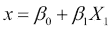

### 注意

注意，在逻辑回归的情况下，我们是在模拟输出属于类别 1 的概率，而不是像线性回归那样直接模拟输出。因此，我们不需要模拟误差项，因为我们的输出，即概率，直接包含了模型固有的随机性。

接下来，我们将逻辑函数应用于这个项，以产生我们模型的输出：

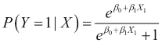

这里，左边的项直接告诉我们，我们正在根据我们看到的输入特征 *X1* 的值来计算输出属于类别 1 的概率。对于逻辑回归，输出的潜在概率分布是伯努利分布。这与单次试验的二项分布相同，是在只有两种可能结果且概率恒定的实验中获得的分布，例如抛硬币。

伯努利分布的均值 *μy* 是（任意选择的）成功事件的概率，在本例中，为类别 1。因此，前一个方程的左侧也是我们潜在输出分布的均值。因此，将输入特征线性组合转换的函数有时被称为**均值函数**，我们刚刚看到这个函数是逻辑回归中的逻辑函数。

现在，为了确定逻辑回归的连接函数，我们可以进行一些简单的代数运算，以便隔离我们的输入特征线性组合。

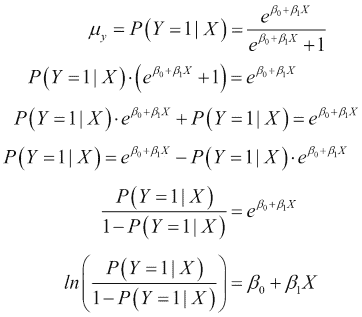

左侧的项被称为**对数几率**或**logit 函数**，是逻辑回归的连接函数。对数中的分母是在给定数据的情况下输出为类别 0 的概率。因此，这个分数代表了类别 1 和类别 0 之间概率的比率，也称为**优势比**：

### 小贴士

逻辑回归的良好参考书籍，以及泊松回归等其他广义线性模型（GLM）的示例，是《使用 R 扩展线性模型》，作者为*Julian J. Faraway*，出版社为*CRC Press*。

## 逻辑回归系数的解释

观察最后一个方程的右侧，我们可以看到，我们几乎有与简单线性回归完全相同的结构，只是没有误差项。然而，左侧有 logit 函数的事实意味着我们不能像线性回归那样解释我们的回归系数。在逻辑回归中，特征*Xi*的单位增加会导致优势比乘以一个量，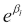。当一个系数*βi*为正时，那么我们将优势比乘以一个大于 1 的数，因此我们知道增加特征*Xi*将有效地增加输出被标记为类别 1 的概率。

同样，增加一个具有负系数的特征会将平衡偏向预测类别 0。最后，请注意，当我们改变输入特征的值时，这种影响是对优势比进行乘法运算，而不是对模型输出本身进行运算，正如我们所看到的，这是预测类别 1 的概率。从绝对值的角度来看，我们模型输出的变化（由于输入的变化引起）并不是恒定的，而是取决于我们输入特征当前的值。这与线性回归不同，在线性回归中，无论输入特征的值如何，回归系数始终代表输入特征单位增加时输出增加的固定量。

## 逻辑回归的假设

逻辑回归对输入的假设比线性回归要少。特别是，逻辑函数的非线性变换意味着我们可以模拟更复杂的输入输出关系。我们仍然有一个线性假设，但在这个情况下，它是特征和对数几率之间的。我们不再需要残差的正态性假设，也不需要同方差性假设。另一方面，我们的误差项仍然需要是独立的。严格来说，特征本身不再需要是独立的，但在实践中，如果特征表现出高度的多重共线性，我们的模型仍然会面临问题。最后，我们注意到，就像未正则化的线性回归一样，特征缩放不会影响逻辑回归模型。这意味着对特定输入特征进行中心化和缩放将简单地导致输出模型中的调整系数，而不会对模型性能产生任何影响。实际上，对于逻辑回归来说，这是由于一个称为**最大似然不变性**的性质所导致的。最大似然是选择系数的方法，将在下一节中讨论。然而，需要注意的是，如果特征处于非常不同的尺度上，对特征进行中心化和缩放可能仍然是一个好主意。这是在训练过程中帮助优化过程。简而言之，我们只有在遇到模型收敛问题时才应该转向特征缩放。

## 最大似然估计

当我们学习线性回归时，我们通过最小化平方误差项的总和来找到我们的系数。对于逻辑回归，我们通过最大化数据的**似然性**来实现这一点。一个观察值的似然性是在特定模型下看到该观察值的概率。

在我们的情况下，看到类别 1 的观察值*X*的似然性简单地由概率*P(Y=1|X)*给出，其形式在本章前面已经给出。因为我们只有两个类别，所以看到类别 0 的观察值的似然性由*1 - P(Y=1|X)*给出。看到我们整个观察值数据集的总体似然性是所有单个数据点的似然性的乘积，因为我们认为我们的观察值是独立获得的。由于每个观察值的似然性由回归系数*βi*参数化，因此我们整个数据集的似然函数也由这些系数参数化。我们可以将我们的似然函数表示为一个方程，如下所示：

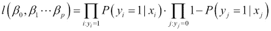

现在，这个方程简单地计算了一个具有特定回归系数的逻辑回归模型可能生成我们的训练数据的概率。我们的想法是选择我们的回归系数，使得这个似然函数最大化。我们可以看到，似然函数的形式是两个大乘积的乘积，来自两个大的*π*符号。第一个乘积包含我们所有类别 1 观测值的似然，第二个乘积包含我们所有类别 0 观测值的似然。我们通常指的是数据的**对数似然**，它是通过对似然函数取对数来计算的。利用乘积的每个项的对数之和等于对数乘积的事实，我们可以写出：

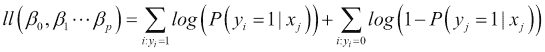

我们可以使用一个经典的技巧进一步简化，形成一个单独的求和：

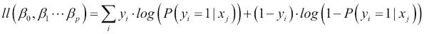

为了看到这是为什么，请注意，对于实际输出变量*y*的值为 1 的观测值，求和中的右侧项为零，所以我们实际上只剩下前一个方程中的第一个求和。同样，当*y*的实际值为 0 时，我们剩下前一个方程中的第二个求和。理解对数似然的形式很重要，当我们开始使用 R 训练逻辑回归模型时，我们将对此进行一些练习。请注意，最大化似然等价于最大化对数似然；两种方法都将产生相同的参数。

最大似然估计是参数拟合的基本技术，我们将在本书的其他模型中遇到它。尽管它很受欢迎，但应该注意的是，最大似然并不是万能的。确实存在可以构建模型的替代训练标准，并且有一些众所周知的情况，这种方法不会导致一个好的模型，正如我们在后续章节中将要看到的。最后，请注意，实际优化过程的细节，即找到回归系数的最大似然值，超出了本书的范围，通常我们可以依赖 R 为我们实现这一点。

# 预测心脏病

我们将使用 UCI 机器学习仓库的真实世界数据集来测试二分类任务的逻辑回归。这次，我们将使用*Statlog (Heart)数据集*，为了简便起见，我们将称之为*心脏数据集*。该数据集可以从 UCI 机器学习仓库的网站[`archive.ics.uci.edu/ml/datasets/Statlog+%28Heart%29`](http://archive.ics.uci.edu/ml/datasets/Statlog+%28Heart%29)下载。数据包含 270 个潜在心脏问题的患者观察结果。其中，120 名患者被证实有心脏病，因此两个类别的分割相当均匀。任务是预测患者是否有心脏病，基于他们的个人资料和一系列医疗测试。首先，我们将数据加载到数据框中，并根据网站重命名列：

```py
> heart <- read.table("heart.dat", quote = "\"")
> names(heart) <- c("AGE", "SEX", "CHESTPAIN", "RESTBP", "CHOL", "SUGAR", "ECG", "MAXHR", "ANGINA", "DEP", "EXERCISE", "FLUOR", "THAL", "OUTPUT")
```

以下表格包含了我们输入特征的定义和输出：

| 列名 | 类型 | 定义 |
| --- | --- | --- |
| `AGE` | 数值 | 年龄（年） |
| `SEX` | 二元 | 性别 |
| `CHESTPAIN` | 分类 | 4 种值的胸痛类型 |
| `RESTBP` | 数值 | 休息血压（每分钟跳动次数） |
| `CHOL` | 数值 | 血清胆固醇（mg/dl） |
| `SUGAR` | 二元 | 空腹血糖水平是否大于 120 mg/dl？ |
| `ECG` | 分类 | 3 种值的静息心电图结果 |
| `MAXHR` | 数值 | 达到的最大心率（每分钟跳动次数） |
| `ANGINA` | 二元 | 是否由运动引起心绞痛？ |
| `DEP` | 数值 | 相对于休息时由运动引起的 ST 段压低 |
| `EXERCISE` | 有序分类 | 运动峰值 ST 段斜率 |
| `FLUOR` | 数值 | 通过荧光透视术着色的主要血管数量 |
| `THAL` | 分类 | 3 种值的 Thal |
| `OUTPUT` | 二元 | 是否存在心脏病 |

在我们为这些数据训练逻辑回归模型之前，有一些预处理步骤我们应该执行。当处理数值数据时，一个常见的陷阱是没有注意到当一个特征实际上是分类变量而不是数值变量时，当级别被编码为数字时。在心脏数据集中，我们有四个这样的特征。`CHESTPAIN`、`THAL`和`ECG`特征都是分类特征。`EXERCISE`变量，尽管是有序分类变量，但仍然是一个分类变量，因此它也必须被编码为因子：

```py
> heart$CHESTPAIN = factor(heart$CHESTPAIN)
> heart$ECG = factor(heart$ECG)
> heart$THAL = factor(heart$THAL)
> heart$EXERCISE = factor(heart$EXERCISE)
```

在第一章《准备预测建模》中，我们看到了如何将具有多个级别的分类特征转换为一组二元值指示变量。通过这样做，我们可以使用它们在模型中，如线性或逻辑回归，该模型要求所有输入都是数值。只要数据框中的相关分类变量已被编码为因子，R 在执行逻辑回归时会自动应用编码方案。具体来说，R 会将其中一个 *k* 个因子级别作为参考级别，并从其他因子级别创建 *k-1* 个二元特征。当我们研究我们将要训练的逻辑回归模型的摘要输出时，我们将看到这一点的视觉证据。

接下来，我们应该注意到`OUTPUT`变量被编码，使得类别 1 对应于没有心脏病，类别 2 对应于存在心脏病。作为最后的改变，我们希望重新编码`OUTPUT`变量，以便我们将有熟悉的类别标签 0 和 1，分别。这可以通过简单地减去`1`来完成：

```py
> heart$OUTPUT = heart$OUTPUT - 1
```

我们的数据框现在已准备就绪。然而，在我们训练模型之前，我们将数据框分为两部分，用于训练和测试，正如我们在线性回归中所做的那样。再次，我们将使用 85-15 的分割：

```py
> library(caret)
> set.seed(987954)
> heart_sampling_vector <- 
  createDataPartition(heart$OUTPUT, p = 0.85, list = FALSE)
> heart_train <- heart[heart_sampling_vector,]
> heart_train_labels <- heart$OUTPUT[heart_sampling_vector]
> heart_test <- heart[-heart_sampling_vector,]
> heart_test_labels <- heart$OUTPUT[-heart_sampling_vector]
```

我们现在在训练集中有 230 个观测值，在测试集中有 40 个观测值。要在 R 中训练逻辑回归模型，我们使用`glm()`函数，代表广义线性模型。此函数可用于训练各种广义线性模型，但在这里我们将关注逻辑回归的语法和用法。调用如下：

```py
> heart_model <- 
  glm(OUTPUT ~ ., data = heart_train, family = binomial("logit"))
```

注意，格式与我们之前看到的线性回归非常相似。第一个参数是模型公式，它标识输出变量以及我们想要使用的特征（在这种情况下，所有特征）。第二个参数是数据框，最后的`family`参数用于指定我们想要执行逻辑回归。我们可以使用`summary()`函数来了解更多关于我们刚刚训练的模型的信息，如下所示：

```py
> summary(heart_model)

Call:
glm(formula = OUTPUT ~ ., family = binomial("logit"), data = heart_train)

Deviance Residuals: 
    Min       1Q   Median       3Q      Max  
-2.7137  -0.4421  -0.1382   0.3588   2.8118  

Coefficients:
             Estimate Std. Error z value Pr(>|z|)    
(Intercept) -7.946051   3.477686  -2.285 0.022321 *  
AGE         -0.020538   0.029580  -0.694 0.487482    
SEX          1.641327   0.656291   2.501 0.012387 *  
CHESTPAIN2   1.308530   1.000913   1.307 0.191098    
CHESTPAIN3   0.560233   0.865114   0.648 0.517255    
CHESTPAIN4   2.356442   0.820521   2.872 0.004080 ** 
RESTBP       0.026588   0.013357   1.991 0.046529 *  
CHOL         0.008105   0.004790   1.692 0.090593 .  
SUGAR       -1.263606   0.732414  -1.725 0.084480 .  
ECG1         1.352751   3.287293   0.412 0.680699    
ECG2         0.563430   0.461872   1.220 0.222509    
MAXHR       -0.013585   0.012873  -1.055 0.291283    
ANGINA       0.999906   0.525996   1.901 0.057305 .  
DEP          0.196349   0.282891   0.694 0.487632    
EXERCISE2    0.743530   0.560700   1.326 0.184815    
EXERCISE3    0.946718   1.165567   0.812 0.416655    
FLUOR        1.310240   0.308348   4.249 2.15e-05 ***
THAL6        0.304117   0.995464   0.306 0.759983    
THAL7        1.717886   0.510986   3.362 0.000774 ***
---
Signif. codes:  0 '***' 0.001 '**' 0.01 '*' 0.05 '.' 0.1 ' ' 1

(Dispersion parameter for binomial family taken to be 1)

    Null deviance: 315.90  on 229  degrees of freedom
Residual deviance: 140.36  on 211  degrees of freedom
AIC: 178.36

Number of Fisher Scoring iterations: 6
```

# 评估逻辑回归模型

使用`glm()`函数生成的逻辑回归模型摘要的格式与使用`lm()`函数生成的线性回归模型摘要的格式相似。这表明，对于我们的分类变量，我们比原始变量的级别数少一个二进制特征，例如，三值`THAL`输入特征生成了两个标记为`THAL6`和`THAL7`的二进制变量。我们将首先查看模型预测的回归系数。这些系数与它们的对应**z 统计量**一起呈现。这与我们在线性回归中看到的 t 统计量类似，再次强调，z 统计量的绝对值越高，这个特定特征与我们的输出变量显著相关的可能性就越大。z 统计量旁边的 p 值以概率的形式表达这一概念，并用星号和点标注，就像在线性回归中一样，表示包含相应 p 值的最小置信区间。

由于逻辑回归模型是用最大似然准则训练的，我们使用标准正态分布对我们系数进行显著性测试。例如，为了重现对应于列出的 z 值为 3.362 的`THAL7`特征的 p 值（当测试负系数时，将`lower.tail`参数设置为`T`）：

```py
> pnorm(3.362 , lower.tail = F) * 2
[1] 0.0007738012
```

### 注意

学习统计学中分布的基本概念的绝佳参考书籍是《All of Statistics》，作者 Larry Wasserman，Springer 出版社。

从模型摘要中，我们看到`FLUOR`、`CHESTPAIN4`和`THAL7`是心脏病最强的特征预测因子。许多输入特征具有相对较高的 p 值。这表明，在其他特征存在的情况下，它们可能不是心脏病的好指标。我们再次强调正确解释这个表的重要性。该表并没有说心脏年龄，例如，不是心脏病的好指标；相反，它表示，在其他输入特征存在的情况下，年龄实际上并没有给模型增加多少。此外，请注意，我们几乎肯定在我们的特征中存在一定程度的多重共线性，因为年龄的回归系数是负的，而我们会预期心脏病的发生概率随着年龄的增长而增加。当然，这个假设只在所有其他输入特征不存在的情况下才是有效的。事实上，如果我们只使用`AGE`变量重新训练逻辑回归模型，我们也会得到一个正的回归系数以及一个低的 p 值，这两个结果都支持我们的信念，即特征是共线的：

```py
> heart_model2 <- glm(OUTPUT ~ AGE, data = heart_train, family = binomial("logit"))
> summary(heart_model2)

Call:
glm(formula = OUTPUT ~ AGE, family = binomial("logit"), data = heart_train)

Deviance Residuals: 
    Min       1Q   Median       3Q      Max  
-1.5027  -1.0691  -0.8435   1.2061   1.6759  

Coefficients:
            Estimate Std. Error z value Pr(>|z|)   
(Intercept) -2.71136    0.86348  -3.140  0.00169 **
AGE          0.04539    0.01552   2.925  0.00344 **
---
Signif. codes:  0 '***' 0.001 '**' 0.01 '*' 0.05 '.' 0.1 ' ' 1

(Dispersion parameter for binomial family taken to be 1)

    Null deviance: 315.90  on 229  degrees of freedom
Residual deviance: 306.89  on 228  degrees of freedom
AIC: 310.89

Number of Fisher Scoring iterations: 4
```

注意，这个更简单模型的 AIC 值高于我们使用完整模型获得的结果，因此我们预计这个简单模型会更差。

## 模型偏差

为了理解模型总结的其余部分，我们需要引入一个称为**偏差**的重要概念。在线性回归中，我们的残差被定义为预测值与实际输出值之间的差异，这是我们试图预测的输出。逻辑回归使用最大似然进行训练，因此可以自然地预期，与残差类似的概念将涉及似然。偏差的概念有几个紧密相关的定义。在这里，我们将使用 `glm()` 函数使用的定义来解释模型的输出。观察值的偏差可以计算为该观察值的 -2 倍对数似然。数据集的偏差仅仅是所有观察值偏差的总和。

观察值的**偏差残差**是从偏差本身派生出来的，类似于线性回归的残差。它可以按以下方式计算：

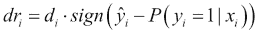

对于观察值 *i*，*dr[i]* 代表偏差残差，而 *di* 代表偏差。请注意，偏差残差的平方实际上消除了符号函数，只产生了观察值的偏差。因此，平方偏差残差的和就是数据集的偏差，这仅仅是数据集对数似然值的常数 -2 倍。因此，最大化数据的对数似然与最小化平方偏差残差之和是相同的，所以我们的线性回归类比就完整了。

为了重现模型总结中显示的结果，并理解偏差是如何计算的，我们将使用 R 编写一些自己的函数。我们将从使用本章前面提到的对数似然方程计算数据集的对数似然值开始。从方程中，我们将创建两个函数。`log_likelihoods()` 函数计算数据集中所有观察值的对数似然向量，给定模型预测的概率和实际的目标标签，而 `dataset_log_likelihood()` 函数将这些值加起来以产生数据集的对数似然：

```py
 log_likelihoods <- function(y_labels, y_probs) {
     y_a <- as.numeric(y_labels)
     y_p <- as.numeric(y_probs)
     y_a * log(y_p) + (1 - y_a) * log(1 - y_p)
 }

 dataset_log_likelihood <- function(y_labels, y_probs) {
     sum(log_likelihoods(y_labels, y_probs))
 }
```

接下来，我们可以使用偏差的定义来计算两个类似函数：`deviances()` 和 `dataset_deviance()`。第一个函数计算观察值偏差的向量，第二个函数将这些值加起来以计算整个数据集的偏差：

```py
 deviances <- function(y_labels, y_probs) {
     -2 * log_likelihoods(y_labels, y_probs)
 }

dataset_deviance <- function(y_labels, y_probs) {
     sum(deviances(y_labels, y_probs))
 }
```

给定这些函数，我们现在可以创建一个计算模型偏差的函数。为此，我们需要使用 `predict()` 函数来计算训练数据中观察值的模型概率预测。这与线性回归类似，但默认情况下它返回对数尺度上的概率。为了确保我们得到实际的概率，我们需要指定 `type` 参数的 `response` 值：

```py
model_deviance <- function(model, data, output_column) {
  y_labels = data[[output_column]]
  y_probs = predict(model, newdata = data, type = "response")
  dataset_deviance(y_labels, y_probs)
}
```

为了检查我们的函数是否正常工作，让我们计算我们的心脏模型中模型偏差，也称为残差偏差：

```py
> model_deviance(heart_model, data = heart_train, output_column = 
                 "OUTPUT")
[1] 140.3561
```

令人欣慰的是，这个值与我们在模型摘要中列出的相同。评估逻辑回归模型的一种方法是通过计算模型偏差与无特征模型偏差之间的差异，后者是在没有任何特征的情况下训练的模型。无特征模型的偏差被称为**零偏差**。由于没有特征，零模型通过一个恒定的概率预测类别 1。这个概率是通过估计训练数据中类别 1 观察值的比例来估计的，我们可以通过简单地平均`OUTPUT`列来获得这个比例：

```py
 null_deviance <- function(data, output_column) {
     y_labels <- data[[output_column]]
     y_probs <- mean(data[[output_column]])
     dataset_deviance(y_labels, y_probs)
 }

> null_deviance(data = heart_training, output_column = "OUTPUT")
[1] 314.3811
```

再次强调，我们看到我们重现了 R 在模型摘要中为我们计算出的值。残差偏差和零偏差类似于我们在线性回归中看到的**残差平方和**（**RSS**）和**真实平方和**（**TSS**）。如果这两个值之间的差异很大，其解释与线性回归中残差平方和的概念类似，即通过输出变量的观察值来“解释”方差。

继续这个类比，我们可以为我们的模型定义一个**伪 R2**值，使用与计算线性回归 R2 相同的方程，但用偏差来替换。我们在 R 中这样实现：

```py
 model_pseudo_r_squared <- function(model, data, output_column) {
     1 - ( model_deviance(model, data, output_column) / 
           null_deviance(data, output_column) )
 }

> model_pseudo_r_squared(heart_model, data = heart_train, 
                         output_column = "OUTPUT")
[1] 0.5556977
```

我们的逻辑回归模型解释了大约 56%的零偏差。这并不特别高；很可能是我们没有足够丰富的特征集来使用逻辑模型进行准确预测。与线性回归不同，伪 R2 可以超过 1，但这只发生在残差偏差超过零偏差的困难情况下。如果发生这种情况，我们不应相信模型，并继续使用特征选择方法，或者尝试其他模型。

除了伪 R2 之外，我们可能还想有一个统计检验来检查零偏差和残差偏差之间的差异是否显著。模型摘要中残差偏差旁边没有 p 值表示，R 没有创建任何测试。实际上，残差偏差和零偏差之间的差异大约是渐近地以**χ2**（发音为*CHI squared*）分布分布的。我们将定义一个函数来计算这个差异的 p 值，但这只是一个近似。

首先，我们需要零偏差和残差偏差之间的差异。我们还需要这个差异的自由度，这可以通过简单地从我们的模型自由度中减去零模型自由度来计算。零模型只有一个截距，所以自由度是数据集中观察值的总数减 1。对于残差偏差，我们正在计算包括截距在内的多个回归系数，因此我们需要从这个总数中减去这个数字。最后，我们使用 `pchisq()` 函数来获得 `p-value`，注意我们正在进行一个上尾计算，因此需要将 `lower.tail` 参数设置为 `FALSE`。代码如下：

```py
model_chi_squared_p_value <-  function(model, data, output_column) {
     null_df <- nrow(data) - 1
     model_df <- nrow(data) - length(model$coefficients)
     difference_df <- null_df - model_df
     null_deviance <- null_deviance(data, output_column)
     m_deviance <- model_deviance(model, data, output_column)
     difference_deviance <- null_deviance - m_deviance
     pchisq(difference_deviance, difference_df,lower.tail = F)
}

> model_chi_squared_p_value(heart_model, data = heart_train, 
                            output_column = "OUTPUT")
[1] 7.294219e-28
```

我们获得的 `p-value` 非常小，所以我们确信我们的模型产生的预测比平均猜测更好。在我们的原始模型摘要中，我们还看到了偏差残差的摘要。使用我们之前给出的偏差残差定义，我们将定义一个函数来计算偏差残差的向量：

```py
model_deviance_residuals <- function(model, data, output_column) {
     y_labels = data[[output_column]]
     y_probs = predict(model, newdata = data, type = "response")
     residual_sign = sign(y_labels - y_probs)
     residuals = sqrt(deviances(y_labels, y_probs))
     residual_sign * residuals
 }
```

最后，我们可以使用 `summary()` 函数对我们的 `model_deviance_residuals()` 函数获得的偏差残差进行总结，以获得一个表格：

```py
> summary(model_deviance_residuals(heart_model, data = 
          heart_train, output_column = "OUTPUT"))
    Min.  1st Qu.   Median     Mean  3rd Qu.     Max. 
-2.71400 -0.44210 -0.13820 -0.02765  0.35880  2.81200 
```

再次验证，我们可以确认我们得到了正确的结果。我们的模型摘要还提供了一项最后的诊断：Fisher 分数迭代次数，我们尚未讨论。这个数字通常在 4 到 8 之间，是一个收敛诊断。如果 R 用于训练逻辑模型的优化过程没有收敛，我们预计会看到一个较高的数字。如果发生这种情况，我们的模型可能是可疑的，我们可能无法用它来做出预测。在我们的情况下，我们处于预期的范围内。

## 测试集性能

我们已经看到如何使用 `predict()` 函数来计算我们模型的输出。这个输出是输入属于类别 1 的概率。我们可以通过应用阈值来进行二元分类。我们将对训练数据和测试数据进行此操作，并将它们与我们的预期输出进行比较，以衡量分类准确率：

```py
> train_predictions <- predict(heart_model, newdata = heart_train, 
                               type = "response")
> train_class_predictions <- as.numeric(train_predictions > 0.5)
> mean(train_class_predictions == heart_train$OUTPUT)
[1] 0.8869565
> test_predictions = predict(heart_model, newdata = heart_test, 
                             type = "response")
> test_class_predictions = as.numeric(test_predictions > 0.5)
> mean(test_class_predictions == heart_test$OUTPUT)
[1] 0.9
```

训练集和测试集上的分类准确率非常相似，接近 90 %。这对于模型构建者来说是一个非常好的起点。我们模型中的系数表显示，一些特征似乎并不显著，我们还发现了一定程度的共线性，这意味着我们现在可以继续进行变量选择，并可能通过计算或获取更多关于我们患者的数据来寻找更多特征。伪 R2 的计算显示，我们没有充分解释模型中的偏差，这也支持了这一点。

# Lasso 正则化

在上一章关于线性回归的章节中，我们使用了`glmnet`包来进行岭回归和 lasso 的正则化。正如我们所见，移除一些特征可能是个不错的主意，因此我们将尝试将 lasso 应用于我们的数据集并评估结果。首先，我们将使用`glmnet()`训练一系列正则化模型，然后我们将使用`cv.glmnet()`来估计一个合适的*λ*值。然后，我们将使用这个*λ*来检查我们正则化模型的系数：

```py
> library(glmnet)
> heart_train_mat <- model.matrix(OUTPUT ~ ., heart_train)[,-1]
> lambdas <- 10 ^ seq(8, -4, length = 250)
> heart_models_lasso <- glmnet(heart_train_mat, 
  heart_train$OUTPUT, alpha = 1, lambda = lambdas, family = "binomial")
> lasso.cv <- cv.glmnet(heart_train_mat, heart_train$OUTPUT, alpha = 1,lambda = lambdas, family = "binomial")
> lambda_lasso <- lasso.cv$lambda.min
> lambda_lasso
[1] 0.01057052

> predict(heart_models_lasso, type = "coefficients", s = lambda_lasso)
19 x 1 sparse Matrix of class "dgCMatrix"
                       1
(Intercept) -4.980249537
AGE          .          
SEX          1.029146139
CHESTPAIN2   0.122044733
CHESTPAIN3   .          
CHESTPAIN4   1.521164330
RESTBP       0.013456000
CHOL         0.004190012
SUGAR       -0.587616822
ECG1         .          
ECG2         0.338365613
MAXHR       -0.010651758
ANGINA       0.807497991
DEP          0.211899820
EXERCISE2    0.351797531
EXERCISE3    0.081846313
FLUOR        0.947928099
THAL6        0.083440880
THAL7        1.501844677
```

我们可以看到，我们的一些特征已经有效地从模型中移除，因为它们的系数为零。如果我们现在使用这个模型来衡量训练集和测试集上的分类准确率，我们会观察到在两种情况下，我们得到了略微更好的性能。即使这个差异很小，记住我们是通过使用三个更少的特征来达到这个效果的：

```py
> lasso_train_predictions <- predict(heart_models_lasso, s = lambda_lasso, newx = heart_train_mat, type = "response")
> lasso_train_class_predictions <- 
  as.numeric(lasso_train_predictions > 0.5)
> mean(lasso_train_class_predictions == heart_train$OUTPUT)
[1] 0.8913043
> heart_test_mat <- model.matrix(OUTPUT ~ ., heart_test)[,-1]
> lasso_test_predictions <- predict(heart_models_lasso, s = lambda_lasso, newx = heart_test_mat, type = "response")
> lasso_test_class_predictions <- 
  as.numeric(lasso_test_predictions > 0.5)
> mean(lasso_test_class_predictions == heart_test$OUTPUT)
[1] 0.925
```

# 分类指标

虽然我们检查了模型的测试集准确率，但我们从第一章，“准备预测建模”中知道，二元混淆矩阵可以用来计算我们数据集的许多其他有用的性能指标，例如精确率、召回率和*F*度量。

我们现在将为我们的训练集计算这些值：

```py
> (confusion_matrix <- table(predicted = train_class_predictions, actual = heart_train$OUTPUT))
         actual
predicted   0   1
        0 118  16
        1  10  86
> (precision <- confusion_matrix[2, 2] / sum(confusion_matrix[2,]))
[1] 0.8958333
> (recall <- confusion_matrix[2, 2] / sum(confusion_matrix[,2]))
[1] 0.8431373
> (f = 2 * precision * recall / (precision + recall))
[1] 0.8686869
```

在这里，我们使用了将赋值语句括起来的技巧，同时将表达式的结果赋给一个变量并打印出所赋的值。现在，召回率是正确识别的类别 1 实例与属于类别 1 的总观察值的比率。在我们这样的医疗背景下，这也被称为**灵敏度**，因为它是一个衡量模型检测或对特定条件敏感的有效指标。召回率也被称为真正率。有一个类似的度量称为**特异性**，它是假阴性率。这涉及到对类别 0 的召回率的镜像计算，即正确识别的类别 0 成员与我们的数据集中类别 0 的所有观察值的比率。在我们这样的医疗背景下，例如，特异性的解释是它衡量模型拒绝不具有类别 1 所代表条件（在我们的案例中，心脏病）的观察的能力。我们可以如下计算我们模型的特异性：

```py
> (specificity <- confusion_matrix[1,1]/sum(confusion_matrix[1,]))
[1] 0.880597
```

在计算这些度量时，我们开始看到将阈值设置为`0.5`的重要性。如果我们选择不同的阈值，很明显，所有先前的度量都会改变。特别是，有许多情况，我们当前的医疗环境就是一个很好的例子，我们可能希望调整我们的阈值，使其偏向于识别类别 1 的成员。例如，假设我们的模型被临床医生用来确定是否让患者进行更详细和昂贵的疾病检查。我们可能会认为将患有心脏病的患者误标为健康是一个比要求健康患者进行进一步测试以被视为不健康更严重的错误。为了实现这种偏差，我们可以将我们的分类阈值降低到`0.3`或`0.2`，例如。

理想情况下，我们希望有一种视觉方式来评估改变阈值对我们性能指标的影响，而精确度召回率曲线就是这样一种有用的图表。在 R 中，我们可以使用`ROCR`包来获取精确度召回率曲线：

```py
> library(ROCR)
> train_predictions <- predict(heart_model, newdata = heart_train, type = "response")
> pred <- prediction(train_predictions, heart_training$OUTPUT)
> perf <- performance(pred, measure = "prec", x.measure = "rec")
```

然后，我们可以绘制`perf`对象以获得我们的精确度召回率曲线。

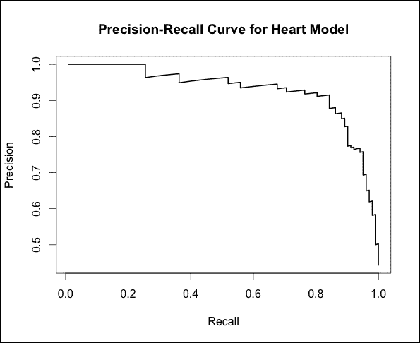

图表显示，例如，为了获得超过 0.8 的召回率值，我们可能不得不相当突然地牺牲精确度。为了微调我们的阈值，我们希望看到用于计算此图表的个别阈值。一个有用的练习是创建一个包含截止值的 DataFrame，这些截止值是我们数据中精确度和召回率发生变化的阈值，以及它们对应的精确度和召回率值。然后我们可以从这个 DataFrame 中提取出我们感兴趣的个别阈值。

例如，假设我们想要找到一个合适的阈值，以便至少有 90%的召回率和 80%的精确度。我们可以这样做：

```py
> thresholds <- data.frame(cutoffs = perf@alpha.values[[1]], recall = perf@x.values[[1]], precision = perf@y.values[[1]])
> subset(thresholds,(recall > 0.9) & (precision > 0.8))
      cutoffs    recall precision
112 0.3491857 0.9019608 0.8288288
113 0.3472740 0.9019608 0.8214286
114 0.3428354 0.9019608 0.8141593
115 0.3421438 0.9019608 0.8070175
```

如我们所见，大约 0.35 的阈值将满足我们的要求。

### 小贴士

你可能已经注意到，我们使用了`@`符号来访问`perf`对象的一些属性。这是因为这个对象是一种特殊类型的对象，称为 S4 类。S4 类用于在 R 中提供面向对象的功能。关于 S4 类以及 R 中更广泛的面向对象编程的参考资料是*Advanced R*，*Hadley Wickham*，*Chapman and Hall*。

# 二元逻辑分类器的扩展

到目前为止，本章的重点一直集中在二元分类任务上，其中我们有两个类别。现在，我们将转向多类别预测问题。在第一章“准备预测建模”中，我们研究了鸢尾花数据集，其目标是根据描述鸢尾花样本外部形态的特征来区分三种不同的鸢尾花种类。在介绍更多多类别问题的例子之前，我们将提出一个重要的警告。这个警告是，我们将在本书中研究的几种其他分类方法，如神经网络和决策树，在涉及两个以上类别的分类问题中，比逻辑回归更自然且更常用。考虑到这一点，我们将转向多项式逻辑回归，这是二元逻辑分类器的第一次扩展。

## 多项式逻辑回归

假设我们的目标变量包含*K*个类别。例如，在鸢尾花数据集中，*K = 3*。**多项式逻辑回归**通过拟合*K-1*个独立的二元逻辑回归分类模型来解决多类别问题。这是通过任意选择一个输出类别作为参考类别，并拟合*K-1*个回归模型来完成的，这些模型将每个剩余类别与这个类别进行比较。例如，如果我们有两个特征，*X1*和*X2*，以及三个类别，我们可以称之为 0、1 和 2，我们将构建以下两个模型：

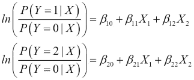

在这里，我们将类别 0 作为基线，并建立了两个二元回归模型。在第一个模型中，我们比较了类别 1 与类别 0，在第二个模型中，我们比较了类别 2 与类别 0。请注意，因为我们现在有多个二元回归模型，我们的模型系数有两个下标。第一个下标标识模型，第二个下标将系数与特征配对。例如，*β[12]*是第一个模型中特征*X[2]*的系数。我们可以为当总共有*K*个类别（编号从*0*到*K-1*，类别 0 被选为参考类别）时，我们的组合模型预测类别*k*的概率写一个通用表达式：

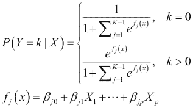

读者应验证所有输出类概率之和为 1，这是必需的。这种指数除以指数之和的特定数学形式被称为**softmax**函数。对于之前讨论的三个类别问题，我们只需在前面方程中将*K=3*代入即可。在此阶段，我们应该提到这种方法的一些重要特性。

首先，我们训练的模型数量比输出变量中类别的总数少一个，因此，当从大量可能的输出类别中进行选择时，这种方法扩展性并不好。我们构建和训练这么多模型的事实也意味着我们往往需要一个更大的数据集才能产生具有合理准确性的结果。最后，当我们独立地将每个输出类别与一个参考类别进行比较时，我们做出一个假设，称为**无关备选方案的独立性**（**IIA**）假设。

简而言之，IIA 假设指出，预测一个特定输出类别相对于另一个类别的概率，并不依赖于我们是否通过添加新类别来增加可能的输出类别数量*k*。为了说明这一点，假设为了简化，我们使用多项逻辑回归来模拟我们的鸢尾花数据集，输出类别的概率为 0.33 : 0.33 : 0.33，对于三种不同的物种，每种物种与其他物种的比例为 1 : 1。IIA 假设指出，如果我们重新拟合一个包含新类型鸢尾花样本（例如，日本鸢尾花 ensata）的模型，那么前三个鸢尾花物种之间的概率比将保持不变。四个物种之间新的整体概率比为 0.2 : 0.2 : 0.2 : 0.4（其中 0.4 对应 ensata）将是有效的，例如，因为旧的三种物种之间的 1 : 1 比例得到了保持。

### 预测玻璃类型

在本节中，我们将通过一个示例数据集来展示如何在 R 中训练多项逻辑回归模型。我们将检查的数据来自法医学领域。在这里，我们的目标是检查犯罪现场发现的玻璃碎片特性，并预测这些碎片的来源，例如，前灯。*玻璃识别数据集*由 UCI 机器学习存储库托管，网址为[`archive.ics.uci.edu/ml/datasets/Glass+Identification`](http://archive.ics.uci.edu/ml/datasets/Glass+Identification)。我们首先将数据加载到数据框中，使用网站上的信息重命名列，并丢弃第一列（每个样本的唯一标识符），因为这已被任意分配，并且对我们模型来说不是必需的：

```py
> glass <- read.csv("glass.data", header = FALSE)
> names(glass) <- c("id","RI","Na", "Mg", "Al", "Si", "K", "Ca", 
                    "Ba", "Fe", "Type")
> glass <- glass[,-1]
```

接下来，我们将查看一个表格，显示我们的数据框中每一列代表的内容：

| 列名 | 类型 | 定义 |
| --- | --- | --- |
| `RI` | 数值 | 折射率 |
| `Na` | 数值 | 按重量计算的氧化钠百分比 |
| `Mg` | 数值 | 按重量计算的氧化镁百分比 |
| `Al` | 数值 | 按重量计算的氧化铝百分比 |
| `Si` | 数值 | 按重量计算的氧化硅百分比 |
| `K` | 数值 | 按重量计算的氧化钾百分比 |
| `Ca` | 数值 | 按重量计算的氧化钙百分比 |
| `Ba` | 数值 | 按重量计算的氧化钡百分比 |
| `Fe` | 数值 | 按重量计算的氧化铁百分比 |
| `Type` | 分类 | 玻璃类型（1：浮法加工建筑窗户，2：非浮法加工建筑窗户，3：浮法加工车辆窗户，4：非浮法加工车辆窗户，5：容器，6：餐具，7：车灯） |

如往常一样，我们将为玻璃数据准备训练集和测试集：

```py
> set.seed(4365677)
> glass_sampling_vector 
   <- createDataPartition(glass$Type, p = 0.80, list = FALSE)
> glass_train <- glass[glass_sampling_vector,]
> glass_test <- glass[-glass_sampling_vector,]
```

现在，为了执行多项逻辑回归，我们将使用`nnet`包。此包还包含与神经网络一起工作的函数，因此我们将在下一章再次讨论这个包。`multinom()`函数用于多项逻辑回归。它通过指定一个公式和一个数据框来实现，因此它有一个熟悉的界面。此外，我们还可以指定`maxit`参数，该参数确定底层优化过程将运行的最大迭代次数。有时，我们可能会发现训练模型返回一个错误，表明没有达到收敛。在这种情况下，一种可能的方法是增加这个参数，并允许模型在更多的迭代中进行训练。然而，在这样做的时候，我们应该意识到模型可能需要更长的时间来训练：

```py
> library(nnet)
> glass_model <- multinom(Type ~ ., data = glass_train, maxit = 1000)
> summary(glass_model)
Call:
multinom(formula = Type ~ ., data = glass_train, maxit = 1000)

Coefficients:
  (Intercept)         RI         Na         Mg          Al
2   52.259841  229.29126 -3.3704788  -5.975435  0.07372541
3  596.591193 -237.75997 -1.2230210  -2.435149 -0.65752347
5   -1.107583  -22.94764 -0.7434635  -4.244450  8.39355868
6   -7.493074  -11.83462 11.7893062  -6.383788 35.54561277
7  -55.888124  442.23590 -2.5269178 -10.479849  1.35983136
          Si            K         Ca          Ba           Fe
2 -4.0428142   -3.4934439 -4.6096363   -6.319183    3.2295218
3 -2.6703131   -4.1221815 -1.7952780   -3.910554    0.2818498
5  0.6992306   -0.2149109 -0.8790202   -4.642283    4.3379314
6 -2.2672275 -138.1047925  0.9011624 -161.700857 -200.9598019
7 -6.5363409   -7.5444163 -8.5710078   -4.087614  -67.9907347

Std. Errors:
  (Intercept)         RI         Na        Mg       Al        Si
2  0.03462075 0.08068713  0.5475710 0.7429120 1.282725 0.1392131
3  0.05425817 0.08750688  0.7339134 0.9173184 1.544409 0.1805758
5  0.06674926 0.11759231  1.0866157 1.4062285 2.738635 0.3225212
6  0.17049665 0.28791033 17.2280091 4.9726046 2.622643 4.3385330
7  0.06432732 0.10522206  2.2561142 1.5246356 3.244288 0.4733835
           K        Ca           Ba         Fe
2 1.98021049 0.4897356 1.473156e+00 2.45881312
3 2.35233054 0.5949799 4.222783e+00 3.45835575
5 2.78360034 0.9807043 5.471887e+00 5.52299959
6 0.02227295 7.2406622 1.656563e-08 0.01779519
7 3.25038195 1.7310334 4.381655e+00 0.28562065

Residual Deviance: 219.2651 
AIC: 319.2651
```

我们的模型摘要显示我们拥有五组系数。这是因为我们的`TYPE`输出变量有六个级别，也就是说我们选择预测六种不同的玻璃来源之一。数据中没有`Type`取值为 4 的例子。模型还显示了标准误差，但没有显著性测试。一般来说，测试系数显著性比二元逻辑回归要复杂得多，这也是这种方法的一个弱点。我们通常需要独立测试我们训练的每个二元模型的系数显著性。

我们不会进一步探讨这个问题，而是会检查训练数据集的整体准确性，以了解整体拟合质量：

```py
> glass_predictions <- predict(glass_model, glass_train)
> mean(glass_predictions == glass_train$Type)
[1] 0.7209302
```

我们的训练准确率是 72%，这并不特别高。以下是混淆矩阵：

```py
> table(predicted = glass_predictions, actual = glass_train$Type)
         actual
predicted  1  2  3  5  6  7
        1 46 17  8  0  0  0
        2 13 40  6  2  0  1
        3  0  0  0  0  0  0
        5  0  1  0  7  0  0
        6  0  0  0  0  7  0
        7  0  0  0  0  0 24
```

混淆矩阵揭示了某些有趣的事实。首先，似乎模型在区分前两个类别方面做得不好，因为许多错误都涉及这两个类别。然而，部分原因是这两个类别在数据中是最频繁的。我们看到的第二个问题是模型从未预测类别 3。事实上，它完全将这个类别与第一个两个类别混淆。类别 6 的七个例子被完美地区分开来，类别 7 的准确率也几乎是完美的，只有 25 个中的 1 个错误。总的来说，在训练数据上 72%的准确率被认为是平庸的，但考虑到我们只有六个输出类别和 172 个训练数据观测值，这种情况是可以预料的。让我们为测试数据集重复这个过程：

```py
> glass_test_predictions <- predict(glass_model, glass_test)
> mean(glass_test_predictions == glass_test$Type)
[1] 0.6428571
> table(predicted = glass_test_predictions, actual = 
        glass_test$Type)
         actual
predicted  1  2  3  5  6  7
        1  7  2  2  0  0  0
        2  4 15  1  2  0  0
        3  0  0  0  0  0  0
        5  0  0  0  1  0  2
        6  0  0  0  0  2  0
        7  0  1  0  1  0  2
```

如我们所见，混淆矩阵描绘了一幅与我们在训练中看到相当相似的图景。再次强调，我们的模型从未预测过类别 3，前两个类别仍然难以区分。我们的测试集观测数只有 42，这非常少。测试集准确率仅为 64%，略低于我们在训练中看到的。如果我们的样本量更大，我们可能会怀疑我们的模型存在过拟合问题，但在这个案例中，由于样本量小，我们的测试集性能的方差很高。

在多项式逻辑回归中，我们假设输出类别没有自然顺序。如果我们的输出变量是序数，也称为**有序因素**，我们可以训练一个不同的模型，称为**有序逻辑回归**。这是我们二元逻辑回归模型的第二次扩展，将在下一节中介绍。

## 序列逻辑回归

有序因素在许多场景中非常常见。例如，人类对调查的回答通常是在 1 到 5 分的主观量表上，或者使用具有内在顺序的定性标签，如*不同意*、*中立*和*同意*。我们可以尝试将这些问题作为回归问题来处理，但我们仍然会面临我们在将二元分类问题作为回归问题处理时所遇到的问题。与尝试训练*K-1*个二元逻辑回归模型作为多项式逻辑回归不同，有序逻辑回归通过在输出上设置多个阈值来训练一个单一模型。为了实现这一点，它做出了一个重要的假设，即**比例优势假设**。如果我们有*K*个类别，并且想在单个二元逻辑回归模型的输出上设置阈值，我们需要*K-1*个阈值或截止点。比例优势假设是，在 logit 尺度上，所有这些阈值都位于一条直线上。换句话说，模型使用一组单一的*βi*系数来确定直线的斜率，但存在*K-1*个截距项。对于一个具有*p*个特征和*K*个类别输出变量（编号从 0 到*K-1*）的模型，我们的模型预测如下：

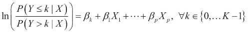

这个假设可能有点难以可视化，也许通过一个例子来理解会更好。假设我们正在尝试根据调查参与者的人口统计数据来预测一项特定政府政策公众舆论调查的结果。

输出变量是一个有序因素，它在五点量表上从 *强烈不同意* 到 *强烈同意* 范围内变化（也称为 **Likert** 量表）。假设 *l[0]* 是强烈不同意与不同意或更好之间的概率的对数几率，*l[1]* 是不同意或强烈不同意与至少中立之间的概率的对数几率，依此类推，直到 *l[3]*。这四个对数几率 *l[0]* 到 *l[3]* 形成一个算术序列，这意味着连续数字之间的距离是一个常数。

### 备注

尽管比例优势模型是处理有序因素的逻辑回归模型中最常引用的模型，但还有其他方法。讨论比例优势模型以及其他相关模型，如相邻类别逻辑模型的好参考是 *《应用逻辑回归第三版》*，由 *Hosmer Jr.*，*Lemeshow* 和 *Sturdivant* 撰写，并由 *Wiley* 出版。

### 预测葡萄酒质量

我们序对数逻辑回归示例的数据集是来自 *UCI 机器学习仓库* 的 *葡萄酒质量数据集*。该数据集中的观测值包括来自葡萄牙绿酒品种的红葡萄酒和白葡萄酒的酒样。这些酒样由多位葡萄酒专家按照 1 到 10 的评分标准进行评分。数据集的目标是使用一系列的物理化学特性，如酸度和酒精成分，来预测专家对酒样的评分。网站是 [`archive.ics.uci.edu/ml/datasets/Wine+Quality`](https://archive.ics.uci.edu/ml/datasets/Wine+Quality)。数据被分为两个文件，一个用于红葡萄酒，一个用于白葡萄酒。我们将使用白葡萄酒数据集，因为它包含更多的样本。此外，为了简化，并且因为按评分分配的酒样分布稀疏，我们将原始输出变量缩减为从 0 到 2 的三点量表。首先，让我们加载数据并处理：

```py
> wine <- read.csv("winequality-white.csv", sep = ";")
> wine$quality <- factor(ifelse(wine$quality < 5, 0,                     
                         ifelse(wine$quality > 6, 2, 1)))
```

下表显示了我们的输入特征和输出变量：

| 列名 | 类型 | 定义 |
| --- | --- | --- |
| `固定酸度` | 数值 | 固定酸度（每立方分米苹果酸克数） |
| `挥发酸度` | 数值 | 挥发酸度（每立方分米乙酸克数） |
| `柠檬酸` | 数值 | 柠檬酸（每立方分米克数） |
| `残糖` | 数值 | 残糖（每立方分米克数） |
| `氯化物` | 数值 | 氯化物（每立方分米钠氯化物的克数） |
| `游离二氧化硫` | 数值 | 游离二氧化硫（每立方分米毫克数） |
| `总二氧化硫` | 数值 | 总二氧化硫（每立方分米毫克数） |
| `密度` | 数值 | 密度（每立方厘米克数） |
| `pH` | 数值 | pH 值 |
| `硫酸盐` | 数值 | 硫酸盐（每立方分米硫酸钾的克数） |
| `酒精` | 数值 | 酒精（体积百分比） |
| `质量` | 分类 | 葡萄酒质量（1 = 差，2 = 一般，3 = 好） |

首先，我们将准备训练集和测试集：

```py
> set.seed(7644)
> wine_sampling_vector <- createDataPartition(wine$quality, p = 
                          0.80, list = FALSE)
> wine_train <- wine[wine_sampling_vector,]
> wine_test <- wine[-wine_sampling_vector,]
```

接下来，我们将使用来自 `MASS` 包的 `polr()` 函数来训练一个比例优势逻辑回归模型。就像我们迄今为止看到的其他模型函数一样，我们首先需要指定一个公式和一个包含我们的训练数据的 data frame。此外，我们必须将 `Hess` 参数指定为 `TRUE` 以获得包含额外信息（如系数的标准误差）的模型：

```py
> library(MASS)
> wine_model <- polr(quality ~ ., data = wine_train, Hess = T)
> summary(wine_model)
Call:
polr(formula = quality ~ ., data = wine_train, Hess = T)

Coefficients:
                          Value Std. Error    t value
fixed.acidity         4.728e-01   0.055641     8.4975
volatile.acidity     -4.211e+00   0.435288    -9.6741
citric.acid           9.896e-02   0.353466     0.2800
residual.sugar        3.386e-01   0.009835    34.4248
chlorides            -2.891e+00   0.116025   -24.9162
free.sulfur.dioxide   1.176e-02   0.003234     3.6374
total.sulfur.dioxide -1.618e-04   0.001384    -0.1169
density              -7.534e+02   0.625157 -1205.1041
pH                    3.107e+00   0.301434    10.3087
sulphates             2.199e+00   0.338923     6.4873
alcohol               2.883e-02   0.041479     0.6951

Intercepts:
    Value      Std. Error t value   
1|2  -736.9784     0.6341 -1162.3302
2|3  -731.4177     0.6599 -1108.4069

Residual Deviance: 4412.75 
AIC: 4438.75 
```

我们的模型摘要显示我们有三个输出类别，并且我们有两个截距。现在，在这个数据集中，我们有许多被评为平均（要么是 5 要么是 6）的葡萄酒，因此这个类别是最频繁的。我们将使用 `table()` 函数按输出分数计算样本数量，然后应用 `prop.table()` 将这些表示为相对频率：

```py
> prop.table(table(wine$quality))

         1          2          3 
0.03736219 0.74622295 0.21641486
```

类别 2，对应于平均葡萄酒，是最频繁的。事实上，一个总是预测这个类别的简单基线模型将有 74.6% 的时间是正确的。让我们看看我们的模型是否比这做得更好。我们将从查看训练数据上的拟合和相应的混淆矩阵开始：

```py
> wine_predictions <- predict(wine_model, wine_train)
> mean(wine_predictions == wine_train$quality)
[1] 0.7647359
> table(predicted = wine_predictions,actual = wine_train$quality)
         actual
predicted    1    2    3
        1    4    1    0
        2  141 2764  619
        3    2  159  229
```

我们在训练数据上的模型表现仅略好于我们的基线模型。我们可以看到这是为什么——它经常预测平均类别（2），几乎从不预测类别 1。在测试集上重复此操作揭示了类似的情况：

```py
> wine_test_predictions <- predict(wine_model, wine_test)
> mean(wine_test_predictions == wine_test$quality)
[1] 0.7681307
> table(predicted = wine_test_predictions, 
           actual = wine_test$quality)
         actual predicted   
         1   2   3
        1   2   2   0
        2  33 693 155
        3   1  36  57
```

看起来我们的模型并不是这个数据集的一个特别好的选择。正如我们所知，有许多可能的原因，从选择了错误的模型类型到特征不足或特征类型不正确。我们应该始终尝试检查有序逻辑回归模型的一个方面，即比例优势假设是否有效。没有普遍接受的方法来做这件事，但文献中已经提出了许多不同的统计测试。不幸的是，在 R 中很难找到这些测试的可靠实现。然而，有一个简单的测试很容易做，那就是使用多项式逻辑回归训练第二个模型。然后，我们可以比较我们两个模型的 AIC 值。让我们这样做：

```py
> wine_model2 <- multinom(quality ~ ., data = wine_train, 
                          maxit = 1000)
> wine_predictions2 <- predict(wine_model2, wine_test)
> mean(wine_predictions2 == wine_test$quality)
[1] 0.7630235
> table(predicted = wine_predictions2, actual = wine_test$quality)
         actual
predicted   1   2   3
        1   2   2   0
        2  32 682 149
        3   2  47  63
```

这两个模型在拟合质量上几乎没有差异。让我们检查它们的 `AIC` 值：

```py
> AIC(wine_model)
[1] 4438.75
> AIC(wine_model2)
[1] 4367.448
```

多项式逻辑回归模型的 AIC 值较低，这表明我们可能更擅长使用该模型。在这个数据集上改进的另一个可能途径是进行特征选择。例如，我们在上一章中看到的 `step()` 函数也可以用于使用 `polr()` 函数训练的模型。我们将把这个作为读者的练习，以验证我们实际上可以通过删除一些特征来获得几乎相同水平的性能。对于这个最新数据集上逻辑回归的结果不满意，我们将在后续章节中重新审视它，以看看更复杂的分类模型是否能做得更好。

# 泊松回归

另一种回归分析形式是泊松回归。这种分析是一种广义线性模型或 GLM，用于建模计数数据。

与前一部分中葡萄酒样品按 1 到 10 的等级评分（或排名）的例子不同，计数数据是一种（统计）数据类型，其中观测值只能取非负整数值 *{0, 1, 2, 3, ...}*，并且这些整数是从计数而不是排名中产生的。

泊松回归假设你的分析结果具有泊松分布——即它表示：如果这些事件以已知的平均速率发生且与自上次事件以来经过的时间无关，则在固定时间间隔内发生一定数量事件的概率。

一个可能的模型可能是每小时软件支持中心接收的电话数量。接收电话数量的预测因素包括新版本（软件）发布后的天数和客户使用软件的年数（按照我们的葡萄酒例子，你可以使用泊松回归来分析一个月内销售的葡萄酒瓶数，可能以“商店位置”和“一年中的月份”作为预测因素）。

数据科学家还可能使用泊松分布来表示其他指定区间内事件的数量，例如距离、面积或体积。

# 负二项式回归

虽然泊松回归假设一个（已知）的平均值，但负二项式回归是通过所谓的最大似然估计来实现的。

记住，尽管泊松分布假设**平均值和方差相同**，但有时数据会显示出更大的变异性或**大于平均值的额外变异**。当这种情况发生时，负二项式回归是一个更好的选择，因为它在这方面具有更大的灵活性。

为了说明，如果我们考虑一个大学想要预测学生运动员每年可能缺席的平均天数。预测因素（缺席天数）包括学生运动员所属的体育类型和他们平均的 GPA 分数。变量**体育**是一个四级名义变量，表示运动员参加的体育项目（在这种情况下，它可以是“足球”、“田径”、“足球”或“排球”）。

如果我们分析我们的数据，假设我们找到以下统计数据：

```py
Football: M (SD) = 10.65 (8.20)
Track: M (SD) = 6.93 (7.45)
Field Hockey: M (SD) = 2.67 (3.73)
Volleyball: M (SD) = 1.67 (1.73)
```

我们可以查看前面的统计数据，并看到体育缺席的平均天数似乎表明变量“体育”是预测缺席天数的好候选，因为结果的平均值似乎会随着所选的运动员体育项目而变化。然而，当我们查看标准差时，我们发现每种体育类型内的方差高于每个级别内的平均值。

这些是条件均值和方差。这些差异表明存在过度分散（更大的变异），并且负二项式模型可能更为合适。你仍然可以使用泊松回归，但标准误差可能会存在偏差。

负二项式回归利用了一个额外的参数（相对于泊松回归）来独立于均值（在此例中是学生运动员的 GPA 分数）调整方差。

# 摘要

逻辑回归是解决分类问题的典型方法，就像线性回归是解决回归问题的典型例子一样。在本章中，我们通过展示最小二乘准则不是在尝试分离两个类别时最合适的准则，证明了逻辑回归与具有阈值的线性回归相比，提供了一种更好的处理分类问题的方法。我们介绍了似然的概念及其最大化作为训练模型的基础。这是一个非常重要的概念，在各种机器学习环境中反复出现。逻辑回归是广义线性模型的一个例子。这是一个通过链接函数将输出变量与输入特征的线性组合相关联的模型，我们在此例中看到了这是 logit 函数。对于二元分类问题，我们使用 R 的`glm()`函数在现实世界数据集上执行逻辑回归，并研究了模型诊断以评估我们的模型性能。我们发现与线性回归有相似之处，即模型产生偏差残差，类似于最小二乘误差残差，并且我们可以计算一个类似于 R2 统计量的伪 R2 统计量，该统计量衡量线性回归中的拟合优度。

我们还看到，我们可以将正则化技术应用于逻辑回归模型。我们通过研究精确率-召回率曲线来选择合适的模型阈值，结束了使用逻辑回归模型进行二元分类的旅行，这是一个在涉及的两个类别中，误分类观察值的成本不对称时非常重要的练习。然后，我们研究了两种可能的二元逻辑回归模型的扩展，以处理具有许多类别标签的输出。这些是多项式逻辑回归模型和有序逻辑回归模型，当输出类别有序时可能很有用。最后，我们简要提到了泊松回归的使用，以及对于具有更大变异性的模型，负二项式回归的使用。

结果表明，逻辑回归在一般情况下并不是解决多类设置的最佳选择。在下一章中，我们将介绍神经网络，这是一种非线性模型，用于解决回归和分类问题。我们还将看到神经网络如何以自然的方式处理多个类别标签。
