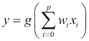
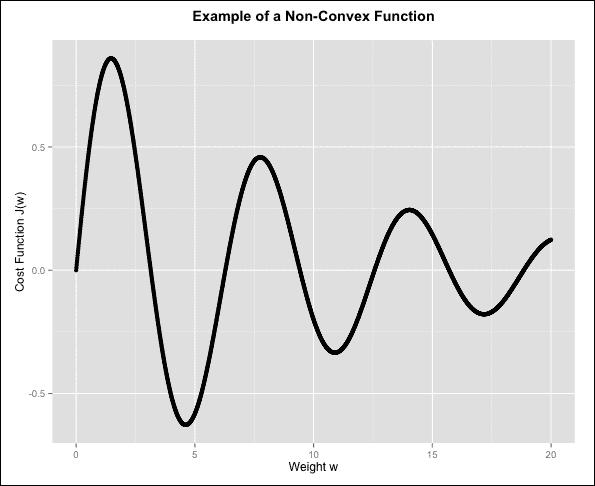

# 第五章。神经网络

到目前为止，我们已经探讨了用于预测建模的两种最知名的方法。线性回归可能是预测数值量的目标问题的最典型起点。该模型基于输入特征的线性组合。逻辑回归使用非线性变换来限制线性特征组合的输出范围在[0,1]区间内。通过这种方式，它预测输出属于两个类别中的一个的概率。因此，它是一种非常著名的分类技术。

这两种方法都存在一个缺点，那就是在处理许多输入特征时不够稳健。此外，逻辑回归通常用于二元分类问题。在本章中，我们将介绍**神经网络**的概念，这是一种解决回归和分类问题的非线性方法。它们在处理高维输入特征空间时显著更加稳健，并且在分类方面，它们拥有一种自然的方式来处理超过两个输出类别。

神经网络是一种生物启发模型，其起源可以追溯到 20 世纪 40 年代。多年来，对神经网络的研究兴趣波动很大，因为最初模型与当时的期望相比相当有限。此外，训练大型神经网络需要大量的计算资源。最近，由于分布式按需计算资源现在广泛存在，以及机器学习的一个重要领域——**深度学习**已经显示出巨大的潜力，因此对神经网络的研究兴趣激增。因此，现在是学习这类模型的好时机。

# 生物神经元

神经网络模型借鉴了人类大脑中神经元的组织结构，因此它们也常被称为**人工神经网络**（**ANNs**）以区别于它们的生物对应物。关键平行之处在于，单个生物神经元作为一个简单的计算单元，但当大量这些单元组合在一起时，结果是一个极其强大且广泛分布的处理机器，能够进行复杂的学习，通常被称为人脑。为了了解大脑中神经元是如何连接的，以下图像展示了一个简化的人神经细胞图：


简而言之，我们可以将人类神经元视为一个计算单元，它接收一系列平行的电信号输入，这些信号被称为**突触神经递质**，它们从**树突**传入。树突在接收到突触神经递质后，将信号化学物质传输到神经元的**胞体**或身体。这种将外部输入信号转换为局部信号的过程可以被视为树突对其输入应用**权重**（根据产生的化学物质是**抑制剂**还是**激活剂**，权重可以是负的或正的）的过程。

神经元的胞体，其中包含**核**或中央处理器，将这些输入信号混合在一起，这个过程可以被视为对所有信号求和。因此，原始的树突输入基本上被转换成一个单一的线性加权总和。这个总和被发送到神经元的**轴突**，它是神经元的传输器。电输入的加权总和在神经元中产生一个电势，这个电势通过轴突中的**激活函数**进行处理，该函数决定了神经元是否会放电。

通常，激活函数被建模为一个开关，它需要达到一个最小电势，称为**偏置**，才能被打开。因此，激活函数本质上决定了神经元是否会输出电信号，如果是的话，信号将通过轴突传输，并通过**轴突末端**传播到其他神经元。这些末端反过来连接到邻近神经元的树突，电信号输出成为后续神经处理的一个输入。

当然，这个描述是对我们神经元中发生的事情的简化，但这里的目的是解释生物过程中哪些方面被用来启发神经网络计算模型。

# 人工神经元

使用我们的生物类比，我们可以构建一个计算神经元的模型，这个模型被称为神经元的**麦库洛奇-皮茨模型**：


### 注意

*沃伦·麦库洛奇*和*沃尔特·皮茨*在 1943 年由《数学生物物理学通报》发表的论文《神经活动中内在思想的逻辑演算》中提出了这个神经网络模型作为计算机器。

这个计算神经元是神经网络最简单的例子。我们可以直接从以下图表中构建我们神经网络的输出函数，*y*：


我们神经网络中的函数`g()`是激活函数。在这里，选择的特定激活函数是**阶跃函数**：


当输入的线性加权总和超过零时，步函数输出 1，当它不等于零时，函数输出-1。通常，我们会创建一个虚拟输入特征*x[0]*，它始终被取为 1，以便将偏差或阈值*w[0]*合并到主要求和中，如下所示：



利用我们对逻辑回归的经验，我们可以很容易地得出结论，我们可以使用这个设置构建一个简单的分类器来解决二元分类问题。唯一的区别在于，在逻辑回归中，我们会选择逻辑函数作为激活函数。事实上，在 1957 年，*弗兰克·罗森布拉特*提出了一种监督学习算法，用于训练神经元的*麦库洛奇-皮茨*模型以执行二元分类，这个算法以及产生的学习模型被称为**罗森布拉特感知器**。

到目前为止，我们已将线性回归和逻辑回归作为可以解决监督学习问题的模型进行介绍，并展示了用于训练它们的准则，而没有深入到涉及训练算法的优化细节。这样做是有意为之，以便我们能够专注于理解模型本身，以及如何在 R 中应用它们。

现在我们已经积累了一些关于分类和回归的经验，这一章将有所不同，我们将探讨预测模型训练的一些细节，因为这也是一个重要的过程，有助于我们全面理解模型。此外，神经网络与之前我们所见的模型有显著不同，训练神经网络通常耗时更长，并涉及调整大量参数，其中许多参数源于优化过程本身。因此，了解这些参数在训练期间的作用以及它们如何影响最终模型是有帮助的。

在我们介绍感知器训练算法之前，我们首先需要学习解决优化问题中最基本的技术之一。

# 随机梯度下降

在我们之前看到的模型中，例如线性回归，我们讨论了模型在训练过程中必须最小化的准则或目标函数。这个准则有时也被称为**损失函数**。例如，模型的平方损失函数可以表示为：


我们在这个公式前添加了一个常数项½，原因将在稍后变得明显。从基本的微分知识我们知道，当我们最小化一个函数时，将函数乘以一个常数因子不会改变函数最小值。在线性回归中，正如我们的感知器模型一样，我们的模型预测仅仅是输入特征的线性加权组合的总和。如果我们假设我们的数据是固定的，而权重是可变的，并且必须选择以最小化我们的标准，那么我们可以将成本函数视为权重的函数：


在这里，我们使用字母*w*来表示模型权重，以表示更一般的情况，尽管在线性回归中，我们通常使用希腊字母*β*。由于我们的模型变量是权重，我们可以认为我们的函数是权重向量的函数。为了找到这个函数的最小值，我们只需要对成本函数关于这个权重向量求偏导。对于特定的权重*w[k]*，这个偏导数由以下给出：


注意，一半的系数已经有效地抵消了导数中的*2*。我们现在有三个不同的下标，所以退一步理解这个方程是个好主意。最内层的求和仍在进行，这是模型的预测输出。让我们将这个替换到方程中以简化事情：


现在我们应该更有能力理解这个方程了。它表明，我们试图最小化的成本函数的偏导数，针对我们模型中的特定权重*w[k]*，仅仅是模型预测输出与实际标记输出的差，乘以*x[ik]*（对于第*i*个观察值，对应于我们的权重*w[k]*的输入特征值），然后对所有数据集中的*n*个观察值进行平均。

### 小贴士

如果你熟悉微分但不熟悉偏微分，你已经知道理解这个方程所需的一切。我们使用偏微分来明确识别我们将相对于一个具有多个变量的方程进行微分变量的变量。当我们这样做时，我们将所有其他变量视为常数，并正常进行微分。

为了找到最优权重，我们需要为权重向量中的每个权重求解此方程。注意，通过预测输出项，模型中的所有权重都出现在每个单个权重的偏导数中。换句话说，这产生了一个完整的线性方程组，通常非常大，因此直接求解通常成本过高，从计算角度来看。 

相反，许多模型实现使用迭代优化过程，这些过程旨在逐步接近正确解。其中一种方法是**梯度下降法**。对于权重向量的特定值，梯度下降法找到成本函数梯度最陡的方向，并通过一个称为**学习率**的参数以小量调整该方向上的权重。因此，更新后的方程是：


在前面的方程中，学习率用希腊字母*η*表示。将学习率设置为一个适当的值是使用梯度下降进行优化的一个非常重要的方面。如果我们选择一个过小的值，算法每次将权重更新一个非常小的量，因此它将花费太长时间来完成。如果我们使用一个过大的值，我们可能会使权重变化过于剧烈，在值之间振荡，因此学习算法要么需要太长时间才能收敛，要么持续振荡。

有各种复杂的方法来估计适当的学习率，其细节我们在此不讨论。相反，我们将尝试通过试错法找到一个适当的学习率，这在实践中通常效果很好。跟踪我们选择的 learning rate 是否合适的一种方法是将我们试图最小化的成本函数与时间（通过通过数据集进行的迭代次数表示）绘制出来。如果我们选择了好的学习率值，我们应该会看到成本函数随时间逐渐减少（或者至少是非增加的）。

梯度下降法的一种变体是**随机梯度下降法**，它执行类似的计算，但一次只处理一个观察值而不是全部一起。关键思想是，平均而言，为特定观察值计算的成本函数的梯度将等于在整个观察值上计算出的梯度的平均值。这当然是一个近似，但它确实意味着我们可以一次处理一个单独的观察值，这在实践中非常有用，特别是如果我们想进行在线学习。

随机梯度下降在处理数据集中的第*i*个观察值时更新特定的权重*w[k]*，根据以下方程：


### 注意

对于在随机梯度下降训练模型时有用的技巧，一个很好的资源是 *Leo Bottou* 的一个章节，标题为 *Stochastic Gradient Descent Tricks*。这本书的版本可以在网上找到，链接为 [`research.microsoft.com/pubs/192769/tricks-2012.pdf`](http://research.microsoft.com/pubs/192769/tricks-2012.pdf)。

## 梯度下降和局部最小值

梯度下降方法依赖于这样一个观点：正在最小化的成本函数是一个**凸函数**。我们将跳过这个数学细节，只说凸函数是一个最多只有一个全局最小值的函数。让我们来看一个关于单个权重 *w* 的非凸成本函数的例子：



这个函数的全局最小值是在 *w* 接近 4.5 的值时左侧的第一个凹槽。如果我们对权重 *w* 的初始猜测是 1，则成本函数的梯度指向全局最小值，我们将逐步接近它，直到达到它。如果我们对权重 *w* 的初始猜测是 12，那么成本函数的梯度将指向接近 10.5 的凹槽下方。一旦我们达到第二个凹槽，成本函数的梯度将为 0，因此，我们将无法向全局最小值前进，因为我们已经陷入局部最小值。

检测和避免局部最小值可能非常棘手，尤其是如果有很多局部最小值。一种方法是使用不同的起始点重复优化，然后选择在优化运行的不同时间产生成本函数最低值的权重。如果局部最小值数量很少且彼此之间不是很接近，这个程序效果很好。幸运的是，我们在上一节中看到的平方误差成本函数是一个凸函数，因此梯度下降方法保证找到全局最小值，但了解我们还将遇到其他非凸成本函数的例子是好的。

## 感知机算法

不再拖延，我们将介绍第一个用于神经网络分类的训练算法。这是感知机学习算法的一种变体，被称为**口袋感知机算法**。

**输入：**

+   `x`：一个二维矩阵，其中行是观测值，列是输入特征。

+   `y`：一个向量，包含 *x* 中所有观测值的类别标签（-1 或 1）。

+   `learning_rate`：一个控制算法学习率的数字。

+   `max_iterations`：算法在学习过程中允许执行的最大数据循环次数。

**输出：**

+   `w`：感知机的学习权重。

+   `converged`：算法是否收敛（真或假）。

+   `iterations`：学习过程中实际执行的数据循环次数。

**方法：**

1.  随机初始化权重 *w*。

1.  在 *x* 中选择一个观测值，并将其称为 *xi*。

1.  使用当前权重 *w* 的值和感知器输出的方程计算预测类别，。

1.  如果预测类别，与实际类别 `yi` 不相同，则使用随机梯度下降更新权重向量。

1.  对数据集中的所有观测值重复步骤 2–4，并计算犯下的错误数量。

1.  如果错误数量为零，则我们已收敛，算法终止。

1.  如果当前迭代中犯下的错误数量少于以前犯下的最低错误数量，则将权重向量存储为迄今为止看到的最佳权重向量。

1.  如果我们达到了最大迭代次数，停止并返回最佳权重向量的值。否则，从步骤 2 开始在数据集上开始新的迭代。

我们将直接展示 R 代码，并详细讨论这些步骤：

```py
step_function <- function(x) {
   if (x < 0) -1 else 1
}

pocket_perceptron <- function(x, y, learning_rate, max_iterations) {
  nObs = nrow(x)
  nFeatures = ncol(x)
  w = rnorm(nFeatures + 1, 0, 2) # Random weight initialization
  current_iteration = 0
  has_converged = F
  best_weights = w
  # Start by assuming you get all the examples wrong
  best_error = nObs 
  while ((has_converged == F) &
         (current_iteration < max_iterations)) {
    # Assume we are done unless we misclassify an observation
    has_converged = T 
    # Keep track of misclassified observations
    current_error = 0
    for (i in 1:nObs) {
      xi = c(1, x[i,]) # Append 1 for the dummy input feature x0
      yi = y[i]
      y_predicted = step_function(sum(w * xi))
      if (yi != y_predicted) {
        current_error = current_error + 1
        # We have at least one misclassified example
        has_converged = F 
        w = w - learning_rate * sign(y_predicted - yi) * xi
      }
    }
    if (current_error < best_error) {
      best_error = current_error
      best_weights = w
    }
    current_iteration = current_iteration+1
  }
  model <- list("weights" = best_weights, 
"converged" = has_converged, 
"iterations" = current_iteration)
  model
}
```

我们定义的第一个函数是步进函数，我们知道它将产生 `-1` 或 `1` 的值，对应于数据集中的两个类别。然后我们定义我们的主要函数，我们称之为 `pocket_perceptron()`。这个函数的目的是学习感知器的权重，以便我们的模型能够正确地分类训练数据。

注意，我们没有在我们的算法中引入任何正则化，以保持简单，因此我们可能会得到一个过度拟合数据的模型，因为我们追求的是 100% 的训练准确率。继续我们的算法描述，我们首先初始化权重向量为小的随机生成的数字。在实践中，确保权重不是设置为 `0` 并且不是对称的，这是一个避免这种情况的好方法。

我们还将起始的最佳权重猜测设置为我们的初始向量，并将起始的最佳错误率设置为观测值的总数，这是数据集上最坏可能的错误率。

函数的主要 `while` 循环控制算法将运行的迭代次数。只有在我们没有收敛且未达到最大迭代次数时，我们才会开始新的迭代。在 `while` 循环内部，我们使用 `for` 循环遍历数据集中的观测值，并使用我们权重向量的当前版本对这些观测值进行分类。

每当我们分类错误时，我们都会更新我们的错误率，注意我们在这个迭代中尚未收敛，并根据我们在上一节中看到的平方最小化随机梯度下降更新规则更新我们的权重向量。尽管由于用于阈值输出的步进函数，感知器的成本函数不可导，但事实证明，我们实际上仍然可以使用相同的权重更新规则。

在完整地遍历我们的数据集之后，也称为一个**时代**，我们检查是否需要更新我们的最佳权重向量并更新迭代次数。只有当当前迭代在训练数据上的性能是我们迄今为止在所有完成的迭代中看到的最佳性能时，我们才更新我们的最佳权重向量。当算法终止时，无论是否收敛，我们都返回找到的最佳权重，以及完成的迭代总数。

### 注意

关于神经网络的决定性教科书，以及一本更详细解释感知机学习的书籍，是《神经网络与学习机器 第 3 版》，作者西蒙·海金，出版社：普伦蒂斯·霍尔。

我们可以通过生成一些人工数据来测试我们的模型。我们将通过从两个均匀分布中采样值来创建两个输入特征：*x[1]* 和 *x[2]*。然后，我们将根据我们随机选择的线性决策边界将这些数据点分为两个不同的类别：


一旦我们有了数据和计算出的类别标签，我们就可以在它们上运行感知机算法。以下代码生成测试数据和构建我们的模型：

```py
> set.seed(4910341)
> x1 <- runif(200, 0, 10)
> set.seed(2125151)
> x2 <- runif(200, 0, 10)
> x <- cbind(x1, x2)
> y <- sign(-0.89 + 2.07 * x[,1] - 3.09 * x[,2])
> pmodel <- pocket_perceptron(x, y, 0.1, 1000)
> pmodel
$weights
                 x1        x2 
-1.738271  4.253327 -6.360326 

$converged
[1] TRUE

$iterations
[1] 32
```

我们可以看到，经过 32 次迭代后，我们的感知机算法已经收敛。如果我们将权重向量除以`2`（这不会改变我们的决策边界），我们可以更清楚地看到我们有一个非常接近用于分类数据的决策边界的决策边界：

```py
> pmodel$weights / 2
                   x1         x2 
-0.8741571  2.1420697 -3.2122627
```

下面的图示显示，该模型的决策边界几乎与种群线无法区分。对于我们的人工生成数据集，这是因为两个类别非常接近。如果类别之间距离更远，我们更有可能看到种群决策边界和模型决策边界之间的明显差异。

这是因为可能分离数据的线条（或当我们处理超过两个特征时的平面）的空间会更大。


## 线性分离

我们生成的数据具有特定的属性，确保感知机算法会收敛——它是**线性可分**的。当两个类别在一系列特征上线性可分时，这意味着可以找到这些特征的线性组合作为决策边界，这将允许我们以 100%的准确率对两个类别进行分类。

如果我们考虑在 *p*-维特征空间中绘制属于两个类别的数据点，那么线性分离意味着可以画出一个平面（或线，如我们在示例中看到的）来分离这两个类别。有一个称为**感知器收敛定理**的定理，它表明对于线性可分类别，如果给定足够的时间，感知器学习算法将始终收敛到一个正确分类所有给定数据的解。

## 逻辑神经元

感知器也被称为**二元阈值神经元**。我们可以通过改变激活函数来创建不同类型的神经元。例如，如果我们完全移除阈值函数，我们最终会得到一个**线性神经元**，它本质上执行与线性回归相同的任务。通过将激活函数更改为逻辑函数，我们可以创建一个**逻辑神经元**。

一个逻辑神经元执行的任务与逻辑回归相同，通过将输入进行线性组合并应用逻辑函数来预测区间 [0,1] 内的值。可以使用随机梯度下降来学习线性神经元以及逻辑神经元的权重。因此，它也可以用于学习逻辑回归和线性回归的权重。随机梯度下降权重更新规则的一般形式是：


在这里，导数是计算成本函数在特定观察点处的梯度。我们在上一节中看到了线性回归和线性神经元的简单形式。如果我们对逻辑回归的成本函数进行微分，我们会发现逻辑神经元的随机梯度下降更新规则似乎与线性神经元完全相同：


这里的微妙区别在于， 的形式完全不同，因为它现在将权重包含在逻辑函数中，而线性回归中并非如此。逻辑神经元非常重要，因为它们是构建由许多相互连接的神经元组成的网络时最常用的神经元类型。正如我们将在下一节中看到的，我们通常按层构建神经网络。产生我们输出的神经元所在的层被称为**输出层**。**输入层**由我们的数据特征组成，这些特征是网络的输入。

输入层和输出层之间的层被称为**隐藏层**。逻辑神经元是最常见的隐藏层神经元。此外，当我们的任务是分类时，我们使用逻辑神经元作为输出层神经元，当我们的任务是回归时，我们使用线性神经元。

# 多层感知器网络

多层神经网络是连接许多神经元以创建神经架构的模型。单个神经元是非常基本的单元，但当我们组织在一起时，我们可以创建一个比单个神经元强大得多的模型。

如前所述，我们按层构建神经网络，我们主要根据这些层之间的连接和使用的神经元类型来区分不同类型的神经网络。以下图显示了**多层感知器**（**MLP**）神经网络的一般结构，这里展示了两个隐藏层：


MLP 网络的第一个特征是信息从输入层流向输出层，方向单一。因此，它被称为**前馈神经网络**。这与其他神经网络类型形成对比，其他神经网络类型中存在循环，允许信息作为反馈信号流回网络中的早期神经元。这些网络被称为**反馈神经网络**或**循环神经网络**。循环神经网络通常很难训练，并且通常不随着输入数量的增加而很好地扩展。尽管如此，它们仍然找到了许多应用，特别是在涉及时间成分的问题中，如预测和信号处理。

回到图中所示的 MLP 架构，我们注意到左侧的第一组神经元被称为输入神经元，形成了输入层。我们总是有与输入特征数量一样多的输入神经元。输入神经元被认为产生我们输入特征的值作为输出。因此，我们通常不称它们为输入神经元，而是称它们为输入源或输入节点。在图的最右侧，我们有输出层和输出神经元。我们通常有与我们要建模的输出数量一样多的输出神经元。因此，我们的神经网络可以自然地学习一次预测多个事物。这个规则的例外之一是当我们建模多类分类问题时，我们通常为每个类别有一个二进制输出神经元。在这种情况下，所有输出神经元都是单个多类因素输出的虚拟编码。

在输入层和输出层之间，我们有隐藏层。神经元根据它们之间以及与输入神经元之间的神经元数量被组织成层。例如，第一隐藏层中的神经元直接连接到输入层中至少一个神经元，而第二隐藏层中的神经元直接连接到第一隐藏层中的一个或多个神经元。我们的图是一个 4-4 架构的例子，这意味着有两个每个有四个神经元的隐藏层。尽管它们本身不是神经元，但该图明确显示了所有神经元的偏差单元。我们在单个神经元输出的方程中看到，我们可以将偏差单元视为具有值为 1 的虚拟输入特征，并且它有一个与之对应的偏差或阈值权重的权重。

并不是架构中的所有神经元都假设具有相同的激活函数。通常，我们为隐藏层中的神经元选择激活函数时，会与输出层的激活函数分开考虑。我们已经看到的输出层激活函数的选择是基于我们希望得到哪种类型的输出，这反过来又取决于我们是进行回归还是分类。

隐藏层神经元的激活函数通常是非线性函数，因为将线性神经元链式连接起来可以从代数上简化为一个具有不同权重的单个线性神经元，因此这并不会给网络增加任何能力。最常用的激活函数是对数逻辑函数，但其他如双曲正切函数也被使用。

神经网络的输出可以通过依次计算每一层神经元的输出来计算。第一隐藏层单元的输出可以使用我们迄今为止看到的神经元输出方程来计算。这些输出成为第二隐藏层神经元的输入，因此，它们实际上是相对于该层的新特征。

神经网络的一个优势是这种通过学习隐藏层中的权重来学习新特征的能力。这个过程在神经网络的每一层重复进行，直到最终层，在那里我们获得整个神经网络的输出。从输入层到输出层的信号传播过程被称为**正向传播**。

## 训练多层感知器网络

多层感知器网络比单个感知器更难训练。用于训练它们的著名算法——自 20 世纪 80 年代以来一直存在——被称为**反向传播算法**。在这里，我们将简要介绍这个算法的工作原理，但强烈建议对神经网络感兴趣的读者深入了解这个算法。

理解这个算法有两个非常重要的洞察。第一个是，对于每一个观察，它分为两个步骤进行。正向传播步骤从输入层开始，到输出层结束，并计算网络对于这个观察的预测输出。这相对简单，可以使用每个神经元的输出方程来完成，这仅仅是将其输入的线性加权和应用其激活函数。

反向传播步骤是为了在预测输出与期望输出不匹配时修改网络的权重。这一步骤从输出层开始，计算输出节点的误差以及输出神经元权重的必要更新。然后，它通过网络反向移动，反向更新每个隐藏层的权重，直到达到最后一个隐藏层，它被最后处理。因此，网络中有一个正向传递，然后是一个反向传递。

第二个重要的洞察是，更新隐藏层中神经元的权重比更新输出层的权重要复杂得多。为了看到这一点，考虑当我们想要更新输出层中神经元的权重时，我们知道对于给定的输入，该神经元应该有什么期望输出。

这是因为输出神经元的期望输出就是网络本身的输出，这些输出在我们的训练数据中都是可用的。相比之下，乍一看，我们实际上并不知道对于一个特定的输入，隐藏层中一个神经元的正确输出应该是什么。此外，这个输出被分布到网络中下一层的所有神经元，因此影响了它们的输出。

这里的关键洞察是，我们将输出神经元中犯的错误传播回隐藏层中的神经元。我们通过找到成本函数的梯度来调整神经元的权重，以减少最大误差的方向，并应用微分链式法则将这个梯度用我们感兴趣的个别神经元的输出来表示。这个过程导致了一个更新网络中任何神经元权重的通用公式，称为**delta 更新规则**：


让我们通过假设我们目前正在处理层 l 中所有神经元的权重来理解这个方程。这个方程告诉我们如何更新层 l 中第*j*个神经元和它之前一层（层 l-1）中第*i*个神经元之间的权重。所有的(*n*)上标都表示我们目前正在更新权重，这是由于处理数据集中第*n*个观察的结果。从现在起，我们将省略这些上标，并假设它们是隐含的。

简而言之，delta 规则告诉我们，为了获得神经元权重的新的值，我们必须将三个项的乘积加到旧值上。这三个项中的第一个是学习率 *η*。第二个被称为局部梯度，*δ[j]*，它是神经元 *j* 的误差，*e[j]*，与其激活函数的梯度，*g()* 的乘积：


这里，我们用 *z[j]* 表示应用其激活函数之前神经元 *j* 的输出，以便以下关系成立：


结果表明，局部梯度也是网络成本函数相对于 *z[j]* 计算的梯度。最后，delta 更新规则中的第三项是来自神经元 *i* 的神经元 *j* 的输入，这仅仅是神经元 *i* 的输出，*y[i]*。输出层神经元和隐藏层神经元之间唯一不同的项是局部梯度项。我们将通过一个示例来说明使用逻辑神经元进行分类的神经网络。当神经元 *j* 是输出神经元时，局部梯度由以下公式给出：


方括号中的第一个项是输出神经元的已知误差，这是目标输出，*t[j]*，与实际输出，*y[j]* 之间的差异。其他两个项来自逻辑激活函数的微分。当神经元 *j* 是隐藏层神经元时，逻辑激活函数的梯度相同，但误差项是下一个层中接收来自神经元 *j* 输入的 *k* 个神经元的局部梯度的加权总和：


# 反向传播算法

错误反向传播，或简称反向传播，是另一种用于训练人工神经网络的常见方法，它通常与一种优化方法（如本章后面将要描述的梯度下降法）结合使用。

反向传播的目标是 *优化权重*，以便神经网络模型能够学习如何正确地将任意输入映射到输出。换句话说，当使用反向传播时，初始系统输出会持续与期望输出进行比较，系统会进行调整，直到两者之间的差异最小化。

# 预测建筑物的能源效率

在本节中，我们将研究如何使用神经网络解决一个实际的回归问题。再次，我们转向 UCI 机器学习仓库以获取我们的数据集。我们选择尝试位于[`archive.ics.uci.edu/ml/datasets/Energy+efficiency`](http://archive.ics.uci.edu/ml/datasets/Energy+efficiency)的*能源效率数据集*。预测任务是使用各种建筑特征，如表面积和屋顶面积，来预测建筑的能源效率，该效率以两种不同的指标形式表达——加热负荷和冷却负荷。

这是一个很好的例子，我们可以用它来展示如何使用单个神经网络预测两个不同的输出。数据集的完整属性描述如下表所示：

| 列名 | 类型 | 定义 |
| --- | --- | --- |
| `relCompactness` | 数值 | 相对紧凑度 |
| `surfArea` | 数值 | 表面积 |
| `wallArea` | 数值 | 墙面积 |
| `roofArea` | 数值 | 屋顶面积 |
| `height` | 数值 | 总高度 |
| `orientation` | 数值 | 建筑朝向（因子） |
| `glazArea` | 数值 | 玻璃面积 |
| `glazAreaDist` | 数值 | 玻璃面积分布（因子） |
| `heatLoad` | 数值 | 加热负荷（第一个输出） |
| `coolLoad` | 数值 | 冷却负荷（第二个输出） |

数据是使用名为*Ecotect*的模拟器生成的。数据集中的每个观测值对应一个模拟建筑。所有建筑具有相同的体积，但影响其能效的其他属性，如玻璃面积，则进行了修改。

### 备注

该数据集在 2012 年发表的论文《使用统计机器学习工具准确估计住宅建筑能效》中进行了描述，该论文由*Athanasios Tsanas*和*Angeliki Xifara*撰写，发表于*Energy and Buildings*，第 49 卷。

网站上的数据以 Microsoft Excel 格式提供。要将这些数据加载到 R 中，我们可以使用 R 包`xlsx`，它可以读取和理解 Microsoft Excel 文件：

```py
> library(xlsx)
> eneff <- read.xlsx2("ENB2012_data.xlsx", sheetIndex = 1, 
                      colClasses = rep("numeric", 10))
> names(eneff) <- c("relCompactness", "surfArea", "wallArea", "roofArea", "height", "orientation", "glazArea", "glazAreaDist", "heatLoad", "coolLoad")
> eneff <- eneff[complete.cases(eneff),]
```

导入操作在数据框的末尾添加了一些空观测值，因此最后一行删除了这些值。现在，通过参考介绍数据集的论文，我们发现我们的两个属性实际上是因子。为了让我们的神经网络能够使用这些属性，我们需要将它们转换为虚拟变量。为此，我们将使用`caret`包中的`dummyVars()`函数：

```py
> library(caret)
> eneff$orientation <- factor(eneff$orientation)
> eneff$glazAreaDist <- factor(eneff$glazAreaDist)
> dummies <- dummyVars(heatLoad + coolLoad ~ ., data = eneff)
> eneff_data <- cbind(as.data.frame(predict(dummies, newdata =  
                                            eneff)), eneff[,9:10])
> dim(eneff_data)
[1] 768  18
```

`dummyVars()`函数接受一个公式和一个数据框。从这些中，它识别输入特征并对那些是因子的特征进行虚拟编码，以产生新的二进制列。为因子创建的列数与该因子的级别数相同。就像我们之前使用的`preProcess()`函数一样，我们实际上是在使用`predict()`函数后获得这些列。接下来，我们将在训练数据和测试数据之间进行 80-20 的分割：

```py
> set.seed(474576)
> eneff_sampling_vector <- createDataPartition(eneff_data$heatLoad, p 
  = 0.80, list = FALSE)
> eneff_train <- eneff_data[eneff_sampling_vector, 1:16]
> eneff_train_outputs <- eneff_data[eneff_sampling_vector, 17:18]
> eneff_test <- eneff_data[-eneff_sampling_vector, 1:16]
> eneff_test_outputs <- eneff_data[-eneff_sampling_vector, 17:18]
```

在训练神经网络时，执行最重要的预处理步骤之一是缩放输入特征和输出。执行输入缩放的一个好理由是为了避免**饱和**，这发生在优化过程达到一个点，其中误差函数的梯度绝对值非常小。这通常是由于非线性神经元激活函数的输入非常大或非常小。饱和会导致优化过程终止，认为我们已经收敛。

根据特定的神经网络实现，对于回归任务，也可能有理由对输出进行缩放，因为一些线性神经元的实现被设计为在区间[-1,1]内产生输出。缩放也有助于收敛。因此，我们将使用`caret`将所有数据维度缩放到单位区间，注意这不会影响之前产生的二进制列：

```py
> eneff_pp <- preProcess(eneff_train, method = c("range"))
> eneff_train_pp <- predict(eneff_pp, eneff_train)
> eneff_test_pp <- predict(eneff_pp, eneff_test)

> eneff_train_out_pp <- preProcess(eneff_train_outputs, method = 
                        c("range"))
> eneff_train_outputs_pp <- 
  predict(eneff_train_out_pp, eneff_train_outputs)
> eneff_test_outputs_pp <- 
  predict(eneff_train_out_pp, eneff_test_outputs)
```

几个不同的包在 R 中实现了神经网络，每个包都有其各自的优点和优势。因此，熟悉多个包是有帮助的，在本章中，我们将研究这三个包，首先是`neuralnet`：

```py
> library("neuralnet")
> n <- names(eneff_data)
> f <- as.formula(paste("heatLoad + coolLoad ~", paste(n[!n %in% 
                  c("heatLoad", "coolLoad")], collapse = " + ")))
> eneff_model <- neuralnet(f, 
  data = cbind(eneff_train_pp, eneff_train_outputs_pp), hidden = 10)
> eneff_model
Call: neuralnet(formula = f, data = cbind(eneff_train_pp, eneff_train_outputs_pp),     hidden = 10)

1 repetition was calculated.

         Error Reached Threshold Steps
1 0.3339635783    0.009307995429  9998
```

`neuralnet()`函数根据其参数中提供的信息训练一个神经网络。我们提供的第一个参数是一个公式，其格式与我们在前几章中看到的`lm()`和`glm()`函数中的公式类似。这里的一个有趣差异是我们指定了两个输出，`heatLoad`和`coolLoad`。另一个差异是，目前我们无法使用点(`.`)表示法来暗示我们数据框中剩余的所有列都可以用作特征，因此我们需要明确指定它们。

注意，使用公式后，我们已经有效地定义了神经网络的输入层和输出层，因此需要指定的是隐藏层的结构。这通过`hidden`参数来指定，它可以是单个标量表示单层，或者是一个标量向量，指定了从输入层之后的每一层到输出层之前的每一层的隐藏单元数量。

在我们之前看到的例子中，我们使用了一个包含 10 个节点的单层。实际上，我们可以将我们的神经网络可视化，因为该包提供了直接绘制模型的能力（编号的圆圈是虚拟偏置神经元）：


对`neuralnet()`的调用还允许我们通过参数字符串`act.fct`指定我们希望为神经元使用的激活函数类型。默认情况下，这被设置为逻辑激活函数，所以我们没有更改它。另一个非常重要的参数是`linear.output`，它可以设置为`TRUE`或`FALSE`。这指定了我们应该是否将激活函数应用于输出层的神经元。我们使用的默认值`TRUE`意味着我们不应用激活函数，因此我们可以观察到线性输出。对于回归类型问题，这是合适的。这是因为；如果我们应用逻辑激活函数，我们的输出将限制在区间[0,1]内。最后，我们可以通过`err.fct`参数指定一个可微分的误差函数，作为我们优化策略的一部分。由于我们正在进行回归，我们使用默认值`sse`，它对应于平方误差之和。

由于神经网络训练中存在随机成分，即权重的初始化，我们可能希望指定我们应该多次重新训练同一个模型，以便我们能够选择最佳可能的模型（使用 SSE 等标准对这些进行排名）。这可以通过指定`rep`参数的整数值来完成。让我们重写我们原始的调用，以明确显示我们正在使用的默认值：

```py
> eneff_model <- neuralnet(f, 
  data = cbind(eneff_train_pp, eneff_train_outputs_pp), hidden = 10, act.fct = "logistic", linear.output = TRUE, err.fct = "sse", rep = 1)
```

模型的输出为我们提供了关于神经网络性能的一些信息，显示的内容取决于其配置。由于我们已指定 SSE 作为我们的误差度量，显示的误差就是所获得的 SSE。阈值数字仅仅是当模型停止训练时误差函数偏导数的值。本质上，我们不是在梯度精确为 0 时终止，而是指定一个非常小的值，误差梯度需要下降到这个值以下算法才会终止。这个值的默认值是 0.01，可以通过在`neuralnet()`函数中提供一个数字来改变阈值参数。降低这个值通常会导致更长的训练时间。模型输出还显示了执行的训练步骤数量。最后，如果我们使用了`rep`参数重复这个过程多次，我们会看到每个训练的模型都有一行。我们的输出显示我们只训练了一个模型。

### 小贴士

由于神经网络包含一个以权重向量初始化形式存在的随机成分，重新运行我们的代码可能不会给出完全相同的结果。如果在运行示例时，R 输出一个消息表示模型没有收敛，请尝试再次运行代码。

## 评估用于回归的多层感知器

`neuralnet`包为我们提供了一个方便的方法，通过`compute()`函数使用我们的模型进行预测。本质上，它不仅为我们提供了观察数据框的预测输出，还显示了模型架构中所有神经元的输出值。为了评估模型的性能，我们对神经网络在测试集上的输出感兴趣：

```py
> test_predictions <- compute(eneff_model, eneff_test_pp)
```

我们可以通过`test_predictions`对象的`net.result`属性访问神经网络的预测输出，如下所示：

```py
> head(test_predictions$net.result)
            [,1]          [,2]
7  0.38996108769 0.39770348145
8  0.38508402576 0.46726904682
14 0.29555228848 0.24157156896
21 0.49912349400 0.51244876337
23 0.50036257800 0.47436990729
29 0.01133684342 0.01815294595
```

由于这是一个回归问题，我们希望能够使用均方误差（MSE）来评估我们的模型在目标输出上的性能。为了做到这一点，我们需要将我们的预测输出转换回原始尺度，以便进行公平的评估。我们用于数据缩放的常数存储在`eneff_train_out_pp`对象的`ranges`属性中：

```py
> eneff_train_out_pp$ranges
     heatLoad coolLoad
[1,]     6.01    10.90
[2,]    42.96    48.03
```

第一行包含原始数据的最小值，第二行包含最大值。现在我们将编写一个函数，该函数将接受一个缩放向量以及包含原始最小值和最大值的另一个向量，并返回原始未缩放向量：

```py
reverse_range_scale <- function(v, ranges) {
     return( (ranges[2] - ranges[1]) * v + ranges[1] )
 }
```

接下来，我们将使用这个方法来获取测试集的未缩放预测输出：

```py
> output_ranges <- eneff_train_out_pp$ranges
> test_predictions_unscaled <- sapply(1:2, function(x) 
  reverse_range_scale(test_predictions[,x], output_ranges[,x]))
```

我们还可以定义一个简单的函数来计算 MSE，并使用它来检查我们在两个任务上的性能：

```py
mse <- function(y_p, y) {
  return(mean((y - y_p) ^ 2))
}

> mse(test_predictions_unscaled[,1], eneff_test_outputs[,1])
[1] 0.2940468477
> mse(test_predictions_unscaled[,2], eneff_test_outputs[,2])
[1] 1.440127075
```

这些值非常低，表明我们的预测准确度非常高。我们还可以研究相关性，它是尺度无关的，我们也可以在未缩放输出上使用它：

```py
> cor(test_predictions_unscaled[,1], eneff_test_outputs[,1])
[1] 0.9986655316
> cor(test_predictions_unscaled[,2], eneff_test_outputs[,2])
[1] 0.9926735348
```

这些值非常高，表明我们几乎达到了完美的性能，这在现实世界的数据中是非常罕见的。如果准确率不是这么高，我们可能会通过使架构更复杂来进行实验。例如，我们可以通过设置`hidden=c(10,5)`来构建一个具有额外层的模型，这样我们就在输出层之前有一个额外的五神经元层。

# 重新审视预测玻璃类型

在第三章中，我们分析了玻璃识别数据集，其任务是识别在犯罪现场发现的玻璃碎片所属的玻璃类型。该数据集的输出是一个具有多个类别级别的因子，对应不同的玻璃类型。我们之前的方法是使用多项逻辑回归构建一个一对一模型。结果并不十分令人鼓舞，主要问题之一是训练数据上的模型拟合度较差。

在本节中，我们将重新审视这个数据集，看看神经网络模型是否能做得更好。同时，我们将展示神经网络如何处理分类问题：

```py
> glass <- read.csv("glass.data", header = FALSE)
> names(glass) <- c("id", "RI", "Na", "Mg", "Al", "Si", "K", "Ca", 
"Ba", "Fe", "Type")
> glass$id <- NULL
```

我们的输出是一个多类因素，因此我们希望将其虚拟编码为二进制列。在`neuralnet`包中，我们通常需要作为预处理步骤手动执行此操作，然后才能构建我们的模型。

在本节中，我们将探讨一个包含构建神经网络函数的第二个包，即`nnet`。实际上，这正是我们用于多项式逻辑回归的同一个包。这个包的一个好处是，对于多类分类，训练神经网络的`nnet()`函数将自动检测输出因素并为我们执行虚拟编码。考虑到这一点，我们将准备一个训练集和测试集：

```py
> glass$Type <- factor(glass$Type)
> set.seed(4365677)
> glass_sampling_vector <- createDataPartition(glass$Type, p = 
                           0.80, list = FALSE)
> glass_train <- glass[glass_sampling_vector,]
> glass_test <- glass[-glass_sampling_vector,]
```

接下来，就像我们之前的数据集一样，我们将对输入数据进行归一化处理：

```py
> glass_pp <- preProcess(glass_train[1:9], method = c("range"))
> glass_train <- cbind(predict(glass_pp, glass_train[1:9]), Type = glass_train$Type)
> glass_test  <- cbind(predict(glass_pp, glass_test[1:9]), Type = glass_test$Type)
```

现在，我们已经准备好训练我们的模型。虽然`neuralnet`包能够模拟多个隐藏层，但`nnet`包旨在模拟具有单个隐藏层的神经网络。因此，我们仍然像以前一样指定一个公式，但这次，我们不是指定一个可以是标量或整数向量的`hidden`参数，而是指定一个`size`参数，它是一个整数，表示模型单个隐藏层中的节点数。

此外，`nnet`包中的默认神经网络模型用于分类，因为输出层使用逻辑激活函数。当使用不同包训练相同类型的模型时，例如多层感知器，检查各种模型参数的默认值非常重要，因为这些值会因包而异。我们在这里要提到的两个包之间的另一个区别是，`nnet`目前不提供任何绘图功能。无需进一步说明，我们现在将训练我们的模型：

```py
> glass_model <- nnet(Type ~ ., data = glass_train, size = 10)
# weights:  166
initial  value 343.685179 
iter  10 value 265.604188
iter  20 value 220.518320
iter  30 value 194.637078
iter  40 value 192.980203
iter  50 value 192.569751
iter  60 value 192.445198
iter  70 value 192.421655
iter  80 value 192.415382
iter  90 value 192.415166
iter 100 value 192.414794
final  value 192.414794 
stopped after 100 iterations
```

从输出中我们可以看到，模型没有收敛，在默认的 100 次迭代后停止。为了收敛，我们可以多次重新运行此代码，或者我们可以使用`maxit`参数将允许的迭代次数增加到 1,000：

```py
> glass_model <- nnet(Type ~ ., data = glass_train, size = 10, maxit = 
                      1000)
```

让我们先调查我们的模型在训练数据上的准确性，以评估拟合质量。为了计算预测值，我们使用`predict()`函数并指定类型参数为`class`。这会让`predict()`函数知道我们想要选择概率最高的类别。如果我们想看到每个类别的概率，我们可以为`type`参数指定值`response`。最后，请记住，我们必须将不带输出的数据框传递给`predict()`函数，因此需要对训练数据框进行子集化：

```py
> train_predictions <- predict(glass_model, glass_train[,1:9], 
                               type = "class")
> mean(train_predictions == glass_train$Type)
[1] 0.7183908046
```

我们第一次尝试表明，我们得到的拟合质量与我们的多项式逻辑回归模型相同。为了改进这一点，我们将通过在隐藏层中添加更多神经元来增加模型的复杂性。我们还将把`maxit`参数增加到`10,000`，因为模型更复杂，可能需要更多的迭代才能收敛：

```py
> glass_model2 <- nnet(Type ~ ., data = glass_train, size = 50, maxit = 
                       10000)
> train_predictions2 <- predict(glass_model2, glass_train[,1:9], 
                                type = "class")
> mean(train_predictions2 == glass_train$Type)
[1] 1
```

如我们所见，我们现在已经达到了 100%的训练准确率。现在我们有一个相当好的模型拟合，我们可以调查我们在测试集上的性能：

```py
> test_predictions2 <- predict(glass_model2, glass_test[,1:9], 
                               type = "class")
> mean(test_predictions2 == glass_test$Type)
[1] 0.6
```

尽管我们的模型完美地拟合了训练数据，但我们看到测试集上的准确率仅为 60%。即使考虑到数据集非常小，这种差异也是一个经典的信号，表明我们的模型在训练数据上过度拟合。当我们查看线性回归和逻辑回归时，我们看到了如 lasso 这样的收缩方法，这些方法旨在通过限制模型中系数的大小来对抗过度拟合。

对于神经网络，存在一个称为**权重衰减**的类似技术。使用这种方法，将衰减常数与所有网络权重平方和的乘积添加到成本函数中。这限制了任何权重取过大的值，从而对网络进行正则化。尽管目前`neuralnet()`没有正则化选项，但`nnet()`使用`decay`参数：

```py
> glass_model3 <- nnet(Type~., data = glass_train, size = 10, maxit = 
                       10000, decay = 0.01)
> train_predictions3 <- predict(glass_model3, glass_train[,1:9], 
                                type = "class")
> mean(train_predictions3 == glass_train$Type)
[1] 0.9367816092
> test_predictions3 <- predict(glass_model3, glass_test[,1:9],  
                               type = "class")
> mean(test_predictions3 == glass_test$Type)
[1] 0.775
```

使用这个模型，我们的训练数据拟合仍然非常高，并且比我们使用多项式逻辑回归所达到的要高得多。在测试集上，性能仍然比训练集差，但比我们之前的好得多。

我们不会在玻璃识别数据上花费更多时间。相反，我们将在继续之前反思一些学到的经验教训。其中之一是，使用神经网络获得良好的性能，有时甚至只是达到收敛，可能很棘手。训练模型涉及网络权重的随机初始化，最终结果往往对这些初始条件非常敏感。我们可以通过多次训练我们迄今为止看到的不同模型配置，并注意到某些运行中的某些配置可能无法收敛，以及我们的训练集和测试集的性能确实会随每次运行而有所不同，来证实这一事实。

另一个洞见是训练神经网络涉及调整各种参数，从隐藏神经元的数量和排列到`衰减`参数的值。我们没有实验过的其他参数包括用于隐藏层神经元的非线性激活函数的选择、收敛的准则以及我们用来拟合模型的特定成本函数。例如，我们不是使用最小二乘法，而可以使用一个称为**熵**的准则。

因此，在确定最终模型选择之前，尝试尽可能多的不同组合是值得的。在`caret`包的`train()`函数中实验不同的参数组合是一个好地方。它为我们所看到的神经网络包提供了一个统一的接口，并且与`expand.grid()`结合使用，允许同时训练和评估几个不同的神经网络配置。我们在这里只提供一个示例，感兴趣的读者可以使用这个示例继续他们的研究：

```py
> library(caret)
> nnet_grid <- expand.grid(.decay = c(0.1, 0.01, 0.001, 0.0001), 
                           .size = c(50, 100, 150, 200, 250))
> nnetfit <- train(Type ~ ., data = glass_train, method = "nnet", 
  maxit = 10000, tuneGrid = nnet_grid, trace = F, MaxNWts = 10000)
```

# 预测手写数字

我们神经网络应用的最终任务是手写数字预测。在这个任务中，目标是构建一个模型，该模型将展示一个数字（0-9）的图像，并且模型必须预测显示的是哪个数字。我们将使用来自[`yann.lecun.com/exdb/mnist/`](http://yann.lecun.com/exdb/mnist/)的*MNIST*手写数字数据库。

从这个页面，我们已经下载并解压了两个训练文件，`train-images-idx3-ubyte.gz`和`train-images-idx3-ubyte.gz`。前者包含图像数据，后者包含相应的数字标签。使用这个网站的优势在于数据已经被预处理，每个数字都在图像中居中，并且将数字缩放到统一的大小。为了加载数据，我们使用了网站关于 IDX 格式的信息来编写两个函数：

```py
read_idx_image_data <- function(image_file_path) {
  con <- file(image_file_path, "rb")
  magic_number <- readBin(con, what = "integer", n = 1, size = 4, 
                          endian = "big")
  n_images <- readBin(con, what = "integer", n = 1, size = 4, 
                      endian="big")
  n_rows <- readBin(con, what = "integer", n = 1, size = 4, 
                    endian = "big")
  n_cols <- readBin(con, what = "integer", n = 1, size = 4, 
                    endian = "big")
  n_pixels <- n_images * n_rows * n_cols
  pixels <- readBin(con, what = "integer", n = n_pixels, size = 1, 
                    signed = F)
  image_data <- matrix(pixels, nrow = n_images, ncol = n_rows * 
                       n_cols, byrow = T)
  close(con)
  return(image_data)
}

read_idx_label_data <- function(label_file_path) {
  con <- file(label_file_path, "rb")
  magic_number <- readBin(con, what = "integer", n = 1, size = 4, 
                          endian = "big")
  n_labels <- readBin(con, what = "integer", n = 1, size = 4, 
                      endian = "big")
  label_data <- readBin(con, what = "integer", n = n_labels, size = 1, 
                        signed = F)
  close(con)
  return(label_data)
}
```

然后，我们可以通过以下两个命令加载我们的两个数据文件：

```py
> mnist_train <- read_idx_image_data("train-images-idx3-ubyte")
> mnist_train_labels <- read_idx_label_data("train-labels-idx1-
                                            ubyte")
> str(mnist_train)
 int [1:60000, 1:784] 0 0 0 0 0 0 0 0 0 0 ...
> str(mnist_train_labels)
 int [1:60000] 5 0 4 1 9 2 1 3 1 4 ...
```

每个图像由一个 28 像素乘以 28 像素的灰度值矩阵表示，灰度值范围在 0 到 255 之间，其中 0 是白色，255 是黑色。因此，我们的每个观测值都有 28²=784 个特征值。每个图像通过从右到左和从上到下光栅化矩阵存储为一个向量。训练数据中有 60,000 个图像，我们的`mnist_train`对象将这些存储为一个 60,000 行乘以 78 列的矩阵，这样每一行对应一个单独的图像。为了了解我们的数据看起来像什么，我们可以可视化前七个图像：


为了分析这个数据集，我们将介绍我们的第三个也是最后一个用于训练神经网络模型的 R 包，`RSNNS`。实际上，这个包是围绕**斯图加特神经网络模拟器**（**SNNS**）的 R 包装器，这是一个在斯图加特大学创建的包含标准神经网络 C 实现的流行软件包。

包的作者为原始软件中的许多函数添加了一个便捷的接口。使用此包的好处之一是它提供了自己的几个数据处理函数，例如将数据分割成训练集和测试集。另一个好处是它实现了许多不同类型的神经网络，而不仅仅是 MLP。我们将首先通过除以`255`将数据规范化到单位区间，然后指出我们的输出是一个因子，每个级别对应一个数字：

```py
> mnist_input <- mnist_train / 255
> mnist_output <- as.factor(mnist_train_labels)
```

虽然 MNIST 网站已经包含了包含测试数据的单独文件，但我们选择将训练数据文件分割，因为模型已经运行了相当长的时间。鼓励读者使用提供的测试文件重复以下分析。为了准备分割数据，我们将随机打乱训练数据中的图像：

```py
> set.seed(252)
> mnist_index <- sample(1:nrow(mnist_input), nrow(mnist_input))
> mnist_data <- mnist_input[mnist_index, 1:ncol(mnist_input)]
> mnist_out_shuffled <- mnist_output[mnist_index]
```

接下来，我们必须对输出因子进行虚拟编码，因为这并不是自动为我们完成的。`RSNNS`包中的`decodeClassLabels()`函数是完成这一任务的便捷方式。此外，我们将使用`splitForTrainingAndTest()`函数将我们的打乱数据分成 80-20 的训练和测试集分割。这将分别存储训练集和测试集的特征和标签，这将在不久的将来对我们很有用。

最后，我们还可以使用`normTrainingAndTestSet()`函数来规范化我们的数据。为了指定单位区间规范化，我们必须将`type`参数设置为`0_1`：

```py
> library("RSNNS")
> mnist_out <- decodeClassLabels(mnist_out_shuffled)
> mnist_split <- splitForTrainingAndTest(mnist_data, mnist_out, 
                                         ratio = 0.2)
> mnist_norm <- normTrainingAndTestSet(mnist_split, type = "0_1")
```

为了比较，我们将使用`mlp()`函数训练两个 MLP 网络。默认情况下，这是配置为分类，并使用逻辑函数作为隐藏层神经元的激活函数。第一个模型将有一个包含 100 个神经元的单个隐藏层；第二个模型将使用 300 个。

`mlp()`函数的第一个参数是输入特征矩阵，第二个参数是标签向量。`size`参数在`neuralnet`包中与`hidden`参数扮演相同的角色。也就是说，当我们想要一个以上的隐藏层时，我们可以指定一个整数来表示单个隐藏层，或者指定一个整数向量来表示每层的隐藏神经元数量。

接下来，我们可以使用`inputsTest`和`targetsTest`参数事先指定测试集的特征和标签，这样我们就可以在一次调用中准备好观察测试集的性能。我们将训练的模型将需要数小时才能运行。如果我们想知道每个模型运行了多长时间，我们可以在训练模型之前使用`proc.time()`保存当前时间，并与模型完成时的时间进行比较。将所有这些放在一起，以下是我们的两个 MLP 模型是如何训练的：

```py
> start_time <- proc.time()
> mnist_mlp <- mlp(mnist_norm$inputsTrain, mnist_norm$targetsTrain, size = 100, inputsTest = mnist_norm$inputsTest, targetsTest = mnist_norm$targetsTest)
> proc.time() - start_time
    user   system  elapsed 
 2923.936    5.470 2927.415

> start_time <- proc.time()
> mnist_mlp2 <- mlp(mnist_norm$inputsTrain, mnist_norm$targetsTrain, size = 300, inputsTest = mnist_norm$inputsTest, targetsTest = mnist_norm$targetsTest)
> proc.time() - start_time
     user   system  elapsed 
 7141.687    7.488 7144.433
```

如我们所见，模型运行时间相当长（数值以秒为单位）。为了参考，这些模型是在 2.5 GHz 英特尔酷睿 i7 苹果 MacBook Pro 上，16 GB 内存上训练的。我们的测试集上的模型预测被保存在`fittedTestValues`属性中（而对于我们的训练集，它们存储在`fitted.values`属性中）。我们将关注测试集的准确率。首先，我们必须通过选择具有最大值的二进制列来解码虚拟编码的网络输出。我们也必须对目标输出执行此操作。请注意，第一列对应数字`0`：

```py
> mnist_class_test <- (0:9)[apply(mnist_norm$targetsTest, 1, which.max)]
> mlp_class_test <- (0:9)[apply(mnist_mlp$fittedTestValues, 1, which.max)]
> mlp2_class_test <- (0:9)[apply(mnist_mlp2$fittedTestValues, 1, which.max)]
```

现在，我们可以检查我们两个模型的准确率，如下所示：

```py
> mean(mnist_class_test == mlp_class_test)
[1] 0.974
> mean(mnist_class_test == mlp2_class_test)
[1] 0.981
```

两个模型的准确率都非常高，第二个模型略优于第一个。我们可以使用`confusionMatrix()`函数来详细查看所犯的错误：

```py
> confusionMatrix(mnist_class_test, mlp2_class_test)
       predictions
targets    0    1    2    3    4    5    6    7    8    9
      0 1226    0    0    1    1    0    1    1    3    1
      1    0 1330    5    3    0    0    0    3    0    1
      2    3    0 1135    3    2    1    1    5    3    0
      3    0    0    6 1173    0   11    1    5    6    1
      4    0    5    0    0 1143    1    5    5    0   10
      5    2    2    1   12    2 1077    7    3    5    4
      6    3    0    2    1    1    3 1187    0    1    0
      7    0    0    7    1    3    1    0 1227    1    4
      8    5    4    3    5    1    4    4    0 1110    5
      9    1    0    0    6    8    5    0   11    6 1164
```

如预期，我们在这个矩阵中看到了相当多的对称性，因为某些数字对通常比其他数字对更难区分。例如，模型最常混淆的数字对是(3,5)。网站上可用的测试数据包含一些难以与其他数字区分的数字示例。

默认情况下，`mlp()`函数通过其`maxint`参数允许最大 100 次迭代。通常，我们不知道应该为特定模型运行多少次迭代；确定这一点的一个好方法是绘制训练和测试错误率与迭代次数的关系图。使用 RSNNS 包，我们可以使用`plotIterativeError()`函数来完成这项工作。

以下图表显示，对于我们的两个模型，两个错误在 30 次迭代后都达到了平台期：


## 受试者工作特征曲线

在第三章中，我们研究了逻辑回归作为展示二元分类器两个重要性能指标（精确率和召回率）之间权衡的重要图表的例子。在本章中，我们将介绍另一个相关且常用的图表来展示二元分类性能，即**受试者工作特征**（**ROC**）曲线。

此曲线是在 y 轴上的真正例率和 x 轴上的假正例率之间的一个图。正如我们所知，真正例率只是召回率，或者说是一个二元分类器的灵敏度。假正例率是 1 减去特异性。一个随机的二元分类器将具有与假正例率相同的真正例率，因此，在 ROC 曲线上，*y = x*线表示随机分类器的性能。任何位于此线之上的曲线都将比随机分类器表现更好。

一个完美的分类器将显示出从原点到点（0,1）的曲线，这对应于 100%的真正率和 0%的假正率。我们经常将**ROC 曲线下的面积**（**ROC AUC**）作为一个性能指标。随机分类器下的面积仅为 0.5，因为我们正在计算单位正方形上直线*y = x*下的面积。按照惯例，完美分类器下的面积为 1，因为曲线通过点（0,1）。在实践中，我们获得介于这两个值之间的值。对于我们的 MNIST 数字分类器，我们有一个多类问题，但我们可以使用 RSNNS 包的`plotROC()`函数来研究我们的分类器在单个数字上的性能。

以下图表显示了数字 1 的 ROC 曲线，几乎完美：


# 径向基函数网络

基于函数逼近概念的径向基函数网络是一种使用*径向基函数*来定义节点输出（给定一组输入）的人工神经网络。网络的输出由输入和神经元参数的径向基函数的线性组合组成。

**径向基函数**（**RBF**）网络（也称为 RBFNN，即径向基函数神经网络）将具有三个独立的层：一个**输入**层、一个**隐藏**层和一个线性**输出**层。输入层将是一组节点，它们将输入值传递到第二层（或隐藏层），在那里应用激活模式。这些模式将是最佳拟合应用或目标的径向基函数。这种转换以非线性方式进行。第三层（或输出层）提供网络对输入激活或 RFB 函数的响应。在 RFB 网络中，从隐藏层到输出层的转换是非线性的。

径向基函数网络是一种神经网络，通常将其设计视为高维空间中的曲线拟合（猜测）问题。学习等同于找到一个多维度函数，该函数为训练数据提供最佳拟合，最佳拟合的准则以某种统计意义来衡量。

通常，RBF 网络似乎具有易于理解的设计、泛化能力和良好的对数据“噪声”容忍度的记录。

RBF 网络（径向基函数网络）的特性使其成为设计需要非常灵活的控制系统的理想选择，因为这些系统必须不断评估各种*完成路径*并确定最有效的路径。在 RBF 网络应用中最著名的研究是解决旅行商问题（在一系列城市之间找到最短闭合路径）。

# 摘要

在本章中，我们将神经网络视为一种非线性方法，能够解决回归和分类问题。受人类神经元生物类比启发，我们首先介绍了最简单的神经网络——感知器。只有当两个类别线性可分时，感知器才能解决二元分类问题，这在实际应用中是非常少见的。

通过改变转换输入线性加权组合的函数，即激活函数，我们发现如何创建不同类型的单个神经元。线性激活函数创建一个执行线性回归的神经元，而逻辑激活函数创建一个执行逻辑回归的神经元。通过组织和连接神经元到层中，我们可以创建多层神经网络，这些网络是解决非线性问题的强大模型。

隐藏层神经元背后的思想是，每个隐藏层都会从其输入中学习一组新的特征。作为最常见类型的多层神经网络，我们介绍了多层感知器，并看到它可以自然地使用相同的网络学习多个输出。此外，我们还对回归和分类任务的真实世界数据集进行了实验，包括一个多类分类问题，我们看到了它也是自然处理的。R 语言有多个用于实现神经网络的包，包括`neuralnet`、`nnet`和`RSNNS`，我们逐一尝试了这些包。每个包都有其各自的优缺点，并没有一个在所有情况下都是明确的赢家。

与神经网络一起工作的一个重要好处是，它们在解决回归和分类的复杂非线性问题时非常强大，而不需要对输入特征之间的关系做出任何重大假设。另一方面，神经网络通常很难训练。缩放输入特征很重要。同时，了解影响模型收敛的各种参数也很重要，例如学习率和误差梯度容差。另一个需要做出的关键决定是隐藏层神经元的数量和分布。随着网络复杂度、输入特征数量或训练数据大小的增加，与其它监督学习方法相比，训练时间通常会变得相当长。

在我们的回归示例中，我们也看到，由于神经网络的灵活性和强大功能，它们可能会过度拟合数据，从而高估模型的准确性。为了在一定程度上缓解这个问题，存在正则化方法，例如权重衰减。最后，一个值得注意的明显缺点是，神经权重没有直接的解释，与回归系数不同。即使神经网络拓扑可能学习到特征，这些特征也难以解释或理解。

我们下一章将继续探索监督学习的世界，并介绍支持向量机，这是我们第三个非线性建模工具，主要用于处理分类问题。
