# 第六章 支持向量机

在本章中，我们将通过介绍支持向量机来重新审视非线性预测模型。支持向量机，通常缩写为 SVMs，在分类问题中非常常用，尽管当然有方法使用它们进行函数逼近和回归任务。在本章中，我们将重点关注它们在分类中更典型的角色。为此，我们首先将介绍最大间隔分类的概念，它提出了如何在许多可能的分类边界之间进行选择的另一种公式化方法，并且与迄今为止我们所看到的方法不同，例如最大似然。我们将介绍相关的支持向量概念以及如何，与最大间隔分类一起，我们可以获得一个以支持向量分类器形式存在的线性模型。最后，我们将展示如何通过使用某些称为核的函数来引入非线性，最终达到我们的目的地，即支持向量机。

# 最大间隔分类

我们将从这个章节开始，回到现在应该非常熟悉的情况：二元分类任务。再一次，我们将思考如何设计一个模型来正确预测一个观察值属于两个可能类别之一的问题。我们已经看到，当两个类别是线性可分的时候，这个任务是最简单的；也就是说，当我们可以在我们的特征空间中找到一个*分离超平面*（一个多维空间中的平面）时，超平面一侧的所有观察值属于一个类别，而位于另一侧的所有观察值属于第二个类别。根据我们特定模型使用的结构、假设和优化标准，我们可能会得到无限多个这样的超平面。

让我们使用二维特征空间中的某些数据来可视化这个场景，其中分离超平面仅仅是一条分离线：

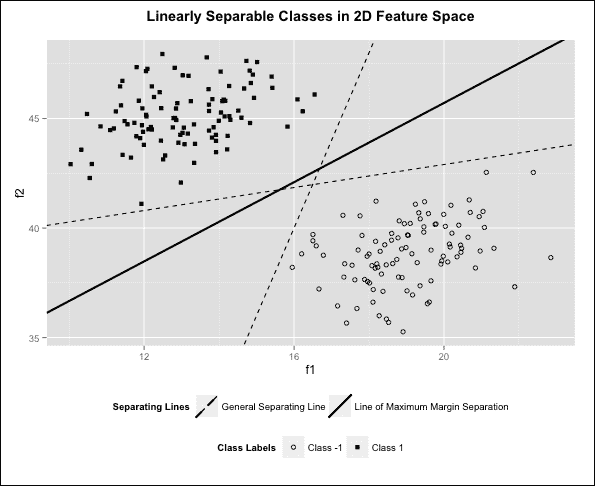

在前面的图中，我们可以看到两个属于不同类别的观察值簇。我们使用了不同的符号来明确表示这一点。接下来，我们展示了三条可以作为分类器决策边界的不同线，所有这些线在整个数据集上都会产生 100%的分类准确率。我们将提醒自己，超平面的方程可以表示为输入特征的线性组合，这些特征是超平面所在空间中的维度：

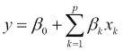

分离超平面具有以下属性：

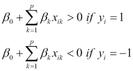

第一个方程简单地说明属于类别 1 的数据点都位于超平面之上，第二个方程说明属于类别 -1 的数据点都位于超平面之下。下标 *i* 用于索引观察，下标 *k* 用于索引特征，因此 *x[ik]* 表示第 *i* 个观察的第 *k* 个特征的值。为了简化，我们可以将这两个方程合并为一个方程，如下所示：

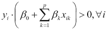

为了理解这种简化的原因，考虑对类别 -1 的观察（*y[i]* = -1*）。这个观察将位于分离超平面下方，因此括号中的线性组合将产生一个负值。将其与其 *y[i]* 的 -1 值相乘，结果为正值。对于类别 1 的观察，有类似的论点。

回顾我们的图，注意两条虚线与某些观察相当接近。直观上，实线作为决策边界比其他两条线更好，因为它在它们之间的空间中心穿越，将两个类别分开，而不靠近任何一个类别。这样，它在两个类别之间平均分配空间。我们可以定义一个称为 **间隔** 的量，它是一个特定分离超平面产生的，即从数据集中任何点到超平面的最小垂直距离。在二维和两个类别的情况下，我们总是至少有两个点，它们与分离线的垂直距离等于间隔，一个在线的每一侧。有时，正如我们的数据那样，我们可能有超过两个点，它们与分离线的垂直距离等于间隔。

下一个图显示了前一个图中实线的间隔，表明我们有三个点与这个分离线的间隔相等：

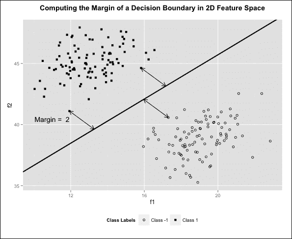

现在我们已经掌握了间隔的定义，我们就有了一种方法来编码我们选择实线作为三个线中较好决策边界的直觉。我们可以更进一步，定义 **最大间隔超平面** 为所有可能的分离超平面中间隔最大的超平面。在我们的二维例子中，我们实际上是在寻找一条线，它将两个类别分开，同时尽可能远离观察点。结果证明，我们例子中的实线实际上是最大间隔线，因此没有其他线可以画出比两个单位更高的间隔。这解释了为什么我们在第一个图中将其标记为最大间隔分离线。

为了理解我们如何在简单示例中找到最大间隔超平面，我们需要使用以下方程将问题形式化为一个具有*p*个特征的优化问题：

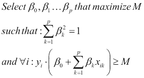

这两个约束条件共同表达了我们的优化问题中的想法，即我们的数据中的观察点不仅需要被正确分类，而且至少需要位于分离超平面至少*M*个单位之外。目标是通过对系数*β[i]*进行适当的选取来最大化这个距离*M*。因此，我们需要一个处理这类问题的优化过程。优化实际上如何在实践中实现的具体细节超出了本书的范围，但当我们用 R 进行编程时，我们将在后面看到它们是如何发挥作用的。

我们现在有一个自然的前进方式，那就是开始研究当我们的数据不是线性可分时，情况会如何变化，我们知道这是现实世界数据集的典型场景。在这样做之前，让我们退一步。我们已经研究了两种估计模型参数的方法：即最大似然估计和线性回归的最小二乘误差标准。例如，当我们研究逻辑回归的分类时，我们考虑了最大化我们数据似然的想法。这考虑了所有可用的数据点。在用多层感知器进行分类时也是如此。然而，对于最大间隔分类器，我们的决策边界的构建只由位于边缘的点支持。换句话说，在我们的二维示例中，我们可以自由调整除边缘上的三个点外的任何观察点的位置，只要调整不会导致观察点落在边缘内，我们的分离线将保持在完全相同的位置。因此，我们将从位于边缘的点到分离超平面的垂直向量定义为**支持向量**。因此，我们已经看到我们的二维示例有三个支持向量。只有数据集中所有点的子集实际上决定了分离超平面的位置这一事实意味着我们有过度拟合训练数据的潜力。

另一方面，这种方法确实产生了一些很好的性质。我们在两个类别之间平等地分割空间，而不对任何一个类别施加任何偏差。显然位于特定类别占据的空间内的点的点在模型中的作用不如边缘上的点大，这是我们放置决策边界的区域。

# 支持向量分类

我们需要我们的数据是线性可分的，以便使用最大边界分类器对其进行分类。当我们的数据不是线性可分时，我们仍然可以使用定义边界的支持向量的概念，但这次，我们将允许一些示例被误分类。因此，我们本质上定义了一个**软边界**，即我们数据集中的某些观测可能违反了它们需要至少与分离超平面保持一定距离的约束。同样重要的是要注意，有时我们可能即使在数据是线性可分的情况下也想使用软边界。这样做的原因是为了限制数据过度拟合的程度。请注意，边界越大，我们对正确分类新观测的信心就越大，因为在我们训练数据中，类别彼此之间的距离越远。如果我们使用非常小的边界实现分离，我们对正确分类数据的信心就会降低，我们可能更愿意允许一些错误，并提出一个更大的、更稳健的边界。研究以下图表：

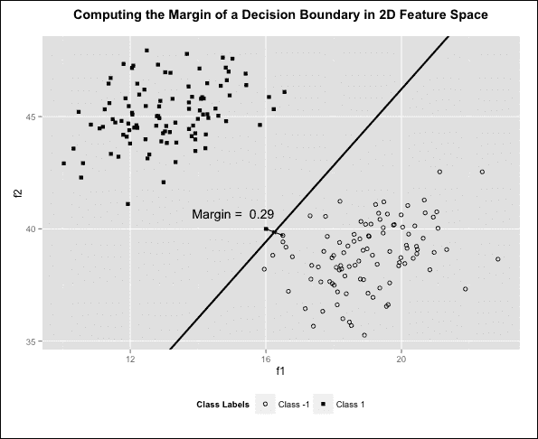

为了更牢固地掌握为什么即使是对于线性可分的数据，软边界可能比硬边界更可取的原因，我们稍微改变了我们的数据。我们使用了之前相同的数据，但我们在类别 1 中添加了一个额外的观测点，并将其放置在类别-1 的边界附近。请注意，随着这个单一新数据点的添加，特征值 f1=16 和 f2=40，我们的最大边界线发生了巨大变化！边界从两个单位减少到 0.29 单位。看着这张图，我们可能会觉得这个新点可能是我们的数据集中的异常值或误标记。如果我们允许我们的模型使用软边界进行一次误分类，我们会回到我们之前的线，这条线以更宽的边界分隔两个类别，并且不太可能对数据进行过度拟合。我们通过修改我们的优化问题设置来形式化我们的软分类器的概念：

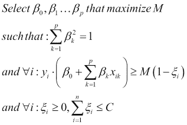

在这个新的设置下，我们引入了一组新的变量 *ξ*i，被称为**松弛变量**。对于我们的数据集中的每一个观测值，都有一个松弛变量，而 *ξ*i 松弛变量的值取决于第 *i* 个观测值相对于边界的位置。当一个观测值位于分离超平面的正确一侧且在边界之外时，该观测值的松弛变量取值为 0。这是我们对于所有观测值在硬边界下看到的最理想的情况。当一个观测值被正确分类但落在边界内的一定距离处时，相应的松弛变量取一个小于 1 的小正数。当一个观测值实际上被错误分类，因此完全落在超平面的错误一侧时，其关联的松弛变量取值大于 1。总的来说，看看以下内容：

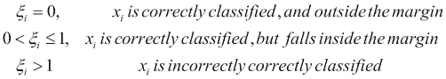

当一个观测值被错误分类时，松弛变量的幅度与该观测值与分离超平面边界的距离成正比。由于松弛变量的总和必须小于一个常数 *C*，我们可以将这个常数视为我们准备容忍的错误预算。由于单个特定观测值的错误分类会导致松弛变量至少取值为 1，而我们的常数 *C* 是所有松弛变量的总和，将 *C* 的值设为小于 1 意味着我们的模型将容忍一些观测值落在边界内，但不会出现错误分类。*C* 的值较高通常会导致许多观测值要么落在边界内，要么被错误分类，而这些都是支持向量，我们最终会有更多的支持向量。这导致了一个具有较低方差但因为我们已经通过增加对边界违规和错误的容忍度而改变了边界，我们可能会有更高的偏差。相比之下，由于模型（因此 *C* 的值较低）非常严格而导致的支持向量数量减少，可能会在我们的模型中产生较低的偏差。然而，这些支持向量将分别以更高的程度影响我们边界的位置。因此，我们将在不同的训练集上经历模型性能的更高方差。再次强调，模型偏差和方差之间的相互作用再次出现在我们作为预测模型制定者必须做出的设计决策中。

## 内积

支持向量机模型参数计算的详细过程超出了本书的范围。然而，结果表明，该模型本身可以被简化为一个更方便的形式，该形式使用观测值的**内积**。两个长度相同的向量 *v1* 和 *v2* 的内积是通过首先计算两个向量的逐元素乘积，然后取这些结果的和来计算的。在 R 中，我们只需使用乘号即可获得两个向量的逐元素乘积。因此，我们可以按以下方式计算两个向量的内积：

```py
> v1 <- c(1.2, 3.3, -5.6, 4.5, 0, 9.0)
> v2 <- c(-3.5, 0.1, -0.2, 1.0, -8.7, 0)
> v1 * v2
[1] -4.20  0.33  1.12  4.50  0.00  0.00
>inner_product<- sum(v1 * v2)
>inner_product
[1] 1.75
```

从数学的角度来看，我们使用三角括号来表示内积运算，并按以下方式表示这个过程：

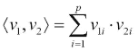

在前面的方程中，对于两个向量 *v[1]* 和 *v[2]*，索引 *i* 正在遍历 *p* 个特征或维度。现在，这是我们的支持向量机分类器的原始形式：

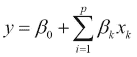

这只是输入特征线性组合的标准方程。结果表明，对于支持向量机，模型解可以用我们试图分类的 *x* 观测值与其他所有训练数据集中的 *x*i 观测值之间的内积来表示。更具体地说，我们的支持向量机的形式也可以写成：

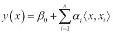

对于这个方程，我们明确指出，我们的模型将 *y* 预测为输入观测值 *x* 的函数。求和函数现在计算当前观测值与数据集中每个其他观测值的内积的加权和，这就是为什么我们现在要对 *n* 个观测值进行求和。我们想非常清楚地说明，我们没有改变原始模型本身；我们只是写了同一模型的两种不同表示。请注意，我们不能假设线性模型在一般情况下都采取这种形式；这仅适用于支持向量机。现在，在现实世界的场景中，我们数据集中观测值的数量 *n* 通常远大于参数的数量 *p*，因此 *α* 系数的数量似乎比 *β* 系数的数量大。

此外，虽然在第一个方程中我们是独立考虑每个观测值，但第二个方程的形式表明，为了分类所有观测值，我们需要考虑所有可能的成对组合并计算它们的内积。这样的成对组合有 *n*2 个，这似乎是在引入复杂性而不是产生一个更简单的表示。然而，实际上，在我们的数据集中，除了支持向量之外，所有 *α* 系数都是零。

在我们的数据集中，支持向量的数量通常远小于总观察数量。因此，我们可以通过明确显示我们在数据集中的支持向量集合 *S* 上求和来简化我们的新表示：

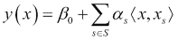

# 核和支持向量机

到目前为止，我们介绍了在线性可分条件下最大间隔分类的概念及其扩展到支持向量分类器，它仍然使用超平面作为分离边界，但通过指定容错预算来处理非线性可分的数据集。位于或位于间隔内，或被支持向量分类器错误分类的观察值是支持向量。这些在决策边界定位中发挥的关键作用也在使用内积的替代模型表示支持向量分类器中得到了体现。

在本章中我们迄今为止看到的情况中，共同点是我们的模型在输入特征方面总是线性的。我们已经看到，创建实现非线性边界的模型的能力，在处理不同类型的潜在目标函数方面要灵活得多。在我们的模型中引入非线性的一种方法是对这个结果应用非线性变换。我们可以定义一个通用函数 *K*，我们将它称为**核函数**，它作用于两个向量并产生一个标量结果。这允许我们如下泛化我们的模型：

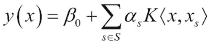

我们现在的模型具有与支持向量一样多的特征，每个特征都被定义为核函数作用于当前观察结果和其中一个支持向量的结果。对于支持向量机分类器，我们应用的核函数被称为**线性核**，因为这仅仅使用内积本身，产生一个线性模型。

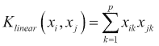

核函数也被称为相似度函数，因为我们可以将它们产生的输出视为两个输入向量之间相似度的度量。我们使用非线性核在我们的模型中引入非线性，当我们这样做时，我们的模型被称为**支持向量机**。有几种不同类型的非线性核。最常见的是**多项式核**和**径向基函数核**。多项式核使用两个向量之间内积的幂展开。对于度数为 *d* 的多项式，多项式核的形式如下：

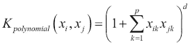

使用这个核函数，我们实际上是将我们的特征空间转换到了一个更高维的空间。计算应用于内积的核函数比首先将所有特征转换到高维空间，然后尝试在那个空间中拟合线性模型要高效得多。这在我们使用**径向基函数核**时尤其正确，通常简称为**径向核**，因为由于展开中的项数无限，转换后的特征空间的维度实际上是无限的。径向核的形式是：

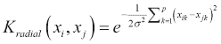

仔细观察后，我们应该能够发现径向核不使用两个向量之间的内积。相反，指数中的求和只是这两个向量之间欧几里得距离的平方。径向核通常被称为**局部核**，因为当两个输入向量之间的欧几里得距离很大时，由于指数中的负号，核计算出的结果非常小。因此，当我们使用径向核时，只有接近当前观察值的向量在计算中起重要作用。我们现在已经准备好使用一些真实世界的数据集来实践所有这些内容。

# 预测化学物质生物降解

在本节中，我们将使用 R 语言的`e1071`包，在一个真实世界的数据集上尝试我们讨论过的模型。作为第一个例子，我们选择了*QSARbiodegration 数据集*，可以在[`archive.ics.uci.edu/ml/datasets/QSAR+biodegradation`](https://archive.ics.uci.edu/ml/datasets/QSAR+biodegradation)找到。这是一个包含 41 个数值变量，描述了 1,055 种化学物质的分子组成和性质的数据集。建模任务是预测特定化学物质是否可生物降解，基于这些性质。示例性质包括碳、氮、氧原子的百分比，以及分子中的重原子数量。这些特征非常专业且数量充足，因此这里不会给出完整的列表。涉及到的完整列表和更多细节可以在网站上找到。目前，我们已经将数据下载到了一个`bdf`数据框中：

```py
>bdf<- read.table("biodeg.csv", sep = ";", quote = "\"")
> head(bdf, n = 3)
     V1     V2 V3 V4 V5 V6 V7   V8 V9 V10 V11 V12   V13
1 3.919 2.6909  0  0  0  0  0 31.4  2   0   0   0 3.106
2 4.170 2.1144  0  0  0  0  0 30.8  1   1   0   0 2.461
3 3.932 3.2512  0  0  0  0  0 26.7  2   4   0   0 3.279
    V14   V15 V16   V17   V18 V19 V20 V21   V22 V23 V24
1 2.550 9.002   0 0.960 1.142   0   0   0 1.201   0   0
2 1.393 8.723   1 0.989 1.144   0   0   0 1.104   1   0
3 2.585 9.110   0 1.009 1.152   0   0   0 1.092   0   0
  V25 V26   V27    V28 V29 V30   V31 V32 V33 V34 V35
1   0   0 1.932  0.011   0   0 4.489   0   0   0   0
2   0   0 2.214 -0.204   0   0 1.542   0   0   0   0
3   0   0 1.942 -0.008   0   0 4.891   0   0   0   1
    V36   V37 V38   V39 V40 V41 V42
1 2.949 1.591   0 7.253   0   0  RB
2 3.315 1.967   0 7.257   0   0  RB
3 3.076 2.417   0 7.601   0   0  RB
```

最后一个列，`V42`，包含输出变量，对于不可生物降解的化学物质取值为`NRB`，对于可生物降解的化学物质取值为`RB`。我们将将其重新编码为熟悉的标签`0`和`1`：

```py
> levels(bdf$V42) <- c(0, 1)
```

现在我们已经准备好了数据，我们将像往常一样，将它们分为训练集和测试集，比例为 80-20：

```py
> library(caret)
>set.seed(23419002)
>bdf_sampling_vector<- createDataPartition(bdf$V42, p = 0.80, 
                                             list = FALSE)
>bdf_train<- bdf[bdf_sampling_vector,]
>bdf_test<- bdf[-bdf_sampling_vector,] 
```

在 R 中，有多个包实现了支持向量机。在本章中，我们将探讨使用`e1071`包，它为我们提供了`svm()`函数。如果我们检查我们的训练数据，我们会很快注意到一方面，各种特征的比例相差很大，另一方面，许多特征是稀疏特征，这意味着对于许多条目，它们取零值。在神经网络中我们这样做，将特征进行缩放是一个好主意，尤其是如果我们想使用径向核。幸运的是，`svm()`函数有一个`scale`参数，默认设置为`TRUE`。在模型训练之前，这个参数将标准化输入特征，使它们具有零均值和单位方差。这避免了我们需要手动执行此预处理步骤的需要。我们将要研究的第一个模型将使用线性核：

```py
> library(e1071)
>model_lin<- svm(V42 ~ ., data = bdf_train, kernel = "linear", cost = 10)
```

调用`svm()`函数遵循熟悉的范式，首先提供一个公式，然后提供数据框的名称，最后提供与模型相关的其他参数。在我们的情况下，我们想要训练一个模型，其中最终的`V42`列是预测列，所有其他列都用作特征。因此，我们可以只使用简单的公式`V42 ~`，而不是必须完全列出所有其他列。指定我们的数据框后，我们再指定我们将使用的核的类型，在这种情况下，我们选择了线性核。我们还将指定`cost`参数的值，这与我们的模型中的错误预算 C 相关：

```py
>model_lin

Call:
svm(formula = V42 ~ ., data = biodeg_training2, kernel = "linear", cost = 10)
Parameters:
   SVM-Type:  C-classification 
 SVM-Kernel:  linear 
       cost:  10 
      gamma:  0.02439024 

Number of Support Vectors:  272
```

我们的模型没有提供太多关于其性能的信息，除了我们指定的参数细节。一个有趣的信息是，在我们的模型中作为支持向量的数据点的数量；在这种情况下，`272`。然而，如果我们使用`str()`函数来检查拟合模型的架构，我们会发现它包含许多有用的属性。例如，拟合属性包含模型对训练数据的预测。我们将使用这些预测来评估模型拟合的质量，通过计算训练数据的准确率和混淆矩阵：

```py
> mean(bdf_train[,42] == model_lin$fitted)
[1] 0.8887574
> table(actual = bdf_train[,42], predictions = model_lin$fitted)
      predictions
actual   0   1
     0 519  41
     1  53 232
```

我们的训练准确率略低于 89%，这是一个不错的开始。接下来，我们将使用`predict()`函数检查测试数据的性能，看看我们是否能得到接近这个准确率的测试准确率，或者我们是否最终过度拟合了数据：

```py
>test_predictions<- predict(model_lin, bdf_test[,1:41])
> mean(bdf_test[,42] == test_predictions)
[1] 0.8619048
```

我们确实比预期的测试准确率略低，但与我们在之前训练中获得的准确率足够接近，因此我们可以相对有信心地认为我们并没有过度拟合训练数据。现在，我们已经看到`cost`参数在我们的模型中起着重要作用，选择这个参数涉及到模型偏差和方差的权衡。因此，在确定最终模型之前，我们想要尝试`cost`参数的不同值。在手动重复前述代码的几个参数值之后，我们得到了以下结果集：

```py
>linearPerformances
         0.01  0.1   1     10    100   1000 
training 0.858 0.888 0.883 0.889 0.886 0.886
test     0.886 0.876 0.876 0.862 0.862 0.862
```

### 小贴士

有时候，在构建模型时，我们可能会看到一个警告，告知我们已达到最大迭代次数。如果发生这种情况，我们应该对我们的模型持怀疑态度，因为这可能是没有找到解决方案并且优化过程没有收敛的迹象。在这种情况下，最好是尝试不同的`cost`值和/或核类型。

这些结果表明，对于`cost`参数的大多数值，我们在训练数据上看到的是非常相似的质量拟合水平，大约 88%。具有讽刺意味的是，在测试数据上获得最佳性能的是在训练数据拟合最差的模型，使用了 0.01 的成本。简而言之，尽管我们在训练和测试数据集上都有合理的性能，但表格中显示的结果的低方差实际上告诉我们，通过调整这个特定数据集上的`cost`参数，我们不太可能显著提高拟合质量。

现在，让我们尝试使用径向核来查看是否引入一些非线性可以让我们提高性能。当我们指定径向核时，我们还必须指定一个正的`gamma`参数。这对应于径向核方程中的*1/2σ2*参数。这个参数所起的作用是控制其两个向量输入之间的相似度计算的局部性。大的`gamma`值意味着核将产生接近零的值，除非两个向量非常接近。较小的`gamma`值会导致核更加平滑，并考虑距离较远的向量对。同样，这个选择归结为偏差和方差的权衡，所以就像`cost`参数一样，我们不得不尝试`gamma`的不同值。现在，让我们看看如何使用特定配置的径向核创建支持向量机模型：

```py
>model_radial<- svm(V42 ~ ., data = bdf_train, kernel = "radial", 
                      cost = 10, gamma = 0.5)
> mean(bdf_train[,42] == model_radial$fitted)
[1] 0.9964497 
>test_predictions<- predict(model_radial, bdf_test[,1:41])
> mean(bdf_test[,42] == test_predictions)
[1] 0.8047619
```

注意，在这些设置下，径向核能够更紧密地拟合训练数据，这从几乎 100%的训练准确率中可以看出；但是当我们看到测试数据集上的性能时，结果实际上比我们在训练数据上获得的结果要低得多。因此，我们有一个非常明确的迹象表明，这个模型正在过度拟合数据。为了解决这个问题，我们将手动尝试调整`gamma`和`cost`参数的几个不同设置，看看我们是否可以提高拟合度：

```py
>radialPerformances
         [,1]  [,2]  [,3] [,4]  [,5]  [,6]  [,7]  [,8]  [,9] 
cost     0.01  0.1   1    10    100   0.01  0.1   1     10   
gamma    0.01  0.01  0.01 0.01  0.01  0.05  0.05  0.05  0.05 
training 0.663 0.824 0.88 0.916 0.951 0.663 0.841 0.918 0.964
test     0.662 0.871 0.89 0.89  0.886 0.662 0.848 0.89  0.89 
         [,10] [,11] [,12] [,13] [,14] [,15] [,16] [,17]
cost     100   0.01  0.1   1     10    100   0.01  0.1  
gamma    0.05  0.1   0.1   0.1   0.1   0.1   0.5   0.5  
training 0.989 0.663 0.815 0.937 0.985 0.995 0.663 0.663
test     0.838 0.662 0.795 0.886 0.867 0.824 0.662 0.662
         [,18] [,19] [,20] [,21] [,22] [,23] [,24] [,25]
cost     1     10    100   0.01  0.1   1     10    100  
gamma    0.5   0.5   0.5   1     1     1     1     1    
training 0.98  0.996 0.998 0.663 0.663 0.991 0.996 0.999
test     0.79  0.805 0.805 0.662 0.662 0.748 0.757 0.757
```

如我们所见，这两个参数`cost`和`gamma`的组合，使用径向核可以产生更广泛的结果。从我们之前构建的数据框中，我们可以看到一些组合，例如`cost = 1`和`gamma = 0.05`，将我们的测试数据准确率提高到 89%，同时仍然在训练数据上保持类似的表现。此外，在数据框中，我们看到许多设置，其中训练准确率几乎达到 100%，但测试准确率却远低于这个水平。

因此，我们得出结论，在使用非线性核，如径向核时，需要谨慎，以避免过度拟合。尽管如此，径向核非常强大，在建模高度非线性决策边界时可以非常有效，通常允许我们比线性核实现更高的分类准确率。在我们分析的这个阶段，我们通常会希望确定`cost`和`gamma`参数的特定值，然后使用可用的全部数据重新训练我们的模型，在现实世界中部署之前。

不幸的是，在用测试集指导我们决定使用哪些参数之后，它就不再代表一个未知的测试数据集，这将使我们能够预测模型在现实世界中的准确率。解决这个问题的可能方法之一是使用验证集，但这将需要我们留出一部分数据，从而导致训练集和测试集的大小减小。

*交叉验证*，我们在第二章、*整理数据和衡量性能*中讨论过，应被视为解决这一困境的实用方法。

### 注意

一本关于支持向量机的非常易读的书籍是 Nello Christiani 和 John Shawe-Taylor 合著的《支持向量机及其核学习方法导论》。另一个很好的参考资料是 Simon Haykin 的《神经网络与学习机器》，它展示了 SVMs 与一种称为**径向基函数网络**的相关神经网络之间的洞察力链接，我们也在第五章、*神经网络*中引用了它。

# 预测信用评分

在本节中，我们将探讨另一个数据集，这次是在银行和金融领域。具体的数据集被称为*德国信用数据集*，并由 UCI 机器学习存储库托管。数据的链接是[`archive.ics.uci.edu/ml/datasets/Statlog+%28German+Credit+Data%29`](https://archive.ics.uci.edu/ml/datasets/Statlog+%28German+Credit+Data%29)。

数据集中的观测值是银行个人提交的贷款申请。数据的目标是确定一个申请是否构成高信用风险。

| 列名 | 类型 | 定义 |
| --- | --- | --- |
| `checking` | 分类 | 现有支票账户的状态 |
| `duration` | 数值 | 持续时间（以月为单位） |
| `creditHistory` | 分类 | 申请人的信用历史 |
| `purpose` | 分类 | 贷款目的 |
| `credit` | 数值 | 信用额度 |
| `savings` | 分类 | 储蓄账户/债券 |
| `employment` | 分类 | 自从现在起有现职 |
| `installmentRate` | 数值 | 分期付款率（作为可支配收入的百分比） |
| `personal` | 分类 | 个人状况和性别 |
| `debtors` | 分类 | 其他债务人/担保人 |
| `presentResidence` | 数值 | 现居住地时间 |
| `property` | 分类 | 财产类型 |
| `age` | 数值 | 申请人的年龄（以年为单位） |
| `otherPlans` | 分类 | 其他分期付款计划 |
| `housing` | 分类 | 申请人的住房状况 |
| `existingBankCredits` | 数值 | 在这家银行现有的信用数量 |
| `job` | 分类 | 申请人的工作状况 |
| `dependents` | 数值 | 受抚养人数 |
| `telephone` | 分类 | 申请人的电话状态 |
| `foreign` | 分类 | 外籍工人 |
| `risk` | 二进制 | 信用风险（1 = 好，2 = 差） |

首先，我们将数据加载到名为`german_raw`的数据框中，并为其提供与上一表格匹配的列名：

```py
>german_raw<- read.table("german.data", quote = "\"")
> names(german_raw) <- c("checking", "duration", "creditHistory", "purpose", "credit", "savings", "employment", "installmentRate", "personal", "debtors", "presentResidence", "property", "age", "otherPlans", "housing", "existingBankCredits", "job", "dependents", "telephone", "foreign", "risk")
```

表格中的注释说明了我们有很多分类特征需要处理。因此，我们将再次使用`dummyVars()`来为这些特征创建虚拟的二进制变量。此外，我们将`risk`变量，我们的输出，记录为一个因子，其中 0 级表示良好的信用，1 级表示不良的信用：

```py
> library(caret)
> dummies <- dummyVars(risk ~ ., data = german_raw)
>german<- data.frame(predict(dummies, newdata = german_raw), 
                       risk = factor((german_raw$risk - 1)))
> dim(german)
[1] 1000   62
```

经过此处理，我们现在有一个包含 61 个特征的数据框，因为几个分类输入特征有很多级别。接下来，我们将数据分为训练集和测试集：

```py
>set.seed(977)
>german_sampling_vector<- createDataPartition(german$risk, 
                                      p = 0.80, list = FALSE)
>german_train<- german[german_sampling_vector,]
>german_test<- german[-german_sampling_vector,]
```

该数据集的一个特定之处，在网站上提到的是，数据来自一个两种不同类型的错误具有不同成本的场景。具体来说，将高风险客户错误分类为低风险客户的成本，对于银行来说比将低风险客户错误分类为高风险客户的成本高出五倍。这是可以理解的，因为在第一种情况下，银行可能会从无法偿还的贷款中损失大量资金，而在第二种情况下，银行会错过发放能够为银行带来利息的贷款的机会。

`svm()` 函数有一个 `class.weights` 参数，我们用它来指定将观察值错误分类到每个类的成本。这就是我们将非对称错误成本信息纳入模型的方式。首先，我们将创建一个类权重向量，注意我们需要指定与输出因子水平相对应的名称。然后，我们将使用 `tune()` 函数训练具有径向核的各种 SVM 模型：

```py
>class_weights<- c(1, 5)
> names(class_weights) <- c("0", "1")
>class_weights
0 1 
1 5
>set.seed(2423)
>german_radial_tune<- tune(svm,risk ~ ., data = german_train, 
  kernel = "radial", ranges = list(cost = c(0.01, 0.1, 1, 10, 100), 
  gamma = c(0.01, 0.05, 0.1, 0.5, 1)), class.weights = class_weights)
>german_radial_tune$best.parameters
   cost gamma
9  10  0.05
>german_radial_tune$best.performance
[1] 0.26
```

建议的最佳模型具有 *cost = 10* 和 *gamma = 0.05*，并在训练中达到 74%的准确率。让我们看看这个模型在我们的测试数据集上的表现：

```py
>german_model<- german_radial_tune$best.model
>test_predictions<- predict(german_model, german_test[,1:61])
> mean(test_predictions == german_test[,62])
[1] 0.735
> table(predicted = test_predictions, actual = german_test[,62])
         actual
predicted   0   1
        0 134  47
        1   6  13
```

在我们的测试集上的性能是 73.5%，非常接近我们在训练中看到的结果。正如预期的那样，我们的模型倾向于犯更多的错误，将低风险客户错误分类为高风险客户。可以预见，这会对整体分类准确率产生负面影响，因为整体分类准确率只是正确分类的观察值与总观察值之比。实际上，如果我们消除这种成本不平衡，我们实际上会选择一组不同的模型参数，并且从无偏分类准确率的角度来看，我们的性能会更好：

```py
>set.seed(2423)
>german_radial_tune_unbiased<- tune(svm,risk ~ ., 
  data = german_train, kernel = "radial", ranges = list( 
cost = c(0.01, 0.1, 1, 10, 100), gamma = c(0.01, 0.05, 0.1, 0.5, 1)))
>german_radial_tune_unbiased$best.parameters
  cost gamma
3    1  0.01
>german_radial_tune_unbiased$best.performance
[1] 0.23875
```

当然，这个最后的模型可能会犯更多的代价高昂的错误，将高风险客户错误分类为低风险客户，这是我们知道的非常不希望看到的。我们将以两个最后的想法来结束本节。首先，我们为 `gamma` 和 `cost` 参数使用了相对较小的范围。读者可以将这两个参数的值范围扩大，重新运行我们的分析，以查看我们是否可以获得更好的性能。然而，这必然会导致更长的训练时间。其次，这个特定的数据集相当具有挑战性，因为其基线准确率实际上是 70%。这是因为数据中的 70%的客户是低风险客户（两个输出类别不平衡）。因此，计算我们在第一章中看到的 Kappa 统计量，*为预测建模做准备*，可能是一个更好的指标，而不是分类准确率。

# 使用支持向量机进行多类分类

就像逻辑回归一样，我们看到了支持向量机背后的基本前提是它被设计来处理两类。当然，我们经常遇到我们希望能够处理更多类的情况，例如根据各种物理特征对不同的植物物种进行分类。一种方法是**一对多**的方法。在这里，如果我们有*K*个类别，我们创建*K*个 SVM 分类器，并且对于每个分类器，我们试图将一个特定的类别与所有其他类别区分开来。

为了确定最佳类别，我们分配给观察结果产生与分离超平面最大距离的类别，即离所有其他类别最远的类别。更正式地说，我们选择我们的线性特征组合在所有不同分类器中具有最大值的类别。

另一种方法被称为（平衡的）**一对多**方法。我们为所有可能的输出类别对创建一个分类器。然后，我们用每个这样的分类器对每个观察结果进行分类，并统计每个获胜类别的总数。最后，我们选择获得最多票数的类别。这种后一种方法实际上是`e1071`包中的`svm()`函数所实现的。因此，当我们有多个类的问题时，我们可以使用这个函数。

# 摘要

在本章中，我们介绍了最大间隔超平面作为决策边界，它是通过找到与两个类别之一的最大距离来设计用来分离两个类别的。当两个类别是线性可分时，这创造了一个两个类别之间的空间均匀分割的情况。

我们看到，在某些情况下，这并不总是理想的，例如当类别由于一些观察结果而彼此接近时。这种方法的改进是支持向量分类器，它允许我们容忍一些边界违规，甚至误分类，以获得更稳定的结果。这也允许我们处理非线性可分的类别。支持向量分类器的形式可以用被分类的观察结果和支持向量之间的内积来表示。这把我们的特征空间从*p*个特征转换为我们有支持向量的那么多特征。使用这些新特征上的核函数，我们可以在模型中引入非线性，从而获得支持向量机。

在实践中，我们发现训练一个支持向量分类器，这是一个具有线性核的支持向量机，涉及到调整`成本`参数。我们在训练数据上获得的表现可以接近我们在测试数据上获得的表现。相比之下，我们发现使用径向核，我们有可能使我们的训练数据拟合得更紧密，但我们更有可能陷入过拟合的陷阱。

为了应对这个问题，尝试不同的`cost`和`gamma`参数组合是有用的。

在下一章中，我们将探讨机器学习的另一个基石：基于树的模型。也称为决策树，它们可以处理具有许多类别的回归和分类问题，具有高度的可解释性，并且内置了处理缺失数据的方式。
