# 第七章 树方法

在本章中，我们将介绍创建预测模型最直观的方法之一——使用树的概念。基于树的模型，通常也称为决策树模型，成功地用于处理回归和分类类型的问题。我们将在本章中探讨这两种场景，并查看一系列在训练这些模型方面有效的不同算法。我们还将了解这些模型所具有的一些有用特性，例如它们处理缺失数据的能力以及它们的高度可解释性。

# 树模型的直观理解

**决策树**是一种结构非常直观的模型，它允许我们根据一系列以树状结构排列的规则，对输出变量进行预测。我们可以建模的输出变量可以是分类的，这样我们就可以使用决策树来处理分类问题。同样，我们也可以使用决策树来预测数值输出，这样我们也将能够解决预测任务为回归任务的问题。

决策树由一系列称为**节点**的分割点组成。为了使用决策树进行预测，我们从树顶的单一节点开始，这个节点被称为**根节点**。根节点是一个决策或分割点，因为它根据输入特征中的一个特征值提出条件，基于这个决策我们知道是继续树的左部分还是右部分。我们在遇到的每个**内部节点**上重复选择向左或向右的过程，直到我们达到一个**叶节点**。这些是树的底部节点，它们给出了输出变量的特定值，作为我们的预测使用。

为了说明这一点，让我们看看一个由两个特征*x1*和*x2*组成的非常简单的决策树。

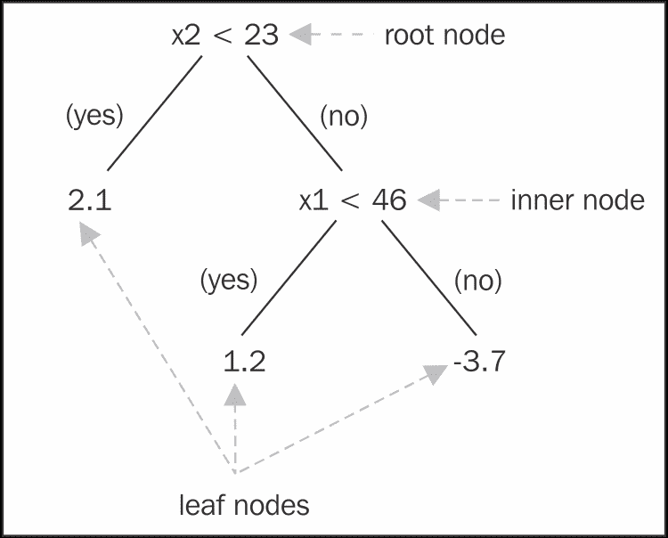

注意，树是一个递归结构，因为位于特定节点下的树的左右部分本身也是树。它们分别被称为**左子树**和**右子树**，它们所指向的节点分别是**左孩子**和**右孩子**。为了理解我们在实践中如何使用决策树，我们可以尝试一个简单的例子。假设我们想用我们的树来预测一个观察值的输出，其中*x1*的值为 96.0，*x2*的值为 79.9。我们从根节点开始，决定跟随哪个子树。我们的*x2*值大于 23，所以我们跟随右分支，来到一个新的节点，需要检查新的条件。我们的*x1*值大于 46，所以我们再次选择右分支，到达一个叶节点。因此，我们输出叶节点指示的值，即-3.7。这是我们的模型根据我们指定的输入对预测的值。

决策树的一种思考方式是，它们实际上是在编码一系列导致不同输出的 if-then 规则。对于每个叶节点，我们可以写一条规则（如果需要，可以使用布尔`AND`运算符将多个条件连接起来），这条规则必须为真，树才能输出该节点的值。我们可以通过从根节点开始，沿着每条通向叶节点的路径向下遍历树，来提取所有这些 if-then 规则。例如，我们的小回归树导致以下三条规则，每一条对应其一个叶节点：

+   `如果(x2 < 23) 则输出 2.1`

+   `如果(x2 > 23) AND (x1 < 46) 则输出 1.2`

+   `如果(x2 > 23) AND (x1 > 46) 则输出 -3.7`

注意，我们必须使用`AND`运算符将最后两条规则中的两个条件连接起来，因为通向叶节点的路径包含多个决策节点（包括根节点）。

另一种思考决策树的方式是，它们将特征空间划分为二维中的一系列矩形区域，三维中的立方体，以及更高维度的超立方体。记住，特征空间中的维度数就是特征的数量。我们示例回归树的特征空间有两个维度，我们可以如下可视化这个空间是如何划分为矩形区域的：

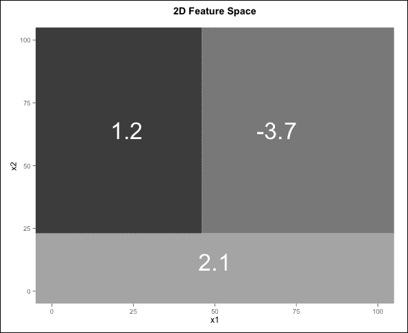

规则解释和空间划分解释是同一模型的等效视角。特别是空间划分解释在帮助我们理解决策树的一个特定特性方面非常有用：它们必须完全覆盖所有可能的输入特征组合。换句话说，对于决策树中不存在到达叶节点的路径的特定输入，应该没有。每次我们给出输入特征的值时，我们都应该始终能够返回一个答案。我们的决策树特征空间划分解释本质上告诉我们，没有不属于特定分区并分配了值的点或点的空间。同样，从我们的决策树 if-then 规则集视角来看，我们是在说对于任何输入特征组合，总有一条规则可以使用，因此我们可以将规则重新组织成一个等效的`if-then-else`结构，其中最后一个规则是`else`语句。

# 决策树训练算法

现在我们已经了解了决策树的工作原理，我们接下来想要解决的是如何使用一些数据来训练一个决策树的问题。已经提出了几种算法来构建决策树，在本节中，我们将介绍其中一些最著名的算法。我们应该记住的一点是，无论我们选择哪种树构建算法，我们都必须回答四个基本问题：

+   对于每个节点（包括根节点），我们应该如何选择用于分割的输入特征，以及给定这个特征，分割点的值是多少？

+   我们如何决定一个节点应该成为叶节点，还是我们应该创建另一个分割点？

+   我们应该允许树有多深？

+   一旦我们到达叶节点，我们应该预测什么值？

### 注意

决策树的优秀介绍可以在《机器学习》的*第三章*中找到，作者是*Tom Mitchell*。这本书可能是对机器学习最全面的介绍之一，值得一读。尽管这本书是在 1997 年出版的，但书中的大部分内容至今仍然适用。此外，根据书中网站[`www.cs.cmu.edu/~tom/mlbook.html`](http://www.cs.cmu.edu/~tom/mlbook.html)的信息，正在计划出版第二版。

## 分类和回归树

**分类和回归树**（**CART**）方法，我们以后将简单地称之为 CART，是早期提出的构建基于树模型的最早方法之一。正如其名所示，该方法包括构建回归树和分类树的方法。

### CART 回归树

对于回归树，使用 CART 方法的关键直觉是，在树的任何给定点，我们通过找到最大化这些组合中平方误差和（**SSE**）减少的组合，来选择分割的输入特征和该特征内的分割点值。对于使用 CART 构建的回归树中的每个叶节点，预测值只是分配给该特定叶节点的所有数据点预测输出的平均值。为了确定是否应该创建新的分割点或者树是否应该生长一个叶节点，我们只需计算当前分配给节点的数据点的数量；如果这个值小于一个预定的阈值，我们创建一个新的叶节点。

对于树中的任何给定节点，包括根节点，我们首先将一些数据点分配给该节点。在根节点，所有数据点都被分配，但一旦我们进行分割，一些数据点被分配给左子节点，剩余的点被分配给右子节点。SSE 的起始值只是使用分配给当前节点的 *n* 个数据点的输出变量的平均值 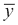 计算的平方误差和 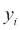：

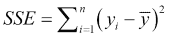

如果我们将这些数据点分成两个大小为 *n[1]* 和 *n[2]* 的组，使得 *n[1] + n[2] = n*，并且计算所有数据点的新的 SSE 作为两个新组 SSE 值的总和，我们有：

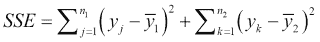

在这里，第一个求和是对 *j* 进行迭代，*j* 是第一组中对应左子节点的数据点的新的索引，第二个求和是对 *k* 进行迭代，*k* 是第二组内部属于右子节点的数据点的新的索引。CART 的基本思想是通过考虑每个可能的特征以及该特征内的每个可能的分割点，找到一种方法来形成这两组数据点，从而使这个新的量最小化。因此，我们可以将 CART 中的误差函数视为 SSE。

CART 及其一般基于树的模型的一个自然优势是它们能够处理各种输入类型，从数值输入（离散和连续）到二进制输入以及分类输入。数值输入可以通过按升序排序以自然方式排序，例如。当我们这样做时，我们可以看到，如果我们有 *k* 个不同的数字，那么将这些数字分成两组，使得一个组中的所有数字都小于第二个组中的所有数字，并且两个组至少有一个元素，有 *k-1* 种不同的分割方式。这很简单，只需选择数字本身作为分割点，而不将最小的数字作为分割点（这将产生一个空组）。所以如果我们有一个包含数字 `{5.6, 2.8, 9.0}` 的特征向量 *x*，我们首先将这些数字排序为 `{2.8, 5.6, 9.0}`。

然后，我们取除了最小的 `{2.8}` 之外的所有数字来形成一个分割点，并形成一个相应的规则来检查输入值是否小于分割点。通过这种方式，我们产生了我们特征向量的唯一两种可能的分组：

+   `Group1 = {2.8}, Group2 = {5.6, 9.0} IF x < 5.6 THEN Group1 ELSE Group2`

+   `Group1 = {2.8, 5.6}, Group2 = {9.0} IF x < 9.0 THEN Group1 ELSE Group2`

注意，每个组至少有一个元素是很重要的，否则我们实际上并没有分割我们的数据。二进制输入特征也可以通过简单地使用将所有具有此特征的第一值的数据点放入第一组，而具有此特征的第二个值的数据点放入第二组的分割点来处理。

处理无序的分类输入特征（因子）要困难得多，因为没有自然顺序。因此，任何级别的组合都可以分配给第一组，其余的分配给第二组。如果我们处理一个有 *k* 个不同级别的因子，那么有 *2^(k-1)-1* 种可能的分组方式，每个组至少有一个级别。

因此，一个二值特征有一个可能的分割，正如我们所知，一个三值特征有三个可能的分割。在包含数字 `{5.6, 2.8, 9.0}` 的数值特征向量中，我们已经看到了两个可能的分割。如果这些数字是标签，可能出现的第三个分割是这样一个分割：一个组的数据点具有这个特征的值为 `5.6`，另一个组具有两个值 `2.8` 和 `9.0`。显然，当我们把特征视为数值时，这不是一个有效的分割。

最后要注意的是，对于分类输入特征，我们始终可以选择一对一的方法，这本质上与考虑一个组始终由单个元素组成的分割相同。这并不总是一个好主意，因为它可能最终会显示出，当某些级别组合在一起时，它们可能比单个级别更能预测输出。如果这种情况发生，生成的树可能会更复杂，节点分割的数量会更多。

有多种方法可以处理与找到和评估所有不同分割点相关的大幅增加的复杂性，但我们现在不会进一步详细介绍。相反，让我们编写一些 R 代码来查看我们如何使用 CART 使用的 SSE 标准来找到数值输入特征的分割点：

```py
compute_SSE_split <- function(v, y, split_point) {
  index <- v < split_point
  y1 <- y[index]
  y2 <- y[!index]
  SSE <- sum((y1 - mean(y1)) ^ 2) + sum((y2 - mean(y2)) ^ 2)
  return(SSE)
}

compute_all_SSE_splits <- function(v, y) {
  sapply(unique(v), function(sp) compute_SSE_split(v, y, sp))
}
```

```py
rcart_df:
```

```py
> set.seed(99)
> x1 <- rbinom(20, 1, 0.5)
> set.seed(100)
> x2 <- round(10 + rnorm(20, 5, 5), 2)
> set.seed(101)
> y <- round((1 + (x2 * 2 / 5) + x1 - rnorm(20, 0, 3)), 2)
> rcart_df <- data.frame(x1, x2, y)
> rcart_df
   x1    x2     y
1   1 12.49  7.97
2   0 15.66  5.61
3   1 14.61  9.87
4   1 19.43  9.13
5   1 15.58  7.30
6   1 16.59  5.11
7   1 12.09  4.98
8   0 18.57  8.77
9   0 10.87  2.60
10  0 13.20  6.95
11  1 15.45  6.60
12  1 15.48 10.58
13  0 13.99  2.31
14  1 18.70 13.88
15  1 15.62  8.96
16  1 14.85  8.52
17  0 13.06  8.77
18  0 17.55  7.84
19  0 10.43  7.63
20  0 26.55 17.77
```

在实践中，20 个数据点可能是一个合适的数量，可以用作构建叶子节点的阈值，但在这个例子中，我们将简单地假设我们想要使用这些数据来创建一个新的分割。我们有两个输入特征，`x1`和`x2`。前者是一个二进制输入特征，我们使用数值标签 0 和 1 进行编码。这允许我们重用我们刚刚编写的函数来计算可能的分割。后者是一个数值输入特征。通过分别对每个特征应用我们的`compute_all_SSE_splits()`函数，我们可以计算每个特征的所有可能的分割点及其 SSE。以下两个图表依次显示了每个特征的这些 SSE 值：

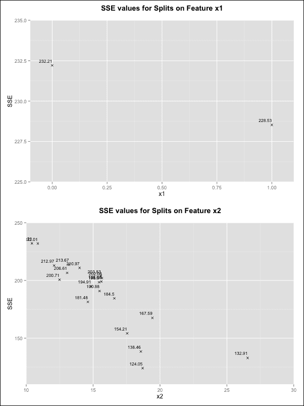

观察这两个图表，我们可以看到最佳分割产生的 SSE（总平方误差）值为`124.05`，这可以通过在特征`x2`的值`18.7`处进行分割来实现。因此，我们的回归树将包含以下分割规则：

```py
 If x2 < 18.7
```

CART 方法始终应用相同的逻辑来确定在每个节点是否进行新的分割，以及如何选择分割的特征和值。这种在节点处递归分割数据点以构建回归树的方法也是为什么这个过程也被称为**递归分割**。

### 树剪枝

如果我们允许递归分割过程无限期地重复，我们最终将通过每个叶子节点包含一个数据点来终止，因为那时我们不能再分割数据了。这个模型将完美地拟合训练数据，但它在未见过的数据上的性能很可能不会泛化。因此，基于树的模型容易过拟合。为了解决这个问题，我们需要控制最终决策树的深度。

从树中移除节点以限制其大小和复杂性的过程被称为**剪枝**。一种可能的剪枝方法是为创建新分割点而不是创建叶节点而使用可以使用的最小数据点数量设置一个阈值。这将使在程序早期就创建叶节点，分配给它们的那些数据点可能并不都具有相同的输出。在这种情况下，我们可以简单地预测回归的平均值（以及分类中最受欢迎的类别）。这是一个**预剪枝**的例子，因为我们是在树构建过程中以及它完全构建之前进行剪枝的。

直观上，我们应该能够看到，树的深度越大，分配给叶节点的平均数据点数越小，过拟合的程度就越大。当然，如果我们树中的节点较少，我们可能没有足够细致地模拟底层数据。

因此，树木应该允许生长到多大这个问题实际上是一个如何尽可能紧密地模拟我们的数据同时控制过拟合程度的问题。在实践中，使用预剪枝是棘手的，因为很难找到一个合适的阈值。

CART 方法用来剪枝的另一种正则化过程被称为**成本复杂度调整**。实际上，树通常被允许使用上一节中描述的递归分割方法完全生长。一旦完成，我们就剪枝得到的树，也就是说，我们开始移除分割点并合并叶节点，根据一定标准缩小树的大小。这被称为**后剪枝**，因为我们是在树构建之后进行剪枝的。当我们构建原始树时，我们使用的误差函数是 SSE。为了剪枝，我们使用惩罚版本的 SSE 来最小化：

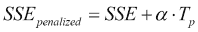

在这里，*α*是一个控制正则化程度的复杂度参数，*Tp*是树中的节点数，这是模拟树大小的一种方式。类似于 lasso 在广义线性模型中限制回归系数大小的方式，这种正则化过程限制了结果树的大小。*α*的值非常小会导致剪枝程度很小，当*α*取值为 0 时，极限情况下表示根本不进行剪枝。另一方面，使用这个参数的高值会导致树变得非常短，在极限情况下，可以导致没有分割点且大小为零的树，预测所有可能输入的输出平均值。

结果表明，每个 *α* 的特定值都对应于一个独特的树结构，该结构最小化了该特定值的惩罚形式的 SSE。换句话说，给定一个特定的 *α* 值，有一个独特且可预测的方式来修剪树以最小化惩罚 SSE，但这个过程的细节超出了本书的范围。现在，我们只需假设每个 *α* 值都与一棵树相关联。

这个特定功能非常有用，因为我们一旦确定了复杂度参数 *α* 的值，在选择树时就不会有任何歧义。然而，它并没有给我们提供确定实际应该使用什么值的方法。交叉验证，我们在第五章中看到的，*支持向量机*，是一种常用的方法，旨在估计这个参数的适当值。将交叉验证应用于这个问题将涉及将数据分成 *k* 个部分。然后我们通过使用除了一个部分之外的所有数据来训练和修剪 *k* 棵树，并对每一部分重复此过程。最后，我们在为测试保留的部分上测量 SSE，并平均结果。我们可以对 *a* 的不同值重复我们的交叉验证过程。当有更多数据可用时，另一种方法是使用验证数据集来评估在相同训练数据集上训练但 *α* 值不同的模型。

### 缺失数据

决策树的一个特点是它们在训练过程中自然地处理缺失数据。例如，当我们考虑在特定节点上分割哪个特征时，我们可以忽略具有特定特征缺失值的点，并使用剩余的数据点计算我们的误差函数（偏差、SSE 等）的潜在减少。请注意，虽然这种方法很方便，但它可能会大大增加模型的偏差，特别是如果我们因为缺失值而忽略了大量可用训练数据的话。

人们可能会想知道我们是否能够在预测未见数据点时处理缺失值。如果我们处于一个在某个特征上分割的特定节点，并且我们的测试数据点在该特征上有一个缺失值，我们似乎就陷入了困境。在实践中，这种情况可以通过使用**代理分割**来处理。这些方法背后的关键概念是，对于树中的每个节点，除了最优分割特征外，我们还跟踪一个其他特征列表，这些特征在数据中产生与实际选择的特征相似的分割。这样，当我们的测试数据点在需要做出预测的特征上有一个缺失值时，我们可以参考节点的代理分割，并使用不同的特征来处理这个节点。

## 回归模型树

使用 CART 构建的回归树的一个潜在缺点是，尽管我们限制了分配给特定叶节点的数据点的数量，但这些数据点之间仍然可能在输出变量上有显著的差异。当这种情况发生时，取平均值并以此作为该叶节点的一个单一预测可能不是最好的主意。

**回归模型树**试图通过使用叶节点上的数据点来构建一个线性模型以预测输出，来克服这个限制。原始的回归模型树算法是由 *J. Ross Quinlan* 开发的，被称为 **M5**。M5 算法在树的每个节点上计算一个线性模型。对于测试数据点，我们首先计算从根节点到叶节点的决策路径。然后做出的预测是与该叶节点相关的线性模型的输出。

M5 与 CART 中使用的算法的不同之处在于，它采用不同的标准来确定在哪个特征上进行分割。这个标准是加权标准差的减少：

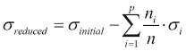

这个通用方程假设我们将数据分成 *p* 个分区（正如我们在树结构中看到的，*p* 通常为 2）。对于每个分区 *i*，我们计算标准差 *σ[i]*。然后，我们使用每个分区的相对大小（*n[i]/n*）作为权重，计算这些标准差的加权平均值。这个值从未分区数据的初始标准差中减去。

这个标准的背后思想是，分割一个节点应该产生数据点组，在每组中，与所有数据点分组在一起相比，输出变量的变异性更小。我们将在本章后面有机会看到 *M5 树* 以及 CART 树的实际应用。

## CART 分类树

使用 CART 方法构建分类树继续了递归分割数据点组以最小化某些误差函数的概念。我们首先猜测一个合适的误差函数是分类准确度。结果证明，这不是构建分类树的一个特别好的度量。

我们实际上想使用的是节点纯度的度量，该度量会根据节点是否包含主要属于一个输出类别的数据点来评分。这是一个非常直观的想法，因为我们实际上在分类树中追求的是最终能够将我们的训练数据点分组到叶节点上的数据点集合中，使得每个叶节点只包含属于一个类别的数据点。这意味着如果我们预测时到达那个叶节点，我们可以自信地预测这个类别。

节点纯度的一个可能度量，常与 CART 分类树一起使用，是**基尼指数**。对于一个有 *K* 个不同类别的输出变量，基尼指数 *G* 定义如下：

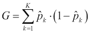

要计算基尼指数，我们计算每个类别的概率估计，并将其与不是该类别的概率相乘。然后我们将所有这些乘积相加。对于二元分类问题，应该很容易看出基尼指数等于 *2* 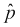 (*1- * )，其中  是一个类别的估计概率。

要计算树中特定节点的基尼指数，我们可以简单地使用标记为类别 *k* 的数据点数与总数据点数的比率，作为该节点中数据点属于类别 *k* 的概率的估计。以下是一个简单的 R 函数来计算基尼指数：

```py
gini_index <- function(v) {
  t <- table(v)
  probs <- t / sum(t)
  terms <- sapply(probs, function(p) p * (1 - p) )
  return(sum(terms))
}
```

要计算基尼指数，我们的 `gini_index()` 函数首先将向量中的所有条目进行汇总。它将每个这些频率计数除以总计数，将它们转换为概率估计。最后，它计算每个这些的乘积 (*1-*) 并对所有这些项进行求和。让我们尝试几个例子：

```py
> gini_index(v = c(0, 0, 0, 1, 1, 1))
[1] 0.5
> gini_index(v = c(0, 0, 0, 1, 1, 1, 1, 1, 1))
[1] 0.4444444
> gini_index(v = c(0, 0, 0, 1, 1, 1, 2, 2, 2))
[1] 0.6666667
> gini_index(v = c(1, 1, 1, 1, 1, 1))
[1] 0
```

注意，完全纯的节点（只有一个类别的节点）的基尼指数为 0。对于两个类别比例相等的二元输出，基尼指数为 0.5。类似于回归树中的标准差，我们使用加权减少的基尼指数，其中我们按相对大小权衡每个分区，以确定适当的分割点：

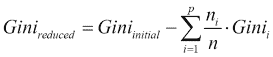

另一个常用的标准是偏差。当我们研究逻辑回归时，我们看到了这仅仅是常数 *-2* 乘以数据的对数似然。在分类树设置中，我们计算分类树中一个节点的偏差如下：

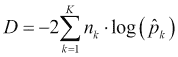

与基尼指数不同，节点处的观察总数 *n[k]* 影响偏差的值。所有具有不同类别间数据点相同比例的节点将具有相同的基尼指数值，但如果它们有不同的观察数，它们将具有不同的偏差值。然而，在两种分割标准中，一个完全纯的节点将具有 0 值，否则为正值。

除了使用不同的分裂标准外，使用 CART 方法构建分类树的逻辑与构建回归树的逻辑完全平行。缺失值以相同的方式处理，并且使用剩余数据点构建叶节点的数量阈值对树进行预剪枝。树也使用与回归树中概述的相同成本复杂度方法进行后剪枝，但用 Gini 指数或偏差替换了 SSE 作为误差函数。

## C5.0

由*罗斯·奎因兰*开发的**C5.0**算法是一种用于构建分类决策树的算法。这个算法是自一个被称为**ID3**的算法开始的一系列连续改进版本中的最新版本，该算法发展成了**C4.5**（以及在 Java 编程语言中称为**J48**的开源实现），最终演变为 C5.0。用于决策树的好缩写有很多，但幸运的是，其中许多都是相互关联的。C5.0 算法链与 CART 方法有几个不同之处，最显著的是在分裂标准的选择以及剪枝过程上。

C5.0 使用的分裂标准被称为**熵**或**信息统计量**，其根源在于信息理论。熵被定义为通过消息传递所需平均二进制数字（比特）的数量，作为不同符号概率的函数。熵在统计物理学中也有其根源，在那里它被用来表示系统中的混沌和不确定程度。当一个系统的符号或组成部分具有相等的概率时，存在很高的不确定性，但当某个符号比其他符号远更可能时，熵较低。这一观察使得熵的定义在衡量节点纯度时非常有用。对于具有*K*个类别的多类场景，熵的正式定义（以比特为单位）是：

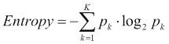

在二进制情况下，方程简化为（其中*p*任意指代两个类别中的一个的概率）：

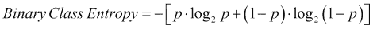

我们可以在以下图表中比较熵与二分类的 Gini 指数：

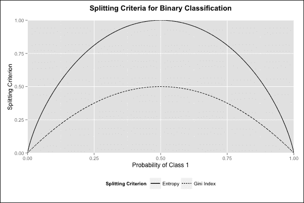

从图表中我们可以看到，对于二类问题，这两个函数具有相同的一般形状。回想一下，熵越低，我们对类别分布的不确定性就越低，因此节点纯度就越高。因此，我们在构建树的过程中希望最小化熵。在 ID3 中，使用的分裂标准是加权熵减少，也称为**信息增益**：

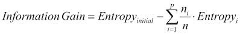

结果表明，这个标准存在**选择偏差**的问题，因为它倾向于偏好分类变量，因为与我们在连续特征中找到的分割范围相比，可能的分组数量要多得多。为了解决这个问题，从 C4.5 开始，这个标准被细化为**信息增益率**。这是信息增益的标准化版本，其中我们相对于一个称为**分割信息值**的量进行标准化。

这反过来又代表了仅通过分区本身的大小就能获得的潜在信息增加。当我们有大小均匀的分区时，就会发生高分割信息值；而当大多数数据点集中在少数几个分区中时，就会发生低值。总的来说，我们有以下内容：

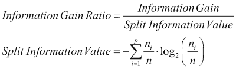

C5.0 算法链还包含了超越简单节点和子树消除的剪枝方法。例如，内部节点可以在叶节点之前被移除，这样被移除节点（子树）下的节点（子树）就会被推上去（提升）以替换被移除的节点。特别是 C5.0 是一个非常强大的算法，它还包含了改进速度、内存使用、原生提升（将在下一章中介绍）的能力，以及指定成本矩阵的能力，这样算法就可以避免在某些类型的误分类上比其他类型更频繁地发生，正如我们在上一章中看到的支持向量机那样。

我们将在下一节中演示如何在 R 中使用 C5.0 构建树。

# 在合成 2D 数据上预测类别成员资格

我们第一个展示 R 中基于树的方法的例子将操作于我们创建的合成数据集。该数据集可以使用本章配套 R 文件的命令生成，该文件由出版商提供。数据包括 287 个观测值，两个输入特征`x1`和`x2`。

输出变量是一个具有三个可能类别的分类变量：`a`、`b`和`c`。如果我们遵循代码文件中的命令，我们将最终在 R 中得到一个数据框`mcdf`：

```py
> head(mcdf, n = 5)
          x1       x2 class
1 18.58213 12.03106     a
2 22.09922 12.36358     a
3 11.78412 12.75122     a
4 23.41888 13.89088     a
5 16.37667 10.32308     a
```

这个问题实际上非常简单，因为一方面，我们有一个非常小的数据集，只有两个特征，另一方面，类别在特征空间中恰好被很好地分开，这是非常罕见的。尽管如此，在本节中，我们的目标是演示在下一节在真实世界数据集上动手（或键盘）之前，在*表现良好*的数据上构建分类树。

为了为这个数据集构建一个分类树，我们将使用 `tree` 包，它为我们提供了 `tree()` 函数，该函数使用 CART 方法训练模型。按照惯例，第一个要提供的参数是一个公式，第二个参数是数据框。该函数还有一个 `split` 参数，用于标识用于分割的标准。默认情况下，这个参数设置为 `deviance`，对于偏差标准，我们在该数据集上观察到更好的性能。我们鼓励读者通过将 `split` 参数设置为 `gini` 来在基尼指数上分割重复这些实验。

不再拖延，让我们训练我们的第一个决策树：

```py
> library(tree)
> d2tree <- tree(class ~ ., data = mcdf)
> summary(d2tree)

Classification tree:
tree(formula = class ~ ., data = mcdf)
Number of leaf nodes:  5 
Residual mean deviance:  0.03491 = 9.844 / 282 
Misclassification error rate: 0.003484 = 1 / 287
```

我们在我们的训练模型上调用 `summary()` 函数来获取有关我们构建的树的一些有用信息。请注意，对于这个例子，我们不会将我们的数据分成训练集和测试集，因为我们的目标是首先讨论模型拟合的质量。从提供的摘要来看，我们似乎在整个数据集中只误分类了一个示例。通常情况下，这会引发我们过度拟合的怀疑；然而，我们已经知道我们的类别在特征空间中分布良好。我们可以使用 `plot()` 函数来绘制树的形状，以及使用 `text()` 函数来显示所有相关的标签，这样我们就可以完全可视化我们构建的分类器：

```py
> plot(d2tree)
> text(d2tree, all = T)
```

这就是产生的图表：

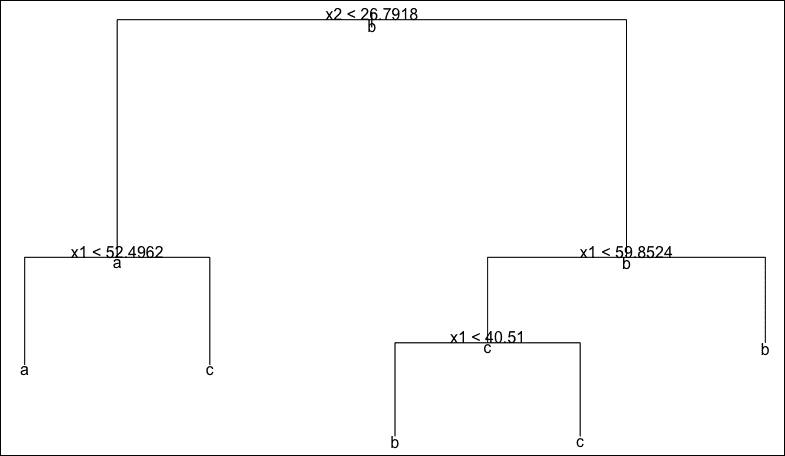

注意，我们的图表显示了每个节点的预测类别，包括非叶节点。这仅仅允许我们看到在树的每一步中哪个类别占主导地位。例如，在根节点，我们看到主导类别是类别 `b`，仅仅因为这个类别在我们的数据集中是最常见的。能够看到我们的决策树所表示的 2D 空间的划分是有教育意义的。

对于一个和两个特征，`tree` 包允许我们使用 `partition.tree()` 函数来可视化我们的决策树。我们已经这样做了，并将我们的原始数据叠加在其上，以便看到分类器是如何划分空间的：

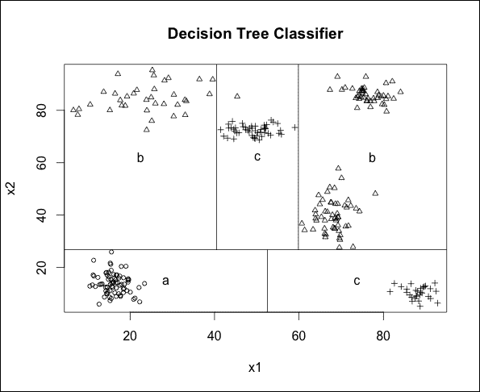

我们大多数人可能会在我们的数据中识别出六个簇；然而，图表右上角的簇都被分配到了类别 `b`，因此树分类器已经将这个整个空间区域识别为单个叶节点。最后，我们可以看到属于类别 `b` 但被分配到类别 `c` 的误分类点（它在图表顶部中间的三角形中）。

另一个值得注意的有趣观察是，在这个特定情况下，空间是如何有效地被划分为矩形的（对于有六个聚类的数据集，只有五个矩形）。另一方面，我们可以预期这个模型可能存在一些不稳定性，因为几个矩形的边界与数据集中的数据点非常接近（因此接近聚类的边缘）。因此，我们也应该预期，使用与生成我们的训练数据相同过程生成的未见数据，将获得较低的准确度。

在下一节中，我们将为现实世界的分类问题构建一个树模型。

# 预测纸币的真实性

在本节中，我们将研究预测特定纸币是真是伪造的问题。*纸币认证数据集*托管在[`archive.ics.uci.edu/ml/datasets/banknote+authentication`](https://archive.ics.uci.edu/ml/datasets/banknote+authentication)。数据集的创建者从真币和伪造币中取了样本，并用工业相机拍摄。生成的灰度图像使用一种称为**小波变换**的时间-频率变换进行处理。构建了该变换的三个特征，加上图像熵，它们构成了这个二元分类任务中的四个特征。

| 列名 | 类型 | 定义 |
| --- | --- | --- |
| `waveletVar` | 数值 | 小波变换图像的方差 |
| `waveletSkew` | 数值 | 小波变换图像的偏度 |
| `waveletCurt` | 数值 | 小波变换图像的峰度 |
| `熵` | 数值 | 图像的熵 |
| `class` | 二元 | 真实性（0 输出表示真币，1 输出表示伪造币） |

首先，我们将我们的 1,372 个观察值分为训练集和测试集：

```py
> library(caret)
> set.seed(266)
> bnote_sampling_vector <- createDataPartition(bnote$class, p = 
                           0.80, list = FALSE)
> bnote_train <- bnote[bnote_sampling_vector,]
> bnote_test <- bnote[-bnote_sampling_vector,]
```

接下来，我们将介绍包含 C5.0 算法分类实现的`C50` R 包。属于此包的`C5.0()`函数也接受公式和数据框作为其最小必需输入。就像之前一样，我们可以使用`summary()`函数来检查生成的模型。我们不会重现后者的整个输出，而是只关注构建的树：

```py
> bnote_tree <- C5.0(class ~ ., data = bnote_train)
> summary(bnote_tree)
waveletVar > 0.75896:
:...waveletCurt > -1.9702: 0 (342)
:   waveletCurt <= -1.9702:
:   :...waveletSkew > 4.9228: 0 (128)
:       waveletSkew <= 4.9228:
:       :...waveletVar <= 3.4776: 1 (34)
:           waveletVar > 3.4776: 0 (2)
waveletVar <= 0.75896:
:...waveletSkew > 5.1401:
    :...waveletVar <= -3.3604: 1 (31)
    :   waveletVar > -3.3604: 0 (93/1)
    waveletSkew <= 5.1401:
    :...waveletVar > 0.30081:
        :...waveletCurt <= 0.35273: 1 (25)
        :   waveletCurt > 0.35273:
        :   :...entropy <= 0.71808: 0 (24)
        :       entropy > 0.71808: 1 (3)
        waveletVar <= 0.30081:
        :...waveletCurt <= 3.0423: 1 (241)
            waveletCurt > 3.0423:
            :...waveletSkew > -1.8624: 0 (21/1)
                waveletSkew <= -1.8624:
                :...waveletVar <= -0.69572: 1 (146)
                    waveletVar > -0.69572:
                    :...entropy <= -0.73535: 0 (2)
                        entropy > -0.73535: 1 (6)
```

如我们所见，在树中使用一个特征多次以创建新的分割是完全可接受的。树中叶节点右侧括号中的数字表示分配给该节点的每个类别的观察数。如我们所见，树中的绝大多数叶节点是纯节点，因此只分配了来自一个类的观察值。

只有两个叶节点各自来自少数类的单个观察值，因此我们可以推断，使用这个模型我们只犯了两个训练数据错误。为了看看我们的模型是否过度拟合了数据，或者它是否真的可以很好地泛化，我们将在测试集上对其进行测试：

```py
> bnote_predictions <- predict(bnote_tree, bnote_test)
> mean(bnote_test$class == bnote_predictions)
[1] 0.9890511
```

测试准确率几乎完美，这是一个罕见的景象，也是本章中我们最后一次如此轻松地完成！最后值得一提的是，`C50()` 还有一个 `costs` 参数，这对于处理不对称错误成本非常有用。

# 预测复杂技能学习

在本节中，我们将有机会探索一个名为 *SkillCraft* 的新近项目的数据。感兴趣的读者可以通过访问 [`skillcraft.ca/`](http://skillcraft.ca/) 在网上了解更多关于这个项目的信息。该项目背后的关键前提是，通过研究涉及复杂资源管理和战略决策的实时策略游戏（**RTS**）中玩家的表现，我们可以研究人类如何学习复杂技能，并在动态资源分配场景中提高速度和竞争力。为了实现这一点，已经收集了玩家在由 *Blizzard* 开发的热门实时策略游戏 *Starcraft 2* 中玩游戏的资料。

在这个游戏中，玩家在许多固定地图和起始位置之一与其他玩家竞争。每个玩家必须从三个可选的虚构种族中选择一个，并从六个工人单位开始，这些单位用于收集两种游戏资源中的一种。这些资源是建造军事和生产建筑、每个种族独特的军事单位、研究技术和建造更多工人单位所必需的。游戏涉及经济进步、军事增长和实时交战中的军事策略。

玩家通过在线匹配算法相互对抗，该算法根据玩家感知的技能水平将玩家分组到联赛中。算法对玩家技能的感知会根据玩家在参与的比赛中表现的变化而随时间变化。总共有八个联赛，人口分布不均，低级别联赛通常有更多玩家，而高级别联赛玩家较少。

对游戏有基本了解后，我们可以通过访问[`archive.ics.uci.edu/ml/datasets/SkillCraft1+Master+Table+Dataset`](https://archive.ics.uci.edu/ml/datasets/SkillCraft1+Master+Table+Dataset)从 UCI 机器学习仓库下载 SkillCraft1 大师表数据集。该数据集的行是玩过的单个游戏，游戏特征是玩家游戏速度、能力和决策的指标。数据集的作者使用了玩家熟悉的标准化性能指标，以及其他指标，如**感知动作周期**（**PACs**），这些指标试图量化玩家在特定时间窗口内查看地图上固定位置的动作。

当前任务是根据这些性能指标预测玩家目前被分配到八个联赛中的哪一个。我们的输出变量是一个有序分类变量，因为我们有八个不同的联赛，从 1 到 8 排序，其中后者对应于拥有最高技能玩家的联赛。

处理有序输出的一个可能方法是将它们视为数值变量，将其建模为回归任务，并构建回归树。以下表格描述了我们数据集中的特征和输出变量：

| 特征名称 | 类型 | 描述 |
| --- | --- | --- |
| `Age` | 数值 | 玩家年龄 |
| `HoursPerWeek` | 数值 | 每周报告的游戏时间 |
| `TotalHours` | 数值 | 报告的累计游戏时间 |
| `APM` | 数值 | 每分钟游戏动作数 |
| `SelectByHotkeys` | 数值 | 每个时间戳使用快捷键进行的单位或建筑选择数量 |
| `AssignToHotkeys` | 数值 | 每个时间戳分配给快捷键的单位或建筑数量 |
| `UniqueHotkeys` | 数值 | 每个时间戳使用的独特快捷键数量 |
| `MinimapAttacks` | 数值 | 每个时间戳在最小地图上的攻击动作数量 |
| `MinimapRightClicks` | 数值 | 每个时间戳在最小地图上的右键点击次数 |
| `NumberOfPACs` | 数值 | 每个时间戳的 PAC 数量 |
| `GapBetweenPACs` | 数值 | PACs 之间的平均持续时间（毫秒） |
| `ActionLatency` | 数值 | 从 PAC 开始到第一次动作的平均延迟（毫秒） |
| `ActionsInPAC` | 数值 | 每个 PAC 内的平均动作数 |
| `TotalMapExplored` | 数值 | 玩家在每个时间戳查看的 24x24 游戏坐标网格数量 |
| `WorkersMade` | 数值 | 每个时间戳训练的工人单位数量 |
| `UniqueUnitsMade` | 数值 | 每个时间戳制作的独特单位 |
| `ComplexUnitsMade` | 数值 | 每个时间戳训练的复杂单位数量 |
| `ComplexAbilitiesUsed` | 数值 | 每个时间戳使用需要特定目标指令的能力 |
| `LeagueIndex` | 数值 | 青铜、白银、黄金、白金、钻石、大师、宗师和职业联赛，编码为 1-8（输出） |

### 提示

如果读者之前从未在电脑上玩过像*星际争霸 2*这样的实时策略游戏，那么数据集中使用的许多特征可能听起来很神秘。如果一个人只是接受这些特征代表玩家在游戏中的表现各个方面，那么仍然可以毫无困难地跟随关于我们回归树训练和测试的所有讨论。

首先，我们将这个数据集加载到数据框`skillcraft`中。在开始处理数据之前，我们必须做一些预处理。首先，我们将删除第一列。这只是一个唯一的游戏标识符，我们不需要也不会使用。其次，快速检查导入的数据框将显示，有三个列被解释为因子，因为输入数据集包含一个问号来表示缺失值。为了处理这个问题，我们首先需要将这些列转换为数值列，这个过程将在我们的数据集中引入缺失值。

接下来，尽管我们已经看到树可以很好地处理这些缺失值，但我们还是打算删除包含这些值的几行。我们会这样做，因为我们想要能够比较本章和下一章中几个不同模型的性能，并不是所有这些模型都支持缺失值。

下面是上述预处理步骤的代码：

```py
> skillcraft <- read.csv("SkillCraft1_Dataset.csv")
> skillcraft <- skillcraft[-1]
> skillcraft$TotalHours <- as.numeric(
  levels(skillcraft$TotalHours))[skillcraft$TotalHours]
Warning message:
NAs introduced by coercion 
> skillcraft$HoursPerWeek <- as.numeric(
  levels(skillcraft$HoursPerWeek))[skillcraft$HoursPerWeek]
Warning message:
NAs introduced by coercion 
> skillcraft$Age <- as.numeric(
  levels(skillcraft$Age))[skillcraft$Age]
Warning message:
NAs introduced by coercion 
> skillcraft <- skillcraft[complete.cases(skillcraft),]
```

如同往常，下一步将是将我们的数据分为训练集和测试集：

```py
> library(caret)
> set.seed(133)
> skillcraft_sampling_vector <- createDataPartition( 
  skillcraft$LeagueIndex, p = 0.80, list = FALSE)
> skillcraft_train <- skillcraft[skillcraft_sampling_vector,]
> skillcraft_test <- skillcraft[-skillcraft_sampling_vector,]
```

这次，我们将使用`rpart`包来构建我们的决策树（与`tree`包一起，这两个包是 R 中构建基于树的模型最常用的包）。这个包为我们提供了一个`rpart()`函数来构建我们的树。就像`tree()`函数一样，我们可以通过简单地提供一个公式和我们的数据框来使用默认行为构建一个回归树：

```py
> library(rpart)
> regtree <- rpart(LeagueIndex ~ ., data = skillcraft_train)
```

我们可以绘制我们的回归树来查看其外观：

```py
> plot(regtree, uniform = TRUE)
> text(regtree, use.n = FALSE, all = TRUE, cex = .8)
```

这是生成的图表：

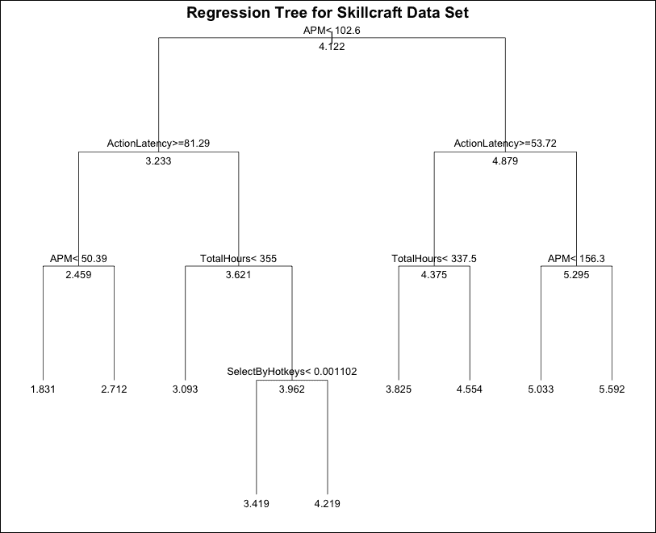

为了了解我们的回归树的准确性，我们将对测试数据进行预测，然后测量 SSE。这可以通过我们定义的一个简单函数`compute_SSE()`来完成，它计算给定目标值向量和预测值向量时的平方误差之和：

```py
 compute_SSE <- function(correct, predictions) {
     return(sum((correct - predictions) ^ 2))
 }

> regtree_predictions <- predict(regtree, skillcraft_test)
> (regtree_SSE <- compute_SSE(regtree_predictions, skillcraft_test$LeagueIndex))
[1] 740.0874
```

## 调整 CART 树模型参数

到目前为止，我们所做的一切只是为构建树的递归划分算法的所有参数使用默认值。`rpart()`函数有一个特殊的`control`参数，我们可以提供一个包含我们希望覆盖的任何参数值的对象。要构建这个对象，我们必须使用特殊的`rpart.control()`函数。我们可以调整许多不同的参数，研究这个函数的帮助文件以了解更多关于它们的信息。

在这里，我们将关注三个影响我们树的大小和复杂性的重要参数。`minsplit` 参数表示算法在被迫创建叶节点之前尝试分割所需的最小数据点数。默认值是 30。`cp` 参数是我们之前见过的复杂度参数，其默认值为 0.01。最后，`maxdepth` 参数限制了叶节点和根节点之间的最大节点数。这里的默认值 30 相当宽松，允许构建相当大的树。我们可以通过指定与默认值不同的值来尝试不同的回归树。我们将这样做，看看这会影响测试集上的 SSE 性能：

```py
> regtree.random <- rpart(LeagueIndex ~ ., data = skillcraft_train, 
  control = rpart.control(minsplit = 20, cp = 0.001, maxdepth = 10))
> regtree.random_predictions <- predict(regtree.random, 
  skillcraft_test)
> (regtree.random_SSE <- compute_SSE(regtree.random_predictions, 
   skillcraft_test$LeagueIndex))
[1] 748.6157
```

使用这些值，我们试图将树限制在深度为 10，同时通过在节点上需要 20 个或更多数据点来简化强制分割。我们还通过将复杂度参数设置为 0.001 来降低正则化的影响。这是一个完全随机的选择，不幸的是，它在我们的测试集上给出了更差的 SSE 值。在实践中，需要一种系统的方法，通过尝试多种不同的组合并使用交叉验证作为评估它们在未见数据上性能的一种方式，来找到适合我们树的这些参数的适当值。

实际上，我们希望调整我们的回归树训练，在第五章中，*支持向量机*，我们遇到了 `e1071` 包内的 `tune()` 函数，它可以帮助我们做到这一点。我们将使用这个函数与 `rpart()` 一起，并为刚才讨论的三个参数提供范围：

```py
> library(e1071)
> rpart.ranges <- list(minsplit = seq(5, 50, by = 5), cp = c(0,  
  0.001, 0.002, 0.005, 0.01, 0.02, 0.05, 0.1, 0.2,0.5), maxdepth = 1:10)
> (regtree.tune <- tune(rpart,LeagueIndex ~ ., 
   data = skillcraft_train, ranges = rpart.ranges))

Parameter tuning of 'rpart':

- sampling method: 10-fold cross validation 

- best parameters:
 minsplit    cp maxdepth
       35 0.002        6

- best performance: 1.046638
```

运行前面的任务可能需要几分钟才能完成，因为有许多参数组合。一旦程序完成，我们可以用建议的值训练一个树：

```py
> regtree.tuned <- rpart(LeagueIndex ~ ., data = skillcraft_train,  
  control = rpart.control(minsplit = 35, cp = 0.002, maxdepth = 6))
> regtree.tuned_predictions <- predict(regtree.tuned, 
  skillcraft_test)
> (regtree.tuned_SSE <- compute_SSE(regtree.tuned_predictions, 
   skillcraft_test$LeagueIndex))
[1] 701.3386
```

的确，在我们的测试集上，这些设置带来了更低的 SSE 值。如果我们输入我们新的回归树模型名称，`regree.tuned`，我们会看到我们的树中有更多的节点，这使得树现在变得更加复杂。

## 树模型中的变量重要性

对于如此大的树，绘图不太有用，因为很难使绘图可读。我们可以获得的一个有趣的绘图是 **变量重要性** 的绘图。对于每个输入特征，我们跟踪每次它在树中的任何地方被使用时发生的优化标准（例如，偏差或 SSE）的减少。然后我们可以累计树中所有分割的这个数量，从而获得变量重要性的相对量。

直观地说，高度重要的特征往往会很早就被用来分割数据（因此出现在树中较高的位置，接近根节点），以及更频繁地使用。如果一个特征从未被使用过，那么它就不重要，这样我们就可以看到我们有一个内置的特征选择。

注意，这种方法对特征之间的相关性很敏感。在尝试确定要分割哪个特征时，我们可能会随机选择两个高度相关的特征，导致模型使用比必要的更多特征，因此这些特征的重要性低于单独选择任何一个。实际上，变量重要性是由`rpart()`自动计算的，并存储在返回的树模型上的`variable.importance`属性中。使用`barplot()`绘制它会产生以下结果：

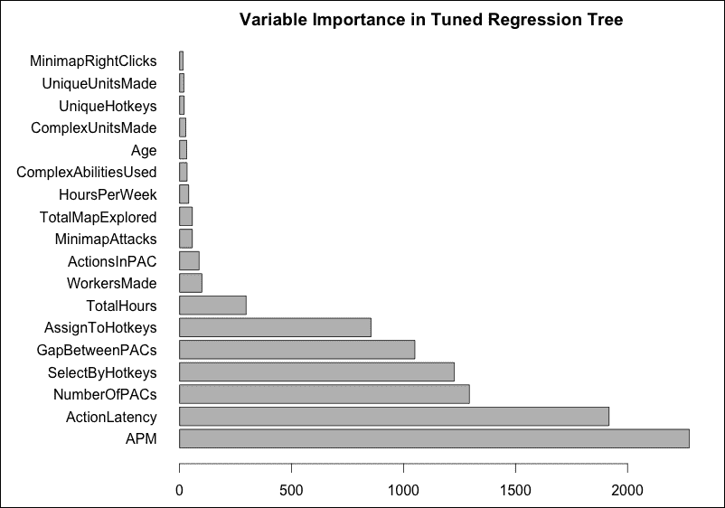

对于 RTS 类型的经验玩家来说，这个图表看起来相当合理和直观。根据这个图表，技能的最大分隔点是玩家每分钟做出的平均游戏动作数（`APM`）。经验丰富且有效的玩家能够做出很多动作，而经验较少的玩家则会做出较少的动作。

乍一看，这似乎仅仅是获得所谓的肌肉记忆和培养更快反应速度的问题，但实际上是知道要执行哪些动作，在游戏中进行策略和计划（这是优秀玩家的特征），这也显著提高了这个指标。

另一个与速度相关的属性是`ActionLatency`特征，它本质上衡量的是从选择在战场上关注特定位置到在该位置执行第一个动作之间的时间。更好的玩家在查看地图位置上花费的时间会更少，并且在选择单位、下达命令和根据游戏中的情况图像做出决定方面会更快。

## 回归模型树在实际应用中

我们将在本章的实验中通过一个非常简短的演示来结束，演示如何在 R 中运行回归模型树，然后是一些关于改进 M5 模型概念的信息。

我们可以使用包含`M5P()`函数的`RWeka`包非常容易地做到这一点。这遵循了典型的惯例，即需要一个公式和一个包含训练数据的 data frame：

```py
> library("RWeka")
> m5tree <- M5P(LeagueIndex ~ ., data = skillcraft_train)
> m5tree_predictions <- predict(m5tree, skillcraft_test)
> m5tree_SSE <- compute_SSE(m5tree_predictions, 
                            skillcraft_test$LeagueIndex)
> m5tree_SSE
[1] 714.8785
```

注意，我们使用默认设置几乎可以达到与调整过的 CART 树相当的性能。我们将让读者进一步探索这个函数，但我们将再次在第九章中回顾这个数据集，*集成方法*。

### 注意

关于包含多个案例研究的回归模型树的好参考是 Quinlan 的原始论文，题为*Learning with continuous cases*，发表于 1992 年的*澳大利亚联合人工智能会议*。

# M5 模型的改进

标准的 M5 算法树目前已被接受为在完成复杂回归任务中决策树中最先进的一种模型。这主要是因为它产生的准确结果以及它处理具有数百个属性的大量维度任务的能力。

为了改进或优化标准的 M5 算法，最近推出了*M5Flex*，可能是最可行的选择。M5Flex 算法方法将尝试通过*领域知识*来*增强*标准的 M5 树模型。换句话说，M5Flex 赋予那些熟悉数据集的人审查和选择那些重要节点（在模型树中）的*分割属性*和*分割值*的权力，假设他们“知道得最好”，因此产生的模型将比仅依赖标准 M5 的模型更加准确、一致，并且更适合实际应用。使用 M5Flex 的一个缺点或批评是，在大多数情况下，领域专家可能并不总是可用。

M5 的另一种改进尝试是**M5opt**。M5opt 是一种半非贪婪算法，它采用了一种不试图整体解决全局复杂优化问题的方法，或者不将其视为“一个整体”，而是将生成树层的程序分为两个不同的步骤，每个步骤使用不同类型或性质的算法，这取决于树的层：

1.  **全局优化**：使用全局（多极值）优化算法（或优于贪婪方法的算法）生成树的顶层（从第一层开始）。

1.  **贪婪搜索**：使用类似于标准 M5 的更快“贪婪算法”生成树的其余部分（树的底层）。

此外，应用全局优化的层在不同分支中可能不同。然而，将所有分支固定在某个值上似乎是合理的；这允许在速度和优化之间进行灵活的权衡。尽管使用 M5opt 算法优化构建树模型的过程已被证明可以产生比使用标准 M5 创建的模型更准确的模型，但由于“非贪婪”算法的工作性质，计算成本将会增加。

为了解决这个问题，可以通过审查哪个树层“最合适”，或者哪个层可以以最小的成本产生最大的准确性来控制成本，然后在树的该层进行更彻底的非贪婪搜索。

进一步优化标准 M5 的尝试包括尝试结合 M5opt 和 M5flex 方法。

最后，在第五章中讨论的**人工神经网络**（**ANNs**），作为一种替代标准 M5 的方法被提出，但仅限于那些假设树模型较为简单的情况下。在复杂模型中，M5 几乎总是优于 ANN。

# 概述

在本章中，我们学习了如何构建用于回归和分类任务的决策树。我们了解到，尽管这个想法很简单，但在构建我们的树模型时，我们仍需做出几个决定，例如选择何种分割标准，以及何时以及如何修剪我们的最终树。

在每种情况下，我们都考虑了多种可行的选项，结果发现，有几种算法被用来构建决策树模型。决策树的一些最佳特性是它们通常易于实现和解释，同时不对数据的潜在模型做出假设。决策树具有原生选项来执行特征选择和处理缺失数据，并且能够处理广泛的特征类型。

话虽如此，我们从计算的角度看到，由于可能分割数量的指数增长，找到分类变量的分割点相当昂贵。此外，我们还看到，由于潜在分割点数量众多，分类特征往往倾向于在信息增益等分割标准中引入选择偏差。

使用决策树模型的另一个缺点是它们可能不稳定，这意味着数据中的微小变化可能会改变树中较高位置的分割决策，结果我们可能会得到一个完全不同的树。此外，特别是对于回归问题而言，由于叶节点数量有限，我们的模型在输出上可能不够细致。最后，尽管有几种不同的剪枝方法，但我们应注意到决策树可能容易过拟合。

在下一章中，我们不会关注新的模型类型。相反，我们将探讨不同的技术来组合多个模型，例如袋装法和提升法。这些方法统称为集成方法。这些方法已被证明在提高简单模型的性能和克服前面讨论的基于树的模型的局限性（如模型不稳定和易过拟合）方面非常有效。

我们将介绍一个著名的算法，AdaBoost，它可以与迄今为止我们所看到的一些模型一起使用。此外，我们还将介绍随机森林，作为一种专门为决策树设计的特殊集成模型。一般来说，集成方法通常不易解释，但对于随机森林，我们仍然可以使用本章中看到的变量重要性的概念，以便对模型最依赖哪些特征有一个整体的认识。
