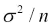
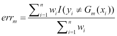
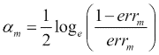
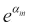
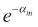
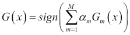
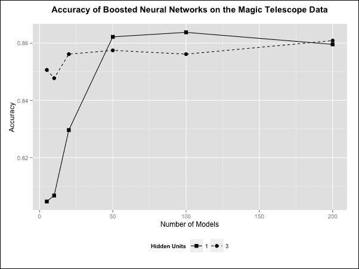
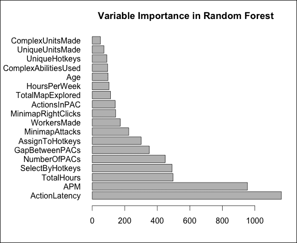

# 第九章。集成方法

在本章中，我们暂时放慢学习新模型的速度，而是思考如何将几个训练好的模型作为一个集成一起工作，以产生一个比单个模型更强大的单一模型。

我们将要研究的第一种集成类型使用相同数据集的不同样本来训练同一模型的多个版本。然后，这些模型对新观测的正确答案进行投票，并基于问题的类型做出平均或多数决策。这个过程被称为 bagging，即 bootstrap aggregation 的缩写。另一种结合模型的方法是 boosting。这本质上涉及训练一系列模型，并为被错误分类或远低于其预测值的观测分配权重，以便后续模型被迫优先考虑它们。

作为方法，Bagging 和 Boosting 相当通用，并且已经应用于多种不同类型的模型。在第六章（第六章

这个数字也恰好是整个训练数据集中未选择的观察结果的平均比例，因为我们通过将前面的表达式乘以 *n* 并除以 *n* 来计算这个量。这个表达式的数值结果可以近似为 *e-1*，大约是 37%。因此，所选观察结果的平均比例大约是 63%。这个数字只是一个平均值，当然，对于更大的 *n* 值来说更准确。

## 间隔和袋外观察结果

让我们假设对于特定的观察结果 *x[1]*，85%的模型预测正确的类别，而剩下的 15%预测错误的类别。让我们再假设有一个另一个观察结果 *x[2]*，其相应的百分比是 53%和 47%。显然，我们的直觉表明，我们应该对前者的分类比后者的分类更有信心。换句话说，分类比例之间的差异，也称为**间隔**（类似于但不要与支持向量机中使用的间隔混淆），是我们分类置信度的一个良好指标。

观察到的 70%的误差范围 *x[1]* 比观察到的 6%的误差范围 *x[2]* 大得多，因此，我们对我们正确分类前者的能力更有信心。一般来说，我们希望的是一个对所有观察都有大误差范围的分类器。对于只有少数观察有较小误差范围的分类器的泛化能力，我们不太乐观。

读者可能已经注意到，在生成每个模型的预测值集时，我们使用了训练模型相同的同一数据。如果我们仔细观察程序的*步骤 3*，我们会用我们在*步骤 2*中用于训练模型的相同采样数据进行分类。尽管我们最终依赖于在最后使用平均过程来获得未见数据的袋装分类器的估计准确率，但我们实际上在过程中任何步骤都没有使用任何未见数据。

记住，在*步骤 1*中，我们构建了一个训练数据的样本来训练我们的模型。从原始数据集中，我们将未选择用于该程序特定迭代的观察称为**袋外观察**（**OOB**）。因此，这些观察在该迭代中未用于模型的训练。因此，我们实际上可以使用 OOB 观察来记录特定模型的准确率。

最后，我们计算所有 OOB 准确率的平均值以获得平均准确率。这个平均准确率更有可能是对未见数据上袋装分类器性能的现实和客观估计。对于特定的观察，所分配的类别是所有在对应训练样本中没有选择该观察的分类器的多数投票结果。

从原始数据集有放回地抽取的样本，称为**自助样本**，类似于从同一分布中抽取多个样本。由于我们试图使用多个不同的样本而不是一个来估计相同的目标函数，平均过程减少了结果的变化。为了看到这一点，考虑尝试估计从同一分布中抽取的一组观察的平均值，并且所有观察都是相互独立的。更正式地说，这些被称为**独立同分布**（**iid**）的观察。这些观察的平均值的方差是。

这表明随着观测值的增加，方差会减小。袋装法试图为我们试图建模的函数实现相同的行为。我们并没有真正独立的训练样本，而是被迫使用自助样本，但这个思想实验应该足以让我们相信，原则上，袋装法有可能减少模型的方差。同时，这种平均过程是对我们试图估计的函数中任何局部峰值的平滑。假设我们试图估计的目标回归函数或分类边界实际上是平滑的，那么袋装法也可能减少我们模型的偏差。

## 使用袋装法预测复杂技能学习

袋装法和提升法都非常受我们第六章中研究的基于树的模型的欢迎。有许多值得注意的实现将这些方法应用于构建树的方法，如 CART。

例如，`ipred`包包含了一个用于构建由`rpart()`构建的树的袋装预测器的实现。我们可以尝试这个包提供的`bagging()`函数。为此，我们指定要构建的袋装树的数量，使用`nbagg`参数（默认为`25`），并通过将`coob`参数设置为`TRUE`来指示我们想要使用 OOB（Out-of-Bag）样本来计算准确率。

我们将使用上一章中的复杂技能学习数据集，并使用相同的训练数据框进行此操作：

```py
> baggedtree <- bagging(LeagueIndex ~ ., data = skillcraft_train,    
                        nbagg = 100, coob = T)
> baggedtree_predictions <- predict(baggedtree, skillcraft_test)
> (baggedtree_SSE <- compute_SSE(baggedtree_predictions, 
                                 skillcraft_test$LeagueIndex))
[1] 646.3555
```

如我们所见，测试集上的 SSE（均方误差）低于我们在调整单个树时看到的最低 SSE。然而，增加袋装迭代次数似乎并没有显著提高这种性能。我们稍后还会再次访问这个数据集。

## 使用袋装法预测心脏病

使用袋装法的典型用例是决策树；然而，重要的是要记住我们可以使用这种方法与各种不同的模型。在本节中，我们将展示如何构建一个袋装逻辑回归分类器。我们在第三章中为 Statlog Heart 数据集构建了一个逻辑回归分类器，*逻辑回归*。现在，我们将重复那个实验，但使用袋装法来查看我们是否可以改进我们的结果。首先，我们将用放回抽样来抽取样本，并使用这些样本来训练我们的模型：

```py
> M <- 11
> seeds <- 70000 : (70000 + M - 1)
> n <- nrow(heart_train)
> sample_vectors <- sapply(seeds, function(x) { set.seed(x); 
  return(sample(n, n, replace = T)) })
```

在我们的代码中，数据框`heart_train`和`heart_test`指的是我们在第三章中准备的数据框，*逻辑回归*。我们首先决定我们将训练的模型数量，并设置适当的`M`值。在这里，我们使用了初始值`11`。

注意，使用奇数个模型进行袋装是一种好方法，因为在多数投票过程中，二元分类永远不会出现平局。为了可重复性，我们设置了一个种子向量，我们将使用它。这只是一个从任意选择的起始种子值`70000`开始的计数器。我们代码中的`sample_vectors`矩阵包含一个矩阵，其中列是随机选择的训练数据行的索引。请注意，在训练数据中，行号从 1 到 230，这使得采样过程易于编码。

接下来，我们将定义一个函数，该函数根据用于训练数据框的索引采样向量创建单个逻辑回归模型：

```py
 train_1glm <- function(sample_indices) { 
     data <- heart_train[sample_indices,]; 
     model <- glm(OUTPUT ~ ., data = data, family = binomial("logit")); 
     return(model)
 }

> models <- apply(sample_vectors, 2, train_1glm)
```

在上一行的代码中，我们遍历了我们之前产生的`sample_vectors`矩阵的列，并将它们作为输入提供给我们的逻辑回归模型训练函数`train_1glm()`。然后，这些模型被存储在我们的最终列表变量`models`中。现在它包含了 11 个训练好的模型。

作为评估我们模型的第一种方法，我们将使用训练每个单独模型所用的数据。为此，我们将构建一个名为`bags`的变量，它是一个包含这些数据框的列表，这次带有唯一的索引，因为我们不想在评估中使用任何来自自助抽样过程的重复行。我们还将为这些数据框添加一个名为`ID`的新列，该列存储来自`heart_train`数据框的原始行名。我们很快就会看到我们为什么要这样做：

```py
 get_1bag <- function(sample_indices) {
     unique_sample <- unique(sample_indices); 
     df <- heart_train[unique_sample, ]; 
     df$ID <- unique_sample; 
     return(df)
 }

> bags <- apply(sample_vectors, 2, get_1bag)
```

现在我们有一个模型列表和一个它们训练过的数据框列表，后者没有重复的观测值。从这两个列表中，我们可以创建一个预测列表。对于每个训练数据框，我们将在其中添加一个名为`PREDICTIONS {m}`的新列，其中`{m}`将是用于进行预测的模型的编号。因此，`bags`列表中的第一个数据框将有一个名为`PREDICTIONS 1`的预测列。第二个数据框将有一个名为`PREDICTIONS 2`的预测列，第三个将有一个名为`PREDICTIONS 3`的预测列，依此类推。

以下调用产生了一组新的数据框，正如之前所描述的，但只保留`PREDICTIONS{m}`和`ID`列，并且这些数据框被存储在变量`training_predictions`中作为一个列表：

```py
 glm_predictions <- function(model, data, model_index) {
     colname <- paste("PREDICTIONS", model_index);
     data[colname] <- as.numeric( 
                      predict(model, data, type = "response") > 0.5); 
     return(data[,c("ID", colname), drop = FALSE])
 }

> training_predictions <- 
     mapply(glm_predictions, models, bags, 1 : M, SIMPLIFY = F)
```

接下来，我们想要将这些数据框合并到一个单独的数据框中，其中行是原始数据框的行（因此，对应于数据集中的观测值），列是每个模型对观测值做出的预测。如果一个特定的行（观测值）没有被采样过程选中来训练特定的模型，它将在对应于该模型做出的预测的列中有一个`NA`值。

为了明确起见，请记住，每个模型只对其用于训练的观测值做出预测，因此每个模型做出的预测数量小于我们起始数据中可用的观测值总数。

由于我们已经将原始`heart_train`数据框的行号存储在每个在之前步骤创建的数据框的`ID`列中，我们可以使用这个列进行合并。我们使用`Reduce()`函数以及`merge()`函数来将我们的`training_predictions`变量中的所有数据框合并到一个新的数据框中。以下是代码：

```py
> train_pred_df <- Reduce(function(x, y) merge(x, y, by = "ID",  
                          all = T), training_predictions)
```

让我们来看看这个聚合数据框的前几行和列：

```py
> head(training_prediction_df[, 1:5])
  ID PREDICTIONS 1 PREDICTIONS 2 PREDICTIONS 3 PREDICTIONS 4
1  1             1            NA             1            NA
2  2             0            NA            NA             0
3  3            NA             0             0            NA
4  4            NA             1             1             1
5  5             0             0             0            NA
6  6             0             1             0             0
```

第一列是用于合并数据框的`ID`行。这个列中的数字是从起始训练数据框中观测值的行号。`PREDICTIONS 1`列包含第一个模型做出的预测。我们可以看到，这个模型将行`1`、`2`、`5`和`6`作为其训练数据的一部分。对于第一行，模型预测类别`1`，而对于其他三行，它预测类别`0`。行`3`和`4`不是其训练数据的一部分，因此有两个`NA`值。这种推理可以用来理解剩余的列，这些列对应于接下来训练的三个模型。

在构建了这个数据框之后，我们现在可以使用前一个数据框的每一行中的多数投票来生成整个袋装模型的训练数据预测。一旦我们有了这些预测，我们只需将预测与原始`heart_train`数据框相应行的标签值相匹配，并计算我们的准确度：

```py
> train_pred_vote <- apply(train_pred_df[,-1], 1, 
                function(x) as.numeric(mean(x, na.rm = TRUE) > 0.5))
> (training_accuracy <- mean(train_pred_vote == 
                heart_train$OUTPUT[as.numeric(train_pred_df$ID)]))
[1] 0.9173913
```

现在，我们有了我们的第一个袋装模型的准确度衡量指标——91.7%。这与在训练数据上测量准确度相似。我们将现在重复这个过程，使用每个模型的 OOB 观测值来计算 OOB 准确度。

然而，这里有一个需要注意的地方。在我们的数据中，ECG 列是一个有三个级别的因素，其中之一，即级别 1，非常罕见。因此，当我们从原始训练数据中抽取 bootstrap 样本时，可能会遇到这个因素级别从未出现过的样本。当这种情况发生时，`glm()`函数会认为这个因素只有两个级别，并且当它遇到一个它以前从未见过的 ECG 因素值的观测值时，生成的模型将无法做出预测。

为了处理这种情况，我们需要将这个因素的第一级值替换为`NA`值，对于 OOB 观察值，如果它们对应的模型在其训练数据中没有至少一个具有 ECG 因素级别 1 的观察值。本质上，为了简单起见，我们将在这些问题观察值出现时，根本不尝试对这些观察值进行预测。考虑到这一点，我们将定义一个函数来计算特定样本的 OOB 观察值，然后使用这个函数来找到所有样本的 OOB 观察值：

```py
 get_1oo_bag <- function(sample_indices) {
     unique_sample <- setdiff(1 : n, unique(sample_indices)); 
     df <- heart_train[unique_sample,]; 
     df$ID <- unique_sample; 
     if (length(unique(heart_train[sample_indices,]$ECG)) < 3) 
         df[df$ECG == 1,"ECG"] = NA; 
     return(df)
 }

> oo_bags <- apply(sample_vectors, 2, get_1oo_bag)
```

接下来，我们将使用我们的`glm_predictions()`函数来使用我们的 OOB 样本计算预测。其余的过程与之前所做的相同：

```py
> oob_predictions <- mapply(glm_predictions, models, oo_bags, 
                            1 : M, SIMPLIFY = F)
> oob_pred_df <- Reduce(function(x, y) merge(x, y, by = "ID", 
                        all = T), oob_predictions)
> oob_pred_vote <- apply(oob_pred_df[,-1], 1, 
                   function(x) as.numeric(mean(x, na.rm = TRUE) > 0.5))

> (oob_accuracy <- mean(oob_pred_vote == 
             heart_train$OUTPUT[as.numeric(oob_pred_df$ID)], 
             na.rm = TRUE))
[1] 0.8515284
```

如预期的那样，我们看到我们的 OOB 准确率，这是对未见数据性能的更好衡量，低于训练数据准确率。在前一个代码样本的最后一条线中，我们在计算 OOB 准确率时排除了`NA`值。这是很重要的，因为可能有一个特定的观察值出现在所有的 bootstrap 样本中，因此永远不会用于 OOB 预测。

同样，我们对 ECG 因素罕见级别的修复意味着即使一个观察值没有被采样过程选中，我们可能仍然无法对其做出预测。读者应该验证只有由于上述两种现象的结合，才有一个观察值产生了`NA`值。

最后，我们将使用`heart_test`数据框重复这个过程第三次，以获得测试集准确率：

```py
 get_1test_bag <- function(sample_indices) {
     df <- heart_test; 
     df$ID <- row.names(df); 
     if (length(unique(heart_train[sample_indices,]$ECG)) < 3) 
         df[df$ECG == 1,"ECG"] = NA; 
     return(df)
 }

> test_bags <- apply(sample_vectors, 2, get_1test_bag)
> test_predictions <- mapply(glm_predictions, models, test_bags, 
                             1 : M, SIMPLIFY = F)
> test_pred_df <- Reduce(function(x, y) merge(x, y, by = "ID",
                         all = T), test_predictions)
> test_pred_vote <- apply(test_pred_df[,-1], 1, 
              function(x) as.numeric(mean(x, na.rm = TRUE) > 0.5))
> (test_accuracy <- mean(test_pred_vote == 
              heart_test[test_pred_df$ID,"OUTPUT"], na.rm = TRUE))
[1] 0.8
```

测试集上的准确率似乎低于我们没有使用 Bagged 模型时找到的准确率。这对我们来说不一定是坏消息，因为测试集非常小。事实上，这个 Bagged 模型与第三章中训练的原始模型（逻辑回归）的性能差异是 32/40 比 36/40，也就是说，它只比 40 个观察值中的四个更差。

在现实世界中，我们通常希望有一个更大的测试集来估计我们的未见准确率。事实上，正因为如此，我们更倾向于相信我们的 OOB 准确率测量，这是在更多的观察值上进行的，并且平均了多个模型。

在这种情况下，Bagging 实际上对我们非常有用，因为它为我们提供了一个模型，我们可以用它来更好地估计测试准确率，这是因为测试集非常小，我们可以使用 OOB（Out-of-Bag）观察值。作为最后的演示，我们多次运行之前的代码，使用不同的*M*值，并将结果存储在一个数据框中：

```py
> heart_bagger_df
     M Training Accuracy Out-of-bag Accuracy Test Accuracy
1   11         0.9173913           0.8515284         0.800
2   51         0.9130435           0.8521739         0.800
3  101         0.9173913           0.8478261         0.800
4  501         0.9086957           0.8521739         0.775
5 1001         0.9130435           0.8565217         0.775
```

此表显示，测试准确率在 80%左右波动。考虑到我们的测试集只有 40 个观测值，这并不令人惊讶。对于训练准确率，我们看到它在 91%左右波动。作为准确度衡量标准，OOB 准确率（Out-of-Bag）远更稳定，它显示模型预期的性能大约在 85%左右。随着模型数量的增加，我们并没有看到超过 11 个模型后的显著改进，尽管对于大多数实际数据集，我们通常会在性能下降之前看到一些改进。

尽管我们的例子专注于分类问题上的袋装法，但转向回归问题相对简单。我们不是对特定观测值使用多数投票，而是使用个别模型预测的目标函数的平均值。袋装法并不总是保证在模型上提供性能改进。首先，我们应该注意，只有在我们有一个非线性模型时，使用袋装法才有意义。由于袋装过程在对生成的模型进行平均（线性操作），因此我们不会看到线性回归等线性模型有任何改进，因为我们没有增加我们模型的表达能力。下一节将讨论袋装法的其他局限性。

### 注意

关于袋装法的更多信息，请参阅*Leo Breiman*于 1996 年在《Machine Learning》期刊上发表的原论文《Bagging Predictors》。

## 袋装法的局限性

到目前为止，我们只探讨了使用袋装法的优点，但在某些情况下，它可能不是一个好主意。袋装法涉及对多个模型在训练数据的 bootstrap 样本上训练后做出的预测进行平均。这个过程平滑了整体输出，当目标函数是平滑的时，可能会减少偏差。不幸的是，如果目标函数不是平滑的，我们实际上可能会通过使用袋装法引入偏差。

袋装法引入偏差的另一种方式是当其中一个输出类别非常罕见时。在这种情况下，多数投票系统往往会偏向于更常见的类别。与采样过程本身相关的问题也可能出现。正如我们已经学到的，当一些分类特征包含罕见值时，这些值可能根本不会出现在某些 bootstrap 样本中。当这种情况发生时，为这些样本构建的模型在遇到测试集中的这个新特征级别时将无法做出预测。

高杠杆点，与其他点相比，在确定模型输出函数时具有高度影响力，也可能成为问题。如果抽取的 bootstrap 样本不包括一个或多个高杠杆点，那么得到的训练模型将与包含这些点时的模型大不相同。因此，袋装法的性能取决于这些特定观察结果被采样的频率，以便赢得多数投票。由于这个事实，我们的集成模型在高杠杆点存在时将具有高方差。对于给定的数据集，我们通常可以通过寻找异常值和高度偏斜的特征来预测我们是否处于这种情况。

我们还必须记住，我们构建的不同模型在严格意义上并不是真正相互独立的，因为它们仍然使用相同的输入特征集。如果模型是独立的，平均过程将更有效。此外，当使用的模型类型预测的函数形式与目标函数的真实形式相差甚远时，袋装法不起作用。当这种情况发生时，训练多个此类模型仅仅是在不同模型中复制系统误差。换句话说，当我们的模型具有低偏差和高方差时，袋装法效果更好，因为平均过程主要是设计用来减少方差的。

最后，这适用于所有集成模型，我们往往会失去模型的可解释性。我们在线性回归中看到了可解释性的一个例子，其中每个模型参数（回归系数）对应于输出变化量，对于相应特征的单位增加。决策树是另一个具有高可解释性的模型例子。使用袋装法会失去这种好处，因为多数投票过程，所以我们不能直接将输入与预测输出联系起来。

# 提升法

**提升法**为如何组合模型以实现更好的性能提供了另一种思路。特别是，它非常适合**弱学习器**。弱学习器是那些产生的准确率优于随机猜测模型的模型，但提升并不大。创建弱学习器的一种方法是用一个复杂度可配置的模型。

例如，我们可以用一个非常小的隐藏层神经元数量来训练一个多层感知器网络。同样，我们可以训练一个决策树，但只允许树包含一个节点，从而在输入数据中产生一个单一的分割。这种特殊的决策树被称为**桩**。

当我们考虑袋装法时，关键思想是取一组训练数据的随机重采样样本，然后使用这些不同的样本训练同一模型的多个版本。在经典的提升法场景中，没有随机成分，因为所有模型都使用了所有训练数据。

对于分类，提升法通过在训练数据上构建模型，然后在该训练数据上测量分类准确性来实现。模型误分类的个别观察值比正确分类的观察值赋予更大的权重，然后使用这些新权重重新训练模型。然后重复多次，每次根据观察值在上一次迭代中是否被正确分类来调整个别观察值的权重。

为了对抗过拟合，集成分类器被构建为在此序列中训练的所有模型的加权平均，权重通常与每个单独模型的分类精度成比例。由于我们使用的是全部训练数据，因此没有 OOB（Out-of-Bag）观察值，所以每个案例的准确性使用训练数据本身来衡量。使用提升法进行回归通常是通过根据预测值和标签值之间的距离度量来调整观察值的权重。

## AdaBoost

继续关注分类问题，我们现在介绍**AdaBoost**，即**自适应提升**。特别是，我们将关注**离散 AdaBoost**，因为它对二进制类别进行预测。我们将使用`-1`和`1`作为类别标签。**真实 AdaBoost**是 AdaBoost 的扩展，其输出是类别概率。在我们的 AdaBoost 版本中，使用了所有训练数据；然而，AdaBoost 还有其他版本，其中也使用了训练数据的采样。AdaBoost 还有多类扩展以及适合回归类型问题的扩展。

### AdaBoost 二分类

以下概述了 AdaBoost 的具体细节——输入、输出和使用的算法：

**输入**:

+   *data*: 包含输入特征和具有二进制输出标签的列的输入数据框

+   *M*: 一个整数，表示我们想要训练的模型数量

**输出**:

+   *models*: 一系列*Μ*个已训练的模型

+   *alphas*: 一个包含*M*个模型权重的向量

**方法**:

1.  初始化一个长度为*n*的观察权重向量*w*，其中条目*w[i]* *= 1/n*。此向量将在每次迭代中更新。

1.  使用当前观察权重值和训练集中的所有数据，训练一个分类器模型*G[m]*。

1.  计算加权错误率，即将所有误分类观察值的加权总和除以权重向量的总和。按照我们通常的约定，使用*x[i]*作为观察值，*y[i]*作为其标签，我们可以用以下方程表示：

1.  然后，我们将此模型的模型权重*a[m]*设置为准确率和错误率比值的对数。用公式表示，这是：

1.  我们随后更新下一次迭代的观察权重向量，*w*。错误分类的观察值其权重乘以，从而增加其在下一次迭代中的权重。正确分类的观察值其权重乘以，从而减少其在下一次迭代中的权重。

1.  重置权重向量，使得权重的总和为 1。

1.  重复步骤二至六 *M* 次，以生成 *M* 个模型。

1.  定义我们的集成分类器为所有提升模型输出的加权总和的符号：

# 预测大气伽马射线辐射

为了研究提升算法的实际应用，在本节中，我们将从大气物理学领域引入一个新的预测问题。更具体地说，我们将分析辐射在望远镜相机上形成的模式，以预测特定模式是否来自伽马射线泄漏到大气中，或来自常规背景辐射。

伽马射线会留下独特的椭圆形图案，因此我们可以创建一组特征来描述这些图案。我们将使用的数据集是*MAGIC 伽马望远镜数据集*，由*UCI 机器学习*存储库托管，[`archive.ics.uci.edu/ml/datasets/MAGIC+Gamma+Telescope`](http://archive.ics.uci.edu/ml/datasets/MAGIC+Gamma+Telescope)。我们的数据包括 19,020 个以下属性的观察值：

| 列名 | 类型 | 定义 |
| --- | --- | --- |
| `FLENGTH` | 数值 | 椭圆的主轴（mm） |
| `FWIDTH` | 数值 | 椭圆的次轴（mm） |
| `FSIZE` | 数值 | 相机照片中所有像素内容之和的以 10 为底的对数 |
| `FCONC` | 数值 | 两个最高像素之和与`FSIZE`的比值 |
| `FCONC1` | 数值 | 最高像素与`FSIZE`的比值 |
| `FASYM` | 数值 | 最高像素到中心的距离，投影到主轴上（mm） |
| `FM3LONG` | 数值 | 主轴上第三矩的立方根（mm） |
| `FM3TRANS` | 数值 | 次轴上第三矩的立方根（mm） |
| `FALPHA` | 数值 | 主轴与原点向量的夹角（度） |
| `FDIST` | 数值 | 原点到椭圆中心的距离（mm） |
| `CLASS` | 二进制 | 伽马射线 (*g*) 或背景质子辐射 (*b*) |

首先，我们将数据加载到名为`magic`的数据框中，将`CLASS`输出变量重新编码为使用类`1`和`-1`分别代表伽马射线和背景辐射：

```py
> magic <- read.csv("magic04.data", header = FALSE)
> names(magic) <- c("FLENGTH", "FWIDTH", "FSIZE", "FCONC", "FCONC1",
  "FASYM", "FM3LONG", "FM3TRANS", "FALPHA", "FDIST", "CLASS")
> magic$CLASS <- as.factor(ifelse(magic$CLASS =='g', 1, -1))
```

接下来，我们将数据框拆分为训练数据框和测试数据框，使用典型的 80-20 拆分：

```py
> library(caret)
> set.seed(33711209)
> magic_sampling_vector <- createDataPartition(magic$CLASS, 
                             p = 0.80, list = FALSE)
> magic_train <- magic[magic_sampling_vector, 1:10]
> magic_train_output <- magic[magic_sampling_vector, 11]
> magic_test <- magic[-magic_sampling_vector, 1:10]
> magic_test_output <- magic[-magic_sampling_vector, 11]
```

我们将要用于提升的模型是一个简单的单隐藏层多层感知器。回顾 第四章，*神经网络*，我们知道 `nnet` 包非常适合这项任务。在使用神经网络时，我们通常在归一化输入后获得更高的准确率，因此在我们训练任何模型之前，我们将执行此预处理步骤：

```py
> magic_pp <- preProcess(magic_train, method = c("center", 
                                                 "scale"))
> magic_train_pp <- predict(magic_pp, magic_train)
> magic_train_df_pp <- cbind(magic_train_pp, 
                             CLASS = magic_train_output)
> magic_test_pp <- predict(magic_pp, magic_test)
```

提升旨在与弱学习器配合使用效果最佳，因此我们在隐藏层中将使用非常少的隐藏神经元。具体来说，我们将从使用单个隐藏神经元的可能的最简单多层感知器开始。为了了解使用提升的效果，我们将通过训练单个神经网络并测量其准确率来建立基线性能。我们可以这样做：

```py
> library(nnet)
> n_model <- nnet(CLASS ~ ., data = magic_train_df_pp, size = 1)
> n_test_predictions <- predict(n_model, magic_test_pp,
                                type = "class")
> (n_test_accuracy <- mean(n_test_predictions ==  
                           magic_test_output))
[1] 0.7948988
```

这表明我们的基线准确率约为 79.5%。这并不太糟糕，但我们将使用提升来查看是否可以改进它。为此，我们将编写自己的函数 `AdaBoostNN()`，该函数将接受一个数据框、输出变量的名称、我们想要构建的单隐藏层神经网络模型的数量，以及最后这些神经网络将拥有的隐藏单元数。然后该函数将实现我们之前描述的 AdaBoost 算法，并最终返回模型及其权重的列表。以下是该函数：

```py
AdaBoostNN <- function(training_data, output_column, M,  
                       hidden_units) {
  require("nnet")
  models <- list()
  alphas <- list()
  n <- nrow(training_data)
  model_formula <- as.formula(paste(output_column, '~ .', sep = ''))
  w <- rep((1/n), n)
  for (m in 1:M) {
    model <- nnet(model_formula, data = training_data, 
                size = hidden_units, weights = w)
    models[[m]] <- model
    predictions <- as.numeric(predict(model, 
                    training_data[, -which(names(training_data) ==
                    output_column)], type = "class"))
    errors <- predictions != training_data[, output_column]
    error_rate <- sum(w * as.numeric(errors)) / sum(w)
    alpha <- 0.5 * log((1 - error_rate) / error_rate)
    alphas[[m]] <- alpha
    temp_w <- mapply(function(x, y) if (y) { x * exp(alpha) } 
                    else { x * exp(-alpha)}, w, errors)
    w <- temp_w / sum(temp_w)
  }
  return(list(models = models, alphas = unlist(alphas)))
}
```

在继续之前，我们将逐步分析函数以了解每一行的作用。我们首先初始化空的模型和模型权重列表（`alphas`）。我们还计算训练数据中的观测数，并将此存储在变量 `n` 中。然后使用提供的输出列名称创建一个公式，描述我们将构建的神经网络。

在我们的数据集中，这个公式将是 `CLASS ~ .`，这意味着神经网络将计算 `CLASS` 作为所有其他列作为输入特征的函数。然后我们初始化我们的权重向量，就像在 AdaBoost 的 *步骤 1* 中做的那样，并定义我们的循环，该循环将运行 *M* 次迭代以构建 *M* 个模型。

在每次迭代中，第一步是使用当前权重向量的设置，使用输入中指定的隐藏单元数量训练一个神经网络。然后我们使用`predict()`函数计算模型在训练数据上生成的预测向量。通过将这些预测与训练数据的输出列进行比较，我们计算出当前模型在训练数据上的错误。这然后允许我们计算错误率。根据 AdaBoost 算法的第 4 步，这个错误率被设置为当前模型的权重。最后，根据 AdaBoost 算法的第 5 步，根据每个观察是否被正确分类来更新下一次迭代循环中使用的观察权重。然后权重向量被归一化，我们就可以开始下一次迭代。完成*M*次迭代后，我们输出一个包含模型及其相应模型权重的列表。

我们现在有一个函数能够使用 AdaBoost 训练我们的集成分类器，但我们还需要一个函数来进行预测。这个函数将接收我们的训练函数`AdaBoostNN()`生成的输出列表以及一个测试数据集。我们把这个函数命名为`AdaBoostNN.predict()`，如下所示：

```py
AdaBoostNN.predict <- function(ada_model, test_data) {
  models <- ada_model$models
  alphas <- ada_model$alphas
  prediction_matrix <- sapply(models, function (x) 
             as.numeric(predict(x, test_data, type = "class")))
  weighted_predictions <- t(apply(prediction_matrix, 1, 
             function(x) mapply(function(y, z) y * z, x, alphas)))
  final_predictions <- apply(weighted_predictions, 1, function(x) sign(sum(x)))
  return(final_predictions)
}
```

在这个函数中，我们首先从之前函数生成的列表中提取模型和模型权重。然后我们创建一个预测矩阵，其中每一列对应于特定模型做出的预测向量。因此，在这个矩阵中，我们将有与用于提升的模型数量一样多的列。

然后，我们将每个模型生成的预测与相应的模型权重相乘。例如，第一个模型的每个预测都在预测矩阵的第一列，并且其值将乘以第一个模型权重*α1*。最后，在最后一步中，我们将加权观察值的矩阵简化为单个观察值向量，通过将每个观察值的加权预测相加并取结果的符号来实现。然后，这个预测向量由我们的函数返回。

作为实验，我们将使用单个隐藏单元训练 10 个神经网络模型，看看提升是否能够提高准确率：

```py
> ada_model <- AdaBoostNN(magic_train_df_pp, 'CLASS', 10, 1)
> predictions <- AdaBoostNN.predict(ada_model, magic_test_pp, 
                                    'CLASS')
> mean(predictions == magic_test_output)
 [1] 0.804365
```

提升使用 10 个模型似乎在准确率上只带来轻微的提高，但也许训练更多的模型可能会带来更大的差异。我们还对弱学习器的复杂性（通过隐藏神经元的数量来衡量）与在数据集上提升可以预期的性能收益之间的关系感兴趣。

下面的图表显示了使用不同数量的模型以及隐藏神经元进行实验的结果：



对于只有一个隐藏单元的神经网络，随着提升模型的数量增加，我们看到了准确性的提高，但达到 100 个模型后，这种提高逐渐减弱，对于 200 个模型来说实际上略有下降。对于这些网络，与单个模型基线相比，改进是显著的。当我们通过具有三个隐藏神经元的隐藏层增加学习者的复杂性时，我们在性能上的改进要小得多。在 200 个模型时，这两个集成表现水平相似，这表明在这个点上，我们的准确性受到我们正在训练的模型类型的限制。

### 注意

原始的 AdaBoost 算法由*Freund*和*Schapire*在 1997 年发表在《Computer and System Sciences》期刊上的论文《A Decision-theoretic generalization of on-line learning and an application to boosting》中提出。这是学习 AdaBoost 的一个好起点。

# 使用提升预测复杂技能学习

在本节中，我们将重新审视我们的 Skillcraft 数据集--这次是在另一种称为**随机梯度提升**的增强技术背景下。这种方法的主要特点是，在提升的每一轮迭代中，我们计算模型在当前迭代中犯的错误方向上的梯度。

这个梯度随后被用来指导在下一轮迭代中添加的模型构建。随机梯度提升通常与决策树一起使用，在 R 语言中，`gbm`包提供了一个良好的实现，它提供了`gbm()`函数。对于回归问题，我们需要指定`distribution`参数为`gaussian`。此外，我们可以通过`n.trees`参数指定我们想要构建的树的数量（这相当于提升的迭代次数），以及一个用于控制算法学习率的`shrinkage`参数：

```py
> boostedtree <- gbm(LeagueIndex ~ ., data = skillcraft_train, 
  distribution = "gaussian", n.trees = 10000, shrinkage = 0.1)
```

### 注意

要了解更多关于随机梯度提升的工作原理，一个很好的参考资料是标题为《随机梯度提升》的论文。这篇论文由*Jerome H. Friedman*撰写，发表在 2002 年 2 月的期刊《Computational Statistics & Data Analysis》上。

为了使用这种设置进行预测，我们需要使用`gbm.perf()`函数，其任务是取我们构建的提升模型并挑选出最佳的提升迭代次数。然后我们可以将这个结果提供给我们的`predict()`函数，以便对我们的测试数据进行预测。为了测量测试集中的 SSE，我们将使用我们在第六章中编写的`compute_SSE()`函数：

```py
> best.iter <- gbm.perf(boostedtree, method = "OOB")
> boostedtree_predictions <- predict(boostedtree, 
                                     skillcraft_test, best.iter)
> (boostedtree_SSE <- compute_SSE(boostedtree_predictions, 
                                  skillcraft_test$LeagueIndex))
[1] 555.2997
```

通过允许算法在更多的树上迭代，我们发现无法显著提高结果。尽管如此，我们使用这种方法已经比单树和袋装树分类器表现得更好。

## 提升法的局限性

提升法是一种非常强大的技术，它持续受到很多关注和研究，但它并非没有局限性。提升法依赖于将弱学习器结合起来。特别是，当使用的模型本身不是复杂模型时，我们可以期待从提升法中获得最大的收益。我们已经通过注意到具有三个隐藏神经元的更复杂架构在开始时比具有单个隐藏神经元的简单架构提供更好的学习器，看到了这种效果的例子。

将弱学习器结合起来可能是一种减少过拟合的方法，但这并不总是有效的。默认情况下，提升法使用其所有的训练数据，并逐步尝试纠正它所犯的错误，而不进行任何惩罚或收缩标准（尽管训练的个别模型本身可能已经进行了正则化）。因此，提升法有时可能会过拟合。

最后，一个非常重要的局限性是许多提升算法具有对称损失函数。具体来说，在分类中，对错误正分类和错误负分类没有进行区分。当更新观察权重时，所有类型的错误都被同等对待。

在实践中，这可能不是所希望的，因为两种错误中的一种可能代价更高。例如，在我们的**主要大气伽马成像切伦科夫**（**MAGIC**）望远镜数据集网站上，作者表示，在没有任何伽马射线的情况下检测到伽马射线是比将伽马射线错误分类为背景辐射的错误更糟糕的。然而，已经提出了提升算法的成本敏感扩展。

### 随机森林

本章将要讨论的最终集成模型是树模型特有的，被称为**随机森林**。简而言之，随机森林背后的想法源于对袋装树的观察。假设特征与目标变量之间的实际关系可以用树结构充分描述。在用适度大小的自助样本进行袋装时，我们很可能会在树的高层不断选择相同的特征进行分割。

例如，在我们的 Skillcraft 数据集中，我们预计在大多数袋装树的最顶层会选择`APM`作为特征。这是一种树相关形式，本质上阻碍了我们从袋装中获得方差减少的好处。换句话说，我们构建的不同树模型并不是真正相互独立的，因为它们将有许多共同的特征和分割点。因此，最终的平均过程在减少集成方差方面将不太成功。

为了抵消这种影响，随机森林算法在树构建过程中引入了随机化元素。就像在袋装法中一样，随机森林涉及构建多个使用自助样本的树，并使用它们预测的平均值来形成集成预测。然而，当我们构建单个树时，随机森林算法施加了一个约束。

在树的每个节点上，我们从所有输入特征中随机抽取大小为 *mtry* 的样本。而在常规的树构建过程中，我们在每个节点考虑所有特征以确定要分割的特征，而在随机森林中，我们只考虑为该节点创建的样本中的特征。我们通常可以使用一个相对较小的 *mtry* 值。

我们构建的树的数量，加上每棵树有几个节点的事实，通常足以确保重要的特征被足够多次地采样。已经提出了各种启发式方法来选择此参数的适当值，例如可用特征总数的 1/3 或平方根。

这个采样步骤有效地迫使袋装树的结构彼此不同，并提供了许多不同的好处。特征采样使我们能够考虑在目标变量的小范围内成功分割数据的输入特征。这些局部相关特征在没有采样约束的情况下很少被选中，因为我们通常更喜欢在树中的给定节点处形成良好的整体分割的特征。尽管如此，如果我们不希望忽略输出中的局部变化，我们可能仍然希望将这些特征包含在我们的模型中。

类似地，当我们的输入特征相关时，采样输入特征是有用的。常规的树构建往往只偏向于相关集合中的一个特征，而忽略其余的特征，尽管即使是非常相关的特征产生的分割结果也不完全相同。当我们采样输入特征时，我们不太可能让相关的特征相互竞争，因此我们可以选择更广泛的特征范围来与我们的模型一起使用。

通常情况下，采样过程的随机性被设计用来对抗过拟合，因为我们可以把这个过程看作是对每个输入特征影响进行正则化的应用。如果我们碰巧有太多与目标变量无关的输入特征，与相关的特征相比，过拟合仍然可能成为一个问题，但这种情况相当罕见。随机森林在一般情况下与输入特征的数量有很好的扩展性，这正是由于这种采样过程，它不需要我们在每个节点分裂时考虑所有特征。特别是，当特征数量超过观测数量时，这个模型是一个很好的选择。最后，采样过程减轻了构建大量树的成本，因为我们决定在每个节点如何分裂时只考虑输入特征的一个子集。树的数量是随机森林模型中我们必须决定的另一个调整参数；通常情况下，我们会构建几百到几千棵树。

在 R 中，我们可以使用`randomForest`包来训练随机森林模型。`randomForest()`函数接受一个公式和一个训练数据框，以及一些其他可选参数。特别值得注意的是`ntree`参数，它控制将构建多少棵树用于集成，以及`mtry`参数，它是每个节点分裂时用于分裂的特征样本数量。这些参数应该通过尝试不同的配置来调整，我们可以使用`e1071`包中的`tune()`函数来完成这项工作：

```py
> library("randomForest")
> library("e1071")
> rf_ranges <- list(ntree = c(500, 1000, 1500, 2000), mtry = 3:8)
> rf_tune <- tune(randomForest, LeagueIndex ~ ., data = 
                  skillcraft_train, ranges = rf_ranges)
> rf_tune$best.parameters
   ntree mtry
14  1000    6
> rf_best <- rf_tune$best.model
> rf_best_predictions <- predict(rf_best, skillcraft_test)
> (rf_best_SSE <- compute_SSE(rf_best_predictions, 
                              skillcraft_test$LeagueIndex))
[1] 555.7611
```

结果显示，在这个数据集上，最佳的参数组合是训练 1,000 棵树并使用`mtry`的值为 6。这个最后的值对应于输入特征数量的三分之一，这是回归问题的典型启发式方法。我们的测试集上的 SSE 值几乎与使用梯度提升法获得的结果相同。

## 随机森林中变量的重要性

我们已经讨论了集成模型通常没有解释能力的事实。对于随机森林，我们发现我们仍然可以通过对所有集成中的树进行错误函数减少的计数和跟踪来测量不同输入特征的变量重要性得分。通过这种方式，我们可以获得与我们在第六章“基于树的算法”中查看此数据集时获得的单个树的类似图。

为了计算变量重要性，我们使用`importance()`函数并绘制结果：



观察这个图表，我们可以看到`APM`和`ActionLatency`再次是最重要的特征，但它们的顺序颠倒了。我们还看到`TotalHours`现在在重要性上排名第三，比之前在单个树中看到的要高得多。

我们使用多种不同的方法探索了 Skillcraft 数据集，但每次我们都将其视为回归问题，并使用 SSE 来衡量我们的准确度。我们的目标变量是联赛指数，它告诉我们玩家在哪个游戏联赛中竞争。因此，它实际上是一个有序因子。

正如我们之前所见，输出为有序因子的模型在训练和评估时可能很棘手。例如，评估我们模型的一个更合适的方法可能是首先将我们模型的数值输出四舍五入，以便我们获得一个关于实际玩家联赛的预测。然后，我们可以使用加权分类误差率来评估模型，该误差率对预测的联赛指数与实际联赛指数差异很大的情况给予更重的惩罚。我们将此作为读者的练习。

当我们将问题建模为回归问题时，我们经常面临的一个问题是无法强迫输出预测覆盖原始级别的完整范围。例如，在我们的特定数据集中，我们可能永远不会预测最低或最高的联赛。关于使用回归树以其他方式建模有序因子的建议，有一篇由 Kramer 和其他人于 2000 年发表的见解深刻的论文，标题为*使用回归树预测有序类别*。这篇论文发表在*IOS Press*出版的*Fundamentals Informaticae*的*第 34 期*。

### 注意

对于随机森林，原始参考文献是 2001 年由 Leo Breiman 发表在*Machine Learning*期刊上的论文*Random Forests*。除了这个参考文献之外，书中还有一个精彩的章节，包含了许多示例，标题为*从回归视角的统计学习*，作者是 Richard A. Derk，出版社是 Springer。

## XGBoost

与 AdaBoost 类似，并在梯度提升上又有新的变化，是**极端梯度提升**（**XGBoost**）。XGBoost 是一个专门设计和优化的函数库，用于提升树算法。它是一个通常高级的工具包，能产生令人印象深刻的成果，但理解它需要一些时间。

XGBoost 基于广为人知的梯度提升框架，但效率更高。具体来说，XGBoost 利用了系统优化概念，如离核计算、并行化、缓存优化和分布式计算，以创建一个更快、更灵活的学习树集成工具。

### 注意

基本上，XGBoost 是通过利用机器的所有核心，在递归地将数据划分为部分的同时执行序列化过程*提升*而构建的，保留第一部分作为测试数据，然后将第一部分重新整合到数据集中，保留第二部分，进行训练并重复，依此类推。

此外，XGBoost 具有许多可定制的参数，且可扩展，因此具有更大的灵活性。XGBoost 提供的其他优势包括正则化、可定制的参数、更深入的树剪枝和内置交叉验证。

# 摘要

在本章中，我们偏离了我们通常的学习新模型的方式，而是专注于构建之前见过的模型集成技术。我们发现，有无数种有意义地组合模型的方法，每种方法都有其自身的优势和局限性。我们构建集成模型的第一种技术是 bagging。bagging 的核心思想是，我们使用训练数据的自助样本构建多个相同模型的版本。然后，我们平均这些模型做出的预测，以构建我们的总体预测。通过构建多个不同版本的模型，我们可以平滑掉由于过拟合而产生的错误，并最终得到一个方差较小的模型。

构建模型集成的另一种方法使用所有训练数据，称为 boosting。在这里，定义特征是训练一系列模型，但每次我们根据我们在前一个模型中是否正确分类了该观察结果，以不同的权重来权衡每个观察结果。boosting 有许多变体，我们介绍了两种最著名的算法，即 AdaBoost 和随机梯度提升（以及提到可能更新、更高效的树学习器 XGBoost）。在计算最终预测时，对个别模型做出的预测进行平均的过程通常根据每个模型的表现来权衡。

介绍 bagging 和 boosting 的传统文本通常在决策树的环境中介绍它们。这有很好的理由，因为决策树是 bagging 和 boosting 应用的典型模型。特别是，boosting 在弱学习器模型上效果最好，通过在构建过程中显著限制其大小和复杂性，决策树可以很容易地变成弱学习器。

然而，这往往让读者产生一种观点，即集成方法仅适用于决策树，或者没有经验了解它们如何应用于其他方法。在本章中，我们强调了这些技术的通用性以及它们可以与多种不同类型的模型一起使用。因此，我们将这些技术应用于我们之前见过的模型，例如神经网络和逻辑回归。

我们研究的最后一种集成模型是随机森林。这是一个基于袋装决策树的非常流行且强大的算法。这个模型背后的关键突破是使用输入特征采样程序，这限制了在构建每棵树时可用于分裂的特征选择。通过这样做，模型减少了树之间的相关性，捕捉了输出中的显著局部变化，并提高了最终结果的方差减少程度。这个模型的另一个关键好处是它能够很好地扩展到更多的输入特征。对于我们的实际 Skillcraft 数据集，我们发现随机森林和随机梯度提升产生了最佳性能。

在下一章中，我们将介绍另一种具有独特结构的模型，称为概率图模型。这些模型使用图形结构来明确表示输入特征之间的条件独立性。概率图模型在各种预测任务中都有应用，从垃圾邮件识别到 DNA 序列标记。
