# 第十二章：推荐系统

在我们的最后一章中，我们将解决电子商务世界中普遍存在的问题之一：向客户做出有效的产品推荐。推荐系统，也称为推荐器系统，通常依赖于对象之间相似性的概念，这种方法被称为协同过滤。其基本前提是，如果顾客购买的产品大部分相同，则可以认为他们彼此相似；同样，如果它们有大量共同购买者，则可以认为项目彼此相似。

有许多不同的方法可以量化这种相似性的概念，我们将介绍一些常用的替代方案。无论我们想要推荐电影、书籍、酒店还是餐厅，构建推荐系统通常涉及处理非常大的数据集。

# 评分矩阵

**推荐系统**通常涉及一组用户，*U = {u[1]* *, u[2]* *, …, u[m]* *}，他们对一组项目，*I = {i[1], i[2], …, i[n]* *}，有不同的偏好。用户的数量，*|U| = m*，通常与项目的数量，*|I| = n*，不同。此外，用户通常可以通过对某些项目进行评分来表达他们的偏好。例如，我们可以将用户视为城市中的餐厅顾客，项目是他们访问的餐厅。在这种设置下，用户的偏好可以用五星级评分来表示。当然，我们的推广并不要求项目是实物或用户是真实的人——这只是一个在推荐系统问题中常用的抽象。

作为说明，想象一个用户评分的交友网站；在这里，被评分的*项目*是实际用户的个人资料。让我们回到我们的餐厅推荐系统示例，并构建一些示例数据。对于推荐系统来说，一种流行的自然数据结构是**评分矩阵**。这是一个*m × n*矩阵，其中行代表用户，列代表项目。矩阵中的每个条目*e[i]，[j]*代表用户*i*对项目*j*的评分。以下是一个简单的例子：

```py
>oliver<- c(1,1,2,5,7,8,9,7)
>thibault<- c(5,9,4,1,1,7,5,9)
>maria<- c(1,4,2,5,8,6,2,8)
>pedro<- c(2,6,7,2,6,1,8,9)
>ines<- c(1,3,2,4,8,9,7,7)
>gertrude<- c(1,6,5,7,3,2,5,5)
>ratingMatrix<- rbind(oliver, thibault, maria, pedro, ines,  
gertrude)
>colnames(ratingMatrix) <- c("Berny's", "La Traviata", "El Pollo
  Loco", "Joey's Pizza", "The Old West", "Jake and Jill", "Full 
  Moon", "Acropolis")
>ratingMatrix
         Berny's La Traviata El Pollo Loco Joey's Pizza
oliver         1           1             2            5
thibault       5           9             4            1
maria          1           4             2            5
pedro          2           6             7            2
ines           1           3             2            4
gertrude       1           6             5            7
         The Old West Jake and Jill Full Moon Acropolis
oliver              7             8         9         7
thibault            1             7         5         9
maria               8             6         2         8
pedro               6             1         8         9
ines                8             9         7         7
gertrude            3             2         5         5
```

在这里，我们使用了一个 10 点评分系统作为评价标准，其中 10 是最高评价，1 是最低评价。另一种评分系统是二进制评分系统，其中 1 表示正面评价，0 表示负面评价。第二种方法将产生一个二进制评分矩阵。我们如何能够利用这个评分矩阵来为其他用户提供一个简单的推荐系统呢？

具体来说，假设一个新用户 Silvan 已经对几家餐厅进行了评分，我们希望为他推荐一家他尚未光顾的餐厅。或者，我们可能想要提出前三家餐厅的列表，甚至预测 Silvan 是否会喜欢他目前正在考虑的特定餐厅。

考虑这个问题的方法之一是找到与 Silvan 在已评分餐厅上有相似观点的用户。然后，我们可以使用他们对 Silvan 尚未评分的餐厅的评分来预测 Silvan 对这些餐厅的评分。这似乎很有希望，但我们应该首先考虑如何量化基于他们项目评分的两个用户之间的相似性概念。

## 测量用户相似度

即使拥有一个非常庞大的用户数据库，对于现实世界的推荐系统来说，找到两个对项目集内所有项目给出完全相同评分的人的可能性很小——如果不是极其不可能的话。话虽如此，我们仍然可以根据用户对不同项目的评分情况，说一些用户比其他用户更相似。例如，在我们的餐厅评分矩阵中，我们可以看到 Ines 和 Oliver 对前四家餐厅的评价较差，而对后四家餐厅的评价较高，因此他们的口味可以被认为是与 Thibault 和 Pedro 这样的配对相比要相似得多，后者有时意见一致，有时对特定餐厅的意见完全相反。

通过将用户表示为评分矩阵中的特定行，我们可以将用户视为一个在*n*维空间中的向量，其中*n*是项目的数量。因此，我们可以使用适合向量距离度量的不同度量来衡量两个不同用户的相似度。请注意，距离的概念与相似度的概念成反比，因此我们可以通过将两个向量之间的大距离解释为低相似度分数来将距离度量作为相似度度量。

对于两个向量*a*和*b*，最熟悉的距离度量是**欧几里得距离**：

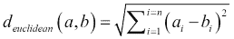

我们可以使用 R 的内置`dist()`函数来计算评分矩阵中的所有成对距离，如下所示：

```py
>dist(ratingMatrix, method = 'euclidean')
oliverthibaultmariapedroines
thibault 12.529964                                        
maria     8.000000 11.000000                              
pedro    10.723805  9.899495 10.246951                    
ines      3.316625 11.224972  6.082763 10.583005          
gertrude 10.488088 10.344080  8.717798  8.062258 10.440307
```

结果是一个下三角矩阵，因为欧几里得距离是一个对称函数。因此，(`maria`, `pedro`)的条目与(`pedro`, `maria`)的条目完全相同，所以我们只需要显示其中一个。在这里，我们可以清楚地看到 Ines 和 Oliver 是两个最相似的用户，因为他们之间的距离是最小的。请注意，我们也可以根据从不同用户那里收到的评分相似性来谈论项目之间的距离。为了计算这一点，我们只需要转置评分矩阵：

```py
>dist(t(ratingMatrix), method = 'euclidean')
                Berny's La Traviata El Pollo Loco Joey's Pizza
La Traviata    8.366600                                       
El Pollo Loco  6.708204    5.744563                           
Joey's Pizza   9.643651    9.949874      7.745967             
The Old West  13.038405   12.247449     10.535654     7.810250
Jake and Jill 12.000000   11.575837     12.449900     9.848858
Full Moon     12.369317   10.246951      8.717798     9.486833
Acropolis     14.212670    8.831761     10.723805    11.789826
              The Old West Jake and Jill Full Moon
La Traviata
El Pollo Loco                                     
Joey's Pizza                                      
The Old West                                      
Jake and Jill     8.246211                        
Full Moon         8.062258      9.110434          
Acropolis         8.831761      9.273618  7.549834
```

如我们所见，两个最不相似的餐厅（即它们之间差异最大的餐厅）是*Acropolis*和*Berny's*。回顾评分矩阵，我们应该很容易看出为什么是这样。前者在我们的用户基础中收到了大量正面评价，而后者则收到了较差的评价。

欧几里得距离（或称为 L2 范数）的一个常用替代方法是**余弦距离**。这个度量衡量的是两个向量之间最小角度的余弦值。如果两个向量相互平行，即它们的夹角为 0，那么余弦距离也是 0。如果两个向量相互垂直，那么根据这个度量，它们之间的距离最大。余弦距离由以下公式给出：

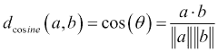

在这里，分子是两个向量的点积，分母是两个向量模长的乘积（通常通过 L2 范数计算）。余弦距离在 R 的基础分布的`dist()`函数中不是一个可用方法，但我们可以安装`proxy`包，它通过添加一些新的距离度量来增强这个函数，以便计算我们的评分矩阵的余弦距离：

```py
> library("proxy")
>dist(ratingMatrix, method = 'cosine')
oliverthibaultmariapedroines
thibault 0.28387670                                            
maria    0.12450495 0.23879093                                 
pedro    0.20947046 0.17687385 0.20854178                      
ines     0.02010805 0.22821528 0.06911870 0.20437426           
gertrude 0.22600742 0.21481973 0.19156876 0.12227138 0.22459114
```

假设我们的用户对餐厅的评分是二进制的。我们可以通过将所有高于 5 的评分视为正面，并赋予它们新的分数 1，将我们的评分矩阵转换为二进制评分矩阵。其余的评分都转换为分数 0。对于两个二进制向量，**Jaccard 相似度**由逻辑交集的基数除以逻辑并集的基数给出。Jaccard 距离则是这个值的 1 减去：

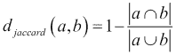

简而言之，这计算的是两个向量在位置上都有正面评分的数量与两个向量中任意一个有正面评分的总位置数量的比率之差。两个在所有正面位置上达成一致的二进制向量将是相同的，因此距离为 0。使用`proxy`包，我们可以如下显示我们的餐厅顾客的`Jaccard`距离：

```py
>binaryRatingMatrix<- ratingMatrix> 5
>dist(binaryRatingMatrix, method = 'jaccard')
oliverthibaultmariapedroines
thibault 0.6000000                                        
maria    0.2500000 0.5000000                              
pedro    0.5000000 0.6666667 0.6666667                    
ines     0.0000000 0.6000000 0.2500000 0.5000000          
gertrude 1.0000000 0.7500000 1.0000000 0.8333333 1.0000000
```

### 注意

测量和距离度量的研究范围很广，有许多适合的度量已经应用于推荐系统设置。距离度量的权威参考是*《距离度量百科全书》*，*米歇尔·玛丽·德扎和伊莲娜·德扎*，*斯普林格*。

# 协同过滤

在覆盖了距离之后，我们准备深入探讨**协同过滤**这一主题，这将帮助我们定义一个制定推荐策略的方法。协同过滤描述了一种算法，或者更确切地说，是一系列算法，旨在根据其他用户的评分信息（通过评分矩阵）以及测试用户已经做出的任何评分，为测试用户创建推荐。协同过滤旨在根据其他用户的评分信息（通过评分矩阵）以及测试用户已经做出的任何评分，为测试用户创建推荐。

协同过滤有两种非常常见的变体，**基于记忆的协同过滤**和**基于模型的协同过滤**。在基于记忆的协同过滤中，所有用户所有评分的历史都被记住，并且必须处理这些评分以做出推荐。典型的基于记忆的协同过滤方法是**基于用户的协同过滤**。尽管这种方法使用了所有可用的评分，但缺点是它可能计算成本高昂，因为整个数据库都用于为我们的测试用户做出评分预测。

与此相反的方法是模型基础的协同过滤。在这里，我们首先创建一个模型来模拟用户的评分偏好，例如一组喜欢相似物品的用户集群，然后使用该模型生成推荐。我们将研究**基于物品的协同过滤**，这是最著名的模型基础协同过滤方法。

## 基于用户的协同过滤

基于用户的协同过滤通常被描述为基于记忆或懒惰学习的方法。与本书中我们构建的大多数模型不同，这些模型假设我们将数据拟合到特定的模型，然后使用该模型进行预测，而懒惰学习只是直接使用训练数据本身进行预测。我们在第一章中看到了懒惰学习的例子，即使用 k 近邻算法，在“为预测建模做准备”中。实际上，基于用户的协同过滤方法的前提直接建立在 k 近邻方法之上。

然而，在基于用户的协同过滤中，当我们想要为新用户做出推荐时，我们首先会使用特定的距离度量选择一组相似用户。然后，我们试图推断目标用户将分配给尚未评分的物品的评分，作为相似用户对这些物品评分的平均值。我们通常将这组相似用户称为用户的**邻域**。因此，这种想法是，用户将更喜欢他们的邻域所偏好的物品。

通常，有两种定义用户邻域的方法。我们可以通过找到 k 近邻来计算一个固定的邻域。这些是我们数据库中与目标用户距离最小的 k 个用户。

或者，我们可以指定一个相似性阈值，并选择数据库中与目标用户距离不超过此阈值的所有用户。这种第二种方法的优势在于，我们将通过使用尽可能接近目标用户的用户来进行推荐，因此我们可以对我们的推荐有很高的信心。另一方面，可能只有很少的用户满足我们的要求，这意味着我们将依赖于这些少数用户的推荐。更糟糕的是，可能没有足够相似于目标用户的用户在我们的数据库中，我们可能根本无法做出任何推荐。如果我们不介意我们的方法有时无法做出推荐，例如因为我们有备用计划来处理这些情况，那么第二种方法可能是一个不错的选择。

在现实世界的场景中，另一个重要的考虑因素是稀疏评分问题。在我们的简单餐厅示例中，每个用户都对每家餐厅进行了评分。这种情况在现实中很少发生，甚至几乎不会发生，因为通常物品的数量太多，以至于用户无法对它们全部进行评分。如果我们以亚马逊.com 等电子商务网站为例，例如，很容易想象任何用户已评分的产品数量仍然是销售产品总数的极小部分。

为了计算用户之间的距离度量以确定相似性，我们通常只包含两个用户都评分的项目。因此，在实践中，我们经常在更少的维度上对用户进行比较。

一旦我们确定了距离度量标准以及如何形成与我们的测试用户相似的用户邻域，我们就使用这个邻域来计算测试用户的缺失评分。这样做最简单的方法是计算用户邻域中每个项目的平均评分，并报告这个值。因此，对于测试用户 *t* 和一个测试用户尚未评分的项目 *j*，我们可以预测测试用户对该项目的评分，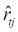，如下所示：

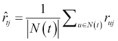

这个方程表达了这样一个简单想法：我们的测试用户 *t* 对项目 *j* 的预测评分只是测试用户邻域对该项目的评分的平均值。假设我们有一个新的餐厅场景用户，并且这个用户已经对几家餐厅进行了评分。然后，想象一下，从这些评分中，我们发现新用户的邻域包括 Oliver 和 Thibault。如果我们想要预测测试用户对餐厅*El Pollo Loco*的评分，这将是通过平均 Oliver 和 Thibault 对该餐厅的评分来完成的，在这种情况下，这将是对 2 和 4 的平均值，得到评分为 3。

如果我们的目标是获取用户的前 N 个推荐列表，我们将对数据库中的所有项目重复此过程，按降序排列，以便评分最高的项目排在最前面，然后从这个列表中挑选出前 N 个项目。在实践中，我们只需要检查新用户邻域中至少有一个用户评价过的项目，以简化这个计算。

我们可以对这种非常简单的方法进行一些改进。首先可能的改进来自于观察，一些用户可能会比其他用户更严格或更宽松地持续评价项目，我们希望平滑这种变化。在实践中，我们经常使用*Z*分数标准化，它考虑了评分的方差。我们还可以通过减去用户对所有项目的平均评分来对用户的每个评分进行中心化。在评分矩阵中，这意味着从每一行的元素中减去该行的平均值。让我们将这个最后的转换应用到我们的餐厅评分矩阵上，看看结果如何：

```py
>centered_rm<- t(apply(ratingMatrix, 1, function(x) x - mean(x)))
>centered_rm
         Berny's La Traviata El Pollo Loco Joey's Pizza
oliver     -4.00       -4.00         -3.00          0.0
thibault   -0.12        3.88         -1.12         -4.1
maria      -3.50       -0.50         -2.50          0.5
pedro      -3.12        0.88          1.88         -3.1
ines       -4.12       -2.12         -3.12         -1.1
gertrude   -3.25        1.75          0.75          2.8
         The Old West Jake and Jill Full Moon Acropolis
oliver           2.00           3.0      4.00      2.00
thibault        -4.12           1.9     -0.12      3.88
maria            3.50           1.5     -2.50      3.50
pedro            0.88          -4.1      2.88      3.88
ines             2.88           3.9      1.88      1.88
gertrude        -1.25          -2.2      0.75      0.75
```

尽管 Ines 和 Gertrude 最初都给`Berny's`评了相同的 1 分，但中心化操作使得 Ines 给这家餐厅的评分低于 Gertrude。这是因为 Ines 的平均评分通常高于 Gertrude，因此 Ines 的 1 分可以解释为比 Gertrude 的更强的负面评分。

另一个改进的领域涉及我们如何将新用户邻域的评分纳入以创建最终的评分。通过将所有相邻用户的评分视为相等，我们忽略了这样一个事实，即我们的距离度量可能表明新用户邻域中的某些用户比其他用户更相似。

正如我们在 Jaccard 相似性和 Jaccard 距离的例子中已经看到的，我们通常可以通过以某种方式反转距离度量来定义一个相似度度量。例如，从 1 中减去或取倒数。因此，对于我们选择的距离度量，我们可以定义其相应的相似度度量，并用*sim(u,t)*表示。用户相似度度量对相似用户具有高值，这些用户在距离度量中具有低值。

在明确了这一点之后，我们可以通过取新用户邻域中相邻用户的评分的加权平均来将用户 u 和 t 之间的相似性纳入我们之前的方程中，如下所示：

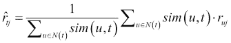

我们可能希望在用户评分中包含权重的原因还包括信任度。例如，我们可能更信任那些长期使用我们的餐厅推荐服务的用户，而不是新用户。同样，我们也可能想要考虑用户与新用户共同评价的物品总数。例如，如果一个用户只与一个新用户共同评价了两件物品，那么即使相应的评分是相同的，这两个用户确实非常相似的证据也是有限的。

总的来说，基于用户的协同过滤最大的困难在于，为测试用户做出推荐需要访问整个用户数据库，以便确定用户邻域。这是通过在测试用户和每个其他用户之间执行相似性计算来完成的，这是一个计算上昂贵的步骤。接下来，我们将探讨基于物品的协同过滤，它试图改善这种情况。

## 基于物品的协同过滤

基于物品的协同过滤是一种基于模型的协同过滤方法。这种方法的核心思想是，我们不会像对待测试用户那样查看其他相似用户，而是直接推荐那些与测试用户评价高的物品相似的物品。由于我们是直接比较物品，而不是首先比较用户来推荐物品，因此我们可以建立一个模型来描述物品之间的相似性，然后使用该模型而不是整个数据库来做出推荐。

建立基于物品的相似性模型的过程包括计算数据库中所有物品对之间的相似性矩阵。如果我们有 *N* 件物品，那么我们将得到一个包含 *N²* 个元素的相似性矩阵。为了减少模型的大小，我们可以存储数据库中每个物品的前 *k* 个最相似物品的相似性值列表。

由于 *k* 将远小于 *N*，我们将大大减少我们需要为模型保留的数据量。对于数据库中的每个物品，这个包含 *k* 个最相似物品的列表类似于基于用户的协同过滤方法中的用户邻域。关于在基于用户的协同过滤中对用户评分的偏差和方差进行归一化的讨论也适用于此处。也就是说，我们可以在归一化评分矩阵后计算物品到物品的相似性。

这种方法并非没有缺点。在基于内存的推荐系统中，由于该方法使用整个数据库（评分矩阵），新的用户评分可以自动纳入推荐过程。基于模型的协同过滤要求我们定期重新训练模型以纳入这些新评分的信息。此外，建模过程丢弃原始评分矩阵中的一些信息，这意味着它有时会做出非最优的推荐。

尽管存在这些缺点，基于物品的协同过滤在空间和时间性能上的表现意味着它在许多现实世界的场景中得到了非常成功的应用。模型的重训练可以在离线状态下进行，并且可以自动安排，而且推荐的非最优性通常是可以容忍的。

我们可以设计一个类似于用户基于协同过滤的方程，解释如何使用基于物品的协同过滤模型来预测新的评分。假设我们想要估计我们的测试用户*t*对物品*I*的评分。假设我们已选择了一对物品*i*和*j*之间的相似度函数*sim(i,j)*，并据此构建了我们的模型。使用该模型，我们可以检索到我们感兴趣的物品的存储物品邻域*S(i)*。为了计算我们的测试用户对这一物品的预测评分，我们计算用户对与其相似的物品所做评分的加权总和：

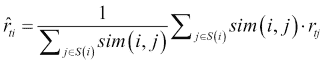

当用户没有对与问题项类似的任何项进行评分时，这种方法可能不会奏效，但它不需要找到与测试用户有相似偏好的用户。

# 奇异值分解

在现实世界的推荐系统中，随着更多用户被添加到系统中以及提供的物品列表的增长，评分矩阵最终会变得非常大。因此，我们可能希望对此矩阵应用一种降维技术。理想情况下，我们希望在降维的同时尽可能保留原始矩阵中的信息。这种方法在许多学科领域都有应用，它就是**奇异值分解**，或简称**SVD**。

SVD 是一种矩阵分解技术，具有许多有用的应用，其中之一就是降维。它与我们在第一章中看到的降维方法 PCA 有关，*为预测建模做准备*，许多人混淆了这两个概念。实际上，SVD 只是描述了分解矩阵的数学方法。事实上，一些 PCA 的实现使用 SVD 来计算主成分。

让我们先看看这个过程是如何工作的。奇异值分解是一个矩阵分解过程，所以我们从一个代表我们数据的原始矩阵开始，并将其表示为矩阵的乘积。在降维场景中，我们的输入数据矩阵将是行代表数据点、列代表特征的矩阵；因此，在 R 中，这只是一个数据框。在我们的推荐系统场景中，我们使用的矩阵是我们的评分矩阵。假设我们称我们的评分矩阵为 *D*，并且我们有 *m* 个用户（行）对 *n* 个物品（列）进行评分。这个矩阵的奇异值分解由以下公式给出：

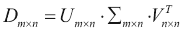

在前一个方程中，*U* 和 *V* 是方阵，而矩阵 *Σ* 是与我们的输入矩阵 *D* 具有相同维度的矩阵。此外，它是一个对角矩阵，这意味着矩阵的所有元素都是零，除了主对角线上的元素。这些元素通常按从大到小的顺序排列，被称为矩阵 *D* 的**奇异值**，从而产生了奇异值分解的名称。

### 注意

熟悉线性代数的读者会知道，矩阵的特征值通常也描述为包含有关该矩阵重要维度的信息。实际上，矩阵的特征值与奇异值通过以下关系相关联——矩阵 *D* 的奇异值等于矩阵乘积 *D* × *D^T* 的特征值的平方根。

我们可以通过 R 的 `svd()` 函数轻松地对矩阵进行奇异值分解，该函数是 R 的 `base` 包的一部分。让我们用我们现有的 `ratingMatrix` 来看看这个例子：

```py
> options(digits = 2)
> (rm_svd<- svd(ratingMatrix))
$d
[1] 35.6 10.6  7.5  5.7  4.7  1.3
$u
      [,1]  [,2]   [,3]   [,4]   [,5]   [,6]
[1,] -0.44  0.48 -0.043 -0.401  0.315  0.564
[2,] -0.41 -0.56  0.703 -0.061  0.114  0.099
[3,] -0.38  0.24  0.062  0.689 -0.494  0.273
[4,] -0.43 -0.40 -0.521 -0.387 -0.483 -0.033
[5,] -0.44  0.42  0.170 -0.108 -0.003 -0.764
[6,] -0.33 -0.26 -0.447  0.447  0.641 -0.114
$v
      [,1]   [,2]  [,3]    [,4]   [,5]   [,6]
[1,] -0.13 -0.255  0.30 -0.0790  0.013  0.301
[2,] -0.33 -0.591  0.16  0.3234  0.065 -0.486
[3,] -0.25 -0.382 -0.36 -0.0625 -0.017 -0.200
[4,] -0.27  0.199 -0.36  0.5796  0.578  0.284
[5,] -0.38  0.460 -0.30  0.1412 -0.556 -0.325
[6,] -0.39  0.401  0.68  0.0073  0.239 -0.226
[7,] -0.42  0.044 -0.26 -0.7270  0.369 -0.047
[8,] -0.52 -0.161  0.11  0.0279 -0.398  0.628
```

奇异值以向量 `d` 返回，我们可以使用 `diag()` 函数轻松地构造对角矩阵。为了验证这个因子分解确实是我们预期的，我们可以通过简单地乘以我们获得的矩阵因子来重建我们的原始评分矩阵：

```py
>reconstructed_rm<- rm_svd$u %*% diag(rm_svd$d) %*% t(rm_svd$v)
>reconstructed_rm
     [,1] [,2] [,3] [,4] [,5] [,6] [,7] [,8]
[1,]    1    1    2    5    7    8    9    7
[2,]    5    9    4    1    1    7    5    9
[3,]    1    4    2    5    8    6    2    8
[4,]    2    6    7    2    6    1    8    9
[5,]    1    3    2    4    8    9    7    7
[6,]    1    6    5    7    3    2    5    5
```

这里需要注意的一点是，如果我们尝试直接用原始矩阵进行等式检查，我们很可能会失败。这是由于我们在存储因子矩阵时引入的舍入误差造成的。我们可以使用 `all.equal()` 函数来检查我们的两个矩阵几乎相等：

```py
>all.equal(ratingMatrix, reconstructed_rm, tolerance = 0.000001,
check.attributes = F)
[1] TRUE
```

鼓励读者减小容差的大小，并注意，在几个小数点之后，等式检查会失败。尽管两个矩阵并不完全相等，但差异非常小，这不会对我们产生任何重大影响。现在，一旦我们有了这个因子分解，让我们来研究我们的奇异值。35.6 的第一个奇异值远大于 1.3 的最小奇异值。

我们可以通过保留最大的奇异值并丢弃其余的值来执行降维。为了做到这一点，我们需要知道应该保留多少个奇异值以及应该丢弃多少个。解决这个问题的一个方法是通过计算奇异值的平方，这可以被视为**矩阵能量**的向量，然后选择至少保留原始矩阵 90%总能量的前几个奇异值。在 R 中这样做很容易，因为我们可以使用`cumsum()`函数来创建累积和，而奇异值已经按照从大到小的顺序排列：

```py
> energy <- rm_svd$d ^ 2
>cumsum(energy) / sum(energy)
[1] 0.85 0.92 0.96 0.98 1.00 1.00
```

保留前两个奇异值将保留我们原始矩阵 92%的能量。仅使用两个值，我们可以重建我们的评分矩阵并观察差异：

```py
>d92<- c(rm_svd$d[1:2], rep(0, length(rm_svd$d) - 2))
>reconstructed92_rm<- rm_svd$u %*% diag(d92) %*% t(rm_svd$v)
>reconstructed92_rm
     [,1] [,2] [,3] [,4] [,5] [,6] [,7] [,8]
[1,] 0.68  2.0  1.9  5.1  8.3  8.0  6.7  7.2
[2,] 3.37  8.3  5.9  2.7  2.9  3.3  5.9  8.6
[3,] 1.10  3.0  2.4  4.1  6.4  6.3  5.9  6.7
[4,] 3.02  7.5  5.4  3.2  3.9  4.2  6.2  8.6
[5,] 0.87  2.5  2.2  5.1  8.1  7.9  6.8  7.5
[6,] 2.20  5.5  4.0  2.6  3.3  3.5  4.9  6.6
```

如我们所见，绝对值上有一些差异，但大多数不同用户的模式都得到了很大程度的保留。丢弃奇异值有效地在矩阵*D*的领先对角线上引入了零，因此这个矩阵最终只有包含零的整个行和列。因此，我们不仅可以截断这个矩阵，还可以截断矩阵*U*和*V*的行。

因此，我们减少了需要存储的数据的大小。

# 预测电影和笑话的推荐

在本章中，我们将专注于使用两个不同的数据集来构建推荐系统。为此，我们将使用`recommenderlab`包。这个包不仅提供了执行推荐的算法，还提供了存储稀疏评分矩阵的高效数据结构。我们将使用的第一个数据集包含了来自*Jester Online Joke 推荐系统*的匿名用户对笑话的评论。

笑话评分落在连续的量表上（-10 到+10）。可以从[`eigentaste.berkeley.edu/dataset/`](http://eigentaste.berkeley.edu/dataset/)找到来自 Jester 系统的多个数据集。我们将使用网站上标记为*Dataset 2+*的数据集。这个数据集包含了 50,692 个用户对 150 个笑话的评分。与现实世界的应用典型情况一样，评分矩阵非常稀疏，因为每个用户只对部分笑话进行了评分；用户做出的最低评分数量是 8。我们将把这个数据集称为 jester 数据集。

第二个数据集可以在[`grouplens.org/datasets/movielens/`](http://grouplens.org/datasets/movielens/)找到。这个网站包含了在[`movielens.org`](http://movielens.org)的*MovieLens*网站上制作的用户对电影的评分数据。同样，网站上不止一个数据集；我们将使用标记为*MovieLens1M*的数据集。这个数据集包含了 6,040 个用户对 3,706 部电影在五点量表（1-5）上的评分。每个用户对电影的最低评分数量是 20。我们将把这个数据集称为电影数据集。

### 小贴士

这两个数据集实际上是众所周知的开源数据集，以至于 `recommenderlab` 包本身将它们的小版本包含在包中。对于那些想跳过加载数据和预处理过程，或者由于计算限制而想在小数据集上运行后续示例的读者，我们鼓励他们尝试使用 `data(Jester5k)` 或 `data(MovieLense)`。

# 加载数据和预处理

在构建我们的推荐系统时，我们的第一个目标是使用 R 加载数据，对其进行预处理，并将其转换为评分矩阵。更确切地说，在每种情况下，我们将创建一个 `realRatingMatrix` 对象，这是 `recommenderlab` 包用于存储数值评分的特定数据结构。我们将从 jester 数据集开始。如果我们从网站上下载并解压存档，我们会看到文件 `jesterfinal151cols.csv` 包含评分。更具体地说，该文件中的每一行对应于特定用户做出的评分，每一列对应于一个特定的笑话。

列之间用逗号分隔，没有标题行。实际上，格式几乎已经是一个评分矩阵，如果不是因为第一列是一个特殊的列，它包含特定用户做出的总评分数。我们将使用函数 `fread()` 将此数据加载到数据表中，这是一个 `read.table()` 的快速实现，并有效地将数据文件加载到数据表中。然后，我们将使用 `data.table` 语法高效地删除第一列：

```py
> library(data.table)
> jester <- fread("jesterfinal151cols.csv", sep = ",", header = F)
> jester[, V1 := NULL]
```

最后一行使用了赋值运算符 `:=` 将第一列 `V1` 设置为 `NULL`，这就是我们在数据表上删除列的方法。在我们准备好将数据表 `jester` 转换为 `realRatingMatrix` 对象之前，我们还需要在数据表上执行一个最后的预处理步骤。具体来说，我们将将其转换为矩阵，并将所有评分为 99 的实例替换为 `NA`，因为 99 是用于表示缺失值的特殊评分：

```py
>jester_m<- as.matrix(jester) 
>jester_m<- ifelse(jester_m == 99, NA, jester_m)
> library(recommenderlab)
>jester_rrm<- as(jester_m, "realRatingMatrix")
```

根据我们可用的计算机的计算资源（尤其是可用内存），我们可能想要尝试一次性处理整个数据集，而不是同时加载两个数据集。在这里，我们选择并行处理这两个数据集，以便展示分析的主要步骤，并突出显示单个数据集相对于特定步骤的差异或特殊性。

让我们继续到 MovieLens 数据。下载 MovieLens1M 存档并解压后，会显示三个主要数据文件。`users.dat` 文件包含有关用户的信息，例如年龄和性别。`movies.dat` 数据文件反过来包含有关被评分的电影的信息，即电影的标题和属于（例如，*喜剧*）的电影类型列表。

我们主要关注`ratings.dat`文件，其中包含评分本身。与原始的 Jester 数据不同，这里每一行对应一个用户做出的单个评分。行格式包含用户 ID、电影 ID、评分和时间戳，所有这些信息都由两个冒号字符`::`分隔。不幸的是，`fread()`需要一个单字符分隔符，因此我们将指定一个单冒号。原始数据中的双冒号分隔符会导致我们创建包含`NA`值的额外列，以及包含时间戳的最后一列，这些列我们都需要删除：

```py
> movies <- fread("ratings.dat", sep = ":", header = F)
> movies[, c("V2", "V4", "V6", "V7") := NULL]
> head(movies)
V1V3V5
1:  1 1193  5
2:  1  661  3
3:  1  914  3
4:  1 3408  4
5:  1 2355  5
6:  1 1197  3
```

如我们所见，我们现在剩下三列，其中第一列是`UserID`，第二列是`MovieID`，最后一列是评分。我们现在将聚合用户做出的所有评分，以形成一个可以解释为或转换为评分矩阵的对象。我们应该以最小化内存使用的方式聚合数据。我们将通过使用`Matrix`包中的`sparseMatrix()`命令构建稀疏矩阵来实现这一点。

当我们使用`recommenderlab`包时，该包会自动加载，因为它是其依赖之一。要使用此函数构建稀疏矩阵，我们可以简单地指定一个行坐标向量、一个匹配的列坐标向量和填充稀疏矩阵的非零值向量。记住，由于我们的矩阵是稀疏的，我们只需要非零条目的位置和值。

目前，我们无法直接将用户 ID 和电影 ID 解释为坐标，这有些不方便。这是因为，如果我们有一个用户 ID 为 1 的用户和一个用户 ID 为 3 的用户，R 会自动创建一个用户 ID 为 2 的用户并创建一个空行，尽管这个用户实际上并不存在于训练数据中。列的情况也类似。因此，在创建我们的评分矩阵之前，我们必须首先将`UserID`和`MovieID`列转换为因子。以下是构建 MovieLens 数据评分矩阵的代码：

```py
>userid_factor<- as.factor(movies[, V1])
>movieid_factor<- as.factor(movies[, V3])
>movies_sm<- sparseMatrix(i = as.numeric(userid_factor), j = 
as.numeric(movieid_factor), x = as.numeric(movies[,V5]))
>movies_rrm<- new("realRatingMatrix", data = movies_sm)
>colnames(movies_rrm) <- levels(movieid_factor)
>rownames(movies_rrm) <- levels(userid_factor)
> dim(movies_rrm)
[1] 6040 3706
```

检查结果的维度是否与我们对用户和电影数量的预期相符是一个很好的练习。

# 探索数据

在使用我们已加载的两个数据集构建和评估推荐系统之前，了解数据是很重要的。一方面，我们可以使用`getRatings()`函数从评分矩阵中检索评分，这有助于构建项目评分的直方图。此外，我们还可以根据我们之前讨论的，对每个用户的评分进行归一化。以下代码片段显示了如何计算 Jester 数据的评分和归一化评分。然后我们可以对 MovieLens 数据进行同样的操作，并生成评分的直方图：

```py
>jester_ratings<- getRatings(jester_rrm)
>jester_normalized_ratings<- getRatings(normalize(jester_rrm, 
                                          method = "Z-score"))
```

以下图表显示了不同的直方图：

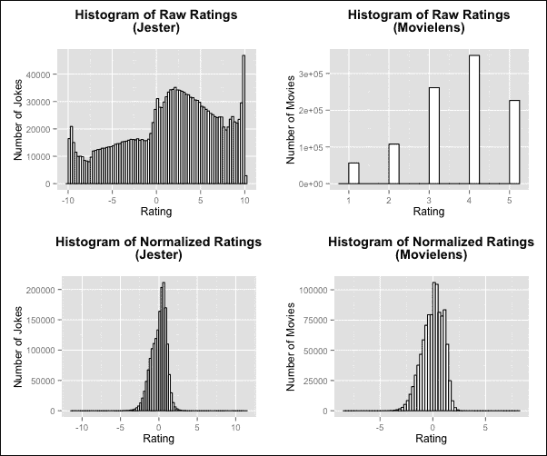

在 Jester 数据中，我们可以看到零以上的评分比零以下的评分更为突出，最常见的评分是 10，即最大评分。归一化评分创建了一个以零为中心的更对称的分布。对于具有 5 点评分尺度的 MovieLens 数据，4 是最突出的评分，而高于 4 的评分比低于 4 的评分更为常见。

我们还可以通过查看评分矩阵的行数和列均值来查找每个用户评分的项目数量和每个项目的平均评分。同样，以下代码片段展示了如何计算 jester 数据中的这些值，并且我们随后用直方图展示了两个数据集的结果：

```py
>jester_items_rated_per_user<- rowCounts(jester_rrm)
>jester_average_item_rating_per_item<- colMeans(jester_rrm)
```

这里展示了 Jester 和 MovieLens 数据的直方图：

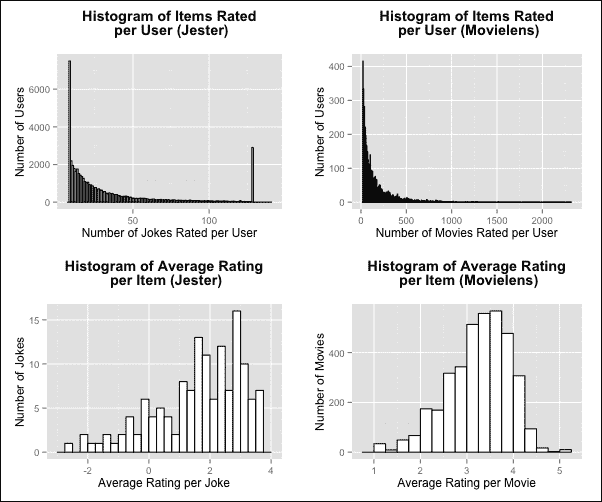

两个数据集在用户平均评分中显示出的曲线看起来像幂曲线。大多数用户评分的项目很少，但少数非常投入的用户实际上评分了大量的项目。在 Jester 案例中，有些人评了数据集中最多的笑话。这是一个例外，并且只发生在这个数据集中项目（笑话）的数量相对较小的情况下。平均笑话评分的分布介于-3 和 4 之间，但对于电影，我们看到整个光谱的范围，这表明一些用户已经对他们认为完全糟糕或完全出色的电影进行了评分。我们可以找到这些分布的平均值，以确定每个用户平均评分的项目数量和每个项目的平均评分。

注意，我们需要从 Jester 数据集中移除`NA`值，因为某些列可能没有评分：

```py
> (jester_avg_items_rated_per_user<- mean(rowCounts(jester_rrm)))
[1] 34.10493
> (jester_avg_item_rating<- mean(colMeans(jester_rrm), na.rm = T))
[1] 1.633048
> (movies_avg_items_rated_per_user<- mean(rowCounts(movies_rrm)))
[1] 165.5975
> (movies_avg_item_rating<- mean(colMeans(movies_rrm)))
[1] 3.238892 
```

## 评估二元前 N 个推荐

现在我们对两个数据集的数据有了大致的了解，可以开始构建一些模型。我们将从研究为二元推荐系统制作前 N 个推荐的问题开始，这比我们有更细粒度的评分数据时更容易实现。回想一下，前 N 个推荐只不过是一个列表，其中包含*N*个更有可能引起用户兴趣的推荐。为此，我们将使用 jester 数据集并创建我们评分矩阵的二元版本。我们将任何评分在 5 或以上的评分视为正面评分。由于这可能导致一些用户没有正面评分，我们将修剪评分矩阵，并只保留至少有 10 个正面评分的用户：

```py
>jester_bn<- binarize(jester_rrm, minRating = 5)
>jester_bn<- jester_bn[rowCounts(jester_bn) > 1]
> dim(jester_bn)
[1] 13789   150
```

`recommenderlab` 包的一个优点是它使我们能够很容易地比较几个算法的结果。为 top-N 推荐训练和评估多个算法的过程是从创建一个包含我们想要使用的算法定义的列表开始的。列表中的每个元素都给出了我们选择的名称，但本身必须是一个包含配置已知算法参数的集合的列表。具体来说，这个内部参数列表的 `name` 参数必须是 `recommenderlab` 包所认可的。使用此包可以创建并注册自己的算法，但我们的重点将放在现有的实现上，这些实现对于我们的意图和目的已经足够：

```py
> algorithms <- list(
"Random" = list(name = "RANDOM", param = NULL),
"Popular" = list(name = "POPULAR", param = NULL),
"UserBasedCF_COS" = list(name = "UBCF", 
param = list(method = "Cosine", nn = 50)),
"UserBasedCF_JAC" = list(name = "UBCF", 
param = list(method = "Jaccard", nn = 50))
 )
```

随机算法是一个基线算法，它随机做出推荐。流行算法是另一个基线算法，有时很难击败。它按全球流行度降序提出项目，因此对于 top-1 推荐，它将推荐数据集中平均评分最高的项目。我们选择尝试两种基于用户的协同过滤变体。第一个使用余弦距离，并指定 50 个最近邻的数量。第二个与第一个相同，但使用 Jaccard 距离。

接下来，我们通过函数 `evaluationScheme()` 定义一个评估方案。此函数记录我们将如何将数据分为训练集和测试集，我们将通过 `given` 参数从测试用户那里接受的评分数量，以及我们想要执行多少次运行。我们将对训练集和测试集进行直接的 80-20 分割，将测试用户的 10 个评分视为已知评分，并在单次运行中进行评估：

```py
>jester_split_scheme<- evaluationScheme(jester_bn, method = 
"split", train = 0.8, given = 10, k = 1)
```

注意，`given` 参数必须至少与我们的数据集中用户评分的最小数量相同。我们之前已过滤数据集以确保每个用户有 10 个项目，所以在这个案例中我们已经覆盖了。最后，我们将使用 `evaluate()` 函数依次用我们的评估方案评估我们的算法列表。除了评估方案和算法列表之外，我们还将指定在通过 `n` 参数进行 top-N 推荐时使用的 *N* 值的范围。我们将对 1 到 20 的值进行此操作：

```py
>jester_split_eval<- evaluate(jester_split_scheme, algorithms, 
                                n = 1 : 20)
RANDOM run 
  1  [0.015sec/1.87sec] 
POPULAR run 
  1  [0.006sec/12.631sec] 
UBCF run 
  1  [0.001sec/36.862sec] 
UBCF run 
  1  [0.002sec/36.342sec]
```

现在我们有一个列表，其中包含代表每个算法在我们数据上的评估结果的四个对象。我们可以通过查看混淆矩阵来获取重要度量，如精确度。请注意，由于我们已经为 top-N 推荐运行了此实验，其中 *N* 在 1-20 的范围内，我们预计每个算法将有 20 个这样的混淆矩阵。

当将函数 `getConfusionMatrix()` 应用到这些对象之一时，可以用来检索折叠的混淆矩阵，以便每行代表 *N* 的特定值的混淆矩阵：

```py
> options(digits = 4)
>getConfusionMatrix(jester_split_eval[[4]])
[[1]]
TP      FP    FN    TN precision  recall     TPRFPR
1  0.5181  0.4819 18.47 120.5    0.5181 0.06272 0.06272 0.003867
2  1.0261  0.9739 17.96 120.0    0.5131 0.12042 0.12042 0.007790
3  1.4953  1.5047 17.49 119.5    0.4984 0.16470 0.16470 0.012011
4  1.9307  2.0693 17.06 118.9    0.4827 0.20616 0.20616 0.016547
5  2.3575  2.6425 16.63 118.4    0.4715 0.24215 0.24215 0.021118
6  2.7687  3.2313 16.22 117.8    0.4614 0.27509 0.27509 0.025791
7  3.1530  3.8470 15.83 117.2    0.4504 0.30508 0.30508 0.030709
8  3.5221  4.4779 15.46 116.5    0.4403 0.33216 0.33216 0.035735
9  3.8999  5.1001 15.09 115.9    0.4333 0.36069 0.36069 0.040723
10 4.2542  5.7458 14.73 115.3    0.4254 0.38723 0.38723 0.045890
11 4.6037  6.3963 14.38 114.6    0.4185 0.40927 0.40927 0.051036
12 4.9409  7.0591 14.04 114.0    0.4117 0.43368 0.43368 0.056345
13 5.2534  7.7466 13.73 113.3    0.4041 0.45345 0.45345 0.061856
14 5.5638  8.4362 13.42 112.6    0.3974 0.47248 0.47248 0.067360
15 5.8499  9.1501 13.14 111.9    0.3900 0.48907 0.48907 0.073066
16 6.1298  9.8702 12.86 111.1    0.3831 0.50604 0.50604 0.078836
17 6.4090 10.5910 12.58 110.4    0.3770 0.52151 0.52151 0.084592
18 6.6835 11.3165 12.30 109.7    0.3713 0.53664 0.53664 0.090384
19 6.9565 12.0435 12.03 109.0    0.3661 0.55187 0.55187 0.096198
20 7.2165 12.7835 11.77 108.2    0.3608 0.56594 0.56594 0.102095
```

为了可视化这些数据并比较我们的算法，我们可以尝试直接使用`plot()`函数绘制结果。对于我们的评估结果，默认是绘制**真正例率**（**TPR**）与**假正例率**（**FPR**）的曲线。正如我们从第四章，*神经网络*中了解的那样，这只是一个 ROC 曲线。

```py
> plot(jester_split_eval, annotate = 2, legend = "topright")
> title(main = "TPR vs FPR For Binary Jester Data")
```

这是二值 Jester 数据的 ROC 曲线：

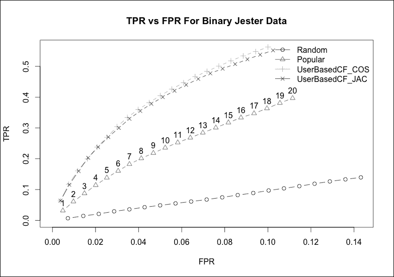

图表显示，基于用户的协同过滤算法比两个基线算法表现更好，但这两者之间几乎没有区别，余弦距离略优于 Jaccard 距离。我们可以通过绘制精确度-召回率曲线来补充我们对结果的观点：

```py
> plot(jester_split_eval, "prec/rec", annotate = 2, 
       legend = "bottomright")
> title(main = "Precision versus Recall Binary Jester Data")
```

下图是二值 Jester 数据的精确度-召回率曲线：

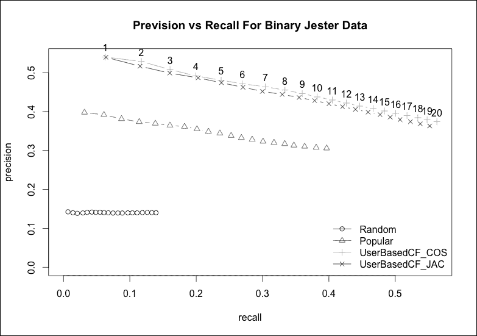

精确度-召回率曲线描绘了类似的画面，使用余弦距离的基于用户的协同过滤算法成为赢家。请注意，在 top-N 推荐系统中，精确度和召回率之间的权衡通过系统做出的推荐数量体现出来。我们的评估方案的工作方式是，我们将测试数据中的用户视为系统中刚刚贡献了一定数量评分的新用户。我们保留与`given`参数允许的评分数量一样多的评分。然后，我们应用我们的模型来查看我们建议的评分是否会与剩余的评分一致。我们按信心度降序排列建议，以便在 top-1 推荐系统中，我们将建议我们认为最有可能会引起用户兴趣的项目。增加*N*，因此，就像撒更宽的网一样。我们的建议将不那么精确，但更有可能找到用户会喜欢的东西。

### 注意

推荐系统的一个优秀且免费的资源是来自在线教材《大规模数据集挖掘》（*Mining of Massive Datasets*）的第九章，该教材由*Jure Leskovec*、*Anand Rajaraman*和*Jeffrey David Ullman*编写。网站地址为[`www.mmds.org/`](http://www.mmds.org/).

## 评估非二值 top-N 推荐

在本节中，我们将使用电影数据集来观察我们在非二值场景下的表现。首先，我们将定义我们的算法，就像之前一样：

```py
>normalized_algorithms<- list(
"Random" = list(name = "RANDOM", param = list(normalize =  
"Z-score")),
"Popular" = list(name = "POPULAR", param = list(normalize = 
"Z-score")),
"UserBasedCF" = list(name = "UBCF", param = list(normalize = 
"Z-score", method = "Cosine", nn = 50)),
"ItemBasedCF" = list(name = "IBCF", param = list(normalize = 
"Z-score")),
"SVD" = list(name = "SVD", param = list(categories = 30, 
                      normalize = "Z-score", treat_na = "median"))
 )
```

这次，我们的算法将通过指定`normalize`参数来使用归一化评分。我们只将使用余弦距离进行基于用户的协同过滤，因为 Jaccard 距离仅适用于二进制设置。此外，我们还将尝试基于物品的协同过滤以及基于 SVD 的推荐。我们不会直接分割我们的数据，而是通过修改我们的评估方案来展示如何进行十折交叉验证。我们将继续研究在 1 到 20 范围内的顶级 N 推荐。使用 10 折交叉验证评估一个中等规模的数据集和五个算法意味着我们可以预期这个过程将花费相当长的时间来完成，这取决于我们可用的计算能力：

```py
>movies_cross_scheme<- evaluationScheme(movies_rrm, method = 
"cross-validation", k = 10, given = 10, goodRating = 4)
>movies_cross_eval<- evaluate(movies_cross_scheme, 
normalized_algorithms, n = 1 : 20)
```

为了节省空间，我们已截断显示不同算法每个迭代运行时间的输出。请注意，在训练过程中最昂贵的算法是基于物品的协同过滤算法，因为这是在构建模型，而不仅仅是进行懒惰学习。一旦过程终止，我们可以像为我们的二值化 Jester 数据集所做的那样绘制结果，以比较我们算法的性能：

```py
> plot(movies_cross_eval, annotate = 4, legend = "topright")
> title(main = "TPR versus FPR For Movielens Data")
```

这是 MovieLens 数据的 ROC 曲线：

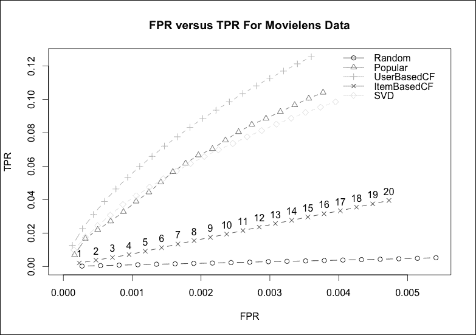

如我们所见，基于用户的协同过滤在这里是明显的赢家。SVD 的表现与 POPULAR 基线相似，尽管后者在*N*较高时开始变得更好。最后，我们看到基于物品的协同过滤的表现远逊于这些，仅优于随机基线。从这些实验中可以清楚地看出，调整推荐系统可能是一个非常耗时、资源密集的过程。

我们指定的所有算法都可以以各种方式进行调优，我们已经探索了许多参数，从邻域大小到相似度度量，这些都会影响结果。此外，我们注意到，即使是对于顶级 N 场景，也有几种方法可以评估我们的推荐系统；因此，如果我们想尝试其中的一些进行比较，我们还需要在模型训练上花费更多的时间。

鼓励读者使用不同的参数和评估方案重复这些实验，以便了解设计和训练推荐系统的过程。此外，通过访问我们的两个数据集的网站，读者可以找到到类似数据集的链接，这些数据集通常用于学习推荐系统，例如 book-crossing 数据集。

为了完整性，我们将绘制 MovieLens 数据的精确度召回率曲线：

```py
> plot(movies_split_eval, "prec/rec", annotate = 3, 
       legend = "bottomright")
> title(main = "Precision versus Recall For Movielens Data")
```

这是 MovieLens 数据的精确度召回率曲线：

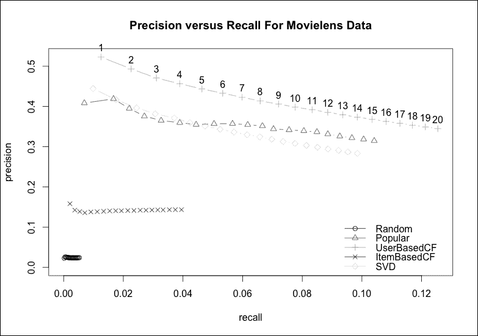

## 评估单个预测

评估推荐系统的另一种方法是要它预测一组测试用户使用他们剩余的评分所做出的部分已知评分的具体值。通过这种方式，我们可以通过在预测评分上取平均距离度量来衡量准确性。这些包括我们之前见过的**均方误差**（**MSE**）和**均方根误差**（**RMSE**），以及**平均绝对误差**（**MAE**），它只是绝对误差的平均值。我们将为此常规（非二值化）的 Jester 数据集执行此操作。

我们像以前一样，首先定义一个评估方案：

```py
>jester_split_scheme<- evaluationScheme(jester_rrm, method = 
"split", train = 0.8, given = 5, goodRating = 5)
```

接下来，我们将使用`Recommender()`和`getData()`函数定义基于用户和项目的协同过滤推荐器。这些背后的逻辑是，`getData()`函数将提取评估方案保留用于训练的评分集，而`Recommender()`函数将使用这些数据来训练一个模型：

```py
>jester_ubcf_srec<- Recommender(getData(jester_split_scheme, 
"train"), "UBCF")
>jester_ibcf_srec<- Recommender(getData(jester_split_scheme, 
"train"), "IBCF")
```

我们可以使用这些模型来预测测试数据中那些被分类为已知（其数量与`给定`参数指定的数量相同）的评分：

```py
>jester_ubcf_known<- predict(jester_ubcf_srec, 
getData(jester_split_scheme, "known"), type="ratings")
>jester_ibcf_known<- predict(jester_ibcf_srec, 
getData(jester_split_scheme, "known"), type="ratings") 
```

最后，我们可以使用已知的评分来计算保留用于测试的评分的预测准确性：

```py
> (jester_ubcf_acc<- calcPredictionAccuracy(jester_ubcf_known, 
getData(jester_split_scheme, "unknown")))
RMSEMSE      MAE 
 4.70765 22.16197  3.54130 
> (jester_ibcf_acc<- calcPredictionAccuracy(jester_ibcf_known, 
getData(jester_split_scheme, "unknown")))
RMSEMSE       MAE 
 5.012211 25.122256  3.518815
```

我们可以看到，这两个算法的性能相当接近。当我们通过平方来惩罚较大的误差（通过 RMSE 和 MSE）时，基于用户的协同过滤表现更好。从平均绝对误差的角度来看，基于项目的协同过滤略微更好。

因此，在这种情况下，我们可能会基于与我们业务需求更接近的错误行为来决定使用哪种类型的推荐系统。在本节中，我们使用了两个算法的默认参数值，但通过在`Recommender()`函数中使用`parameter`参数，我们可以像以前一样尝试不同的配置。这留作读者的练习。

# 其他推荐系统方法

在本章中，我们集中精力通过遵循协同过滤范例来构建推荐系统。这是一个非常受欢迎的方法，因为它具有许多优点。通过本质上模仿口碑推荐，它几乎不需要了解被推荐的项目或有关用户的任何背景知识。

此外，协同过滤系统会随着新评分的出现而纳入新评分，无论是通过记忆方法，还是通过基于模型的常规重新训练。因此，随着时间的推移，它们会自然地变得对用户更好，因为它们学习到更多信息并适应不断变化的偏好。另一方面，它们并非没有缺点，其中最不重要的是，即使有可用信息，它们也不会考虑任何关于项目和它们内容的信息。

**基于内容的推荐系统**试图根据内容向用户推荐与用户喜欢的项目相似的项目。这一想法背后的关键前提是，如果知道用户恰好喜欢乔治·R·R·马丁（*George R. R. Martin*）的小说，那么书籍推荐服务可能建议一个类似作者，例如*罗伯特·乔丹*，是有意义的。

协同过滤系统本质上需要某种反馈系统，以便推荐器记录特定的评分。特别是，它们非常适合利用**显式反馈**，即用户记录实际的评分或分数。**隐式反馈**是间接反馈，例如，仅基于用户选择租借某部电影就认为用户喜欢这部电影。基于内容的推荐系统更适合隐式反馈，因为它们将使用有关项目内容的信息来改善对用户偏好的了解。

此外，基于内容的推荐系统通常使用用户配置文件，用户可以记录他们喜欢的关键词列表，例如。此外，如果支持搜索，偏好关键词可以从用户在项目数据库中提出的查询中学习。

某些类型的内容更适合基于内容的方法。基于内容的推荐系统的经典场景是当内容以文本形式存在时。例如，包括书籍和新闻文章推荐系统。基于文本内容，我们可以使用信息检索领域的技巧来构建对不同项目之间相似性的理解。例如，当我们查看第八章（part0069_split_000.html#21PMQ2-c6198d576bbb4f42b630392bd61137d7 "第八章. 维度约简"）、*概率图模型*和第十章（part0076_split_000.html#28FAO2-c6198d576bbb4f42b630392bd61137d7 "第十章. 概率图模型"）的*主题建模*时，我们看到了使用词袋特征分析文本的方法。

当然，图像和视频等内容的这种方法的适用性要低得多。对于通用产品，基于内容的方法需要数据库中所有项目的文本描述，这是其缺点之一。此外，基于内容的推荐往往可能持续推荐过于相似的项目；也就是说，我们的推荐可能不够多样化。例如，我们可能会持续推荐同一作者的书籍或同一主题的新闻文章，正是因为它们的内容非常相似。

相比之下，协同过滤范式仅基于偏好来使用用户和项目之间经验上发现的关系。因此，它可能远不如可预测（尽管在某些情况下，这并不一定是好事）。

协同过滤和基于内容的推荐系统都面临的一个经典难题是**冷启动问题**。如果我们是基于用户提供的评分或他们以某种方式表示喜欢的内客来提供推荐，那么我们如何处理没有评分的新用户和新物品呢？处理这个问题的一种方法是通过启发式方法或经验法则，例如，通过建议大多数用户都会喜欢的物品，就像 POPULAR 算法所做的那样。

**基于知识的推荐系统**通过基于规则和其他关于用户和物品的信息来源来制定推荐，从而完全避免了这个问题。这些系统通常表现得很可预测，质量可靠，并且可以在制定推荐时强制执行特定的商业实践，例如销售驱动政策。这类推荐器通常会通过交互式提问来了解用户的偏好，并使用规则或约束来识别应该推荐的物品。

通常，这会导致一个虽然可预测但可以解释其输出的系统。这意味着它可以向用户证明其推荐的合理性，这是大多数遵循其他范式的推荐器所缺乏的特性。除了设计它所需的初始努力之外，基于知识的范式的一个重要缺点是它是静态的，无法适应用户行为的变化或趋势。

最后，值得一提的是，我们可以设计混合推荐系统，结合多种方法。一个例子是，一个使用协同过滤为大多数用户推荐，但对于新加入系统的用户使用基于知识的组件进行推荐的推荐器。混合推荐系统的另一种可能性是构建多个推荐器，并使用投票方案将它们集成到一个集成中，以进行最终推荐。

### 注意

一本涵盖广泛不同推荐系统范式和示例的优秀全面书籍是*Dietmar Jannach*和其他人合著的*《推荐系统：入门》*。这本书由*剑桥大学出版社*出版。

# 摘要

在本章中，我们探讨了使用`recommenderlab`包在 R 中构建和评估推荐系统的过程。我们主要关注协同过滤范式，它简而言之就是通过口碑推荐物品给用户。一般来说，我们发现基于用户的协同过滤执行速度相当快，但需要所有数据来做出预测。基于物品的协同过滤在训练模型时可能较慢，但一旦模型训练完成，预测速度就非常快。它在实践中很有用，因为它不需要我们存储所有数据。在某些场景中，这两种方法在准确性之间的权衡可能很高，但在其他情况下，这种差异是可以接受的。

训练推荐系统的过程非常资源密集，设计过程中涉及到许多重要参数，例如用于量化物品和用户之间相似性和距离的度量标准。最后，我们简要讨论了协作过滤范式的替代方案。基于内容的推荐系统旨在利用物品内容之间的相似性。因此，它们非常适合文本领域。基于知识的推荐系统旨在根据专家设计的规则或约束为用户提供推荐。这些方法可以与其他方法结合使用，以解决新用户或物品的冷启动问题。

在下一章中，我们将介绍如何将本书中已经介绍的技术和实践应用于非常大量的数据源，并指出在处理大数据时遇到的具体挑战。
