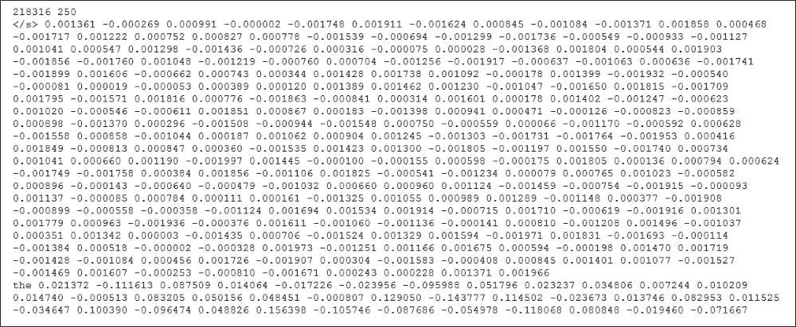
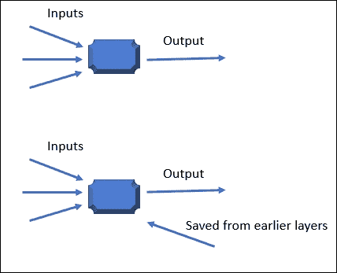

# 第十四章：深度学习

本章的目的是探讨非常重要的主题**深度学习**，以及近年来它如何以及为什么在统计学领域变得越来越重要。

我们将首先简要解释一下什么是**机器学习**，然后讨论一下**深度学习**是什么，它与机器学习的比较，以及它为什么几乎每天都在不断增长的重要性。为了阐明这些概念，我们将然后展示两个标志性的示例用例：*词嵌入*，其中涉及一些关于自然语言处理或 NLP 应用逻辑的讨论，以及**循环神经网络**（**RNNs**），这是一种有趣且更高级、更高效的类型的人工神经网络。

# 机器学习或深度学习

在**机器学习**中，选择并使用算法来分析数据和数据源，而不是对它们做出决策，而是从它们中学习，以便它们可以使用在数据中发现的模式或结果来对某个主题做出决策或预测，或者解决特定问题。

这意味着，你不需要编程或编写出用于特定任务（如做出预测）的每个规则和指令，而是通过大量数据和算法来训练计算机，使其能够真正学习如何执行任务、做出预测、解决问题或达到目标。

### 注意

**究竟多少数据才能算作足够的数据以实现成功的机器学习？**

通常“越大越好”，但在实践中，你必须根据你的目的或需求收集足够的**数据**。如果数量不足，明智的数据科学家应该始终关注数据的**质量**或适用性。

统计学领域的专家常用以下场景来举例说明机器学习是如何工作的：一个算法或模型根据一个人的身高预测其体重。在这个例子中，如果有一个相当丰富的经验（或实际的数据案例，提供了一个人的实际身高和体重），就可以建立一个模型，根据身高测量值预测一个人的体重。

显然，**经验越多**（或模型消耗和分析的实际数据越多），结果（或预测）就越好。

### 注意

数据科学家通常将模型的经验称为它在一段时间内训练过的原始数据量。

机器学习的种类或方法有很多，我们发现随着时间的推移，行业专家们根据算法或模型使用的**学习类型**对这些方法进行了分类。

最常见或最常见的机器学习类型通常包括以下几种：

+   监督学习

+   无监督学习

+   半监督学习

+   强化学习

+   转导等

深度学习不同；尽管机器学习按类型分组，但深度学习**不是**一种类型。**深度学习**被视为一种实现机器学习的方法或方式。

下一个部分将更深入地探讨这个概念。

# 深度学习是什么？

深度学习（在行业内也被称为**深度结构学习**或**分层学习**等名称）实际上是机器学习方法更广泛家族或分支的一部分，如前所述。这些方法基于学习所谓的**表示**（即，模型从数据中发现执行所需任务或满足目标所需的表示、模式或规则），而不是**特定任务的算法**（即，详细写出的或预先定义的规则，描述如何执行特定任务）。

### 注意

表示或特征表示对所有类型的机器学习都是至关重要的。特征表示可以通过学习或由模型在分析数据时**手动**或**自动**定义。

## 手动指令的替代方案

作为手动创建规则、指令或方程式的替代方案，这些方程式被认为是解决问题的关键，然后组织数据通过它们运行，深度学习的过程只是设定关于要解决的问题的基本参数，然后训练计算机通过识别数据中的模式来自主学习。

这是通过使用多层处理来实现的。例如，第一层可能通过找到简单或基本的模式来建立最基本的特征或特征。然后，下一层将接收这些已识别的信息，然后努力提取下一层次的信息，并将其传递给另一层，依此类推，直到最终层可以确定结果或做出预测。

这个过程通常通过决策树或决策流程图的树状流程来展示。这种图形表示可以直观地显示决策及其可能的后果，包括随机事件的结果等。

如果我们再次利用之前提到的身高和体重示例，使用机器学习，就必须根据个体是男性还是女性、他们的年龄和种族，以及可能还有他们的 BMI 或体质指数来定义特征、指令或规则。简而言之，你需要概述用于满足目标（猜测正确的体重）的物理属性，然后让系统使用更重要的特征来确定一个主体的疑似体重。

因此，深度学习会自动发现或找出用于预测的重要特征。这个发现过程可以描述为以下列出的步骤（再次强调，如果我们使用身高和体重用例示例）：

+   首先，该过程试图确定哪些物理属性与确定体重最相关

+   接下来，它构建一个类似于我们之前提到的决策流程图的层次结构，它可以利用这个层次结构来确定主体的体重（例如，主体是男性还是女性，或者是否在某个身高范围内，等等）

+   在对这些组合进行连续的层次识别（或分类）之后，它随后决定哪些特征负责预测答案（即，主体的体重）

总结来说，虽然经典机器学习需要从数据中提取和建立规则或特征，然后对数据进行预处理或组织（这些步骤通常是 85%到 90%的人工努力），之后模型才能用于做出预测，而深度学习则使用深度学习算法进行自己的特征学习，然后能够做出预测。

在撰写本文时，深度学习通常被认为是四种基本架构之一。

这些包括：

+   无监督预训练

+   卷积神经网络

+   递归神经网络

+   递归神经网络

这些深度学习架构已经成功应用于各个领域，并产生了与（在某些情况下优于）适当技能的人类**主题专家**（**SMEs**）相当的结果：

+   计算机视觉

+   语音识别

+   自然语言处理

+   音频识别

+   社交网络过滤

+   机器翻译

+   生物信息学

## 日益重要的

现在，深度学习已被确立为实际机器学习用例的关键工具。由于计算机的日益强大，使用深度学习技术从不断增长的数据源（甚至*大数据*）中学习，我们预计可以比以往任何时候都更快、更准确地处理和预测。

### 注

*大数据*是一个用于描述数据量如此之大或如此复杂，以至于传统的算法和系统软件不足以处理它的术语。

此外，深度学习的概念在媒体中被多次描述为不仅仅是一种机器学习的方法或实践（如我们在本章前面提到的），而是一种革命性的学习态度，它使用认知技能，如分析、产生、解决问题以及进行元认知思考的能力，以构建长期理解。

### 注

认知技能通常指的是从审查数据（也称为经验或信息）中发展意义和/或特定知识的能力。

深度学习技术的应用促进了我们对生活知识的理解和应用，其效果比其他学习形式更为先进、有效和迅速，因此它是一个具有极高潜力的领域，有可能深刻影响我们所知的世界。

## 更深的数据？

几乎每个人、每个地方都听说过“大数据”这个术语。尽管可能仍然有一些关于这个术语实际含义的争论或分歧，但底线是，今天可用的数据比昨天多得多（而且明天还会更多！）。

这意味着这些数据可用于构建具有许多更深层的神经网络，提供更准确（或者至少更有趣）的结果。

## 物联网深度学习

此外，还有令人兴奋的新兴领域，那就是**物联网**（**IoT**）。IoT 这个缩写描述了设备、车辆、建筑以及许多其他物品如何相互交流或通信。如今几乎所有设备以及未来都将具备成为智能设备或连接设备的能力，捕捉它们的使用和周围环境及条件的信息，然后连接并共享它们收集的信息和事件。

机器和深度学习模型和算法将在物联网分析中发挥重要作用。物联网设备的数据稀疏且/或具有时间元素，深度学习算法可以用这些信息进行训练，以产生重大见解。

分布式云计算和图形处理单元领域的许多、许多最近进展使得难以置信的计算能力可用于使用，这反过来又提高了深度学习应用的最大积极效果能力。

## 用例

今天已经存在许多实际应用案例，可以应用深度学习算法，包括（仅举几个例子）：

+   欺诈检测

+   图像识别

+   语音识别

+   自然语言处理

现在越来越主流，日益增长的*预测分析*和*预测分析学*领域正在使用深度学习在金融、会计、政府、安全、硬件制造、搜索引擎、电子商务和医学等领域。

对于深度学习来说，一个较新、非常激动人心且可能越来越重要的用例是与运动检测用于*情况评估*、安全和防御。

### 词嵌入

**自然语言处理**（**NLP**）是计算机科学（或更具体地说，计算语言学）的一个领域，专注于计算机与人类语言之间的交互。

在自然语言应用中，试图处理极端大量的真实世界文本，正式称为自然语言语料库数据源。

### 注意

语料库相当于单词样本。在这个背景下，自然语言语料库数据源将是一个包含实际单词和短语文本的数据库或文件，这些文本是预期的语言。

语音识别是自然语言处理（NLP）最知名且可能最发达的应用之一，即便如此，挑战仍然很多，通常包括：

+   自然语言理解

+   自然语言生成

+   连接语言和机器感知

+   对话系统

+   所有这些的组合

词嵌入是语言建模和特征学习技术中非常流行的方法，这些方法被广泛应用于许多自然语言处理应用中。

这是一种使用词汇表中的词或短语并将它们映射到实数向量中的做法。简单来说，词嵌入是将文本转换为数字的过程，这种文本到数字的转换是必需的，因为大多数深度学习算法都需要它们的输入是连续数值的向量（它们不能处理纯文本字符串），而且，嗯，计算机处理数字的能力出奇地好。

因此，根据前面的定义，词嵌入被用来将词汇表中的词或短语映射到相应的实数向量，这个向量还提供了以下好处：

+   **降维**：将短语简化为数字显然是一种更有效的表示

+   **上下文相似性**：数值可以是一种更具有表现力的表示

> “上下文词相似性不过是识别词之间不同类型的相似性。它是自然语言处理的一个目标。统计方法用于计算词之间相似度的程度。”
> 
> – Robin，2012 年 12 月 10 日

### 词预测

为了使统计语言模型能够预测某些文本的意义，它需要意识到词的*上下文相似性*。

例如，你可能会同意，你期望在句子中找到像*martini*或*cosmopolitan*这样的词，这些词在句子中是*dry*、*shaken*、*stirred*和*chilled*的，但你不会期望在这些词附近找到像*automobile*这样的概念。

### 注意

另一种词预测的形式是*自动完成或词补全*。这是当算法可以预测用户输入的词的其余部分时发生的情况。

### 词向量

通过应用词嵌入的逻辑和推理产生的词向量（实际上它们是*数值向量*）揭示了这些相似性，因此，在文本中经常相邻出现的词，在向量空间中也会彼此靠近。

理解这些词或数值向量是如何工作的非常重要，所以让我们简要（并且希望简单）地解释一下这个概念。

如果一个词向量被分成几百个元素，词汇表中的每个词都通过这些元素（在该向量中）的权重分布来表示。因此，在向量中的一个元素和词之间不再是简单的映射，该词的表示分布在向量的所有元素上，向量的每个元素*都贡献*于许多词的定义。这样的向量以某种抽象的方式代表了词的意义。

### 注意

在线可以找到一篇易于理解的教程和一些关于词语或数值向量的精美插图：[`blog.acolyer.org/2016/04/21/the-amazing-power-of-word-vectors/`](https://blog.acolyer.org/2016/04/21/the-amazing-power-of-word-vectors/)。

因此，再次回答一下什么是词嵌入的问题？

*"…词嵌入是一种从文本语料库中创建低维向量表示的方法，它保留了词语的上下文相似性…"*

### 上下文相似性的数值表示

实现词向量的一个额外好处是它们可以进行算术操作（就像任何其他数值向量一样）。由于词汇表中的词语被转换成*数值*向量，并且这些向量的位置存在语义关系，因此可以在这些向量上使用或应用*简单的算术*来找到额外的含义和洞察。

有许多例子可以说明这个概念，包括通过在嵌入空间中从“Man”（男人）移动到“Queen”（女王）来减去“King”（国王）并加上“Woman”（女人）。

### 备注

在该领域，对词语或数值向量进行的算术操作被称为*向量数学*。

通过利用这种技术，词语的分组不仅仅是接近的变体或*同义词*，而是构成上下文集合的独特词语或仅仅是属于一起的词语。

### Netflix 学习

我最喜欢的机器学习用例之一是 Netflix（一个专注于并提供流媒体和视频点播的网站）。

Netflix 服务（可流媒体播放的电影和视频）的典型视图提供了超过 40 行的可能选择。就像任何其他业务一样，消费者在浏览约两分钟的视频选择后就会失去兴趣，因此 Netflix 几乎没有时间吸引客户的注意力。

Netflix 并非依赖于客户评分和调查，而是利用一个非常广泛的数据资产集：每个会员观看的内容、观看时间、客户在 Netflix 屏幕上找到视频的位置、客户未选择的推荐以及目录中视频的流行度。

> "所有这些数据都是由众多算法读取的，这些算法由机器学习技术驱动。方法使用监督（分类、回归）和无监督（通过聚类或压缩进行维度降低）方法…"，
> 
> - C. Raphel.

### 备注

提到的报告可在以下网址在线获取：[`www.rtinsights.com/netflix-recommendations-machine-learning-algorithms`](https://www.rtinsights.com/netflix-recommendations-machine-learning-algorithms)。

> 视频到视频相似性算法，或称 Sims，在“因为你观看了”这一行提供推荐
> 
> - *C. Raphel*.

可能有人会认为选择仅基于类型，但上下文相似性的概念在挖掘符合消费者或观众心态的选择中肯定起到了作用。适合一起使用的词语可以激发出观众可能喜欢的电影想法。操纵词向量可以产生几乎无穷无尽的想法。

如下一段所述，Netflix 算法的结果实际上在做出推荐方面比直觉认为的成功率更高：

> “…例如，作者描述了与《纸牌屋》类似的电视剧推荐。虽然有人可能会认为像《西翼》或《广告狂人》这样的政治或商业剧会增加客户参与度，但结果却表明，像《公园与游憩》和《橙子不是新的黑色》这样的流行但非类型作品表现更好。作者称这为‘直觉失败’的案例...”
> 
> – C. Raphel

## 实现

那么，我们如何在典型的词嵌入应用中实现词或数字向量呢？

可用于生成词嵌入模型的最受欢迎的算法之一是**word2vec**，由谷歌在 2013 年创建。Word2vec 是用 C++编写的，但也实现了 Java/Scala 和 Python，接受文本语料库（或者非正式地说，期望输入是一个句子序列，每个句子是一个单词列表）作为输入，并产生词向量作为输出。

关于 word2vec 输入的另一个备注，它只要求您提供的数据以顺序句子形式提供，您不必担心一次性将所有内容存储在内存中以便处理。这意味着您可以：

+   提供一句话

+   处理它

+   加载另一句话

+   处理它

+   重复...

这意味着大量数据，例如那些符合大数据标准的数据源（在第十一章中讨论），本书的*主题建模*，可能由分布在多个位置的多份文件中的数据组成，可以通过每行一句（而不是将所有内容一次性加载到内存列表中，逐个文件，逐行读取）进行处理。这种架构还允许进行预处理，例如转换为 Unicode、转换为小写、去除数字、提取命名实体等，而无需 word2vec 意识到这些操作。

### 备注

Word2vec 对于非常小的数据来说不是一个好的选择。为了得到真实的结果，如通过试验报告，您应该至少有一百万个单词。小数据文件或来源不足以创建简洁的词相似度或适当的词向量。

Word2vec 还设置了一些参数，例如`min_count`。

此参数对于设置数据中出现单词的下限非常有效。例如，在百万词数据源中只出现几次的任何单词可能都是打字错误或垃圾，应该在创建词向量时忽略。此参数允许您自动删除不感兴趣或不重要的单词。默认设置为`5`。

Word2vec 首先从提供的文本数据中构建词汇表，然后学习单词的向量表示。生成的词向量文件可以用作许多自然语言处理和机器学习应用中的特征。

下图是 word2vec 创建的部分词向量图像：

### 注意

尽管 word2vec 是一个强大的工具，即使是谷歌也宣称它不够用户友好，并且随着时间的推移已经开发了各种开源软件包，为该算法添加了用户友好的界面。您可以在网上访问 word2vec，网址为[`code.google.com/p/word2vec`](https://code.google.com/p/word2vec)。

就像统计学中的许多实现一样，关于 word2vec 究竟是什么或者其逻辑最终是如何实现的，存在一些分歧。它是经典机器学习模型的例子吗？是实施深度学习的例子吗？或者，我们可以说它是一种某种混合模型？

一点在线研究揭示了众多观点，例如，A.Thakker，2017 年 6 月 18 日：

> “……Word2Vec 被认为（在行业内的一些人看来）是“自然语言处理中的深度学习”的起点。然而，Word2Vec 并不深。但 Word2Vec 的输出是深度学习模型可以轻松理解的。Word2Vec 基本上是一个从原始文本中学习词嵌入的计算效率高的预测模型。Word2Vec 的目的是在向量空间中将语义相似的单词分组在一起。它通过数学计算相似度。给定大量数据……”

让我们回顾一下深度学习的架构，从下一节开始。

## 深度学习架构

我们在本章的“深度学习”部分之前已经指出，目前（至少在写作的时候）有四种基本的深度学习架构。现在我们将简要地看看三种（无监督预训练、卷积神经网络和递归神经网络），然后深入探讨其中最刺激和最有效的（至少对于适当的用例）*循环神经网络*：

1.  **无监督预训练神经网络**：想象在模型训练真正开始之前通过调整权重来“洗牌”。

1.  **卷积神经网络**：一种前馈模型，使用多层感知器（或单个学习单元）的变体，旨在需要最少的预处理，用于视觉图像处理和自然语言处理。

1.  **递归神经网络**：这些网络通过在结构上递归地应用同一组权重来创建，试图产生一种**结构化预测**（即，预测结构化对象的能力，而不是离散或实值）。

## 人工神经网络

**人工神经网络**（ANNs）系统是受我们人类大脑中生物神经网络工作方式启发的计算系统、算法或模型。

这些系统通过考虑数据中发现的模式（称为获得经验）来学习执行工作和解决问题，通常无需编程特定的逻辑提示。

ANNs 是深度学习的一个重要部分。

### 注意

大多数人工神经网络与它们更复杂的生物对应物只有轻微的相似之处，但在分类或分割等预期任务上非常有效。更多信息，请参阅：[`en.wikipedia.org/wiki/Types_of_artificial_neural_networks`](https://en.wikipedia.org/wiki/Types_of_artificial_neural_networks)。

在第五章中，我们详细介绍了**神经网络**，特别是人工神经网络（ANNs）。在本章的下一节中，我们将继续这一主题，并转向**循环神经网络**（RNNs）这一主题。

## 循环神经网络

一般而言，行业内普遍认为实际上只有两种主要的神经网络类型。

这些是：

+   前馈

+   循环

**前馈**神经网络是首先开发的第一种也是最简单的一种类型。

在**前馈**网络中，激活从输入层推向输出层。在这个网络中，信息仅从输入层**直接通过**任何隐藏层到输出层，没有循环或循环。

换句话说，前馈神经网络是一条单行道。

### 注意

大多数神经网络类型都是按层组织的。层由相互连接的节点组成，这些节点包含所谓的激活函数。**模式**由输入层呈现给网络，然后与一个或多个**隐藏层**进行通信。隐藏层是真正工作的地方，使用加权连接系统。

让我们继续我们的对话，声明一个**循环神经网络**（或 RNN）是人工神经网络（ANN）中一个有趣且独特的**类别**。

使用 RNN 逻辑的目标是利用*顺序或时间序列*数据。这与传统神经网络所使用的逻辑大不相同，传统神经网络假设所有输入和输出都是相互独立的，或者彼此之间没有关联。这种假设（或限制）对于某些应用来说是有效的，或者至少是足够的，但对于许多任务来说，这不是一个可接受的假设。例如，如果你试图预测某人正在搜索引擎中输入的下一个单词，你需要知道之前输入了哪些单词。

RNNs 被称为*循环*，因为它们对序列中的每个元素执行*相同的任务*，输出依赖于所有之前的计算。

另一种思考 RNNs 的方式是，它们可以记住序列中到目前为止已计算的信息。这使得它能够表现出*动态时间（或相关）行为*。

记住，RNNs 使用一个称为状态层的特殊层，该层不仅更新网络的外部输入信息，还更新来自先前前向传播的激活信息。

有一个有趣的博客，提供了关于 RNNs 工作原理的宝贵见解。以下图表基于这些信息。读者可以在以下链接查看信息：[`shapeofdata.wordpress.com/2015/10/20/recurrent-neural-networks`](https://shapeofdata.wordpress.com/2015/10/20/recurrent-neural-networks)。

为了展示这一点是多么有价值的一个特性，例如，单词*aliens*如果它是序列*ancient aliens*的一部分，可能会有不同的含义。

### 注意

理论上，RNNs 可以使用任意长序列中的信息，但在实践中，它们只能回溯查看几个步骤。

正如我们在本节前面所述，与逻辑层之间没有形成循环（技术上称为前馈神经网络）的人工神经网络不同，RNNs 可以使用它们的内部记忆来处理*任意输入序列*。这使得它们非常适合于手写识别或语音识别等应用。

# 摘要

在本章中，我们讨论了机器学习和深度学习以及两者之间的区别。我们还提到了深度学习如何有能力推动世界的变化。

我们看到了深度学习如何减少人类所需的努力，并列出了一些这些算法已经成功应用的应用案例。然后我们探讨了在 NLP 应用等用例中使用*词嵌入*，并解释了它是如何工作的。

最后，我们讨论了神经网络，特别是 RNNs。

通过本章，我们结束了这次旅程，提供了关于性能指标和学习曲线、多项式回归、泊松回归和负二项式回归、反向传播、径向基函数网络等方面的深入信息。我们还讨论了处理非常大的数据集的过程。

希望您已经享受了探索和测试这些流行建模技术的过程，并掌握了多种预测分析风格。
