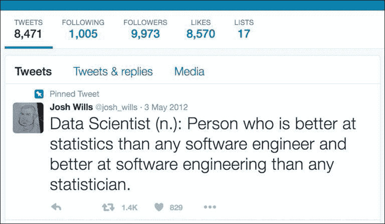

# 前言

这本书是关于机器学习的，以 Scala 的函数式编程方法为重点，以 Spark 大数据处理为目标。大约九个月前，当我被邀请撰写这本书时，我的第一个反应是，虽然上述提到的每个主题都已经被彻底研究和撰写过，但我确实参与过足够的讨论，知道将任何两个主题结合起来都会面临挑战，更不用说将这三个主题全部结合在一本书中。这个挑战激起了我的兴趣，结果就是这本书。并非每一章都像我期望的那样流畅，但在每天技术都有巨大进步的世界里，这可能是在所难免的。我确实有一份真正的工作，写作只是表达我想法的一种方式。

让我们从机器学习开始。机器学习经历了一场令人眼花缭乱的变革；它在 20 世纪 90 年代左右是人工智能和统计学的产物，并在 2010 年或稍早的时候孕育了数据科学。关于数据科学的定义有很多，但最流行的一个可能是 Josh Wills 的定义，我在 Cloudera 与他共事过，这在*图 1*中有描述。虽然细节可能会有争议，但事实是，数据科学始终处于几个学科的交汇点上，数据科学家不一定是其中任何一个学科的专家。据 Jeff Hammerbacher 所说，Facebook 是第一个数据科学家工作的地方，他是 Cloudera 的创始人之一，也是 Facebook 的早期员工。当时 Facebook 需要跨学科技能来从大量社交数据中提取价值。虽然我称自己为大数据科学家，但为了这本书的目的，我愿意使用机器学习或 ML 这个术语来保持重点，因为我已经混合了太多的内容。

最近 ML（机器学习）的一个方面是数据量超过了模型的复杂性。你可以在这本书中看到一些 Spark MLlib 实现的例子，特别是 NLP 中的 word2vec。能够更快地响应新环境的 ML 模型也经常打败那些需要数小时才能构建的更复杂的模型。因此，ML 和大数据是很好的匹配。

最后但同样重要的是微服务的出现。我在这本书中花费了大量时间讨论机器和应用程序通信的话题，而 Scala 与 Akka 演员模型在这里非常自然地结合在一起。

函数式编程，至少对于大部分实用程序员来说，更多的是关于编程风格，而不是编程语言本身。虽然 Java 8 开始引入了来自函数式编程的 lambda 表达式和流，但人们仍然可以在没有这些机制的情况下以函数式风格编写代码，甚至在 Scala 中编写 Java 风格的代码。将 Scala 在大数据世界中推向突出地位的两个主要思想是惰性评估，它极大地简化了多线程或分布式世界中的数据处理，以及不可变性。Scala 有两个不同的集合库：一个是可变的，另一个是不可变的。虽然从应用程序用户的角度来看，这种区别很微妙，但不可变性从编译器的角度来看大大增加了选项，而惰性评估对于大数据来说是一个更好的匹配，因为 REPL 将大多数数值计算推迟到管道的后期阶段，从而增加了交互性。



图 1：数据科学家可能的定义之一

最后，大数据。大数据无疑已经占据了几年的头条新闻，其中一个重要原因是，今天机器产生的数据量远远超过了人类即使不使用计算机也无法生产，甚至无法理解的数据量。像 Facebook、Google、Twitter 等社交网络公司已经证明，可以从这些数据块中提取足够的信息，以证明专门针对处理大数据的工具（如 Hadoop、MapReduce 和 Spark）的合理性。

我们将在本书的后面部分介绍 Hadoop 的功能，但最初，它是在通用硬件上的一种临时解决方案，以便能够处理大量信息，而当时的传统关系型数据库无法处理这些信息（或者能够处理，但代价高昂）。虽然大数据可能是一个太大的主题，我无法在本书中处理，但 Spark 是重点，它是 Hadoop MapReduce 的另一种实现，它消除了处理磁盘上持久化数据的一些低效之处。Spark 在总体上更昂贵，因为它消耗更多的内存，硬件也必须更可靠，但它更具有交互性。此外，Spark 在 Scala 上运行——Java 和 Python 等其他语言也可以——但 Scala 是主要的 API 语言，它在 Scala 中表达数据管道的方式找到了某些协同效应。

# 本书涵盖的内容

第一章, *探索性数据分析*，讲述了每一位数据分析师都是从探索性数据分析开始的。这里没有新的内容，只是新的工具允许你轻松地查看更大的数据集——可能分布在不同计算机上，就像它们只是本地机器上的数据一样。当然，这并不妨碍你在单台机器上运行管道，但即使是那样，我写这篇文档的笔记本电脑也有四个核心和大约 1,377 个线程同时运行。Spark 和 Scala（并行集合）允许你透明地使用整个资源，有时甚至不需要明确指定并行性。现代服务器可能向操作系统提供多达 128 个超线程。本章将向你展示如何使用新工具开始，也许是通过探索你的旧数据集。

第二章，*数据管道和建模*，解释说尽管在 Scala/Spark 出现之前就已经存在数据驱动的过程，但新时代展示了完全数据驱动的企业的出现，其中业务通过多个数据生成机器的反馈进行优化。大数据需要新的技术和架构来适应新的决策过程。借鉴多个学术领域，本章继续描述一个数据驱动企业的通用架构，其中大多数工作人员的任务是监控和调整数据管道（或享受这些企业可以命令的每个工作人员的巨额收入）。

第三章，*使用 Spark 和 MLlib*，专注于 Spark 的内部架构，我们之前提到它是 Hadoop MapReduce 的替代品和/或补充。我们将特别关注几个 ML 算法，这些算法被归类在 MLlib 标签下。虽然这仍然是一个发展中的话题，许多算法现在正在使用不同的包进行迁移，但我们将提供一些如何在`org.apache.spark.mllib`包中运行标准 ML 算法的示例。我们还将解释 Spark 可以运行的模式，并简要介绍 Spark 性能调优。

第四章，*监督学习和无监督学习*，解释说虽然 Spark MLlib 可能是一个移动的目标，但一般的 ML 原则已经得到了稳固的建立。监督/无监督学习是 ML 算法的一个经典分类，这些算法处理行导向数据——实际上大部分数据。本章是任何 ML 书籍的经典部分，但我们增加了一些内容，使其更具 Scala/Spark 导向性。

第五章, *回归与分类*，介绍了回归和分类，这是机器学习算法的另一个经典分支，尽管已经证明分类可以用于回归，回归也可以用于分类，但这两个类别仍然使用不同的技术、精确度指标和正则化模型的方法。本章将采用实践方法，同时展示回归和分类分析的实例。

第六章, *处理非结构化数据*，介绍了社交数据带来的新特性之一，即嵌套和非结构化数据，这一特性甚至让传统的数据库不堪重负。处理非结构化数据需要新的技术和格式，本章专门探讨了如何展示、存储和演进这些类型的数据。Scala 在这里成为大赢家，因为它在数据处理管道中处理复杂数据结构有天然的方式。

第七章, *处理图算法*，解释了图如何给传统的基于行的数据库带来了另一个挑战。最近，图数据库出现了复兴。本章我们将介绍两个不同的库：一个是来自 Assembla 的 Scala-graph，这是一个方便的工具，用于表示和推理图；另一个是 Spark 的图类，它在其之上实现了几个图算法。

第八章, *将 Scala 与 R 和 Python 集成*，介绍了尽管 Scala 很酷，但许多人仍然过于谨慎，不愿放弃他们旧的库。在本章中，我将展示如何透明地引用用 R 和 Python 编写的旧代码，这是一个我经常听到的请求。简而言之，有两种机制：一种是通过 Unix 管道，另一种是在 JVM 中启动 R 或 Python。

第九章, *Scala 中的 NLP*，专注于自然语言处理如何处理人机交互以及计算机对我们常常不标准的交流方式的理解。我将专注于 Scala 为 NLP、主题关联和处理大量文本信息（Spark）提供的几个工具。

第十章，*高级模型监控*，介绍了开发数据管道通常意味着有人将使用和调试它们。监控对于最终用户数据管道来说至关重要，对于寻找优化执行或进一步设计方法的开发人员或设计师来说也是如此。我们涵盖了监控系统和机器分布式集群的标准工具，以及如何设计一个具有足够钩子以查看其功能而不需要附加调试器的服务。我还会涉及到统计模型监控的新兴领域。

# 您需要这本书什么

本书基于开源软件。首先，是 Java。您可以从 Oracle 的 Java 下载页面下载 Java。您必须接受许可协议并选择适合您平台的适当镜像。不要使用 OpenJDK——它与 Hadoop/Spark 存在一些问题。

其次，Scala。如果您使用 Mac，我建议安装 Homebrew：

```py
$ ruby -e "$(curl -fsSL https://raw.githubusercontent.com/Homebrew/install/master/install)"

```

您将也可以使用多个开源软件包。要安装 Scala，请运行`brew install scala`。在 Linux 平台上安装需要从[`www.scala-lang.org/download/`](http://www.scala-lang.org/download/)网站下载适当的 Debian 或 RPM 软件包。我们将使用当时最新的版本，即 2.11.7。

Spark 发行版可以从[`spark.apache.org/downloads.html`](http://spark.apache.org/downloads.html)下载。我们使用为 Hadoop 2.6 及更高版本预构建的镜像。由于它是 Java，您只需解压包并从`bin`子目录中的脚本开始使用即可。

R 和 Python 软件包分别可在[`cran.r-project.org/bin`](http://cran.r-project.org/bin)和`http://python.org/ftp/python/$PYTHON_VERSION/Python-$PYTHON_VERSION.tar.xz`网站上找到。文本中具体说明了如何配置它们。尽管我们使用的软件包应该是版本无关的，但我在这本书中使用了 R 版本 3.2.3 和 Python 版本 2.7.11。

# 这本书面向谁

想要提高技能并看到与大数据实际操作案例的专业和新兴数据科学家：一个希望从大量数据中有效提取可操作信息的分析师，以及愿意超越现有边界并成为数据科学家的有抱负的统计学家。

本书风格相当实用，我不会深入数学证明或验证，尽管有一些例外，书中还有更多深入的内容推荐。然而，我会尽力提供代码示例和技巧，让您能够尽快开始使用标准技术和库。

# 惯例

在这本书中，您会发现许多文本样式，用于区分不同类型的信息。以下是一些这些样式的示例及其含义的解释。

文本中的代码单词、数据库表名、文件夹名、文件名、文件扩展名、路径名、虚拟 URL、用户输入和 Twitter 昵称如下所示：“我们可以通过使用`include`指令来包含其他上下文。”

代码块设置如下：

```py
import scala.util.hashing.MurmurHash3._

val markLow = 0
val markHigh = 4096
val seed = 12345

def consistentFilter(s: String): Boolean = {
  val hash = stringHash(s.split(" ")(0), seed) >>> 16
  hash >= markLow && hash < markHigh
}

val w = new java.io.FileWriter(new java.io.File("out.txt"))
val lines = io.Source.fromFile("chapter01/data/iris/in.txt").getLines
lines.filter(consistentFilter).foreach { s =>
     w.write(s + Properties.lineSeparator)
}
```

任何命令行输入或输出都如下所示：

```py
akozlov@Alexanders-MacBook-Pro]$ scala
Welcome to Scala version 2.11.7 (Java HotSpot(TM) 64-Bit Server VM, Java 1.8.0_40).
Type in expressions to have them evaluated.
Type :help for more information.

scala> import scala.util.Random
import scala.util.Random

```

**新术语**和**重要词汇**以粗体显示。您在屏幕上看到的单词，例如在菜单或对话框中，在文本中如下所示：“通过导航到**单元格** | **运行所有**”一次性运行所有单元格。”

### 注意

警告或重要说明以如下所示的框中出现。

### 小贴士

小贴士和技巧看起来像这样。

# 读者反馈

我们欢迎读者的反馈。告诉我们您对这本书的看法——您喜欢或不喜欢什么。读者反馈对我们很重要，因为它帮助我们开发出您真正能从中获得最大价值的标题。

要向我们发送一般反馈，请简单地发送电子邮件至`<feedback@packtpub.com>`，并在邮件的主题中提及书的标题。

如果您在某个主题上具有专业知识，并且您有兴趣撰写或为书籍做出贡献，请参阅我们的作者指南[www.packtpub.com/authors](http://www.packtpub.com/authors)。

# 客户支持

现在您已经是 Packt 图书的骄傲拥有者，我们有一些事情可以帮助您充分利用您的购买。

## 下载示例代码

您可以从[`www.packtpub.com`](http://www.packtpub.com)的账户下载此书的示例代码文件。如果您在其他地方购买了此书，您可以访问[`www.packtpub.com/support`](http://www.packtpub.com/support)并注册，以便将文件直接通过电子邮件发送给您。

您可以按照以下步骤下载代码文件：

1.  使用您的电子邮件地址和密码登录或注册我们的网站。

1.  将鼠标指针悬停在顶部的**支持**标签上。

1.  点击**代码下载与勘误表**。

1.  在**搜索**框中输入书的名称。

1.  选择您想要下载代码文件的书籍。

1.  从下拉菜单中选择您购买此书的来源。

1.  点击**代码下载**。

文件下载完成后，请确保使用最新版本解压缩或提取文件夹：

+   WinRAR / 7-Zip for Windows

+   Mac 上的 Zipeg / iZip / UnRarX

+   Linux 上的 7-Zip / PeaZip

此书的代码包也托管在 GitHub 上，网址为[`github.com/PacktPublishing/Mastering-Scala-Machine-Learning`](https://github.com/PacktPublishing/Mastering-Scala-Machine-Learning)。我们还有其他来自我们丰富图书和视频目录的代码包可供选择。[`github.com/PacktPublishing/`](https://github.com/PacktPublishing/) 查看它们！

## 下载此书的彩色图片

我们还为您提供了一个包含本书中使用的截图/图表的彩色图像的 PDF 文件。彩色图像将帮助您更好地理解输出的变化。您可以从[`www.packtpub.com/sites/default/files/downloads/MasteringScalaMachineLearning_ColorImages.pdf`](https://www.packtpub.com/sites/default/files/downloads/MasteringScalaMachineLearning_ColorImages.pdf)下载此文件。

## 勘误

尽管我们已经尽最大努力确保内容的准确性，但错误仍然可能发生。如果您在我们的某本书中发现错误——可能是文本或代码中的错误——如果您能向我们报告这一点，我们将不胜感激。通过这样做，您可以避免其他读者感到沮丧，并帮助我们改进本书的后续版本。如果您发现任何勘误，请通过访问[`www.packtpub.com/submit-errata`](http://www.packtpub.com/submit-errata)，选择您的书籍，点击**勘误提交表单**链接，并输入您的勘误详情来报告它们。一旦您的勘误得到验证，您的提交将被接受，勘误将被上传到我们的网站或添加到该标题的勘误部分下的现有勘误列表中。

要查看之前提交的勘误，请访问[`www.packtpub.com/books/content/support`](https://www.packtpub.com/books/content/support)，并在搜索字段中输入书籍名称。所需信息将出现在**勘误**部分下。

## 海盗行为

互联网上对版权材料的盗版是一个跨所有媒体的持续问题。在 Packt，我们非常重视保护我们的版权和许可证。如果您在互联网上发现任何形式的非法复制我们的作品，请立即提供位置地址或网站名称，以便我们可以寻求补救措施。

请通过`<copyright@packtpub.com>`与我们联系，并提供疑似盗版材料的链接。

我们感谢您在保护我们的作者和为您提供有价值内容的能力方面的帮助。

## 问题

如果您对本书的任何方面有问题，您可以通过`<questions@packtpub.com>`联系我们，我们将尽力解决问题。
