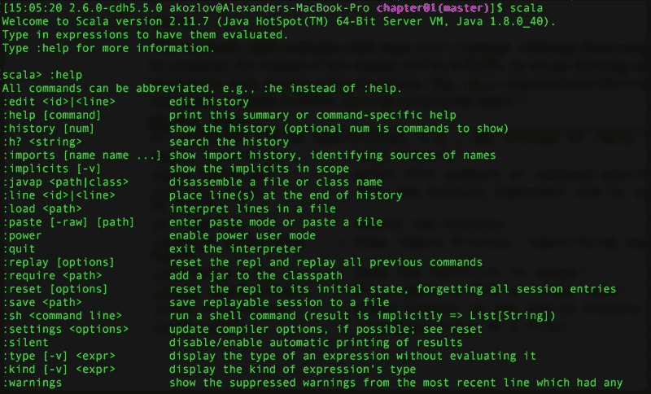
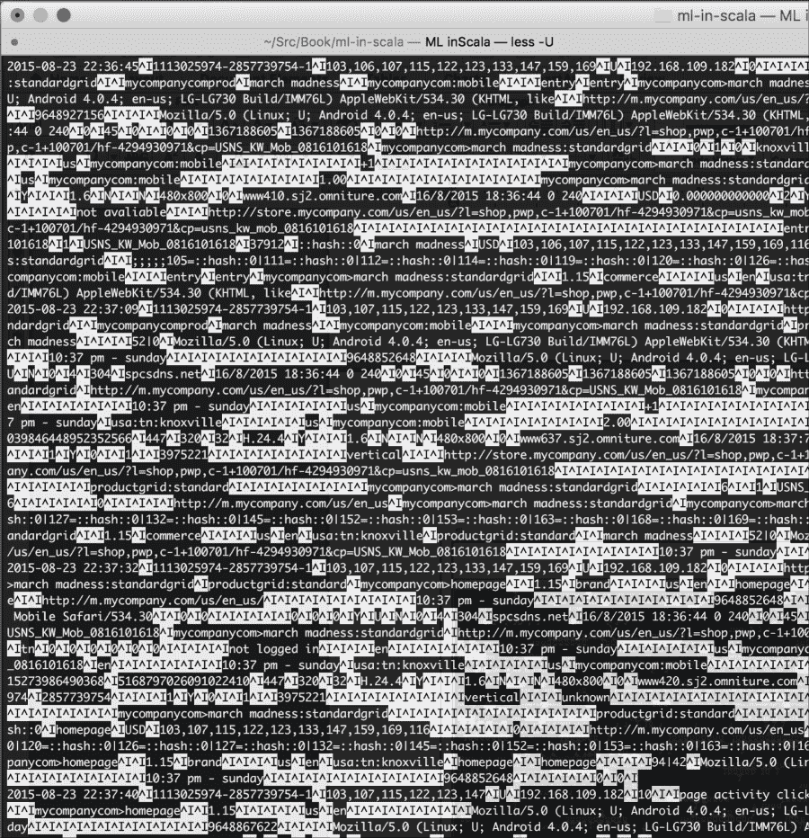
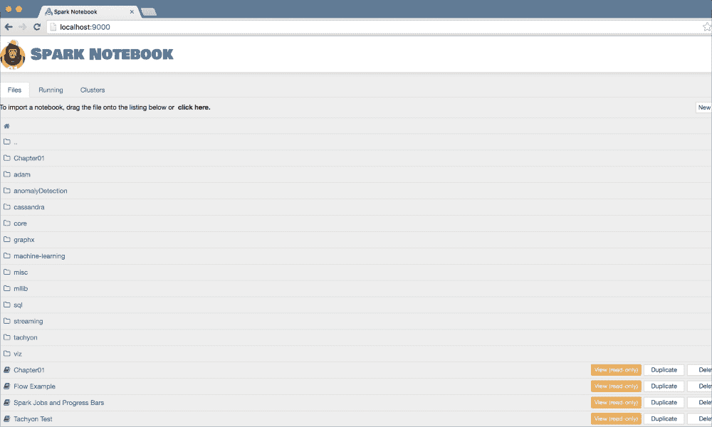
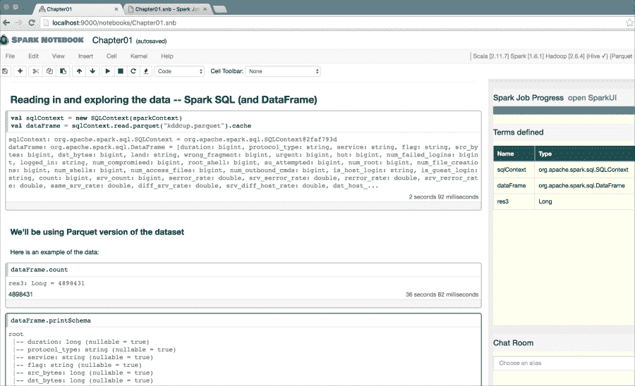
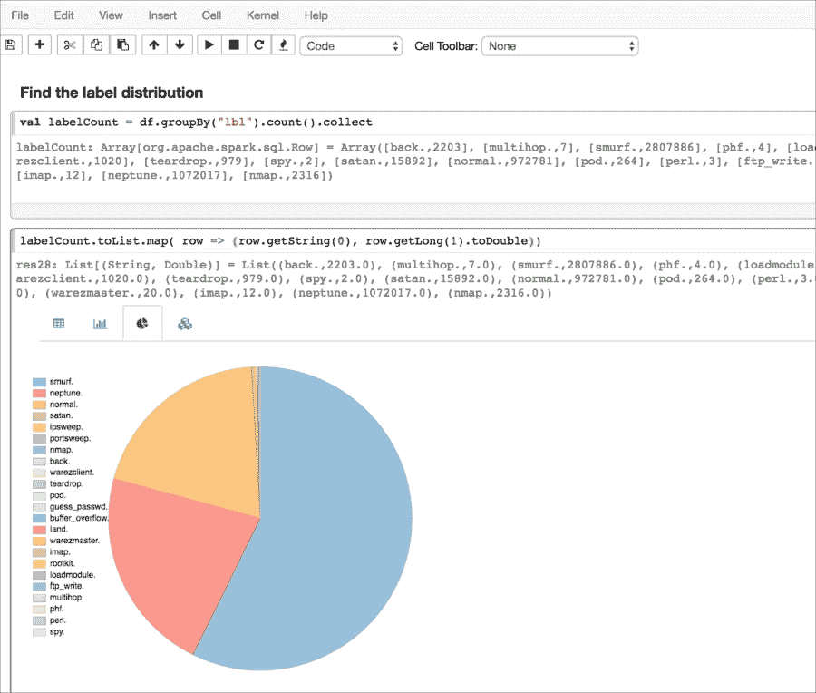
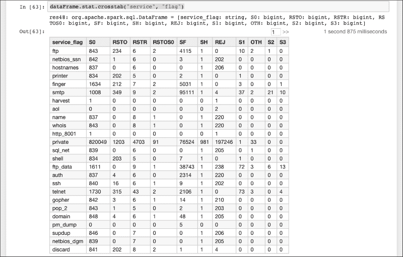
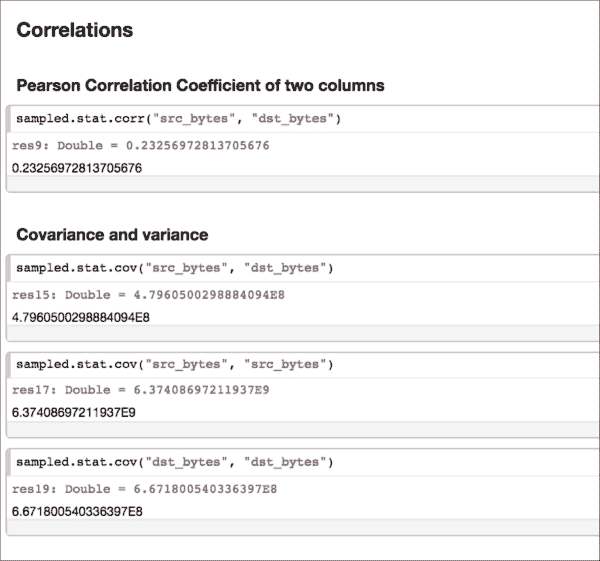
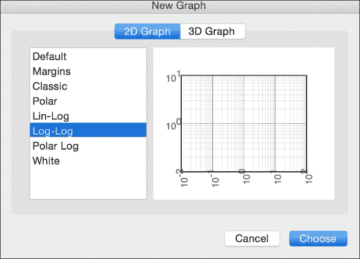
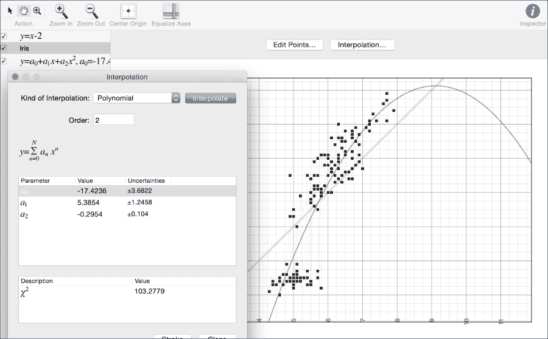

# 第一章. 探索性数据分析

在我深入探讨本书后面更复杂的数据分析方法之前，我想停下来谈谈基本的数据探索性任务，几乎所有数据科学家至少花费 80-90%的生产时间在这些任务上。仅数据准备、清洗、转换和合并数据本身就是一个价值 440 亿美元/年的行业（*《大数据时代的数据准备》*，作者：*Federico Castanedo* 和 *《数据集成最佳实践》*，*O'Reilly Media*，*2015 年*）。鉴于这一事实，人们最近才开始在开发最佳实践的科学、建立良好的习惯、文档和教学材料上投入更多时间，这对于整个数据准备过程来说是个令人惊讶的现象（*《美丽的数据：优雅数据解决方案背后的故事》*，由*Toby Segaran* 和 *Jeff Hammerbacher* 编著，*O'Reilly Media*，*2009 年* 和 *《Spark 高级分析：大规模数据学习的模式》*，作者：*Sandy Ryza* 等人，*O'Reilly Media*，*2015 年*）。

很少有数据科学家会在特定的工具和技术上达成一致意见——进行探索性数据分析的方法有很多，从 Unix 命令行到使用非常流行的开源和商业 ETL 和可视化工具。本章的重点是如何使用 Scala 和基于笔记本电脑的环境来利用通常被称为编程功能范式的技术。正如我将讨论的，这些技术可以转移到使用 Hadoop/Spark 的分布式机器的探索性分析中。

函数式编程与它有什么关系？Spark 是用 Scala 开发的，这并非没有原因。许多构成函数式编程基础的基本原则，如惰性评估、不可变性、无副作用、列表推导和单子，非常适合在分布式环境中处理数据，特别是在对大数据进行数据准备和转换任务时。多亏了抽象，这些技术在本地工作站或笔记本电脑上也能很好地工作。如前所述，这并不妨碍我们在连接到分布式存储/处理节点集群的现代笔记本电脑上处理数十 TB 的大型数据集。我们可以一次处理一个主题或关注领域，但通常我们甚至不需要对数据集进行采样或过滤，只需进行适当的分区。我们将使用 Scala 作为我们的主要工具，但在需要时也会求助于其他工具。

虽然 Scala 在某种意义上是完整的，即其他语言可以实现的任何内容都可以在 Scala 中实现，但 Scala 本质上是一种高级语言，甚至是一种脚本语言。你不必处理数据结构和算法实现中的低级细节，这些细节在 Java 或 C++等语言中已经由大量的应用程序和时间测试过——尽管 Scala 今天有自己的集合和一些基本的算法实现。具体来说，在本章中，我将专注于仅使用 Scala/Spark 进行高级任务。

在本章中，我们将涵盖以下主题：

+   安装 Scala

+   学习简单的数据探索技术

+   学习如何对原始数据集进行下采样以加快周转速度

+   讨论在 Scala 中实现基本数据转换和聚合的实现

+   熟悉大数据处理工具，如 Spark 和 Spark Notebook

+   获取数据集的基本可视化代码

# 开始使用 Scala

如果你已经安装了 Scala，你可以跳过这一段。你可以从[`www.scala-lang.org/download/`](http://www.scala-lang.org/download/)获取最新的 Scala 下载。我在 Mac OS X El Capitan 10.11.5 上使用了 Scala 版本 2.11.7。你可以使用你喜欢的任何版本，但可能会遇到与其他包（如 Spark）的兼容性问题，这是开源软件中常见的问题，因为技术的采用通常落后于几个发布版本。

### 小贴士

在大多数情况下，你应该尽量保持推荐版本之间的精确匹配，因为版本之间的差异可能导致模糊的错误和漫长的调试过程。

如果你正确安装了 Scala，在输入 `scala` 后，你应该会看到以下类似的内容：

```py
[akozlov@Alexanders-MacBook-Pro ~]$ scala
Welcome to Scala version 2.11.7 (Java HotSpot(TM) 64-Bit Server VM, Java 1.8.0_40).
Type in expressions to have them evaluated.
Type :help for more information.

scala>

```

这是一个 Scala **读取-评估-打印循环**（**REPL**）提示。尽管 Scala 程序可以编译，但本章的内容将在 REPL 中，因为我们专注于与交互，可能只有少数例外。`:help` 命令提供了在 REPL 中可用的某些实用命令（注意开头的冒号）：



# 分类的字段的不同值

现在，你有一个数据集和一台电脑。为了方便，我为你提供了一个小型的匿名和混淆的点击流数据样本，你可以从[`github.com/alexvk/ml-in-scala.git`](https://github.com/alexvk/ml-in-scala.git)获取。`chapter01/data/clickstream`目录中的文件包含时间戳、会话 ID 以及一些额外的调用事件信息，如 URL、分类信息等。首先要做的事情是对数据进行转换，以找出数据集中不同列的值分布。

*图 01-1 展示的截图显示了 `gzcat chapter01/data/clickstream/clickstream_sample.tsv.gz | less –U` 命令的输出。列是用制表符（`^I`）分隔的。人们可以注意到，就像在许多现实世界的大数据数据集中一样，许多值是缺失的。数据集的第一列可以识别为时间戳。文件包含复杂的数据，如数组、结构体和映射，这是大数据数据集的另一个特征。

Unix 提供了一些工具来剖析数据集。可能，**less**、**cut**、**sort** 和 **uniq** 是最常用于文本文件操作的工具。**Awk**、**sed**、**perl** 和 **tr** 可以执行更复杂的转换和替换。幸运的是，Scala 允许您在 Scala REPL 中透明地使用命令行工具，如下面的截图所示：



图 01-1\. less -U Unix 命令的输出文件点击流

幸运的是，Scala 允许您在 Scala REPL 中透明地使用命令行工具：

```py
[akozlov@Alexanders-MacBook-Pro]$ scala
…
scala> import scala.sys.process._
import scala.sys.process._
scala> val histogram = ( "gzcat chapter01/data/clickstream/clickstream_sample.tsv.gz"  #|  "cut -f 10" #| "sort" #|  "uniq -c" #| "sort -k1nr" ).lineStream
histogram: Stream[String] = Stream(7731 http://www.mycompany.com/us/en_us/, ?)
scala> histogram take(10) foreach println 
7731 http://www.mycompany.com/us/en_us/
3843 http://mycompanyplus.mycompany.com/plus/
2734 http://store.mycompany.com/us/en_us/?l=shop,men_shoes
2400 http://m.mycompany.com/us/en_us/
1750 http://store.mycompany.com/us/en_us/?l=shop,men_mycompanyid
1556 http://www.mycompany.com/us/en_us/c/mycompanyid?sitesrc=id_redir
1530 http://store.mycompany.com/us/en_us/
1393 http://www.mycompany.com/us/en_us/?cp=USNS_KW_0611081618
1379 http://m.mycompany.com/us/en_us/?ref=http%3A%2F%2Fwww.mycompany.com%2F
1230 http://www.mycompany.com/us/en_us/c/running

```

我使用 `scala.sys.process` 包从 Scala REPL 调用熟悉的 Unix 命令。从输出中，我们可以立即看到我们网店的主要客户对男鞋和跑步感兴趣，并且大多数访客都在使用推荐代码，**KW_0611081618**。

### 小贴士

当我们开始使用复杂的 Scala 类型和方法时，可能会有人感到好奇。请稍等，在 Scala 之前已经创建了大量的高度优化的工具，它们对于探索性数据分析来说效率更高。在初始阶段，最大的瓶颈通常是磁盘 I/O 和缓慢的交互性。稍后，我们将讨论更多迭代算法，这些算法通常需要更多的内存。此外，请注意，UNIX 管道操作可以在现代的多核计算机架构上隐式并行化，就像在 Spark 中一样（我们将在后面的章节中展示）。

已经证明，在输入数据文件上使用压缩（隐式或显式）实际上可以节省 I/O 时间。这对于（大多数）现代半结构化数据集尤其如此，这些数据集具有重复的值和稀疏的内容。解压缩也可以在现代快速的多核计算机架构上隐式并行化，从而消除计算瓶颈，除非，可能是在压缩隐式实现硬件（SSD，在这种情况下我们不需要显式压缩文件）的情况下。我们还建议使用目录而不是文件作为数据集的模式，其中插入操作简化为将数据文件放入目录中。这就是在大数据 Hadoop 工具（如 Hive 和 Impala）中展示数据集的方式。

# 数字字段的摘要

让我们来看看数值数据，尽管数据集的大部分列都是分类的或复杂的。总结数值数据的传统方法是五数概括，它表示中位数或平均值、四分位数范围以及最小值和最大值。我将把中位数和四分位数范围的计算留到介绍 Spark DataFrame 时再进行，因为这使得这些计算变得极其简单；但我们可以通过应用相应的运算符在 Scala 中计算平均值、最小值和最大值：

```py
scala> import scala.sys.process._
import scala.sys.process._
scala> val nums = ( "gzcat chapter01/data/clickstream/clickstream_sample.tsv.gz"  #|  "cut -f 6" ).lineStream
nums: Stream[String] = Stream(0, ?) 
scala> val m = nums.map(_.toDouble).min
m: Double = 0.0
scala> val m = nums.map(_.toDouble).sum/nums.size
m: Double = 3.6883642764024662
scala> val m = nums.map(_.toDouble).max
m: Double = 33.0

```

## 在多个字段中进行 grep 搜索

有时需要了解某个值在多个字段中的外观——最常见的是 IP/MAC 地址、日期和格式化消息。例如，如果我想查看文件或文档中提到的所有 IP 地址，我需要将上一个例子中的`cut`命令替换为`grep -o -E [1-9][0-9]{0,2}(?:\\.[1-9][0-9]{0,2}){3}`，其中`-o`选项指示`grep`只打印匹配的部分——一个更精确的 IP 地址正则表达式应该是`grep –o –E (?:(?:25[0-5]|2[0-4][0-9]|[01]?[0-9][0-9]?)\.){3}(?:25[0-5]|2[0-4][0-9]|[01]?[0-9][0-9]?)`，但在我的笔记本电脑上大约慢 50%，而原始的正则表达式在大多数实际情况下都适用。我将把它作为一个练习，在书中提供的样本文件上运行这个命令。

# 基本抽样、分层抽样和一致抽样

我遇到过很多对抽样不屑一顾的数据从业者。理想情况下，如果可以处理整个数据集，模型只会变得更好。在实践中，权衡要复杂得多。首先，可以在抽样集上构建更复杂的模型，特别是如果模型构建的时间复杂度是非线性的——在大多数情况下，至少是*N* log(N)*。更快的模型构建周期允许你更快地迭代模型并收敛到最佳方法。在许多情况下，“行动时间”胜过基于完整数据集构建的模型在预测精度上的潜在改进。

抽样可以与适当的过滤相结合——在许多实际情况下，一次关注一个子问题可以更好地理解整个问题域。在许多情况下，这种分区是算法的基础，比如在稍后讨论的决策树中。通常，问题的性质要求你关注原始数据的一个子集。例如，网络安全分析通常关注一组特定的 IP 地址，而不是整个网络，因为它允许更快地迭代假设。如果不在一开始就包含网络中的所有 IP 地址，可能会使事情复杂化，甚至可能导致模型偏离正确的方向。

当处理罕见事件时，例如 ADTECH 中的点击通过，以不同的概率对正负案例进行抽样，这有时也被称为过采样，通常在短时间内就能得到更好的预测。

基本上，采样相当于对每一行数据抛硬币——或者调用随机数生成器。因此，它非常类似于流过滤操作，这里的过滤是在随机数增强列上进行的。让我们考虑以下示例：

```py
import scala.util.Random
import util.Properties

val threshold = 0.05

val lines = scala.io.Source.fromFile("chapter01/data/iris/in.txt").getLines
val newLines = lines.filter(_ =>
    Random.nextDouble() <= threshold
)

val w = new java.io.FileWriter(new java.io.File("out.txt"))
newLines.foreach { s =>
    w.write(s + Properties.lineSeparator)
}
w.close
```

这一切都很好，但它有以下缺点：

+   结果文件的行数事先是未知的——尽管平均来说应该是原始文件的 5%

+   采样的结果是随机的——很难重新运行这个过程进行测试或验证

为了解决第一个问题，我们需要将一个更复杂的对象传递给函数，因为我们需要在原始列表遍历期间保持状态，这使得原始算法的功能性和并行性降低（这将在后面讨论）：

```py
import scala.reflect.ClassTag
import scala.util.Random
import util.Properties

def reservoirSampleT: ClassTag: Array[T] = {
  val reservoir = new ArrayT
  // Put the first k elements in the reservoir.
  var i = 0
  while (i < k && input.hasNext) {
    val item = input.next()
    reservoir(i) = item
    i += 1
  }

  if (i < k) {
    // If input size < k, trim the array size
    reservoir.take(i)
  } else {
    // If input size > k, continue the sampling process.
    while (input.hasNext) {
      val item = input.next
      val replacementIndex = Random.nextInt(i)
      if (replacementIndex < k) {
        reservoir(replacementIndex) = item
      }
      i += 1
    }
    reservoir
  }
}

val numLines=15
val w = new java.io.FileWriter(new java.io.File("out.txt"))
val lines = io.Source.fromFile("chapter01/data/iris/in.txt").getLines
reservoirSample(lines, numLines).foreach { s =>
    w.write(s + scala.util.Properties.lineSeparator)
}
w.close
```

这将输出`numLines`行。类似于蓄水池采样，分层采样保证为所有由另一个属性的级别定义的层提供的输入/输出行的比例相同。我们可以通过将原始数据集分割成与级别相对应的*N*个子集，然后进行蓄水池采样，最后合并结果来实现这一点。然而，将在第三章中介绍的 MLlib 库，*使用 Spark 和 MLlib*，已经实现了分层采样的实现：

```py
val origLinesRdd = sc.textFile("file://...")
val keyedRdd = origLines.keyBy(r => r.split(",")(0))
val fractions = keyedRdd.countByKey.keys.map(r => (r, 0.1)).toMap
val sampledWithKey = keyedRdd.sampleByKeyExact(fractions)
val sampled = sampledWithKey.map(_._2).collect
```

另一个要点更为微妙；有时我们希望在多个数据集中有一个一致的值子集，无论是为了可重复性还是为了与其他采样数据集连接。一般来说，如果我们采样两个数据集，结果将包含随机子集的 ID，这些 ID 可能几乎没有交集或没有交集。加密哈希函数在这里提供了帮助。应用 MD5 或 SHA1 等哈希函数的结果是一串在理论上至少是统计上不相关的位序列。我们将使用`MurmurHash`函数，它是`scala.util.hashing`包的一部分：

```py
import scala.util.hashing.MurmurHash3._

val markLow = 0
val markHigh = 4096
val seed = 12345

def consistentFilter(s: String): Boolean = {
  val hash = stringHash(s.split(" ")(0), seed) >>> 16
  hash >= markLow && hash < markHigh
}

val w = new java.io.FileWriter(new java.io.File("out.txt"))
val lines = io.Source.fromFile("chapter01/data/iris/in.txt").getLines
lines.filter(consistentFilter).foreach { s =>
     w.write(s + Properties.lineSeparator)
}
w.close
```

此函数保证根据第一个字段的值返回完全相同的记录子集——要么是第一个字段等于某个特定值的所有记录，要么一个都没有——并且将产生大约原始样本的六分之一；`hash`的范围是`0`到`65,535`。

### 注意

MurmurHash？它不是一个加密哈希！

与 MD5 和 SHA1 等加密哈希函数不同，MurmurHash 并不是专门设计为难以找到哈希的逆。然而，它确实非常快且高效。这正是我们用例中真正重要的。

# 使用 Scala 和 Spark 笔记本

通常，最频繁的值或五数摘要不足以对数据进行初步理解。术语 **描述性统计** 非常通用，可能指代描述数据非常复杂的方法。分位数、**帕累托**图，或者当分析多个属性时，相关性也是描述性统计的例子。当共享所有这些查看数据聚合的方法时，在许多情况下，共享得到它们的特定计算也非常重要。

Scala 或 Spark 笔记本 [`github.com/Bridgewater/scala-notebook`](https://github.com/Bridgewater/scala-notebook), [`github.com/andypetrella/spark-notebook`](https://github.com/andypetrella/spark-notebook) 记录整个转换路径，结果可以共享为基于 JSON 的 `*.snb` 文件。Spark Notebook 项目可以从 [`spark-notebook.io`](http://spark-notebook.io) 下载，并且我会提供与本书配套的示例 `Chapter01.snb` 文件。我将使用 Spark，这将在第三章（Chapter 3. 使用 Spark 和 MLlib）中详细介绍，*使用 Spark 和 MLlib*。

对于这个特定的例子，Spark 将在本地模式下运行。即使在本地模式下，Spark 也可以在您的台式机上利用并行性，但受限于可以在您的笔记本电脑或工作站上运行的内核和超线程数量。然而，通过简单的配置更改，Spark 可以指向一组分布式机器，并使用分布式节点集的资源。

这是下载 Spark Notebook 并从代码仓库复制必要文件的命令集：

```py
[akozlov@Alexanders-MacBook-Pro]$ wget http://s3.eu-central-1.amazonaws.com/spark-notebook/zip/spark-notebook-0.6.3-scala-2.11.7-spark-1.6.1-hadoop-2.6.4-with-hive-with-parquet.zip
...
[akozlov@Alexanders-MacBook-Pro]$ unzip -d ~/ spark-notebook-0.6.3-scala-2.11.7-spark-1.6.1-hadoop-2.6.4-with-hive-with-parquet.zip
...
[akozlov@Alexanders-MacBook-Pro]$ ln -sf ~/ spark-notebook-0.6.3-scala-2.11.7-spark-1.6.1-hadoop-2.6.4-with-hive-with-parquet ~/spark-notebook
[akozlov@Alexanders-MacBook-Pro]$ cp chapter01/notebook/Chapter01.snb ~/spark-notebook/notebooks
[akozlov@Alexanders-MacBook-Pro]$ cp chapter01/ data/kddcup/kddcup.parquet ~/spark-notebook
[akozlov@Alexanders-MacBook-Pro]$ cd ~/spark-notebook
[akozlov@Alexanders-MacBook-Pro]$ bin/spark-notebook 
Play server process ID is 2703
16/04/14 10:43:35 INFO play: Application started (Prod)
16/04/14 10:43:35 INFO play: Listening for HTTP on /0:0:0:0:0:0:0:0:9000
...

```

现在，您可以在浏览器中打开 `http://localhost:9000` 上的笔记本，如下面的截图所示：



图 01-2\. Spark 笔记本的第一页，列出了笔记本列表

通过单击它打开 `Chapter01` 笔记本。语句被组织成单元格，可以通过单击顶部的较小右箭头执行，如下面的截图所示，或者通过导航到 **Cell** | **Run All** 一次性运行所有单元格：



图 01-3\. 在笔记本中执行前几个单元格

首先，我们将查看离散变量。例如，为了获取其他可观察属性，如果标签的分布不允许执行以下代码，这项任务将完全不可能：

```py
val labelCount = df.groupBy("lbl").count().collect
labelCount.toList.map(row => (row.getString(0), row.getLong(1)))
```

第一次读取数据集时，在 MacBook Pro 上大约需要一分钟，但 Spark 会将数据缓存到内存中，后续的聚合运行只需大约一秒钟。Spark Notebook 提供了值的分布，如下面的截图所示：



图 01-4\. 计算分类字段的值分布

我还可以查看离散变量的成对列联计数，这让我对变量之间的相互依赖有了概念，使用[`spark.apache.org/docs/latest/api/scala/index.html#org.apache.spark.sql.DataFrameStatFunctions`](http://spark.apache.org/docs/latest/api/scala/index.html#org.apache.spark.sql.DataFrameStatFunctions)——该对象尚不支持计算卡方等关联度量：



图 01-5\. 列联表或交叉表

然而，我们可以看到最受欢迎的服务是私有的，并且它与 `SF` 标志相关。另一种分析依赖关系的方法是查看 `0` 条目。例如，`S2` 和 `S3` 标志显然与 SMTP 和 FTP 流量相关，因为所有其他条目都是 `0`。

当然，最有趣的关联是与目标变量相关，但这些最好通过我在第三章*使用 Spark 和 MLlib*和第五章*回归和分类*中将要介绍的监督学习算法来发现。



图 01-6\. 使用 org.apache.spark.sql.DataFrameStatFunctions 计算简单的聚合。

类似地，我们可以使用 `dataFrame.stat.corr()` 和 `dataFrame.stat.cov()` 函数（参见图 01-6）计算数值变量的关联。在这种情况下，该类支持**皮尔逊相关系数**。或者，我们可以直接在 parquet 文件上使用标准的 SQL 语法：

```py
sqlContext.sql("SELECT lbl, protocol_type, min(duration), avg(duration), stddev(duration), max(duration) FROM parquet.`kddcup.parquet` group by lbl, protocol_type")
```

最后，我承诺计算百分位数。计算百分位数通常涉及对整个数据集进行排序，这是昂贵的；然而，如果分块是前几个或最后几个之一，通常可以优化计算：

```py
val pct = sqlContext.sql("SELECT duration FROM parquet.`kddcup.parquet` where protocol_type = 'udp'").rdd.map(_.getLong(0)).cache
pct.top((0.05*pct.count).toInt).last
```

对于更通用的案例，计算精确的百分位数更耗费计算资源，并且作为 Spark 笔记本示例代码的一部分提供。

# 基本关联

你可能已经注意到，从列联表中检测关联是困难的。检测模式需要练习，但许多人更擅长直观地识别模式。检测可操作的模式是机器学习的主要目标之一。虽然将在第四章*监督学习和无监督学习*和第五章*回归和分类*中介绍的先进的监督机器学习技术存在，但变量之间相互依赖的初步分析可以帮助正确转换变量或选择最佳推理技术。

存在着多个成熟的可视化工具和多个网站，如[`www.kdnuggets.com`](http://www.kdnuggets.com)，它们专注于对数据分析和可视化软件进行排名和提供推荐。我不会在本书中质疑这些排名的有效性和准确性，实际上很少有网站提到 Scala 作为可视化数据的具体方式，即使使用`D3.js`包也是可能的。一个好的可视化是向更广泛的受众传达发现的好方法。一看胜千言。

为了本章的目的，我将使用每个 Mac OS 笔记本电脑上都有的**Grapher**。要打开**Grapher**，转到实用工具（在 Finder 中按*shift* + *command* + *U*），然后点击**Grapher**图标（或按*command* + *space*按名称搜索）。Grapher 提供了许多选项，包括以下**对数-对数**和**极坐标**：



图 01-7\. Grapher 窗口

从根本上讲，通过可视化传递的信息量受屏幕上像素数量的限制，对于大多数现代计算机来说，这个数字是数百万，颜色变化也可以说是数百万（*Judd*，*Deane B.*；*Wyszecki*，*Günter*（1975）。*商业、科学和工业中的颜色*。*纯与应用光学系列（第 3 版）*。纽约）。如果我正在处理一个多维 TB 数据集，数据集首先需要被总结、处理，并减少到可以在计算机屏幕上查看的大小。

为了说明，我将使用可以在[`archive.ics.uci.edu/ml/datasets/Iris`](https://archive.ics.uci.edu/ml/datasets/Iris)找到的 Iris UCI 数据集。要将数据集导入工具中，请输入以下代码（在 Mac OS 上）：

```py
[akozlov@Alexanders-MacBook-Pro]$ pbcopy < chapter01/data/iris/in.txt

```

在**Grapher**中打开新的**点集**（*command* + *alt* + *P*），点击**编辑点…**，然后按*command* + *V*粘贴数据。该工具具有基本的线性、多项式和指数族拟合能力，并提供流行的卡方指标来估计拟合的优劣，相对于自由参数的数量：



图 01-8\. 在 Mac OS X 上使用 Grapher 拟合 Iris 数据集

在接下来的章节中，我们将介绍如何估计模型拟合的优劣。

# 摘要

我试图建立一个共同的基础，以便在本书的后期进行更复杂的数据科学。不要期望这些是完整的探索性技术集，因为探索性技术可以扩展到运行非常复杂的模式。然而，我们涵盖了简单的聚合、抽样、读写等文件操作，以及使用笔记本和 Spark DataFrames 等工具，这将为使用 Spark/Scala 的分析师带来熟悉的 SQL 结构。

下一章将完全转变方向，将数据管道视为数据驱动企业的组成部分，并从业务角度涵盖数据发现过程：通过数据分析，我们试图实现哪些最终目标。在此之后，我将介绍一些机器学习的传统主题，例如监督学习和无监督学习，然后再深入探讨数据的更复杂表示，这正是 Scala 相对于 SQL 的优势所在。
