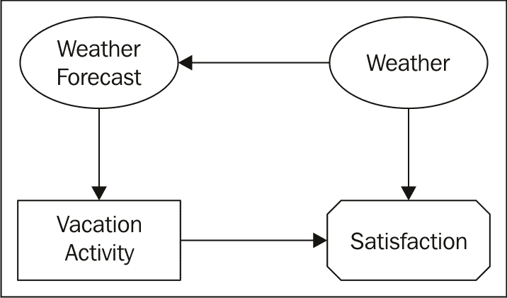
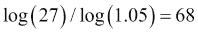
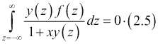
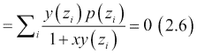

# 第二章 数据管道和建模

我们在上一章中已经探讨了探索数据的基本动手工具，因此我们现在可以深入探讨更复杂的主题，如统计模型构建和最优控制或科学驱动工具和问题。我提前声明，我们只会触及最优控制的一些主题，因为这本书真正关注的是 Scala 中的机器学习，而不是数据驱动业务管理的理论，这可能是一个单独成书的激动人心的主题。

在本章中，我将避免具体讨论 Scala 的实现，而是从高层次上讨论构建数据驱动企业的相关问题。后面的章节将解决这些难题的解决方案。特别强调处理不确定性。不确定性通常以几种形式出现：首先，我们提供的信息中可能存在噪声。其次，信息可能不完整。系统在填补缺失部分时可能有一定的自由度，这导致不确定性。最后，模型解释和结果指标可能存在差异。最后一个观点很微妙，因为大多数经典教科书都假设我们可以直接测量事物。不仅测量可能存在噪声，而且测量的定义可能随时间变化——尝试测量满意度或幸福感。当然，我们可以通过说我们只能优化可测量的指标来避免这种歧义，就像人们通常做的那样，但这将显著限制实际应用的范围。科学机器处理解释中的不确定性并没有什么阻止。

预测模型通常只是为了数据理解而构建。从语言学的推导来看，模型是对实际复杂建筑或过程的简化表示，其目的正是为了阐明观点和说服人们，无论通过何种方式。预测模型的最终目标，也就是我在本书和本章中关注的目标，是通过考虑最重要的因素来优化业务流程，以便让世界变得更美好。这当然是一个充满不确定性的句子，但至少它看起来比优化点击率要好得多。

让我们来看看传统的商业决策过程：一个传统的商业可能涉及一组 C 级高管基于通常从一组包含一个或多个数据库中数据图形表示的仪表板中获得的信息做出决策。自动化数据驱动商业的承诺是能够在消除人类偏见的不确定性下自动做出大多数决策。这并不是说我们不再需要 C 级高管，但 C 级高管将忙于帮助机器做出决策，而不是相反。

在本章中，我们将涵盖以下主题：

+   掌握影响图作为决策工具的基本知识

+   在自适应**马尔可夫决策过程**和**凯利准则**的背景下，研究纯决策优化变体

+   熟悉至少三种不同的探索-利用权衡策略

+   描述数据驱动企业的架构

+   讨论决策流程的主要架构组件

+   熟悉构建数据管道的标准工具

# 影响图

虽然决策过程可能有多个方面，但一本关于不确定性下决策的书如果没有提到影响图（*团队决策分析的影响图*，决策分析 2 (4): 207–228）将是不完整的，因为影响图有助于分析和理解决策过程。决策可能像在个性化环境中向用户展示下一篇新闻文章的选择这样平凡，也可能像在企业网络中检测恶意软件或选择下一个研究项目这样复杂。

根据天气情况，她可以尝试进行一次乘船旅行。我们可以将决策过程表示为图表。让我们决定是否在她待在俄勒冈州波特兰期间参加河上观光游：



图 02-1\. 一个简单的假期影响图，用于表示简单的决策过程。该图包含决策节点，如假期活动，以及可观察和不可观察的信息节点，如天气预报和天气，最后是价值节点，如满意度

前面的图表表示这种情况。是否参加活动的决策明显是由获得一定满意度的可能性驱动的，这是决策本身和活动当时天气的函数。虽然实际天气条件在旅行计划时是未知的，但我们相信天气预报和旅行期间实际经历的天气之间存在一定的相关性，这由**天气**和**天气预报**节点之间的边表示。**假期活动**节点是决策节点，它只有一个父节点，因为决策完全基于**天气预报**。DAG 中的最后一个节点是**满意度**，它是实际天气和我们在旅行计划期间所做的决策的函数——显然，“是 + 好天气”和“否 + 坏天气”可能得分最高。而“是 + 坏天气”和“否 + 好天气”将是一个不良的结果——后者可能只是错过了一个机会，但并不一定是一个糟糕的决定，前提是天气预报不准确。

边界的缺失包含了一个独立性假设。例如，我们相信**满意度**不应该依赖于**天气预报**，因为一旦我们上了船，后者就变得无关紧要。一旦度假计划确定，实际的水上活动中的天气状况就不再影响决策，该决策完全是基于天气预报做出的；至少在我们的简化模型中，我们排除了购买旅行保险的选项。

图表显示了决策的不同阶段和信息流（我们将在第七章 Chapter 7. Working with Graph Algorithms 中提供 Scala 的实际图表实现）。在我们的简化图中，做出决策只需要一条信息：天气预报。一旦做出决策，我们就无法更改它，即使我们拥有旅行时实际天气的信息。天气和决策数据可以用来模拟她对所做决策的满意度。

让我们将这种方法映射到一个广告问题作为说明：最终目标是获得用户对目标广告的满意度，这将为广告商带来额外的收入。满意度是用户特定环境状态的函数，在决策时是未知的。然而，使用机器学习算法，我们可以根据用户的最近网页访问历史和其他信息来预测这种状态，例如地理位置、浏览器代理字符串、一天中的时间、广告类别等等（参见图 02-2）。

虽然我们不太可能测量用户大脑中的多巴胺水平，这肯定会落入可测量指标的范畴，并可能减少不确定性，但我们可以通过用户的行为间接测量用户满意度，无论是他们是否对广告做出了回应，还是用户在点击浏览相关信息之间花费的时间，这些都可以用来估计我们建模和算法的有效性。以下是一个影响图，类似于“度假”的影响图，调整用于广告决策过程：


图 02-2. 调整到在线广告决策案例的度假影响图。在线广告的决策可以每秒做出数千次。

实际过程可能更复杂，代表了一系列决策，每个决策都依赖于几个先前的时段。例如，所谓的**马尔可夫链决策过程**。在这种情况下，图表可能需要在多个时段上重复。

另一个例子可能是企业网络互联网恶意软件分析系统。在这种情况下，我们试图根据对企业交换机流经的网络数据包的分析来检测指示**指挥与控制**（**C2**）、横向移动或数据泄露的网络连接。目标是最大限度地减少爆发对系统功能的最小影响。

我们可能做出的一个决定是重新映像节点的一个子集，或者至少将它们隔离。我们收集的数据可能包含不确定性——许多良性软件包可能会以可疑的方式发送流量，而模型需要根据风险和潜在影响将它们区分开来。在这个特定案例中的一个决定可能是收集更多信息。

我将把这个以及其他潜在的商业案例映射到相应的图表上作为练习留给读者。现在让我们考虑一个更复杂的优化问题。

# 顺序试验和风险管理

如果我为了多赚几美元而愿意承担损失同样金额的风险，那会怎样？我将在本节稍后解释为什么一个人的偏好可能是不对称的，并且有科学证据表明这种不对称性是由于进化原因而根植于我们心中的，但您是对的，我现在必须优化参数化效用函数的不对称函数的期望值，如下所示：


为什么不对称函数会在分析中显现出来？一个例子是重复投注或再投资，也称为凯利公式问题。虽然最初，凯利公式是为赌博机等二元结果的特定情况开发的，用于优化每轮投注的金钱比例（*《信息率的新解释》*，贝尔系统技术期刊 35 (4): 917–926，1956），但作为一个更通用的再投资问题，它涉及到可能回报的概率分布。

多次投注的回报是每次投注的个别回报率的乘积——回报率是投注后的资金与每次个别投注前的原始资金的比率，如下所示：


这对我们优化总回报帮助不大，因为我们不知道如何优化**独立同分布**随机变量的乘积。然而，我们可以通过对数变换将乘积转换为和，并应用**中心极限定理**（**CLT**）来近似**独立同分布**变量的和（假设*r*的分布满足 CLT 条件，例如，具有有限的均值和方差），如下所示：


因此，进行 *N* 次投注的累积结果将类似于进行 *N* 次预期收益为  的投注，而不是 

如我之前所述，这个问题最常应用于二元投标的情况，尽管它可以很容易地推广，在这种情况下，还有一个额外的参数：*x*，即每轮投注的金额。假设我以概率 *p* 获得利润 *W*，或者以概率 *(1-p)* 完全输掉赌注。优化以下附加参数的预期回报：


最后一个方程是凯利公式比率，它给出了最佳投注金额。

一个人可能会投注少于总额的原因是，即使平均回报是正的，仍然有可能输掉全部银行账户，尤其是在高度偏斜的情况下。例如，即使你投注获得 *10 x* 的概率为 *0.105* (*W = 10*，预期回报为 *5%)*，组合分析显示，即使经过 *60* 次投注，整体回报为负的大约概率为 *50%*，特别是有 *11%* 的概率会输掉 *(57 - 10 x 3) = 27* 倍的投注或更多：

```py
akozlov@Alexanders-MacBook-Pro$ scala
Welcome to Scala version 2.11.7 (Java HotSpot(TM) 64-Bit Server VM, Java 1.8.0_40).
Type in expressions to have them evaluated.
Type :help for more information.27 

scala> def logFactorial(n: Int) = { (1 to n).map(Math.log(_)).sum }
logFactorial: (n: Int)Double

scala> def cmnp(m: Int, n: Int, p: Double) = {
 |   Math.exp(logFactorial(n) -
 |   logFactorial(m) +
 |   m*Math.log(p) -
 |   logFactorial(n-m) +
 |   (n-m)*Math.log(1-p))
 | }
cmnp: (m: Int, n: Int, p: Double)Double

scala> val p = 0.105
p: Double = 0.105

scala> val n = 60
n: Int = 60

scala> var cumulative = 0.0
cumulative: Double = 0.0

scala> for(i <- 0 to 14) {
 |   val prob = cmnp(i,n,p)
 |   cumulative += prob
 |   println(f"We expect $i wins with $prob%.6f probability $cumulative%.3f cumulative (n = $n, p = $p).")
 | }
We expect 0 wins with 0.001286 probability 0.001 cumulative (n = 60, p = 0.105).
We expect 1 wins with 0.009055 probability 0.010 cumulative (n = 60, p = 0.105).
We expect 2 wins with 0.031339 probability 0.042 cumulative (n = 60, p = 0.105).
We expect 3 wins with 0.071082 probability 0.113 cumulative (n = 60, p = 0.105).
We expect 4 wins with 0.118834 probability 0.232 cumulative (n = 60, p = 0.105).
We expect 5 wins with 0.156144 probability 0.388 cumulative (n = 60, p = 0.105).
We expect 6 wins with 0.167921 probability 0.556 cumulative (n = 60, p = 0.105).
We expect 7 wins with 0.151973 probability 0.708 cumulative (n = 60, p = 0.105).
We expect 8 wins with 0.118119 probability 0.826 cumulative (n = 60, p = 0.105).
We expect 9 wins with 0.080065 probability 0.906 cumulative (n = 60, p = 0.105).
We expect 10 wins with 0.047905 probability 0.954 cumulative (n = 60, p = 0.105).
We expect 11 wins with 0.025546 probability 0.979 cumulative (n = 60, p = 0.105).
We expect 12 wins with 0.012238 probability 0.992 cumulative (n = 60, p = 0.105).
We expect 13 wins with 0.005301 probability 0.997 cumulative (n = 60, p = 0.105).
We expect 14 wins with 0.002088 probability 0.999 cumulative (n = 60, p = 0.105).

```

注意，为了收回 *27 x* 的金额，平均来说，只需要在这些有利赔率的条件下再玩  轮额外的游戏即可。但必须先有可以投注的金额。凯利公式指出，最佳策略是只投注我们银行账户的 *1.55%*。注意，如果我投注全部银行账户，我将在第一轮（获胜的概率仅为 *0.105*）以 89.5% 的确定性输掉所有钱。如果我只投注银行账户的一部分，留在游戏中的机会将无限好，但整体回报会较小。预期对数回报的图示如图 *02-3* 所示，它是银行账户投注比例 *x* 和我刚刚计算的 60 次投注可能结果分布的函数。在 24% 的游戏中，我们的表现将不如下方的曲线，在 39% 的游戏中不如下一条曲线，大约一半——44%——的赌徒的表现将与中间的黑色曲线相同或更好，而在 30% 的情况下表现将优于最上面的曲线。对于 *x* 的最佳凯利公式值为 *0.0155*，这将最终优化无限多轮次的整体回报：


图 02-3\. 投注金额和 60 轮可能结果作为函数的预期对数回报（参见方程式 (2.2)）

凯利公式因其过于激进（赌徒往往高估他们的获胜潜力/比率并低估破产的概率）以及过于保守（风险价值应该是总可用资本，而不仅仅是赌注）而受到批评，但它展示了我们需要用一些额外的转换来补偿我们对“收益”的直观理解的一个例子。

从金融角度来看，凯利公式比标准定义（如回报的波动性或方差）更好地描述了风险。对于具有概率分布函数*f(z)*的通用参数化收益分布*y(z)*，方程(2.3)可以重新表述如下。在替换*r(x) = 1 + x y(z)*后，其中*x*仍然是投注的金额：



在离散情况下，它也可以写成以下形式：



在这里，分母强调了来自负收益区域的贡献。具体来说，失去所有赌注的可能性正是分母为零的地方。

如我之前所述，有趣的是，风险规避植根于我们的直觉，似乎在人类和灵长类动物中编码了一个自然的风险规避偏好系统（劳里·桑托斯所著《像我们一样不理性的猴子经济》，TED 演讲，2010 年）。现在关于猴子与风险的话题就到这里，让我们进入另一个相当有争议的主题——探索-利用权衡，其中一个人可能甚至一开始都不知道收益权衡。

# 探索与利用

探索-利用权衡是另一个问题，尽管其真实应用范围从研究项目的资金分配到自动驾驶汽车，但其明显的起源在赌博中。传统的公式是多臂老虎机问题，它指的是一个或多个臂的想象中的老虎机。每个臂的连续操作生成具有未知概率的*i.i.d* `.`回报；在简化模型中，连续操作是独立的。假设奖励在臂之间是独立的。目标是最大化奖励——例如，赢得的金额，并最小化学习损失，即花费在获胜率低于最优的臂上的金额，前提是有一个商定的臂选择策略。明显的权衡在于**探索**以寻找产生最佳回报的臂和**利用**已知最佳回报的臂：


**伪后悔**是指以下差异：


这里， 是从 *N* 次试验中选出的 *i* 臂。多臂老虎机问题在 1930 年代和 2000 年代初被广泛研究，应用在金融和 ADTECH 中。虽然由于问题的随机性，通常无法提供一个比 *N* 的平方根更好的预期遗憾界限，但伪遗憾可以被控制，以便我们能够将其限制为 *N* 的对数（Sebastien Bubeck 和 Nicolo Cesa-Bianchi 的《随机和非随机多臂老虎机问题的遗憾分析》，[`arxiv.org/pdf/1204.5721.pdf`](http://arxiv.org/pdf/1204.5721.pdf)）。

在实践中最常用的策略之一是 epsilon 策略，其中最优臂以  的概率被选中，而其他臂以剩余的概率被选中。这种方法的缺点是我们可能会在永远不会提供任何奖励的臂上花费大量的探索资源。UCB 策略通过选择回报估计最大的臂，加上一些回报估计标准差的倍数或分数来改进 epsilon 策略。这种方法需要在每一轮重新计算最佳臂，并受到用于估计均值和标准差的近似的影响。此外，UCB 需要为每次连续抽取重新计算估计值，这可能会成为可扩展性问题。

最后，Thompson 抽样策略使用 Beta-Bernoulli 后验估计的固定随机样本，并将下一个臂分配给给出最小预期遗憾的臂，这样可以使用真实数据来避免参数重新计算。尽管具体数字可能取决于假设，以下图表提供了一个可用于比较这些模型性能的可用比较：


图 02-3\. K = 5，单臂老虎机，不同策略的探索利用策略模拟结果。

*图 02-3* 展示了不同策略的模拟结果（摘自 Rich Relevance 网站上的 [`engineering.richrelevance.com/recommendations-thompson-sampling`](http://engineering.richrelevance.com/recommendations-thompson-sampling)）。**随机**策略只是随机分配臂，对应于纯探索。**朴素**策略在某个阈值内是随机的，然后切换到纯利用模式。**上置信界**（**UCB**）置信水平为 95%。UCB1 是对 UCB 的修改，以考虑分布的对数正态性。最后，Thompson 抽样策略从实际后验分布中随机抽样以优化遗憾。

探索/利用模型众所周知对初始条件和异常值非常敏感，尤其是在低响应方面。一个人可以在本质上已经失败的武器上花费巨大的试验。

通过基于额外信息（如位置）估计更好的先验概率，或者由于这种额外信息而限制探索武器的集合——*K*——，可以可能地对策略进行其他改进，但这些方面更具有领域特定性（如个性化或在线广告）。

# 未知之未知

未知之未知因其与美国国防部长唐纳德·拉姆斯菲尔德在 2002 年 2 月 12 日的一次美国国防部（**DoD**）新闻发布会上对关于伊拉克政府与向恐怖组织供应大规模杀伤性武器缺乏证据的提问的回答中的一句话而广为人知，以及纳西姆·尼古拉斯·塔勒布的书籍（《黑天鹅：几乎不可能发生的事件的影响》由纳西姆·尼古拉斯·塔勒布著，Random House 出版社，2007 年）。

### 备注

**火鸡悖论**

不可否认，未知之未知可以通过火鸡悖论来更好地解释。假设你有一群火鸡在后院玩耍，享受保护和免费食物。栅栏的另一边，还有另一群火鸡。这一切日复一日，月复一月，直到感恩节来临——感恩节是加拿大和美国庆祝的全国性假日，在这一天，人们习惯于在烤箱里烤火鸡。火鸡很可能在这个时候被收割并消费，尽管从火鸡的角度来看，加拿大 10 月第二个星期一和美国 11 月第四个星期四没有任何明显的信号表明会发生任何事情。除了额外的年度信息之外，没有任何模型可以在火鸡的角度上解决这个问题。

未知之未知是那些不在模型中且无法预测将出现在模型中的东西。在现实中，唯一真正感兴趣的未知之未知是那些对模型影响如此之大，以至于之前几乎不可能或几乎不可能发生的结果现在变成了现实。鉴于大多数实际分布都属于指数家族，尾部非常薄，因此，与正常分布的偏差不必超过几个标准差，就会对标准模型假设产生破坏性的影响。尽管人们仍然需要想出一个可操作的策略来如何在模型中包含未知因素——已经提出了几种方法，包括分形，但很少有可操作的——从业者必须意识到风险，这里的定义就是模型无用的可能性。当然，已知之未知和未知之未知之间的区别正是我们理解风险和需要探索的内容。

当我们审视决策系统面临的基本问题范围时，让我们看看数据管道，提供决策信息的软件系统，以及为数据驱动系统设计数据管道的更实际方面。

# 数据驱动系统的基本组件

简而言之，数据驱动架构包含以下组件——至少我所见到的所有系统都有这些组件——或者可以简化为这些组件：

+   **数据摄取**: 我们需要从系统和设备中收集数据。大多数系统都有日志，或者至少有将文件写入本地文件系统的选项。一些系统可能具有将信息报告给基于网络的接口（如 syslog）的能力，但通常没有持久化层意味着可能存在数据丢失的风险，如果没有审计信息的话。

+   **数据转换层**: 它也被称为**提取、转换和加载**（**ETL**）。今天，数据转换层也可以用于实时处理，其中聚合是在最新数据上计算的。数据转换层也传统上用于重新格式化和索引数据，以便由管道下方的算法 UI 组件高效访问。

+   **数据分析与机器学习引擎**: 这不是标准数据转换层的一部分的原因通常是因为这个层需要相当不同的技能。构建合理统计模型的人的心态通常与那些使数以千计的数据快速移动的人不同，尽管偶尔我也能找到具备这两种技能的人。通常，这些“独角兽”被称为数据科学家，但任何特定领域的技能通常都不如那些专注于特定领域的人。尽管如此，我们仍然需要更多这样的人。另一个原因是机器学习，以及在某种程度上数据分析，需要多次对相同数据进行聚合和遍历，这与更流式的 ETL 转换不同，需要不同的引擎。

+   **UI 组件**: 是的，UI 代表用户界面，它通常是一组组件，允许您通过浏览器与系统进行通信（过去通常是本地 GUI，但如今基于 Web 的 JavaScript 或 Scala 框架要强大得多，且更易于移植）。从数据管道和建模的角度来看，这个组件提供了一个 API 来访问数据和模型的内部分布。

+   **动作引擎**: 这通常是一个可配置的规则引擎，根据洞察力优化提供的指标。动作可以是实时的，例如在线广告，在这种情况下，引擎应该能够提供实时评分信息，或者为用户动作提供推荐，这可能以电子邮件警报的形式出现。

+   **关联引擎**：这是一个新兴组件，它可以分析数据分析引擎和机器学习引擎的输出，以推断出关于数据或模型行为的额外见解。该层的输出也可能触发这些操作。

+   **监控**：这是一个复杂的系统，如果没有日志记录、监控以及某种方式来更改系统参数，它将是不完整的。监控的目的是拥有一个关于系统最佳健康状况的嵌套决策系统，要么自动减轻问题（*s*），要么向系统管理员发出关于问题（*s*）的警报。

在接下来的几节中，我们将详细讨论每个组件。

## 数据摄取

随着智能设备的普及，信息收集不再是问题，而是任何从事除打字文本之外业务的企业的一种必要性。为了本章的目的，我将假设设备或设备已连接到互联网或以某种方式通过家庭拨号或直接网络连接传递此信息。

此组件的主要目的是收集所有可能对进一步的数据驱动决策有相关性的相关信息。以下表格提供了关于数据摄取最常见实现的详细信息：

| 框架 | 使用时 | 备注 |
| --- | --- | --- |
| **Syslog** | Syslog 是 Unix 机器之间传递消息的最常见标准之一。Syslog 通常监听端口 514，传输协议可以配置为 UDP（不可靠）或 TCP。在 CentOS 和 Red Hat Linux 上的最新增强实现是 rsyslog，它包括许多高级选项，如基于正则表达式的过滤，这对于系统性能调整和调试非常有用。除了略微低效的原始消息表示——纯文本，这可能对重复字符串的长消息效率不高——syslog 系统可以每秒支持数万条消息。 | Syslog 是 1980 年代由 Eric Allman 作为 Sendmail 的一部分开发的最早协议之一。虽然它不保证交付或持久性，尤其是对于分布式系统，但它是最广泛的消息传递协议之一。一些后来的框架，如 Flume 和 Kafka，也有 syslog 接口。 |
| **Rsync** | Rsync 是在 1990 年代开发的一个较年轻的框架。如果数据被放在本地文件系统上的平面文件中，rsync 可能是一个选择。虽然 rsync 传统上用于同步两个目录，但它也可以定期运行以批量传输日志数据。Rsync 使用澳大利亚计算机程序员 Andrew Tridgell 发明的递归算法，以高效地检测差异并在接收计算机已经有一个类似但不完全相同的结构版本的情况下，通过通信链路传输结构（如文件）。虽然它会产生额外的通信，但从耐久性的角度来看，它更好，因为原始副本总是可以检索。如果已知日志数据最初是以批量形式到达的（例如上传或下载），则特别适用。 | Rsync 已知会受到网络瓶颈的限制，因为它在比较目录结构时最终会在网络上传递更多信息。然而，传输的文件在通过网络传输时可能会被压缩。可以通过命令行标志限制网络带宽。 |
| **Flume** | Flume 是 Cloudera 在 2009-2011 年间开发的一个较年轻的框架，并且已经开源。Flume——我们指的是更流行的 flume-ng 实现，称为 Flume，而不是较老的常规 Flume——由源、管道和可能在多个节点上配置以实现高可用性和冗余目的的汇组成。Flume 被设计为在可靠性的代价下可能重复数据的情况下出错。Flume 以 **Avro** 格式传递消息，该格式也是开源的，传输协议，以及消息可以被编码和压缩。 | 虽然 Flume 最初是为了从文件或一组文件中传输记录而开发的，但它也可以配置为监听端口，甚至从数据库中抓取记录。Flume 有多个适配器，包括前面的 syslog。 |
| **Kafka** | Kafka 是 LinkedIn 开发的日志处理框架的最新补充，并且已经开源。与之前的框架相比，Kafka 更像是一个分布式可靠的消息队列。Kafka 维护一个分区，可能分布在多个分布式机器上；缓冲区，并且可以订阅或取消订阅特定主题的消息。Kafka 是在考虑了强大的可靠性保证的情况下构建的，这是通过复制和共识协议实现的。Kafka 对于小型系统（小于五个节点）可能不太合适，因为完全分布式系统的优势可能只有在更大规模时才会明显。Kafka 由 Confluent 商业支持。 |

信息传输通常以批量或微批量的形式发生，如果需求接近实时，则可能以微批量形式。通常，信息首先存储在设备本地文件系统中的一个文件中，传统上称为日志，然后传输到中央位置。最近开发的 Kafka 和 Flume 经常用于管理这些传输，同时还有更传统的 syslog、rsync 或 netcat。最后，数据可以存储在本地或分布式存储中，如 HDFS、Cassandra 或 Amazon S3。

## 数据转换层

数据最终存储在 HDFS 或其他存储中后，需要使数据可用于处理。传统上，数据按计划处理，并最终按时间桶分区。处理可以按日、按小时，甚至在新 Scala 流框架的基础上按分钟以下进行，具体取决于延迟要求。处理可能涉及一些初步的特征构建或矢量化，尽管它传统上被认为是机器学习任务。以下表格总结了一些可用的框架：

| 框架 | 当使用时 | 评论 |
| --- | --- | --- |
| **Oozie** | 这是雅虎（Yahoo）开发的最古老的开放源框架之一。它与大数据 Hadoop 工具具有良好的集成。它具有有限的用户界面，列出了作业历史。 | 整个工作流被放入一个大的 XML 文件中，这可能从模块化角度来看被认为是一个缺点。 |
| **Azkaban** | 这是由领英（LinkedIn）开发的一个替代开源工作流调度框架。与 Oozie 相比，它可能具有更好的用户界面。缺点是所有高级任务都在本地执行，这可能会带来可扩展性问题。 | Azkaban 背后的理念是创建一个完全模块化的即插即用架构，其中新作业/任务可以尽可能少地修改后添加。 |
| **StreamSets** | StreamSets 是由前 Informix 和 Cloudera 的开发者构建的最新产品。它具有非常发达的用户界面，并支持更丰富的输入源和输出目标。 | 这是一个完全由用户界面驱动的工具，强调数据管理，例如，持续监控数据流中的问题和异常。 |

应当特别关注流处理框架，其中延迟要求降低到每次一个或几个记录。首先，流处理通常需要更多的资源用于处理，因为与处理记录批次相比，逐个处理记录的成本更高，即使只有几十或几百条记录也是如此。因此，架构师需要根据更近期结果的价值来证明额外成本是合理的，而这并不总是有保证的。其次，流处理需要对架构进行一些调整，因为处理最新数据成为优先事项；例如，最近随着像**Druid**([`druid.io`](http://druid.io))这样的系统，一个 delta 架构，其中最新数据由一个单独的子流或一组节点处理，变得非常流行。

## 数据分析和机器学习

为了本章的目的，**机器学习**（**ML**）是指任何可以计算可操作聚合或摘要的算法。我们将从第三章*使用 Spark 和 MLlib*到第六章*处理非结构化数据*涵盖更复杂的算法，但在某些情况下，一个简单的滑动窗口平均值和偏离平均值可能就足够作为采取行动的信号。在过去几年中，A/B 测试中的“它起作用了”某种程度成为模型构建和部署的令人信服的论据。我并不是在猜测是否可能或不可能应用坚实的科学原理，但许多基本假设，如*i.i.d.*、平衡设计和尾部稀薄性，在许多大数据情况下都未能成立。简单的模型往往更快，性能和稳定性更好。

例如，在在线广告中，人们可能会跟踪一组广告在一段时间内某些相似属性的平均性能，以决定是否显示该广告。关于异常或偏离先前行为的信息可能是一个信号，表明出现了新的未知未知，这表明旧数据不再适用，在这种情况下，系统别无选择，只能开始新的探索周期。

我将在第六章*处理非结构化数据*，第八章*Scala 与 R 和 Python 的集成*和第九章*Scala 中的 NLP*中稍后讨论更复杂的非结构化、图和模式挖掘。

## UI 组件

嗯，UI 是给弱者的！只是开玩笑...也许有点严厉，但现实中，UI 通常呈现一种必要的语法糖，以说服数据科学家之外的人群。一个好的分析师可能只需通过查看数字表格就能找出 t 检验的概率。

然而，可能应该应用我们在本章开头使用的方法，评估不同组件的有用性和投入的周期数量。良好的 UI 的存在往往是合理的，但取决于目标受众。

首先，存在许多现有的用户界面(UI)和报告框架。不幸的是，其中大部分与函数式编程方法不匹配。此外，复杂/半结构化数据的存在，我将在第六章“处理非结构化数据”中更详细地描述，为许多框架带来了新的挑战，它们在没有实现某种领域特定语言(DSL)的情况下可能无法应对。以下是我认为特别值得注意的几个用于在 Scala 项目中构建 UI 的框架：

| 框架 | 使用场景 | 评论 |
| --- | --- | --- |
| **Scala Swing** | 如果你熟悉 Java 中的 Swing 组件，Scala Swing 是一个不错的选择。Swing 组件可以说是 Java 中最不便携的组件，因此在不同平台上的表现可能会有所不同。 | `Scala.swing`包在底层使用标准的 Java Swing 库，但它有一些很好的补充。最值得注意的是，由于它是为 Scala 设计的，它可以比标准的 Swing 以更简洁的方式使用。 |
| **Lift** | Lift 是一个安全、以开发者为中心、可扩展和交互式的框架，用 Scala 编写。Lift 在 Apache 2.0 许可下开源。 | 开源 Lift 框架于 2007 年由 David Polak 启动，他对 Ruby on Rails 框架的某些方面不满意。任何现有的 Java 库和 Web 容器都可以用于运行 Lift 应用程序。因此，Lift Web 应用程序被打包成 WAR 文件，并部署在任何 servlet 2.4 引擎上（例如，Tomcat 5.5.xx、Jetty 6.0 等）。Lift 程序员可以使用标准的 Scala/Java 开发工具链，包括 Eclipse、NetBeans 和 IDEA 等 IDE。动态 Web 内容通过模板使用标准的 HTML5 或 XHTML 编辑器编写。Lift 应用程序还受益于对高级 Web 开发技术的本地支持，如 Comet 和 Ajax。 |
| **Play** | Play 框架可以说是与 Scala 作为函数式语言比其他任何平台都更匹配——它得到了 Scala 背后的商业公司 Typesafe 的官方支持。Play 框架 2.0 建立在 Scala、Akka 和 sbt 的基础上，提供卓越的异步请求处理、快速和可靠的性能。Typesafe 模板以及一个功能强大的构建系统，具有灵活的部署选项。Play 在 Apache 2.0 许可下开源。 | 开源 Play 框架是由 Guillaume Bort 于 2007 年创建的，他希望将受现代 Web 框架如 Ruby on Rails 启发的全新 Web 开发体验带给长期受苦的 Java Web 开发社区。Play 遵循熟悉的无状态模型-视图-控制器（MVC）架构模式，强调约定优于配置和开发者生产力。与传统的 Java Web 框架相比，它们有繁琐的编译-打包-部署-重启周期，Play 应用程序的更新只需简单的浏览器刷新即可立即可见。 |
| **Dropwizard** | dropwizard 项目（[www.dropwizard.io](http://www.dropwizard.io)）试图在 Java 和 Scala 中构建一个通用的 RESTful 框架，尽管最终可能使用 Java 多于 Scala。这个框架的优点是它足够灵活，可以用于任意复杂的数据（包括半结构化数据）。这是在 Apache License 2.0 许可下发布的。 | RESTful API 假设状态，而函数式语言则避免使用状态。除非你足够灵活，可以偏离纯函数式方法，否则这个框架可能不适合你。 |
| **Slick** | 虽然 Slick 不是一个 UI 组件，但它却是 Typesafe 为 Scala 提供的现代数据库查询和访问库，可以作为 UI 后端使用。它允许你几乎像使用 Scala 集合一样处理存储的数据，同时，让你完全控制数据库访问发生的时间和传输的数据。你还可以直接使用 SQL。如果你的所有数据都是纯关系型数据，请使用它。这是在 BSD 风格许可下开源的。 | Slick 是由 Stefan Zeiger 于 2012 年开始的，主要由 Typesafe 维护。它主要用于关系型数据。 |
| **NodeJS** | Node.js 是一个基于 Chrome 的 V8 JavaScript 引擎构建的 JavaScript 运行时。Node.js 使用事件驱动、非阻塞 I/O 模型，使其轻量级且高效。Node.js 的包生态系统 npm 是世界上最大的开源库生态系统。它在 MIT 许可下开源。 | Node.js 最初于 2009 年由 Ryan Dahl 和其他在 Joyent 工作的开发者引入。最初 Node.js 只支持 Linux，但现在它可以在 OS X 和 Windows 上运行。 |
| **AngularJS** | AngularJS ([`angularjs.org`](https://angularjs.org)) 是一个前端开发框架，旨在简化单页 Web 应用程序的开发。这是在 MIT 许可证下开源的。 | AngularJS 最初于 2009 年由 Misko Hevery 在 Brat Tech LLC 开发。AngularJS 主要由 Google 和一群个人开发者及企业维护，因此专门针对 Android 平台（从版本 1.3 开始不再支持 IE8）。 |

## 行动引擎

虽然这是数据导向系统管道的核心，但也许也是最简单的一个。一旦知道了指标和值系统，系统就会根据已知的方程，根据提供的信息决定是否采取某些行动。虽然基于阈值的触发器是最常见的实现方式，但呈现给用户一系列可能性和相关概率的概率方法的重要性正在显现——或者像搜索引擎一样，只向用户展示最相关的 *N* 个选择。

规则的管理可能会变得相当复杂。过去，使用规则引擎（如 **Drools** ([`www.drools.org`](http://www.drools.org)））管理规则是足够的。然而，管理复杂的规则成为一个经常需要开发领域特定语言（*Martin Fowler 的《领域特定语言*》，Addison-Wesley，2010）的问题。Scala 特别适合开发这样的行动引擎。

## 相关性引擎

决策系统越复杂，就越需要二级决策系统来优化其管理。DevOps 正在转变为 DataOps（由 Michael Stonebraker 等人撰写的《*Getting Data Right*》，Tamr，2015）。关于数据驱动系统性能收集的数据用于检测异常和半自动化维护。

模型通常会受到时间漂移的影响，性能可能会因为数据收集层的变化或人群行为的变化而下降（我将在第十章高级模型监控中介绍模型漂移，*高级模型监控*）。模型管理的另一个方面是跟踪模型性能，在某些情况下，通过各种共识方案使用“集体”智能。

## 监控

监控一个系统涉及收集有关系统性能的信息，无论是为了审计、诊断还是性能调整。虽然它与前面章节中提出的问题有关，但监控解决方案通常包含诊断和存储解决方案以及关键数据的持久化，例如飞机上的黑匣子。在 Java 和 Scala 世界中，一个流行的选择工具是 Java 性能豆，它可以在 Java 控制台中进行监控。虽然 Java 本地支持 MBean 以通过 JMX 揭示 JVM 信息，但 **Kamon** ([`kamon.io`](http://kamon.io)) 是一个开源库，它使用这种机制专门暴露 Scala 和 Akka 的度量。

一些其他流行的监控开源解决方案是 **Ganglia** ([`ganglia.sourceforge.net/`](http://ganglia.sourceforge.net/)) 和 **Graphite** ([`graphite.wikidot.com`](http://graphite.wikidot.com))。

我在这里就停止了，因为我将在第十章 高级模型监控中更详细地讨论系统和模型监控。

# 优化和交互性

虽然收集到的数据可以仅用于理解业务，但任何数据驱动型企业的最终目标是通过自动做出基于数据和模型的决定来优化业务行为。我们希望将人为干预降到最低。以下简化图可以描述为一个循环：


图 02-4\. 预测模型生命周期

当新信息进入系统时，这个循环会反复进行。系统参数可能被调整以改善整体系统性能。

## 反馈循环

尽管人类可能仍然会在大多数系统中保持参与，但最近几年出现了一些能够独立管理完整反馈循环的系统——从广告系统到自动驾驶汽车。

这个问题的经典公式是最优控制理论，它也是一个优化问题，旨在最小化成本泛函，给定一组描述系统的微分方程。最优控制是一组控制策略，用于在给定约束条件下最小化成本泛函。例如，问题可能是找到一种方法来驾驶汽车以最小化其燃油消耗，前提是它必须在不超过某个时间限制内完成给定的课程。另一个控制问题是在满足库存和时间约束的情况下，最大化网站上的广告利润。大多数最优控制软件包是用其他语言（如 C 或 MATLAB）编写的（PROPT、SNOPT、RIOTS、DIDO、DIRECT 和 GPOPS），但可以与 Scala 接口。

然而，在许多情况下，优化或状态转换的参数，或者微分方程，并不确定。**马尔可夫决策过程**（**MDPs**）提供了一个数学框架来模拟在结果部分随机且部分受决策者控制的情况下的决策。在 MDPs 中，我们处理一组可能的状态和一组动作。"奖励"和状态转换既取决于状态也取决于动作。MDPs 对于研究通过动态规划和强化学习解决的广泛优化问题是有用的。

# 摘要

在本章中，我描述了一个设计数据驱动企业的整体架构和途径。我还向您介绍了影响图，这是一种理解传统和数据驱动企业中决策如何做出的工具。我简要介绍了几个关键模型，如凯利准则和多臂老虎机，这些模型对于从数学角度展示问题至关重要。在此基础上，我介绍了几种马尔可夫决策过程方法，其中我们处理基于先前决策和观察结果的决策策略。我深入探讨了构建决策数据管道的更多实际方面，描述了可以用来构建它们的主要组件和框架。我还讨论了在不同阶段和节点之间传达数据和建模结果的问题，包括向用户展示结果、反馈循环和监控。

在下一章中，我将描述 MLlib，这是一个用 Scala 编写的在分布式节点集上执行机器学习的库。
