# 第三章。使用 Spark 和 MLlib

现在我们已经了解了统计和机器学习在全球数据驱动企业架构中的位置和如何应用，让我们专注于 Spark 和 MLlib 的具体实现，MLlib 是 Spark 之上的机器学习库。Spark 是大数据生态系统中的相对较新成员，它优化了内存使用而不是磁盘。数据仍然可以在必要时溢出到磁盘，但 Spark 只有在被明确指令或活动数据集不适合内存时才会执行溢出。Spark 存储 lineage 信息，以便在节点故障或由于其他原因信息从内存中删除时重新计算活动数据集。这与传统的 MapReduce 方法形成对比，在每次 map 或 reduce 任务之后，数据都会持久化到磁盘。

Spark 特别适合在分布式节点集上执行迭代或统计机器学习算法，并且可以扩展到核心之外。唯一的限制是所有 Spark 节点可用的总内存和磁盘空间以及网络速度。我将在本章中介绍 Spark 架构和实现的基础知识。

可以通过简单地更改配置参数来指导 Spark 在单个节点或一组节点上执行数据管道。当然，这种灵活性是以稍微重一些的框架和更长的设置时间为代价的，但框架非常易于并行化，并且由于大多数现代笔记本电脑已经是多线程且足够强大，这通常不会成为一个大问题。

在本章中，我们将涵盖以下主题：

+   如果您还没有这样做，请安装和配置 Spark

+   学习 Spark 架构的基础以及为什么它与 Scala 语言天生紧密相连

+   学习为什么 Spark 是继顺序实现和 Hadoop MapReduce 之后的下一代技术

+   学习 Spark 组件

+   查看 Scala 和 Spark 中单词计数的简单实现

+   查看流式单词计数实现

+   看看如何从分布式文件或分布式数据库创建 Spark DataFrames

+   学习 Spark 性能调优

# 设置 Spark

如果您还没有这样做，您可以从[`spark.apache.org/downloads.html`](http://spark.apache.org/downloads.html)下载预构建的 Spark 包。写作时的最新版本是**1.6.1**：

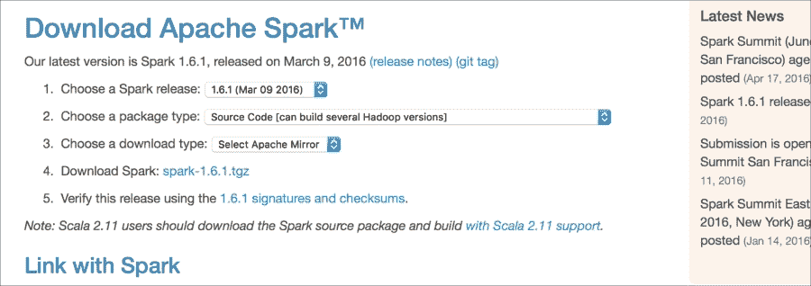

图 03-1\. http://spark.apache.org 上的下载站点，以及本章推荐的选择

或者，您可以通过从[`github.com/apache/spark`](https://github.com/apache/spark)下载完整的源代码分布来构建 Spark：

```py
$ git clone https://github.com/apache/spark.git
Cloning into 'spark'...
remote: Counting objects: 301864, done.
...
$ cd spark
$sh ./ dev/change-scala-version.sh 2.11
...
$./make-distribution.sh --name alex-build-2.6-yarn --skip-java-test --tgz -Pyarn -Phive -Phive-thriftserver -Pscala-2.11 -Phadoop-2.6
...

```

该命令将下载必要的依赖项，并在 Spark 目录中创建`spark-2.0.0-SNAPSHOT-bin-alex-spark-build-2.6-yarn.tgz`文件；版本号为 2.0.0，因为它是在撰写本文时的下一个发布版本。通常情况下，除非你对最新功能感兴趣，否则你不想从主干分支构建。如果你想获取发布版本，可以检出相应的标签。可通过`git branch –r`命令查看可用的完整版本列表。`spark*.tgz`文件是你在任何安装了 Java JRE 的机器上运行 Spark 所需的所有内容。

伴随`docs/building-spark.md`文档的分布，该文档描述了构建 Spark 的其他选项及其描述，包括增量 Scala 编译器 zinc。下一个 Spark 2.0.0 版本的发布正在努力实现对 Scala 2.11 的全支持。

# 理解 Spark 架构

并行执行涉及将工作负载拆分为在不同线程或不同节点上执行的子任务。让我们看看 Spark 是如何做到这一点的，以及它是如何管理子任务之间的执行和通信的。

## 任务调度

Spark 工作负载拆分由 Spark 的基本抽象**弹性分布式数据集**（**RDD**）的分区数量以及管道结构决定。RDD 表示一个不可变、分区的元素集合，可以在并行操作上执行。虽然具体细节可能取决于 Spark 运行的模式，以下图表捕捉了 Spark 任务/资源调度的过程：

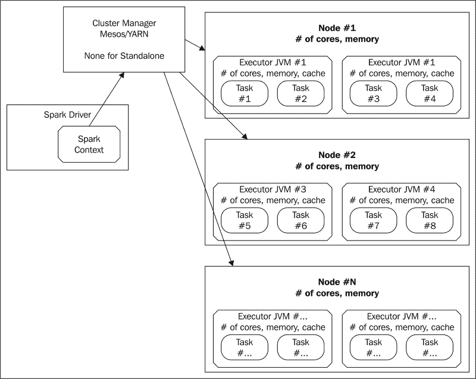

图 3-2。一个通用的 Spark 任务调度图。虽然图示中没有明确显示，但 Spark Context 会打开一个 HTTP UI，通常在端口 4040（并发上下文将打开 4041、4042 等），在任务执行期间存在。Spark Master UI 通常为 8080（尽管在 CDH 中已更改为 18080），Worker UI 通常为 7078。每个节点可以运行多个执行器，每个执行器可以运行多个任务。

### 小贴士

您会发现 Spark，以及 Hadoop，有很多参数。其中一些作为环境变量指定（参考`$SPARK_HOME/conf/spark-env.sh`文件），还有一些可以作为命令行参数提供。此外，一些具有预定义名称的文件可以包含将改变 Spark 行为的参数，例如`core-site.xml`。这可能会让人困惑，我将在本章和下一章尽可能多地涵盖这些内容。如果您正在使用**Hadoop 分布式文件系统**（**HDFS**），那么`core-site.xml`和`hdfs-site.xml`文件将包含 HDFS 主节点的指针和规范。选择此文件的要求是它必须位于`CLASSPATH` Java 进程中，这可以通过指定`HADOOP_CONF_DIR`或`SPARK_CLASSPATH`环境变量来设置。与开源项目一样，有时您需要 grep 代码来理解各种参数的工作方式，因此，在您的笔记本电脑上保留源代码树副本是个好主意。

集群中的每个节点可以运行一个或多个执行器，每个执行器可以调度一系列任务以执行 Spark 操作。Spark 驱动程序负责调度执行，并与集群调度器（如 Mesos 或 YARN）协同工作以调度可用资源。Spark 驱动程序通常在客户端机器上运行，但在最新版本中，它也可以在集群管理器下运行。YARN 和 Mesos 具有动态管理每个节点上并发运行的执行器数量的能力，前提是资源约束允许。

在独立模式下，**Spark Master** 执行集群调度器的工作——在资源分配方面可能不太高效，但在没有预配置的 Mesos 或 YARN 的情况下，它总比没有好。Spark 标准发行版在`sbin`目录中包含用于在独立模式下启动 Spark 的 shell 脚本。Spark Master 和驱动程序直接与运行在各个节点上的一个或多个 Spark 工作节点通信。一旦 Master 启动，您可以使用以下命令启动 Spark shell：

```py
$ bin/spark-shell --master spark://<master-address>:7077

```

### 小贴士

注意，您始终可以在本地模式下运行 Spark，这意味着所有任务都将在一个单独的 JVM 中执行，通过指定`--master local[2]`，其中`2`是必须至少为`2`的线程数。实际上，我们将在本书中非常频繁地使用本地模式来运行小型示例。

Spark shell 是从 Spark 的角度来看的一个应用程序。一旦您启动一个 Spark 应用程序，您将在 Spark Master UI（或相应的集群管理器）中的**运行中的应用程序**下看到它，它可以将您重定向到 Spark 应用程序 HTTP UI（在 4040 端口），在那里可以看到子任务执行时间线和其他重要属性，如环境设置、类路径、传递给 JVM 的参数以及资源使用信息（参见图 3-3）：

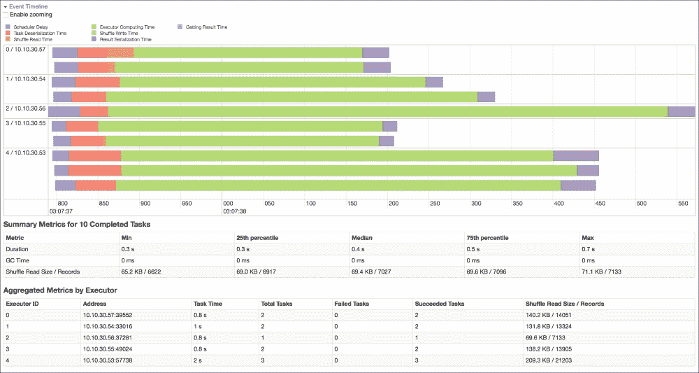

图 03-3\. 独立模式 Spark 驱动程序 UI 中的时间分解

正如我们所见，使用 Spark，可以通过提供 `--master` 命令行选项、设置 `MASTER` 环境变量或修改 `spark-defaults.conf`（应在执行期间位于类路径上）来轻松地在本地和集群模式之间切换，或者甚至可以直接在 Scala 中使用 `SparkConf` 对象的 `setters` 方法显式设置，这将在后面介绍：

| 集群管理器 | MASTER 环境变量 | 备注 |
| --- | --- | --- |
| 本地（单节点，多线程） | `local[n]` | *n* 是要使用的线程数，应大于或等于 *2*。如果您想 Spark 与其他 Hadoop 工具（如 Hive）通信，您仍然需要通过设置 `HADOOP_CONF_DIR` 环境变量或将 Hadoop `*-site.xml` 配置文件复制到 `conf` 子目录中来将其指向集群。 |
| 独立（在节点上运行的守护进程） | `spark:// master-address>:7077` | 此版本在 `$SPARK_HOME/sbin` 目录中有一组启动/停止脚本。这也支持高可用性模式。更多详细信息请参阅 [`spark.apache.org/docs/latest/spark-standalone.html`](https://spark.apache.org/docs/latest/spark-standalone.html)。 |
| Mesos | `mesos://host:5050` 或 `mesos://zk://host:2181`(多主) | 在这里，您需要设置 `MESOS_NATIVE_JAVA_LIBRARY=<libmesos.so 路径>` 和 `SPARK_EXECUTOR_URI=<spark-1.5.0.tar.gz URL>`。默认为细粒度模式，其中每个 Spark 任务作为一个单独的 Mesos 任务运行。用户还可以指定粗粒度模式，其中 Mesos 任务在应用程序运行期间持续存在。优点是总启动成本较低。在粗粒度模式下可以使用动态分配（请参阅以下 URL）。更多详细信息请参阅 [`spark.apache.org/docs/latest/running-on-mesos.html`](https://spark.apache.org/docs/latest/running-on-mesos.html)。 |
| YARN | `yarn` | Spark 驱动程序可以在集群中运行，也可以在客户端节点上运行，客户端节点由 `--deploy-mode` 参数（集群或客户端，shell 只能在客户端模式下运行）管理。将 `HADOOP_CONF_DIR` 或 `YARN_CONF_DIR` 设置为指向 YARN 配置文件的路径。使用 `--num-executors` 标志或 `spark.executor.instances` 属性设置固定数量的执行器（默认）。将 `spark.dynamicAllocation.enabled` 设置为 `true` 以根据应用程序需求动态创建/销毁执行器。更多详细信息请参阅 [`spark.apache.org/docs/latest/running-on-yarn.html`](https://spark.apache.org/docs/latest/running-on-yarn.html)。 |

最常见的端口是 8080（主 UI）和 4040（应用程序 UI）。其他 Spark 端口总结在下表中：

| 独立端口 |   |   |   |
| --- | --- | --- | --- | --- |
| 从 | 到 | 默认端口 | 目的 | 配置设置 |
| --- | --- | --- | --- | --- |
| 浏览器 | 独立主节点 | 8080 | Web UI | `spark.master.ui.port /SPARK_MASTER_WEBUI_PORT` |
| 浏览器 | 独立工作节点 | 8081 | Web UI | `spark.worker.ui.port /SPARK_WORKER_WEBUI_PORT` |
| 驱动器/独立工作节点 | 独立主节点 | 7077 | 提交作业到集群 / 加入集群 | `SPARK_MASTER_PORT` |
| 独立主节点 | 独立工作节点 | (随机) | 调度执行器 | `SPARK_WORKER_PORT` |
| 执行器/独立主节点 | 驱动器 | (随机) | 连接到应用程序 / 通知执行器状态变化 | `spark.driver.port` |
| **其他端口** |   |
| **从** | **到** | **默认端口** | **用途** | **配置设置** |
| 浏览器 | 应用程序 | 4040 | Web UI | `spark.ui.port` |
| 浏览器 | 历史服务器 | 18080 | Web UI | `spark.history.ui.port` |
| 驱动器 | 执行器 | (随机) | 调度任务 | `spark.executor.port` |
| 执行器 | 驱动器 | (随机) | 文件服务器（用于文件和 JAR 包） | `spark.fileserver.port` |
| 执行器 | 驱动器 | (随机) | HTTP 广播 | `spark.broadcast.port` |

此外，一些文档作为源代码的一部分，在 `docs` 子目录中提供，但可能已过时。

## Spark 组件

自从 Spark 诞生以来，已经编写了多个利用 Spark 缓存 RDD 能力的应用程序：Shark、Spork（Spark 上的 Pig）、图库（GraphX、GraphFrames）、流处理、MLlib 等；其中一些将在本章和后续章节中介绍。

在本节中，我将介绍 Spark 中用于收集、存储和分析数据的主要架构组件。虽然我将在第二章（“数据管道和建模”）中介绍更完整的数据生命周期架构，但以下是 Spark 特定的组件：


图 03-4\. Spark 架构和组件。

## MQTT、ZeroMQ、Flume 和 Kafka

所有这些都是在不丢失和重复的情况下可靠地将数据从一个地方移动到另一个地方的不同方式。它们通常实现发布-订阅模型，其中多个编写者和读者可以从不同的队列中写入和读取，并具有不同的保证。Flume 作为第一个分布式日志和事件管理实现脱颖而出，但它正逐渐被 Kafka 所取代，Kafka 是一个功能齐全的发布-订阅分布式消息队列，可选地跨分布式节点集持久化，由 LinkedIn 开发。我们在上一章中简要介绍了 Flume 和 Kafka。Flume 配置基于文件，传统上用于将消息从 Flume 源发送到 Flume 沉积器。其中一种流行的源是 `netcat`——监听端口的原始数据。例如，以下配置描述了一个代理每 30 秒（默认）接收数据并将其写入 HDFS 的情况：

```py
# Name the components on this agent
a1.sources = r1
a1.sinks = k1
a1.channels = c1

# Describe/configure the source
a1.sources.r1.type = netcat
a1.sources.r1.bind = localhost
a1.sources.r1.port = 4987

# Describe the sink (the instructions to configure and start HDFS are provided in the Appendix)
a1.sinks.k1.type=hdfs
a1.sinks.k1.hdfs.path=hdfs://localhost:8020/flume/netcat/data
a1.sinks.k1.hdfs.filePrefix=chapter03.example
a1.sinks.k1.channel=c1
a1.sinks.k1.hdfs.writeFormat = Text

# Use a channel which buffers events in memory
a1.channels.c1.type = memory
a1.channels.c1.capacity = 1000
a1.channels.c1.transactionCapacity = 100

# Bind the source and sink to the channel
a1.sources.r1.channels = c1
a1.sinks.k1.channel = c1
```

此文件作为本书提供的代码的一部分包含在 `chapter03/conf` 目录中。让我们下载并启动 Flume 代理（使用提供的 MD5 校验和检查[`flume.apache.org/download.html`](http://flume.apache.org/download.html)）：

```py
$ wget http://mirrors.ocf.berkeley.edu/apache/flume/1.6.0/apache-flume-1.6.0-bin.tar.gz
$ md5sum apache-flume-1.6.0-bin.tar.gz
MD5 (apache-flume-1.6.0-bin.tar.gz) = defd21ad8d2b6f28cc0a16b96f652099
$ tar xf apache-flume-1.6.0-bin.tar.gz
$ cd apache-flume-1.6.0-bin
$ ./bin/flume-ng agent -Dlog.dir=. -Dflume.log.level=DEBUG,console -n a1 -f ../chapter03/conf/flume.conf
Info: Including Hadoop libraries found via (/Users/akozlov/hadoop-2.6.4/bin/hadoop) for HDFS access
Info: Excluding /Users/akozlov/hadoop-2.6.4/share/hadoop/common/lib/slf4j-api-1.7.5.jar from classpath
Info: Excluding /Users/akozlov/hadoop-2.6.4/share/hadoop/common/lib/slf4j-log4j12-1.7.5.jar from classpath
...

```

现在，在单独的窗口中，你可以输入一个 `netcat` 命令将文本发送到 Flume 代理：

```py
$ nc localhost 4987
Hello
OK
World
OK

...

```

Flume 代理将首先创建一个 `*.tmp` 文件，然后将其重命名为没有扩展名的文件（文件扩展名可以用来过滤正在写入的文件）：

```py
$ bin/hdfs dfs -text /flume/netcat/data/chapter03.example.1463052301372
16/05/12 04:27:25 WARN util.NativeCodeLoader: Unable to load native-hadoop library for your platform... using builtin-java classes where applicable
1463052302380  Hello
1463052304307  World

```

在这里，每一行都是一个以毫秒为单位的 Unix 时间和接收到的数据。在这种情况下，我们将数据放入 HDFS，然后 Spark/Scala 程序可以对其进行分析，我们可以排除以 `*.tmp` 文件名模式写入的文件。然而，如果你真的对最后一分钟的数据值感兴趣，Spark 以及一些其他平台支持流式处理，我将在接下来的几节中介绍。

## HDFS、Cassandra、S3 和 Tachyon

HDFS、Cassandra、S3 和 Tachyon 是将数据存入持久存储和计算节点的方式，根据不同的保证进行必要的操作。HDFS 是作为 Hadoop 的一部分实现的分布式存储，为 Hadoop 生态系统中的许多产品提供后端服务。HDFS 将每个文件划分为块，默认大小为 128 MB，并将每个块存储在至少三个节点上。尽管 HDFS 是可靠的，并支持高可用性，但关于 HDFS 存储的一般抱怨是它速度较慢，尤其是在机器学习方面。Cassandra 是一种通用键/值存储，也存储行的多个副本，并可以配置为支持不同的一致性级别以优化读写速度。Cassandra 相比于 HDFS 模型的优势在于它没有中央主节点；读写操作基于共识算法完成。然而，这有时可能会反映在 Cassandra 的稳定性上。S3 是亚马逊存储：数据存储在集群之外，这影响了 I/O 速度。最后，最近开发的 Tachyon 声称利用节点的内存来优化节点间工作集的访问。

此外，新的后端正在不断开发中，例如 Cloudera 的 Kudu ([`getkudu.io/kudu.pdf`](http://getkudu.io/kudu.pdf)) 和 GridGain 的 **Ignite 文件系统** (**IGFS**) ([`apacheignite.gridgain.org/v1.0/docs/igfs)`](http://apacheignite.gridgain.org/v1.0/docs/igfs))。两者都是开源的，并拥有 Apache 许可证。

## Mesos、YARN 和 Standalone

如前所述，Spark 可以在不同的集群资源调度器下运行。这些是用于在集群上调度 Spark 容器和任务的多种实现。调度器可以被视为集群内核，执行类似于操作系统内核的功能：资源分配、调度、I/O 优化、应用程序服务和用户界面。

Mesos 是最早的集群管理器之一，它使用与 Linux 内核相同的原理构建，只是在不同的抽象级别上。Mesos 从节点在每个机器上运行，并提供跨整个数据中心和云环境的资源管理和调度 API。Mesos 使用 C++ 编写。

YARN 是由 Yahoo 开发的一个较新的集群管理器。YARN 中的每个节点运行一个**Node Manager**，它与可能运行在单独节点上的**资源管理器**进行通信。资源管理器调度任务以满足内存和 CPU 限制。Spark 驱动器本身可以在集群中运行，这被称为 YARN 的集群模式。否则，在客户端模式下，只有 Spark 执行器在集群中运行，而调度 Spark 管道的驱动器运行在运行 Spark shell 或提交程序的同一台机器上。在这种情况下，Spark 执行器将通过一个随机开放的端口与本地主机通信。YARN 是用 Java 编写的，其后果是 GC 暂停不可预测，这可能会使延迟的长尾更宽。

最后，如果这些资源调度器都不可用，独立部署模式将在每个节点上启动一个`org.apache.spark.deploy.worker.Worker`进程，该进程与作为`org.apache.spark.deploy.master.Master`运行的 Spark Master 进程进行通信。工作进程完全由主进程管理，可以运行多个执行器和任务（参见图 3-2）。

在实际实现中，建议通过驱动器的 UI 跟踪程序的并行度和所需资源，并调整并行度和可用内存，如果需要的话增加并行度。在下一节中，我们将开始探讨 Scala 和 Spark 中的 Scala 如何解决不同的问题。

# 应用程序

让我们考虑一些 Spark/Scala 中的实际例子和库，从一个非常传统的单词计数问题开始。

## 单词计数

大多数现代机器学习算法需要对数据进行多次遍历。如果数据可以适应单台机器的内存，数据就可以随时可用，这不会成为性能瓶颈。然而，如果数据变得太大而无法适应 RAM，可以选择将数据的一部分（或数据库）写入磁盘，这大约慢 100 倍，但容量要大得多，或者在网络中的多台机器之间分割数据集并传输结果。尽管仍有持续的争论，但对于大多数实际系统，分析表明，在一系列网络连接的节点上存储数据，与在单个节点上反复从硬盘存储和读取数据相比，略有优势，尤其是如果我们能够有效地在多个 CPU 之间分配工作负载。

### 小贴士

平均磁盘的带宽约为 100 MB/sec，传输延迟为几毫秒，这取决于旋转速度和缓存。这比从内存中读取数据慢大约 100 倍，具体取决于数据大小和缓存实现。现代数据总线可以以超过 10 GB/sec 的速度传输数据。虽然网络速度仍然落后于直接内存访问，尤其是在标准 TCP/IP 内核网络层开销的情况下，但专用硬件可以达到数十 GB/sec，如果并行运行，其速度可能接近从内存中读取。实际上，网络传输速度在 1 到 10 GB/sec 之间，但在大多数实际系统中仍然比磁盘快。因此，我们有可能将数据放入所有集群节点的组合内存中，并在它们组成的系统中执行迭代机器学习算法。

然而，内存的一个问题是它不能在节点故障和重启后持续存在。一个流行的大数据框架 Hadoop，在原始的 Dean/Ghemawat 论文（Jeff Dean 和 Sanjay Ghemawat, *MapReduce: Simplified Data Processing on Large Clusters*, OSDI, 2004）的帮助下成为可能，正是使用磁盘层持久性来保证容错性和存储中间结果。一个 Hadoop MapReduce 程序首先会在数据集的每一行上运行一个`map`函数，输出一个或多个键值对。这些键值对随后会被排序、分组并按键聚合，以便具有相同键的记录最终会在同一个 reducer 上一起处理，这个 reducer 可能运行在同一个或另一个节点上。reducer 应用一个`reduce`函数，遍历为相同键发出的所有值，并相应地聚合它们。中间结果的持久性将保证如果 reducer 由于一个或另一个原因失败，可以丢弃部分计算，并从检查点保存的结果重新启动 reduce 计算。许多简单的 ETL 类似的应用只遍历数据集一次，并且从一条记录到另一条记录只保留很少的信息作为状态。

例如，MapReduce 的一个传统应用是词频统计。程序需要计算由文本行组成的文档中每个单词出现的次数。在 Scala 中，词频统计可以很容易地表示为对排序单词列表应用`foldLeft`方法：

```py
val lines = scala.io.Source.fromFile("...").getLines.toSeq
val counts = lines.flatMap(line => line.split("\\W+")).sorted.
  foldLeft(List[(String,Int)]()){ (r,c) =>
    r match {
      case (key, count) :: tail =>
        if (key == c) (c, count+1) :: tail
        else (c, 1) :: r
        case Nil =>
          List((c, 1))
  }
}
```

如果我运行这个程序，输出将是一个包含(word, count)元组的列表。程序将行分割成单词，对单词进行排序，然后将每个单词与(word, count)元组列表中的最新条目进行匹配。在 MapReduce 中，同样的计算可以表示如下：

```py
val linesRdd = sc.textFile("hdfs://...")
val counts = linesRdd.flatMap(line => line.split("\\W+"))
    .map(_.toLowerCase)
    .map(word => (word, 1)).
    .reduceByKey(_+_)
counts.collect
```

首先，我们需要通过将行分割成单词并生成 `(word, 1)` 对来处理文本的每一行。这个任务很容易并行化。然后，为了并行化全局计数，我们需要通过为单词子集分配一个执行计数的任务来分割计数部分。在 Hadoop 中，我们计算单词的哈希值并根据哈希值来划分工作。

一旦 map 任务找到了给定哈希的所有条目，它就可以将键值对发送到 reducer，发送部分通常在 MapReduce 术语中称为 shuffle。reducer 等待从所有 mapper 收到所有键值对，合并值——如果可能的话，在 mapper 上也可以进行部分合并——并计算整体聚合，在这种情况下就是求和。单个 reducer 将看到给定单词的所有值。

让我们看看 Spark 中单词计数操作的日志输出（Spark 默认非常详细，您可以通过修改 `conf/log4j.properties` 文件来管理详细程度，将 `INFO` 替换为 `ERROR` 或 `FATAL`）：

```py
$ wget http://mirrors.sonic.net/apache/spark/spark-1.6.1/spark-1.6.1-bin-hadoop2.6.tgz
$ tar xvf spark-1.6.1-bin-hadoop2.6.tgz
$ cd spark-1.6.1-bin-hadoop2.6
$ mkdir leotolstoy
$ (cd leotolstoy; wget http://www.gutenberg.org/files/1399/1399-0.txt)
$ bin/spark-shell 
Welcome to
 ____              __
 / __/__  ___ _____/ /__
 _\ \/ _ \/ _ `/ __/  '_/
 /___/ .__/\_,_/_/ /_/\_\   version 1.6.1
 /_/

Using Scala version 2.11.7 (Java HotSpot(TM) 64-Bit Server VM, Java 1.8.0_40)
Type in expressions to have them evaluated.
Type :help for more information.
Spark context available as sc.
SQL context available as sqlContext.
scala> val linesRdd = sc.textFile("leotolstoy", minPartitions=10)
linesRdd: org.apache.spark.rdd.RDD[String] = leotolstoy MapPartitionsRDD[3] at textFile at <console>:27

```

在这个阶段，唯一发生的事情是对元数据的操作，Spark 本身还没有触及数据。Spark 估计数据集的大小和分区数。默认情况下，这是 HDFS 块的数量，但我们可以通过 `minPartitions` 参数显式指定最小分区数：

```py
scala> val countsRdd = linesRdd.flatMap(line => line.split("\\W+")).
 | map(_.toLowerCase).
 | map(word => (word, 1)).
 | reduceByKey(_+_)
countsRdd: org.apache.spark.rdd.RDD[(String, Int)] = ShuffledRDD[5] at reduceByKey at <console>:31

```

我们刚刚定义了另一个由原始 `linesRdd` 衍生出来的 RDD：

```py
scala> countsRdd.collect.filter(_._2 > 99)
res3: Array[(String, Int)] = Array((been,1061), (them,841), (found,141), (my,794), (often,105), (table,185), (this,1410), (here,364), (asked,320), (standing,132), ("",13514), (we,592), (myself,140), (is,1454), (carriage,181), (got,277), (won,153), (girl,117), (she,4403), (moment,201), (down,467), (me,1134), (even,355), (come,667), (new,319), (now,872), (upon,207), (sister,115), (veslovsky,110), (letter,125), (women,134), (between,138), (will,461), (almost,124), (thinking,159), (have,1277), (answer,146), (better,231), (men,199), (after,501), (only,654), (suddenly,173), (since,124), (own,359), (best,101), (their,703), (get,304), (end,110), (most,249), (but,3167), (was,5309), (do,846), (keep,107), (having,153), (betsy,111), (had,3857), (before,508), (saw,421), (once,334), (side,163), (ough...

```

对超过 2 GB 的文本数据进行单词计数——40,291 行和 353,087 个单词——读取、分割和按单词分组所需时间不到一秒。

通过扩展日志记录，您可以看到以下内容：

+   Spark 打开一些端口以与执行器和用户进行通信

+   Spark UI 在 `http://localhost:4040` 的 4040 端口上运行

+   您可以从本地或分布式存储（HDFS、Cassandra 和 S3）读取文件

+   如果 Spark 是与 Hive 支持一起构建的，它将连接到 Hive

+   Spark 使用惰性求值，仅在必要时或需要输出时才执行管道

+   Spark 使用内部调度器将作业拆分为任务，优化执行，并执行任务

+   结果存储到 RDDs 中，这些 RDDs 可以被保存或通过 collect 方法被带到执行 shell 的节点 RAM 中

平行性能调优的艺术在于在不同节点或线程之间分配工作量，以便开销相对较小且工作量平衡。

## 流式单词计数

Spark 支持监听传入的流，对其进行分区，并接近实时地计算聚合。目前支持的资源包括 Kafka、Flume、HDFS/S3、Kinesis、Twitter，以及传统的消息队列如 ZeroMQ 和 MQTT。在 Spark 中，流式处理被实现为微批处理。内部，Spark 将输入数据划分为微批处理，通常大小从几秒到几分钟，并对这些微批处理执行 RDD 聚合操作。

例如，让我们扩展我们之前讨论的 Flume 示例。我们需要修改 Flume 配置文件以创建一个 Spark 轮询接收器。将接收器部分替换为 HDFS：

```py
# The sink is Spark
a1.sinks.k1.type=org.apache.spark.streaming.flume.sink.SparkSink
a1.sinks.k1.hostname=localhost
a1.sinks.k1.port=4989

```

现在，Flume 不再直接写入 HDFS，而是等待 Spark 轮询数据：

```py
object FlumeWordCount {
  def main(args: Array[String]) {
    // Create the context with a 2 second batch size
    val sparkConf = new SparkConf().setMaster("local[2]").setAppName("FlumeWordCount")
    val ssc = new StreamingContext(sparkConf, Seconds(2))
    ssc.checkpoint("/tmp/flume_check")
    val hostPort=args(0).split(":")
    System.out.println("Opening a sink at host: [" + hostPort(0) + "] port: [" + hostPort(1).toInt + "]")
    val lines = FlumeUtils.createPollingStream(ssc, hostPort(0), hostPort(1).toInt, StorageLevel.MEMORY_ONLY)
    val words = lines
      .map(e => new String(e.event.getBody.array)).map(_.toLowerCase).flatMap(_.split("\\W+"))
      .map(word => (word, 1L))
      .reduceByKeyAndWindow(_+_, _-_, Seconds(6), Seconds(2)).print
    ssc.start()
    ssc.awaitTermination()
  }
}
```

要运行程序，在一个窗口中启动 Flume 代理：

```py
$ ./bin/flume-ng agent -Dflume.log.level=DEBUG,console -n a1 –f ../chapter03/conf/flume-spark.conf
...

```

然后在另一个窗口中运行`FlumeWordCount`对象：

```py
$ cd ../chapter03
$ sbt "run-main org.akozlov.chapter03.FlumeWordCount localhost:4989
...

```

现在，任何输入到`netcat`连接中的文本将被分成单词，并且每两秒计数一次，滑动窗口为六秒：

```py
$ echo "Happy families are all alike; every unhappy family is unhappy in its own way" | nc localhost 4987
...
-------------------------------------------
Time: 1464161488000 ms
-------------------------------------------
(are,1)
(is,1)
(its,1)
(family,1)
(families,1)
(alike,1)
(own,1)
(happy,1)
(unhappy,2)
(every,1)
...

-------------------------------------------
Time: 1464161490000 ms
-------------------------------------------
(are,1)
(is,1)
(its,1)
(family,1)
(families,1)
(alike,1)
(own,1)
(happy,1)
(unhappy,2)
(every,1)
...

```

Spark/Scala 允许在流源之间无缝切换。例如，Kafka 发布/订阅主题模型的相同程序看起来类似于以下内容：

```py
object KafkaWordCount {
  def main(args: Array[String]) {
    // Create the context with a 2 second batch size
    val sparkConf = new SparkConf().setMaster("local[2]").setAppName("KafkaWordCount")
    val ssc = new StreamingContext(sparkConf, Seconds(2))
    ssc.checkpoint("/tmp/kafka_check")
    System.out.println("Opening a Kafka consumer at zk:[" + args(0) + "] for group group-1 and topic example")
    val lines = KafkaUtils.createStream(ssc, args(0), "group-1", Map("example" -> 1), StorageLevel.MEMORY_ONLY)
    val words = lines
      .flatMap(_._2.toLowerCase.split("\\W+"))
      .map(word => (word, 1L))
      .reduceByKeyAndWindow(_+_, _-_, Seconds(6), Seconds(2)).print
    ssc.start()
    ssc.awaitTermination()
  }
}
```

要启动 Kafka 代理，首先下载最新的二进制发行版并启动 ZooKeeper。ZooKeeper 是一个分布式服务协调器，即使在单节点部署中，Kafka 也需要它：

```py
$ wget http://apache.cs.utah.edu/kafka/0.9.0.1/kafka_2.11-0.9.0.1.tgz
...
$ tar xf kafka_2.11-0.9.0.1.tgz
$ bin/zookeeper-server-start.sh config/zookeeper.properties
...

```

在另一个窗口中，启动 Kafka 服务器：

```py
$ bin/kafka-server-start.sh config/server.properties
...

```

运行`KafkaWordCount`对象：

```py
$ sbt "run-main org.akozlov.chapter03.KafkaWordCount localhost:2181"
...

```

现在，将单词流发布到 Kafka 主题将产生窗口计数：

```py
$ echo "Happy families are all alike; every unhappy family is unhappy in its own way" | ./bin/kafka-console-producer.sh --broker-list localhost:9092 --topic example
...

$ sbt "run-main org.akozlov.chapter03.FlumeWordCount localhost:4989
...
-------------------------------------------
Time: 1464162712000 ms
-------------------------------------------
(are,1)
(is,1)
(its,1)
(family,1)
(families,1)
(alike,1)
(own,1)
(happy,1)
(unhappy,2)
(every,1)

```

如您所见，程序每两秒输出一次。Spark 流有时被称为**微批处理**。流处理有许多其他应用（和框架），但这是一个太大的话题，不能完全在这里讨论，需要单独介绍。我将在第五章 *回归和分类* 中介绍一些数据流上的机器学习。现在，让我们回到更传统的类似 SQL 的接口。

## Spark SQL 和 DataFrame

DataFrame 是 Spark 相对较新的功能，自 1.3 版本引入，允许用户使用标准 SQL 语言进行数据分析。我们已经在第一章 *探索性数据分析* 中使用了一些 SQL 命令进行探索性数据分析。SQL 对于简单的探索性分析和数据聚合来说非常好用。

根据最新的民意调查结果，大约 70%的 Spark 用户使用 DataFrame。尽管 DataFrame 最近已成为处理表格数据最流行的框架，但它是一个相对较重的对象。使用 DataFrame 的管道可能比基于 Scala 的向量或 LabeledPoint 的管道执行得慢得多，这将在下一章中讨论。不同开发者的证据表明，响应时间可以根据查询从数十毫秒到数百毫秒不等，对于更简单的对象甚至可以低于毫秒。

Spark 实现了自己的 SQL shell，除了标准的 Scala REPL shell 外还可以调用：`./bin/spark-sql`可以用来访问现有的 Hive/Impala 或关系型数据库表：

```py
$ ./bin/spark-sql
…
spark-sql> select min(duration), max(duration), avg(duration) from kddcup;
…
0  58329  48.34243046395876
Time taken: 11.073 seconds, Fetched 1 row(s)

```

在标准的 Spark REPL 中，可以通过运行以下命令执行相同的查询：

```py
$ ./bin/spark-shell
…
scala> val df = sqlContext.sql("select min(duration), max(duration), avg(duration) from kddcup"
16/05/12 13:35:34 INFO parse.ParseDriver: Parsing command: select min(duration), max(duration), avg(duration) from alex.kddcup_parquet
16/05/12 13:35:34 INFO parse.ParseDriver: Parse Completed
df: org.apache.spark.sql.DataFrame = [_c0: bigint, _c1: bigint, _c2: double]
scala> df.collect.foreach(println)
…
16/05/12 13:36:32 INFO scheduler.DAGScheduler: Job 2 finished: collect at <console>:22, took 4.593210 s
[0,58329,48.34243046395876]

```

# 机器学习库

Spark，尤其是与基于内存的存储系统结合使用，声称显著提高了节点内和节点间的数据访问速度。机器学习似乎是一个自然的选择，因为许多算法需要多次遍历数据或重新分区。MLlib 是首选的开源库，尽管私有公司正在赶上，并推出了自己的专有实现。

正如我将在第五章中详细说明的，*回归与分类*，大多数标准机器学习算法都可以表示为一个优化问题。例如，经典线性回归最小化回归线与实际值*y*之间的平方和距离：

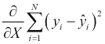

这里，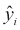是根据线性表达式预测的值：

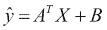

*A* 通常被称为斜率，而 *B* 被称为截距。在更一般的公式中，线性优化问题是最小化一个加性函数：

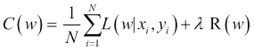

这里，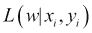是一个损失函数，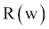是一个正则化函数。正则化函数是模型复杂度的递增函数，例如参数的数量（或其自然对数）。以下表格给出了最常见的损失函数：

|   | 损失函数 L | 梯度 |
| --- | --- | --- |
| 线性 | 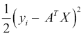 | 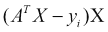 |
| 逻辑回归 |  |  |
| 拉伸 | 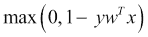 | 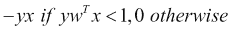 |

正则化器的目的是惩罚更复杂的模型，以避免过拟合并提高泛化误差：目前 MLlib 支持以下正则化器：

|   | 正则化器 R | 梯度 |
| --- | --- | --- |
| L2 | 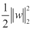 | 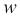 |
| L1 |  | 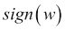 |
| 弹性网络 | 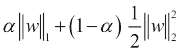 | 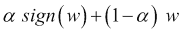 |

这里，*sign(w)* 是所有 *w* 条目的符号向量。

目前，MLlib 包括以下算法的实现：

+   基本统计：

    +   概率统计

    +   相关系数

    +   分层抽样

    +   假设检验

    +   流式显著性检验

    +   随机数据生成

+   分类与回归：

    +   线性模型（支持向量机、逻辑回归和线性回归）

    +   朴素贝叶斯

    +   决策树

    +   树的集成（随机森林和梯度提升树）

    +   等距回归

+   协同过滤：

    +   **交替最小二乘法**（**ALS**）

+   聚类：

    +   k 均值

    +   高斯混合

    +   **幂迭代聚类**（**PIC**）

    +   **潜在狄利克雷分配**（**LDA**）

    +   二分 k 均值

    +   流式 k-means

+   维度约简：

    +   **奇异值分解**（**SVD**）

    +   **主成分分析**（**PCA**）

+   特征提取和转换

+   频繁模式挖掘：

    +   FP-growth 关联规则

    +   PrefixSpan

+   优化：

    +   **随机梯度下降**（**SGD**）

    +   **有限内存 BFGS**（**L-BFGS**）

我将在第五章 回归和分类 中介绍一些算法。更复杂的非结构化机器学习方法将在第六章 处理非结构化数据 中考虑。

## SparkR

R 是由约翰·查默斯在贝尔实验室工作时创建的一种流行的 S 编程语言的实现。R 目前由 **R 统计计算基金会** 支持。根据调查，R 的普及率近年来有所增加。SparkR 为从 R 使用 Apache Spark 提供了一个轻量级的前端。从 Spark 1.6.0 开始，SparkR 提供了一个支持选择、过滤、聚合等操作的分布式 DataFrame 实现，这与 R DataFrames、dplyr 类似，但适用于非常大的数据集。SparkR 还支持使用 MLlib 进行分布式机器学习。

SparkR 需要 R 版本 3 或更高版本，可以通过 `./bin/sparkR` shell 调用。我将在第八章 集成 Scala 与 R 和 Python 中介绍 SparkR，*集成 Scala 与 R 和 Python*。

## 图算法 – GraphX 和 GraphFrames

图算法是节点间正确分配最困难的算法之一，除非图本身是自然划分的，即它可以表示为一组不连接的子图。由于 Facebook、Google 和 LinkedIn 等公司使得在数百万节点规模上的社交网络分析变得流行，研究人员一直在提出新的方法来形式化图表示、算法和提出的问题类型。

GraphX 是一个现代的图计算框架，由 2013 年的一篇论文描述（Reynold Xin、Joseph Gonzalez、Michael Franklin 和 Ion Stoica 的 *GraphX: A Resilient Distributed Graph System on Spark*，GRADES (SIGMOD workshop)，2013）。它有图并行框架如 Pregel 和 PowerGraph 作为前身。图由两个 RDD 表示：一个用于顶点，另一个用于边。一旦 RDD 被连接，GraphX 支持类似 Pregel 的 API 或类似 MapReduce 的 API，其中 map 函数应用于节点的邻居，reduce 是在 map 结果之上的聚合步骤。

在撰写本文时，GraphX 包含以下图算法的实现：

+   PageRank

+   连通分量

+   三角计数

+   标签传播

+   SVD++（协同过滤）

+   强连通分量

由于 GraphX 是一个开源库，预期列表会有所变化。GraphFrames 是 Databricks 的新实现，完全支持以下三种语言：Scala、Java 和 Python，并且建立在 DataFrames 之上。我将在 第七章 *使用图算法* 中讨论具体的实现。

# Spark 性能调优

虽然数据管道的高效执行是任务调度器的特权，它是 Spark 驱动程序的一部分，但有时 Spark 需要提示。Spark 调度主要受两个参数驱动：CPU 和内存。当然，其他资源，如磁盘和网络 I/O，在 Spark 性能中也扮演着重要角色，但 Spark、Mesos 或 YARN 目前都无法积极管理它们。

首先要关注的是 RDD 分区数，当从文件中读取 RDD 时可以显式指定。Spark 通常倾向于过多的分区，因为它提供了更多的并行性，并且在许多情况下确实有效，因为任务设置/拆除时间相对较小。然而，人们可能会尝试减少分区数，尤其是在进行聚合操作时。

每个 RDD 的分区数和并行级别由 `$SPARK_HOME/conf/spark-defaults.conf` 配置文件中定义的 `spark.default.parallelism` 参数确定。也可以通过 `coalesce()` 或 `repartition()` 方法显式地更改特定 RDD 的分区数。

核心总数和可用内存经常是死锁的原因，因为任务无法进一步执行。在通过命令行调用 spark-submit、spark-shell 或 PySpark 时，可以使用 `--executor-cores` 标志指定每个执行器的核心数。或者，也可以在前面讨论过的 `spark-defaults.conf` 文件中设置相应的参数。如果核心数设置得太高，调度器将无法在节点上分配资源，从而导致死锁。

以类似的方式，`--executor-memory`（或 `spark.executor.memory` 属性）指定了所有任务请求的堆大小（默认为 1g）。如果执行器内存设置得太高，同样，调度器可能会死锁，或者只能在节点上调度有限数量的执行器。

在独立模式（Standalone mode）下，在计算核心数和内存时隐含的假设是 Spark 是唯一运行的应用程序——这可能是也可能不是真的。当在 Mesos 或 YARN 下运行时，配置集群调度器以使其有资源来调度 Spark Driver 请求的执行器非常重要。相关的 YARN 属性是：`yarn.nodemanager.resource.cpu-vcores`和`yarn.nodemanager.resource.memory-mb`。YARN 可能会将请求的内存向上取整一点。YARN 的`yarn.scheduler.minimum-allocation-mb`和`yarn.scheduler.increment-allocation-mb`属性分别控制最小和增量请求值。

JVMs 也可以使用一些堆外内存，例如，用于内部字符串和直接字节缓冲区。`spark.yarn.executor.memoryOverhead`属性的值被添加到执行器内存中，以确定每个执行器对 YARN 的完整内存请求。默认值为最大值（*384, .07 * spark.executor.memory*）。

由于 Spark 可以在执行器和客户端节点之间内部传输数据，因此高效的序列化非常重要。我将在第六章*处理非结构化数据*中考虑不同的序列化框架，但 Spark 默认使用 Kryo 序列化，这要求类必须显式地在静态方法中注册。如果你在代码中看到序列化错误，很可能是因为相应的类尚未注册或 Kryo 不支持它，就像在过于嵌套和复杂的数据类型中发生的那样。一般来说，建议避免在执行器之间传递复杂对象，除非对象序列化可以非常高效地进行。

驱动器有类似的参数：`spark.driver.cores`、`spark.driver.memory`和`spark.driver.maxResultSize`。后者设置了使用`collect`方法收集的所有执行器的结果限制。保护驱动器进程免受内存不足异常非常重要。避免内存不足异常及其后续问题的另一种方法是修改管道以返回聚合或过滤后的结果，或者使用`take`方法代替。

# 运行 Hadoop HDFS

一个分布式处理框架如果没有分布式存储就不会完整。其中之一是 HDFS。即使 Spark 在本地模式（local mode）下运行，它仍然可以使用后端分布式文件系统。就像 Spark 将计算分解为子任务一样，HDFS 将文件分解为块并在多台机器上存储它们。对于高可用性（HA），HDFS 为每个块存储多个副本，副本的数量称为副本级别，默认为三个（参见图 3-5）。

**NameNode** 通过记住块位置和其他元数据（如所有者、文件权限和块大小，这些是文件特定的）来管理 HDFS 存储。**Secondary Namenode** 是一个轻微的错误名称：其功能是将元数据修改、编辑合并到 fsimage 中，或者是一个充当元数据库的文件。合并是必要的，因为将 fsimage 的修改写入单独的文件比直接将每个修改应用到 fsimage 的磁盘映像更实际（除了在内存中应用相应的更改）。Secondary **Namenode** 不能作为 **Namenode** 的第二个副本。运行 **Balancer** 以将块移动到服务器，以保持服务器之间大约相等的磁盘使用率——如果空间足够且客户端不在集群内运行，节点上的初始块分配应该是随机的。最后，**Client** 与 **Namenode** 通信以获取元数据和块位置，但之后，要么直接读取或写入数据到节点，其中存储着块的副本。客户端是唯一可以在 HDFS 集群外运行的组件，但它需要与集群中所有节点建立网络连接。

如果任何节点死亡或从网络断开连接，**Namenode** 会注意到变化，因为它通过心跳不断与节点保持联系。如果节点在 10 分钟内（默认值）没有重新连接到 **Namenode**，**Namenode** 将开始复制块，以实现节点上丢失的块所需的复制级别。**Namenode** 中的单独块扫描线程将扫描块以查找可能的位错——每个块维护一个校验和——并将损坏的和孤立的块删除：

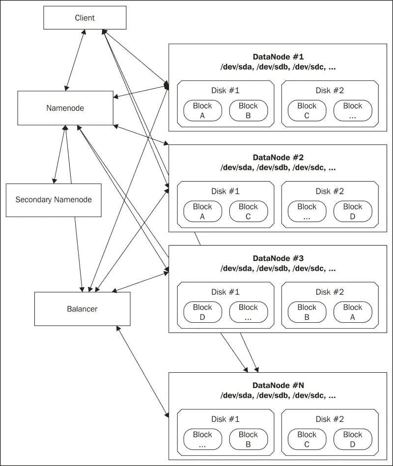

图 03-5\. 这是 HDFS 架构。每个块存储在三个不同的位置（复制级别）。

1.  要在您的机器上启动 HDFS（复制级别为 1），下载一个 Hadoop 发行版，例如，从 [`hadoop.apache.org`](http://hadoop.apache.org)：

    ```py
    $ wget ftp://apache.cs.utah.edu/apache.org/hadoop/common/h/hadoop-2.6.4.tar.gz
    --2016-05-12 00:10:55--  ftp://apache.cs.utah.edu/apache.org/hadoop/common/hadoop-2.6.4/hadoop-2.6.4.tar.gz
     => 'hadoop-2.6.4.tar.gz.1'
    Resolving apache.cs.utah.edu... 155.98.64.87
    Connecting to apache.cs.utah.edu|155.98.64.87|:21... connected.
    Logging in as anonymous ... Logged in!
    ==> SYST ... done.    ==> PWD ... done.
    ==> TYPE I ... done.  ==> CWD (1) /apache.org/hadoop/common/hadoop-2.6.4 ... done.
    ==> SIZE hadoop-2.6.4.tar.gz ... 196015975
    ==> PASV ... done.    ==> RETR hadoop-2.6.4.tar.gz ... done.
    ...
    $ wget ftp://apache.cs.utah.edu/apache.org/hadoop/common/hadoop-2.6.4/hadoop-2.6.4.tar.gz.mds
    --2016-05-12 00:13:58--  ftp://apache.cs.utah.edu/apache.org/hadoop/common/hadoop-2.6.4/hadoop-2.6.4.tar.gz.mds
     => 'hadoop-2.6.4.tar.gz.mds'
    Resolving apache.cs.utah.edu... 155.98.64.87
    Connecting to apache.cs.utah.edu|155.98.64.87|:21... connected.
    Logging in as anonymous ... Logged in!
    ==> SYST ... done.    ==> PWD ... done.
    ==> TYPE I ... done.  ==> CWD (1) /apache.org/hadoop/common/hadoop-2.6.4 ... done.
    ==> SIZE hadoop-2.6.4.tar.gz.mds ... 958
    ==> PASV ... done.    ==> RETR hadoop-2.6.4.tar.gz.mds ... done.
    ...
    $ shasum -a 512 hadoop-2.6.4.tar.gz
    493cc1a3e8ed0f7edee506d99bfabbe2aa71a4776e4bff5b852c6279b4c828a0505d4ee5b63a0de0dcfecf70b4bb0ef801c767a068eaeac938b8c58d8f21beec  hadoop-2.6.4.tar.gz
    $ cat !$.mds
    hadoop-2.6.4.tar.gz:    MD5 = 37 01 9F 13 D7 DC D8 19  72 7B E1 58 44 0B 94 42
    hadoop-2.6.4.tar.gz:   SHA1 = 1E02 FAAC 94F3 35DF A826  73AC BA3E 7498 751A 3174
    hadoop-2.6.4.tar.gz: RMD160 = 2AA5 63AF 7E40 5DCD 9D6C  D00E EBB0 750B D401 2B1F
    hadoop-2.6.4.tar.gz: SHA224 = F4FDFF12 5C8E754B DAF5BCFC 6735FCD2 C6064D58
     36CB9D80 2C12FC4D
    hadoop-2.6.4.tar.gz: SHA256 = C58F08D2 E0B13035 F86F8B0B 8B65765A B9F47913
     81F74D02 C48F8D9C EF5E7D8E
    hadoop-2.6.4.tar.gz: SHA384 = 87539A46 B696C98E 5C7E352E 997B0AF8 0602D239
     5591BF07 F3926E78 2D2EF790 BCBB6B3C EAF5B3CF
     ADA7B6D1 35D4B952
    hadoop-2.6.4.tar.gz: SHA512 = 493CC1A3 E8ED0F7E DEE506D9 9BFABBE2 AA71A477
     6E4BFF5B 852C6279 B4C828A0 505D4EE5 B63A0DE0
     DCFECF70 B4BB0EF8 01C767A0 68EAEAC9 38B8C58D
     8F21BEEC

    $ tar xf hadoop-2.6.4.tar.gz
    $ cd hadoop-2.6.4

    ```

1.  要获取最小化的 HDFS 配置，修改 `core-site.xml` 和 `hdfs-site.xml` 文件，如下所示：

    ```py
    $ cat << EOF > etc/hadoop/core-site.xml
    <configuration>
     <property>
     <name>fs.defaultFS</name>
     <value>hdfs://localhost:8020</value>
     </property>
    </configuration>
    EOF
    $ cat << EOF > etc/hadoop/hdfs-site.xml
    <configuration>
     <property>
     <name>dfs.replication</name>
     <value>1</value>
     </property>
    </configuration>
    EOF

    ```

    这将把 Hadoop HDFS 元数据和数据目录放在 `/tmp/hadoop-$USER` 目录下。为了使其更加持久，我们可以添加 `dfs.namenode.name.dir`、`dfs.namenode.edits.dir` 和 `dfs.datanode.data.dir` 参数，但现在我们先不添加这些参数。对于更定制的发行版，可以从 [`archive.cloudera.com/cdh`](http://archive.cloudera.com/cdh) 下载 Cloudera 版本。

1.  首先，我们需要编写一个空的元数据：

    ```py
    $ bin/hdfs namenode -format
    16/05/12 00:55:40 INFO namenode.NameNode: STARTUP_MSG: 
    /************************************************************
    STARTUP_MSG: Starting NameNode
    STARTUP_MSG:   host = alexanders-macbook-pro.local/192.168.1.68
    STARTUP_MSG:   args = [-format]
    STARTUP_MSG:   version = 2.6.4
    STARTUP_MSG:   classpath =
    ...

    ```

1.  然后启动 `namenode`、`secondarynamenode` 和 `datanode` Java 进程（我通常打开三个不同的命令行窗口来查看日志，但在生产环境中，这些通常被作为守护进程运行）：

    ```py
    $ bin/hdfs namenode &
    ...
    $ bin/hdfs secondarynamenode &
    ...
    $ bin/hdfs datanode &
    ...

    ```

1.  现在我们已经准备好创建第一个 HDFS 文件：

    ```py
    $ date | bin/hdfs dfs –put – date.txt
    ...
    $ bin/hdfs dfs –ls
    Found 1 items
    -rw-r--r-- 1 akozlov supergroup 29 2016-05-12 01:02 date.txt
    $ bin/hdfs dfs -text date.txt
    Thu May 12 01:02:36 PDT 2016

    ```

1.  当然，在这种情况下，实际文件仅存储在一个节点上，这个节点就是我们运行 `datanode` 的节点（localhost）。在我的情况下，如下所示：

    ```py
    $ cat /tmp/hadoop-akozlov/dfs/data/current/BP-1133284427-192.168.1.68-1463039756191/current/finalized/subdir0/subdir0/blk_1073741827
    Thu May 12 01:02:36 PDT 2016

    ```

1.  Namenode UI 可以在 `http://localhost:50070` 找到，并显示大量信息，包括 HDFS 使用情况和 DataNodes 列表，HDFS 主节点的奴隶节点如下所示：

    图 03-6\. HDFS NameNode UI 的快照。

前面的图显示了单节点部署中的 HDFS Namenode HTTP UI（通常为 `http://<namenode-address>:50070`）。**实用工具** | **浏览文件系统** 选项卡允许您浏览和下载 HDFS 中的文件。可以通过在另一个节点上启动 DataNodes 并使用 `fs.defaultFS=<namenode-address>:8020` 参数指向 Namenode 来添加节点。Secondary Namenode HTTP UI 通常位于 `http:<secondarynamenode-address>:50090`。

Scala/Spark 默认将使用本地文件系统。然而，如果 `core-site/xml` 文件位于类路径中或放置在 `$SPARK_HOME/conf` 目录下，Spark 将使用 HDFS 作为默认。

# 摘要

在本章中，我非常高级地介绍了 Spark/Hadoop 以及它们与 Scala 和函数式编程的关系。我考虑了一个经典的词频统计示例及其在 Scala 和 Spark 中的实现。我还提供了 Spark 生态系统的高级组件，包括词频统计和流处理的特定示例。我现在有了所有组件来开始查看 Scala/Spark 中经典机器学习算法的具体实现。在下一章中，我将从监督学习和无监督学习开始，这是结构化数据学习算法的传统划分。
