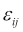
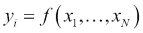
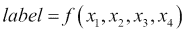
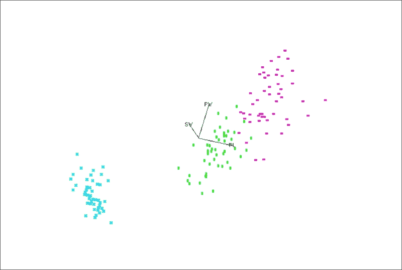
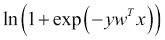
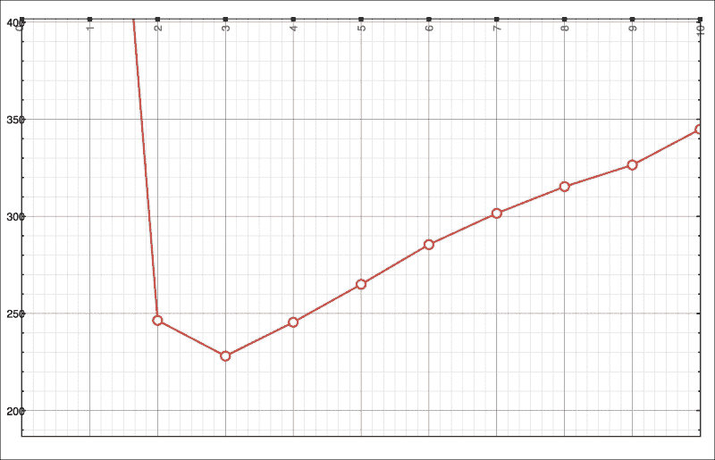
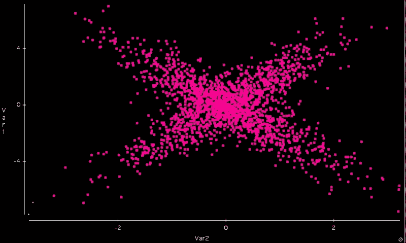
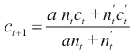
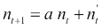

# 第四章 监督学习和无监督学习

我在上一章中介绍了 MLlib 库的基础知识，但至少在撰写本书时，MLlib 更像是一个快速发展的目标，它正在取得领先地位，而不是一个结构良好的实现，每个人都用于生产或甚至有一个一致且经过测试的文档。在这种情况下，正如人们所说，与其给你鱼，我更愿意专注于库背后的既定概念，并在本书中教授捕鱼的过程，以避免每次 MLlib 发布时都需要大幅修改章节。不管好坏，这似乎越来越成为一个数据科学家需要掌握的技能。

统计学和机器学习本质上处理不确定性，由于我们在第二章中提到的各种原因，第二章，*数据管道和建模*。虽然一些数据集可能是完全随机的，但在这里的目标是找到随机数生成器无法提供的趋势、结构和模式。机器学习的基本价值在于我们可以将这些模式进行泛化，并在至少某些指标上取得改进。让我们看看 Scala/Spark 中可用的基本工具。

在本章中，我将介绍监督学习和无监督学习，这两种历史上不同的方法。监督学习传统上用于当我们有一个特定的目标来预测标签或数据集的特定属性时。无监督学习可用于理解数据集中任何属性的内部结构和依赖关系，并且通常用于将记录或属性分组到有意义的聚类中。在实践中，这两种方法都可以用来补充和辅助对方。

在本章中，我们将涵盖以下主题：

+   学习监督学习的标准模型——决策树和逻辑回归

+   讨论无监督学习的基石——k-均值聚类及其衍生方法

+   理解评估上述算法有效性的指标和方法

+   略窥一斑，将上述方法扩展到流数据、稀疏数据和非结构化数据的特殊情况

# 记录和监督学习

为了本章的目的，一个记录是对一个或多个属性的观察或测量。我们假设这些观察可能包含噪声 （或者由于某种原因不准确）：


虽然我们相信属性之间存在某种模式或相关性，但我们追求并希望揭示的那个属性与记录中的噪声是不相关的。在统计学上，我们说每个记录的值都来自相同的分布，并且是独立的（或用统计学术语表示为*i.i.d*）。记录的顺序并不重要。其中一个属性，通常是第一个，可能被指定为标签。

监督学习是指目标是要预测标签*yi*：



在这里，*N*是剩余属性的数目。换句话说，目标是泛化模式，以便我们只需知道其他属性就能预测标签，无论是由于我们无法物理获取测量值，还是仅仅想探索数据集的结构而不具有预测标签的即时目标。

无监督学习是指我们不使用标签——我们只是尝试探索结构和相关性，以了解数据集，从而可能更好地预测标签。随着无结构数据学习和流的学习的出现，这一类问题最近有所增加，我将在本书的单独章节中分别介绍。

## 鸢尾花数据库

我将通过机器学习中最著名的数据库之一，即鸢尾花数据库（[`archive.ics.uci.edu/ml/datasets/Iris`](https://archive.ics.uci.edu/ml/datasets/Iris)），来演示记录和标签的概念。鸢尾花数据库包含三种鸢尾花类型的 50 条记录，总共有 150 行，五个字段。每一行是以下测量值：

+   花萼长度（厘米）

+   花萼宽度（厘米）

+   花瓣长度（厘米）

+   花瓣宽度（厘米）

最后一个字段是花的类型（*setosa*、*versicolor*或*virginica*）。经典问题是要预测标签，在这种情况下，这是一个具有三个可能值的分类属性，这些值是前四个属性的功能：



一种选择是在四维空间中绘制一个平面，将所有四个标签分开。不幸的是，正如人们可以发现的，虽然其中一个类别明显可分，但剩下的两个类别不可分，如下面的多维散点图所示（我们使用了 Data Desk 软件创建它）：



图 04-1\. 鸢尾花数据库作为三维图。鸢尾花*setosa*记录，用交叉表示，可以根据花瓣长度和宽度与其他两种类型分开。

颜色和形状根据以下表格分配：

| 标签 | 颜色 | 形状 |
| --- | --- | --- |
| *Iris setosa* | 蓝色 | x |
| *Iris versicolor* | 绿色 | 垂直条 |
| *Iris virginica* | 紫色 | 水平条 |

*Iris setosa*是可分离的，因为它碰巧具有非常短的花瓣长度和宽度，与其他两种类型相比。

让我们看看如何使用 MLlib 找到那个分隔多维平面的方法。

## 标记点

之前用于标记的数据集在机器学习中占有特殊地位——我们将在本章后面讨论无监督学习，在那里我们不需要标签，因此 MLlib 有一个特殊的数据类型来表示带有`org.apache.spark.mllib.regression.LabeledPoint`标签的记录（参考[`spark.apache.org/docs/latest/mllib-data-types.html#labeled-point`](https://spark.apache.org/docs/latest/mllib-data-types.html#labeled-point)）。要从文本文件中读取 Iris 数据集，我们需要将原始 UCI 仓库文件转换为所谓的 LIBSVM 文本格式。虽然有很多从 CSV 到 LIBSVM 格式的转换器，但我希望使用一个简单的 AWK 脚本来完成这项工作：

```py
awk -F, '/setosa/ {print "0 1:"$1" 2:"$2" 3:"$3" 4:"$4;}; /versicolor/ {print "1 1:"$1" 2:"$2" 3:"$3" 4:"$4;}; /virginica/ {print "1 1:"$1" 2:"$2" 3:"$3" 4:"$4;};' iris.csv > iris-libsvm.txt

```

### 注意

**为什么我们需要 LIBSVM 格式？**

LIBSVM 是许多库使用的格式。首先，LIBSVM 只接受连续属性。虽然现实世界中的许多数据集包含离散或分类属性，但出于效率考虑，它们在内部始终转换为数值表示，即使结果数值属性上的 L1 或 L2 度量在无序的离散值上没有太多意义。其次，LIBSVM 格式允许高效地表示稀疏数据。虽然 Iris 数据集不是稀疏的，但几乎所有现代大数据源都是稀疏的，该格式通过仅存储提供的值来实现高效存储。许多现代大数据键值和传统的关系型数据库管理系统实际上出于效率考虑也这样做。

对于缺失值，代码可能更复杂，但我们知道 Iris 数据集不是稀疏的——否则我们会在代码中添加一堆 if 语句。现在，我们将最后两个标签映射为 1。

## SVMWithSGD

现在，让我们运行 MLlib 中的**线性支持向量机**（SVM）SVMWithSGD 代码：

```py
$ bin/spark-shell 
Welcome to
 ____              __
 / __/__  ___ _____/ /__
 _\ \/ _ \/ _ `/ __/  '_/
 /___/ .__/\_,_/_/ /_/\_\   version 1.6.1
 /_/

Using Scala version 2.10.5 (Java HotSpot(TM) 64-Bit Server VM, Java 1.8.0_40)
Type in expressions to have them evaluated.
Type :help for more information.
Spark context available as sc.
SQL context available as sqlContext.

scala> import org.apache.spark.mllib.classification.{SVMModel, SVMWithSGD}
import org.apache.spark.mllib.classification.{SVMModel, SVMWithSGD}
scala> import org.apache.spark.mllib.evaluation.BinaryClassificationMetrics
import org.apache.spark.mllib.evaluation.BinaryClassificationMetrics
scala> import org.apache.spark.mllib.util.MLUtils
import org.apache.spark.mllib.util.MLUtils
scala> val data = MLUtils.loadLibSVMFile(sc, "iris-libsvm.txt")
data: org.apache.spark.rdd.RDD[org.apache.spark.mllib.regression.LabeledPoint] = MapPartitionsRDD[6] at map at MLUtils.scala:112
scala> val splits = data.randomSplit(Array(0.6, 0.4), seed = 123L)
splits: Array[org.apache.spark.rdd.RDD[org.apache.spark.mllib.regression.LabeledPoint]] = Array(MapPartitionsRDD[7] at randomSplit at <console>:26, MapPartitionsRDD[8] at randomSplit at <console>:26)
scala> val training = splits(0).cache()
training: org.apache.spark.rdd.RDD[org.apache.spark.mllib.regression.LabeledPoint] = MapPartitionsRDD[7] at randomSplit at <console>:26
scala> val test = splits(1)
test: org.apache.spark.rdd.RDD[org.apache.spark.mllib.regression.LabeledPoint] = MapPartitionsRDD[8] at randomSplit at <console>:26
scala> val numIterations = 100
numIterations: Int = 100
scala> val model = SVMWithSGD.train(training, numIterations)
model: org.apache.spark.mllib.classification.SVMModel = org.apache.spark.mllib.classification.SVMModel: intercept = 0.0, numFeatures = 4, numClasses = 2, threshold = 0.0
scala> model.clearThreshold()
res0: model.type = org.apache.spark.mllib.classification.SVMModel: intercept = 0.0, numFeatures = 4, numClasses = 2, threshold = None
scala> val scoreAndLabels = test.map { point =>
 |   val score = model.predict(point.features)
 |   (score, point.label)
 | }
scoreAndLabels: org.apache.spark.rdd.RDD[(Double, Double)] = MapPartitionsRDD[212] at map at <console>:36
scala> val metrics = new BinaryClassificationMetrics(scoreAndLabels)
metrics: org.apache.spark.mllib.evaluation.BinaryClassificationMetrics = org.apache.spark.mllib.evaluation.BinaryClassificationMetrics@692e4a35
scala> val auROC = metrics.areaUnderROC()
auROC: Double = 1.0

scala> println("Area under ROC = " + auROC)
Area under ROC = 1.0
scala> model.save(sc, "model")
SLF4J: Failed to load class "org.slf4j.impl.StaticLoggerBinder".
SLF4J: Defaulting to no-operation (NOP) logger implementation
SLF4J: See http://www.slf4j.org/codes.html#StaticLoggerBinder for further details.

```

因此，你只需运行机器学习工具箱中最复杂的算法之一：SVM。结果是区分*伊丽莎白*花与其他两种类型的分离平面。在这种情况下，模型正是最佳分离标签的截距和平面系数：

```py
scala> model.intercept
res5: Double = 0.0

scala> model.weights
res6: org.apache.spark.mllib.linalg.Vector = [-0.2469448809675877,-1.0692729424287566,1.7500423423258127,0.8105712661836376]

```

如果深入探究，模型存储在一个`parquet`文件中，可以使用`parquet-tool`进行导出：

```py
$ parquet-tools dump model/data/part-r-00000-7a86b825-569d-4c80-8796-8ee6972fd3b1.gz.parquet
…
DOUBLE weights.values.array 
----------------------------------------------------------------------------------------------------------------------------------------------
*** row group 1 of 1, values 1 to 4 *** 
value 1: R:0 D:3 V:-0.2469448809675877
value 2: R:1 D:3 V:-1.0692729424287566
value 3: R:1 D:3 V:1.7500423423258127
value 4: R:1 D:3 V:0.8105712661836376

DOUBLE intercept 
----------------------------------------------------------------------------------------------------------------------------------------------
*** row group 1 of 1, values 1 to 1 *** 
value 1: R:0 D:1 V:0.0
…

```

**接收者操作特征**（ROC）是衡量分类器能否根据其数值标签正确排序记录的常用指标。我们将在第九章中更详细地考虑精度指标，*Scala 中的 NLP*。

### 小贴士

**什么是 ROC？**

ROC（接收者操作特征）在信号处理中崭露头角，其首次应用是测量模拟雷达的准确性。准确性的常用指标是 ROC 曲线下的面积，简而言之，就是随机选择两个点按其标签正确排序的概率（标签*0*应始终具有比标签*1*低的排名）。AUROC 具有许多吸引人的特性：

+   该值，至少从理论上讲，不依赖于过采样率，即我们看到*0*标签与*1*标签的比例。

+   该值不依赖于样本大小，排除了由于样本量有限而产生的预期方差。

+   将常数添加到最终得分不会改变 ROC，因此截距可以始终设置为*0*。计算 ROC 需要根据生成的得分进行排序。

当然，分离剩余的两个标签是一个更难的问题，因为将*Iris versicolor*与*Iris virginica*分开的平面不存在：AUROC 分数将小于*1.0*。然而，SVM 方法将找到最佳区分后两个类别的平面。

## 逻辑回归

逻辑回归是最古老的分类方法之一。逻辑回归的结果也是一组权重，这些权重定义了超平面，但损失函数是逻辑损失而不是*L2*：



当标签是二进制时（如上式中的*y = +/- 1*），对数几率函数是常见的选择：

```py
$ bin/spark-shell 
Welcome to
 ____              __
 / __/__  ___ _____/ /__
 _\ \/ _ \/ _ `/ __/  '_/
 /___/ .__/\_,_/_/ /_/\_\   version 1.6.1
 /_/

Using Scala version 2.10.5 (Java HotSpot(TM) 64-Bit Server VM, Java 1.8.0_40)
Type in expressions to have them evaluated.
Type :help for more information.
Spark context available as sc.
SQL context available as sqlContext.

scala> import org.apache.spark.SparkContext
import org.apache.spark.SparkContext
scala> import org.apache.spark.mllib.classification.{LogisticRegressionWithLBFGS, LogisticRegressionModel}
import org.apache.spark.mllib.classification.{LogisticRegressionWithLBFGS, LogisticRegressionModel}
scala> import org.apache.spark.mllib.evaluation.MulticlassMetrics
import org.apache.spark.mllib.evaluation.MulticlassMetrics
scala> import org.apache.spark.mllib.regression.LabeledPoint
import org.apache.spark.mllib.regression.LabeledPoint
scala> import org.apache.spark.mllib.linalg.Vectors
import org.apache.spark.mllib.linalg.Vectors
scala> import org.apache.spark.mllib.util.MLUtils
import org.apache.spark.mllib.util.MLUtils
scala> val data = MLUtils.loadLibSVMFile(sc, "iris-libsvm-3.txt")
data: org.apache.spark.rdd.RDD[org.apache.spark.mllib.regression.LabeledPoint] = MapPartitionsRDD[6] at map at MLUtils.scala:112
scala> val splits = data.randomSplit(Array(0.6, 0.4))
splits: Array[org.apache.spark.rdd.RDD[org.apache.spark.mllib.regression.LabeledPoint]] = Array(MapPartitionsRDD[7] at randomSplit at <console>:29, MapPartitionsRDD[8] at randomSplit at <console>:29)
scala> val training = splits(0).cache()
training: org.apache.spark.rdd.RDD[org.apache.spark.mllib.regression.LabeledPoint] = MapPartitionsRDD[7] at randomSplit at <console>:29
scala> val test = splits(1)
test: org.apache.spark.rdd.RDD[org.apache.spark.mllib.regression.LabeledPoint] = MapPartitionsRDD[8] at randomSplit at <console>:29
scala> val model = new LogisticRegressionWithLBFGS().setNumClasses(3).run(training)
model: org.apache.spark.mllib.classification.LogisticRegressionModel = org.apache.spark.mllib.classification.LogisticRegressionModel: intercept = 0.0, numFeatures = 8, numClasses = 3, threshold = 0.5
scala> val predictionAndLabels = test.map { case LabeledPoint(label, features) =>
 |   val prediction = model.predict(features)
 |   (prediction, label)
 | }
predictionAndLabels: org.apache.spark.rdd.RDD[(Double, Double)] = MapPartitionsRDD[67] at map at <console>:37
scala> val metrics = new MulticlassMetrics(predictionAndLabels)
metrics: org.apache.spark.mllib.evaluation.MulticlassMetrics = org.apache.spark.mllib.evaluation.MulticlassMetrics@6d5254f3
scala> val precision = metrics.precision
precision: Double = 0.9516129032258065
scala> println("Precision = " + precision)
Precision = 0.9516129032258065
scala> model.intercept
res5: Double = 0.0
scala> model.weights
res7: org.apache.spark.mllib.linalg.Vector = [10.644978886788556,-26.850171485157578,3.852594349297618,8.74629386938248,4.288703063075211,-31.029289381858273,9.790312529377474,22.058196856491996]

```

在这种情况下，标签可以是范围*[0, k)*内的任何整数，其中*k*是类的总数（正确的类别将通过针对枢轴类（在这种情况下，是带有*0*标签的类别）构建多个二元逻辑回归模型来确定）(*《统计学习的要素》由*Trevor Hastie*，*Robert Tibshirani*，*Jerome Friedman*，*Springer Series in Statistics*）。

准确度指标是精确度，即预测正确的记录百分比（在我们的案例中为 95%）。

## 决策树

前两种方法描述了线性模型。不幸的是，线性方法并不总是适用于属性之间的复杂交互。假设标签看起来像这样的排他性*OR: 0*，如果*X ≠ Y*，则为*1*，如果*X = Y*：

| X | Y | 标签 |
| --- | --- | --- |
| 1 | 0 | 0 |
| 0 | 1 | 0 |
| 1 | 1 | 1 |
| 0 | 0 | 1 |

在*XY*空间中，没有超平面可以区分这两个标签。递归分割解决方案，其中每个级别的分割仅基于一个变量或其线性组合，在这种情况下可能效果会更好。决策树也已知与稀疏和交互丰富的数据集配合得很好：

```py
$ bin/spark-shell 
Welcome to
 ____              __
 / __/__  ___ _____/ /__
 _\ \/ _ \/ _ `/ __/  '_/
 /___/ .__/\_,_/_/ /_/\_\   version 1.6.1
 /_/

Using Scala version 2.10.5 (Java HotSpot(TM) 64-Bit Server VM, Java 1.8.0_40)
Type in expressions to have them evaluated.
Type :help for more information.
Spark context available as sc.
SQL context available as sqlContext.

scala> import org.apache.spark.mllib.tree.DecisionTree
import org.apache.spark.mllib.tree.DecisionTree
scala> import org.apache.spark.mllib.tree.model.DecisionTreeModel
import org.apache.spark.mllib.tree.model.DecisionTreeModel
scala> import org.apache.spark.mllib.util.MLUtils
import org.apache.spark.mllib.util.MLUtils
scala> import org.apache.spark.mllib.tree.configuration.Strategy
import org.apache.spark.mllib.tree.configuration.Strategy
scala> import org.apache.spark.mllib.tree.configuration.Algo.Classification
import org.apache.spark.mllib.tree.configuration.Algo.Classification
scala> import org.apache.spark.mllib.tree.impurity.{Entropy, Gini}
import org.apache.spark.mllib.tree.impurity.{Entropy, Gini}
scala> val data = MLUtils.loadLibSVMFile(sc, "iris-libsvm-3.txt")
data: org.apache.spark.rdd.RDD[org.apache.spark.mllib.regression.LabeledPoint] = MapPartitionsRDD[6] at map at MLUtils.scala:112

scala> val splits = data.randomSplit(Array(0.7, 0.3), 11L)
splits: Array[org.apache.spark.rdd.RDD[org.apache.spark.mllib.regression.LabeledPoint]] = Array(MapPartitionsRDD[7] at randomSplit at <console>:30, MapPartitionsRDD[8] at randomSplit at <console>:30)
scala> val (trainingData, testData) = (splits(0), splits(1))
trainingData: org.apache.spark.rdd.RDD[org.apache.spark.mllib.regression.LabeledPoint] = MapPartitionsRDD[7] at randomSplit at <console>:30
testData: org.apache.spark.rdd.RDD[org.apache.spark.mllib.regression.LabeledPoint] = MapPartitionsRDD[8] at randomSplit at <console>:30
scala> val strategy = new Strategy(Classification, Gini, 10, 3, 10)
strategy: org.apache.spark.mllib.tree.configuration.Strategy = org.apache.spark.mllib.tree.configuration.Strategy@4110e631
scala> val dt = new DecisionTree(strategy)
dt: org.apache.spark.mllib.tree.DecisionTree = org.apache.spark.mllib.tree.DecisionTree@33d89052
scala> val model = dt.run(trainingData)
model: org.apache.spark.mllib.tree.model.DecisionTreeModel = DecisionTreeModel classifier of depth 6 with 21 nodes
scala> val labelAndPreds = testData.map { point =>
 |   val prediction = model.predict(point.features)
 |   (point.label, prediction)
 | }
labelAndPreds: org.apache.spark.rdd.RDD[(Double, Double)] = MapPartitionsRDD[32] at map at <console>:36
scala> val testErr = labelAndPreds.filter(r => r._1 != r._2).count.toDouble / testData.count()
testErr: Double = 0.02631578947368421
scala> println("Test Error = " + testErr)
Test Error = 0.02631578947368421

scala> println("Learned classification tree model:\n" + model.toDebugString)
Learned classification tree model:
DecisionTreeModel classifier of depth 6 with 21 nodes
 If (feature 3 <= 0.4)
 Predict: 0.0
 Else (feature 3 > 0.4)
 If (feature 3 <= 1.7)
 If (feature 2 <= 4.9)
 If (feature 0 <= 5.3)
 If (feature 1 <= 2.8)
 If (feature 2 <= 3.9)
 Predict: 1.0
 Else (feature 2 > 3.9)
 Predict: 2.0
 Else (feature 1 > 2.8)
 Predict: 0.0
 Else (feature 0 > 5.3)
 Predict: 1.0
 Else (feature 2 > 4.9)
 If (feature 0 <= 6.0)
 If (feature 1 <= 2.4)
 Predict: 2.0
 Else (feature 1 > 2.4)
 Predict: 1.0
 Else (feature 0 > 6.0)
 Predict: 2.0
 Else (feature 3 > 1.7)
 If (feature 2 <= 4.9)
 If (feature 1 <= 3.0)
 Predict: 2.0
 Else (feature 1 > 3.0)
 Predict: 1.0
 Else (feature 2 > 4.9)
 Predict: 2.0
scala> model.save(sc, "dt-model")
SLF4J: Failed to load class "org.slf4j.impl.StaticLoggerBinder".
SLF4J: Defaulting to no-operation (NOP) logger implementation
SLF4J: See http://www.slf4j.org/codes.html#StaticLoggerBinder for further details.

```

如您所见，在保留 30%样本的误差（误判）率仅为 2.6%。150 个样本中的 30%只有 45 个记录，这意味着我们只从整个测试集中遗漏了一个记录。当然，结果可能会改变，也可能会有所不同，我们需要更严格的交叉验证技术来证明模型的准确性，但这足以对模型性能进行粗略估计。

决策树在回归案例中泛化，即当标签本质上是连续的时候。在这种情况下，分割标准是最小化加权方差，而不是分类案例中的熵增益或基尼。我将在第五章*回归和分类*中更多地讨论这些差异。

有许多参数可以调整以改善性能：

| 参数 | 描述 | 推荐值 |
| --- | --- | --- |
| `maxDepth` | 这是树的最大深度。深度树成本较高，通常更容易过拟合。浅层树更高效，更适合 AdaBoost 等 bagging/boosting 算法。 | 这取决于原始数据集的大小。值得尝试并绘制结果树的准确性与参数之间的关系图，以找出最佳值。 |
| `minInstancesPerNode` | 这也限制了树的大小：一旦实例数量低于此阈值，就不会再进行分割。 | 该值通常是 10-100，具体取决于原始数据集的复杂性和潜在标签的数量。 |
| `maxBins` | 这仅用于连续属性：分割原始范围的箱数。 | 大量的箱会增加计算和通信成本。也可以考虑根据领域知识对属性进行预离散化的选项。 |
| `minInfoGain` | 这是分割节点所需的信息增益（熵）、不纯度（基尼）或方差（回归）增益。 | 默认值为*0*，但您可以增加默认值以限制树的大小并降低过拟合的风险。 |
| `maxMemoryInMB` | 这是用于收集足够统计信息的内存量。 | 默认值保守地选择为 256 MB，以允许决策算法在大多数场景下工作。增加`maxMemoryInMB`可以通过允许对数据进行更少的遍历来加快训练速度（如果内存可用）。然而，随着`maxMemoryInMB`的增加，每轮迭代中的通信量可能成比例增加，因此可能存在递减的回报。 |
| `subsamplingRate` | 这是用于学习决策树的训练数据比例。 | 此参数对于训练树集成（使用`RandomForest`和`GradientBoostedTrees`）最为相关，在这种情况下，对原始数据进行子采样可能很有用。对于训练单个决策树，此参数不太有用，因为训练实例的数量通常不是主要约束。 |
| `useNodeIdCache` | 如果设置为 true，算法将避免在每次迭代中将当前模型（树或树集）传递给执行者。 | 这对于深度树（加快工作者的计算速度）和大型随机森林（减少每轮迭代中的通信）可能很有用。 |
| `checkpointDir:` | 这是节点 ID 缓存 RDDs 进行 checkpoint 的目录。 | 这是一个优化，用于将中间结果保存下来，以避免节点失败时的重新计算。在大集群或不稳定的节点上设置。 |
| `checkpointInterval` | 这是节点 ID 缓存 RDDs 进行 checkpoint 的频率。 | 设置得太低会导致写入 HDFS 的额外开销，设置得太高则可能在执行器失败且需要重新计算 RDD 时出现问题。 |

## Bagging 和 boosting – 集成学习方法

与单个股票相比，股票组合具有更好的特性，因此可以将模型结合起来以产生更好的分类器。通常，这些方法与决策树作为训练技术结合得非常好，因为训练技术可以被修改以产生具有大量变化的模型。一种方法是在原始数据的随机子集或属性的随机子集上训练模型，这被称为随机森林。另一种方法是通过生成一系列模型，将错误分类的实例重新加权，以便在后续的每次迭代中获得更大的权重。已经证明，这种方法与模型参数空间中的梯度下降方法有关。虽然这些是有效且有趣的技术，但它们通常需要更多的空间来存储模型，并且与裸决策树模型相比，可解释性较差。对于 Spark，集成模型目前正在开发中——主要问题为 SPARK-3703 ([`issues.apache.org/jira/browse/SPARK-3703`](https://issues.apache.org/jira/browse/SPARK-3703))。

# 无监督学习

如果我们从 Iris 数据集中移除标签，如果某些算法能够恢复原始分组，那就很好了，也许不需要确切的标签名称——*setosa*，*versicolor*，和*virginica*。无监督学习在压缩和编码、CRM、推荐引擎和安全领域有多个应用，可以揭示内部结构而不需要确切的标签。有时，可以根据属性值分布的奇异性给出标签。例如，*Iris setosa*可以描述为*小叶花*。

虽然可以通过忽略标签将监督学习问题表示为无监督学习，但反之亦然。可以将聚类算法表示为密度估计问题，通过将所有向量分配标签*1*并生成带有标签*0*的随机向量（*《统计学习的要素》*，作者：*特里夫·哈斯蒂*，*罗伯特·蒂布斯哈里*，*杰罗姆·弗里德曼*，*斯普林格统计系列*）。两者之间的区别是正式的，对于非结构化和嵌套数据来说甚至更加模糊。通常，在标记数据集上运行无监督算法可以更好地理解依赖关系，从而更好地选择和表现监督算法。

这是 k-means（及其变体，如 k-median 和 k-center，将在后面描述）中用于聚类和无监督学习最受欢迎的算法之一：

```py
$ bin/spark-shell
Welcome to
 ____              __
 / __/__  ___ _____/ /__
 _\ \/ _ \/ _ `/ __/  '_/
 /___/ .__/\_,_/_/ /_/\_\   version 1.6.1
 /_/
Using Scala version 2.10.5 (Java HotSpot(TM) 64-Bit Server VM, Java 1.8.0_40)
Type in expressions to have them evaluated.
Type :help for more information.
Spark context available as sc.
SQL context available as sqlContext.

scala> import org.apache.spark.mllib.clustering.{KMeans, KMeansModel}
import org.apache.spark.mllib.clustering.{KMeans, KMeansModel}
scala> import org.apache.spark.mllib.linalg.Vectors
import org.apache.spark.mllib.linalg.Vectors
scala> val iris = sc.textFile("iris.txt")
iris: org.apache.spark.rdd.RDD[String] = MapPartitionsRDD[4] at textFile at <console>:23

scala> val vectors = data.map(s => Vectors.dense(s.split('\t').map(_.toDouble))).cache()
vectors: org.apache.spark.rdd.RDD[org.apache.spark.mllib.linalg.Vector] = MapPartitionsRDD[5] at map at <console>:25

scala> val numClusters = 3
numClusters: Int = 3
scala> val numIterations = 20
numIterations: Int = 20
scala> val clusters = KMeans.train(vectors, numClusters, numIterations)
clusters: org.apache.spark.mllib.clustering.KMeansModel = org.apache.spark.mllib.clustering.KMeansModel@5dc9cb99
scala> val centers = clusters.clusterCenters
centers: Array[org.apache.spark.mllib.linalg.Vector] = Array([5.005999999999999,3.4180000000000006,1.4640000000000002,0.2439999999999999], [6.8538461538461535,3.076923076923076,5.715384615384614,2.0538461538461537], [5.883606557377049,2.740983606557377,4.388524590163936,1.4344262295081966])
scala> val SSE = clusters.computeCost(vectors)
WSSSE: Double = 78.94506582597859
scala> vectors.collect.map(x => clusters.predict(x))
res18: Array[Int] = Array(0, 0, 0, 0, 0, 0, 0, 0, 0, 0, 0, 0, 0, 0, 0, 0, 0, 0, 0, 0, 0, 0, 0, 0, 0, 0, 0, 0, 0, 0, 0, 0, 0, 0, 0, 0, 0, 0, 0, 0, 0, 0, 0, 0, 0, 0, 0, 0, 0, 0, 1, 2, 1, 2, 2, 2, 2, 2, 2, 2, 2, 2, 2, 2, 2, 2, 2, 2, 2, 2, 2, 2, 2, 2, 2, 2, 2, 1, 2, 2, 2, 2, 2, 2, 2, 2, 2, 2, 2, 2, 2, 2, 2, 2, 2, 2, 2, 2, 2, 2, 1, 2, 1, 1, 1, 1, 2, 1, 1, 1, 1, 1, 1, 2, 2, 1, 1, 1, 1, 2, 1, 2, 1, 2, 1, 1, 2, 2, 1, 1, 1, 1, 1, 2, 1, 1, 1, 1, 2, 1, 1, 1, 2, 1, 1, 1, 2, 1, 1, 2)
scala> println("Sum of Squared Errors = " + SSE)
Sum of Squared Errors = 78.94506582597859
scala> clusters.save(sc, "model")
SLF4J: Failed to load class "org.slf4j.impl.StaticLoggerBinder".
SLF4J: Defaulting to no-operation (NOP) logger implementation
SLF4J: See http://www.slf4j.org/codes.html#StaticLoggerBinder for further details.

```

可以看到第一个中心，即索引为`0`的中心，花瓣长度和宽度为`1.464`和`0.244`，这比其他两个——`5.715`和`2.054`，`4.389`和`1.434`——要短得多。预测完全匹配第一个聚类，对应于*Iris setosa*，但对其他两个有一些误判。

如果我们想要达到预期的分类结果，聚类质量的度量可能取决于（期望的）标签，但由于算法没有关于标签的信息，一个更常见的度量是每个聚类中从质心到点的距离之和。以下是`WSSSE`随聚类数量变化的图表：

```py
scala> 1.to(10).foreach(i => println("i: " + i + " SSE: " + KMeans.train(vectors, i, numIterations).computeCost(vectors)))
i: 1 WSSSE: 680.8244
i: 2 WSSSE: 152.3687064773393
i: 3 WSSSE: 78.94506582597859
i: 4 WSSSE: 57.47327326549501
i: 5 WSSSE: 46.53558205128235
i: 6 WSSSE: 38.9647878510374
i: 7 WSSSE: 34.311167589868646
i: 8 WSSSE: 32.607859500805034
i: 9 WSSSE: 28.231729411088438
i: 10 WSSSE: 29.435054384424078

```

如预期的那样，随着配置的聚类数量增加，平均距离在减小。确定最佳聚类数量的一个常见方法是添加一个惩罚函数。一个常见的惩罚是聚类数量的对数，因为我们期望一个凸函数。对数前面的系数是多少？如果每个向量都与自己的聚类相关联，所有距离的总和将为零，因此如果我们希望一个度量在可能的值集的两端都达到大约相同的值，即`1`到`150`，那么系数应该是`680.8244/log(150)`：

```py
scala> for (i <- 1.to(10)) println(i + " -> " + ((KMeans.train(vectors, i, numIterations).computeCost(vectors)) + 680 * scala.math.log(i) / scala.math.log(150)))
1 -> 680.8244
2 -> 246.436635016484
3 -> 228.03498068120865
4 -> 245.48126639400738
5 -> 264.9805962616268
6 -> 285.48857890531764
7 -> 301.56808340425164
8 -> 315.321639004243
9 -> 326.47262191671723
10 -> 344.87130979355675

```

这是平方距离之和（含惩罚项）的图表表示：



图 04-2. 聚类质量度量作为聚类数量的函数

除了 k-means 聚类之外，MLlib 还实现了以下算法：

+   高斯混合

+   **幂迭代聚类**（**PIC**）

+   **潜在狄利克雷分配**（**LDA**）

+   流式 k-means

高斯混合是另一种经典机制，特别以其频谱分析而闻名。高斯混合分解适用于属性连续且我们知道它们可能来自一组高斯分布的情况。例如，虽然对应于聚类的潜在点集可能具有所有属性的均值，比如**Var1**和**Var2**，但点可能围绕两个相交的超平面中心，如下面的图所示：



图 04-3. 不能由 k-means 聚类正确描述的两个高斯混合

这使得 k-means 算法变得无效，因为它无法区分这两个（当然，一个简单的非线性变换，如到其中一个超平面的距离，将解决这个问题，但这就是领域知识和数据科学家专业知识派上用场的地方）。

PIC 使用图聚类顶点，并提供了作为边属性的成对相似度度量。它通过幂迭代计算图归一化亲和矩阵的伪特征向量，并使用它来聚类顶点。MLlib 包括了一个使用 GraphX 作为其后端的 PIC 实现。它接受一个包含(`srcId`, `dstId`, 相似度)元组的 RDD，并输出一个具有聚类分配的模型。相似度必须为非负。PIC 假设相似度度量是对称的。无论顺序如何，一对(`srcId`, `dstId`)在输入数据中最多只能出现一次。如果一对缺失于输入，则它们的相似度被视为零。

LDA 可以用于基于关键词频率对文档进行聚类。LDA 不是使用传统距离来估计聚类，而是使用基于文本文档生成统计模型的函数。

最后，流式 k-means 是 k-means 算法的一种改进，其中聚类可以通过新批次的数据进行调整。对于每个数据批次，我们将所有点分配到最近的聚类，根据分配计算新的聚类中心，然后使用以下方程更新每个聚类参数：



在这里，*c* *t* 和 *c'* *t* 是旧模型和为新批次计算的中心，而 *n* *t* 和 *n'* *t* 是旧模型和新批次中的向量数量。通过改变 *α* 参数，我们可以控制旧运行的信息对聚类的影响程度——*0* 表示新聚类中心完全基于新批次中的点，而 *1* 表示我们为迄今为止看到的所有点做出调整。

k-means 聚类有许多改进。例如，k-medians 计算聚类中心为属性值的中位数，而不是均值，这对于某些分布和与*L1*目标距离度量（差值的绝对值）相比*L2*（平方和）来说效果更好。K-medians 中心不一定是数据集中具体的一个点。K-medoids 是同一家族中的另一个算法，其中结果聚类中心必须是输入集中的实际实例，并且我们实际上不需要全局排序，只需要点之间的成对距离。关于如何选择原始种子聚类中心和收敛到最佳聚类数量（除了我展示的简单对数技巧之外）的技术有许多变体。

另一大类聚类算法是层次聚类。层次聚类可以是自顶向下进行的——类似于决策树算法——或者自底向上；我们首先找到最近的邻居，将它们配对，然后继续向上配对直到所有记录合并。层次聚类的优点是它可以被设计成确定性的并且相对较快，尽管 k-means 算法单次迭代的成本可能更好。然而，正如提到的，无监督问题实际上可以被转换成一个密度估计的监督问题，可以使用所有可用的监督学习技术。所以，享受理解数据吧！

# 问题维度

属性空间越大或维度越多，通常预测给定属性值组合的标签就越困难。这主要是因为属性空间的可能的不同属性组合的总数随着属性空间维度的增加而指数级增长——至少在离散变量的情况下（对于连续变量，情况更复杂，取决于使用的度量），并且泛化的难度越来越大。

问题的有效维度可能与输入空间的维度不同。例如，如果标签只依赖于（连续）输入属性的线性组合，那么问题被称为线性可分，其内部维度为一个是——我们仍然需要在逻辑回归中找到这个线性组合的系数。

这种想法有时也被称为问题、模型或算法的**Vapnik–Chervonenkis**（**VC**）维度——模型的表达能力取决于它能够解决或分解的依赖关系的复杂程度。更复杂的问题需要具有更高 VC 维度的算法和更大的训练集。然而，在简单问题上使用具有更高 VC 维度的算法可能会导致过拟合，并且对新数据的泛化更差。

如果输入属性的单元是可比较的，比如说它们都是米或时间的单位，PCA，或者更普遍地，核方法，可以用来降低输入空间的维度：

```py
$ bin/spark-shell 
Welcome to
 ____              __
 / __/__  ___ _____/ /__
 _\ \/ _ \/ _ `/ __/  '_/
 /___/ .__/\_,_/_/ /_/\_\   version 1.6.1
 /_/

Using Scala version 2.10.5 (Java HotSpot(TM) 64-Bit Server VM, Java 1.8.0_40)
Type in expressions to have them evaluated.
Type :help for more information.
Spark context available as sc.
SQL context available as sqlContext.

scala> import org.apache.spark.mllib.regression.LabeledPoint
import org.apache.spark.mllib.regression.LabeledPoint
scala> import org.apache.spark.mllib.feature.PCA
import org.apache.spark.mllib.feature.PCA
scala> import org.apache.spark.mllib.util.MLUtils
import org.apache.spark.mllib.util.MLUtils
scala> val pca = new PCA(2).fit(data.map(_.features))
pca: org.apache.spark.mllib.feature.PCAModel = org.apache.spark.mllib.feature.PCAModel@4eee0b1a

scala> val reduced = data.map(p => p.copy(features = pca.transform(p.features)))
reduced: org.apache.spark.rdd.RDD[org.apache.spark.mllib.regression.LabeledPoint] = MapPartitionsRDD[311] at map at <console>:39
scala> reduced.collect().take(10)
res4: Array[org.apache.spark.mllib.regression.LabeledPoint] = Array((0.0,[-2.827135972679021,-5.641331045573367]), (0.0,[-2.7959524821488393,-5.145166883252959]), (0.0,[-2.621523558165053,-5.177378121203953]), (0.0,[-2.764905900474235,-5.0035994150569865]), (0.0,[-2.7827501159516546,-5.6486482943774305]), (0.0,[-3.231445736773371,-6.062506444034109]), (0.0,[-2.6904524156023393,-5.232619219784292]), (0.0,[-2.8848611044591506,-5.485129079769268]), (0.0,[-2.6233845324473357,-4.743925704477387]), (0.0,[-2.8374984110638493,-5.208032027056245]))

scala> import scala.language.postfixOps
import scala.language.postfixOps

scala> pca pc
res24: org.apache.spark.mllib.linalg.DenseMatrix = 
-0.36158967738145065  -0.6565398832858496 
0.08226888989221656   -0.7297123713264776 
-0.856572105290527    0.17576740342866465 
-0.35884392624821626  0.07470647013502865

scala> import org.apache.spark.mllib.classification.{SVMModel, SVMWithSGD}
import org.apache.spark.mllib.classification.{SVMModel, SVMWithSGD}
scala> import org.apache.spark.mllib.evaluation.BinaryClassificationMetrics
import org.apache.spark.mllib.evaluation.BinaryClassificationMetrics
scala> val splits = reduced.randomSplit(Array(0.6, 0.4), seed = 1L)
splits: Array[org.apache.spark.rdd.RDD[org.apache.spark.mllib.regression.LabeledPoint]] = Array(MapPartitionsRDD[312] at randomSplit at <console>:44, MapPartitionsRDD[313] at randomSplit at <console>:44)
scala> val training = splits(0).cache()
training: org.apache.spark.rdd.RDD[org.apache.spark.mllib.regression.LabeledPoint] = MapPartitionsRDD[312] at randomSplit at <console>:44
scala> val test = splits(1)
test: org.apache.spark.rdd.RDD[org.apache.spark.mllib.regression.LabeledPoint] = MapPartitionsRDD[313] at randomSplit at <console>:44
scala> val numIterations = 100
numIterations: Int = 100
scala> val model = SVMWithSGD.train(training, numIterations)
model: org.apache.spark.mllib.classification.SVMModel = org.apache.spark.mllib.classification.SVMModel: intercept = 0.0, numFeatures = 2, numClasses = 2, threshold = 0.0
scala> model.clearThreshold()
res30: model.type = org.apache.spark.mllib.classification.SVMModel: intercept = 0.0, numFeatures = 2, numClasses = 2, threshold = None
scala> val scoreAndLabels = test.map { point =>
 |   val score = model.predict(point.features)
 |   (score, point.label)
 | }
scoreAndLabels: org.apache.spark.rdd.RDD[(Double, Double)] = MapPartitionsRDD[517] at map at <console>:54
scala> val metrics = new BinaryClassificationMetrics(scoreAndLabels)
metrics: org.apache.spark.mllib.evaluation.BinaryClassificationMetrics = org.apache.spark.mllib.evaluation.BinaryClassificationMetrics@27f49b8c

scala> val auROC = metrics.areaUnderROC()
auROC: Double = 1.0
scala> println("Area under ROC = " + auROC)
Area under ROC = 1.0

```

在这里，我们将原始的四维问题降低到二维。像平均一样，计算输入属性的线性组合并仅选择描述大部分方差的那部分，有助于减少噪声。

# 摘要

在本章中，我们探讨了监督学习和无监督学习，以及如何在 Spark/Scala 中运行它们的几个示例。我们以 UCI Iris 数据集为例，考虑了 SVM、逻辑回归、决策树和 k-means。这绝对不是一份完整的指南，而且现在存在或正在制作许多其他库，但我敢打赌，你只需使用这些工具就可以解决 99%的即时数据分析问题。

这将为您快速提供如何开始使用新数据集提高生产力的捷径。查看数据集的方法有很多，但在我们深入更高级的主题之前，让我们在下一章讨论回归和分类，即如何预测连续和离散标签。
