# 第五章。回归与分类

在上一章中，我们熟悉了监督学习和无监督学习。机器学习方法的另一种标准分类是基于标签来自连续或离散空间。即使离散标签是有序的，也存在显著差异，尤其是如何评估拟合优度指标。

在本章中，我们将涵盖以下主题：

+   了解“回归”一词的起源

+   用于评估连续和离散空间中拟合优度的学习指标

+   讨论如何用 Scala 编写线性回归和逻辑回归的简单代码

+   了解高级概念，如正则化、多类预测和异方差性

+   讨论 MLlib 回归树分析的 MLlib 应用示例

+   了解评估分类模型的不同方法

# 回归代表什么？

虽然分类这个词直观上很清楚，但回归这个词似乎并不暗示一个连续标签的预测器。根据韦伯斯特词典，回归是：

> *"回到以前或较不发达的状态。"*

它也提到了对统计学的一种特殊定义，即*一个变量（例如，输出）的平均值与其他变量的对应值（例如，时间和成本）之间关系的一种度量*，这在当今实际上是正确的。然而，从历史上看，回归系数原本是用来表示某些特征（如体重和大小）从一代传到另一代的遗传性，暗示着有计划的基因选择，包括人类（[`www.amstat.org/publications/jse/v9n3/stanton.html`](http://www.amstat.org/publications/jse/v9n3/stanton.html)）。更具体地说，在 1875 年，查尔斯·达尔文的表亲、一位杰出的 19 世纪科学家高尔顿，也因为推广优生学而受到广泛批评，他向七个朋友分发了甜豌豆种子。每个朋友都收到了重量均匀的种子，但七个包装之间的差异很大。高尔顿的朋友们应该收获下一代种子并将它们寄回给他。高尔顿随后对每个组内种子的统计特性进行了分析，其中一项分析就是绘制回归线，这条线似乎总是具有小于 1 的斜率——具体引用的数字是 0.33（高尔顿，F. (1894)，《自然遗传》（第 5 版），纽约：麦克米伦公司），与没有相关性且没有遗传的情况下的*0*相反；或者与在后代中完全复制父母特征的情况下的*1*相反。我们将在有噪声数据的情况下，即使相关性完美，回归线的系数为什么总是小于*1*进行讨论。然而，除了讨论和细节之外，回归这个术语的起源部分是由于植物和人类的计划育种。当然，高尔顿当时没有接触到主成分分析（PCA）、Scala 或其他任何计算设备，这些设备可能会更多地阐明相关性和回归线斜率之间的差异。

# 连续空间和度量

由于本章的大部分内容将涉及尝试预测或优化连续变量，让我们首先了解如何测量连续空间中的差异。除非很快有重大发现，我们所处的空间是一个三维欧几里得空间。无论我们是否喜欢，这是我们今天主要感到舒适的世界。我们可以用三个连续的数字完全指定我们的位置。位置之间的差异通常用距离或度量来衡量，度量是一个关于两个参数的函数，它返回一个正实数。自然地，*X*和*Y*之间的距离，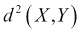，应该总是等于或小于*X*和*Z*以及*Y*和*Z*之间的距离之和：


对于任何 *X*，*Y* 和 *Z*，这也被称为三角不等式。度量的另外两个性质是对称性：

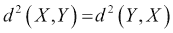

距离的非负性：

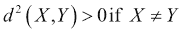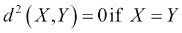

在这里，如果且仅当 *X=Y* 时，度量是 `0`。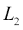 距离是我们对距离的日常理解，即每个维度平方差的和的平方根。我们物理距离的推广是 p-范数 (*p = 2* 对于  距离)：

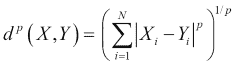

在这里，总和是 *X* 和 *Y* 向量的整体分量。如果 *p=1*，1-范数是绝对差之和，或曼哈顿距离，就像从点 *X* 到点 *Y* 的唯一路径是只沿一个分量移动一样。这种距离也常被称为 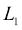 距离：

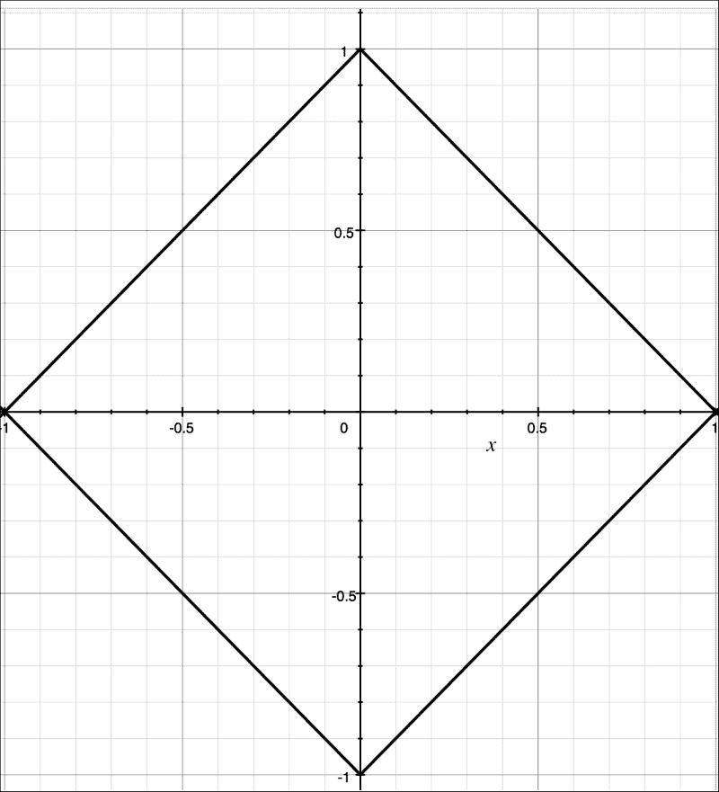

图 05-1\. 二维空间中的  圆（距离原点 (0, 0) 精确为一单位的点的集合）

在二维空间中，这是一个圆的表示：

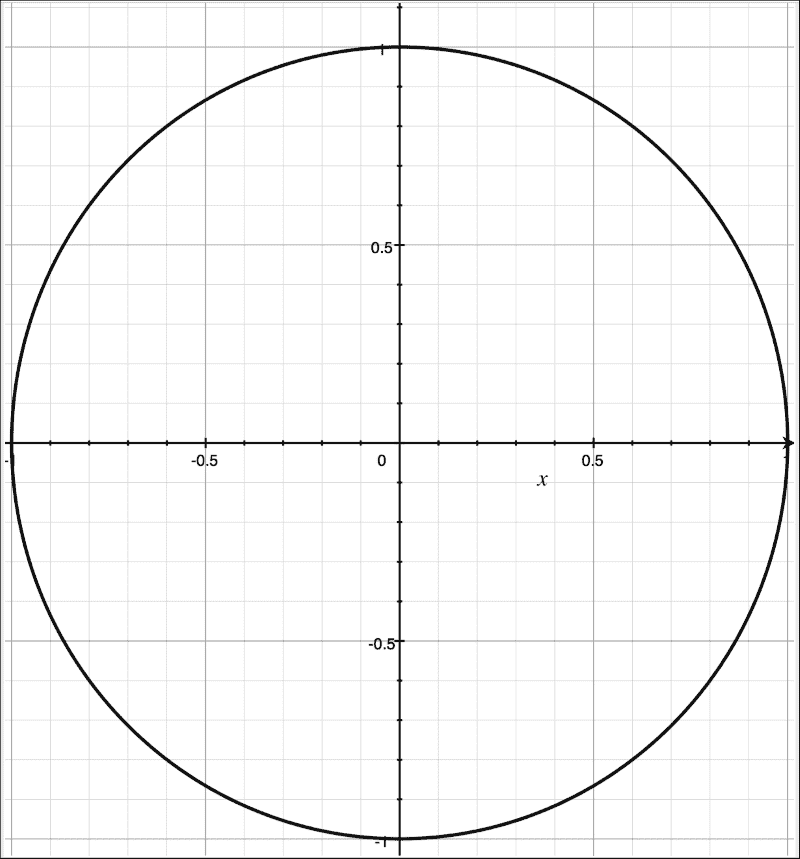

图 05-2\.  圆在二维空间中（距离原点 (0, 0) 等距的点的集合），在我们对距离的日常理解中实际上看起来像一个圆。

另一个常用的特殊情况是 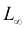，当 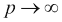 时的极限，这是沿任何分量方向的最大偏差，如下所示：


对于  的距离，等距圆如图 05-3* 所示：

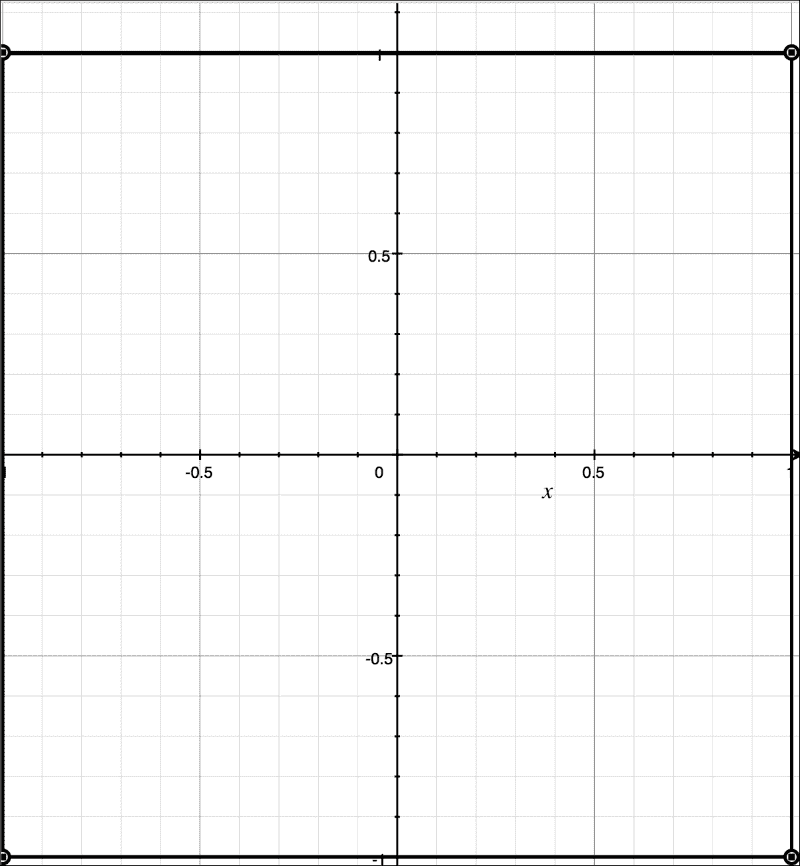

图 05-3\.  圆在二维空间中（距离原点 (0, 0) 等距的点的集合）。这是一个正方形，因为  度量是沿任何分量方向的最大距离。

当我谈到分类时，我会考虑 **Kullback-Leibler** （**KL**） 距离，它衡量两个概率分布之间的差异，但它是不对称的距离，因此不是度量。

度量性质使得问题分解更容易。由于三角不等式，可以通过分别优化问题的多个维度分量来替换一个优化目标的困难问题。

# 线性回归

如第二章*数据管道和建模*中所述，大多数复杂的机器学习问题都可以简化为优化，因为我们的最终目标是优化整个机器作为中介或完整解决方案的过程。指标可以是明确的，如误差率，或者更间接的，如**月活跃用户**（**MAU**），但算法的有效性最终是通过它如何改善我们生活中的某些指标和过程来评判的。有时，目标可能包括多个子目标，或者最终可能考虑维护性和稳定性等其他指标，但本质上，我们需要以某种方式最大化或最小化一个连续指标。

为了严谨性，让我们展示如何将线性回归表述为一个优化问题。经典的线性回归需要优化累积误差率：

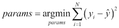

在这里，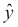是模型给出的估计值，在线性回归的情况下，如下所示：

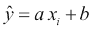

（其他潜在的**损失函数**已在第三章中列举，*使用 Spark 和 MLlib*）。由于指标是*a*、*b*的可微凸函数，可以通过将累积误差率的导数等于`0`来找到极值：

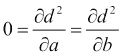

在这种情况下，计算导数是直接的，并导致以下方程：


这可以解出：

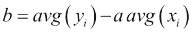

在这里，*avg()*表示整体输入记录的平均值。请注意，如果*avg(x)=0*，则前面的方程简化为以下形式：

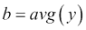

因此，我们可以快速使用基本的 Scala 运算符来计算线性回归系数（我们总是可以通过执行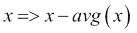来使*avg(x)*为零）：

```py
akozlov@Alexanders-MacBook-Pro$ scala

Welcome to Scala version 2.11.6 (Java HotSpot(TM) 64-Bit Server VM, Java 1.8.0_40).
Type in expressions to have them evaluated.
Type :help for more information.

scala> import scala.util.Random
import scala.util.Random

scala> val x = -5 to 5
x: scala.collection.immutable.Range.Inclusive = Range(-5, -4, -3, -2, -1, 0, 1, 2, 3, 4, 5)

scala> val y = x.map(_ * 2 + 4 + Random.nextGaussian)
y: scala.collection.immutable.IndexedSeq[Double] = Vector(-4.317116812989753, -4.4056031270948015, -2.0376543660274713, 0.0184679796245639, 1.8356532746253016, 3.2322795591658644, 6.821999810895798, 7.7977904139852035, 10.288549406814154, 12.424126535332453, 13.611442206874917)

scala> val a = (x, y).zipped.map(_ * _).sum / x.map(x => x * x).sum
a: Double = 1.9498665133868092

scala> val b = y.sum / y.size
b: Double = 4.115448625564203

```

我之前没有告诉你 Scala 是一种非常简洁的语言吗？我们只用五行代码就完成了线性回归，其中三行只是数据生成语句。

尽管有使用 Scala 编写的用于执行（多元）线性回归的库，例如 Breeze ([`github.com/scalanlp/breeze`](https://github.com/scalanlp/breeze))，它提供了更广泛的功能，但能够使用纯 Scala 功能来获取一些简单的统计结果是非常好的。

让我们看看加尔顿先生的问题，他发现回归线总是小于一的斜率，这意味着我们应该始终回归到某个预定义的均值。我将生成与之前相同的点，但它们将分布在水平线上，并带有一些预定义的噪声。然后，我将通过在 *xy*-空间中进行线性旋转变换将线旋转 *45* 度。直观上，如果 *y* 与 *x* 强烈相关且不存在，那么 *y* 的噪声应该只是 *x*：

```py
[akozlov@Alexanders-MacBook-Pro]$ scala
Welcome to Scala version 2.11.7 (Java HotSpot(TM) 64-Bit Server VM, Java 1.8.0_40).
Type in expressions to have them evaluated.
Type :help for more information.

scala> import scala.util.Random.nextGaussian
import scala.util.Random.nextGaussian

scala> val x0 = Vector.fill(201)(100 * nextGaussian)
x0: scala.collection.immutable.IndexedSeq[Double] = Vector(168.28831870102465, -40.56031270948016, -3.7654366027471324, 1.84679796245639, -16.43467253746984, -76.77204408341358, 82.19998108957988, -20.22095860147962, 28.854940681415442, 42.41265353324536, -38.85577931250823, -17.320873680820082, 64.19368427702135, -8.173507833084892, -198.6064655461397, 40.73700995880357, 32.36849515282444, 0.07758364225363915, -101.74032407199553, 34.789280276495646, 46.29624756866302, 35.54024768650289, 24.7867839701828, -11.931948933554782, 72.12437623460166, 30.51440227306552, -80.20756177356768, 134.2380548346385, 96.14401034937691, -205.48142161773896, -73.48186022765427, 2.7861465340245215, 39.49041527572774, 12.262899592863906, -118.30408039749234, -62.727048950163855, -40.58557796128219, -23.42...
scala> val y0 = Vector.fill(201)(30 * nextGaussian)
y0: scala.collection.immutable.IndexedSeq[Double] = Vector(-51.675658534203876, 20.230770706186128, 32.47396891906855, -29.35028743620815, 26.7392929946199, 49.85681312583139, 24.226102932450917, 31.19021547086266, 26.169544117916704, -4.51435617676279, 5.6334117227063985, -59.641661744341775, -48.83082934374863, 29.655750956280304, 26.000847703123497, -17.43319605936741, 0.8354318740518344, 11.44787080976254, -26.26312164695179, 88.63863939038357, 45.795968719043785, 88.12442528090506, -29.829048945601635, -1.0417034396751037, -27.119245702417494, -14.055969115249258, 6.120344305721601, 6.102779172838027, -6.342516875566529, 0.06774080659895702, 46.364626315486014, -38.473161588561, -43.25262339890197, 19.77322736359687, -33.78364440355726, -29.085765762613683, 22.87698648100551, 30.53...
scala> val x1 = (x0, y0).zipped.map((a,b) => 0.5 * (a + b) )
x1: scala.collection.immutable.IndexedSeq[Double] = Vector(58.30633008341039, -10.164771001647015, 14.354266158160707, -13.75174473687588, 5.152310228575029, -13.457615478791094, 53.213042011015396, 5.484628434691521, 27.51224239966607, 18.949148678241286, -16.611183794900917, -38.48126771258093, 7.681427466636357, 10.741121561597705, -86.3028089215081, 11.651906949718079, 16.601963513438136, 5.7627272260080895, -64.00172285947366, 61.71395983343961, 46.0461081438534, 61.83233648370397, -2.5211324877094174, -6.486826186614943, 22.50256526609208, 8.229216578908131, -37.04360873392304, 70.17041700373827, 44.90074673690519, -102.70684040557, -13.558616956084126, -17.843507527268237, -1.8811040615871129, 16.01806347823039, -76.0438624005248, -45.90640735638877, -8.85429574013834, 3.55536787...
scala> val y1 = (x0, y0).zipped.map((a,b) => 0.5 * (a - b) )
y1: scala.collection.immutable.IndexedSeq[Double] = Vector(109.98198861761426, -30.395541707833143, -18.11970276090784, 15.598542699332269, -21.58698276604487, -63.31442860462248, 28.986939078564482, -25.70558703617114, 1.3426982817493691, 23.463504855004075, -22.244595517607316, 21.160394031760845, 56.51225681038499, -18.9146293946826, -112.3036566246316, 29.08510300908549, 15.7665316393863, -5.68514358375445, -37.73860121252187, -26.924679556943964, 0.2501394248096176, -26.292088797201085, 27.30791645789222, -5.445122746939839, 49.62181096850958, 22.28518569415739, -43.16395303964464, 64.06763783090022, 51.24326361247172, -102.77458121216895, -59.92324327157014, 20.62965406129276, 41.37151933731485, -3.755163885366482, -42.26021799696754, -16.820641593775086, -31.73128222114385, -26.9...
scala> val a = (x1, y1).zipped.map(_ * _).sum / x1.map(x => x * x).sum
a: Double = 0.8119662470457414

```

斜率仅为 `0.81`！请注意，如果对 `x1` 和 `y1` 数据运行 PCA，第一个主成分将正确地沿着对角线。

为了完整性，我给出了 (*x1, y1*) 的一个图表：

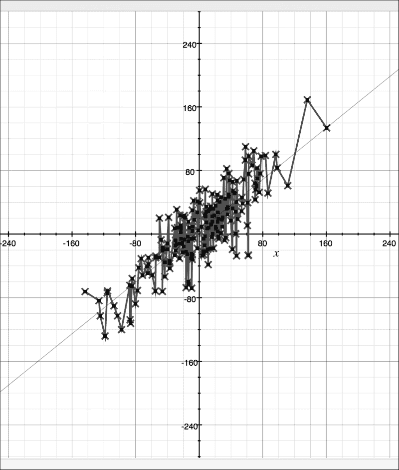

图 05-4\. 一个看似完美相关的数据集的回归曲线斜率小于一。这与回归问题优化的度量（y 距离）有关。

我将留给读者去寻找斜率小于一的原因，但这与回归问题应该回答的具体问题和它优化的度量有关。

# 逻辑回归

逻辑回归优化的是关于 *w* 的对数损失函数：


在这里，*y* 是二元的（在这种情况下是正负一）。虽然与线性回归的先前情况不同，没有闭合形式的解来最小化误差问题，但逻辑函数是可微的，允许快速收敛的迭代算法。

梯度如下：

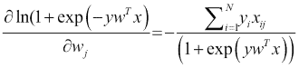

再次，我们可以快速编写一个 Scala 程序，使用梯度收敛到值，如图 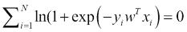（我们只使用 MLlib 的 `LabeledPoint` 数据结构来方便读取数据）：

```py
$ bin/spark-shell 
Welcome to
 ____              __
 / __/__  ___ _____/ /__
 _\ \/ _ \/ _ `/ __/  '_/
 /___/ .__/\_,_/_/ /_/\_\   version 1.6.1-SNAPSHOT
 /_/

Using Scala version 2.10.5 (Java HotSpot(TM) 64-Bit Server VM, Java 1.8.0_40)
Type in expressions to have them evaluated.
Type :help for more information.
Spark context available as sc.
SQL context available as sqlContext.

scala> import org.apache.spark.mllib.linalg.Vector
import org.apache.spark.mllib.linalg.Vector

scala> import org.apache.spark.util._
import org.apache.spark.util._

scala> import org.apache.spark.mllib.util._
import org.apache.spark.mllib.util._

scala> val data = MLUtils.loadLibSVMFile(sc, "data/iris/iris-libsvm.txt")
data: org.apache.spark.rdd.RDD[org.apache.spark.mllib.regression.LabeledPoint] = MapPartitionsRDD[291] at map at MLUtils.scala:112

scala> var w = Vector.random(4)
w: org.apache.spark.util.Vector = (0.9515155226069267, 0.4901713461728122, 0.4308861351586426, 0.8030814804136821)

scala> for (i <- 1.to(10)) println { val gradient = data.map(p => ( - p.label / (1+scala.math.exp(p.label*(Vector(p.features.toDense.values) dot w))) * Vector(p.features.toDense.values) )).reduce(_+_); w -= 0.1 * gradient; w }
(-24.056553839570114, -16.585585503253142, -6.881629923278653, -0.4154730884796032)
(38.56344616042987, 12.134414496746864, 42.178370076721365, 16.344526911520397)
(13.533446160429868, -4.95558550325314, 34.858370076721364, 15.124526911520398)
(-11.496553839570133, -22.045585503253143, 27.538370076721364, 13.9045269115204)
(-4.002010810020908, -18.501520148476196, 32.506256310962314, 15.455945245916512)
(-4.002011353029471, -18.501520429824225, 32.50625615219947, 15.455945209971787)
(-4.002011896036225, -18.501520711171313, 32.50625599343715, 15.455945174027184)
(-4.002012439041171, -18.501520992517463, 32.506255834675365, 15.455945138082699)
(-4.002012982044308, -18.50152127386267, 32.50625567591411, 15.455945102138333)
(-4.002013525045636, -18.501521555206942, 32.506255517153384, 15.455945066194088)

scala> w *= 0.24 / 4
w: org.apache.spark.util.Vector = (-0.24012081150273815, -1.1100912933124165, 1.950375331029203, 0.9273567039716453)

```

逻辑回归被简化为只有一行 Scala 代码！最后一行是为了归一化权重——只有相对值对于定义分离平面很重要——以便与之前章节中用 MLlib 获得的值进行比较。

实际实现中使用的 **随机梯度下降**（**SGD**）算法本质上与梯度下降相同，但以下方面进行了优化：

+   实际梯度是在记录的子样本上计算的，这可能导致由于更少的舍入噪声和避免局部最小值而加快转化。

+   步长——在我们的例子中是固定的 *0.1*——是迭代的单调递减函数，如图 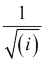，这也可能导致更好的转化。

+   它包含了正则化；你不仅最小化损失函数，还最小化损失函数的总和加上一些惩罚度量，这是一个关于模型复杂度的函数。我将在下一节讨论这个问题。

# 正则化

正则化最初是为了应对病态问题而开发的，在这些问题中，问题被约束不足——给定数据允许有多个解，或者数据和包含过多噪声的解（*A.N. Tikhonov*, *A.S. Leonov*, *A.G. Yagola. 非线性病态问题*, *Chapman and Hall*, *London*, *Weinhe*）。添加额外的惩罚函数，如果解不具有期望的性质，如曲线拟合或频谱分析中的平滑性，通常可以解决问题。

惩罚函数的选择在一定程度上是任意的，但它应该反映对解的期望偏斜。如果惩罚函数是可微分的，它可以被纳入梯度下降过程；岭回归就是一个例子，其中惩罚是权重或系数平方和的度量。

MLlib 目前实现了 , ，以及称为 **弹性网络** 的混合形式，如 第三章 中所示，*使用 Spark 和 MLlib*。 正则化有效地惩罚了回归权重中非零项的数量，但已知其收敛速度较慢。**最小绝对收缩和选择算子**（**LASSO**）使用了  正则化。

另一种减少约束不足问题不确定性的方法是考虑可能来自领域专家的先验信息。这可以通过贝叶斯分析实现，并在后验概率中引入额外的因素——概率规则通常表示为乘法而不是加法。然而，由于目标通常是最大化对数似然，贝叶斯校正通常也可以表示为标准正则化器。

# 多元回归

同时最小化多个指标是可能的。虽然 Spark 只有少数多元分析工具，但其他更传统且已建立的包包含 **多元方差分析**（**MANOVA**），它是 **方差分析**（**ANOVA**）方法的推广。我将在 第七章 中介绍 ANOVA 和 MANOVA，*使用图算法*。

对于实际分析，我们首先需要了解目标变量是否相关，这可以通过 第三章 中涵盖的 PCA Spark 实现来完成，*使用 Spark 和 MLlib*。如果因变量高度相关，最大化一个会导致最大化另一个，我们只需最大化第一个主成分（并且可能基于第二个成分构建回归模型来了解导致差异的因素）。

如果目标变量不相关，为每个目标构建一个单独的模型可以确定驱动它们的变量，以及这两个集合是否互斥。在后一种情况下，我们可以构建两个单独的模型来独立预测每个目标。

# 异方差性

回归方法中的一个基本假设是目标方差与独立（属性）或依赖（目标）变量不相关。一个可能打破这个假设的例子是计数数据，它通常由**泊松分布**描述。对于泊松分布，方差与期望值成正比，高值可以更多地贡献到权重的最终方差。

虽然异方差性可能会或可能不会显著地扭曲结果权重，但一种补偿异方差性的实用方法是进行对数变换，这在泊松分布的情况下会进行补偿：

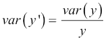

一些其他（参数化）变换是**Box-Cox 变换**：


在这里，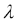是一个参数（对数变换是部分情况，其中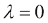）和 Tuckey 的 lambda 变换（对于介于 *0* 和 *1* 之间的属性）：

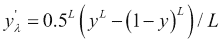

这些补偿了泊松二项分布的属性或一系列试验中成功概率的估计，这些试验可能包含混合的 *n* 个伯努利分布。

异方差性是逻辑函数最小化在二元预测问题中比线性回归使用最小化效果更好的主要原因之一。让我们更详细地考虑离散标签。

# 回归树

我们在上一章中看到了分类树。可以为回归问题构建一个递归的分割和合并结构，其中分割是为了最小化剩余的方差。回归树不如决策树或经典方差分析分析流行；然而，让我们在这里提供一个回归树的例子，作为 MLlib 的一部分：

```py
akozlov@Alexanders-MacBook-Pro$ bin/spark-shell 
Welcome to
 ____              __
 / __/__  ___ _____/ /__
 _\ \/ _ \/ _ `/ __/  '_/
 /___/ .__/\_,_/_/ /_/\_\   version 1.6.1-SNAPSHOT
 /_/

Using Scala version 2.10.5 (Java HotSpot(TM) 64-Bit Server VM, Java 1.8.0_40)
Type in expressions to have them evaluated.
Type :help for more information.
Spark context available as sc.
SQL context available as sqlContext.

scala> import org.apache.spark.mllib.tree.DecisionTree
import org.apache.spark.mllib.tree.DecisionTree

scala> import org.apache.spark.mllib.tree.model.DecisionTreeModel
import org.apache.spark.mllib.tree.model.DecisionTreeModel

scala> import org.apache.spark.mllib.util.MLUtils
import org.apache.spark.mllib.util.MLUtils

scala> // Load and parse the data file.

scala> val data = MLUtils.loadLibSVMFile(sc, "data/mllib/sample_libsvm_data.txt")
data: org.apache.spark.rdd.RDD[org.apache.spark.mllib.regression.LabeledPoint] = MapPartitionsRDD[6] at map at MLUtils.scala:112

scala> // Split the data into training and test sets (30% held out for testing)

scala> val Array(trainingData, testData) = data.randomSplit(Array(0.7, 0.3))
trainingData: org.apache.spark.rdd.RDD[org.apache.spark.mllib.regression.LabeledPoint] = MapPartitionsRDD[7] at randomSplit at <console>:26
testData: org.apache.spark.rdd.RDD[org.apache.spark.mllib.regression.LabeledPoint] = MapPartitionsRDD[8] at randomSplit at <console>:26

scala> val categoricalFeaturesInfo = Map[Int, Int]()
categoricalFeaturesInfo: scala.collection.immutable.Map[Int,Int] = Map()

scala> val impurity = "variance"
impurity: String = variance

scala> val maxDepth = 5
maxDepth: Int = 5

scala> val maxBins = 32
maxBins: Int = 32

scala> val model = DecisionTree.trainRegressor(trainingData, categoricalFeaturesInfo, impurity, maxDepth, maxBins)
model: org.apache.spark.mllib.tree.model.DecisionTreeModel = DecisionTreeModel regressor of depth 2 with 5 nodes

scala> val labelsAndPredictions = testData.map { point =>
 |   val prediction = model.predict(point.features)
 |   (point.label, prediction)
 | }
labelsAndPredictions: org.apache.spark.rdd.RDD[(Double, Double)] = MapPartitionsRDD[20] at map at <console>:36

scala> val testMSE = labelsAndPredictions.map{ case(v, p) => math.pow((v - p), 2)}.mean()
testMSE: Double = 0.07407407407407407

scala> println(s"Test Mean Squared Error = $testMSE")
Test Mean Squared Error = 0.07407407407407407

scala> println("Learned regression tree model:\n" + model.toDebugString)
Learned regression tree model:
DecisionTreeModel regressor of depth 2 with 5 nodes
 If (feature 378 <= 71.0)
 If (feature 100 <= 165.0)
 Predict: 0.0
 Else (feature 100 > 165.0)
 Predict: 1.0
 Else (feature 378 > 71.0)
 Predict: 1.0

```

在每个级别的分割是为了最小化方差，如下所示：


这相当于最小化每个叶子中标签值与其均值之间的距离，并将这些距离加总到节点的所有叶子中。

# 分类度量

如果标签是离散的，预测问题被称为分类。一般来说，每个记录的目标只能取一个值（尽管可能存在多值目标，尤其是在第六章中考虑的文本分类问题），*处理非结构化数据*。

如果离散值是有序的，并且排序有意义，例如 *Bad*，*Worse*，*Good*，则可以将离散标签转换为整数或双精度浮点数，问题就简化为回归（我们相信如果你在 *Bad* 和 *Worse* 之间，你肯定比 *Worse* 更远离 *Good*）。

要优化的通用度量是误分类率，如下所示：


然而，如果算法可以预测目标可能值的分布，则可以使用更通用的度量，如 KL 散度或曼哈顿距离。

KL 散度是使用概率分布 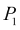 近似概率分布 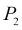 时信息损失的一个度量：


它与决策树归纳中使用的熵增益分割标准密切相关，因为后者是所有叶节点节点概率分布到叶概率分布的 KL 散度的总和。

# 多类问题

如果目标可能的结果数量大于两个，通常我们不得不预测目标值的期望概率分布，或者至少是按顺序排列的值列表——最好是通过一个排名变量来增强，该变量可以用于额外的分析。

虽然一些算法，如决策树，可以原生地预测多值属性。一种常见的技术是通过选择一个值作为基准，将一个*K*个目标值的预测减少到*(K-1)*个二元分类问题，构建*(K-1)*个二元分类器。通常选择最密集的级别作为基准是一个好主意。

# 感知器

在机器学习的早期，研究人员试图模仿人脑的功能。20 世纪初，人们认为人脑完全由称为神经元的细胞组成——具有长突起的细胞称为轴突，能够通过电脉冲传递信号。AI 研究人员试图通过感知器来复制神经元的功能，感知器是一个基于其输入值的线性加权和的激活函数：


这是对人类大脑中过程的一种非常简化的表示——自那时起，生物学家已经发现了除了电脉冲之外的其他信息传递方式，例如化学脉冲。此外，他们已经发现了 300 多种可能被归类为神经元的细胞类型（[`neurolex.org/wiki/Category:Neuron`](http://neurolex.org/wiki/Category:Neuron)）。此外，神经元放电的过程比仅仅电压的线性传输要复杂得多，因为它还涉及到复杂的时间模式。尽管如此，这个概念最终证明是非常有成效的，为神经网络或层间相互连接的感知集开发了许多算法和技术。具体来说，可以证明，通过某些修改，在放电方程中将步函数替换为逻辑函数，神经网络可以以任何所需的精度逼近任意可微函数。

MLlib 实现了**多层感知器分类器**（**MLCP**）作为一个`org.apache.spark.ml.classification.MultilayerPerceptronClassifier`类：

```py
$ bin/spark-shell 
Welcome to
 ____              __
 / __/__  ___ _____/ /__
 _\ \/ _ \/ _ `/ __/  '_/
 /___/ .__/\_,_/_/ /_/\_\   version 1.6.1-SNAPSHOT
 /_/

Using Scala version 2.10.5 (Java HotSpot(TM) 64-Bit Server VM, Java 1.8.0_40)
Type in expressions to have them evaluated.
Type :help for more information.
Spark context available as sc.
SQL context available as sqlContext.

scala> import org.apache.spark.ml.classification.MultilayerPerceptronClassifier
import org.apache.spark.ml.classification.MultilayerPerceptronClassifier

scala> import org.apache.spark.ml.evaluation.MulticlassClassificationEvaluator
import org.apache.spark.ml.evaluation.MulticlassClassificationEvaluator

scala> import org.apache.spark.mllib.util.MLUtils
import org.apache.spark.mllib.util.MLUtils

scala> 

scala> val data = MLUtils.loadLibSVMFile(sc, "iris-libsvm-3.txt").toDF()
data: org.apache.spark.sql.DataFrame = [label: double, features: vector] 

scala> 

scala> val Array(train, test) = data.randomSplit(Array(0.6, 0.4), seed = 13L)
train: org.apache.spark.sql.DataFrame = [label: double, features: vector]
test: org.apache.spark.sql.DataFrame = [label: double, features: vector]

scala> // specify layers for the neural network: 

scala> // input layer of size 4 (features), two intermediate of size 5 and 4 and output of size 3 (classes)

scala> val layers = Array(4, 5, 4, 3)
layers: Array[Int] = Array(4, 5, 4, 3)

scala> // create the trainer and set its parameters

scala> val trainer = new MultilayerPerceptronClassifier().setLayers(layers).setBlockSize(128).setSeed(13L).setMaxIter(100)
trainer: org.apache.spark.ml.classification.MultilayerPerceptronClassifier = mlpc_b5f2c25196f9

scala> // train the model

scala> val model = trainer.fit(train)
model: org.apache.spark.ml.classification.MultilayerPerceptronClassificationModel = mlpc_b5f2c25196f9

scala> // compute precision on the test set

scala> val result = model.transform(test)
result: org.apache.spark.sql.DataFrame = [label: double, features: vector, prediction: double]

scala> val predictionAndLabels = result.select("prediction", "label")
predictionAndLabels: org.apache.spark.sql.DataFrame = [prediction: double, label: double]

scala> val evaluator = new MulticlassClassificationEvaluator().setMetricName("precision")
evaluator: org.apache.spark.ml.evaluation.MulticlassClassificationEvaluator = mcEval_55757d35e3b0

scala> println("Precision = " + evaluator.evaluate(predictionAndLabels))
Precision = 0.9375

```

# 泛化误差和过拟合

那么，我们如何知道我们讨论的模型是好的呢？一个明显且最终的标准是其实际表现。

一个常见的难题困扰着更复杂的模型，例如决策树和神经网络，那就是过拟合问题。模型可以在提供的数据上最小化期望的指标，但在实际部署中，对稍微不同的数据集的处理却非常糟糕。即使是一个标准的技巧，当我们把数据集分成训练集和测试集，用于推导模型的训练和验证模型在保留数据集上表现良好的测试，也可能无法捕捉到部署中的所有变化。例如，线性模型如方差分析、逻辑回归和线性回归通常相对稳定，不太容易过拟合。然而，你可能会发现，任何特定的技术对于你的特定领域要么有效要么无效。

另一个可能导致泛化失败的情况是时间漂移。数据可能会随着时间的推移而显著变化，以至于在旧数据上训练的模型在部署中的新数据上不再泛化。在实践中，始终拥有几个生产模型并持续监控它们的相对性能总是一个好主意。

我将在第七章*使用图算法*和第九章*Scala 中的 NLP*中考虑避免过拟合的标准方法，如保留数据集和交叉验证，以及模型监控。

# 摘要

我们现在拥有了所有必要的工具来研究更复杂的问题，这些问题通常被称为大数据问题。凭借标准的统计算法——我明白我没有涵盖很多细节，我完全准备好接受批评——我们有了全新的领域去探索，在这个领域中我们没有明确定义的记录，数据集中的变量可能稀疏且嵌套，我们必须覆盖大量领域并做大量准备工作，仅仅为了达到可以应用标准统计模型的地步。这正是 Scala 最擅长的领域。

在下一章中，我们将更深入地探讨如何处理非结构化数据。
