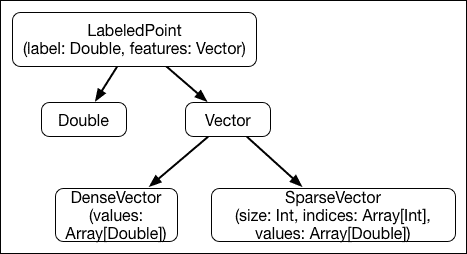

# 第六章。处理无结构数据

我非常激动地向您介绍这一章。无结构数据在现实中使得大数据与旧数据不同，它也使得 Scala 成为处理数据的新范式。首先，无结构数据乍一看似乎像是一个贬义词。尽管如此，这本书中的每一句话都是无结构数据：它没有传统的记录/行/列语义。然而，对于大多数人来说，这比将书籍呈现为表格或电子表格更容易阅读。

在实践中，无结构数据意味着嵌套和复杂的数据。一个 XML 文档或一张照片都是无结构数据的良好例子，它们具有非常丰富的结构。我的猜测是，这个术语的创造者原本的意思是，新的数据，工程师在像 Google、Facebook 和 Twitter 这样的社交互动公司看到的数据，与传统大家熟悉的扁平表格结构不同。这些数据确实不符合传统的 RDBMS 范式。其中一些可以被展平，但作为 RDBMS 没有针对它们进行优化，存储效率低下，而且不仅对人类，对机器也很难解析。

本章介绍的大量技术都是作为应急措施创建的，以应对仅处理数据的需要。

在本章中，我们将涵盖以下主题：

+   了解序列化、流行的序列化框架以及机器之间交流的语言

+   了解嵌套数据的 Avro-Parquet 编码

+   学习 RDBMs 如何尝试在类似 SQL 的现代语言中结合嵌套结构来处理它们

+   学习如何在 Scala 中开始处理嵌套结构

+   看一个会话化的实际例子——无结构数据最常见用例之一

+   看看 Scala 特性和 match/case 语句如何简化路径分析

+   学习嵌套结构如何有助于您的分析

# 嵌套数据

您已经在前面的章节中看到了无结构数据，数据是一个**LabeledPoint**数组，它是一个**(label: Double, features: Vector**)的元组。标签只是一个**Double**类型的数字。**Vector**是一个密封特质，有两个子类：**SparseVector**和**DenseVector**。类图如下：



图 1：LabeledPoint 类结构是一个标签和特征的元组，其中特征是一个具有两个继承子类{Dense,Sparse}Vector 的特质。DenseVector 是一个 double 类型的数组，而 SparseVector 通过索引和值存储大小和非默认元素。

每个观测值都是一个标签和特征的元组，特征可以是稀疏的。当然，如果没有缺失值，整个行可以表示为向量。密集向量表示需要 (*8 x size + 8*) 字节。如果大多数元素缺失或等于某个默认值，我们只需存储非默认元素。在这种情况下，我们需要 (*12 x non_missing_size + 20*) 字节，具体取决于 JVM 实现的小幅变化。因此，从存储的角度来看，在大小大于 *1.5 x* ( *non_missing_size + 1* ) 或大约至少 30% 的元素是非默认值时，我们需要在一种或另一种表示之间切换。虽然计算机语言擅长通过指针表示复杂结构，但我们还需要一种方便的形式来在 JVM 或机器之间交换这些数据。首先，让我们看看 Spark/Scala 是如何做的，特别是将数据持久化到 Parquet 格式：

```py
akozlov@Alexanders-MacBook-Pro$ bin/spark-shell 
Welcome to
 ____              __
 / __/__  ___ _____/ /__
 _\ \/ _ \/ _ `/ __/  '_/
 /___/ .__/\_,_/_/ /_/\_\   version 1.6.1-SNAPSHOT
 /_/

Using Scala version 2.11.7 (Java HotSpot(TM) 64-Bit Server VM, Java 1.8.0_40)
Type in expressions to have them evaluated.
Type :help for more information.
Spark context available as sc.
SQL context available as sqlContext.

scala> import org.apache.spark.mllib.regression.LabeledPoint
import org.apache.spark.mllib.regression.LabeledPoint

scala> import org.apache.spark.mllib.linalg.Vectors
import org.apache.spark.mllib.linalg.Vectors
Wha
scala> 

scala> val points = Array(
 |    LabeledPoint(0.0, Vectors.sparse(3, Array(1), Array(1.0))),
 |    LabeledPoint(1.0, Vectors.dense(0.0, 2.0, 0.0)),
 |    LabeledPoint(2.0, Vectors.sparse(3, Array((1, 3.0)))),
 |    LabeledPoint.parse("(3.0,[0.0,4.0,0.0])"));
pts: Array[org.apache.spark.mllib.regression.LabeledPoint] = Array((0.0,(3,[1],[1.0])), (1.0,[0.0,2.0,0.0]), (2.0,(3,[1],[3.0])), (3.0,[0.0,4.0,0.0]))
scala> 

scala> val rdd = sc.parallelize(points)
rdd: org.apache.spark.rdd.RDD[org.apache.spark.mllib.regression.LabeledPoint] = ParallelCollectionRDD[0] at parallelize at <console>:25

scala> 

scala> val df = rdd.repartition(1).toDF
df: org.apache.spark.sql.DataFrame = [label: double, features: vector]

scala> df.write.parquet("points")

```

我们所做的是从命令行创建一个新的 RDD 数据集，或者我们可以使用 `org.apache.spark.mllib.util.MLUtils` 来加载一个文本文件，将其转换为 DataFrames，并在 `points` 目录下创建其 Parquet 文件的序列化表示。

### 注意

**Parquet 代表什么？**

Apache Parquet 是一种列式存储格式，由 Cloudera 和 Twitter 联合开发，用于大数据。列式存储允许对数据集中的值进行更好的压缩，如果只需要从磁盘检索部分列，则效率更高。Parquet 是从底层构建的，考虑到复杂嵌套数据结构，并使用了 Dremel 论文中描述的记录切割和组装算法（[`blog.twitter.com/2013/dremel-made-simple-with-parquet`](https://blog.twitter.com/2013/dremel-made-simple-with-parquet)）。Dremel/Parquet 编码使用定义/重复字段来表示数据来自层次结构中的哪个级别，这覆盖了大多数直接的编码需求，因为它足以存储可选字段、嵌套数组和映射。Parquet 通过块存储数据，因此可能得名 Parquet，意为由按几何图案排列的木块组成的地面。Parquet 可以优化为只从磁盘读取部分块，这取决于要读取的列子集和使用的索引（尽管这很大程度上取决于特定实现是否了解这些功能）。列中的值可以使用字典和**运行长度编码**（**RLE**），这对于具有许多重复条目的列提供了非常好的压缩效果，这在大数据中是一个常见的用例。

Parquet 文件是一种二进制格式，但您可以使用 `parquet-tools` 来查看其中的信息，这些工具可以从 [`archive.cloudera.com/cdh5/cdh/5`](http://archive.cloudera.com/cdh5/cdh/5) 下载：

```py
akozlov@Alexanders-MacBook-Pro$ wget -O - http://archive.cloudera.com/cdh5/cdh/5/parquet-1.5.0-cdh5.5.0.tar.gz | tar xzvf -

akozlov@Alexanders-MacBook-Pro$ cd parquet-1.5.0-cdh5.5.0/parquet-tools

akozlov@Alexanders-MacBook-Pro$ tar xvf xvf parquet-1.5.0-cdh5.5.0/parquet-tools/target/parquet-tools-1.5.0-cdh5.5.0-bin.tar.gz

akozlov@Alexanders-MacBook-Pro$ cd parquet-tools-1.5.0-cdh5.5.0

akozlov@Alexanders-MacBook-Pro $ ./parquet-schema ~/points/*.parquet 
message spark_schema {
 optional double label;
 optional group features {
 required int32 type (INT_8);
 optional int32 size;
 optional group indices (LIST) {
 repeated group list {
 required int32 element;
 }
 }
 optional group values (LIST) {
 repeated group list {
 required double element;
 }
 }
 }
}

```

让我们来看看模式，它与*图 1*中描述的结构非常相似：第一个成员是类型为 double 的标签，第二个和最后一个成员是复合类型特征。关键字 optional 是另一种表示值可以在记录中为 null（缺失）的方式，这可能是因为一个或另一个原因。列表或数组被编码为重复字段。由于整个数组可能缺失（所有特征都可能缺失），它被包裹在可选组（索引和值）中。最后，类型编码表示它是一个稀疏表示还是密集表示：

```py
akozlov@Alexanders-MacBook-Pro $ ./parquet-dump ~/points/*.parquet 
row group 0 
----------------------------------------------------------------------------------------------------------------------------------------------------------------------
label:       DOUBLE GZIP DO:0 FPO:4 SZ:78/79/1.01 VC:4 ENC:BIT_PACKED,PLAIN,RLE
features: 
.type:       INT32 GZIP DO:0 FPO:82 SZ:101/63/0.62 VC:4 ENC:BIT_PACKED,PLAIN_DICTIONARY,RLE
.size:       INT32 GZIP DO:0 FPO:183 SZ:97/59/0.61 VC:4 ENC:BIT_PACKED,PLAIN_DICTIONARY,RLE
.indices: 
..list: 
...element:  INT32 GZIP DO:0 FPO:280 SZ:100/65/0.65 VC:4 ENC:PLAIN_DICTIONARY,RLE
.values: 
..list: 
...element:  DOUBLE GZIP DO:0 FPO:380 SZ:125/111/0.89 VC:8 ENC:PLAIN_DICTIONARY,RLE

 label TV=4 RL=0 DL=1
 ------------------------------------------------------------------------------------------------------------------------------------------------------------------
 page 0:                                           DLE:RLE RLE:BIT_PACKED VLE:PLAIN SZ:38 VC:4

 features.type TV=4 RL=0 DL=1 DS:                 2 DE:PLAIN_DICTIONARY
 ------------------------------------------------------------------------------------------------------------------------------------------------------------------
 page 0:                                           DLE:RLE RLE:BIT_PACKED VLE:PLAIN_DICTIONARY SZ:9 VC:4

 features.size TV=4 RL=0 DL=2 DS:                 1 DE:PLAIN_DICTIONARY
 ------------------------------------------------------------------------------------------------------------------------------------------------------------------
 page 0:                                           DLE:RLE RLE:BIT_PACKED VLE:PLAIN_DICTIONARY SZ:9 VC:4

 features.indices.list.element TV=4 RL=1 DL=3 DS: 1 DE:PLAIN_DICTIONARY
 ------------------------------------------------------------------------------------------------------------------------------------------------------------------
 page 0:                                           DLE:RLE RLE:RLE VLE:PLAIN_DICTIONARY SZ:15 VC:4

 features.values.list.element TV=8 RL=1 DL=3 DS:  5 DE:PLAIN_DICTIONARY
 ------------------------------------------------------------------------------------------------------------------------------------------------------------------
 page 0:                                           DLE:RLE RLE:RLE VLE:PLAIN_DICTIONARY SZ:17 VC:8

DOUBLE label 
----------------------------------------------------------------------------------------------------------------------------------------------------------------------
*** row group 1 of 1, values 1 to 4 *** 
value 1: R:0 D:1 V:0.0
value 2: R:0 D:1 V:1.0
value 3: R:0 D:1 V:2.0
value 4: R:0 D:1 V:3.0

INT32 features.type 
----------------------------------------------------------------------------------------------------------------------------------------------------------------------
*** row group 1 of 1, values 1 to 4 *** 
value 1: R:0 D:1 V:0
value 2: R:0 D:1 V:1
value 3: R:0 D:1 V:0
value 4: R:0 D:1 V:1

INT32 features.size 
----------------------------------------------------------------------------------------------------------------------------------------------------------------------
*** row group 1 of 1, values 1 to 4 *** 
value 1: R:0 D:2 V:3
value 2: R:0 D:1 V:<null>
value 3: R:0 D:2 V:3
value 4: R:0 D:1 V:<null>

INT32 features.indices.list.element 
----------------------------------------------------------------------------------------------------------------------------------------------------------------------
*** row group 1 of 1, values 1 to 4 *** 
value 1: R:0 D:3 V:1
value 2: R:0 D:1 V:<null>
value 3: R:0 D:3 V:1
value 4: R:0 D:1 V:<null>

DOUBLE features.values.list.element 
----------------------------------------------------------------------------------------------------------------------------------------------------------------------
*** row group 1 of 1, values 1 to 8 *** 
value 1: R:0 D:3 V:1.0
value 2: R:0 D:3 V:0.0
value 3: R:1 D:3 V:2.0
value 4: R:1 D:3 V:0.0
value 5: R:0 D:3 V:3.0
value 6: R:0 D:3 V:0.0
value 7: R:1 D:3 V:4.0
value 8: R:1 D:3 V:0.0

```

你可能对输出中的`R:`和`D:`有点困惑。这些是重复和定义级别，如 Dremel 论文中所述，并且它们是高效编码嵌套结构中的值所必需的。只有重复字段会增加重复级别，只有非必需字段会增加定义级别。`R`的下降表示列表（数组）的结束。对于层次树中的每个非必需级别，都需要一个新的定义级别。重复和定义级别值设计得较小，可以有效地以序列化形式存储。

如果有大量重复条目，它们都会放在一起。这是压缩算法（默认为 gzip）优化的情况。Parquet 还实现了其他利用重复值的算法，例如字典编码或 RLE 压缩。

这是一个简单且高效的默认序列化。我们已经能够将一组复杂对象写入文件，每个列存储在一个单独的块中，代表记录中的所有值和嵌套结构。

现在我们来读取文件并恢复 RDD。Parquet 格式对`LabeledPoint`类一无所知，所以我们必须在这里进行一些类型转换和技巧。当我们读取文件时，我们会看到一个`org.apache.spark.sql.Row`的集合：

```py
akozlov@Alexanders-MacBook-Pro$ bin/spark-shell 
Welcome to
 ____              __
 / __/__  ___ _____/ /__
 _\ \/ _ \/ _ `/ __/  '_/
 /___/ .__/\_,_/_/ /_/\_\   version 1.6.1-SNAPSHOT
 /_/

Using Scala version 2.11.7 (Java HotSpot(TM) 64-Bit Server VM, Java 1.8.0_40)
Type in expressions to have them evaluated.
Type :help for more information.
Spark context available as sc.
SQL context available as sqlContext.

scala> val df = sqlContext.read.parquet("points")
df: org.apache.spark.sql.DataFrame = [label: double, features: vector]

scala> val df = sqlContext.read.parquet("points").collect
df: Array[org.apache.spark.sql.Row] = Array([0.0,(3,[1],[1.0])], [1.0,[0.0,2.0,0.0]], [2.0,(3,[1],[3.0])], [3.0,[0.0,4.0,0.0]])

scala> val rdd = df.map(x => LabeledPoint(x(0).asInstanceOf[scala.Double], x(1).asInstanceOf[org.apache.spark.mllib.linalg.Vector]))
rdd: org.apache.spark.rdd.RDD[org.apache.spark.mllib.regression.LabeledPoint] = MapPartitionsRDD[16] at map at <console>:25

scala> rdd.collect
res12: Array[org.apache.spark.mllib.regression.LabeledPoint] = Array((0.0,(3,[1],[1.0])), (1.0,[0.0,2.0,0.0]), (2.0,(3,[1],[3.0])), (3.0,[0.0,4.0,0.0]))

scala> rdd.filter(_.features(1) <= 2).collect
res13: Array[org.apache.spark.mllib.regression.LabeledPoint] = Array((0.0,(3,[1],[1.0])), (1.0,[0.0,2.0,0.0]))

```

个人认为，这相当酷：无需任何编译，我们就可以编码和决定复杂对象。在 REPL 中，人们可以轻松地创建自己的对象。让我们考虑我们想要跟踪用户在网上的行为：

```py
akozlov@Alexanders-MacBook-Pro$ bin/spark-shell 
Welcome to
 ____              __
 / __/__  ___ _____/ /__
 _\ \/ _ \/ _ `/ __/  '_/
 /___/ .__/\_,_/_/ /_/\_\   version 1.6.1-SNAPSHOT
 /_/

Using Scala version 2.11.7 (Java HotSpot(TM) 64-Bit Server VM, Java 1.8.0_40)
Type in expressions to have them evaluated.
Type :help for more information.
Spark context available as sc.
SQL context available as sqlContext.

scala> case class Person(id: String, visits: Array[String]) { override def toString: String = { val vsts = visits.mkString(","); s"($id -> $vsts)" } }
defined class Person

scala> val p1 = Person("Phil", Array("http://www.google.com", "http://www.facebook.com", "http://www.linkedin.com", "http://www.homedepot.com"))
p1: Person = (Phil -> http://www.google.com,http://www.facebook.com,http://www.linkedin.com,http://www.homedepot.com)

scala> val p2 = Person("Emily", Array("http://www.victoriassecret.com", "http://www.pacsun.com", "http://www.abercrombie.com/shop/us", "http://www.orvis.com"))
p2: Person = (Emily -> http://www.victoriassecret.com,http://www.pacsun.com,http://www.abercrombie.com/shop/us,http://www.orvis.com)

scala> sc.parallelize(Array(p1,p2)).repartition(1).toDF.write.parquet("history")

scala> import scala.collection.mutable.WrappedArray
import scala.collection.mutable.WrappedArray

scala> val df = sqlContext.read.parquet("history")
df: org.apache.spark.sql.DataFrame = [id: string, visits: array<string>]

scala> val rdd = df.map(x => Person(x(0).asInstanceOf[String], x(1).asInstanceOf[WrappedArray[String]].toArray[String]))
rdd: org.apache.spark.rdd.RDD[Person] = MapPartitionsRDD[27] at map at <console>:28

scala> rdd.collect
res9: Array[Person] = Array((Phil -> http://www.google.com,http://www.facebook.com,http://www.linkedin.com,http://www.homedepot.com), (Emily -> http://www.victoriassecret.com,http://www.pacsun.com,http://www.abercrombie.com/shop/us,http://www.orvis.com))

```

作为良好的实践，我们需要将新创建的类注册到`Kryo`序列化器中——Spark 将使用另一种序列化机制在任务和执行器之间传递对象。如果未注册类，Spark 将使用默认的 Java 序列化，这可能会慢上*10 倍*：

```py
scala> :paste
// Entering paste mode (ctrl-D to finish)

import com.esotericsoftware.kryo.Kryo
import org.apache.spark.serializer.{KryoSerializer, KryoRegistrator}

class MyKryoRegistrator extends KryoRegistrator {
 override def registerClasses(kryo: Kryo) {
 kryo.register(classOf[Person])
 }
}

object MyKryoRegistrator {
 def register(conf: org.apache.spark.SparkConf) {
 conf.set("spark.serializer", classOf[KryoSerializer].getName)
 conf.set("spark.kryo.registrator", classOf[MyKryoRegistrator].getName)
 }
}
^D

// Exiting paste mode, now interpreting.

import com.esotericsoftware.kryo.Kryo
import org.apache.spark.serializer.{KryoSerializer, KryoRegistrator}
defined class MyKryoRegistrator
defined module MyKryoRegistrator

scala>

```

如果你正在集群上部署代码，建议将此代码放在类路径上的 jar 文件中。

我确实在生产中见过 10 层深嵌套的例子。虽然这可能在性能上可能有些过度，但在越来越多的生产业务用例中，嵌套是必需的。在我们深入到构建嵌套对象的细节之前，比如在会话化的例子中，让我们先对序列化有一个整体的了解。

# 其他序列化格式

我确实推荐使用 Parquet 格式来存储数据。然而，为了完整性，我至少需要提及其他序列化格式，其中一些，如 Kryo，将在 Spark 计算过程中不为人知地为你使用，并且显然存在默认的 Java 序列化。

### 提示

**面向对象方法与函数式方法**

面向对象方法中的对象以状态和行为为特征。对象是面向对象编程的基石。一个类是具有表示状态的字段和可能表示行为的方法的对象的模板。抽象方法实现可能依赖于类的实例。在函数式方法中，状态通常是不受欢迎的；在纯编程语言中，不应该有状态，没有副作用，并且每次调用都应该返回相同的结果。行为可以通过额外的函数参数和高级函数（如柯里化函数）来表示，但应该像抽象方法一样明确。由于 Scala 是一种面向对象和函数式的语言，一些先前的约束被违反了，但这并不意味着你必须在绝对必要时才使用它们。最佳实践是在存储数据的同时将代码存储在 jar 包中，尤其是对于大数据，将数据文件（以序列化形式）与代码文件分开；但再次强调，人们经常将数据/配置存储在 jar 文件中，而将代码存储在数据文件中则较少见，但也是可能的。

序列化问题自从需要在磁盘上持久化数据或通过网络将对象从一个 JVM 或机器传输到另一个机器以来就出现了。实际上，序列化的目的是使复杂的嵌套对象以一系列字节的形式表示，这些字节对机器来说是可理解的，并且正如你可以想象的那样，这可能是语言相关的。幸运的是，序列化框架在可以处理的一组常见数据结构上达成了一致。

最受欢迎的序列化机制之一，但并非最有效的，是将对象转储到 ASCII 文件中：CSV、XML、JSON、YAML 等等。它们可以处理更复杂的嵌套数据结构，如结构、数组和映射，但从存储空间的角度来看效率不高。例如，一个 Double 表示一个具有 15-17 位有效数字的连续数字，在不进行舍入或简单比例的情况下，在 US ASCII 中表示将占用 15-17 个字节，而二进制表示只需 8 个字节。整数可能存储得更有效率，尤其是如果它们很小，因为我们可以压缩/删除零。

文本编码的一个优点是它们可以用简单的命令行工具轻松可视化，但现在任何高级序列化框架都附带了一套用于处理原始记录的工具，例如`avro` *-* 或 `parquet-tools`。

下表概述了大多数常见的序列化框架：

| 序列化格式 | 开发时间 | 备注 |
| --- | --- | --- |
| XML, JSON, YAML | 这是对编码嵌套结构和在机器之间交换数据的必要性的直接回应。虽然效率低下，但它们仍然被许多地方使用，尤其是在网络服务中。唯一的优点是它们相对容易解析，无需机器。 |
| Protobuf | 由 Google 在 2000 年代初开发。它实现了 Dremel 编码方案并支持多种语言（Scala 尚未官方支持，尽管存在一些代码）。 | 主要优点是 Protobuf 可以在许多语言中生成原生类。C++、Java 和 Python 是官方支持的。有 C、C#、Haskell、Perl、Ruby、Scala 等语言的持续项目。运行时可以调用原生代码来检查/序列化/反序列化对象和二进制表示。 |
| Avro | Avro 是由 Doug Cutting 在 Cloudera 工作期间开发的。其主要目标是将编码与特定的实现和语言分离，从而实现更好的模式演进。尽管关于 Protobuf 或 Avro 哪个更高效的争论仍在继续，但与 Protobuf 相比，Avro 支持更多的复杂结构，例如开箱即用的联合和映射。Scala 的支持仍需加强以达到生产级别。Avro 文件中每个文件都包含编码的模式，这既有优点也有缺点。 |
| Thrift | Apache Thrift 是在 Facebook 为与 Protobuf 相同的目的开发的。它可能拥有最广泛的语言支持选择：C++、Java、Python、PHP、Ruby、Erlang、Perl、Haskell、C#、Cocoa、JavaScript、Node.js、Smalltalk、OCaml、Delphi 以及其他语言。Twitter 也在努力为 Scala 中的 Thrift 代码生成器（[`twitter.github.io/scrooge/`](https://twitter.github.io/scrooge/)) 进行开发。 | Apache Thrift 通常被描述为跨语言服务开发的框架，并且最常用于 **远程过程调用** (**RPC**)。尽管它可以直接用于序列化/反序列化，但其他框架却更受欢迎。 |
| Parquet | Parquet 是由 Twitter 和 Cloudera 联合开发的。与以行为导向的 Avro 格式相比，Parquet 是列式存储，如果只选择少量列，则可以实现更好的压缩和性能。区间编码基于 Dremel 或 Protobuf，尽管记录以 Avro 记录的形式呈现；因此，它通常被称为 **AvroParquet**。 | 索引、字典编码和 RLE 压缩等高级功能可能使其对于纯磁盘存储非常高效。由于 Parquet 需要进行一些预处理和索引构建才能将其提交到磁盘，因此写入文件可能会更慢。 |
| Kryo | 这是一个用于在 Java 中编码任意类的框架。然而，并非所有内置的 Java 集合类都可以序列化。 | 如果避免非序列化异常，例如优先队列，Kryo 可以非常高效。Scala 的直接支持也在进行中。 |

当然，Java 有一个内置的序列化框架，但由于它必须支持所有 Java 情况，因此过于通用，Java 序列化比任何先前的方法都要低效得多。我确实看到其他公司更早地实现了他们自己的专有序列化，这会优于先前的任何序列化针对特定情况。如今，这已不再必要，因为维护成本肯定超过了现有框架的收敛低效。

# Hive 和 Impala

新框架的设计考虑因素之一总是与旧框架的兼容性。不论好坏，大多数数据分析师仍在使用 SQL。SQL 的根源可以追溯到一篇有影响力的关系建模论文（*Codd, Edgar F*（1970 年 6 月）。*大型共享数据银行的数据关系模型*。《ACM 通讯》（计算机制造协会）13（6）：377–87）。所有现代数据库都实现了 SQL 的一个或多个版本。

虽然关系模型对提高数据库性能有影响，尤其是对于**在线事务处理**（**OLTP**）的竞争力水平，但对于需要执行聚合的查询负载以及关系本身发生变化并受到分析的情况，规范化的重要性较低。本节将介绍用于大数据分析的传统分析引擎的标准 SQL 语言的扩展：Hive 和 Impala。它们目前都是 Apache 许可项目。以下表格总结了复杂类型：

| 类型 | Hive 支持版本 | Impala 支持版本 | 备注 |
| --- | --- | --- | --- |
| `ARRAY` | 自 0.1.0 版本起支持，但非常量索引表达式的使用仅限于 0.14 版本。 | 自 2.3.0 版本起支持（仅限于 Parquet 表）。 | 可以是任何类型的数组，包括复杂类型。在 Hive 中索引是`int`（在 Impala 中是`bigint`），通过数组符号访问，例如，`element[1]`仅在 Hive 中（在 Impala 中通过`array.pos`和`item`伪列访问）。 |
| `MAP` | 自 0.1.0 版本起支持，但非常量索引表达式的使用仅限于 0.14 版本。 | 自 2.3.0 版本起支持（仅限于 Parquet 表）。 | 键应该是原始类型。一些库只支持字符串类型的键。字段通过数组符号访问，例如，`map["key"]`仅在 Hive 中（在 Impala 中通过 map 键和值伪列访问）。 |
| `STRUCT` | 自 0.5.0 版本起支持。 | 自 2.3.0 版本起支持（仅限于 Parquet 表）。 | 使用点符号访问，例如，`struct.element`。 |
| `UNIONTYPE` | 自 0.7.0 版本起支持。 | 在 Impala 中不支持。 | 支持不完整：引用`JOIN`（HIVE-2508）、`WHERE`和`GROUP BY`子句中的`UNIONTYPE`字段的查询将失败，并且 Hive 没有定义提取`UNIONTYPE`的标签或值字段的语法。这意味着`UNIONTYPEs`实际上只能查看。 |

虽然 Hive/Impala 表可以建立在多种底层文件格式（文本、序列、ORC、Avro、Parquet 以及甚至自定义格式）和多种序列化之上，但在大多数实际情况下，Hive 用于读取 ASCII 文件的文本行。底层的序列化/反序列化格式是`LazySimpleSerDe`（**序列化**/**反序列化**（**SerDe**））。该格式定义了多个分隔符级别，如下所示：

```py
row_format
  : DELIMITED [FIELDS TERMINATED BY char [ESCAPED BY char]] [COLLECTION ITEMS TERMINATED BY char]
    [MAP KEYS TERMINATED BY char] [LINES TERMINATED BY char]
    [NULL DEFINED AS char]
```

分隔符的默认值是`'\001'`或`^A`，`'\002'`或`^B`，以及`'\003'`或`^B`。换句话说，它是在层次结构的每一级使用新的分隔符，而不是 Dremel 编码中的定义/重复指示符。例如，为了编码我们之前使用的`LabeledPoint`表，我们需要创建一个文件，如下所示：

```py
$ cat data
0^A1^B1^D1.0$
2^A1^B1^D3.0$
1^A0^B0.0^C2.0^C0.0$
3^A0^B0.0^C4.0^C0.0$

```

从[`archive.cloudera.com/cdh5/cdh/5/hive-1.1.0-cdh5.5.0.tar.gz`](http://archive.cloudera.com/cdh5/cdh/5/hive-1.1.0-cdh5.5.0.tar.gz)下载 Hive 并执行以下操作：

```py
$ tar xf hive-1.1.0-cdh5.5.0.tar.gz 
$ cd hive-1.1.0-cdh5.5.0
$ bin/hive
…
hive> CREATE TABLE LABELED_POINT ( LABEL INT, VECTOR UNIONTYPE<ARRAY<DOUBLE>, MAP<INT,DOUBLE>> ) STORED AS TEXTFILE;
OK
Time taken: 0.453 seconds
hive> LOAD DATA LOCAL INPATH './data' OVERWRITE INTO TABLE LABELED_POINT;
Loading data to table alexdb.labeled_point
Table labeled_point stats: [numFiles=1, numRows=0, totalSize=52, rawDataSize=0]
OK
Time taken: 0.808 seconds
hive> select * from labeled_point;
OK
0  {1:{1:1.0}}
2  {1:{1:3.0}}
1  {0:[0.0,2.0,0.0]}
3  {0:[0.0,4.0,0.0]}
Time taken: 0.569 seconds, Fetched: 4 row(s)
hive>

```

在 Spark 中，可以通过`sqlContext.sql`方法从关系型表中选择，但遗憾的是，截至 Spark 1.6.1 版本，Hive 联合类型并不直接支持；尽管如此，它支持 map 和数组。在其他 BI 和数据分析工具中复杂对象的可用性仍然是它们被采用的最大障碍。将所有内容作为 Scala 中的丰富数据结构支持是一种收敛到嵌套数据表示的选项。

# 会话化

我将通过会话化的例子来演示复杂或嵌套结构的使用。在会话化中，我们想要找到某个 ID 在一段时间内的实体行为。虽然原始记录可能以任何顺序到来，但我们想要总结时间上的行为以推导出趋势。

我们已经在第一章 *探索性数据分析* 中分析了 Web 服务器日志。我们发现了不同网页在一段时间内被访问的频率。我们可以对这个信息进行切块和切片，但没有分析页面访问的顺序，就很难理解每个用户与网站的交互。在这一章中，我想要通过跟踪用户在整个网站中的导航来给这个分析增加更多的个性化特点。会话化是网站个性化、广告、物联网跟踪、遥测和企业安全等与实体行为相关的常见工具。

假设数据以三个元素的元组形式出现（原始数据集中的字段`1`、`5`、`11`，见第一章，*探索性数据分析*）：

```py
(id, timestamp, path)
```

在这里，`id`是一个唯一的实体 ID，时间戳是事件的时间戳（任何可排序的格式：Unix 时间戳或 ISO8601 日期格式），而`path`是关于 Web 服务器页面层级结构的某种指示。

对于熟悉 SQL 或至少熟悉其子集的人来说，会话化（sessionization）更知名为一个窗口分析函数：

```py
SELECT id, timestamp, path 
  ANALYTIC_FUNCTION(path) OVER (PARTITION BY id ORDER BY timestamp) AS agg
FROM log_table;
```

在这里，`ANALYTIC_FUNCTION`是对给定`id`的路径序列的某种转换。虽然这种方法适用于相对简单的函数，如 first、last、lag、average，但在路径序列上表达复杂函数通常非常复杂（例如，Aster Data 中的 nPath ([`www.nersc.gov/assets/Uploads/AnalyticsFoundation5.0previewfor4.6.x-Guide.pdf`](https://www.nersc.gov/assets/Uploads/AnalyticsFoundation5.0previewfor4.6.x-Guide.pdf)))）。此外，没有额外的预处理和分区，这些方法通常会导致在分布式设置中跨多个节点的大数据传输。

在纯函数式方法中，人们只需设计一个函数或一系列函数应用来从原始的元组集中生成所需的答案，我将创建两个辅助对象，这将帮助我们简化与用户会话概念的工作。作为额外的优势，新的嵌套结构可以持久化到磁盘上，以加快对额外问题的答案获取。

让我们看看在 Spark/Scala 中使用 case 类是如何实现的：

```py
akozlov@Alexanders-MacBook-Pro$ bin/spark-shell
Welcome to
 ____              __
 / __/__  ___ _____/ /__
 _\ \/ _ \/ _ `/ __/  '_/
 /___/ .__/\_,_/_/ /_/\_\   version 1.6.1-SNAPSHOT
 /_/

Using Scala version 2.11.7 (Java HotSpot(TM) 64-Bit Server VM, Java 1.8.0_40)
Type in expressions to have them evaluated.
Type :help for more information.
Spark context available as sc.
SQL context available as sqlContext.

scala> :paste
// Entering paste mode (ctrl-D to finish)

import java.io._

// a basic page view structure
@SerialVersionUID(123L)
case class PageView(ts: String, path: String) extends Serializable with Ordered[PageView] {
 override def toString: String = {
 s"($ts :$path)"
 }
 def compare(other: PageView) = ts compare other.ts
}

// represent a session
@SerialVersionUID(456L)
case class SessionA  <: PageView extends Serializable {
 override def toString: String = {
 val vsts = visits.mkString("[", ",", "]")
 s"($id -> $vsts)"
 }
}^D
// Exiting paste mode, now interpreting.

import java.io._
defined class PageView
defined class Session

```

第一个类将代表一个带有时间戳的单个页面视图，在这个例子中，它是一个 ISO8601 的`String`，而第二个是一个页面视图的序列。我们能通过将这两个成员编码为一个带有对象分隔符的`String`来实现吗？绝对可以，但将字段表示为类的成员提供了良好的访问语义，同时将一些需要在编译器上执行的工作卸载掉，这总是件好事。

让我们阅读之前描述的日志文件并构建对象：

```py
scala> val rdd = sc.textFile("log.csv").map(x => { val z = x.split(",",3); (z(1), new PageView(z(0), z(2))) } ).groupByKey.map( x => { new Session(x._1, x._2.toSeq.sorted) } ).persist
rdd: org.apache.spark.rdd.RDD[Session] = MapPartitionsRDD[14] at map at <console>:31

scala> rdd.take(3).foreach(println)
(189.248.74.238 -> [(2015-08-23 23:09:16 :mycompanycom>homepage),(2015-08-23 23:11:00 :mycompanycom>homepage),(2015-08-23 23:11:02 :mycompanycom>running:slp),(2015-08-23 23:12:01 :mycompanycom>running:slp),(2015-08-23 23:12:03 :mycompanycom>running>stories>2013>04>themycompanyfreestore:cdp),(2015-08-23 23:12:08 :mycompanycom>running>stories>2013>04>themycompanyfreestore:cdp),(2015-08-23 23:12:08 :mycompanycom>running>stories>2013>04>themycompanyfreestore:cdp),(2015-08-23 23:12:42 :mycompanycom>running:slp),(2015-08-23 23:13:25 :mycompanycom>homepage),(2015-08-23 23:14:00 :mycompanycom>homepage),(2015-08-23 23:14:06 :mycompanycom:mobile>mycompany photoid>landing),(2015-08-23 23:14:56 :mycompanycom>men>shoes:segmentedgrid),(2015-08-23 23:15:10 :mycompanycom>homepage)])
(82.166.130.148 -> [(2015-08-23 23:14:27 :mycompanycom>homepage)])
(88.234.248.111 -> [(2015-08-23 22:36:10 :mycompanycom>plus>home),(2015-08-23 22:36:20 :mycompanycom>plus>home),(2015-08-23 22:36:28 :mycompanycom>plus>home),(2015-08-23 22:36:30 :mycompanycom>plus>onepluspdp>sport band),(2015-08-23 22:36:52 :mycompanycom>onsite search>results found),(2015-08-23 22:37:19 :mycompanycom>plus>onepluspdp>sport band),(2015-08-23 22:37:21 :mycompanycom>plus>home),(2015-08-23 22:37:39 :mycompanycom>plus>home),(2015-08-23 22:37:43 :mycompanycom>plus>home),(2015-08-23 22:37:46 :mycompanycom>plus>onepluspdp>sport watch),(2015-08-23 22:37:50 :mycompanycom>gear>mycompany+ sportwatch:standardgrid),(2015-08-23 22:38:14 :mycompanycom>homepage),(2015-08-23 22:38:35 :mycompanycom>homepage),(2015-08-23 22:38:37 :mycompanycom>plus>products landing),(2015-08-23 22:39:01 :mycompanycom>homepage),(2015-08-23 22:39:24 :mycompanycom>homepage),(2015-08-23 22:39:26 :mycompanycom>plus>whatismycompanyfuel)])

```

Bingo！我们得到了一个包含会话的 RDD，每个会话对应一个唯一的 IP 地址。IP 地址`189.248.74.238`有一个从`23:09:16`到`23:15:10`的会话，看起来是在浏览男士鞋子后结束的。IP 地址`82.166.130.148`的会话只有一个点击。最后一个会话专注于运动手表，从`2015-08-23 22:36:10`持续了超过三分钟到`2015-08-23 22:39:26`。现在，我们可以轻松地询问涉及特定导航路径模式的问题。例如，我们想要分析所有导致结账（路径中包含`checkout`）的会话，并查看点击次数以及主页最后点击后的时间分布：

```py
scala> import java.time.ZoneOffset
import java.time.ZoneOffset

scala> import java.time.LocalDateTime
import java.time.LocalDateTime

scala> import java.time.format.DateTimeFormatter
import java.time.format.DateTimeFormatter

scala> 
scala> def toEpochSeconds(str: String) : Long = { LocalDateTime.parse(str, DateTimeFormatter.ofPattern("yyyy-MM-dd HH:mm:ss")).toEpochSecond(ZoneOffset.UTC) }
toEpochSeconds: (str: String)Long

scala> val checkoutPattern = ".*>checkout.*".r.pattern
checkoutPattern: java.util.regex.Pattern = .*>checkout.*

scala> val lengths = rdd.map(x => { val pths = x.visits.map(y => y.path); val pchs = pths.indexWhere(checkoutPattern.matcher(_).matches); (x.id, x.visits.map(y => y.ts).min, x.visits.map(y => y.ts).max, x.visits.lastIndexWhere(_ match { case PageView(ts, "mycompanycom>homepage") => true; case _ => false }, pchs), pchs, x.visits) } ).filter(_._4>0).filter(t => t._5>t._4).map(t => (t._5 - t._4, toEpochSeconds(t._6(t._5).ts) - toEpochSeconds(t._6(t._4).ts)))

scala> lengths.toDF("cnt", "sec").agg(avg($"cnt"),min($"cnt"),max($"cnt"),avg($"sec"),min($"sec"),max($"sec")).show
+-----------------+--------+--------+------------------+--------+--------+

|         avg(cnt)|min(cnt)|max(cnt)|          avg(sec)|min(sec)|max(sec)|
+-----------------+--------+--------+------------------+--------+--------+
|19.77570093457944|       1|     121|366.06542056074767|      15|    2635|
+-----------------+--------+--------+------------------+--------+--------+

scala> lengths.map(x => (x._1,1)).reduceByKey(_+_).sortByKey().collect
res18: Array[(Int, Int)] = Array((1,1), (2,8), (3,2), (5,6), (6,7), (7,9), (8,10), (9,4), (10,6), (11,4), (12,4), (13,2), (14,3), (15,2), (17,4), (18,6), (19,1), (20,1), (21,1), (22,2), (26,1), (27,1), (30,2), (31,2), (35,1), (38,1), (39,2), (41,1), (43,2), (47,1), (48,1), (49,1), (65,1), (66,1), (73,1), (87,1), (91,1), (103,1), (109,1), (121,1))

```

这些会话的持续时间从 1 到 121 次点击，平均点击次数为 8 次，从 15 到 2653 秒（或大约 45 分钟）。你为什么会对这个信息感兴趣呢？长时间的会话可能表明会话中间出现了问题：长时间的延迟或无响应的电话。但这并不一定：这个人可能只是吃了个漫长的午餐休息，或者打了个电话讨论他的潜在购买，但这里可能有一些有趣的东西。至少应该同意这一点是一个异常值，需要仔细分析。

让我们谈谈将数据持久化到磁盘的问题。正如你所看到的，我们的转换被写成了一个长的管道，所以结果中没有任何东西是不能从原始数据计算出来的。这是一个功能性的方法，数据是不可变的。此外，如果我们的处理过程中出现了错误，比如说我想将主页更改为其他锚定页面，我总是可以修改函数而不是数据。你可能对这个事实感到满意或不满意，但结果中绝对没有额外的信息——转换只会增加无序和熵。它们可能使人类更容易接受，但这仅仅是因为人类是一个非常低效的数据处理装置。

### 提示

**为什么重新排列数据会使分析更快？**

会话化似乎只是简单的数据重新排列——我们只是将按顺序访问的页面放在一起。然而，在许多情况下，它使实际数据分析的速度提高了 10 到 100 倍。原因是数据局部性。分析，如过滤或路径匹配，通常一次只发生在会话中的一个页面上。推导用户特征需要用户的全部页面浏览或交互都在磁盘和内存的一个地方。这通常比其他低效性更好，比如编码/解码嵌套结构的开销，因为这可以在本地 L1/L2 缓存中发生，而不是从 RAM 或磁盘进行数据传输，这在现代多线程 CPU 中要昂贵得多。当然，这很大程度上取决于分析的复杂性。

有必要将新数据持久化到磁盘，我们可以使用 CSV、Avro 或 Parquet 格式来完成。原因是我们不希望在再次查看数据时重新处理数据。新的表示可能更紧凑，更高效地检索和展示给我的经理。实际上，人类喜欢副作用，幸运的是，Scala/Spark 允许你像前一个部分所描述的那样做。

嗯，嗯，嗯...让我们来说说熟悉会话化的人。这只是故事的一部分。我们想要将路径序列分割成多个会话，运行路径分析，计算页面转换的条件概率等等。这正是函数式范式大放异彩的地方。编写以下函数：

```py
def splitSession(session: Session[PageView]) : Seq[Session[PageView]] = { … }
```

然后运行以下代码：

```py
val newRdd = rdd.flatMap(splitSession)
```

哈哈！结果是会话的分割。我故意省略了实现部分；实现是用户依赖的，而不是数据，每个分析师可能有自己将页面访问序列分割成会话的方式。

另一个应用函数的用例是用于机器学习的特征生成……这已经暗示了副作用：我们希望修改世界的状态，使其更加个性化和用户友好。我想无论如何也无法避免。

# 使用特性

正如我们所见，案例类显著简化了我们构造新嵌套数据结构的方式。案例类的定义可能是从 Java（和 SQL）迁移到 Scala 的最有说服力的理由。那么，关于方法呢？我们如何快速向类中添加方法而不需要昂贵的重新编译？Scala 允许您通过特性透明地做到这一点！

函数式编程的一个基本特征是函数与对象处于同等地位，是一等公民。在前一节中，我们定义了两个将 ISO8601 格式转换为秒的纪元时间的 `EpochSeconds` 函数。我们还建议了 `splitSession` 函数，它为给定的 IP 提供多会话视图。我们如何将这种行为或其它行为与给定的类关联起来？

首先，让我们定义一个期望的行为：

```py
scala> trait Epoch {
 |   this: PageView =>
 |   def epoch() : Long = { LocalDateTime.parse(ts, DateTimeFormatter.ofPattern("yyyy-MM-dd HH:mm:ss")).toEpochSecond(ZoneOffset.UTC) }
 | }
defined trait Epoch

```

这基本上创建了一个 `PageView` 特定的函数，它将日期时间的字符串表示转换为秒的纪元时间。现在，如果我们只是进行以下转换：

```py
scala> val rddEpoch = rdd.map(x => new Session(x.id, x.visits.map(x => new PageView(x.ts, x.path) with Epoch)))
rddEpoch: org.apache.spark.rdd.RDD[Session[PageView with Epoch]] = MapPartitionsRDD[20] at map at <console>:31

```

现在我们有一个包含额外行为的页面视图的新 RDD。例如，如果我们想找出会话中每个单独页面花费的时间，我们将运行以下管道：

```py
scala> rddEpoch.map(x => (x.id, x.visits.zip(x.visits.tail).map(x => (x._2.path, x._2.epoch - x._1.epoch)).mkString("[", ",", "]"))).take(3).foreach(println)
(189.248.74.238,[(mycompanycom>homepage,104),(mycompanycom>running:slp,2),(mycompanycom>running:slp,59),(mycompanycom>running>stories>2013>04>themycompanyfreestore:cdp,2),(mycompanycom>running>stories>2013>04>themycompanyfreestore:cdp,5),(mycompanycom>running>stories>2013>04>themycompanyfreestore:cdp,0),(mycompanycom>running:slp,34),(mycompanycom>homepage,43),(mycompanycom>homepage,35),(mycompanycom:mobile>mycompany photoid>landing,6),(mycompanycom>men>shoes:segmentedgrid,50),(mycompanycom>homepage,14)])
(82.166.130.148,[])
(88.234.248.111,[(mycompanycom>plus>home,10),(mycompanycom>plus>home,8),(mycompanycom>plus>onepluspdp>sport band,2),(mycompanycom>onsite search>results found,22),(mycompanycom>plus>onepluspdp>sport band,27),(mycompanycom>plus>home,2),(mycompanycom>plus>home,18),(mycompanycom>plus>home,4),(mycompanycom>plus>onepluspdp>sport watch,3),(mycompanycom>gear>mycompany+ sportwatch:standardgrid,4),(mycompanycom>homepage,24),(mycompanycom>homepage,21),(mycompanycom>plus>products landing,2),(mycompanycom>homepage,24),(mycompanycom>homepage,23),(mycompanycom>plus>whatismycompanyfuel,2)])

```

可以同时添加多个特性，而不会影响原始类定义或原始数据。无需重新编译。

# 使用模式匹配

没有一本 Scala 书会不提到匹配/案例语句。Scala 有一个非常丰富的模式匹配机制。例如，假设我们想找出所有以主页开始，随后是产品页面的页面视图序列的实例——我们真正想过滤出确定的买家。这可以通过以下新函数实现：

```py
scala> def findAllMatchedSessions(h: Seq[Session[PageView]], s: Session[PageView]) : Seq[Session[PageView]] = {
 |     def matchSessions(h: Seq[Session[PageView]], id: String, p: Seq[PageView]) : Seq[Session[PageView]] = {
 |       p match {
 |         case Nil => Nil
 |         case PageView(ts1, "mycompanycom>homepage") :: PageView(ts2, "mycompanycom>plus>products landing") :: tail =>
 |           matchSessions(h, id, tail).+:(new Session(id, p))
 |         case _ => matchSessions(h, id, p.tail)
 |       }
 |     }
 |    matchSessions(h, s.id, s.visits)
 | }
findAllSessions: (h: Seq[Session[PageView]], s: Session[PageView])Seq[Session[PageView]]

```

注意我们在案例语句中明确地放置了 `PageView` 构造函数！Scala 将遍历 `visits` 序列，并生成与指定的两个 `PageViews` 匹配的新会话，如下所示：

```py
scala> rdd.flatMap(x => findAllMatchedSessions(Nil, x)).take(10).foreach(println)
(88.234.248.111 -> [(2015-08-23 22:38:35 :mycompanycom>homepage),(2015-08-23 22:38:37 :mycompanycom>plus>products landing),(2015-08-23 22:39:01 :mycompanycom>homepage),(2015-08-23 22:39:24 :mycompanycom>homepage),(2015-08-23 22:39:26 :mycompanycom>plus>whatismycompanyfuel)])
(148.246.218.251 -> [(2015-08-23 22:52:09 :mycompanycom>homepage),(2015-08-23 22:52:16 :mycompanycom>plus>products landing),(2015-08-23 22:52:23 :mycompanycom>homepage),(2015-08-23 22:52:32 :mycompanycom>homepage),(2015-08-23 22:52:39 :mycompanycom>running:slp)])
(86.30.116.229 -> [(2015-08-23 23:15:00 :mycompanycom>homepage),(2015-08-23 23:15:02 :mycompanycom>plus>products landing),(2015-08-23 23:15:12 :mycompanycom>plus>products landing),(2015-08-23 23:15:18 :mycompanycom>language tunnel>load),(2015-08-23 23:15:23 :mycompanycom>language tunnel>geo selected),(2015-08-23 23:15:24 :mycompanycom>homepage),(2015-08-23 23:15:27 :mycompanycom>homepage),(2015-08-23 23:15:30 :mycompanycom>basketball:slp),(2015-08-23 23:15:38 :mycompanycom>basketball>lebron-10:cdp),(2015-08-23 23:15:50 :mycompanycom>basketball>lebron-10:cdp),(2015-08-23 23:16:05 :mycompanycom>homepage),(2015-08-23 23:16:09 :mycompanycom>homepage),(2015-08-23 23:16:11 :mycompanycom>basketball:slp),(2015-08-23 23:16:29 :mycompanycom>onsite search>results found),(2015-08-23 23:16:39 :mycompanycom>onsite search>no results)])
(204.237.0.130 -> [(2015-08-23 23:26:23 :mycompanycom>homepage),(2015-08-23 23:26:27 :mycompanycom>plus>products landing),(2015-08-23 23:26:35 :mycompanycom>plus>fuelband activity>summary>wk)])
(97.82.221.34 -> [(2015-08-23 22:36:24 :mycompanycom>homepage),(2015-08-23 22:36:32 :mycompanycom>plus>products landing),(2015-08-23 22:37:09 :mycompanycom>plus>plus activity>summary>wk),(2015-08-23 22:37:39 :mycompanycom>plus>products landing),(2015-08-23 22:44:17 :mycompanycom>plus>home),(2015-08-23 22:44:33 :mycompanycom>plus>home),(2015-08-23 22:44:34 :mycompanycom>plus>home),(2015-08-23 22:44:36 :mycompanycom>plus>home),(2015-08-23 22:44:43 :mycompanycom>plus>home)])
(24.230.204.72 -> [(2015-08-23 22:49:58 :mycompanycom>homepage),(2015-08-23 22:50:00 :mycompanycom>plus>products landing),(2015-08-23 22:50:30 :mycompanycom>homepage),(2015-08-23 22:50:38 :mycompanycom>homepage),(2015-08-23 22:50:41 :mycompanycom>training:cdp),(2015-08-23 22:51:56 :mycompanycom>training:cdp),(2015-08-23 22:51:59 :mycompanycom>store locator>start),(2015-08-23 22:52:28 :mycompanycom>store locator>landing)])
(62.248.72.18 -> [(2015-08-23 23:14:27 :mycompanycom>homepage),(2015-08-23 23:14:30 :mycompanycom>plus>products landing),(2015-08-23 23:14:33 :mycompanycom>plus>products landing),(2015-08-23 23:14:40 :mycompanycom>plus>products landing),(2015-08-23 23:14:47 :mycompanycom>store homepage),(2015-08-23 23:14:50 :mycompanycom>store homepage),(2015-08-23 23:14:55 :mycompanycom>men:clp),(2015-08-23 23:15:08 :mycompanycom>men:clp),(2015-08-23 23:15:15 :mycompanycom>men:clp),(2015-08-23 23:15:16 :mycompanycom>men:clp),(2015-08-23 23:15:24 :mycompanycom>men>sportswear:standardgrid),(2015-08-23 23:15:41 :mycompanycom>pdp>mycompany blazer low premium vintage suede men's shoe),(2015-08-23 23:15:45 :mycompanycom>pdp>mycompany blazer low premium vintage suede men's shoe),(2015-08-23 23:15:45 :mycompanycom>pdp>mycompany blazer low premium vintage suede men's shoe),(2015-08-23 23:15:49 :mycompanycom>pdp>mycompany blazer low premium vintage suede men's shoe),(2015-08-23 23:15:50 :mycompanycom>pdp>mycompany blazer low premium vintage suede men's shoe),(2015-08-23 23:15:56 :mycompanycom>men>sportswear:standardgrid),(2015-08-23 23:18:41 :mycompanycom>pdp>mycompany bruin low men's shoe),(2015-08-23 23:18:42 :mycompanycom>pdp>mycompany bruin low men's shoe),(2015-08-23 23:18:53 :mycompanycom>pdp>mycompany bruin low men's shoe),(2015-08-23 23:18:55 :mycompanycom>pdp>mycompany bruin low men's shoe),(2015-08-23 23:18:57 :mycompanycom>pdp>mycompany bruin low men's shoe),(2015-08-23 23:19:04 :mycompanycom>men>sportswear:standardgrid),(2015-08-23 23:20:12 :mycompanycom>men>sportswear>silver:standardgrid),(2015-08-23 23:28:20 :mycompanycom>onsite search>no results),(2015-08-23 23:28:33 :mycompanycom>onsite search>no results),(2015-08-23 23:28:36 :mycompanycom>pdp>mycompany blazer low premium vintage suede men's shoe),(2015-08-23 23:28:40 :mycompanycom>pdp>mycompany blazer low premium vintage suede men's shoe),(2015-08-23 23:28:41 :mycompanycom>pdp>mycompany blazer low premium vintage suede men's shoe),(2015-08-23 23:28:43 :mycompanycom>pdp>mycompany blazer low premium vintage suede men's shoe),(2015-08-23 23:28:43 :mycompanycom>pdp>mycompany blazer low premium vintage suede men's shoe),(2015-08-23 23:29:00 :mycompanycom>pdp:mycompanyid>mycompany blazer low id shoe)])
(46.5.127.21 -> [(2015-08-23 22:58:00 :mycompanycom>homepage),(2015-08-23 22:58:01 :mycompanycom>plus>products landing)])
(200.45.228.1 -> [(2015-08-23 23:07:33 :mycompanycom>homepage),(2015-08-23 23:07:39 :mycompanycom>plus>products landing),(2015-08-23 23:07:42 :mycompanycom>plus>products landing),(2015-08-23 23:07:45 :mycompanycom>language tunnel>load),(2015-08-23 23:07:59 :mycompanycom>homepage),(2015-08-23 23:08:15 :mycompanycom>homepage),(2015-08-23 23:08:26 :mycompanycom>onsite search>results found),(2015-08-23 23:08:43 :mycompanycom>onsite search>no results),(2015-08-23 23:08:49 :mycompanycom>onsite search>results found),(2015-08-23 23:08:53 :mycompanycom>language tunnel>load),(2015-08-23 23:08:55 :mycompanycom>plus>products landing),(2015-08-23 23:09:04 :mycompanycom>homepage),(2015-08-23 23:11:34 :mycompanycom>running:slp)])
(37.78.203.213 -> [(2015-08-23 23:18:10 :mycompanycom>homepage),(2015-08-23 23:18:12 :mycompanycom>plus>products landing),(2015-08-23 23:18:14 :mycompanycom>plus>products landing),(2015-08-23 23:18:22 :mycompanycom>plus>products landing),(2015-08-23 23:18:25 :mycompanycom>store homepage),(2015-08-23 23:18:31 :mycompanycom>store homepage),(2015-08-23 23:18:34 :mycompanycom>men:clp),(2015-08-23 23:18:50 :mycompanycom>store homepage),(2015-08-23 23:18:51 :mycompanycom>footwear:segmentedgrid),(2015-08-23 23:19:12 :mycompanycom>men>footwear:segmentedgrid),(2015-08-23 23:19:12 :mycompanycom>men>footwear:segmentedgrid),(2015-08-23 23:19:26 :mycompanycom>men>footwear>new releases:standardgrid),(2015-08-23 23:19:26 :mycompanycom>men>footwear>new releases:standardgrid),(2015-08-23 23:19:35 :mycompanycom>pdp>mycompany cheyenne 2015 men's shoe),(2015-08-23 23:19:40 :mycompanycom>men>footwear>new releases:standardgrid)])

```

我留给读者编写一个函数，该函数只过滤那些用户在转到产品页面之前花费少于 10 秒的会话。纪元特性或先前定义的 `EpochSeconds` 函数可能很有用。

匹配/案例函数也可以用于特征生成，并在会话中返回特征向量。

# 非结构化数据的其它用途

个性化设备和诊断显然不是非结构化数据的唯一用途。前面的例子是一个很好的例子，因为我们从结构化记录开始，迅速转向构建非结构化数据结构以简化分析的需求。

实际上，非结构化数据比结构化数据要多得多；只是传统统计分析中具有平坦结构的便利性让我们将数据呈现为记录集。文本、图像和音乐是半结构化数据的例子。

非结构化数据的一个例子是非规范化数据。传统上，记录数据主要是为了性能原因而规范化的，因为关系型数据库管理系统已经优化了处理结构化数据。这导致了外键和查找表，但如果维度发生变化，这些表非常难以维护。非规范化数据没有这个问题，因为查找表可以与每个记录一起存储——它只是一个与行相关联的附加表对象，但可能不太节省存储空间。

# 概率结构

另一个用例是概率结构。通常人们认为回答问题具有确定性。正如我在 第二章 *数据管道和建模* 中所展示的，在许多情况下，真正的答案与一些不确定性相关联。编码不确定性的最流行的方法之一是概率，这是一种频率论方法，意味着当答案确实发生时，简单的计数除以总尝试次数——概率也可以编码我们的信念。我将在接下来的章节中涉及到概率分析和模型，但概率分析需要存储每个可能的输出及其概率度量，这恰好是一个嵌套结构。

# 投影

处理高维度的方法之一是将投影到低维空间。投影可能奏效的基本依据是 Johnson-Lindenstrauss 引理。该引理指出，高维空间中的一小部分点可以嵌入到一个维度远低的空間中，这样点与点之间的距离几乎得到保留。当我们谈到第九章 NLP in Scala 中的 NLP 时，我们将涉及到随机和其他投影，但随机投影对于嵌套结构和函数式编程语言来说效果很好，因为在许多情况下，生成随机投影的问题在于对一个紧凑编码的数据应用一个函数，而不是显式地展平数据。换句话说，Scala 中随机投影的定义可能看起来像是函数式范式闪耀。请编写以下函数：

```py
def randomeProjecton(data: NestedStructure) : Vector = { … }

```

在这里，`Vector` 位于低维空间中。

用于嵌入的映射至少是 Lipschitz 的，甚至可以被认为是正交投影。

# 总结

在本章中，我们看到了如何在 Scala 中表示和处理复杂和嵌套数据的示例。显然，要涵盖所有情况是困难的，因为非结构化数据的领域比现实世界中结构化数据按行逐行简化的美好领域要大得多，而且仍在建设中。图片、音乐以及口语和书面语言有很多细微差别，这些在平面的表示中很难捕捉到。

虽然在最终的数据分析中，我们最终会将数据集转换为面向记录的平面表示，但在收集数据时，至少需要小心地存储数据，不要丢弃可能包含在数据或元数据中的有用信息。通过扩展数据库和存储，以记录这些有用信息的方式是第一步。接下来的一步是使用能够有效分析这些信息的语言；这无疑是 Scala。

在下一章中，我们将探讨与处理图相关的话题，这是非结构化数据的一个具体例子。
