# 第七章. 使用图算法

在本章中，我将深入探讨 Scala 中的图库和算法实现。特别是，我将介绍 Graph for Scala ([`www.scala-graph.org`](http://www.scala-graph.org))，这是一个始于 2011 年的 EPFL Scala 孵化器的开源项目。Graph for Scala 目前不支持分布式计算——流行的图算法的分布式计算方面可在 GraphX 中找到，它是 Spark 项目（[`spark.apache.org/docs/latest/mllib-guide.html`](http://spark.apache.org/docs/latest/mllib-guide.html)）的一部分，Spark 和 MLlib 都始于 2009 年左右在加州大学伯克利分校的课堂项目。我在第三章 *使用 Spark 和 MLlib* 中考虑了 Spark，并介绍了 RDD。在 GraphX 中，图是 RDD 的对，每个 RDD 在 executors 和 tasks 之间分区，代表图中的顶点和边。

在本章中，我们将涵盖以下主题：

+   配置**简单构建工具**（**SBT**）以交互式地使用本章中的材料

+   学习 Graph for Scala 支持的图上的基本操作

+   学习如何强制执行图约束

+   学习如何导入/导出 JSON 格式的图

+   在 Enron 电子邮件数据上执行连通分量、三角形计数和强连通分量

+   在 Enron 电子邮件数据上执行 PageRank 计算

+   学习如何使用 SVD++

# 图的快速介绍

什么是图？图是一组**顶点**，其中一些顶点对通过**边**相互连接。如果每个顶点都与每个其他顶点连接，我们称该图为完全图。相反，如果没有边，则称该图为空图。当然，这些是实践中很少遇到的极端情况，因为图的密度各不相同；边的数量与顶点数量的比例越高，我们说它越密集。

根据我们打算在图上运行哪些算法以及预期的密度如何，我们可以选择如何在内存中适当地表示图。如果图非常密集，将其存储为平方的 *N x N* 矩阵是有利的，其中 *0* 在第 *n* 行和第 *m* 列表示第 *n* 个顶点没有连接到第 *m* 个顶点。对角线条目表示节点与其自身的连接。这种表示方法称为邻接矩阵。

如果边的数量不多，并且我们需要无差别地遍历整个边集，通常将其存储为对偶的简单容器会更有利。这种结构被称为**边表**。

在实践中，我们可以将许多现实生活中的情况和事件建模为图。我们可以想象城市作为顶点，平面航线作为边。如果两个城市之间没有航班，它们之间就没有边。此外，如果我们将飞机票的数值成本添加到边中，我们可以说该图是**加权的**。如果有些边只存在单向旅行，我们可以通过使图有向而不是无向图来表示这一点。因此，对于一个无向图，它确实是对称的，即如果*A*连接到*B*，那么*B*也连接到*A*——这不一定适用于有向图。

没有环的图称为无环图。多重图可以在节点之间包含多条边，这些边可能是不同类型的。超边可以连接任意数量的节点。

在无向图中最受欢迎的算法可能是**连通分量**，或者将图划分为子图，其中任何两个顶点都通过路径相互连接。划分对于并行化图上的操作非常重要。

谷歌和其他搜索引擎使 PageRank 流行起来。根据谷歌的说法，PageRank 通过计算指向页面的链接数量和质量来估计网站的重要性。基本假设是，更重要的网站更有可能从其他网站（尤其是排名更高的网站）那里获得更多链接。PageRank 可以应用于网站排名之外的许多问题，并且等同于找到连接矩阵的特征向量和最重要的特征值。

最基本的、非平凡的子图由三个节点组成。三角形计数找出所有可能的完全连接（或完整）的节点三元组，这是社区检测和 CAD 中使用的另一个众所周知算法。

**团**是一个完全连接的子图。强连通分量是有向图的一个类似概念：子图中的每个顶点都可以从其他每个顶点到达。GraphX 为两者提供了实现。

最后，推荐图是连接两种类型节点的图：用户和物品。边可以包含推荐的强度或满意度的度量。推荐的目标是预测可能缺失的边的满意度。已经为推荐引擎开发了多种算法，例如 SVD 和 SVD++，这些将在本章末尾讨论。

# SBT

每个人都喜欢 Scala REPL。REPL 是 Scala 的命令行。它允许您输入 Scala 表达式，这些表达式会立即被评估，并尝试探索事物。正如您在前几章中看到的，您只需在命令提示符中输入`scala`即可开始开发复杂的数据管道。更方便的是，您可以按*tab*键进行自动完成，这是任何成熟现代 IDE（如 Eclipse 或 IntelliJ，*Ctrl +*. 或 *Ctrl + Space*）的必备功能，通过跟踪命名空间和使用反射机制来实现。为什么我们还需要一个额外的构建工具或框架，尤其是当 Ant、Maven 和 Gradle 等构建管理框架已经存在于 IDE 之外时？正如 SBT 的作者所争论的，尽管一个人可能使用前面的工具编译 Scala，但所有这些工具在交互性和 Scala 构建的可重复性方面都有效率低下的问题（*Joshua Suereth*和*Matthew Farwell*的《SBT in Action》，2015 年 11 月）。

对于我来说，SBT 的一个主要特性是交互性和能够无缝地与多个版本的 Scala 和依赖库一起工作。最终，对于软件开发来说，关键的是能够快速原型化和测试新想法的速度。我过去在大型机使用穿孔卡片工作，程序员们等待执行他们的程序和想法，有时需要几个小时甚至几天。计算机的效率更为重要，因为这是瓶颈。那些日子已经过去了，现在个人笔记本电脑的计算能力可能比几十年前满屋的服务器还要强大。为了利用这种效率，我们需要通过加快程序开发周期来更有效地利用人的时间，这也意味着交互性和仓库中的更多版本。

除了处理多个版本和 REPL 的能力之外，SBT 的主要特性如下：

+   原生支持编译 Scala 代码，并集成许多测试框架，包括 JUnit、ScalaTest 和 Selenium

+   使用 Scala DSL 编写的构建描述

+   使用 Ivy 进行依赖管理（Ivy 也支持 Maven 格式的仓库）

+   持续执行、编译、测试和部署

+   与 Scala 解释器集成，以实现快速迭代和调试

+   支持混合 Java/Scala 项目

+   支持测试和部署框架

+   能够通过自定义插件来补充工具

+   任务并行执行

SBT 是用 Scala 编写的，并使用 SBT 来构建自身（自举或自用）。SBT 已成为 Scala 社区的默认构建工具，并被 Lift 和 Play 框架使用。

虽然您可以直接从[`www.scala-sbt.org/download`](http://www.scala-sbt.org/download)下载 SBT，但在 Mac 上安装 SBT 最简单的方法是运行 MacPorts：

```py
$ port install sbt

```

您也可以运行 Homebrew：

```py
$ brew install sbt

```

尽管存在其他创建 SBT 项目的工具，但最直接的方法是运行 GitHub 书项目仓库中提供的`bin/create_project.sh`脚本：

```py
$ bin/create_project.sh

```

这将创建主和测试源子目录（但不包括代码）。项目目录包含项目范围内的设置（参考`project/build.properties`）。目标将包含编译后的类和构建包（目录将包含不同版本的 Scala 的不同子目录，例如 2.10 和 2.11）。最后，任何放入`lib`目录的 jar 或库都将在整个项目中可用（我个人推荐在`build.sbt`文件中使用`libraryDependencies`机制，但并非所有库都可通过集中式仓库获得）。这是最小设置，目录结构可能包含多个子项目。Scalastyle 插件甚至会为您检查语法（[`www.scalastyle.org/sbt.html`](http://www.scalastyle.org/sbt.html)）。只需添加`project/plugin.sbt`：

```py
$ cat >> project.plugin.sbt << EOF
addSbtPlugin("org.scalastyle" %% "scalastyle-sbt-plugin" % "0.8.0")
EOF

```

最后，使用`sdbt doc`命令，SBT 会创建 Scaladoc 文档。

### 注意

**build.sbt 中的空白行和其他设置**

可能大多数`build.sbt`文件都是双倍空格：这是旧版本的残留。您不再需要它们。从版本 0.13.7 开始，定义不需要额外的行。

在`build.sbt`或`build.properties`中，你可以使用许多其他设置，最新的文档可在[`www.scala-sbt.org/documentation.html`](http://www.scala-sbt.org/documentation.html)找到。

当从命令行运行时，工具将自动下载并使用依赖项，在这种情况下，是`graph-{core,constrained,json}`和`lift-json`。为了运行项目，只需输入`sbt run`。

在连续模式下，SBT 将自动检测源文件的变化并重新运行命令。为了在启动 REPL 后连续编译和运行代码，请在`sbt`后输入`~~ run`。

要获取命令的帮助，请运行以下命令：

```py
$ sbt
 [info] Loading global plugins from /Users/akozlov/.sbt/0.13/plugins
[info] Set current project to My Graph Project (in build file:/Users/akozlov/Scala/graph/)
> help

 help                                    Displays this help message or prints detailed help on requested commands (run 'help <command>').
For example, `sbt package` will build a Java jar, as follows:
$  sbt package
[info] Loading global plugins from /Users/akozlov/.sbt/0.13/plugins
[info] Loading project definition from /Users/akozlov/Scala/graph/project
[info] Set current project to My Graph Project (in build file:/Users/akozlov/Scala/graph/)
[info] Updating {file:/Users/akozlov/Scala/graph/}graph...
[info] Resolving jline#jline;2.12.1 ...
[info] Done updating.
$ ls -1 target/scala-2.11/
classes
my-graph-project_2.11-1.0.jar

```

即使使用简单的编辑器如**vi**或**Emacs**，SBT 也足以满足我们的需求，但[`github.com/typesafehub/sbteclipse`](https://github.com/typesafehub/sbteclipse)的`sbteclipse`项目将创建与您的 Eclipse IDE 一起工作的必要项目文件。

# Scala 图

对于这个项目，我将创建一个`src/main/scala/InfluenceDiagram.scala`文件。为了演示目的，我将仅重新创建来自第二章 *数据管道和建模*的图表：

```py
import scalax.collection.Graph
import scalax.collection.edge._
import scalax.collection.GraphPredef._
import scalax.collection.GraphEdge._

import scalax.collection.edge.Implicits._

object InfluenceDiagram extends App {
  var g = GraphString, LDiEdge("Forecast"), ("'Weather Forecast'"~+>"'Vacation Activity'")("Decision"), ("'Vacation Activity'"~+>"'Satisfaction'")("Deterministic"), ("'Weather'"~+>"'Satisfaction'")("Deterministic"))
  println(g.mkString(";"))
  println(g.isDirected)
  println(g.isAcyclic)
}
```

`~+>`运算符用于在`scalax/collection/edge/Implicits.scala`中定义的两个节点之间创建一个有向标签边，在我们的例子中，它们是`String`类型。其他边类型和运算符的列表如下表所示：

*以下表格显示了*来自`scalax.collection.edge.Implicits`（来自[`www.scala-graph.org/guides/core-initializing.html`](http://www.scala-graph.org/guides/core-initializing.html)）的图边

| 边类 | 快捷键/操作符 | 描述 |
| --- | --- | --- |
| **超边** |
| `HyperEdge` | `~` | 超边 |
| `WHyperEdge` | `~%` | 加权超边 |
| `WkHyperEdge` | `~%#` | 键加权超边 |
| `LHyperEdge` | `~+` | 标签超边 |
| `LkHyperEdge` | `~+#` | 键标签超边 |
| `WLHyperEdge` | `~%+` | 加权标签超边 |
| `WkLHyperEdge` | `~%#+` | 键加权标签超边 |
| `WLkHyperEdge` | `~%+#` | 加权键标签超边 |
| `WkLkHyperEdge` | `~%#+#` | 键加权键标签超边 |
| **有向超边** |
| `DiHyperEdge` | `~>` | 有向超边 |
| `WDiHyperEdge` | `~%>` | 加权有向超边 |
| `WkDiHyperEdge` | `~%#>` | 键加权有向超边 |
| `LDiHyperEdge` | `~+>` | 标签有向超边 |
| `LkDiHyperEdge` | `~+#>` | 键标签有向超边 |
| `WLDiHyperEdge` | `~%+>` | 加权标签有向超边 |
| `WkLDiHyperEdge` | `~%#+>` | 键加权标签有向超边 |
| `WLkDiHyperEdge` | `~%+#>` | 加权键标签有向边 |
| `WkLkDiHyperEdge` | `~%#+#>` | 键加权键标签有向超边 |
| **无向边** |
| `UnDiEdge` | `~` | 无向边 |
| `WUnDiEdge` | `~%` | 加权无向边 |
| `WkUnDiEdge` | `~%#` | 键加权无向边 |
| `LUnDiEdge` | `~+` | 标签无向边 |
| `LkUnDiEdge` | `~+#` | 键标签无向边 |
| `WLUnDiEdge` | `~%+` | 加权标签无向边 |
| `WkLUnDiEdge` | `~%#+` | 键加权标签无向边 |
| `WLkUnDiEdge` | `~%+#` | 加权键标签无向边 |
| `WkLkUnDiEdge` | `~%#+#` | 键加权键标签无向边 |
| **有向边** |
| `DiEdge` | `~>` | 有向边 |
| `WDiEdge` | `~%>` | 加权有向边 |
| `WkDiEdge` | `~%#>` | 键加权有向边 |
| `LDiEdge` | `~+>` | 标签有向边 |
| `LkDiEdge` | `~+#>` | 键标签有向边 |
| `WLDiEdge` | `~%+>` | 加权标签有向边 |
| `WkLDiEdge` | `~%#+>` | 键加权标签有向边 |
| `WLkDiEdge` | `~%+#>` | 加权键标签有向边 |
| `WkLkDiEdge` | `~%#+#>` | 键加权键标签有向边 |

你看到了 Scala 中图的力量：边可以是加权的，我们可能可以构建一个多重图（键标签边允许源节点和目标节点对有多个边）。

如果你在`src/main/scala`目录中的 Scala 文件上运行 SBT，输出将如下所示：

```py
[akozlov@Alexanders-MacBook-Pro chapter07(master)]$ sbt
[info] Loading project definition from /Users/akozlov/Src/Book/ml-in-scala/chapter07/project
[info] Set current project to Working with Graph Algorithms (in build file:/Users/akozlov/Src/Book/ml-in-scala/chapter07/)
> run
[warn] Multiple main classes detected.  Run 'show discoveredMainClasses' to see the list

Multiple main classes detected, select one to run:

 [1] org.akozlov.chapter07.ConstranedDAG
 [2] org.akozlov.chapter07.EnronEmail
 [3] org.akozlov.chapter07.InfluenceDiagram
 [4] org.akozlov.chapter07.InfluenceDiagramToJson

Enter number: 3

[info] Running org.akozlov.chapter07.InfluenceDiagram 
'Weather';'Vacation Activity';'Satisfaction';'Weather Forecast';'Weather'~>'Weather Forecast' 'Forecast;'Weather'~>'Satisfaction' 'Deterministic;'Vacation Activity'~>'Satisfaction' 'Deterministic;'Weather Forecast'~>'Vacation Activity' 'Decision
Directed: true
Acyclic: true
'Weather';'Vacation Activity';'Satisfaction';'Recommend to a Friend';'Weather Forecast';'Weather'~>'Weather Forecast' 'Forecast;'Weather'~>'Satisfaction' 'Deterministic;'Vacation Activity'~>'Satisfaction' 'Deterministic;'Satisfaction'~>'Recommend to a Friend' 'Probabilistic;'Weather Forecast'~>'Vacation Activity' 'Decision
Directed: true
Acyclic: true

```

如果启用了连续编译，主方法将在 SBT 检测到文件已更改时立即运行（如果有多个类具有主方法，SBT 将询问您要运行哪一个，这对交互性来说不是很好；因此，您可能希望限制可执行类的数量）。

我将在稍后介绍不同的输出格式，但首先让我们看看如何对图执行简单操作。

## 添加节点和边

首先，我们已经知道该图是有向无环的，这是所有决策图所需的一个属性，这样我们就可以知道我们没有犯错误。假设我想使图更复杂，并添加一个节点来表示我向另一个人推荐俄勒冈州波特兰度假的可能性。我需要添加的只是以下这一行：

```py
g += ("'Satisfaction'" ~+> "'Recommend to a Friend'")("Probabilistic")
```

如果您启用了连续编译/运行，则在按下**保存文件**按钮后，您将立即看到更改：

```py
'Weather';'Vacation Activity';'Satisfaction';'Recommend to a Friend';'Weather Forecast';'Weather'~>'Weather Forecast' 'Forecast;'Weather'~>'Satisfaction' 'Deterministic;'Vacation Activity'~>'Satisfaction' 'Deterministic;'Satisfaction'~>'Recommend to a Friend' 'Probabilistic;'Weather Forecast'~>'Vacation Activity' 'Decision
Directed: true
Acyclic: true

```

现在，如果我们想知道新引入节点的父节点，我们可以简单地运行以下代码：

```py
println((g get "'Recommend to a Friend'").incoming)

Set('Satisfaction'~>'Recommend to a Friend' 'Probabilistic)
```

这将为我们提供一个特定节点的父节点集——从而驱动决策过程。如果我们添加一个环，无环方法将自动检测到：

```py
g += ("'Satisfaction'" ~+> "'Weather'")("Cyclic")
println(g.mkString(";")) println("Directed: " + g.isDirected)
println("Acyclic: " + g.isAcyclic)

'Weather';'Vacation Activity';'Satisfaction';'Recommend to a Friend';'Weather Forecast';'Weather'~>'Weather Forecast' 'Forecast;'Weather'~>'Satisfaction' 'Deterministic;'Vacation Activity'~>'Satisfaction' 'Deterministic;'Satisfaction'~>'Recommend to a Friend' 'Probabilistic;'Satisfaction'~>'Weather' 'Cyclic;'Weather Forecast'~>'Vacation Activity' 'Decision
Directed: true
Acyclic: false
```

注意，您可以通过完全编程的方式创建图：

```py
 var n, m = 0; val f = Graph.fill(45){ m = if (m < 9) m + 1 else { n = if (n < 8) n + 1 else 8; n + 1 }; m ~ n }

  println(f.nodes)
  println(f.edges)
  println(f)

  println("Directed: " + f.isDirected)
  println("Acyclic: " + f.isAcyclic)

NodeSet(0, 9, 1, 5, 2, 6, 3, 7, 4, 8)
EdgeSet(9~0, 9~1, 9~2, 9~3, 9~4, 9~5, 9~6, 9~7, 9~8, 1~0, 5~0, 5~1, 5~2, 5~3, 5~4, 2~0, 2~1, 6~0, 6~1, 6~2, 6~3, 6~4, 6~5, 3~0, 3~1, 3~2, 7~0, 7~1, 7~2, 7~3, 7~4, 7~5, 7~6, 4~0, 4~1, 4~2, 4~3, 8~0, 8~1, 8~2, 8~3, 8~4, 8~5, 8~6, 8~7)
Graph(0, 1, 2, 3, 4, 5, 6, 7, 8, 9, 1~0, 2~0, 2~1, 3~0, 3~1, 3~2, 4~0, 4~1, 4~2, 4~3, 5~0, 5~1, 5~2, 5~3, 5~4, 6~0, 6~1, 6~2, 6~3, 6~4, 6~5, 7~0, 7~1, 7~2, 7~3, 7~4, 7~5, 7~6, 8~0, 8~1, 8~2, 8~3, 8~4, 8~5, 8~6, 8~7, 9~0, 9~1, 9~2, 9~3, 9~4, 9~5, 9~6, 9~7, 9~8)
Directed: false
Acyclic: false
```

在这里，提供给 fill 方法的第二个参数（元素计算）被重复`45`次（第一个参数）。图将每个节点连接到其所有前驱节点，这在图论中也称为团。

## 图约束

Graph for Scala 使我们能够设置任何未来的图更新都不能违反的约束。当我们想要保留图结构中的某些细节时，这非常有用。例如，**有向无环图**（**DAG**）不应包含环。目前，有两个约束作为`scalax.collection.constrained.constraints`包的一部分实现——连通和无环，如下所示：

```py
package org.akozlov.chapter07

import scalax.collection.GraphPredef._, scalax.collection.GraphEdge._
import scalax.collection.constrained.{Config, ConstraintCompanion, Graph => DAG}
import scalax.collection.constrained.constraints.{Connected, Acyclic}

object AcyclicWithSideEffect extends ConstraintCompanion[Acyclic] {
  def apply [N, E[X] <: EdgeLikeIn[X]] (self: DAG[N,E]) =
    new Acyclic[N,E] (self) {
      override def onAdditionRefused(refusedNodes: Iterable[N],
        refusedEdges: Iterable[E[N]],
        graph:        DAG[N,E]) = {
          println("Addition refused: " + "nodes = " + refusedNodes + ", edges = " + refusedEdges)
          true
        }
    }
}

object ConnectedWithSideEffect extends ConstraintCompanion[Connected] {
  def apply [N, E[X] <: EdgeLikeIn[X]] (self: DAG[N,E]) =
    new Connected[N,E] (self) {
      override def onSubtractionRefused(refusedNodes: Iterable[DAG[N,E]#NodeT],
        refusedEdges: Iterable[DAG[N,E]#EdgeT],
        graph:        DAG[N,E]) = {
          println("Subtraction refused: " + "nodes = " + refusedNodes + ", edges = " + refusedEdges)
        true
      }
    }
}

class CycleException(msg: String) extends IllegalArgumentException(msg)
object ConstranedDAG extends App {
  implicit val conf: Config = ConnectedWithSideEffect && AcyclicWithSideEffect
  val g = DAG(1~>2, 1~>3, 2~>3, 3~>4) // Graph()
  println(g ++ List(1~>4, 3~>1))
  println(g - 2~>3)
  println(g - 2)
  println((g + 4~>5) - 3)
}
```

这里是运行尝试添加或删除违反约束的节点的命令：

```py
[akozlov@Alexanders-MacBook-Pro chapter07(master)]$ sbt "run-main org.akozlov.chapter07.ConstranedDAG"
[info] Loading project definition from /Users/akozlov/Src/Book/ml-in-scala/chapter07/project
[info] Set current project to Working with Graph Algorithms (in build file:/Users/akozlov/Src/Book/ml-in-scala/chapter07/)
[info] Running org.akozlov.chapter07.ConstranedDAG 
Addition refused: nodes = List(), edges = List(1~>4, 3~>1)
Graph(1, 2, 3, 4, 1~>2, 1~>3, 2~>3, 3~>4)
Subtraction refused: nodes = Set(), edges = Set(2~>3)
Graph(1, 2, 3, 4, 1~>2, 1~>3, 2~>3, 3~>4)
Graph(1, 3, 4, 1~>3, 3~>4)
Subtraction refused: nodes = Set(3), edges = Set()
Graph(1, 2, 3, 4, 5, 1~>2, 1~>3, 2~>3, 3~>4, 4~>5)
[success] Total time: 1 s, completed May 1, 2016 1:53:42 PM 

```

添加或减去违反约束之一的节点将被拒绝。如果尝试添加或减去违反条件的节点，程序员还可以指定副作用。

## JSON

Graph for Scala 支持将图导入/导出到 JSON，如下所示：

```py
object InfluenceDiagramToJson extends App {

  val g = GraphString,LDiEdge("Forecast"), ("'Weather Forecast'" ~+> "'Vacation Activity'")("Decision"), ("'Vacation Activity'" ~+> "'Satisfaction'")("Deterministic"), ("'Weather'" ~+> "'Satisfaction'")("Deterministic"), ("'Satisfaction'" ~+> "'Recommend to a Friend'")("Probabilistic"))

  import scalax.collection.io.json.descriptor.predefined.{LDi}
  import scalax.collection.io.json.descriptor.StringNodeDescriptor
  import scalax.collection.io.json._

  val descriptor = new DescriptorString
  )

  val n = g.toJson(descriptor)
  println(n)
  import net.liftweb.json._
  println(Printer.pretty(JsonAST.render(JsonParser.parse(n))))
}
```

要为示例图生成 JSON 表示，请运行：

```py
[kozlov@Alexanders-MacBook-Pro chapter07(master)]$ sbt "run-main org.akozlov.chapter07.InfluenceDiagramToJson"
[info] Loading project definition from /Users/akozlov/Src/Book/ml-in-scala/chapter07/project
[info] Set current project to Working with Graph Algorithms (in build file:/Users/akozlov/Src/Book/ml-in-scala/chapter07/)
[info] Running org.akozlov.chapter07.InfluenceDiagramToJson 
{
 "nodes":[["'Recommend to a Friend'"],["'Satisfaction'"],["'Vacation Activity'"],["'Weather Forecast'"],["'Weather'"]],
 "edges":[{
 "n1":"'Weather'",
 "n2":"'Weather Forecast'",
 "label":"Forecast"
 },{
 "n1":"'Vacation Activity'",
 "n2":"'Satisfaction'",
 "label":"Deterministic"
 },{
 "n1":"'Weather'",
 "n2":"'Satisfaction'",
 "label":"Deterministic"
 },{
 "n1":"'Weather Forecast'",
 "n2":"'Vacation Activity'",
 "label":"Decision"
 },{
 "n1":"'Satisfaction'",
 "n2":"'Recommend to a Friend'",
 "label":"Probabilistic"
 }]
}
[success] Total time: 1 s, completed May 1, 2016 1:55:30 PM

```

对于更复杂的结构，可能需要编写自定义描述符、序列化和反序列化程序（参考[`www.scala-graph.org/api/json/api/#scalax.collection.io.json.package`](http://www.scala-graph.org/api/json/api/#scalax.collection.io.json.package)）。

# GraphX

虽然 Scala 的 Graph 可能被视为图操作和查询的领域特定语言（DSL），但应该使用 GraphX 来考虑可扩展性。GraphX 建立在强大的 Spark 框架之上。作为一个 Spark/GraphX 操作的例子，我将使用 CMU Enron 电子邮件数据集（大约 2 GB）。实际上，对电子邮件内容的语义分析对我们来说并不重要，直到下一章。数据集可以从 CMU 网站下载。它包含 150 个用户（主要是 Enron 经理）的电子邮件，他们之间大约有 517,401 封电子邮件。这些电子邮件可以被视为两个人之间关系（边）的指示：每封电子邮件都是一个源（`From:`）和目标（`To:`）顶点的边。

由于 GraphX 需要以 RDD 格式存储数据，我不得不进行一些预处理。幸运的是，使用 Scala 来做这一点极其简单——这也是为什么 Scala 是处理半结构化数据的完美语言。以下是代码：

```py
package org.akozlov.chapter07

import scala.io.Source

import scala.util.hashing.{MurmurHash3 => Hash}
import scala.util.matching.Regex

import java.util.{Date => javaDateTime}

import java.io.File
import net.liftweb.json._
import Extraction._
import Serialization.{read, write}

object EnronEmail {

  val emailRe = """[a-zA-Z0-9_.+\-]+@enron.com""".r.unanchored

  def emails(s: String) = {
    for (email <- emailRe findAllIn s) yield email
  }

  def hash(s: String) = {
    java.lang.Integer.MAX_VALUE.toLong + Hash.stringHash(s)
  }

  val messageRe =
    """(?:Message-ID:\s+)(<[A-Za-z0-9_.+\-@]+>)(?s)(?:.*?)(?m)
      |(?:Date:\s+)(.*?)$(?:.*?)
      |(?:From:\s+)([a-zA-Z0-9_.+\-]+@enron.com)(?:.*?)
      |(?:Subject: )(.*?)$""".stripMargin.r.unanchored

  case class Relation(from: String, fromId: Long, to: String, toId: Long, source: String, messageId: String, date: javaDateTime, subject: String)

  implicit val formats = Serialization.formats(NoTypeHints)

  def getFileTree(f: File): Stream[File] =
    f #:: (if (f.isDirectory) f.listFiles().toStream.flatMap(getFileTree) else Stream.empty)

  def main(args: Array[String]) {
    getFileTree(new File(args(0))).par.map {
      file => {
        "\\.$".r findFirstIn file.getName match {
          case Some(x) =>
          try {
            val src = Source.fromFile(file, "us-ascii")
            val message = try src.mkString finally src.close()
            message match {
              case messageRe(messageId, date, from , subject) =>
              val fromLower = from.toLowerCase
              for (to <- emails(message).filter(_ != fromLower).toList.distinct)
              println(write(Relation(fromLower, hash(fromLower), to, hash(to), file.toString, messageId, new javaDateTime(date), subject)))
                case _ =>
            }
          } catch {
            case e: Exception => System.err.println(e)
          }
          case _ =>
        }
      }
    }
  }
}
```

首先，我们使用`MurmurHash3`类生成节点 ID，它们是`Long`类型的，因为 GraphX 中的每个节点都需要它们。`emailRe`和`messageRe`用于将文件内容与所需内容匹配。Scala 允许您在不费太多功夫的情况下并行化程序。

注意第 50 行的`par`调用，`getFileTree(new File(args(0))).par.map`。这将使循环并行化。即使是在 3 GHz 的处理器上处理整个 Enron 数据集也可能需要一个小时，但添加并行化可以在一个 32 核心的 Intel Xeon E5-2630 2.4 GHz CPU Linux 机器上减少大约 8 分钟（在 2.3 GHz 的 Intel Core i7 的 Apple MacBook Pro 上只需要 15 分钟）。

运行代码将生成一组可以加载到 Spark 中的 JSON 记录（要运行它，您需要在类路径上放置**joda-time**和**lift-json**库 jar 文件），如下所示：

```py
# (mkdir Enron; cd Enron; wget -O - http://www.cs.cmu.edu/~./enron/enron_mail_20150507.tgz | tar xzvf -)
...
# sbt --error "run-main org.akozlov.chapter07.EnronEmail Enron/maildir" > graph.json

# spark --driver-memory 2g --executor-memory 2g
...
scala> val df = sqlContext.read.json("graph.json")
df: org.apache.spark.sql.DataFrame = [[date: string, from: string, fromId: bigint, messageId: string, source: string, subject: string, to: string, toId: bigint]

```

太棒了！Spark 能够自己找出字段和类型。如果 Spark 无法解析所有记录，就会有一个`_corrupt_record`字段包含未解析的记录（其中一个是数据集末尾的`[success]`行，可以使用`grep -Fv [success]`过滤掉）。您可以使用以下命令查看它们：

```py
scala> df.select("_corrupt_record").collect.foreach(println)
...

```

节点（人）和边（关系）数据集可以使用以下命令提取：

```py
scala> import org.apache.spark._
...
scala> import org.apache.spark.graphx._
...
scala> import org.apache.spark.rdd.RDD
...
scala> val people: RDD[(VertexId, String)] = df.select("fromId", "from").unionAll(df.select("toId", "to")).na.drop.distinct.map( x => (x.get(0).toString.toLong, x.get(1).toString))
people: org.apache.spark.rdd.RDD[(org.apache.spark.graphx.VertexId, String)] = MapPartitionsRDD[146] at map at <console>:28

scala> val relationships = df.select("fromId", "toId", "messageId", "subject").na.drop.distinct.map( x => Edge(x.get(0).toString.toLong, x.get(1).toString.toLong, (x.get(2).toString, x.get(3).toString)))
relationships: org.apache.spark.rdd.RDD[org.apache.spark.graphx.Edge[(String, String)]] = MapPartitionsRDD[156] at map at <console>:28

scala> val graph = Graph(people, relationships).cache
graph: org.apache.spark.graphx.Graph[String,(String, String)] = org.apache.spark.graphx.impl.GraphImpl@7b59aa7b

```

### 注意

**GraphX 中的节点 ID**

正如我们在 Graph for Scala 中看到的，指定边就足以定义节点和图。在 Spark/GraphX 中，需要显式提取节点，并且每个节点都需要与一个`Long`类型的*n* ID 相关联。虽然这可能会限制灵活性和唯一节点的数量，但它提高了效率。在这个特定的例子中，将电子邮件字符串的哈希值作为节点 ID 生成是足够的，因为没有检测到冲突，但生成唯一 ID 通常是一个难以并行化的难题。

第一个 GraphX 图已经准备好了！！它比 Graph 的 Scala 版本需要更多的工作，但现在它完全准备好进行分布式处理了。需要注意几点：首先，我们需要明确地将字段转换为`Long`和`String`，因为`Edge`构造函数需要帮助来确定类型。其次，Spark 可能需要优化分区数量（很可能它创建了太多的分区）：

```py
scala> graph.vertices.getNumPartitions
res1: Int = 200

scala> graph.edges.getNumPartitions
res2: Int = 200

```

要重新分区，有两个调用：repartition 和 coalesce。后者试图避免 shuffle，如下所示：

```py
scala> val graph = Graph(people.coalesce(6), relationships.coalesce(6))
graph: org.apache.spark.graphx.Graph[String,(String, String)] = org.apache.spark.graphx.impl.GraphImpl@5dc7d016

scala> graph.vertices.getNumPartitions
res10: Int = 6

scala> graph.edges.getNumPartitions
res11: Int = 6

```

然而，如果在一个大型集群上执行计算，这可能会限制并行性。最后，使用将数据结构固定在内存中的`cache`方法是个好主意：

```py
scala> graph.cache
res12: org.apache.spark.graphx.Graph[String,(String, String)] = org.apache.spark.graphx.impl.GraphImpl@5dc7d016

```

在 Spark 中构建一个图需要更多的命令，但四个不是太多。让我们计算一些统计数据（并展示 Spark/GraphX 的力量，如下表所示：

在 Enron 电子邮件图上计算基本统计数据。

| 统计信息 | Spark 命令 | Enron 的值 |
| --- | --- | --- |
| 关系总数（成对通信） | `graph.numEdges` | 3,035,021 |
| 电子邮件数量（消息 ID） | `graph.edges.map( e => e.attr._1 ).distinct.count` | 371,135 |
| 连接对数量 | `graph.edges.flatMap( e => List((e.srcId, e.dstId), (e.dstId, e.srcId))).distinct.count / 2` | 217,867 |
| 单向通信数量 | `graph.edges.flatMap( e => List((e.srcId, e.dstId), (e.dstId, e.srcId))).distinct.count - graph.edges.map( e => (e.srcId, e.dstId)).distinct.count` | 193,183 |
| 不同的主题行数量 | `graph.edges.map( e => e.attr._2 ).distinct.count` | 110,273 |
| 节点总数 | `graph.numVertices` | 23,607 |
| 仅目标节点数量 | `graph. numVertices - graph.edges.map( e => e.srcId).distinct.count` | 17,264 |
| 仅源节点数量 | `graph.numVertices - graph.edges.map( e => e.dstId).distinct.count` | 611 |

## 谁在接收电子邮件？

估计人在组织中的重要性最直接的方法之一是查看连接数或传入和传出的通信数量。GraphX 图内置了`inDegrees`和`outDegrees`方法。要按传入电子邮件数量对电子邮件进行排名，请运行：

```py
scala> people.join(graph.inDegrees).sortBy(_._2._2, ascending=false).take(10).foreach(println)
(268746271,(richard.shapiro@enron.com,18523))
(1608171805,(steven.kean@enron.com,15867))
(1578042212,(jeff.dasovich@enron.com,13878))
(960683221,(tana.jones@enron.com,13717))
(3784547591,(james.steffes@enron.com,12980))
(1403062842,(sara.shackleton@enron.com,12082))
(2319161027,(mark.taylor@enron.com,12018))
(969899621,(mark.guzman@enron.com,10777))
(1362498694,(geir.solberg@enron.com,10296))
(4151996958,(ryan.slinger@enron.com,10160))

```

要根据出站电子邮件数量对电子邮件进行排名，请运行：

```py
scala> people.join(graph.outDegrees).sortBy(_._2._2, ascending=false).take(10).foreach(println)
(1578042212,(jeff.dasovich@enron.com,139786))
(2822677534,(veronica.espinoza@enron.com,106442))
(3035779314,(pete.davis@enron.com,94666))
(2346362132,(rhonda.denton@enron.com,90570))
(861605621,(cheryl.johnson@enron.com,74319))
(14078526,(susan.mara@enron.com,58797))
(2058972224,(jae.black@enron.com,58718))
(871077839,(ginger.dernehl@enron.com,57559))
(3852770211,(lorna.brennan@enron.com,50106))
(241175230,(mary.hain@enron.com,40425))
…

```

让我们在 Enron 数据集上应用一些更复杂的算法。

## 连接组件

连接组件确定图是否自然地分为几个部分。在 Enron 关系图中，这意味着两个或多个组主要相互通信：

```py
scala> val groups = org.apache.spark.graphx.lib.ConnectedComponents.run(graph).vertices.map(_._2).distinct.cache
groups: org.apache.spark.rdd.RDD[org.apache.spark.graphx.VertexId] = MapPartitionsRDD[2404] at distinct at <console>:34

scala> groups.count
res106: Long = 18

scala> people.join(groups.map( x => (x, x))).map(x => (x._1, x._2._1)).sortBy(_._1).collect.foreach(println)
(332133,laura.beneville@enron.com)
(81833994,gpg.me-q@enron.com)
(115247730,dl-ga-enron_debtor@enron.com)
(299810291,gina.peters@enron.com)
(718200627,techsupport.notices@enron.com)
(847455579,paul.de@enron.com)
(919241773,etc.survey@enron.com)
(1139366119,enron.global.services.-.us@enron.com)
(1156539970,shelley.ariel@enron.com)
(1265773423,dl-ga-all_ews_employees@enron.com)
(1493879606,chairman.ees@enron.com)
(1511379835,gary.allen.-.safety.specialist@enron.com)
(2114016426,executive.robert@enron.com)
(2200225669,ken.board@enron.com)
(2914568776,ge.americas@enron.com)
(2934799198,yowman@enron.com)
(2975592118,tech.notices@enron.com)
(3678996795,mail.user@enron.com)

```

我们看到 18 个组。每个组都可以通过过滤 ID 来计数和提取。例如，与`<etc.survey@enron.com>`关联的组可以通过在 DataFrame 上运行 SQL 查询来找到：

```py
scala> df.filter("fromId = 919241773 or toId = 919241773").select("date","from","to","subject","source").collect.foreach(println)
[2000-09-19T18:40:00.000Z,survey.test@enron.com,etc.survey@enron.com,NO ACTION REQUIRED - TEST,Enron/maildir/dasovich-j/all_documents/1567.]
[2000-09-19T18:40:00.000Z,survey.test@enron.com,etc.survey@enron.com,NO ACTION REQUIRED - TEST,Enron/maildir/dasovich-j/notes_inbox/504.]

```

这个组基于 2000 年 9 月 19 日发送的单封电子邮件，从`<survey.test@enron.com>`发送到`<etc.survey@enron>`。电子邮件被列出了两次，仅仅是因为它最终落入了两个不同的文件夹（并且有两个不同的消息 ID）。只有第一个组，最大的子图，包含组织中的超过两个电子邮件地址。

## 三角形计数

三角形计数算法相对简单，可以按以下三个步骤计算：

1.  计算每个顶点的邻居集合。

1.  对于每条边，计算集合的交集并将计数发送到两个顶点。

1.  在每个顶点计算总和，然后除以二，因为每个三角形被计算了两次。

我们需要将多重图转换为具有`srcId < dstId`的无向图，这是算法的一个先决条件：

```py
scala> val unedges = graph.edges.map(e => if (e.srcId < e.dstId) (e.srcId, e.dstId) else (e.dstId, e.srcId)).map( x => Edge(x._1, x._2, 1)).cache
unedges: org.apache.spark.rdd.RDD[org.apache.spark.graphx.Edge[Int]] = MapPartitionsRDD[87] at map at <console>:48

scala> val ungraph = Graph(people, unedges).partitionBy(org.apache.spark.graphx.PartitionStrategy.EdgePartition1D, 10).cache
ungraph: org.apache.spark.graphx.Graph[String,Int] = org.apache.spark.graphx.impl.GraphImpl@77274fff

scala> val triangles = org.apache.spark.graphx.lib.TriangleCount.run(ungraph).cache
triangles: org.apache.spark.graphx.Graph[Int,Int] = org.apache.spark.graphx.impl.GraphImpl@6aec6da1

scala> people.join(triangles.vertices).map(t => (t._2._2,t._2._1)).sortBy(_._1, ascending=false).take(10).foreach(println)
(31761,sally.beck@enron.com)
(24101,louise.kitchen@enron.com)
(23522,david.forster@enron.com)
(21694,kenneth.lay@enron.com)
(20847,john.lavorato@enron.com)
(18460,david.oxley@enron.com)
(17951,tammie.schoppe@enron.com)
(16929,steven.kean@enron.com)
(16390,tana.jones@enron.com)
(16197,julie.clyatt@enron.com)

```

虽然三角形计数与组织中人们的重要性之间没有直接关系，但具有更高三角形计数的那些人可能更社交——尽管 clique 或强连通分量计数可能是一个更好的衡量标准。

## 强连通分量

在有向图的数学理论中，如果一个子图中的每个顶点都可以从另一个顶点到达，那么这个子图被称为强连通。可能整个图只是一个强连通分量，但在另一端，每个顶点可能就是它自己的连通分量。

如果你将每个连通分量收缩为一个单顶点，你会得到一个新的有向图，它具有一个没有环的性质——无环。

SCC 检测的算法已经内置到 GraphX 中：

```py
scala> val components = org.apache.spark.graphx.lib.StronglyConnectedComponents.run(graph, 100).cache
components: org.apache.spark.graphx.Graph[org.apache.spark.graphx.VertexId,(String, String)] = org.apache.spark.graphx.impl.GraphImpl@55913bc7

scala> components.vertices.map(_._2).distinct.count
res2: Long = 17980

scala> people.join(components.vertices.map(_._2).distinct.map( x => (x, x))).map(x => (x._1, x._2._1)).sortBy(_._1).collect.foreach(println)
(332133,laura.beneville@enron.com) 
(466265,medmonds@enron.com)
(471258,.jane@enron.com)
(497810,.kimberly@enron.com)
(507806,aleck.dadson@enron.com)
(639614,j..bonin@enron.com)
(896860,imceanotes-hbcamp+40aep+2ecom+40enron@enron.com)
(1196652,enron.legal@enron.com)
(1240743,thi.ly@enron.com)
(1480469,ofdb12a77a.a6162183-on86256988.005b6308@enron.com)
(1818533,fran.i.mayes@enron.com)
(2337461,michael.marryott@enron.com)
(2918577,houston.resolution.center@enron.com)

```

有 18,200 个强连通分量，平均每个组有 23,787/18,200 = 1.3 个用户。

## PageRank

PageRank 算法通过分析链接（在这种情况下是电子邮件）来估计一个人的重要性。例如，让我们在 Enron 电子邮件图上运行 PageRank：

```py
scala> val ranks = graph.pageRank(0.001).vertices
ranks: org.apache.spark.graphx.VertexRDD[Double] = VertexRDDImpl[955] at RDD at VertexRDD.scala:57

scala> people.join(ranks).map(t => (t._2._2,t._2._1)).sortBy(_._1, ascending=false).take(10).foreach(println)

scala> val ranks = graph.pageRank(0.001).vertices
ranks: org.apache.spark.graphx.VertexRDD[Double] = VertexRDDImpl[955] at RDD at VertexRDD.scala:57

scala> people.join(ranks).map(t => (t._2._2,t._2._1)).sortBy(_._1, ascending=false).take(10).foreach(println)
(32.073722548483325,tana.jones@enron.com)
(29.086568868043248,sara.shackleton@enron.com)
(28.14656912897315,louise.kitchen@enron.com)
(26.57894933459292,vince.kaminski@enron.com)
(25.865486865014493,sally.beck@enron.com)
(23.86746232662471,john.lavorato@enron.com)
(22.489814482022275,jeff.skilling@enron.com)
(21.968039409295585,mark.taylor@enron.com)
(20.903053536275547,kenneth.lay@enron.com)
(20.39124651779771,gerald.nemec@enron.com)

```

表面上，这些是首选的人选。PageRank 倾向于强调入边，与三角形计数中的第 9 位相比，Tana Jones 回到了列表的顶端。

## SVD++

SVD++是一种推荐引擎算法，由 Yahuda Koren 及其团队在 2008 年专门为 Netflix 竞赛开发——原始论文仍在公共领域，可以通过搜索`kdd08koren.pdf`在 Google 上找到。具体的实现来自 ZenoGarther 的.NET *MyMediaLite*库（[`github.com/zenogantner/MyMediaLite`](https://github.com/zenogantner/MyMediaLite)），他已将 Apache 2 许可证授予 Apache 基金会。假设我有一组用户（在左侧）和物品（在右侧）：

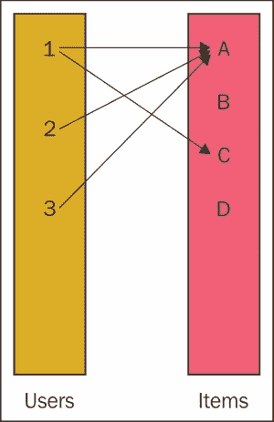

图 07-1。将推荐问题作为二分图进行图形表示。

上述图表是推荐问题的图形表示。左侧的节点代表用户。右侧的节点代表物品。用户**1**推荐物品**A**和**C**，而用户**2**和**3**只推荐单个物品**A**。其余的边缺失。常见的问题是找到其余物品的推荐排名，边也可能附有权重或推荐强度。该图通常是稀疏的。这种图也常被称为二分图，因为边只从一个节点集到另一个节点集（用户不会推荐其他用户）。

对于推荐引擎，我们通常需要两种类型的节点——用户和物品。推荐基于（用户、物品和评分）元组的评分矩阵。推荐算法的一种实现是基于前述矩阵的**奇异值分解**（**SVD**）。最终的评分有四个组成部分：基线，即整个矩阵的平均值，用户平均和物品平均，如下所示：

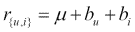

这里，、和可以理解为整个群体的平均值、用户（在所有用户推荐中）和物品（在所有用户中）。最后一部分是两行的笛卡尔积：

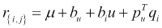

问题被设定为一个最小化问题（参考第四章，*监督学习和无监督学习*）：


在这里，是一个正则化系数，也在第四章中进行了讨论，*监督学习和无监督学习*。因此，每个用户都与一组数字相关联（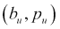，每个项目与，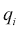相关联。在这个特定的实现中，最优系数是通过梯度下降找到的。这是 SVD 优化的基础。在线性代数中，SVD 将一个任意的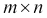矩阵*A*表示为一个正交矩阵*U*、一个对角矩阵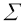和一个单位矩阵*V*的乘积，例如，列是相互正交的。可以说，如果取矩阵中最大的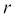个条目，乘积就简化为一个非常高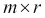矩阵和一个很宽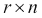矩阵的乘积，其中被称为分解的秩。如果剩余的值很小，新的数字近似于原始数字的关系，*A*。如果*m*和*n*一开始就很大，在实际情况的在线购物中，*m*是商品，可能有数十万，而*n*是用户，可能有数亿，这种节省可能是巨大的。例如，对于*r=10*，*m=100,000*，和*n=100,000,000*，节省如下：


SVD 也可以被视为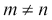矩阵的 PCA。在 Enron 案例中，我们可以将发件人视为用户，收件人视为项目（我们需要重新分配节点 ID），如下所示：

```py
scala> val rgraph = graph.partitionBy(org.apache.spark.graphx.PartitionStrategy.EdgePartition1D, 10).mapEdges(e => 1).groupEdges(_+_).cache
rgraph: org.apache.spark.graphx.Graph[String,Int] = org.apache.spark.graphx.impl.GraphImpl@2c1a48d6

scala> val redges = rgraph.edges.map( e => Edge(-e.srcId, e.dstId, Math.log(e.attr.toDouble)) ).cache
redges: org.apache.spark.rdd.RDD[org.apache.spark.graphx.Edge[Double]] = MapPartitionsRDD[57] at map at <console>:36

scala> import org.apache.spark.graphx.lib.SVDPlusPlus
import org.apache.spark.graphx.lib.SVDPlusPlus

scala> implicit val conf = new SVDPlusPlus.Conf(10, 50, 0.0, 10.0, 0.007, 0.007, 0.005, 0.015)
conf: org.apache.spark.graphx.lib.SVDPlusPlus.Conf = org.apache.spark.graphx.lib.SVDPlusPlus$Conf@15cdc117

scala> val (svd, mu) = SVDPlusPlus.run(redges, conf)
svd: org.apache.spark.graphx.Graph[(Array[Double], Array[Double], Double, Double),Double] = org.apache.spark.graphx.impl.GraphImpl@3050363d
mu: Double = 1.3773578970633769

scala> val svdRanks = svd.vertices.filter(_._1 > 0).map(x => (x._2._3, x._1))
svdRanks: org.apache.spark.rdd.RDD[(Double, org.apache.spark.graphx.VertexId)] = MapPartitionsRDD[1517] at map at <console>:31

scala> val svdRanks = svd.vertices.filter(_._1 > 0).map(x => (x._1, x._2._3))
svdRanks: org.apache.spark.rdd.RDD[(org.apache.spark.graphx.VertexId, Double)] = MapPartitionsRDD[1520] at map at <console>:31

scala> people.join(svdRanks).sortBy(_._2._2, ascending=false).map(x => (x._2._2, x._2._1)).take(10).foreach(println)
(8.864218804309887,jbryson@enron.com)
(5.935146713012661,dl-ga-all_enron_worldwide2@enron.com)
(5.740242927715701,houston.report@enron.com)
(5.441934324464593,a478079f-55e1f3b0-862566fa-612229@enron.com)
(4.910272928389445,pchoi2@enron.com)
(4.701529779800544,dl-ga-all_enron_worldwide1@enron.com)
(4.4046392452058045,eligible.employees@enron.com)
(4.374738019256556,all_ena_egm_eim@enron.com)
(4.303078586979311,dl-ga-all_enron_north_america@enron.com)
(3.8295412053860867,the.mailout@enron.com)

```

`svdRanks`是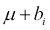预测的用户部分。分布列表具有优先级，因为这通常用于群发电子邮件。要获取特定于用户的部分，我们需要提供用户 ID：

```py
scala> import com.github.fommil.netlib.BLAS.{getInstance => blas}

scala> def topN(uid: Long, num: Int) = {
 |    val usr = svd.vertices.filter(uid == -_._1).collect()(0)._2
 |    val recs = svd.vertices.filter(_._1 > 0).map( v => (v._1, mu + usr._3 + v._2._3 + blas.ddot(usr._2.length, v._2._1, 1, usr._2, 1)))
 |    people.join(recs).sortBy(_._2._2, ascending=false).map(x => (x._2._2, x._2._1)).take(num)
 | }
topN: (uid: Long, num: Int)Array[(Double, String)]

scala> def top5(x: Long) : Array[(Double, String)] = topN(x, 5)
top5: (x: Long)Array[(Double, String)]

scala> people.join(graph.inDegrees).sortBy(_._2._2, ascending=false).map(x => (x._1, x._2._1)).take(10).toList.map(t => (t._2, top5(t._1).toList)).foreach(println)
(richard.shapiro@enron.com,List((4.866184418005094E66,anne.bertino@enron.com), (3.9246829664352734E66,kgustafs@enron.com), (3.9246829664352734E66,gweiss@enron.com), (3.871029763863491E66,hill@enron.com), (3.743135924382312E66,fraser@enron.com)))
(steven.kean@enron.com,List((2.445163626935533E66,anne.bertino@enron.com), (1.9584692804232504E66,hill@enron.com), (1.9105427465629028E66,kgustafs@enron.com), (1.9105427465629028E66,gweiss@enron.com), (1.8931872324048717E66,fraser@enron.com)))
(jeff.dasovich@enron.com,List((2.8924566115596135E66,anne.bertino@enron.com), (2.3157345904446663E66,hill@enron.com), (2.2646318970030287E66,gweiss@enron.com), (2.2646318970030287E66,kgustafs@enron.com), (2.2385865127706285E66,fraser@enron.com)))
(tana.jones@enron.com,List((6.1758464471309754E66,elizabeth.sager@enron.com), (5.279291610047078E66,tana.jones@enron.com), (4.967589820856654E66,tim.belden@enron.com), (4.909283344915057E66,jeff.dasovich@enron.com), (4.869177440115682E66,mark.taylor@enron.com)))
(james.steffes@enron.com,List((5.7702834706832735E66,anne.bertino@enron.com), (4.703038082326939E66,gweiss@enron.com), (4.703038082326939E66,kgustafs@enron.com), (4.579565962089777E66,hill@enron.com), (4.4298763869135494E66,george@enron.com)))
(sara.shackleton@enron.com,List((9.198688613290757E67,louise.kitchen@enron.com), (8.078107057848099E67,john.lavorato@enron.com), (6.922806078209984E67,greg.whalley@enron.com), (6.787266892881456E67,elizabeth.sager@enron.com), (6.420473603137515E67,sally.beck@enron.com)))
(mark.taylor@enron.com,List((1.302856119148208E66,anne.bertino@enron.com), (1.0678968544568682E66,hill@enron.com), (1.031255083546722E66,fraser@enron.com), (1.009319696608474E66,george@enron.com), (9.901391892701356E65,brad@enron.com)))
(mark.guzman@enron.com,List((9.770393472845669E65,anne.bertino@enron.com), (7.97370292724488E65,kgustafs@enron.com), (7.97370292724488E65,gweiss@enron.com), (7.751983820970696E65,hill@enron.com), (7.500175024539423E65,george@enron.com)))
(geir.solberg@enron.com,List((6.856103529420811E65,anne.bertino@enron.com), (5.611272903720188E65,gweiss@enron.com), (5.611272903720188E65,kgustafs@enron.com), (5.436280144720843E65,hill@enron.com), (5.2621103015001885E65,george@enron.com)))
(ryan.slinger@enron.com,List((5.0579114162531735E65,anne.bertino@enron.com), (4.136838933824579E65,kgustafs@enron.com), (4.136838933824579E65,gweiss@enron.com), (4.0110663808847004E65,hill@enron.com), (3.8821438267917902E65,george@enron.com)))

scala> people.join(graph.outDegrees).sortBy(_._2._2, ascending=false).map(x => (x._1, x._2._1)).take(10).toList.map(t => (t._2, top5(t._1).toList)).foreach(println)
(jeff.dasovich@enron.com,List((2.8924566115596135E66,anne.bertino@enron.com), (2.3157345904446663E66,hill@enron.com), (2.2646318970030287E66,gweiss@enron.com), (2.2646318970030287E66,kgustafs@enron.com), (2.2385865127706285E66,fraser@enron.com)))
(veronica.espinoza@enron.com,List((3.135142195254243E65,gweiss@enron.com), (3.135142195254243E65,kgustafs@enron.com), (2.773512892785554E65,anne.bertino@enron.com), (2.350799070225962E65,marcia.a.linton@enron.com), (2.2055288158758267E65,robert@enron.com)))
(pete.davis@enron.com,List((5.773492048248794E66,louise.kitchen@enron.com), (5.067434612038159E66,john.lavorato@enron.com), (4.389028076992449E66,greg.whalley@enron.com), (4.1791711984241975E66,sally.beck@enron.com), (4.009544764149938E66,elizabeth.sager@enron.com)))
(rhonda.denton@enron.com,List((2.834710591578977E68,louise.kitchen@enron.com), (2.488253676819922E68,john.lavorato@enron.com), (2.1516048969715738E68,greg.whalley@enron.com), (2.0405329247770104E68,sally.beck@enron.com), (1.9877213034021861E68,elizabeth.sager@enron.com)))
(cheryl.johnson@enron.com,List((3.453167402163105E64,mary.dix@enron.com), (3.208849221485621E64,theresa.byrne@enron.com), (3.208849221485621E64,sandy.olofson@enron.com), (3.0374270093157086E64,hill@enron.com), (2.886581252384442E64,fraser@enron.com)))
(susan.mara@enron.com,List((5.1729089729525785E66,anne.bertino@enron.com), (4.220843848723133E66,kgustafs@enron.com), (4.220843848723133E66,gweiss@enron.com), (4.1044435240204605E66,hill@enron.com), (3.9709951893268635E66,george@enron.com)))
(jae.black@enron.com,List((2.513139130001457E65,anne.bertino@enron.com), (2.1037756300035247E65,hill@enron.com), (2.0297519350719265E65,fraser@enron.com), (1.9587139280519927E65,george@enron.com), (1.947164483486155E65,brad@enron.com)))
(ginger.dernehl@enron.com,List((4.516267307013845E66,anne.bertino@enron.com), (3.653408921875843E66,gweiss@enron.com), (3.653408921875843E66,kgustafs@enron.com), (3.590298037045689E66,hill@enron.com), (3.471781765250177E66,fraser@enron.com)))
(lorna.brennan@enron.com,List((2.0719309635087482E66,anne.bertino@enron.com), (1.732651408857978E66,kgustafs@enron.com), (1.732651408857978E66,gweiss@enron.com), (1.6348480059915056E66,hill@enron.com), (1.5880693846486309E66,george@enron.com)))
(mary.hain@enron.com,List((5.596589595417286E66,anne.bertino@enron.com), (4.559474243930487E66,kgustafs@enron.com), (4.559474243930487E66,gweiss@enron.com), (4.4421474044331

```

在这里，我们计算了针对度数最高的用户的前五个推荐电子邮件列表。

SVD 在 Scala 中只有 159 行代码，可以成为一些进一步改进的基础。SVD++包括基于隐式用户反馈和项目相似性信息的一部分。最后，Netflix 获奖方案也考虑到了用户偏好随时间变化的事实，但这一部分在 GraphX 中尚未实现。

# 摘要

虽然人们可以轻松地为图问题创建自己的数据结构，但 Scala 对图的支持既来自语义层——对于 Scala 来说，Graph 实际上是一种方便、交互式且表达性强的语言，用于处理图——也来自通过 Spark 和分布式计算的可扩展性。我希望本章中暴露的一些材料将对在 Scala、Spark 和 GraphX 之上实现算法有所帮助。值得一提的是，这些库仍在积极开发中。

在下一章中，我们将从天空中我们的飞行中降级，看看 Scala 与传统的数据分析框架（如统计语言 R 和 Python）的集成，这些框架通常用于数据处理。稍后，在第九章中，我将探讨 Scala 中的 NLP 工具，这些工具广泛利用复杂的数据结构。
