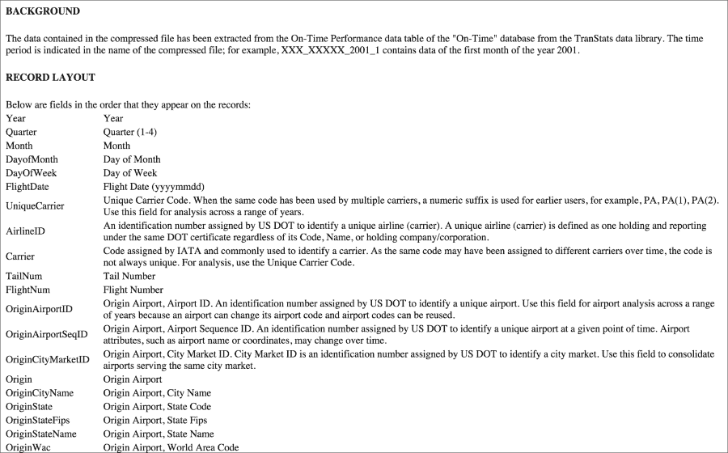

# 第八章。将 Scala 与 R 和 Python 集成

虽然 Spark 提供了 MLlib 作为机器学习库，但在许多实际情况下，R 或 Python 提供了更熟悉且经过时间考验的统计计算接口。特别是，R 的广泛统计库包括非常流行的 ANOVA/MANOVA 方法，用于分析方差和变量依赖/独立性，一系列统计测试，以及目前尚未出现在 MLlib 中的随机数生成器。从 R 到 Spark 的接口可在 SparkR 项目下获得。最后，数据分析师知道 Python 的 NumPy 和 SciPy 线性代数实现，因为它们的效率以及其他时间序列、优化和信号处理包。通过 R/Python 集成，所有这些熟悉的功能都可以暴露给 Scala/Spark 用户，直到 Spark/MLlib 接口稳定，并且库进入新框架，同时让用户受益于 Spark 在多台机器上以分布式方式执行工作流的能力。

当人们在 R 或 Python 中编程，或者使用任何此类统计或线性代数包时，他们通常不会特别关注函数式编程方面。正如我在第一章中提到的，*探索性数据分析*，Scala 应该被视为一种高级语言，这正是它发光的地方。与高度高效的 C 和 Fortran 实现集成，例如，免费可用的 **基本线性代数子程序** （**BLAS**），**线性代数** **包** （**LAPACK**），和 **Arnoldi 包** （**ARPACK**），已知其方式进入 Java 和 Scala ([`www.netlib.org`](http://www.netlib.org)，[`github.com/fommil/netlib-java`](https://github.com/fommil/netlib-java))。我希望 Scala 能够专注于它做得最好的事情。然而，在本章中，我将重点介绍如何使用这些语言与 Scala/Spark 一起使用。

我将使用公开可用的美国交通部航班数据集来完成本章 ([`www.transtats.bts.gov`](http://www.transtats.bts.gov))。

在本章中，我们将涵盖以下主题：

+   如果您还没有安装，请安装 R 和配置 SparkR

+   了解 R（和 Spark）DataFrame

+   使用 R 进行线性回归和方差分析

+   使用 SparkR 进行 **广义线性模型** （**GLM**）建模

+   如果您还没有安装，请安装 Python

+   学习如何使用 PySpark 并从 Scala 调用 Python

# 与 R 集成

与许多高级且精心设计的科技一样，人们对 R 语言通常要么爱得要命，要么恨之入骨。其中一个原因在于，R 是最早尝试操作复杂对象的编程语言实现之一，尽管其中大多数最终只是列表，而不是像更成熟的现代实现中的 struct 或 map。R 最初由 Ross Ihaka 和 Robert Gentleman 在 1993 年左右在奥克兰大学创建，其根源可以追溯到 1976 年左右在贝尔实验室开发的 S 语言，当时大多数商业编程仍在 Fortran 中进行。虽然 R 包含了一些功能特性，如将函数作为参数传递和 map/apply，但它明显缺少一些其他特性，如惰性评估和列表推导。尽管如此，R 有一个非常好的帮助系统，如果有人说他们从未需要回到 `help(…)` 命令来了解如何更好地运行某个数据转换或模型，那么他们要么在撒谎，要么是刚开始使用 R。

## 设置 R 和 SparkR

要运行 SparkR，您需要 R 版本 3.0 或更高版本。根据您的操作系统，遵循给定的安装说明。

### Linux

在 Linux 系统上，详细的安装文档可在 [`cran.r-project.org/bin/linux`](https://cran.r-project.org/bin/linux) 找到。然而，例如，在 Debian 系统上，可以通过运行以下命令来安装它：

```py
# apt-get update
...
# apt-get install r-base r-base-dev
...

```

要列出 Linux 仓库站点上已安装/可用的软件包，请执行以下命令：

```py
# apt-cache search "^r-.*" | sort
...

```

R 软件包，作为 `r-base` 和 `r-recommended` 的一部分，被安装到 `/usr/lib/R/library` 目录。这些可以通过常用的软件包维护工具如 `apt-get` 或 aptitude 进行更新。其他作为预编译的 Debian 软件包提供的 R 软件包，如 `r-cran-*` 和 `r-bioc-*`，被安装到 `/usr/lib/R/site-library`。以下命令显示了所有依赖于 `r-base-core` 的软件包：

```py
# apt-cache rdepends r-base-core

```

这包括来自 CRAN 和其他仓库的大量贡献软件包。如果您想安装未作为软件包提供的 R 软件包，或者如果您想使用较新版本，则需要从源代码构建它们，这需要安装 `r-base-dev` 开发软件包，可以通过以下命令安装：

```py
# apt-get install r-base-dev

```

这将引入编译 R 软件包的基本需求，例如开发工具组的安装。然后，本地用户/管理员可以从 CRAN 源软件包安装 R 软件包，通常在 R 内部使用 `R> install.packages()` 函数或 `R CMD INSTALL`。例如，要安装 R 的 `ggplot2` 软件包，请运行以下命令：

```py
> install.packages("ggplot2")
--- Please select a CRAN mirror for use in this session ---
also installing the dependencies 'stringi', 'magrittr', 'colorspace', 'Rcpp', 'stringr', 'RColorBrewer', 'dichromat', 'munsell', 'labeling', 'digest', 'gtable', 'plyr', 'reshape2', 'scales'

```

这将从可用的站点之一下载并可选地编译软件包及其依赖项。有时 R 会混淆仓库；在这种情况下，我建议在主目录中创建一个 `~/.Rprofile` 文件，指向最近的 CRAN 仓库：

```py
$ cat >> ~/.Rprofile << EOF
r = getOption("repos") # hard code the Berkeley repo for CRAN
r["CRAN"] = "http://cran.cnr.berkeley.edu"
options(repos = r)
rm(r)

EOF

```

`~/.Rprofile` 包含用于自定义会话的命令。我推荐放入那里的一个命令是 `options (prompt="R> ")`，以便能够通过提示符区分您正在使用的 shell，遵循本书中大多数工具的传统。已知镜像列表可在 [`cran.r-project.org/mirrors.html`](https://cran.r-project.org/mirrors.html) 查找。

此外，指定安装 `system/site/user` 软件包的目录也是一个好的做法，除非您的操作系统设置已经通过将以下命令放入 `~/.bashrc` 或系统 `/etc/profile` 来完成：

```py
$ export R_LIBS_SITE=${R_LIBS_SITE:-/usr/local/lib/R/site-library:/usr/lib/R/site-library:/usr/lib/R/library}
$ export R_LIBS_USER=${R_LIBS_USER:-$HOME/R/$(uname -i)-library/$( R --version | grep -o -E [0-9]+\.[
0-9]+ | head -1)}

```

### Mac OS

R for Mac OS 可以从 [`cran.r-project.org/bin/macosx`](http://cran.r-project.org/bin/macosx) 下载。写作时的最新版本是 3.2.3。始终检查下载的软件包的一致性。为此，请运行以下命令：

```py
$ pkgutil --check-signature R-3.2.3.pkg
Package "R-3.2.3.pkg":
 Status: signed by a certificate trusted by Mac OS X
 Certificate Chain:
 1\. Developer ID Installer: Simon Urbanek
 SHA1 fingerprint: B7 EB 39 5E 03 CF 1E 20 D1 A6 2E 9F D3 17 90 26 D8 D6 3B EF
 -----------------------------------------------------------------------------
 2\. Developer ID Certification Authority
 SHA1 fingerprint: 3B 16 6C 3B 7D C4 B7 51 C9 FE 2A FA B9 13 56 41 E3 88 E1 86
 -----------------------------------------------------------------------------
 3\. Apple Root CA
 SHA1 fingerprint: 61 1E 5B 66 2C 59 3A 08 FF 58 D1 4A E2 24 52 D1 98 DF 6C 60

```

前一小节中描述的环境设置也适用于 Mac OS 设置。

### Windows

R for Windows 可以从 [`cran.r-project.org/bin/windows/`](https://cran.r-project.org/bin/windows/) 下载为 exe 安装程序。以管理员身份运行此可执行文件来安装 R。

可以通过遵循 Windows 菜单中的 **控制面板** | **系统和安全** | **系统** | **高级系统设置** | **环境变量** 路径来编辑 **系统/用户** 的环境设置。

### 通过脚本运行 SparkR

要运行 SparkR，需要运行 Spark git 树中包含的 `R/install-dev.sh` 脚本。实际上，只需要 shell 脚本和 `R/pkg` 目录的内容，这些内容并不总是包含在编译好的 Spark 发行版中：

```py
$ git clone https://github.com/apache/spark.git
Cloning into 'spark'...
remote: Counting objects: 301864, done.
...
$ cp –r R/{install-dev.sh,pkg) $SPARK_HOME/R
...
$ cd $SPARK_HOME
$ ./R/install-dev.sh
* installing *source* package 'SparkR' ...
** R
** inst
** preparing package for lazy loading
Creating a new generic function for 'colnames' in package 'SparkR'
...
$ bin/sparkR

R version 3.2.3 (2015-12-10) -- "Wooden Christmas-Tree"
Copyright (C) 2015 The R Foundation for Statistical Computing
Platform: x86_64-redhat-linux-gnu (64-bit)

R is free software and comes with ABSOLUTELY NO WARRANTY.
You are welcome to redistribute it under certain conditions.
Type 'license()' or 'licence()' for distribution details.

 Natural language support but running in an English locale

R is a collaborative project with many contributors.
Type 'contributors()' for more information and
'citation()' on how to cite R or R packages in publications.

Type 'demo()' for some demos, 'help()' for on-line help, or
'help.start()' for an HTML browser interface to help.
Type 'q()' to quit R.

Launching java with spark-submit command /home/alex/spark-1.6.1-bin-hadoop2.6/bin/spark-submit   "sparkr-shell" /tmp/RtmpgdTfmU/backend_port22446d0391e8 

 Welcome to
 ____              __ 
 / __/__  ___ _____/ /__ 
 _\ \/ _ \/ _ `/ __/  '_/ 
 /___/ .__/\_,_/_/ /_/\_\   version  1.6.1 
 /_/ 

 Spark context is available as sc, SQL context is available as sqlContext>

```

### 通过 R 的命令行运行 Spark

或者，我们也可以直接从 R 命令行（或从 RStudio [`rstudio.org/`](http://rstudio.org/)）使用以下命令初始化 Spark：

```py
R> library(SparkR, lib.loc = c(file.path(Sys.getenv("SPARK_HOME"), "R", "lib")))
...
R> sc <- sparkR.init(master = Sys.getenv("SPARK_MASTER"), sparkEnvir = list(spark.driver.memory="1g"))
...
R> sqlContext <- sparkRSQL.init(sc)

```

如前所述，在 第三章 中，*使用 Spark 和 MLlib*，`SPARK_HOME` 环境变量需要指向您的本地 Spark 安装目录，`SPARK_MASTER` 和 `YARN_CONF_DIR` 指向所需的集群管理器（本地、独立、Mesos 和 YARN）以及 YARN 配置目录，如果使用 Spark 与 YARN 集群管理器一起使用的话。

虽然大多数发行版都附带了一个用户界面，但根据本书的传统和本章的目的，我将使用命令行。

## DataFrames

DataFrames 最初来自 R 和 Python，因此在 SparkR 中看到它们是自然的。

### 注意

请注意，SparkR 中 DataFrames 的实现是在 RDDs 之上，因此它们的工作方式与 R DataFrames 不同。

最近，关于何时何地存储和应用模式以及其他元数据（如类型）的问题一直是活跃讨论的主题。一方面，在数据早期提供模式可以实现对数据的彻底验证和潜在的优化。另一方面，对于原始数据摄取来说可能过于限制，其目标只是尽可能多地捕获数据，并在之后进行数据格式化/清洗，这种方法通常被称为“读取时模式”。后者最近在处理如 Avro 等演变模式的工具和自动模式发现工具的支持下赢得了更多支持，但为了本章的目的，我将假设我们已经完成了模式发现部分，并可以开始使用 DataFrames。

让我们先从美国运输部下载并提取一个航班延误数据集，如下所示：

```py
$ wget http://www.transtats.bts.gov/Download/On_Time_On_Time_Performance_2015_7.zip
--2016-01-23 15:40:02--  http://www.transtats.bts.gov/Download/On_Time_On_Time_Performance_2015_7.zip
Resolving www.transtats.bts.gov... 204.68.194.70
Connecting to www.transtats.bts.gov|204.68.194.70|:80... connected.
HTTP request sent, awaiting response... 200 OK
Length: 26204213 (25M) [application/x-zip-compressed]
Saving to: "On_Time_On_Time_Performance_2015_7.zip"

100%[====================================================================================================================================================================================>] 26,204,213   966K/s   in 27s 

2016-01-23 15:40:29 (956 KB/s) - "On_Time_On_Time_Performance_2015_7.zip" saved [26204213/26204213]

$ unzip -d flights On_Time_On_Time_Performance_2015_7.zip
Archive:  On_Time_On_Time_Performance_2015_7.zip
 inflating: flights/On_Time_On_Time_Performance_2015_7.csv 
 inflating: flights/readme.html

```

如果你在一个集群上运行 Spark，你想要将文件复制到 HDFS：

```py
$ hadoop fs –put flights .

```

`flights/readme.html`文件提供了详细的元数据信息，如下面的图像所示：



图 08-1：美国运输部发布的准时性能数据集提供的元数据（仅用于演示目的）

现在，我想让你分析`SFO`返回航班的延误，并可能找出导致延误的因素。让我们从 R 的`data.frame`开始：

```py
$ bin/sparkR --master local[8]

R version 3.2.3 (2015-12-10) -- "Wooden Christmas-Tree"
Copyright (C) 2015 The R Foundation for Statistical Computing
Platform: x86_64-apple-darwin13.4.0 (64-bit)

R is free software and comes with ABSOLUTELY NO WARRANTY.
You are welcome to redistribute it under certain conditions.
Type 'license()' or 'licence()' for distribution details.

 Natural language support but running in an English locale

R is a collaborative project with many contributors.
Type 'contributors()' for more information and
'citation()' on how to cite R or R packages in publications.

Type 'demo()' for some demos, 'help()' for on-line help, or
'help.start()' for an HTML browser interface to help.
Type 'q()' to quit R.

[Previously saved workspace restored]

Launching java with spark-submit command /Users/akozlov/spark-1.6.1-bin-hadoop2.6/bin/spark-submit   "--master" "local[8]" "sparkr-shell" /var/folders/p1/y7ygx_4507q34vhd60q115p80000gn/T//RtmpD42eTz/backend_port682e58e2c5db 

 Welcome to
 ____              __ 
 / __/__  ___ _____/ /__ 
 _\ \/ _ \/ _ `/ __/  '_/ 
 /___/ .__/\_,_/_/ /_/\_\   version  1.6.1 
 /_/ 

 Spark context is available as sc, SQL context is available as sqlContext
> flights <- read.table(unz("On_Time_On_Time_Performance_2015_7.zip", "On_Time_On_Time_Performance_2015_7.csv"), nrows=1000000, header=T, quote="\"", sep=",")
> sfoFlights <- flights[flights$Dest == "SFO", ]
> attach(sfoFlights)
> delays <- aggregate(ArrDelayMinutes ~ DayOfWeek + Origin + UniqueCarrier, FUN=mean, na.rm=TRUE)
> tail(delays[order(delays$ArrDelayMinutes), ])
 DayOfWeek Origin UniqueCarrier ArrDelayMinutes
220         4    ABQ            OO           67.60
489         4    TUS            OO           71.80
186         5    IAH            F9           77.60
696         3    RNO            UA           79.50
491         6    TUS            OO          168.25
84          7    SLC            AS          203.25

```

如果你是在 2015 年 7 月的星期日乘坐阿拉斯加航空从盐湖城起飞，那么你觉得自己很不幸（我们到目前为止只进行了简单的分析，因此不应该过分重视这个结果）。可能还有其他多个随机因素导致了延误。

尽管我们在 SparkR 中运行了示例，但我们仍然使用了 R 的`data.frame`。如果我们想要分析跨多个月份的数据，我们需要在多个节点上分配负载。这就是 SparkR 分布式 DataFrame 发挥作用的地方，因为它甚至可以在单个节点上跨多个线程进行分布。有一个直接的方法可以将 R DataFrame 转换为 SparkR DataFrame（以及 RDD）：

```py
> sparkDf <- createDataFrame(sqlContext, flights)

```

如果我在笔记本电脑上运行它，我会耗尽内存。由于我需要在多个线程/节点之间传输数据，开销很大，我们希望尽快过滤它：

```py
sparkDf <- createDataFrame(sqlContext, subset(flights, select = c("ArrDelayMinutes", "DayOfWeek", "Origin", "Dest", "UniqueCarrier")))

```

这甚至可以在我的笔记本电脑上运行。当然，从 Spark 的 DataFrame 到 R 的`data.frame`有一个反向转换：

```py
> rDf <- as.data.frame(sparkDf)

```

或者，我可以使用`spark-csv`包从`.csv`文件中读取它，如果原始`.csv`文件位于 HDFS 等分布式文件系统上，这将避免在集群设置中通过网络在集群中重新洗牌数据。但至少目前，Spark 不能直接从`.zip`文件中读取：

```py
> $ ./bin/sparkR --packages com.databricks:spark-csv_2.10:1.3.0 --master local[8]

R version 3.2.3 (2015-12-10) -- "Wooden Christmas-Tree"
Copyright (C) 2015 The R Foundation for Statistical Computing
Platform: x86_64-redhat-linux-gnu (64-bit)

R is free software and comes with ABSOLUTELY NO WARRANTY.
You are welcome to redistribute it under certain conditions.
Type 'license()' or 'licence()' for distribution details.

 Natural language support but running in an English locale

R is a collaborative project with many contributors.
Type 'contributors()' for more information and
'citation()' on how to cite R or R packages in publications.

Type 'demo()' for some demos, 'help()' for on-line help, or
'help.start()' for an HTML browser interface to help.
Type 'q()' to quit R.

Warning: namespace 'SparkR' is not available and has been replaced
by .GlobalEnv when processing object 'sparkDf'
[Previously saved workspace restored]

Launching java with spark-submit command /home/alex/spark-1.6.1-bin-hadoop2.6/bin/spark-submit   "--master" "local[8]" "--packages" "com.databricks:spark-csv_2.10:1.3.0" "sparkr-shell" /tmp/RtmpfhcUXX/backend_port1b066bea5a03 
Ivy Default Cache set to: /home/alex/.ivy2/cache
The jars for the packages stored in: /home/alex/.ivy2/jars
:: loading settings :: url = jar:file:/home/alex/spark-1.6.1-bin-hadoop2.6/lib/spark-assembly-1.6.1-hadoop2.6.0.jar!/org/apache/ivy/core/settings/ivysettings.xml
com.databricks#spark-csv_2.10 added as a dependency
:: resolving dependencies :: org.apache.spark#spark-submit-parent;1.0
 confs: [default]
 found com.databricks#spark-csv_2.10;1.3.0 in central
 found org.apache.commons#commons-csv;1.1 in central
 found com.univocity#univocity-parsers;1.5.1 in central
:: resolution report :: resolve 189ms :: artifacts dl 4ms
 :: modules in use:
 com.databricks#spark-csv_2.10;1.3.0 from central in [default]
 com.univocity#univocity-parsers;1.5.1 from central in [default]
 org.apache.commons#commons-csv;1.1 from central in [default]
 ---------------------------------------------------------------------
 |                  |            modules            ||   artifacts   |
 |       conf       | number| search|dwnlded|evicted|| number|dwnlded|
 ---------------------------------------------------------------------
 |      default     |   3   |   0   |   0   |   0   ||   3   |   0   |
 ---------------------------------------------------------------------
:: retrieving :: org.apache.spark#spark-submit-parent
 confs: [default]
 0 artifacts copied, 3 already retrieved (0kB/7ms)

 Welcome to
 ____              __ 
 / __/__  ___ _____/ /__ 
 _\ \/ _ \/ _ `/ __/  '_/ 
 /___/ .__/\_,_/_/ /_/\_\   version  1.6.1 
 /_/ 

 Spark context is available as sc, SQL context is available as sqlContext
> sparkDf <- read.df(sqlContext, "./flights", "com.databricks.spark.csv", header="true", inferSchema = "false")
> sfoFlights <- select(filter(sparkDf, sparkDf$Dest == "SFO"), "DayOfWeek", "Origin", "UniqueCarrier", "ArrDelayMinutes")
> aggs <- agg(group_by(sfoFlights, "DayOfWeek", "Origin", "UniqueCarrier"), count(sparkDf$ArrDelayMinutes), avg(sparkDf$ArrDelayMinutes))
> head(arrange(aggs, c('avg(ArrDelayMinutes)'), decreasing = TRUE), 10)
 DayOfWeek Origin UniqueCarrier count(ArrDelayMinutes) avg(ArrDelayMinutes) 
1          7    SLC            AS                      4               203.25
2          6    TUS            OO                      4               168.25
3          3    RNO            UA                      8                79.50
4          5    IAH            F9                      5                77.60
5          4    TUS            OO                      5                71.80
6          4    ABQ            OO                      5                67.60
7          2    ABQ            OO                      4                66.25
8          1    IAH            F9                      4                61.25
9          4    DAL            WN                      5                59.20
10         3    SUN            OO                      5                59.00

```

注意，我们通过在命令行上提供`--package`标志来加载了额外的`com.databricks:spark-csv_2.10:1.3.0`包；我们可以通过在节点集群上使用 Spark 实例轻松地实现分布式，甚至可以分析更大的数据集：

```py
$ for i in $(seq 1 6); do wget http://www.transtats.bts.gov/Download/On_Time_On_Time_Performance_2015_$i.zip; unzip -d flights On_Time_On_Time_Performance_2015_$i.zip; hadoop fs -put -f flights/On_Time_On_Time_Performance_2015_$i.csv flights; done

$ hadoop fs -ls flights
Found 7 items
-rw-r--r--   3 alex eng  211633432 2016-02-16 03:28 flights/On_Time_On_Time_Performance_2015_1.csv
-rw-r--r--   3 alex eng  192791767 2016-02-16 03:28 flights/On_Time_On_Time_Performance_2015_2.csv
-rw-r--r--   3 alex eng  227016932 2016-02-16 03:28 flights/On_Time_On_Time_Performance_2015_3.csv
-rw-r--r--   3 alex eng  218600030 2016-02-16 03:28 flights/On_Time_On_Time_Performance_2015_4.csv
-rw-r--r--   3 alex eng  224003544 2016-02-16 03:29 flights/On_Time_On_Time_Performance_2015_5.csv
-rw-r--r--   3 alex eng  227418780 2016-02-16 03:29 flights/On_Time_On_Time_Performance_2015_6.csv
-rw-r--r--   3 alex eng  235037955 2016-02-15 21:56 flights/On_Time_On_Time_Performance_2015_7.csv

```

这将下载并将准点性能数据放在航班的目录中（记住，正如我们在第一章中讨论的，*探索性数据分析*，我们希望将目录视为大数据数据集）。现在我们可以对 2015 年整个期间的相同分析进行操作（对于可用的数据）：

```py
> sparkDf <- read.df(sqlContext, "./flights", "com.databricks.spark.csv", header="true")
> sfoFlights <- select(filter(sparkDf, sparkDf$Dest == "SFO"), "DayOfWeek", "Origin", "UniqueCarrier", "ArrDelayMinutes")
> aggs <- cache(agg(group_by(sfoFlights, "DayOfWeek", "Origin", "UniqueCarrier"), count(sparkDf$ArrDelayMinutes), avg(sparkDf$ArrDelayMinutes)))
> head(arrange(aggs, c('avg(ArrDelayMinutes)'), decreasing = TRUE), 10)
 DayOfWeek Origin UniqueCarrier count(ArrDelayMinutes) avg(ArrDelayMinutes) 
1          6    MSP            UA                      1            122.00000
2          3    RNO            UA                      8             79.50000
3          1    MSP            UA                     13             68.53846
4          7    SAT            UA                      1             65.00000
5          7    STL            UA                      9             64.55556
6          1    ORD            F9                     13             55.92308
7          1    MSO            OO                      4             50.00000
8          2    MSO            OO                      4             48.50000
9          5    CEC            OO                     28             45.86957
10         3    STL            UA                     13             43.46154

```

注意，我们使用了`cache()`调用将数据集固定在内存中，因为我们稍后会再次使用它。这次是周六的明尼阿波利斯/联合！然而，你可能已经知道原因：对于这种`DayOfWeek`、`Origin`和`UniqueCarrier`组合，只有一个记录；这很可能是异常值。关于前一个异常值的平均大约`30`个航班现在减少到`30`分钟：

```py
> head(arrange(filter(filter(aggs, aggs$Origin == "SLC"), aggs$UniqueCarrier == "AS"), c('avg(ArrDelayMinutes)'), decreasing = TRUE), 100)
 DayOfWeek Origin UniqueCarrier count(ArrDelayMinutes) avg(ArrDelayMinutes)
1         7    SLC            AS                     30            32.600000
2         2    SLC            AS                     30            10.200000
3         4    SLC            AS                     31             9.774194
4         1    SLC            AS                     30             9.433333
5         3    SLC            AS                     30             5.866667
6         5    SLC            AS                     31             5.516129
7         6    SLC            AS                     30             2.133333

```

周日仍然是延误问题。我们现在可以分析的数据量的限制现在只是笔记本电脑上的核心数和集群中的节点数。现在让我们看看更复杂的机器学习模型。

## 线性模型

线性方法在统计建模中扮演着重要的角色。正如其名所示，线性模型假设因变量是独立变量的加权组合。在 R 中，`lm`函数执行线性回归并报告系数，如下所示：

```py
R> attach(iris)
R> lm(Sepal.Length ~ Sepal.Width)

Call:
lm(formula = Sepal.Length ~ Sepal.Width)

Coefficients:
(Intercept)  Sepal.Width
 6.5262      -0.2234

```

`summary`函数提供了更多信息：

```py
R> model <- lm(Sepal.Length ~ Sepal.Width + Petal.Length + Petal.Width)
R> summary(model)

Call:
lm(formula = Sepal.Length ~ Sepal.Width + Petal.Length + Petal.Width)

Residuals:
 Min       1Q   Median       3Q      Max 
-0.82816 -0.21989  0.01875  0.19709  0.84570 

Coefficients:
 Estimate Std. Error t value Pr(>|t|) 
(Intercept)   1.85600    0.25078   7.401 9.85e-12 ***
Sepal.Width   0.65084    0.06665   9.765  < 2e-16 ***
Petal.Length  0.70913    0.05672  12.502  < 2e-16 ***
Petal.Width  -0.55648    0.12755  -4.363 2.41e-05 ***
---
Signif. codes:  0 '***' 0.001 '**' 0.01 '*' 0.05 '.' 0.1 ' ' 1

Residual standard error: 0.3145 on 146 degrees of freedom
Multiple R-squared:  0.8586,  Adjusted R-squared:  0.8557 
F-statistic: 295.5 on 3 and 146 DF,  p-value: < 2.2e-16

```

虽然我们在第三章中考虑了广义线性模型，*使用 Spark 和 MLlib*，我们也将很快考虑 R 和 SparkR 中的`glm`实现，但线性模型通常提供更多信息，并且是处理噪声数据和选择相关属性进行进一步分析的优秀工具。

### 注意

**数据分析生命周期**

虽然大多数统计书籍都侧重于分析和最佳使用现有数据，但统计分析的一般结果也应该影响对新信息来源的搜索。在完整的第三章中讨论的数据生命周期结束时，*使用 Spark 和 MLlib*，数据科学家应始终将最新的变量重要性结果转化为如何收集数据的理论。例如，如果家用打印机的墨水使用分析表明照片墨水使用量增加，那么可以收集更多关于图片格式、数字图像来源以及用户偏好的纸张类型的信息。这种方法在实际商业环境中证明非常有效，尽管并非完全自动化。

具体来说，以下是线性模型提供的输出简要描述：

+   **残差**：这些是实际值与预测值之间差异的统计数据。存在许多技术可以检测残差分布模式中的模型问题，但这超出了本书的范围。可以使用`resid(model)`函数获得详细的残差表。

+   **系数**: 这些是实际的线性组合系数；t 值表示系数值与标准误差估计的比率：高值意味着这个系数对因变量的非平凡影响的可能性更高。系数也可以通过`coef(model)`函数获得。

+   **残差标准误差**: 这报告了标准均方误差，这是简单线性回归中优化的目标。

+   **多重 R 平方**: 这表示模型解释的因变量方差的比例。调整后的值考虑了模型中的参数数量，被认为是避免过拟合的更好指标，尤其是在观测数量不足以证明模型复杂性的情况下，即使在大数据问题中也是如此。

+   **F 统计量**: 模型质量的衡量标准。简单来说，它衡量模型中所有参数解释因变量的程度。p 值提供了模型仅因随机机会解释因变量的概率。一般来说，低于 0.05（或 5%）的值被认为是令人满意的。虽然一般来说，高值可能意味着模型可能没有统计上的有效性，“其他因素都不重要”，低 F 统计量并不总是意味着模型在实际中会表现良好，因此不能直接作为模型接受标准。

在应用线性模型之后，通常还会应用更复杂的`glm`或递归模型，如决策树和`rpart`函数，以寻找有趣的变量交互。线性模型适用于为其他可以改进的模型建立基线。

最后，如果自变量是离散的，方差分析（ANOVA）是研究方差的标准技术：

```py
R> aov <- aov(Sepal.Length ~ Species)
R> summary(aov)
 Df Sum Sq Mean Sq F value Pr(>F) 
Species       2  63.21  31.606   119.3 <2e-16 ***
Residuals   147  38.96   0.265 
---
Signif. codes:  0 '***' 0.001 '**' 0.01 '*' 0.05 '.' 0.1 ' ' 1

```

模型质量的衡量标准是 F 统计量。虽然可以使用`Rscript`的管道机制通过 RDD 运行 R 算法，但我将在稍后部分部分介绍与**Java 规范请求**（**JSR**）223 Python 集成相关的功能。在本节中，我想特别探讨在 R 和 SparkR 中本地实现的广义线性回归`glm`函数。

## 广义线性模型

再次强调，你可以运行 R `glm`或 SparkR `glm`。以下表格提供了 R 实现可能的链接和优化函数列表：

下面的列表显示了 R `glm`实现的可能选项：

| Family | Variance | Link |
| --- | --- | --- |
| gaussian | gaussian | identity |
| binomial | binomial | logit, probit 或 cloglog |
| poisson | poisson | log, identity 或 sqrt |
| Gamma | Gamma | inverse, identity 或 log |
| inverse.gaussian | inverse.gaussian | 1/mu² |
| quasi | 用户定义 | 用户定义 |

我将使用二进制目标 `ArrDel15`，表示飞机是否晚于 15 分钟到达。自变量将是 `DepDel15`、`DayOfWeek`、`Month`、`UniqueCarrier`、`Origin` 和 `Dest`：

```py
R> flights <- read.table(unz("On_Time_On_Time_Performance_2015_7.zip", "On_Time_On_Time_Performance_2015_7.csv"), nrows=1000000, header=T, quote="\"", sep=",")
R> flights$DoW_ <- factor(flights$DayOfWeek,levels=c(1,2,3,4,5,6,7), labels=c("Mon","Tue","Wed","Thu","Fri","Sat","Sun"))
R> attach(flights)
R> system.time(model <- glm(ArrDel15 ~ UniqueCarrier + DoW_ + Origin + Dest, flights, family="binomial"))

```

当你等待结果时，打开另一个 shell 并在 `SparkR` 模式下对完整七个月的数据运行 `glm`：

```py
sparkR> cache(sparkDf <- read.df(sqlContext, "./flights", "com.databricks.spark.csv", header="true", inferSchema="true"))
DataFrame[Year:int, Quarter:int, Month:int, DayofMonth:int, DayOfWeek:int, FlightDate:string, UniqueCarrier:string, AirlineID:int, Carrier:string, TailNum:string, FlightNum:int, OriginAirportID:int, OriginAirportSeqID:int, OriginCityMarketID:int, Origin:string, OriginCityName:string, OriginState:string, OriginStateFips:int, OriginStateName:string, OriginWac:int, DestAirportID:int, DestAirportSeqID:int, DestCityMarketID:int, Dest:string, DestCityName:string, DestState:string, DestStateFips:int, DestStateName:string, DestWac:int, CRSDepTime:int, DepTime:int, DepDelay:double, DepDelayMinutes:double, DepDel15:double, DepartureDelayGroups:int, DepTimeBlk:string, TaxiOut:double, WheelsOff:int, WheelsOn:int, TaxiIn:double, CRSArrTime:int, ArrTime:int, ArrDelay:double, ArrDelayMinutes:double, ArrDel15:double, ArrivalDelayGroups:int, ArrTimeBlk:string, Cancelled:double, CancellationCode:string, Diverted:double, CRSElapsedTime:double, ActualElapsedTime:double, AirTime:double, Flights:double, Distance:double, DistanceGroup:int, CarrierDelay:double, WeatherDelay:double, NASDelay:double, SecurityDelay:double, LateAircraftDelay:double, FirstDepTime:int, TotalAddGTime:double, LongestAddGTime:double, DivAirportLandings:int, DivReachedDest:double, DivActualElapsedTime:double, DivArrDelay:double, DivDistance:double, Div1Airport:string, Div1AirportID:int, Div1AirportSeqID:int, Div1WheelsOn:int, Div1TotalGTime:double, Div1LongestGTime:double, Div1WheelsOff:int, Div1TailNum:string, Div2Airport:string, Div2AirportID:int, Div2AirportSeqID:int, Div2WheelsOn:int, Div2TotalGTime:double, Div2LongestGTime:double, Div2WheelsOff:string, Div2TailNum:string, Div3Airport:string, Div3AirportID:string, Div3AirportSeqID:string, Div3WheelsOn:string, Div3TotalGTime:string, Div3LongestGTime:string, Div3WheelsOff:string, Div3TailNum:string, Div4Airport:string, Div4AirportID:string, Div4AirportSeqID:string, Div4WheelsOn:string, Div4TotalGTime:string, Div4LongestGTime:string, Div4WheelsOff:string, Div4TailNum:string, Div5Airport:string, Div5AirportID:string, Div5AirportSeqID:string, Div5WheelsOn:string, Div5TotalGTime:string, Div5LongestGTime:string, Div5WheelsOff:string, Div5TailNum:string, :string]
sparkR> noNulls <- cache(dropna(selectExpr(filter(sparkDf, sparkDf$Cancelled == 0), "ArrDel15", "UniqueCarrier", "format_string('%d', DayOfWeek) as DayOfWeek", "Origin", "Dest"), "any"))
sparkR> sparkModel = glm(ArrDel15 ~ UniqueCarrier + DayOfWeek + Origin + Dest, noNulls, family="binomial")

```

我们尝试构建一个模型，解释延误作为承运人、星期几和出发机场到目的机场的影响，这由公式构造 `ArrDel15 ~ UniqueCarrier + DayOfWeek + Origin + Dest` 捕获。

### 注意

**空值、大数据和 Scala**

注意，在 SparkR 的 `glm` 情况中，我必须明确过滤掉未取消的航班并移除 NA 或者在 C/Java 术语中的空值。虽然 R 默认会为你做这件事，但大数据中的 NA 非常常见，因为数据集通常是稀疏的，不应轻视。我们必须在 MLlib 中显式处理空值的事实提醒我们数据集中的一些附加信息，这绝对是一个受欢迎的功能。NA 的存在可以携带有关数据收集方式的信息。理想情况下，每个 NA 都应该有一个小的 `get_na_info` 方法来说明为什么这个特定的值不可用或未收集，这使我们想到了 Scala 中的 `Either` 类型。

即使空值是从 Java 继承并成为 Scala 的一部分，但 `Option` 和 `Either` 类型是新的、更健壮的机制，用于处理传统上使用空值时的特殊情况。具体来说，`Either` 可以提供一个值或异常信息，说明为什么没有进行计算；而 `Option` 可以提供一个值或为 `None`，这可以很容易地被 Scala 的模式匹配框架捕获。

你会注意到 SparkR 会运行多个线程，甚至在单个节点上，它也会从多个核心消耗 CPU 时间，并且即使数据量较大，返回速度也很快。在我的 32 核机器实验中，它能在不到一分钟内完成（相比之下，R 的 `glm` 需要 35 分钟）。为了得到结果，就像 R 模型的情况一样，我们需要运行 `summary()` 方法：

```py
> summary(sparkModel)
$coefficients
 Estimate
(Intercept)      -1.518542340
UniqueCarrier_WN  0.382722232
UniqueCarrier_DL -0.047997652
UniqueCarrier_OO  0.367031995
UniqueCarrier_AA  0.046737727
UniqueCarrier_EV  0.344539788
UniqueCarrier_UA  0.299290120
UniqueCarrier_US  0.069837542
UniqueCarrier_MQ  0.467597761
UniqueCarrier_B6  0.326240578
UniqueCarrier_AS -0.210762769
UniqueCarrier_NK  0.841185903
UniqueCarrier_F9  0.788720078
UniqueCarrier_HA -0.094638586
DayOfWeek_5       0.232234937
DayOfWeek_4       0.274016179
DayOfWeek_3       0.147645473
DayOfWeek_1       0.347349366
DayOfWeek_2       0.190157420
DayOfWeek_7       0.199774806
Origin_ATL       -0.180512251
...

```

表现最差的是 `NK`（精神航空）。内部，SparkR 使用有限的内存 BFGS，这是一种类似于 R `glm` 在 7 月数据上获得结果的有限内存拟牛顿优化方法：

```py
R> summary(model)

Call:
glm(formula = ArrDel15 ~ UniqueCarrier + DoW + Origin + Dest, 
 family = "binomial", data = dow)

Deviance Residuals: 
 Min       1Q   Median       3Q      Max 
-1.4205  -0.7274  -0.6132  -0.4510   2.9414 

Coefficients:
 Estimate Std. Error z value Pr(>|z|) 
(Intercept)     -1.817e+00  2.402e-01  -7.563 3.95e-14 ***
UniqueCarrierAS -3.296e-01  3.413e-02  -9.658  < 2e-16 ***
UniqueCarrierB6  3.932e-01  2.358e-02  16.676  < 2e-16 ***
UniqueCarrierDL -6.602e-02  1.850e-02  -3.568 0.000359 ***
UniqueCarrierEV  3.174e-01  2.155e-02  14.728  < 2e-16 ***
UniqueCarrierF9  6.754e-01  2.979e-02  22.668  < 2e-16 ***
UniqueCarrierHA  7.883e-02  7.058e-02   1.117 0.264066 
UniqueCarrierMQ  2.175e-01  2.393e-02   9.090  < 2e-16 ***
UniqueCarrierNK  7.928e-01  2.702e-02  29.343  < 2e-16 ***
UniqueCarrierOO  4.001e-01  2.019e-02  19.817  < 2e-16 ***
UniqueCarrierUA  3.982e-01  1.827e-02  21.795  < 2e-16 ***
UniqueCarrierVX  9.723e-02  3.690e-02   2.635 0.008423 ** 
UniqueCarrierWN  6.358e-01  1.700e-02  37.406  < 2e-16 ***
dowTue           1.365e-01  1.313e-02  10.395  < 2e-16 ***
dowWed           1.724e-01  1.242e-02  13.877  < 2e-16 ***
dowThu           4.593e-02  1.256e-02   3.656 0.000256 ***
dowFri          -2.338e-01  1.311e-02 -17.837  < 2e-16 ***
dowSat          -2.413e-01  1.458e-02 -16.556  < 2e-16 ***
dowSun          -3.028e-01  1.408e-02 -21.511  < 2e-16 ***
OriginABI       -3.355e-01  2.554e-01  -1.314 0.188965 
...

```

SparkR `glm` 实现的其他参数如下表所示：

下表显示了 SparkR `glm` 实现的参数列表：

| 参数 | 可能的值 | 备注 |
| --- | --- | --- |
| `formula` | 类似于 R 的符号描述 | 目前仅支持公式运算符的子集："`~`"，"`.`"，"`:`"，"`+`"，和 "`-`" |
| `family` | 高斯或二项式 | 需要加引号：高斯 -> 线性回归，二项式 -> 逻辑回归 |
| `data` | DataFrame | 需要是 SparkR DataFrame，而不是 `data.frame` |
| `lambda` | 正数 | 正则化系数 |
| `alpha` | 正数 | 弹性网络混合参数（有关详细信息，请参阅 glmnet 的文档） |
| `standardize` | TRUE 或 FALSE | 用户定义 |
| `solver` | l-bfgs、正常或自动 | 自动将自动选择算法，l-bfgs 表示有限内存 BFGS，正常表示使用正规方程作为线性回归问题的解析解 |

## 在 SparkR 中读取 JSON 文件

读取时模式是大数据的一个便利特性。DataFrame 类能够确定每行包含一个 JSON 记录的文本文件的模式：

```py
[akozlov@Alexanders-MacBook-Pro spark-1.6.1-bin-hadoop2.6]$ cat examples/src/main/resources/people.json 
{"name":"Michael"}
{"name":"Andy", "age":30}
{"name":"Justin", "age":19}

[akozlov@Alexanders-MacBook-Pro spark-1.6.1-bin-hadoop2.6]$ bin/sparkR
...

> people = read.json(sqlContext, "examples/src/main/resources/people.json")
> dtypes(people)
[[1]]
[1] "age"    "bigint"

[[2]]
[1] "name"   "string"

> schema(people)
StructType
|-name = "age", type = "LongType", nullable = TRUE
|-name = "name", type = "StringType", nullable = TRUE
> showDF(people)
+----+-------+
| age|   name|
+----+-------+
|null|Michael|
|  30|   Andy|
|  19| Justin|
+----+-------+

```

## 在 SparkR 中写入 Parquet 文件

正如我们在上一章中提到的，Parquet 格式是一种高效的存储格式，尤其是对于低基数列。Parquet 文件可以直接从 R 中读取/写入：

```py
> write.parquet(sparkDf, "parquet")

```

你可以看到，新的 Parquet 文件比从 DoT 下载的原始 zip 文件小 66 倍：

```py
[akozlov@Alexanders-MacBook-Pro spark-1.6.1-bin-hadoop2.6]$ ls –l On_Time_On_Time_Performance_2015_7.zip parquet/ flights/
-rw-r--r--  1 akozlov  staff  26204213 Sep  9 12:21 /Users/akozlov/spark/On_Time_On_Time_Performance_2015_7.zip

flights/:
total 459088
-rw-r--r--  1 akozlov  staff  235037955 Sep  9 12:20 On_Time_On_Time_Performance_2015_7.csv
-rw-r--r--  1 akozlov  staff      12054 Sep  9 12:20 readme.html

parquet/:
total 848
-rw-r--r--  1 akozlov  staff       0 Jan 24 22:50 _SUCCESS
-rw-r--r--  1 akozlov  staff   10000 Jan 24 22:50 _common_metadata
-rw-r--r--  1 akozlov  staff   23498 Jan 24 22:50 _metadata
-rw-r--r--  1 akozlov  staff  394418 Jan 24 22:50 part-r-00000-9e2d0004-c71f-4bf5-aafe-90822f9d7223.gz.parquet

```

## 从 R 调用 Scala

假设我们有一个在 Scala 中实现的数值方法的卓越实现，我们希望从 R 中调用它。一种方法是通过 R 的`system()`函数调用 Unix-like 系统上的`/bin/sh`。然而，`rscala`包是一种更有效的方法，它启动一个 Scala 解释器，并通过 TCP/IP 网络连接维护通信。

在这里，Scala 解释器在调用之间维护状态（记忆化）。同样，可以定义函数，如下所示：

```py
R> scala <- scalaInterpreter()
R> scala %~% 'def pri(i: Stream[Int]): Stream[Int] = i.head #:: pri(i.tail filter  { x => { println("Evaluating " + x + "%" + i.head); x % i.head != 0 } } )'
ScalaInterpreterReference... engine: javax.script.ScriptEngine
R> scala %~% 'val primes = pri(Stream.from(2))'
ScalaInterpreterReference... primes: Stream[Int]
R> scala %~% 'primes take 5 foreach println'
2
Evaluating 3%2
3
Evaluating 4%2
Evaluating 5%2
Evaluating 5%3
5
Evaluating 6%2
Evaluating 7%2
Evaluating 7%3
Evaluating 7%5
7
Evaluating 8%2
Evaluating 9%2
Evaluating 9%3
Evaluating 10%2
Evaluating 11%2
Evaluating 11%3
Evaluating 11%5
Evaluating 11%7
11
R> scala %~% 'primes take 5 foreach println'
2
3
5
7
11
R> scala %~% 'primes take 7 foreach println'
2
3
5
7
11
Evaluating 12%2
Evaluating 13%2
Evaluating 13%3
Evaluating 13%5
Evaluating 13%7
Evaluating 13%11
13
Evaluating 14%2
Evaluating 15%2
Evaluating 15%3
Evaluating 16%2
Evaluating 17%2
Evaluating 17%3
Evaluating 17%5
Evaluating 17%7
Evaluating 17%11
Evaluating 17%13
17
R> 

```

使用`!`或`!!` Scala 运算符和`Rscript`命令可以从 Scala 调用 R：

```py
[akozlov@Alexanders-MacBook-Pro ~]$ cat << EOF > rdate.R
> #!/usr/local/bin/Rscript
> 
> write(date(), stdout())
> EOF
[akozlov@Alexanders-MacBook-Pro ~]$ chmod a+x rdate.R
[akozlov@Alexanders-MacBook-Pro ~]$ scala
Welcome to Scala version 2.11.7 (Java HotSpot(TM) 64-Bit Server VM, Java 1.8.0_40).
Type in expressions to have them evaluated.
Type :help for more information.

scala> import sys.process._
import sys.process._

scala> val date = Process(Seq("./rdate.R")).!!
date: String =
"Wed Feb 24 02:20:09 2016
"

```

### 使用 Rserve

一种更有效的方法是使用类似的 TCP/IP 二进制传输协议，通过`Rsclient/Rserve`与 R 进行通信（[`www.rforge.net/Rserve`](http://www.rforge.net/Rserve)）。要在已安装 R 的节点上启动`Rserve`，请执行以下操作：

```py
[akozlov@Alexanders-MacBook-Pro ~]$ wget http://www.rforge.net/Rserve/snapshot/Rserve_1.8-5.tar.gz

[akozlov@Alexanders-MacBook-Pro ~]$ R CMD INSTALL Rserve_1.8-5.tar
.gz
...
[akozlov@Alexanders-MacBook-Pro ~]$ R CMD INSTALL Rserve_1.8-5.tar.gz

[akozlov@Alexanders-MacBook-Pro ~]$ $ R -q CMD Rserve

R version 3.2.3 (2015-12-10) -- "Wooden Christmas-Tree"
Copyright (C) 2015 The R Foundation for Statistical Computing
Platform: x86_64-apple-darwin13.4.0 (64-bit)

R is free software and comes with ABSOLUTELY NO WARRANTY.
You are welcome to redistribute it under certain conditions.
Type 'license()' or 'licence()' for distribution details.

 Natural language support but running in an English locale

R is a collaborative project with many contributors.
Type 'contributors()' for more information and
'citation()' on how to cite R or R packages in publications.

Type 'demo()' for some demos, 'help()' for on-line help, or
'help.start()' for an HTML browser interface to help.
Type 'q()' to quit R.

Rserv started in daemon mode.

```

默认情况下，`Rserv`在`localhost:6311`上打开一个连接。二进制网络协议的优点是它是平台无关的，多个客户端可以与服务器通信。客户端可以连接到`Rserve`。

注意，虽然将结果作为二进制对象传递有其优点，但你必须小心 R 和 Scala 之间的类型映射。`Rserve`支持其他客户端，包括 Python，但我还会在本章末尾介绍 JSR 223 兼容的脚本。

# 集成 Python

Python 已经逐渐成为数据科学的事实上的工具。它有一个命令行界面，以及通过 matplotlib 和 ggplot（基于 R 的 ggplot2）的不错的可视化。最近，Pandas 时间序列数据分析包的创造者 Wes McKinney 加入了 Cloudera，为 Python 在大数据中的应用铺平道路。

## 设置 Python

Python 通常是默认安装的一部分。Spark 需要版本 2.7.0+。

如果你没有在 Mac OS 上安装 Python，我建议安装 Homebrew 包管理器，请访问[`brew.sh`](http://brew.sh)：

```py
[akozlov@Alexanders-MacBook-Pro spark(master)]$ ruby -e "$(curl -fsSL https://raw.githubusercontent.com/Homebrew/install/master/install)"
==> This script will install:
/usr/local/bin/brew
/usr/local/Library/...
/usr/local/share/man/man1/brew.1
…
[akozlov@Alexanders-MacBook-Pro spark(master)]$ brew install python
…

```

否则，在 Unix-like 系统上，Python 可以从源分布编译：

```py
$ export PYTHON_VERSION=2.7.11
$ wget -O - https://www.python.org/ftp/python/$PYTHON_VERSION/Python-$PYTHON_VERSION.tgz | tar xzvf -
$ cd $HOME/Python-$PYTHON_VERSION
$ ./configure--prefix=/usr/local --enable-unicode=ucs4--enable-shared LDFLAGS="-Wl,-rpath /usr/local/lib"
$ make; sudo make altinstall
$ sudo ln -sf /usr/local/bin/python2.7 /usr/local/bin/python

```

好的做法是将它放在与默认 Python 安装不同的目录中。在单个系统上拥有多个 Python 版本是正常的，通常不会导致问题，因为 Python 会分离安装目录。为了本章的目的，就像许多机器学习任务一样，我还需要一些包。包和特定版本可能因安装而异：

```py
$ wget https://bootstrap.pypa.io/ez_setup.py
$ sudo /usr/local/bin/python ez_setup.py
$ sudo /usr/local/bin/easy_install-2.7 pip
$ sudo /usr/local/bin/pip install --upgrade avro nose numpy scipy pandas statsmodels scikit-learn iso8601 python-dateutil python-snappy

```

如果一切编译成功——SciPy 使用 Fortran 编译器和库进行线性代数——我们就可以使用 Python 2.7.11 了！

### 注意

注意，如果想在分布式环境中使用 Python 的`pipe`命令，Python 需要安装在网络中的每个节点上。

## PySpark

由于`bin/sparkR`启动带有预加载 Spark 上下文的 R，`bin/pyspark`启动带有预加载 Spark 上下文和 Spark 驱动程序的 Python shell。可以使用`PYSPARK_PYTHON`环境变量指向特定的 Python 版本：

```py
[akozlov@Alexanders-MacBook-Pro spark-1.6.1-bin-hadoop2.6]$ export PYSPARK_PYTHON=/usr/local/bin/python
[akozlov@Alexanders-MacBook-Pro spark-1.6.1-bin-hadoop2.6]$ bin/pyspark 
Python 2.7.11 (default, Jan 23 2016, 20:14:24) 
[GCC 4.2.1 Compatible Apple LLVM 7.0.2 (clang-700.1.81)] on darwin
Type "help", "copyright", "credits" or "license" for more information.
Welcome to
 ____              __
 / __/__  ___ _____/ /__
 _\ \/ _ \/ _ `/ __/  '_/
 /__ / .__/\_,_/_/ /_/\_\   version 1.6.1
 /_/

Using Python version 2.7.11 (default, Jan 23 2016 20:14:24)
SparkContext available as sc, HiveContext available as sqlContext.
>>>

```

PySpark 直接支持 Spark RDDs 上大多数 MLlib 功能([`spark.apache.org/docs/latest/api/python`](http://spark.apache.org/docs/latest/api/python))，但它已知落后 Scala API([`spark.apache.org/docs/latest/api/python`](http://spark.apache.org/docs/latest/api/python))几个版本。截至 1.6.0+版本，它还支持 DataFrames([`spark.apache.org/docs/latest/sql-programming-guide.html`](http://spark.apache.org/docs/latest/sql-programming-guide.html))：

```py
>>> sfoFlights = sqlContext.sql("SELECT Dest, UniqueCarrier, ArrDelayMinutes FROM parquet.parquet")
>>> sfoFlights.groupBy(["Dest", "UniqueCarrier"]).agg(func.avg("ArrDelayMinutes"), func.count("ArrDelayMinutes")).sort("avg(ArrDelayMinutes)", ascending=False).head(5)
[Row(Dest=u'HNL', UniqueCarrier=u'HA', avg(ArrDelayMinutes)=53.70967741935484, count(ArrDelayMinutes)=31), Row(Dest=u'IAH', UniqueCarrier=u'F9', avg(ArrDelayMinutes)=43.064516129032256, count(ArrDelayMinutes)=31), Row(Dest=u'LAX', UniqueCarrier=u'DL', avg(ArrDelayMinutes)=39.68691588785047, count(ArrDelayMinutes)=214), Row(Dest=u'LAX', UniqueCarrier=u'WN', avg(ArrDelayMinutes)=29.704453441295545, count(ArrDelayMinutes)=247), Row(Dest=u'MSO', UniqueCarrier=u'OO', avg(ArrDelayMinutes)=29.551724137931036, count(ArrDelayMinutes)=29)]

```

## 从 Java/Scala 调用 Python

由于这本书实际上是关于 Scala 的，我们也应该提到，可以直接从 Scala（或 Java）调用 Python 代码及其解释器。本章将讨论一些可用的选项。

### 使用 sys.process._

Scala 和 Java 一样，可以通过启动一个单独的线程来调用操作系统进程，这在第一章中我们已经用于交互式分析，*探索性数据分析*：`.!`方法将启动进程并返回退出代码，而`.!!`将返回包含输出的字符串：

```py
scala> import sys.process._
import sys.process._

scala> val retCode = Process(Seq("/usr/local/bin/python", "-c", "import socket; print(socket.gethostname())")).!
Alexanders-MacBook-Pro.local
retCode: Int = 0

scala> val lines = Process(Seq("/usr/local/bin/python", "-c", """from datetime import datetime, timedelta; print("Yesterday was {}".format(datetime.now()-timedelta(days=1)))""")).!!
lines: String =
"Yesterday was 2016-02-12 16:24:53.161853
"

```

让我们尝试一个更复杂的 SVD 计算（类似于我们在 SVD++推荐引擎中使用的，但这次，它在后端调用 BLAS C 库）。我创建了一个 Python 可执行文件，它接受一个表示矩阵的字符串和所需的秩作为输入，并输出具有提供秩的 SVD 近似：

```py
#!/usr/bin/env python

import sys
import os
import re

import numpy as np
from scipy import linalg
from scipy.linalg import svd

np.set_printoptions(linewidth=10000)

def process_line(input):
    inp = input.rstrip("\r\n")
    if len(inp) > 1:
        try:
            (mat, rank) = inp.split("|")
            a = np.matrix(mat)
            r = int(rank)
        except:
            a = np.matrix(inp)
            r = 1
        U, s, Vh = linalg.svd(a, full_matrices=False)
        for i in xrange(r, s.size):
            s[i] = 0
        S = linalg.diagsvd(s, s.size, s.size)
        print(str(np.dot(U, np.dot(S, Vh))).replace(os.linesep, ";"))

if __name__ == '__main__':
    map(process_line, sys.stdin)
```

让我们将其命名为`svd.py`并将其放在当前目录中。给定一个矩阵和秩作为输入，它产生给定秩的近似：

```py
$ echo -e "1,2,3;2,1,2;3,2,1;7,8,9|3" | ./svd.py
[[ 1\.  2\.  3.]; [ 2\.  1\.  2.]; [ 3\.  2\.  1.]; [ 7\.  8\.  9.]]

```

要从 Scala 调用它，让我们在我们的 DSL 中定义以下`#<<<`方法：

```py
scala> implicit class RunCommand(command: String) {
 |   def #<<< (input: String)(implicit buffer: StringBuilder) =  {
 |     val process = Process(command)
 |     val io = new ProcessIO (
 |       in  => { in.write(input getBytes "UTF-8"); in.close},
 |       out => { buffer append scala.io.Source.fromInputStream(out).getLines.mkString("\n"); buffer.append("\n"); out.close() },
 |       err => { scala.io.Source.fromInputStream(err).getLines().foreach(System.err.println) })
 |     (process run io).exitValue
 |   }
 | }
defined class RunCommand

```

现在，我们可以使用`#<<<`运算符来调用 Python 的 SVD 方法：

```py
scala> implicit val buffer = new StringBuilder()
buffer: StringBuilder =

scala> if ("./svd.py" #<<< "1,2,3;2,1,2;3,2,1;7,8,9|1" == 0)  Some(buffer.toString) else None
res77: Option[String] = Some([[ 1.84716691  2.02576751  2.29557674]; [ 1.48971176  1.63375041  1.85134741]; [ 1.71759947  1.88367234  2.13455611]; [ 7.19431647  7.88992728  8.94077601]])

```

注意，由于我们要求结果的矩阵秩为 1，所有行和列都是线性相关的。我们甚至可以一次传递多行输入，如下所示：

```py
scala> if ("./svd.py" #<<< """
 | 1,2,3;2,1,2;3,2,1;7,8,9|0
 | 1,2,3;2,1,2;3,2,1;7,8,9|1
 | 1,2,3;2,1,2;3,2,1;7,8,9|2
 | 1,2,3;2,1,2;3,2,1;7,8,9|3""" == 0) Some(buffer.toString) else None
res80: Option[String] =
Some([[ 0\.  0\.  0.]; [ 0\.  0\.  0.]; [ 0\.  0\.  0.]; [ 0\.  0\.  0.]]
[[ 1.84716691  2.02576751  2.29557674]; [ 1.48971176  1.63375041  1.85134741]; [ 1.71759947  1.88367234  2.13455611]; [ 7.19431647  7.88992728  8.94077601]]
[[ 0.9905897   2.02161614  2.98849663]; [ 1.72361156  1.63488399  1.66213642]; [ 3.04783513  1.89011928  1.05847477]; [ 7.04822694  7.88921926  9.05895373]]
[[ 1\.  2\.  3.]; [ 2\.  1\.  2.]; [ 3\.  2\.  1.]; [ 7\.  8\.  9.]])

```

### Spark pipe

SVD 分解通常是一个相当耗时的操作，因此在这种情况下调用 Python 的相对开销很小。如果我们保持进程运行并一次提供几行，就可以避免这种开销，就像我们在上一个例子中所做的那样。Hadoop MR 和 Spark 都实现了这种方法。例如，在 Spark 中，整个计算只需要一行，如下所示：

```py
scala> sc.parallelize(List("1,2,3;2,1,2;3,2,1;7,8,9|0", "1,2,3;2,1,2;3,2,1;7,8,9|1", "1,2,3;2,1,2;3,2,1;7,8,9|2", "1,2,3;2,1,2;3,2,1;7,8,9|3"),4).pipe("./svd.py").collect.foreach(println)
[[ 0\.  0\.  0.]; [ 0\.  0\.  0.]; [ 0\.  0\.  0.]; [ 0\.  0\.  0.]]
[[ 1.84716691  2.02576751  2.29557674]; [ 1.48971176  1.63375041  1.85134741]; [ 1.71759947  1.88367234  2.13455611]; [ 7.19431647  7.88992728  8.94077601]]
[[ 0.9905897   2.02161614  2.98849663]; [ 1.72361156  1.63488399  1.66213642]; [ 3.04783513  1.89011928  1.05847477]; [ 7.04822694  7.88921926  9.05895373]]
[[ 1\.  2\.  3.]; [ 2\.  1\.  2.]; [ 3\.  2\.  1.]; [ 7\.  8\.  9.]]

```

整个管道已准备好在多核工作站集群中分发！我想你已经爱上 Scala/Spark 了。

注意，调试管道执行可能会很棘手，因为数据是通过 OS 管道从一个进程传递到另一个进程的。

### Jython 和 JSR 223

为了完整性，我们需要提及 Jython，它是 Python 的 Java 实现（与更熟悉的 C 实现，也称为 CPython 相比）。Jython 通过允许用户将 Python 源代码编译成 Java 字节码，并在任何 Java 虚拟机上运行这些字节码，避免了通过 OS 管道传递输入/输出的问题。由于 Scala 也在 Java 虚拟机上运行，它可以直接使用 Jython 类，尽管通常情况下反之不成立；Scala 类有时与 Java/Jython 不兼容。

### 注意

**JSR 223**

在这个特定案例中，请求的是“JavaTM 平台的脚本”，最初于 2004 年 11 月 15 日提出 ([`www.jcp.org/en/jsr/detail?id=223`](https://www.jcp.org/en/jsr/detail?id=223))。最初，它针对的是 Java servlet 与多种脚本语言协同工作的能力。规范要求脚本语言维护者提供包含相应实现的 Java JAR。可移植性问题阻碍了实际实施，尤其是在需要与 OS 进行复杂交互的平台，例如 C 或 Fortran 中的动态链接。目前，只有少数语言受到支持，R 和 Python 被支持，但形式不完整。

自 Java 6 以来，JSR 223：Java 脚本添加了 `javax.script` 包，允许通过相同的 API 调用多种脚本语言，只要该语言提供了一个脚本引擎。要添加 Jython 脚本语言，请从 Jython 网站下载最新的 Jython JAR 文件，网址为 [`www.jython.org/downloads.html`](http://www.jython.org/downloads.html)：

```py
$ wget -O jython-standalone-2.7.0.jar http://search.maven.org/remotecontent?filepath=org/python/jython-standalone/2.7.0/jython-standalone-2.7.0.jar

[akozlov@Alexanders-MacBook-Pro Scala]$ scala -cp jython-standalone-2.7.0.jar 
Welcome to Scala version 2.11.7 (Java HotSpot(TM) 64-Bit Server VM, Java 1.8.0_40).
Type in expressions to have them evaluated.
Type :help for more information.

scala> import javax.script.ScriptEngine;
...
scala> import javax.script.ScriptEngineManager;
...
scala> import javax.script.ScriptException;
...
scala> val manager = new ScriptEngineManager();
manager: javax.script.ScriptEngineManager = javax.script.ScriptEngineManager@3a03464

scala> val engines = manager.getEngineFactories();
engines: java.util.List[javax.script.ScriptEngineFactory] = [org.python.jsr223.PyScriptEngineFactory@4909b8da, jdk.nashorn.api.scripting.NashornScriptEngineFactory@68837a77, scala.tools.nsc.interpreter.IMain$Factory@1324409e]

```

现在，我可以使用 Jython/Python 脚本引擎：

```py
scala> val engine = new ScriptEngineManager().getEngineByName("jython");
engine: javax.script.ScriptEngine = org.python.jsr223.PyScriptEngine@6094de13

scala> engine.eval("from datetime import datetime, timedelta; yesterday = str(datetime.now()-timedelta(days=1))")
res15: Object = null

scala> engine.get("yesterday")
res16: Object = 2016-02-12 23:26:38.012000

```

在这里值得声明的是，并非所有 Python 模块都在 Jython 中可用。那些需要 C/Fortran 动态链接库的模块，而这些库在 Java 中不存在，在 Jython 中可能无法工作。具体来说，NumPy 和 SciPy 在 Jython 中不受支持，因为它们依赖于 C/Fortran。如果你发现其他缺失的模块，可以尝试将 Python 发行版中的 `.py` 文件复制到 Jython 的 `sys.path` 目录中——如果这样做有效，那么你很幸运。

Jython 具有优势，无需在每次调用时启动 Python 运行时即可访问丰富的 Python 模块，这可能会带来显著的性能提升：

```py
scala> val startTime = System.nanoTime
startTime: Long = 54384084381087

scala> for (i <- 1 to 100) {
 |   engine.eval("from datetime import datetime, timedelta; yesterday = str(datetime.now()-timedelta(days=1))")
 |   val yesterday = engine.get("yesterday")
 | }

scala> val elapsed = 1e-9 * (System.nanoTime - startTime)
elapsed: Double = 0.270837934

scala> val startTime = System.nanoTime
startTime: Long = 54391560460133

scala> for (i <- 1 to 100) {
 |   val yesterday = Process(Seq("/usr/local/bin/python", "-c", """from datetime import datetime, timedelta; print(datetime.now()-timedelta(days=1))""")).!!
 | }

scala> val elapsed = 1e-9 * (System.nanoTime - startTime)
elapsed: Double = 2.221937263

```

Jython JSR 223 调用速度提高了 10 倍！

# 摘要

R 和 Python 对于数据科学家来说就像面包和黄油。现代框架往往具有互操作性，并互相借鉴对方的优点。在本章中，我介绍了 R 和 Python 之间的互操作性配置。它们都有（R）包和（Python）模块变得非常流行，并扩展了当前的 Scala/Spark 功能。许多人认为 R 和 Python 的现有库对于它们的实现至关重要。

本章演示了几种集成这些包的方法，并提供了使用这些集成所带来的权衡，以便我们能够继续到下一章，探讨自然语言处理（NLP），在该领域中，函数式编程从一开始就被传统地使用。
