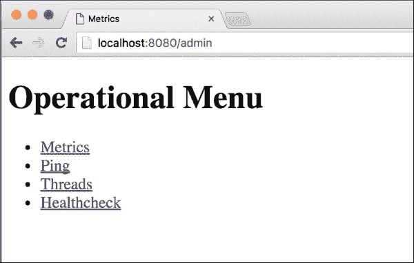
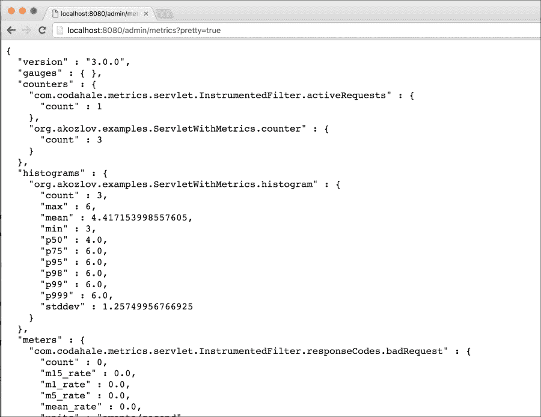
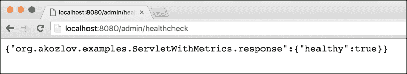

# 第十章 高级模型监控

尽管这是本书的最后一章，但在实际情况下，监控通常往往被忽视，这实在是不幸。监控是任何长时间执行周期组件的关键部署组件，因此它是最终产品的组成部分。监控可以显著提升产品体验并定义未来的成功，因为它可以改善问题诊断并对于确定改进路径至关重要。

成功软件工程的一个基本原则是，当可能时，创建系统就像是为个人使用而设计一样，这完全适用于监控、诊断和调试——一个不幸的名字，用于修复软件产品中的现有问题。复杂系统，尤其是分布式系统的诊断和调试很困难，因为事件往往可以任意交织，程序执行可能受到竞争条件的影响。尽管在分布式系统 devops 和可维护性领域有很多研究，但本章将探讨服务并提供一个指导原则，以设计可维护的复杂分布式系统。

首先，一个纯函数式方法，Scala 声称遵循这种方法，花费大量时间避免副作用。虽然这个想法在许多方面都有用，但很难想象一个对现实世界没有任何影响的有用程序，数据驱动应用程序的整个理念就是以积极的方式影响业务运营，一个明确定义的副作用。

监控显然属于副作用类别。执行需要留下用户可以稍后解析的痕迹，以了解设计或实现出了什么问题。执行的痕迹可以通过在控制台或文件上写入某些内容（通常称为日志）或返回一个包含程序执行痕迹和中间结果的对象来留下。后一种方法实际上更符合函数式编程和单子哲学，但对于分布式编程来说实际上更合适，但往往被忽视。这本来可以是一个有趣的研究课题，但遗憾的是空间有限，我必须讨论当代系统中监控的实用方面，这种监控几乎总是通过日志来完成的。在每个调用中携带带有执行痕迹的对象的单子方法当然会增加进程间或机器间通信的开销，但可以节省大量时间来拼接不同的信息片段。

让我们列出一些尝试过寻找代码中 bug 的人所采用的简单调试方法：

+   分析程序输出，尤其是由简单的打印语句或内置的 logback、java.util.logging、log4j 或 slf4j 外观产生的日志

+   连接（远程）调试器

+   监控 CPU、磁盘 I/O、内存（以解决高级资源利用率问题）

大概来说，如果我们有一个多线程或分布式系统——而 Scala 本身是天生多线程的，Spark 本身是天生分布式的——那么所有这些方法都可能会失败。在多个节点上收集日志是不可扩展的（尽管存在一些成功的商业系统确实这样做）。由于安全和网络限制，远程调试并不总是可能的。远程调试也可能导致大量的开销并干扰程序执行，尤其是对于使用同步的程序。将调试级别设置为`DEBUG`或`TRACE`有时会有所帮助，但将你置于可能或可能没有考虑到你当前正在处理的特定角落情况的开发者的 mercy。我们在本书中采取的方法是打开一个足够信息的 servlet，以便实时了解程序执行和应用程序方法，尽可能多地在 Scala 和 Scalatra 当前状态下做到这一点。

关于调试程序执行的整体问题已经说得够多了。监控则有所不同，因为它只关注于高级问题识别。与问题调查或解决相交的情况会发生，但通常是在监控之外。在本章中，我们将涵盖以下主题：

+   理解监控的主要领域和监控目标

+   学习 Scala/Java 监控工具以支持问题识别和调试

+   学习 MBeans 和 MXBeans

+   理解模型性能漂移

+   理解 A/B 测试

# 系统监控

尽管有其他类型的监控专门针对 ML 目标任务，例如监控模型的性能，但让我先从基本的系统监控开始。传统上，系统监控是操作系统维护的一个主题，但它正成为任何复杂应用的一个关键组成部分，特别是运行在分布式工作站上。操作系统的核心组件包括 CPU、磁盘、内存、网络以及电池供电机器上的能源。以下表格中提供了传统的操作系统监控工具。我们将它们限制在 Linux 工具，因为这是大多数 Scala 应用程序的平台，尽管其他操作系统供应商提供了诸如**活动监视器**之类的操作系统监控工具。由于 Scala 运行在 Java JVM 上，我还添加了针对 JVM 的特定 Java 监控工具：

| 区域 | 程序 | 备注 |
| --- | --- | --- |
| CPU | `htop`、`top`、`sar-u` | `top`一直是使用最频繁的性能诊断工具，因为 CPU 和内存一直是限制性资源。随着分布式编程的出现，网络和磁盘往往成为限制性资源。 |
| 磁盘 | `iostat`、`sar -d`、`lsof` | `lsof`提供的打开文件数量通常是一个限制性资源，因为许多大数据应用程序和守护进程倾向于保持多个文件打开。 |
| 内存 | `top`, `free`, `vmstat`, `sar -r` | 内存以多种方式被操作系统使用，例如维护磁盘 I/O 缓冲区，因此额外的缓冲和缓存内存有助于性能。 |
| 网络 | `ifconfig`, `netstat`, `tcpdump`, `nettop`, `iftop`, `nmap` | 网络是分布式系统之间通信的方式，是重要的操作系统组件。从应用的角度来看，关注错误、冲突和丢失的数据包，作为问题的指示。 |
| 能源 | `powerstat` | 虽然功耗传统上不是操作系统监控的一部分，但它仍然是一种共享资源，最近已成为维护工作系统的主要成本之一。 |
| Java | `jconsole`, `jinfo`, `jcmd`, `jmc` | 所有这些工具都允许您检查应用程序的配置和运行时属性。**Java Mission Control**（**JMC**）从 JDK 7u40 版本开始随 JDK 一起提供。 |

> 表 10.1. 常见的 Linux 操作系统监控工具|

在许多情况下，工具是冗余的。例如，可以使用`top`、`sar`和`jmc`命令获取 CPU 和内存信息。|

有一些工具可以收集一组分布式节点上的这些信息。Ganglia 是一个 BSD 许可的可扩展分布式监控系统（[`ganglia.info`](http://ganglia.info)）。它基于分层设计，非常注重数据结构和算法设计。它已知可以扩展到 10,000 多个节点。它由一个 gmetad 守护进程组成，该守护进程从多个主机收集信息并在 Web 界面中展示，以及在每个单独的主机上运行的 gmond 守护进程。默认情况下，通信发生在 8649 端口，这代表 Unix。默认情况下，gmond 发送有关 CPU、内存和网络的信息，但存在多个插件用于其他指标（或可以创建）。Gmetad 可以聚合信息并将其传递到层次链中的另一个 gmetad 守护进程。最后，数据在 Ganglia Web 界面中展示。|

Graphite 是另一个监控工具，它存储数值时间序列数据，并在需要时渲染这些数据的图表。Web 应用程序提供了一个/render 端点来生成图表，并通过 RESTful API 检索原始数据。Graphite 具有可插拔的后端（尽管它有自己的默认实现）。大多数现代指标实现，包括本章中使用的 scala-metrics，都支持向 Graphite 发送数据。|

## 进程监控|

上一个章节中描述的工具不是特定于应用的。对于长时间运行的过程，通常需要提供有关内部状态的信息，以便于监控或图形解决方案，如 Ganglia 或 Graphite，或者直接在 servlet 中显示。这些解决方案大多数是只读的，但在某些情况下，命令允许用户修改状态，例如日志级别，或者触发垃圾回收。|

监控通常应该执行以下操作：|

+   提供关于程序执行和特定于应用的指标的高级信息|

+   可能执行关键组件的健康检查

+   可能会在一些关键指标上集成警报和阈值

我还看到监控包括更新操作，以更新日志参数或测试组件，例如使用预定义参数触发模型评分。后者可以被视为参数化健康检查的一部分。

让我们通过一个简单的`Hello World` web 应用程序的例子来看看它是如何工作的，该应用程序接受类似 REST 的请求并为不同的用户分配唯一的 ID，该应用程序是用 Scala 框架 Scalatra 编写的([`scalatra.org`](http://scalatra.org))，Scala 中的轻量级 Web 应用程序开发框架。该应用程序应该对创建用户唯一数字 ID 的 CRUD HTTP 请求做出响应。要在 Scalatra 中实现此服务，我们只需要提供一个`Scalate`模板。完整的文档可以在[`scalatra.org/2.4/guides/views/scalate.html`](http://scalatra.org/2.4/guides/views/scalate.html)找到，源代码与本书一起提供，可在`chapter10`子目录中找到：

```py
class SimpleServlet extends Servlet {
  val logger = LoggerFactory.getLogger(getClass)
  var hwCounter: Long = 0L
  val hwLookup: scala.collection.mutable.Map[String,Long] = scala.collection.mutable.Map() 
  val defaultName = "Stranger"
  def response(name: String, id: Long) = { "Hello %s! Your id should be %d.".format(if (name.length > 0) name else defaultName, id) }
  get("/hw/:name") {
    val name = params("name")
    val startTime = System.nanoTime
    val retVal = response(name, synchronized { hwLookup.get(name) match { case Some(id) => id; case _ => hwLookup += name -> { hwCounter += 1; hwCounter } ; hwCounter } } )
    logger.info("It took [" + name + "] " + (System.nanoTime - startTime) + " " + TimeUnit.NANOSECONDS)
    retVal
  }
}
```

首先，代码从请求中获取`name`参数（也支持类似 REST 的参数解析）。然后，它检查内部 HashMap 中是否存在条目，如果不存在，则使用对`hwCounter`的同步调用创建一个新的索引（在实际应用中，这些信息应该在数据库（如 HBase）中持久化，但为了简化，本节将跳过这一层）。要运行应用程序，需要下载代码，启动`sbt`，并输入`~;jetty:stop;jetty:start`以启用连续运行/编译，如第七章中所述，*使用图算法*。对文件的修改将立即被构建工具捕获，jetty 服务器将重新启动：

```py
[akozlov@Alexanders-MacBook-Pro chapter10]$ sbt
[info] Loading project definition from /Users/akozlov/Src/Book/ml-in-scala/chapter10/project
[info] Compiling 1 Scala source to /Users/akozlov/Src/Book/ml-in-scala/chapter10/project/target/scala-2.10/sbt-0.13/classes...
[info] Set current project to Advanced Model Monitoring (in build file:/Users/akozlov/Src/Book/ml-in-scala/chapter10/)
> ~;jetty:stop;jetty:start
[success] Total time: 0 s, completed May 15, 2016 12:08:31 PM
[info] Compiling Templates in Template Directory: /Users/akozlov/Src/Book/ml-in-scala/chapter10/src/main/webapp/WEB-INF/templates
SLF4J: Failed to load class "org.slf4j.impl.StaticLoggerBinder".
SLF4J: Defaulting to no-operation (NOP) logger implementation
SLF4J: See http://www.slf4j.org/codes.html#StaticLoggerBinder for further details.
[info] starting server ...
[success] Total time: 1 s, completed May 15, 2016 12:08:32 PM
1\. Waiting for source changes... (press enter to interrupt)
2016-05-15 12:08:32.578:INFO::main: Logging initialized @119ms
2016-05-15 12:08:32.586:INFO:oejr.Runner:main: Runner
2016-05-15 12:08:32.666:INFO:oejs.Server:main: jetty-9.2.1.v20140609
2016-05-15 12:08:34.650:WARN:oeja.AnnotationConfiguration:main: ServletContainerInitializers: detected. Class hierarchy: empty
2016-15-05 12:08:34.921: [main] INFO  o.scalatra.servlet.ScalatraListener - The cycle class name from the config: ScalatraBootstrap
2016-15-05 12:08:34.973: [main] INFO  o.scalatra.servlet.ScalatraListener - Initializing life cycle class: ScalatraBootstrap
2016-15-05 12:08:35.213: [main] INFO  o.f.s.servlet.ServletTemplateEngine - Scalate template engine using working directory: /var/folders/p1/y7ygx_4507q34vhd60q115p80000gn/T/scalate-6339535024071976693-workdir
2016-05-15 12:08:35.216:INFO:oejsh.ContextHandler:main: Started o.e.j.w.WebAppContext@1ef7fe8e{/,file:/Users/akozlov/Src/Book/ml-in-scala/chapter10/target/webapp/,AVAILABLE}{file:/Users/akozlov/Src/Book/ml-in-scala/chapter10/target/webapp/}
2016-05-15 12:08:35.216:WARN:oejsh.RequestLogHandler:main: !RequestLog
2016-05-15 12:08:35.237:INFO:oejs.ServerConnector:main: Started ServerConnector@68df9280{HTTP/1.1}{0.0.0.0:8080}
2016-05-15 12:08:35.237:INFO:oejs.Server:main: Started @2795ms2016-15-05 12:03:52.385: [main] INFO  o.f.s.servlet.ServletTemplateEngine - Scalate template engine using working directory: /var/folders/p1/y7ygx_4507q34vhd60q115p80000gn/T/scalate-3504767079718792844-workdir
2016-05-15 12:03:52.387:INFO:oejsh.ContextHandler:main: Started o.e.j.w.WebAppContext@1ef7fe8e{/,file:/Users/akozlov/Src/Book/ml-in-scala/chapter10/target/webapp/,AVAILABLE}{file:/Users/akozlov/Src/Book/ml-in-scala/chapter10/target/webapp/}
2016-05-15 12:03:52.388:WARN:oejsh.RequestLogHandler:main: !RequestLog
2016-05-15 12:03:52.408:INFO:oejs.ServerConnector:main: Started ServerConnector@68df9280{HTTP/1.1}{0.0.0.0:8080}
2016-05-15 12:03:52.408:INFO:oejs.Server:main: Started @2796mss

```

当 servlet 在 8080 端口启动时，发出浏览器请求：

### 小贴士

我为这本书预先创建了项目，但如果你想要从头开始创建 Scalatra 项目，`chapter10/bin/create_project.sh`中有一个`gitter`命令。Gitter 将创建一个`project/build.scala`文件，其中包含一个 Scala 对象，扩展了构建，这将设置项目参数并启用 SBT 的 Jetty 插件。

`http://localhost:8080/hw/Joe`。

输出应类似于以下截图：


图 10-1：servlet 网页。

如果你使用不同的名称调用 servlet，它将分配一个不同的 ID，该 ID 将在应用程序的生命周期内保持持久。

由于我们也启用了控制台日志记录，你将在控制台上看到类似以下命令的内容：

```py
2016-15-05 13:10:06.240: [qtp1747585824-26] INFO  o.a.examples.ServletWithMetrics - It took [Joe] 133225 NANOSECONDS

```

在检索和分析日志时，可以将日志重定向到文件，并且有多个系统可以收集、搜索和分析来自一组分布式服务器的日志，但通常还需要一种简单的方法来检查运行中的代码。实现这一目标的一种方法是为度量创建一个单独的模板，然而，Scalatra 提供了度量和支持健康检查，以实现计数、直方图、速率等基本实现。

我将使用 Scalatra 度量支持。`ScalatraBootstrap` 类必须实现 `MetricsBootstrap` 特质。`org.scalatra.metrics.MetricsSupport` 和 `org.scalatra.metrics.HealthChecksSupport` 特质提供了类似于 Scalate 模板的模板功能，如下面的代码所示。

以下为 `ScalatraTemplate.scala` 文件的内容：

```py
import org.akozlov.examples._

import javax.servlet.ServletContext
import org.scalatra.LifeCycle
import org.scalatra.metrics.MetricsSupportExtensions._
import org.scalatra.metrics._

class ScalatraBootstrap extends LifeCycle with MetricsBootstrap {
  override def init(context: ServletContext) = {
    context.mount(new ServletWithMetrics, "/")
    context.mountMetricsAdminServlet("/admin")
    context.mountHealthCheckServlet("/health")
    context.installInstrumentedFilter("/*")
  }
}
```

以下为 `ServletWithMetrics.scala` 文件的内容：

```py
package org.akozlov.examples

import org.scalatra._
import scalate.ScalateSupport
import org.scalatra.ScalatraServlet
import org.scalatra.metrics.{MetricsSupport, HealthChecksSupport}
import java.util.concurrent.atomic.AtomicLong
import java.util.concurrent.TimeUnit
import org.slf4j.{Logger, LoggerFactory}

class ServletWithMetrics extends Servlet with MetricsSupport with HealthChecksSupport {
  val logger = LoggerFactory.getLogger(getClass)
  val defaultName = "Stranger"
  var hwCounter: Long = 0L
  val hwLookup: scala.collection.mutable.Map[String,Long] = scala.collection.mutable.Map()  val hist = histogram("histogram")
  val cnt =  counter("counter")
  val m = meter("meter")
  healthCheck("response", unhealthyMessage = "Ouch!") { response("Alex", 2) contains "Alex" }
  def response(name: String, id: Long) = { "Hello %s! Your id should be %d.".format(if (name.length > 0) name else defaultName, id) }

  get("/hw/:name") {
    cnt += 1
    val name = params("name")
    hist += name.length
    val startTime = System.nanoTime
    val retVal = response(name, synchronized { hwLookup.get(name) match { case Some(id) => id; case _ => hwLookup += name -> { hwCounter += 1; hwCounter } ; hwCounter } } )s
    val elapsedTime = System.nanoTime - startTime
    logger.info("It took [" + name + "] " + elapsedTime + " " + TimeUnit.NANOSECONDS)
    m.mark(1)
    retVal
  }
```

如果再次运行服务器，`http://localhost:8080/admin` 页面将显示一组用于操作信息的链接，如下面的截图所示：



图 10-2：管理员 servlet 网页

**度量**链接将引导到 *图 10-3* 中所示的度量 servlet。`org.akozlov.exampes.ServletWithMetrics.counter` 将有一个全局请求数量，而 `org.akozlov.exampes.ServletWithMetrics.histogram` 将显示累积值的分布，在这种情况下，是名称长度。更重要的是，它将计算 `50`、`75`、`95`、`98`、`99` 和 `99.9` 分位数。计量计数器将显示过去 `1`、`5` 和 `15` 分钟的速率：



图 10-3：度量 servlet 网页

最后，可以编写健康检查。在这种情况下，我将只检查响应函数的结果是否包含已传递的字符串。请参考以下 *图 10.4*：



图 10-4：健康检查 servlet 网页。

度量可以配置为向 Ganglia 或 Graphite 数据收集服务器报告，或者定期将信息输出到日志文件中。

端点不必是只读的。预配置的组件之一是计时器，它测量完成任务所需的时间——这可以用于测量评分性能。让我们将代码放入 `ServletWithMetrics` 类中：

```py
  get("/time") {
    val sleepTime = scala.util.Random.nextInt(1000)
    val startTime = System.nanoTime
    timer("timer") {
      Thread.sleep(sleepTime)
      Thread.sleep(sleepTime)
      Thread.sleep(sleepTime)
    }
    logger.info("It took [" + sleepTime + "] " + (System.nanoTime - startTime) + " " + TimeUnit.NANOSECONDS)
    m.mark(1)
  }
```

访问 `http://localhost:8080/time` 将触发代码执行，该执行将使用度量中的计时器进行计时。

类似地，可以使用 `put()` 模板创建的 put 操作，既可以调整运行时参数，也可以就地执行代码——这取决于代码，可能在生产环境中需要安全措施。

### 注意

**JSR 110**

JSR 110 是另一个 **Java 规范请求** (**JSR**)，通常被称为 **Java 管理扩展** (**JMX**)。JSR 110 规定了一系列 API 和协议，以便能够远程监控 JVM 执行。访问 JMX 服务的一种常见方式是通过默认连接到本地进程之一的 `jconsole` 命令。要连接到远程主机，您需要在 Java 命令行上提供 `-Dcom.sun.management.jmxremote.port=portNum` 属性。还建议启用安全性（SSL 或基于密码的认证）。在实践中，其他监控工具也使用 JMX 进行监控，以及管理 JVM，因为 JMX 允许回调来管理系统状态。

您可以通过 JMX 提供自己的指标。虽然 Scala 在 JVM 中运行，但 JMX 的实现（通过 MBeans）非常特定于 Java，不清楚这种机制与 Scala 的兼容性如何。尽管如此，JMX Beans 可以在 Scala 中作为 servlet 暴露。

JMX MBeans 通常可以在 JConsole 中检查，但我们也可以将其暴露为 `/jmx servlet`，书中提供的代码在代码库中（[`github.com/alexvk/ml-in-scala`](https://github.com/alexvk/ml-in-scala)）。

## 模型监控

我们已经涵盖了基本系统和应用程序指标。最近，使用监控组件来监控统计模型性能的新方向已经出现。统计模型性能包括以下内容：

+   模型性能随时间的变化

+   何时是退役模型的时候

+   模型健康检查

### 随时间推移的性能

机器学习模型会随着时间的推移而退化，或者说“老化”：尽管这个过程还没有被充分理解，但模型性能往往会随时间变化，即使是因为概念漂移，即属性的定义发生变化，或者底层依赖关系的变化。不幸的是，模型性能很少会改善，至少在我的实践中是这样。因此，跟踪模型至关重要。一种方法是通过监控模型旨在优化的指标，因为在许多情况下，我们没有现成的标记数据集。

在许多情况下，模型性能的下降并不直接与统计建模的质量相关，尽管像线性回归和逻辑回归这样的简单模型通常比决策树等更复杂的模型更稳定。模式演变或未注意到的属性重命名可能导致模型表现不佳。

模型监控的一部分应该是运行健康检查，其中模型定期对一些记录或已知评分的数据集进行评分。

### 退役模型的准则

在实际部署中，一个非常常见的案例是数据科学家每隔几周就会带来更好的模型集。然而，如果这种情况没有发生，就需要制定一套标准来淘汰模型。由于现实世界的流量很少附带评分数据，例如，已经评分的数据，衡量模型性能的通常方式是通过代理，即模型应该改进的指标。

### A/B 测试

A/B 测试是电子商务环境中控制实验的一个特定案例。A/B 测试通常应用于网页的不同版本，我们将完全独立的用户子集引导到每个版本。要测试的因变量通常是响应率。除非有关于用户的特定信息可用，而且在很多情况下，除非在计算机上放置了 cookie，否则这种分割是随机的。通常，分割是基于唯一的 userID，但已知这种方法在多个设备上效果不佳。A/B 测试受到与控制实验相同的假设的影响：测试应该是完全独立的，因变量的分布应该是`i.i.d.`。尽管很难想象所有人都是真正的`i.i.d.`，但 A/B 测试已被证明适用于实际问题。

在建模中，我们将要评分的流量分割成两个或多个通道，由两个或多个模型进行评分。进一步，我们需要测量每个通道的累积性能指标以及估计的方差。通常，其中一个模型被视为基线，与零假设相关联，而对于其他模型，我们运行 t 检验，比较差异与标准差的比例。

# 摘要

本章描述了系统、应用和模型监控目标，以及 Scala 和 Scalatra 现有的监控解决方案。许多指标与标准操作系统或 Java 监控重叠，但我们还讨论了如何创建特定于应用的指标和健康检查。我们讨论了机器学习应用中新兴的模型监控领域，其中统计模型受到退化、健康和性能监控的影响。我还简要提到了分布式系统的监控，这是一个真正值得更多篇幅讨论的话题，但遗憾的是，我没有足够的空间来展开。

这本书的结尾，但绝对不是旅程的终点。我相信，当我们说话的时候，新的框架和应用正在被编写。Scala 在我的实践中已经是一个非常出色且简洁的开发工具，我能够用几个小时而不是几天的时间实现结果，这在更传统的工具中是常见的情况，但它尚未赢得广泛的认可，我非常确信它会。我们只需要强调它在现代交互式分析、复杂数据和分布式处理世界中的优势。
