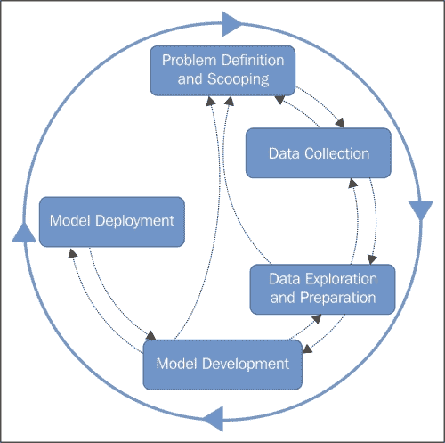
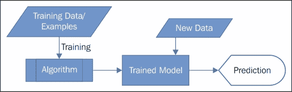

# 第一章. 简介

欢迎来到预测分析和机器学习的世界！**Azure Machine Learning**使您能够通过应用机器学习进行预测分析。传统上，这一直是专家的领域。使用机器学习开发和部署预测建模解决方案从未简单易行，即使是对于专家来说也是如此。微软似乎已经通过这个新的基于云的服务消除了大部分痛苦，它允许您以最简单、最快的方式开发和部署预测解决方案。即使是初学者也会觉得它既简单又容易理解。

本章在为本书的其余部分设定背景的同时，将从宏观的角度介绍相关主题。

# 预测分析简介

**预测分析**是分析的一个细分领域，它涉及对未知事件的预测，这些事件可能在未来发生，也可能不会发生。一个例子是在航班起飞前预测航班是否会延误。您不应该误解预测分析只处理未来事件。它可以涉及任何相关事件，例如，在交易已经发生后，您需要预测一笔特定的信用卡交易是否为欺诈。在这种情况下，事件已经发生。同样，如果您被给出一些土壤的特性，并且需要预测土壤的某个其他化学特性，那么您实际上是在预测一个已经存在的事物。

预测分析利用了数学、统计学、数据挖掘和机器学习的技术和工具，其中机器学习在其中扮演着非常重要的角色。在一个典型的预测分析项目中，您通常会以迭代的方式经历不同的阶段，如下面的图所示；

## 问题定义和范围

在开始之前，您需要了解；业务需求是什么，他们寻求的解决方案是什么？这可能会引导您找到一个位于预测分析中的解决方案。然后，您需要将业务问题转化为分析问题，例如，业务可能对提高现有客户的目录销售额感兴趣。因此，您的问题可能被转化为预测一个客户在知道他们的人口统计信息（如年龄、性别、收入、位置等）的情况下会购买多少个商品，或者根据他们过去几年的购买历史预测商品的价格。在定义问题时，您还需要定义项目的范围；否则，可能会导致一个永无止境的过程。

## 数据收集

解决方案从数据收集开始。在某些情况下，数据可能已经在企业存储或云中，你只需要利用它。在其他情况下，你可能需要从不同的来源收集数据。这也可能要求你在数据收集过程中做一些**ETL**（**提取**、**转换**和**加载**）工作。

## 数据探索和准备

在你拥有所有需要的数据后，你可以继续深入理解它。你通过数据探索和可视化来实现这一点。这还可能涉及一些统计分析。

现实世界中的数据通常很杂乱。你应该始终检查数据质量以及它是否符合你的目的。你必须处理缺失值、不适当的数据等问题。再次强调，数据可能不会以你需要的格式出现，以便进行预测。因此，你可能需要进行一些预处理，以获得所需的数据形状。通常，人们称之为**数据清洗**。在此之后，你可以选择或提取那些能引导你进行预测的确切特征。

## 模型开发

数据准备完成后，你选择算法并构建模型进行预测。这正是机器学习算法大显身手的地方。从准备好的数据中选取一部分用于训练模型，然后你可以选择用另一部分或剩余的数据来测试你的模型，以评估其性能。在评估性能时，你可以尝试不同的算法，并选择表现最好的一个。

## 模型部署

如果是单次分析，你可能不会费心部署你的训练模型。然而，通常情况下，模型做出的预测可能会被用于其他地方。例如，对于一家电子商务公司，预测模型可能会向访问网站的潜在客户推荐产品。在另一个例子中，在你构建了一个预测年度销售量的模型之后，不同地区的不同销售部门可能需要使用它来做出他们所在区域的预测。在这种情况下，你必须部署你的训练模型作为网络服务或以其他类型的生产方式，以便其他人可以通过自定义应用程序、**Microsoft Excel**或类似工具来使用它。

对于大多数实际案例，这些阶段永远不会孤立存在，总是以迭代的方式进行工作。

本书概述了数据探索和准备中可用的不同常见选项，重点关注模型开发和部署。实际上，模型开发和部署是 Azure 机器学习的核心服务，而数据探索和准备的选项有限。你可以使用其他 Azure 服务，如**HDInsight**、**Azure SQL 数据库**等，或者使用其外的编程语言来完成同样的工作。

# 机器学习

萨缪尔·亚瑟，被认为是机器学习的之父，将其定义为一种研究领域，它赋予计算机在没有明确编程的情况下学习的能力。为了简化，机器学习是一个科学学科，它探索了从数据中学习算法的构建和研究。这些算法通过从示例输入中构建模型来操作，并使用该模型进行预测或决策，而不是严格遵循静态的程序指令。

为了说明，假设你有一个包含足够多的人的年龄、教育、性别和年收入信息的数据集。假设你对预测某人的收入感兴趣。因此，你将通过选择机器学习算法并使用数据集来训练模型来构建模型。在你训练好模型之后，如果你提供年龄、教育和性别数据，它就可以预测新人的收入。为了进一步解释，你没有明确编程，例如，如果一个男性的年龄大于 50 岁，并且他是否有硕士学位，那么他每年可能会赚 10 万美元。然而，你所做的是只是选择了一个通用算法，并给它提供了数据，这样它就可以发现不同变量或特征（在这里，年龄、性别和教育）与目标变量收入之间的所有关系。因此，算法从数据中学习并因此得到训练。现在，有了训练好的算法，如果你知道其他变量，你就可以预测某人的收入。

上述示例是一个典型的机器学习问题，其中存在一个目标变量或类别；在这里，那就是收入。因此，算法从训练数据或示例中学习，然后在训练之后，算法对新案例或数据点进行预测。这种学习被称为**监督式机器学习**。它的工作原理如下所示：

另一种机器学习类型不存在目标变量或训练数据或示例的概念，因此这里的预测也是不同类型的。再次考虑包含足够多的人的年龄、性别、教育和收入数据的相同数据集。你必须运行一个有针对性的营销活动，所以你必须将人们分成三个群体。在这种情况下，你可以在数据集上使用不同类型的通用机器学习算法，该算法会自动将人们分成三个组或聚类。这种机器学习被称为**无监督式机器学习**。

还有另一种机器学习类型会做出推荐；记得亚马逊如何推荐书籍或 Netflix 如何推荐电影——这可能会让你惊讶于他们如何神奇地了解用户的喜好或选择。

尽管机器学习并不局限于这三种类型，但为了本书的范围，我们将将其限制在这三种类型之内。

再次强调，本书的范围以及当然的 Azure 机器学习将机器学习的应用仅限于预测分析领域。你应该意识到机器学习并不局限于这一点。机器学习的根源在于人工智能，并推动了各种应用的发展，其中一些你每天都在使用，例如，Bing 或 Google 这样的网络搜索引擎就是由机器学习驱动的，同样还有个人数字助理，如微软的 Cortana 和苹果的 Siri。如今，无人驾驶汽车也成为了新闻焦点，它们使用了机器学习。因此，这样的应用是数不胜数的。

## 机器学习问题的类型

以下是一些通过机器学习解决的问题的常见类型。

### 分类

**分类**是机器学习问题的一种，其中输入被分为两个或更多类别，学习器产生一个模型，将未知输入分配到这些类别或标签中的一个（或多个标签分类）。这通常以监督方式处理。垃圾邮件检测是分类的一个例子，其中输入或示例是电子邮件（或其他）消息，类别是“垃圾邮件”和“非垃圾邮件”，预测新电子邮件是否为垃圾邮件或非垃圾邮件的模型基于示例数据。

### 回归

**回归**问题涉及预测目标变量对于给定数据集中一个或多个特征或相关变量的数值或连续值。一个简单的例子可以是，你有过去 5 年内你所在地区不同房产支付的历史价格数据。在这里，支付的价格是目标变量，而房产的不同属性，如总建筑面积；房产类型，如公寓或半独立式房屋；等等，是不同的特征或变量。回归问题可能是预测市场上新上市房产的价格。

### 聚类

**聚类**是一种无监督学习问题，它作用于没有标签或类变量的数据集。这类算法将所有数据分组到不同的簇中，例如 1、2 和 3，这些簇在之前是未知的。聚类问题在本质上与分类问题不同。分类问题是一个监督学习问题，其中你的类别或目标变量是已知的，用于训练数据集，而在聚类中，没有标签和训练数据的概念。它作用于所有数据，并将它们分组到不同的簇中。

因此，简单来说，如果你有一个数据集，并且有一个类别/标签或目标变量作为分类变量，你必须根据给定的数据集（例如）预测新数据集的目标变量，那么这是一个分类问题。如果你只是得到一个没有标签或目标变量的数据集，并且你必须将它们分成*n*个簇，那么这是一个聚类案例。

## 常见的机器学习技术/算法

以下是一些非常流行的机器学习算法：

### 线性回归

**线性回归**可能是最流行且经典的用于回归问题的统计技术，用于从一个或多个变量或特征中预测连续值。此算法使用线性函数，并优化最适合训练数据的系数。如果你只有一个变量，那么你可以将此模型视为最佳拟合数据的直线。对于更多特征，此算法优化最佳超平面以拟合训练数据。

### 逻辑回归

**逻辑回归**是一种用于分类问题的统计技术。它建立了依赖变量或类别标签与独立变量（特征）之间的关系，然后对分类的依赖变量或类别标签进行预测。你可以将这个算法视为分类问题的线性回归。

### 基于决策树的集成模型

**决策树**是一系列问题或决策及其可能后果的集合，这些内容以分层的方式排列。虽然简单的决策树并不十分强大，但由平均结果组成的树集合可以非常有效。这些是集成模型，它们的不同之处在于决策是如何采样或选择的。**随机森林**或**决策森林**以及**提升决策树**是两种非常流行且强大的算法。基于决策树的算法可以用于分类和回归问题。

### 神经网络和深度学习

**神经网络**算法灵感来源于人类大脑的工作方式。它构建了一个计算单元、神经元或节点的网络。在一个典型的网络中，有三个节点层：首先，输入层，中间层或隐藏层，最后是输出层。神经网络算法可以用于分类和回归问题。

一种特殊的神经网络算法，其中除了输入层和输出层之外，还有超过三个层，以及超过一个隐藏层，被称为**深度学习**算法。这些算法因为其显著的结果而越来越受欢迎。

虽然 Azure 机器学习能够进行深度学习（卷积神经网络——本书撰写时的深度学习模型的一种），但本书不包括它。

# Azure 机器学习简介

微软 Azure 机器学习或简称 Azure ML 是一个完整的云服务。它可以通过浏览器 Internet Explorer (IE) 10 或其后续版本访问。这意味着你不需要购买任何硬件或软件，也不需要担心部署和维护。

因此，它是一个完全托管的云服务，使分析师、数据科学家和开发者能够将预测分析构建到他们的应用程序中或作为独立分析。它以最简单的方式将机器学习变成了一种服务，并允许你通过拖放来可视化构建模型。Azure ML 帮助你深入了解大量数据集，通过将其他大数据集（如处理 Azure 服务的 HDInsight [Hadoop]）集成到机器学习中，带来了云的所有好处。

Azure ML 由一套相当不错的机器学习算法提供支持。微软声称这些是最先进的算法，来自微软研究院，其中一些实际上为旗舰产品提供动力，例如 Bing 搜索、Xbox、Cortana 等等。

## ML Studio

Azure 机器学习工作室或简称 ML Studio 是 Azure ML 的开发环境。它是完全基于浏览器的，因此可以通过现代浏览器（如 IE 10 或其后续版本）访问。它还提供了一个协作环境，你可以在这里与他人分享你的工作。

ML Studio 提供了一个可视化的工作空间，可以轻松且交互式地构建、测试和迭代预测模型。你可以在其中创建工作空间并创建实验。你可以将 ML Studio 中的实验视为一个项目，在这个项目中，你将数据集和分析模块拖放到一个交互式画布上，将它们连接起来形成一个预测模型。通常，你会迭代模型的设计，编辑实验，如果需要的话保存副本，然后再次运行它。当你准备好时，你可以将你的实验作为 Web 服务发布，这样其他人或其他应用程序就可以访问它。

当你的需求不能通过拖放模块在视觉上满足时，ML Studio 允许你通过在 R 或 Python 脚本中编写代码来扩展你的实验。它还提供了一个模块，允许你使用 SQL 查询来玩转数据。

# 摘要

你刚刚完成了第一章，这不仅介绍了预测分析、机器学习和 Azure ML，还为本书的其余部分设定了背景。你从探索预测分析开始，了解了典型预测分析任务的各个阶段。然后，通过获取一些相关知识，你对机器学习有了高层次的理解。你还了解了机器学习解决的一些常见问题类型和一些流行的算法。之后，你对 Azure ML 和 ML Studio 有了非常高级的概述。

下一章全部关于 ML Studio。它向您介绍了 Azure ML 的开发环境，并对 ML Studio 的不同组件进行了概述。
