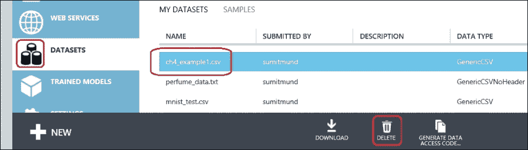
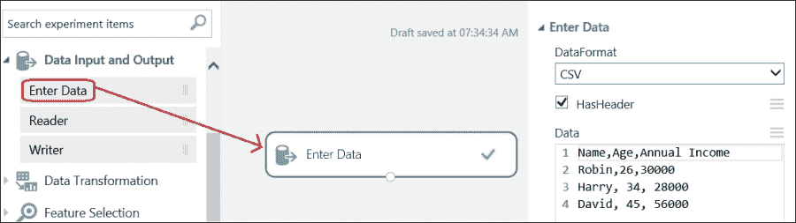
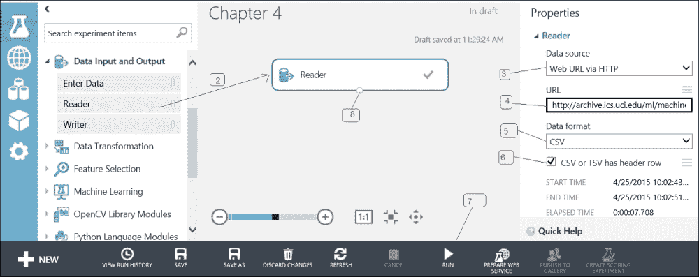
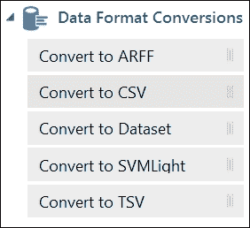
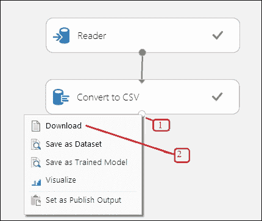
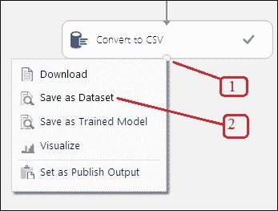
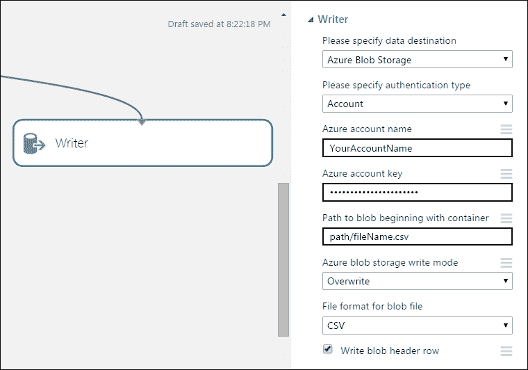

# 第四章 在 ML Studio 中获取数据

对于任何数据分析，您都需要数据作为输入。数据分析生成结果作为数据集，需要存储以供将来使用。**ML Studio**允许您以多种不同的格式导入和导出数据。您可以使用`Reader`模块从外部源导入 ML Studio 中的数据集，您可以使用`Writer`模块导出数据集。您还可以分别下载和上传不同格式的数据集到您的 PC。

ML Studio 支持多种数据格式。内部数据格式，数据表（DotNetTable），主要用于在实验内部模块之间移动数据。当您从外部源将数据导入 ML Studio 时，目前支持的数据格式有 ARFF、CSV、Hive Table、SVMLight、Text 和 TSV。让我们看看以下术语列表：

+   **ARFF**: 这是**Weka**定义的机器学习数据格式。**属性-关系文件格式**（**ARFF**）文件是一个 ASCII 文本文件，它描述了一组共享属性的一组实例。

+   **CSV**: 这是一个文本文件，其中数据以表格格式存储，不同记录由一行分隔，值（列）由逗号分隔。

+   **TSV**: 这是一个类似于 CSV 的文本文件，其中数据以表格格式存储，不同记录由一行分隔，值（列）由制表符分隔。

+   **Hive Table**: 这是通过**Hive**可访问的**Hadoop**数据表。

+   **SVMLight**: 这包含了**SVMLight**软件的文件格式训练示例。

+   **文本**: 这是一个纯文本文件。

# 在 ML Studio 中获取数据

ML Studio 允许您从不同的来源导入数据。您可以从您的 PC 上传文件，或者通过`Data Reader`模块从外部源导入数据。

## 从 PC 上传数据

您可以按照以下步骤从您的 PC 上传数据集到 ML Studio：

1.  前往 ML Studio 创建实验或前往现有的实验。

1.  点击页面左下角的**+NEW**图标，然后点击**DATASET**，然后点击**FROM LOCAL FILE**。

1.  在您点击图标后，将显示**Upload a new dataset**对话框。

1.  点击**浏览**选择您想要上传的文件。

1.  除非您正在上传现有数据集的新版本，否则不要选择**This is the new version of an existing dataset**复选框。

1.  为数据集指定一个名称。这将在您构建实验时帮助您识别数据集。数据集名称必须是唯一的——您不应该在保存的**Dataset**选项中有两个具有相同名称的数据集。如果您正在上传现有数据集的新版本，那么您需要选择您要上传新版本的数据集名称。

1.  指定您要上传的数据类型。

1.  您可以可选地提供数据的描述。

1.  然后，点击弹出窗口右下角的 **OK** 按钮（勾选标记）以开始上传。

在上传过程中，您将看到一条消息，表明您的文件正在上传。上传时间将取决于您数据的大小以及您与服务器的连接速度。

成功上传后，数据集将作为模块出现在模块调色板的左侧 **已保存数据集** | **我的数据集** 下，就像任何样本数据集一样。您可以在实验中使用它，并通过将其拖动到实验画布上来查看它。

您还可以点击左侧 **WEB 服务** 选项下方的 **数据集** 链接，以查找所有已上传的数据集。如果您想删除任何数据集，请点击它，然后在网页底部的面板中点击 **删除**。

## 输入数据模块

ML 工作室包含 **输入数据** 模块，它允许您通过手动输入来手动输入一小组数据，并允许您快速轻松地构建数据集。这可以快速测试某些内容。

在前面的示例中，数据以 CSV 格式输入，数据集通过勾选 **HasHeader** 选项标记，因此具有标题。成功运行实验后，您可以通过右键单击模块的输出端口并选择 **可视化** 来查看输入的数据集。

## 数据读取器模块

通常，您需要从外部来源导入数据。您可以通过在 **数据输入和输出** 选项下可用的 **读取器** 模块来完成此操作。`读取器` 模块从来源，如网络、Azure SQL 数据库、Azure 表、Hive 表或 Windows Azure Blob 存储加载 CSV、TSV 和 ARFF 数据文件。模块的输出端口返回从给定数据源下载的结果数据集，其他连接的模块可以消费它。

### 从网络获取数据

您可以通过 HTTP/HTTPS/FTP/FTPS 从 ML 工作室导入来自网络 URL 的数据集，尽管您需要将 `读取器` 模块的数据源选择为 HTTP。以下部分将指导您如何将公共数据集导入 ML 工作室。

#### 获取公共数据集 – 自己动手做

UCI 机器学习仓库包含不同的数据集，并免费提供给任何感兴趣的人。此 URL 包含一个包含森林火灾数据集的 CSV 文件：[`archive.ics.uci.edu/ml/machine-learning-databases/forest-fires/forestfires.csv`](http://archive.ics.uci.edu/ml/machine-learning-databases/forest-fires/forestfires.csv)。

要将文件导入 ML 工作室，请按照以下步骤操作：

1.  前往 ML 工作室。点击 **+新建** 按钮，选择 **实验**。

1.  从模块调色板中找到 **读取器** 模块，并将其拖动到实验画布上。

1.  模块属性面板显示在屏幕上。选择数据源为 **HTTP**。

1.  指定一个完整的 URL：[`archive.ics.uci.edu/ml/machine-learning-databases/forest-fires/forestfires.csv`](http://archive.ics.uci.edu/ml/machine-learning-databases/forest-fires/forestfires.csv)。

1.  将数据格式指定为 **CSV**。

1.  通过勾选复选框 **CSV 或 TSV 有标题行**来指示文件包含列标题。这意味着文件的第一行将被视为标题行。

1.  运行实验。成功执行后，你可以在模块上找到一个绿色的勾选标记。

1.  要查看输出数据，右键单击 **读取器**模块的输出端口并选择 **可视化**。这将在新浏览器窗口中打开结果：

### 从 Azure 获取数据

ML Studio 允许你从以下 Azure 服务传输数据：

+   **Windows Azure BLOB 存储**：这使你能够从 Windows Azure BLOB 存储中读取 BLOB（文件）。如果你使用 ARFF 格式进行存储，则列使用标题元数据映射。如果你使用 TSV 或 CSV 格式，则映射通过采样列数据推断。

+   **Windows Azure 表存储**：这使你能够从灵活的 NoSQL 存储中读取数据。内置和声明的数据属性类型直接映射到元数据（时间戳、整数等）。

+   **SQL Azure 表**：这使你能够从 SQL Azure 数据库中读取选定的表数据。由于这是结构化数据，元数据映射是自动的。

# 数据格式转换

有时，你可能需要将数据集转换为 ML Studio 支持的格式。有五个数据格式转换模块可用。所有这些模块都接受数据集作为输入，通过它们的输入端口将其转换为相应的格式。以下都是这些模块，它们的名称具有自解释性：

# 从 ML Studio 获取数据

你还可以从 ML Studio 导出数据到其他数据目的地，你可以将其导出到你的 PC，或者将其保存到 ML Studio 本身作为已保存的数据集项。

## 在 PC 上保存数据集

如果你想要从 ML Studio 中的模块输出下载数据集到你的 PC，请按照以下步骤操作：

1.  右键单击你想将其保存为数据集的模块的输出端口。请注意，你不能下载数据表格式的输出数据集。在这种情况下，你必须将其转换为 CSV 或 TSV 格式才能下载。参考以下截图查看此操作：

1.  点击 **下载**，文件将被下载到你的 PC 上。

### 在 ML Studio 中保存结果

有时候，你可能希望从实验中获取一个结果并将其保存到 ML Studio 以供以后使用。为此：

1.  右键单击你想将其保存为数据集的模块的输出端口。

1.  点击 **另存为数据集**选项：

1.  当提示时，输入一个可以让你轻松识别数据集的名字。

1.  如果你想要覆盖现有的数据集并选择现有数据集的名称，请勾选复选框（这是现有数据集的新版本），否则请保持未勾选。

保存后，数据集将在实验中使用，并出现在数据集列表中。

### 写入模块

你可以使用**写入器**模块将数据集写入 Windows Azure BLOB 存储、Azure 表、Azure SQL 数据库或 HDFS（这是一个部署在任何地方但可访问的 Hadoop 集群）作为 Hive 查询。此模块接受数据目的地作为第一个参数，然后根据所选目的地接受其他所需参数。将数据集写入 Azure Blob Storage 的**写入器**模块可能看起来像以下这样：

# 摘要

我们从探索 ML Studio 支持的不同数据格式开始。然后我们探讨了如何从外部源导入数据以及如何将数据集导出到外部源。我们使用了**读取器**模块来导入数据，以及**写入器**模块来导出数据。你还了解了**输入数据**模块，它允许你通过手动输入数据来构建一个小数据集。

在你将数据从源导入 ML Studio 后，在应用机器学习算法之前，通常需要对其进行某种形式的准备。此外，某些机器学习算法需要数据的前处理。在下一章中，我们将探讨 ML Studio 提供的不同数据准备选项。
