# 第六章。回归模型

最后，我们将开始介绍机器学习算法。您之前了解到，主要存在两种监督机器学习算法，回归就是其中之一。在您开始使用 ML Studio 中可用的不同回归算法和技术之前，我们将尝试更多地了解回归分析和为什么它被使用。

# 理解回归算法

假设您居住在一个地区，并且您拥有以下数据集，其中包含该地区出售的不同物业的所有交易以及物业详情。让我们看一下以下表格：

| 物业类型 | 面积（平方英尺） | 价格（美元） |
| --- | --- | --- |
| D | 2000 | 500,000 |
| T | 1500 | 200,000 |
| F | 1400 | 300,000 |
| T | 1000 | 100,000 |
| F | 2000 | 450,000 |
| S | 1800 | 350,000 |
| D | 2500 | 700,000 |
| F | 1500 | 350,000 |

在这里，**D** 表示独立式，**S** 表示半独立式，**T** 表示排屋式，**F** 表示公寓/联排别墅。

现在，一个面积为 1,800 平方英尺的公寓将上市。您需要预测其出售的价格。这是一个回归问题，因为您需要预测目标变量的一个数值。在这里，物业价格是目标变量，**物业类型**和**面积**是两个特征或依赖变量。在机器学习中，目标变量也被称为标签。

您需要提出一个模型，该模型将接受物业类型和面积的价值，并输出价格。将模型视为一个数学函数 *f(物业类型, 面积) = 预测价格*。

物业实际出售的价格可能与预测价格相同，也可能不同。实际价格与预测价格之间的差异是误差。在构建预测模型时，您应尝试最小化误差，以便预测值尽可能接近实际值。

在扩展前面的例子中，您假设已经构建了一个模型，并使用以下公式预测了一个 1800 平方英尺公寓的价值：

f(F, 1800) = $400,000

因此，$400,000 是预测值，假设该物业以$410,000 的实际价格出售。那么，误差将是 *误差 = $410,000 - $400,000 = $10,000*。

# 训练、评分和评估

在进行预测之前，您需要使用示例数据或训练数据集训练一个算法，其中目标值或标签是已知的。在训练模型后，您可以使用训练好的模型进行预测。

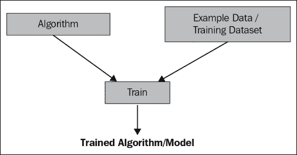

继续前面的例子，训练好的模型可以被视为数学函数 `f` 来进行预测。

通常，当你需要从一个给定的数据集中构建模型时，你需要将数据集分成两个集合，一个作为训练数据集，另一个作为测试数据集。使用训练数据训练模型后，你使用测试数据集来查看模型的表现，即它有多少错误。

模型训练完成后，你可以使用测试数据来进行预测或评分。在评分过程中，使用特征值，然后预测目标值。此时，你不确定你的模型表现如何。你需要评估它以了解其性能。在评估过程中，你将评分值和实际值进行比较，这被称为你已经将数据集分为训练集和测试集。

继续使用之前的示例，在评分过程中，你发现一个 1800 平方英尺公寓的预测价格为$400,000，而在评估过程中，你发现误差为$10,000。

总体来说，在实验过程中，你可以遵循以下步骤：

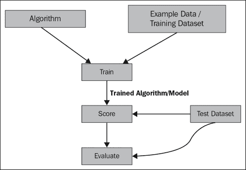

ML Studio 提供了不同的统计方法来衡量回归模型的误差和性能。它还附带了一套算法，可以用来对数据集进行实验。

## 测试和训练数据集

通常，你使用**训练**数据集来训练算法，并使用测试数据集来验证或测试模型。在实践中，大多数情况下，你只会得到一个数据集。因此，你可能需要将给定的数据集分成两部分，一部分作为训练集，另一部分作为测试集。通常，训练集包含更大的部分，而测试集包含较小的部分，例如 70-30 或 80-20。理想情况下，在分割原始数据集时，应该随机分割。ML Studio 中的**分割**模块很好地解决了这个问题。

## 评估

将前一个数据集的示例（参见表 6.1）视为训练数据集，以下内容作为测试数据集：

| 属性类型 | 面积（平方英尺） | 实际价格（美元） | 预测价格（美元） |
| --- | --- | --- | --- |
| F | 1800 | 400,000 | 410,000 |
| T | 1700 | 220,000 | 210,000 |

将第一行的实际价格和预测/评分价格分别视为*y1*和*f1*。因此，在前面的表中，我们可以看出*y1 = 400,000*和*f1 = 410,000*。

同样，我们可以看出第二行*y2 = 220,000*和*f2 = 210,000*。

ML Studio 提供了以下统计方法来衡量模型的表现。

### 平均绝对误差

**平均绝对误差**（**MAE**）是用来衡量预测或预测结果与最终结果接近程度的量。它是实际值与预测值之间绝对差值的平均值。让我们看看下面的图表：

| 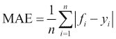这里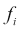是预测值，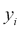是真实值。 |
| --- |

它具有与原始数据相同的单位，并且只能比较误差以相同单位度量的模型。

### 均方根误差

**均方** **根误差** (**RMSE**) 是通过对所有误差平方的平均值的平方根来计算的（即预测值与实际值之间的差异）。让我们看一下以下图示：

| 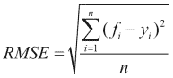在此， 是预测值， 是真实值 |
| --- |

它只能比较误差以相同单位度量的模型。

### 相对绝对误差

**相对绝对** **误差** (**RAE**) 是相对于实际值平均值与实际值绝对差平均值绝对误差的平均值。让我们看一下以下图示：

| 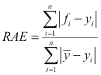此处  是预测值， 是实际值或真实值，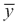 是  的平均值。 |
| --- |

它可以比较误差以不同单位度量的模型。

### 相对均方误差

**相对** **均方误差** (**RSE**) 是预测值与实际值平方差的平均值相对于实际值平方差平均值、实际值平均值的平均值。

| 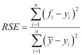此处  是预测值， 是真实值， 是  的平均值。 |
| --- |

它可以比较误差以不同单位度量的模型。

### 确定系数

确定系数 *R2* 总结了回归模型的解释力。如果回归模型完美无缺，尽管不切实际，*R2* 的值将是 1。

| 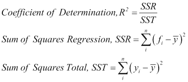此处  是预测值， 是真实值， 是  的平均值 |
| --- |

确定系数也可以解释为数据中符合模型的比例。例如，如果 *R2 = 0.7950*，那么 79% 的 *y* 的总变化可以通过特征与 *y* 之间的线性关系来解释，*y* 是响应变量（或目标变量）。

因此，对于您的模型，*R2*值越接近 1，越好。对于所有其他错误统计量，值越小，越好。

# 线性回归

**线性回归**是 ML Studio 中可用的回归算法之一。它试图将一条线拟合到数据集。这是一个流行的算法，可能是最古老的回归算法之一。我们将使用它来训练模型，对可用的样本数据集之一进行预测：汽车价格数据（原始）。这个数据集是关于汽车，根据它们的制造商和型号以及其他特征区分的。它还包括价格。有关数据集的更多信息，可以在[`archive.ics.uci.edu/ml/datasets/Automobile`](https://archive.ics.uci.edu/ml/datasets/Automobile)找到。

我们将使用价格作为标签或目标变量。因此，给定汽车特征，您需要预测汽车的价格。

前往 ML Studio 创建一个新的实验。然后，在屏幕左侧的模块调色板中展开**已保存的数据集**。将**汽车价格数据（原始）**模块拖动到画布上。

然后，在模块调色板中展开**数据转换**，然后展开**样本和分割**，将**分割**模块拖动到画布上。将第一个输出数据集的**行分数**参数设置为**0.8**，并将其他设置为默认值。您正在分割数据集，以便 80%的数据用于训练，其余 20%用于测试。

在准备好训练数据和测试数据后，将**训练**模块拖动到画布上。在屏幕左侧模块调色板中的搜索框中输入`train`，当**训练**模块出现时，将其拖动到画布上。然后，将**分割**模块的第一个输出连接到**训练**模块的第二个输入。现在，您需要选择数据集的列，该列将成为您的目标变量，或者您将训练一个模型进行预测。在我们的例子中，*价格*是您将要预测的目标变量或标签。

通过单击选择**训练**模块，展开屏幕右侧的属性面板，并单击**启动列选择器**选项。

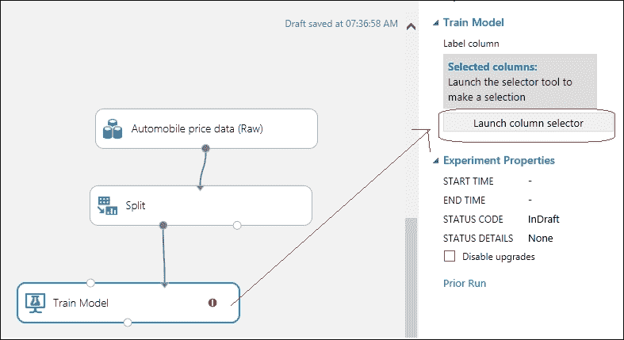

然后，将出现一个弹出窗口以选择列。在屏幕右侧的文本框中输入`price`，并单击复选框以选择该列。

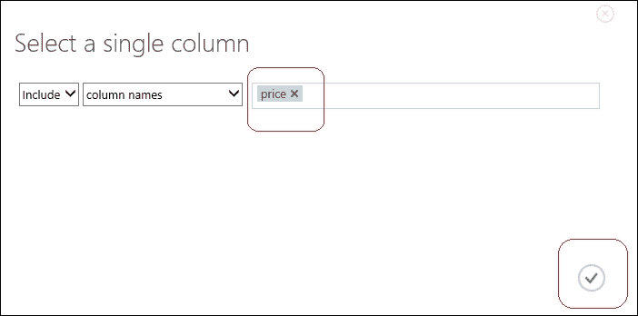

同样，将**线性回归**模块拖动到画布上。在屏幕左侧模块调色板中的搜索框中输入`linear`，当模块出现时，将其拖动到画布上。

然后，选择**线性回归**模块，并将属性值保留为默认设置。将**随机数种子**选项设置为**0**。**随机数种子**选项用于生成随机数，以便产生可重复的结果。

现在，将**线性回归**模块的输出连接到**训练**模块的第一个输入端口。它应该看起来类似于以下截图：

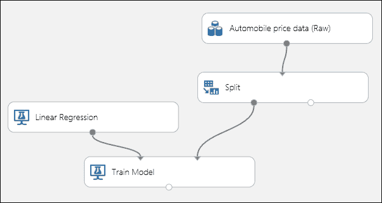

接下来，将**评分模型**和**评估模型**模块拖动到画布上。

**评分模型**将使用训练好的算法为测试数据集生成预测价格值。因此，它需要两个输入：首先，训练好的模型；其次，测试数据集。它生成包含预测值的评分数据集。**评估模型**接受评分数据集并生成评估矩阵。它还可以接受两个评分数据集，这样你可以并排比较两个模型。

将**训练模型**的输出连接到**评分模型**的第一个输入，将**分割**模块的第二个输出连接到第二个输入。然后，将**评分模型**的输出连接到**评估模型**的第一个输入。

完整的模型可能看起来如下。现在，点击**运行**按钮来运行实验。

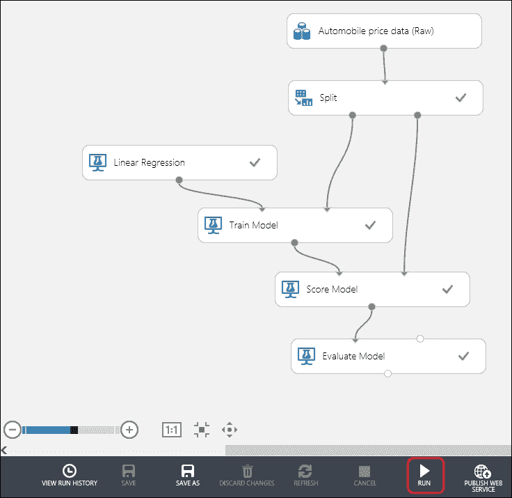

运行完成后，当你看到所有模块框上都有绿色的勾号时，你可以查看评估矩阵以了解你的模型表现如何。为此，右键单击**评估模型**的输出，并点击它以选择**可视化**选项。

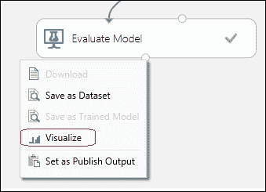

下一个弹出窗口显示**评估结果**图，如下截图所示：

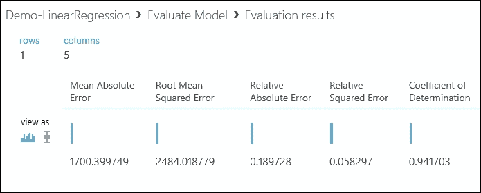

如你所见，**确定系数**为**0.941703**，这是一个不错的数值，模型似乎表现良好。

如果你注意到了，你使用普通最小二乘法训练了这个线性回归模型。你也可以使用带有适当参数的在线梯度下降，例如学习率和迭代次数（周期）。当处理大型数据集时，这种方法非常有用，因为它具有良好的可扩展性。然而，当数据集只有几千个数据点时，使用普通最小二乘法可能更适合你，因为它简单且易于训练（只需选择少量参数）。

为了保持简单，在本章的前后示例中，我们在没有进行初始数据准备的情况下开始建模，例如去除缺失值或选择正确的列或特征集。在实践中，你应该在用数据集进行训练之前始终进行初始数据准备。再次强调，某些算法需要数据以适当的格式存在才能生成期望的结果。

# 为学习者优化参数——扫描参数模块

要成功训练一个模型，你需要为算法找到正确的一组属性值。大多数情况下，这并不是一项容易的任务。首先，你需要对算法及其背后的数学有一个清晰的理解。其次，你必须多次运行实验，尝试算法参数的多种组合。有时，这可能会非常耗时且令人沮丧。

例如，在上述相同的前一个例子中，L2 正则化权重的正确值应该是什么？它用于减少模型的过拟合。当模型在训练数据集上表现良好，但在任何新数据集上表现不佳时，模型就会过拟合。通过减少过拟合，你可以泛化模型。然而，这里的问题是，你必须手动调整这个 L2 正则化权重，这可以通过尝试不同的值、多次运行实验并在每次运行中评估其性能来完成。

ML Studio 提供了一个名为**参数扫描**模块的解决方案。你不需要使用**训练模型**模块，而是可以使用**训练模型**模块来生成一个使用正确的参数或属性值优化的训练模型。以下截图描述了其输入和输出：

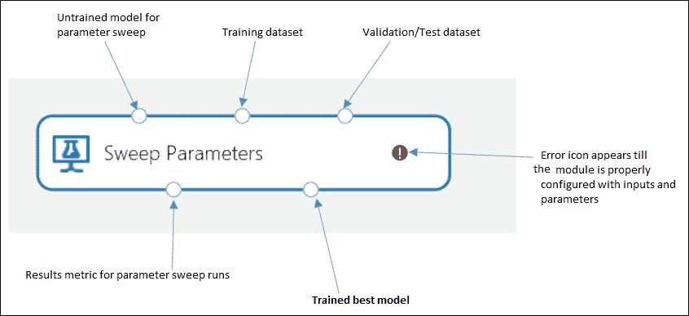

你需要指定一个参数扫描模式作为此模块的参数。你有两种方式来指定扫描模式的参数，如下所示：

+   **完整网格**：此选项在不知道最佳参数设置可能是什么，并希望尝试许多参数的情况下很有用。它遍历系统预定义的网格，尝试不同的组合，并确定最佳学习器。

+   **随机扫描**：或者，你也可以选择此选项，并指定模块要执行的最大运行次数。它将在有限的样本运行范围内随机选择参数值。当你想使用你选择的指标来提高模型性能并节省计算资源时，建议使用此选项。

你还需要选择一个目标或标签列，并指定一个用于衡量回归性能的指标值，这可以是五个评估矩阵之一，例如，均方根误差。在处理回归问题时，你可能可以忽略分类的参数设置。

## 决策森林回归

决策森林，或如人们广泛所知的随机森林，是一个非常流行的算法。内部，它构建了许多决策树，然后将它们作为森林进行集成。每个决策树生成一个预测，在森林中，每棵树的预测值被平均。即使在有噪声数据的情况下，它也能很好地工作。

然而，要训练一个决策森林，你需要设置正确的参数，例如决策树的数量。现在，我们将使用**Sweep Parameters**模块来训练一个决策森林并优化其参数。

与前一个案例一样，创建一个新的实验并为它命名。然后，执行相同的步骤，并将屏幕左侧的模块调色板中的**Saved Datasets**展开。将**Automobile price data (Raw)**模块拖到画布上。

然后，在模块调色板中展开**Data Transformation**和**Sample and Split**，并将**Split**模块拖到画布上。将第一个输出数据集的行**Fraction**参数设置为**0.8**，其他保持默认值。你正在分割数据集，以便 80%的数据用于训练，其余 20%用于测试。

在屏幕左侧的模块调色板中的搜索框中输入`Sweep`，当**Sweep Parameters**模块出现时，将其拖到画布上。然后，将**Split**模块的第一个输出连接到**Sweep Parameters**模块的第二个输入，将**Split**模块的第二个输出连接到**Sweep Parameters**模块的第三个输入。

现在，你需要设置数据集的列，这是你的目标或标签列，你将训练一个模型来进行预测。在我们的案例中，**price**是目标变量或标签，你将对其进行预测。同时，将扫描模式设置为**Entire grid**，将**回归性能度量指标**设置为**确定系数**。

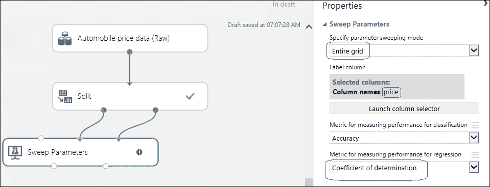

同样，将**Decision Forest Regression**模块拖到画布上。在屏幕左侧的模块调色板中的搜索框中输入`Decision Forest`，当模块出现时，将其拖到画布上。将**Resampling method**属性设置为**Bagging**，其余保持默认值，如以下截图所示：

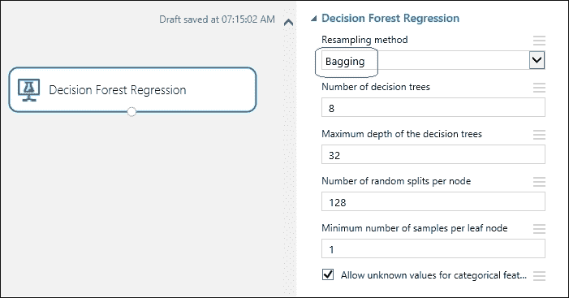

然后，将**Decision Forest Regression**模块的唯一输出连接到**Sweep Parameters**模块的第一个输入。

接下来，将**Score Model**和**Evaluate Model**拖到画布上。将**Sweep Parameters**模块的第二个输出连接到**Score Model**的第一个输入，将**Split**模块的第二个输出连接到**Score Model**的第二个输入。然后，将**Score Model**的输出连接到**Evaluate Model**的第一个输入。

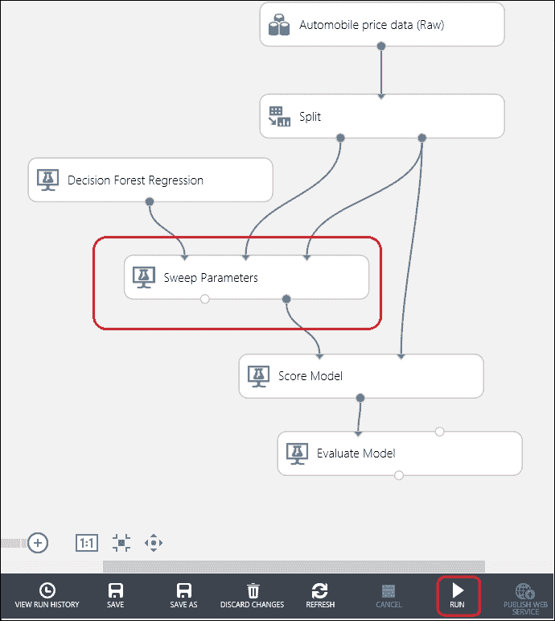

现在，运行实验，完成后，可视化**Evaluate Model**的输出以了解模型的性能。

如果你想知道通过**Sweep Parameters**模块获得的**Decision Forest Regression**模块的最佳参数，那么右键单击**Sweep Parameter**模块的输出端口，然后点击**Visualize**。在前一个例子中，它看起来如下：

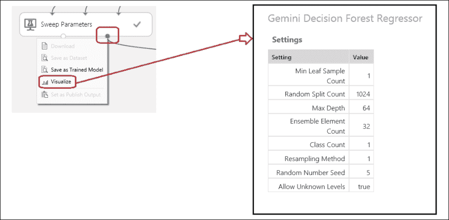

# 训练神经网络回归 – 自己动手做

神经网络是一种受人类大脑计算模型启发的机器学习算法。对于回归，ML Studio 提供了神经网络回归模块。你可以使用 Sweep Parameters 模块来训练它。首先，尝试在没有 Sweep Parameters 模块（使用 Train 模块）的情况下使用神经网络回归的默认参数进行训练，然后使用 Sweep Parameters 模块进行训练。注意模型性能的改进。

# 使用评估模型比较模型

使用**Evaluate Model**，你还可以在同一个实验中并排比较两个模型。模块的两个输入端口可以接受来自两个 Score 模块的输出，并生成评估矩阵来比较模块接受的两个输入的输出。如下截图所示：

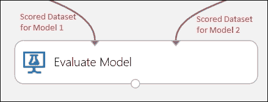

## 比较模型 – 神经网络和提升决策树

**Boosted Decision Tree Regression**模块是 ML Studio 附带的其他回归算法之一。它是一个类似于决策森林的集成模型，但有一些不同。

在这里，我们将使用**Boosted Decision Tree Regression**和**Neural Network Regression**模块进行相同的实验，并使用**Evaluate Model**来比较两者。在两种情况下，我们将使用**Sweep Parameters**模块来训练算法。

创建一个新的实验，并拖动相同的样本数据集——**Automobile price data (Raw)**模块。然后，使用相同的训练数据集（80%）进行两种算法的训练，并使用其他 20%进行评分。构建的模型可能看起来如下：

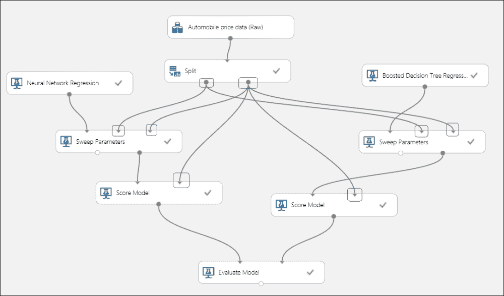

虽然连接直观且简单，但两种情况下的**Sweep Parameters**模块的连接可能令人困惑。请注意，带有红色圆圈的输入来自标记有红色圆圈的**Split**模块的相同输出。因此，两个**Sweep Parameters**模块接受相同的训练数据，但使用不同的算法进行训练。此外，请注意带有蓝色圆圈的输入端口来自标记有蓝色圆圈的**Split**模块的相同输出端口。

在实验成功运行后，所有框都将有一个绿色的勾号。然后，右键单击**Evaluate Model**的输出端口，以找到两种算法的比较指标。让我们看一下以下截图：

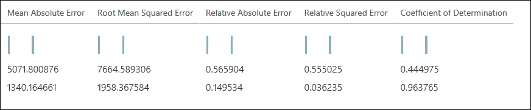

上一张截图的第一行显示了连接到**评估模型**的第一个输入的模型的指标，在这种情况下，它显示了**神经网络回归**模块，第二行用于第二个模型：**提升决策树回归**模块。您知道，对于性能更好的模型，错误值应尽可能小，确定系数应尽可能接近 1，这意味着它越高越好。正如您将发现的，对于这个数据集的每个评估统计量，提升决策树的表现都优于神经网络，例如，**确定系数**为**0.963765**，而**0.444975**。同样，与其它模型相比，提升决策树的相对绝对误差要小得多。如果您必须在这两个模型之间做出选择，那么在这种情况下，您自然会选择提升决策树。因为我们没有设置随机数种子，所以您的结果（图表）可能会有所不同；然而，总体上，这并没有任何区别。

在这里，您只比较了两个模型。在实践中，您应该尽可能多地比较同一问题上的模型，以找出其中表现最好的模型。

# 其他回归算法

Azure ML 随带了一系列流行的回归算法。本节简要描述了（在本书编写时）我们尚未讨论的其他算法：

+   **贝叶斯线性回归模型**：此模型使用贝叶斯推理进行回归。只要您正确设置正则化参数，这可能并不难训练，例如，可能适合的值有 0.1、0.2 等。

+   **有序回归模型**：当您需要为具有自然排序或排名标签或目标值的数据集训练模型时，您会使用此模型。

+   **泊松回归**：这是一种特殊的回归分析方法。它通常用于模型计数，例如，对与飞机航班相关的感冒和流感病例数进行建模，或估计与事件或促销相关的电话数量等。

# 没有免费的午餐

*无免费午餐*定理与机器学习相关，它通常表述了任何机器学习模型的局限性。根据该定理，没有一种模型适合解决所有问题。因此，在一个领域内适合解决一个问题的模型可能对另一个问题并不适用。所以在实践中，每当你解决问题时，你需要尝试不同的模型，并对你自己的数据集进行实验以选择最佳模型。这在监督学习中尤其如此；你可以在 ML Studio 中使用**评估模型**模块来评估不同复杂度的多个模型的预测准确性，以找到最佳模型。一个表现良好的模型也可能由多个算法训练，例如，ML Studio 中的线性回归可以通过普通最小二乘法或在线梯度下降法进行训练。

# 摘要

你通过理解回归预测分析开始了这一章，并探讨了训练、测试和评估回归模型的概念。然后你继续在 ML Studio 中构建不同的回归模型实验，例如线性回归、决策森林、神经网络和提升决策树。你学习了如何在训练后评分和评估模型。你还学习了如何使用 Sweep Parameters 模块优化学习算法的不同参数。无免费午餐定理教导我们不要依赖任何特定的算法来解决所有问题，所以在 ML Studio 中，你应该在最终确定单个模型之前，训练和评估不同模型的性能。

在下一章中，你将探索另一种无监督学习类型，称为分类，你将探索 ML Studio 中可用的不同算法。
