# 第七章. 分类模型

分类是另一种监督机器学习方法。在本章中，在深入了解使用 ML Studio 构建分类模型之前，您将首先了解分类算法的基本知识以及如何评估模型。然后，您将使用不同的算法和不同的数据集构建模型。

# 理解分类

假设您得到了以下假设数据集，其中包含患者的数据：他们体内肿瘤的大小、他们的年龄以及一个类别，表示他们是否受到癌症的影响，1 表示阳性（受癌症影响）和 0 表示阴性（不受癌症影响）：

| 年龄 | 肿瘤大小 | 类别 |
| --- | --- | --- |
| 22 | 135 | 0 |
| 37 | 121 | 0 |
| 18 | 156 | 1 |
| 55 | 162 | 1 |
| 67 | 107 | 0 |
| 73 | 157 | 1 |
| 36 | 123 | 0 |
| 42 | 189 | 1 |
| 29 | 148 | 0 |

在这里，患者被分类为受癌症影响或不受影响。一位新患者以 17 岁的年龄出现，并被诊断出患有大小为 149 的肿瘤。现在，您需要根据以前的数据预测这位新患者的分类。这就是分类，您需要预测因变量的类别；这里它是**0**或**1**——您也可以将其视为真或假。

对于回归问题，您预测一个数字，例如房价或数值。在分类问题中，您预测一个分类值，尽管它可能用数字表示，如**0**或**1**。

您不应混淆回归和分类问题。考虑一个需要预测房价的情况，不是作为一个数字，而是作为类别，如大于 10 万美元或小于 10 万美元。在这种情况下，尽管您正在预测房价，但实际上您正在预测房价的类别或类别，因此这是一个分类问题。

您通过使用给定的训练数据训练算法来构建分类模型。在训练数据集中，类别或目标变量已经已知。

## 评估指标

假设您已经构建了一个模型，并使用表 7.1 中的数据集作为训练数据训练了一个分类算法。现在，您正在使用以下表格作为测试数据。如您所见，最后一列显示了预测的类别。

| 年龄 | 肿瘤大小 | 实际类别 | 预测类别 |   |
| --- | --- | --- | --- | --- |
| 32 | 135 | 0 | 0 | TN |
| 47 | 121 | 0 | 1 | FP |
| 28 | 156 | 1 | 0 | FN |
| 45 | 162 | 1 | 1 | TP |
| 77 | 107 | 0 | 1 | FP |

### 真阳性

这是实际类别为正且被预测为正的次数。例如，患者实际上受到癌症的影响，模型也预测为阳性。

在我们前面的例子中，有一个实例，其中**实际类别** = **1**和**预测类别** = **1**。因此，这里的**TP** = **1**。

### 假阳性

这是实际类别为负且被预测为正的次数。例如，患者实际上没有受到癌症的影响，但模型预测为阳性。

在我们前面的例子中，有两个实例，其中**实际类别** = **0**和**预测类别** = **1**。所以在这里，**FP** = **2**。

### 真阴性

这是实际类别为负且被预测为负的次数。例如，患者实际上没有受到癌症的影响，而模型也预测为阴性。

在我们前面的例子中，有一个实例，其中**实际类别** = **0**和**预测类别** = **0**。所以在这里，**TN** = **1**。

### 假阴性

这是实际类别为正但被预测为负的次数。例如，患者实际上受到癌症的影响，但模型预测为阴性。

在我们前面的例子中，有一个实例，其中**实际类别** = **1**和**预测类别** = **0**。所以在这里，**FN** = **1**。

下表显示了矩阵中的**TP**、**TN**、**FP**和**FN**：

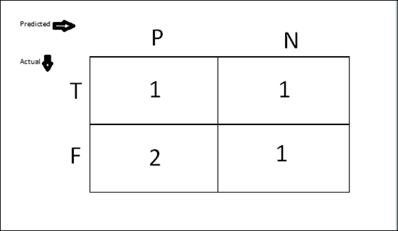

### 准确度

这是真实预测与总预测数之比。而真实预测是*TP + TN*，总预测数是测试数据集的大小，也就是*TP + TN + FP + FN*。因此，准确度可以用以下公式表示：

准确度 = (TP + TN) / (TP + TN + FP + FN)

所以在我们的例子中，*准确度 = (1 + 1) / (1 + 1 + 2 + 1) = 2/5 = .4*。

准确度也可以表示为预测正确的百分比。所以，在我们的例子中，准确度是 40%。

### 注意

注意，前面的数字只是为了说明计算方法。在实践中，当你构建模型时，它应该有超过 50%的准确度；否则，模型就不太好，因为即使是随机试验也会有 50%的准确度。

### 精确度

阳性预测值或精确度是模型正确识别的正例的比例。精确度可以用以下公式表示：

精确度 = TP / (TP + FP)

所以在我们的例子中，*精确度 = 1 / (1+1) = 1/2 = .5*。

### 召回率

灵敏度或召回率是正确识别的实际正例的比例。召回率的公式是：

*召回率 = TP / (TP + FN)*

所以在我们的例子中，*召回率 = 1 / (1 +2) = 1/3 = .33*。

### F1 分数

F1 分数可以用以下公式定义：

*F1 = 2TP / (2TP + FP + FN)*

F1 分数也可以用精确度（P）和召回率（R）来定义，如下所示：

*F1 = 2PR/(P+R)*

所以在我们的例子中，*F1 = (1 * 2) / {(1 * 2) + 2 + 1 } = 2/ (2 + 2 +1) = 2/5 =.4*。

### 阈值

阈值是值，高于此值属于第一类，所有其他值属于第二类。例如，如果阈值是**0.5**，那么任何得分超过或等于**0.5**的患者被识别为患病；否则，患者被识别为健康。你可以把阈值看作概率。为了说明，如果有 80%或**0.8**的几率今天可能会下雨，那么你可以预测今天会下雨。同样，如果小于**0.8**，那么你可以预测不会下雨。所以你的预测将取决于这里的阈值。

### 理解 ROC 和 AUC

**接收者操作特征**（**ROC**）图是一个二维图，其中真实阳性率（TP）绘制在*y*轴上，而假阳性率（FP）绘制在 x 轴上。ROC 图描述了收益（真实阳性）和成本（假阳性）之间的相对权衡。

**曲线下面积**（**AUC**）是单位正方形下 ROC 曲线下的面积部分；其值始终在*0*和*1*之间，其中*1*是最佳情况或所有预测都正确。然而，由于随机猜测产生了从*(0, 0)*到*(1, 1)*的对角线，其面积为**0.5**，没有现实中的分类器应该有小于**0.5**的 AUC。AUC 通常用作分类模型质量的衡量标准。

在以下图中，蓝色曲线表示 ROC，红色涂色的区域表示 AUC。黄色涂色的对角线代表随机猜测：

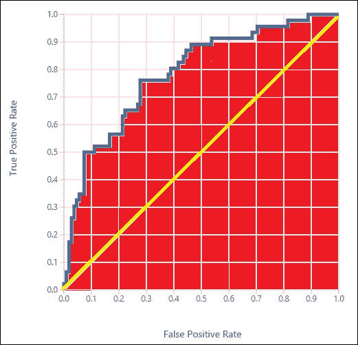

### 考虑矩阵的动机

当选择模型算法时，你将不得不依赖于之前定义的指标。通常，一个指标可能不足以做出决定。首先，你可能查看准确率，但有时它可能具有误导性。考虑这样一个案例，你正在为一个罕见疾病做出预测，实际上，99%是阴性病例，1%是阳性病例。如果你的分类模型预测所有病例为真正的阴性，那么准确率仍然是 99%。在这种情况下，F1 分数可能是有用的，因为它会给你一个清晰的画面。AUC 也可能是有用的。

考虑另一种场景。让我们继续我们的疾病预测示例。假设您正在预测一个患者是否患有癌症。如果您将一个假病例（患者实际上未受疾病影响）预测为真，那么这是一个假阳性病例。在实际场景中，在这样一个预测之后，患者将进行进一步的医学检查，手动声明未受癌症影响。然而，如果您将一个预测为真的病例（患者实际上受疾病影响）预测为假，那么这是一个假阴性病例。在实际场景中，在这样一个预测之后，患者被允许自由离开并允许不带药物回家。这可能是危险的，因为患者可能会失去生命。您可能永远不会喜欢做出这样的预测。在这种情况下，就像这个故事一样，您可能会降低阈值值以减少释放任何真阳性病例的机会。因此，这将导致更高的召回率和更低的精确度。

在前一个场景相反的情况下，比如说您有一个用于预测在线交易欺诈的分类模型。在这里，将一个案例预测为欺诈（实际上不是——一个假阳性案例）可能会导致客户满意度下降。因此，在这种情况下，您可能会提高阈值值，这将导致更高的精确度和更低的召回率。

如您从前面的定义中可能发现的，F1 分数是一种平衡的测量方法，它涉及精确度和召回率。

当您不太担心精确度和召回率，或者您对它们不太确定时，您可以直接遵循 AUC（越高越好）的值。许多人认为 AUC 是衡量分类模型性能的最佳方式。AUC 还提供了一个图形表示。然而，始终注意记录多个指标是一个好主意。

# 训练、评分和评估模块

与您在上一章中看到的回归问题一样，对于分类问题，您可以从一个算法开始，并用数据对其进行训练。然后，您可以使用测试数据评分，并评估模型的性能。

在屏幕上导航到**训练**|**评分**|**评估**选项。

**训练**、**评分**和**评估**模块与你在回归中使用的相同。**训练**模块需要目标（类别）变量的名称。**评估**模块为分类生成评估指标。

如果你想通过参数扫描调整算法的参数，你可以使用相同的**扫描参数**模块。

# 是否对糖尿病进行分类

**皮马印第安人糖尿病二分类数据集**模块作为样本数据集存在于 ML Studio 中。它包含属于皮马印第安人血统的相同年龄的女性患者的所有数据。数据包括医疗数据，如葡萄糖和胰岛素水平，以及患者的生活方式因素。数据集中的列如下：

+   怀孕次数

+   口服葡萄糖耐量测试 2 小时血浆葡萄糖浓度

+   舒张压（毫米汞柱）

+   三头肌皮肤褶皱厚度（毫米）

+   2 小时血清胰岛素（微单位/毫升）

+   体质指数（体重（千克）/身高（米）的平方）

+   糖尿病家系函数

+   年龄（年）

+   类别变量（0 或 1）

最后一列是目标变量或类别变量，其值为 0 或 1，其中 1 表示阳性或受糖尿病影响，0 表示患者未受影响。

你必须构建模型来预测患者是否患有糖尿病或测试结果为阳性。

## 双类贝叶斯点机

双类贝叶斯点机是一种易于训练且功能强大的线性分类器。我们将使用它来构建我们的第一个分类模型。

开始一个新的实验。在屏幕左侧的模块调色板中，展开**保存的数据集**选项，向下滚动，并将**皮马印第安人糖尿病二分类数据集**模块拖放到画布上。或者，您也可以在搜索框中键入`pima`以定位模块，然后将其拖动。

右键单击其输出端口，然后单击**可视化**选项以探索数据集。您会注意到它现在有 768 行和 9 列。

您必须将此数据集分成两部分以准备训练和测试数据集。因此，将**分割**模块拖放到画布上，并将数据集模块的输出连接到**分割**模块的输入。将**0.8**作为参数；**行分数**选项是第一个输出数据集，它以 80:20 的比例分割自身，以分别获得您的训练和测试数据集。

将**双类贝叶斯点机**模块拖放到画布上，您可以通过在左侧模块调色板中导航到**机器学习** | **初始化模型** | **分类**来找到该模块。

此模块有三个参数值需要设置。**训练迭代次数**模块是决定算法在数据集上迭代次数的值。默认值**30**在大多数情况下是足够的。如果勾选**包含偏差**复选框或设置为 true，则在每个训练和预测实例中添加一个常数特征或偏差。默认值是 true，在大多数情况下需要设置为 true。最后一个参数，如果勾选**允许分类特征中的未知值**或设置为 true，将为每个分类列创建一个额外的级别。测试数据集中未在训练数据集中出现的任何级别都将映射到这个额外级别。除非您正在进行所需的数据预处理，否则建议您勾选此选项或保留默认值。

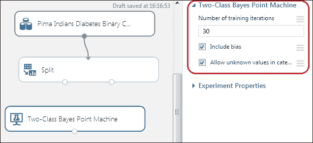

将**训练模型**模块拖动到画布上，并将**双类贝叶斯点机**模块的输出端口连接到**训练模型**模块的第一个输入端口。将**分割**模块的第一个输出端口连接到**训练模型**模块的第二个输入。在**训练模型**模块的属性面板中，点击**启动列选择器**按钮，当弹出窗口出现时，将**类变量（0 或 1）**设置为列的目标变量，如下面的截图所示：

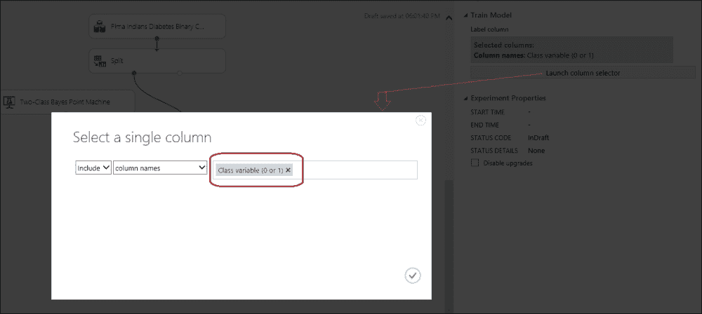

接下来，将**得分模型**和**评估模型**模块拖动到画布上。将**训练模型**模块的输出连接到**得分模型**模块的第一个输入，将**分割**模块的第二个输出连接到**得分模型**模块的第二个输入。然后，将**得分模型**模块的输出连接到**评估模型**模块的第一个输入。让我们看看下面的截图：

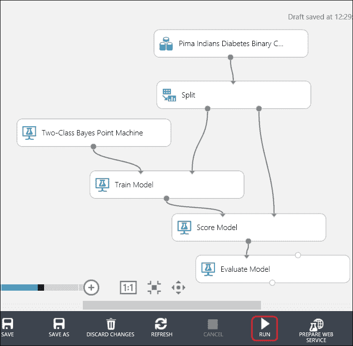

点击**运行**并运行实验。当它完成后（所有模块都得到绿色勾号后），右键单击**评估模型**模块的输出，并点击**可视化**选项来查看**评估结果**，如下面的截图所示：

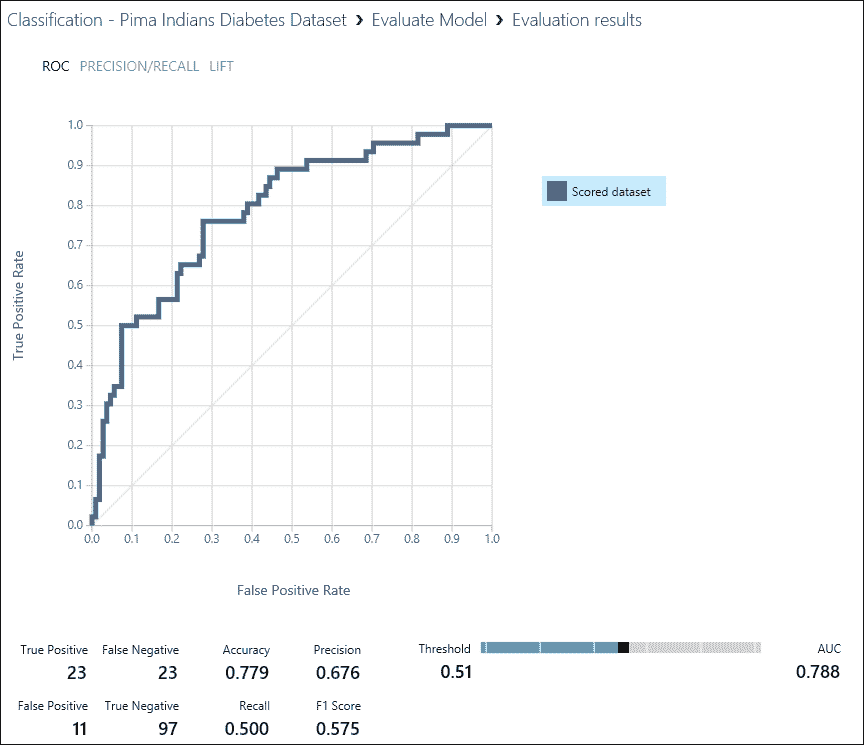

默认情况下，图表显示 ROC 曲线。它覆盖的面积越大，模型的性能越好。这由矩阵 AUC 表示。AUC，如你在这里可以看到的，是**0.788**。

注意**阈值**滚动条，目前设置为**0.51**，默认值为**0.5**。你可以通过将其拖动到左边或右边来增加或减少它。当你改变阈值值时，除了 AUC 之外的所有指标都会改变。原因很明显，因为当真实正例和真实负例的值发生变化时，其余的值也会变化。在当前值下，**阈值**（**0.51**）的**准确度**选项设置为**77.9**百分比。

你也可以通过点击屏幕左上角相应的标签来查看精确度/召回率和提升图。

## 带参数扫描的双类神经网络

我们将使用与使用神经网络构建模型和通过参数扫描调整参数相同的糖尿病数据集。

创建一个新的实验。将相同的数据集拖动并连接到**分割**模块，就像你在上一节中所做的那样。将**0.8**设置为参数；第一个输出数据集的**行分数**分为 80-20，以获得你的训练集和测试集。

在屏幕左侧的模块面板中的搜索框中输入`Sweep`，当**扫描参数**模块出现时，将其拖动到画布上。然后，将**分割**模块的第一个输出连接到**扫描参数**模块的第二个输入，并将**分割**模块的第二个输出连接到**扫描参数**模块的第三个输入。让我们看看下面的截图：

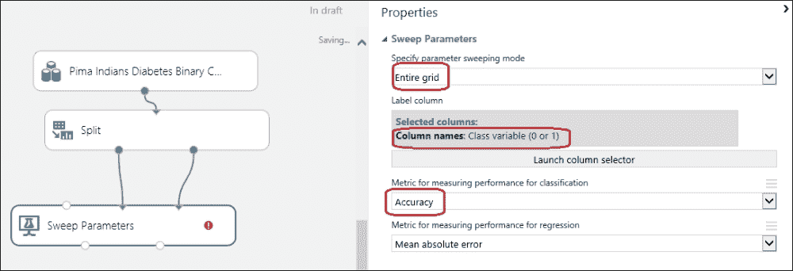

现在，你需要设置数据集的列，它是你的目标或标签或类别列，你将训练一个模型来进行预测。在这种情况下，**类别变量（0 或 1）**是你要进行预测的目标变量或类别。同时，将扫描模式设置为**整个网格**，将**用于分类性能度量的指标**设置为**准确率**。忽略其他参数，因为这是一个分类问题。

在左侧模块面板顶部的搜索框中输入`Two-Class Neural Network`，并将**双类神经网络**模块拖动到画布上。将其连接到**扫描参数**模块的第一个输入。像往常一样，将**评分模型**和**评估模型**模块拖动到画布上，并建立必要的连接。

将**扫描参数**模块的第二个输出端口连接到**评分模型**模块的第一个输入端口，并将**分割**模块的第二个输出连接到**评分模型**模块的第二个输入。然后，将**评分模型**模块的输出连接到**评估模型**模块的第一个输入。

运行实验。让我们看看下面的截图：

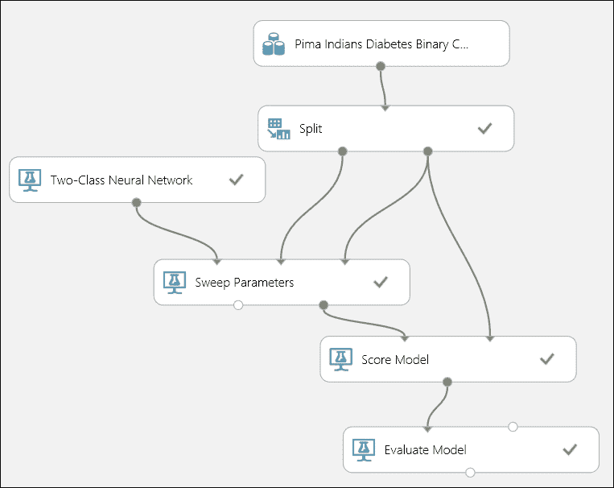

当实验运行完成后，可视化**评估模型**模块的输出以衡量模型的性能。注意 AUC 和准确率指标。

在使用参数扫描来寻找模型的最佳参数时，使用一个单独的数据集来评分和评估预测结果，而不是用于训练和参数调整的数据集，这是一个好的实践。为了说明这一点，你可以将你的数据集分成 60%和 40%。然后，使用另一个分割模块将 40%（第二个数据集）分成各 50%。现在，你有了三个数据集，分别包含原始数据集的 60%、20%和 20%。然后，使用前 60%和 20%用于**扫描参数**模块，其余 20%用于评分和评估。让我们看看下面的截图：

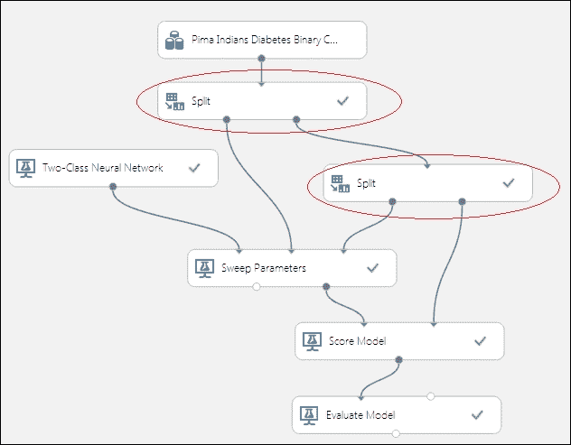

# 使用基于决策树的模型预测成人收入

ML Studio 提供了三个用于双分类的基于决策树的算法：**双分类决策森林**、**双分类提升决策树**和**双分类决策丛林**模块。这些被称为集成模型，其中多个决策树被组合起来以获得更好的预测性能。尽管这三个都是基于决策树的，但它们的底层算法不同。

我们将首先使用**双分类决策森林**模块构建一个模型，然后将其与**双分类提升决策树**模块进行比较，该模块用于**成人人口普查收入二分类数据集**，这是 ML Studio 中可用的样本数据集之一。该数据集是 1994 年美国人口普查数据库的子集，包含超过 16 岁年龄限制的在职成人的人口统计信息。数据集中的每个实例或示例都有一个标签或类变量，表示一个人是否每年赚 50K。

创建一个实验，将模块调色板中的**已保存数据集**组中的数据集拖到画布上。右键单击输出端口，然后单击**可视化**以探索数据集。当您单击不同的列时，可以发现这些列包含大量缺失值：**workclass**、**occupation**和**native-country**。其他列没有缺失值。让我们看一下以下截图：

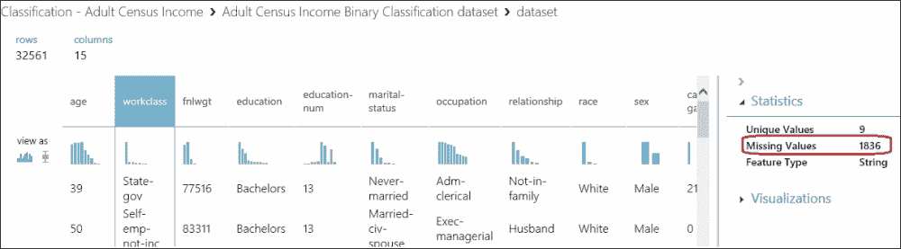

尽管如果仍然使用含有缺失值的模型仍然可以工作，但我们会在模型中去除这些列。缺失值可能会影响预测结果。

在搜索框中输入“项目”，将**项目列**模块拖到画布上。将数据集模块连接到该模块。在属性面板中，单击**启动列选择器**模块，以便弹出列选择器。如图所示，从所有列开始，排除具有缺失值的列：**workclass**、**occupation**和**native-country**：

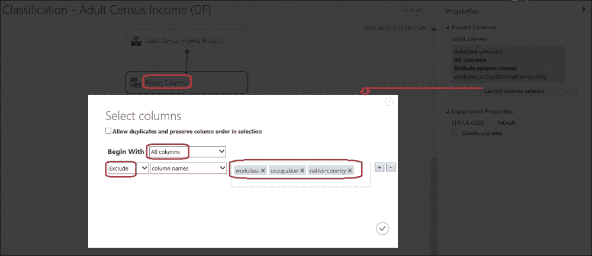

展开**数据转换**组，然后在模块调色板中展开**样本和拆分**选项，将**拆分**模块拖到画布上。将第一个输出数据集的**行分数**参数设置为**0.8**，其余的保留默认值。您正在拆分数据集，以便 80%的数据将用于训练，其余 20%将用于测试。

同样，现在将**双分类决策森林**模块拖到画布上。在模块调色板左侧的搜索框中输入“决策森林”，当模块出现时，将其拖到画布上。将**重采样方法**属性设置为**Bagging**，其余参数保留默认值。保留模块的默认属性值。

将**训练模型**模块拖动到画布上，并将**双分类决策森林**模块的输出端口连接到**训练模型**模块的第一个输入端口。将**分割**模块的第一个输出端口连接到**训练模型**模块的第二个输入端口。在**训练**模块的属性面板中，点击**列选择器**选项，将**收入**设置为列的目标变量。

接下来，将**评分模型**和**评估模型**模块拖动到画布上。将**训练模型**模块的输出连接到**评分模型**模块的第一个输入端口，并将**分割**模块的第二个输出端口连接到**评分模型**模块的第二个输入端口。然后，将**评分模型**模块的输出连接到**评估模型**模块的第一个输入端口。

运行实验，并在其成功执行后，可视化评估结果。让我们看一下下面的截图：

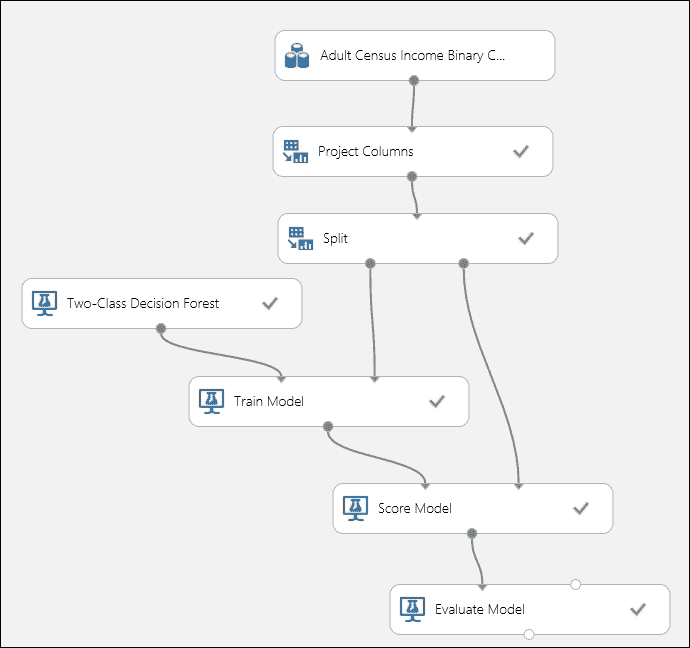

就像任何实验一样，你现在可以比较你的模型与另一个算法。你使用**双分类决策森林**模块构建了一个模型。现在，使用另一个算法，例如**双分类提升决策树**模块，并对其进行评估。

要这样做，首先从实验开始，通过按键盘上的*ctrl*键并点击两个模块来选择**训练**和**评分**模块。然后，通过右键单击它们并粘贴或直接按键盘上的*ctrl* + *v*来复制选定的模块，并将它们粘贴到画布上。它支持复制粘贴，就像任何其他 MS 产品一样，例如 MS Word。

现在，点击画布上的任何位置以取消选择粘贴的模块，并重新排列它们，以确保没有模块放置在另一个模块上，并且所有模块都易于阅读。通过选择它们并按*Delete*键来删除**双分类决策森林**和**训练模型**模块之间的连接。从左侧调色板中将**双分类提升决策树**模块拖动到画布上，并将模块的输出连接到**训练模型**模块。保留默认属性值。将**评分模型**模块的输出连接到**评估模型**模块的第二个输入端口，并运行实验。让我们看一下下面的截图：

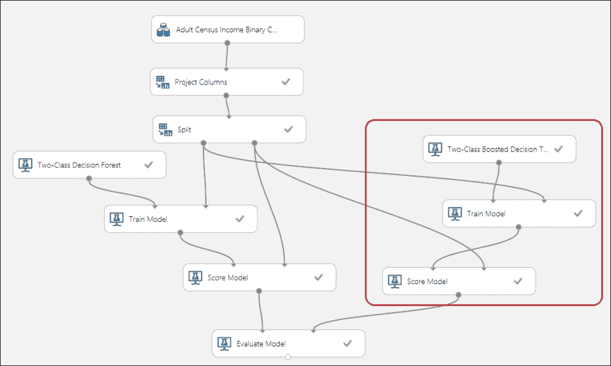

在成功运行后，右键单击**评估模型**模块的输出端口，并点击**可视化**以在单个画布上找到两个模型的评估结果。

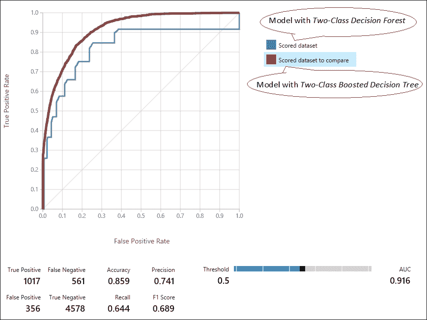

如前图所示，在当前设置下，当您看到 AUC 和准确度数值时，**双分类提升决策树**模块的模型值比其他模型更高。

因此，我们知道它的表现比其他模型更好。

# 自己动手 – 比较模型以选择最佳模型

您已经尝试了 **Adult Census Income Binary Classification 数据集模块** 的两种算法。现在，尝试另外两个模块以选择最适合您最终模型的模块：**双类提升决策树**和**双类神经网络**模块。尝试不同的参数；使用**参数扫描**模块来优化算法的参数。以下截图仅供参考——您的实验可能会有所不同。您还可以尝试其他可用的算法，例如**双类平均感知器**或**双类逻辑回归**模块以找到最佳模型。让我们看一下以下截图：

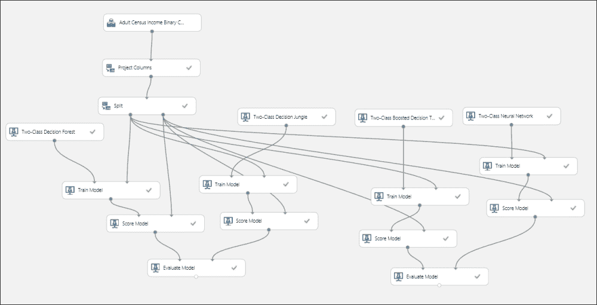

# 多类分类

您迄今为止所见和经历的分类是二类分类，其中目标变量可以是两类。在多类分类中，您将分类超过两类，例如，继续我们的假设肿瘤问题，对于一个特定肿瘤大小和患者年龄，您可能会预测以下三个类别之一作为患者患癌症的可能性：高、中、低。理论上，目标变量可以有任意数量的类别。

## 评估指标 – 多类分类

ML Studio 允许您使用以下公式计算模型的准确率：正确预测的数量与错误预测的数量之比。请参考以下表格：

| 年龄 | 肿瘤大小 | 实际类别 | 预测类别 |
| --- | --- | --- | --- |
| 32 | 135 | 低 | 中等 |
| 47 | 121 | 中等 | 中等 |
| 28 | 156 | 中等 | 高 |
| 45 | 162 | 高 | 高 |
| 77 | 107 | 中等 | 中等 |

以下可以是评估指标，其中列中的文本以粗体标记，并根据每个类别的准确率具有背景颜色。例如，有三个实际类别为中等，但只有两个被正确预测，因此*准确率 = 2/3 = 66.6%*。它还显示 33.3%的中等类别被错误地预测为高。这也被称为混淆矩阵。让我们看一下以下表格：

| 预测实际 | 低 | 中等 | 高 |
| --- | --- | --- | --- |
| **低** | 0 (0%) | 1 (100%) |   |
| **中等** |   | 2 (66.6%) | 1 (33.3%) |
| **高** |   |   | 1 (100%) |

# 使用 Iris 数据集进行的多类分类

**Iris** 数据集是经典且简单的数据集之一。它包含了关于 Iris 花的观察数据。每个实例有四个特征：萼片长度、萼片宽度、花瓣长度和花瓣宽度。所有测量值都是以厘米为单位。数据集包含三个目标变量的类别，每个类别代表一种 Iris 花的类型：**Iris Setosa**、**Iris Versicolour** 和 **Iris Virginica**。

你可以在[`archive.ics.uci.edu/ml/datasets/Iris`](http://archive.ics.uci.edu/ml/datasets/Iris)找到关于这个数据集的更多信息。

由于这个数据集在 ML Studio 中不是作为样本数据集存在的，你需要在构建任何模型之前使用读取模块将其导入 ML Studio。请注意，**Saved Dataset**部分中的**Iris 数据集**是原始数据集的子集，并且只包含两个类别。

## 多类决策森林

决策森林也适用于多类分类。我们将首先使用参数扫描来训练模型。

按照给定的步骤导入 Iris 数据集：

1.  前往 ML Studio。点击**+NEW**按钮并选择**Blank Experiment**。

1.  从模块面板中，在**Data Input and Output**组下找到**Reader**模块并将其拖拽到实验画布上。

1.  此后显示模块属性面板。选择数据源为**HTTP**。

1.  指定一个完整的 URL：[`archive.ics.uci.edu/ml/machine-learning-databases/iris/iris.data`](http://archive.ics.uci.edu/ml/machine-learning-databases/iris/iris.data)。

1.  将数据格式指定为**CSV**。

1.  不要勾选标题行复选框，因为数据集不包含任何标题。你可能会得到如下结果：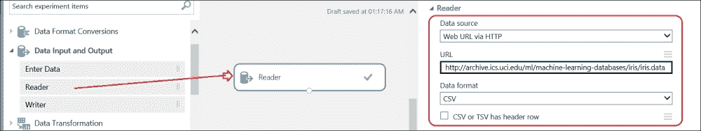

运行实验，当你看到**Reader**模块上的绿色勾选标记时，右键点击输出端口并点击**Visualize**。点击任何一列，你可以注意到 ML Studio 显示了一个缺失值。

使用**Clean Missing Data**模块来删除包含缺失值的行。将可以在**Data Transformation**组下，然后在模块面板的**Manipulation**下找到的模块拖拽到画布上。将**Reader**模块的输出端口连接到该模块的输入端口。在属性面板上，选择**Cleaning mode**的属性为**Remove entire row**，如图所示：

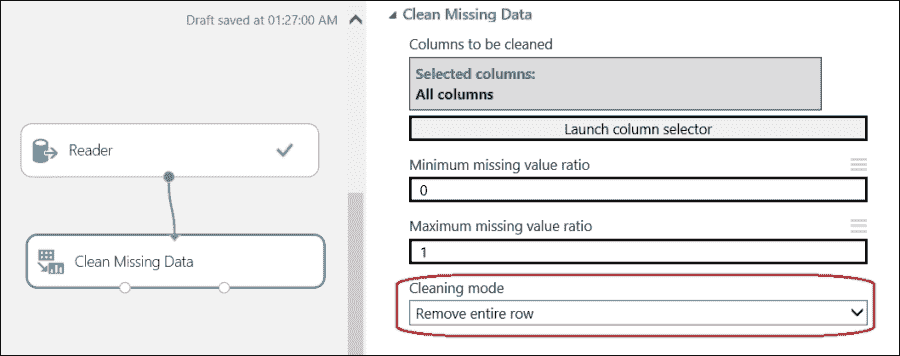

展开**Data Transformation**组，然后在模块面板中展开**Sample and Split**选项，并将**Split**模块拖拽到画布上。将第一个输出数据集的**Fraction of rows**参数设置为**0.7**，其余的保持默认值。这样你就在分割数据集，使得 70%的数据将用于训练，其余的 30%将用于测试。

同样，现在将**Multiclass Decision Forest**模块拖拽到画布上。要做到这一点，在左侧模块面板的搜索框中输入`Decision Forest`，当模块出现时，将其拖拽到画布上。将**Resampling method**属性设置为**Bagging**，其余属性保持默认值。保持模块的属性为默认值。

将一个 **Train Model** 模块拖动到画布上，并将 **Multiclass Decision Forest** 模块的输出端口连接到 **Train Model** 模块的第一个输入端口。将 **Split** 模块的第一个输出端口连接到 **Train Model** 模块的第二个输入。在 **Train Model** 模块的属性面板中，点击列选择器并将 **Col5** 设置为列的目标变量。

接下来，将 **Score Model** 和 **Evaluate Model** 模块拖动到画布上。将 **Train Model** 模块的输出连接到 **Score Model** 模块的第一个输入，并将 **Split** 模块的第二个输出连接到 **Score Model** 模块的第二个输入。然后，将 **Score Model** 模块的输出连接到 **Evaluate Model** 模块的第一个输入。让我们看一下下面的截图：

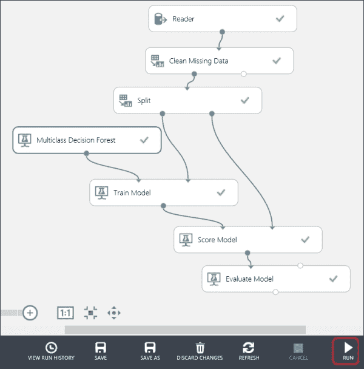

现在，运行实验，实验完成后，可视化 **Evaluate Model** 模块的输出以了解模型的性能。

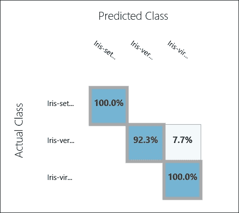

如前图所示，**Iris Versicolour** 类别的准确率为 **92.3**%，而其他类别均为 **100**%。此外，**7.7**% 的时间，**Iris Versicolour** 类别被错误地分类为 **Iris Virginica**。

注意，您还没有通过调整参数进行任何优化。您可以尝试不同的参数值来评估性能，或者简单地使用 **Sweep Parameters** 模块来获取最佳参数。

## 比较模型 – 多类决策森林和逻辑回归

就像任何实验一样，您现在可以比较您的模型与另一个算法。您使用多类决策森林构建了一个模型。现在，使用另一个算法，例如多类逻辑回归来评估预测。

要这样做，首先从实验开始，通过按键盘上的 *ctrl* 选择 **Train** 和 **Score** 模块，然后点击这两个模块。然后，通过在画布上右键单击并粘贴或直接按 *ctrl* + *v* 在键盘上粘贴来复制选定的模块。现在，点击画布上的任何位置以取消选择粘贴的模块，并重新排列它们，确保没有模块放置在另一个模块上，并且所有模块都易于阅读。让我们看一下下面的截图：

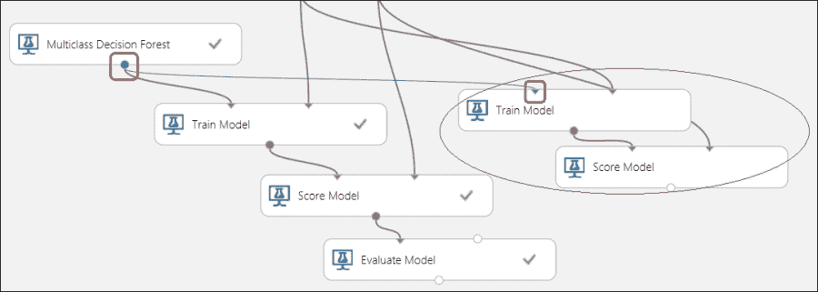

现在，通过选择连接并按 *Delete* 键来移除 **Multiclass Decision Forest** 和 **Train Model** 模块之间的连接。注意前面的截图中的连接。从左侧调色板中将 **Multiclass Logistic Regression** 模块拖到画布上，并将模块的输出连接到 **Train Model** 模块。将 **Multiclass Logistic Regression** 模块的属性保留为默认值。将 **Score Model** 模块的输出连接到 **Evaluate Model** 模块的第二个输入。让我们看看下面的截图：

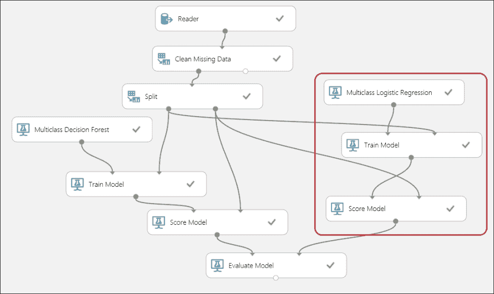

你可以运行模型以找出新模型的性能，然后你可以比较评估指标。实验运行完成后，可视化 **Evaluate Model** 模块的输出以了解模型的性能。

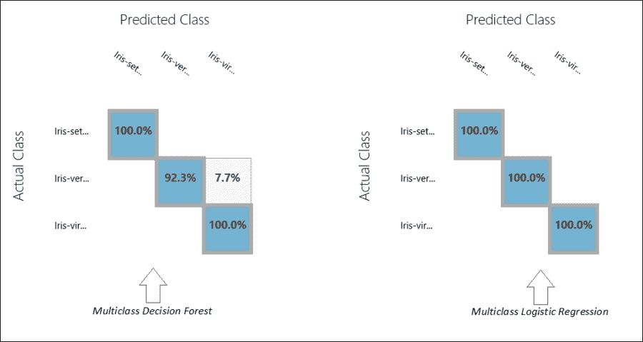

正如你可以注意到的，对于逻辑回归模型，你在所有类别中都得到了 **100%** 的准确率。在这种场景下，你知道应该选择哪个模型。

# 使用 Wine 数据集进行多类分类

**Wine** 数据集是另一个经典且简单的数据集，托管在 UCI 机器学习仓库中。它包含了对在意大利同一地区种植的但来自三个不同品种的葡萄酒内容的化学分析。它通过预测葡萄酒的来源（品种）作为类别或目标变量来确定分类问题的模型。该数据集具有以下 13 个特征（因变量），它们都是数值型：

+   酒精

+   马来酸

+   灰分

+   灰分的碱性

+   镁

+   总酚

+   黄烷醇

+   非黄烷醇酚

+   原花青素

+   颜色强度

+   色调

+   稀释葡萄酒的 OD280/OD315

+   精氨酸

示例或实例被分为三个类别：1、2 和 3。

你可以在 [`archive.ics.uci.edu/ml/datasets/Wine`](http://archive.ics.uci.edu/ml/datasets/Wine) 上找到更多关于数据集的信息。

## 带参数扫描的多类神经网络

我们将使用多类神经网络构建模型，并使用 **Sweep Parameter** 模块优化参数。

如同上次一样，使用 **Reader** 模块从 [`archive.ics.uci.edu/ml/machine-learning-databases/wine/wine.data`](http://archive.ics.uci.edu/ml/machine-learning-databases/wine/wine.data) 导入数据集。

它是 CSV 格式，没有标题行，如下面的截图所示：

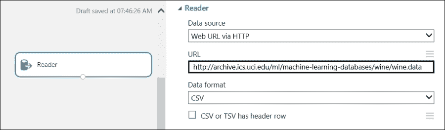

使用 **Split** 模块，将其分割为 70:30 的比例，分别用于训练数据和测试数据集。

在左侧模块调色板中的搜索框中输入`Sweep`，当出现**Sweep Parameters**模块时，将其拖动到画布上。然后，将**Split**模块的第一个输出连接到**Sweep Parameters**模块的第二个输入，并将**Split**模块的第二个输出连接到**Sweep Parameters**模块的第三个输入。

现在，你需要设置数据集的列，这是你的目标列、标签列或类别列，你将训练模型进行预测。在这种情况下，**Col1**是你要进行预测的目标变量或类别。同时，将扫描模式设置为**Entire grid**，以测量**Classification to Accuracy**选项的性能指标。

此外，获取**Multiclass Neural Network**模块并将其连接到**Sweep Parameters**模块的第一个输入。像往常一样，将**Score Model**和**Evaluate Model**模块拖动到画布上。将**Sweep Parameters**模块的第二个输出端口连接到**Score Model**模块的第一个输入端口，并将**Split**模块的第二个输出连接到**Score Model**模块的第二个输入端口。然后，将**Score Model**模块的输出连接到**Evaluate Model**模块的第一个输入。

运行实验。

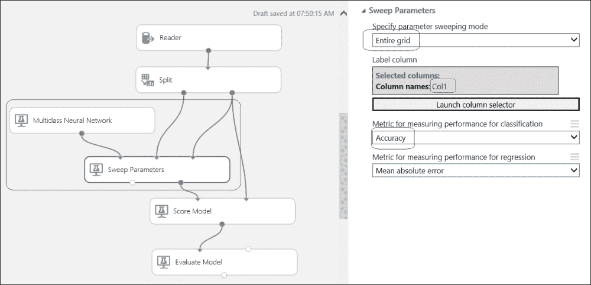

当实验运行完成后，可视化**Evaluate Model**模块的输出，以了解模型的性能。

## 自己动手做——多类决策丛林

使用相同的 Wine 数据集，并使用**Multiclass Decision Jungle**模块构建模型。你可以使用 Sweep Parameters 模块来优化算法的参数。在运行实验后，检查评估指标。你是否发现与之前使用神经网络或其他可用算法构建的模型相比，性能有所提升？

# 摘要

你以理解使用分类进行预测分析开始本章，并探讨了训练、测试和验证分类模型的概念。然后，你继续在 ML Studio 中使用不同的两类和多类分类模型进行实验，例如逻辑回归、决策森林、神经网络和提升决策树。你学习了在训练后如何评分和评估模型。你还学习了如何通过 Sweep Parameters 模块优化学习算法的不同参数。

在探索了两类分类之后，你理解了多类分类，并学习了如何评估相同的模型。然后，你使用不同的可用算法为多类分类构建了几个模型。

在下一章中，你将探索使用聚类（一种无监督学习算法）构建模型的过程。
