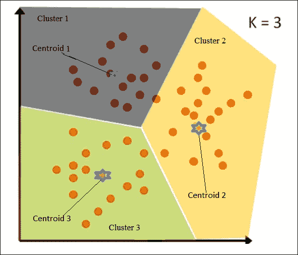
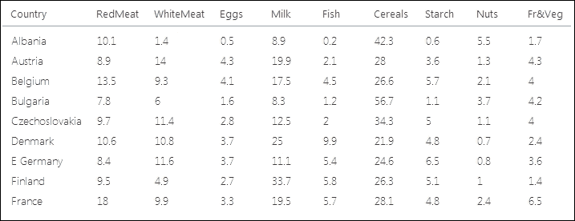
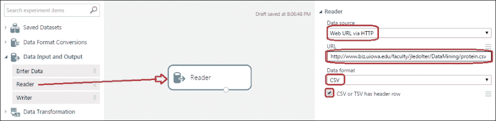
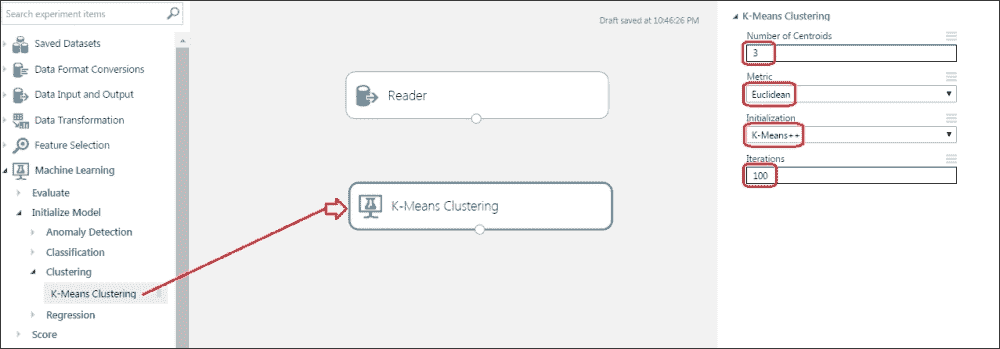
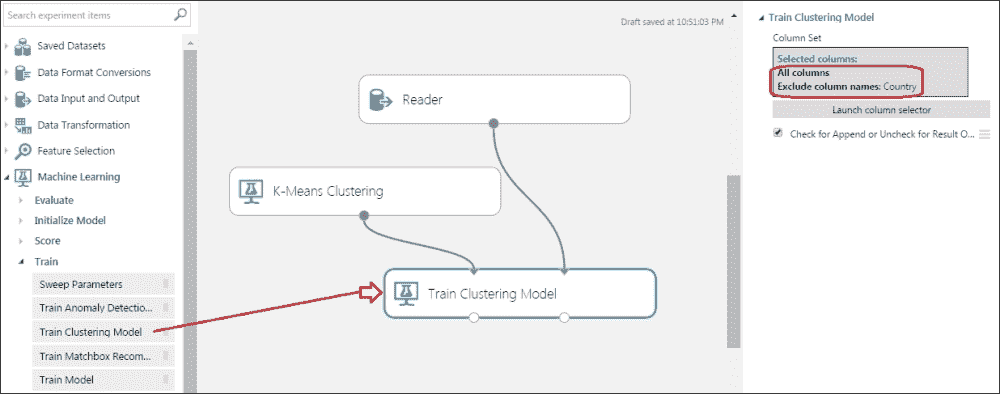
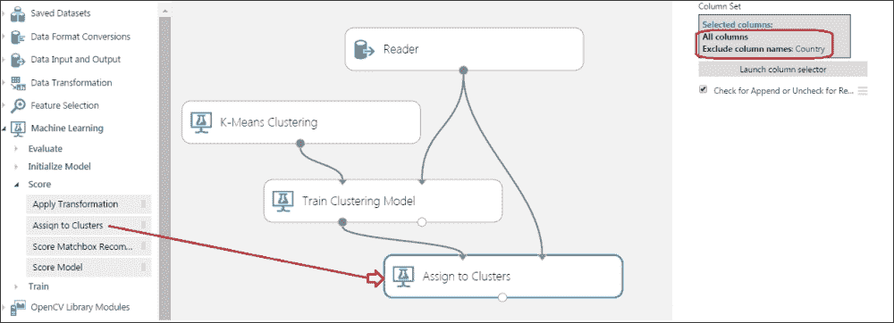
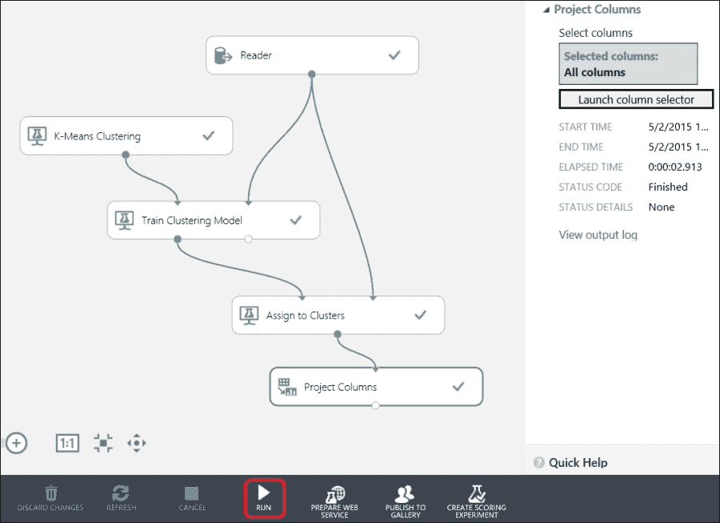
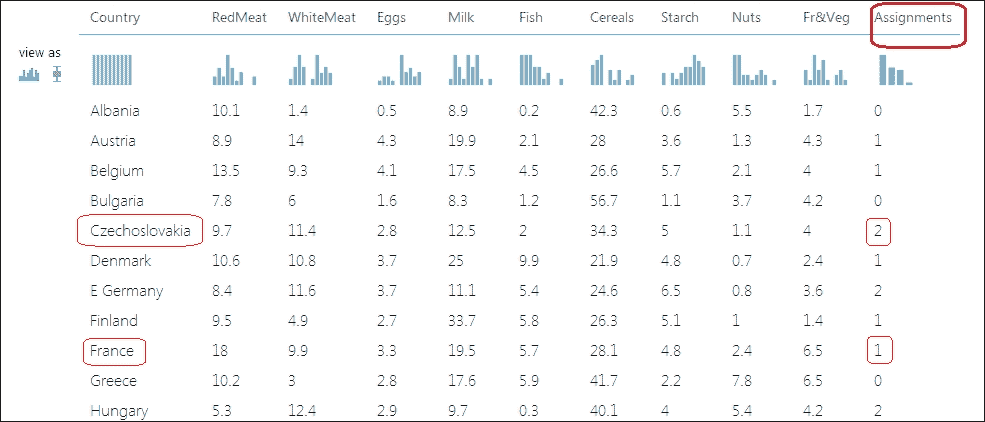

# 第八章。聚类

物以类聚——聚类就是关于这个。它是一种无监督学习，其中类别或标签是未知的。因此，你得到一个数据集，然后使用算法，将实例划分并分组到不同的聚类中，目的是将所有相似的实例放在一起。

聚类有许多不同的应用领域，例如客户细分、社交网络分析、计算生物学等等。

在本章中，你将开始了解**K-means 聚类**算法，然后你将学习如何使用 ML Studio 构建模型。

# 理解 K-means 聚类算法

K-means 聚类算法是最受欢迎的聚类算法。它简单而强大。正如其名所示，该算法从数据集中创建 K 个聚类，其中 *K* 是你决定的数字。为了简化，让我们考虑一个具有两个特征的数据集，并将它们绘制在二维空间中，一个特征在 *x* 轴上，另一个在 *y* 轴上。再次注意，由于聚类是一个无监督学习问题，不需要标签、类别或依赖变量。

使用 K-means 算法，为 K 个聚类确定 K 个质心。一个聚类中的所有点都离其质心比离任何其他质心更近。

考虑 *K =3*，其中存在 3 个聚类和因此 3 个质心，正如你可以在下面的图中找到的那样。所以根据直觉，取任意一个点并计算其到三个质心的距离。该点将属于其质心最近的聚类。

对于一个点，让 *d1* 表示到质心 1 的距离，*d2* 表示到质心 2 的距离，*d3* 表示到质心 3 的距离。

如果 *d2 < d1* 并且 *d2 < d3*，那么离质心 2 最近的点属于聚类 2。让我们看一下下面的图解：

# 使用 ML Studio 创建 K-means 聚类模型

现在，是你自己构建聚类模型的时候了。ML Studio 提供了两个专门用于 K-means 聚类的模块。

网址 [`www.biz.uiowa.edu/faculty/jledolter/DataMining/protein.csv`](http://www.biz.uiowa.edu/faculty/jledolter/DataMining/protein.csv) 包含一个 CSV 格式的数据集。

它包含了来自 25 个欧洲国家的 9 种不同食物来源的蛋白质摄入量。数据集的前几个实例如下所示：

让我们构建一个聚类模型，根据来自不同来源的各国蛋白质摄入量将数据集分组到三个聚类中。

创建一个新的实验，并将**数据输入和输出**部分中的**Reader**模块从模块调色板拖动到画布左侧。在右侧的属性面板中，选择**数据源**为**通过 HTTP 的 Web URL**，**数据格式**为**CSV**，并勾选**CSV 或 TSV 有标题行**的复选框。此外，在 URL 文本框中，添加之前提到的 CSV 文件的 URL。

将**K-Means 聚类**模块拖动到画布上。此模块用于算法。由于你的数据集需要三个簇，请在属性面板中将**质心数量**选项设置为**3**，并保留其他参数为默认值，如图所示：

将**训练聚类模型**模块拖动到画布上并建立连接，如图所示。对于数据集中的**国家**列，你的目标是让算法基于蛋白质摄入量工作。因此，排除该列，包含其他所有内容。

将**分配到簇**模块拖动到画布上并建立连接，如图所示。排除**国家**列，包含其他所有内容。

现在，拖动一个**项目列**模块，并将**分配到簇**模块的输出连接到其输入。通过在模块的属性面板中点击**启动列选择器**选项，选择**所有列**，如图所示：

运行实验，在**项目列**模块的输出端口上右键单击，并按以下方式分配簇来可视化输出：

输出表的最右侧是**分配**列，其中包含分配给每个簇的簇（编号）。正如你所见，我们发现不同的国家根据蛋白质摄入量落入三个簇之一，例如，**捷克斯洛伐克**属于簇 2，而**法国**属于簇 1。

在这里，你已经找到了相同训练数据的簇。然而，在训练后，你还可以找到新数据集的簇。

# 亲自动手

在 ML Studio 的**保存的数据集**选项下有一个名为**Iris Two Class Data**的样本数据集。使用这个数据集构建一个**K-Means 聚类**模型，其中*K（质心数量）= 2*。

这不是一个测试，但你注意到一个类别的所有实例都落在同一个簇中吗？不要混淆簇编号为*0*和*1*，因为它只是一个数字，即使你把簇 0 读作 1，把*1*读作*0*，也不会造成伤害。

# 聚类与分类

对于初学者来说，区分聚类问题和分类问题可能会感到困惑。分类与聚类在本质上是有区别的。分类是一个监督学习问题，其中你的类别或目标变量是已知的，用于训练数据集。算法被训练去观察例子（特征和类别或目标变量），然后你使用测试数据集对其进行评分和测试。

聚类作为一种无监督学习，它作用于没有标签或类变量的数据集。此外，你不需要使用测试数据集进行评分和测试。因此，你只需将你的算法应用于你的数据，并将它们分组到不同的簇中，比如 1、2 和 3，这些簇之前是未知的。

简单来说，如果你有一个数据集，并且有一个类别/标签或目标变量作为分类变量，你必须根据给定的数据集预测新数据集的目标变量，那么这是一个分类问题。如果你只得到一个没有标签或目标变量的数据集，并且你只需要将它们分成*n*个簇，那么这是一个聚类案例。

# 摘要

在对无监督学习进行快速概述之后，你继续了解聚类和 K-means 聚类算法。然后，你使用 ML Studio 构建了一个聚类模型，并了解了 K-means 聚类算法的三个模块。

在下一章中，你将探索推荐系统，并学习如何构建一个简单的模型。
