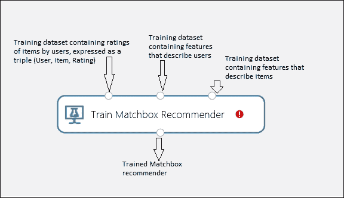
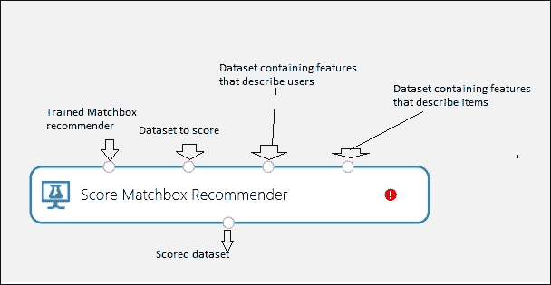
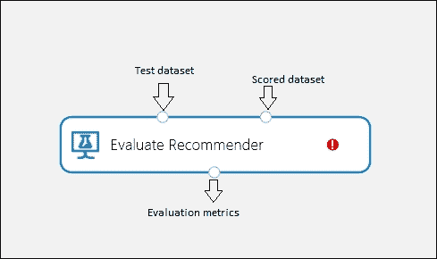
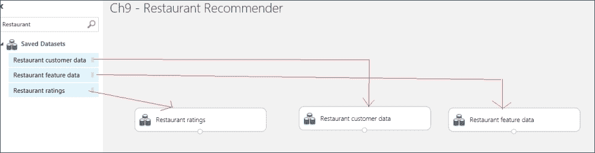
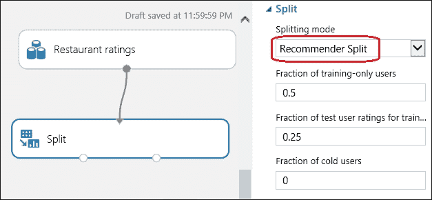
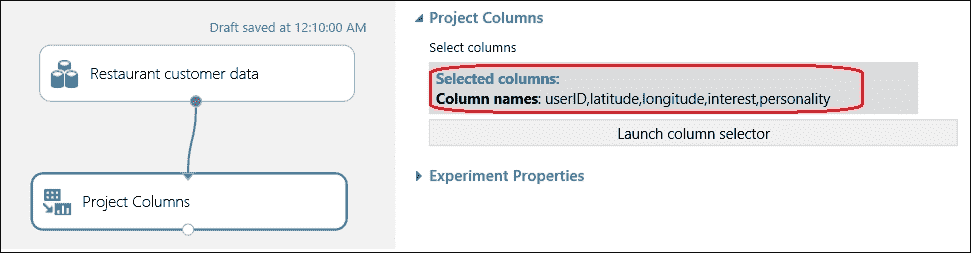
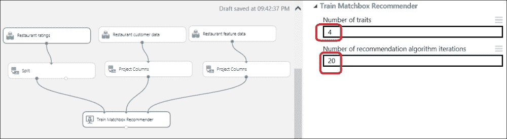
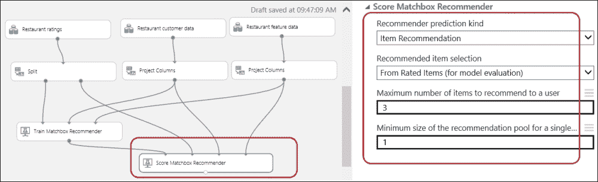
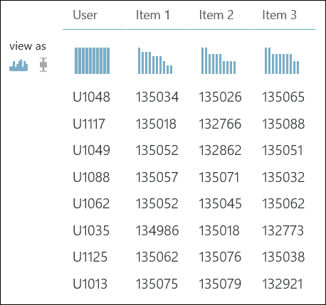
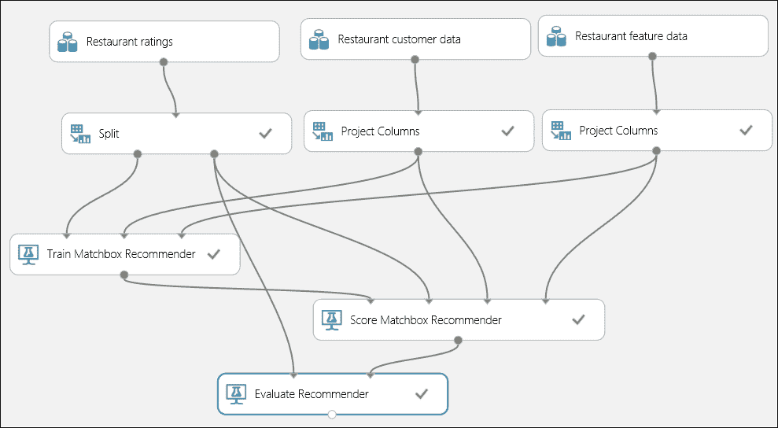

# 第九章。推荐系统

推荐系统如今很常见。您可能没有注意到，但您可能已经在某个地方成为这样的系统的一个用户或接收者。大多数表现良好的电子商务平台都使用推荐系统向用户推荐商品。当您在亚马逊网站上看到根据您之前的偏好、购买和浏览历史推荐给您一本书时，亚马逊实际上正在使用这样的推荐系统。同样，Netflix 使用其推荐系统为您推荐电影。

推荐器或推荐系统通常基于用户特征、偏好、历史等信息推荐产品或信息。因此，推荐总是个性化的。

直到最近，构建推荐系统并不容易或直接，但只要您准备好了数据，Azure ML 就能让您轻松构建一个推荐系统。

本章向您介绍了推荐系统的概念，以及 ML Studio 中可用的模型，供您构建自己的推荐系统。然后，它通过一个简单的示例引导您了解构建推荐系统的过程。

# Matchbox 推荐器

微软开发了一个基于概率模型（贝叶斯）的大规模推荐系统，称为**Matchbox**。该模型可以通过观察用户如何对物品（如电影、内容或其他产品）进行评分来了解用户的偏好。基于这些观察，当请求时，它会向用户推荐新的物品。

Matchbox 以最有效的方式使用每个用户可用的数据。它使用的学习算法专门为大数据设计。然而，其主要特点是 Matchbox 利用了用户和物品都可用到的元数据。这意味着它关于一个用户或物品所学习到的信息可以转移到其他用户或物品。

您可以在微软研究项目的链接中找到更多关于 Matchbox 模型的信息。

## 推荐类型

Matchbox 推荐器支持构建四种类型的推荐器，这几乎涵盖了所有场景。让我们看看以下列表：

+   **评分预测**：这会预测给定用户和物品的评分，例如，如果一部新电影上映，系统将预测您对该电影的评分（1-5 分）。

+   **物品推荐**：这会向给定用户推荐物品，例如，亚马逊建议您阅读书籍，或者 YouTube 建议您在主页上观看视频（尤其是当您登录时）。

+   **相关用户**：这会找到与指定用户相关联的用户，例如，LinkedIn 建议您可以与之建立联系的人，或者 Facebook 建议您添加的朋友。

+   **相关物品**：这会找到与指定物品相关的物品，例如，当您阅读博客文章时，博客网站会建议您阅读相关帖子。

## 理解推荐模块

Matchbox 推荐器包含三个组件；正如你可能猜到的，每个组件分别用于训练、评分和评估数据。模块描述如下。

### 训练 Matchbox 推荐器

此模块包含算法并生成训练好的算法，如下面的截图所示：

此模块接受以下两个参数的值。

#### 特质数量

此值决定了算法将学习多少与每个用户和项目相关的隐式特征（特质）。此值越高，预测将越精确，因为它会导致更好的预测。通常，它取值范围为 2 到 20。

#### 推荐算法迭代次数

这是算法遍历数据的次数。此值越高，预测将越好。通常，它取值范围为 1 到 10。

### 评分 Matchbox 推荐器

此模块允许您指定所需的推荐类型及其对应参数：

+   评分预测

+   项目预测

+   相关用户

+   相关项目

让我们看一下下面的截图：

模块的 ML Studio 帮助页面提供了所有对应参数的详细信息。

### 评估推荐器

此模块接受测试和评分数据集，并生成评估指标，如下面的截图所示：

它还允许您指定推荐类型，例如评分模块及其对应参数。

# 构建推荐系统

现在，学习自己构建一个将是有益的。我们将构建一个简单的推荐系统，为特定用户推荐餐厅。

ML Studio 包括三个样本数据集，如下所述：

+   **餐厅客户数据**：这是一组关于客户的元数据，包括人口统计信息和偏好，例如，**纬度**、**经度**、**兴趣**和**个性**。

+   **餐厅特征数据**：这是一组关于餐厅及其特征的元数据，例如食物类型、用餐风格和位置，例如，**地点 ID**、**纬度**、**经度**、**价格**。

+   **餐厅评分**：这包含了用户对餐厅在 0 到 2 的评分范围内的评分。它包含以下列：**用户 ID**、**地点 ID**和**评分**。

现在，我们将构建一个推荐器，为用户推荐一定数量的餐厅（**用户 ID**）。要构建推荐器，请执行以下步骤：

1.  创建一个新的实验。在模块调色板中的搜索框中输入“餐厅”。前三个数据集将被列出。依次将它们全部拖到画布上。

1.  将**Split**模块拖动并连接到**Restaurant ratings**模块的输出端口。在右侧的属性部分，选择**Splitting mode**为**Recommender Split**。其他参数保持默认值。

1.  将**Project Columns**模块拖动到画布上，并选择以下列：**userID**、**latitude**、**longitude**、**interest**和**personality**。

1.  类似地，拖动另一个**Project Columns**模块并将其连接到**Restaurant feature data**模块，并选择以下列：**placeID**、**latitude**、**longitude**、**price**、**the_geom_meter**、**address**和**zip**。

1.  将**Train Matchbox Recommender**模块拖动到画布上，并按照以下截图所示连接到三个输入端口：

1.  将**Score Matchbox Recommender**模块拖动到画布上，并按照以下截图所示连接到三个输入端口并设置属性值：

1.  运行实验，完成后，右键单击**Score Matchbox Recommender**模块的输出，然后单击**Visualize**以探索评分数据。

您可以从测试数据集中查看为用户推荐的不同的餐厅（ID）。下一步是评估评分预测。将**Evaluate Recommender**模块拖动到画布上，并将**Split**模块的第二个输出连接到其第一个输入端口，并将**Score Matchbox Recommender**模块的输出连接到其第二个输入端口。保持模块的默认属性。

再次运行实验，完成后，右键单击**Evaluate Recommender**模块的输出端口，然后单击**Visualize**以找到评估指标。

评估指标**归一化折现累积增益**（**NDCG**）是从测试集中给出的真实评分估计得出的。其值范围从*0.0*到*1.0*，其中*1.0*代表实体最理想的排序。

# 摘要

您从获取关于推荐系统的基本知识开始。然后您了解了 ML Studio 附带的 Matchbox 推荐器及其组件。您还探索了您可以使用它做出的不同类型的推荐。最后，您构建了一个简单的推荐系统，为特定用户推荐餐厅。

在下一章中，您将探索如何通过在 R 或 Python 中编写代码来扩展您的实验，使其超越 ML Studio 的能力。
