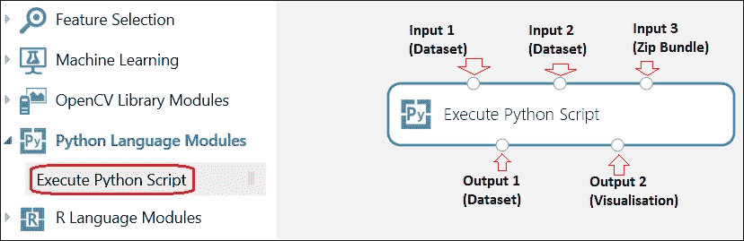
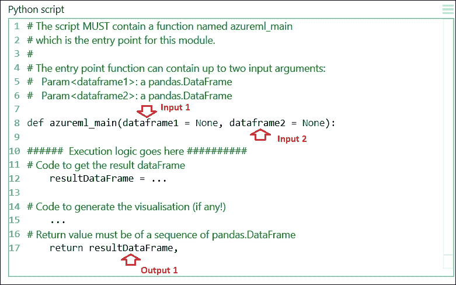
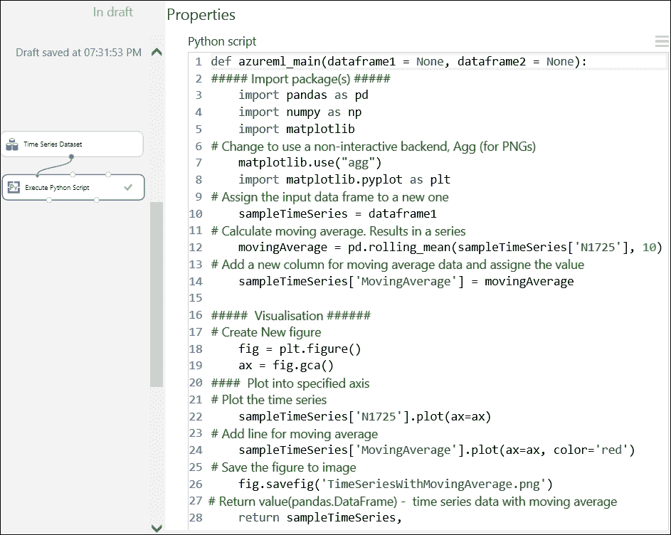
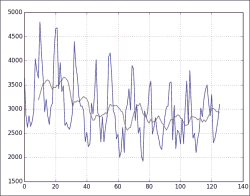
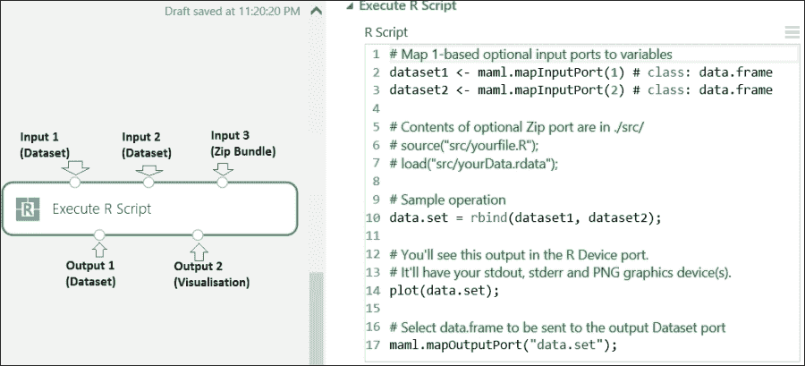
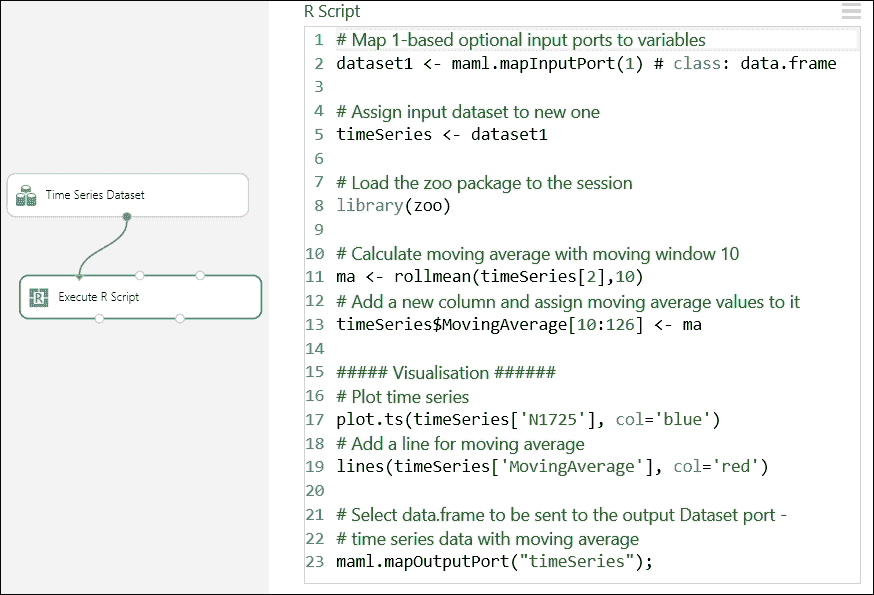
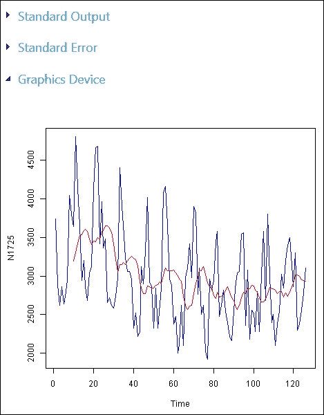

# 第十章. 使用 R 和 Python 扩展功能

你已经使用 ML Studio 构建了模型，并已经意识到它有多么简单和强大。尽管 ML Studio 中有大量的现成模块可用，但仍有许多任务无法在 ML Studio 内完成，以构建所需的模型和解决当前的问题。微软意识到这一点，因此允许你通过编写 R 或 Python 代码来扩展你的实验，超出 ML Studio 的功能。

本章介绍了将你的代码集成到实验中的过程。你不需要任何 Python 或 R 的先验技能就能成功完成本章。然而，如果你对这两种语言中的任何一种有所了解，你将能更好地利用这一点。此外，如果你想以专业水平使用 Azure ML，强烈建议你获得 R 或 Python 的某些技能。如果你已经了解 Python 或选择学习它，那么你应该接触 Pandas 库；特别是，你应该学习如何使用 `DataFrame` 模块，因为你很快就会知道为什么。如果你选择 R，那么 `data.frame` 是它的默认数据结构，你不可能错过它。

我不推荐你使用一种语言而不用另一种。如果你两种语言都不了解，这取决于你决定使用哪一种。本章接下来的部分为你提供了关于 Azure ML 的两种语言的快速介绍。

# R 语言简介

**R** 是一种开源的统计编程语言，近年来，它非常受欢迎。R 在全球拥有显著且活跃的社区，并且拥有丰富的库/包，每天都有新的添加。在 Azure ML 领域，R 是一等公民，这意味着它对该语言有原生支持。在众多数据结构中，R 有 `data.frame` 数据结构，可以假设它是一个具有行和列以及列标题的数据表。尽管存在差异，但你可以安全地将其视为 ML Studio 中的数据集。因此，每当在实验中将数据集传递给 R 代码时，它就隐式地转换为 `data.frame` 数据结构。

# Python 简介

**Python** 也是一种开源的通用、高级编程语言。这意味着它允许你执行其他功能，例如 Web/移动/桌面应用程序开发，以及科学、数学和统计编程。Python 在开发者中以及科学界（如统计社区的 R 语言）中都非常受欢迎。Python 在数据整理或清洗等任务中也非常流行，这大致是手动将数据从一种原始形式转换为另一种便于消费的格式的过程。对于这类任务，Python 中的 Pandas 库非常有用，并且被广泛使用。Pandas 库中的`DataFrame`对象类似于 R 中的`data.frame`数据结构以及 ML Studio 中的数据集。在 Azure ML 中，Microsoft 将这个库与基础 Python 和其他有用的库（如`NumPy`、`SciPy`、`Pandas`、`IPython`、`Matplotlib`等）一起提供。如果你已经熟悉 Python，那么你使用的是 Python 2.7.7 的**Anaconda**发行版。

Pandas 的`DataFrame`对象类似于 R 中的`data.frame`数据结构和 ML Studio 中的数据集。

# 为什么你应该通过 R/Python 代码进行扩展？

自从本章引入以来，你可能想知道，如果 ML Studio 看起来既简单又完整，那么为什么还需要通过编写代码来扩展它？如果你这样想，那么请让我向你保证，情况并非如此。为了生产适用于现实世界的预测分析解决方案，ML Studio 提供的现成功能非常有前景，但非常有限。以下是一些你可能需要编写代码并与 ML Studio 集成的常见场景：

+   ML Studio 中可用的算法集有限。如果需要某种算法来进行预测或评估，你需要编写代码并将其集成。例如，到目前为止，ML Studio 中还没有专门用于时间序列分析的算法。

+   虽然有一些选项可用，但大多数情况下，ML Studio 的现成模块无法满足探索和数据处理的需求，包括数据整理和预处理，例如，需要对数据进行小波变换的需求。

+   ML Studio 中的数据可视化支持非常有限，大多数数据可视化需求都无法通过它来满足。

+   当你需要从头开发一种全新的模型时，你可以通过编写代码来实现，然后将其发布为 Web API。

+   要从新的数据源或不同格式的数据集中获取数据，你需要编写代码并在 ML Studio 内部消费这些数据。

# 使用 Python 语言扩展实验

您可以通过名为**执行 Python 脚本**的模块扩展您的 Python 脚本实验。您可以通过处理时间序列数据集的示例来更深入地了解这个模块。ML Studio 附带一个名为**时间序列数据集**的样本数据集，这是一个非常简单的包含两列的时间序列数据集，其中一列代表时间作为整数，另一列显示值作为整数。

这个示例涉及在 Python 中编码，然后在 R 中编码，目的是展示代码集成的效果。尽管将通过嵌入的注释对代码进行一些解释，但可能不会涉及每个细节，因为这超出了本书的范围。如果您是编程新手，只需按照说明操作以获得所需输出并了解集成。

## 理解执行 Python 脚本模块

要将 Python 代码与 ML Studio 集成，您应该使用**执行 Python 脚本**模块，这是截至本书编写时唯一可用于 Python 的模块。此模块有三个输入端口和两个输出端口，如下面的截图所示：



虽然前两个输入是数据集，但第三个输入期望上传一个`.zip`文件到 ML Studio 以导入现有代码；您可以在以下子部分中了解更多信息。第一个输出生成可以用于另一个模块的数据集，第二个输出是生成的可视化，Python 设备，您只能右键单击并选择**可视化**来查看生成的图表。它支持控制台输出以及使用 Python 解释器显示 PNG 图形。

模块的属性部分附带一个非常基本的代码编辑器，您可以在其中编写代码。它还附带了一个基本的代码模板。模块必须包含一个名为`azureml_main`的函数，并且它应该有零到两个参数。该函数还必须返回一个`DataFrame`对象。让我们看一下以下截图，它显示了我们需要与 ML Studio 集成的 Python 代码：



如您所注意到的，输入数据集被转换为 Pandas 数据框。将数据集连接到输入端口不是必须的。当输入数据端口为空时，相应的输入数据框将具有值`None`或`null`。请注意，输入端口与函数参数之间的映射是位置性的，也就是说，如果连接了第一个输入端口，它将被映射到函数的第一个参数**dataframe1**，如果连接了第二个输入，它将被映射到函数的第二个参数**dataframe2**。

您需要确保 Python 代码有适当的缩进；否则，会导致错误。

### 使用 Python 创建可视化

你可以使用`Matplotlib`库或基于它的任何其他库创建数据可视化，并在浏览器中显示，就像 ML Studio 中的任何其他可视化一样。然而，创建的可视化不会自动重定向。你必须将它们保存为 PNG 文件，以便 ML Studio 可以拾取并使其通过`Execute Python Script`模块的第二个输出端口可用。使用`Matplotlib`库通过模块生成数据可视化的总体步骤如下：

+   将`Matplotlib`库后端从默认的基于 Qt 的渲染器更改为`agg`

+   使用 Matplotlib API 创建一个图形

+   获取坐标轴，并使用 Matplotlib API 或任何其他以 Matplotlib 为基础的绘图库（例如 Pandas）在同一个坐标轴上创建所有图表

+   将生成的图形保存为 PNG 文件

现在你已经了解了如何集成 Python 代码的概述，现在是时候带你通过一个示例了。

## 使用 Python 脚本的简单时间序列分析

**时间序列**是一系列数据点，每个数据点都与一个时间戳相关联，通常是在一个时间间隔内测量的。简单的时间序列分析是找到序列的移动平均。

移动平均或简单移动平均可以定义为一系列中前*n*个数据的平均值。在这里，*n*是窗口大小。考虑以下简单的时间序列数据，其中第一列是时间，第二列包含值，第三列计算窗口大小为 3 的移动平均。对于每个值，其移动平均是包括自身在内的前三个值的平均值：

| 时间 | 值 | 移动平均 = 前三个值的总和 / 3 |
| --- | --- | --- |
| 1 | 30 | - |
| 2 | 25 | - |
| 3 | 15 | (15+25+30)/3 = 23.3 |
| 4 | 45 | (45+15+25)/3 = 28.3 |
| 5 | 55 | (55+45+15)/3 = 38.3 |
| 6 | 5 | (5+55+45)/3 = 35.0 |
| 7 | 38 | (38+5+55)/3 = 32.7 |
| 8 | 13 | (13+38+5)/3 = 18.7 |
| 9 | 33 | (33+13+38)/3 = 28.0 |
| 10 | 31 | (31+33+13)/3 = 25.7 |

我们将使用`rolling_mean` Pandas 方法来计算窗口大小为 10 的移动平均，以演示 Python 脚本集成。我们将使用之前提到的 ML Studio 中的样本时间序列数据集，向数据集中添加一个新列，并通过计算其**简单移动****平均**为其赋值。让我们看看下面的截图：



代码中的注释是自解释的。如果你使用前面的代码运行你的实验，第一个输出将为你提供第三列包含移动平均值的修改后的数据集，第二个输出将为你提供以下可视化，其中红色线代表移动平均：



## 导入现有的 Python 代码

并非总是实际在一个脚本框中编写足够的代码来满足要求。也有可能您已经有一个构建并测试过的代码或外部库，您希望在 ML Studio 中使用。在这种情况下，您可以使用模块的第三个输入端口（Input3）。您可以将预构建的脚本保存在一个文件夹中，将其压缩，并上传到 ML Studio。它将在模块调色板的 **保存数据集** 部分中可用。然后，将其拖到您的实验画布上，并将其连接到模块的第三个输入端口，即 Zip Bundle。Azure ML 执行框架将在运行时内部解压缩它，并将内容添加到 Python 解释器的库路径中。这意味着 `azureml_main` 入口点函数可以直接导入这些模块。

## 自己动手做 – Python

在前一个示例的数据框中添加另一列，用于移动标准差，并将其作为另一条线绘制。

### 小贴士

使用移动窗口函数 `rolling_std`。

# 使用 R 语言扩展实验

与 Python 类似，您也可以使用 R 代码/脚本在 ML Studio 内部扩展您的实验。然而，与 Python 不同，您有两个 R 模块，如下所示：

+   **执行 R 脚本模块**

+   **创建 R 模型模块**

## 理解执行 R 脚本模块

与 Python 模块类似，**执行 R 脚本** 模块也有三个输入端口和两个输出端口。模块的属性面板包含一个 R 脚本编辑器，您可以在其中输入代码，如下一个截图所示：



该模块附带一个示例脚本，如前一个截图所示。您可以使用 `maml.mapInputPort()` 方法，将端口号作为参数 1 用于 Input1，参数 2 用于 Input2，以将输入数据集作为 R `data.frame` 对象访问。

第三个输入期望上传一个 `.zip` 文件到 ML Studio 以导入现有代码。第一个输出生成一个可以在另一个模块中进一步使用的数据集，第二个输出是生成的可视化，R 设备，您可以通过右键单击它并点击 **可视化** 来查看生成的图形。它支持控制台输出和 R 解释器的 PNG 图形显示。您不需要采取任何额外步骤来通过模块的第二输出端口提供可视化，因为它将自动重定向。

记住，如果您导入使用 CSV 或其他格式的数据，您必须在将数据用于 R 模块之前将其转换为数据集。

## 使用 R 脚本进行简单的时序分析

我们将使用之前使用过的相同的时间序列示例，但这次使用 R 脚本。我们将使用名为 **zoo** 的 R 包中的函数，该包已经在 ML Studio 中可用。让我们看一下以下截图，它显示了我们将要集成到 ML Studio 中的 R 代码：



代码中的注释是自解释的。然而，请注意，在第 13 行，新列的移动平均值从第 10 个位置分配到最后的第 126 个位置。因为我们已经将移动窗口设置为 10，所以该列的前九个值将是空或缺失的。

如果您使用前面的代码运行实验，第一个输出将为您提供包含第三列移动平均值的修改后的数据集，第二个输出将为您提供以下可视化效果，其中红色线条代表移动平均：



## 导入现有的 R 代码

就像 Python 一样，您可以使用模块的第三个输入端口（Input3）来导入外部代码。您可以将预构建的脚本保存在一个文件夹中，ZIP 它，然后上传到 ML Studio。要上传 ZIP 文件到您的工作区，请点击 **新建**，点击 **数据集**，然后选择 **从本地文件** 和 **ZIP 文件** 选项。上传后，ZIP 文件将出现在 **已保存的数据集** 列表中。然后，将其拖到实验画布上，并将其连接到模块的第三个输入端口，即 Zip Bundle。ZIP 文件中的所有文件在运行时都将可用。如果 ZIP 文件中有目录结构，则将保留。ZIP 包中的根目录被称为 `src`。

例如，如果您已创建一个名为 `myExternalCode.R` 的 R 文件，将其 ZIP 成文件，并上传到 ML Studio，那么您可以从模块的脚本编辑器中访问它，如下所示：

```py
source("src/myExternalCode.R")
```

### 包含 R 包

如果您想在 ML Studio 中包含任何未预装的 R 包，那么您可以 ZIP 该包并上传。通常，R 包作为可下载的 ZIP 文件提供。如果您已经下载并解压了您代码中使用的 R 包，您需要再次 ZIP 该包，否则上传 R 包的原始 ZIP 文件到 ML Studio。您需要在 **执行 R 脚本** 模块中将 R 包作为自定义代码的一部分进行安装，并且该包将仅对您的实验进行安装。

## 理解 **创建 R 模型** 模块

**创建 R 模型** 模块可以用来创建未训练的模型，使用 R 代码。您可以使用基于 R 包或您的新实现的任何学习器来构建您的模型。

该模块将训练脚本和评分脚本，即两个用户定义的 R 脚本，作为属性部分的输入，根据这些输入，将构建模型。

在您创建模型后，您可以使用 **训练模型** 模块在类似于 ML Studio 中任何其他学习者的数据集上训练模型。然后，将其传递给 **评分模型** 模块以使用模型进行预测。然后，您可以保存训练好的模型，创建评分实验，并将其作为 Web 服务发布。

## DIY – R

让我们看看以下步骤，使用 R 编码来构建自己的测试：

1.  在数据框（在先前的示例中）中添加另一列来移动中位数，并将其作为另一条线绘制出来。

    ### 小贴士

    使用移动窗口函数 `rollmedian`。

1.  显示 ML Studio 中已安装的所有包。您可以使用以下代码：

    ```py
    data.set <- data.frame(installed.packages())
    maml.mapOutputPort("data.set")
    ```

# 摘要

在本章中，您已经完成了 ML Studio 中的一个非常重要的部分。您从 Azure ML 相关的 R 和 Python 介绍开始。您探讨了为什么您可能需要使用代码在 ML Studio 内部扩展实验的重要性。然后，您学习了如何在 ML Studio 内部执行 Python 脚本并导入已构建的代码。您通过一个简单的时序分析示例应用了同样的方法，并使用 Python 创建了可视化。在 Python 之后，您同样对 R 进行了探索，并执行了相同的时序分析任务，并使用 R 脚本绘制了图表。ML Studio 还提供了一个模块，除了运行脚本之外，还可以使用 R 构建完整的模型。

在下一章中，您将了解到如何从 ML Studio 内部的实验中部署模型作为 Web 服务 API，这可以在外部使用。
