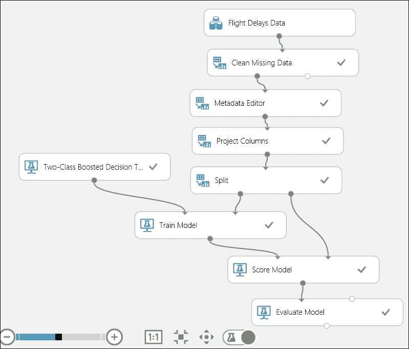
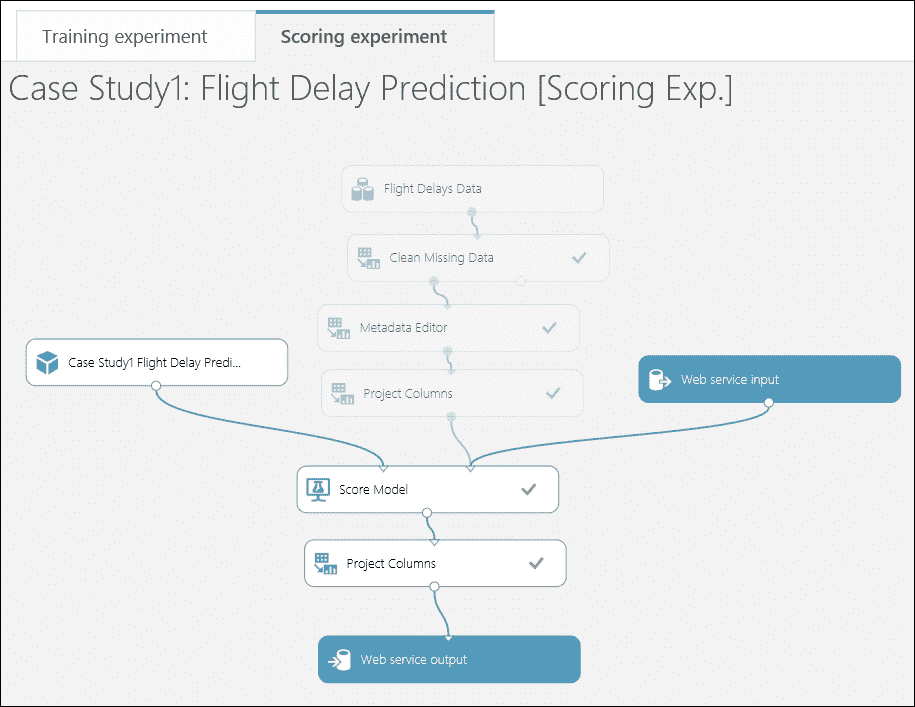

# 第十二章 案例研究练习 I

现在你已经对 Azure ML 有了相当的了解！是时候利用这些知识来研究一些现实世界的问题了。你可能现在还不能完全解决这些问题，但你可以尝试并提供某种形式的解决方案。

在本章中，我们将以案例研究的形式提出一个问题，并使用一个非常简单但端到端的方法来解决它。像之前的章节一样，它不会提供包含所有细节的逐步指南；然而，它只会为你提供解决问题的线索。本章假设你已经成功完成了所有前几章的阅读，或者已经了解 Azure ML。

# 问题定义和范围

如果你正在飞往某个地方，如果航班延误，那将是一个非常奇怪的经历。我们在这方面无能为力，但鉴于历史数据集，我们可以预测并提前知道某个航班是否会延误。这就是我们将作为案例研究解决的问题。

预测航班延误问题的完整解决方案将非常庞大，由于需要大量数据处理，它超出了本书的范围。然而，我们将通过限制数据集和简化解决方案来缩小范围。

# 数据集

我们将使用 ML Studio 默认提供的样本数据集。这是从**美国运输部**（**DOT**）的**TranStats**数据收集中提取的乘客航班准时性能数据的子集（[`www.transtats.bts.gov/DL_SelectFields.asp?Table_ID=236&DB_Short_Name=On-Time`](http://www.transtats.bts.gov/DL_SelectFields.asp?Table_ID=236&DB_Short_Name=On-Time)）。

该数据集已经预处理并筛选，仅包括 2013 年 4 月至 2013 年 10 月期间美国大陆上最繁忙的 70 个机场。它包含以下列：

+   **Carrier**：这包含由 IATA 分配的代码，通常用于识别一个承运人。

+   **OriginAirportID**（出发机场的机场 ID）：这是 DOT 分配的一个识别号，用于识别一个独特的机场。

+   **DestAirportID**（目的地机场的机场 ID）：这是 DOT 分配的一个识别号，用于识别一个独特的机场。

+   **CRSDepTime**：这是预定出发时间（当地时间，格式为 hh:mm）。

+   **DepDelay**：这是预定出发时间和实际出发时间之间的分钟数差异。提前出发显示为负数。

+   **DepDel15**（出发延误指示器）：这表示航班延误 15 分钟或更长时间（在此处，1=是）。

+   **CRSArrTime**：这是预定到达时间（当地时间，格式为 hh:mm）。

+   **ArrDelay**：这是预定到达时间和实际到达时间之间的分钟数差异。提前到达显示为负数。

+   **ArrDel15**（到达延误指示器）：这表示航班延误 15 分钟或更长时间（在此处，1=是）。

+   **Cancelled**：这是取消航班的指示符（在这里，1=是）。

### 注意

注意，已取消的航班已被视为延误，并设置为 *ArrDel15 = 1*。

根据我们的经验，我们知道航班时间经常受到天气条件的影响，因此收集和处理与出发和目的地机场相关的相关天气数据是有意义的。为了简化，我们在这里只考虑准时到达的航班数据集。然而，我们鼓励您进行实验，合并天气数据集，并准备您的数据集以构建模型。ML Studio 中默认包含一个**天气数据集**样本。

# 数据探索和准备

在您的实验中，拖动**Flight Delays Data**样本数据集，并点击**Visualize**选项来探索数据集。您会发现某些列有很多缺失值。您可以使用**Clean Missing Data**模块通过将其替换为**MICE**作为清理模式来清理缺失数据。

有一些列，如**DayOfWeek**、**OriginAirportID**和**DestAirportID**包含连续数字；然而，它们是分类变量。因此，使用**Metadata Editor**模块将它们设置为**Categorical**。

## 特征选择

在您开始开发模型之前，选择或生成一组具有最大预测能力的变量，并删除任何冗余和不那么重要的特征是非常重要的。在这种情况下，所有数据点都是同一年份的，因此年份列在这里不是必需的。我们感兴趣的是预测旅程开始前的延误，因此**DepDel15**和**DepDelay**列不是重要的。同样，**ArrDelay**和**ArrDelay15**列都是关于到达延误的。在这里，我们只对航班是否延误感兴趣。所以，**ArrDelay**是不需要的。所有取消的航班都被标记为延误，因此**Cancelled**列也是不必要的。您可以使用**Project Columns**模块过滤这些列，剩下的将是包含所需特征和标签的列。

# 模型开发

您必须预测航班是否会延误。如您从数据集中发现的那样，任何延误超过 15 分钟的航班都被标记为延误，并且相应的**ArrDelay15**标签包含**1**。在这里，**ArrDelay15**列是目标变量，它只包含**0**和**1**。显然，这是一个二分类问题。

如您所探索的那样，ML Studio 中提供了几种二分类算法。为了简化，我们在这里将使用**Two-Class Boosted Decision Tree**模块构建模型，以下是一些参数：

+   **每棵树的最大叶节点数**选项设置为**128**

+   **每个叶节点所需的最小样本数**选项设置为**50**

+   **学习率**选项设置为**0.2**

+   **构建的树的数量**选项设置为**500**

鼓励您尝试不同的算法，并使用**Sweep Parameters**模块来选择最佳参数。

为了训练模型，您需要将数据集拆分，并使用一部分进行训练，另一部分用于评分和评估。

您的实验在成功运行后可能看起来如下所示：

在您对实验满意且对训练模型满意后，您可以继续部署它，通过将其作为网络服务发布。

# 模型部署

在将您的模型作为网络服务发布之前，创建一个评分实验，并确保**Web 服务输入**和**Web 服务输出**模块已正确连接。如果您希望输出格式正确，例如，仅输出评分标签和输入到评分模型中可能不包含标签列；在这种情况下，您还可以在连接到**Score Model**模块的**Project Columns**模块中过滤**ArrDelay15**列以及其他列。让我们看一下以下截图：

然后，发布您的评分实验，以便它可以在预发布环境中作为网络服务使用。通过视觉和 Excel 测试您的网络服务。如果您擅长编程，鼓励您通过编写一个小型客户端程序来测试您的网络服务。

# 摘要

您已经在这个案例研究中完成了预测解决方案的构建。您从定义和理解问题开始本章。您获取了数据集，在这个案例中是 ML Studio 中可用的样本数据集。然后，您继续进行数据探索和准备，在构建预测模型之前。您使用了提升决策树来构建模型。在实验成功运行后，您创建了一个评分实验，并在其中使用了保存的训练模型。最后，您将实验作为网络服务发布并进行了测试。

在下一章中，您将学习如何构建自己的模型，其中包含另一个案例研究，您将解决一个回归问题。
