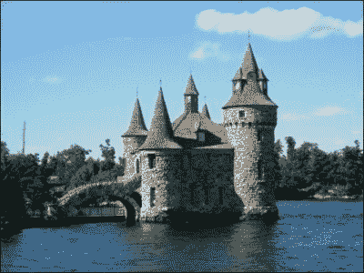
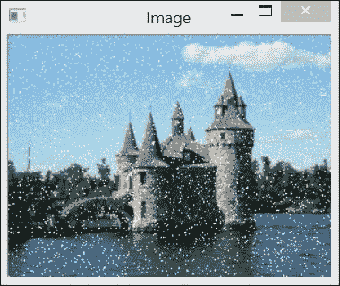
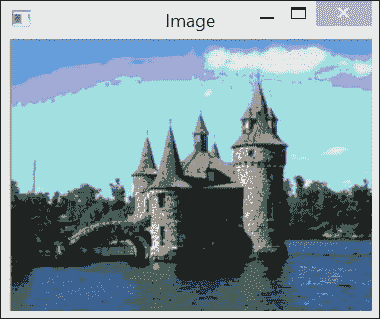
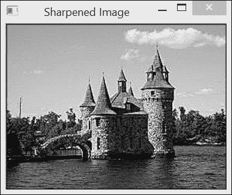
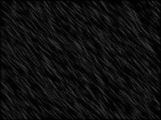
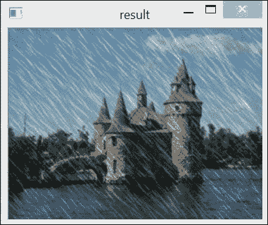
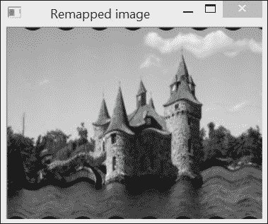

# 第二章. 操作像素

在本章中，我们将介绍以下食谱：

+   访问像素值

+   使用指针扫描图像

+   使用迭代器扫描图像

+   编写高效的图像扫描循环

+   使用邻接访问扫描图像

+   执行简单的图像算术

+   重映射图像

# 简介

为了构建计算机视觉应用，你需要能够访问图像内容，并最终修改或创建图像。本章将教你如何操作图像元素（也称为**像素**）。你将学习如何扫描图像并处理其每个像素。你还将学习如何高效地完成这项工作，因为即使是尺寸适中的图像也可能包含数十万个像素。

从本质上讲，图像是一个数值矩阵。这就是为什么，正如我们在第一章中学习的，“玩转图像”，OpenCV 2 使用`cv::Mat`数据结构来操作它们。矩阵中的每个元素代表一个像素。对于灰度图像（黑白图像），像素是无符号 8 位值，其中`0`对应黑色，`255`对应白色。在彩色图像的情况下，需要三个主要颜色值来重现不同的可见颜色。这是由于我们的视觉系统是**三原色**的；视网膜上的三种锥状细胞将颜色信息传递给大脑。这意味着对于彩色图像，每个像素必须关联三个值。在摄影和数字成像中，常用的主要颜色通道是红色、绿色和蓝色。在这种情况下，矩阵元素由三个 8 位值的组合组成。

注意，尽管 8 位通道通常足够，但在某些特殊应用中（例如医学成像）需要 16 位通道。

正如我们在上一章中看到的，OpenCV 还允许你创建具有其他类型像素值（例如，整数`CV_32U`或`CV_32S`）和浮点数（`CV_32F`）的矩阵（或图像）。这些对于存储某些图像处理任务中的中间值非常有用。大多数操作可以应用于任何类型的矩阵；其他操作需要特定的类型或仅与特定数量的通道一起工作。因此，为了避免常见的编程错误，理解函数或方法的先决条件至关重要。

在本章中，我们使用以下彩色图像作为输入（请参阅书籍的图形 PDF 以查看此图像的颜色）：



# 访问像素值

为了访问矩阵的每个单独元素，你只需指定其行和列号。相应的元素，在多通道图像的情况下可以是单个数值或值的向量，将被返回。

## 准备工作

为了说明对像素值的直接访问，我们将创建一个简单的函数，该函数向图像添加**盐和胡椒噪声**。正如其名所示，盐和胡椒噪声是一种特定的噪声，其中一些随机选择的像素被白色或黑色像素所替代。这种类型的噪声可能在通信故障中发生，当某些像素值在传输过程中丢失时。在我们的例子中，我们将简单地随机选择一些像素并将它们指定为白色。

## 如何做...

我们创建一个函数，该函数接收一个输入图像。这是我们函数将要修改的图像。第二个参数是我们想要覆盖白色值的像素数：

```py
void salt(cv::Mat image, int n) {

  int i,j;
  for (int k=0; k<n; k++) {

    // rand() is the random number generator
    i= std::rand()%image.cols;
    j= std::rand()%image.rows;

    if (image.type() == CV_8UC1) { // gray-level image

      image.at<uchar>(j,i)= 255; 

    } else if (image.type() == CV_8UC3) { // color image

      image.at<cv::Vec3b>(j,i)[0]= 255; 
      image.at<cv::Vec3b>(j,i)[1]= 255; 
      image.at<cv::Vec3b>(j,i)[2]= 255; 
    }
  }
}
```

前面的函数由一个循环组成，该循环将 `255` 的值赋给随机选择的像素 `n` 次。在这里，使用随机数生成器选择像素列 `i` 和行 `j`。请注意，使用 `type` 方法，我们区分了灰度图像和彩色图像的两种情况。在灰度图像的情况下，将 `255` 赋给单个 8 位值。对于彩色图像，您需要将 `255` 赋给三个主颜色通道，以获得白色像素。

您可以通过传递之前已打开的图像来调用此函数。请参考以下代码：

```py
   // open the image
   cv::Mat image= cv::imread("boldt.jpg");

   // call function to add noise
   salt(image,3000);

   // display image
   cv::namedWindow("Image");
   cv::imshow("Image",image);
```

生成的图像将如下所示：



## 它是如何工作的...

`cv::Mat` 类包括几个方法来访问图像的不同属性。公共成员变量 `cols` 和 `rows` 给出了图像中的列数和行数。对于元素访问，`cv::Mat` 有 `at` (`int y`, `int x`) 方法。然而，方法的返回类型必须在编译时已知，并且由于 `cv::Mat` 可以持有任何类型的元素，程序员需要指定预期的返回类型。这就是为什么 `at` 方法被实现为一个模板方法。因此，当您调用它时，您必须指定图像元素类型，如下所示：

```py
         image.at<uchar>(j,i)= 255;
```

需要注意的是，确保指定的类型与矩阵中包含的类型相匹配是程序员的职责。`at` 方法不执行任何类型转换。

在彩色图像中，每个像素都与三个组件相关联：红色、绿色和蓝色通道。因此，包含彩色图像的 `cv::Mat` 类将返回一个包含三个 8 位值的向量。OpenCV 为此类短向量定义了一个类型，称为 `cv::Vec3b`。这是一个包含三个**无符号字符**的向量。这解释了为什么对彩色像素的元素访问被写成如下所示：

```py
         image.at<cv::Vec3b>(j,i)[channel]= value; 
```

`channel` 索引指定了三个颜色通道中的一个。OpenCV 按顺序存储通道值：蓝色、绿色和红色（因此，蓝色是通道 `0`）。

类似向量类型也存在用于 2 元素和 4 元素向量（`cv::Vec2b` 和 `cv::Vec4b`）以及其他元素类型。例如，对于 2 元素浮点向量，类型名称的最后一个字母会被替换为 f，即 `cv::Vec2f`。对于短整数，最后一个字母被替换为 s，对于整数是 i，对于双精度浮点向量是 d。所有这些类型都是使用 `cv::Vec<T,N>` 模板类定义的，其中 `T` 是类型，`N` 是向量元素的数量。

最后一点，你可能对我们的图像修改函数使用按值传递的图像参数的事实感到惊讶。这是因为当图像被复制时，它们仍然共享相同的图像数据。因此，当你想要修改它们的内容时，并不一定需要通过引用传递图像。顺便提一下，按值传递的参数通常使编译器更容易进行代码优化。

## 还有更多...

`cv::Mat` 类是通过使用 C++ 模板定义的，使其成为泛型。

### `cv::Mat_` 模板类

使用 `cv::Mat` 类的 `at` 方法有时可能比较繁琐，因为每次调用时必须指定返回类型作为模板参数。在矩阵类型已知的情况下，可以使用 `cv::Mat_` 类，它是 `cv::Mat` 的模板子类。这个类定义了一些额外的方法但没有新的数据属性，以便一个类的指针或引用可以直接转换为另一个类。在这些额外的方法中，有 `operator()`，它允许直接访问矩阵元素。因此，如果 `image` 是一个对应于 `uchar` 矩阵的 `cv::Mat` 变量，那么你可以编写以下代码：

```py
  // use image with a Mat_ template
  cv::Mat_<uchar> im2(image);
  im2(50,100)= 0; // access to row 50 and column 100
```

由于 `cv::Mat_` 元素的类型是在变量创建时声明的，`operator()` 方法在编译时就知道要返回哪种类型。除了写起来更短之外，使用 `operator()` 方法提供的结果与 `at` 方法完全相同。

## 参见

+   *Scanning an image with pointers* 菜谱的 *There's more…* 部分解释了如何创建具有输入和输出参数的函数

+   *高效图像扫描循环编写* 菜谱提出了关于这种方法效率的讨论

# 使用指针扫描图像

在大多数图像处理任务中，你需要扫描图像中的所有像素以执行计算。考虑到需要访问的大量像素，以高效的方式执行此任务至关重要。本菜谱以及下一个菜谱将向您展示实现高效扫描循环的不同方法。本菜谱使用指针算术。

## 准备工作

我们将通过完成一个简单的任务来展示图像扫描过程：减少图像中的颜色数量。

彩色图像由 3 通道像素组成。这些通道中的每一个对应于三种主颜色之一——红色、绿色和蓝色的强度值。由于这些值中的每一个都是 8 位无符号字符，所以总共有`256x256x256`种颜色，这超过了一千六百万种颜色。因此，为了减少分析复杂性，有时减少图像中的颜色数量是有用的。实现这一目标的一种方法是将 RGB 空间简单地划分为大小相等的立方体。例如，如果你在每个维度上减少颜色的数量为`8`，那么你将获得总共`32x32x32`种颜色。原始图像中的每种颜色在颜色减少的图像中都被分配了一个新的颜色值，该值对应于它所属的立方体的中心值。

因此，基本的颜色减少算法很简单。如果`N`是减少因子，那么将每个像素的值除以`N`（整数除法，因此，余数被丢失），对于图像中的每个像素以及每个通道。然后，将结果乘以`N`；这将给出刚好低于输入像素值的`N`的倍数。只需加上`N/2`，就可以获得两个相邻的`N`倍数之间的区间的中心位置。如果你为每个 8 位通道值重复此过程，那么你将获得总共`256/N x 256/N x 256/N`种可能的颜色值。

## 如何操作...

我们的颜色减少函数的签名将如下所示：

```py
void colorReduce(cv::Mat image, int div=64);
```

用户提供一张图像和每通道的减少因子。在这里，处理是**就地**进行的，也就是说，输入图像的像素值通过函数被修改。有关更通用的函数签名，包括输入和输出参数的详细信息，请参阅此食谱的*更多内容…*部分。

处理很简单，只需创建一个双重循环，遍历所有像素值，如下所示：

```py
void colorReduce(cv::Mat image, int div=64) {

     int nl= image.rows; // number of lines
     // total number of elements per line
     int nc= image.cols * image.channels(); 

     for (int j=0; j<nl; j++) {

        // get the address of row j
        uchar* data= image.ptr<uchar>(j);

        for (int i=0; i<nc; i++) {

            // process each pixel ---------------------

            data[i]=    data[i]/div*div + div/2;

            // end of pixel processing ----------------

        } // end of line
     }
}
```

可以使用以下代码片段测试此函数：

```py
   // read the image
   image= cv::imread("boldt.jpg");
   // process the image
   colorReduce(image,64);
   // display the image
   cv::namedWindow("Image");
   cv::imshow("Image",image);
```

这将给出以下图像（请参考书籍的图形 PDF 查看此图像的颜色）：



## 它是如何工作的...

在彩色图像中，图像数据缓冲区的第一个三个字节给出左上像素的 3 个颜色通道的值，接下来的三个字节是第一行的第二个像素的值，依此类推（记住，OpenCV 默认使用 BGR 通道顺序）。一个宽度为`W`和高度为`H`的图像将需要一个`WxHx3`个`uchars`的内存块。然而，出于效率的考虑，行的长度可以通过添加一些额外的像素来填充。这是因为某些多媒体处理器芯片（例如，Intel MMX 架构）在它们的行是 4 或 8 的倍数时可以更有效地处理图像。显然，这些额外的像素不会被显示或保存；它们的精确值被忽略。OpenCV 将填充行的长度指定为有效宽度。显然，如果图像没有填充额外的像素，有效宽度将与实际图像宽度相等。我们已经了解到`cols`和`rows`属性给出了图像的宽度和高度；同样，`step`数据属性给出了以字节为单位的实际宽度。即使您的图像类型不是`uchar`，`step`数据也会给出每行的字节数。像素元素的大小由`elemSize`方法给出（例如，对于 3 通道短整数矩阵（`CV_16SC3`），`elemSize`将返回`6`）。回想一下，图像中的通道数由`nchannels`方法给出（对于灰度图像将是`1`，对于彩色图像将是`3`）。最后，`total`方法返回矩阵中的总像素数（即矩阵条目数）。

每行像素值的数量由以下代码给出：

```py
     int nc= image.cols * image.channels();
```

为了简化指针算术的计算，`cv::Mat`类提供了一个直接给出图像行地址的方法。这是`ptr`方法。它是一个模板方法，返回第`j`行的地址：

```py
     uchar* data= image.ptr<uchar>(j);
```

注意，在处理语句中，我们可以等效地使用指针算术从列到列移动。因此，我们可以编写以下代码：

```py
     *data= *data/div*div + div2; data++;
```

## 还有更多...

本食谱中提出的颜色减少函数提供了一种完成此任务的方法。您也可以使用其他颜色减少公式。该函数的更通用版本还可以指定不同的输入和输出图像。通过考虑图像数据的连续性，图像扫描也可以变得更加高效。最后，还可以使用常规的低级指针算术来扫描图像缓冲区。所有这些元素都在以下小节中讨论。

### 其他颜色减少公式

在我们的示例中，颜色减少是通过利用整数除法将除法结果向下取整到最接近的较低整数来实现的，如下所示：

```py
     data[i]= (data[i]/div)*div + div/2;
```

减少后的颜色也可以使用取模运算符来计算，这将我们带到 `div`（每通道缩减因子）的最接近的倍数，如下所示：

```py
     data[i]= data[i] – data[i]%div + div/2;
```

另一个选项是使用位运算符。确实，如果我们将缩减因子限制为 `2` 的幂，即 `div=pow(2,n)`，那么屏蔽像素值的第一个 `n` 位将给我们 `div` 的最接近的较小倍数。这个掩码可以通过以下简单的位移来计算：

```py
     // mask used to round the pixel value
     uchar mask= 0xFF<<n; // e.g. for div=16, mask= 0xF0
```

颜色缩减将由以下代码给出：

```py
      *data &= mask;      // masking
      *data++ += div>>1;  // add div/2
```

通常，位运算可能会导致非常高效的代码，因此当效率是一个要求时，它们可以构成一个强大的替代方案。

### 有输入和输出参数

在我们的颜色缩减示例中，转换直接应用于输入图像，这被称为就地转换。这样，不需要额外的图像来保存输出结果，这可以在内存使用成为关注点时节省内存。然而，在某些应用中，用户可能希望保持原始图像不变。在这种情况下，用户将被迫在调用函数之前创建图像的副本。请注意，创建图像的相同深度副本的最简单方法是调用 `clone` 方法；例如，看看以下代码：

```py
   // read the image
   image= cv::imread("boldt.jpg");
   // clone the image
   cv::Mat imageClone= image.clone();
   // process the clone
   // orginal image remains untouched
   colorReduce(imageClone);
   // display the image result
   cv::namedWindow("Image Result");
   cv::imshow("Image Result",imageClone);
```

通过定义一个函数，让用户选择是否使用就地处理，可以避免这个额外的重载。方法的签名将如下所示：

```py
void colorReduce(const cv::Mat &image, // input image 
                 cv::Mat &result,      // output image
                 int div=64);
```

注意，输入图像现在作为 `const` 引用传递，这意味着该图像不会被函数修改。输出图像作为引用传递，以便调用函数可以看到输出参数被此调用修改。当首选就地处理时，相同的图像被指定为输入和输出：

```py
colorReduce(image,image);
```

如果不是，可以提供一个另一个 `cv::Mat` 实例；例如，看看以下代码：

```py
cv::Mat result;   
colorReduce(image,result);
```

关键在于首先验证输出图像是否分配了与输入图像大小和像素类型匹配的数据缓冲区。非常方便的是，这个检查被封装在 `cv::Mat` 的 `create` 方法中。这是当矩阵必须用新的大小和类型重新分配时要使用的方法。如果矩阵已经指定了大小和类型，则不执行任何操作，该方法简单地返回而不修改实例。

因此，我们的函数应该简单地从调用 `create` 开始，构建一个与输入图像大小和类型相同的矩阵（如果需要）：

```py
     result.create(image.rows,image.cols,image.type());
```

分配的内存块大小为 `total()*elemSize()`。然后使用两个指针进行循环：

```py
   for (int j=0; j<nl; j++) {

        // get the addresses of input and output row j
        const uchar* data_in= image.ptr<uchar>(j);
        uchar* data_out= result.ptr<uchar>(j);

        for (int i=0; i<nc*nchannels; i++) {

            // process each pixel ---------------------

            data_out[i]= data_in[i]/div*div + div/2;

            // end of pixel processing ----------------

        } // end of line
  }
```

在输入和输出提供相同图像的情况下，此函数与本章中介绍的第一个版本完全等价。如果提供另一个图像作为输出，则无论在函数调用之前是否已分配图像，该函数都将正确工作。

### 连续图像的高效扫描

我们之前解释过，出于效率考虑，图像可以在每行的末尾填充额外的像素。然而，值得注意的是，当图像未填充时，它也可以被视为一个`WxH`像素的长一维数组。一个方便的`cv::Mat`方法可以告诉我们图像是否已填充。这是`isContinuous`方法，如果图像不包含填充像素则返回`true`。请注意，我们也可以通过以下测试来检查矩阵的连续性：

```py
// check if size of a line (in bytes)
// equals the number of columns times pixel size in bytes
image.step == image.cols*image.elemSize();
```

为了完整，此测试还应检查矩阵是否只有一行；如果是这样，则根据定义它是连续的。尽管如此，始终使用`isContinuous`方法来测试连续性条件。在某些特定的处理算法中，您可以通过在一个单一（更长）的循环中处理图像来利用图像的连续性。我们的处理函数将如下编写：

```py
void colorReduce(cv::Mat &image, int div=64) {

     int nl= image.rows; // number of lines
     int nc= image.cols * image.channels(); 

     if (image.isContinuous()) 
     {
        // then no padded pixels
        nc= nc*nl; 
        nl= 1;  // it is now a long 1D array
     }

     // this loop is executed only once
     // in case of continuous images
     for (int j=0; j<nl; j++) { 

          uchar* data= image.ptr<uchar>(j);

          for (int i=0; i<nc; i++) {

            // process each pixel ---------------------

            data[i]= data[i]/div*div + div/2;

            // end of pixel processing ----------------

          } // end of line                   
     }
}
```

现在，当连续性测试告诉我们图像不包含填充像素时，我们通过将宽度设置为`1`和高度设置为`WxH`来消除外循环。请注意，这里也可以使用`reshape`方法。在这种情况下，您将编写以下代码：

```py
     if (image.isContinuous()) 
     {
        // no padded pixels
        image.reshape(1,   // new number of channels
                      1); // new number of rows
     }

     int nl= image.rows; // number of lines
     int nc= image.cols * image.channels(); 
```

`reshape`方法在不要求任何内存复制或重新分配的情况下更改矩阵维度。第一个参数是新的通道数，第二个参数是新的行数。列数相应调整。

在这些实现中，内循环按顺序处理所有图像像素。这种方法在同时将多个小图像扫描到同一循环中时主要具有优势。

### 低级指针算术

在`cv::Mat`类中，图像数据包含在一个无符号字符的内存块中。该内存块第一个元素地址由返回无符号字符指针的数据属性给出。因此，为了从图像的开始处开始循环，您可以编写以下代码：

```py
uchar *data= image.data;
```

从一行移动到下一行可以通过使用有效宽度移动行指针来完成：

```py
data+= image.step;  // next line
```

`step`方法给出了每行中字节数的总数（包括填充像素）。通常，您可以按以下方式获取行`j`和列`i`的像素地址：

```py
// address of pixel at (j,i) that is &image.at(j,i)     
data= image.data+j*image.step+i*image.elemSize();    
```

然而，即使这种方法在我们的例子中可行，也不建议您这样操作。

## 参见

+   本章中关于*高效图像扫描循环*的配方提出了对这里提出扫描方法效率的讨论

# 使用迭代器扫描图像

在面向对象编程中，遍历数据集合通常使用迭代器。迭代器是专门构建的类，用于遍历集合中的每个元素，隐藏了针对特定集合的迭代方式。这种信息隐藏原则的应用使得扫描集合变得更加容易和安全。此外，它使得无论使用何种类型的集合，形式都相似。**标准模板库**（**STL**）与每个集合类关联一个迭代器类。OpenCV 提供了一个与 C++ STL 中找到的标准迭代器兼容的 `cv::Mat` 迭代器类。

## 准备工作

在这个菜谱中，我们再次使用前一个菜谱中描述的颜色减少示例。

## 如何操作...

获取 `cv::Mat` 实例的迭代器对象首先创建一个 `cv::MatIterator_` 对象。与 `cv::Mat_` 一样，下划线表示这是一个模板子类。确实，由于图像迭代器用于访问图像元素，返回类型必须在编译时已知。然后，迭代器声明如下：

```py
     cv::MatIterator_<cv::Vec3b> it;
```

或者，您也可以使用 `Mat_` 模板类内部定义的 `iterator` 类型，如下所示：

```py
     cv::Mat_<cv::Vec3b>::iterator it;
```

然后，您使用通常的 `begin` 和 `end` 迭代器方法遍历像素，但要注意，这些方法同样是模板方法。因此，我们的颜色减少函数现在编写如下：

```py
void colorReduce(cv::Mat &image, int div=64) {

     // obtain iterator at initial position
     cv::Mat_<cv::Vec3b>::iterator it= 
               image.begin<cv::Vec3b>();
     // obtain end position
     cv::Mat_<cv::Vec3b>::iterator itend= 
               image.end<cv::Vec3b>();

     // loop over all pixels
     for ( ; it!= itend; ++it) {
        // process each pixel ---------------------

       (*it)[0]= (*it)[0]/div*div + div/2;
       (*it)[1]= (*it)[1]/div*div + div/2;
       (*it)[2]= (*it)[2]/div*div + div/2;

        // end of pixel processing ----------------
     }
}
```

记住，这里的迭代器返回一个 `cv::Vec3b` 实例，因为我们正在处理彩色图像。每个颜色通道元素都是通过解引用运算符 `[]` 访问的。

## 它是如何工作的...

无论扫描哪种类型的集合，使用迭代器进行操作总是遵循相同的模式。

首先，您使用适当的专用类创建迭代器对象，在我们的例子中是 `cv::Mat_<cv::Vec3b>::iterator`（或 `cv::MatIterator_<cv::Vec3b>`）。

然后，您获得一个初始化在起始位置（在我们的例子中，是图像的左上角）的迭代器。这是通过 `begin` 方法完成的。对于 `cv::Mat` 实例，您可以通过 `image.begin<cv::Vec3b>()` 获取它。您也可以对迭代器进行算术运算。例如，如果您希望从图像的第二行开始，您可以将 `cv::Mat` 迭代器初始化为 `image.begin<cv::Vec3b>()+image.cols`。通过类似的方式，使用 `end` 方法获得集合的结束位置。然而，由此获得的迭代器仅位于集合外部。这就是为什么迭代过程必须在达到结束位置时停止。您也可以对迭代器进行算术运算；例如，如果您希望在最后一行之前停止，您的最终迭代将在迭代器达到 `image.end<cv::Vec3b>()-image.cols` 时停止。

一旦初始化了迭代器，您就创建一个循环，遍历所有元素直到达到末尾。一个典型的 `while` 循环如下所示：

```py
     while (it!= itend) { 

        // process each pixel ---------------------

        // end of pixel processing ----------------

        ++it;
     }
```

`++` 操作符是用来移动到下一个元素的。你也可以指定更大的步长。例如，`it+=10` 将每处理 `10` 像素一次。

最后，在处理循环内部，你使用解引用操作符 `*` 来访问当前元素，利用它可以读取（例如，`element= *it;`）或写入（例如，`*it= element;`）。请注意，也可以创建常量迭代器，如果你收到对 `const` `cv::Mat` 的引用，或者如果你希望表明当前循环不会修改 `cv::Mat` 实例。这些声明如下：

```py
     cv::MatConstIterator_<cv::Vec3b> it;
```

或者，它们可以这样声明：

```py
     cv::Mat_<cv::Vec3b>::const_iterator it;
```

## 更多...

在本节中，迭代器的起始和结束位置是通过使用 `begin` 和 `end` 模板方法获得的。正如我们在本章的第一个部分中所做的那样，我们也可以使用对 `cv::Mat_` 实例的引用来获得它们。这将避免在 `begin` 和 `end` 方法中指定迭代器类型，因为当创建 `cv::Mat_` 引用时已经指定了该类型。

```py
     cv::Mat_<cv::Vec3b> cimage(image);
     cv::Mat_<cv::Vec3b>::iterator it= cimage.begin();
     cv::Mat_<cv::Vec3b>::iterator itend= cimage.end();
```

## 参见

+   “编写高效的图像扫描循环”这一部分提出了关于迭代器在扫描图像时的效率的讨论。

+   此外，如果你不熟悉面向对象编程中迭代器的概念以及它们如何在 ANSI C++ 中实现，你应该阅读有关 STL 迭代器的教程。只需用关键词“STL Iterator”在网络上搜索，你将找到关于该主题的许多参考资料。

# 编写高效的图像扫描循环

在本章之前的部分中，我们介绍了不同的图像扫描方法，以便处理其像素。在本节中，我们将比较这些不同方法的效率。

当你编写图像处理函数时，效率通常是关注的焦点。当你设计你的函数时，你将经常需要检查你代码的计算效率，以检测任何可能减慢程序的处理瓶颈。

然而，重要的是要注意，除非必要，优化不应以牺牲程序清晰度为代价。简单的代码确实总是更容易调试和维护。只有对程序效率至关重要的代码片段才应该进行大量优化。

## 如何做...

为了测量函数或代码片段的执行时间，存在一个非常方便的 OpenCV 函数，称为 `cv::getTickCount()`。此函数给出自上次你启动计算机以来发生的时钟周期数。由于我们想要以秒为单位的代码片段的执行时间，我们使用另一种方法，`cv::getTickFrequency()`。这给我们每秒的周期数。为了获得给定函数（或代码片段）的计算时间，通常要使用的模式如下：

```py
const int64 start = cv::getTickCount();
colorReduce(image); // a function call
// elapsed time in seconds
double duration = (cv::getTickCount()-start)/
                               cv::getTickFrequency();
```

## 工作原理...

本章中`colorReduce`函数的不同实现方式的执行时间在此处报告。绝对运行时间数字会因机器而异（在这里，我们使用了一个配备 64 位 Intel Core i7 的 2.40 GHz 机器）。观察它们的相对差异相当有趣。这些结果还取决于用于生成可执行文件的特定编译器。我们的测试报告了将分辨率为 4288 x 2848 像素的图像颜色减少的平均时间。

首先，我们比较了在“使用指针扫描图像”配方中的“更多...”部分中提出的计算颜色减少的三个方法。有趣的是观察到，使用位运算符的公式在 9.5 毫秒时比其他方法快得多。使用整数除法的版本为 26 毫秒。然而，基于取模运算符的版本却为 33 毫秒。这代表了最快和最慢之间的超过 3 倍差距！因此，在图像循环中识别计算结果的最有效方式非常重要，因为其净影响可能非常显著。

当指定需要重新分配的输出图像而不是就地处理时，执行时间变为 29 毫秒。额外的时间代表了内存分配的开销。

在循环中，你应该避免重复计算那些可以预先计算的值。这显然会消耗时间。例如，你取以下颜色减少函数的内循环：

```py
 int nc= image.cols * image.channels();
 uchar div2= div>>1; 

 for (int i=0; i<nc; i++) {
```

然后，你将其替换为以下版本：

```py
 for (int i=0; i<image.cols * image.channels(); i++) {
 // . . .
 *data++ += div>>1;
```

之前的代码是一个需要反复计算一行中元素总数和`div>>1`结果的循环；你将获得 52 毫秒的运行时间，这比原始版本的 26 毫秒慢得多。然而，请注意，一些编译器可能能够优化这类循环，并仍然获得高效的代码。

如“使用迭代器扫描图像”配方中所示，使用迭代器的颜色减少函数版本在 52 毫秒时给出了较慢的结果。迭代器的主要目标是简化图像扫描过程，并使其更不容易出错。

为了完整性，我们还实现了一个使用`at`方法进行像素访问的函数版本。这个实现的主循环将简单地如下所示：

```py
for (int j=0; j<nl; j++) {
  for (int i=0; i<nc; i++) {

    // process each pixel ---------------------

    image.at<cv::Vec3b>(j,i)[0]=
               image.at<cv::Vec3b>(j,i)[0]/div*div + div/2;
    image.at<cv::Vec3b>(j,i)[1]=    
              image.at<cv::Vec3b>(j,i)[1]/div*div + div/2;
    image.at<cv::Vec3b>(j,i)[2]=    
              image.at<cv::Vec3b>(j,i)[2]/div*div + div/2;

    // end of pixel processing ----------------

  } // end of line
}
```

当获得 53 毫秒的运行时间时，这种实现方式会慢得多。因此，这种方法仅应用于图像像素的随机访问，而绝不应在扫描图像时使用。

通常，较短的循环，即使处理的元素总数相同，也比较长的单语句循环执行得更有效。同样，如果你需要对像素应用`N`种不同的计算，请在单个循环中应用所有这些计算，而不是编写`N`个连续的循环，每个循环对应一种计算。

我们还进行了连续性测试，对于连续图像，它产生一个循环，而不是常规的行和列的双循环。对于非常大的图像，如我们在测试中使用的图像，这种优化并不显著（25 毫秒而不是 26 毫秒），但总的来说，始终使用这种策略是一个好习惯，因为它可以带来速度的显著提升。

## 还有更多...

多线程是提高算法效率的另一种方式，尤其是在多核处理器的出现之后。**OpenMP**和**Intel Threading Building Blocks**（**TBB**）是两个在并发编程中用于创建和管理线程的流行 API。此外，C++11 现在提供了对线程的内置支持。

## 参见

+   *执行简单的图像算术*菜谱展示了使用 OpenCV 2 算术图像运算符的颜色减少函数（在*还有更多...*部分描述）的实现，其运行时间为 25 毫秒。

+   *将查找表应用于修改图像外观*菜谱（第四章，*使用直方图计数像素*）描述了一个基于查找表的颜色减少函数的实现。想法是预先计算所有强度减少值，从而将运行时间缩短到 22 毫秒。

# 使用邻居访问扫描图像

在图像处理中，通常有一个处理函数，它根据相邻像素的值在每个像素位置计算一个值。当这个邻域包括上一行和下一行的像素时，您就需要同时扫描图像的几行。这个菜谱向您展示了如何实现。

## 准备工作

为了说明这个菜谱，我们将应用一个锐化图像的处理函数。它基于拉普拉斯算子（将在第六章，*过滤图像*中讨论）。在图像处理中，确实有一个众所周知的结果，即如果你从图像中减去拉普拉斯算子，图像边缘会被增强，从而得到一个更清晰的图像。

这个锐化值是这样计算的：

```py
sharpened_pixel= 5*current-left-right-up-down;
```

在这里，`left`是位于当前像素左侧的像素，`up`是上一行的对应像素，依此类推。

## 如何实现...

这次，处理不能就地完成。用户需要提供一个输出图像。图像扫描使用三个指针完成，一个用于当前行，一个用于上一行，另一个用于下一行。此外，由于每个像素的计算都需要访问邻居，因此无法计算图像第一行和最后一行的像素以及第一列和最后一列的像素的值。循环可以写成如下：

```py
void sharpen(const cv::Mat &image, cv::Mat &result) {

   // allocate if necessary
  result.create(image.size(), image.type()); 
  int nchannels= image.channels(); // get number of channels

   // for all rows (except first and last)
  for (int j= 1; j<image.rows-1; j++) { 

    const uchar* previous= 
        image.ptr<const uchar>(j-1);     // previous row
    const uchar* current= 
        image.ptr<const uchar>(j);       // current row
    const uchar* next= 
        image.ptr<const uchar>(j+1);     // next row

    uchar* output= result.ptr<uchar>(j); // output row

    for (int i=nchannels; i<(image.cols-1)*nchannels; i++) {

       *output++= cv::saturate_cast<uchar>(
                  5*current[i]-current[i-nchannels]-
                  current[i+nchannels]-previous[i]-next[i]); 
    }
  }

  // Set the unprocessed pixels to 0
  result.row(0).setTo(cv::Scalar(0));
  result.row(result.rows-1).setTo(cv::Scalar(0));
  result.col(0).setTo(cv::Scalar(0));
  result.col(result.cols-1).setTo(cv::Scalar(0));
}
```

注意我们如何编写这个函数，使其能够在灰度图像和彩色图像上都能工作。如果我们将这个函数应用于测试图像的灰度版本，将得到以下结果：



## 它是如何工作的...

为了访问前一行和下一行的相邻像素，你只需定义额外的指针，并将它们共同递增。然后你在扫描循环中访问这些行的像素。

在计算输出像素值的过程中，调用了`cv::saturate_cast`模板函数。这是因为经常发生这样的情况，即应用于像素的数学表达式会导致结果超出允许的像素值范围（即低于 0 或超过 255）。解决方案是将这些值重新调整到这个 8 位范围内。这是通过将负值改为`0`和将值超过`255`改为`255`来实现的。这正是`cv::saturate_cast<uchar>`函数所做的事情。此外，如果输入参数是浮点数，则结果会被四舍五入到最接近的整数。显然，你可以使用这个函数与其他类型一起使用，以确保结果将保持在由该类型定义的限制内。

由于它们的邻域没有完全定义，无法处理的边界像素需要单独处理。在这里，我们只是将它们设置为`0`。在其他情况下，可能为这些像素执行特殊的计算，但大多数情况下，没有必要花费时间去处理这么少的像素。在我们的函数中，这些边界像素通过两种特殊方法设置为`0`。第一种是`row`，其对应的是`col`。它们返回一个特殊的`cv::Mat`实例，该实例由参数中指定的单行 ROI（或单列 ROI）组成（记住，我们在上一章中讨论了感兴趣区域）。这里没有进行复制，因为如果这个一维矩阵的元素被修改，原始图像中的元素也会被修改。这就是当调用`setTo`方法时我们所做的。这个方法将值赋给矩阵的所有元素。看看以下语句：

```py
   result.row(0).setTo(cv::Scalar(0));
```

前面的语句将结果图像的第一行的所有像素的值赋为`0`。在 3 通道彩色图像的情况下，你会使用`cv::Scalar(a,b,c)`来指定要分配给每个像素通道的三个值。

## 还有更多...

当在像素邻域内进行计算时，通常用核矩阵来表示这一点。这个核描述了参与计算的像素是如何组合以获得所需结果的。对于本食谱中使用的锐化滤波器，核将如下所示：

| 0 | -1 | 0 |
| --- | --- | --- |
| -1 | 5 | -1 |
| 0 | -1 | 0 |

除非另有说明，当前像素对应于核的中心。核中每个单元格的值代表一个乘以相应像素的因子。核应用于像素的结果是所有这些乘积的总和。核的大小对应于邻域的大小（在这里，3 x 3）。使用这种表示法，可以看出，正如锐化滤波器所要求的，当前像素的四个水平和垂直邻居乘以-1，而当前像素乘以 5。将核应用于图像不仅是一种方便的表示；它是信号处理中卷积概念的基础。核定义了一个应用于图像的过滤器。

由于滤波是图像处理中的常见操作，OpenCV 定义了一个特殊函数来执行此任务：`cv::filter2D`函数。要使用它，你只需要定义一个核（以矩阵的形式）。然后，使用图像和核调用该函数，并返回滤波后的图像。因此，可以很容易地重新定义我们的锐化函数如下：

```py
void sharpen2D(const cv::Mat &image, cv::Mat &result) {

   // Construct kernel (all entries initialized to 0)
   cv::Mat kernel(3,3,CV_32F,cv::Scalar(0));
   // assigns kernel values
   kernel.at<float>(1,1)= 5.0;
   kernel.at<float>(0,1)= -1.0;
   kernel.at<float>(2,1)= -1.0;
   kernel.at<float>(1,0)= -1.0;
   kernel.at<float>(1,2)= -1.0;

   //filter the image
   cv::filter2D(image,result,image.depth(),kernel);
}
```

这种实现产生的结果与上一个完全相同（并且具有相同的效率）。如果你输入一个彩色图像，那么相同的核将应用于所有三个通道。请注意，使用`filter2D`函数与大型核特别有利，因为它在这种情况下使用了一个更有效的算法。

## 参见

+   第六章，*图像滤波*，提供了更多关于图像滤波概念的说明

# 执行简单的图像算术

图像可以以不同的方式组合。由于它们是规则矩阵，它们可以相加、相减、相乘或相除。OpenCV 提供了各种图像算术运算符，它们的使用在本食谱中讨论。

## 准备中

让我们使用第二个图像，我们将使用算术运算符将其组合到输入图像中。以下表示这个第二个图像：



## 如何操作...

在这里，我们添加了两个图像。当我们想要创建一些特殊效果或在一个图像上叠加信息时，这很有用。我们通过调用`cv::add`函数，或者更准确地说，在这里调用`cv::addWeighted`函数来实现，因为我们想要一个加权求和，如下所示：

```py
   cv::addWeighted(image1,0.7,image2,0.9,0.,result);
```

操作结果产生了一个新的图像，如下面的截图所示：



## 工作原理...

所有二进制算术函数的工作方式相同。提供两个输入，第三个参数指定输出。在某些情况下，可以用作操作中的标量乘数的权重可以指定。这些函数中的每一个都有几种不同的形式；`cv::add`是许多形式中可用函数的一个好例子：

```py
   // c[i]= a[i]+b[i];
   cv::add(imageA,imageB,resultC); 
   // c[i]= a[i]+k;
   cv::add(imageA,cv::Scalar(k),resultC); 
   // c[i]= k1*a[1]+k2*b[i]+k3; 
   cv::addWeighted(imageA,k1,imageB,k2,k3,resultC);
   // c[i]= k*a[1]+b[i]; 
   cv::scaleAdd(imageA,k,imageB,resultC);
```

对于某些函数，你也可以指定一个掩码：

```py
   // if (mask[i]) c[i]= a[i]+b[i];
   cv::add(imageA,imageB,resultC,mask);
```

如果应用掩码，则仅对掩码值为非空的像素执行操作（掩码必须是单通道）。查看`cv::subtract`、`cv::absdiff`、`cv::multiply`和`cv::divide`函数的不同形式。位运算符（应用于像素二进制表示中每个单独位的运算符）也是可用的：`cv::bitwise_and`、`cv::bitwise_or`、`cv::bitwise_xor`和`cv::bitwise_not`。`cv::min`和`cv::max`运算符，它们找到每个元素的最大或最小像素值，也非常有用。

在所有情况下，始终使用`cv::saturate_cast`函数（参见前面的菜谱）来确保结果保持在定义的像素值域内（即避免溢出或下溢）。

图像必须具有相同的大小和类型（如果输出图像的大小不匹配输入大小，则将重新分配）。此外，由于操作是按元素进行的，可以使用其中一个输入图像作为输出。

还有一些仅接受单个图像作为输入的运算符：`cv::sqrt`、`cv::pow`、`cv::abs`、`cv::cuberoot`、`cv::exp`和`cv::log`。实际上，对于您必须应用于图像像素的几乎任何操作，都存在 OpenCV 函数。

## 还有更多...

还可以在`cv::Mat`实例或`cv::Mat`实例的各个通道上使用常规的 C++算术运算符。以下两个小节将解释如何做到这一点。

### 重载图像运算符

非常方便的是，大多数算术函数在 OpenCV 2 中都有相应的运算符重载。因此，`cv::addWeighted`的调用可以写成以下形式：

```py
result= 0.7*image1+0.9*image2;
```

上述代码是一种更紧凑的格式，也更易于阅读。这两种编写加权总和的方式是等效的。特别是，在两种情况下都会调用`cv::saturate_cast`函数。

大多数 C++运算符都已被重载。其中包含位运算符`&`、`|`、`^`和`~`；`min`、`max`和`abs`函数。比较运算符`<`、`<=`、`==`、`!=`、`>`和`>=`也已重载，并返回一个 8 位二进制图像。您还将找到矩阵乘法`m1*m2`（其中`m1`和`m2`都是`cv::Mat`实例），矩阵求逆`m1.inv()`，矩阵转置`m1.t()`，行列式`m1.determinant()`，向量范数`v1.norm()`，向量叉积`v1.cross(v2)`，点积`v1.dot(v2)`等等。当这有意义时，您还有相应的复合赋值运算符定义（例如`+=`运算符）。

在*编写高效的图像扫描循环*菜谱中，我们介绍了一个使用循环扫描图像像素并对其执行一些算术运算编写的颜色减少函数。根据我们在这里学到的知识，这个函数可以简单地使用输入图像上的算术运算符重写，如下所示：

```py
     image=(image&cv::Scalar(mask,mask,mask))
                  +cv::Scalar(div/2,div/2,div/2);
```

使用 `cv::Scalar` 是因为我们正在操作彩色图像。执行与我们在 *编写高效的图像扫描循环* 菜谱中所做的相同测试，我们获得 53 毫秒的执行时间。使用图像运算符使得代码如此简单，程序员如此高效，以至于你应该考虑在大多数情况下使用它们。

### 分割图像通道

有时你可能想独立处理图像的不同通道。例如，你可能只想对图像的一个通道执行操作。当然，你可以在图像扫描循环中实现这一点。然而，你也可以使用 `cv::split` 函数，该函数将彩色图像的三个通道复制到三个不同的 `cv::Mat` 实例中。假设我们只想将我们的雨图像添加到蓝色通道。以下是我们的操作步骤：

```py
   // create vector of 3 images
   std::vector<cv::Mat> planes;
   // split 1 3-channel image into 3 1-channel images
   cv::split(image1,planes);
   // add to blue channel
   planes[0]+= image2;
   // merge the 3 1-channel images into 1 3-channel image
   cv::merge(planes,result);
```

`cv::merge` 函数执行逆操作，即从三个单通道图像创建一个彩色图像。

# 重新映射图像

在本章的菜谱中，你学习了如何读取和修改图像的像素值。最后一个菜谱将教你如何通过移动像素来修改图像的外观。在这个过程中，像素值不会改变；而是每个像素的位置被重新映射到新的位置。这在创建图像的特殊效果或纠正由镜头引起的图像畸变等方面非常有用。

## 如何操作...

为了使用 OpenCV 的 `remap` 函数，你只需首先定义在重新映射过程中要使用的映射。其次，你必须将此映射应用于输入图像。显然，你定义映射的方式将决定产生的效果。在我们的例子中，我们定义了一个变换函数，该函数将在图像上创建波浪效果：

```py
// remapping an image by creating wave effects
void wave(const cv::Mat &image, cv::Mat &result) {

  // the map functions
  cv::Mat srcX(image.rows,image.cols,CV_32F);
  cv::Mat srcY(image.rows,image.cols,CV_32F);

  // creating the mapping
  for (int i=0; i<image.rows; i++) {
    for (int j=0; j<image.cols; j++) {

      // new location of pixel at (i,j)
      srcX.at<float>(i,j)= j; // remain on same column
                // pixels originally on row i are now
                // moved following a sinusoid
      srcY.at<float>(i,j)= i+5*sin(j/10.0);
    }
  }

  // applying the mapping
  cv::remap(image, result, srcX, srcY, cv::INTER_LINEAR);
}
```

结果如下：



## 它是如何工作的...

重新映射的目标是生成一个新版本的图像，其中像素的位置已经改变。为了构建这个新图像，我们需要知道源图像中每个像素在目标图像中的原始位置。因此，所需的映射函数是能够将原始像素位置作为新像素位置的函数。这被称为 **反向** 映射，因为这种变换描述了新图像的像素如何映射回原始图像。在 OpenCV 中，反向映射使用两个映射来描述：一个用于 x 坐标，一个用于 y 坐标。它们都由浮点 `cv::Mat` 实例表示：

```py
  // the map functions
  cv::Mat srcX(image.rows,image.cols,CV_32F); // x-map
  cv::Mat srcY(image.rows,image.cols,CV_32F); // y-map
```

这些矩阵的大小将定义目标图像的大小。然后，可以使用以下代码行在源图像中读取目标图像的 `(i,j)` 像素值：

```py
  ( srcX.at<float>(i,j) , srcY.at<float>(i,j) )
```

例如，像我们在 第一章，*玩转图像* 中演示的那样，一个简单的图像翻转效果可以通过以下映射创建：

```py
  // creating the mapping
  for (int i=0; i<image.rows; i++) {
    for (int j=0; j<image.cols; j++) {

      // horizontal flipping
      srcX.at<float>(i,j)= image.cols-j-1;
      srcY.at<float>(i,j)= i;
    }
  }
```

要生成结果图像，你只需调用 OpenCV 的 `remap` 函数：

```py
  // applying the mapping
  cv::remap(image,             // source image
            result,            // destination image
            srcX,              // x map
            srcY,              // y map
            cv::INTER_LINEAR); // interpolation method
```

有趣的是，这两个图包含浮点值。因此，目标中的一个像素可以映射回非整数值（即像素之间的位置）。这非常方便，因为这允许我们定义我们选择的映射函数。例如，在我们的重映射示例中，我们使用正弦函数来定义我们的变换。然而，这也意味着我们必须在真实像素之间插值虚拟像素的值。存在不同的像素插值方法，`remap` 函数的最后一个参数允许我们选择将使用的方法。像素插值是图像处理中的一个重要概念；这个主题将在 第六章，*滤波图像* 中讨论。

## 参见

+   第六章 中 *使用低通滤波器滤波图像* 的配方中的 *更多内容...* 部分，*滤波图像*，解释了像素插值的概念

+   第十章 中 *校准相机* 的配方，*在图像中估计投影关系*，使用重映射来校正图像中的镜头畸变

+   第十章 中 *计算两张图像之间的单应性* 的配方，*在图像中估计投影关系*，使用透视图像扭曲来构建图像全景
