# 第四章：使用直方图计数像素

在本章中，我们将介绍以下食谱：

+   计算图像直方图

+   应用查找表以修改图像外观

+   直方图均衡化

+   将直方图反投影以检测特定图像内容

+   使用均值漂移算法寻找对象

+   使用直方图比较检索相似图像

+   使用积分图像计数像素

# 简介

图像由不同值的像素（颜色）组成。像素值在图像中的分布构成了该图像的一个重要特征。本章介绍了图像直方图的概念。你将学习如何计算直方图以及如何使用它来修改图像的外观。直方图还可以用来表征图像的内容，并在图像中检测特定的对象或纹理。本章将介绍一些这些技术。

# 计算图像直方图

图像由像素组成，每个像素都有不同的值。例如，在单通道灰度图像中，每个像素的值介于 0（黑色）和 255（白色）之间。根据图片内容的不同，你会在图像内部找到不同数量的每种灰度色调。

**直方图**是一个简单的表格，它显示了图像（有时是图像集）中具有给定值的像素数量。因此，灰度图像的直方图将有 256 个条目（或称为**桶**）。桶 0 表示值为 0 的像素数量，桶 1 表示值为 1 的像素数量，以此类推。显然，如果你将直方图的全部条目相加，你应该得到像素的总数。直方图也可以进行归一化，使得桶的总和等于 1。在这种情况下，每个桶都会给你图像中具有这个特定值的像素的百分比。

## 入门

本章的前三个食谱将使用以下图像：

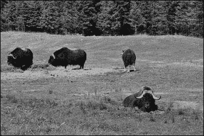

## 如何操作...

使用 OpenCV 计算直方图可以通过`cv::calcHist`函数轻松完成。这是一个通用函数，可以计算任何像素值类型和范围的多个通道图像的直方图。在这里，我们将通过为单通道灰度图像的情况专门化一个类来简化其使用。对于其他类型的图像，你可以直接使用`cv::calcHist`函数，它为你提供了所需的所有灵活性。下一节将解释其每个参数。

目前，我们的专用类看起来如下：

```py
// To create histograms of gray-level images
class Histogram1D {

  private:

    int histSize[1];         // number of bins in histogram
    float hranges[2];        // range of values
    const float* ranges[1];  // pointer to the value ranges
    int channels[1];         // channel number to be examined

  public:

  Histogram1D() {

    // Prepare default arguments for 1D histogram
    histSize[0]= 256;   // 256 bins
    hranges[0]= 0.0;    // from 0 (inclusive)
    hranges[1]= 256.0;  // to 256 (exclusive)
    ranges[0]= hranges; 
    channels[0]= 0;     // we look at channel 0
  }
```

使用定义的成员变量，可以通过以下方法计算灰度直方图：

```py
  // Computes the 1D histogram.
  cv::Mat getHistogram(const cv::Mat &image) {

    cv::Mat hist;

    // Compute histogram
    cv::calcHist(&image, 
      1,         // histogram of 1 image only
      channels,  // the channel used
      cv::Mat(), // no mask is used
      hist,      // the resulting histogram
      1,         // it is a 1D histogram
      histSize,  // number of bins
      ranges     // pixel value range
    );

    return hist;
  }
```

现在，你的程序只需要打开一个图像，创建一个`Histogram1D`实例，并调用`getHistogram`方法：

```py
   // Read input image
   cv::Mat image= cv::imread("group.jpg",
                             0); // open in b&w

   // The histogram object
   Histogram1D h;

   // Compute the histogram
   cv::Mat histo= h.getHistogram(image);
```

这里的`histo`对象是一个具有`256`个条目的简单一维数组。因此，你可以通过简单地遍历这个数组来读取每个桶：

```py
   // Loop over each bin
   for (int i=0; i<256; i++) 
      cout << "Value " << i << " = " << 
                   histo.at<float>(i) << endl;  
```

使用本章开头显示的图像，一些显示的值如下所示：

```py
...
Value 7 = 159
Value 8 = 208
Value 9 = 271
Value 10 = 288
Value 11 = 340
Value 12 = 418
Value 13 = 432
Value 14 = 472
Value 15 = 525
...
```

显然，从这一系列值中提取任何直观意义都很困难。因此，通常方便将直方图显示为函数，例如，使用条形图。以下方法创建此类图表：

```py
// Computes the 1D histogram and returns an image of it.
cv::Mat getHistogramImage(const cv::Mat &image, 
                             int zoom=1){

  // Compute histogram first
  cv::Mat hist= getHistogram(image);
  // Creates image
  return getImageOfHistogram(hist, zoom);
}

// Create an image representing a histogram (static method)
static cv::Mat getImageOfHistogram
                  (const cv::Mat &hist, int zoom) {
  // Get min and max bin values
  double maxVal = 0;
  double minVal = 0;
  cv::minMaxLoc(hist, &minVal, &maxVal, 0, 0);

  // get histogram size
  int histSize = hist.rows;

  // Square image on which to display histogram
  cv::Mat histImg(histSize*zoom, 
                   histSize*zoom, CV_8U, cv::Scalar(255));

  // set highest point at 90% of nbins (i.e. image height)
  int hpt = static_cast<int>(0.9*histSize);

  // Draw vertical line for each bin 
  for (int h = 0; h < histSize; h++) {

    float binVal = hist.at<float>(h);
    if (binVal>0) {
      int intensity = static_cast<int>(binVal*hpt / maxVal);
      cv::line(histImg, cv::Point(h*zoom, histSize*zoom),
        cv::Point(h*zoom, (histSize - intensity)*zoom), 
             cv::Scalar(0), zoom);
    }
  }

  return histImg;
}
```

使用`getImageOfHistogram`方法，你可以获得直方图函数的图像，以条形图的形式绘制，使用线条：

```py
   // Display a histogram as an image
   cv::namedWindow("Histogram");
   cv::imshow("Histogram",
               h.getHistogramImage(image));
```

结果是以下图像：

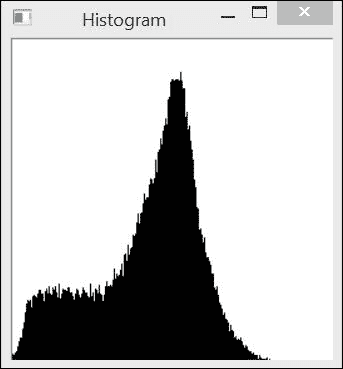

从前面的直方图可以看出，图像显示出中灰度值的大峰值和大量较暗的像素。巧合的是，这两个组主要分别对应图像的背景和前景。可以通过在这两个组之间的过渡处对图像进行阈值处理来验证这一点。可以使用方便的 OpenCV 函数来完成此操作，即在前一章中介绍的`cv::threshold`函数。在这里，为了创建我们的二值图像，我们在直方图向高峰值增加之前的最小值处对图像进行阈值处理（灰度值`60`）：

```py
cv::Mat thresholded; // output binary image
cv::threshold(image,thresholded,
            60,    // threshold value
            255,   // value assigned to 
                   // pixels over threshold value
          cv::THRESH_BINARY); // thresholding type
```

生成的二值图像清楚地显示了背景/前景分割：

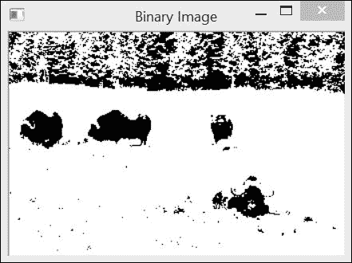

## 它是如何工作的...

`cv::calcHist`函数有许多参数，允许它在许多上下文中使用，如下所示：

```py
void calcHist(const Mat* images, int nimages, 
  const int* channels, InputArray mask, OutputArray hist, 
  int dims, const int* histSize, const float** ranges, 
  bool uniform=true, bool accumulate=false )
```

大多数情况下，你的直方图将是一张单通道或三通道图像之一。然而，该函数允许你指定一个分布在多个图像上的多通道图像。这就是为什么将图像数组输入到该函数中的原因。第六个参数`dims`指定直方图的维度，例如，对于一维直方图为 1。即使你正在分析多通道图像，你也不必在直方图的计算中使用所有通道。要考虑的通道列在具有指定维度的`channel`数组中。在我们的类实现中，这个单通道默认是通道 0。直方图本身由每个维度的 bin 数量（这是整数的`histSize`数组）以及每个维度的最小（包含）和最大（不包含）值（由 2 元素数组的`ranges`数组给出）描述。也可以定义一个非均匀直方图；在这种情况下，你需要指定每个 bin 的界限。

与许多 OpenCV 函数一样，可以指定一个掩码，表示您想要包含在计数中的像素（掩码值为 0 的所有像素将被忽略）。还可以指定两个附加的可选参数，它们都是布尔值。第一个参数指示直方图是否均匀（均匀是默认值）。第二个参数允许您累积多个直方图计算的结果。如果最后一个参数为真，则图像的像素计数将添加到当前输入直方图中的值。这在您想要计算一组图像的直方图时非常有用。

结果直方图存储在`cv::Mat`实例中。实际上，`cv::Mat`类可以用来操作通用的 N 维矩阵。回想一下第二章，*操作像素*，这个类为 1 维、2 维和 3 维矩阵定义了`at`方法。这就是为什么我们能够在`getHistogramImage`方法中访问 1D 直方图的每个桶时编写以下代码：

```py
         float binVal = hist.at<float>(h);
```

注意，直方图中的值存储为`float`类型。

## 还有更多...

本配方中介绍的`Histogram1D`类通过将其限制为 1D 直方图简化了`cv::calcHist`函数。这对于灰度图像很有用，但对于彩色图像呢？

### 计算彩色图像的直方图

使用相同的`cv::calcHist`函数，我们可以计算多通道图像的直方图。例如，可以定义一个计算彩色 BGR 图像直方图的类如下：

```py
class ColorHistogram {

  private:

    int histSize[3];        // size of each dimension
    float hranges[2];       // range of values
    const float* ranges[3]; // ranges for each dimension
    int channels[3];        // channel to be considered

  public:

  ColorHistogram() {

    // Prepare default arguments for a color histogram
    // each dimension has equal size and range
    histSize[0]= histSize[1]= histSize[2]= 256;
    hranges[0]= 0.0;    // BRG range from 0 to 256
    hranges[1]= 256.0;
    ranges[0]= hranges; // in this class,  
    ranges[1]= hranges; // all channels have the same range
    ranges[2]= hranges; 
    channels[0]= 0;    // the three channels 
    channels[1]= 1; 
    channels[2]= 2; 
  }
```

在这种情况下，直方图将是三维的。因此，我们需要为三个维度中的每一个指定一个范围。在我们的 BGR 图像中，三个通道具有相同的`[0,255]`范围。准备好这些参数后，颜色直方图将通过以下方法计算：

```py
  // Computes the histogram.
  cv::Mat getHistogram(const cv::Mat &image) {

    cv::Mat hist;

    // BGR color histogram
    hranges[0]= 0.0;    // BRG range
    hranges[1]= 256.0;
    channels[0]= 0;    // the three channels 
    channels[1]= 1; 
    channels[2]= 2; 

    // Compute histogram
    cv::calcHist(&image, 
      1,          // histogram of 1 image only
      channels,   // the channel used
      cv::Mat(),  // no mask is used
      hist,       // the resulting histogram
      3,          // it is a 3D histogram
      histSize,   // number of bins
      ranges      // pixel value range
    );

    return hist;
  }
```

返回一个三维`cv::Mat`实例。当选择`256`个桶的直方图时，这个矩阵有`(256)³`个元素，这代表超过 1600 万个条目。在许多应用中，减少直方图计算中的桶数会更好。还可以使用设计用来表示大型稀疏矩阵（即零元素非常少的矩阵）而不消耗太多内存的`cv::SparseMat`数据结构。`cv::calcHist`函数有一个返回此类矩阵的版本。因此，修改前面的方法以使用`cv::SparseMatrix`非常简单：

```py
  // Computes the histogram.
  cv::SparseMat getSparseHistogram(const cv::Mat &image) {

    cv::SparseMat hist(3,        // number of dimensions
                      histSize, // size of each dimension
                   CV_32F);

    // BGR color histogram
    hranges[0]= 0.0;    // BRG range
    hranges[1]= 256.0;
    channels[0]= 0;     // the three channels 
    channels[1]= 1; 
    channels[2]= 2; 

    // Compute histogram
    cv::calcHist(&image, 
      1,         // histogram of 1 image only
      channels,  // the channel used
      cv::Mat(), // no mask is used
      hist,      // the resulting histogram
      3,         // it is a 3D histogram
      histSize,  // number of bins
      ranges     // pixel value range
    );

    return hist;
  }
```

显然，也可以通过显示单个 R、G 和 B 直方图来展示图像中的颜色分布。

## 参见

+   本章后面提到的**将直方图反投影以检测特定图像内容**的配方使用颜色直方图来检测特定图像内容

# 将查找表应用于修改图像外观

图像直方图捕捉了场景使用可用的像素强度值的方式。通过分析图像上像素值的分布，可以使用这些信息来修改和可能改进图像。这道菜谱解释了我们可以如何使用一个简单的映射函数，即查找表，来修改图像的像素值。正如我们将看到的，查找表通常是从直方图分布中定义的。

## 如何做...

**查找表**是一个简单的单对单（或一对多）函数，它定义了像素值如何转换成新值。它是一个 1D 数组，在常规灰度图像的情况下，有 256 个条目。表中的条目`i`给出了相应灰度的新的强度值，如下所示：

```py
         newIntensity= lookup[oldIntensity];
```

OpenCV 中的`cv::LUT`函数将查找表应用于图像以生成新图像。我们可以将此函数添加到我们的`Histogram1D`类中：

```py
   static cv::Mat applyLookUp(
    const cv::Mat& image,     // input image
    const cv::Mat& lookup) {  // 1x256 uchars

      // the output image
      cv::Mat result;

      // apply lookup table
      cv::LUT(image,lookup,result);

      return result;
   }
```

## 它是如何工作的...

当查找表应用于图像时，它会产生一个新的图像，其中像素强度值已根据查找表的规定进行了修改。一个简单的转换可能是以下这样：

```py
   // Create an image inversion table
   int dim(256);
   cv::Mat lut(1, // 1 dimension
      &dim,       // 256 entries
      CV_8U);     // uchar

   for (int i=0; i<256; i++) {

      lut.at<uchar>(i)= 255-i;
   }
```

这种转换只是简单地反转像素强度，也就是说，强度`0`变为`255`，`1`变为`254`，依此类推。将此类查找表应用于图像将产生原始图像的负片。在上一道菜谱的图像中，结果如下所示：

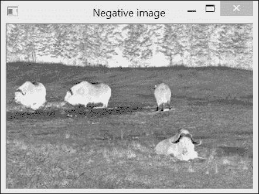

## 还有更多...

查找表对于任何所有像素强度都被赋予新强度值的应⽤程序都很有用。然而，这种转换必须是全局的，也就是说，每个强度值的所有像素都必须经历相同的转换。

### 通过拉伸直方图来提高图像对比度

通过定义一个修改原始图像直方图的查找表，可以改善图像的对比度。例如，如果你观察第一道菜谱中显示的上一张图像的直方图，很容易注意到没有使用所有可能的强度值范围（特别是，对于这张图像，较亮的强度值没有被使用）。因此，我们可以拉伸直方图以产生具有扩展对比度的图像。为此，该程序使用一个百分位数阈值来定义拉伸图像中应该为黑色和白色的像素百分比。

因此，我们必须找到最低的（`imin`）和最高的（`imax`）强度值，这样我们就有所需的最低像素数在指定的百分位数以下或以上。然后可以将强度值重新映射，使`imin`值重新定位到强度`0`，而`imax`值被分配值为`255`。中间的`i`强度值简单地按以下方式进行线性重新映射：

```py
255.0*(i-imin)/(imax-imin);
```

因此，完整的图像拉伸方法如下所示：

```py
   cv::Mat stretch(const cv::Mat &image, int minValue=0) {

      // Compute histogram first
      cv::Mat hist= getHistogram(image);

      // find left extremity of the histogram
      int imin= 0;
      for( ; imin < histSize[0]; imin++ ) {
         // ignore bins with less than minValue entries
         if (hist.at<float>(imin) > minValue)
            break;
      }

      // find right extremity of the histogram
      int imax= histSize[0]-1;
      for( ; imax >= 0; imax-- ) {

         // ignore bins with less than minValue entries
         if (hist.at<float>(imax) > minValue)
            break;
      }

      // Create lookup table
      int dim(256);
      cv::Mat lookup(1,  // 1 dimension
            &dim,        // 256 entries
            CV_8U);      // uchar

      // Build lookup table
      for (int i=0; i<256; i++) {

         // stretch between imin and imax
         if (i < imin) lookup.at<uchar>(i)= 0;
         else if (i > imax) lookup.at<uchar>(i)= 255;
         // linear mapping
      else lookup.at<uchar>(i)= 
        cvRound(255.0*(i-imin)/(imax-imin));
      }

      // Apply lookup table
      cv::Mat result;
      result= applyLookUp(image,lookup);

      return result;
   }
```

注意在计算此方法后对`applyLookUp`方法的调用。实际上，在实践中，除了忽略具有`0`值的桶外，还可以忽略计数可忽略的条目，例如，小于给定值（在此定义为`minValue`）。方法的调用方式如下：

```py
  // setting 1% of pixels at black and 1% at white
  cv::Mat streteched = h.stretch(image,0.01f);
```

结果拉伸的图像如下：

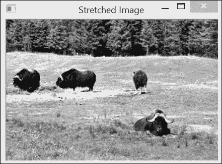

扩展后的直方图看起来如下：

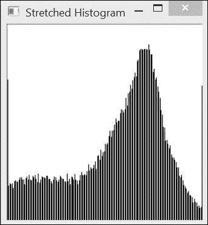

### 在彩色图像上应用查找表

在第二章，*操作像素*中，我们定义了一个颜色减少函数，该函数通过修改图像的 BGR 值来减少可能的颜色数量。我们通过遍历图像的像素并对每个像素应用颜色减少函数来实现这一点。实际上，通过预计算所有颜色减少并使用查找表来修改每个像素将更加高效。这正是我们从本食谱中学到的东西。新的颜色减少函数将如下所示：

```py
void colorReduce(cv::Mat &image, int div=64) {

    // creating the 1D lookup table
    cv::Mat lookup(1,256,CV_8U);

    // defining the color reduction lookup
    for (int i=0; i<256; i++) 
      lookup.at<uchar>(i)= i/div*div + div/2;

    // lookup table applied on all channels
    cv::LUT(image,lookup,image);
}
```

颜色减少方案在这里被正确应用，因为当一维查找表应用于多通道图像时，该表将单独应用于所有通道。当查找表具有多个维度时，它必须应用于具有相同通道数的图像。

## 参考以下内容

+   下一个示例展示了另一种提高图像对比度的方法

# 平衡图像直方图

在上一个示例中，我们向您展示了如何通过拉伸直方图使它占据所有可用强度值的全范围来提高图像的对比度。这种策略确实是一个简单的解决方案，可以有效地改善图像。然而，在许多情况下，图像的视觉缺陷并不是它使用了太窄的强度范围。相反，它是一些强度值比其他强度值使用得更频繁。本章的第一个示例中显示的直方图就是这种现象的一个好例子。中间灰度强度确实被大量表示，而较暗和较亮的像素值则相对罕见。实际上，你会认为一个好的图像应该平等地使用所有可用的像素强度。这就是**直方图均衡化**概念背后的想法，即尽可能使图像直方图平坦。

## 如何操作...

OpenCV 提供了一个易于使用的函数，用于执行直方图均衡化。它的调用方式如下：

```py
      cv::equalizeHist(image,result);
```

在我们的图像上应用它后，以下截图是结果：

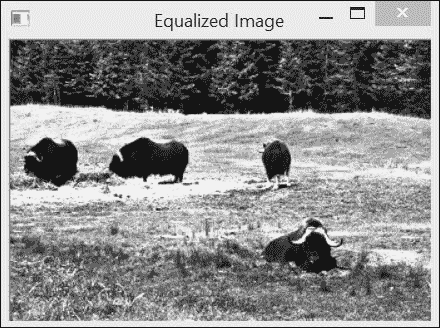

此均衡化图像具有以下直方图：

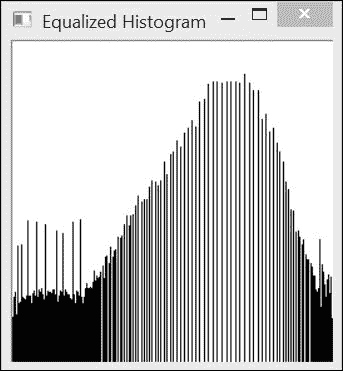

当然，直方图不能完全平坦，因为查找表是一个全局多对一转换。然而，可以看出，直方图的一般分布现在比原始的更均匀。

## 它是如何工作的...

在一个完全均匀的直方图中，所有桶都将具有相同数量的像素。这意味着 50%的像素强度应低于`128`，25%应低于`64`，依此类推。这个观察结果可以用以下规则表示：在一个均匀的直方图中，*p%*的像素必须具有低于或等于*255*p%*的强度值。用于均衡直方图的规则是，强度`i`的映射应与具有低于`i`的强度值的像素百分比的强度相对应。因此，所需的查找表可以从以下方程式构建：

```py
lookup.at<uchar>(i)=   
        static_cast<uchar>(255.0*p[i]/image.total());
```

在这里，`p[i]`是强度低于或等于`i`的像素数量。`p[i]`函数通常被称为**累积直方图**，即它是一个包含低于或等于给定强度的像素计数的直方图，而不是包含具有特定强度值的像素计数。回想一下，`image.total()`返回图像中的像素数量，所以`p[i]/image.total()`是像素的百分比。

通常，直方图均衡化大大改善了图像的外观。然而，根据视觉内容的不同，结果的质量可能因图像而异。

# 将直方图反投影以检测特定图像内容

直方图是图像内容的一个重要特征。如果你观察一个显示特定纹理或特定对象的图像区域，那么这个区域的直方图可以看作是一个函数，它给出了给定像素属于这个特定纹理或对象的概率。在本食谱中，你将学习如何有利地使用**直方图反投影**的概念来检测特定图像内容。

## 如何做...

假设你有一个图像，并且你希望检测其中的特定内容（例如，在以下图像中，天空中的云）。首先要做的事情是选择一个感兴趣的区域，该区域包含你正在寻找的样本。这个区域就是以下测试图像中画出的矩形内部：

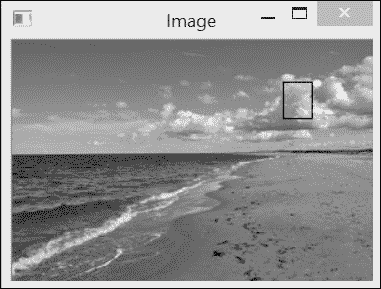

在我们的程序中，感兴趣的区域是通过以下方式获得的：

```py
   cv::Mat imageROI;
   imageROI= image(cv::Rect(216,33,24,30)); // Cloud region
```

然后你提取这个 ROI 的直方图。这可以通过使用本章第一道食谱中定义的`Histogram1D`类轻松完成，如下所示：

```py
   Histogram1D h;
   cv::Mat hist= h.getHistogram(imageROI);
```

通过归一化这个直方图，我们得到一个函数，它给出了给定强度值的像素属于定义区域的概率，如下所示：

```py
   cv::normalize(histogram,histogram,1.0);
```

回投影直方图包括将输入图像中的每个像素值替换为其在归一化直方图中读取的对应概率值。OpenCV 函数如下执行此任务：

```py
  cv::calcBackProject(&image,
            1,          // one image
            channels,   // the channels used, 
                        // based on histogram dimension
            histogram,  // the histogram we are backprojecting
            result,     // the resulting back projection image
            ranges,     // the ranges of values
            255.0       // the scaling factor is chosen 
            // such that a probability value of 1 maps to 255
       );
```

结果是以下概率图，参考区域的概率从亮（低概率）到暗（高概率）：

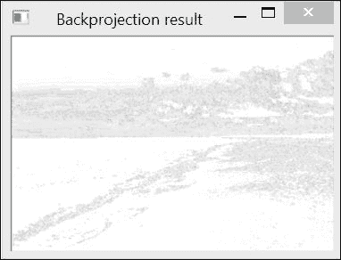

如果我们对这张图像应用阈值，我们将获得最可能的“云”像素：

```py
cv::threshold(result, result, threshold, 
                      255, cv::THRESH_BINARY);
```

结果如下截图所示：


## 它是如何工作的...

前面的结果令人失望，因为除了云层之外，其他区域也被错误地检测到了。重要的是要理解，概率函数是从简单的灰度直方图中提取出来的。图像中许多其他像素与云层像素具有相同的强度，并且在回投影直方图时，相同强度的像素被相同的概率值替换。为了提高检测结果，一个解决方案是使用颜色信息。然而，为了做到这一点，我们需要修改对`cv::calBackProject`的调用。

`cv::calBackProject`函数类似于`cv::calcHist`函数。第一个参数指定输入图像。然后你需要列出你希望使用的通道号。这次传递给函数的直方图是一个输入参数；其维度应与通道列表数组相匹配。与`cv::calcHist`一样，`ranges`参数指定输入直方图的 bin 边界，形式为一个 float 数组的数组，每个数组指定每个通道的范围（最小值和最大值）。生成的输出是一个图像，即计算出的概率图。由于每个像素都被替换为在对应 bin 位置上直方图中找到的值，因此生成的图像的值在`0.0`和`1.0`之间（假设已提供归一化直方图作为输入）。最后一个参数允许你选择性地通过乘以一个给定的因子来重新缩放这些值。

## 还有更多...

现在我们来看看我们如何在直方图回投影算法中使用颜色信息。

### 回投影颜色直方图

多维直方图也可以回投影到图像上。让我们定义一个类来封装回投影过程。我们首先定义所需的属性并初始化数据如下：

```py
class ContentFinder {

  private:

  // histogram parameters
  float hranges[2];
   const float* ranges[3];
   int channels[3];

  float threshold;           // decision threshold
  cv::Mat histogram;         // input histogram 

  public:

  ContentFinder() : threshold(0.1f) {

    // in this class, all channels have the same range
    ranges[0]= hranges;  
    ranges[1]= hranges; 
    ranges[2]= hranges; 
  }
```

接下来，我们定义一个阈值参数，该参数将用于创建显示检测结果的二值图。如果此参数设置为负值，则将返回原始概率图。请参考以下代码：

```py
   // Sets the threshold on histogram values [0,1]
   void setThreshold(float t) {

      threshold= t;
   }

   // Gets the threshold
   float getThreshold() {

      return threshold;
   }
```

输入直方图已归一化（尽管这不是必需的），如下所示：

```py
   // Sets the reference histogram
   void setHistogram(const cv::Mat& h) {

      histogram= h;
      cv::normalize(histogram,histogram,1.0);
   }
```

要回投影直方图，你只需指定图像、范围（我们假设所有通道具有相同的范围）以及使用的通道列表。请参考以下代码：

```py
  // All channels used, with range [0,256[
  cv::Mat find(const cv::Mat& image) {

    cv::Mat result;

    hranges[0]= 0.0;   // default range [0,256[
    hranges[1]= 256.0;
    channels[0]= 0;    // the three channels 
    channels[1]= 1; 
    channels[2]= 2; 

    return find(image, hranges[0], hranges[1], channels);
  }

  // Finds the pixels belonging to the histogram
  cv::Mat find(const cv::Mat& image, 
                float minValue, float maxValue, 
                int *channels) {

    cv::Mat result;

    hranges[0]= minValue;
    hranges[1]= maxValue;

    // histogram dim matches channel list
    for (int i=0; i<histogram.dims; i++)
        this->channels[i]= channels[i];

    cv::calcBackProject(&image,
            1,         // we only use one image at a time
            channels,  // vector specifying what histogram 
            // dimensions belong to what image channels
            histogram,    // the histogram we are using
            result,       // the back projection image
            ranges,       // the range of values, 
                          // for each dimension
            255.0         // the scaling factor is chosen such 
            // that a histogram value of 1 maps to 255
       );
    }

    // Threshold back projection to obtain a binary image
    if (threshold>0.0)
      cv::threshold(result, result, 
                255.0*threshold, 255.0, cv::THRESH_BINARY);

    return result;
  }
```

现在，让我们在之前使用的图像的颜色版本上使用 BGR 直方图（查看书网站以查看此图像的颜色版本）。这次，我们将尝试检测蓝色天空区域。我们将首先加载彩色图像，定义感兴趣区域，并在减少的颜色空间上计算 3D 直方图，如下所示：

```py
  // Load color image
  ColorHistogram hc;
  cv::Mat color= cv::imread("waves2.jpg");

  // extract region of interest
  imageROI= color(cv::Rect(0,0,100,45)); // blue sky area

  // Get 3D colour histogram (8 bins per channel)
  hc.setSize(8); // 8x8x8
  cv::Mat shist= hc.getHistogram(imageROI);
```

接下来，你计算直方图并使用 `find` 方法检测图像的天空部分，如下所示：

```py
  // Create the content finder
  ContentFinder finder;
  // set histogram to be back-projected
  finder.setHistogram(shist);
  finder.setThreshold(0.05f);

  // Get back-projection of color histogram
  Cv::Mat result= finder.find(color);
```

上一个部分中图像颜色版本检测的结果如下：

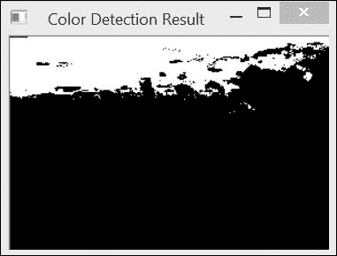

BGR 颜色空间通常不是在图像中识别颜色物体的最佳选择。在这里，为了使其更可靠，我们在计算直方图之前减少了颜色的数量（记住，原始的 BGR 空间包含超过 1600 万种颜色）。提取的直方图代表了天空区域的典型颜色分布。尝试将其反向投影到另一张图像上。它也应该检测到天空部分。请注意，使用由多个天空图像构建的直方图可以提高这种检测的准确性。

注意，在这种情况下，从内存使用角度来看，计算稀疏直方图会更好。这次你应该能够使用 `cv::SparseMat` 重新做这个练习。此外，如果你正在寻找颜色鲜艳的物体，使用 HSV 颜色空间的色调通道可能会更有效率。在其他情况下，使用感知均匀空间（如 *L*a*b**）的色度分量可能是一个更好的选择。

## 参见

+   下一个示例使用 HSV 颜色空间来检测图像中的物体。这是你可以在检测某些图像内容时使用的许多替代方案之一。

# 使用均值漂移算法寻找物体

直方图反向投影的结果是一个概率图，表示给定图像内容在特定图像位置被找到的概率。假设我们现在知道图像中物体的近似位置；概率图可以用来找到物体的确切位置。最可能的位置将是最大化给定窗口内该概率的位置。因此，如果我们从一个初始位置开始，迭代地移动，应该能够找到物体的确切位置。这就是**均值漂移算法**所实现的功能。

## 如何做...

假设我们已经识别出感兴趣的对象——这里是一个狒狒的脸，如下面的截图所示（参考书中图形 PDF 查看此图像的颜色版本）：

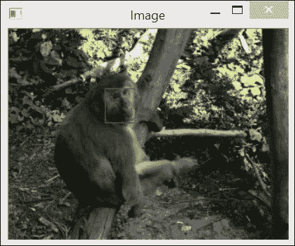

这次，我们将使用 HSV 颜色空间的色调通道来描述这个物体。这意味着我们需要将图像转换为 HSV 图像，然后提取色调通道并计算定义的 ROI 的 1D 色调直方图。参考以下代码：

```py
   // Read reference image
   cv::Mat image= cv::imread("baboon1.jpg");
   // Baboon's face ROI
   cv::Mat imageROI= image(cv::Rect(110,260,35,40));
   // Get the Hue histogram
   int minSat=65;
   ColorHistogram hc;
   cv::Mat colorhist= 
            hc.getHueHistogram(imageROI,minSat);
```

如所示，色调直方图是通过我们添加到`ColorHistogram`类的一个方便方法获得的，如下所示：

```py
  // Computes the 1D Hue histogram with a mask.
  // BGR source image is converted to HSV
  // Pixels with low saturation are ignored
  cv::Mat getHueHistogram(const cv::Mat &image, 
                             int minSaturation=0) {

    cv::Mat hist;

    // Convert to HSV colour space
    cv::Mat hsv;
    cv::cvtColor(image, hsv, CV_BGR2HSV);

    // Mask to be used (or not)
    cv::Mat mask;

    if (minSaturation>0) {

      // Spliting the 3 channels into 3 images
      std::vector<cv::Mat> v;
      cv::split(hsv,v);

      // Mask out the low saturated pixels
      cv::threshold(v[1],mask,minSaturation,255,
                                 cv::THRESH_BINARY);
    }

    // Prepare arguments for a 1D hue histogram
    hranges[0]= 0.0;    // range is from 0 to 180
    hranges[1]= 180.0;
    channels[0]= 0;     // the hue channel 

    // Compute histogram
    cv::calcHist(&hsv, 
      1,        // histogram of 1 image only
      channels, // the channel used
      mask,     // binary mask
      hist,     // the resulting histogram
      1,        // it is a 1D histogram
      histSize, // number of bins
      ranges    // pixel value range
    );

    return hist;
  }
```

然后将生成的直方图传递给我们的`ContentFinder`类实例，如下所示：

```py
   ContentFinder finder;
   finder.setHistogram(colorhist);
```

现在我们打开第二张图片，这张图片是我们想要定位新狒狒面部位置的图片。这张图片首先需要转换到 HSV 空间，然后我们将第一张图片的直方图进行反向投影。参考以下代码：

```py
   image= cv::imread("baboon3.jpg");
   // Convert to HSV space
   cv::cvtColor(image, hsv, CV_BGR2HSV);
   // Get back-projection of hue histogram
   int ch[1]={0};
   finder.setThreshold(-1.0f); // no thresholding
   cv::Mat result= finder.find(hsv,0.0f,180.0f,ch);
```

现在，从一个初始矩形区域（即初始图像中狒狒面部的位置），OpenCV 的`cv::meanShift`算法将更新`rect`对象到新狒狒面部的位置。参考以下代码：

```py
   // initial window position
   cv::Rect rect(110,260,35,40);

   // search object with mean shift
   cv::TermCriteria criteria(cv::TermCriteria::MAX_ITER,
                             10,0.01);
   cv::meanShift(result,rect,criteria);
```

初始（红色）和新（绿色）的面部位置在以下屏幕截图（参考书籍的图形 PDF 以查看此图像的颜色）中显示：

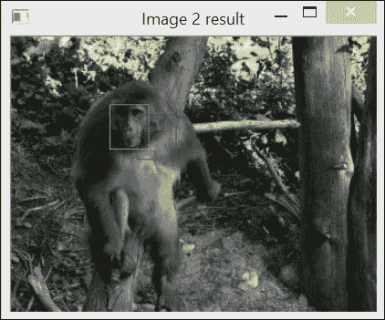

## 它是如何工作的...

在这个例子中，我们使用了 HSV 颜色空间的色调分量来描述我们正在寻找的对象。我们做出这个选择是因为狒狒的面部有一种非常独特的粉红色；因此，像素的色调应该使面部易于识别。因此，第一步是将图像转换为 HSV 颜色空间。当使用`CV_BGR2HSV`标志时，色调分量是结果图像的第一个通道。这是一个从`0`到`180`（使用`cv::cvtColor`转换的图像与源图像类型相同）的 8 位分量。为了提取色调图像，使用`cv::split`函数将 3 通道 HSV 图像分割成三个 1 通道图像。这三个图像被放入一个`std::vector`实例中，色调图像是向量的第一个条目（即索引`0`）。

当使用颜色的色调分量时，始终需要考虑其饱和度（这是向量的第二个元素）。实际上，当颜色的饱和度低时，色调信息变得不稳定且不可靠。这是因为对于低饱和度的颜色，B、G 和 R 分量几乎相等。这使得确定确切的颜色变得困难。因此，我们决定忽略低饱和度颜色的色调分量。也就是说，它们不会被计入直方图（使用`minSat`参数，在`getHueHistogram`方法中屏蔽掉饱和度低于此阈值的像素）。

均值漂移算法是一个迭代过程，它定位概率函数的局部最大值。它是通过找到预定义窗口内数据点的质心或加权平均值来做到这一点的。然后，算法将窗口中心移动到质心位置，并重复此过程，直到窗口中心收敛到一个稳定点。OpenCV 实现定义了两个停止标准：最大迭代次数和窗口中心位移值，低于此值的位置被认为已收敛到一个稳定点。这两个标准存储在一个`cv::TermCriteria`实例中。`cv::meanShift`函数返回已执行的迭代次数。显然，结果的质量取决于在给定初始位置提供的概率图的质量。请注意，在这里，我们使用颜色直方图来表示图像的外观；也可以使用其他特征的直方图来表示对象（例如，边缘方向的直方图）。

## 参见

+   均值漂移算法已被广泛用于视觉跟踪。第十一章，*处理视频序列*，将更详细地探讨对象跟踪的问题

+   均值漂移算法在 D. Comaniciu 和 P. Meer 在*IEEE transactions on Pattern Analysis and Machine Intelligence, 第 24 卷，第 5 期，2002 年 5 月*上发表的*Mean Shift: A robust approach toward feature space analysis*一文中被介绍。

+   OpenCV 还提供了一个 CamShift 算法的实现，这是均值漂移算法的一个改进版本，其中窗口的大小和方向可以改变。

# 使用直方图比较检索相似图像

基于内容的图像检索是计算机视觉中的一个重要问题。它包括找到一组与给定查询图像内容相似的图像。由于我们已经了解到直方图是表征图像内容的一种有效方式，因此认为它们可以用来解决基于内容的检索问题是有意义的。

关键在于能够通过简单地比较两个图像的直方图来测量两个图像之间的相似性。需要定义一个测量函数，该函数将估计两个直方图之间的差异或相似程度。过去已经提出了各种此类度量，OpenCV 在其`cv::compareHist`函数的实现中提出了一些。

## 如何做到这一点...

为了将参考图像与一组图像进行比较，并找到与查询图像最相似的图像，我们创建了一个`ImageComparator`类。这个类包含一个查询图像和一个输入图像的引用，以及它们的直方图。此外，由于我们将使用颜色直方图进行比较，因此使用`ColorHistogram`类如下：

```py
class ImageComparator {

  private:

    cv::Mat refH;       // reference histogram
    cv::Mat inputH;     // histogram of input image

    ColorHistogram hist; // to generate the histograms
    int nBins; // number of bins used in each color channel

  public:

    ImageComparator() :nBins(8) {

  }
```

为了获得可靠的相似性度量，直方图应该在较少的 bin 上计算。因此，该类允许你指定每个 BGR 通道中使用的 bin 数量。请参阅以下代码：

```py
  // Set number of bins used when comparing the histograms
  void setNumberOfBins( int bins) {

    nBins= bins;
  }
```

查询图像通过一个适当的设置器指定，该设置器还会计算参考直方图，如下所示：

```py
  // compute histogram of reference image
  void setReferenceImage(const cv::Mat& image) {

    hist.setSize(nBins);
    refH= hist.getHistogram(image);
  }
```

最后，一个 `compare` 方法比较参考图像与给定输入图像。以下方法返回一个分数，表示两个图像的相似程度：

```py
  // compare the images using their BGR histograms
  double compare(const cv::Mat& image) {

    inputH= hist.getHistogram(image);

    return cv::compareHist(refH,inputH,CV_COMP_INTERSECT);
  }
```

上述类可以用来检索与给定查询图像相似的图像。以下代码最初提供给类实例：

```py
   ImageComparator c;
   c.setReferenceImage(image);
```

这里，我们使用的查询图像是本章前面在 *将直方图反投影以检测特定图像内容* 菜谱中显示的海滩图像的颜色版本。此图像与以下一系列图像进行了比较。图像按从最相似到最不相似的顺序显示：


## 它是如何工作的...

大多数直方图比较度量都是基于每个直方图 bin 的比较。这就是为什么在测量两个颜色直方图的相似性时，与较少的直方图 bin 数量一起工作很重要。调用 `cv::compareHist` 是直接的。你只需输入两个直方图，函数就会返回测量的距离。你想要使用的特定测量方法是通过一个标志指定的。在 `ImageComparator` 类中，使用的是交集方法（使用 `CV_COMP_INTERSECT` 标志）。这种方法简单地比较每个 bin 中每个直方图的两个值，并保留最小的一个。因此，相似性度量是这些最小值的总和。因此，两个没有共同颜色的直方图的图像将得到一个交集值为 `0`，而两个相同的直方图将得到一个等于像素总数的值。

其他可用的方法包括卡方度量（`CV_COMP_CHISQR` 标志），它计算 bin 之间的归一化平方差之和，相关方法（`CV_COMP_CORREL` 标志），它基于在信号处理中用于测量两个信号相似性的归一化互相关算子，以及 Bhattacharyya 度量（`CV_COMP_BHATTACHARYYA` 标志），它在统计学中用于估计两个概率分布的相似性。

## 参见

+   OpenCV 文档提供了不同直方图比较度量中使用的确切公式的描述。

+   地球迁移距离是另一种流行的直方图比较方法。它在 OpenCV 中作为`cv::EMD`函数实现。这种方法的主要优点是它考虑了相邻桶中找到的值来评估两个直方图的相似性。它被描述在 Y. Rubner, C. Tomasi, 和 L. J. Guibas 在《国际计算机视觉杂志》第 40 卷第 2 期，2000 年，第 99-121 页的论文《The Earth Mover's Distance as a Metric for Image Retrieval》中。

# 使用积分图像计数像素

在之前的食谱中，我们了解到直方图是通过遍历图像的所有像素并累计每个强度值在此图像中出现的频率来计算的。我们也看到，有时我们只对在图像的某个区域计算直方图感兴趣。实际上，在图像的子区域内累计像素总和是许多计算机视觉算法中的常见任务。现在，假设你必须在图像内多个感兴趣区域内计算多个这样的直方图。所有这些计算可能会迅速变得非常昂贵。在这种情况下，有一个工具可以极大地提高在图像子区域内计数像素的效率：**积分图像**。

积分图像被引入作为一种在图像感兴趣区域中累加像素的高效方法。它们在涉及例如在多个尺度上滑动窗口计算的应用中被广泛使用。

本食谱将解释积分图像背后的原理。我们的目标是展示如何仅通过三个算术运算来在矩形区域内累加像素。一旦我们掌握了这个概念，本食谱的*更多内容...*部分将展示两个例子，说明积分图像如何被有利地使用。

## 如何做...

本食谱将处理以下图片，其中识别了一个显示骑自行车的女孩的兴趣区域：

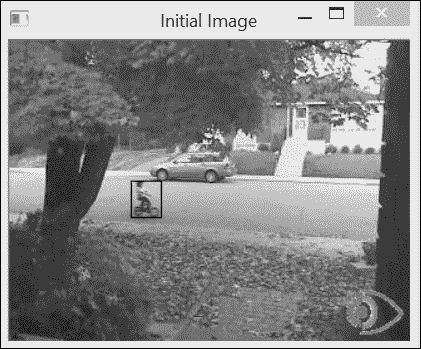

当你需要对多个图像区域中的像素进行求和时，积分图像非常有用。通常，如果你希望获取对感兴趣区域的像素总和，你会编写以下代码：

```py
  // Open image
  cv::Mat image= cv::imread("bike55.bmp",0);
  // define image roi (here the girl on bike)
  int xo=97, yo=112;
  int width=25, height=30;
  cv::Mat roi(image,cv::Rect(xo,yo,width,height));
  // compute sum
  // returns a Scalar to work with multi-channel images
  cv::Scalar sum= cv::sum(roi);
```

`cv::sum`函数简单地遍历该区域的像素并累计总和。使用积分图像，这可以通过仅使用三个加法运算来实现。然而，首先你需要按照以下方式计算积分图像：

```py
  // compute integral image
  cv::Mat integralImage;
  cv::integral(image,integralImage,CV_32S);
```

如下一节所述，可以使用以下简单的算术表达式在计算出的积分图像上获得相同的结果：

```py
  // get sum over an area using three additions/subtractions
  int sumInt= integralImage.at<int>(yo+height,xo+width)
            -integralImage.at<int>(yo+height,xo)
            -integralImage.at<int>(yo,xo+width)
            +integralImage.at<int>(yo,xo);
```

这两种方法都会给出相同的结果。然而，计算积分图像是昂贵的，因为你必须遍历图像中的所有像素。关键是，一旦完成这个初始计算，无论感兴趣的区域大小如何，你只需要添加四个像素来得到一个区域的和。因此，当需要计算多个不同大小的区域中的多个像素总和时，积分图像的使用就变得有利。

## 如何工作...

在上一节中，你通过一个简要的演示了解了积分图像背后的**魔法**，即它们如何被用来廉价地计算矩形区域内部像素的总和。为了理解它们是如何工作的，现在让我们定义一下什么是积分图像。积分图像是通过将每个像素替换为位于该像素定义的左上象限内所有像素值的总和来获得的。积分图像可以通过扫描图像一次来计算，因为当前像素的积分值由之前讨论的像素的积分值加上当前行的累积和的值给出。因此，积分图像是一个包含像素总和的新图像。为了避免溢出，这个图像通常是一个`int`值（`CV_32S`）或浮点值（`CV_32F`）的图像。例如，在下面的图中，这个积分图像中的像素**A**将包含位于左上角区域内的像素总和，该区域用双虚线图案标识。参见图：

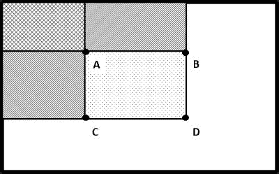

一旦计算了积分图像，任何矩形区域的求和都可以通过四次像素访问轻松获得，原因如下。再次考虑前面的图，我们可以看到，位于像素**A**、**B**、**C**和**D**定义的区域内的像素总和可以通过读取像素**D**的积分值来获得，从该值中减去像素**B**和**C**左侧的像素值。然而，这样做会减去**A**左上角像素总和的两倍；这就是为什么你必须重新加上**A**的积分和。形式上，**A**、**B**、**C**和**D**内部像素的总和由*A-B-C+D*给出。如果我们使用`cv::Mat`方法来访问像素值，这个公式就转化为以下形式：

```py
      // window at (xo,yo) of size width by height
      return (integralImage.at<cv::Vec<T,N>>
                                        (yo+height,xo+width)
            -integralImage.at<cv::Vec<T,N>>(yo+height,xo)
            -integralImage.at<cv::Vec<T,N>>(yo,xo+width)
            +integralImage.at<cv::Vec<T,N>>(yo,xo));
```

因此，这个计算的复杂度是常数，无论感兴趣的区域大小如何。请注意，为了简单起见，我们使用了`cv::Mat`类的`at`方法，这不是访问像素值最有效的方法（参见第二章，*操作像素*）。这个方面将在本食谱的*还有更多...*部分中讨论，该部分介绍了两个受益于积分图像概念效率的应用。

## 还有更多...

整数图像在需要执行多个像素求和时被使用。在本节中，我们将通过介绍自适应阈值的概念来展示整数图像的使用。整数图像对于在多个窗口上高效计算直方图也是很有用的。这一点在本节中也有解释。

### 自适应阈值

在图像上应用阈值以创建二值图像可能是提取图像有意义元素的好方法。假设你有一张书的图像：


由于你对分析图像中的文本感兴趣，你将应用以下阈值到这张图像上：

```py
  // using a fixed threshold 
  cv::Mat binaryFixed;
  cv::threshold(image,binaryFixed,70,255,cv::THRESH_BINARY);
```

你可以得到以下结果：

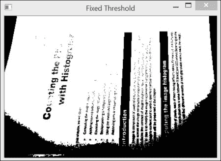

事实上，无论你选择什么阈值值，在图像的某些部分，你会得到缺失的文本，而在其他部分，文本则被阴影所掩盖。为了克服这个问题，一个可能的解决方案是使用从每个像素的邻域计算出的局部阈值。这种策略被称为**自适应阈值**，它包括将每个像素与相邻像素的平均值进行比较。那些明显与其局部平均值不同的像素将被视为异常值，并通过阈值过程被裁剪掉。

因此，自适应阈值需要计算每个像素周围的局部平均值。这需要通过整数图像进行多次图像窗口求和，这可以通过整数图像高效地计算。因此，第一步是计算以下整数图像：

```py
  // compute integral image
  cv::Mat iimage;
  cv::integral(image,iimage,CV_32S);
```

现在我们可以遍历所有像素，并在一个正方形邻域内计算平均值。我们可以使用我们的`IntegralImage`类来做这件事，但这个类使用低效的`at`方法来访问像素。这次，让我们通过使用指针来遍历图像，就像我们在第二章“操作像素”中学到的那样，来提高效率。这个循环看起来如下所示：

```py
  int blockSize= 21; // size of the neighborhood
  int threshold=10;  // pixel will be compared 
                      // to (mean-threshold)

  // for each row
  int halfSize= blockSize/2;
    for (int j=halfSize; j<nl-halfSize-1; j++) {

      // get the address of row j
      uchar* data= binary.ptr<uchar>(j);
      int* idata1= iimage.ptr<int>(j-halfSize);
      int* idata2= iimage.ptr<int>(j+halfSize+1);

      // for pixel of a line
      for (int i=halfSize; i<nc-halfSize-1; i++) {

        // compute sum
        int sum= (idata2[i+halfSize+1]-
                     idata2[i-halfSize]-
                 idata1[i+halfSize+1]+
                     idata1[i-halfSize])/
                        (blockSize*blockSize);

        // apply adaptive threshold
        if (data[i]<(sum-threshold))
          data[i]= 0;
        else
          data[i]=255;
      }
    }
```

在这个例子中，使用了大小为 21 x 21 的邻域。为了计算每个平均值，我们需要访问界定正方形邻域的四个整数像素：两个位于由`idata1`指向的行上，两个位于由`idata2`指向的行上。当前像素与计算出的平均值进行比较，然后从这个平均值中减去一个阈值值（这里设置为`10`）；这是为了确保被拒绝的像素明显不同于它们的局部平均值。然后得到以下二值图像：

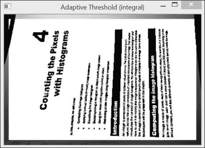

显然，这比我们使用固定阈值得到的结果要好得多。自适应阈值是一种常见的图像处理技术。因此，它也被 OpenCV 实现，如下所示：

```py
cv::adaptiveThreshold(image,          // input image
        binaryAdaptive,               // output binary image
        255,                          // max value for output
        cv::ADAPTIVE_THRESH_MEAN_C,   // method
        cv::THRESH_BINARY,            // threshold type
        blockSize,                    // size of the block
        threshold);                   // threshold used
```

这个函数调用产生的结果与我们使用积分图像得到的结果完全相同。此外，与使用局部均值进行阈值处理不同，这个函数允许你在这种情况下使用高斯加权求和（方法标志为 `ADAPTIVE_THRESH_GAUSSIAN_C`）。值得注意的是，我们的实现比 `cv::adaptiveThreshold` 调用稍微快一些。

最后，值得一提的是，我们还可以使用 OpenCV 图像运算符编写自适应阈值处理程序。这将如下所示：

```py
  cv::Mat filtered;
  cv::Mat binaryFiltered;
  cv::boxFilter(image,filtered,CV_8U,
                 cv::Size(blockSize,blockSize));
  filtered= filtered-threshold;
  binaryFiltered= image>= filtered;
```

图像滤波将在 第六章，*滤波图像* 中介绍。

### 使用直方图进行视觉跟踪

正如我们在前面的菜谱中学到的，直方图构成了一个可靠的全球表示，用于描述一个对象的外观。在这个菜谱中，我们将通过展示如何通过搜索与目标对象具有相似直方的图像区域来定位图像中的对象，来展示积分图像的有用性。我们在 *使用均值漂移算法查找对象* 的菜谱中通过使用直方图反向投影和通过均值漂移进行局部搜索的概念实现了这一点。这次，我们将通过在整幅图像上执行对具有相似直方的区域的显式搜索来找到我们的对象。

在积分图像用于由 `0` 和 `1` 值组成的二值图像的特殊情况下，积分和给出了指定区域内值为 1 的像素数量。我们将利用这一事实在本菜谱中计算灰度图像的直方图。

`cv::integral` 函数也适用于多通道图像。你可以利用这一事实，通过积分图像来计算图像子区域的直方图。你只需将你的图像转换为由二值平面组成的多个通道图像；每个平面都与你的直方图的一个 bin 相关联，并显示哪些像素的值落在这个 bin 中。以下函数将灰度图像转换为这样的多平面图像：

```py
// convert to a multi-channel image made of binary planes
// nPlanes must be a power of 2
void convertToBinaryPlanes(const cv::Mat& input, 
                           cv::Mat& output, int nPlanes) {

    // number of bits to mask out
    int n= 8-static_cast<int>(
      log(static_cast<double>(nPlanes))/log(2.0));
    // mask used to eliminate least significant bits
    uchar mask= 0xFF<<n; 

    // create a vector of binary images
    std::vector<cv::Mat> planes;
    // reduce to nBins by eliminating least significant bits
    cv::Mat reduced= input&mask;

    // compute each binary image plane
    for (int i=0; i<nPlanes; i++) {
      // 1 for each pixel equals to i<<shift
      planes.push_back((reduced==(i<<n))&0x1);
    }

    // create multi-channel image
    cv::merge(planes,output);
}
```

积分图像的计算也可以封装到一个方便的模板类中，如下所示：

```py
template <typename T, int N>
class IntegralImage {

    cv::Mat integralImage;

  public:

    IntegralImage(cv::Mat image) {

    // (costly) computation of the integral image
    cv::integral(image,integralImage,cv::DataType<T>::type);
    }

    // compute sum over sub-regions of any size 
    // from 4 pixel accesses
    cv::Vec<T,N> operator()(int xo, int yo, 
                             int width, int height) {

    // window at (xo,yo) of size width by height
    return (integralImage.at<cv::Vec<T,N>>
                                       (yo+height,xo+width)
        -integralImage.at<cv::Vec<T,N>>(yo+height,xo)
        -integralImage.at<cv::Vec<T,N>>(yo,xo+width)
        +integralImage.at<cv::Vec<T,N>>(yo,xo));
    }

};
```

现在我们想找到在上一幅图像中识别出的骑自行车的女孩在后续图像中的位置。首先，让我们计算原始图像中女孩的直方图。我们可以使用本章之前菜谱中构建的 `Histogram1D` 类来完成此操作。在这里，我们生成一个 16 个 bin 的直方图，如下所示：

```py
  // histogram of 16 bins
  Histogram1D h;
  h.setNBins(16);
  // compute histogram over image roi 
  cv::Mat refHistogram= h.getHistogram(roi);
```

上述直方图将被用作参考表示，以在后续图像中定位目标对象（骑自行车的女孩）。

假设我们唯一的信息是女孩在图像中大致水平移动。由于我们将在不同的位置计算许多直方图，我们将计算积分图像作为初步步骤。请参考以下代码：

```py
  // first create 16-plane binary image
  cv::Mat planes;
  convertToBinaryPlanes(secondIimage,planes,16);
  // then compute integral image
  IntegralImage<float,16> intHistogram(planes);
```

为了执行搜索，我们遍历一系列可能的位置，并将当前直方图与参考直方图进行比较。我们的目标是找到具有最相似直方图的位置。参考以下代码：

```py
  double maxSimilarity=0.0;
  int xbest, ybest;
  // loop over a horizontal strip around girl 
  // location in initial image
  for (int y=110; y<120; y++) {
    for (int x=0; x<secondImage.cols-width; x++) {

      // compute histogram of 16 bins using integral image
      histogram= intHistogram(x,y,width,height);
      // compute distance with reference histogram
      double distance= cv::compareHist(refHistogram, 
                                histogram, CV_COMP_INTERSECT);
      // find position of most similar histogram
      if (distance>maxSimilarity) {

        xbest= x;
        ybest= y;
        maxSimilarity= distance;
      }
    }
  }
  // draw rectangle at best location
  cv::rectangle(secondImage,
                 cv::Rect(xbest,ybest,width,height),0));
```

与具有最相似直方图的位置相对应的是以下：

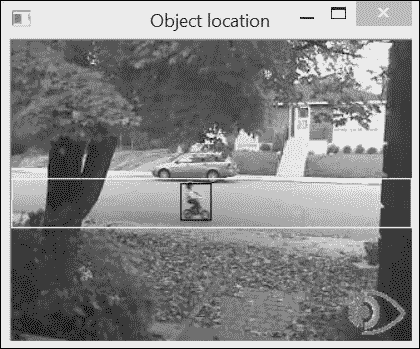

白色矩形表示搜索区域。已计算了所有适合该区域的窗口的直方图。我们保持了窗口大小不变，但寻找稍微小一些或大一些的窗口可能是一个很好的策略，以便考虑最终的比例变化。请注意，为了限制计算的复杂性，要计算的直方图中的箱数应保持较低。在我们的例子中，我们将这个数字减少到`16`个箱。因此，多平面图像的平面`0`包含一个二值图像，显示所有介于`0`和`15`之间的像素，而平面`1`显示介于`16`和`31`之间的像素，依此类推。

对象的搜索包括计算给定大小窗口在预定像素范围内的所有直方图。这代表了从我们的积分图像中高效计算出的`3200`个不同直方图的计算。我们 `IntegralImage` 类返回的所有直方图都包含在一个 `cv::Vec` 对象中（由于使用了 `at` 方法）。然后我们使用 `cv::compareHist` 函数来识别最相似的直方图（请记住，这个函数，像大多数 OpenCV 函数一样，可以通过方便的 `cv::InputArray` 泛型参数类型接受 `cv::Mat` 或 `cv::Vec` 对象）。

## 参见

+   第八章, *检测兴趣点* 将介绍也依赖于积分图像使用的 `SURF` 操作符。

+   文章《基于积分直方图的鲁棒片段跟踪》（*A. Adam, E. Rivlin, 和 I. Shimshoni 在 2006 年国际计算机视觉和模式识别会议论文集中的作品，第 798-805 页*）描述了一种有趣的方法，该方法使用积分图像在图像序列中跟踪对象。
