# 第五章 使用形态学操作转换图像

在本章中，我们将介绍以下配方：

+   使用形态学过滤器腐蚀和膨胀图像

+   使用形态学过滤器打开和关闭图像

+   使用形态学过滤器检测边缘和角

+   使用分水岭分割图像

+   使用 MSER 提取特征区域

+   使用 GrabCut 算法提取前景对象

# 简介

**数学形态学**是 20 世纪 60 年代为分析和处理离散图像而开发的一种理论。它定义了一系列通过使用预定义的形状元素探测图像来转换图像的算子。这个形状元素与像素邻域的交集方式决定了操作的结果。本章介绍了最重要的形态学算子。它还探讨了使用基于形态学算子的算法进行图像分割和特征检测的问题。

# 使用形态学过滤器腐蚀和膨胀图像

腐蚀和膨胀是最基本的形态学算子。因此，我们将首先介绍这些算子。数学形态学的基本组成部分是**结构元素**。结构元素可以简单地定义为定义了原点（也称为**锚点**）的像素配置（以下图中的正方形形状）。应用形态学过滤器包括使用这个结构元素探测图像中的每个像素。当结构元素的原点与给定的像素对齐时，它与图像的交集定义了一个特定形态学操作应用的像素集（以下图中的九个阴影像素）。原则上，结构元素可以是任何形状，但最常见的是使用具有原点在中心的简单形状，如正方形、圆形或菱形（主要是为了效率原因），如下所示：

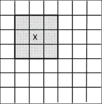

## 准备就绪

由于形态学过滤器通常在二值图像上工作，我们将使用上一章第一个配方中通过阈值创建的二值图像。然而，由于在形态学中，惯例是用高（白色）像素值表示前景对象，用低（黑色）像素值表示背景对象，因此我们已对图像进行了取反。

在形态学术语中，以下图像被认为是上一章创建的图像的补集：

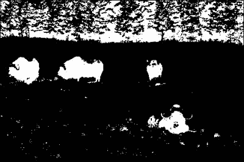

## 如何操作...

腐蚀和膨胀在 OpenCV 中作为简单的函数实现，分别是`cv::erode`和`cv::dilate`。它们的用法简单直接：

```py
   // Read input image
   cv::Mat image= cv::imread("binary.bmp");

   // Erode the image
   cv::Mat eroded;  // the destination image
   cv::erode(image,eroded,cv::Mat());

   // Dilate the image
   cv::Mat dilated;  // the destination image
   cv::dilate(image,dilated,cv::Mat());
```

以下屏幕截图显示了这些函数调用产生的两个图像。第一个屏幕截图显示了腐蚀：

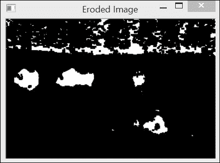

第二个屏幕截图显示了膨胀的结果：

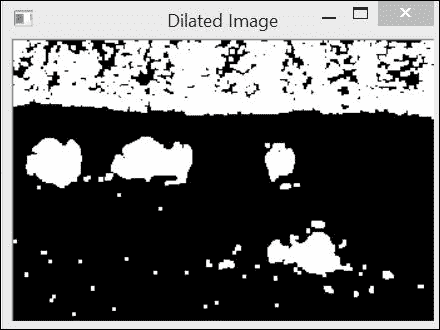

## 如何工作...

与所有其他形态学过滤器一样，这个菜谱中的两个过滤器都是根据结构元素定义的每个像素（或邻域）的像素集（或邻域）进行操作的。回想一下，当应用于某个像素时，结构元素的锚点与该像素位置对齐，并且所有与结构元素相交的像素都包含在当前集合中。**腐蚀**用在定义的像素集中找到的最小像素值替换当前像素。**膨胀**是互补操作，它用在定义的像素集中找到的最大像素值替换当前像素。由于输入的二值图像只包含黑色（`0`）和白色（`255`）像素，每个像素要么被替换为白色像素，要么被替换为黑色像素。

将这两个算子的效果形象化的一种好方法是考虑背景（黑色）和前景（白色）对象。在腐蚀过程中，如果结构元素放置在某个像素位置时接触到背景（即，交集中的一组像素是黑色），那么这个像素将被发送到背景。在膨胀的情况下，如果结构元素在背景像素上接触到前景对象，那么这个像素将被赋予白色值。这解释了为什么腐蚀图像中对象的大小已经减小（形状已经被腐蚀）。注意，一些小对象（可以被认为是“噪声”背景像素）也被完全消除了。同样，膨胀的对象现在更大，它们内部的一些“空洞”也被填充了。默认情况下，OpenCV 使用 3 x 3 的正方形结构元素。当在函数调用中将空矩阵（即`cv::Mat()`）指定为第三个参数时，就得到了这个默认的结构元素，就像在先前的例子中那样。您也可以通过提供一个矩阵来指定您想要的（大小和形状）结构元素，其中非零元素定义了结构元素。在下面的例子中，应用了一个 7 x 7 的结构元素：

```py
   cv::Mat element(7,7,CV_8U,cv::Scalar(1));
   cv::erode(image,eroded,element);
```

在这种情况下，效果要破坏性得多，如下面的截图所示：

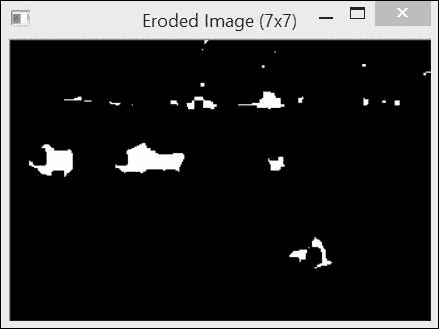

获得相同结果的另一种方法是重复应用相同的结构元素到图像上。这两个函数有一个可选参数可以指定重复的次数：

```py
   // Erode the image 3 times.
   cv::erode(image,eroded,cv::Mat(),cv::Point(-1,-1),3);
```

参数`cv::Point(-1,-1)`表示原点位于矩阵的中心（默认）；它可以在结构元素的任何位置定义。得到的图像将与使用 7 x 7 结构元素得到的图像相同。实际上，腐蚀图像两次与腐蚀一个自身膨胀的结构元素相同。这也适用于膨胀。

最后，由于背景/前景的概念是任意的，我们可以做出以下观察（这是腐蚀/膨胀算子的基本属性）。使用结构元素腐蚀前景对象可以看作是图像背景部分的膨胀。换句话说，我们可以得出以下结论：

+   图像的腐蚀等同于补图像膨胀的补集

+   图像的膨胀等同于补图像腐蚀的补集

## 更多...

注意，尽管我们在这里对二值图像应用了形态学滤波器，但这些滤波器也可以用相同的定义应用于灰度图像甚至彩色图像。

此外，请注意，OpenCV 的形态学函数支持就地处理。这意味着您可以使用输入图像作为目标图像，如下所示：

```py
   cv::erode(image,image,cv::Mat());
```

OpenCV 会为您创建所需的临时图像，以确保其正常工作。

## 参见

+   *使用形态学滤波器进行图像的开放和闭合*菜谱将腐蚀和膨胀滤波器级联应用以产生新的算子

+   *使用形态学滤波器检测边缘和角点*菜谱在灰度图像上应用形态学滤波器

# 使用形态学滤波器进行图像的开放和闭合

之前菜谱向您介绍了两个基本的形态学算子：膨胀和腐蚀。从这些算子中，可以定义其他算子。接下来的两个菜谱将介绍其中的一些。本菜谱中介绍了开放和闭合算子。

## 如何操作...

为了应用高级形态学滤波器，您需要使用带有适当功能代码的`cv::morphologyEx`函数。例如，以下调用将应用闭合算子：

```py
   cv::Mat element5(5,5,CV_8U,cv::Scalar(1));
   cv::Mat closed;
   cv::morphologyEx(image,closed,cv::MORPH_CLOSE,element5);
```

注意，我们使用了 5 x 5 的结构元素来使滤波器效果更加明显。如果我们使用前一道菜谱的二值图像作为输入，我们将获得类似于以下截图所示的图像：

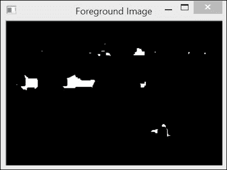

类似地，应用形态学开放算子将产生以下截图：

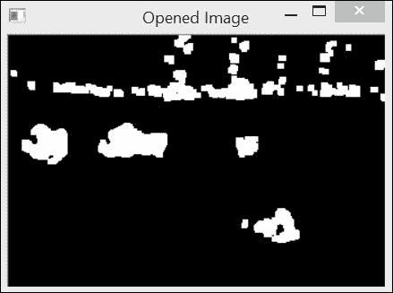

上述图像是通过以下代码获得的：

```py
   cv::Mat opened;
   cv::morphologyEx(image,opened,cv::MORPH_OPEN,element5);
```

## 工作原理...

开放和闭合滤波器只是用基本腐蚀和膨胀操作来定义的。**闭合**定义为图像膨胀的腐蚀。**开放**定义为图像腐蚀的膨胀。

因此，可以使用以下调用计算图像的闭合：

```py
   // dilate original image
   cv::dilate(image,result,cv::Mat());
   // in-place erosion of the dilated image
   cv::erode(result,result,cv::Mat()); 
```

开放滤波器可以通过反转这两个函数调用获得。在检查闭合滤波器的结果时，可以看到白色前景对象的小孔已被填充。该滤波器还连接了几个相邻的对象。基本上，任何太小而无法完全包含结构元素的孔洞或间隙都将被滤波器消除。

相反，开运算从场景中消除了几个小物体。所有太小以至于无法包含结构元素的物体都被移除了。

这些过滤器通常用于对象检测。闭运算将错误地分割成更小片段的物体连接起来，而开运算则移除由图像噪声引入的小块。因此，按顺序使用它们是有利的。如果我们连续地对测试二值图像进行闭运算和开运算，我们将获得一个只显示场景中主要物体的图像，如下面的截图所示。如果您希望优先进行噪声过滤，也可以在闭运算之前应用开运算，但这将以消除一些碎片化物体为代价。

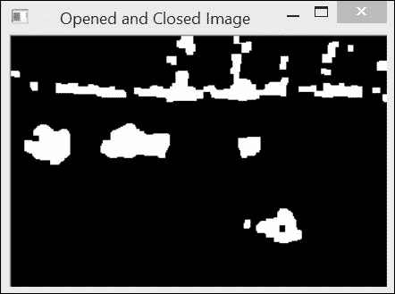

注意，对图像多次应用相同的开运算（以及类似地，闭运算）没有任何效果。实际上，由于开运算已经通过填充孔洞，因此再次应用相同的过滤器不会对图像产生任何其他变化。从数学的角度来看，这些算子被称为幂等的。

## 参见

开运算和闭运算算子通常用于在提取图像的连通组件之前清理图像，如第七章中“提取组件轮廓”菜谱所述，*提取线条、轮廓和组件*。

# 使用形态学过滤器检测边缘和角

形态学过滤器也可以用于检测图像中的特定特征。在本菜谱中，我们将学习如何检测灰度图像中的轮廓和角。

## 准备就绪

在这个菜谱中，将使用以下图像：

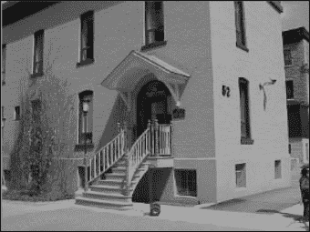

## 如何做...

图像的边缘可以通过使用`cv::morphologyEx`函数的适当过滤器来检测。请参阅以下代码：

```py
// Get the gradient image using a 3x3 structuring element
cv::Mat result;
cv::morphologyEx(image,result,
                         cv::MORPH_GRADIENT,cv::Mat());

// Apply threshold to obtain a binary image
int threshold= 40;
cv::threshold(result, result, 
                    threshold, 255, cv::THRESH_BINARY);
```

下面的图像是结果：

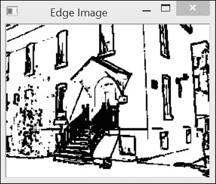

为了使用形态学检测角，我们现在定义一个名为`MorphoFeatures`的类，如下所示：

```py
class MorphoFeatures {

  private:

     // threshold to produce binary image
    int threshold;
    // structuring elements used in corner detection
    cv::Mat_<uchar> cross;
    cv::Mat_<uchar> diamond;
    cv::Mat_<uchar> square;
    cv::Mat_<uchar> x;
```

使用形态学角检测角检测稍微复杂一些，因为它需要连续应用几个不同的形态学过滤器。这是一个使用非正方形结构元素的很好例子。确实，这需要在构造函数中定义四个不同形状的结构元素，形状为正方形、菱形、十字形和 X 形（所有这些结构元素都具有固定的 5 x 5 维以简化问题）：

```py
MorphoFeatures() : threshold(-1), 
      cross(5, 5), diamond(5, 5), square(5, 5), x(5, 5) {

      // Creating the cross-shaped structuring element
      cross <<
        0, 0, 1, 0, 0,
        0, 0, 1, 0, 0,
        1, 1, 1, 1, 1,
        0, 0, 1, 0, 0,
        0, 0, 1, 0, 0;
      // Similarly creating the other elements
```

在检测角特征时，所有这些结构元素都按级联方式应用，以获得最终的角图：

```py
cv::Mat getCorners(const cv::Mat &image) {

   cv::Mat result;

   // Dilate with a cross   
   cv::dilate(image,result,cross);

   // Erode with a diamond
   cv::erode(result,result,diamond);

   cv::Mat result2;
   // Dilate with a X   
   cv::dilate(image,result2,x);

   // Erode with a square
   cv::erode(result2,result2,square);
   // Corners are obtained by differencing
   // the two closed images
   cv::absdiff(result2,result,result);

   // Apply threshold to obtain a binary image
   applyThreshold(result);

   return result;
}
```

然后使用以下代码在图像上检测角：

```py
// Get the corners
cv::Mat corners;
corners= morpho.getCorners(image);

// Display the corner on the image
morpho.drawOnImage(corners,image);
cv::namedWindow("Corners on Image");
cv::imshow("Corners on Image",image);
```

在图像中，检测到的角以圆圈的形式显示，如下面的截图所示：

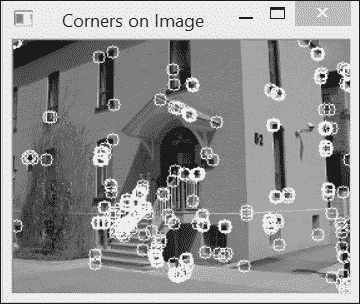

## 它如何工作...

要理解形态学算子对灰度图像的影响，可以将图像视为一个拓扑地形，其中灰度级别对应于高度（或海拔）。从这种角度来看，明亮区域对应于山脉，而暗区对应于地形的山谷。此外，由于边缘对应于暗亮像素之间的快速过渡，这些可以想象为陡峭的悬崖。如果在这种地面上应用腐蚀操作符，最终结果将是用一定邻域中的最低值替换每个像素，从而降低其高度。因此，随着山谷的扩张，悬崖将被“腐蚀”。相反，膨胀具有完全相反的效果；也就是说，悬崖将在山谷上方获得地形。然而，在这两种情况下，高原（即强度恒定的区域）将相对保持不变。

这些观察结果导致了一种简单的方法来检测图像的边缘（或悬崖）。这可以通过计算膨胀图像和腐蚀图像之间的差异来实现。由于这两个转换图像主要在边缘位置不同，因此减法将强调图像边缘。这正是当输入`cv::MORPH_GRADIENT`参数时，`cv::morphologyEx`函数所做的事情。显然，结构元素越大，检测到的边缘就越粗。这个边缘检测操作符也被称为**Beucher**梯度（下一章将更详细地讨论图像梯度的概念）。请注意，通过简单地从原始图像减去膨胀图像或从原始图像减去腐蚀图像也可以获得类似的结果。得到的边缘会更细。

角点检测稍微复杂一些，因为它使用了四个不同的结构元素。这个操作符在 OpenCV 中未实现，但我们在这里展示它是如何定义和组合各种形状的结构元素的。其思路是通过使用两个不同的结构元素对图像进行膨胀和腐蚀来封闭图像。这些元素被选择得使得它们不会改变直线边缘，但由于它们各自的效果，角点的边缘将会受到影响。让我们使用以下简单的由单个白色正方形组成的图像来更好地理解这种非对称封闭操作的效果：

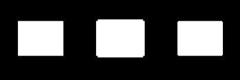

第一个正方形是原始图像。当使用十字形结构元素膨胀时，正方形的边缘会扩展，除了在角点处，因为十字形没有接触到正方形。这是中间正方形所展示的结果。然后，使用具有菱形形状的结构元素对膨胀后的图像进行腐蚀。这种腐蚀将大多数边缘恢复到原始位置，但由于角点没有被膨胀，所以它们被推得更远。然后得到最右侧的正方形，它（如所见）已经失去了其锐利的角。使用 X 形和正方形结构元素重复相同的程序。这两个元素是先前元素的旋转版本，因此将捕捉到 45 度方向的角。最后，对这两个结果进行差分将提取角特征。

## 参考以下内容

+   第六章中的*应用方向滤波器以检测边缘*配方，*过滤图像*描述了执行边缘检测的其他滤波器。

+   第八章，*检测兴趣点*，介绍了执行角点检测的不同算子。

+   文章《形态梯度》，作者 J.-F. Rivest, P. Soille, 和 S. Beucher，发表于 1992 年 2 月的 ISET 电子成像科学和技术研讨会，SPIE，详细讨论了形态梯度的概念。

+   文章《改进的调节形态角点检测器》，作者 F.Y. Shih, C.-F. Chuang, 和 V. Gaddipati，发表于 2005 年 5 月的《Pattern Recognition Letters》，第 26 卷第 7 期，提供了关于形态角点检测的更多信息。

# 使用水印分割图像

水印变换是一种流行的图像处理算法，用于快速将图像分割成同质区域。它基于这样的想法：当图像被视为拓扑起伏时，同质区域对应于相对平坦的盆地，这些盆地由陡峭的边缘所限定。由于其简单性，该算法的原始版本往往会过度分割图像，从而产生多个小区域。这就是为什么 OpenCV 提出了该算法的一个变体，该变体使用一组预定义的标记来引导图像段定义。

## 如何实现...

水印分割是通过使用`cv::watershed`函数获得的。该函数的输入是一个 32 位有符号整数标记图像，其中每个非零像素代表一个标签。其想法是标记图像中已知属于某个区域的像素。从这个初始标记开始，水印算法将确定其他像素所属的区域。在这个配方中，我们首先创建标记图像作为灰度图像，然后将其转换为整数图像。我们方便地将这一步骤封装到`WatershedSegmenter`类中。请参考以下代码：

```py
class WatershedSegmenter {

  private:

     cv::Mat markers;

  public:

     void setMarkers(const cv::Mat& markerImage) {

      // Convert to image of ints
      markerImage.convertTo(markers,CV_32S);
     }

     cv::Mat process(const cv::Mat &image) {

      // Apply watershed
      cv::watershed(image,markers);

      return markers;
     }
```

这些标记的获取方式取决于应用。例如，一些预处理步骤可能导致了识别一些属于感兴趣对象的像素。然后使用水岭来从初始检测中界定整个对象。在本食谱中，我们将简单地使用本章中使用的二值图像来识别对应原始图像中的动物（这是在第四章，*使用直方图计数像素*中显示的图像）。因此，从我们的二值图像中，我们需要识别属于前景（动物）的像素和属于背景（主要是草地）的像素。在这里，我们将前景像素标记为标签 `255`，背景像素标记为标签 `128`（这种选择完全是任意的；除了 `255` 之外的其他标签数字也可以工作）。其他像素，即标签未知的那部分像素，被分配值为 `0`。

到目前为止，二值图像包含太多属于图像各个部分的白色像素。因此，我们将严重侵蚀此图像，仅保留属于重要对象的像素：

```py
   // Eliminate noise and smaller objects
   cv::Mat fg;
   cv::erode(binary,fg,cv::Mat(),cv::Point(-1,-1),4);
```

结果是以下图像：

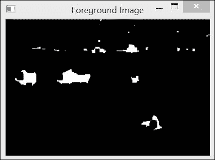

注意，仍然有一些属于背景（森林）的像素存在。让我们保留它们。因此，它们将被认为是对应于感兴趣对象的。同样，我们通过在原始二值图像上执行大膨胀来选择背景的几个像素：

```py
   // Identify image pixels without objects
   cv::Mat bg;
   cv::dilate(binary,bg,cv::Mat(),cv::Point(-1,-1),4);
   cv::threshold(bg,bg,1,128,cv::THRESH_BINARY_INV);
```

最终的黑色像素对应于背景像素。这就是为什么阈值操作在膨胀之后立即将这些像素的值分配为 `128`。得到的图像如下：

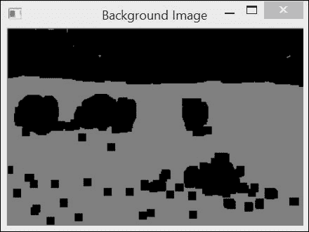

这些图像被组合成标记图像，如下所示：

```py
   // Create markers image
   cv::Mat markers(binary.size(),CV_8U,cv::Scalar(0));
   markers= fg+bg;
```

注意我们在这里如何使用重载的运算符 `+` 来组合图像。以下图像将被用作水岭算法的输入：

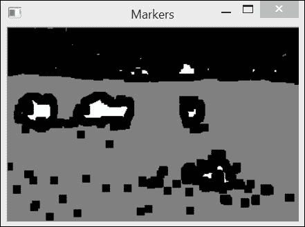

在这个输入图像中，白色区域肯定属于前景对象，灰色区域是背景的一部分，黑色区域具有未知标签。然后通过以下方式获得分割：

```py
   // Create watershed segmentation object
   WatershedSegmenter segmenter;

   // Set markers and process
   segmenter.setMarkers(markers);
   segmenter.process(image);
```

标记图像随后被更新，使得每个零像素被分配给输入标签中的一个，而属于找到的边界的像素具有值 `-1`。标签的最终图像如下所示：

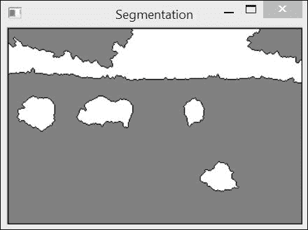

边界图像将类似于以下截图：

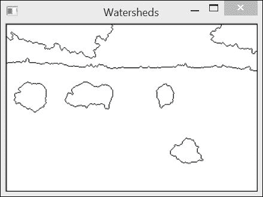

## 它是如何工作的...

正如我们在前面的菜谱中所做的那样，我们将在分水岭算法的描述中使用拓扑图类比。为了创建分水岭分割，想法是从级别 0 开始逐渐淹没图像。随着“水”的级别逐渐增加（到级别 1、2、3 等等），会形成集水盆地。这些盆地的尺寸也逐步增加，因此，来自两个不同盆地的水最终会汇合。当这种情况发生时，为了保持两个盆地的分离，会创建一个分水岭。一旦水的级别达到最大值，这些创建的盆地和分水岭的集合就形成了分水岭分割。

如预期的那样，淹没过程最初会创建许多小的独立盆地。当所有这些盆地都合并时，会创建许多分水岭线，这导致图像过度分割。为了克服这个问题，已经提出了一种修改后的算法，其中淹没过程从预定义的标记像素集开始。从这些标记创建的盆地按照分配给初始标记的值进行标记。当具有相同标签的两个盆地合并时，不会创建分水岭，从而防止过度分割。这就是调用 `cv::watershed` 函数时发生的情况。输入标记图像被更新以产生最终的分水岭分割。用户可以输入带有任何数量标签的标记图像，未知标签的像素保留为值 `0`。标记图像被选择为 32 位有符号整数图像，以便能够定义超过 `255` 个标签。它还允许将特殊值 `-1` 分配给与分水岭相关的像素。这是 `cv::watershed` 函数返回的。

为了便于显示结果，我们引入了两种特殊方法。第一种方法返回标签图像（分水岭值为 `0`）。这可以通过阈值化轻松完成，如下所示：

```py
     // Return result in the form of an image
     cv::Mat getSegmentation() {

      cv::Mat tmp;
      // all segment with label higher than 255
      // will be assigned value 255
      markers.convertTo(tmp,CV_8U);

      return tmp;
     }
```

同样地，第二种方法返回的图像中，分水岭线被赋予值 `0`，而图像的其余部分为 `255`。这次使用 `cv::convertTo` 方法来实现这一结果，如下所示：

```py
     // Return watershed in the form of an image
     cv::Mat getWatersheds() {

      cv::Mat tmp;
      // Each pixel p is transformed into
      // 255p+255 before conversion
      markers.convertTo(tmp,CV_8U,255,255);

      return tmp;
     }
```

在转换之前应用的线性变换允许 `-1` 像素转换为 `0`（因为 *-1*255+255=0*）。

值大于 `255` 的像素被赋予值 `255`。这是由于在将有符号整数转换为无符号字符时应用的饱和操作。

## 还有更多...

显然，标记图像可以通过许多不同的方式获得。例如，可以交互式地要求用户在场景的对象和背景上绘制区域。或者，为了识别图像中心位置的对象，也可以简单地输入一个带有中心区域标记的图像，该区域用某种标签标记，而图像的边缘（假设存在背景）用另一个标签标记。这个标记图像可以创建如下：

```py
// Identify background pixels
cv::Mat imageMask(image.size(),CV_8U,cv::Scalar(0));
cv::rectangle(imageMask,cv::Point(5,5),
     cv::Point(image.cols-5,
               image.rows-5),cv::Scalar(255),3);
// Identify foreground pixels 
// (in the middle of the image)
cv::rectangle(imageMask,
     cv::Point(image.cols/2-10,image.rows/2-10),
     cv::Point(image.cols/2+10,image.rows/2+10),
     cv::Scalar(1),10);
```

如果我们将这个标记图像叠加到测试图像上，我们将获得以下图像：


下面的结果是流域图像：

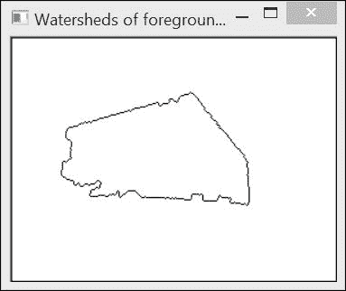

## 参见

+   文章《粘性流域变换》，*C. Vachier 和 F. Meyer，数学图像与视觉杂志，第 22 卷，第 2-3 期，2005 年 5 月*，提供了关于流域变换的更多信息

+   本章的最后一个配方，*使用 GrabCut 算法提取前景对象*，介绍了另一种可以将图像分割为背景和前景对象的图像分割算法

# 使用 MSER 提取独特区域

在前面的配方中，你学习了如何通过逐渐淹没图像并创建流域来将图像分割成区域。**最大稳定极值区域**（**MSER**）算法使用相同的沉浸类比来提取图像中的有意义区域。这些区域也将通过逐级淹没图像来创建，但这次，我们将对在沉浸过程中相对稳定的盆地感兴趣。将观察到这些区域对应于图像中场景对象的某些独特部分。

## 如何做到这一点...

计算图像 MSER 的基本类是 `cv::MSER`。可以通过使用默认的空构造函数创建此类的一个实例。在我们的情况下，我们选择通过指定检测到的区域的最小和最大尺寸来初始化它，以限制其数量。然后，我们的调用如下所示：

```py
// basic MSER detector
cv::MSER mser(5, // delta value for extremal region detection
            200, // min acceptable area 
          1500); // max acceptable area
```

现在，可以通过调用一个函数对象来获得 MSER，指定输入图像和适当的数据结构，如下所示：

```py
  // vector of point sets
  std::vector<std::vector<cv::Point>> points;
  // detect MSER features
  mser(image, points);
```

结果是一个由组成每个区域的像素点表示的区域向量。为了可视化结果，我们在一个空白图像上显示检测到的区域，这些区域将以不同的颜色（随机选择）显示。这是通过以下方式完成的：

```py
  // create white image
  cv::Mat output(image.size(),CV_8UC3);
  output= cv::Scalar(255,255,255);

  // random number generator
  cv::RNG rng;

  // for each detected feature
  for (std::vector<std::vector<cv::Point>>::
            iterator it= points.begin();
         it!= points.end(); ++it) {

    // generate a random color
    cv::Vec3b c(rng.uniform(0,255),
               rng.uniform(0,255),
               rng.uniform(0,255));

    // for each point in MSER set
    for (std::vector<cv::Point>::
                 iterator itPts= it->begin();
              itPts!= it->end(); ++itPts) {

      //do not overwrite MSER pixels
      if (output.at<cv::Vec3b>(*itPts)[0]==255) {

        output.at<cv::Vec3b>(*itPts)= c;
      }
    }
  }
```

注意，MSER 形成区域的一个层次结构。因此，为了使所有这些区域都可见，我们选择在它们包含在更大的区域中时不要覆盖小区域。如果我们在这个图像上检测到 MSER：

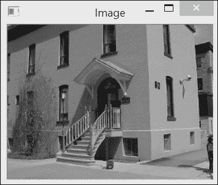

然后，生成的图像将如下所示（请参考书籍的图形 PDF 以查看此图像的颜色）（参照以下内容）：

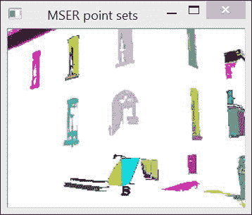

这些是检测的原始结果。尽管如此，可以观察到这个操作员如何能够从这个图像中提取一些有意义的区域（例如，建筑物的窗户）。

## 它是如何工作的……

MSER 使用与水算法相同的机制；也就是说，它通过从级别`0`逐渐淹没图像到级别`255`来执行。随着水位的升高，你可以观察到那些尖锐界定较暗的区域形成了在一定时间内形状相对稳定的盆地（回忆一下，在沉浸类比中，水位对应于强度级别）。这些稳定的盆地就是 MSER。这些是通过考虑每个级别的连通区域并测量它们的稳定性来检测的。这是通过比较区域的当前面积与当级别下降 delta 值时的先前面积来完成的。当这种相对变化达到局部最小值时，该区域被识别为 MSER。用于测量相对稳定性的 delta 值是`cv::MSER`类构造函数的第一个参数；其默认值是`5`。此外，要考虑的区域大小必须在某个预定义的范围内。可接受的区域最小和最大大小是构造函数的下一个两个参数。我们还必须确保 MSER 是稳定的（第四个参数），也就是说，其形状的相对变化足够小。稳定的区域可以包含在更大的区域中（称为父区域）。

要有效，父 MSER 必须与其子足够不同；这是多样性标准，它由`cv::MSER`构造函数的第五个参数指定。在上一节中使用的示例中，使用了这两个最后参数的默认值。（这些最后两个参数的默认值是 MSER 允许的最大变化为`0.25`，父 MSER 的最小多样性为`0.2`。）

MSER 检测器的输出是一个点集的向量。由于我们通常更关注整个区域而不是其单个像素位置，因此通常用描述 MSER 位置和大小的简单几何形状来表示 MSER。边界椭圆是一种常用的表示方法。为了获得这些椭圆，我们将利用两个方便的 OpenCV 函数。第一个是`cv::minAreaRect`函数，它找到绑定集合中所有点的最小面积矩形。这个矩形由一个`cv::RotatedRect`实例描述。一旦找到这个边界矩形，就可以使用`cv::ellipse`函数在图像上绘制内切椭圆。让我们将这个完整的过程封装在一个类中。这个类的构造函数基本上重复了`cv::MSER`类的构造函数。参考以下代码：

```py
class MSERFeatures {

  private:

    cv::MSER mser;        // mser detector
    double minAreaRatio;  // extra rejection parameter

  public:

    MSERFeatures(
           // aceptable size range
           int minArea=60, int maxArea=14400,
           // min value for MSER area/bounding-rect area 
           double minAreaRatio=0.5,
           // delta value used for stability measure 
           int delta=5, 
           // max allowed area variation
           double maxVariation=0.25, 
           // min size increase between child and parent
           double minDiversity=0.2):
           mser(delta,minArea,maxArea,
           maxVariation,minDiversity), 
           minAreaRatio(minAreaRatio) {}
```

添加了一个额外的参数（`minAreaRatio`）来消除那些边界矩形面积与所代表 MSER 面积差异很大的 MSER。这是为了去除那些不太有趣的细长形状。

代表性边界矩形的列表是通过以下方法计算的：

```py
// get the rotated bounding rectangles 
// corresponding to each MSER feature
// if (mser area / bounding rect area) < areaRatio, 
// the feature is rejected
void getBoundingRects(const cv::Mat &image, 
                      std::vector<cv::RotatedRect> &rects) {

  // detect MSER features
  std::vector<std::vector<cv::Point>> points;
  mser(image, points);

  // for each detected feature
  for (std::vector<std::vector<cv::Point>>::
            iterator it= points.begin();
         it!= points.end(); ++it) {

        // Extract bouding rectangles
        cv::RotatedRect rr= cv::minAreaRect(*it);

        // check area ratio
        if (it->size() > minAreaRatio*rr.size.area())
        rects.push_back(rr);
  }
}
```

使用以下方法在图像上绘制相应的椭圆：

```py
// draw the rotated ellipses corresponding to each MSER
cv::Mat getImageOfEllipses(const cv::Mat &image,
            std::vector<cv::RotatedRect> &rects, 
            cv::Scalar color=255) {

  // image on which to draw
  cv::Mat output= image.clone();

  // get the MSER features
  getBoundingRects(image, rects);

  // for each detected feature
  for (std::vector<cv::RotatedRect>::
            iterator it= rects.begin();
         it!= rects.end(); ++it) {
        cv::ellipse(output,*it,color);
  }

  return output;
}
```

MSER 的检测随后获得如下：

```py
  // create MSER feature detector instance
  MSERFeatures mserF(200, // min area 
                    1500, // max area
                    0.5); // ratio area threshold
                          // default delta is used

  // the vector of bounding rotated rectangles
  std::vector<cv::RotatedRect> rects;

  // detect and get the image
  cv::Mat result= mserF.getImageOfEllipses(image,rects);
```

通过将此函数应用于之前使用的图像，我们将得到以下图像：

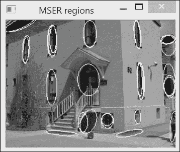

将此结果与之前的结果进行比较应该会使您相信这种后来的表示更容易解释。注意，子 MSER 和父 MSER 通常由非常相似的椭圆表示。在某些情况下，然后可能会对这些椭圆应用最小变化标准，以消除这些重复的表示。

## 参见

+   第七章中的*计算组件形状描述符*配方，*提取线条、轮廓和组件*将向您展示如何计算连接点集的其他属性

+   第八章，*检测兴趣点*将解释如何使用 MSER 作为兴趣点检测器

# 使用 GrabCut 算法提取前景对象

OpenCV 提出了另一个流行的图像分割算法的实现：**GrabCut**算法。这个算法不是基于数学形态学，但我们在这里介绍它，因为它在用法上与本章 earlier 提到的水系分割算法有一些相似之处。与水系相比，GrabCut 的计算成本更高，但通常会产生更准确的结果。当您想要从静态图像中提取前景对象时（例如，从一个图片中剪切并粘贴对象到另一个图片中），这是最好的算法。

## 如何操作...

`cv::grabCut`函数易于使用。您只需要输入一个图像，并标记其中一些像素属于背景或前景。基于这种部分标记，算法将确定整个图像的前景/背景分割。

一种指定输入图像的部分前景/背景标记的方法是在其中定义一个矩形，前景对象包含在这个矩形内：

```py
   // define bounding rectangle
   // the pixels outside this rectangle
   // will be labeled as background 
   cv::Rect rectangle(5,70,260,120);
```

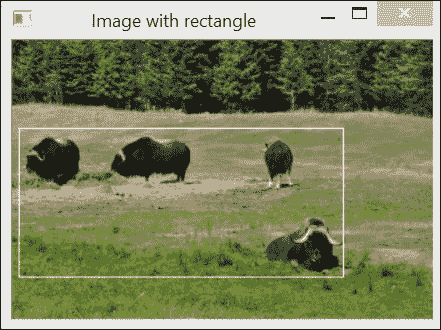

然后所有在这个矩形之外的像素将被标记为背景。除了输入图像及其分割图像外，调用`cv::grabCut`函数还需要定义两个矩阵，这些矩阵将包含算法构建的模型，如下所示：

```py
   cv::Mat result; // segmentation (4 possible values)
   cv::Mat bgModel,fgModel; // the models (internally used)
   // GrabCut segmentation
   cv::grabCut(image,    // input image
            result,      // segmentation result
            rectangle,   // rectangle containing foreground 
            bgModel,fgModel, // models
            5,           // number of iterations
            cv::GC_INIT_WITH_RECT); // use rectangle
```

注意我们如何指定使用边界矩形模式，通过将 `cv::GC_INIT_WITH_RECT` 标志作为函数的最后一个参数（下一节将讨论其他可用模式）。输入/输出分割图像可以具有以下四个值之一：

+   `cv::GC_BGD`：这是属于背景像素的值（例如，在我们的例子中矩形外的像素）

+   `cv::GC_FGD`：这是属于前景像素的值（在我们的例子中没有这样的像素）

+   `cv::GC_PR_BGD`：这是可能属于背景的像素的值

+   `cv::GC_PR_FGD`：这是可能属于前景像素的值（即我们例子中矩形内部像素的初始值）

我们通过提取值为 `cv::GC_PR_FGD` 的像素来得到分割的二值图像。参考以下代码：

```py
   // Get the pixels marked as likely foreground
   cv::compare(result,cv::GC_PR_FGD,result,cv::CMP_EQ);
   // Generate output image
   cv::Mat foreground(image.size(),CV_8UC3,
                      cv::Scalar(255,255,255));
   image.copyTo(foreground,// bg pixels are not copied
                result);
```

要提取所有前景像素，即值为 `cv::GC_PR_FGD` 或 `cv::GC_FGD` 的像素，可以检查第一个位的值，如下所示：

```py
   // checking first bit with bitwise-and
   result= result&1; // will be 1 if FG 
```

这之所以可能，是因为这些常量被定义为值 1 和 3，而其他两个（`cv::GC_BGD` 和 `cv::GC_PR_BGD`）被定义为 0 和 2。在我们的例子中，得到相同的结果是因为分割图像不包含 `cv::GC_FGD` 像素（只有 `cv::GC_BGD` 像素被输入）。

最后，通过以下带有掩膜的复制操作，我们得到前景对象（在白色背景上）的图像：

```py
   // Generate output image
   cv::Mat foreground(image.size(),CV_8UC3,
             cv::Scalar(255,255,255)); // all white image
   image.copyTo(foreground,result); // bg pixels not copied
```

下图是得到的结果：

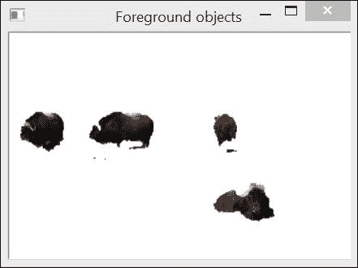

## 它是如何工作的...

在前面的例子中，GrabCut 算法能够通过简单地指定一个包含这些对象（四只动物）的矩形来提取前景对象。或者，也可以将 `cv::GC_BGD` 和 `cv::GC_FGD` 的值分配给分割图像中的某些特定像素，这些像素作为 `cv::grabCut` 函数的第二个参数提供。然后，指定 `GC_INIT_WITH_MASK` 作为输入模式标志。这些输入标签可以通过要求用户交互式标记图像的几个元素来获得。也可以将这两种输入模式结合起来。

使用此输入信息，GrabCut 算法通过以下步骤创建背景/前景分割。最初，将前景标签(`cv::GC_PR_FGD`)暂时分配给所有未标记的像素。根据当前的分类，算法将像素分组为相似颜色的簇（即，背景和前景各有`K`个簇）。下一步是通过在前景和背景像素之间引入边界来确定背景/前景分割。这是通过一个优化过程来完成的，该过程试图连接具有相似标签的像素，并对在相对均匀强度区域放置边界施加惩罚。此优化问题可以使用**图割**算法有效地解决，这是一种通过将其表示为应用切割以组成最优配置的连通图来找到问题最优解的方法。获得的分割为像素产生新的标签。然后可以重复聚类过程，并再次找到新的最优分割，依此类推。因此，GrabCut 算法是一个迭代过程，它逐渐改进分割结果。根据场景的复杂性，可以在更多或更少的迭代次数中找到良好的解决方案（在简单情况下，一次迭代就足够了）。

这解释了函数的参数，用户可以指定要应用的迭代次数。算法维护的两个内部模型作为函数的参数传递（并返回）。因此，如果希望通过执行额外的迭代来改进分割结果，可以再次使用上次运行的模型调用该函数。

## 参见

+   文章《GrabCut：在 ACM Transactions on Graphics (SIGGRAPH) 第 23 卷第 3 期，2004 年 8 月》中，*GrabCut：使用迭代图割进行交互式前景提取*，由 C. Rother, V. Kolmogorov 和 A. Blake 描述了 GrabCut 算法的详细信息。
