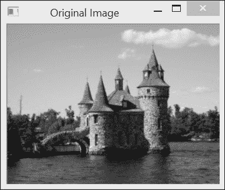

# 第六章. 图像滤波

在本章中，我们将涵盖以下内容：

+   使用低通滤波器过滤图像

+   使用中值滤波器过滤图像

+   将方向滤波器应用于边缘检测

+   计算图像的拉普拉斯算子

# 简介

滤波是信号和图像处理中的基本任务之一。它是一个旨在选择性地提取图像中某些方面（在给定应用背景下被认为传达重要信息）的过程。滤波可以去除图像中的噪声，提取有趣的视觉特征，允许图像重采样等。它源于一般的**信号与系统**理论。我们在此处不会详细讨论这一理论。然而，本章将介绍与滤波相关的一些重要概念，并展示如何在图像处理应用中使用滤波器。但首先，让我们从频域分析的概念进行简要解释。

当我们观察图像时，我们注意到不同的灰度级（或颜色）是如何分布在图像上的。图像之间的差异在于它们有不同的灰度级分布。然而，存在另一种观点，即可以从图像中观察到的灰度级变化。一些图像包含几乎恒定强度的大面积（例如，蓝色的天空），而其他图像的灰度级强度在图像上快速变化（例如，拥挤的繁忙场景中充满了许多小物体）。因此，观察图像中这些变化的频率构成了表征图像的另一种方式。这种观点被称为**频域**，而通过观察图像的灰度级分布来表征图像被称为**空间域**。

频域分析将图像分解为其从最低到最高频率的频率内容。图像强度变化缓慢的区域只包含低频，而高频是由强度快速变化产生的。存在几种著名的变换，如傅里叶变换或余弦变换，可以用来明确地显示图像的频率内容。请注意，由于图像是二维实体，它由垂直频率（垂直方向的变化）和水平频率（水平方向的变化）组成。

在频域分析框架下，**滤波器**是一种操作，它会放大图像中某些频率带的频率，同时阻止（或减少）其他图像频率带。因此，低通滤波器是一种消除图像高频成分的滤波器，而高通滤波器则消除低通成分。本章将介绍一些在图像处理中经常使用的滤波器，并解释它们在应用于图像时的效果。

# 使用低通滤波器进行图像滤波

在这个第一个菜谱中，我们将介绍一些非常基本的低通滤波器。在本章的介绍部分，我们了解到这类滤波器的目的是降低图像变化幅度。实现这一目标的一种简单方法是将每个像素替换为其周围像素的平均值。通过这样做，快速强度变化将被平滑，从而被更渐进的过渡所取代。

## 如何做...

`cv::blur`函数的目标是通过用矩形邻域内计算的每个像素的平均值替换每个像素来平滑图像。这个低通滤波器如下应用：

```py
   cv::blur(image,result,
            cv::Size(5,5)); // size of the filter
```

这种类型的滤波器也称为箱形滤波器。在这里，我们使用`5x5`滤波器来应用它，以便使滤波器效果更明显。请看以下屏幕截图：



在前一个图像上应用滤波器的结果是以下屏幕截图：


在某些情况下，可能希望给予像素邻域中较近像素更多的重视。因此，可以计算加权平均值，其中附近的像素被分配比远离的像素更大的权重。这可以通过使用遵循高斯函数（一种“钟形”函数）的加权方案来实现。`cv::GaussianBlur`函数应用这种滤波器，其调用方式如下：

```py
cv::GaussianBlur(image,
        result, cv::Size(5,5), // size of the filter
        1.5);   // parameter controlling 
                // the shape of the Gaussian
```

结果随后在以下屏幕截图中显示：


## 如何工作...

如果一个滤波器的应用对应于用一个相邻像素的加权总和替换一个像素，那么这个滤波器被称为线性滤波器。这是均值滤波器的情况，其中一个像素被替换为矩形邻域内所有像素的总和，然后除以这个邻域的大小（以得到平均值）。这就像将每个相邻像素乘以像素总数中的`1`，然后将所有这些值相加。滤波器的不同权重可以用一个矩阵来表示，该矩阵显示了与考虑的邻域中每个像素位置相关联的乘数。矩阵的中心元素对应于当前应用滤波器的像素。这种矩阵有时被称为**核**或**掩码**。对于`3x3`均值滤波器，相应的核如下：

| 1/9 | 1/9 | 1/9 |
| --- | --- | --- |
| 1/9 | 1/9 | 1/9 |
| 1/9 | 1/9 | 1/9 |

`cv::boxFilter`函数使用由许多`1`组成的正方形核对图像进行滤波。它与均值滤波器类似，但不需要将结果除以系数的数量。

应用线性滤波器相当于将核移动到图像的每个像素上，并将每个对应的像素与其关联的权重相乘。从数学上讲，这种操作称为**卷积**，可以正式表示如下：


前面的双重求和将当前像素 (x,y) 与 K 核的中心对齐，假设该中心位于坐标 (0,0)。

观察本菜谱生成的输出图像，可以观察到低通滤波器的净效应是模糊或平滑图像。这并不奇怪，因为这个滤波器衰减了与物体边缘上可见的快速变化相对应的高频分量。

在高斯滤波器的情况下，与像素关联的权重与其与中心像素的距离成正比。回想一下，1D 高斯函数具有以下形式：


归一化系数 A 被选择，使得不同的权重之和为 1。σ（西格玛）值控制着结果高斯函数的宽度。这个值越大，函数就越平坦。例如，如果我们计算区间 [-4, 0, 4] 上 σ = 0.5 的 1D 高斯滤波器的系数，我们得到以下系数：

```py
[0.0 0.0 0.00026 0.10645 0.78657 0.10645 0.00026 0.0 0.0]
```

对于 σ=1.5，这些系数如下：

```py
[0.00761 0.036075 0.10959 0.21345 0.26666 
 0.21345 0.10959 0.03608 0.00761 ]
```

注意，这些值是通过调用 `cv::getGaussianKernel` 函数并使用适当的 σ 值获得的：

```py
cv::Mat gauss= cv::getGaussianKernel(9, sigma,CV_32F);
```

高斯函数的对称钟形使其成为滤波的良好选择。参见图下所示：


离中心点更远的像素权重较低，这使得像素间的过渡更平滑。这与平坦的均值滤波器形成对比，其中远离中心的像素可能导致当前均值值的突然变化。从频率的角度来看，这意味着均值滤波器并没有移除所有的高频分量。

要在图像上应用 2D 高斯滤波器，可以先对图像行应用 1D 高斯滤波器（以过滤水平频率），然后应用另一个 1D 高斯滤波器于图像列（以过滤垂直频率）。这是可能的，因为高斯滤波器是一个可分离的滤波器（也就是说，2D 核可以分解为两个 1D 滤波器）。可以使用 `cv::sepFilter2D` 函数应用一个通用的可分离滤波器。也可以直接使用 `cv::filter2D` 函数应用 2D 核。一般来说，可分离滤波器比不可分离滤波器计算更快，因为它们需要的乘法操作更少。

使用 OpenCV，要应用于图像的高斯滤波器通过提供系数数量（第三个参数，它是一个奇数）和 σ（第四个参数）的值来指定 `cv::GaussianBlur`。你也可以简单地设置 σ 的值，让 OpenCV 确定适当的系数数量（此时你输入一个值为 `0` 的滤波器大小）。反之亦然，你可以输入一个大小和一个值为 `0` 的 σ。将确定最适合给定大小的 σ 值。

## 还有更多...

当图像缩放时，也会使用低通滤波器；本节解释了原因。图像缩放可能还需要插值像素值；本节也讨论了这一点。

### 对图像进行下采样

你可能会认为，你可以通过简单地消除图像的一些列和行来减小图像的大小。不幸的是，结果图像看起来不会很好。以下图示通过显示一个测试图像，该图像相对于其原始大小减小了`4`倍，仅仅保留了每`4`列和行的`1`列和行来阐述这一事实。请注意，为了使此图像中的缺陷更加明显，我们通过以两倍更大的像素显示图像来放大图像（下一节将解释如何做到这一点）。请参考以下屏幕截图：


显然，我们可以看到图像质量已经下降。例如，原始图像中城堡屋顶的斜边现在在缩小后的图像上看起来像楼梯。图像纹理部分（例如砖墙）的其他锯齿形扭曲也可见。

这些不希望出现的伪影是由一种称为**空间混叠**的现象引起的，当你试图在无法容纳这些高频成分的过小图像中包含它们时，就会发生这种现象。确实，较小的图像（即像素较少的图像）无法像高分辨率图像那样很好地表示精细纹理和锐利边缘（例如，高清电视与传统电视之间的区别）。由于图像中的精细细节对应于高频，我们在减小图像大小之前需要移除这些高频成分。在本食谱中我们了解到，这可以通过低通滤波器来实现。因此，为了在不添加令人烦恼的伪影的情况下将图像大小减小`4`倍，你必须首先对原始图像应用低通滤波器，然后再丢弃列和行。以下是使用 OpenCV 进行此操作的步骤：

```py
  // first remove high frequency component
  cv::GaussianBlur(image,image,cv::Size(11,11),2.0);
  // keep only 1 of every 4 pixels
  cv::Mat reduced2(image.rows/4,image.cols/4,CV_8U);
  for (int i=0; i<reduced2.rows; i++)
    for (int j=0; j<reduced2.cols; j++)
      reduced2.at<uchar>(i,j)= image.at<uchar>(i*4,j*4);
```

结果图像如下：


当然，图像的一些精细细节已经丢失，但总体而言，图像的视觉质量比之前的情况得到了更好的保留。

OpenCV 还有一个特殊函数也执行图像缩小。这是`cv::pyrDown`函数：

```py
cv::Mat reducedImage;  // to contain reduced image
cv::pyrDown(image,reducedImage); // reduce image size by half
```

之前的功能使用一个`5x5`高斯滤波器在减小图像大小之前对其进行低通滤波。存在一个将图像大小加倍的反向`cv::pyrUp`函数。值得注意的是，在这种情况下，上采样是通过在每两列和行之间插入`0`值来完成的，然后对扩展的图像应用相同的`5x5`高斯滤波器（但系数乘以`4`）。显然，如果您减小图像大小然后再将其放大，您将无法恢复原始图像。在减小大小过程中丢失的内容无法恢复。这两个函数用于创建**图像金字塔**。这是一个由不同大小图像的堆叠版本组成的数据结构（在这里，每个级别比前一个级别小 2 倍，但减小因子可以更小，例如`1.2`），通常为了高效图像分析而构建。例如，如果您想在图像中检测一个对象，检测可以首先在金字塔顶部的较小图像上完成，当您定位到感兴趣的对象时，可以通过移动到包含更高分辨率图像版本的金字塔的较低级别来细化搜索。

注意，还有一个更通用的`cv::resize`函数，允许您指定所需的结果图像大小。您只需指定一个新大小即可，这个大小可以比原始图像小或大：

```py
cv::Mat resizedImage;  // to contain resized image
cv::resize(image,resizedImage,
     cv::Size(image.cols/4,image.rows/4)); // 1/4 resizing
```

还可以通过缩放因子来指定缩放。在这种情况下，作为参数给出一个空的大小实例，后跟所需的缩放因子：

```py
cv::resize(image,resizedImage,
           cv::Size(), 1.0/4.0, 1.0/4.0); // 1/4 resizing
```

最后一个参数允许您选择在重采样过程中要使用的插值方法。这将在下一节中讨论。

### 插值像素值

当图像按分数因子缩放时，执行一些像素插值以在现有像素之间产生新的像素值变得必要。正如在第二章的“重映射图像”食谱中讨论的通用图像重映射，像素插值也是需要的情况。

执行插值的最基本方法是用**最近邻策略**。必须产生的新的像素网格放置在现有图像之上，每个新像素被分配其原始图像中最接近像素的值。在图像上采样的情况下（即使用比原始网格更密集的新网格），这意味着新网格的多个像素将接收来自相同原始像素的值。

例如，如果我们使用最近邻插值（通过使用插值标志`cv::INTER_NEAREST`）将上一节中减小大小的图像按`3`倍缩放，我们得到以下代码：

```py
  cv::resize(reduced, newImage, 
               cv::Size(), 3, 3,cv::INTER_NEAREST);
```

结果将在以下屏幕截图中显示：


在这个例子中，插值相当于简单地每个像素的大小乘以`3`（这就是我们产生上一节图像的方法）。一个更好的方法是通过组合几个相邻像素的值来插值一个新的像素值。因此，我们可以通过考虑围绕它的四个像素来线性插值像素值，如下面的图所示：


这是通过首先垂直插值两个像素值到添加的像素的左侧和右侧来完成的。然后，使用这两个插值像素（在前面的图中以灰色绘制）来水平插值所需位置的像素值。这种双线性插值方案是`cv::resize`默认使用的方法（也可以通过标志`cv::INTER_LINEAR`显式指定）：

```py
  cv::resize(reduced2, newImage, 
               cv::Size(), 3, 3, cv::INTER_LINEAR);
```

下面的结果是：


还存在其他方法可以产生更好的结果。使用**双三次插值**，考虑一个`4x4`像素的邻域来进行插值。然而，由于这种方法使用了更多的像素，并且涉及到立方项的计算，它比双线性插值要慢。

## 参见

+   第二章中*使用邻域访问扫描图像*配方的*更多内容…*部分介绍了`cv::filter2D`函数。这个函数允许你通过输入你选择的核来对一个图像应用线性滤波器。

# 使用中值滤波器过滤图像

本章的第一种配方介绍了线性滤波器的概念。非线性滤波器也存在，并且可以在图像处理中有效地使用。其中一种滤波器就是我们在本配方中介绍的均值滤波器。

由于中值滤波器特别有用，可以用来对抗盐和胡椒噪声（或者在我们的情况下，只有盐），我们将使用在第二章的第一种配方中创建的图像，*操作像素*，并且在此处重现：


## 如何做...

中值滤波函数的调用方式与其他滤波器类似：

```py
   cv::medianBlur(image,result,5); // size of the filter
```

结果图像如下：


## 它是如何工作的...

由于中值滤波器不是一个线性滤波器，它不能由核矩阵表示。然而，它也作用于像素的邻域，以确定输出像素值。像素及其邻域形成一组值，正如其名称所暗示的，中值滤波器将简单地计算这组值的中间值，然后当前像素被这个中间值（一组排序后的中间位置的值）所替换。

这解释了为什么该滤波器在消除椒盐噪声方面如此有效。确实，当给定像素邻域中存在异常的黑白像素时，它永远不会被选为中值（而是最大值或最小值），因此它总是被相邻值替换。相比之下，简单的均值滤波器会受到这种噪声的严重影响，如下图中表示我们椒盐噪声损坏图像的均值滤波版本所示：


明显地，噪声像素改变了相邻像素的均值。因此，即使经过均值滤波器的模糊处理，噪声仍然可见。

中值滤波器也有保留边缘锐度的优点。然而，它会洗去均匀区域（例如，背景中的树木）的纹理。由于它在图像上产生的视觉影响，中值滤波器通常用于在照片编辑软件工具中创建特殊效果。你应该在彩色图像上测试它，看看它如何产生*卡通风格*的图像。

# 应用方向滤波器检测边缘

本章的第一个配方介绍了使用核矩阵进行线性滤波的想法。所使用的滤波器具有通过移除或衰减其高频成分来模糊图像的效果。在本配方中，我们将执行相反的转换，即放大图像的高频内容。因此，这里引入的高通滤波器将执行**边缘检测**。

## 如何做...

我们将使用的滤波器称为**Sobel 滤波器**。据说它是一个方向滤波器，因为它只影响垂直或水平图像频率，这取决于使用的滤波器核。OpenCV 有一个函数可以对图像应用**Sobel**算子。水平滤波器的调用如下：

```py
  cv::Sobel(image,    // input
           sobelX,    // output
           CV_8U,     // image type
           1, 0,      // kernel specification
           3,         // size of the square kernel 
           0.4, 128); // scale and offset
```

垂直滤波是通过以下（与水平滤波非常相似）的调用实现的：

```py
  cv::Sobel(image,    // input
           sobelY,    // output
           CV_8U,     // image type
           0, 1,      // kernel specification
           3,         // size of the square kernel 
           0.4, 128); // scale and offset
```

函数提供了几个整型参数，这些将在下一节中解释。请注意，这些参数已被选择以产生输出 8 位图像（`CV_8U`）的表示。

水平 Sobel 算子的结果如下：


由于，如下一节所示，Sobel 算子的核包含正负值，因此 Sobel 滤波器的结果通常在 16 位有符号整数图像（`CV_16S`）中计算。为了使结果可显示为 8 位图像，如图所示，我们使用了零值对应灰度级 128 的表示方式。负值通过较暗的像素表示，而正值通过较亮的像素表示。垂直 Sobel 图像如下：


如果你熟悉照片编辑软件，前面的图像可能会让你想起**图像浮雕**效果，实际上，这种图像变换通常基于方向滤波器的使用。

这两个结果（垂直和水平）可以组合起来以获得 Sobel 滤波器的范数：

```py
   // Compute norm of Sobel
   cv::Sobel(image,sobelX,CV_16S,1,0);
   cv::Sobel(image,sobelY,CV_16S,0,1);
   cv::Mat sobel;
   //compute the L1 norm
   sobel= abs(sobelX)+abs(sobelY);
```

Sobel 范数可以通过使用`convertTo`方法的可选缩放参数方便地在图像中显示，以便获得一个图像，其中零值对应白色，而更高的值则分配更深的灰色阴影：

```py
   // Find Sobel max value
   double sobmin, sobmax;
   cv::minMaxLoc(sobel,&sobmin,&sobmax);
   // Conversion to 8-bit image
   // sobelImage = -alpha*sobel + 255
   cv::Mat sobelImage;
   sobel.convertTo(sobelImage,CV_8U,-255./sobmax,255);
```

结果可以在以下屏幕截图中看到：


观察这张图像，现在可以清楚地看到为什么这类算子被称为边缘检测器。然后可以对此图像进行阈值处理，以获得一个二值图，显示图像轮廓。以下代码片段创建了随后的图像：

```py
   cv::threshold(sobelImage, sobelThresholded, 
                      threshold, 255, cv::THRESH_BINARY);
```


## 工作原理...

Sobel 算子是一个经典的边缘检测线性滤波器，它基于两个简单的`3x3`核，其结构如下：

| -1 | 0 | 1 |
| --- | --- | --- |
| -2 | 0 | 2 |
| -1 | 0 | 1 |
| -1 | -2 | -1 |
| 0 | 0 | 0 |
| 1 | 2 | 1 |

如果我们将图像视为一个二维函数，那么 Sobel 算子可以被视为图像在垂直和水平方向上的变化度量。从数学的角度来看，这个度量被称为**梯度**，它定义为从函数的两个正交方向的一阶导数构成的 2D 向量：


因此，Sobel 算子通过在水平和垂直方向上差分像素来给出图像梯度的近似。它在一个围绕感兴趣像素的窗口上操作，以减少噪声的影响。`cv::Sobel`函数计算图像与 Sobel 核卷积的结果。其完整规范如下：

```py
   cv::Sobel(image,  // input
             sobel,  // output
             image_depth,   // image type
             xorder,yorder, // kernel specification
             kernel_size,   // size of the square kernel 
             alpha, beta);  // scale and offset
```

因此，您决定是否希望将结果写入无符号字符、有符号整数或浮点图像。当然，如果结果超出了图像像素域，则会应用饱和度。这正是最后两个参数可能很有用的地方。在将结果存储到图像之前，可以将结果通过`alpha`进行缩放（乘法），并可以添加一个偏移量`beta`。这就是在前一节中我们如何生成一个将 Sobel 值`0`表示为中间灰度级别`128`的图像。每个 Sobel 掩码对应一个方向上的导数。因此，使用两个参数来指定将要应用的核，即`x`和`y`方向上的导数阶数。例如，通过指定`xorder`和`yorder`参数为`1`和`0`，可以得到水平 Sobel 核；而垂直核将通过指定`0`和`1`来生成。其他组合也是可能的，但这两个是最常用的（二阶导数的情况将在下一食谱中讨论）。最后，也可以使用大于`3x3`大小的核。可能的核大小值为`1`、`3`、`5`和`7`。大小为 1 的核对应于 1D Sobel 滤波器（`1x3`或`3x1`）。参见以下*更多内容…*部分，了解为什么使用更大的核可能是有用的。

由于梯度是一个二维向量，它有一个范数和一个方向。梯度向量的范数告诉你变化的幅度是多少，它通常被计算为欧几里得范数（也称为**L2 范数**）：


然而，在图像处理中，这个范数通常被计算为绝对值的和。这被称为**L1 范数**，它给出的值接近 L2 范数，但计算成本更低。这正是我们在本食谱中做的事情：

```py
   //compute the L1 norm
   sobel= abs(sobelX)+abs(sobelY);
```

梯度向量始终指向最陡变化的方向。对于图像来说，这意味着梯度方向将与边缘垂直，指向暗到亮的方向。梯度角方向由以下公式给出：


通常，对于边缘检测，只计算范数。但是，如果您需要范数和方向，则可以使用以下 OpenCV 函数：

```py
   // Sobel must be computed in floating points
   cv::Sobel(image,sobelX,CV_32F,1,0);
   cv::Sobel(image,sobelY,CV_32F,0,1);
   // Compute the L2 norm and direction of the gradient
   cv::Mat norm, dir;   
   cv::cartToPolar(sobelX,sobelY,norm,dir);
```

默认情况下，方向是以弧度计算的。只需添加一个额外的参数`true`，就可以以度为单位计算它们。

通过对梯度幅度的阈值处理，我们得到了一个二值边缘图。选择合适的阈值并非易事。如果阈值设置得太低，过多的（粗的）边缘会被保留；而如果我们选择一个更严格的（更高的）阈值，则会得到断裂的边缘。为了说明这种权衡情况，可以将前面的二值边缘图与以下使用更高阈值值得到的图进行比较：


要同时获得低阈值和高阈值的最佳效果，可以使用滞后阈值的概念。这将在下一章中解释，其中我们将介绍 Canny 算子。

## 还有更多...

其他梯度算子也存在。我们将在本节中介绍其中的一些。在应用导数滤波器之前，也可以先应用高斯平滑滤波器。正如本节所解释的，这会使它对噪声的敏感性降低。

### 梯度算子

为了估计像素位置的梯度，Prewitt 算子定义了以下核：

| -1 | 0 | 1 |
| --- | --- | --- |
| -1 | 0 | 1 |
| -1 | 0 | 1 |
| -1 | -1 | -1 |
| 0 | 0 | 0 |
| 1 | 1 | 1 |

Roberts 算子基于以下简单的`2x2`核：

| 1 | 0 |
| --- | --- |
| 0 | -1 |
| 0 | 1 |
| -1 | 0 |

当需要更精确的梯度方向估计时，首选 Scharr 算子：

| -3 | 0 | 3 |
| --- | --- | --- |
| -10 | 0 | 10 |
| -3 | 0 | 3 |
| -3 | -10 | -3 |
| 0 | 0 | 0 |
| 3 | 10 | 3 |

注意，可以通过使用`CV_SCHARR`参数调用`cv::Sobel`函数来使用 Scharr 核：

```py
   cv::Sobel(image,sobelX,CV_16S,1,0, CV_SCHARR);
```

或者，等价地，你可以调用`cv::Scharr`函数：

```py
   cv::Scharr(image,scharrX,CV_16S,1,0,3);
```

所有这些方向滤波器都试图估计图像函数的一阶导数。因此，在滤波器方向上存在大强度变化区域时，会获得高值，而平坦区域产生低值。这就是为什么计算图像导数的滤波器是高通滤波器。

### 高斯导数

导数滤波器是高通滤波器。因此，它们倾向于放大图像中的噪声和小的、高度对比的细节。为了减少这些高频元素的影响，在应用导数滤波器之前先平滑图像是一个好习惯。你可能会认为这将是两个步骤，即先平滑图像然后计算导数。然而，仔细观察这些操作可以发现，可以通过适当选择平滑核将这两个步骤合并为一个。我们之前了解到，图像与滤波器的卷积可以表示为项的求和。有趣的是，一个著名的数学性质是，项的求和的导数等于项的导数的求和。

因此，而不是在平滑的结果上应用导数，可以首先对核进行微分，然后将其与图像卷积。由于高斯核是连续可导的，它是一个特别合适的选择。这就是当你用不同核大小调用`cv::sobel`函数时所做的事情。该函数将计算具有不同σ值的高斯导数核。例如，如果我们选择 x 方向的`7x7`Sobel 滤波器（即`kernel_size=7`），则会得到以下结果：


如果你将此图像与之前显示的图像进行比较，可以看出许多细微的细节已被移除，从而使得对更显著的边缘更加重视。请注意，我们现在有一个带通滤波器，高频率通过高斯滤波器移除，低频率通过 Sobel 滤波器移除。

## 参见

+   第七章中的*使用 Canny 算子检测图像轮廓*菜谱展示了如何使用两个不同的阈值值获得二值边缘图

# 计算图像的拉普拉斯变换

拉普拉斯是另一种基于图像导数计算的带通线性滤波器。如将解释，它计算二阶导数以测量图像函数的曲率。

## 如何做...

OpenCV 函数`cv::Laplacian`计算图像的拉普拉斯变换。它与`cv::Sobel`函数非常相似。实际上，它使用相同的基函数`cv::getDerivKernels`来获取其核矩阵。唯一的区别是，由于这些是定义上的二阶导数，因此没有导数阶数参数。

对于这个算子，我们将创建一个简单的类，它将封装一些与拉普拉斯相关的有用操作。基本方法如下：

```py
class LaplacianZC {

  private:
    // laplacian
    cv::Mat laplace;
    // Aperture size of the laplacian kernel
    int aperture;

  public:

     LaplacianZC() : aperture(3) {}

     // Set the aperture size of the kernel
     void setAperture(int a) {
        aperture= a;
     }

     // Compute the floating point Laplacian
     cv::Mat computeLaplacian(const cv::Mat& image) {

        // Compute Laplacian
        cv::Laplacian(image,laplace,CV_32F,aperture);
        return laplace;
     }
```

在这里，对浮点图像进行拉普拉斯变换的计算。为了得到结果图像，我们执行缩放，如前一个菜谱所示。这种缩放基于拉普拉斯变换的最大绝对值，其中值`0`被分配为灰度级`128`。我们类的一个方法允许获得以下图像表示：

```py
     // Get the Laplacian result in 8-bit image 
     // zero corresponds to gray level 128
     // if no scale is provided, then the max value will be
     // scaled to intensity 255
     // You must call computeLaplacian before calling this
     cv::Mat getLaplacianImage(double scale=-1.0) {
        if (scale<0) {
           double lapmin, lapmax;
           // get min and max laplacian values
           cv::minMaxLoc(laplace,&lapmin,&lapmax);
           // scale the laplacian to 127
           scale= 127/ std::max(-lapmin,lapmax);
        }

        // produce gray-level image
        cv::Mat laplaceImage;
        laplace.convertTo(laplaceImage,CV_8U,scale,128);
        return laplaceImage;
     }
```

使用这个类，从`7x7`核计算得到的拉普拉斯图像如下：

```py
   // Compute Laplacian using LaplacianZC class
   LaplacianZC laplacian;
   laplacian.setAperture(7); // 7x7 laplacian
   cv::Mat flap= laplacian.computeLaplacian(image);
   laplace= laplacian.getLaplacianImage();
```

结果图像如下：


## 如何工作...

形式上，二维函数的拉普拉斯定义为其二阶导数的和：


在其最简单形式中，它可以近似为以下 3x3 核：

| 0 | 1 | 0 |
| --- | --- | --- |
| 1 | -4 | 1 |
| 0 | 1 | 0 |

对于 Sobel 算子，也可以使用更大的核来计算拉普拉斯变换，并且由于此算子对图像噪声更加敏感，因此这样做是可取的（除非计算效率是关注点）。由于这些较大的核是使用高斯函数的二阶导数计算的，因此相应的算子通常被称为**高斯拉普拉斯**（**LoG**）。请注意，拉普拉斯的核值总和总是`0`。这保证了拉普拉斯在强度恒定的区域为零。实际上，由于拉普拉斯测量图像函数的曲率，它应该在平坦区域等于`0`。

初看，拉普拉斯的效果可能难以解释。从核的定义来看，很明显，任何孤立的像素值（即与邻居非常不同的值）都会被算子放大。这是算子对噪声高度敏感的结果。然而，观察图像边缘周围的拉普拉斯值更有趣。图像中边缘的存在是不同灰度强度区域之间快速转换的结果。沿着边缘（例如，由暗到亮的转换引起的）跟踪图像函数的演变，可以观察到灰度值的上升必然意味着从正曲率（当强度值开始上升时）到负曲率（当强度即将达到其高平台时）的逐渐过渡。因此，正负拉普拉斯值（或反之）之间的转换是边缘存在的好指标。另一种表达这个事实的方式是说，边缘将位于拉普拉斯函数的**零交叉**处。我们将通过观察测试图像中的一个小型窗口中的拉普拉斯值来阐述这个想法。我们选择一个对应于城堡塔楼底部部分创建的边缘。在以下图像中，画了一个白色方框来显示这个感兴趣区域的精确位置：


现在，观察这个窗口内的拉普拉斯值（`7x7`核），我们得到以下图示：


如图中所示，如果你仔细追踪拉普拉斯的零交叉（位于不同符号的像素之间），你会得到一条与图像窗口中可见的边缘相对应的曲线。在先前的图中，我们在与所选图像窗口中可见的塔楼边缘相对应的零交叉处画了虚线。这意味着，原则上，你甚至可以以亚像素的精度检测图像边缘。

跟随拉普拉斯图像中的零交叉曲线是一项精细的任务。然而，可以使用简化的算法来检测近似零交叉位置。这个算法首先在`0`处对拉普拉斯算子进行阈值处理，以便在正负值之间获得一个分区。这两个分区之间的轮廓对应于我们的零交叉。因此，我们使用形态学操作来提取这些轮廓，即我们从拉普拉斯图像中减去膨胀图像（这是在第五章，*使用形态学操作转换图像*中的“使用形态学滤波器检测边缘和角点”食谱中介绍的 Beucher 梯度）。此算法通过以下方法实现，该方法生成零交叉的二值图像：

```py
    // Get a binary image of the zero-crossings
    // laplacian image should be CV_32F
    cv::Mat getZeroCrossings(cv::Mat laplace) {

      // threshold at 0
      // negative values in black
      // positive values in white
      cv::Mat signImage;
      cv::threshold(laplace,signImage,0,255,cv::THRESH_BINARY);

      // convert the +/- image into CV_8U
      cv::Mat binary;
      signImage.convertTo(binary,CV_8U);
      // dilate the binary image of +/- regions
      cv::Mat dilated;
      cv::dilate(binary,dilated,cv::Mat());

      // return the zero-crossing contours
      return dilated-binary;
    }
```

结果是以下二值图：


如您所见，拉普拉斯算子的零交叉检测到所有边缘。没有区分强边缘和弱边缘。我们还提到，拉普拉斯算子对噪声非常敏感。最后，其中一些边缘是由于压缩伪影造成的。所有这些因素都解释了为什么操作器检测到这么多边缘。实际上，拉普拉斯算子通常与其他操作器结合使用来检测边缘（例如，可以在强梯度幅度的零交叉位置声明边缘）。我们还将学习在第八章，*检测兴趣点*中，拉普拉斯算子和其他二阶算子对于在多个尺度上检测兴趣点非常有用。

## 还有更多...

拉普拉斯算子是一个高通滤波器。可以通过组合低通滤波器来近似它。但在那之前，让我们先谈谈图像增强，这是一个我们在第二章，*操作像素*中已经讨论过的主题。

### 使用拉普拉斯算子增强图像对比度

通过从图像中减去其拉普拉斯算子，可以增强图像的对比度。这就是我们在第二章，*操作像素*中提到的“使用邻域访问扫描图像”的食谱中所做的。在那里，我们介绍了以下核：

| 0 | -1 | 0 |
| --- | --- | --- |
| -1 | 5 | -1 |
| 0 | -1 | 0 |

这等于 1 减去拉普拉斯核（即原始图像减去其拉普拉斯算子）。

### 高斯差分

本章第一道菜谱中介绍的高斯滤波器提取图像的低频部分。我们了解到，通过高斯滤波器过滤的频率范围取决于参数σ，它控制滤波器的宽度。现在，如果我们从两个不同带宽的高斯滤波器对图像进行过滤后得到的两个图像相减，那么得到的图像将只包含一个滤波器保留而另一个没有保留的更高频率部分。这种操作称为**高斯差分**（**DoG**），其计算方法如下：

```py
  cv::GaussianBlur(image,gauss20,cv::Size(),2.0);
  cv::GaussianBlur(image,gauss22,cv::Size(),2.2);

  // compute a difference of Gaussians 
  cv::subtract(gauss22, gauss20, dog, cv::Mat(), CV_32F);

  // Compute the zero-crossings of DoG 
  zeros= laplacian.getZeroCrossings(dog);
```

此外，我们还计算了 DoG 算子的零交叉，并获得了以下截图：


实际上，可以证明，通过适当选择σ值，DoG 算子可以构成 LoG 滤波器的一个良好近似。此外，如果你从σ值递增序列的连续对值中计算一系列高斯差分，你将获得图像的尺度空间表示。这种多尺度表示很有用，例如，对于尺度不变图像特征检测，正如将在第八章“检测兴趣点”中解释的那样。

## 参见

+   第八章中“检测兴趣点”的检测尺度不变特征菜谱使用拉普拉斯和高斯差分进行尺度不变特征的检测
