# 第七章：提取线条、轮廓和组件

在本章中，我们将介绍以下内容：

+   使用 Canny 算子检测图像轮廓

+   使用霍夫变换检测图像中的线条

+   将线条拟合到一组点

+   提取组件的轮廓

+   计算组件的形状描述符

# 简介

为了对图像进行基于内容的分析，必须从构成图像的像素集合中提取有意义的特征。轮廓、线条、块等是基本图像原语，可以用来描述图像中包含的元素。本章将教你如何提取这些重要图像特征。

# 使用 Canny 算子检测图像轮廓

在上一章中，我们学习了如何检测图像的边缘。特别是，我们向您展示了通过在梯度幅度上应用阈值，可以获得图像主要边缘的二值图。边缘携带重要的视觉信息，因为它们界定了图像元素。因此，它们可以用于，例如，物体识别。然而，简单的二值边缘图有两个主要缺点。首先，检测到的边缘过于粗厚；这使得识别对象的边界更加困难。其次，更重要的是，通常很难找到一个足够低的阈值来检测图像的所有重要边缘，同时这个阈值又足够高，以避免包含太多不重要的边缘。这是一个权衡问题，Canny 算法试图解决这个问题。

## 如何做...

Canny 算法通过 OpenCV 中的`cv::Canny`函数实现。正如将解释的那样，此算法需要指定两个阈值。因此，函数调用如下：

```py
   // Apply Canny algorithm
   cv::Mat contours;
   cv::Canny(image,    // gray-level image
             contours, // output contours
             125,      // low threshold
             350);     // high threshold
```

看看下面的截图：

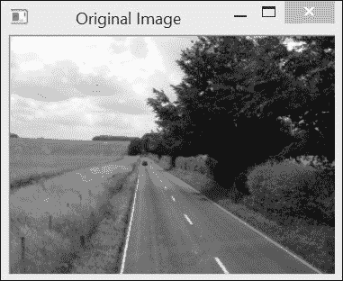

当算法应用于前面的截图时，结果如下：

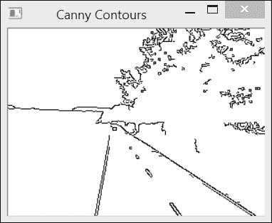

注意，为了获得前面截图所示的图像，我们必须反转黑白值，因为正常的结果是通过非零像素来表示轮廓。因此，显示的图像仅仅是 255-轮廓。

## 它是如何工作的...

Canny 算子通常基于在第六章中介绍的 Sobel 算子，即*滤波图像*，尽管也可以使用其他梯度算子。这里的关键思想是使用两个不同的阈值来确定哪个点应属于轮廓：一个低阈值和一个高阈值。

应选择低阈值，使其包括所有被认为是属于显著图像轮廓的边缘像素。例如，使用前一小节示例中指定的低阈值，并将其应用于 Sobel 算子的结果，可以得到以下边缘图：

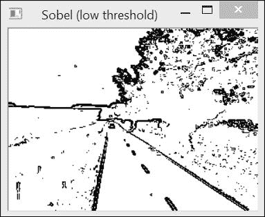

如所示，界定道路的边缘非常清晰。然而，由于使用了宽容的阈值，检测到的边缘比理想情况下需要的更多。因此，第二个阈值的作用是定义属于所有重要轮廓的边缘。它应该排除所有被认为是异常值的边缘。例如，对应于我们示例中使用的较高阈值的 Sobel 边缘图如下：

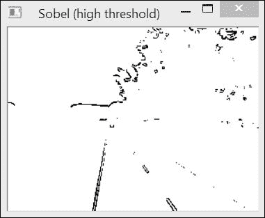

现在我们有一个包含断裂边缘的图像，但可见的边缘肯定属于场景的重要轮廓。Canny 算法通过仅保留低阈值边缘图中存在连续边缘路径的边缘点，并将这些边缘点连接到属于高阈值边缘图的边缘，来结合这两个边缘图以产生一个*最优*的轮廓图。它通过仅保留高阈值图中的所有边缘点，同时移除低阈值图中所有孤立的边缘点链来实现。所获得的解决方案构成了一个良好的折衷方案，只要指定了适当的阈值值，就可以获得高质量的轮廓。这种基于使用两个阈值来获得二值图的策略被称为**滞后阈值化**，可以在任何需要从阈值化操作中获得二值图的环境中使用。然而，这是以更高的计算复杂度为代价的。

此外，Canny 算法还采用了一种额外的策略来提高边缘图的质量。在应用阈值化之前，所有梯度方向上梯度幅度不是最大的边缘点都被移除。回想一下，梯度方向始终垂直于边缘。因此，该方向上的梯度局部最大值对应于轮廓的最大强度点。这解释了为什么 Canny 轮廓图中会得到细边缘。

## 参见

+   J. Canny 的经典文章，*边缘检测的计算方法，IEEE Transactions on Pattern Analysis and Image Understanding，第 18 卷，第 6 期，1986 年*

# 使用霍夫变换在图像中检测线条

在我们人造的世界中，平面和线性结构无处不在。因此，直线在图像中经常可见。这些是有意义的特征，在物体识别和图像理解中起着重要作用。**Hough 变换**是一个经典算法，常用于在图像中检测这些特定的特征。它最初是为了检测图像中的线而开发的，正如我们将看到的，它还可以扩展到检测其他简单的图像结构。

## 准备中

使用 Hough 变换，线使用以下方程表示：

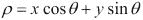

ρ参数是线与图像原点（左上角）之间的距离，θ是垂直于线的角度。在这种表示下，图像中可见的线具有*θ*角度，介于*0*和*π*弧度之间，而*ρ*半径可以有一个最大值，等于图像对角线的长度。例如，考虑以下一组线：

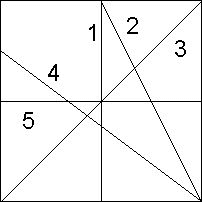

垂直线（例如，线**1**）的*θ*角度值等于零，而水平线（例如，线**5**）的*θ*值等于*π/2*。因此，线**3**的*θ*角度等于*π/4*，线**4**大约在*0.7π*。为了能够用*[0, π]*区间的*θ*表示所有可能的线，半径值可以取负值。这就是线**2**的情况，其θ值为*0.8π*，而ρ值为负。

## 如何做到这一点...

OpenCV 为线检测提供了两种 Hough 变换的实现。基本版本是`cv::HoughLines`。它的输入是一个包含一组点（由非零像素表示）的二值图，其中一些点排列成线。通常，这是一个从 Canny 算子获得的边缘图。`cv::HoughLines`函数的输出是一个`cv::Vec2f`元素的向量，每个元素都是一个浮点数的对，它代表检测到的线的参数，*(ρ, θ)*。以下是一个使用此函数的示例，我们首先应用 Canny 算子以获得图像轮廓，然后使用 Hough 变换检测线：

```py
   // Apply Canny algorithm
   cv::Mat contours;
   cv::Canny(image,contours,125,350);
   // Hough transform for line detection
   std::vector<cv::Vec2f> lines;
   cv::HoughLines(test,lines,
        1,PI/180,  // step size
        60);       // minimum number of votes
```

参数 3 和 4 对应于线搜索的步长。在我们的例子中，函数将通过步长 `1` 搜索所有可能半径的线，并通过步长 *π/180* 搜索所有可能的角度。最后一个参数的作用将在下一节中解释。使用这种特定的参数值，在先前的食谱中的道路图像上检测到 15 条线。为了可视化检测结果，将这些线绘制在原始图像上是有趣的。然而，需要注意的是，此算法检测图像中的线，而不是线段，因为每条线的端点没有给出。因此，我们将绘制贯穿整个图像的线。为此，对于垂直方向的线，我们计算它与图像水平极限（即第一行和最后一行）的交点，并在这两个点之间绘制一条线。我们以类似的方式处理水平方向的线，但使用第一列和最后一列。使用 `cv::line` 函数绘制线。请注意，即使点坐标超出图像范围，此函数也能很好地工作。因此，没有必要检查计算出的交点是否在图像内。然后通过迭代线向量来绘制线，如下所示：

```py
   std::vector<cv::Vec2f>::const_iterator it= lines.begin();
   while (it!=lines.end()) {

      float rho= (*it)[0];   // first element is distance rho
      float theta= (*it)[1]; // second element is angle theta

      if (theta < PI/4\. 
           || theta > 3.*PI/4.) { // ~vertical line

         // point of intersection of the line with first row
         cv::Point pt1(rho/cos(theta),0);        
         // point of intersection of the line with last row
         cv::Point pt2((rho-result.rows*sin(theta))/
                                  cos(theta),result.rows);
         // draw a white line
         cv::line( image, pt1, pt2, cv::Scalar(255), 1); 

      } else { // ~horizontal line

         // point of intersection of the 
         // line with first column
         cv::Point pt1(0,rho/sin(theta));        
         // point of intersection of the line with last column
         cv::Point pt2(result.cols,
                 (rho-result.cols*cos(theta))/sin(theta));
         // draw a white line
         cv::line(image, pt1, pt2, cv::Scalar(255), 1); 
      }

      ++it;
   }
```

以下结果如下：

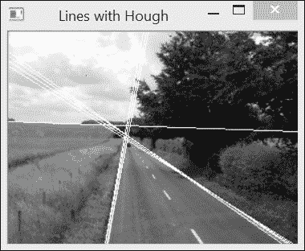

如所示，霍夫变换简单地寻找图像中边缘像素的对齐。这可能会由于偶然的像素对齐或当几条线穿过相同的像素对齐时产生一些错误检测。

为了克服这些问题，并允许检测线段（即带有端点），已经提出了一种变换的变体。这是概率霍夫变换，它在 OpenCV 中作为 `cv::HoughLinesP` 函数实现。我们在这里使用它来创建我们的 `LineFinder` 类，该类封装了函数参数：

```py
class LineFinder {

  private:

     // original image
     cv::Mat img;

     // vector containing the endpoints 
     // of the detected lines
     std::vector<cv::Vec4i> lines;

     // accumulator resolution parameters
     double deltaRho;
     double deltaTheta;

     // minimum number of votes that a line 
     // must receive before being considered
     int minVote;

     // min length for a line
     double minLength;

     // max allowed gap along the line
     double maxGap;

  public:

     // Default accumulator resolution is 1 pixel by 1 degree
     // no gap, no minimum length
     LineFinder() : deltaRho(1), deltaTheta(PI/180), 
                    minVote(10), minLength(0.), maxGap(0.) {}
```

查看相应的设置方法：

```py
     // Set the resolution of the accumulator
     void setAccResolution(double dRho, double dTheta) {

        deltaRho= dRho;
        deltaTheta= dTheta;
     }

     // Set the minimum number of votes
     void setMinVote(int minv) {

        minVote= minv;
     }

     // Set line length and gap
     void setLineLengthAndGap(double length, double gap) {

        minLength= length;
        maxGap= gap;
     }
```

使用前面的方法，执行霍夫线段检测的方法如下：

```py
     // Apply probabilistic Hough Transform
     std::vector<cv::Vec4i> findLines(cv::Mat& binary) {

        lines.clear();
        cv::HoughLinesP(binary,lines,
                        deltaRho, deltaTheta, minVote, 
                        minLength, maxGap);

        return lines;
     }
```

此方法返回一个 `cv::Vec4i` 向量，其中包含每个检测到的线段的起始点和终点坐标。然后可以使用以下方法在图像上绘制检测到的线：

```py
     // Draw the detected lines on an image
     void drawDetectedLines(cv::Mat &image, 
                cv::Scalar color=cv::Scalar(255,255,255)) {

        // Draw the lines
        std::vector<cv::Vec4i>::const_iterator it2= 
                                           lines.begin();

        while (it2!=lines.end()) {

           cv::Point pt1((*it2)[0],(*it2)[1]);        
           cv::Point pt2((*it2)[2],(*it2)[3]);

           cv::line( image, pt1, pt2, color);

           ++it2;   
        }
     }
```

现在，使用相同的输入图像，可以使用以下序列检测线：

```py
   // Create LineFinder instance
   LineFinder finder;

   // Set probabilistic Hough parameters
   finder.setLineLengthAndGap(100,20);
   finder.setMinVote(60);

   // Detect lines and draw them
   std::vector<cv::Vec4i> lines= finder.findLines(contours);
   finder.drawDetectedLines(image);
   cv::namedWindow("Detected Lines with HoughP");
   cv::imshow("Detected Lines with HoughP",image);
```

以下代码给出以下结果：

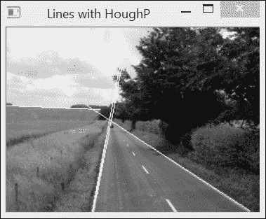

## 它是如何工作的...

霍夫变换的目标是在二值图像中找到所有通过足够多点的线。它通过考虑输入二值图中的每个单独的像素点并识别所有通过它的可能线来实现。当相同的线通过许多点时，这意味着这条线足够重要，值得考虑。

Hough 变换使用一个二维累加器来计数给定线条被识别的次数。这个累加器的大小由指定的步长（如前所述）确定，这些步长是采用的线条表示法中*(ρ, θ)*参数的步长。为了说明变换的工作原理，让我们创建一个 180×200 的矩阵（对应于*θ*的步长为*π/180*，*ρ*的步长为*1*）：

```py
   // Create a Hough accumulator
   // here a uchar image; in practice should be ints
   cv::Mat acc(200,180,CV_8U,cv::Scalar(0));
```

这个累加器是不同*(ρ, θ)*值的映射。因此，这个矩阵的每个条目对应一条特定的线条。现在，如果我们考虑一个点，比如说坐标为`(50,30)`的点，那么通过遍历所有可能的*θ*角度（步长为π/180）并计算相应的（四舍五入的）*ρ*值，我们可以识别通过这个点的所有线条：

```py
   // Choose a point
   int x=50, y=30;
   // loop over all angles
   for (int i=0; i<180; i++) {

      double theta= i*PI/180.;

      // find corresponding rho value 
      double rho= x*std::cos(theta)+y*std::sin(theta);
      // j corresponds to rho from -100 to 100
      int j= static_cast<int>(rho+100.5);

      std::cout << i << "," << j << std::endl;

      // increment accumulator
      acc.at<uchar>(j,i)++;
   }
```

累加器中对应于计算出的*(ρ, θ)*对的条目随后增加，表示所有这些线条都通过图像的一个点（或者说，每个点为一系列可能的候选线条投票）。如果我们以图像的形式显示累加器（反转并乘以`100`以使`1`的计数可见），我们得到以下结果：

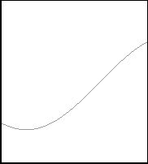

前面的曲线表示通过考虑点的所有线条的集合。现在，如果我们用，比如说，点`(30,10)`重复相同的练习，我们现在有以下累加器：

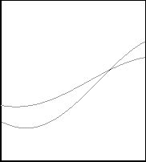

如所示，两条结果曲线在一点相交：这一点对应于通过这两点的直线。累加器中相应的条目获得两票，表明有两条线通过这条线。如果对二进制图的所有点重复相同的过程，那么沿给定直线对齐的点将多次增加累加器的公共条目。最后，你只需要识别这个累加器中接收了大量投票的局部极大值，以检测图像中的线条（即点对齐）。`cv::HoughLines`函数中指定的最后一个参数对应于线条必须接收的最小投票数才能被视为检测到。例如，我们将此值降低到`50`，如下所示：

```py
   cv::HoughLines(test,lines,1,PI/180,50);
```

之前代码的结果是，将接受更多线条，如前一小节所示，如下面的截图所示：

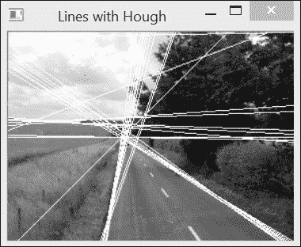

概率 Hough 变换对基本算法进行了一些修改。首先，它不是系统地按行扫描图像，而是在二值图中随机选择点。每当累加器的某个条目达到指定的最小值时，就会沿着相应的行扫描图像，并移除所有通过该行的点（即使它们还没有投票）。这种扫描还确定了将被接受的段长度。为此，算法定义了两个额外的参数。一个是段被接受的最小长度，另一个是形成连续段所允许的最大像素间隙。这一额外步骤增加了算法的复杂性，但部分地通过减少参与投票过程中的点数来补偿，因为其中一些点被线扫描过程消除了。

## 更多内容...

Hough 变换也可以用来检测其他几何实体。实际上，任何可以用参数方程表示的实体都是 Hough 变换的良好候选者。

### 检测圆

在圆的情况下，相应的参数方程如下：

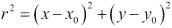

该方程包括三个参数（圆半径和中心坐标），这意味着需要一个三维累加器。然而，通常发现，随着累加器维度的增加，Hough 变换的可靠性降低。确实，在这种情况下，每个点都会增加累加器的大量条目，因此，局部峰值的精确定位变得更加困难。已经提出了不同的策略来克服这个问题。OpenCV 实现的 Hough 圆检测所使用的策略是两遍扫描。在第一遍扫描中，使用二维累加器来找到候选圆的位置。由于圆周上点的梯度应该指向半径方向，因此对于每个点，只增加累加器沿梯度方向的条目（基于预定义的最小和最大半径值）。一旦检测到可能的圆心（即，已收到预定义数量的投票），在第二遍扫描中构建一个可能的半径的一维直方图。该直方图中的峰值对应于检测到的圆的半径。

实现上述策略的 `cv::HoughCircles` 函数集成了 Canny 检测和 Hough 变换。其调用方式如下：

```py
   cv::GaussianBlur(image,image,cv::Size(5,5),1.5);
   std::vector<cv::Vec3f> circles;
   cv::HoughCircles(image, circles, CV_HOUGH_GRADIENT, 
      2,   // accumulator resolution (size of the image / 2) 
      50,  // minimum distance between two circles
      200, // Canny high threshold 
      100, // minimum number of votes 
      25, 100); // min and max radius
```

注意，在调用`cv::HoughCircles`函数之前，始终建议您对图像进行平滑处理，以减少可能导致多个错误圆检测的图像噪声。检测的结果以`cv::Vec3f`实例的向量给出。前两个值是圆心坐标，第三个是半径。

在编写本书时，`CV_HOUGH_GRADIENT`参数是唯一可用的选项。它对应于两遍圆检测方法。第四个参数定义了累加器分辨率。它是一个除数因子；例如，指定值为 2 会使累加器的大小是图像的一半。下一个参数是两个检测到的圆之间的最小像素距离。另一个参数对应于 Canny 边缘检测器的高阈值。低阈值值始终设置为这个值的一半。第七个参数是在第一次遍历期间，一个中心位置必须收到的最小投票数，才能被认为是第二次遍历的候选圆。最后，最后两个参数是检测到的圆的最小和最大半径值。如所见，该函数包含许多参数，这使得调整变得困难。

一旦获得检测到的圆的向量，可以通过遍历该向量并使用找到的参数调用`cv::circle`绘图函数，在图像上绘制这些圆：

```py
   std::vector<cv::Vec3f>::
          const_iterator itc= circles.begin();

   while (itc!=circles.end()) {

     cv::circle(image, 
        cv::Point((*itc)[0], (*itc)[1]), // circle centre
        (*itc)[2],       // circle radius
        cv::Scalar(255), // color 
        2);              // thickness

     ++itc;   
   }
```

以下是在测试图像上使用所选参数获得的结果：

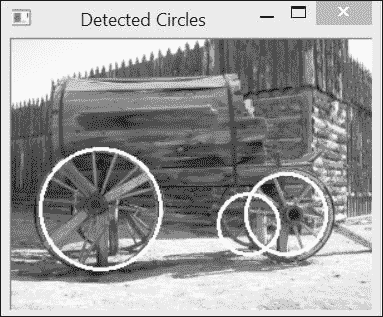

## 参见

+   由 C. Galambos、J. Kittler 和 J. Matas 撰写的文章《Gradient-based Progressive Probabilistic Hough Transform by C. Galambos, J. Kittler, and J. Matas, IEE Vision Image and Signal Processing, vol. 148 no 3, pp. 158-165, 2002》是关于 Hough 变换的众多参考文献之一，描述了 OpenCV 中实现的概率算法

+   由 H.K. Yuen、J. Princen、J. Illingworth 和 J. Kittler 撰写的文章《Comparative Study of Hough Transform Methods for Circle Finding, Image and Vision Computing, vol. 8 no 1, pp. 71-77, 1990》描述了使用 Hough 变换进行圆检测的不同策略

# 将直线拟合到一组点

在某些应用中，不仅检测图像中的直线，而且获得直线位置和方向的准确估计可能很重要。本食谱将向您展示如何找到最适合给定一组点的直线。

## 如何做到...

首件事是识别图像中似乎沿直线排列的点。让我们使用前面菜谱中检测到的其中一条线。使用`cv::HoughLinesP`检测到的线包含在名为`lines`的`std::vector<cv::Vec4i>`中。为了提取似乎属于这些线中的第一条线的点集，我们可以这样做。我们在黑色图像上画一条白色线，并与用于检测我们的线的 Canny 边缘图像相交。这可以通过以下语句简单地实现：

```py
   int n=0; // we select line 0 
   // black image
   cv::Mat oneline(contours.size(),CV_8U,cv::Scalar(0));
   // white line
   cv::line(oneline, 
            cv::Point(lines[n][0],lines[n][1]),
            cv::Point(lines[n][2],lines[n][3]),
            cv::Scalar(255),
            3); // line width
   // contours AND white line
   cv::bitwise_and(contours,oneline,oneline);
```

结果是一个只包含可以与指定直线相关联的点的图像。为了引入一些容差，我们画了一条具有一定厚度（这里，3）的线。因此，定义的邻域内的所有点都被接受。以下是通过以下图像获得的（为了更好的观看效果进行了反转）：

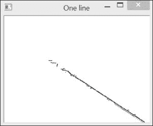

然后，可以通过以下双重循环将此集合中点的坐标插入到`std::vector`的`cv::Point`对象中（也可以使用浮点坐标，即`cv::Point2f`）：

```py
   std::vector<cv::Point> points;

   // Iterate over the pixels to obtain all point positions
   for( int y = 0; y < oneline.rows; y++ ) {    
      // row y

      uchar* rowPtr = oneline.ptr<uchar>(y);

      for( int x = 0; x < oneline.cols; x++ ) {
         // column x 

         // if on a contour
         if (rowPtr[x]) {

            points.push_back(cv::Point(x,y));
         }
      }
    }
```

通过调用`cv::fitLine` OpenCV 函数可以轻松找到最佳拟合线：

```py
   cv::Vec4f line;
   cv::fitLine(points,line,
               CV_DIST_L2, // distance type
               0,          // not used with L2 distance 
               0.01,0.01); // accuracy
```

前面的代码以单位方向向量（`cv::Vec4f`的前两个值）和直线上一点的坐标（`cv::Vec4f`的最后两个值）的形式给出了线方程参数。对于我们的例子，这些值是方向向量为`(0.83, 0.55)`，点坐标为`(366.1, 289.1)`。最后两个参数指定了线参数的请求精度。

通常，线方程将用于计算某些属性（校准是一个需要精确参数表示的好例子）。为了说明，并确保我们计算了正确的线，让我们在图像上绘制估计的线。在这里，我们简单地绘制了一个长度为`100`像素、厚度为`3`像素的任意黑色线段：

```py
   int x0= line[2];        // a point on the line
   int y0= line[3];
   int x1= x0+100*line[0]; // add a vector of length 100
   int y1= y0+100*line[1]; // using the unit vector
   // draw the line
   cv::line(image,cv::Point(x0,y0),cv::Point(x1,y1),
            0,3); // color and thickness
```

结果可以在以下屏幕截图中看到：

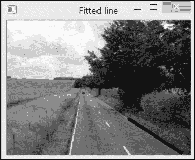

## 它是如何工作的...

将直线拟合到一组点在数学中是一个经典问题。OpenCV 的实现是通过最小化每个点到直线的距离之和来进行的。提出了几种距离函数，其中最快的选择是使用欧几里得距离，它由`CV_DIST_L2`指定。这个选择对应于标准的最小二乘法直线拟合。当包含异常值（即不属于直线的点）在点集中时，可以选择对远点影响较小的其他距离函数。最小化是基于 M-估计技术，该技术通过迭代求解具有与到直线的距离成反比的权重的加权最小二乘问题。

使用这个函数，还可以将线拟合到 3D 点集。在这种情况下，输入是一个`cv::Point3i`或`cv::Point3f`对象的集合，输出是一个`std::Vec6f`实例。

## 还有更多...

`cv::fitEllipse`函数将椭圆拟合到一组 2D 点。这返回一个包含椭圆的旋转矩形（一个`cv::RotatedRect`实例）。在这种情况下，你会写下以下内容：

```py
   cv::RotatedRect rrect= cv::fitEllipse(cv::Mat(points));
   cv::ellipse(image,rrect,cv::Scalar(0));
```

`cv::ellipse`函数是你用来绘制计算出的椭圆的函数。

# 提取组件轮廓

图像通常包含对象的表示。图像分析的一个目标就是识别和提取这些对象。在目标检测/识别应用中，第一步通常是生成一个二值图像，显示某些感兴趣的对象可能的位置。无论这个二值图是如何获得的（例如，从我们在第四章中做的直方图反向投影，*使用直方图计数像素*，或者从我们将要在第十一章中学习的运动分析，*处理视频序列*），下一步就是从这组 1 和 0 中提取对象。

例如，考虑我们在第五章中操作的二值形式的水牛图像，*使用形态学操作变换图像*，如图所示：

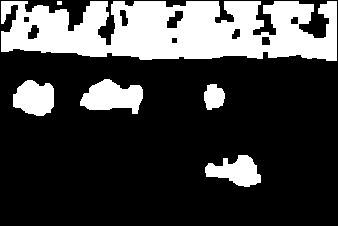

我们通过简单的阈值操作，然后应用开闭形态学过滤器获得了这张图像。这个方法将向你展示如何从这样的图像中提取对象。更具体地说，我们将提取**连通组件**，即在二值图像中由一组连通像素组成的形状。

## 如何做到这一点...

OpenCV 提供了一个简单的函数，用于提取图像中连通组件的轮廓。这就是`cv::findContours`函数：

```py
   // the vector that will contain the contours
   std::vector<std::vector<cv::Point>> contours;
   cv::findContours(image, 
      contours, // a vector of contours 
      CV_RETR_EXTERNAL, // retrieve the external contours
      CV_CHAIN_APPROX_NONE); // all pixels of each contours
```

输入显然是二值图像。输出是一个轮廓向量，每个轮廓由一个`cv::Point`对象的向量表示。这解释了为什么输出参数被定义为`std::vector`实例的`std::vector`实例。此外，还指定了两个标志。第一个标志表示只需要外部轮廓，即对象中的孔将被忽略（*还有更多…*部分将讨论其他选项）。第二个标志用于指定轮廓的格式。在当前选项下，向量将列出轮廓中的所有点。使用`CV_CHAIN_APPROX_SIMPLE`标志，只包括水平、垂直或对角轮廓的端点。其他标志将给出更复杂的轮廓链近似，以获得更紧凑的表示。根据前面的图像，通过`contours.size()`获得了九个连通组件。

幸运的是，有一个非常方便的函数可以在图像上绘制这些组件的轮廓（这里是一个白色图像）：

```py
   // draw black contours on a white image
   cv::Mat result(image.size(),CV_8U,cv::Scalar(255));
   cv::drawContours(result,contours,
      -1, // draw all contours
       0, // in black
       2);// with a thickness of 2
```

如果这个函数的第三个参数是负值，那么将绘制所有轮廓。否则，可以指定要绘制的轮廓的索引。结果如下面的截图所示：

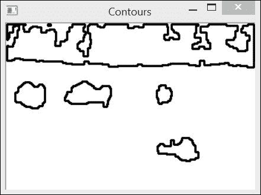

## 它是如何工作的...

轮廓是通过一个简单的算法提取的，该算法包括系统地扫描图像，直到遇到一个组件。从这个组件的起始点开始，跟随其轮廓，标记其边界的像素。当轮廓完成时，扫描从最后一个位置重新开始，直到找到新的组件。

然后可以单独分析识别出的连通组件。例如，如果对感兴趣对象预期的大小有先验知识，就有可能消除一些组件。接下来，我们可以为组件的周长设置一个最小值和最大值。这是通过迭代轮廓向量并消除无效组件来实现的：

```py
   // Eliminate too short or too long contours
   int cmin= 50;  // minimum contour length
   int cmax= 1000; // maximum contour length
   std::vector<std::vector<cv::Point>>::
              iterator itc= contours.begin();
   // for all contours
   while (itc!=contours.end()) {

      // verify contour size
      if (itc->size() < cmin || itc->size() > cmax)
         itc= contours.erase(itc);
      else 
         ++itc;
   }
```

注意，这个循环可以更高效，因为`std::vector`实例中的每次擦除操作都是 O(N)。然而，考虑到这个向量的体积很小，总体成本并不高。这次，我们在原始图像上绘制剩余的轮廓，并得到以下结果：

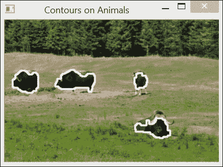

我们非常幸运地找到了一个简单的标准，使我们能够识别出这幅图像中所有感兴趣的对象。在更复杂的情况下，需要对组件属性进行更精细的分析。这正是下一个菜谱的目标。

## 还有更多...

使用`cv::findContours`函数，还可以将所有闭合轮廓包括在二值图中，包括由组件中的孔形成的轮廓。这是通过在函数调用中指定另一个标志来实现的：

```py
   cv::findContours(image, 
      contours, // a vector of contours 
      CV_RETR_LIST, // retrieve all contours
      CV_CHAIN_APPROX_NONE); // all pixels of each contours
```

使用这个调用，获得了以下轮廓：

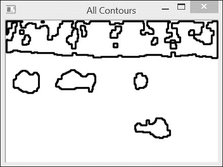

注意在背景森林中添加的额外轮廓。这些轮廓也可以组织成层次结构。主要组件是父元素，其中的孔是它的子元素，如果这些孔中有组件，它们就变成先前子元素的子元素，依此类推。这个层次结构是通过使用 `CV_RETR_TREE` 标志获得的，如下所示：

```py
   std::vector<cv::Vec4i> hierarchy;
   cv::findContours(image, 
      contours, // a vector of contours
      hierarchy, // hierarchical representation 
      CV_RETR_TREE, // retrieve all contours in tree format
      CV_CHAIN_APPROX_NONE); // all pixels of each contours
```

在这种情况下，每个轮廓都有一个对应于相同索引的层次元素，由四个整数组成。前两个整数给出了同一级别的下一个和前一个轮廓的索引，后两个整数给出了此轮廓的第一个子元素和父元素的索引。负索引表示轮廓列表的结束。`CV_RETR_CCOMP` 标志类似，但将层次限制在两个级别。

# 计算组件的形状描述符

连通组件通常对应于图片场景中物体的图像。为了识别这个物体，或者将其与其他图像元素进行比较，对组件进行一些测量以提取其某些特征可能是有用的。在这个菜谱中，我们将查看 OpenCV 中可用的某些形状描述符，这些描述符可以用来描述连通组件的形状。

## 如何操作...

当涉及到形状描述时，许多 OpenCV 函数都是可用的。我们将应用其中的一些函数在我们前面菜谱中提取的组件上。特别是，我们将使用我们之前识别的四个水牛对应的四个轮廓的向量。在下面的代码片段中，我们在轮廓（`contours[0]` 到 `contours[3]`）上计算形状描述符，并在轮廓图像（厚度为 `1`）上绘制结果（厚度为 `2`）。此图像在本节末尾显示。

第一个是边界框，它应用于右下角的组件：

```py
  // testing the bounding box 
  cv::Rect r0= cv::boundingRect(contours[0]);
  // draw the rectangle
  cv::rectangle(result,r0, 0, 2);
```

最小包围圆类似。它应用于右上角的组件：

```py
   // testing the enclosing circle 
   float radius;
   cv::Point2f center;
   cv::minEnclosingCircle(contours[1],center,radius);
   // draw the circle
   cv::circle(result,center,
              static_cast<int>(radius),cv::Scalar(0),2);
```

组件轮廓的多边形逼近计算如下（在左侧组件）：

```py
   // testing the approximate polygon
   std::vector<cv::Point> poly;
   cv::approxPolyDP(contours[2],poly,5,true);
   // draw the polygon
   cv::polylines(result, poly, true, 0, 2);
```

注意多边形绘制函数 `cv::polylines`。它的工作方式与其他绘图函数类似。第三个布尔参数用于指示轮廓是否闭合（如果是，则最后一个点与第一个点相连）。

凸包是另一种多边形逼近形式（在左侧第二个组件）：

```py
   // testing the convex hull
   std::vector<cv::Point> hull;
   cv::convexHull(contours[3],hull);
   // draw the polygon
   cv::polylines(result, hull, true, 0, 2);
```

最后，计算矩矩是另一个强大的描述符（质心被绘制在所有组件内部）：

```py
   // testing the moments
   // iterate over all contours
   itc= contours.begin();
   while (itc!=contours.end()) {

      // compute all moments
      cv::Moments mom= cv::moments(cv::Mat(*itc++));

      // draw mass center
      cv::circle(result,
         // position of mass center converted to integer
         cv::Point(mom.m10/mom.m00,mom.m01/mom.m00),
         2,cv::Scalar(0),2); // draw black dot
   }
```

结果图像如下：

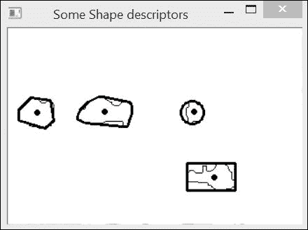

## 它是如何工作的...

一个组件的**边界框**可能是表示和定位图像中组件的最紧凑方式。它定义为完全包含形状的最小直立矩形。比较框的高度和宽度可以给出关于物体垂直或水平尺寸的指示（例如，可以通过高度与宽度的比例来区分汽车图像和行人图像）。**最小外接圆**通常在只需要近似组件大小和位置时使用。

当需要操作一个更紧凑且类似于组件形状的表示时，组件的**多边形近似**非常有用。它通过指定一个精度参数来创建，该参数给出了形状与其简化多边形之间可接受的最大距离。它是`cv::approxPolyDP`函数的第四个参数。结果是`cv::Point`的向量，对应于多边形的顶点。为了绘制这个多边形，我们需要遍历这个向量，并通过在它们之间画线将每个点与下一个点连接起来。

**凸包**，或称为凸包络，是一个形状的最小凸多边形，它包围了该形状。可以将其想象成如果将一个弹性带围绕该形状放置时，弹性带所形成的形状。正如所见，凸包轮廓将在形状轮廓的凹处偏离原始轮廓。

这些位置通常被指定为凸性缺陷，并且有一个特殊的 OpenCV 函数可用于识别它们：`cv::convexityDefects`函数。其调用方式如下：

```py
  std::vector<cv::Vec4i> defects;
  cv::convexityDefects(contour, hull, defects);
```

`contour`和`hull`参数分别代表原始和凸包轮廓（均以`std::vector<cv::Point>`实例表示）。输出是一个包含四个整数元素的向量。前两个整数是轮廓上点的索引，界定缺陷；第三个整数对应于凹处的最远点，最后，最后一个整数对应于这个最远点与凸包之间的距离。

**矩**是形状结构分析中常用的数学实体。OpenCV 定义了一个数据结构，用于封装形状的所有计算出的矩。它是`cv::moments`函数返回的对象。这些矩共同代表了一个物体形状的紧凑描述。它们在字符识别等应用中常用。我们简单地使用这个结构来获取由前三个空间矩计算出的每个组件的质量中心。

## 更多内容...

可以使用可用的 OpenCV 函数计算其他结构属性。`cv::minAreaRect` 函数计算最小包含旋转矩形（这在第五章, *使用形态学操作变换图像*, 在 *使用 MSER 提取特征区域* 菜谱中已被使用）。`cv::contourArea` 函数估计轮廓的面积（即轮廓内的像素数量）。`cv::pointPolygonTest` 函数确定一个点是否在轮廓内部或外部，而 `cv::matchShapes` 测量两个轮廓之间的相似度。所有这些属性度量可以有效地组合起来，以执行更高级的结构分析。

### 四边形检测

在第五章, *使用形态学操作变换图像* 中介绍的 MSER 特征是一个有效工具，用于从图像中提取形状。考虑到前一章中获得的 MSER 结果，我们现在将构建一个算法来检测图像中的四边形组件。对于当前图像，这种检测将使我们能够识别建筑物的窗户。可以通过以下方式轻松获得 MSER 图像的二值版本：

```py
  // create a binary version
  components= components==255;
  // open the image (white background)
  cv::morphologyEx(components,components,
                    cv::MORPH_OPEN,cv::Mat(),
                    cv::Point(-1,-1),3);
```

此外，我们还使用形态学过滤器清理了图像。然后图像如下：

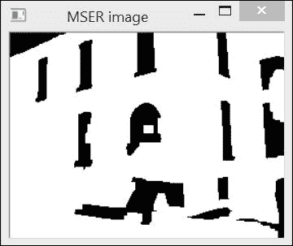

下一步是获取轮廓：

```py
  //invert image (background must be black)
  cv::Mat componentsInv= 255-components;
  // Get the contours of the connected components
  cv::findContours(componentsInv, 
    contours, // a vector of contours 
    CV_RETR_EXTERNAL, // retrieve the external contours
    CV_CHAIN_APPROX_NONE); 
```

最后，我们遍历所有轮廓并大致用多边形来近似它们：

```py
  // white image
  cv::Mat quadri(components.size(),CV_8U,255);

  // for all contours
  std::vector<std::vector<cv::Point>>::iterator 
                              it= contours.begin();
  while (it!= contours.end()) {
    poly.clear();
    // approximate contour by polygon
    cv::approxPolyDP(*it,poly,10,true);

    // do we have a quadrilateral?
    if (poly.size()==4) {
          // draw it
      cv::polylines(quadri, poly, true, 0, 2);
    }
    ++it;
  }
```

四边形是指具有四条边的多边形。检测到的如下：

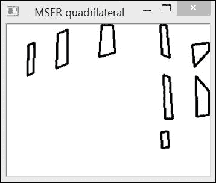

要检测矩形，你可以简单地测量相邻边之间的角度，并拒绝那些角度与 90 度偏差太大的四边形。
