# 第九章 描述和匹配兴趣点

在本章中，我们将介绍以下食谱：

+   匹配局部模板

+   描述局部强度模式

+   使用二进制特征描述关键点

# 简介

在上一章中，我们学习了如何通过检测图像中的特殊点来进行局部图像分析。这些关键点是选择得足够独特，以至于如果一个关键点在物体的图像中被检测到，那么在描述同一物体的其他图像中，预期也会检测到相同的点。我们还描述了一些更复杂的兴趣点检测器，这些检测器可以为关键点分配一个代表性的尺度因子和/或一个方向。正如我们将在这份食谱中看到的，这些附加信息可以用来根据视点变化对场景表示进行归一化。

为了基于兴趣点进行图像分析，我们现在需要构建丰富的表示，以独特地描述这些关键点中的每一个。本章探讨了已经提出的从兴趣点中提取**描述符**的不同方法。这些描述符通常是描述关键点和其邻域的 1D 或 2D 的二进制、整数或浮点数向量。一个好的描述符应该足够独特，以唯一地表示图像中的每个关键点；它应该足够鲁棒，以便在可能的光照变化或视点变化的情况下，具有相似点的相似表示。理想情况下，它还应该紧凑，以方便处理操作。

使用关键点完成的最常见操作之一是图像匹配。执行此任务的目标可能是，例如，将同一场景的两个图像联系起来，或者在图像中检测目标对象的发生。在这里，我们将研究一些基本的匹配策略，这个主题将在下一章中进一步讨论。

# 匹配局部模板

特征点**匹配**是通过将一个图像中的点与另一个图像（或图像集中的点）中的点对应起来的操作。当图像点对应于现实世界中同一场景元素（或物体点）的图像时，它们应该匹配。

单个像素当然不足以判断两个关键点的相似性。这就是为什么在匹配过程中必须考虑每个关键点周围的图像**块**。如果两个块对应于同一场景元素，那么可以预期它们的像素将具有相似值。本食谱中提出的解决方案是直接逐像素比较像素块。这可能是特征点匹配的最简单方法，但正如我们将看到的，它并不是最可靠的。尽管如此，在几种情况下，它仍然可以给出良好的结果。

## 如何做到这一点...

通常，块被定义为以关键点位置为中心的奇数大小的正方形。然后可以通过比较块内相应的像素强度值来测量两个正方形块之间的相似度。简单的**平方差之和**（**SSD**）是一个流行的解决方案。特征匹配策略的工作方式如下。首先，在每个图像中检测关键点。这里，我们使用 FAST 检测器：

```py
  // Define keypoints vector
  std::vector<cv::KeyPoint> keypoints1;
  std::vector<cv::KeyPoint> keypoints2;
  // Define feature detector
  cv::FastFeatureDetector fastDet(80);
  // Keypoint detection
  fastDet.detect(image1,keypoints1);
  fastDet.detect(image2,keypoints2);
```

然后，我们定义一个大小为`11x11`的矩形，它将用于定义每个关键点周围的块：

```py
  // Define a square neighborhood
  const int nsize(11); // size of the neighborhood
  cv::Rect neighborhood(0, 0, nsize, nsize); // 11x11
  cv::Mat patch1;
  cv::Mat patch2;
```

将一个图像中的关键点与另一个图像中的所有关键点进行比较。对于第一个图像中的每个关键点，在第二个图像中识别最相似的块。这个过程通过以下代码中的两个嵌套循环实现：

```py
// For all keypoints in first image
// find best match in second image
cv::Mat result;
std::vector<cv::DMatch> matches;

//for all keypoints in image 1
for (int i=0; i<keypoints1.size(); i++) {

  // define image patch
  neighborhood.x = keypoints1[i].pt.x-nsize/2;
  neighborhood.y = keypoints1[i].pt.y-nsize/2;

  // if neighborhood of points outside image, 
  // then continue with next point
  if (neighborhood.x<0 || neighborhood.y<0 ||
      neighborhood.x+nsize >= image1.cols || 
          neighborhood.y+nsize >= image1.rows)
      continue;

  //patch in image 1
  patch1 = image1(neighborhood);

  // reset best correlation value;
  cv::DMatch bestMatch;

  //for all keypoints in image 2
  for (int j=0; j<keypoints2.size(); j++) {

      // define image patch
      neighborhood.x = keypoints2[j].pt.x-nsize/2;
      neighborhood.y = keypoints2[j].pt.y-nsize/2;

      // if neighborhood of points outside image, 
      // then continue with next point
      if (neighborhood.x<0 || neighborhood.y<0 ||
        neighborhood.x + nsize >= image2.cols ||
             neighborhood.y + nsize >= image2.rows)
          continue;

      // patch in image 2
      patch2 = image2(neighborhood);

      // match the two patches                  
         cv::matchTemplate(patch1,patch2,result,
                           CV_TM_SQDIFF_NORMED);

      // check if it is a best match
      if (result.at<float>(0,0) < bestMatch.distance) {

        bestMatch.distance= result.at<float>(0,0);
        bestMatch.queryIdx= i;
        bestMatch.trainIdx= j;
      }
    }

    // add the best match
    matches.push_back(bestMatch);
}
```

注意使用`cv::matchTemplate`函数，我们将在下一节中描述它，该函数计算块相似度分数。当识别出潜在匹配时，这个匹配通过使用`cv::DMatch`对象来表示。该对象存储两个匹配关键点的索引以及相似度分数。

两个图像块越相似，这些块对应相同场景点的概率就越高。这就是为什么按相似度分数对结果匹配点进行排序是一个好主意：

```py
  // extract the 25 best matches
  std::nth_element(matches.begin(),
                    matches.begin()+25,matches.end());
  matches.erase(matches.begin()+25,matches.end());
```

然后，你可以简单地保留通过给定相似度阈值的匹配。在这里，我们选择只保留`N`个最佳匹配点（我们使用`N=25`来便于可视化匹配结果）。

有趣的是，有一个 OpenCV 函数可以通过连接两个图像并使用线连接每个对应点来显示匹配结果。该函数的使用方法如下：

```py
  // Draw the matching results
  cv::Mat matchImage;
  cv::drawMatches(image1,keypoints1,          // first image
                   image2,keypoints2,         // second image
                   matches,                   // vector of matches
                   cv::Scalar(255,255,255),   // color of lines
                   cv::Scalar(255,255,255));  // color of points
```

下面是得到的匹配结果：

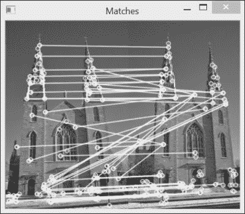

## 它是如何工作的...

得到的结果当然不是完美的，但通过视觉检查匹配的图像点显示有许多成功的匹配。也可以观察到建筑的重复结构造成了一些混淆。此外，由于我们试图将左图像中的所有点与右图像中的点匹配，我们得到了右图像中的一个点与左图像中的多个点匹配的情况。这是一种不对称的匹配情况，可以通过例如，只保留每个右图像中每个点的最佳得分匹配来纠正。

为了比较每个图像中的图像块，这里我们使用了一个简单的标准，即使用`CV_TM_SQDIFF`标志指定的像素级平方差之和。如果我们比较图像`I [1]`中的点`(x,y)`与图像`I` `[2]`中的潜在匹配点`(x',y')`，那么相似度度量如下：

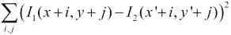

在这里，`(i,j)`点的和提供了覆盖以每个点为中心的平方模板的偏移量。由于相似块中相邻像素之间的差异应该很小，因此最佳匹配的块应该是具有最小和的块。这正是匹配函数的主循环中所做的；也就是说，对于一张图像中的每个关键点，我们识别另一张图像中的关键点，该关键点给出了最低的平方差和。我们还可以拒绝那些和超过某个阈值值的匹配。在我们的情况下，我们只是按从最相似到最不相似排序。

在我们的例子中，匹配是通过大小为`11x11`的正方形块完成的。更大的邻域会产生更独特的块，但它也使它们对局部场景变化更敏感。

只要两个图像从相似的角度和相似的观察条件显示场景，从简单的平方差之和比较两个图像窗口就会相对有效。确实，简单的光照变化会增加或减少块中所有像素的强度，从而导致大的平方差。为了使匹配对光照变化更不变，存在可以用来测量两个图像窗口之间相似性的其他公式。OpenCV 提供了一系列这些公式。一个非常有用的公式是归一化平方差之和（`CV_TM_SQDIFF_NORMED`标志）：

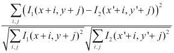

其他相似度度量基于相关性的概念，在信号处理理论中定义为以下（使用`CV_TM_CCORR`标志）：

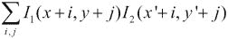

当两个块相似时，此值将达到最大。

识别出的匹配项存储在一个`cv::DMatch`实例的向量中。本质上，`cv::DMatch`数据结构包含第一个索引，它指向第一个关键点向量中的一个元素，以及第二个索引，它指向第二个关键点向量中的匹配特征。它还包含一个代表两个匹配描述符之间距离的实数值。这个距离值用于比较两个`cv::DMatch`实例时`operator<`的定义。

在上一节中绘制匹配时，我们希望限制线条的数量以使结果更易于阅读。因此，我们只显示了距离最低的`25`个匹配项。为此，我们使用了`std::nth_element`函数，该函数将排序顺序中的第 N 个元素放置在第 N 个位置，所有较小的元素都放置在此元素之前。一旦完成，向量就简单地清除了其剩余的元素。

## 还有更多...

`cv::matchTemplate`函数是我们特征匹配方法的核心。我们在这里以非常具体的方式使用它，即比较两个图像块。然而，这个函数被设计成以更通用的方式使用。

### 模板匹配

图像分析中的常见任务是在图像中检测特定模式或物体的出现。这可以通过定义一个对象的小图像、模板，并在给定图像中搜索相似出现来完成。通常，搜索被限制在感兴趣区域内，我们认为该区域可能包含该对象。然后模板在这个区域上滑动，并在每个像素位置计算相似度度量。这是`cv::matchTemplate`函数执行的操作。输入是一个小尺寸的模板图像和搜索图像。结果是每个像素位置的相似度分数对应的`cv::Mat`浮点值函数。如果模板的大小是`MxN`，图像的大小是`WxH`，那么结果矩阵的大小将是`W-N+1xH-N+1`。通常，你将关注最高相似度的位置；因此，典型的模板匹配代码将如下所示（假设目标变量是我们的模板）：

```py
// define search region
cv::Mat roi(image2, 
  // here top half of the image
  cv::Rect(0,0,image2.cols,image2.rows/2)); 

// perform template matching
cv::matchTemplate(
  roi,    // search region
  target, // template
  result, // result
  CV_TM_SQDIFF); // similarity measure

// find most similar location
double minVal, maxVal;
cv::Point minPt, maxPt;
cv::minMaxLoc(result, &minVal, &maxVal, &minPt, &maxPt);

// draw rectangle at most similar location
// at minPt in this case
cv::rectangle(roi, 
   cv::Rect(minPt.x, minPt.y, target.cols , target.rows), 
   255);
```

记住这是一个代价较高的操作，因此你应该限制搜索区域，并使用只有几个像素大小的模板。

## 参见

+   下一个菜谱，*描述局部强度模式*，描述了实现本菜谱中使用的匹配策略的`cv::BFMatcher`类。

# 描述局部强度模式

在第八章中讨论的 SURF 和 SIFT 关键点检测算法，*检测兴趣点*，为每个检测到的特征定义了一个位置、一个方向和一个比例。比例因子信息对于定义每个特征点周围的分析窗口的大小是有用的。因此，定义的邻域将包含与对象的比例无关的相同视觉信息。这个菜谱将向你展示如何使用**特征描述符**来描述兴趣点的邻域。在图像分析中，这个邻域包含的视觉信息可以用来表征每个特征点，以便使每个点与其他点区分开来。特征描述符通常是 N 维向量，以对光照变化和小型透视变形不变的方式描述特征点。通常，描述符可以使用简单的距离度量进行比较，例如欧几里得距离。因此，它们构成了一个强大的工具，可以在特征匹配应用中使用。

## 如何做到这一点...

OpenCV 2 提出了一种计算关键点列表描述符的通用接口。它被称为`cv::DescriptorExtractor`，我们将以类似于我们在上一章中使用`cv::FeatureDetector`接口的方式使用它。事实上，大多数基于特征的方法都包括检测器和描述符组件；这就是为什么`cv::SURF`和`cv::SIFT`类实现了这两个接口。这意味着你只需要创建一个对象来检测和描述关键点。以下是如何匹配两张图像的步骤：

```py
  // Define feature detector
  // Construct the SURF feature detector object
  cv::Ptr<cv::FeatureDetector> detector = new cv::SURF(1500.);

  // Keypoint detection
  // Detect the SURF features
  detector->detect(image1,keypoints1);
  detector->detect(image2,keypoints2);

  // SURF includes both the detector and descriptor extractor
  cv::Ptr<cv::DescriptorExtractor> descriptor = detector;

  // Extract the descriptor
   cv::Mat descriptors1;
   cv::Mat descriptors2;
   descriptor->compute(image1,keypoints1,descriptors1);
   descriptor->compute(image2,keypoints2,descriptors2);
```

对于 SIFT，你只需简单地创建一个`cv::SIFT()`对象即可。结果是包含与关键点向量中元素数量一样多的行的矩阵（即`cv::Mat`实例）。这些行中的每一行都是一个 N 维描述符向量。在 SURF 描述符的情况下，它有一个默认大小为`64`，而对于 SIFT，默认维度是`128`。这个向量表征了特征点周围的强度模式。两个特征点越相似，它们的描述符向量应该越接近。

这些描述符现在将被用来匹配我们的关键点。正如我们在前面的食谱中所做的那样，第一幅图中的每个特征描述符向量与第二幅图中的所有特征描述符进行比较。获得最佳分数的配对（即两个描述符向量之间距离最低的配对）被保留为该特征的最佳匹配。这个过程会重复应用于第一幅图中的所有特征。非常方便的是，这个过程在 OpenCV 的`cv::BFMatcher`类中得到了实现，因此我们不需要重新实现我们之前构建的双循环。这个类可以这样使用：

```py
   // Construction of the matcher 
   cv::BFMatcher matcher(cv::NORM_L2);
   // Match the two image descriptors
   std::vector<cv::DMatch> matches;
   matcher.match(descriptors1,descriptors2, matches);
```

这个类是`cv::DescriptorMatcher`类的子类，它定义了不同匹配策略的通用接口。结果是`cv::DMatch`实例的向量。

使用当前 SURF 的 Hessian 阈值，我们为第一幅图像获得了`90`个关键点，为第二幅图像获得了`80`个。然后暴力方法将产生`90`个匹配。使用与前面食谱中相同的`cv::drawMatches`类会产生以下图像：

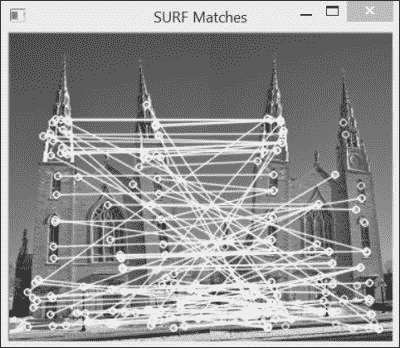

如所示，其中一些匹配正确地将左侧的点与其对应的右侧点联系起来。你可能会注意到一些错误；其中一些是由于观察到的建筑有一个对称的立面，这使得一些局部匹配变得模糊。对于 SIFT，在相同数量的关键点下，我们得到了以下匹配结果：

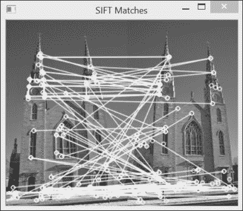

## 它是如何工作的...

良好的特征描述符必须对光照和视角的小变化以及图像噪声的存在保持不变。因此，它们通常基于局部强度差异。这是 SURF 描述符的情况，它们在关键点周围局部应用以下简单的核：

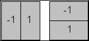

第一个核简单地测量水平方向上的局部强度差异（指定为`dx`），第二个核测量垂直方向上的这种差异（指定为`dy`）。用于提取描述符向量的邻域大小通常定义为特征缩放因子的 20 倍（即`20σ`）。然后，将这个正方形区域分割成`4x4`更小的正方形子区域。对于每个子区域，在`5x5`规则间隔的位置（核大小为`2σ`）计算核响应（`dx`和`dy`）。所有这些响应都按以下方式汇总，以便为每个子区域提取四个描述符值：

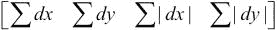

由于有`4x4=16`个子区域，我们总共有`64`个描述符值。注意，为了给邻近像素更多的权重，即更接近关键点的值，核响应通过一个以关键点位置为中心的高斯加权（`σ=3.3`）。

`dx`和`dy`响应也用于估计特征的方向。这些值在半径为`6σ`的圆形邻域内，以`σ`的间隔规则地计算（核大小为`4σ`）。对于给定的方向，在某个角度间隔（`π/3`）内的响应被汇总，给出最长向量的方向被定义为主导方向。

SIFT 是一种更丰富的描述符，它使用图像梯度而不是简单的强度差异。它还将每个关键点周围的正方形邻域分割成`4x4`子区域（也可以使用`8x8`或`2x2`子区域）。在每个这些区域内部，构建一个梯度方向的直方图。方向被离散化到 8 个箱子中，每个梯度方向条目通过一个与梯度幅度成比例的值增加。这可以通过以下图示来说明，其中每个星形箭头集代表一个梯度方向的局部直方图：

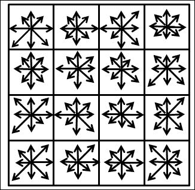

将每个子区域的 8 个箱子的`16`个直方图连接起来，然后产生一个`128`维度的描述符。注意，对于 SURF 来说，梯度值通过一个以关键点位置为中心的高斯滤波器加权，以使描述符对定义的邻域边缘梯度方向突然变化的敏感性降低。然后，将最终的描述符归一化，以使距离测量更加一致。

使用 SURF 和 SIFT 特征和描述符，可以实现尺度不变匹配。以下是一个示例，显示了不同尺度下两张图像的 SURF 匹配结果（这里显示了 50 个最佳匹配）：

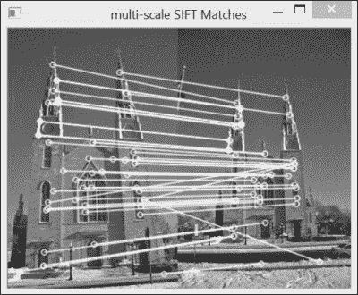

## 更多内容...

任何匹配算法产生的匹配结果总是包含大量的错误匹配。为了提高匹配集的质量，存在多种策略。这里讨论了其中两种。

### 匹配交叉检查

验证获得的匹配的一个简单方法是在第二次重复相同的程序，但这次，第二幅图像的每个关键点都与第一幅图像的所有关键点进行比较。只有当我们从两个方向获得相同的键点对时，才认为匹配是有效的（也就是说，每个关键点是另一个的最佳匹配）。`cv::BFMatcher`函数提供了使用此策略的选项。这确实是一个标志；当设置为`true`时，它强制函数执行互匹配交叉检查：

```py
   // Construction of the matcher with cross-check 
   cv::BFMatcher matcher2(cv::NORM_L2, // distance measure
                         true);       // cross-check flag
```

改进的匹配结果如下所示（以 SURF 为例）：

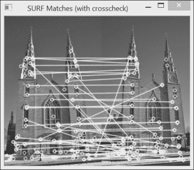

### 比率测试

我们已经指出，场景对象中的重复元素由于匹配视觉上相似结构的歧义性，会导致不可靠的结果。在这种情况下发生的情况是，一个关键点会与多个其他关键点很好地匹配。由于选择错误对应关系的概率很高，在这种情况下拒绝匹配可能更可取。

要使用这种策略，我们接下来需要找到每个关键点的最佳两个匹配点。这可以通过使用`cv::DescriptorMatcher`类的`knnMatch`方法来实现。由于我们只想找到两个最佳匹配，我们指定`k=2`。

```py
  // find the best two matches of each keypoint
    std::vector<std::vector<cv::DMatch>> matches2;
    matcher.knnMatch(descriptors1,descriptors2, matches2, 
                 2); // find the k best matches
```

下一步是拒绝所有与次佳匹配距离相似的最好匹配。由于`knnMatch`生成的是`std::vector`类的`std::vector`（这个第二个向量的大小为`k`），我们通过遍历每个关键点匹配并执行比率测试（如果两个最佳距离相等，这个比率将为 1）来实现。以下是我们可以这样做的方法：

```py
// perform ratio test
double ratio= 0.85;
std::vector<std::vector<cv::DMatch>>::iterator it;
for (it= matches2.begin(); it!= matches2.end(); ++it) {

  //   first best match/second best match
  if ((*it)[0].distance/(*it)[1].distance < ratio) {
    // it is an acceptable match
    matches.push_back((*it)[0]);
  }
}
// matches is the new match set
```

初始匹配集由`90`对组成，现在已减少到`23`对；其中相当一部分现在是正确匹配：

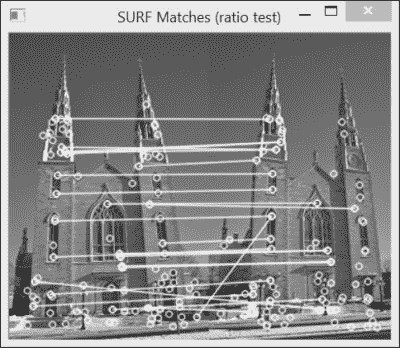

### 距离阈值化

一种更简单的策略是拒绝那些描述符之间距离过高的匹配。这是通过使用`cv::DescriptorMatcher`类的`radiusMatch`方法实现的：

```py
// radius match
float maxDist= 0.4;
std::vector<std::vector<cv::DMatch>> matches2;
matcher.radiusMatch(descriptors1, descriptors2, matches2, 
                  maxDist); // maximum acceptable distance
                             // between the 2 descriptors
```

结果再次是一个`std::vector`类的`std::vector`，因为该方法将保留所有距离小于指定阈值的匹配。这意味着给定关键点可能在另一幅图像中有一个以上的匹配点。相反，其他关键点将没有任何与之关联的匹配（相应的内部`std::vector`类的大小将为`0`）。这次，初始匹配集的`90`对减少到`37`对，如下面的截图所示：

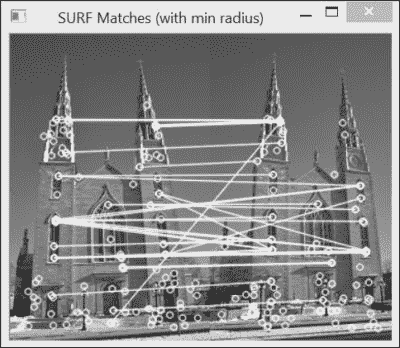

显然，你可以将这些策略结合起来以提高你的匹配结果。

## 参见

+   第八章 *检测尺度不变特征* 配方在 *检测兴趣点* 中介绍了相关的 SURF 和 SIFT 特征检测器，并提供了更多关于该主题的参考文献。

+   第十章 *估计图像中的投影关系* 中的 *使用随机样本一致性匹配图像* 配方解释了如何使用图像和场景几何来获得质量更高的匹配集。

+   E. Vincent 和 R. Laganière 在 *Machine, Graphics and Vision, pp. 237-260, 2001* 发表的 *Matching feature points in stereo pairs: A comparative study of some matching strategies* 文章，描述了其他一些可以用来提高匹配集质量的简单匹配策略。

# 使用二进制特征描述关键点

在之前的配方中，我们学习了如何使用从图像强度梯度中提取的丰富描述符来描述一个关键点。这些描述符是具有 `64`、`128` 或有时甚至更长的维度的浮点向量。这使得它们在操作上成本较高。为了减少与这些描述符相关的内存和计算负载，最近提出了使用二进制描述符的想法。这里的挑战是使它们易于计算，同时保持它们对场景和视点变化的鲁棒性。本配方描述了这些二进制描述符中的一些。特别是，我们将查看 ORB 和 BRISK 描述符，我们在 第八章 *检测兴趣点* 中介绍了它们相关的特征点检测器。

## 如何去做...

由于 OpenCV 检测器和描述符模块构建在良好的通用接口之上，使用二进制描述符（如 ORB）与使用描述符（如 SURF 和 SIFT）没有区别。基于特征点的完整图像匹配序列如下：

```py
// Define keypoints vector
std::vector<cv::KeyPoint> keypoints1, keypoints2;
// Construct the ORB feature detector object
cv::Ptr<cv::FeatureDetector> detector = 
  new cv::ORB(100); // detect approx 100 ORB points  
// Detect the ORB features
detector->detect(image1,keypoints1);
detector->detect(image2,keypoints2);
// ORB includes both the detector and descriptor extractor
cv::Ptr<cv::DescriptorExtractor> descriptor = detector;
// Extract the descriptor
cv::Mat descriptors1, descriptors2;
descriptor->compute(image1,keypoints1,descriptors1);
descriptor->compute(image2,keypoints2,descriptors2);
// Construction of the matcher 
cv::BFMatcher matcher(
     cv::NORM_HAMMING); // always use hamming norm
                        // for binary descriptors
// Match the two image descriptors
std::vector<cv::DMatch> matches;
matcher.match(descriptors1,descriptors2, matches);
```

唯一的区别在于使用了 **Hamming** 范数（`cv::NORM_HAMMING` 标志），它通过计算两个二进制描述符中不同位的数量来衡量它们之间的距离。在许多处理器上，这个操作可以通过使用异或操作，然后进行简单的位计数来高效地实现。

以下截图显示了匹配的结果：

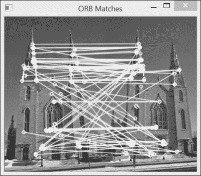

使用另一个流行的二进制特征检测器/描述符：BRISK，也会得到类似的结果。在这种情况下，`cv::DescriptorExtractor` 实例是通过新的 `cv::BRISK(40)` 调用创建的。正如我们在上一章所学，它的第一个参数是一个阈值，用于控制检测到的点的数量。

## 它是如何工作的...

ORB 算法在多个尺度上检测方向特征点。基于此结果，ORB 描述符通过使用简单的强度比较来提取每个关键点的表示。实际上，ORB 是基于之前提出的描述符 BRIEF 构建的。随后，它通过简单地选择关键点周围定义的邻域内的随机点对来创建二进制描述符。然后比较这两个像素点的强度值，如果第一个点具有更高的强度，则将值 `1` 分配给相应的描述符位值。否则，分配值 `0`。在多个随机点对上重复此测试会生成一个由多个位组成的描述符；通常，使用 `128` 到 `512` 位（成对测试）。

这是 ORB 使用的方案。然后，需要做出的决定是使用哪组点对来构建描述符。实际上，即使点对是随机选择的，一旦它们被选中，就必须执行相同的二进制测试集来构建所有关键点的描述符，以确保结果的一致性。为了使描述符更具独特性，直觉告诉我们，某些选择可能比其他选择更好。此外，由于每个关键点的方向是已知的，当将强度模式分布与此方向归一化时（即，当点坐标相对于此关键点方向给出时），这引入了一些偏差。从这些考虑和实验验证中，ORB 已经确定了一组具有高方差和最小成对相关性的 `256` 个点对。换句话说，所选的二进制测试是那些在各种关键点上具有相等机会为 `0` 或 `1` 的测试，并且尽可能相互独立。 

除了控制特征检测过程的参数外，`cv::ORB` 构造函数还包括两个与其描述符相关的参数。一个参数用于指定点对选择的内部补丁大小（默认为 `31x31`）。第二个参数允许您使用三元组或四元组点而不是默认的点对进行测试。请注意，强烈建议您使用默认设置。

BRISK 的描述符也非常相似。它也是基于成对强度比较，但有两点不同。首先，不是从 `31x31` 邻域点中随机选择点，而是从一组同心圆（由 `60` 个点组成）的采样模式中选择点，这些圆的点是等间距的。其次，这些采样点的强度是一个与中心关键点距离成比例的高斯平滑值。从这些点中，BRISK 选择 `512` 个点对。

## 还有更多...

存在着几个其他的二进制描述符，感兴趣的读者应该查阅科学文献以了解更多关于这个主题的信息。由于它也包含在 OpenCV 中，我们在这里将描述一个额外的描述符。

### FREAK

FREAK 代表**快速视网膜关键点**。这也是一个二进制描述符，但它没有关联的检测器。它可以应用于任何检测到的关键点集，例如 SIFT、SURF 或 ORB。

与 BRISK 一样，FREAK 描述符也是基于同心圆上定义的采样模式。然而，为了设计他们的描述符，作者使用了人类眼睛的类比。他们观察到在视网膜上，神经节细胞的密度随着距离黄斑的增加而减少。因此，他们构建了一个由`43`个点组成的采样模式，其中点的密度在中心点附近要大得多。为了获得其强度，每个点都通过一个大小也随中心距离增加的高斯核进行过滤。

为了确定应该执行的成对比较，通过遵循与 ORB 使用的类似策略进行了实验验证。通过分析数千个关键点，保留了具有最高方差和最低相关性的二进制测试，从而得到`512`对。

FREAK 还引入了在级联中进行描述符比较的想法。也就是说，首先执行代表较粗信息（对应于在较大高斯核边缘执行的测试）的前`128`位。只有当比较的描述符通过这个初始步骤后，才会执行剩余的测试。

使用 ORB 检测到的关键点，我们可以通过简单地创建以下`cv::DescriptorExtractor`实例来提取 FREAK 描述符：

```py
cv::Ptr<cv::DescriptorExtractor> descriptor =
   new cv::FREAK(); // to describe with FREAK  
```

比赛结果如下：

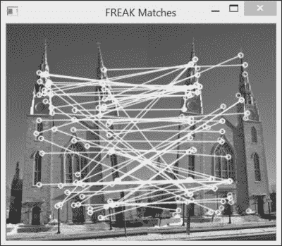

以下图示了本配方中展示的三个描述符所使用的采样模式：

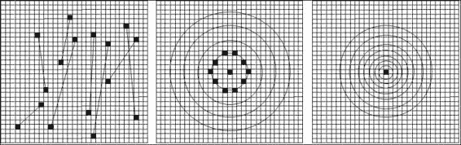

第一个正方形是 ORB 描述符，其中在正方形网格上随机选择点对。通过线的连接的点对代表比较两个像素强度的可能测试。在这里，我们只展示了 8 个这样的对；默认的 ORB 使用 256 对。中间的正方形对应于 BRISK 采样模式。点在显示的圆上均匀采样（为了清晰起见，我们在这里只标识第一圈上的点）。最后，第三个正方形显示了 FREAK 的对数极坐标采样网格。虽然 BRISK 的点分布均匀，但 FREAK 在中心附近的点密度更高。例如，在 BRISK 中，你会在外圈找到 20 个点，而在 FREAK 的情况下，其外圈只包括 6 个点。

## 参考信息

+   第八章中的 *在多个尺度上检测 FAST 特征* 菜单，*检测兴趣点*，介绍了相关的 BRISK 和 ORB 特征检测器，并提供了更多关于该主题的参考资料

+   E. M. Calonder、V. Lepetit、M. Ozuysal、T. Trzcinski、C. Strecha 和 P. Fua 在 *IEEE Transactions on Pattern Analysis and Machine Intelligence, 2012* 发表的 *BRIEF: 计算局部二值描述符非常快速* 文章，描述了启发所展示的二值描述符的 BRIEF 特征描述符

+   A.Alahi、R. Ortiz 和 P. Vandergheynst 在 *IEEE Conference on Computer Vision and Pattern Recognition, 2012* 发表的 *FREAK: 快速视网膜关键点* 文章，描述了 FREAK 特征描述符
