# 第十章.在图像中估计投影关系

在本章中，我们将介绍以下内容：

+   校准相机

+   计算图像对的基本矩阵

+   使用随机样本一致性匹配图像

+   计算两个图像之间的单应性

# 简介

图像通常使用数字相机产生，该相机通过将穿过其镜头的光线投射到图像传感器上来捕获场景。一个图像是通过将 3D 场景投影到 2D 平面上形成的，这暗示了场景与其图像以及同一场景的不同图像之间存在重要的关系。投影几何是用于用数学术语描述和表征图像形成过程的工具。在本章中，我们将向您介绍多视图图像中存在的一些基本投影关系，并解释这些关系如何在计算机视觉编程中使用。您将学习如何通过使用投影约束来提高匹配的准确性，以及如何使用双视图关系将多图像拼贴组合在一起。在我们开始食谱之前，让我们探索与场景投影和图像形成相关的基本概念。

## 图像形成

基本上，自摄影术开始以来，用于产生图像的过程没有改变。来自观察场景的光线通过一个正面的**孔径**被相机捕获；捕获的光线击中位于相机后部的**图像平面**（或**图像传感器**）。此外，使用镜头来集中来自不同场景元素的光线。这个过程如下图所示：

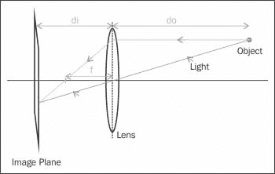

在这里，**do** 是从镜头到观察对象的距离，**di** 是从镜头到图像平面的距离，**f** 是镜头的焦距。这些量通过所谓的薄透镜方程相关联：

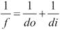

在计算机视觉中，这个相机模型可以通过多种方式简化。首先，我们可以通过考虑我们有一个具有无穷小孔径的相机来忽略镜头的影响，因为从理论上讲，这不会改变图像的外观。（然而，这样做会通过创建具有无限**景深**的图像而忽略聚焦效果。）在这种情况下，因此，只考虑中心光线。其次，由于大多数时候我们有 `do>>di`，我们可以假设图像平面位于焦距处。最后，我们可以从系统的几何学中注意到，平面上的图像是倒置的。我们可以通过简单地将图像平面放置在镜头前方来获得一个相同但正立的图像。显然，这在物理上是不切实际的，但从数学角度来看，这是完全等价的。这个简化的模型通常被称为**针孔相机**模型，其表示如下：

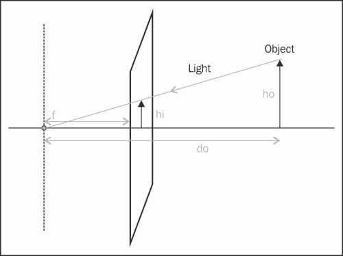

从这个模型出发，并使用相似三角形的定律，我们可以轻松推导出将图像中的物体与其图像相关联的基本投影方程：

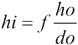

因此，一个物体（高度为**ho**）的图像大小（**hi**）与其与摄像机的距离（**do**）成反比，这是自然而然的事情。一般来说，这种关系描述了在给定摄像机几何形状的情况下，三维场景点将在图像平面上投影的位置。

# 标定摄像机

从本章的介绍中，我们了解到在针孔模型下，摄像机的关键参数是其焦距和图像平面的尺寸（这定义了摄像机的**视场**）。此外，由于我们处理的是数字图像，图像平面上像素的数量（其**分辨率**）也是摄像机的一个重要特征。最后，为了能够计算图像场景点的像素坐标，我们需要额外的一块信息。考虑到来自焦点的垂直于图像平面的直线，我们需要知道这条直线在哪个像素位置穿透图像平面。这个点被称为**主点**。从逻辑上讲，这个主点可能位于图像平面的中心，但在实际操作中，这个点可能因为摄像机制造的精度问题而偏离几个像素。

摄像机标定是一个获取不同摄像机参数的过程。显然，可以使用摄像机制造商提供的规格，但对于某些任务，例如三维重建，这些规格可能不够精确。摄像机标定将通过向摄像机展示已知图案并分析获得的图像来进行。然后，一个优化过程将确定解释观察结果的参数值。这是一个复杂的过程，但由于 OpenCV 标定函数的可用性，这个过程变得简单易行。

## 如何做到这一点...

要标定一个摄像机，想法是向它展示一组已知三维位置的场景点。然后，你需要观察这些点在图像上的投影位置。有了足够数量的三维点和相关的二维图像点的知识，可以从投影方程中推断出精确的摄像机参数。显然，为了获得准确的结果，我们需要观察尽可能多的点。实现这一目标的一种方法是对一个包含许多已知三维点的场景拍摄一张照片，但在实际操作中，这很少可行。更方便的方法是从不同的视角拍摄一组三维点的多张照片。这种方法更简单，但除了计算内部摄像机参数外，还需要计算每个摄像机视图的位置，幸运的是这是可行的。

OpenCV 建议你使用棋盘格图案来生成校准所需的 3D 场景点集。这个图案在每个方格的角上创建点，由于这个图案是平的，我们可以自由地假设棋盘位于`Z=0`，*X*和*Y*轴与网格对齐。在这种情况下，校准过程简单地包括从不同的视角向相机展示棋盘格图案。以下是一个`6x4`校准图案图像的示例：

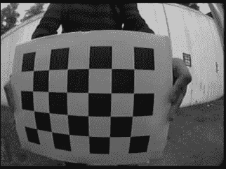

好消息是 OpenCV 有一个函数可以自动检测这个棋盘格图案的角点。你只需提供一个图像和棋盘格的大小（水平和垂直内角点的数量）。该函数将返回图像上这些棋盘格角点的位置。如果函数无法找到图案，则简单地返回`false`：

```py
    // output vectors of image points
    std::vector<cv::Point2f> imageCorners;
    // number of inner corners on the chessboard
    cv::Size boardSize(6,4);
    // Get the chessboard corners
    bool found = cv::findChessboardCorners(image, 
                                 boardSize, imageCorners);
```

输出参数`imageCorners`将简单地包含检测到的图案内角点的像素坐标。请注意，如果需要调整算法，此函数接受额外的参数，但这里没有讨论。还有一个特殊函数可以在棋盘格图像上绘制检测到的角点，并用线条按顺序连接它们：

```py
    //Draw the corners
    cv::drawChessboardCorners(image, 
                    boardSize, imageCorners, 
                    found); // corners have been found
```

下面的图像是得到的：

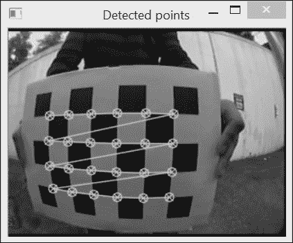

连接点的线条显示了点在检测到的图像点向量中的列表顺序。为了进行校准，我们现在需要指定相应的 3D 点。你可以选择你喜欢的单位（例如，厘米或英寸）来指定这些点；然而，最简单的是假设每个方格代表一个单位。在这种情况下，第一个点的坐标将是`(0,0,0)`（假设棋盘位于深度`Z=0`处），第二个点的坐标将是`(1,0,0)`，以此类推，最后一个点位于`(5,3,0)`。这个图案总共有`24`个点，这太少了，无法获得准确的校准。要获得更多点，你需要从不同的视角展示相同校准图案的更多图像。为此，你可以移动图案到相机前，或者移动相机绕棋盘移动；从数学的角度来看，这是完全等价的。OpenCV 校准函数假设参考框架固定在校准图案上，并将计算相机相对于参考框架的旋转和平移。

现在我们将校准过程封装在`CameraCalibrator`类中。该类的属性如下：

```py
class CameraCalibrator {

    // input points:
    // the points in world coordinates
    std::vector<std::vector<cv::Point3f>> objectPoints;
    // the point positions in pixels
    std::vector<std::vector<cv::Point2f>> imagePoints;
    // output Matrices
    cv::Mat cameraMatrix;
    cv::Mat distCoeffs;
    // flag to specify how calibration is done
    int flag;
```

注意，场景和图像点的输入向量实际上是由点实例的`std::vector`组成的；每个向量元素是从一个视角的点向量。在这里，我们决定通过指定棋盘图像文件名的向量作为输入来添加校准点：

```py
// Open chessboard images and extract corner points
int CameraCalibrator::addChessboardPoints(
         const std::vector<std::string>& filelist, 
         cv::Size & boardSize) {

   // the points on the chessboard
   std::vector<cv::Point2f> imageCorners;
   std::vector<cv::Point3f> objectCorners;

   // 3D Scene Points:
   // Initialize the chessboard corners 
   // in the chessboard reference frame
   // The corners are at 3D location (X,Y,Z)= (i,j,0)
   for (int i=0; i<boardSize.height; i++) {
      for (int j=0; j<boardSize.width; j++) {
         objectCorners.push_back(cv::Point3f(i, j, 0.0f));
      }
    }

    // 2D Image points:
    cv::Mat image; // to contain chessboard image
    int successes = 0;
    // for all viewpoints
    for (int i=0; i<filelist.size(); i++) {
        // Open the image
        image = cv::imread(filelist[i],0);
        // Get the chessboard corners
        bool found = cv::findChessboardCorners(
                        image, boardSize, imageCorners);
        // Get subpixel accuracy on the corners
        cv::cornerSubPix(image, imageCorners, 
                  cv::Size(5,5), 
                  cv::Size(-1,-1), 
         cv::TermCriteria(cv::TermCriteria::MAX_ITER +
                          cv::TermCriteria::EPS, 
                  30,     // max number of iterations 
                  0.1));  // min accuracy

        //If we have a good board, add it to our data
        if (imageCorners.size() == boardSize.area()) {
            // Add image and scene points from one view
            addPoints(imageCorners, objectCorners);
            successes++;
        }
    }
   return successes;
}
```

第一个循环输入棋盘的 3D 坐标，相应的图像点是`cv::findChessboardCorners`函数提供的点。这适用于所有可用的视角。此外，为了获得更精确的图像点位置，可以使用`cv::cornerSubPix`函数，正如其名称所暗示的，图像点将被定位在亚像素精度。由`cv::TermCriteria`对象指定的终止准则定义了最大迭代次数和亚像素坐标中的最小精度。这两个条件中先达到的一个将停止角细化过程。

当一组棋盘角成功检测到后，这些点将使用我们的`addPoints`方法添加到图像点和场景点的向量中。一旦处理了足够数量的棋盘图像（因此，有大量的 3D 场景点/2D 图像点对应关系可用），我们就可以开始计算校准参数，如下所示：

```py
// Calibrate the camera
// returns the re-projection error
double CameraCalibrator::calibrate(cv::Size &imageSize)
{
   //Output rotations and translations
    std::vector<cv::Mat> rvecs, tvecs;

   // start calibration
   return 
     calibrateCamera(objectPoints, // the 3D points
               imagePoints,  // the image points
               imageSize,    // image size
               cameraMatrix, // output camera matrix
               distCoeffs,   // output distortion matrix
               rvecs, tvecs, // Rs, Ts 
               flag);        // set options
}
```

在实际操作中，10 到 20 张棋盘图像就足够了，但这些图像必须从不同视角和不同深度拍摄。这个函数的两个重要输出是相机矩阵和畸变参数。这些将在下一节中描述。

## 它是如何工作的...

为了解释校准结果，我们需要回到引言中的图，该图描述了针孔相机模型。更具体地说，我们想展示 3D 空间中位置为(X,Y,Z)的点与其在指定像素坐标的相机上的图像(x,y)之间的关系。让我们通过添加一个参考框架来重新绘制这个图，我们将这个框架放置在投影中心的此处：

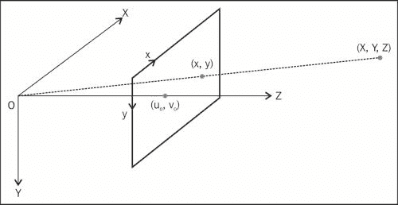

注意，*y*轴向下指向，以获得与通常将图像原点放置在左上角的惯例兼容的坐标系。我们之前了解到，点**(X,Y,Z)**将被投影到图像平面上，位置为`(fX/Z,fY/Z)`。现在，如果我们想将这个坐标转换为像素，我们需要分别除以像素的宽度(`px`)和高度(`py`)。注意，通过将以世界单位（通常以毫米为单位）给出的焦距除以`px`，我们得到以（水平）像素表示的焦距。然后，我们定义这个术语为`fx`。同样，`fy =f/py`被定义为以垂直像素单位表示的焦距。因此，完整的投影方程如下：

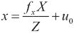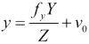

回想一下，(u[0],v[0])是添加到结果中以将原点移动到图像右上角的主点。这些方程可以通过引入**齐次坐标**来重写为矩阵形式，其中二维点由 3-向量表示，三维点由 4-向量表示（额外的坐标只是一个任意比例因子`S`，当需要从齐次 3-向量中提取二维坐标时需要移除）。

这里是重写的投影方程：

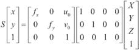

第二个矩阵是一个简单的投影矩阵。第一个矩阵包括所有摄像机参数，这些参数被称为摄像机的内在参数。这个`3x3`矩阵是`cv::calibrateCamera`函数返回的输出矩阵之一。还有一个名为`cv::calibrationMatrixValues`的函数，它返回由校准矩阵给出的内在参数值。

更一般地，当参考系不在摄像机的投影中心时，我们需要添加一个旋转向量（一个`3x3`矩阵）和一个平移向量（一个`3x1`矩阵）。这两个矩阵描述了必须应用于 3D 点以将它们带回到摄像机参考系的刚性变换。因此，我们可以将投影方程重写为其最一般的形式：


记住，在我们的校准示例中，参考系被放置在棋盘上。因此，对于每个视图，必须计算一个刚性变换（由矩阵项`r1`到`r9`表示的旋转部分和由`t1`、`t2`和`t3`表示的平移）。这些在`cv::calibrateCamera`函数的输出参数列表中。旋转和平移部分通常被称为校准的**外参数**，它们对于每个视图是不同的。对于给定的摄像机/镜头系统，内在参数保持不变。我们从基于 20 张棋盘图像的校准中获得的测试摄像机的内在参数是`fx=167`、`fy=178`、`u0=156`和`v0=119`。这些结果是通过`cv::calibrateCamera`通过一个优化过程获得的，该过程旨在找到最小化从 3D 场景点的投影计算出的预测图像点位置与在图像上观察到的实际图像点位置之间的差异的内在和外参数。校准期间指定的所有点的这个差异之和被称为**重投影误差**。

现在，让我们将注意力转向畸变参数。到目前为止，我们提到，在针孔相机模型下，我们可以忽略镜头的影响。然而，这只在用于捕获图像的镜头不引入重要的光学畸变时才可能。不幸的是，对于低质量镜头或焦距非常短的镜头来说，情况并非如此。您可能已经注意到，我们在示例中使用的图像中显示的棋盘图案明显畸变——矩形板的边缘在图像中是弯曲的。此外，请注意，这种畸变随着我们远离图像中心而变得更加重要。这是鱼眼镜头观察到的典型畸变，被称为**径向畸变**。常用数字相机中使用的镜头通常不会表现出如此高的畸变程度，但在这里使用的镜头，这些畸变肯定不能被忽略。

通过引入适当的畸变模型，可以补偿这些变形。想法是通过一组数学方程来表示由镜头引起的畸变。一旦建立，这些方程就可以被逆转，以消除图像上可见的畸变。幸运的是，在标定阶段，可以同时获得将纠正畸变的变换的确切参数以及其他相机参数。一旦这样做，任何来自新标定相机的图像都将被去畸变。因此，我们在我们的标定类中添加了一个额外的方法：

```py
// remove distortion in an image (after calibration)
cv::Mat CameraCalibrator::remap(const cv::Mat &image) {

   cv::Mat undistorted;

   if (mustInitUndistort) { // called once per calibration

    cv::initUndistortRectifyMap(
      cameraMatrix,  // computed camera matrix
      distCoeffs,    // computed distortion matrix
      cv::Mat(),     // optional rectification (none) 
      cv::Mat(),     // camera matrix to generate undistorted
      image.size(),  // size of undistorted
      CV_32FC1,      // type of output map
      map1, map2);   // the x and y mapping functions

    mustInitUndistort= false;
   }

   // Apply mapping functions
   cv::remap(image, undistorted, map1, map2, 
      cv::INTER_LINEAR); // interpolation type

   return undistorted;
}
```

运行此代码将产生以下图像：

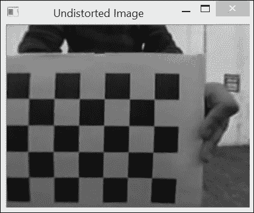

如您所见，一旦图像被去畸变，我们获得了一个正常的透视图像。

为了纠正畸变，OpenCV 使用一个多项式函数应用于图像点，以便将它们移动到未畸变的位置。默认情况下，使用五个系数；也有由八个系数组成的模型可用。一旦获得这些系数，就可以计算两个`cv::Mat`映射函数（一个用于`x`坐标，一个用于`y`坐标），这将给出在畸变图像上图像点的新未畸变位置。这是通过`cv::initUndistortRectifyMap`函数计算的，`cv::remap`函数将输入图像的所有点重新映射到新图像。请注意，由于非线性变换，输入图像的一些像素现在超出了输出图像的边界。您可以通过扩展输出图像的大小来补偿这种像素损失，但您现在将获得在输入图像中没有值的输出像素（它们将显示为黑色像素）。

## 还有更多...

在相机标定方面，还有更多选项可用。

### 使用已知内在参数进行标定

当已知相机内参的良好估计时，可以在`cv::calibrateCamera`函数中输入它们。然后它们将在优化过程中用作初始值。为此，您只需添加`CV_CALIB_USE_INTRINSIC_GUESS`标志并在校准矩阵参数中输入这些值。也可以为主点（`CV_CALIB_FIX_PRINCIPAL_POINT`）指定一个固定值，这通常可以假设是中心像素。您还可以为焦距`fx`和`fy`指定一个固定比率（`CV_CALIB_FIX_RATIO`）；在这种情况下，您假设像素是正方形形状的。

### 使用圆形网格进行校准

与常用的棋盘格图案不同，OpenCV 还提供了使用圆形网格校准相机的可能性。在这种情况下，圆的中心被用作校准点。相应的函数与我们用来定位棋盘格角落的函数非常相似：

```py
      cv::Size boardSize(7,7);
      std::vector<cv::Point2f> centers;
      bool found = cv:: findCirclesGrid(
                          image, boardSize, centers);
```

## 参见

+   本章中的*计算两张图像之间的单应性*配方将检查特殊情况下投影方程

+   Z. Zhang 在*IEEE Transactions on Pattern Analysis and Machine Intelligence, vol. 22, no 11, 2000*上发表的*一种灵活的相机校准新方法*文章是关于相机校准问题的一篇经典论文

# 计算图像对的基本矩阵

之前的配方向您展示了如何恢复单相机的投影方程。在本配方中，我们将探讨显示相同场景的两个图像之间存在的投影关系。这两张图像可能是通过在两个不同位置移动相机从两个视点拍照或使用两个相机，每个相机拍摄场景的不同图片而获得的。当这两个相机通过一个刚体基线分离时，我们使用术语**立体视觉**。

## 准备工作

现在让我们考虑两个相机观察一个给定的场景点，如图所示：

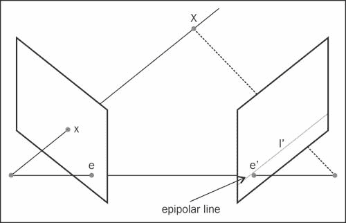

我们了解到，我们可以通过追踪连接该三维点与相机中心的线来找到三维点**X**的图像**x**。相反，场景点在图像平面上其图像位于**x**位置，可以在三维空间中的这条线上任何位置。这意味着如果我们想在另一张图像中找到给定图像点的对应点，我们需要沿着这条线在第二张图像平面上的投影进行搜索。这条想象中的线被称为点**x**的**极线**。它定义了一个必须满足两个对应点的基本约束；也就是说，给定点的匹配必须位于另一个视图中该点的极线上，而这个极线的确切方向取决于两个相机的相对位置。实际上，极线的配置表征了双视系统的几何形状。

从这个双视图系统的几何学中可以得出的另一个观察结果是，所有极线都通过同一点。这个点对应于一个相机的中心在另一个相机上的投影。这个特殊点被称为**极点**。

从数学上讲，图像点与其对应的极线之间的关系可以用一个 `3x3` 矩阵表示如下：


在射影几何中，二维直线也由一个三维向量表示。它对应于满足方程 *l* *[1]* *'x'+ l* *[2]* *'y'+ l* *[3]* *'=0* 的二维点集，`(x',y')`（上标撇表示这条线属于第二图像）。因此，矩阵 **F**，称为基本矩阵，将一个视图中的二维图像点映射到另一个视图中的极线。

## 如何做到这一点...

通过解决涉及两个图像之间一定数量的已知匹配点的方程组，可以估计图像对的基本矩阵。这种匹配的最小数量是七个。为了说明基本矩阵估计过程并使用前一章中的图像对，我们可以手动选择七个良好的匹配点。这些点将用于使用 `cv::findFundamentalMat` OpenCV 函数计算基本矩阵，如下面的截图所示：

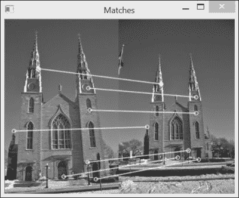

如果每个图像中的图像点作为 `cv::keypoint` 实例（例如，如果它们像在第八章, *检测兴趣点*）中使用关键点检测器检测到的那样），它们首先需要转换为 `cv::Point2f`，以便与 `cv::findFundamentalMat` 一起使用。可以为此使用 OpenCV 函数：

```py
   // Convert keypoints into Point2f
   std::vector<cv::Point2f> selPoints1, selPoints2;
   std::vector<int> pointIndexes1, pointIndexes2;
   cv::KeyPoint::convert(keypoints1,selPoints1,pointIndexes1);
   cv::KeyPoint::convert(keypoints2,selPoints2,pointIndexes2);
```

两个向量 `selPoints1` 和 `selPoints2` 包含两个图像中相应的点。关键点实例是 `keypoints1` 和 `keypoints2`。`pointIndexes1` 和 `pointIndexes2` 向量包含要转换的关键点的索引。调用 `cv::findFundamentalMat` 函数的方式如下：

```py
   // Compute F matrix from 7 matches
   cv::Mat fundamental= cv::findFundamentalMat(
      selPoints1,    // 7 points in first image
      selPoints2,    // 7 points in second image
      CV_FM_7POINT); // 7-point method
```

验证基本矩阵有效性的一个方法是绘制一些选定点的极线。另一个 OpenCV 函数允许计算给定点的极线。一旦计算出来，就可以使用 `cv::line` 函数绘制。以下代码行完成了这两个步骤（即从左图像中的点计算并绘制右图像上的极线）：

```py
   // draw the left points corresponding epipolar 
   // lines in right image 
   std::vector<cv::Vec3f> lines1; 
   cv::computeCorrespondEpilines(
      selPoints1,  // image points 
      1,           // in image 1 (can also be 2)
      fundamental, // F matrix
      lines1);     // vector of epipolar lines

   // for all epipolar lines
   for (vector<cv::Vec3f>::const_iterator it= lines1.begin();
       it!=lines1.end(); ++it) {
          // draw the line between first and last column
          cv::line(image2,
            cv::Point(0,-(*it)[2]/(*it)[1]),
            cv::Point(image2.cols,-((*it)[2]+
                      (*it)[0]*image2.cols)/(*it)[1]),
                      cv::Scalar(255,255,255));
   }
```

结果可以在下面的截图中看到：

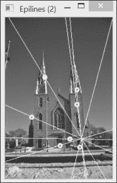

记住，极点位于所有极线的交点处，它是另一台相机的中心的投影。这个极点在前面的图像中是可见的。通常，极线会在图像边界之外相交。在我们的例子中，如果两个图像在同一瞬间拍摄，它将位于第一个相机可见的位置。请注意，当从七个匹配点计算基本矩阵时，结果可能会非常不稳定。确实，用一个匹配点替换另一个匹配点可能会导致极线集合发生显著变化。

## 它是如何工作的...

我们之前解释过，对于一张图像中的一个点，基本矩阵给出了另一个视图中其对应点所在直线的方程。如果点`p`（以齐次坐标表示）的对应点是`p'`，并且如果`F`是两个视图之间的基本矩阵，那么由于`p'`位于极线`Fp`上，我们就有以下方程：

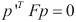

这个方程表达了两个对应点之间的关系，被称为**极线约束**。使用这个方程，就可以通过已知的匹配点来估计矩阵的元素。由于`F`矩阵的元素只给出一个比例因子，因此只有八个元素需要估计（第九个可以任意设置为`1`）。每个匹配点对应一个方程。因此，如果有八个已知的匹配点，就可以通过解这组线性方程来完全估计矩阵。这就是当你使用`cv::findFundamentalMat`函数的`CV_FM_8POINT`标志时所执行的操作。请注意，在这种情况下，输入超过八个匹配点是可能的（并且是首选的）。然后可以在均方意义上求解得到的超定线性方程组。

为了估计基本矩阵，还可以利用一个额外的约束。从数学上讲，`F`矩阵将一个二维点映射到一个一维的直线束（即相交于一个共同点的直线）。所有这些极线都通过这个独特的点（即极点）这一事实对矩阵施加了一个约束。这个约束将估计基本矩阵所需的匹配点数量减少到七个。不幸的是，在这种情况下，方程组变得非线性，最多有三个可能的解（在这种情况下，`cv::findFundamentalMat`将返回一个大小为`9x3`的基本矩阵，即三个`3x3`矩阵堆叠）。可以通过使用`CV_FM_7POINT`标志在 OpenCV 中调用`F`矩阵估计的七个匹配点解。这就是我们在前一个章节的例子中所做的。

最后，我们想提到，在图像中选择合适的匹配集对于获得基本矩阵的准确估计非常重要。一般来说，匹配应该在整个图像中分布良好，并包括场景中不同深度的点。否则，解将变得不稳定或退化配置。特别是，所选场景点不应共面，因为在这种情况下基本矩阵会退化。

## 参见

+   《计算机视觉中的多视图几何学》，剑桥大学出版社，2004 年，R. Hartley 和 A. Zisserman*，是计算机视觉中投影几何最完整的参考书

+   下一个配方解释了如何从一个更大的匹配集中稳健地估计基本矩阵

+   “在两幅图像之间计算单应性”配方解释了为什么当匹配点共面或仅是纯旋转的结果时，无法计算基本矩阵

# 使用随机样本一致性匹配图像

当两个相机观察同一个场景时，它们看到相同的元素，但处于不同的视点。我们已经在上一章研究了特征点匹配问题。在这个配方中，我们回到这个问题，我们将学习如何利用两个视图之间的极线约束来更可靠地匹配图像特征。

我们将遵循的原则很简单：当我们匹配两幅图像之间的特征点时，我们只接受落在对应极线上的匹配。然而，为了能够检查这个条件，必须知道基本矩阵，但我们需要良好的匹配来估计这个矩阵。这似乎是一个鸡生蛋的问题。然而，在这个配方中，我们提出了一种解决方案，其中基本矩阵和一组良好的匹配将共同计算。

## 如何做到这一点...

目标是能够计算两个视图之间的基本矩阵和一组良好的匹配。为此，我们将使用在前一个配方中引入的极线约束来验证所有找到的特征点对应关系。为此，我们创建了一个类，它封装了所提出的稳健匹配过程的各个步骤：

```py
class RobustMatcher {
  private:
    // pointer to the feature point detector object
    cv::Ptr<cv::FeatureDetector> detector;
    // pointer to the feature descriptor extractor object
    cv::Ptr<cv::DescriptorExtractor> extractor;
    int normType;
    float ratio; // max ratio between 1st and 2nd NN
    bool refineF; // if true will refine the F matrix
    double distance; // min distance to epipolar
    double confidence; // confidence level (probability)

  public:
    RobustMatcher(std::string detectorName, // specify by name
                   std::string descriptorName) 
      : normType(cv::NORM_L2), ratio(0.8f), 
          refineF(true), confidence(0.98), distance(3.0) {    

      // construct by name
      if (detectorName.length()>0) {
      detector= cv::FeatureDetector::create(detectorName); 
      extractor= cv::DescriptorExtractor::
                           create(descriptorName);
      }
    }
```

注意我们如何使用`cv::FeatureDetector`和`cv::DescriptorExtractor`接口的`create`方法，以便用户可以通过它们的名称选择`create`方法。注意，`create`方法也可以使用定义的`setFeatureDetector`和`setDescriptorExtractor`设置方法来指定。

主要方法是我们的`match`方法，它返回匹配项、检测到的关键点和估计的基本矩阵。该方法通过以下四个不同的步骤进行（在以下代码的注释中明确标识）：

```py
// Match feature points using RANSAC
// returns fundamental matrix and output match set
cv::Mat match(cv::Mat& image1, cv::Mat& image2, // input images 
    std::vector<cv::DMatch>& matches,           // output matches
    std::vector<cv::KeyPoint>& keypoints1,      // output keypoints
    std::vector<cv::KeyPoint>& keypoints2) { 

    // 1\. Detection of the feature points
    detector->detect(image1,keypoints1);
    detector->detect(image2,keypoints2);

    // 2\. Extraction of the feature descriptors
    cv::Mat descriptors1, descriptors2;
    extractor->compute(image1,keypoints1,descriptors1);
    extractor->compute(image2,keypoints2,descriptors2);

    // 3\. Match the two image descriptors
    //    (optionnally apply some checking method)

    // Construction of the matcher with crosscheck 
    cv::BFMatcher matcher(normType,   //distance measure
                            true);    // crosscheck flag
    // match descriptors
    std::vector<cv::DMatch> outputMatches;
    matcher.match(descriptors1,descriptors2,outputMatches);

    // 4\. Validate matches using RANSAC
    cv::Mat fundaental= ransacTest(outputMatches, 
                              keypoints1, keypoints2, matches);
    // return the found fundamental matrix
    return fundamental;
  }
```

前两步简单地检测特征点并计算它们的描述符。接下来，我们使用`cv::BFMatcher`类进行特征匹配，就像我们在上一章中做的那样。我们使用交叉检查标志来获得更好的匹配质量。

第四步是本菜谱中引入的新概念。它包括一个额外的过滤测试，这次将使用基矩阵来拒绝不遵守极线约束的匹配。这个测试基于`RANSAC`方法，即使匹配集中仍然存在异常值，该方法也能计算基矩阵（该方法将在下一节中解释）：

```py
// Identify good matches using RANSAC
// Return fundamental matrix and output matches
cv::Mat ransacTest(const std::vector<cv::DMatch>& matches,
                   const std::vector<cv::KeyPoint>& keypoints1, 
                   const std::vector<cv::KeyPoint>& keypoints2,
                   std::vector<cv::DMatch>& outMatches) {

// Convert keypoints into Point2f  
  std::vector<cv::Point2f> points1, points2;    
  for (std::vector<cv::DMatch>::const_iterator it= 
  matches.begin(); it!= matches.end(); ++it) {

       // Get the position of left keypoints
       points1.push_back(keypoints1[it->queryIdx].pt);
       // Get the position of right keypoints
       points2.push_back(keypoints2[it->trainIdx].pt);
    }

  // Compute F matrix using RANSAC
  std::vector<uchar> inliers(points1.size(),0);
  cv::Mat fundamental= cv::findFundamentalMat(
      points1,points2, // matching points
      inliers,      // match status (inlier or outlier)  
      CV_FM_RANSAC, // RANSAC method
      distance,     // distance to epipolar line
      confidence);  // confidence probability

  // extract the surviving (inliers) matches
  std::vector<uchar>::const_iterator itIn= inliers.begin();
  std::vector<cv::DMatch>::const_iterator itM= matches.begin();
  // for all matches
  for ( ;itIn!= inliers.end(); ++itIn, ++itM) {
    if (*itIn) { // it is a valid match
      outMatches.push_back(*itM);
    }
  }
  return fundamental;
}
```

这段代码有点长，因为在使用 F 矩阵计算之前，需要将关键点转换为`cv::Point2f`。使用这个类，通过以下调用就可以轻松实现图像对的鲁棒匹配：

```py
  // Prepare the matcher (with default parameters)
  RobustMatcher rmatcher("SURF"); // we use SURF features here
  // Match the two images
  std::vector<cv::DMatch> matches;
  std::vector<cv::KeyPoint> keypoints1, keypoints2;
  cv::Mat fundamental= rmatcher.match(image1,image2,
                           matches, keypoints1, keypoints2);
```

这导致了`62`个匹配，如下面的截图所示：

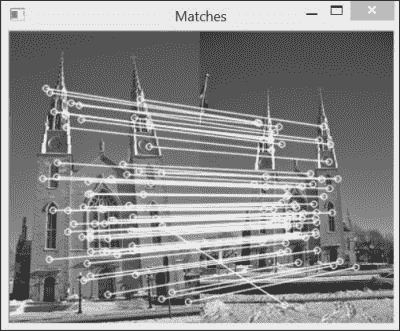

有趣的是，几乎所有这些匹配都是正确的，即使还有一些错误的匹配存在；这些错误匹配偶然落在了计算出的基矩阵的对应极线上。

## 它是如何工作的...

在前面的菜谱中，我们了解到可以从多个特征点匹配中估计与图像对相关的基矩阵。显然，为了精确，这个匹配集必须只包含好的匹配。然而，在实际情况下，无法保证通过比较检测到的特征点的描述符获得的匹配集是完全精确的。这就是为什么引入了一种基于**RANSAC**（**随机采样一致性**）策略的基矩阵估计方法。

RANSAC 算法旨在从一个可能包含多个异常值的数据集中估计给定的数学实体。想法是从集合中随机选择一些数据点，并仅使用这些点进行估计。所选点的数量应该是估计数学实体所需的最小点数。在基矩阵的情况下，八个匹配对是最小数量（实际上，可能是七个匹配，但 8 点线性算法计算更快）。一旦从这八个随机匹配中估计出基矩阵，就将匹配集中的所有其他匹配与由此矩阵导出的极线约束进行测试。所有满足此约束的匹配（即对应特征与其极线距离较短的匹配）都被识别出来。这些匹配形成了计算出的基矩阵的**支持集**。

RANSAC 算法背后的核心思想是支持集越大，计算出的矩阵就越可能是正确的。相反，如果随机选择的匹配中有一个（或多个）是错误的匹配，那么计算出的基础矩阵也将是错误的，其支持集预计会很小。这个过程会重复多次，最终，支持集最大的矩阵将被保留为最可能的矩阵。

因此，我们的目标是多次随机选择八个匹配，最终选择出八个好的匹配，这将给我们一个大的支持集。根据整个数据集中错误匹配的数量，选择八个正确匹配的概率会有所不同。然而，我们知道，我们选择的次数越多，我们对我们至少在这些选择中有一个好的匹配集的信心就越高。更精确地说，如果我们假设匹配集由`w%`的内点（良好匹配）组成，那么我们选择八个良好匹配的概率是`w%`。因此，一个选择包含至少一个错误匹配的概率是`(1-w)`。如果我们进行`k`次选择，只有一个随机集只包含良好匹配的概率是`1-(1-w)^k`。这是置信概率，`c`，我们希望这个概率尽可能高，因为我们至少需要一个良好的匹配集来获得正确的基础矩阵。因此，在运行 RANSAC 算法时，需要确定需要进行多少次`k`次选择才能获得给定的置信水平。

当使用`cv::findFundamentalMat`函数并采用`CV_FM_RANSAC`方法时，提供了两个额外的参数。第一个参数是置信水平，它决定了要进行的迭代次数（默认值为`0.99`）。第二个参数是点到极线距离的最大值，一个点如果被认为是一个内点。所有匹配对中，如果一个点与其极线距离大于指定距离的，将被报告为异常点。该函数还返回一个字符值的`std::vector`，表示输入集中相应的匹配已被识别为异常点（`0`）或内点（`1`）。

在你的初始匹配集中有越多的良好匹配，RANSAC 给出正确基础矩阵的概率就越高。这就是为什么我们在匹配特征点时应用了交叉检查过滤器。你也可以使用前一个菜谱中提到的比率测试来进一步提高最终匹配集的质量。这只是平衡计算复杂度、最终匹配数和所需置信度的问题，即所获得的匹配集只包含精确匹配。

## 还有更多...

本食谱中提出的鲁棒匹配过程的结果是使用具有最大支持集和包含在此支持集中的匹配集计算出的基本矩阵的估计。使用这些信息，我们可以以两种方式对这些结果进行精炼。

### 精炼基本矩阵

由于我们现在有一个高质量的匹配集，作为最后一步，使用所有这些匹配来重新估计基本矩阵可能是一个好主意。我们已经提到，存在一个线性 8 点算法来估计这个矩阵。因此，我们可以获得一个超定方程组，以最小二乘法求解基本矩阵。这一步可以添加到我们的`ransacTest`函数的末尾：

```py
    if (refineF) {
      // The F matrix will 
      // be recomputed with all accepted matches

      // Convert keypoints into Point2f 
      points1.clear();
      points2.clear();
      for (std::vector<cv::DMatch>::
                  const_iterator it= outMatches.begin();
         it!= outMatches.end(); ++it) {

         // Get the position of left keypoints
         points1.push_back(keypoints1[it->queryIdx].pt);

         // Get the position of right keypoints
         points2.push_back(keypoints2[it->trainIdx].pt);
      }

      // Compute 8-point F from all accepted matches
      fundamental= cv::findFundamentalMat(
        points1,points2, // matching points
        CV_FM_8POINT); // 8-point method solved using SVD
    }
```

`cv::findFundamentalMat`函数确实可以通过使用奇异值分解来解决线性方程组，接受超过`8`个匹配。

### 精炼匹配

我们了解到，在双视场系统中，每个点必须位于其对应点的极线（epipolar line）上。这是由基本矩阵（fundamental matrix）表达出的极线约束。因此，如果你有一个基本矩阵的良好估计，你可以使用这个极线约束来校正获得的匹配，通过强制它们位于它们的极线上。这可以通过使用`cv::correctMatches` OpenCV 函数轻松完成：

```py
  std::vector<cv::Point2f> newPoints1, newPoints2;  
  // refine the matches
  correctMatches(fundamental,            // F matrix
                points1, points2,        // original position
                newPoints1, newPoints2); // new position
```

此函数通过修改每个对应点的位置来实现，使其满足极线约束，同时最小化累积（平方）位移。

# 计算两张图像之间的单应性（homography）

本章的第二种方法向你展示了如何从一组匹配中计算图像对的基本矩阵。在射影几何中，还存在另一个非常有用的数学实体。这个实体可以从多视图图像中计算出来，正如我们将看到的，它是一个具有特殊性质的矩阵。

## 准备工作

再次，让我们考虑一个 3D 点和它在相机上的图像之间的射影关系，这是我们本章的第一个食谱中引入的。基本上，我们了解到这个方程通过相机的内在属性和这个相机的位置（用旋转和平移分量指定）将 3D 点与其图像联系起来。如果我们现在仔细检查这个方程，我们会意识到有两个特别有趣的特殊情况。第一种情况是当场景的两个视图之间只存在纯旋转时。那时可以观察到外矩阵的第四列将全部由 0 组成（即平移为零）：

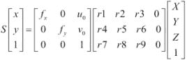

因此，在这个特殊情况下，射影关系变成了一个`3x3`矩阵。当观察到的物体是一个平面时，也会出现一个类似有趣的情况。在这种情况下，我们可以假设这个平面上的点将位于`Z=0`，这不会失去一般性。因此，我们得到以下方程：

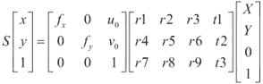

场景点的零坐标将取消投影矩阵的第三列，这使得它再次成为一个`3x3`矩阵。这个特殊的矩阵被称为**单应性矩阵**，它意味着在特殊情况下（这里是一个纯旋转或平面物体），一个点与其图像之间通过以下形式的线性关系相关联：

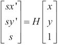

在这里，`H`是一个`3x3`矩阵。这个关系在由`s`标量值表示的尺度因子下成立。一旦估计出这个矩阵，一个视角中的所有点都可以使用这个关系转移到第二个视角。请注意，作为单应性关系的副作用，基本矩阵在这些情况下变得未定义。

## 如何操作...

假设我们有两个通过纯旋转分开的图像。例如，当你通过旋转自己来拍摄建筑或风景照片时，这种情况就会发生；由于你离主题足够远，平移分量可以忽略不计。这两个图像可以使用你选择的特征和`cv::BFMatcher`函数进行匹配。然后，就像我们在前面的食谱中所做的那样，我们将应用一个 RANSAC 步骤，这次将涉及基于匹配集（显然包含大量异常值）的单应性估计。这是通过使用`cv::findHomography`函数完成的，该函数与`cv::findFundamentalMat`函数非常相似：

```py
// Find the homography between image 1 and image 2
std::vector<uchar> inliers(points1.size(),0);
cv::Mat homography= cv::findHomography(
  points1, points2, // corresponding points
  inliers,   // outputed inliers matches 
  CV_RANSAC, // RANSAC method
  1.);       // max distance to reprojection point
```

回想一下，存在单应性（而不是基本矩阵）是因为我们的两个图像通过纯旋转分开。图像在此处显示。我们还显示了由函数的`inliers`参数确定的内点关键点。请参考以下截图：


第二个图像如下所示：

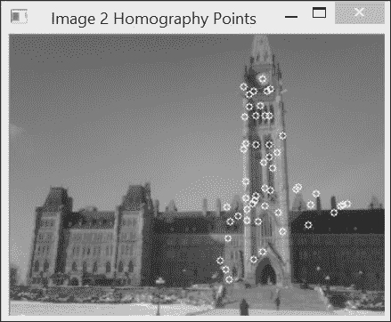

使用以下循环在这些图像上绘制了符合找到的单应性的结果内点：

```py
   // Draw the inlier points
   std::vector<cv::Point2f>::const_iterator itPts=  
                                            points1.begin();
   std::vector<uchar>::const_iterator itIn= inliers.begin();
   while (itPts!=points1.end()) {

      // draw a circle at each inlier location
      if (*itIn) 
          cv::circle(image1,*itPts,3,
                    cv::Scalar(255,255,255));
      ++itPts;
      ++itIn;
   }
```

投影变换是一个可逆的`3x3`矩阵；因此，一旦它被计算出来，你就可以将一个图像中的点转移到另一个图像中。实际上，你可以对图像的每一个像素都这样做。因此，你可以将整个图像转移到第二个图像的视角中。这个过程被称为图像**拼接**，它通常用于从多个图像构建一个大型全景图。一个执行此操作的 OpenCV 函数如下所示：

```py
   // Warp image 1 to image 2
   cv::Mat result;
   cv::warpPerspective(image1,  // input image
      result,                   // output image
      homography,               // homography
      cv::Size(2*image1.cols,
                 image1.rows)); // size of output image
```

一旦获得这个新图像，它就可以附加到其他图像上以扩展视图（因为现在两个图像来自相同的视角）：

```py
   // Copy image 1 on the first half of full image
   cv::Mat half(result,cv::Rect(0,0,image2.cols,image2.rows));
   image2.copyTo(half); // copy image2 to image1 roi
```

下面的图像是结果：

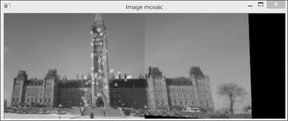

## 工作原理...

当两个视图通过单应性相关联时，就可以确定一个图像上的给定场景点在另一个图像中的位置。对于落在另一个图像边界之外的图像中的点，这个属性尤其有趣。确实，由于第二个视图显示了第一个图像中不可见的场景的一部分，你可以使用单应性来通过读取其他图像中额外像素的颜色值来扩展图像。这就是我们能够创建一个新图像的方法，这个新图像是第二个图像的扩展，并在右侧添加了额外的列。

由 `cv::findHomography` 计算出的单应性是将第一幅图像中的点映射到第二幅图像中的点。这个单应性可以从至少四个匹配中计算出来，并且在这里再次使用了 RANSAC 算法。一旦找到具有最佳支持的单应性，`cv::findHomography` 方法就会使用所有识别出的内点来细化它。

现在，为了将图像 `1` 的点转移到图像 `2`，我们实际上需要的是逆单应性。这正是 `cv::warpPerspective` 函数默认执行的操作；也就是说，它使用提供的单应性的逆来获取输出图像中每个点的颜色值（这就是我们在第二章中称为反向映射的内容，*操作像素*）。当一个输出像素被转移到输入图像之外的位置时，这个像素会被简单地分配一个黑色值（`0`）。请注意，如果想在像素传输过程中使用直接单应性而不是逆单应性，可以在 `cv::warpPerspective` 中的可选第五个参数中指定 `cv::WARP_INVERSE_MAP` 标志。

## 还有更多...

平面图像之间也存在单应性。然后我们可以利用这一点来识别图像中的平面物体。

### 在图像中检测平面目标

假设你想要检测图像中平面物体的出现。这个物体可能是一张海报、画作、标牌、书封面（如下例所示），等等。根据本章所学的内容，策略将包括检测该物体上的特征点，并尝试将它们与图像中的特征点匹配。然后，使用与之前配方中类似但基于单应性的鲁棒匹配方案来验证这些匹配。

让我们定义一个与我们的 `RobustMatcher` 类非常相似的 `TargetMatcher` 类：

```py
class TargetMatcher {

  private:

    // pointer to the feature point detector object
    cv::Ptr<cv::FeatureDetector> detector;
    // pointer to the feature descriptor extractor object
    cv::Ptr<cv::DescriptorExtractor> extractor;
    cv::Mat target; // target image
    int normType;
    double distance; // min reprojection error
```

在这里，我们简单地添加了一个 `target` 属性，它代表要匹配的平面物体的参考图像。匹配方法与 `RobustMatcher` 类的相同，只是在 `ransacTest` 方法中使用 `cv::findHomography` 而不是 `cv::findFundamentalMat`。我们还添加了一个启动目标匹配并找到目标位置的方法：

```py
  // detect the defined planar target in an image
  // returns the homography 
  // the 4 corners of the detected target
  // plus matches and keypoints
  cv::Mat detectTarget(const cv::Mat& image, 
    // position of the target corners (clock-wise)
    std::vector<cv::Point2f>& detectedCorners,       
    std::vector<cv::DMatch>& matches,
    std::vector<cv::KeyPoint>& keypoints1,
    std::vector<cv::KeyPoint>& keypoints2) {
    // find a RANSAC homography between target and image
    cv::Mat homography= match(target,image,matches, 
                                keypoints1, keypoints2);
    // target corners
    std::vector<cv::Point2f> corners;  
    corners.push_back(cv::Point2f(0,0));
    corners.push_back(cv::Point2f(target.cols-1,0));
    corners.push_back(cv::Point2f(target.cols-1,target.rows-1));
    corners.push_back(cv::Point2f(0,target.rows-1));

    // reproject the target corners
    cv::perspectiveTransform(corners,detectedCorners,
                                      homography);
    return homography;
  }
```

一旦通过匹配方法找到单应性，我们就定义目标（即其参考图像的四个角）。然后使用 `cv::perspectiveTransform` 函数将这些角转移到图像上。这个函数简单地用单应性矩阵乘以输入向量中的每个点。这给出了这些点在另一图像中的坐标。目标匹配随后按以下方式进行：

```py
// Prepare the matcher 
TargetMatcher tmatcher("FAST","FREAK");
tmatcher.setNormType(cv::NORM_HAMMING);

// definition of the output data
std::vector<cv::DMatch> matches;
std::vector<cv::KeyPoint> keypoints1, keypoints2;
std::vector<cv::Point2f> corners;
// the reference image
tmatcher.setTarget(target); 
// match image with target
tmatcher.detectTarget(image,corners,matches,
                            keypoints1,keypoints2);
// draw the target corners on the image
cv::Point pt= cv::Point(corners[0]);
cv::line(image,cv::Point(corners[0]),cv::Point(corners[1]),
               cv::Scalar(255,255,255),3);
cv::line(image,cv::Point(corners[1]),cv::Point(corners[2]),
               cv::Scalar(255,255,255),3);
cv::line(image,cv::Point(corners[2]),cv::Point(corners[3]),
               cv::Scalar(255,255,255),3);
cv::line(image,cv::Point(corners[3]),cv::Point(corners[0]),
               cv::Scalar(255,255,255),3);
```

使用 `cv::drawMatches` 函数，我们以如下方式显示结果：

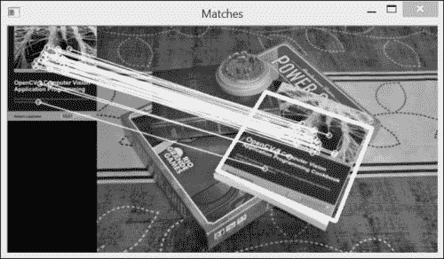

您还可以使用单应性来修改平面物体的视角。例如，如果您有几张从不同角度拍摄的建筑物平坦立面的图片，您可以通过计算这些图片之间的单应性，通过包裹图像并将它们组装在一起来构建一个大型马赛克立面，就像我们在本配方中所做的那样。两个视角之间至少需要四个匹配点来计算单应性。`cv::getPerspectiveTransform` 函数允许通过四个对应点进行这种变换的计算。

## 参考内容

+   第二章中的*图像重映射*配方，*操作像素*，讨论了反向映射的概念

+   M.Brown 和 D.Lowe 在 *International Journal of Computer Vision,74, 1, 2007* 发表的*使用不变特征自动全景图像拼接*文章，描述了从多张图片构建全景的完整方法
