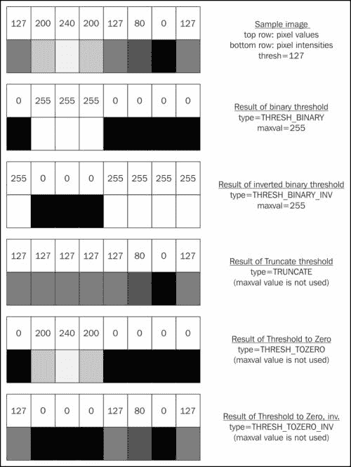
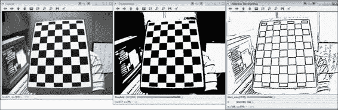
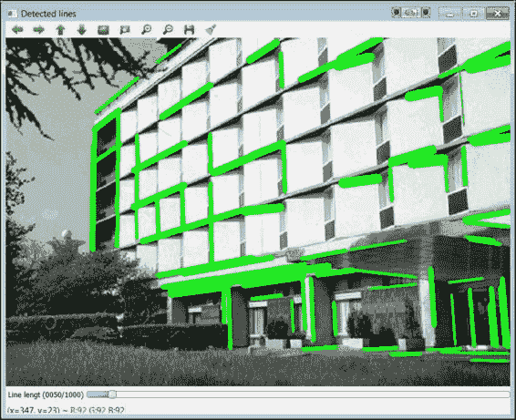
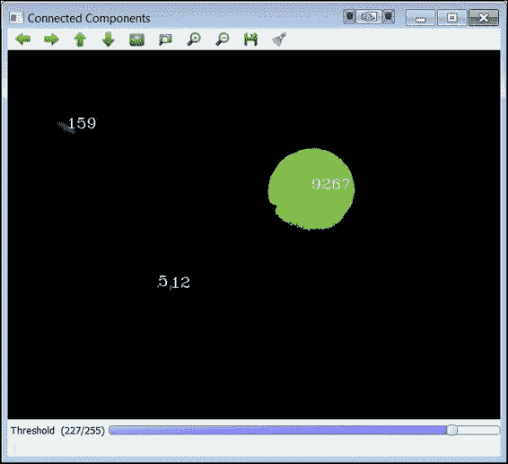
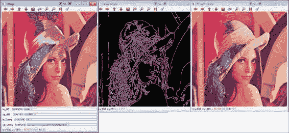
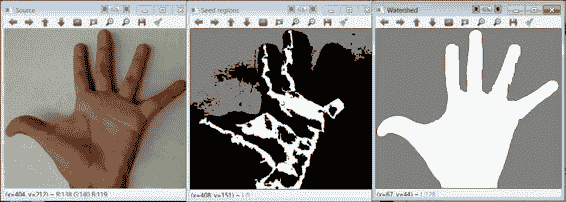
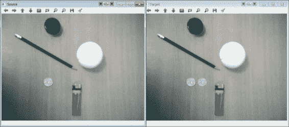

# 第四章 图像中的内容？分割

分割是将图像分割成多个区域或片段的任何过程。这些通常对应于有意义的区域或对象，例如人脸、汽车、道路、天空、草地等。分割是计算机视觉系统中最重要阶段之一。在 OpenCV 中，没有专门的分割模块，尽管在其他模块（大多数在 `imgproc` 中）中提供了许多现成的方法。在本章中，我们将介绍库中最重要的和最常用的方法。在某些情况下，可能需要添加额外的处理来提高结果或获取种子（这指的是允许算法执行完整分割的粗略片段）。在本章中，我们将探讨以下主要的分割方法：阈值化、轮廓和连通组件、区域填充、分水岭分割和 GrabCut 算法。

# 阈值化

阈值化是一种简单但非常有用的分割操作。我们可以安全地说，你几乎会在任何图像处理应用中使用某种形式的阈值化。我们将其视为分割操作，因为它将图像分割成两个区域，通常是对象及其背景。在 OpenCV 中，阈值化是通过函数 `double threshold(InputArray src, OutputArray dst, double thresh, double maxval, int type)` 来实现的。

前两个参数分别是输入和输出图像。第三个输入参数是选择的阈值。`maxval` 的含义取决于我们想要执行的阈值化类型。以下表格显示了每种类型执行的操作：

| 类型 | dst(x,y) |
| --- | --- |
| `THRESH_BINARY` | 如果 `src(x,y)` 大于 `thresh`，则返回 `maxval`，否则返回 `0` |
| `THRESH_BINARY_INV` | 如果 `src(x,y)` 大于 `thresh`，则返回 `0`，否则返回 `maxval` |
| `THRESH_TRUNC` | 如果 `src(x,y)` 大于 `thresh`，则返回 `thresh`，否则返回 `src(x,y)` |
| `THRESH_TOZERO` | 如果 `src(x,y)` 大于 `thresh`，则返回 `src(x,y)`，否则返回 `0` |
| `THRESH_TOZERO_INV` | 如果 `src(x,y)` 大于 `thresh`，则返回 `0`，否则返回 `src(x,y)` |

在之前的 OpenCV 书籍（以及可用的参考手册）中，每种类型的阈值化都是通过 1D 信号图来展示的，但我们的经验表明，数字和灰度级别能让你更快地掌握概念。以下表格展示了使用单行图像作为示例输入时，不同阈值类型的效果：



特殊值 `THRESH_OTSU` 可以与前面的值（使用 OR 运算符）组合。在这种情况下，阈值值将由函数自动估计（使用 Otsu 算法）。此函数返回估计的阈值值。

### 注意

大津法（Otsu's method）获得一个最佳阈值，该阈值能够最好地将背景与前景像素分开（从类间/类内方差比的角度来看）。有关完整解释和演示，请参阅[`www.labbookpages.co.uk/software/imgProc/otsuThreshold.html`](http://www.labbookpages.co.uk/software/imgProc/otsuThreshold.html)。

虽然描述的函数使用单个阈值处理整个图像，但自适应阈值处理为每个像素估计不同的阈值。当输入图像不太均匀（例如，具有不均匀照亮的区域）时，这会产生更好的结果。执行自适应阈值处理的函数如下：

```py
adaptiveThreshold(InputArray src, OutputArray dst, double maxValue, int adaptiveMethod, int thresholdType, int blockSize, double C)
```

此函数与上一个函数类似。参数`thresholdType`必须是`THRESH_BINARY`或`THRESH_BINARY_INV`。此函数通过计算邻域内像素的加权平均值减去一个常数（`C`）来为每个像素计算一个阈值。当`thresholdType`是`ADAPTIVE_THRESH_MEAN_C`时，计算出的阈值是邻域的平均值（即所有元素都被同等加权）。当`thresholdType`是`ADAPTIVE_THRESH_GAUSSIAN_C`时，邻域内的像素根据高斯函数进行加权。

以下`阈值`示例展示了如何在图像上执行阈值操作：

```py
#include "opencv2/opencv.hpp"
#include <iostream>

using namespace std;
using namespace cv;

Mat src, dst, adaptDst;
int threshold_value, block_size, C;

void thresholding( int, void* )
{
 threshold( src, dst, threshold_value, 255, THRESH_BINARY );

  imshow( "Thresholding", dst );
}

void adaptThreshAndShow()
{
 adaptiveThreshold( src, adaptDst, 255, CV_ADAPTIVE_THRESH_MEAN_C, THRESH_BINARY, block_size, C);
    imshow( "Adaptive Thresholding", adaptDst );
}

void adaptiveThresholding1( int, void* )
{
  static int prev_block_size=block_size;
  if ((block_size%2)==0)    // make sure that block_size is odd
  {
      if (block_size>prev_block_size) block_size++;
      if (block_size<prev_block_size) block_size--;
  }
  if (block_size<=1) block_size=3;  // check block_size min value

  adaptThreshAndShow();
}

void adaptiveThresholding2( int, void* )
{
    adaptThreshAndShow();
}

int main(int argc, char *argv[])
{
    //Read original image and clone it to contain results
    src = imread("left12.jpg", CV_LOAD_IMAGE_GRAYSCALE );
    dst=src.clone();
    adaptDst=src.clone();

    //Create 3 windows
    namedWindow("Source", WINDOW_AUTOSIZE);
    namedWindow("Thresholding", WINDOW_AUTOSIZE);
    namedWindow("Adaptive Thresholding", WINDOW_AUTOSIZE);
    imshow("Source", src);

    //Create trackbars
    threshold_value=127;
    block_size=7;
    C=10;
    createTrackbar( "threshold", "Thresholding", &threshold_value, 255, thresholding );
    createTrackbar( "block_size", "Adaptive Thresholding", &block_size, 25, adaptiveThresholding1 );
    createTrackbar( "C", "Adaptive Thresholding", &C, 255, adaptiveThresholding2 );

    //Perform operations a first time
    thresholding(threshold_value,0);
    adaptiveThresholding1(block_size, 0);
    adaptiveThresholding2(C, 0);

    // Position windows on screen
    moveWindow("Source", 0,0);
    moveWindow("Thresholding", src.cols,0);
    moveWindow("Adaptive Thresholding", 2*src.cols,0);

    cout << "Press any key to exit...\n";
    waitKey(); // Wait for key press
    return 0;
}
```

上述代码中的示例创建了一个包含源图像、灰度加载的源图像、阈值处理结果和自适应阈值处理结果的三个窗口。然后，它创建了三个滑块：一个与阈值处理结果窗口相关联（用于处理阈值值），另外两个与自适应阈值处理结果窗口相关联（用于处理块的尺寸和常数`C`的值）。请注意，由于在这种情况下需要两个回调函数，并且我们不希望重复代码，因此`adaptiveThreshold`的调用被嵌入到`adaptThreshAndShow`函数中。

接下来，调用执行操作的函数，使用默认参数值。最后，使用`highgui`中的`moveWindow`函数重新定位屏幕上的窗口（否则它们将重叠显示，并且只能看到第三个窗口）。此外，请注意，函数`adaptiveThresholding1`中的前六行是必要的，以保持`block_size`参数的奇数值。以下截图显示了示例的输出：



阈值示例的输出

### 注意

函数`inRange(InputArray src, InputArray lowerb, InputArray upperb, OutputArray dst)`在阈值处理中也很有用，因为它检查像素是否位于下限和上限阈值之间。`lowerb`和`upperb`都必须使用 Scalar 提供，如`inRange(src, Scalar(bl,gl,rl), Scalar(bh,gh,rh), tgt);`。

# 边缘和连通组件

轮廓提取操作可以被认为是特征提取和分割之间的中间步骤，因为它产生了一个二值图像，其中图像轮廓与其他均匀区域分离。轮廓通常对应于物体边界。

虽然许多简单的方法可以检测图像中的边缘（例如，Sobel 和 Laplace 滤波器），但**Canny**方法是一种稳健的算法来完成这项任务。

### 注意

此方法使用两个阈值来决定一个像素是否是边缘。在所谓的阈值过程（hysteresis procedure）中，使用一个下限和一个上限阈值（参见[`docs.opencv.org/doc/tutorials/imgproc/imgtrans/canny_detector/canny_detector.html`](http://docs.opencv.org/doc/tutorials/imgproc/imgtrans/canny_detector/canny_detector.html)）。由于 OpenCV 已经包含了一个好的 Canny 边缘检测器示例（在`[opencv_source_code]/samples/cpp/edge.cpp`中），我们这里没有包含一个（但请参见下面的`floodFill`示例）。相反，我们将继续描述基于检测到的边缘的其他非常有用的函数。

要检测直线，霍夫变换是一种经典方法。虽然霍夫变换方法在 OpenCV 中可用（例如，`HoughLines`和`HoughLinesP`函数，参见`[opencv_source_code]/samples/cpp/houghlines.cpp`），但较新的**线段检测器**（**LSD**）方法通常更稳健。LSD 通过寻找高梯度幅度像素的对齐来实现，这得益于其对齐容差特性。这种方法已被证明比最好的基于霍夫的前期检测器（渐进概率霍夫变换）更稳健且更快。

LSD 方法在 OpenCV 的 2.4.9 版本中不可用；尽管如此，在撰写本文时，它已经在 GitHub 代码源仓库中可用。该方法将在版本 3.0 中提供。库中的一个简短示例（`[opencv_source_code]/samples/cpp/lsd_lines.cpp`）涵盖了这一功能。然而，我们将提供一个额外的示例，展示不同的特性。

### 注意

要测试 GitHub 上可用的最新源代码，请访问[`github.com/itseez/opencv`](https://github.com/itseez/opencv)并下载库代码作为 ZIP 文件。然后，将其解压缩到本地文件夹，并按照第一章中描述的相同步骤，*入门*，来编译和安装库。

LSD 检测器是一个 C++类。函数`cv::Ptr<LineSegmentDetector> cv::createLineSegmentDetector (int _refine=LSD_REFINE_STD, double _scale=0.8, double_sigma_scale=0.6, double _quant=2.0, double _ang_th=22.5, double _log_eps=0, double _density_th=0.7, int _n_bins=1024)`创建了一个类的对象，并返回指向它的指针。请注意，几个参数定义了创建的检测器。这些参数的含义需要你了解底层算法，而这超出了本书的范围。幸运的是，默认值对于大多数用途已经足够，因此我们建议读者查阅参考手册（关于库的 3.0 版本）以了解特殊情况。在此说明之后，第一个参数 scale 大致控制返回的线条数量。输入图像会自动按此因子缩放。在较低分辨率下，检测到的线条较少。

### 注意

`cv::Ptr<>`类型是一个用于包装指针的模板类。这个模板在 2.x API 中可用，以方便使用引用计数进行自动释放。`cv::Ptr<>`类型类似于`std::unique_ptr`。

检测本身是通过`LineSegmentDetector::detect(const InputArray _image, OutputArray _lines, OutputArray width=noArray(), OutputArray prec=noArray(), OutputArraynfa=noArray())`方法完成的。第一个参数是输入图像，而`_lines`数组将被填充为一个（STL）`Vec4i`对象的向量，该对象表示线条一端的（x, y）位置，然后是另一端的位置。可选参数`width`、`prec`和`noArray`返回有关检测到的线条的附加信息。第一个参数`width`包含估计的线条宽度。可以使用方便的（尽管简单）方法`LineSegmentDetector::drawSegments(InputOutputArray _image, InputArray lines)`绘制线条。线条将绘制在输入图像上，即`_image`。

以下`lineSegmentDetector`示例显示了检测器的实际应用：

```py
#include "opencv2/opencv.hpp"
#include <iostream>

using namespace std;
using namespace cv;

vector<Vec4i> lines;
vector<float> widths;
Mat input_image, output;

inline float line_length(const Point &a, const Point &b)
{
    return (sqrt((b.x-a.x)*(b.x-a.x) + (b.y-a.y)*(b.y-a.y)));
}

void MyDrawSegments(Mat &image, const vector<Vec4i>&lines, const vector<float>&widths,
const Scalar& color, const float length_threshold)
{
    Mat gray;
    if (image.channels() == 1)
    {
        gray = image;
    }
    else if (image.channels() == 3)
    {
        cvtColor(image, gray, COLOR_BGR2GRAY);
    }

    // Create a 3 channel image in order to draw colored lines
    std::vector<Mat> planes;
    planes.push_back(gray);
    planes.push_back(gray);
    planes.push_back(gray);

    merge(planes, image);

    // Draw segments if length exceeds threshold given
    for(int i = 0; i < lines.size(); ++i)
    {
        const Vec4i& v = lines[i];
        Point a(v[0], v[1]);
        Point b(v[2], v[3]);
        if (line_length(a,b) > length_threshold) line(image, a, b, color, widths[i]);
    }
}

void thresholding(int threshold, void*)
{
    input_image.copyTo(output);
    MyDrawSegments(output, lines, widths, Scalar(0, 255, 0), threshold);
    imshow("Detected lines", output);
}

int main(int argc, char** argv)
{
    input_image = imread("building.jpg", IMREAD_GRAYSCALE);

    // Create an LSD detector object
 Ptr<LineSegmentDetector> ls = createLineSegmentDetector();

    // Detect the lines
ls->detect(input_image, lines, widths);

    // Create window to show found lines
    output=input_image.clone();
    namedWindow("Detected lines", WINDOW_AUTOSIZE);

    // Create trackbar for line length threshold
    int threshold_value=50;
    createTrackbar( "Line length threshold", "Detected lines", &threshold_value, 1000, thresholding );
    thresholding(threshold_value, 0);

    waitKey();
    return 0;
}
```

上述示例创建了一个包含源图像的窗口，该图像以灰度加载，并显示了`drawSegments`方法。然而，它允许你施加段长度阈值并指定线条颜色（`drawSegments`将以红色绘制所有线条）。此外，线条将以检测器估计的宽度绘制。主窗口关联了一个滑块来控制阈值的长度。以下截图显示了示例的输出：



线段检测器示例输出

可以使用函数 `HoughCircles(InputArray image, OutputArray circles, int method, double dp, double minDist, double param1=100, double param2=100, int minRadius=0, int maxRadius=0)` 来检测圆。第一个参数是一个灰度输入图像。输出参数 circles 将填充一个 `Vec3f` 对象的向量。每个对象代表一个圆的 `(center_x, center_y, radius)` 组件。最后两个参数代表最小和最大搜索半径，因此它们会影响检测到的圆的数量。OpenCV 已经包含了这个函数的直接示例，`[opencv_source_code]/samples/cpp/houghcircles.cpp`。该示例检测半径在 1 到 30 之间的圆，并将它们显示在输入图像上方。

分割算法通常形成连通组件，即在二值图像中的连接像素区域。在下一节中，我们将展示如何从二值图像中获取连通组件及其轮廓。轮廓可以通过现在经典的功能 `findContours` 获取。该函数的示例可以在参考手册中找到（也请参阅 `[opencv_source_code]/samples/cpp/contours2.cpp` 和 `[opencv_source_code]/samples/cpp/segment_objects.cpp` 示例）。此外，请注意，在 OpenCV 3.0 版本（以及在 GitHub 存储库中可用的代码）中，`ShapeDistanceExtractor` 类允许您将轮廓与形状上下文描述符（一个示例在 `[opencv_source_code]/samples/cpp/shape_example.cpp`）和 Hausdorff 距离进行比较。这个类在库的新模块 `shape` 中。形状变换也可以通过 `ShapeTransformer` 类（示例，`[opencv_source_code]/samples/cpp/shape_transformation.cpp`）进行。

新的函数 `connectedComponents` 和 `connectedComponentsWithStats` 获取连通组件。这些函数将是 3.0 版本的一部分，并且已经在 GitHub 存储库中可用。OpenCV 包含了一个示例，展示了如何使用第一个函数，`[opencv_source_code]/samples/cpp/connected_components.cpp`。

### 注意

实际上，标记功能性的连通组件在之前的 OpenCV 2.4.x 版本中被移除，现在又重新添加。

我们还提供了一个示例 (`connectedComponents`)，展示了如何使用第二个函数，`int connectedComponentsWithStats(InputArray image, OutputArray labels, OutputArray stats, OutputArray centroids, int connectivity=8, intltype=CV_32S)`，该函数提供了有关每个连通组件的有用统计信息。这些统计信息可以通过 `stats(label, column)` 访问，其中列可以是以下表格：

| `CC_STAT_LEFT` | 在水平方向上，边界框的起始（x）坐标，即最左边的坐标 |
| --- | --- |
| `CC_STAT_TOP` | 在垂直方向上，边界框的起始（y）坐标，即最顶部的坐标 |
| `CC_STAT_WIDTH ` | 矩形的水平尺寸 |
| `CC_STAT_HEIGHT ` | 矩形的垂直尺寸 |
| `CC_STAT_AREA ` | 连通组件的总面积（以像素为单位） |

以下为示例代码：

```py
#include <opencv2/core/utility.hpp>
#include "opencv2/imgproc.hpp"
#include "opencv2/highgui.hpp"
#include <iostream>

using namespace cv;
using namespace std;

Mat img;
int threshval = 227;

static void on_trackbar(int, void*)
{
    Mat bw = threshval < 128 ? (img < threshval) : (img > threshval);
    Mat labelImage(img.size(), CV_32S);

    Mat stats, centroids;
 int nLabels = connectedComponentsWithStats(bw, labelImage, stats, centroids);

    // Show connected components with random colors
    std::vector<Vec3b> colors(nLabels);
    colors[0] = Vec3b(0, 0, 0);//background
    for(int label = 1; label < nLabels; ++label){
        colors[label] = Vec3b( (rand()&200), (rand()&200), (rand()&200) );
    }
    Mat dst(img.size(), CV_8UC3);
    for(int r = 0; r < dst.rows; ++r){
        for(int c = 0; c < dst.cols; ++c){
            int label = labelImage.at<int>(r, c);
            Vec3b &pixel = dst.at<Vec3b>(r, c);
            pixel = colors[label];
         }
     }
    // Text labels with area of each cc (except background)
    for (int i=1; i< nLabels;i++)
    {
        float a=stats.at<int>(i,CC_STAT_AREA);
        Point org(centroids.at<double>(i,0), centroids.at<double>(i,1));
        String txtarea;
        std::ostringstream buff;
        buff << a;
        txtarea=buff.str();
        putText( dst, txtarea, org,FONT_HERSHEY_COMPLEX_SMALL, 1, Scalar(255,255,255), 1);
    }

    imshow( "Connected Components", dst );
}

int main( int argc, const char** argv )
{
    img = imread("stuff.jpg", 0);
    namedWindow( "Connected Components", 1 );
    createTrackbar( "Threshold", "Connected Components", &threshval, 255, on_trackbar );
    on_trackbar(threshval, 0);

    waitKey(0);
    return 0;
}
```

前面的示例创建了一个带有相关滑块的窗口。滑块控制应用于源图像的阈值。在 `on_trackbar` 函数内部，使用阈值的结果调用 `connectedComponentsWithStats`。这之后是代码的两个部分。第一部分用随机颜色填充对应于每个连通组件的像素。属于每个组件的像素在 `labelImage` 中（`labelImage` 输出也由 `connectedComponents` 函数提供）。第二部分显示每个组件的面积文本。此文本位于每个组件的重心上。以下截图显示了示例的输出：



连通组件示例的输出

# 洪水填充

洪水填充操作用给定的颜色填充连通组件。从种子点开始，相邻像素用统一颜色着色。相邻像素可以位于当前像素指定范围内。洪水填充函数为 `int floodFill(InputOutputArray image, Point seedPoint, Scalar newVal, Rect* rect=0, Scalar loDiff=Scalar(), Scalar upDiff=Scalar(),int flags=4)`。参数 `loDiff` 和 `upDiff` 表示检查每个相邻像素的范围（注意可以指定 3 通道的差异阈值）。参数 `newVal` 是应用于范围内的像素的颜色。参数 `flags` 的较低部分包含要使用的像素连通性值（`4` 或 `8`）。较高部分定义了操作模式。

根据此模式，洪水填充函数将在输入图像中着色相邻像素，如果它位于当前像素或原始种子值的指定范围内（由 `loDiff` 和 `upDiff` 给出），或者如果相邻像素位于原始种子值的指定范围内。该函数还可以用掩码图像作为第二个参数调用。如果指定，则填充操作不会跨越掩码中的非零像素。请注意，掩码应是一个比输入图像宽 2 像素、高 2 像素的单通道 8 位图像。

`flags` 的最高位可以是 0 或以下组合之一：

+   `FLOODFILL_FIXED_RANGE`: 如果设置，则考虑当前像素和种子像素之间的差异。否则，考虑相邻像素之间的差异。

+   `FLOODFILL_MASK_ONLY`: 如果设置，则函数不更改图像（忽略 `newVal`），但填充掩码。

在 OpenCV 的洪水填充示例（`[opencv_source_code]/samples/cpp/ffilldemo.cpp`）中，掩码仅用作输出参数。在我们的`floodFill`示例中，如下所示，我们将将其用作输入参数以限制填充。想法是使用边缘检测器的输出作为掩码。这应该在边缘处停止填充过程：

```py
#include "opencv2/opencv.hpp"
#include <iostream>

using namespace std;
using namespace cv;

Mat image, image1, image_orig;
int loDiff = 20, upDiff = 30;
int loCanny=10, upCanny=150;

void onMouse( int event, int x, int y, int, void* )
{
    if( event != CV_EVENT_LBUTTONDOWN ) return;

    Point seed = Point(x,y);
    int flags = 4 + CV_FLOODFILL_FIXED_RANGE;
    int b = (unsigned)theRNG() & 255;
    int g = (unsigned)theRNG() & 255;
    int r = (unsigned)theRNG() & 255;
    Rect ccomp;

    Scalar newVal = Scalar(b, g, r);
    Mat dst = image;

    // flood fill
 floodFill(dst, seed, newVal, &ccomp, Scalar(loDiff, loDiff, loDiff), Scalar(upDiff, upDiff, upDiff), flags);
    imshow("image", dst);

    // Using Canny edges as mask
    Mat mask;
    Canny(image_orig, mask, loCanny, upCanny);
    imshow("Canny edges", mask);
    copyMakeBorder(mask, mask, 1, 1, 1, 1, cv::BORDER_REPLICATE);
    Mat dst1 = image1;
    floodFill(dst1, mask, seed, newVal, &ccomp, Scalar(loDiff, loDiff, loDiff), Scalar(upDiff, upDiff, upDiff), flags);
    imshow("FF with Canny", dst1);

    moveWindow("Canny edges", image.cols,0);
    moveWindow("FF with Canny", 2*image.cols,0);
}

int main(int argc, char *argv[])
{
    // Read original image and clone it to contain results
    image = imread("lena.jpg", CV_LOAD_IMAGE_COLOR );
    image_orig=image.clone();
    image1=image.clone();

    namedWindow( "image", WINDOW_AUTOSIZE );

    imshow("image", image);
    createTrackbar( "lo_diff", "image", &loDiff, 255, 0 );
    createTrackbar( "up_diff", "image", &upDiff, 255, 0 );
    createTrackbar( "lo_Canny", "image", &loCanny, 255, 0 );
    createTrackbar( "up_Canny", "image", &upCanny, 255, 0 );
    setMouseCallback( "image", onMouse, 0 );

    moveWindow("image", 0,0);

    cout << "Press any key to exit...\n";
    waitKey(); // Wait for key press
    return 0;
}
```

上述示例读取并显示一个彩色图像，然后创建四个滑块。前两个滑块控制`floodFill`函数的`loDiff`和`upDiff`值。其他两个滑块控制 Canny 边缘检测器的上下阈值参数。在这个示例中，用户可以在输入图像的任何地方点击。点击位置将被用作种子点以执行洪水填充操作。实际上，每次点击都会调用两次`floodFill`函数。第一个函数简单地使用随机颜色填充一个区域。第二个函数使用由 Canny 边缘检测器输出创建的掩码。请注意，`copyMakeBorder`函数是必要的，以便在掩码周围形成 1 像素宽的边界。以下截图显示了此示例的输出：



洪水填充示例的输出

注意，使用 Canny 边缘（右侧）的输出填充的像素比标准操作（左侧）少。

# 流域分割

流域分割是一种以其效率而闻名的分割方法。该方法本质上从用户指定的起始（种子）点开始，区域从这些点生长。假设可以提供良好的起始种子，则生成的分割对于许多用途都是有用的。

### 注意

关于图像分割中流域变换的更多细节和示例，请参阅[`cmm.ensmp.fr/~beucher/wtshed.html`](http://cmm.ensmp.fr/~beucher/wtshed.html)。

函数`watershed(InputArray image, InputOutputArray markers)`接受一个 3 通道输入图像和一个带有种子的`markers`图像。后者必须是一个 32 位单通道图像。种子可以指定为`markers`中的正值连接组件（0 不能用作种子的值）。作为输出参数，`markers`中的每个像素将被设置为种子组件的值或区域之间的边界处的`-1`。OpenCV 包含一个流域示例（`[opencv_source_code]/samples/cpp/watershed.cpp`），其中用户需要绘制种子的区域。

显然，种子区域的选取很重要。理想情况下，种子应该自动选择，无需用户干预。水系分割的一个典型应用是首先对图像进行阈值处理，以将对象与背景分开，然后应用距离变换，最后使用距离变换图像的局部最大值作为分割的种子点。然而，第一个阈值步骤是关键的，因为对象的一部分可能被视为背景。在这种情况下，对象种子区域将太小，分割效果会较差。另一方面，为了执行水系分割，我们还需要背景的种子。虽然我们可以使用图像角落的点作为种子，但这将不足以满足需求。在这种情况下，背景种子区域太小。如果我们使用这些种子，分割得到的对象区域通常会比实际对象大得多。在我们接下来的 `watershed` 示例中，采用了一种不同的方法，可以得到更好的结果：

```py
#include <opencv2/core/utility.hpp>
#include "opencv2/imgproc.hpp"
#include "opencv2/highgui.hpp"
#include "opencv2/core.hpp"
#include <iostream>

using namespace std;
using namespace cv;

void Watershed(const Mat &src)
{
    Mat dst=src.clone();

    // Flood fill outer part of the image
    Point seed(0,0); // top-left corner
    int loDiff=20;
    int upDiff=20;
    int flags=4 + FLOODFILL_FIXED_RANGE + FLOODFILL_MASK_ONLY + (255<<8);
    Mat mask(src.size(), CV_8UC1);
    mask.setTo(0);
    copyMakeBorder(mask, mask, 1, 1, 1, 1, cv::BORDER_REPLICATE);
    Scalar newVal;
    Rect ccomp;
    floodFill(dst, mask, seed, newVal, &ccomp,
         Scalar(loDiff, loDiff, loDiff), Scalar(upDiff, upDiff, upDiff), flags);

    // Flood fill inner part of the image
    seed.x=(float)src.cols/2;   // image center x
    seed.y=(float)src.rows/2;   // image center y
    Mat mask1=mask.clone();
    mask1.setTo(0);
    floodFill(dst, mask1, seed, newVal, &ccomp,
          Scalar(loDiff, loDiff, loDiff), Scalar(upDiff, upDiff, upDiff), flags);

    // Form image with the two seed regions
    Mat Mask = mask.clone();
    mask=mask/2;
    Mask = mask | mask1;
    imshow("Seed regions", Mask);
    moveWindow("Seed regions", src.cols, 0);

    // Perform watershed
    Mat labelImage(src.size(), CV_32SC1);
    labelImage=Mask(Rect(1,1, src.cols, src.rows));
    labelImage.convertTo(labelImage, CV_32SC1);
 watershed(src, labelImage);
    labelImage.convertTo(labelImage, CV_8U);
    imshow("Watershed", labelImage);
    moveWindow("Watershed", 2*src.cols, 0);
}

int main(int argc, char *argv[])
{
    // Read original image and clone it to contain results
    Mat src = imread("hand_sample2.jpg", IMREAD_COLOR );

    // Create 3 windows
    namedWindow("Source", WINDOW_AUTOSIZE);
    imshow("Source", src);

    Watershed(src);

    // Position windows on screen
    moveWindow("Source", 0,0);

    cout << "Press any key to exit...\n";
    waitKey(); // Wait for key press
    return 0;
}
```

上述代码中的 `Watershed` 函数执行了三个步骤。首先，通过执行淹没填充来获得背景种子区域。淹没填充的种子是图像的左上角，即像素 (0, 0)。接下来，执行另一个淹没填充来获得对象的（在示例图像中的手）种子区域。这个淹没填充的种子取为图像的中心。然后，通过执行前两个淹没填充结果的 `OR` 操作来形成一个种子区域图像。这个结果图像被用作水系操作的种子图像。以下截图显示了种子图像位于图中心的输出示例：



水系分割示例的输出

# GrabCut

GrabCut 是自 OpenCV 2.1 版本以来可用的一种优秀的迭代背景/前景分割算法。GrabCut 特别适用于在最少额外信息（大多数情况下，一个边界矩形就足够了）的情况下将对象从背景中分离出来。然而，它计算量很大，因此仅适用于分割静态图像。

### 注意

GrabCut 是 Microsoft Office 2010 中背景去除工具的底层算法。该算法最初由微软研究院剑桥的研究人员提出。该算法从用户提供的要分割的对象的边界框开始，估计目标对象和背景的颜色分布。这个估计通过最小化一个能量函数来进一步细化，其中具有相同标签的连接区域获得更多的权重。

主要功能是 `grabCut(InputArray img, InputOutputArray mask, Rect rect, InputOutputArray bgdModel, InputOutputArray fgdModel, int iterCount, int mode=GC_EVAL)`。参数 `bgdModel` 和 `fgdModel` 仅由函数内部使用（尽管它们必须被声明）。`iterCount` 变量是要执行的迭代次数。根据我们的经验，算法的迭代次数很少就能产生良好的分割效果。算法由一个边界矩形、一个掩码图像或两者共同辅助。所选择的选项由 `mode` 参数指示，可以是 `GC_INIT_WITH_RECT`、`GC_INIT_WITH_MASK` 或两者的 `OR` 组合。在前一种情况下，`rect` 定义了矩形。矩形外的像素被视为明显的背景。在后一种情况下，掩码是一个 8 位图像，其中像素可能具有以下值：

+   `GC_BGD`：这定义了一个明显的背景像素

+   `GC_FGD`：这定义了一个明显的背景（对象）像素

+   `GC_PR_BGD`：这定义了一个可能的背景像素

+   `GC_PR_FGD`：这定义了一个可能的背景像素

图像掩码也是输出图像，其中包含使用那些相同的前值得到的分割结果。OpenCV 包含了一个 GrabCut 的示例（`[opencv_source_code]/samples/cpp/grabcut.cpp`），用户可以在其中绘制边界矩形以及前景和背景像素。

下面的 `grabcut` 示例使用初始边界矩形算法，然后将结果前景复制到同一图像的另一个位置：

```py
#include "opencv2/opencv.hpp"
#include <iostream>

using namespace std;
using namespace cv;

int main(int argc, char *argv[])
{
    // Read original image and clone it
    Mat src = imread("stuff.jpg" );
    Mat tgt = src.clone();

    // Create source window
    namedWindow("Source", WINDOW_AUTOSIZE);

    imshow("Source", src);
    moveWindow("Source", 0,0);

    // GrabCut segmentation
    Rect rectangle(180,279,60,60);  // coin position
    Mat result;                     // segmentation result
    Mat bgModel,fgModel;            // used internally
grabCut(src, result, rectangle, bgModel,fgModel, 1, GC_INIT_WITH_RECT);

    result=(result & GC_FGD);   // leave only obvious foreground

    // Translation operation
    Mat aff=Mat::eye(2,3,CV_32FC1);
    aff.at<float>(0,2)=50;
    warpAffine(tgt, src, aff, result.size());
    warpAffine(result, result, aff, result.size());
    src.copyTo(tgt, result);

    // Show target window
    imshow("Target", tgt);
    moveWindow("Target", src.cols, 0);

    cout << "Press any key to exit...\n";
    waitKey(); // Wait for key press
    return 0;
}
```

上述示例简单地使用源图像中硬币周围的固定矩形（参见本章第五个截图）进行分割。`result` 图像将包含介于 0 (`GC_BGD`) 和 3 (`GC_PR_FGD`) 之间的值。接下来的 `AND` 操作将非 `GC_FGD` 值转换为零，从而得到一个二值前景掩码。然后，源图像和掩码在水平方向上各移动 50 像素。使用一个仅改变 x 平移组件的单位矩阵进行仿射变换操作。

最后，将转换后的图像复制到目标图像上，使用（也转换过的）掩码。以下截图显示了源图像和目标图像。在这个特定示例中，增加迭代次数没有产生任何显著的影响：



GrabCut 示例中的源图像和目标图像

# 摘要

本章涵盖了计算机视觉中最重要的话题之一。分割通常是第一步，也是通常最棘手的一步。在本章中，我们向读者提供了洞察力和示例，以使用 OpenCV 中最有用的分割方法，例如阈值、轮廓和连通组件、区域填充、分水岭分割方法和 GrabCut 方法。

# 还有什么？

均值漂移分割（函数`pyrMeanShiftFiltering`）已被省略。OpenCV 包含一个示例，展示了如何使用此函数（`[opencv_source_code]/samples/cpp/meanshift_segmentation.cpp`）。然而，这种方法相对较慢，并且倾向于产生过度分割的结果。

背景前景分割也可以通过视频实现，这将在第七章（[part0055_split_000.html#page "Chapter 7. What Is He Doing? Motion"](https://example.org/part0055_split_000.html#page "Chapter 7. What Is He Doing? Motion")）*他在做什么？运动*中介绍。
