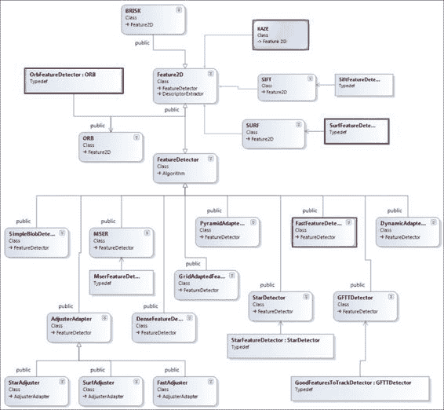
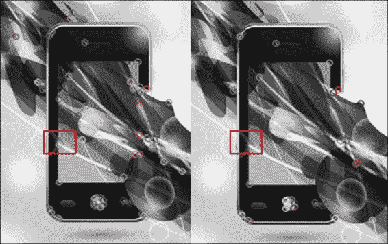
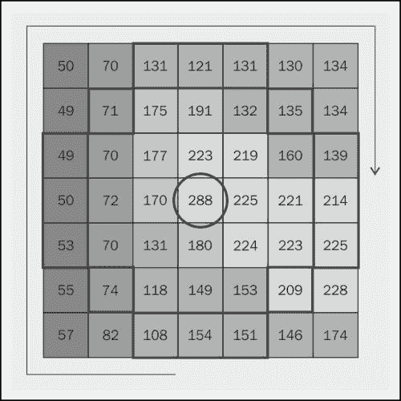
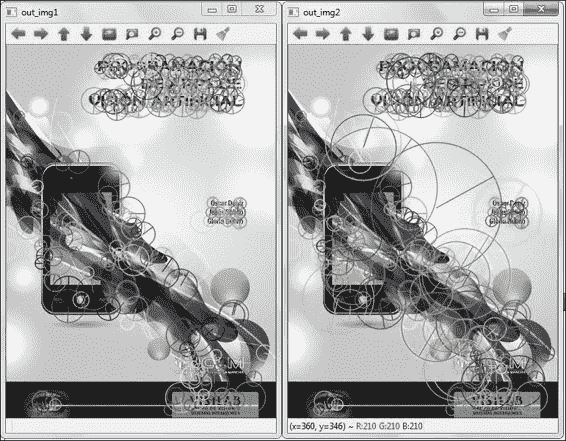
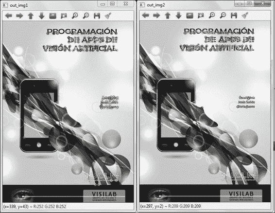
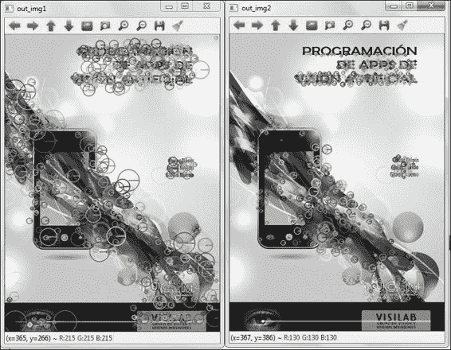
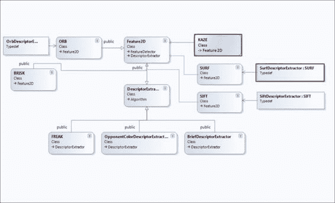
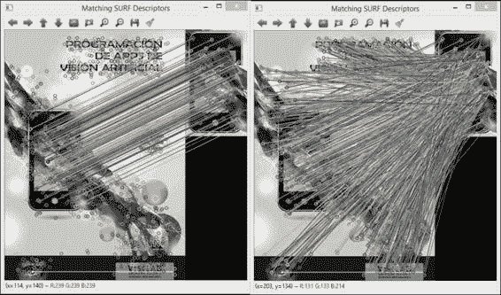
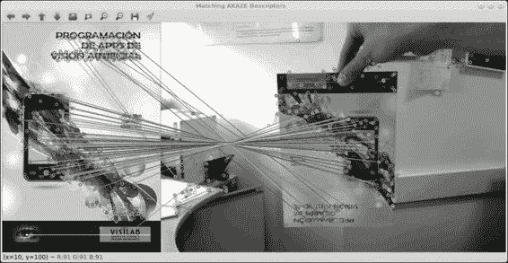
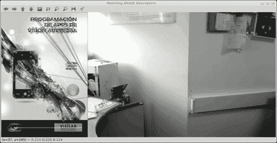

# 第五章. 关注有趣的 2D 特征

在大多数图像中，最有用的信息通常位于某些区域，这些区域通常对应于显著点和区域。在大多数应用中，只要这些点稳定且独特，对这些显著点周围的局部处理就足够了。在本章中，我们将介绍 OpenCV 提供的 2D 显著点和特征的基本概念。需要注意的是，检测器和描述符之间的区别。**检测器**仅从图像中提取兴趣点（局部特征），而描述符则获取这些点的邻域的相关信息。**描述符**，正如其名称所示，通过适当的特征来描述图像。它们以一种对光照变化和小型透视变形不变的方式描述兴趣点。这可以用来将它们与其他描述符（通常从其他图像中提取）匹配。为此，使用匹配器。这反过来可以用来检测对象并推断两张图像之间的相机变换。首先，我们展示兴趣点的内部结构，并解释 2D 特征和描述符提取。最后，本章处理匹配问题，即把不同图像的 2D 特征对应起来。

# 兴趣点

局部特征，也称为兴趣点，其特点是区域强度突然变化。这些局部特征通常分为边缘、角点和块。OpenCV 在`KeyPoint`类中封装了有趣点信息，该类包含以下数据：

+   兴趣点的坐标（`Point2f`类型）

+   有意义的关键点邻域的直径

+   关键点的方向

+   关键点的强度，这取决于所选的关键点检测器

+   提取关键点的金字塔层（八度）；八度在`SIFT`、`SURF`、`FREAK`或`BRISK`等一些描述符中使用

+   用于执行聚类的对象 ID

# 特征检测器

OpenCV 通过`FeatureDetector`抽象类及其`Ptr<FeatureDetector> FeatureDetector::create(const string& detectorType)`方法或直接通过算法类处理多个局部特征检测器的实现。在第一种情况下，指定了检测器的类型（以下图中用红色标出了本章中使用的检测器）。检测器和它们检测的局部特征类型如下：

+   `FAST` (`FastFeatureDetector`): 这种特征检测器用于检测角点和块

+   `STAR` (`StarFeatureDetector`): 这种特征检测器用于检测边缘、角点和块

+   `SIFT` (`SiftFeatureDetector`): 这种特征检测器用于检测角点和块（`nonfree`模块的一部分）

+   `SURF` (`SurfFeatureDetector`): 这种特征检测器用于检测角点和块（`nonfree`模块的一部分）

+   `ORB` (`OrbFeatureDetector`): 这种特征检测器用于检测角点和块

+   `BRISK` (`BRISK`): 这个特征检测器能够检测角点和块状物

+   `MSER` (`MserFeatureDetector`): 这个特征检测器能够检测块状物

+   `GFTT` (`GoodFeaturesToTrackDetector`): 这个特征检测器能够检测边缘和角点

+   `HARRIS` (`GoodFeaturesToTrackDetector`): 这个特征检测器能够检测边缘和角点（启用 Harris 检测器）

+   `Dense` (`DenseFeatureDetector`): 这个特征检测器能够检测图像上分布密集且规则的特性

+   `SimpleBlob` (`SimpleBlobDetector`): 这个特征检测器能够检测块状物



OpenCV 中的 2D 特征检测器

我们应该注意，其中一些检测器，如 `SIFT`、`SURF`、`ORB` 和 `BRISK`，也是描述符。

通过 `void FeatureDetector::detect(const Mat& image, vector<KeyPoint>& keypoints, const Mat& mask)` 函数执行关键点检测，这是 `FeatureDetector` 类的另一种方法。第一个参数是输入图像，其中将检测关键点。第二个参数对应于存储关键点的向量。最后一个参数是可选的，它代表一个输入掩码图像，我们可以指定在其中查找关键点。

### 注意

Matthieu Labbé 实现了一个基于 Qt 的开源应用程序，你可以在这个应用程序中测试 OpenCV 的角点检测器、特征提取器和匹配算法，界面友好。它可在 [`code.google.com/p/find-object/`](https://code.google.com/p/find-object/) 查找。

历史上，第一个兴趣点是角点。1977 年，Moravec 将角点定义为在多个方向（45 度）上存在较大强度变化的兴趣点。Moravec 使用这些兴趣点在连续图像帧中找到匹配区域。后来，在 1988 年，Harris 使用泰勒展开来近似平移强度变化，从而改进了 Moravec 的算法。之后，出现了其他检测器，如基于高斯差分（**DoG**）和 Hessian 矩阵行列式（**DoH**）（例如，`SIFT` 或 `SURF` 分别）的检测器，或者基于 Moravec 算法的检测器，但考虑像素邻域中的连续强度值，如 `FAST` 或 `BRISK`（尺度空间 FAST）。

### 注意

卢在她的个人博客 *LittleCheeseCake* 中详细解释了一些最受欢迎的检测器和描述符。博客可在 [`littlecheesecake.me/blog/13804625/feature-detectors-and-descriptors`](http://littlecheesecake.me/blog/13804625/feature-detectors-and-descriptors) 查阅。

## The FAST detector

角点检测器基于**加速段测试（FAST**）算法。它被设计得非常高效，针对实时应用。该方法基于考虑候选角点 p 周围的 16 像素（邻域）圆。如果邻域中存在一组连续像素，这些像素都比 p+T 亮或比 p-T 暗，则 FAST 检测器将考虑 p 为角点，其中 T 是一个阈值值。这个阈值必须适当选择。

OpenCV 在 `FastFeatureDetector()` 类中实现了 FAST 检测器，这是一个 `FAST()` 方法的包装类。要使用此类，我们必须在我们的代码中包含 `features2d.hpp` 头文件。

接下来，我们展示一个代码示例，其中使用不同阈值的 `FAST` 方法检测角点。以下展示了 `FASTDetector` 代码示例：

```py
#include "opencv2/core/core.hpp"
#include "opencv2/highgui/highgui.hpp"
#include "opencv2/imgproc/imgproc.hpp"
#include "opencv2/features2d/features2d.hpp"
#include <iostream>

using namespace std;
using namespace cv;

int main(int argc, char *argv[])
{
    //Load original image and convert to gray scale
    Mat in_img = imread("book.png");
    cvtColor( in_img, in_img, COLOR_BGR2GRAY );

    //Create a keypoint vectors
    vector<KeyPoint> keypoints1,keypoints2;
    //FAST detector with threshold value of 80 and 100
    FastFeatureDetector detector1(80);
    FastFeatureDetector detector2(100);

    //Compute keypoints in in_img with detector1 and detector2
    detector1.detect(in_img, keypoints1);
    detector2.detect(in_img, keypoints2);

    Mat out_img1, out_img2;
    //Draw keypoints1 and keypoints2
    drawKeypoints(in_img,keypoints1,out_img1,Scalar::all(-1),0);
    drawKeypoints(in_img,keypoints2,out_img2,Scalar::all(-1),0);

    //Show keypoints detected by detector1 and detector2
    imshow( "out_img1", out_img1 );
    imshow( "out_img2", out_img2 );
    waitKey(0);
    return 0;
}
```

代码的解释如下。在本例及以下示例中，我们通常执行以下三个步骤：

1.  创建 2D 特征检测器。

1.  在图像中检测关键点。

1.  绘制获得的关键点。

在我们的示例中，`FastFeatureDetector(int threshold=1, bool nonmaxSuppression= true, type=FastFeatureDetector::TYPE_9_16)` 是定义检测器参数（如阈值值、非最大值抑制和邻域）的函数。

可以选择以下三种类型的邻域：

+   `FastFeatureDetector::TYPE_9_16`

+   `FastFeatureDetector::TYPE_7_12`

+   `FastFeatureDetector::TYPE_5_8`

这些邻域定义了考虑角点（关键点）有效所需的邻居数量（16、12 或 8）和连续像素的总数（9、7 或 5）。以下截图展示了 `TYPE_9_16` 的示例。

在我们的代码中，已选择阈值值 `80` 和 `100`，而其余参数使用默认值，`nonmaxSuppression=true` 和 `type=FastFeatureDetector::TYPE_9_16`，如下所示：

```py
FastFeatureDetector detector1(80);
FastFeatureDetector detector2(100);
```

使用 `void detect(const Mat& image, vector<KeyPoint>& keypoints, const Mat& mask=Mat())` 函数检测并保存关键点。在我们的情况下，我们创建了以下两个 FAST 特征检测器：

+   `detector1` 将其关键点保存到 `keypoints1` 向量中

+   `detector2` 将其关键点保存到 `keypoints2`

`void drawKeypoints(const Mat& image, const vector<KeyPoint>& keypoints, Mat& outImage, const Scalar& color=Scalar::all(-1), int flags=DrawMatchesFlags::DEFAULT)` 函数用于在图像中绘制关键点。`color` 参数允许我们定义关键点的颜色，使用 `Scalar:: all(-1)` 选项，每个关键点将以不同的颜色绘制。

使用图像上的两个阈值值绘制关键点。我们会注意到检测到的关键点数量存在细微差异。这是由于每个情况下的阈值值不同。以下截图显示了在阈值为 80 的样本中检测到的角点，而在阈值为 100 时则未检测到：



使用阈值为 80（在左侧）检测到的关键点。相同的角点在阈值为 100（在右侧）时没有被检测到。

差异是由于 FAST 特征检测器是以默认类型创建的，即 `TYPE_9_16`。在示例中，p 像素取值为 228，因此至少需要九个连续像素比 p+T 更亮或比 p-T 更暗。以下截图显示了此特定关键点的邻域像素值。如果使用阈值为 80，则满足九个连续像素的条件。然而，使用阈值为 100 时，条件不满足：



关键点像素值和所有连续像素都比 p-T (228-80=148) 深的像素值，阈值为 80

## SURF 检测器

**加速鲁棒特征**（**SURF**）检测器基于 Hessian 矩阵来寻找兴趣点。为此，SURF 使用二阶高斯核将图像划分为不同的尺度（级别和八度），并使用简单的盒式滤波器来近似这些核。这个滤波器盒在尺度和空间上主要进行插值，以便为检测器提供尺度不变性属性。SURF 是经典 **尺度不变特征变换**（**SIFT**）检测器的快速近似。SURF 和 SIFT 检测器都是受专利保护的，因此 OpenCV 在其 `nonfree/nonfree.hpp` 头文件中分别包含它们。

下面的 `SURFDetector` 代码示例展示了使用不同数量的高斯金字塔八度来检测关键点的例子：

```py
//… (omitted for simplicity)
#include "opencv2/nonfree/nonfree.hpp"

int main(int argc, char *argv[])
{
    //Load image and convert to gray scale (omitted for
    //simplicity)

    //Create a keypoint vectors
    vector<KeyPoint> keypoints1,keypoints2;

    //SURF detector1 and detector2 with 2 and 5 Gaussian pyramid
    //octaves respectively
    SurfFeatureDetector detector1(3500, 2, 2, false, false);
    SurfFeatureDetector detector2(3500, 5, 2, false, false);

    //Compute keypoints in in_img with detector1 and detector2
    detector1.detect(in_img, keypoints1);
    detector2.detect(in_img, keypoints2);
    Mat out_img1, out_img2;

    //Draw keypoints1 and keypoints2
    drawKeypoints(in_img,keypoints1,out_img1,Scalar::all(-1), DrawMatchesFlags::DRAW_RICH_KEYPOINTS);
    drawKeypoints(in_img,keypoints2,out_img2,Scalar::all(-1), DrawMatchesFlags::DRAW_RICH_KEYPOINTS);

//Show the 2 final images (omitted for simplicity)
return 0;
}
```

### 注意

在前面的示例（以及随后的示例）中，为了简单起见，没有重复某些代码部分，因为它们与前面的示例相同。

代码的解释如下。`SURFFeatureDetector(double hessianThreshold, int nOctaves, int nOctaveLayers, bool extended, bool upright)` 是创建 SURF 检测器的主要函数，其中我们可以定义检测器的参数值，例如 Hessian 阈值、高斯金字塔八度的数量、高斯金字塔中每个八度的图像数量、描述符中的元素数量以及每个特征的朝向。

高阈值值提取的关键点较少，但精度更高。低阈值值提取的关键点较多，但精度较低。在这种情况下，我们使用了一个较大的 Hessian 阈值（`3500`），以在图像中显示较少的关键点。此外，每个图像的八度数也会变化（分别为 2 和 5）。更多的八度也会选择更大尺寸的关键点。以下截图显示了结果：



左侧为具有两个高斯金字塔八度的 SURF 检测器，右侧为具有五个高斯金字塔八度的 SURF 检测器

再次提醒，我们使用`drawKeypoints`函数来绘制检测到的关键点，但在此情况下，由于 SURF 检测器具有方向属性，`DrawMatchesFlags`参数被定义为`DRAW_RICH_KEYPOINTS`。然后，`drawKeypoints`函数会绘制每个关键点及其大小和方向。

## ORB 检测器

**二进制鲁棒独立基本特征**（**BRIEF**）是一种基于二进制字符串的描述符；它不寻找兴趣点。**方向快速和旋转 BRIEF**（**ORB**）检测器是 FAST 检测器和 BRIEF 描述符的联合，被认为是专利 SIFT 和 SURF 检测器的替代品。ORB 检测器使用带有金字塔的 FAST 检测器来检测兴趣点，然后使用 HARRIS 算法来排序特征并保留最佳特征。OpenCV 还允许我们使用 FAST 算法来排序特征，但通常这会产生更不稳定的特征点。下面的`ORBDetector`代码展示了这种差异的一个简单且清晰的例子：

```py
int main(int argc, char *argv[])
{
    //Load image and convert to gray scale (omitted for
    //simplicity)

    //Create a keypoint vectors
    vector<KeyPoint> keypoints1,keypoints2;

    //ORB detector with FAST (detector1) and HARRIS (detector2)
    //score to rank the features
    OrbFeatureDetector detector1(300, 1.1f, 2, 31,0, 2, ORB::FAST_SCORE, 31);
    OrbFeatureDetector detector2(300, 1.1f, 2, 31,0, 2, ORB::HARRIS_SCORE, 31);

    //Compute keypoints in in_img with detector1 and detector2
    detector1.detect(in_img, keypoints1);
    detector2.detect(in_img, keypoints2);

    Mat out_img1, out_img2;
    //Draw keypoints1 and keypoints2
    drawKeypoints(in_img,keypoints1,out_img1,Scalar::all(-1), DrawMatchesFlags::DEFAULT);
    drawKeypoints(in_img,keypoints2,out_img2,Scalar::all(-1), DrawMatchesFlags::DEFAULT);

    //Show the 2 final images (omitted for simplicity)
    return 0;
}
```



使用 FAST 算法选择 300 个最佳特征（在左侧）和使用 HARRIS 检测器选择 300 个最佳特征（在右侧）的 ORB 检测器

以下是代码的解释。`OrbFeatureDetector(int nfeatures=500, float scaleFactor=1.2f, int nlevels=8, int edgeThreshold=31, int firstLevel=0, int WTA_K=2, int scoreType=ORB:: HARRIS_SCORE, int patchSize=31)`函数是类构造函数，其中我们可以指定要保留的最大特征数、缩放比例、级别数以及用于排序特征的检测器类型（`HARRIS_SCORE`或`FAST_SCORE`）。

以下提出的代码示例显示了 HARRIS 和 FAST 算法在排序特征方面的差异；结果如前截图所示：

```py
OrbFeatureDetector detector1(300, 1.1f, 2, 31,0, 2, ORB::FAST_SCORE, 31);
OrbFeatureDetector detector2(300, 1.1f, 2, 31,0, 2, ORB::HARRIS_SCORE, 31);
```

HARRIS 角点检测器在特征排序方面比 FAST 检测器使用得更频繁，因为它能够拒绝边缘并提供一个合理的分数。其余的功能与之前的检测器示例相同，包括关键点检测和绘制。

## KAZE 和 AKAZE 检测器

KAZE 和 AKAZE 检测器将被包含在即将发布的 OpenCV 3.0 版本中。

### 小贴士

OpenCV 3.0 版本尚未可用。再次提醒，如果您想测试此代码并使用 KAZE 和 AKAZE 特征，您可以使用 OpenCV git 仓库中最新可用的版本，网址为[`code.opencv.org/projects/opencv/repository`](http://code.opencv.org/projects/opencv/repository)。

KAZE 检测器是一种可以在非线性尺度空间中检测 2D 特征的方法。这种方法允许我们保留重要的图像细节并去除噪声。**加性算子分裂**（**AOS**）方案用于非线性尺度空间。AOS 方案是高效的、稳定的且可并行化。该算法在多个尺度级别计算 Hessian 矩阵的响应以检测关键点。另一方面，**加速-KAZE**（**AKAZE**）特征检测器使用快速显式扩散来构建非线性尺度空间。

接下来，在`KAZEDetector`代码中，我们看到 KAZE 和 AKAZE 特征检测器的新示例：

```py
int main(int argc, char *argv[])
{
    //Load image and convert to gray scale (omitted for
    //simplicity)

    //Create a keypoint vectors
    vector<KeyPoint> keypoints1,keypoints2;

    //Create KAZE and AKAZE detectors
    KAZE detector1(true,true);
    AKAZE detector2(cv::AKAZE::DESCRIPTOR_KAZE_UPRIGHT,0,3);

    //Compute keypoints in in_img with detector1 and detector2
    detector1.detect(in_img, keypoints1);
    detector2.detect(in_img, keypoints2,cv::Mat());

    Mat out_img1, out_img2;
    //Draw keypoints1 and keypoints2
    drawKeypoints(in_img,keypoints1,out_img1,Scalar::all(-1), DrawMatchesFlags::DRAW_RICH_KEYPOINTS);
    drawKeypoints(in_img,keypoints2,out_img2,Scalar::all(-1), DrawMatchesFlags::DRAW_RICH_KEYPOINTS);

    //Show the 2 final images (omitted for simplicity)
    return 0;
}
```

`KAZE::KAZE(bool extended, bool upright)`函数是 KAZE 类的构造函数，其中可以选择两个参数：`extended`和`upright`。`extended`参数增加了选择 64 或 128 个描述符的选项，而`upright`参数允许我们选择旋转或无不变性。在这种情况下，我们使用两个参数的`true`值。

另一方面，`AKAZE::AKAZE(DESCRIPTOR_TYPE descriptor_type, int descriptor_size=0, int descriptor_channels=3)`函数是 AKAZE 类的构造函数。此函数获取描述符类型、描述符大小和通道作为输入参数。对于描述符类型，应用以下枚举：

```py
enum DESCRIPTOR_TYPE {DESCRIPTOR_KAZE_UPRIGHT = 2, DESCRIPTOR_KAZE = 3, DESCRIPTOR_MLDB_UPRIGHT = 4, DESCRIPTOR_MLDB = 5 };
```

以下截图显示了使用此示例获得的结果：



KAZE 检测器（在左侧）和 AKAZE 检测器（在右侧）

### 注意

Eugene Khvedchenya 的*计算机视觉讲座*博客包含有用的报告，比较了不同关键点的鲁棒性和效率。请参阅以下帖子：[`computer-vision-talks.com/articles/2012-08-18-a-battle-of-three-descriptors-surf-freak-and-brisk/`](http://computer-vision-talks.com/articles/2012-08-18-a-battle-of-three-descriptors-surf-freak-and-brisk/) 和 [`computer-vision-talks.com/articles/2011-07-13-comparison-of-the-opencv-feature-detection-algorithms/`](http://computer-vision-talks.com/articles/2011-07-13-comparison-of-the-opencv-feature-detection-algorithms/)。

# 特征描述符提取器

描述符描述局部图像区域，对图像变换（如旋转、缩放或平移）保持不变。它们为兴趣点周围的小区域提供测量和距离函数。因此，每当需要估计两个图像区域之间的相似性时，我们计算它们的描述符并测量它们的距离。在 OpenCV 中，基本 Mat 类型用于表示描述符集合，其中每一行是一个关键点描述符。

使用特征描述符提取器有以下两种可能性：

+   `DescriptorExtractor`通用接口

+   算法类直接

（请参见以下图表，其中本章使用的描述符用红色标出。）

常见的接口使我们能够轻松地在不同的算法之间切换。在选择算法来解决问题时，这非常有用，因为可以毫不费力地比较每种算法的结果。另一方面，根据算法的不同，有一些参数只能通过其类进行调整。



OpenCV 中的 2D 特征描述符

`Ptr<DescriptorExtractor> DescriptorExtractor::create(const String& descriptorExtractorType)` 函数创建了一个所选类型的新的描述符提取器。描述符可以分为两类：浮点和二进制。浮点描述符在向量中存储浮点值，这可能导致高内存使用。另一方面，二进制描述符存储二进制字符串，从而实现更快的处理时间和减少内存占用。当前实现支持以下类型：

+   SIFT：此实现支持浮点描述符

+   SURF：此实现支持浮点描述符

+   BRIEF：此实现支持二进制描述符

+   BRISK：此实现支持二进制描述符

+   ORB：此实现支持二进制描述符

+   FREAK：此实现支持二进制描述符

+   KAZE：此实现支持二进制描述符（OpenCV 3.0 新增）

+   AKAZE：此实现支持二进制描述符（OpenCV 3.0 新增）

`DescriptorExtractor` 的另一个重要功能是 `void DescriptorExtractor::compute(InputArray image, vector<KeyPoint>& keypoints, OutputArray descriptors)`，该功能用于计算在先前步骤中检测到的图像中关键点集的描述符。该函数有一个接受图像集的变体。

### 提示

注意，可以混合来自不同算法的特征检测器和描述符提取器。然而，建议您使用来自同一算法的两种方法，因为它们应该更适合一起使用。

# 描述符匹配器

`DescriptorMatcher` 是一个抽象基类，用于匹配关键点描述符，正如 `DescriptorExtractor` 所发生的那样，这使得程序比直接使用匹配器更加灵活。使用 `Ptr<DescriptorMatcher> DescriptorMatcher::create(const string& descriptorMatcherType)` 函数，我们可以创建所需类型的描述符匹配器。以下支持的类型有：

+   **BruteForce-L1**：这是用于浮点描述符的。它使用 L1 距离，既高效又快速。

+   **BruteForce**：这是用于浮点描述符的。它使用 L2 距离，可能比 L1 更好，但需要更多的 CPU 使用量。

+   **BruteForce-SL2**：这是用于浮点描述符的，并避免了从 L2 计算平方根，这需要高 CPU 使用量。

+   **BruteForce-Hamming**：这是用于二进制描述符的，并计算比较描述符之间的汉明距离。

+   **BruteForce-Hamming(2)**：这是用于二进制描述符（2 位版本）。

+   **FlannBased**：这用于浮点描述符，并且比暴力搜索更快，因为它通过预先计算加速结构（如数据库引擎）来减少内存使用。

`void DescriptorMatcher::match(InputArray queryDescriptors, InputArray trainDescriptors, vector<DMatch>& matches, InputArray mask=noArray())` 和 `void DescriptorMatcher::knnMatch(InputArray queryDescriptors, InputArray trainDescriptors, vector<vector<DMatch>>& matches, int k, InputArray mask=noArray(), bool compactResult=false)` 函数为每个描述符提供最佳 k 个匹配，对于第一个函数，k 为 1。

`void DescriptorMatcher::radiusMatch(InputArray queryDescriptors, InputArray trainDescriptors, vector<vector<DMatch>>& matches, float maxDistance, InputArray mask=noArray(), bool compactResult=false)` 函数也找到每个查询描述符的匹配，但不超过指定的距离。这种方法的主要缺点是此距离的幅度未归一化，并且取决于特征提取器和描述符。

### 小贴士

为了获得最佳结果，我们建议您使用与描述符类型相同的匹配器。尽管可以将二进制描述符与浮点匹配器混合，反之亦然，但结果可能不准确。

## 匹配 SURF 描述符

SURF 描述符属于方向梯度描述符家族。它们通过方向梯度直方图/Haar-like 特征编码关于补丁中存在的几何形状的统计知识。它们被认为是 SIFT 的更有效替代品。它们是最知名的多尺度特征描述方法，其准确性已经得到广泛测试。尽管如此，它们有两个主要缺点：

+   它们是受专利保护的

+   它们比二进制描述符慢

每个描述符匹配应用程序都有一个通用管道，它使用本章前面解释的组件。它执行以下步骤：

1.  在两幅图像中计算兴趣点。

1.  从两个生成的兴趣点集中提取描述符。

1.  使用匹配器来查找描述符之间的关联。

1.  过滤结果以移除不良匹配。

以下是根据此管道的`matchingSURF`示例：

```py
#include <iostream>
#include "opencv2/core/core.hpp"
#include "opencv2/highgui/highgui.hpp"
#include "opencv2/nonfree/nonfree.hpp"

using namespace std;
using namespace cv;

int main( int argc, char** argv )
{
    Mat img_orig = imread( argv[1],IMREAD_GRAYSCALE);
    Mat img_fragment = imread( argv[2], IMREAD_GRAYSCALE);
    if(img_orig.empty() || img_fragment.empty())
    {
        cerr << " Failed to load images." << endl;
        return -1;
    }

     //Step 1: Detect keypoints using SURF Detector
     vector<KeyPoint> keypoints1, keypoints2;
     Ptr<FeatureDetector> detector = FeatureDetector::create("SURF");

     detector->detect(img_orig, keypoints1);
     detector->detect(img_fragment, keypoints2);

     //Step 2: Compute descriptors using SURF Extractor
     Ptr<DescriptorExtractor> extractor = DescriptorExtractor::create("SURF");
     Mat descriptors1, descriptors2;
     extractor->compute(img_orig, keypoints1, descriptors1);
     extractor->compute(img_fragment, keypoints2, descriptors2);

     //Step 3: Match descriptors using a FlannBased Matcher
     Ptr<DescriptorMatcher> matcher = DescriptorMatcher::create("FlannBased");
     vector<DMatch> matches12;
     vector<DMatch> matches21;
     vector<DMatch> good_matches;

 matcher->match(descriptors1, descriptors2, matches12);
 matcher->match(descriptors2, descriptors1, matches21);

     //Step 4: Filter results using cross-checking
     for( size_t i = 0; i < matches12.size(); i++ )
     {
         DMatch forward = matches12[i];
         DMatch backward = matches21[forward.trainIdx];
         if( backward.trainIdx == forward.queryIdx )
             good_matches.push_back( forward );
     }

     //Draw the results
     Mat img_result_matches;
     drawMatches(img_orig, keypoints1, img_fragment, keypoints2, good_matches, img_result_matches);
     imshow("Matching SURF Descriptors", img_result_matches);
     waitKey(0);

     return 0;
 }
```

以下是对代码的解释。正如我们之前所描述的，遵循应用程序管道意味着执行以下步骤：

1.  首步是在输入图像中检测兴趣点。在这个例子中，使用通用接口通过以下行创建了一个 SURF 检测器：`Ptr<FeatureDetector> detector = FeatureDetector::create("SURF")`。

1.  之后，检测兴趣点，并使用通用接口创建描述符提取器：`Ptr<DescriptorExtractor> extractor = DescriptorExtractor::create( "SURF")`。SURF 算法也用于计算描述符。

1.  下一步是匹配两张图像的描述符，为此，也使用通用接口创建了一个描述符匹配器。以下行，`Ptr<DescriptorMatcher> matcher = DescriptorMatcher::create("FlannBased")`，创建了一个基于 Flann 算法的新匹配器，该算法用于以下方式匹配描述符：

    ```py
    matcher->match(descriptors1, descriptors2, matches12)
    ```

1.  最后，结果被过滤。请注意，计算了两个匹配集，因为之后执行了交叉检查过滤器。这种过滤只存储当使用输入图像作为查询图像和训练图像时出现在两个集合中的匹配：

    使用和未使用过滤器匹配 SURF 描述符的结果

## 匹配 AKAZE 描述符

KAZE 和 AKAZE 是即将包含在 OpenCV 3.0 中的新描述符。根据发布的测试，两者在提高重复性和独特性方面都优于库中包含的先前检测器，适用于常见的二维图像匹配应用。AKAZE 比 KAZE 快得多，同时获得相似的结果，因此如果速度在应用中至关重要，应使用 AKAZE。

以下 `matchingAKAZE` 示例匹配了这种新算法的描述符：

```py
#include <iostream>
#include "opencv2/core/core.hpp"
#include "opencv2/features2d/features2d.hpp"
#include "opencv2/highgui/highgui.hpp"

using namespace cv;
using namespace std;

int main( int argc, char** argv )
{
  Mat img_orig = imread( argv[1], IMREAD_GRAYSCALE );
  Mat img_cam = imread( argv[2], IMREAD_GRAYSCALE );

  if( !img_orig.data || !img_cam.data )
  {
    cerr << " Failed to load images." << endl;
    return -1;
  }

  //Step 1: Detect the keypoints using AKAZE Detector
 Ptr<FeatureDetector> detector = FeatureDetector::create("AKAZE");
  std::vector<KeyPoint> keypoints1, keypoints2;

  detector->detect( img_orig, keypoints1 );
  detector->detect( img_cam, keypoints2 );

  //Step 2: Compute descriptors using AKAZE Extractor
  Ptr<DescriptorExtractor> extractor = DescriptorExtractor::create("AKAZE");
  Mat descriptors1, descriptors2;

  extractor->compute( img_orig, keypoints1, descriptors1 );
  extractor->compute( img_cam, keypoints2, descriptors2 );

  //Step 3: Match descriptors using a BruteForce-Hamming Matcher
 Ptr<DescriptorMatcher> matcher = DescriptorMatcher::create("BruteForce-Hamming");
  vector<vector<DMatch> > matches;
  vector<DMatch> good_matches;

 matcher.knnMatch(descriptors1, descriptors2, matches, 2);

  //Step 4: Filter results using ratio-test
  float ratioT = 0.6;
  for(int i = 0; i < (int) matches.size(); i++)
  {
      if((matches[i][0].distance < ratioT*(matches[i][1].distance)) && ((int) matches[i].size()<=2 && (int) matches[i].size()>0))
      {
          good_matches.push_back(matches[i][0]);
      }
  }

  //Draw the results
  Mat img_result_matches;
  drawMatches(img_orig, keypoints1, img_cam, keypoints2, good_matches, img_result_matches);
  imshow("Matching AKAZE Descriptors", img_result_matches);

  waitKey(0);

  return 0;
}
```

代码的解释如下。前两步与前面的例子非常相似；特征检测器和描述符提取器是通过它们的通用接口创建的。我们只更改传递给构造函数的字符串参数，因为这次使用的是 AKAZE 算法。

### 注意

这次使用了一个使用汉明距离的 BruteForce 匹配器，因为 AKAZE 是一个二进制描述符。

它是通过执行 `Ptr<DescriptorMatcher> matcher = DescriptorMatcher::create("BruteForce-Hamming")` 创建的。`matcher.knnMatch(descriptors1, descriptors2, matches, 2)` 函数计算图像描述符之间的匹配。值得注意的是最后一个整数参数，因为它对于之后执行的过滤器处理是必要的。这种过滤称为比率测试，它计算最佳匹配与次佳匹配之间的良好程度。要被认为是良好的匹配，此值必须高于一定比率，该比率可以在 0 到 1 之间的值范围内设置。如果比率接近 0，描述符之间的对应关系更强。

在以下屏幕截图中，我们可以看到当图像中的书出现旋转时匹配书封面的输出：



在旋转图像中匹配 AKAZE 描述符

以下屏幕截图显示了当第二张图像中没有书出现时的结果：



当训练图像不出现时匹配 AKAZE 描述符

# 摘要

在本章中，我们介绍了一个广泛使用的 OpenCV 组件。局部特征是相关计算机视觉算法（如物体识别、物体跟踪、图像拼接和相机标定）的关键部分。我们提供了一些介绍和示例，从而涵盖了使用不同算法进行兴趣点检测、从兴趣点提取描述符、匹配描述符以及过滤结果。

# 还有什么？

强大的词袋模型物体分类框架尚未包括在内。这实际上是我们在本章中介绍内容的一个附加步骤，因为提取的描述符被聚类并用于执行分类。一个完整的示例可以在 `[opencv_source_code]/samples/cpp/bagofwords_classification.cpp` 找到。
