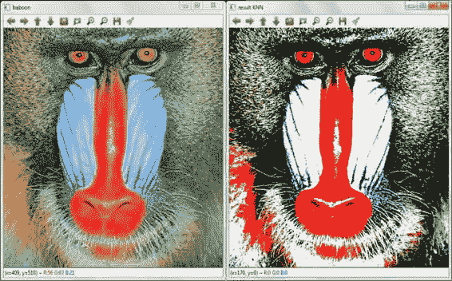
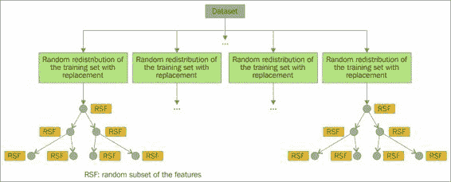
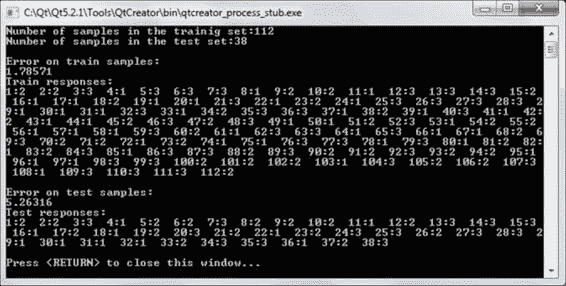
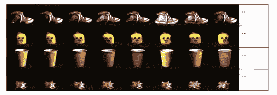
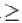
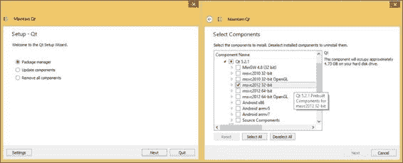
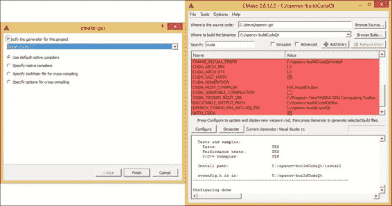
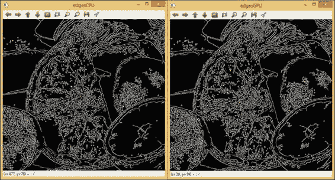
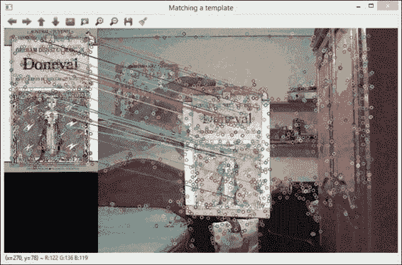

# 第八章. 高级主题

本章涵盖了较少使用的主题，例如多类机器学习和基于 GPU 的优化。这两个主题都看到了兴趣和实际应用的增长，因此它们值得一个完整的章节。我们认为它们是高级的，只要需要关于机器学习/统计分类和并行化的额外知识。我们将从解释一些最著名的分类器开始，如 KNN、SVM 和随机森林，它们都可在 `ml` 模块中找到，并展示它们如何与不同的数据库格式和多类工作。最后，将描述一组用于利用基于 GPU 的计算资源的类和函数。

# 机器学习

机器学习处理允许计算机通过自身学习并做出决策的技术。机器学习的一个核心概念是分类器。分类器从数据集中的示例中学习，其中每个样本的标签是已知的。通常，我们手头有两个数据集：训练集和测试集。分类器使用训练集构建模型。这个训练好的分类器预计可以预测未见过的样本的标签，因此我们最终使用测试集来验证它并评估标签识别率。

在本节中，我们解释了 OpenCV 提供的不同类和函数，用于分类，以及它们使用的简单示例。机器学习类和函数包括用于数据统计分类、回归和聚类的 `ml` 模块。

# KNN 分类器

**K 近邻算法**（**KNN**）是最简单的分类器之一。它是一种监督分类方法，通过学习现有案例并通过最小距离对新的案例进行分类。K 是决策中要分析的邻居数量。要分类的新数据点（查询）被投影到与学习点相同的空间，其类别由训练集中其 KNN 中最频繁的类别给出。

以下 `KNNClassifier` 代码是使用 KNN 算法对每个图像像素进行分类的示例，分类到最近的颜色：黑色（0, 0, 0）、白色（255, 255, 255）、蓝色（255, 0, 0）、绿色（0, 255, 0）或红色（0, 0, 255）：

```py
#include <iostream>
#include <opencv2/core/core.hpp>
#include <opencv2/highgui/highgui.hpp>
#include <opencv2/ml/ml.hpp>

using namespace std;
using namespace cv;

int main(int argc, char *argv[]){

//Create Mat for the training set and classes
 Mat classes(5, 1, CV_32FC1);
 Mat colors(5, 3, CV_32FC1);

    //Training set (primary colors)
    colors.at<float>(0,0)=0, colors.at<float>(0,1)=0, colors.at<float>(0,2)=0;
    colors.at<float>(1,0)=255, colors.at<float>(1,1)=255, colors.at<float>(1,2)=255;
    colors.at<float>(2,0)=255, colors.at<float>(2,1)=0, colors.at<float>(2,2)=0;
    colors.at<float>(3,0)=0, colors.at<float>(3,1)=255, colors.at<float>(3,2)=0;
    colors.at<float>(4,0)=0, colors.at<float>(4,1)=0, colors.at<float>(4,2)=255;

    //Set classes to each training sample
    classes.at<float>(0,0)=1;
    classes.at<float>(1,0)=2;
    classes.at<float>(2,0)=3;
    classes.at<float>(3,0)=4;
    classes.at<float>(4,0)=5;

    //KNN classifier (k=1)
 CvKNearest classifier;
 classifier.train(colors,classes,Mat(),false,1,false);

    //Load original image
    Mat src=imread("baboon.jpg",1);
    imshow("baboon",src);

    //Create result image
    Mat dst(src.rows , src.cols, CV_8UC3);

    Mat results;
Mat newPoint(1,3,CV_32FC1);

    //Response for each pixel and store the result in the result image
    float prediction=0;
    for(int y = 0; y < src.rows; ++y){
      for(int x = 0; x < src.cols; ++x){
         newPoint.at<float>(0,0)= src.at<Vec3b>(y, x)[0];
         newPoint.at<float>(0,1) = src.at<Vec3b>(y, x)[1];
         newPoint.at<float>(0,2) = src.at<Vec3b>(y, x)[2];
 prediction=classifier.find_nearest(newPoint,1,&results, 0, 0);
         dst.at<Vec3b>(y, x)[0]= colors.at<float>(prediction-1,0);
         dst.at<Vec3b>(y, x)[1]= colors.at<float>(prediction-1,1);
         dst.at<Vec3b>(y, x)[2]= colors.at<float>(prediction-1,2);
      }
    }

    //Show result image
    cv::imshow("result KNN",dst);
    cv::waitKey(0);
    return 0;
}
```

### 注意

记住，OpenCV 使用 BGR 颜色方案。

OpenCV 通过 `CvKNearest` 类提供 KNN 算法。通过 `bool CvKNearest::train(const Mat& trainData, const Mat& responses, const Mat& sampleIdx, bool isRegression, int maxK, bool updateBase)` 函数将训练信息添加到 KNN 分类器中。示例创建了一个包含五个样本的训练集（`Mat colors(5, 3, CV_32FC1)`），代表每个类别（颜色）（`Mat classes(5, 1, CV_32FC1)`）；这些是前两个输入参数。`isRegression` 参数是一个布尔值，定义了是否想要执行分类或回归。`maxK` 值表示测试阶段将使用的最大邻居数。

最后，`updateBaseparameter` 允许我们指示是否想要使用数据训练新的分类器或使用它来更新之前的训练数据。然后，代码示例使用 `float CvKNearest::find_nearest(const Mat& samples, int k, Mat* results=0, const float** neighbors=0, Mat* neighborResponses=0, Mat* dist=0)` 函数对原始图像的每个像素执行测试阶段。该函数测试输入样本，选择 KNN，并最终预测此样本的类别值。

在以下屏幕截图中，我们可以看到代码输出以及此 KNN 分类后原始图像和结果图像之间的差异：



使用原色作为类别的 KNN 分类（左：原始图像，右：结果图像）

# 随机森林分类器

随机森林是一类使用决策树作为基分类器的集成构建方法。随机森林分类器是 Bagging 分类器（Bootstrap Aggregating）的一种变体。Bagging 算法是一种分类方法，使用自助法生成弱个体分类器。每个分类器都在训练集的随机重新分配上训练，以便许多原始示例可能在每个分类中重复。

Bagging 和随机森林的主要区别在于，Bagging 使用每个树节点中的所有特征，而随机森林则选择特征的一个随机子集。合适的随机特征数量对应于特征总数的平方根。对于预测，一个新的样本被推送到树中，并分配给树中终端（或叶）节点的类别。这种方法在所有树上迭代，最后，将所有树的预测的平均投票作为预测结果。以下图表显示了随机森林算法：



RF 分类器

随机森林目前在识别能力和效率方面都是最好的分类器之一。在我们的示例`RFClassifier`中，我们使用了 OpenCV 随机森林分类器和 OpenCV 的`CvMLData`类。在机器学习问题中通常处理大量信息，因此使用`.cvs`文件很方便。`CvMLData`类用于以下方式从这样的文件中加载训练集信息：

```py
//… (omitted for simplicity)

int main(int argc, char *argv[]){

 CvMLData mlData;
 mlData.read_csv("iris.csv");
 mlData.set_response_idx(4);
    //Select 75% samples as training set and 25% as test set
 CvTrainTestSplit cvtts(0.75f, true);
    //Split the iris dataset
 mlData.set_train_test_split(&cvtts);

    //Get training set
 Mat trainsindex= mlData.get_train_sample_idx();
    cout<<"Number of samples in the training set:"<<trainsindex.cols<<endl;
    //Get test set
 Mat testindex=mlData.get_test_sample_idx();
    cout<<"Number of samples in the test set:"<<testindex.cols<<endl;
    cout<<endl;

    //Random Forest parameters
 CvRTParams params = CvRTParams(3, 1, 0, false, 2, 0, false, 0, 100, 0, CV_TERMCRIT_ITER | CV_TERMCRIT_EPS);

 CvRTrees classifierRF;
    //Taining phase
 classifierRF.train(&mlData,params);
    std::vector<float> train_responses, test_responses;

    //Calculate train error
    cout<<"Error on train samples:"<<endl;
    cout<<(float)classifierRF.calc_error( &mlData, CV_TRAIN_ERROR,&train_responses)<<endl;

    //Print train responses
    cout<<"Train responses:"<<endl;
    for(int i=0;i<(int)train_responses.size();i++)
        cout<<i+1<<":"<<(float)train_responses.at(i)<<"  ";
    cout<<endl<<endl;

    //Calculate test error
    cout<<"Error on test samples:"<<endl;
    cout<<(float)classifierRF.calc_error( &mlData, CV_TEST_ERROR,&test_responses)<<endl;

    //Print test responses
    cout<<"Test responses:"<<endl;
    for(int i=0;i<(int)test_responses.size();i++)
        cout<<i+1<<":"<<(float)test_responses.at(i)<<"  ";
    cout<<endl<<endl;

    return 0;
}
```

### 小贴士

数据集由 UC Irvine 机器学习仓库提供，可在[`archive.ics.uci.edu/ml/`](http://archive.ics.uci.edu/ml/)找到。对于此代码示例，使用了 Iris 数据集。

如我们之前提到的，`CvMLData`类允许您使用`read_csv`函数从`.csv`文件加载数据集，并通过`set_response_idx`函数指示类列。在这种情况下，我们使用这个数据集进行训练和测试阶段。可以将数据集分成两个不相交的集合用于训练和测试。为此，我们使用`CvTrainTestSplit`结构和`void CvMLData::set_train_test_split(const CvTrainTestSplit* spl)`函数。在`CvTrainTestSplit`结构中，我们指示用作训练集的样本百分比（在我们的情况下为 0.75%），以及我们是否希望从数据集中混合训练和测试样本的索引。`set_train_test_split`函数执行分割。然后，我们可以使用`get_train_sample_idx()`和`get_test_sample_idx()`函数将每个集合存储在`Mat`中。

随机森林分类器是通过`CvRTrees`类创建的，其参数由`CvRTParams::CvRTParams(int max_depth, int min_sample_count, float regression_accuracy, bool use_surrogates, int max_categories, const float* priors, bool calc_var_importance, int nactive_vars, int max_num_of_trees_in_the_forest, float forest_accuracy, int termcrit_type)`构造函数定义。其中一些最重要的输入参数指的是树的最大深度(`max_depth`)——在我们的示例中，它的值为 3——每个节点中随机特征的数量(`nactive_vars`)，以及森林中树的最大数量(`max_num_of_trees_in_the_forest`)。如果我们将`nactive_vars`参数设置为 0，随机特征的数量将是特征总数的平方根。

最后，一旦使用`train`函数训练了分类器，我们可以使用`float CvRTrees::calc_error(CvMLData* data, int type, std::vector<float>* resp=0 )`方法获得误分类样本的百分比。参数类型允许您选择错误的来源：`CV_TRAIN_ERROR`（训练样本中的错误）或`CV_TEST_ERROR`（测试样本中的错误）。

以下截图显示了训练和测试错误以及两个集合中的分类器响应：



随机森林分类器示例结果

# 用于分类的支持向量机（SVM）

**支持向量机**（**SVM**）分类器通过最大化类别之间的几何间隔来找到一个判别函数。因此，空间被映射得尽可能使类别之间尽可能分离。SVM 最小化训练误差和几何间隔。如今，这种分类器是可用的最佳分类器之一，并被应用于许多实际问题。下面的 `SVMClassifier` 示例代码使用 SVM 分类器和包含 66 个图像对象的数据库进行分类。该数据库分为四个类别：一双训练鞋（类别 1）、一个毛绒玩具（类别 2）、一个塑料杯子（类别 3）和一个蝴蝶结（类别 4）。以下截图显示了四个类别的示例。总共使用了 56 张图像用于训练集，10 张图像用于测试集。训练集中的图像采用以下名称结构：`[1-14].png` 对应于类别 1，`[15-28].png` 对应于类别 2，`[29-42].png` 对应于类别 3，`[43-56].png` 对应于类别 4。另一方面，测试集中的图像以“unknown”一词开头，后跟一个数字，例如，`unknown1.png`。

### 小贴士

四个类别的图像已从位于 [`aloi.science.uva.nl/`](http://aloi.science.uva.nl/) 的**阿姆斯特丹物体图像库**（**ALOI**）中提取。



为 SVM 分类示例选择的类别

`SVMClassifier` 示例代码如下：

```py
//… (omitted for simplicity)
#include <opencv2/features2d/features2d.hpp>
#include <opencv2/nonfree/features2d.hpp>

using namespace std;
using namespace cv;

int main(int argc, char *argv[]){

    Mat groups;
    Mat samples;
    vector<KeyPoint> keypoints1;
    //ORB feature detector with 15 interest points
    OrbFeatureDetector detector(15, 1.2f, 2, 31,0, 2, ORB::HARRIS_SCORE, 31);
    Mat descriptors, descriptors2;
    //SURF feature descriptor
    SurfDescriptorExtractor extractor;

    //Training samples
    for(int i=1; i<=56; i++){
        stringstream nn;
        nn <<i<<".png";
        //Read the image to be trained
        Mat img=imread(nn.str());
        cvtColor(img, img, COLOR_BGR2GRAY);
        //Detect interest points
        detector.detect(img, keypoints1);
        //Compute SURF descriptors
        extractor.compute(img, keypoints1, descriptors);
        //Organize and save information in one row
        samples.push_back(descriptors.reshape(1,1));
        keypoints1.clear();
    }

    //Set the labels of each sample
    for(int j=1; j<=56; j++){
        if(j<=14)  groups.push_back(1);
        else if(j>14 && j<=28)  groups.push_back(2);
             else if(j>28 && j<=42)  groups.push_back(3);
                  else groups.push_back(4);
    }

    //Indicate SVM parameters
 CvSVMParams params=CvSVMParams(CvSVM::C_SVC, CvSVM::LINEAR, 0, 1, 0, 1, 0, 0, 0, cvTermCriteria(CV_TERMCRIT_ITER+CV_TERMCRIT_EPS, 100, FLT_EPSILON));

    //Create SVM classifier
 CvSVM classifierSVM;

    //Train classifier
 classifierSVM.train(samples, groups, Mat(), Mat(), params );

    //Test samples
    for(int i=1; i<=10; i++){
        stringstream nn;
        nn <<"unknown"<<i<<".png";
        //Read the image to be tested
        Mat unknown=imread(nn.str());
        cvtColor(unknown, unknown, COLOR_BGR2GRAY);
        //Detect interest points
        detector.detect(unknown, keypoints1);
        //Compute descriptors
        extractor.compute(unknown, keypoints1, descriptors2);
        //Test sample
 float result=classifierSVM.predict(descriptors2.reshape(1,1));
        //Print result
        cout<<nn.str()<<": class "<<result<<endl;
    }
    return 0;
}
```

代码的解释如下。在这个例子中，图像通过其描述符来表示（参见第五章，*专注于有趣的 2D 特征*）。对于训练集中的每个图像，使用**Oriented FAST and Rotated BRIEF**（**ORB**）检测器（`OrbFeatureDetector`）检测其兴趣点，并使用**Speeded Up Robust Features**（**SURF**）描述符（`SurfDescriptorExtractor`）计算其描述符。

使用 `CvSVM` 类创建 SVM 分类器，并使用 `CvSVMParams::CvSVMParams(int svm_type, int kernel_type, double degree, double gamma, double coef0, double Cvalue, double nu, double p, CvMat* class_weights, CvTermCriteria term_crit)` 构造函数设置其参数。在这个构造函数中，有趣的参数是 SVM 的类型（`svm_type`）和核的类型（`kernel_type`）。第一个指定的参数在我们的情况下采用 `CvSVM::C_SVC` 值，因为我们需要一个 n 类分类（n  2）且类别之间不完全分离。它还使用 C 惩罚值来处理异常值。因此，C 起到正则化的作用。`kernel_type` 参数指示 SVM 核的类型。核代表分离案例所需的基础函数。对于 SVM 分类器，OpenCV 包含以下核：

+   `CvSVM::LINEAR`：线性核

+   `CvSVM::POLY`：多项式核

+   `CvSVM::RBF`：径向基函数

+   `CvSVM::SIGMOID`：Sigmoid 核

然后，分类器使用训练集（通过`train`函数）构建一个最优的线性判别函数。现在，它已准备好对新未标记样本进行分类。测试集用于此目的。请注意，我们还需要为测试集中的每张图像计算 ORB 检测器和 SURF 描述符。结果如下所示，其中所有类别都已正确分类：


使用 SVM 进行分类的结果

# 那么，GPU 怎么样？

CPU 似乎已经达到了它们的速度和热功率极限。构建具有多个处理器的计算机变得复杂且昂贵。这就是 GPU 发挥作用的地方。**通用计算图形处理单元**（**GPGPU**）是一种新的编程范式，它使用 GPU 进行计算，并使程序执行更快，功耗降低。它们包括数百个通用计算处理器，可以完成比渲染图形更多的工作，特别是如果它们用于可以并行化的任务，这在计算机视觉算法中是常见的情况。

OpenCV 包括对 OpenCL 和 CUDA 架构的支持，后者实现了更多算法，并且优化更好。这就是为什么我们在本章中引入 CUDA GPU 模块的原因。

# 配置 OpenCV 与 CUDA

在第一章中介绍的安装指南，*入门*，为了包含 GPU 模块，需要一些额外的步骤。我们假设 OpenCV 将要安装的计算机已经安装了该指南中详细说明的软件。

在 Windows 上编译 OpenCV 与 CUDA 结合时，需要满足以下新要求：

+   **CUDA 兼容的 GPU**：这是主要要求。请注意，CUDA 由 NVIDIA 开发，因此它仅与 NVIDIA 显卡兼容。此外，显卡的型号必须列在[`developer.nvidia.com/cuda-gpus`](http://developer.nvidia.com/cuda-gpus)上。所谓的**计算能力**（**CC**）也可以在这个网站上检查，因为它将在以后需要。

+   **Microsoft Visual Studio**：CUDA 仅与此 Microsoft 编译器兼容。可以安装免费的 Visual Studio Express 版本。请注意，截至写作时，Visual Studio 2013 仍然与 CUDA 不兼容，所以我们在这本书中使用 Visual Studio 2012。

+   **NVIDIA CUDA Toolkit**：这包括 GPU 编译器、库、工具和文档。此工具包可在[`developer.nvidia.com/cuda-downloads`](https://developer.nvidia.com/cuda-downloads)获取。

+   **Qt 库针对 Visual C++编译器**：在第一章，*入门*中，安装了 Qt 库的 MinGW 二进制文件，但它们与 Visual C++编译器不兼容。可以通过位于`C:\Qt`中的`MaintenanceTool`应用程序使用软件包管理器下载兼容版本。一个好的选择是下面的截图所示的`msvc2012` 32 位组件。还需要更新`Path`环境变量以包含新位置（例如，在我们的本地系统中，它是`C:\Qt\5.2.1\msvc2012\bin`）。Qt 库包含在编译中，以便利用其用户界面功能。

    下载 Qt 库的新版本

## 配置 OpenCV 的构建

使用 CMake 的构建配置与第一章中解释的典型配置在某些方面有所不同。以下是对这些差异的解释：

+   当选择项目的生成器时，你必须选择与机器中安装的环境相对应的 Visual Studio 编译器版本。在我们的例子中，Visual Studio 11 是正确的编译器，因为它对应于 Visual Studio 2012 中包含的编译器版本。以下截图显示了此选择。

+   在选择构建选项时，我们必须关注与 CUDA 相关的选项。如果 CUDA 工具包的安装正确，CMake 应自动检测其位置并激活`WITH_CUDA`选项。此外，工具包的安装路径通过`CUDA_TOOLKIT_ROOT_DIR`显示。另一个有趣的选项是`CUDA_ARCH_BIN`，因为如果我们只选择我们 GPU 的相应版本，编译时间可以显著减少；否则，它将为所有架构编译代码。如前所述，版本可以在[`developer.nvidia.com/cuda-gpus`](http://developer.nvidia.com/cuda-gpus)上检查。以下截图显示了我们的构建配置中设置的选项：

    CMake 构建配置

## 构建和安装库

CMake 在目标目录中生成多个 Visual Studio 项目，`ALL_BUILD`是基本的项目。一旦在 Visual Studio 中打开，我们可以选择构建配置（调试或发布）以及架构（Win32 或 Win64）。通过按*F7*或点击**构建解决方案**开始编译。编译完成后，建议打开并构建`INSTALL`项目，因为它会生成包含所有必要文件的安装目录。

最后，需要使用新生成的二进制文件的位置更新`Path`系统。重要的是要从`Path`变量中删除旧位置，并只在其中包含一个版本的二进制文件。

### 注意

Qt Creator 应该现在可以找到两个编译器和两个 Qt 版本：一个用于 Visual C++，一个用于 MingGW。在创建新项目时，我们必须根据开发的应用程序选择正确的工具包。也可以更改现有项目的配置，因为工具包是可以管理的。

## 设置 OpenCV 与 CUDA 的一步快速方法

安装过程可以总结如下步骤：

1.  安装 Microsoft Visual Studio Express 2012。

1.  下载并安装 NVIDIA CUDA Toolkit（可在 [`developer.nvidia.com/cuda-downloads`](https://developer.nvidia.com/cuda-downloads) 获取）。

1.  将 Visual C++ 编译器的二进制文件添加到 Qt 安装目录，并使用新位置更新 `Path` 系统环境变量（例如，`C:\Qt\5.2.1\msvc2012\bin`）。

1.  使用 CMake 配置 OpenCV 构建。设置 `WITH_CUDA`、`CUDA_ARCH_BIN`、`WITH_QT` 和 `BUILD_EXAMPLES` 选项。

1.  打开 `ALL_BUILD` Visual Studio 项目并构建它。对 `INSTALL` 项目执行相同的操作。

1.  修改 `Path` 环境变量以更新 OpenCV 的 bin 目录（例如，`C:\opencv-buildCudaQt\install\x86\vc11\bin`）。

# 我们的第一个基于 GPU 的程序

在本节中，我们展示了同一程序的两种版本：一个版本使用 CPU 进行计算，另一个版本使用 GPU。这两个示例分别称为 `edgesCPU` 和 `edgesGPU`，使我们能够指出在使用 OpenCV 的 `GPU` 模块时的差异。

首先介绍 `edgesCPU` 示例：

```py
#include <iostream>
#include "opencv2/core/core.hpp"
#include "opencv2/highgui/highgui.hpp"
#include "opencv2/imgproc/imgproc.hpp" 
using namespace cv;

int main(int argc, char** argv){
if ( argc < 2 ){
        std::cout << "Usage: ./edgesGPU <image>" << std::endl;
        return -1;
    }
    Mat orig = imread(argv[1]);
    Mat gray, dst;

    bilateralFilter(orig,dst,-1,50,7);
    cvtColor(dst,gray,COLOR_BGR2GRAY);
    Canny(gray,gray,7,20);

    imshow("Canny Filter", gray);
    waitKey(0);

    return 0;
}
```

现在 `edgesGPU` 示例如下所示：

```py
#include <iostream>
#include <opencv2/core/core.hpp>
#include <opencv2/highgui/highgui.hpp>
#include <opencv2/gpu/gpu.hpp>
using namespace cv;

int main( int argc, char** argv){
  if ( argc < 2 ){
        std::cout << "Usage: ./edgesGPU <image>" << std::endl;
        return -1;
    }
    Mat orig = imread(argv[1]);
 gpu::GpuMat g_orig, g_gray, g_dst;
    //Transfer the image data to the GPU
 g_orig.upload(orig);

 gpu::bilateralFilter(g_orig,g_dst,-1,50,7);
 gpu::cvtColor(g_dst,g_gray,COLOR_BGR2GRAY);
 gpu::Canny(g_gray,g_gray,7,20);

    Mat dst;
    //Copy the image back to the CPU memory
 g_gray.download(dst);
    imshow("Canny Filter", dst);
    waitKey(0);

    return 0;
}
```

以下是代码的解释。尽管它们最终获得相同的结果，如以下截图所示，但前几个示例中存在一些差异。添加了一个新的头文件作为新的数据类型，并使用了不同的算法实现。`#include <opencv2/gpu/gpu.hpp>` 包含了 `GpuMat` 数据类型，这是在 GPU 内存中存储图像的基本容器。它还包括第二示例中使用的过滤器算法的特定 GPU 版本。

一个重要的考虑因素是我们需要在 CPU 和 GPU 之间传输图像。这是通过 `g_orig.upload(orig)` 和 `g_gray.download(dst)` 方法实现的。一旦图像上传到 GPU，我们就可以对其应用不同的操作，这些操作在 GPU 上执行。为了区分需要运行的算法版本，使用 `gpu` 命名空间，如 `gpu::bilateralFilter`、`gpu::cvtColor` 和 `gpu::Canny`。在应用过滤器之后，图像再次复制到 CPU 内存中并显示。

关于性能，CPU 版本运行时间为 297 毫秒，而 GPU 版本只需 18 毫秒。换句话说，GPU 版本运行速度快了 16.5 倍。



edgesCPU 和 edgesGPU 示例的输出

# 实时处理

使用 GPU 在图像中进行计算的主要优点之一是它们要快得多。这种速度的提升允许你在实时应用中运行重量级的计算算法，例如立体视觉、行人检测或密集光流。在下一个`matchTemplateGPU`示例中，我们展示了一个在视频序列中匹配模板的应用：

```py
#include <iostream>
#include "opencv2/core/core.hpp"
#include "opencv2/highgui/highgui.hpp"
#include "opencv2/features2d/features2d.hpp"
#include "opencv2/gpu/gpu.hpp"
#include "opencv2/nonfree/gpu.hpp"

using namespace std;
using namespace cv;

int main( int argc, char** argv )
{
    Mat img_template_cpu = imread( argv[1],IMREAD_GRAYSCALE);
    gpu::GpuMat img_template;
    img_template.upload(img_template_cpu);

    //Detect keypoints and compute descriptors of the template
 gpu::SURF_GPU surf;
    gpu::GpuMat keypoints_template, descriptors_template;

    surf(img_template,gpu::GpuMat(),keypoints_template,       descriptors_template);

    //Matcher variables
 gpu::BFMatcher_GPU matcher(NORM_L2); 

    //VideoCapture from the webcam
    gpu::GpuMat img_frame;
    gpu::GpuMat img_frame_gray;
    Mat img_frame_aux;
    VideoCapture cap;
    cap.open(0);
    if (!cap.isOpened()){
        cerr << "cannot open camera" << endl;
        return -1;
    }
    int nFrames = 0;
    uint64 totalTime = 0;
    //main loop
    for(;;){
 int64 start = getTickCount();
        cap >> img_frame_aux;
        if (img_frame_aux.empty())
            break;
        img_frame.upload(img_frame_aux);
        cvtColor(img_frame,img_frame_gray, CV_BGR2GRAY);

        //Step 1: Detect keypoints and compute descriptors
        gpu::GpuMat keypoints_frame, descriptors_frame;
 surf(img_frame_gray,gpu::GpuMat(),keypoints_frame, descriptors_frame);

        //Step 2: Match descriptors
        vector<vector<DMatch>>matches; matcher.knnMatch(descriptors_template,descriptors_frame,matches,2);

        //Step 3: Filter results
        vector<DMatch> good_matches;
        float ratioT = 0.7;
        for(int i = 0; i < (int) matches.size(); i++)
        {
            if((matches[i][0].distance < ratioT*(matches[i][1].distance)) && ((int) matches[i].size()<=2 && (int) matches[i].size()>0))
            {
                good_matches.push_back(matches[i][0]);
            }
        }
        // Step 4: Download results
        vector<KeyPoint> keypoints1, keypoints2;
        vector<float> descriptors1, descriptors2;
 surf.downloadKeypoints(keypoints_template, keypoints1);
 surf.downloadKeypoints(keypoints_frame, keypoints2);
 surf.downloadDescriptors(descriptors_template, descriptors1);
 surf.downloadDescriptors(descriptors_frame, descriptors2);

        //Draw the results
        Mat img_result_matches;
        drawMatches(img_template_cpu, keypoints1, img_frame_aux, keypoints2, good_matches, img_result_matches);
        imshow("Matching a template", img_result_matches);

 int64 time_elapsed = getTickCount() - start;
 double fps = getTickFrequency() / time_elapsed;
        totalTime += time_elapsed;
        nFrames++;
        cout << "FPS : " << fps <<endl;

        int key = waitKey(30);
        if (key == 27)
            break;;
    }
 double meanFps = getTickFrequency() / (totalTime / nFrames);
    cout << "Mean FPS: " << meanFps << endl;

    return 0;
}
```

代码的解释如下。正如第五章中详细描述的，*专注于有趣的 2D 特征*，可以使用特征来找到两张图像之间的对应关系。随后在每一帧中搜索的模板图像首先使用 GPU 版本的 SURF（`gpu::SURF_GPU surf;`）来检测兴趣点和提取描述符。这是通过运行`surf(img_template,gpu::GpuMat(),keypoints_template, descriptors_template);`来实现的。对于视频序列中取出的每一帧，都执行相同的处理过程。为了匹配两张图像的描述符，还创建了一个 GPU 版本的 BruteForce 匹配器`gpu::BFMatcher_GPU matcher(NORM_L2);`。由于兴趣点和描述符存储在 GPU 内存中，并且在我们能够显示它们之前需要下载，因此需要额外的步骤。这就是为什么执行了`surf.downloadKeypoints(keypoints, keypoints);`和`surf.downloadDescriptors(descriptors, descriptors);`。下面的截图显示了示例运行的情况：



使用摄像头进行模板匹配

## 性能

选择 GPU 编程的主要动机是性能。因此，这个例子包括了时间测量，以比较相对于 CPU 版本获得的速度提升。具体来说，通过`getTickCount()`方法在程序主循环的开始处节省了时间。在这个循环的末尾，同样使用了`getTickFrequency`，这有助于计算当前帧的 FPS。每一帧所花费的时间被累积，在程序结束时计算平均值。前一个例子平均延迟为 15 FPS，而使用 CPU 数据类型和算法的相同例子仅达到 0.5 FPS。这两个例子都在相同的硬件上进行了测试：一台配备 i5-4570 处理器的 PC 和 NVIDIA GeForce GTX 750 显卡。显然，速度提升 30 倍是显著的，尤其是在我们只需要更改几行代码的情况下。

# 摘要

在本章中，我们介绍了 OpenCV 的两个高级模块：机器学习和 GPU。机器学习具有让计算机做出决策的能力。为此，需要训练和验证一个分类器。本章提供了三个分类示例：KNN 分类器、使用 `.cvs` 数据库的随机森林，以及使用图像数据库的 SVM。本章还讨论了与 CUDA 一起使用 OpenCV 的方法。GPU 在密集型任务中发挥着越来越重要的作用，因为它们可以卸载 CPU 并运行并行任务，例如在计算机视觉算法中遇到的任务。已经提供了几个 GPU 示例：GPU 模块安装、一个基本的第一个 GPU 程序，以及实时模板匹配。

# 还有什么吗？

现在的 GPU 模块涵盖了 OpenCV 的大多数功能；因此，建议您探索这个库并检查哪些算法可用。此外，`performance_gpu` 程序可以在 `[opencv_build]/install/x86/vc11/samples/gpu` 找到，它展示了使用 GPU 版本时许多 OpenCV 算法的加速效果。
