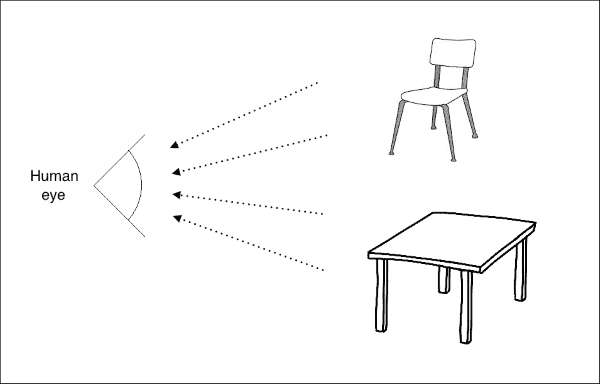
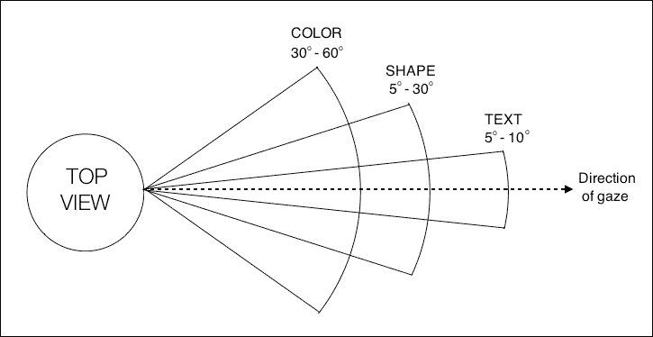
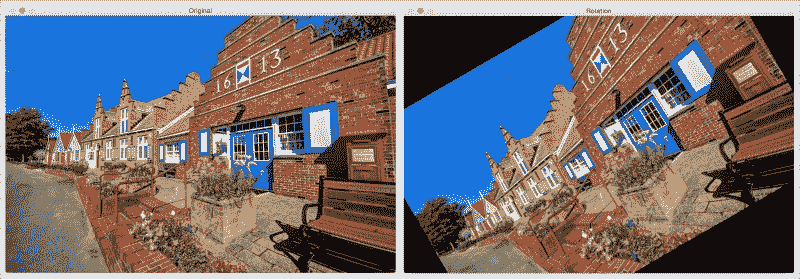
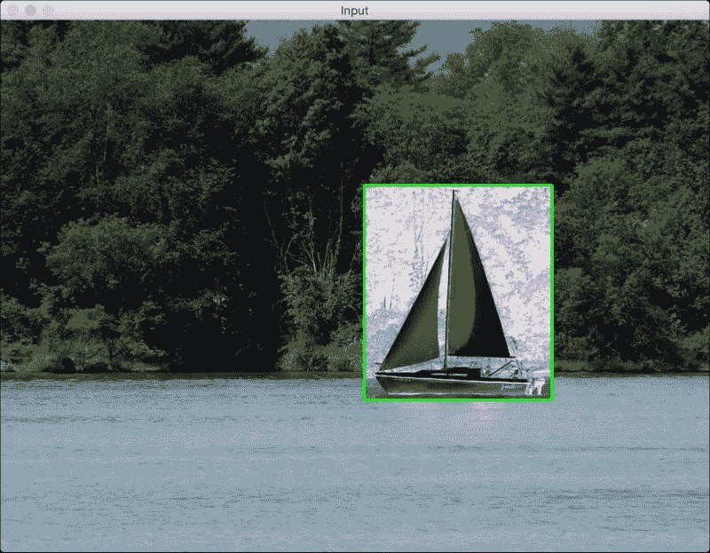
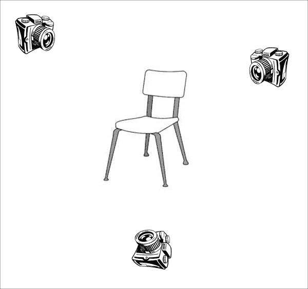
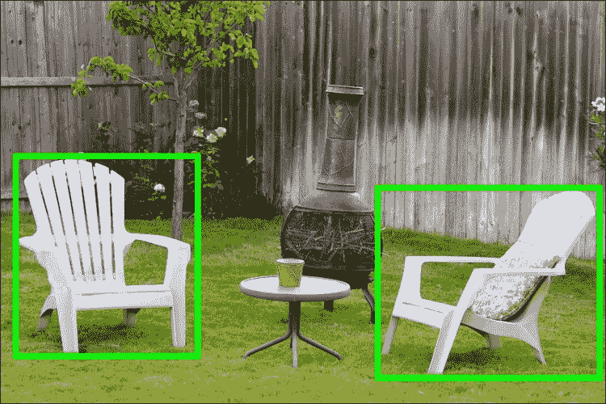
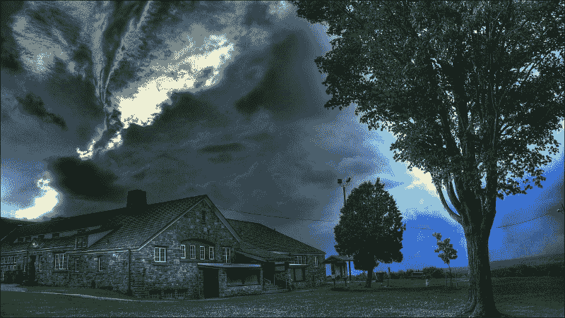

# 第一章：OpenCV 入门

计算机视觉应用既有趣又实用，但其底层算法计算量很大。随着云计算的出现，我们获得了更多的处理能力。OpenCV 库使你能够高效地在实时中运行计算机视觉算法。它已经存在很多年了，并且已经成为该领域的标准库。OpenCV 的一个主要优点是它高度优化，几乎在所有平台上都可用。本书中的讨论将涵盖一切，包括我们使用的算法、为什么使用它以及如何在 OpenCV 中实现它。

在本章中，我们将学习如何在各种操作系统上安装 OpenCV。我们将讨论 OpenCV 提供的功能以及我们可以使用内置函数做的各种事情。

到本章结束时，你将能够回答以下问题：

+   人类如何处理视觉数据，以及他们如何理解图像内容？

+   我们可以用 OpenCV 做什么？OpenCV 中有哪些模块可以用来实现这些功能？

+   如何在 Windows、Linux 和 Mac OS X 上安装 OpenCV？

# 理解人类视觉系统

在我们深入 OpenCV 的功能之前，我们需要了解这些功能最初为何被构建。理解人类视觉系统的工作原理非常重要，这样你才能开发出正确的算法。计算机视觉算法的目标是理解图像和视频的内容。人类似乎能毫不费力地做到这一点！那么，我们如何让机器以同样的精度做到这一点呢？

让我们考虑以下图示：



人眼捕捉所有伴随而来的信息，如颜色、形状、亮度等。在前面的图像中，人眼捕捉了两个主要对象的所有信息，并以某种方式存储。一旦我们理解了我们的系统是如何工作的，我们就可以利用这一点来实现我们想要的东西。例如，以下是一些我们需要了解的事情：

+   我们的视觉系统对低频内容比对高频内容更敏感。低频内容指的是像素值变化不快的平面区域，而高频内容指的是有角和边的区域，像素值波动很大。你可能会注意到，我们很容易在平面表面上看到污点，但在高度纹理的表面上很难找到类似的东西。

+   与颜色变化相比，人眼对亮度变化更敏感。

+   我们的视觉系统对运动敏感。即使我们没有直接看它，我们也能迅速识别在我们视野中移动的东西。

+   我们倾向于在我们的视野中记住显著点。让我们考虑一个白色桌子，它有四条黑色腿，桌面的一个角落有一个红色圆点。当你看这个桌子时，你会立即在脑海中记下表面和腿的颜色相反，并且在桌面的一个角落有一个红色圆点。我们的头脑真的很聪明！我们这样做是自动的，这样我们就可以立即识别它，如果我们再次遇到它。

为了了解我们的视野，让我们看看人类的俯视图以及我们看到各种事物的角度：



我们的大脑视觉系统实际上能够做到很多事情，但这已经足够我们开始了。你可以通过在网上阅读有关人类视觉系统模型的内容来进一步探索。

# 人类是如何理解图像内容的？

如果你环顾四周，你会看到很多物体。你可能每天都会遇到许多不同的物体，而你几乎可以瞬间识别它们，而不需要任何努力。当你看到一把椅子时，你不需要等待几分钟才意识到它实际上是一把椅子。你立刻就知道它是一把椅子！现在，另一方面，计算机发现这项任务非常困难。研究人员已经多年致力于找出为什么计算机在这方面的表现不如我们。

要回答这个问题，我们需要了解人类是如何做到的。视觉数据处理发生在腹侧视觉通路中。这个腹侧视觉通路指的是我们视觉系统中与物体识别相关联的通路。它基本上是我们大脑中帮助识别物体的区域层次。人类可以毫不费力地识别不同的物体，并且我们可以将相似物体聚在一起。我们可以这样做，因为我们已经发展出对同一类物体的一些不变性。当我们看一个物体时，我们的大脑以这种方式提取显著点，使得方向、大小、透视和照明等因素都不重要。

一个尺寸是正常尺寸两倍且旋转了 45 度的椅子仍然是一把椅子。我们之所以能轻易地识别它，是因为我们处理它的方式。机器不能这么容易地做到这一点。人类倾向于根据物体的形状和重要特征来记住物体。无论物体如何放置，我们仍然可以识别它。在我们的视觉系统中，我们根据位置、比例和视点构建了这些层次不变性，这有助于我们非常稳健。

如果你深入我们的系统，你会看到人类在他们的视觉皮层中有细胞可以响应形状，比如曲线和线条。当我们沿着腹侧流进一步前进时，我们会看到更多复杂的细胞，这些细胞被训练来响应更复杂的目标，比如树木、大门等等。腹侧流中的神经元倾向于显示出感受野大小的增加。这与它们首选刺激的复杂性增加的事实相辅相成。

## 为什么机器难以理解图像内容？

我们现在了解了视觉数据如何进入人类视觉系统以及我们的系统如何处理它。问题是，我们仍然不完全理解我们的大脑是如何识别和组织这些视觉数据的。我们只是从图像中提取一些特征，并要求计算机使用机器学习算法从这些特征中学习。我们仍然有那些变化，比如形状、大小、视角、角度、光照、遮挡等等。例如，当你从侧面看时，同一把椅子对机器来说看起来非常不同。人类可以很容易地识别出它是一把椅子，无论它以何种方式呈现给我们。那么，我们如何向我们的机器解释这一点呢？

做这件事的一种方法是将一个物体的所有不同变体都存储起来，包括*尺寸*、*角度*、*视角*等等。但这个过程既繁琐又耗时！实际上，也不可能收集到涵盖每一个变体的数据。机器将消耗大量的内存和很多时间来构建一个能够识别这些物体的模型。即使有所有这些，如果一个物体部分被遮挡，计算机仍然无法识别它。这是因为它们认为这是一个新物体。所以，当我们构建计算机视觉库时，我们需要构建可以以多种不同方式组合的底层功能模块，以形成复杂的算法。OpenCV 提供了很多这样的函数，并且它们高度优化。因此，一旦我们了解了 OpenCV 提供的现成功能，我们就可以有效地使用它来构建有趣的应用程序。让我们继续在下一节中探索这个问题。

# 你可以用 OpenCV 做什么？

使用 OpenCV，你可以几乎完成你所能想到的每一个计算机视觉任务。现实生活中的问题需要你使用许多模块一起工作以达到预期的结果。所以，你只需要了解使用哪些模块和函数来得到你想要的结果。让我们了解 OpenCV 可以提供哪些现成的功能。

## 内置数据结构和输入/输出

OpenCV 的最好之处之一是它提供了许多内置原语来处理与图像处理和计算机视觉相关的操作。如果你必须从头开始编写，你将需要定义一些东西，例如*图像*、*点*、*矩形*等。这些是几乎所有计算机视觉算法的基础。OpenCV 自带所有这些基本结构，它们包含在`core`模块中。另一个优点是这些结构已经针对速度和内存进行了优化，因此你不必担心实现细节。

`imgcodecs`模块处理图像文件的读取和写入。当你对一个输入图像进行操作并创建一个输出图像时，你可以使用简单的命令将其保存为`jpg`或`png`文件。当你使用摄像头工作时，你将处理大量的视频文件。`videoio`模块处理与视频文件输入/输出相关的所有操作。你可以轻松地从网络摄像头捕获视频或以许多不同的格式读取视频文件。你甚至可以通过设置每秒帧数、帧大小等属性将一系列帧保存为视频文件。

## 图像处理操作

当你编写计算机视觉算法时，你会反复使用许多基本的图像处理操作。这些函数中的大多数都存在于`imgproc`模块中。你可以进行诸如图像滤波、形态学操作、几何变换、颜色转换、在图像上绘制、直方图、形状分析、运动分析、特征检测等操作。让我们考虑以下图示：



右侧图像是左侧图像的旋转版本。我们可以在 OpenCV 中使用一行代码来完成这种转换。还有一个名为`ximgproc`的模块，其中包含边缘检测、域变换滤波器、自适应流形滤波器等高级图像处理算法。

## 构建 GUI

OpenCV 提供了一个名为`highgui`的模块，用于处理所有高级用户界面操作。假设你正在处理一个问题，并且想在继续下一步之前查看图像的外观。此模块包含用于创建显示图像和/或视频窗口的函数。还有一个等待函数，它将在你按下键盘上的键之前等待，然后才进入下一步。还有一个可以检测鼠标事件的函数。这对于开发交互式应用程序非常有用。使用此功能，你可以在这些输入窗口上绘制矩形，然后根据所选区域继续操作。

考虑以下图像：



如你所见，我们在图像上绘制了一个绿色矩形，并应用了*负片*效果到该区域。一旦我们得到了这个矩形的坐标，我们就可以只在该区域进行操作。

## 视频分析

视频分析包括分析视频中连续帧之间的运动、跟踪视频中的不同物体、创建视频监控模型等任务。OpenCV 提供了一个名为`video`的模块，可以处理所有这些任务。还有一个名为`videostab`的模块，用于处理视频稳定化。视频稳定化是视频相机的一个重要部分。当你用手持相机拍摄视频时，很难保持双手完全稳定。如果你直接观看这段视频，它看起来会很糟糕，会有抖动。所有现代设备都会使用视频稳定化技术来处理视频，在它们呈现给最终用户之前。

## 3D 重建

3D 重建是计算机视觉中的一个重要主题。给定一组二维图像，我们可以使用相关算法重建三维场景。OpenCV 提供了可以找到这些二维图像中各种物体之间关系的算法，以计算它们的 3D 位置。我们有一个名为`calib3d`的模块可以处理所有这些。此模块还可以处理相机标定，这对于估计相机的参数至关重要。这些参数基本上是任何给定相机使用它们的内部参数，它们将这些捕获的场景转换为图像。我们需要知道这些参数来设计算法，否则我们可能会得到意外的结果。让我们考虑以下图示：



如前图所示，同一个物体从多个姿态被捕获。我们的任务是使用这些二维图像重建原始物体。

## 特征提取

如前所述，人眼视觉系统倾向于从给定的场景中提取显著特征，以便以后可以检索。为了模仿这一点，人们开始设计各种特征提取器，可以从给定的图像中提取这些显著点。一些流行的算法包括**SIFT**（**尺度不变特征变换**）、**SURF**（**加速鲁棒特征**）、**FAST**（**加速段测试特征**）等。有一个名为`features2d`的模块提供了检测和提取所有这些特征的功能。还有一个名为`xfeatures2d`的模块提供了更多特征提取器，其中一些仍处于实验阶段。如果你有机会，可以尝试使用这些。还有一个名为`bioinspired`的模块，提供了生物启发的计算机视觉模型算法。

## 物体检测

物体检测是指检测给定图像中物体的位置。这个过程不关心物体的类型。如果你设计了一个椅子检测器，它只会告诉你给定图像中椅子的位置。它不会告诉你这是一把高背的红椅子还是一把低背的蓝椅子。检测物体的位置是许多计算机视觉系统中一个非常关键的步骤。考虑以下图像：



如果你在这张图像上运行椅子检测器，它会在所有椅子上放置一个绿色的框。它不会告诉你这是什么类型的椅子！由于需要在各种尺度上进行检测所需的计算量很大，因此对象检测曾经是一个计算密集型任务。为了解决这个问题，保罗·维奥拉和迈克尔·琼斯在 2001 年发表了开创性的论文，提出了一个伟大的算法。你可以在[`www.cs.cmu.edu/~efros/courses/LBMV07/Papers/viola-cvpr-01.pdf`](https://www.cs.cmu.edu/~efros/courses/LBMV07/Papers/viola-cvpr-01.pdf)上阅读它。他们提供了一种快速设计任何对象检测器的方法。OpenCV 有名为`objdetect`和`xobjdetect`的模块，提供了设计对象检测器的框架。你可以用它来开发用于随机物品（如太阳镜、靴子等）的检测器。

## 机器学习

计算机视觉使用各种机器学习算法来实现不同的功能。OpenCV 提供了一个名为`ml`的模块，其中包含许多打包的机器学习算法。其中一些算法包括贝叶斯分类器、K 最近邻、支持向量机、决策树、神经网络等。它还有一个名为`flann`的模块，其中包含用于在大数据集中进行快速最近邻搜索的算法。机器学习算法被广泛用于构建对象识别、图像分类、人脸检测、视觉搜索等系统的系统。

## 计算摄影

计算摄影是指使用高级图像处理技术来改善相机捕捉的图像。计算摄影不是关注光学过程和图像捕捉方法，而是使用软件来操纵视觉数据。一些应用包括高动态范围成像、全景图像、图像重光照、光场相机等。

### 小贴士

**下载示例代码**

你可以从你购买的所有 Packt 书籍的账户中下载示例代码文件。[`www.packtpub.com`](http://www.packtpub.com)。如果你在其他地方购买了这本书，你可以访问[`www.packtpub.com/support`](http://www.packtpub.com/support)并注册，以便将文件直接通过电子邮件发送给你。运行示例的说明可在每个项目的根目录中的`README.md`文件中找到。

让我们看看以下图像：



看看那些鲜艳的颜色！这是一个高动态范围图像的例子，使用传统的图像捕捉技术是无法得到这样的效果的。为了做到这一点，我们必须在多个曝光下捕捉相同的场景，将这些图像相互注册，然后很好地融合它们以创建这张图像。`photo`和`xphoto`模块包含各种算法，提供与计算摄影相关的算法。有一个名为`stitching`的模块，它提供了创建全景图像的算法。

### 注意事项

前面的图像可以在[`pixabay.com/en/hdr-high-dynamic-range-landscape-806260/`](https://pixabay.com/en/hdr-high-dynamic-range-landscape-806260/)找到。

## 形状分析

在计算机视觉中，形状的概念至关重要。我们通过识别图像中的各种不同形状来分析视觉数据。这实际上是许多算法中的重要步骤。假设你正在尝试识别图像中的一个特定标志。现在，你知道它可以以各种形状、方向、大小等出现。一个很好的开始方法是量化物体的形状特征。`shape`模块提供了提取不同形状、测量它们之间相似性、转换物体形状等所需的所有算法。

## 光流算法

光流算法在视频中用于跟踪连续帧之间的特征。假设你想要在视频中跟踪一个特定的物体。对每一帧运行特征提取器将会计算量很大；因此，这个过程会很慢。所以，你只需要从当前帧中提取特征，然后在后续帧中跟踪这些特征。光流算法在计算机视觉的视频应用中被大量使用。`optflow`模块包含执行光流所需的多个算法。还有一个名为`tracking`的模块，其中包含更多可用于跟踪特征的算法。

## 人脸和物体识别

人脸识别是指识别给定图像中的人。这与在给定图像中识别人脸位置的脸部检测不同。所以，如果你想构建一个实用的生物识别系统，能够识别摄像头前的人，你首先需要运行能够识别人脸位置的人脸检测器，然后运行一个能够识别那个人是谁的人脸识别器。有一个名为`face`的模块专门处理人脸识别。

如前所述，计算机视觉试图根据人类如何感知视觉数据来建模算法。因此，找到图像中可以帮助不同应用（如物体识别、物体检测和跟踪等）的显著区域和物体将是有帮助的。有一个名为`saliency`的模块，就是为了这个目的而设计的。它提供检测静态图像和视频中的显著区域的算法。

## 表面匹配

我们越来越多地与能够捕捉我们周围物体 3D 结构的设备互动。这些设备基本上会捕捉深度信息以及常规的 2D 彩色图像。因此，对我们来说，构建能够理解和处理 3D 物体的算法非常重要。Kinect 是一个捕捉深度信息和视觉数据的设备的良好例子。当前的任务是通过将输入的 3D 物体与数据库中的某个模型进行匹配来识别它。如果我们有一个能够识别和定位物体的系统，那么它可以用于许多不同的应用。有一个名为 `surface_matching` 的模块，其中包含用于 3D 物体识别和姿态估计算法。

## 文本检测与识别

在给定的场景中识别文本并识别内容变得越来越重要。一些应用包括车牌识别、自动驾驶汽车的道路标志识别、书籍扫描以数字化内容等。有一个名为 `text` 的模块，其中包含处理文本检测和识别的各种算法。

# 安装 OpenCV

让我们看看如何在各种操作系统上让 OpenCV 运行起来。

## Windows

为了简化过程，让我们使用预构建库来安装 OpenCV。让我们访问 [`opencv.org`](http://opencv.org) 并下载适用于 Windows 的最新版本。当前版本是 3.0.0，您可以通过访问 OpenCV 主页来获取下载包的最新链接。

在继续之前，您需要确保您有管理员权限。下载的文件将是一个可执行文件，所以只需双击它即可开始安装过程。安装程序会将内容展开到一个文件夹中。您将能够选择安装路径并通过检查文件来验证安装。

完成前一个步骤后，我们需要设置 OpenCV 环境变量并将其添加到系统路径以完成安装。我们将设置一个环境变量，它将保存 OpenCV 库的构建目录。我们将在我们的项目中使用它。打开终端并输入以下命令：

```py
C:\> setx -m OPENCV_DIR D:\OpenCV\Build\x64\vc11

```

### 注意

我们假设您有一个安装了 Visual Studio 2012 的 64 位机器。如果您有 Visual Studio 2010，请在之前的命令中将 `vc11` 替换为 `vc10`。之前指定的路径是我们将拥有 OpenCV 二进制文件的路径，您将在这个路径中看到两个文件夹，分别称为 `lib` 和 `bin`。如果您使用 Visual Studio 2015，您应该能够从头开始编译 OpenCV。

让我们继续将路径添加到系统路径的`bin`文件夹中。我们需要这样做的原因是，我们将以**动态链接库**（**DLLs**）的形式使用 OpenCV 库。基本上，所有 OpenCV 算法都存储在这里，我们的操作系统将在运行时加载它们。为了做到这一点，我们的操作系统需要知道它们的位置。系统的`PATH`变量将包含一个包含它可以找到 DLLs 的所有文件夹的列表。因此，自然地，我们需要将 OpenCV 库的路径添加到这个列表中。现在，为什么我们需要做所有这些？好吧，另一个选择是将所需的 DLLs 复制到与应用程序可执行文件（`.exe`文件）相同的文件夹中。这会增加不必要的开销，尤其是在我们处理许多不同项目时。

我们需要编辑`PATH`变量，以便将其添加到这个文件夹中。您可以使用`Path Editor`等软件来完成此操作。您可以从[`patheditor2.codeplex.com`](https://patheditor2.codeplex.com)下载它。安装后，启动它并添加以下新条目（您可以在路径上右键单击以插入新项目）：

```py
%OPENCV_DIR%\bin

```

继续保存到注册表中。我们完成了！

## Mac OS X

在本节中，我们将了解如何在 Mac OS X 上安装 OpenCV。预编译的二进制文件对 Mac OS X 不可用，因此我们需要从头开始编译 OpenCV。在继续之前，我们需要安装 CMake。如果您还没有安装 CMake，您可以从[`cmake.org/files/v3.3/cmake-3.3.2-Darwin-x86_64.dmg`](https://cmake.org/files/v3.3/cmake-3.3.2-Darwin-x86_64.dmg)下载它。这是一个`dmg`文件！所以，一旦下载，只需运行安装程序即可。

从 opencv.org 下载 OpenCV 的最新版本。当前版本是 3.0.0，您可以从[`github.com/Itseez/opencv/archive/3.0.0.zip`](https://github.com/Itseez/opencv/archive/3.0.0.zip)下载。

将内容解压缩到您选择的文件夹中。OpenCV 3.0.0 还有一个名为`opencv_contrib`的新包，其中包含尚未被认为是稳定的用户贡献。需要注意的是，`opencv_contrib`包中的一些算法对商业用途并不免费。此外，安装此包是可选的。如果您不安装`opencv_contrib`，OpenCV 也能正常运行。既然我们无论如何都要安装 OpenCV，那么安装这个包以便以后可以实验它（而不是再次经历整个安装过程）是个不错的选择。您可以从[`github.com/Itseez/opencv_contrib/archive/3.0.0.zip`](https://github.com/Itseez/opencv_contrib/archive/3.0.0.zip)下载它。

将 ZIP 文件的内容解压缩到您选择的文件夹中。为了方便，请将其解压缩到前面提到的同一个文件夹中，这样`opencv-3.0.0`和`opencv_contrib-3.0.0`文件夹就位于同一个主文件夹中。

我们现在准备好构建 OpenCV。打开你的终端，导航到解压 OpenCV 3.0.0 内容的文件夹。在命令中替换正确的路径后，运行以下命令：

```py
$ cd /full/path/to/opencv-3.0.0/
$ mkdir build
$ cd build
$ cmake -D CMAKE_BUILD_TYPE=RELEASE -D CMAKE_INSTALL_PREFIX=/full/path/to/opencv-3.0.0/build -D INSTALL_C_EXAMPLES=ON -D BUILD_EXAMPLES=ON -D OPENCV_EXTRA_MODULES_PATH=/full/path/to/opencv_contrib-3.0.0/modules ../

```

是时候安装 OpenCV 3.0.0 了。进入 `/full/path/to/opencv-3.0.0/build` 目录，并在终端上运行以下命令：

```py
$ make -j4
$ make install

```

在前面的命令中，`-j4` 标志表示它正在使用四个核心来安装，这样更快！现在，让我们设置库路径。使用 `vi ~/.profile` 命令在终端中打开你的 `~/.profile` 文件，并添加以下行：

```py
export DYLD_LIBRARY_PATH=/full/path/to/opencv-3.0.0/build/lib:$DYLD_LIBRARY_PATH
```

我们需要将 `pkg-config` 文件 `opencv.pc` 复制到 `/usr/local/lib/pkgconfig` 并命名为 `opencv3.pc`。这样，如果你已经有一个现有的 `OpenCV 2.4.x` 安装，将不会有冲突。让我们继续做这件事：

```py
$ cp /full/path/to/opencv-3.0.0/build/lib/pkgconfig/opencv.pc /usr/local/lib/pkgconfig/opencv3.pc

```

我们还需要更新我们的 `PKG_CONFIG_PATH` 变量。打开你的 `~/.profile` 文件，并添加以下行：

```py
export PKG_CONFIG_PATH=/usr/local/lib/pkgconfig/:$PKG_CONFIG_PATH
```

使用以下命令重新加载你的 `~/.profile` 文件：

```py
$ source ~/.profile

```

我们完成了！让我们看看它是否工作：

```py
$ cd /full/path/to/opencv-3.0.0/samples/cpp
$ g++ -ggdb 'pkg-config --cflags --libs opencv3' opencv_version.cpp -o /tmp/opencv_version && /tmp/opencv_version

```

如果你看到终端上打印出 `Welcome to OpenCV 3.0.0`，那么你就准备好了。在这本书中，我们将使用 CMake 来构建我们的 OpenCV 项目。我们将在下一章中更详细地介绍这一点。

## Linux

让我们看看如何在 Ubuntu 上安装 OpenCV。在我们开始之前，我们需要安装一些依赖项。让我们使用包管理器在终端上运行以下命令来安装它们：

```py
$ sudo apt-get -y install libopencv-dev build-essential cmake libdc1394-22 libdc1394-22-dev libjpeg-dev libpng12-dev libtiff4-dev libjasper-dev libavcodec-dev libavformat-dev libswscale-dev libxine-dev libgstreamer0.10-dev libgstreamer-plugins-base0.10-dev libv4l-dev libtbb-dev libqt4-dev libmp3lame-dev libopencore-amrnb-dev libopencore-amrwb-dev libtheora-dev libvorbis-dev libxvidcore-dev x264 v4l-utils

```

现在你已经安装了依赖项，让我们下载、构建和安装 OpenCV：

```py
$ wget "https://github.com/Itseez/opencv/archive/3.0.0.zip" -O opencv.zip
$ wget "https://github.com/Itseez/opencv_contrib/archive/3.0.0.zip" -O opencv_contrib.zip
$ unzip opencv.zip –d .
$ unzip opencv_contrib.zip –d .
$ cd opencv-3.0.0
$ mkdir build
$ cd build
$ cmake -D CMAKE_BUILD_TYPE=RELEASE -D CMAKE_INSTALL_PREFIX=/full/path/to/opencv-3.0.0/build -D INSTALL_C_EXAMPLES=ON -D BUILD_EXAMPLES=ON -D OPENCV_EXTRA_MODULES_PATH=/full/path/to/opencv_contrib-3.0.0/modules ../
$ make –j4
$ sudo make install

```

让我们将 `pkg-config` 文件的 `opencv.pc` 复制到 `/usr/local/lib/pkgconfig` 并命名为 `opencv3.pc`：

```py
$ cp /full/path/to/opencv-3.0.0/build/lib/pkgconfig/opencv.pc /usr/local/lib/pkgconfig/opencv3.pc

```

我们完成了！现在我们可以使用它从命令行编译我们的 OpenCV 程序。另外，如果你已经有一个现有的 OpenCV 2.4.x 安装，将不会有冲突。让我们检查安装是否正常工作：

```py
$ cd /full/path/to/opencv-3.0.0/samples/cpp
$ g++ -ggdb 'pkg-config --cflags --libs opencv3' opencv_version.cpp -o /tmp/opencv_version && /tmp/opencv_version

```

如果你看到终端上打印出 `Welcome to OpenCV 3.0.0`，那么你就准备好了。在接下来的章节中，你将学习如何使用 CMake 来构建你的 OpenCV 项目。

# 摘要

在本章中，我们学习了如何在各种操作系统上安装 OpenCV。我们讨论了人类视觉系统以及人类如何处理视觉数据。我们理解了为什么机器做同样的事情很困难，以及在设计计算机视觉库时需要考虑什么。我们学习了可以使用 OpenCV 做什么，以及可以使用哪些模块来完成这些任务。

在下一章中，我们将讨论如何操作图像以及我们如何使用各种函数来操纵它们。我们还将学习如何为我们的 OpenCV 应用程序构建项目结构。
