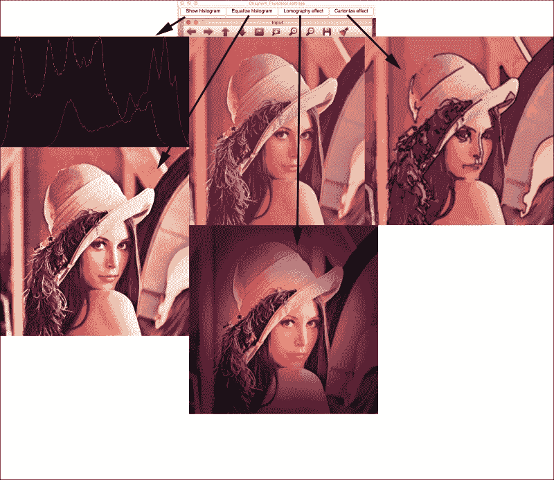
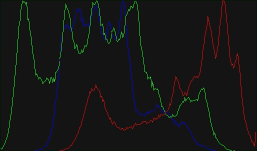
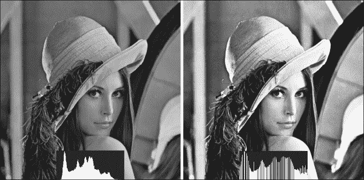
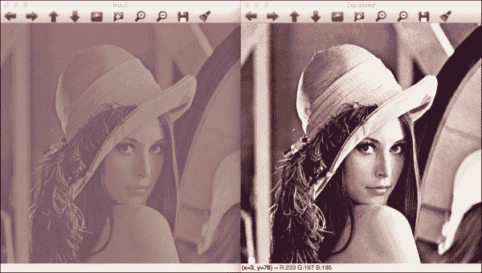
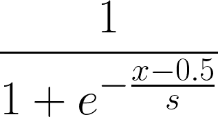
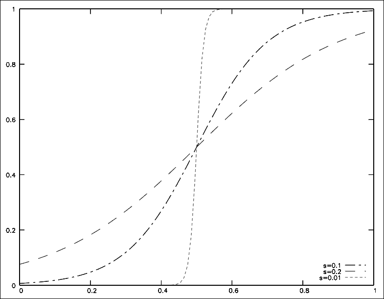
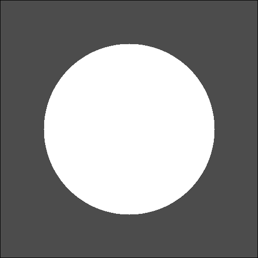
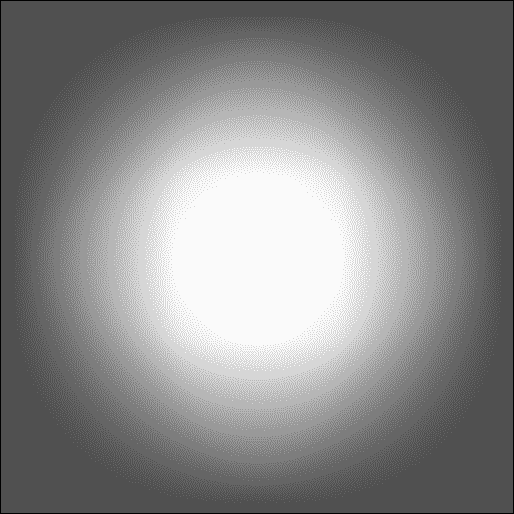
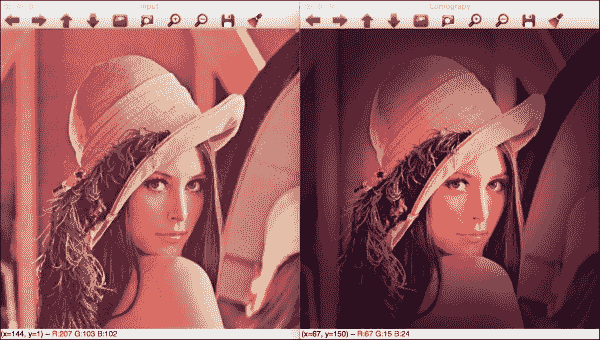
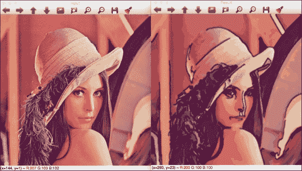

# 第四章：深入直方图和滤波器

在上一章中，我们学习了使用 QT 或本地库在 OpenCV 中用户界面的基础知识以及如何使用高级 OpenGL 用户界面。我们学习了基本的颜色转换和过滤器，这些有助于我们创建我们的第一个应用程序。

本章我们将涵盖以下主题：

+   直方图和直方图均衡化

+   查找表

+   模糊和中值模糊

+   高斯 Canny 滤波器

+   图像颜色均衡化

+   理解图像类型之间的转换

在我们学习 OpenCV 和用户界面的基础知识之后，我们将在本章创建我们的第一个完整应用程序和一个基本的照片工具，具有以下功能：

+   计算并绘制直方图

+   直方图均衡化

+   洛马格诺伊相机效果

+   卡通化效果

此应用程序将帮助您了解如何从头开始创建整个项目并理解直方图概念。我们将看到如何使用组合滤波器和查找表来均衡彩色图像的直方图，并创建两种效果。

# 生成 CMake 脚本文件

在我们开始创建源文件之前，我们将生成`CMakeLists.txt`文件，这将允许我们编译我们的项目、结构和可执行文件。以下`cmake`脚本简单且基本，但足以编译和生成可执行文件：

```py
cmake_minimum_required (VERSION 2.6)

cmake_policy(SET CMP0012 NEW)

PROJECT(Chapter4_Phototool)

# Requires OpenCV
FIND_PACKAGE( OpenCV 3.0.0 REQUIRED )

include_directories(${OpenCV_INCLUDE_DIRS})
link_directories(${OpenCV_LIB_DIR})

ADD_EXECUTABLE( ${PROJECT_NAME} main.cpp )
TARGET_LINK_LIBRARIES( ${PROJECT_NAME} ${OpenCV_LIBS} )
```

让我们尝试理解脚本文件。

第一行指示生成我们项目所需的最低`cmake`版本，第二行将`CMP0012`策略变量设置为允许您识别数字和布尔常量，并在未设置时移除 CMake 警告：

```py
cmake_minimum_required (VERSION 2.6)
cmake_policy(SET CMP0012 NEW)
```

在这两行之后，我们定义项目名称：

```py
PROJECT(Chapter4_Phototool)
```

当然，我们需要包含 OpenCV 库。首先要做的是找到库，并使用`MESSAGE`函数显示有关 OpenCV 库版本的消息：

```py
# Requires OpenCV
FIND_PACKAGE( OpenCV 3.0.0 REQUIRED )
MESSAGE("OpenCV version : ${OpenCV_VERSION}")
```

如果找到最小版本为 3.0 的库，那么我们将包含头文件和库文件到我们的项目中：

```py
include_directories(${OpenCV_INCLUDE_DIRS})
link_directories(${OpenCV_LIB_DIR})
```

现在，我们只需要添加要编译的源文件；为了将它们链接到 OpenCV 库，我们使用项目名称变量作为可执行文件名称，并仅使用一个名为`main.cpp`的单个源文件：

```py
ADD_EXECUTABLE( ${PROJECT_NAME} main.cpp )
TARGET_LINK_LIBRARIES( ${PROJECT_NAME} ${OpenCV_LIBS} ) 
```

# 创建图形用户界面

在我们开始图像处理算法之前，我们将创建应用程序的主要用户界面。我们将使用基于 QT 的用户界面，以便我们可以创建单个按钮。

应用程序接收一个输入参数来加载要处理的图像，我们将创建以下四个按钮：

+   **显示直方图**

+   **均衡直方图**

+   **洛马格诺伊效果**

+   **卡通化效果**

我们可以在以下屏幕截图中看到四个结果：



让我们开发我们的项目。首先，我们将包含所需的 OpenCV 头文件。我们定义一个`img`矩阵来存储输入图像，并创建一个常量字符串来使用仅适用于 OpenCV 3.0 的新命令行解析器。在这个常量中，我们只允许两个输入参数：常见帮助和必需的图像输入：

```py
// OpenCV includes
#include "opencv2/core/utility.hpp"
#include "opencv2/imgproc.hpp"
#include "opencv2/highgui.hpp"
using namespace cv;
// OpenCV command line parser functions
// Keys accecpted by command line parser
const char* keys =
{
    "{help h usage ? | | print this message}"
    "{@image | | Image to process}"
};
```

`main`函数从命令行解析变量开始。然后我们设置说明并打印帮助信息。以下行将帮助您设置最终可执行文件的帮助说明：

```py
int main( int argc, const char** argv )
{
    CommandLineParser parser(argc, argv, keys);
    parser.about("Chapter 4\. PhotoTool v1.0.0");
    //If requires help show
    if (parser.has("help"))
    {
        parser.printMessage();
        return 0;
    }
```

如果用户不需要帮助，那么我们需要在`imgFile`变量字符串中获取文件路径图像并检查是否将所有必需的参数添加到`parser.check()`函数中：

```py
String imgFile= parser.get<String>(0);

    // Check if params are correctly parsed in his variables
    if (!parser.check())
    {
        parser.printErrors();
        return 0;
    }
```

现在，我们可以使用`imread`函数读取图像文件，然后使用`namedWindow`函数创建一个窗口，稍后将在其中显示输入图像：

```py
    // Load image to process
    img= imread(imgFile);
    // Create window
    namedWindow("Input");
```

图像加载和窗口创建后，我们只需要创建我们的界面按钮并将它们链接到`callback`函数。每个`callback`函数都在源代码中定义，我们将在本章后面解释它们。我们将使用带有`QT_PUSH_BUTTON`常量的`createButton`函数创建按钮：

```py
    // Create UI buttons
    createButton("Show histogram", showHistoCallback, NULL, QT_PUSH_BUTTON, 0);
    createButton("Equalize histogram", equalizeCallback, NULL, QT_PUSH_BUTTON, 0);
    createButton("Lomography effect", lomoCallback, NULL, QT_PUSH_BUTTON, 0);
    createButton("Cartonize effect", cartoonCallback, NULL, QT_PUSH_BUTTON, 0);
```

为了完成我们的`main`函数，我们显示输入图像并等待按键以结束我们的应用程序：

```py
    // Show image
    imshow("Input", img);
    waitKey(0);
    return 0;
```

现在，我们只需要定义以下部分中的`callback`函数，我们将定义并描述每个函数。

# 绘制直方图

直方图是变量分布的统计图形表示。这使我们能够理解数据的密度估计和概率分布。直方图是通过将变量的整个值域划分为固定数量的区间，然后计算每个区间中落入的值的数量来创建的。

如果我们将这个直方图概念应用到图像上，它看起来很复杂，但实际上非常简单。在灰度图像中，我们的变量值可以取从`0`到`255`的任何可能的灰度值，密度是具有此值的图像中的像素数量。这意味着我们必须计算具有值`0`的图像像素数量，计算值为`1`的像素数量，依此类推。

显示输入图像直方图的回调函数称为`showHistoCallback`。此函数计算每个通道图像的直方图，并在新图像中显示每个直方图通道的结果。

现在，让我们检查以下代码：

```py
void showHistoCallback(int state, void* userData)
{
    // Separate image in BRG
    vector<Mat> bgr;
    split( img, bgr );

    // Create the histogram for 256 bins
    // The number of possibles values [0..255]
    int numbins= 256;

    /// Set the ranges ( for B,G,R) ), last is not included
    float range[] = { 0, 256 } ;
    const float* histRange = { range };

    Mat b_hist, g_hist, r_hist;

    calcHist( &bgr[0], 1, 0, Mat(), b_hist, 1, &numbins, &histRange );
    calcHist( &bgr[1], 1, 0, Mat(), g_hist, 1, &numbins, &histRange );
    calcHist( &bgr[2], 1, 0, Mat(), r_hist, 1, &numbins, &histRange );

    // Draw the histogram
    // We go to draw lines for each channel
    int width= 512;
    int height= 300;
    // Create image with gray base
    Mat histImage( height, width, CV_8UC3, Scalar(20,20,20) );

  // Normalize the histograms to height of image
  normalize(b_hist, b_hist, 0, height, NORM_MINMAX );
  normalize(g_hist, g_hist, 0, height, NORM_MINMAX );
  normalize(r_hist, r_hist, 0, height, NORM_MINMAX );

  int binStep= cvRound((float)width/(float)numbins);
  for( int i=1; i< numbins; i++)
  {
    line( histImage, 
      Point( binStep*(i-1), height-cvRound(b_hist.at<float>(i-1) ) ),
        Point( binStep*(i), height-cvRound(b_hist.at<float>(i) ) ),
          Scalar(255,0,0));
    line( histImage, 
      Point( binStep*(i-1), height-cvRound(g_hist.at<float>(i-1) ) ),
        Point( binStep*(i), height-cvRound(g_hist.at<float>(i) ) ),
          Scalar(0,255,0));
    line( histImage, 
      Point( binStep*(i-1), height-cvRound(r_hist.at<float>(i-1) ) ),
        Point( binStep*(i), height-cvRound(r_hist.at<float>(i) ) ),
          Scalar(0,0,255));
    }
    imshow("Histogram", histImage);
}
```

让我们尝试理解如何提取每个通道的直方图以及如何绘制它。

首先，我们需要创建三个矩阵来处理每个输入图像通道。我们使用`vector`类型变量来存储每个矩阵，并使用`split` OpenCV 函数将输入图像划分为三个通道：

```py
// Separate image in BRG
    vector<Mat> bgr;
    split( img, bgr );
```

现在，我们将定义直方图中的 bin 数量；在我们的情况下，每个可能的像素值一个 bin：

```py
int numbins= 256;
```

现在，我们需要定义我们的变量范围并创建三个矩阵来存储每个直方图：

```py
    /// Set the ranges ( for B,G,R) )
    float range[] = { 0, 256 } ;
    const float* histRange = { range };
    Mat b_hist, g_hist, r_hist;
```

现在，我们可以使用 OpenCV 的`calcHist`函数来计算直方图。此函数有几个参数，如下所示：

+   输入图像；在我们的例子中，我们使用存储在`bgr`向量中的一个图像通道

+   计算输入中直方图所需的图像数量；在我们的例子中，我们只使用一个图像

+   用于计算直方图的通道数维度；在我们的例子中，我们使用 0

+   可选的掩码矩阵

+   用于存储计算出的直方图的变量

+   直方图维度（图像（在这里，是一个灰度平面）取值的空间的维度）；在我们的例子中，它是 1

+   要计算的 bin 数量；在我们的例子中，我们使用 256 个 bin，每个像素值一个

+   输入变量的范围；在我们的例子中，是从`0`到`255`的可能像素值范围

我们为每个通道的`calcHist`函数如下所示：

```py
calcHist( &bgr[0], 1, 0, Mat(), b_hist, 1, &numbins, &histRange );
    calcHist( &bgr[1], 1, 0, Mat(), g_hist, 1, &numbins, &histRange );
    calcHist( &bgr[2], 1, 0, Mat(), r_hist, 1, &numbins, &histRange );
```

现在，我们已经为每个通道计算了直方图。我们需要绘制每个通道的直方图并展示给用户。为此，我们将创建一个大小为 512 x 300 像素的颜色图像：

```py
// Draw the histogram
    // We go to draw lines for each channel
    int width= 512;
    int height= 300;
    // Create image with gray base
    Mat histImage( height, width, CV_8UC3, Scalar(20,20,20) );
```

在我们在图像中绘制直方图值之前，我们将直方图矩阵在`min`值`0`和`max`值之间进行归一化；在我们的例子中，这个值与图像的高度相同，300 像素：

```py
    // Normalize the histograms to height of image
    normalize(b_hist, b_hist, 0, height, NORM_MINMAX );
    normalize(g_hist, g_hist, 0, height, NORM_MINMAX );
    normalize(r_hist, r_hist, 0, height, NORM_MINMAX );
```

现在，我们需要从 bin 0 到 bin 1 等绘制线条。我们需要计算每个 bin 之间的像素数，然后通过除以 bin 的数量来计算`binStep`变量。

每个小线条是从水平位置`i-1`到`i`绘制的，垂直位置是相应的`i`处的直方图值。它使用如下所示的颜色通道表示法绘制：

```py
int binStep= cvRound((float)width/(float)numbins);
  for( int i=1; i< numbins; i++)
  {
    line( histImage, 
      Point( binStep*(i-1), height-cvRound(b_hist.at<float>(i-1) ) ),
        Point( binStep*(i), height-cvRound(b_hist.at<float>(i) ) ),
          Scalar(255,0,0));
    line( histImage, 
      Point( binStep*(i-1), height-cvRound(g_hist.at<float>(i-1) ) ),
        Point( binStep*(i), height-cvRound(g_hist.at<float>(i) ) ),
          Scalar(0,255,0));
    line( histImage, 
      Point( binStep*(i-1), height-cvRound(r_hist.at<float>(i-1) ) ),
        Point( binStep*(i), height-cvRound(r_hist.at<float>(i) ) ),
          Scalar(0,0,255));
    }
```

最后，我们使用`imshow`函数显示直方图图像：

```py
    imshow("Histogram", histImage);
```

这是 lena.png 图像的结果：



# 图像颜色均衡化

在本节中，我们将学习如何对彩色图像进行均衡化。图像均衡化和直方图均衡化试图获得一个具有均匀分布值的直方图。均衡化的结果是图像对比度的增加。均衡化允许局部对比度较低的区域获得更高的对比度，使最频繁的强度分布更广。

当图像几乎全暗或完全明亮，背景和前景之间差异非常小的时候，这种方法非常有用。使用直方图均衡化，我们可以增加过曝或欠曝的细节对比度。这种技术在医学图像，如 X 光片中非常有用。

然而，这种方法有两个主要缺点：它增加了背景噪声并减少了有用信号。

我们可以在以下图像中看到均衡化的效果，并看到直方图在增加图像对比度时如何变化和扩散：



让我们尝试实现我们的直方图均衡化。我们将在用户界面代码中定义的回调函数中实现它：

```py
void equalizeCallback(int state, void* userData)
{
    Mat result;
    // Convert BGR image to YCbCr
    Mat ycrcb;
    cvtColor( img, ycrcb, COLOR_BGR2YCrCb);

    // Split image into channels
    vector<Mat> channels;
    split( ycrcb, channels );

    // Equalize the Y channel only
    equalizeHist( channels[0], channels[0] );

    // Merge the result channels
    merge( channels, ycrcb );

    // Convert color ycrcb to BGR
    cvtColor( ycrcb, result, COLOR_YCrCb2BGR );

    // Show image
    imshow("Equalized", result);
}
```

要均衡一个彩色图像，我们只需要均衡亮度通道。我们可以对每个颜色通道进行此操作，但结果不可用。然后，我们可以使用任何其他颜色图像格式，例如 HSV 或 YCrCb，这些格式将亮度分量分离到单独的通道中。我们选择这种最后的颜色格式，并使用 Y 通道（亮度）来均衡它。然后，我们执行以下步骤：

1.  我们使用`cvtColor`函数将我们的输入 BGR 图像转换为 YCrCb：

    ```py
    Mat result;
        // Convert BGR image to YCbCr
        Mat ycrcb;
        cvtColor( img, ycrcb, COLOR_BGR2YCrCb);
    ```

1.  在将我们的图像转换后，我们将 YCrCb 图像分割成不同的`通道`矩阵：

    ```py
    // Split image into channels
        vector<Mat> channels;
        split( ycrcb, channels );
    ```

1.  然后，我们仅使用`equalizeHist`函数在`Y 通道`中均衡直方图，该函数只有两个参数：输入和输出矩阵：

    ```py
        // Equalize the Y channel only
        equalizeHist( channels[0], channels[0] );
    ```

1.  现在，我们只需要合并生成的通道，并将结果转换为 BGR 格式，以便向用户展示结果：

    ```py
        // Merge the result channels
        merge( channels, ycrcb );

        // Convert color ycrcb to BGR
        cvtColor( ycrcb, result, COLOR_YCrCb2BGR );

        // Show image
        imshow("Equalized", result);
    ```

    对低对比度的`Lena`图像应用此过程将得到以下结果：

    

# 洛马摄影效果

在本节中，我们将创建另一种图像效果，这是一种在 Google Camera 或 Instagram 等不同移动应用中常用的摄影效果。

在本节中，我们将了解如何使用**查找表**或**LUT**。我们将在本章后面讨论 LUT。

我们将学习如何添加一个覆盖图像；在这种情况下，添加一个暗晕来达到我们想要的效果。

实现此效果的函数是回调`lomoCallback`，其代码如下：

```py
void lomoCallback(int state, void* userData)
{
    Mat result;

    const double exponential_e = std::exp(1.0);
    // Create Lookup table for color curve effect
    Mat lut(1, 256, CV_8UC1);
    for (int i=0; i<256; i++)
    {
        float x= (float)i/256.0; 
        lut.at<uchar>(i)= cvRound( 256 * (1/(1 + pow(exponential_e, -((x-0.5)/0.1)) )) );
    }

    // Split the image channels and apply curve transform only to red channel
    vector<Mat> bgr;
    split(img, bgr);
    LUT(bgr[2], lut, bgr[2]);
    // merge result
    merge(bgr, result);

    // Create image for halo dark
    Mat halo( img.rows, img.cols, CV_32FC3, Scalar(0.3,0.3,0.3) );
    // Create circle 
    circle(halo, Point(img.cols/2, img.rows/2), img.cols/3, Scalar(1,1,1), -1); 
    blur(halo, halo, Size(img.cols/3, img.cols/3));

    // Convert the result to float to allow multiply by 1 factor
    Mat resultf;
    result.convertTo(resultf, CV_32FC3);

    // Multiply our result with halo
    multiply(resultf, halo, resultf);

    // convert to 8 bits
    resultf.convertTo(result, CV_8UC3);

    // show result
    imshow("Lomograpy", result);
}
```

让我们理解一下代码。

洛马摄影效果分为不同的步骤，但在我们的例子中，我们使用了以下两个非常简单的步骤来实现洛马摄影效果：

1.  使用查找表进行颜色操作，并将曲线应用到红色通道上

1.  一种复古效果，将暗晕应用到图像上。

第一步是使用曲线变换来调整红色，该变换应用以下函数：



此公式生成一个曲线，使暗值更暗，亮值更亮，其中*x*是可能的像素值（0 到 255），而*s*是一个常数，我们在教程中将其设置为*0.1*。产生像素值低于 128 的较低常数值非常暗，而高于 128 的非常亮。接近*1*的值将曲线转换为直线，不会产生我们想要的效果：



这个函数通过应用**查找表**（通常称为 LUT）非常容易实现。LUT 是一个向量或表，它为给定的值返回一个预处理的值以在内存中执行计算。LUT 是一种常用的技术，通过避免重复执行昂贵的计算来节省 CPU 周期。我们不是对每个像素调用指数/除法函数，而是对每个可能的像素值（256 次）只执行一次，并将结果存储在表中。因此，我们以牺牲一些内存为代价节省了 CPU 时间。虽然这可能在标准 PC 和较小图像尺寸的情况下不会产生很大差异，但对于 CPU 受限的硬件（如树莓派）来说，这会产生巨大的差异。在我们的情况下，如果我们想对每个像素应用我们的函数，我们需要通过计算高度来增加宽度；在 100 x 100 像素中，有 10,000 次计算，但像素只有 256 个可能的值。然后，我们可以预先计算像素值并将它们存储在 LUT 向量中。

在我们的示例代码中，我们定义了`E`变量并创建了一个 1 行 256 列的`lut`矩阵。然后，我们通过应用我们的公式并保存到`lut`变量中，对所有可能的像素值进行循环：

```py
const double exponential_e = std::exp(1.0);
    // Create Lookup table for color curve effect
    Mat lut(1, 256, CV_8UC1);
    Uchar* plut= lut.data;
    for (int i=0; i<256; i++)
    {
        double x= (double)i/256.0; 
        plut[i]= cvRound( 256.0 * (1.0/(1.0 + pow(exponential_e, -((x-0.5)/0.1)) )) );
    }
```

如前所述，在本节中，我们不将函数应用于所有通道。我们需要使用`split`函数按通道拆分输入图像：

```py
    // Split the image channels and apply curve transform only to red channel
    vector<Mat> bgr;
    split(img, bgr);
```

然后，我们将我们的`lut`表变量应用于红色通道。OpenCV 为我们提供了具有以下三个参数的`LUT`函数：

+   输入图像

+   查找表的矩阵

+   输出图像

然后，我们的`LUT`函数和红色通道的调用看起来是这样的：

```py
LUT(bgr[2], lut, bgr[2]);
```

现在，我们只需要合并我们计算出的通道：

```py
// merge result
    merge(bgr, result);
```

第一步已完成，我们只需要创建暗光环来完成我们的效果。然后，我们创建一个与输入图像大小相同的灰色图像，其中包含一个白色圆圈：

```py
// Create image for halo dark
    Mat halo( img.rows, img.cols, CV_32FC3, Scalar(0.3,0.3,0.3) );
    // Create circle 
    circle(halo, Point(img.cols/2, img.rows/2), img.cols/3, Scalar(1,1,1), -1); 
```



然而，如果我们将此图像应用于输入图像，它将从暗变亮，然后我们可以使用`blur`滤镜函数对圆光环图像应用大模糊以获得平滑效果：

```py
    blur(halo, halo, Size(img.cols/3, img.cols/3));
```

应用模糊滤镜后的结果如下所示：



现在，我们需要将这个光环应用到我们的第一步图像上。一种简单的方法是乘以两个图像。但是，我们需要将我们的输入图像从 8 位图像转换为 32 位浮点图像，因为我们需要将值在 0 到 1 之间的模糊图像与具有整数值的输入图像相乘：

```py
    // Convert the result to float to allow multiply by 1 factor
    Mat resultf;
    result.convertTo(resultf, CV_32FC3);
```

在我们将图像转换后，我们只需要逐元素乘以每个矩阵：

```py
    // Multiply our result with halo
    multiply(resultf, halo, resultf);
```

最后，我们将浮点图像矩阵结果转换为 8 位图像并显示结果：

```py
    // convert to 8 bits
    resultf.convertTo(result, CV_8UC3);

    // show result
    imshow("Lomograpy", result);
```



# 卡通化效果

在本章的最后部分，我们创建了一个名为**卡通化**的另一种效果。这个效果的目的创建一个看起来像卡通的图像。为此，我们将算法分为两个步骤：边缘检测和颜色过滤。

`cartoonCallback`函数使用以下代码定义此效果：

```py
void cartoonCallback(int state, void* userData)
{
    /** EDGES **/
    // Apply median filter to remove possible noise
    Mat imgMedian;
    medianBlur(img, imgMedian, 7);

    // Detect edges with canny
    Mat imgCanny;
    Canny(imgMedian, imgCanny, 50, 150);

    // Dilate the edges
    Mat kernel= getStructuringElement(MORPH_RECT, Size(2,2));
    dilate(imgCanny, imgCanny, kernel);

    // Scale edges values to 1 and invert values
    imgCanny= imgCanny/255;
    imgCanny= 1-imgCanny;

    // Use float values to allow multiply between 0 and 1
    Mat imgCannyf;
    imgCanny.convertTo(imgCannyf, CV_32FC3);

    // Blur the edgest to do smooth effect
    blur(imgCannyf, imgCannyf, Size(5,5));

    /** COLOR **/
    // Apply bilateral filter to homogenizes color
    Mat imgBF;
    bilateralFilter(img, imgBF, 9, 150.0, 150.0);

    // truncate colors
    Mat result= imgBF/25;
    result= result*25;

    /** MERGES COLOR + EDGES **/
    // Create a 3 channles for edges
    Mat imgCanny3c;
    Mat cannyChannels[]={ imgCannyf, imgCannyf, imgCannyf};
    merge(cannyChannels, 3, imgCanny3c);

    // Convert color result to float 
    Mat resultf;
    result.convertTo(resultf, CV_32FC3);

    // Multiply color and edges matrices
    multiply(resultf, imgCanny3c, resultf);

    // convert to 8 bits color
    resultf.convertTo(result, CV_8UC3);

    // Show image
    imshow("Result", result);

}
```

让我们尝试理解这段代码。

第一步是检测图像中最重要的边缘。在检测边缘之前，我们需要从输入图像中去除噪声。有几种方法和方式可以做到这一点。我们将使用中值滤波器来去除任何可能的小噪声，但我们可以使用其他方法，如高斯模糊等。OpenCV 函数名为`medianBlur`，接受三个参数：输入图像、输出图像和核大小（核是一个用于对图像应用某些数学运算，如卷积的小矩阵）。

```py
Mat imgMedian;
medianBlur(img, imgMedian, 7);
```

在去除任何可能的噪声后，我们使用`canny`滤波器检测强边缘：

```py
// Detect edges with canny
Mat imgCanny;
Canny(imgMedian, imgCanny, 50, 150);
```

`canny`滤波器接受以下参数：

+   一个输入图像

+   一个输出图像

+   第一个阈值

+   第二个阈值

+   Sobel 大小孔径

+   一个布尔值，用于检查是否使用更精确的图像梯度幅度

第一个和第二个阈值之间的最小值用于边缘连接。最大值用于找到强边缘的初始段。`solbel`大小孔径是算法中将使用的`sobel`滤波器的核大小。

在检测到边缘后，我们将应用一个小膨胀来连接断裂的边缘：

```py
    // Dilate the edges
    Mat kernel= getStructuringElement(MORPH_RECT, Size(2,2));
    dilate(imgCanny, imgCanny, kernel);
```

与我们在 Lomography 效果中所做的一样，我们需要将我们的边缘结果图像乘以颜色图像。然后，我们需要一个介于`0`和`1`之间的像素值，因此我们将 canny 结果除以`256`并反转边缘为黑色：

```py
    // Scale edges values to 1 and invert values
    imgCanny= imgCanny/255;
    imgCanny= 1-imgCanny;
```

将 Canny 8 无符号位格式转换为浮点矩阵：

```py
    // Use float values to allow multiply between 0 and 1
    Mat imgCannyf;
    imgCanny.convertTo(imgCannyf, CV_32FC3);
```

为了得到一个酷炫的结果，我们可以模糊边缘以得到平滑的结果线，然后我们应用一个模糊滤镜：

```py
// Blur the edgest to do smooth effect
    blur(imgCannyf, imgCannyf, Size(5,5));
```

算法的第一步已经完成，现在我们将处理颜色。

为了得到卡通的外观和感觉，我们将使用双边滤波器：

```py
// Apply bilateral filter to homogenizes color
    Mat imgBF;
    bilateralFilter(img, imgBF, 9, 150.0, 150.0);
```

双边滤波器是一种用于减少图像噪声同时保持边缘的滤波器，但我们可以通过适当的参数得到卡通效果，我们将在后面探讨。

双边滤波器参数如下：

+   一个输入图像

+   一个输出图像

+   像素邻域的直径；如果设置为负值，则从 sigma 空间值计算得出

+   一个 sigma 颜色值

+   一个 sigma 坐标空间

### 注意

当直径大于 5 时，双边滤波器会变慢。当 sigma 值大于 150 时，会出现卡通效果。

为了创建更强的卡通效果，我们将通过除法和乘法将可能的颜色值截断到 10。对于其他值，以及为了更好地理解 sigma 参数，请阅读 OpenCV 文档：

```py
// truncate colors
    Mat result= imgBF/25;
    result= result*25;
```

最后，我们需要合并颜色和边缘的结果。然后，我们需要从第一步创建一个`3`通道图像：

```py
// Create a 3 channles for edges
    Mat imgCanny3c;
    Mat cannyChannels[]={ imgCannyf, imgCannyf, imgCannyf};
    merge(cannyChannels, 3, imgCanny3c);
```

然后，我们将我们的颜色结果图像转换为 32 位浮点图像，然后对两个图像的每个元素进行乘法运算：

```py
    // Convert color result to float 
    Mat resultf;
    result.convertTo(resultf, CV_32FC3);

    // Multiply color and edges matrices
    multiply(resultf, imgCanny3c, resultf);
```

最后，我们只需将我们的图像转换为 8 位图像，并将结果图像展示给用户：

```py
// convert to 8 bits color
    resultf.convertTo(result, CV_8UC3);

    // Show image
    imshow("Result", result);
```

在以下图像中，我们可以看到输入图像（左侧图像）以及应用卡通化效果后的结果（右侧图像）：



# 摘要

在本章中，我们学习了如何创建一个完整的项目，该项目在应用不同效果后操作图像。我们还把彩色图像分割成多个矩阵，以便只对一个通道应用效果。我们学习了如何创建查找表，将多个矩阵合并为一个，使用 Canny 和双边滤波器，绘制圆形，以及通过乘法图像来执行晕影效果。

在下一章中，我们将学习如何进行对象检查以及如何将图像分割成不同的部分并检测它。
