# 第五章 自动光学检测，对象分割和检测

在上一章中，我们学习了直方图和过滤器，这些使我们能够理解图像处理并创建一个照片应用程序。

在本章中，我们将向您介绍对象分割和检测的基本概念，这意味着隔离图像中出现的对象，以便进行未来的处理和分析。

在本章中，我们将涵盖以下主题：

+   噪声消除

+   光/背景去除的基本原理

+   阈值操作

+   对象分割的连通分量

+   寻找对象分割的轮廓

行业领域使用复杂的计算机视觉系统和硬件。计算机视觉试图检测生产过程中的问题，并最小化产生的错误，提高最终产品的质量。

在这个领域，计算机视觉任务的名称是**自动光学检测**或 AOI。这个名字出现在印刷电路板制造商的检测中，其中一台或多台相机扫描每个电路以检测关键故障和质量缺陷。其他制造商使用光学相机系统和计算机视觉算法来提高产品质量。如今，使用不同类型的相机（如红外相机、3D 相机等）进行光学检测，这取决于问题要求，例如测量对象、检测表面效应等；并且复杂算法在成千上万的行业中用于不同的目的，如缺陷检测、识别、分类等。

# 场景中隔离对象

在本节中，我们将向您介绍任何 AOI 算法的第一步，即在场景中隔离不同的部分或对象。

我们将以三种对象类型（螺丝、包装环和螺母）的对象检测和分类为例，并在本章和第六章 *学习对象分类* 中进行开发。

假设我们是一家生产这些三个对象的公司。所有这些都在同一载体带上，我们的目标是检测载体带上的每个对象，并将每个对象分类，以便机器人将每个对象放在正确的货架上：

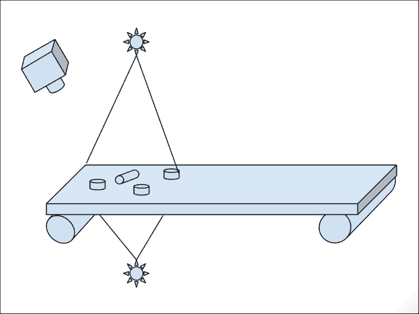

在本章中，我们将隔离每个对象并在图像中以像素为单位检测其位置。在下一章中，我们将对每个隔离对象进行分类，以检查它是否是螺母、螺丝或包装环。

在以下图像中，我们展示了我们期望的结果，其中左侧图像中有几个对象，而在右侧图像中，我们用不同的颜色绘制每一个。我们可以展示不同的特征，如面积、高度、宽度、轮廓大小等。

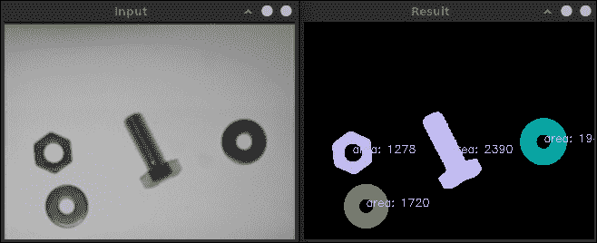

要实现此结果，我们将遵循不同的步骤，这些步骤使我们能够更好地理解和组织我们的算法，如下面的图所示：

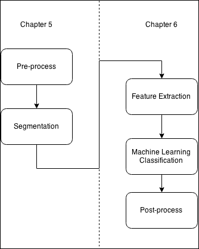

我们的应用程序分为两个章节。在本章中，我们将开发和理解预处理和分割步骤。在第六章 *学习对象分类* 中，我们将提取每个分割对象的特征，并训练我们的机器学习系统/算法以识别每个对象类别，以便您可以对对象进行分类。

我们将预处理步骤分为三个更小的子步骤，如下所述：

+   噪声去除

+   光照去除

+   二值化

在分割步骤中，我们将使用两种不同的算法，如下所述：

+   边缘检测算法

+   连通组件提取（标记）

我们可以在以下图中看到这些子步骤以及应用程序流程：

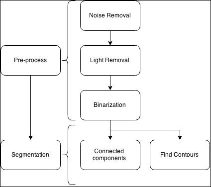

现在，是时候开始预处理步骤，通过去除噪声和光照效果来获取最佳的二值化图像，以最大限度地减少可能的检测错误。

# 创建 AOI 应用程序

要创建我们的新应用程序，当用户执行它们时，我们需要一些输入参数；所有这些都是可选的，除了要处理的输入图像：

+   要处理的输入图像

+   光照图像模式

+   光照操作，用户可以在差分或除法操作之间选择：

    +   如果用户输入的值设置为 `0`，则应用差分操作

    +   如果用户输入的值设置为 `1`，则应用除法操作

+   分割，用户可以在具有或不具有统计的连通组件和 `findContours` 方法之间选择：

    +   如果用户输入的值设置为 `1`，则应用分割的连通 `组件` 方法

    +   如果用户输入的值设置为 `2`，则应用具有统计面积的连通组件

    +   如果用户输入的值设置为 `3`，则将 `findContours` 方法应用于分割

为了启用此用户选择，我们将使用带有这些键的命令行 `parser` 类：

```py
// OpenCV command line parser functions
// Keys accecpted by command line parser
const char* keys =
{
   "{help h usage ? | | print this message}"
   "{@image || Image to process}"
   "{@lightPattern || Image light pattern to apply to image input}"
   "{lightMethod | 1 | Method to remove background light, 0 difference, 1 div }"
   "{segMethod | 1 | Method to segment: 1 connected Components, 2 connected components with stats, 3 find Contours }"
};
```

我们使用命令行 `parser` 类在 `main` 函数中检查参数：

```py
int main( int argc, const char** argv )
{
  CommandLineParser parser(argc, argv, keys);
  parser.about("Chapter 5\. PhotoTool v1.0.0");
  //If requires help show
  if (parser.has("help"))
  {
      parser.printMessage();
      return 0;
  }

  String img_file= parser.get<String>(0);
  String light_pattern_file= parser.get<String>(1);
  int method_light= parser.get<int>("lightMethod");
  int method_seg= parser.get<int>("segMethod");

  // Check if params are correctly parsed in his variables
  if (!parser.check())
  {
      parser.printErrors();
      return 0;
  }
```

在 `parser` 类之后，我们检查命令行用户数据是否正确加载，然后加载图像并检查它是否有数据：

```py
// Load image to process
  Mat img= imread(img_file, 0);
  if(img.data==NULL){
    cout << "Error loading image "<< img_file << endl;
    return 0;
  }
```

现在，我们已准备好创建我们的 AOI 分割过程。我们将从预处理任务开始。

# 预处理输入图像

本节向您介绍一些最常用的技术，这些技术可以在对象分割/检测的上下文中应用于预处理图像。预处理是我们开始工作并从图像中提取所需信息之前对新的图像所做的第一个更改。

通常，在预处理步骤中，我们试图最小化图像噪声、光照条件或由于相机镜头引起的图像变形。这些步骤在尝试检测对象或分割我们的图像时最小化错误。

## 噪声去除

如果我们不去除噪声，我们可以检测到比预期更多的对象，因为通常噪声在图像中表示为一个小点，可以被分割为对象。传感器和扫描仪电路通常会产生这种噪声。这种亮度或颜色的变化可以表示为不同的类型，如高斯噪声、尖峰噪声和闪烁噪声。有不同技术可以用来去除噪声。我们将使用平滑操作，但根据噪声的类型，我们将使用一些比其他更好的技术。例如，中值滤波器通常用于去除椒盐噪声：

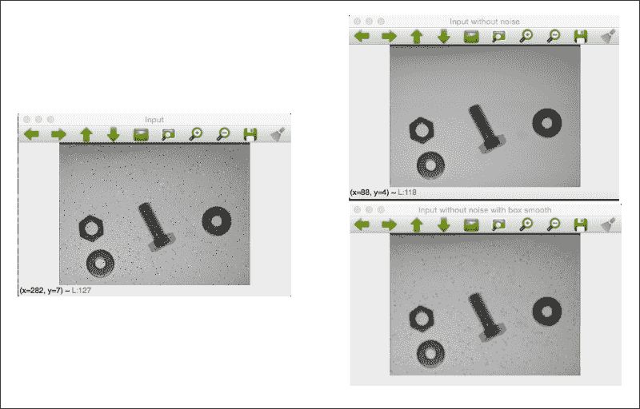

左侧图像是带有椒盐噪声的原始输入图像。如果我们应用中值模糊，我们会得到一个很棒的结果，但会丢失一些细节。例如，我们保持完美的边缘的螺丝的边缘。参见图表右上角。如果我们应用盒式滤波器或高斯滤波器，噪声不会被去除。它只是被平滑，物体的细节也会变得松散和平滑。参见图表右下角。

OpenCV 为我们提供了`medianBlur`函数，该函数需要以下三个参数：

+   输入图像具有 1、3 或 4 个通道。当核大小大于`5`时，图像深度只能为`CV_8U`。

+   输出图像，即结果图像，其类型和深度与输入图像相同。

+   核大小大于`1`且为奇数的孔径大小。例如，3、5、7。

这段用于去除噪声的代码看起来像这样：

```py
  Mat img_noise;
  medianBlur(img, img_noise, 3);
```

## 使用光模式进行分割以去除背景

在本节中，我们将开发一个基本算法，使我们能够使用光模式去除背景。这种预处理使我们能够获得更好的分割。参见图表。左上角图是未添加噪声的输入图像，右上角图是应用阈值操作的结果；我们可以看到顶部的伪影。左下角图是去除背景后的输入图像，右下角图是没有伪影的阈值结果，它更适合分割。

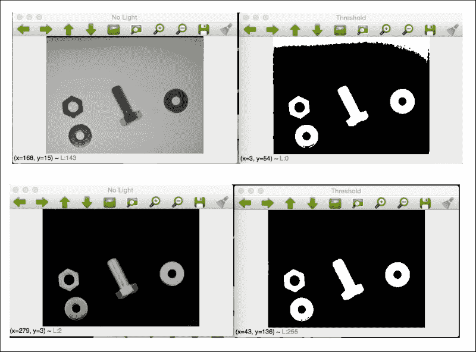

我们如何从我们的图像中去除光线？这非常简单；我们只需要一张没有物体的场景照片，这张照片是从与其他图像相同的精确位置拍摄的，并且具有相同的光照条件。这在 AOI 中是一个非常常见的技巧，因为外部条件是受监督和已知的。我们案例的图像结果类似于以下图：

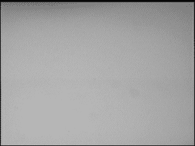

然后，通过简单的数学运算，我们可以去除这个光模式。有两种去除它的方法，如下所示：

+   差分

+   除法

差分图像是最简单的方法。如果我们有光模式*L*和图像图片*I*，去除*R*的结果是它们之间的差：

```py
R= L-I
```

这种除法稍微复杂一些，但同时也很简单。如果我们有光模式矩阵*L*和图像图片矩阵*I*，去除*R*的结果如下：

```py
R= 255*(1-(I/L))
```

在这种情况下，我们通过光模式除以图像。我们假设如果我们的光模式是白色，而物体比背景载体胶带暗，那么图像像素值将始终保持不变或低于光像素值。然后，从*I/L*获得的我们得到的结果在`0`和`1`之间。最后，我们反转这个除法的结果，以获得相同颜色方向范围，并将其乘以 255 以获得`0-255`范围内的值。

在我们的代码中，我们将创建一个名为`removeLight`的新函数，具有以下参数：

+   用于去除光/背景的输入图像

+   光模式矩阵

+   方法，`0`是差分，`1`是除法

输出是一个没有光/背景的新图像矩阵。

以下代码实现了使用光模式去除背景：

```py
Mat removeLight(Mat img, Mat pattern, int method)
{
  Mat aux;
  // if method is normalization
  if(method==1)
  {
    // Require change our image to 32 float for division
    Mat img32, pattern32;
    img.convertTo(img32, CV_32F);
    pattern.convertTo(pattern32, CV_32F);
    // Divide the image by the pattern
    aux= 1-(img32/pattern32);
    // Scale it to convert to 8bit format
    aux=aux*255;
    // Convert 8 bits format
    aux.convertTo(aux, CV_8U);
  }else{
    aux= pattern-img;
  }
  return aux;
}
```

让我们尝试理解这一点。在创建`aux`变量之后，为了保存结果，我们选择用户选择的方法，并通过参数传递给函数。如果选择的是`1`，我们应用除法方法。

`division`方法需要一个 32 位浮点图像，这样我们才能进行图像除法。第一步是将图像和光模式矩阵转换为 32 位深度：

```py
// Require change our image to 32 float for division
Mat img32, pattern32;
img.convertTo(img32, CV_32F);
pattern.convertTo(pattern32, CV_32F);
```

现在，我们可以执行描述中的矩阵中的数学运算，即通过模式除以图像，并反转结果：

```py
// Divide the image by the pattern
aux= 1-(img32/pattern32);
// Scale it to convert o 8bit format
aux=aux*255;
```

现在，我们已经得到了结果，但我们需要返回一个 8 位深度的图像，然后，使用`convert`函数，就像我们之前做的那样，将其转换为 32 位浮点数：

```py
// Convert 8 bits format
aux.convertTo(aux, CV_8U);
```

现在我们可以将`aux`变量与结果一起返回。对于差分法，其展开非常简单，因为我们不需要转换我们的图像，我们只需要执行差分并返回。如果我们不假设模式等于或大于图像，那么我们将需要执行一些检查，并截断可能小于`0`或大于`255`的值：

```py
aux= pattern-img;
```

下图是应用图像光模式到我们的输入图像的结果：

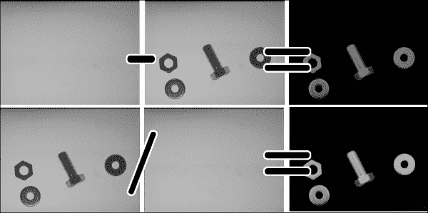

在我们获得的结果中，我们可以检查光梯度是如何被去除的，以及可能的伪影是如何被去除的。

然而，当我们没有光/背景模式时会发生什么？有几种不同的技术可以做到这一点，我们将介绍最基本的一种。使用一个过滤器，我们可以创建一个可以使用的过滤器，但还有更好的算法，你可以从中学习如何从几个图像中学习背景，其中碎片出现在不同的区域。这种技术有时需要背景估计图像初始化，其中我们的基本方法可以发挥很好的作用。这些高级技术将在视频监控章节中探讨。

为了估计背景图像，我们将使用一个大型核大小的模糊，该模糊应用于我们的输入图像。这是一种在 OCR 中常用的常见技术，其中字母相对于整个文档又薄又小，并允许我们对图像中的光模式进行近似。我们可以在左侧图上看到光/背景模式重建，在右侧图上看到真实情况：

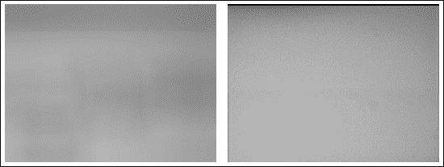

我们可以看到光模式之间存在一些细微的差异，但这个结果足以移除背景，我们可以在以下图使用差异图像中看到结果。

在以下图中，我们可以看到使用先前方法计算的原输入图像和估计的背景图像之间的图像差异的结果：

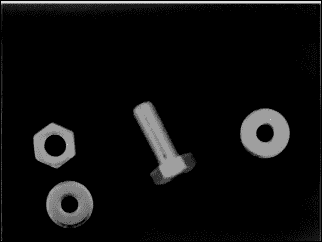

`calculateLightPattern` 函数创建这个光模式或背景近似：

```py
Mat calculateLightPattern(Mat img)
{
  Mat pattern;
  // Basic and effective way to calculate the light pattern from one image
  blur(img, pattern, Size(img.cols/3,img.cols/3));
  return pattern;
}
```

这个 `basic` 函数使用相对于图像大小的大核大小对输入图像进行模糊处理。从代码中可以看出，它是原始宽度和高度的三分之一。

## 阈值操作

在移除背景后，我们只需要对图像进行二值化以便进行未来的分割。现在，我们将使用 `threshold` 函数并应用两个不同的阈值值：当我们移除光/背景时使用一个非常低的值，因为所有非感兴趣区域都是黑色或非常低的值，而在我们不使用光移除方法时使用中等值，因为我们有一个白色背景，而目标图像的值较低。这个最后的选项允许我们检查带有和不带有背景移除的结果：

```py
  // Binarize image for segment
  Mat img_thr;
  if(method_light!=2){
    threshold(img_no_light, img_thr, 30, 255, THRESH_BINARY);
  }else{
    threshold(img_no_light, img_thr, 140, 255, THRESH_BINARY_INV);
  }
```

现在，我们将继续到我们应用程序最重要的部分：分割。我们将使用两种不同的方法或算法：连通分量和轮廓。

# 对输入图像进行分割

现在，我们将介绍用于分割我们的阈值图像的以下两种技术：

+   连通分量

+   `findContours` 函数

使用这两种技术，我们将能够提取图像中每个感兴趣区域，其中我们的目标对象出现；在我们的案例中，是一个螺母、螺丝和环。

## 连通分量算法

连通分量是一个非常常用的算法，用于在二值图像中分割和识别部分。连通分量是一个迭代算法，用于使用 8-或 4-连通性像素标记图像。如果两个像素具有相同的值并且是邻居，则它们是连通的。在以下图中，每个像素有八个邻居像素：

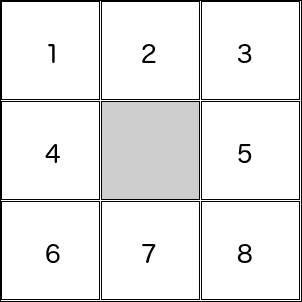

4-连通性意味着如果中心像素的邻居像素（2、4、5 和 7）具有相同的值，则它们可以连接到中心。在 8-连通性情况下，如果它们具有相同的值，则 1、2、3、4、5、6、7 和 8 可以连接。

在以下示例中，我们可以看到八连通性和四连通性算法之间的区别。我们将对下一个二值化图像应用每个算法。我们使用了一个小的 9 X 9 图像，并将其放大以显示连通分量以及 4-连通性和 8-连通性之间的区别是如何工作的：

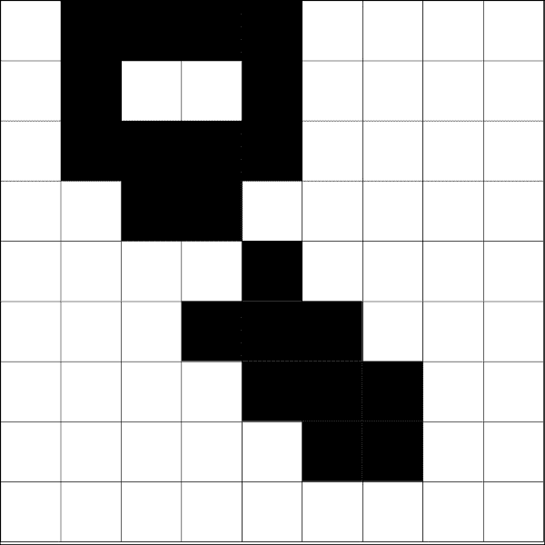

4-连通性算法检测到两个对象，如图中左侧图像所示。8-连通性算法只检测到一个对象（右侧图像），因为两个对角像素是连通的，而在 4-连通性算法中，只有垂直和水平像素是连通的。我们可以在以下图中看到结果，其中每个对象都有不同的灰度颜色值：

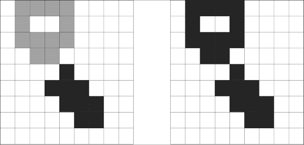

OpenCV 3 通过以下两个不同的函数介绍了连通分量算法：

+   `connectedComponents(image, labels, connectivity=8, type=CV_32S)`

+   `connectedComponentsWithStats(image, labels, stats, centroids, connectivity=8, ltype=CV_32S)`

这两个函数都返回一个整数，表示检测到的标签数量，其中标签`0`代表背景。

这两个函数之间的区别基本上是每个函数返回的信息。让我们检查每个函数的参数。`connectedComponents`函数提供了以下参数：

+   **图像**：这是要标记的输入图像。

+   **标签**：这是一个与输入图像大小相同的`mat`输出，其中每个像素的值为其标签，所有`0`表示背景，值为`1`的像素表示第一个连通分量对象，依此类推。

+   **连通性**：有两个可能的值：`8`或`4`，表示我们想要使用的连通性。

+   **类型**：这是我们想要使用的标签图像类型：只允许两种类型，`CV32_S`或`CV16_U`。默认情况下，它是`CV32_S`。

`connectedComponentsWithStats`函数有两个额外的参数被定义：stats 和 centroids 参数：

+   `Stats`：这是每个标签的输出参数，包括背景标签。可以通过 stats（标签，列）访问以下统计值，其中列也被定义为如下：

    +   `CC_STAT_LEFT`: 这是连通分量对象的最左侧 x 坐标

    +   `CC_STAT_TOP`: 这是连通分量对象的最上侧 y 坐标

    +   `CC_STAT_WIDTH`: 这是通过其边界框定义的连通分量对象的宽度

    +   `CC_STAT_HEIGHT`: 这是通过其边界框定义的连通分量对象的高度

    +   `CC_STAT_AREA`: 这是连通分量对象的像素数（面积）

+   `Centroids`: 每个标签（包括背景）的质心点以`float`类型表示

在我们的示例应用程序中，我们将创建两个函数，这些函数将应用于这两个 OpenCV 算法，并将用户通过一个新图像显示基本算法中带有彩色对象的结果，并绘制每个对象的统计算法区域。

让我们定义连通`分量`的基本绘制函数：

```py
void ConnectedComponents(Mat img)
{
  // Use connected components to divide our possibles parts of images 
  Mat labels;
  int num_objects= connectedComponents(img, labels);
  // Check the number of objects detected
  if(num_objects < 2 ){
    cout << "No objects detected" << endl;
    return;
  }else{
    cout << "Number of objects detected: " << num_objects - 1 << endl;
  }
  // Create output image coloring the objects
  Mat output= Mat::zeros(img.rows,img.cols, CV_8UC3);
  RNG rng( 0xFFFFFFFF );
  for(int i=1; i<num_objects; i++){
    Mat mask= labels==i;
    output.setTo(randomColor(rng), mask);
  }
  imshow("Result", output);
}
```

首先，我们调用 OpenCV 的`connectedComponents`函数，该函数返回检测到的对象数量。如果对象数量少于两个，这意味着只检测到了背景对象，那么我们不需要绘制任何内容并结束。如果算法检测到多个对象，那么我们通过终端显示检测到的对象数量：

```py
Mat labels;
  int num_objects= connectedComponents(img, labels);
  // Check the number of objects detected
  if(num_objects < 2 ){
    cout << "No objects detected" << endl;
    return;
  }else{
    cout << "Number of objects detected: " << num_objects - 1 << endl;
```

现在，我们将使用不同颜色在一张新图像中绘制所有检测到的对象，然后我们需要创建一个与输入大小相同且具有三个通道的新黑色图像：

```py
Mat output= Mat::zeros(img.rows,img.cols, CV_8UC3);
```

然后，我们需要遍历每个标签，除了*0*值，因为它代表背景标签：

```py
for(int i=1; i<num_objects; i++){
```

为了从标签图像中提取每个对象，我们需要为每个标签`i`创建一个掩码，使用比较并保存到新图像中：

```py
    Mat mask= labels==i;
```

最后，我们使用掩码将伪随机颜色设置到输出图像中：

```py
    output.setTo(randomColor(rng), mask);
  }
```

在我们遍历所有图像后，我们输出图像中就有了不同颜色的所有对象，我们只需要显示输出图像：

```py
mshow("Result", output);
```

这是结果，每个对象都使用不同的颜色或灰度值进行着色：


现在，我们将解释如何使用带有统计信息的 OpenCV 连通分量算法，并在输出结果图像中显示更多信息。以下函数实现了这一功能：

```py
void ConnectedComponentsStats(Mat img)
{
  // Use connected components with stats
  Mat labels, stats, centroids;
  int num_objects= connectedComponentsWithStats(img, labels, stats, centroids);
  // Check the number of objects detected
  if(num_objects < 2 ){
    cout << "No objects detected" << endl;
    return;
  }else{
    cout << "Number of objects detected: " << num_objects - 1 << endl;
  }
  // Create output image coloring the objects and show area
  Mat output= Mat::zeros(img.rows,img.cols, CV_8UC3);
  RNG rng( 0xFFFFFFFF );
  for(int i=1; i<num_objects; i++){
    cout << "Object "<< i << " with pos: " << centroids.at<Point2d>(i) << " with area " << stats.at<int>(i, CC_STAT_AREA) << endl;
    Mat mask= labels==i;
    output.setTo(randomColor(rng), mask);
    // draw text with area
    stringstream ss;
    ss << "area: " << stats.at<int>(i, CC_STAT_AREA);

    putText(output, 
      ss.str(), 
      centroids.at<Point2d>(i), 
      FONT_HERSHEY_SIMPLEX, 
      0.4, 
      Scalar(255,255,255));
  }
  imshow("Result", output);
}
```

让我们理解代码，就像我们在非统计函数中做的那样。我们调用连通分量算法；但在这个情况下，使用`stats`函数，我们检查是否可以检测到多个对象：

```py
Mat labels, stats, centroids;
  int num_objects= connectedComponentsWithStats(img, labels, stats, centroids);
  // Check the number of objects detected
  if(num_objects < 2 ){
    cout << "No objects detected" << endl;
    return;
  }else{
    cout << "Number of objects detected: " << num_objects - 1 << endl;
  }
```

现在，我们还有两个额外的输出结果：`stats`和`centroids`变量。然后，对于每个检测到的标签，我们将通过命令行显示其质心和面积：

```py
for(int i=1; i<num_objects; i++){
    cout << "Object "<< i << " with pos: " << centroids.at<Point2d>(i) << " with area " << stats.at<int>(i, CC_STAT_AREA) << endl;
```

您可以通过检查`stats`变量的调用来提取面积，使用`stats.at<int>(I, CC_STAT_AREA)`列常量。

现在，如前所述，我们用`i`号标记的对象的输出图像进行着色：

```py
Mat mask= labels==i;
output.setTo(randomColor(rng), mask);
```

最后，我们需要在分割对象的质心处添加一些信息，如面积。为此，我们使用`stats`和`centroid`变量以及`putText`函数。首先，我们需要创建一个 stringstream 来添加统计面积信息：

```py
// draw text with area
    stringstream ss;
    ss << "area: " << stats.at<int>(i, CC_STAT_AREA);
```

然后，使用质心作为文本位置来调用`putText`：

```py
    putText(output, 
      ss.str(), 
      centroids.at<Point2d>(i), 
      FONT_HERSHEY_SIMPLEX, 
      0.4, 
      Scalar(255,255,255));
```

这个函数的结果看起来像这样：

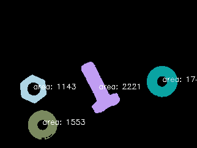

## The findContours algorithm

`findContours`算法是 OpenCV 中最常用的算法之一，用于分割对象。这个算法自 OpenCV 的第一个版本以来就被包含在内，并为开发者提供了更多信息和描述符，如形状、拓扑组织等：

```py
void findContours(InputOutputArray image, OutputArrayOfArrays contours, OutputArray hierarchy, int mode, int method, Point offset=Point())
```

让我们逐个解释每个参数，如下所示：

+   **图像**：这是输入的二值图像。

+   **轮廓**：这是轮廓输出，其中每个检测到的轮廓都是一个点的向量。

+   **层次结构**：这是可选的输出向量，用于存储轮廓的层次结构。这是图像的拓扑结构，其中我们可以获取每个轮廓之间的关系。

+   **模式**：这是检索轮廓的方法：

    +   `RETR_EXTERNAL`: 这只检索外部轮廓。

    +   `RETR_LIST`: 这将检索所有轮廓而不建立层次结构。

    +   `RETR_CCOMP`: 这检索所有具有两个层次结构的轮廓：外部和孔洞。如果一个对象在孔洞内部，那么它将位于层次结构的顶部。

    +   `RETR_TREE`: 这检索创建轮廓之间完整层次结构的所有轮廓。

+   **方法**：这允许你执行近似方法以检索轮廓的形状：

    +   `CV_CHAIN_APPROX_NONE:` 这不对轮廓应用任何近似，并存储所有轮廓点。

    +   `CV_CHAIN_APPROX_SIMPLE`: 这压缩了所有只存储起点和终点的水平、垂直和对角线段。

    +   `CV_CHAIN_APPROX_TC89_L1,CV_CHAIN_APPROX_TC89_KCOS` 这应用了 Teh-Chin 链近似算法。

+   **偏移量**：这是用于移动所有轮廓的可选点值。当我们在一个 ROI 中工作时，这非常有用，并且需要检索全局位置。

### 注意

**注意**

输入图像被`findContours`函数修改。如果你需要它，在将其发送到该函数之前创建图像的副本。

现在我们知道了`findContours`函数的参数，让我们将它们应用到我们的示例中：

```py
void FindContoursBasic(Mat img)
{
  vector<vector<Point> > contours;
  findContours(img, contours, RETR_EXTERNAL, CHAIN_APPROX_SIMPLE);
  Mat output= Mat::zeros(img.rows,img.cols, CV_8UC3);
  // Check the number of objects detected
  if(contours.size() == 0 ){
    cout << "No objects detected" << endl;
    return;
  }else{
    cout << "Number of objects detected: " << contours.size() << endl;
  }
  RNG rng( 0xFFFFFFFF );
  for(int i=0; i<contours.size(); i++)
    drawContours(output, contours, i, randomColor(rng));
  imshow("Result", output);
}
```

让我们逐行理解我们的实现。

在我们的情况下，我们不需要任何层次结构，因此我们将只检索所有可能对象的`contours`的外部轮廓。为此，我们使用`RETR_EXTERNAL`模式，并使用`CHAIN_APPROX_SIMPLE`方法的基本轮廓编码方案：

```py
vector<vector<Point> > contours;
vector<Vec4i> hierarchy;
findContours(img, contours, RETR_EXTERNAL, CHAIN_APPROX_SIMPLE);
```

与前面提到的连接组件示例类似，我们首先检查我们检索了多少`contours`。如果没有，则从我们的函数中退出：

```py
// Check the number of objects detected
  if(contours.size() == 0 ){
    cout << "No objects detected" << endl;
    return;
  }else{
    cout << "Number of objects detected: " << contours.size() << endl;
  }
```

最后，我们绘制了我们检测到的每个`等高线`，并在输出图像中以不同的颜色绘制它们。为此，OpenCV 为我们提供了一个函数来绘制查找`等高线`图像的结果：

```py
for(int i=0; i<contours.size(); i++)
    drawContours(output, contours, i, randomColor(rng));
  imshow("Result", output);
}
```

`drawContours` 函数允许以下参数：

+   **图像**：这是用于绘制等高线的输出图像。

+   **等高线**：这是等高线向量。

+   **等高线索引**：这是一个指示要绘制的等高线的数字；如果它是负数，则绘制所有等高线。

+   **颜色**：这是绘制等高线所用的颜色。

+   **厚度**：如果这个值为负，则等高线将用所选颜色填充。

+   **线型**：当我们想要使用抗锯齿或其他绘图方法时使用。

+   **层次结构**：这是一个可选参数，只有在你想只绘制一些等高线时才需要。

+   **最大层级**：这是一个可选参数，仅在存在层次结构参数时才考虑。如果设置为 0，则只绘制指定的等高线；如果设置为 1，则函数绘制当前等高线和嵌套的等高线；如果设置为 2，则算法绘制所有指定的等高线层级。

+   **偏移量**：这是一个可选参数，用于移动等高线。

我们的结果可以在以下图像中显示：

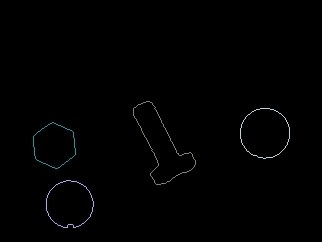

在二值化图像之后，我们可以看到三种不同的算法被用来分割和分离图像中的每个对象，使我们能够隔离每个对象以便进行操作或提取特征。

我们可以在以下图像中看到整个过程：

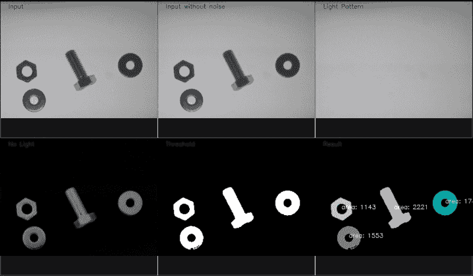

# 摘要

在本章中，我们探讨了在受控情况下进行对象分割的基础，其中摄像机拍摄不同对象的图片。

我们学习了如何去除背景和光线，以便通过最小化噪声来二值化我们的图像，以及三种不同的算法用于分割和分离图像中的每个对象，使我们能够隔离每个对象以便进行操作或提取特征。最后，我们在图像中提取了所有对象，我们将从这些对象中提取特征来训练机器学习系统。

在下一章中，我们将预测图像中任何对象的类别，然后调用机器人或其他系统来选择其中的任何一个，或者检测不在正确载体带上的对象，然后通知人员将其取走。
