# 第九章. 学习目标跟踪

在上一章中，我们学习了视频监控、背景建模和形态学图像处理。我们讨论了如何使用不同的形态学算子将酷炫的视觉效果应用到输入图像上。在本章中，我们将学习如何在实时视频中跟踪一个物体。我们将讨论可用于跟踪物体的不同物体特征。我们还将了解用于物体跟踪的不同方法和技巧。物体跟踪在机器人技术、自动驾驶汽车、车辆跟踪、体育中的运动员跟踪、视频压缩等领域得到了广泛的应用。

到本章结束时，你将学习：

+   如何跟踪彩色物体

+   如何构建一个交互式目标跟踪器

+   什么是角点检测器

+   如何检测用于跟踪的良好特征

+   如何构建基于光流的特征跟踪器

# 跟踪特定颜色的物体

为了构建一个良好的目标跟踪器，我们需要了解哪些特征可以用来使我们的跟踪既稳健又准确。因此，让我们迈出小小的一步，看看我们如何利用色彩空间来设计一个良好的视觉跟踪器。有一点需要记住的是，色彩信息对光照条件很敏感。在实际应用中，你需要进行一些预处理来处理这个问题。但就目前而言，让我们假设有人在做这件事，而我们正在获取干净的彩色图像。

存在许多不同的色彩空间，选择一个好的取决于人们在不同应用中的使用。虽然 RGB 是计算机屏幕上的原生表示，但它对于人类来说并不一定是理想的。当涉及到人类时，我们给基于色调的颜色命名。这就是为什么**HSV**（**色调饱和度值**）可能是最有信息量的色彩空间之一。它与我们的颜色感知非常接近。色调指的是颜色光谱，饱和度指的是特定颜色的强度，而值指的是该像素的亮度。这实际上是以圆柱格式表示的。你可以参考关于这个的简单解释[`infohost.nmt.edu/tcc/help/pubs/colortheory/web/hsv.html`](http://infohost.nmt.edu/tcc/help/pubs/colortheory/web/hsv.html)。我们可以将图像的像素转换到 HSV 空间，然后使用该空间中的色彩空间距离和阈值来进行阈值处理以跟踪特定物体。

考虑视频中的以下帧：

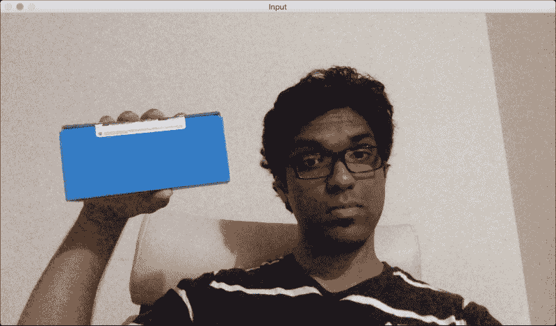

如果你通过色彩空间过滤器运行它并跟踪物体，你会看到类似这样的东西：

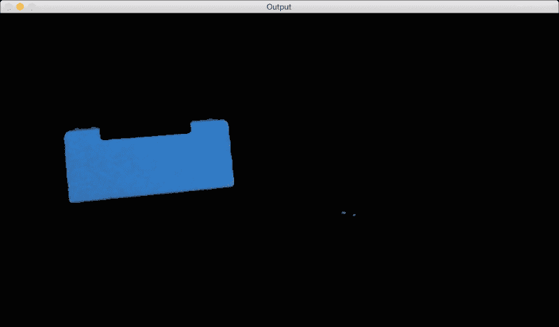

如您在此处所见，我们的跟踪器根据视频中的颜色特征识别特定对象。为了使用此跟踪器，我们需要知道目标对象的颜色分布。以下代码用于跟踪一个只选择具有特定给定色调的像素的彩色对象。代码注释详尽，因此请阅读之前提到的每行解释以了解发生了什么：

```py
int main(int argc, char* argv[])
{
    // Variable declarations and initializations

    // Iterate until the user presses the Esc key
    while(true)
    {
        // Initialize the output image before each iteration
        outputImage = Scalar(0,0,0);

        // Capture the current frame
        cap >> frame;

        // Check if 'frame' is empty
        if(frame.empty())
            break;

        // Resize the frame
        resize(frame, frame, Size(), scalingFactor, scalingFactor, INTER_AREA);
        // Convert to HSV colorspace
        cvtColor(frame, hsvImage, COLOR_BGR2HSV);

        // Define the range of "blue" color in HSV colorspace
        Scalar lowerLimit = Scalar(60,100,100);
        Scalar upperLimit = Scalar(180,255,255);

        // Threshold the HSV image to get only blue color
        inRange(hsvImage, lowerLimit, upperLimit, mask);

        // Compute bitwise-AND of input image and mask
        bitwise_and(frame, frame, outputImage, mask=mask);

        // Run median filter on the output to smoothen it
        medianBlur(outputImage, outputImage, 5);

        // Display the input and output image
        imshow("Input", frame);
        imshow("Output", outputImage);

        // Get the keyboard input and check if it's 'Esc'
        // 30 -> wait for 30 ms
        // 27 -> ASCII value of 'ESC' key
        ch = waitKey(30);
        if (ch == 27) {
            break;
        }
    }

    return 1;
}
```

# 构建交互式对象跟踪器

基于颜色空间的跟踪器为我们提供了跟踪彩色对象的自由，但我们也被限制在预定义的颜色上。如果我们只想随机选择一个对象怎么办？我们如何构建一个可以学习所选对象特征并自动跟踪它的对象跟踪器？这就是 CAMShift 算法出现的地方，它代表**连续自适应均值漂移**。它基本上是 Meanshift 算法的改进版本。

Meanshift 的概念实际上很好且简单。假设我们选择一个感兴趣的区域，并希望我们的对象跟踪器跟踪该对象。在这个区域中，我们根据颜色直方图选择一些点，并计算空间点的质心。如果质心位于该区域的中心，我们知道对象没有移动。但如果质心不在该区域的中心，那么我们知道对象正在某个方向上移动。质心的移动控制着对象移动的方向。因此，我们将对象的边界框移动到新的位置，使新的质心成为边界框的中心。因此，这个算法被称为 Meanshift，因为均值（即质心）在移动。这样，我们就能保持对对象当前位置的了解。

然而，Meanshift 的问题在于边界框的大小不允许改变。当你将对象从摄像机移开时，人眼会看到对象变得更小，但 Meanshift 不会考虑这一点。在整个跟踪过程中，边界框的大小将保持不变。因此，我们需要使用 CAMShift。CAMShift 的优势在于它可以调整边界框的大小以适应对象的大小。此外，它还可以跟踪对象的方向。

让我们考虑以下图中被突出显示的对象：

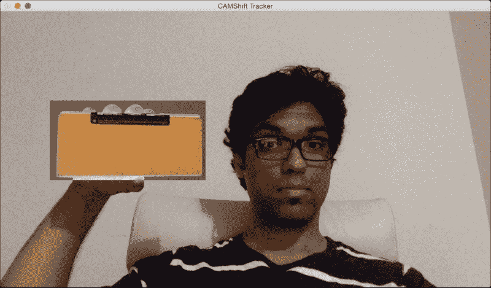

现在我们已经选择了对象，算法计算直方图反向投影并提取所有信息。什么是直方图反向投影？它只是识别图像如何适合我们的直方图模型的一种方法。我们计算特定事物的直方图模型，然后使用此模型在图像中找到该事物。让我们移动对象并看看它是如何被跟踪的：

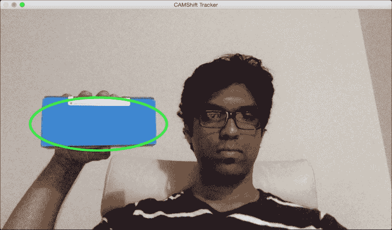

看起来物体被跟踪得相当好。让我们改变方向，并检查跟踪是否保持：

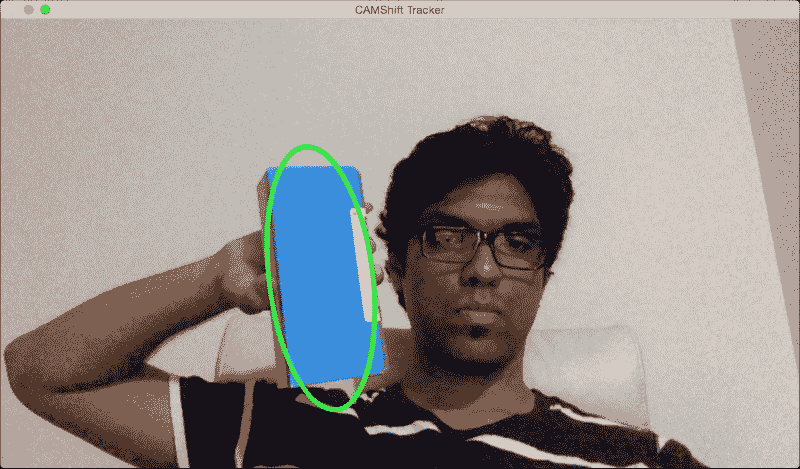

如您所见，边界椭圆已经改变了其位置和方向。让我们改变物体的视角，看看它是否仍然能够跟踪它：

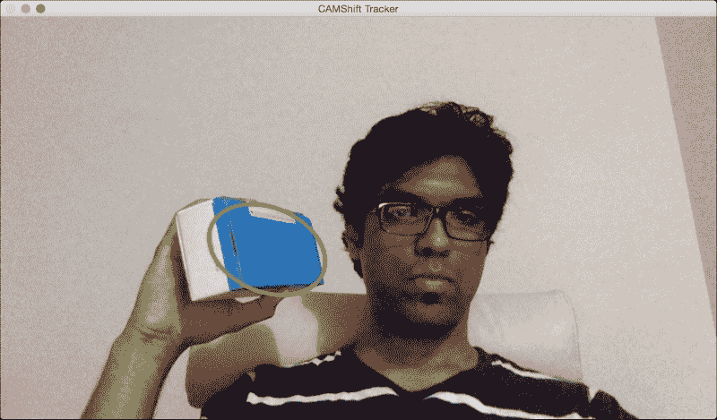

我们仍然做得很好！边界椭圆已经改变了宽高比，以反映物体现在看起来是倾斜的（由于透视变换）。让我们看看以下代码中的用户界面功能：

```py
Mat image;
Point originPoint;
Rect selectedRect;
bool selectRegion = false;
int trackingFlag = 0;

// Function to track the mouse events
void onMouse(int event, int x, int y, int, void*)
{
    if(selectRegion)
    {
        selectedRect.x = MIN(x, originPoint.x);
        selectedRect.y = MIN(y, originPoint.y);
        selectedRect.width = std::abs(x - originPoint.x);
        selectedRect.height = std::abs(y - originPoint.y);

        selectedRect &= Rect(0, 0, image.cols, image.rows);
    }

    switch(event)
    {
        case CV_EVENT_LBUTTONDOWN:
            originPoint = Point(x,y);
            selectedRect = Rect(x,y,0,0);
            selectRegion = true;
            break;

        case CV_EVENT_LBUTTONUP:
            selectRegion = false;
            if( selectedRect.width > 0 && selectedRect.height > 0 )
            {
                trackingFlag = -1;
            }
            break;
    }
}
```

这个函数基本上捕获了在窗口中选定的矩形的坐标。用户只需点击它们并用鼠标拖动即可。OpenCV 中有一系列内置函数帮助我们检测这些不同的鼠标事件。

这里是用于基于 CAMShift 进行对象跟踪的代码：

```py
int main(int argc, char* argv[])
{
    // Variable declaration and initialization

    // Iterate until the user presses the Esc key
    while(true)
    {
// Capture the current frame
        cap >> frame;

        // Check if 'frame' is empty
        if(frame.empty())
            break;

        // Resize the frame
        resize(frame, frame, Size(), scalingFactor, scalingFactor, INTER_AREA);

        // Clone the input frame
        frame.copyTo(image);

        // Convert to HSV colorspace
        cvtColor(image, hsvImage, COLOR_BGR2HSV);
```

到目前为止，我们已经有了一个等待处理的 HSV 图像。让我们继续看看我们如何使用我们的阈值来处理这个图像：

```py
        if(trackingFlag)
        {
            // Check for all the values in 'hsvimage' that are within the specified range
            // and put the result in 'mask'
            inRange(hsvImage, Scalar(0, minSaturation, minValue), Scalar(180, 256, maxValue), mask);

            // Mix the specified channels
            int channels[] = {0, 0};
hueImage.create(hsvImage.size(), hsvImage.depth());
            mixChannels(&hsvImage, 1, &hueImage, 1, channels, 1);

            if(trackingFlag < 0)
            {
            // Create images based on selected regions of interest
                Mat roi(hueImage, selectedRect), maskroi(mask, selectedRect);

                // Compute the histogram and normalize it
calcHist(&roi, 1, 0, maskroi, hist, 1, &histSize, &histRanges);
                normalize(hist, hist, 0, 255, CV_MINMAX);

                trackingRect = selectedRect;
                trackingFlag = 1;
            }
```

如您在此处所见，我们使用 HSV 图像来计算区域的直方图。我们使用我们的阈值在 HSV 光谱中定位所需颜色，然后根据该颜色过滤图像。让我们继续看看我们如何计算直方图反向投影：

```py
            // Compute the histogram backprojection
            calcBackProject(&hueImage, 1, 0, hist, backproj, &histRanges);
            backproj &= mask;
            RotatedRect rotatedTrackingRect = CamShift(backproj, trackingRect, TermCriteria(CV_TERMCRIT_EPS | CV_TERMCRIT_ITER, 10, 1));

            // Check if the area of trackingRect is too small
            if(trackingRect.area() <= 1)
            {
                // Use an offset value to make sure the trackingRect has a minimum size
                int cols = backproj.cols, rows = backproj.rows;
                int offset = MIN(rows, cols) + 1;
                trackingRect = Rect(trackingRect.x - offset, trackingRect.y - offset, trackingRect.x + offset, trackingRect.y + offset) & Rect(0, 0, cols, rows);
            }
```

我们现在准备好显示结果。使用旋转矩形，让我们在我们的感兴趣区域周围画一个椭圆：

```py
            // Draw the ellipse on top of the image
            ellipse(image, rotatedTrackingRect, Scalar(0,255,0), 3, CV_AA);
        }

// Apply the 'negative' effect on the selected region of interest
        if(selectRegion && selectedRect.width > 0 && selectedRect.height > 0)
        {
            Mat roi(image, selectedRect);
            bitwise_not(roi, roi);
        }

        // Display the output image
        imshow(windowName, image);

        // Get the keyboard input and check if it's 'Esc'
        // 27 -> ASCII value of 'Esc' key
        ch = waitKey(30);
        if (ch == 27) {
            break;
        }
}

    return 1;
}
```

# 使用 Harris 角点检测器检测点

角点检测是一种用于在图像中检测*兴趣点*的技术。这些兴趣点在计算机视觉术语中也被称为*特征点*或简单地称为*特征*。一个角基本上是两条边的交点。一个*兴趣点*基本上是在图像中可以唯一检测到的东西。一个角是兴趣点的特例。这些兴趣点帮助我们描述图像。这些点在许多应用中得到了广泛的应用，例如对象跟踪、图像分类、视觉搜索等等。既然我们知道角是*有趣的*，让我们看看我们如何检测它们。

在计算机视觉中，有一个流行的角点检测技术称为 Harris 角点检测器。我们根据灰度图像的偏导数构建一个 2x2 矩阵，然后分析特征值。那么这究竟意味着什么呢？好吧，让我们来剖析一下，以便我们更好地理解它。让我们考虑图像中的一个小的区域。我们的目标是检查这个区域中是否有角点。因此，我们考虑所有相邻的区域，并计算我们的区域与所有这些相邻区域之间的强度差异。如果在所有方向上差异都很大，那么我们知道我们的区域中有一个角点。这实际上是实际算法的一个过度简化，但它涵盖了核心内容。如果你想要了解背后的数学细节，你可以查看 Harris 和 Stephens 的原始论文，链接为 [`www.bmva.org/bmvc/1988/avc-88-023.pdf`](http://www.bmva.org/bmvc/1988/avc-88-023.pdf)。角点是一个特征值都会有大值的点。

如果我们运行 Harris 角点检测器，它看起来会是这样：

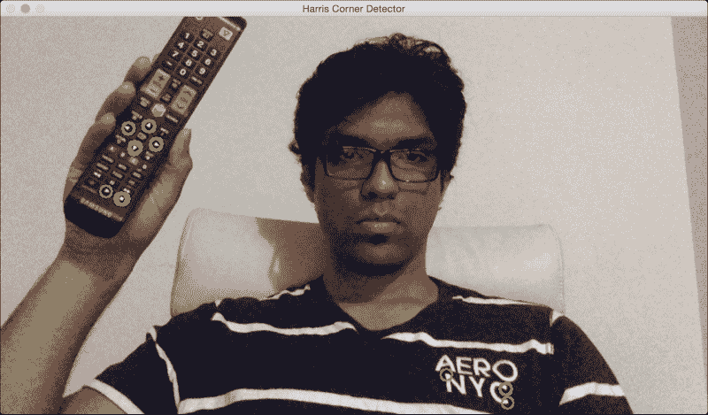

如你所见，电视遥控器上的绿色圆圈是检测到的角点。这会根据你为检测器选择的参数而改变。如果你修改参数，你可能会看到检测到更多的点。如果你让它更严格，那么你可能无法检测到软角点。让我们看一下以下代码来检测 Harris 角点：

```py
int main(int argc, char* argv[])
{
    // Variable declaration and initialization

    // Iterate until the user presses the Esc key
    while(true)
    {
        // Capture the current frame
        cap >> frame;

        // Resize the frame
        resize(frame, frame, Size(), scalingFactor, scalingFactor, INTER_AREA);

        dst = Mat::zeros(frame.size(), CV_32FC1);

        // Convert to grayscale
        cvtColor(frame, frameGray, COLOR_BGR2GRAY );

        // Detecting corners
        cornerHarris(frameGray, dst, blockSize, apertureSize, k, BORDER_DEFAULT);

        // Normalizing
        normalize(dst, dst_norm, 0, 255, NORM_MINMAX, CV_32FC1, Mat());
        convertScaleAbs(dst_norm, dst_norm_scaled);
```

我们将图像转换为灰度，并使用我们的参数检测角点。你可以在 `.cpp` 文件中找到完整的代码。这些参数在将要检测到的点的数量中起着重要作用。你可以在 OpenCV 的 Harris 角点检测器文档中查看详细信息，链接为 [`docs.opencv.org/2.4/modules/imgproc/doc/feature_detection.html?highlight=cornerharris#void cornerHarris(InputArray src, OutputArray dst, int blockSize, int ksize, double k, int borderType`](http://docs.opencv.org/2.4/modules/imgproc/doc/feature_detection.html?highlight=cornerharris#voidcornerHarris%28InputArraysrc,OutputArraydst,intblockSize,intksize,doublek,intborderType%29))。

我们现在有了所有需要的信息。让我们继续在角点周围画圆圈以显示结果：

```py
        // Drawing a circle around each corner
        for(int j = 0; j < dst_norm.rows ; j++)
        {
            for(int i = 0; i < dst_norm.cols; i++)
            {
                if((int)dst_norm.at<float>(j,i) > thresh)
                {
                    circle(frame, Point(i, j), 8,  Scalar(0,255,0), 2, 8, 0);
                }
            }
        }

        // Showing the result
        imshow(windowName, frame);

        // Get the keyboard input and check if it's 'Esc'
        // 27 -> ASCII value of 'Esc' key
        ch = waitKey(10);
        if (ch == 27) {
            break;
        }
    }

    // Release the video capture object
    cap.release();

    // Close all windows
    destroyAllWindows();

    return 1;
}
```

如你所见，这段代码接受一个 `blockSize` 输入参数。根据你选择的大小，性能会有所不同。从 `4` 开始，尝试不同的值以查看会发生什么。

# Shi-Tomasi 角点检测器

Harris 角点检测器在许多情况下表现良好，但仍有改进空间。在 Harris 和 Stephens 的原始论文发表后的六年左右，Shi-Tomasi 提出了一种更好的方法，他们称之为*Good Features To Track*。您可以在[`www.ai.mit.edu/courses/6.891/handouts/shi94good.pdf`](http://www.ai.mit.edu/courses/6.891/handouts/shi94good.pdf)阅读原始论文。他们使用不同的评分函数来提高整体质量。使用这种方法，我们可以在给定的图像中找到*N*个最强的角点。当我们不想使用图像中的每一个角点来提取信息时，这非常有用。如前所述，一个好的兴趣点检测器在诸如对象跟踪、对象识别、图像搜索等应用中非常有用。

如果您将 Shi-Tomasi 角点检测器应用于图像，您将看到类似这样的效果：

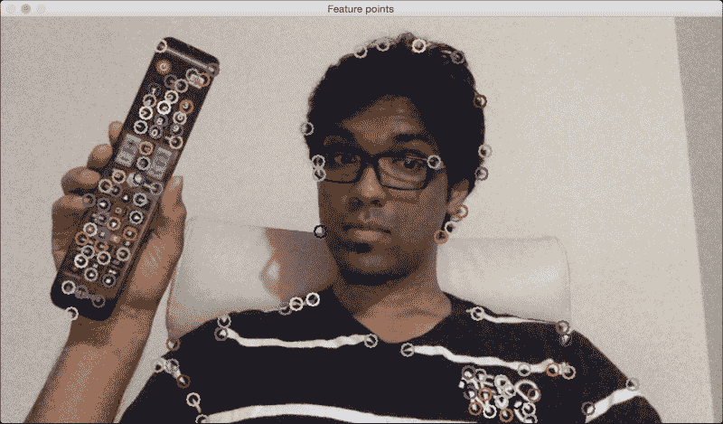

如您所见，帧中的所有重要点都被捕捉到了。让我们看一下以下代码来跟踪这些特征：

```py
int main(int argc, char* argv[])
{
    // Variable declaration and initialization

    // Iterate until the user presses the Esc key
    while(true)
    {
        // Capture the current frame
        cap >> frame;

        // Resize the frame
        resize(frame, frame, Size(), scalingFactor, scalingFactor, INTER_AREA);

        // Convert to grayscale
        cvtColor(frame, frameGray, COLOR_BGR2GRAY );

        // Initialize the parameters for Shi-Tomasi algorithm
        vector<Point2f> corners;
        double qualityThreshold = 0.02;
        double minDist = 15;
        int blockSize = 5;
        bool useHarrisDetector = false;
        double k = 0.07;

        // Clone the input frame
        Mat frameCopy;
        frameCopy = frame.clone();

        // Apply corner detection
        goodFeaturesToTrack(frameGray, corners, numCorners, qualityThreshold, minDist, Mat(), blockSize, useHarrisDetector, k);
```

我们提取了帧并使用`goodFeaturesToTrack`来检测角点。重要的是要理解检测到的角点数量将取决于我们选择的参数。您可以在[`docs.opencv.org/2.4/modules/imgproc/doc/feature_detection.html?highlight=goodfeaturestotrack#goodfeaturestotrack`](http://docs.opencv.org/2.4/modules/imgproc/doc/feature_detection.html?highlight=goodfeaturestotrack#goodfeaturestotrack)找到详细的解释。让我们继续在这些点上画圆圈以显示输出图像：

```py
        // Parameters for the circles to display the corners
        int radius = 8;      // radius of the cirles
        int thickness = 2;   // thickness of the circles
        int lineType = 8;

        // Draw the detected corners using circles
        for(size_t i = 0; i < corners.size(); i++)
        {
            Scalar color = Scalar(rng.uniform(0,255), rng.uniform(0,255), rng.uniform(0,255));
            circle(frameCopy, corners[i], radius, color, thickness, lineType, 0);
        }

        /// Show what you got
        imshow(windowName, frameCopy);

        // Get the keyboard input and check if it's 'Esc'
        // 27 -> ASCII value of 'Esc' key
        ch = waitKey(30);
        if (ch == 27) {
            break;
        }
    }

    // Release the video capture object
    cap.release();

    // Close all windows
    destroyAllWindows();

    return 1;
}
```

此程序接受一个`numCorners`输入参数。此值表示您想要跟踪的最大角点数。从`100`开始，尝试调整这个值以观察会发生什么。如果您增加这个值，您将看到更多特征点被检测到。

# 基于特征的跟踪

基于特征的跟踪指的是在视频的连续帧中跟踪单个特征点。这里的优势是我们不需要在每一帧中检测特征点。我们只需检测一次，然后继续跟踪。与在每一帧上运行检测器相比，这更有效率。我们使用一种称为光流的技术来跟踪这些特征。光流是计算机视觉中最流行的技术之一。我们选择一些特征点，并通过视频流跟踪它们。当我们检测到特征点时，我们计算位移矢量并显示这些关键点在连续帧之间的运动。这些矢量被称为运动矢量。

特定点的运动矢量只是一个指示该点相对于前一帧移动方向的线条。不同的方法被用来检测这些运动矢量。最流行的两种算法是 Lucas-Kanade 方法和 Farneback 算法。

## Lucas-Kanade 方法

Lucas-Kanade 方法用于稀疏光流跟踪。通过稀疏，我们指的是特征点的数量相对较低。你可以参考他们的原始论文[`cseweb.ucsd.edu/classes/sp02/cse252/lucaskanade81.pdf`](http://cseweb.ucsd.edu/classes/sp02/cse252/lucaskanade81.pdf)。我们通过提取特征点开始这个过程。对于每个特征点，我们以特征点为中心创建 3 x 3 的面。我们假设每个面内的所有点将具有相似的运动。我们可以根据手头的问题调整这个窗口的大小。

对于当前帧中的每个特征点，我们将其周围的 3 x 3 面积作为参考点。对于这个面，我们查看前一个帧中的邻域以获取最佳匹配。这个邻域通常比 3 x 3 大，因为我们想要获取与考虑中的面最接近的面。现在，从前一个帧中匹配面的中心像素到当前帧中考虑的面的中心像素的路径将成为运动向量。我们对所有特征点都这样做，并提取所有运动向量。

让我们考虑以下帧：


我们需要添加一些我们想要跟踪的点。只需用鼠标点击这个窗口上的几个点即可：

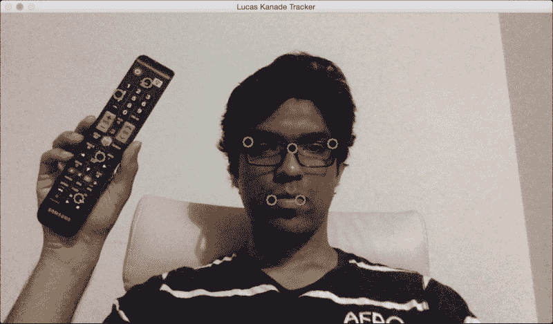

如果我移动到不同的位置，你会看到点仍然在小的误差范围内被正确跟踪：

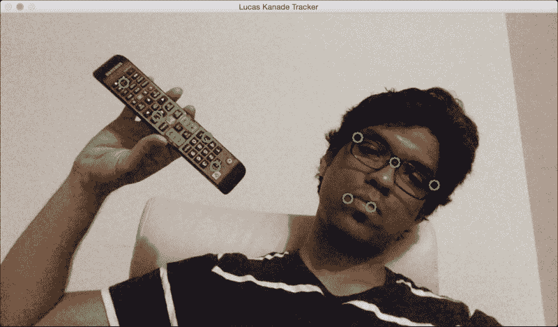

让我们添加很多点来看看会发生什么：

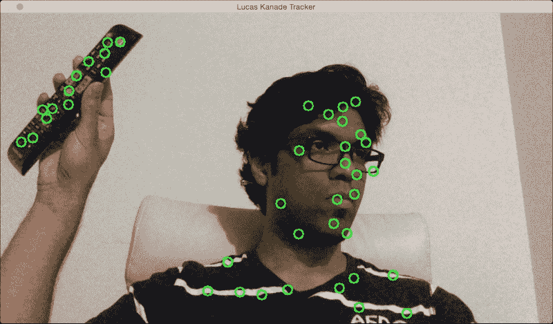

如你所见，它将一直跟踪这些点。然而，你会注意到由于突出度、运动速度等因素，其中一些点会在中间丢失。如果你想玩玩，你可以继续添加更多的点。你也可以允许用户在输入视频中选择感兴趣的区域。然后你可以从这个感兴趣的区域中提取特征点，并通过绘制边界框来跟踪对象。这将是一个有趣的练习！

这里是用于执行基于 Lucas-Kanade 跟踪的代码：

```py
int main(int argc, char* argv[])
{
    // Variable declaration and initialization

    // Iterate until the user hits the Esc key
    while(true)
    {
        // Capture the current frame
        cap >> frame;

        // Check if the frame is empty
        if(frame.empty())
            break;

        // Resize the frame
        resize(frame, frame, Size(), scalingFactor, scalingFactor, INTER_AREA);

        // Copy the input frame
        frame.copyTo(image);

        // Convert the image to grayscale
        cvtColor(image, curGrayImage, COLOR_BGR2GRAY);

        // Check if there are points to track
        if(!trackingPoints[0].empty())
        {
            // Status vector to indicate whether the flow for the corresponding features has been found
            vector<uchar> statusVector;

            // Error vector to indicate the error for the corresponding feature
            vector<float> errorVector;

            // Check if previous image is empty
            if(prevGrayImage.empty())
            {
                curGrayImage.copyTo(prevGrayImage);
            }

            // Calculate the optical flow using Lucas-Kanade algorithm
            calcOpticalFlowPyrLK(prevGrayImage, curGrayImage, trackingPoints[0], trackingPoints[1], statusVector, errorVector, windowSize, 3, terminationCriteria, 0, 0.001);
```

我们使用当前图像和前一个图像来计算光流信息。不用说，输出的质量将取决于你选择的参数。你可以在[`docs.opencv.org/2.4/modules/video/doc/motion_analysis_and_object_tracking.html#calcopticalflowpyrlk`](http://docs.opencv.org/2.4/modules/video/doc/motion_analysis_and_object_tracking.html#calcopticalflowpyrlk)找到更多关于参数的详细信息。为了提高质量和鲁棒性，我们需要过滤掉彼此非常接近的点，因为它们不会添加新的信息。让我们继续这样做：

```py
            int count = 0;

            // Minimum distance between any two tracking points
            int minDist = 7;

            for(int i=0; i < trackingPoints[1].size(); i++)
            {
                if(pointTrackingFlag)
                {
                    /* If the new point is within 'minDist' distance from an existing point, it will not be tracked */
                    if(norm(currentPoint - trackingPoints[1][i]) <= minDist)
                    {
                        pointTrackingFlag = false;
                        continue;
                    }
                }

                // Check if the status vector is good
                if(!statusVector[i])
                    continue;

                trackingPoints[1][count++] = trackingPoints[1][i];

      // Draw a filled circle for each of the tracking points
                int radius = 8;
                int thickness = 2;
                int lineType = 8;
                circle(image, trackingPoints[1][i], radius, Scalar(0,255,0), thickness, lineType);
            }

            trackingPoints[1].resize(count);
        }
```

现在我们有了跟踪点。下一步是细化这些点的位置。在这个上下文中，“细化”究竟意味着什么？为了提高计算速度，涉及一定程度的量化。用通俗易懂的话来说，你可以把它想成“四舍五入”。现在我们有了近似区域，我们可以细化点在该区域内的位置，以获得更准确的结果。让我们继续这样做：

```py
        // Refining the location of the feature points
        if(pointTrackingFlag && trackingPoints[1].size() < maxNumPoints)
        {
            vector<Point2f> tempPoints;
            tempPoints.push_back(currentPoint);

            // Function to refine the location of the corners to subpixel accuracy.
            // Here, 'pixel' refers to the image patch of size 'windowSize' and not the actual image pixel
            cornerSubPix(curGrayImage, tempPoints, windowSize, cvSize(-1,-1), terminationCriteria);

            trackingPoints[1].push_back(tempPoints[0]);
            pointTrackingFlag = false;
        }

        // Display the image with the tracking points
        imshow(windowName, image);

        // Check if the user pressed the Esc key
        char ch = waitKey(10);
        if(ch == 27)
            break;

        // Swap the 'points' vectors to update 'previous' to 'current'
        std::swap(trackingPoints[1], trackingPoints[0]);

        // Swap the images to update previous image to current image
        cv::swap(prevGrayImage, curGrayImage);
    }

    return 1;
}
```

## Farneback 算法

冈纳·法尔内巴克提出了这个光流算法，它用于密集跟踪。密集跟踪在机器人技术、增强现实、3D 制图等领域被广泛使用。你可以在[`www.diva-portal.org/smash/get/diva2:273847/FULLTEXT01.pdf`](http://www.diva-portal.org/smash/get/diva2:273847/FULLTEXT01.pdf)查看原始论文。Lucas-Kanade 方法是一种稀疏技术，这意味着我们只需要处理整个图像中的一些像素。另一方面，Farneback 算法是一种密集技术，它要求我们处理给定图像中的所有像素。因此，显然这里有一个权衡。密集技术更准确，但速度较慢。稀疏技术不太准确，但速度较快。对于实时应用，人们倾向于更喜欢稀疏技术。对于时间和复杂度不是因素的场合，人们更喜欢密集技术来提取更精细的细节。

在他的论文中，法尔内巴克描述了一种基于多项式展开的密集光流估计方法，用于两个帧。我们的目标是估计这两个帧之间的运动，这基本上是一个三步过程。在第一步中，两个帧中的每个邻域都通过多项式进行近似。在这种情况下，我们只对二次多项式感兴趣。下一步是通过全局位移构建一个新的信号。现在，每个邻域都通过一个多项式近似，我们需要看看如果这个多项式经历一个理想的平移会发生什么。最后一步是通过将二次多项式的系数相等来计算全局位移。

现在，这如何可行呢？如果你仔细想想，我们假设整个信号是一个单一的多项式，并且存在一个全局平移来关联这两个信号。这不是一个现实的场景。那么，我们在寻找什么呢？好吧，我们的目标是找出这些错误是否足够小，以至于我们可以构建一个有用的算法来跟踪特征。

让我们看看下面的静态图像：

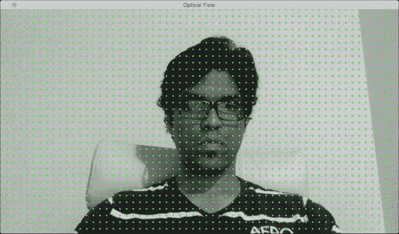

如果我向侧面移动，你可以看到运动矢量指向水平方向。它们只是跟踪我头部的移动：

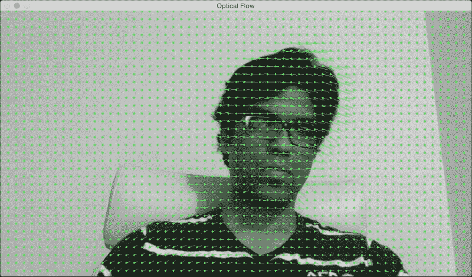

如果我远离摄像头，你可以看到运动矢量指向与图像平面垂直的方向：

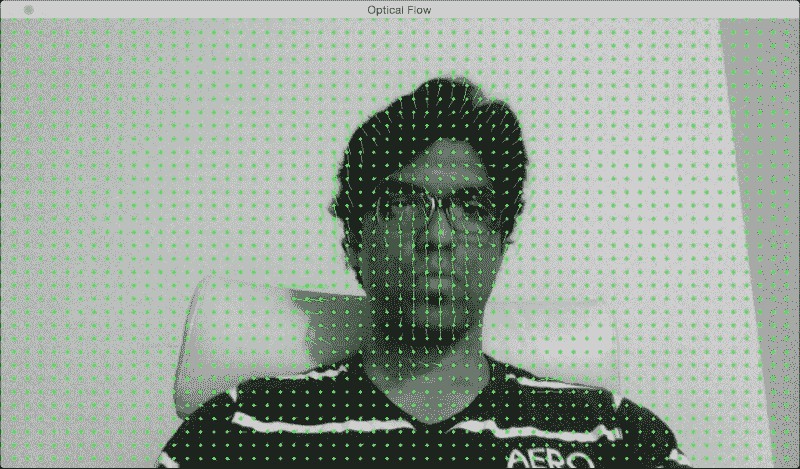

下面是使用 Farneback 算法执行基于光流跟踪的代码：

```py
int main(int, char** argv)
{
    // Variable declaration and initialization

    // Iterate until the user presses the Esc key
    while(true)
    {
        // Capture the current frame
        cap >> frame;

        if(frame.empty())
            break;

        // Resize the frame
        resize(frame, frame, Size(), scalingFactor, scalingFactor, INTER_AREA);

        // Convert to grayscale
        cvtColor(frame, curGray, COLOR_BGR2GRAY);

        // Check if the image is valid
        if(prevGray.data)
        {
            // Initialize parameters for the optical flow algorithm
            float pyrScale = 0.5;
            int numLevels = 3;
            int windowSize = 15;
            int numIterations = 3;
            int neighborhoodSize = 5;
            float stdDeviation = 1.2;

            // Calculate optical flow map using Farneback algorithm
            calcOpticalFlowFarneback(prevGray, curGray, flowImage, pyrScale, numLevels, windowSize, numIterations, neighborhoodSize, stdDeviation, OPTFLOW_USE_INITIAL_FLOW);
```

如您所见，我们使用 Farneback 算法来计算光流向量。`calcOpticalFlowFarneback`的输入参数对于跟踪质量至关重要。您可以在[`docs.opencv.org/3.0-beta/modules/video/doc/motion_analysis_and_object_tracking.html`](http://docs.opencv.org/3.0-beta/modules/video/doc/motion_analysis_and_object_tracking.html)找到这些参数的详细信息。让我们继续在输出图像上绘制这些向量：

```py
            // Convert to 3-channel RGB
            cvtColor(prevGray, flowImageGray, COLOR_GRAY2BGR);

            // Draw the optical flow map
            drawOpticalFlow(flowImage, flowImageGray);

            // Display the output image
            imshow(windowName, flowImageGray);
        }

        // Break out of the loop if the user presses the Esc key
        ch = waitKey(10);
        if(ch == 27)
            break;

        // Swap previous image with the current image
        std::swap(prevGray, curGray);
    }

    return 1;
}
```

我们使用了一个名为`drawOpticalFlow`的函数来绘制这些光流向量。这些向量指示了运动的方向。让我们看看这个函数，看看我们如何绘制这些向量：

```py
// Function to compute the optical flow map
void drawOpticalFlow(const Mat& flowImage, Mat& flowImageGray)
{
    int stepSize = 16;
    Scalar color = Scalar(0, 255, 0);

    // Draw the uniform grid of points on the input image along with the motion vectors
    for(int y = 0; y < flowImageGray.rows; y += stepSize)
    {
        for(int x = 0; x < flowImageGray.cols; x += stepSize)
        {
            // Circles to indicate the uniform grid of points
            int radius = 2;
            int thickness = -1;
            circle(flowImageGray, Point(x,y), radius, color, thickness);

            // Lines to indicate the motion vectors
            Point2f pt = flowImage.at<Point2f>(y, x);
            line(flowImageGray, Point(x,y), Point(cvRound(x+pt.x), cvRound(y+pt.y)), color);
        }
    }
}
```

# 摘要

在本章中，我们学习了目标跟踪。我们学习了如何使用 HSV 颜色空间来跟踪彩色物体。我们讨论了用于目标跟踪的聚类技术，以及如何使用 CAMShift 算法构建一个交互式目标跟踪器。我们还学习了角点检测器以及如何在实时视频中跟踪角点。我们讨论了如何使用光流在视频中跟踪特征。我们还学习了 Lucas-Kanade 和 Farneback 算法背后的概念，并将它们实现出来。

在下一章中，我们将讨论分割算法，并了解我们如何将它们用于文本识别。
