# 第一章. 将几何变换应用于图像

在本章中，我们将学习如何将酷炫的几何效果应用于图像。在我们开始之前，我们需要安装 OpenCV-Python。我们将讨论如何安装必要的工具和包。

到本章结束时，您将知道：

+   如何安装 OpenCV-Python

+   如何读取、显示和保存图像

+   如何在多个颜色空间之间进行转换

+   如何应用几何变换，如平移、旋转和缩放

+   如何使用仿射和投影变换在照片上应用有趣的几何效果

# 安装 OpenCV-Python

让我们看看如何在多个平台上使用 Python 支持安装 OpenCV。

## Windows

为了让 OpenCV-Python 正常运行，我们需要执行以下步骤：

1.  安装 Python：确保您的计算机上已安装 Python 2.7.x。如果您没有安装，可以从[`www.python.org/downloads/windows/`](https://www.python.org/downloads/windows/)安装。

1.  安装 NumPy：NumPy 是一个在 Python 中进行数值计算的优秀包。它非常强大，具有多种功能。OpenCV-Python 与 NumPy 配合良好，我们将在本书的整个过程中大量使用这个包。您可以从[`sourceforge.net/projects/numpy/files/NumPy/`](http://sourceforge.net/projects/numpy/files/NumPy/)安装最新版本。

我们需要将这些包安装在其默认位置。一旦我们安装了 Python 和 NumPy，我们需要确保它们运行良好。打开 Python shell 并输入以下内容：

```py
>>> import numpy

```

如果安装顺利，这不应该抛出任何错误。一旦您确认，您就可以继续下载最新的 OpenCV 版本，从[`opencv.org/downloads.html`](http://opencv.org/downloads.html)。

下载完成后，双击安装。我们需要进行一些更改，如下所示：

1.  导航到`opencv/build/python/2.7/`

1.  您将看到一个名为`cv2.pyd`的文件。将此文件复制到`C:/Python27/lib/site-packages`。

您已经设置好了！让我们确保 OpenCV 正在运行。打开 Python shell 并输入以下内容：

```py
>>> import cv2

```

如果您没有看到任何错误，那么您就可以开始了！您现在可以使用 OpenCV-Python 了。

## Mac OS X

要安装 OpenCV-Python，我们将使用**Homebrew**。Homebrew 是 Mac OS X 的一个优秀的包管理器，当您在 OS X 上安装各种库和实用程序时，它将非常有用。如果您没有 Homebrew，您可以通过在终端运行以下命令来安装它：

```py
$ ruby -e "$(curl -fsSL https://raw.githubusercontent.com/Homebrew/install/master/install)"

```

尽管 OS X 自带 Python，但我们需要使用 Homebrew 安装 Python 以简化我们的操作。这个版本被称为 brewed Python。一旦您安装了 Homebrew，下一步就是安装 brewed Python。打开终端并输入以下内容：

```py
$ brew install python

```

这将自动安装 `pip`。Pip 是一个用于在 Python 中安装包的包管理工具，我们将使用它来安装其他包。让我们确保已正确安装了 brewed Python。转到你的终端并输入以下内容：

```py
$ which python

```

你应该在终端看到 `/usr/local/bin/python` 被打印出来。这意味着我们正在使用 brewed Python 而不是内置的系统 Python。现在我们已经安装了 brewed Python，我们可以继续添加仓库 `homebrew/science`，这是 OpenCV 所在的位置。打开终端并运行以下命令：

```py
$ brew tap homebrew/science

```

确保已安装 NumPy 包。如果没有，请在终端运行以下命令：

```py
$ pip install numpy

```

现在，我们已经准备好安装 OpenCV。从你的终端运行以下命令：

```py
$ brew install opencv --with-tbb --with-opengl

```

OpenCV 现已安装在你的机器上，你可以在 `/usr/local/Cellar/opencv/2.4.9/` 找到它。你现在还不能使用它。我们需要告诉 Python 哪里可以找到我们的 OpenCV 包。让我们继续通过符号链接 OpenCV 文件来完成这个操作。从你的终端运行以下命令：

```py
$ cd /Library/Python/2.7/site-packages/
$ ln -s /usr/local/Cellar/opencv/2.4.9/lib/python2.7/site-packages/cv.py cv.py
$ ln -s /usr/local/Cellar/opencv/2.4.9/lib/python2.7/site-packages/cv2.so cv2.so

```

你已经准备好了！让我们看看它是否已正确安装。打开 Python 命令行界面并输入以下内容：

```py
>>> import cv2

```

如果安装顺利，你将不会看到任何错误消息。你现在可以使用 Python 中的 OpenCV 了。

## Linux (针对 Ubuntu)

在我们开始之前，我们需要安装一些依赖项。让我们使用以下包管理器安装它们：

```py
$ sudo apt-get -y install libopencv-dev build-essential cmake libdc1394-22 libdc1394-22-dev libjpeg-dev libpng12-dev libtiff4-dev libjasper-dev libavcodec-dev libavformat-dev libswscale-dev libxine-dev libgstreamer0.10-dev libgstreamer-plugins-base0.10-dev libv4l-dev libtbb-dev libqt4-dev libmp3lame-dev libopencore-amrnb-dev libopencore-amrwb-dev libtheora-dev libvorbis-dev libxvidcore-dev x264 v4l-utils python-scipy python-pip python-virtualenv

```

现在你已经安装了必要的包，让我们继续使用 Python 支持构建 OpenCV：

```py
$ wget "https://github.com/Itseez/opencv/archive/2.4.9.tar.gz" -O ./opencv/opencv.tar.gz
$ cd opencv
$ tar xvzf opencv.tar.gz -C .
$ mkdir release
$ cd release
$ sudo apt-get –y install cmake
$ cmake -D CMAKE_BUILD_TYPE=RELEASE -D CMAKE_INSTALL_PREFIX=/usr/local -D BUILD_PYTHON_SUPPORT=ON -D WITH_XINE=ON -D WITH_OPENGL=ON -D WITH_TBB=ON -D WITH_EIGEN=ON -D BUILD_EXAMPLES=ON -D BUILD_NEW_PYTHON_SUPPORT=ON -D WITH_V4L=ON ../ 
$ make –j4
$ sudo make install

```

让我们确保它已正确安装。打开 Python 命令行界面，并输入以下内容：

```py
>>> import cv2

```

如果你没有看到任何错误，那么你就可以继续了。

如果你使用的是其他 Linux 发行版，请参考 OpenCV 下载页面 ([`opencv.org/downloads.html`](http://opencv.org/downloads.html)) 以获取安装详情。

# 读取、显示和保存图像

让我们看看如何在 OpenCV-Python 中加载一个图像。创建一个名为 `first_program.py` 的文件，并在你喜欢的代码编辑器中打开它。在当前文件夹中创建一个名为 `images` 的文件夹，并确保在该文件夹中有一个名为 `input.jpg` 的图像。

一旦你这样做，将以下行添加到那个 Python 文件中：

```py
import cv2
img = cv2.imread('./images/input.jpg')
cv2.imshow('Input image', img)
cv2.waitKey()
```

如果你运行前面的程序，你将看到一个图像在新窗口中显示。

## 刚才发生了什么？

让我们逐行理解前面的代码。在第一行，我们正在导入 OpenCV 库。我们需要这个库来使用代码中的所有函数。在第二行，我们正在读取图像并将其存储在一个变量中。OpenCV 使用 NumPy 数据结构来存储图像。你可以在 [`www.numpy.org`](http://www.numpy.org) 上了解更多关于 NumPy 的信息。

所以如果你打开 Python 命令行界面并输入以下内容，你将在终端看到打印出的数据类型：

```py
>>> import cv2
>>> img = cv2.imread('./images/input.jpg')
>>> type(img)
<type 'numpy.ndarray'>

```

在下一行，我们在新窗口中显示图像。`cv2.imshow` 中的第一个参数是窗口的名称，第二个参数是你想要显示的图像。

您可能想知道为什么这里有一行。函数`cv2.waitKey()`在 OpenCV 中用于键盘绑定。它接受一个数字作为参数，该数字表示毫秒数。基本上，我们使用这个函数来等待指定的时间，直到我们遇到键盘事件。程序在此处停止，等待您按任意键继续。如果我们不传递任何参数或传递`0`作为参数，此函数将无限期地等待键盘事件。

## 加载和保存图像

OpenCV 提供了多种加载图像的方法。假设我们想要以灰度模式加载彩色图像。我们可以使用以下代码片段来完成：

```py
import cv2
gray_img = cv2.imread('images/input.jpg', cv2.IMREAD_GRAYSCALE)
cv2.imshow('Grayscale', gray_img)
cv2.waitKey()
```

在这里，我们使用标志`cv2.IMREAD_GRAYSCALE`以灰度模式加载图像。您可以从新窗口中显示的图像中看到这一点。接下来，是输入图像：

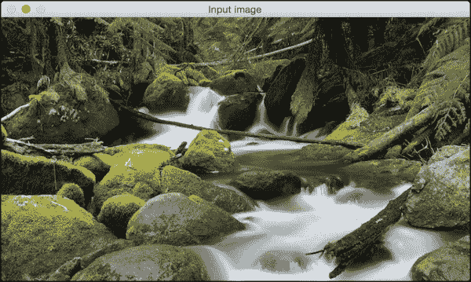

下面是相应的灰度图像：

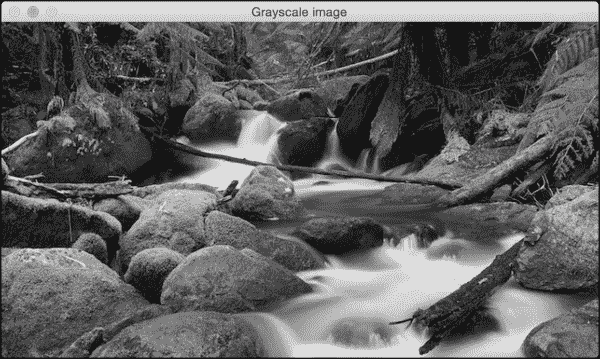

我们也可以将此图像保存到文件中：

```py
cv2.imwrite('images/output.jpg', gray_img)
```

这将把灰度图像保存到名为`output.jpg`的输出文件中。确保您熟悉在 OpenCV 中读取、显示和保存图像，因为在本书的整个过程中我们将做很多这样的操作。

# 图像颜色空间

在计算机视觉和图像处理中，颜色空间指的是组织颜色的特定方式。颜色空间实际上是两件事的组合：一个颜色模型和一个映射函数。我们想要颜色模型的原因是它帮助我们使用元组表示像素值。映射函数将颜色模型映射到可以表示的所有可能颜色的集合。

有许多不同的颜色空间非常有用。其中一些更流行的颜色空间是 RGB、YUV、HSV、Lab 等等。不同的颜色空间提供不同的优势。我们只需要选择适合给定问题的颜色空间。让我们来看几个颜色空间，看看它们提供了哪些信息：

+   **RGB**：这可能是最流行的颜色空间。它代表红色、绿色和蓝色。在这个颜色空间中，每种颜色都表示为红色、绿色和蓝色的加权组合。因此，每个像素值都表示为对应于红色、绿色和蓝色的三个数字的元组。每个值介于 0 到 255 之间。

+   **YUV**：尽管 RGB 在许多用途中都很好，但它对于许多实际应用来说往往非常有限。人们开始考虑不同的方法来分离强度信息与颜色信息。因此，他们提出了 YUV 颜色空间。Y 代表亮度或强度，U/V 通道代表颜色信息。这在许多应用中都很好，因为人眼对强度信息和颜色信息的感知方式非常不同。

+   **HSV**：结果证明，即使是 YUV 对于某些应用来说还不够好。因此，人们开始思考人类如何感知颜色，并提出了 HSV 颜色空间。HSV 代表色调、饱和度和亮度。这是一个圆柱系统，我们通过不同的通道来分离颜色的三个最基本属性。这与人类视觉系统理解颜色的方式密切相关。这为我们提供了很多灵活性，关于我们如何处理图像。

## 颜色空间之间的转换

考虑到所有颜色空间，OpenCV 中大约有 190 种转换选项可用。如果你想查看所有可用标志的列表，请转到 Python 壳中并输入以下内容：

```py
>>> import cv2
>>> print [x for x in dir(cv2) if x.startswith('COLOR_')]

```

你将看到 OpenCV 中可用于从一种颜色空间转换到另一种颜色空间的选项列表。我们可以将任何颜色空间转换为任何其他颜色空间。让我们看看如何将彩色图像转换为灰度图像：

```py
import cv2
img = cv2.imread('./images/input.jpg')
gray_img = cv2.cvtColor(img, cv2.COLOR_BGR2GRAY)
cv2.imshow('Grayscale image', gray_img)
cv2.waitKey()
```

## 发生了什么？

我们使用 `cvtColor` 函数在颜色空间之间进行转换。第一个参数是输入图像，第二个参数指定颜色空间转换。你可以使用以下标志将图像转换为 YUV：

```py
yuv_img = cv2.cvtColor(img, cv2.COLOR_BGR2YUV)
```

图像看起来可能像以下这样：

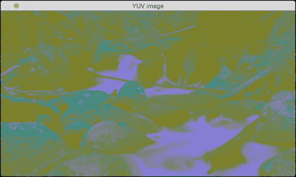

这可能看起来像是原始图像的退化版本，但事实并非如此。让我们分离出三个通道：

```py
cv2.imshow('Y channel', yuv_img[:, :, 0])
cv2.imshow('U channel', yuv_img[:, :, 1])
cv2.imshow('V channel', yuv_img[:, :, 2])
cv2.waitKey()
```

由于 `yuv_img` 是一个 NumPy 数组，我们可以通过切片来分离出三个通道。如果你查看 `yuv_img.shape`，你会看到它是一个三维数组，其维度是 `NUM_ROWS x NUM_COLUMNS x NUM_CHANNELS`。所以一旦运行前面的代码片段，你会看到三幅不同的图像。以下是 `Y` 通道：

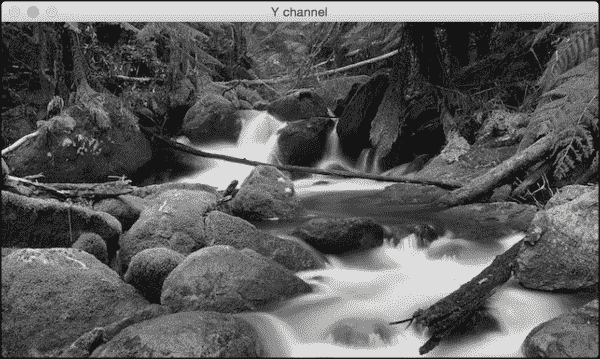

`Y` 通道基本上是灰度图像。接下来是 `U` 通道：

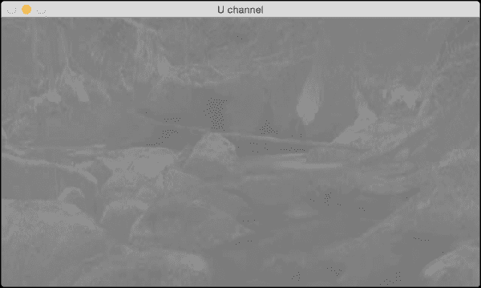

最后，是 `V` 通道：

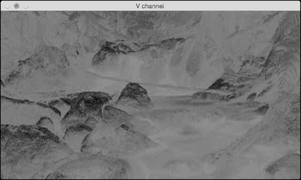

如我们所见，`Y` 通道与灰度图像相同。它表示强度值。`U` 和 `V` 通道表示颜色信息。

让我们转换到 HSV 看看会发生什么：

```py
hsv_img = cv2.cvtColor(img, cv2.COLOR_BGR2HSV)
cv2.imshow('HSV image', hsv_img)
```

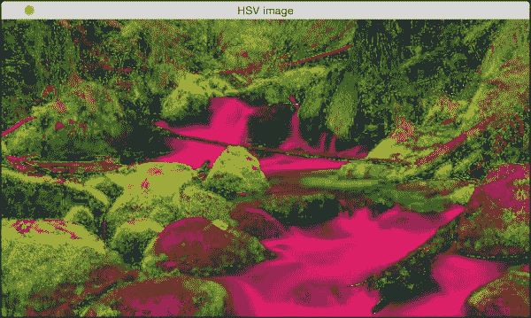

再次，让我们分离通道：

```py
cv2.imshow('H channel', hsv_img[:, :, 0])
cv2.imshow('S channel', hsv_img[:, :, 1])
cv2.imshow('V channel', hsv_img[:, :, 2])
cv2.waitKey()
```

如果运行前面的代码片段，你会看到三幅不同的图像。看看 `H` 通道：

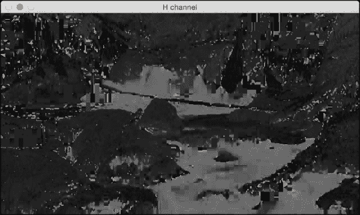

接下来是 `S` 通道：

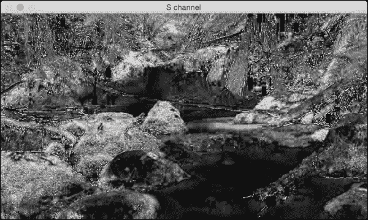

下面是 `V` 通道：

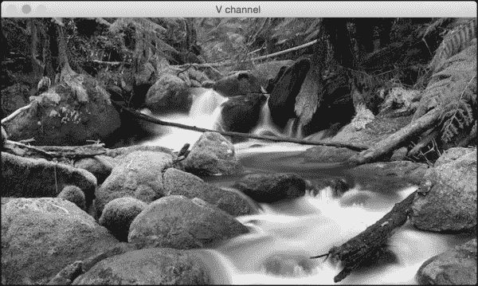

这应该给你一个关于如何在颜色空间之间转换的基本概念。你可以尝试更多的颜色空间，看看图像看起来像什么。我们将在后续章节中遇到相关颜色空间时进行讨论。

# 图像转换

在本节中，我们将讨论如何移动图像。假设我们想要在参考框架内移动图像。在计算机视觉术语中，这被称为`平移`。让我们看看我们如何实现这一点：

```py
import cv2
import numpy as np

img = cv2.imread('images/input.jpg')
num_rows, num_cols = img.shape[:2]

translation_matrix = np.float32([ [1,0,70], [0,1,110] ])
img_translation = cv2.warpAffine(img, translation_matrix, (num_cols, num_rows))
cv2.imshow('Translation', img_translation)
cv2.waitKey()
```

如果你运行上一段代码，你会看到如下所示的内容：

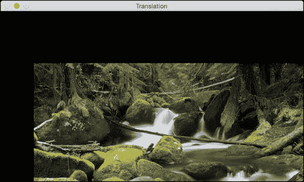

## 发生了什么？

为了理解前面的代码，我们需要了解扭曲是如何工作的。平移基本上意味着我们通过添加/减去 X 和 Y 坐标来移动图像。为了做到这一点，我们需要创建一个变换矩阵，如下所示：

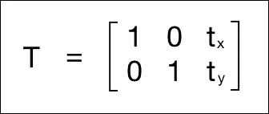

在这里，**tx**和**ty**值是 X 和 Y 平移值，即图像将向右移动`X`个单位，向下移动`Y`个单位。因此，一旦我们创建了一个这样的矩阵，我们就可以使用`warpAffine`函数将其应用于我们的图像。`warpAffine`函数中的第三个参数指的是结果图像的行数和列数。由于行数和列数与原始图像相同，结果图像将被裁剪。这是因为我们在应用平移矩阵时输出空间不足。为了避免裁剪，我们可以这样做：

```py
img_translation = cv2.warpAffine(img, translation_matrix, (num_cols + 70, num_rows + 110))
```

如果你将程序中相应的行替换为上一行，你会看到以下图像：

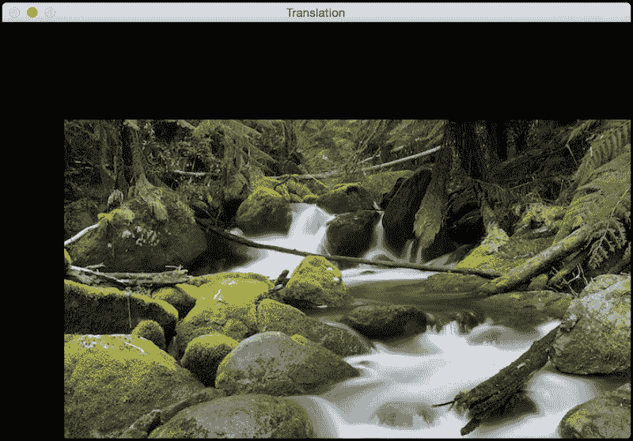

假设你想要将图像移动到更大图像框架的中间；我们可以通过执行以下操作来实现类似的效果：

```py
import cv2
import numpy as np

img = cv2.imread('images/input.jpg')
num_rows, num_cols = img.shape[:2]

translation_matrix = np.float32([ [1,0,70], [0,1,110] ])
img_translation = cv2.warpAffine(img, translation_matrix, (num_cols + 70, num_rows + 110))
translation_matrix = np.float32([ [1,0,-30], [0,1,-50] ])
img_translation = cv2.warpAffine(img_translation, translation_matrix, (num_cols + 70 + 30, num_rows + 110 + 50))
cv2.imshow('Translation', img_translation)
cv2.waitKey()
```

如果你运行上一段代码，你会看到如下所示的图像：

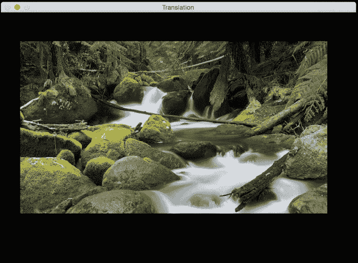

# 图像旋转

在本节中，我们将了解如何通过一定的角度旋转给定的图像。我们可以使用以下代码片段来完成：

```py
import cv2
import numpy as np

img = cv2.imread('images/input.jpg')
num_rows, num_cols = img.shape[:2]

rotation_matrix = cv2.getRotationMatrix2D((num_cols/2, num_rows/2), 30, 1)
img_rotation = cv2.warpAffine(img, rotation_matrix, (num_cols, num_rows))
cv2.imshow('Rotation', img_rotation)
cv2.waitKey()
```

如果你运行上一段代码，你会看到如下所示的图像：

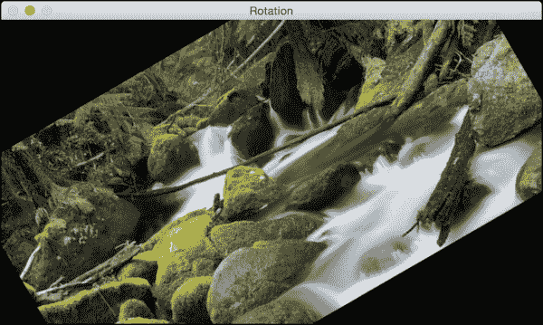

## 发生了什么？

为了理解这一点，让我们看看我们如何从数学上处理旋转。旋转也是一种变换形式，我们可以通过以下变换矩阵来实现：

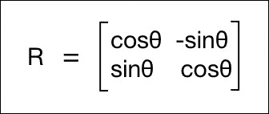

在这里，`θ`是逆时针方向的旋转角度。OpenCV 通过`getRotationMatrix2D`函数提供了对创建此矩阵的更精细的控制。我们可以指定图像将围绕哪个点旋转，旋转的角度（以度为单位），以及图像的缩放因子。一旦我们有了变换矩阵，我们可以使用`warpAffine`函数将此矩阵应用于任何图像。

如前图所示，图像内容超出了边界并被裁剪。为了防止这种情况，我们需要在输出图像中提供足够的空间。让我们使用之前讨论过的平移功能来这样做：

```py
import cv2
import numpy as np

img = cv2.imread('images/input.jpg')
num_rows, num_cols = img.shape[:2]

translation_matrix = np.float32([ [1,0,int(0.5*num_cols)], [0,1,int(0.5*num_rows)] ])
2*num_cols, 2*num_rows))
rotation_matrix = cv2.getRotationMatrix2D((num_cols, num_rows), 30, img_translation = cv2.warpAffine(img, translation_matrix, (1)
img_rotation = cv2.warpAffine(img_translation, rotation_matrix, (2*num_cols, 2*num_rows)) 

cv2.imshow('Rotation', img_rotation)
cv2.waitKey()
```

如果我们运行上一段代码，我们会看到类似以下的内容：

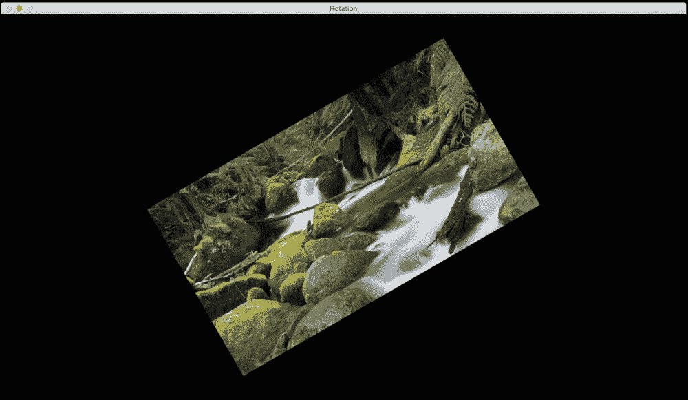

# 图像缩放

在本节中，我们将讨论图像的缩放。这是计算机视觉中最常见的操作之一。我们可以使用缩放因子来调整图像大小，或者将其调整到特定的大小。让我们看看如何做到这一点：

```py
img_scaled = cv2.resize(img,None,fx=1.2, fy=1.2, interpolation = cv2.INTER_LINEAR)
cv2.imshow('Scaling - Linear Interpolation', img_scaled) img_scaled = cv2.resize(img,None,fx=1.2, fy=1.2, interpolation = cv2.INTER_CUBIC)
cv2.imshow('Scaling - Cubic Interpolation', img_scaled) img_scaled = cv2.resize(img,(450, 400), interpolation = cv2.INTER_AREA)
cv2.imshow('Scaling - Skewed Size', img_scaled) cv2.waitKey()
```

## 刚才发生了什么？

每当我们调整图像大小时，有多种方式来填充像素值。当我们放大图像时，我们需要填充像素位置之间的像素值。当我们缩小图像时，我们需要取最佳代表性值。当我们以非整数值缩放时，我们需要适当地插值值，以保持图像的质量。有多种插值方法。如果我们放大图像，最好使用线性或立方插值。如果我们缩小图像，最好使用基于区域的插值。立方插值在计算上更复杂，因此比线性插值慢。但生成的图像质量会更高。

OpenCV 提供了一个名为`resize`的函数来实现图像缩放。如果你没有指定大小（通过使用`None`），那么它期望 X 和 Y 缩放因子。在我们的例子中，图像将按`1.2`的因子放大。如果我们使用立方插值进行相同的放大，我们可以看到质量有所提高，如下面的图所示。下面的截图显示了线性插值的外观：


这里是相应的立方插值：

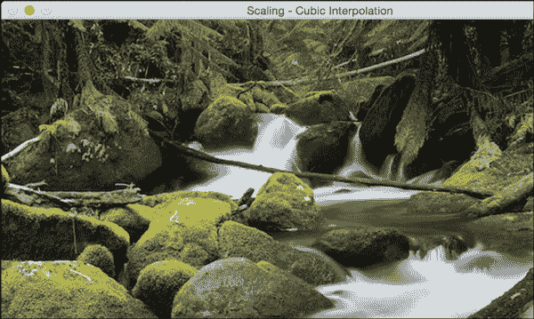

如果我们想将其调整到特定的大小，我们可以使用最后一次缩放实例中显示的格式。我们基本上可以扭曲图像并将其调整到我们想要的任何大小。输出将类似于以下内容：

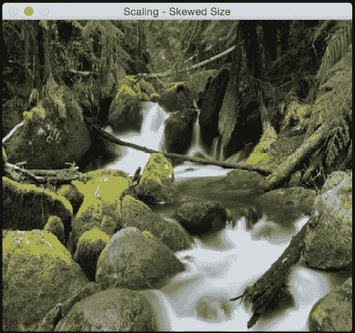

# 斜变换

在本节中，我们将讨论 2D 图像的各种广义几何变换。在前几节中，我们相当多地使用了`warpAffine`函数，现在是时候了解其背后的发生了什么。

在讨论斜变换之前，让我们看看什么是欧几里得变换。欧几里得变换是一种保持长度和角度测量的几何变换。也就是说，如果我们对一个几何形状应用欧几里得变换，形状将保持不变。它可能看起来是旋转的、平移的等等，但基本结构不会改变。所以从技术上讲，线仍然是线，平面仍然是平面，正方形仍然是正方形，圆仍然是圆。

回到仿射变换，我们可以这样说，它们是欧几里得变换的推广。在仿射变换的范畴内，直线将保持直线，但正方形可能会变成矩形或平行四边形。基本上，仿射变换不保持长度和角度。

为了构建一个一般的仿射变换矩阵，我们需要定义控制点。一旦我们有了这些控制点，我们需要决定我们希望它们映射到何处。在这种情况下，我们只需要源图像中的三个点和输出图像中的三个点。让我们看看我们如何将图像转换为类似平行四边形的图像：

```py
import cv2
import numpy as np

img = cv2.imread('images/input.jpg')
rows, cols = img.shape[:2]

src_points = np.float32([[0,0], [cols-1,0], [0,rows-1]])
dst_points = np.float32([[0,0], [int(0.6*(cols-1)),0], [int(0.4*(cols-1)),rows-1]])
affine_matrix = cv2.getAffineTransform(src_points, dst_points)
img_output = cv2.warpAffine(img, affine_matrix, (cols,rows))

cv2.imshow('Input', img)
cv2.imshow('Output', img_output)
cv2.waitKey()
```

## 发生了什么？

正如我们之前讨论的，我们正在定义控制点。我们只需要三个点来获取仿射变换矩阵。我们希望`src_points`中的三个点映射到`dst_points`中的对应点。我们按照以下方式映射点：

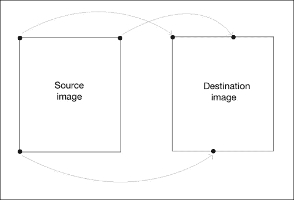

为了获取变换矩阵，我们在 OpenCV 中有一个名为`getAffineTransform`的函数。一旦我们有了仿射变换矩阵，我们使用`warpAffine`函数将这个矩阵应用到输入图像上。

以下是我们输入的图像：

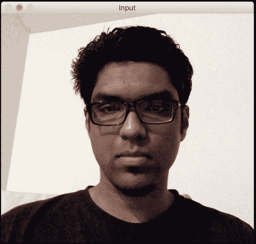

如果你运行前面的代码，输出将看起来像这样：

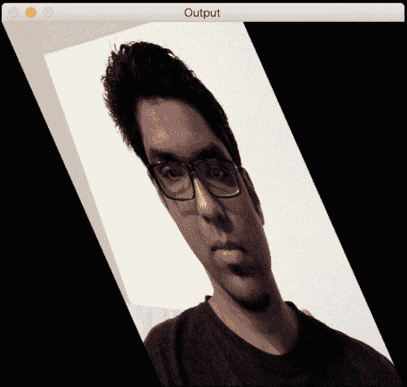

我们也可以得到输入图像的镜像。我们只需要按照以下方式更改控制点：

```py
src_points = np.float32([[0,0], [cols-1,0], [0,rows-1]])
dst_points = np.float32([[cols-1,0], [0,0], [cols-1,rows-1]])
```

在这里，映射看起来大致是这样的：

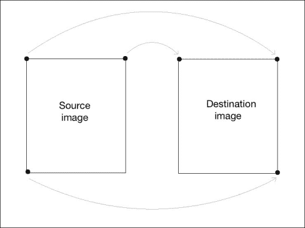

如果你将我们的仿射变换代码中的对应行替换为这两行，你将得到以下结果：

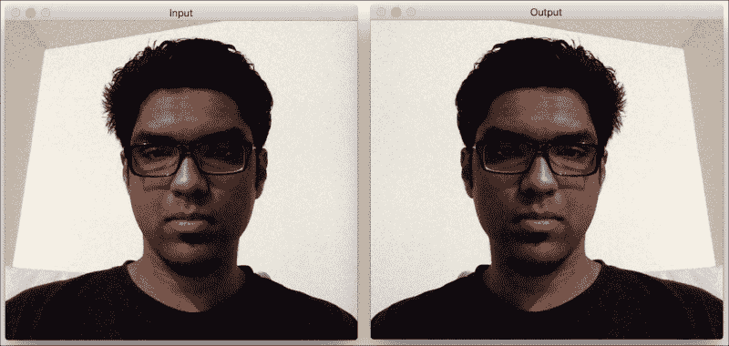

# 投影变换

仿射变换很好，但它们施加了某些限制。另一方面，投影变换给了我们更多的自由。它也被称为**单应性**。为了理解投影变换，我们需要了解投影几何是如何工作的。我们基本上描述了当视角改变时图像会发生什么。例如，如果你正站在画有正方形的纸张的正前方，它看起来就像一个正方形。现在，如果你开始倾斜那张纸，正方形将开始看起来更像梯形。投影变换允许我们以优雅的数学方式捕捉这种动态。这些变换既不保持大小也不保持角度，但它们确实保持交点和交叉比。

### 注意

你可以在[`en.wikipedia.org/wiki/Incidence_(geometry)`](http://en.wikipedia.org/wiki/Incidence_(geometry))和[`en.wikipedia.org/wiki/Cross-ratio`](http://en.wikipedia.org/wiki/Cross-ratio)上了解更多关于交点和交叉比的信息。

既然我们已经知道了什么是投影变换，让我们看看我们是否可以在这里提取更多信息。我们可以这样说，给定平面上任意两个图像通过单应性相关联。只要它们在同一个平面上，我们可以将任何东西变换成任何其他东西。这有许多实际应用，例如增强现实、图像校正、图像配准或计算两张图像之间的相机运动。一旦从估计的单应性矩阵中提取出相机旋转和平移，这些信息可以用于导航，或者将 3D 物体的模型插入到图像或视频中。这样，它们将以正确的透视渲染，看起来就像它们是原始场景的一部分。

让我们继续看看如何做到这一点：

```py
import cv2
import numpy as np

img = cv2.imread('images/input.jpg')
rows, cols = img.shape[:2]

src_points = np.float32([[0,0], [cols-1,0], [0,rows-1], [cols-1,rows-1]])
dst_points = np.float32([[0,0], [cols-1,0], [int(0.33*cols),rows-1], [int(0.66*cols),rows-1]]) 
projective_matrix = cv2.getPerspectiveTransform(src_points, dst_points)
img_output = cv2.warpPerspective(img, projective_matrix, (cols,rows))

cv2.imshow('Input', img)
cv2.imshow('Output', img_output)
cv2.waitKey()
```

如果你运行前面的代码，你会看到一个像以下截图一样的有趣输出：

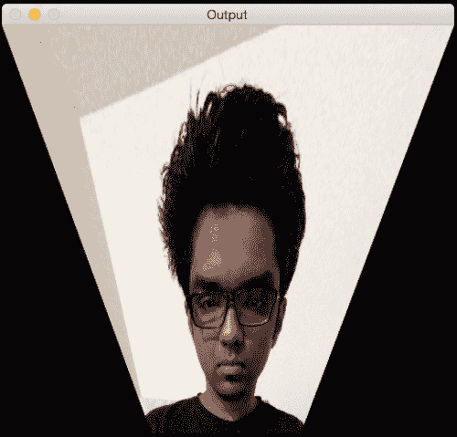

## 发生了什么？

我们可以在源图像中选择四个控制点并将它们映射到目标图像。变换后，平行线将不再是平行线。我们使用一个名为`getPerspectiveTransform`的函数来获取变换矩阵。

让我们使用投影变换来应用一些有趣的效果，看看它们看起来像什么。我们只需要改变控制点来获得不同的效果。

这里有一个例子：

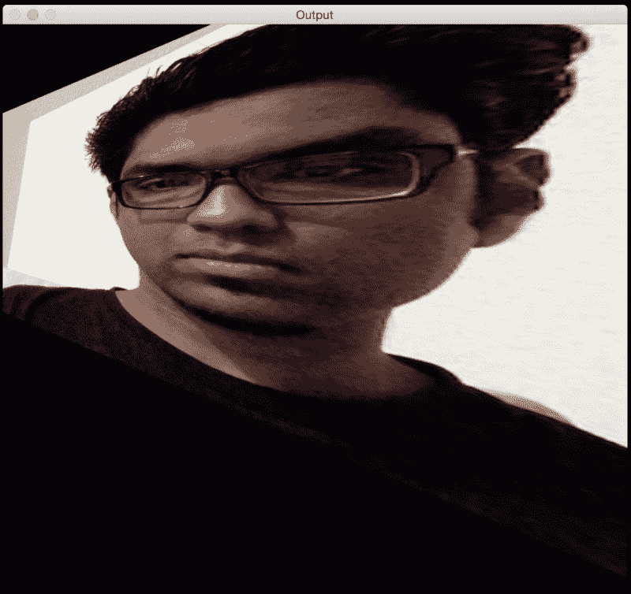

控制点如下所示：

```py
src_points = np.float32([[0,0], [0,rows-1], [cols/2,0], [cols/2,rows-1]])
dst_points = np.float32([[0,100], [0,rows-101], [cols/2,0], [cols/2,rows-1]])
```

作为练习，你应该在平面上映射上述点，看看点是如何映射的（就像我们之前在讨论仿射变换时做的那样）。这将帮助你更好地理解映射系统，并可以创建自己的控制点。

# 图像扭曲

让我们再玩一些图像，看看我们还能实现什么。投影变换非常灵活，但它们仍然对我们如何变换点施加一些限制。如果我们想做一些完全随机的事情呢？我们需要更多的控制，对吧？碰巧，我们也可以做到。我们只需要创建自己的映射，这并不难。以下是一些你可以通过图像扭曲实现的效果：

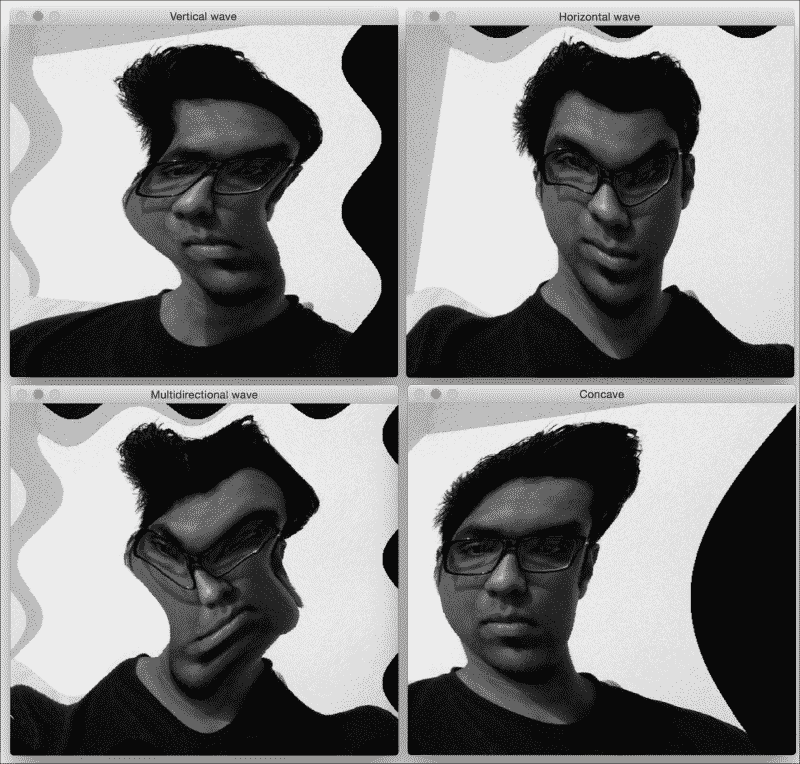

下面是创建这些效果的代码：

```py
import cv2
import numpy as np
import math

img = cv2.imread('images/input.jpg', cv2.IMREAD_GRAYSCALE)
rows, cols = img.shape

#####################
# Vertical wave

img_output = np.zeros(img.shape, dtype=img.dtype)

for i in range(rows):
    for j in range(cols):
        offset_x = int(25.0 * math.sin(2 * 3.14 * i / 180))
        offset_y = 0
        if j+offset_x < rows:
            img_output[i,j] = img[i,(j+offset_x)%cols]
        else:
            img_output[i,j] = 0

cv2.imshow('Input', img)
cv2.imshow('Vertical wave', img_output)

#####################
# Horizontal wave

img_output = np.zeros(img.shape, dtype=img.dtype)

for i in range(rows):
    for j in range(cols):
        offset_x = 0
        offset_y = int(16.0 * math.sin(2 * 3.14 * j / 150))
        if i+offset_y < rows:
            img_output[i,j] = img[(i+offset_y)%rows,j]
        else:
            img_output[i,j] = 0

cv2.imshow('Horizontal wave', img_output)

#####################
# Both horizontal and vertical 

img_output = np.zeros(img.shape, dtype=img.dtype)

for i in range(rows):
    for j in range(cols):
        offset_x = int(20.0 * math.sin(2 * 3.14 * i / 150))
        offset_y = int(20.0 * math.cos(2 * 3.14 * j / 150))
        if i+offset_y < rows and j+offset_x < cols:
            img_output[i,j] = img[(i+offset_y)%rows,(j+offset_x)%cols]
        else:
            img_output[i,j] = 0

cv2.imshow('Multidirectional wave', img_output)

#####################
# Concave effect

img_output = np.zeros(img.shape, dtype=img.dtype)

for i in range(rows):
    for j in range(cols):
        offset_x = int(128.0 * math.sin(2 * 3.14 * i / (2*cols)))
        offset_y = 0
        if j+offset_x < cols:
            img_output[i,j] = img[i,(j+offset_x)%cols]
        else:
            img_output[i,j] = 0

cv2.imshow('Concave', img_output)

cv2.waitKey()
```

# 概述

在本章中，我们学习了如何在各种平台上安装 OpenCV-Python。我们讨论了如何读取、显示和保存图像。我们探讨了各种颜色空间的重要性以及我们如何可以在多个颜色空间之间进行转换。我们学习了如何将几何变换应用于图像，并理解了如何使用这些变换来实现酷炫的几何效果。我们讨论了变换矩阵的底层公式以及我们如何可以根据我们的需求制定不同类型的变换。我们学习了如何根据所需的几何变换选择控制点。我们讨论了投影变换，并学习了如何使用图像扭曲来实现任何给定的几何效果。在下一章中，我们将讨论边缘检测和图像滤波。我们可以使用图像滤波器应用许多视觉效果，其底层结构为我们提供了很多自由度，以创造性地操纵图像。
