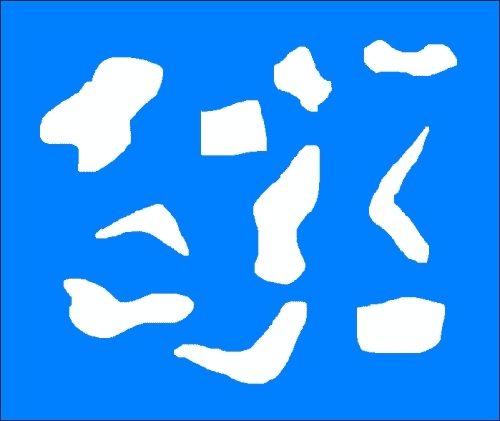

# 第八章. 检测形状和分割图像

在本章中，我们将学习形状分析和图像分割。我们将学习如何识别形状并估计确切的边界。我们将讨论如何使用各种方法将图像分割成其组成部分。我们还将学习如何将前景与背景分离。

到本章结束时，你将知道：

+   什么是轮廓分析和形状匹配

+   如何匹配形状

+   什么是图像分割

+   如何将图像分割成其组成部分

+   如何将前景与背景分离

+   如何使用各种技术来分割图像

# 轮廓分析和形状匹配

轮廓分析是计算机视觉领域的一个非常有用的工具。我们在现实世界中处理很多形状，轮廓分析有助于使用各种算法分析这些形状。当我们把图像转换为灰度并对其进行阈值处理时，我们剩下的是一堆线和轮廓。一旦我们了解了不同形状的特性，我们就能从图像中提取详细的信息。

假设我们想在以下图像中识别回力镖形状：


为了做到这一点，我们首先需要知道一个标准的回力镖是什么样子：


现在以上述图像为参考，我们能否识别出原始图像中与回力镖相对应的形状？如果你注意到，我们不能使用基于简单相关性的方法，因为所有形状都发生了扭曲。这意味着我们寻找精确匹配的方法将不会起作用！我们需要了解这个形状的特性，并将相应的特性匹配以识别回力镖形状。OpenCV 提供了一个很好的形状匹配函数，我们可以使用它来实现这一点。匹配基于 Hu 矩的概念，而 Hu 矩又与图像矩相关。你可以参考以下论文了解更多关于矩的信息：[`zoi.utia.cas.cz/files/chapter_moments_color1.pdf`](http://zoi.utia.cas.cz/files/chapter_moments_color1.pdf)。图像矩的概念基本上是指形状内像素的加权幂次求和。


在上述方程中，**p** 指的是轮廓内的像素，**w** 指的是权重，**N** 指的是轮廓内的点数，**k** 指的是幂，**I** 指的是矩。根据我们为 w 和 k 选择的值，我们可以从该轮廓中提取不同的特征。

可能最简单的例子是计算轮廓的面积。为此，我们需要计算该区域内像素的数量。所以从数学的角度讲，在加权求和和幂次求和的形式中，我们只需要将 w 设为 1，将 k 设为 0。这将给出轮廓的面积。根据我们如何计算这些矩，它们将帮助我们理解这些不同的形状。这也引发了一些有趣的属性，有助于我们确定形状相似度指标。

如果我们匹配形状，你会看到类似这样的结果：


让我们看看执行此操作的代码：

```py
import sys

import cv2
import numpy as np

# Extract reference contour from the image
def get_ref_contour(img):
    ref_gray = cv2.cvtColor(img, cv2.COLOR_BGR2GRAY)
    ret, thresh = cv2.threshold(ref_gray, 127, 255, 0)

    # Find all the contours in the thresholded image. The values
    # for the second and third parameters are restricted to a # certain number of possible values. You can learn more # 'findContours' function here: http://docs.opencv.org/modules/imgproc/doc/structural_analysis_and_shape_descriptors.html
    contours, hierarchy = cv2.findContours(thresh, 1, 2)

    # Extract the relevant contour based on area ratio. We use the # area ratio because the main image boundary contour is # extracted as well and we don't want that. This area ratio # threshold will ensure that we only take the contour inside # the image.
    for contour in contours:
        area = cv2.contourArea(contour)
        img_area = img.shape[0] * img.shape[1]
        if 0.05 < area/float(img_area) < 0.8:
            return contour

# Extract all the contours from the image
def get_all_contours(img):
    ref_gray = cv2.cvtColor(img, cv2.COLOR_BGR2GRAY)
    ret, thresh = cv2.threshold(ref_gray, 127, 255, 0)
    contours, hierarchy = cv2.findContours(thresh, 1, 2)
    return contours

if __name__=='__main__':
    # Boomerang reference image
    img1 = cv2.imread(sys.argv[1])

    # Input image containing all the different shapes
    img2 = cv2.imread(sys.argv[2])

    # Extract the reference contour
    ref_contour = get_ref_contour(img1)

    # Extract all the contours from the input image
    input_contours = get_all_contours(img2)

    closest_contour = input_contours[0]
    min_dist = sys.maxint
    # Finding the closest contour
    for contour in input_contours:
        # Matching the shapes and taking the closest one
        ret = cv2.matchShapes(ref_contour, contour, 1, 0.0)
        if ret < min_dist:
            min_dist = ret
            closest_contour = contour

    cv2.drawContours(img2, [closest_contour], -1, (0,0,0), 3)
    cv2.imshow('Output', img2)
    cv2.waitKey()
```

# 近似轮廓

我们在现实生活中遇到的大多数轮廓都很嘈杂。这意味着轮廓看起来不光滑，因此我们的分析受到了影响。那么我们如何处理这个问题呢？一种方法就是获取轮廓上的所有点，然后用平滑的多边形来近似它。

让我们再次考虑回飞镖图像。如果你使用不同的阈值近似轮廓，你会看到轮廓改变形状。让我们从一个因子 0.05 开始：


如果你减少这个因子，轮廓将变得更加平滑。让我们将其设置为 0.01：


如果你把它做得非常小，比如说 0.00001，那么它看起来就像原始图像：


# 识别被切掉一片的披萨

标题可能有些误导，因为我们不会谈论披萨片。但假设你处于一个情况，你有一个包含不同形状披萨的图像。现在，有人从那些披萨中切掉了一片。我们如何自动识别这个？

我们不能采取之前的方法，因为我们不知道形状看起来像什么。所以我们没有任何模板。我们甚至不确定我们正在寻找什么形状，因此我们不能根据任何先前的信息构建一个模板。我们只知道的事实是从其中一个披萨中切下了一片。让我们考虑以下图像：


这不是一张真实的图像，但你能理解我们的意思。你知道我们在谈论什么形状。由于我们不知道我们在寻找什么，我们需要使用这些形状的一些属性来识别切下的披萨。如果你注意的话，其他所有形状都很好地封闭。也就是说，你可以在那些形状内取任意两点，并在它们之间画一条线，那条线始终位于那个形状内。这类形状被称为**凸形状**。

如果你观察被切掉的披萨形状，我们可以选择两个点，使得它们之间的线如图所示超出形状：


所以，我们只需要检测图像中的非凸形状，然后我们就完成了。让我们继续做：

```py
import sys

import cv2
import numpy as np

# Input is a color image
def get_contours(img):
    # Convert the image to grayscale
    img_gray = cv2.cvtColor(img, cv2.COLOR_BGR2GRAY)

    # Threshold the input image
    ret, thresh = cv2.threshold(img_gray, 127, 255, 0)

    # Find the contours in the above image
    contours, hierarchy = cv2.findContours(thresh, 2, 1)

    return contours

if __name__=='__main__':
    img = cv2.imread(sys.argv[1])

    # Iterate over the extracted contours
    for contour in get_contours(img):
        # Extract convex hull from the contour
        hull = cv2.convexHull(contour, returnPoints=False)

        # Extract convexity defects from the above hull
        defects = cv2.convexityDefects(contour, hull)

        if defects is None:
            continue

        # Draw lines and circles to show the defects
        for i in range(defects.shape[0]):
            start_defect, end_defect, far_defect, _ = defects[i,0]
            start = tuple(contour[start_defect][0])
            end = tuple(contour[end_defect][0])
            far = tuple(contour[far_defect][0])
            cv2.circle(img, far, 5, [128,0,0], -1)
            cv2.drawContours(img, [contour], -1, (0,0,0), 3)

    cv2.imshow('Convexity defects',img)
    cv2.waitKey(0)
    cv2.destroyAllWindows()
```

如果你运行上面的代码，你将看到类似以下的内容：


等一下，这里发生了什么？看起来太杂乱了。我们是不是做错了什么？实际上，曲线并不平滑。如果你仔细观察，曲线的每处都有微小的脊。所以，如果你只是运行你的凸性检测器，它将不起作用。这就是轮廓近似真正派上用场的地方。一旦我们检测到轮廓，我们需要平滑它们，以便脊不会影响它们。让我们继续做：

```py
import sys

import cv2
import numpy as np

# Input is a color image
def get_contours(img):
    img_gray = cv2.cvtColor(img, cv2.COLOR_BGR2GRAY)
    ret, thresh = cv2.threshold(img_gray, 127, 255, 0)
    contours, hierarchy = cv2.findContours(thresh, 2, 1)
    return contours

if __name__=='__main__':
    img = cv2.imread(sys.argv[1])

    # Iterate over the extracted contours
    for contour in get_contours(img):
        orig_contour = contour
        epsilon = 0.01 * cv2.arcLength(contour, True)
        contour = cv2.approxPolyDP(contour, epsilon, True)

        # Extract convex hull and the convexity defects
        hull = cv2.convexHull(contour, returnPoints=False)
        defects = cv2.convexityDefects(contour,hull)

        if defects is None:
            continue

        # Draw lines and circles to show the defects
        for i in range(defects.shape[0]):
            start_defect, end_defect, far_defect, _ = defects[i,0]
            start = tuple(contour[start_defect][0])
            end = tuple(contour[end_defect][0])
            far = tuple(contour[far_defect][0])
            cv2.circle(img, far, 7, [255,0,0], -1)
            cv2.drawContours(img, [orig_contour], -1, (0,0,0), 3)

    cv2.imshow('Convexity defects',img)
    cv2.waitKey(0)
    cv2.destroyAllWindows()
```

如果你运行前面的代码，输出将类似于以下内容：


# 如何屏蔽形状？

假设你正在处理图像，并且想要屏蔽掉特定的形状。现在，你可能想说你会使用形状匹配来识别形状，然后直接屏蔽它，对吧？但问题在于我们没有可用的模板。那么我们该如何进行呢？形状分析有多种形式，我们需要根据具体情况构建我们的算法。让我们考虑以下图示：



假设我们想要识别所有飞镖形状，然后在不使用任何模板图像的情况下屏蔽它们。正如你所见，图像中还有各种其他奇怪的形状，而飞镖形状并不平滑。我们需要识别将飞镖形状与其他形状区分开来的属性。让我们考虑凸包。如果你将每个形状的面积与凸包的面积之比，我们可以看到这可以是一个区分的指标。这个指标在形状分析中被称为**坚实因子**。由于会留下空隙，这个指标对于飞镖形状将会有一个较低的值，如下面的图示所示：


黑色边界代表凸包。一旦我们为所有形状计算了这些值，我们该如何将它们分开？我们能否仅仅使用一个固定的阈值来检测飞镖形状？实际上不行！我们不能有一个固定的阈值值，因为你永远不知道你可能会遇到什么形状。所以，更好的方法是用**K-Means 聚类**。K-Means 是一种无监督学习技术，可以用来将输入数据分离成 K 个类别。在继续之前，你可以快速复习一下 K-Means，请参考[`docs.opencv.org/master/de/d4d/tutorial_py_kmeans_understanding.html`](http://docs.opencv.org/master/de/d4d/tutorial_py_kmeans_understanding.html)。

我们知道我们想要将形状分为两组，即回旋镖形状和其他形状。因此，我们知道在 K-Means 中我们的*K*是什么。一旦我们使用它并对值进行聚类，我们选择具有最低固结因子的聚类，这将给我们回旋镖形状。请注意，这种方法只适用于这个特定情况。如果你处理的是其他类型的形状，那么你将不得不使用其他指标来确保形状检测能够工作。正如我们之前讨论的，这很大程度上取决于具体情况。如果你检测到形状并将它们屏蔽掉，它看起来会是这样：


下面是实现它的代码：

```py
import sys

import cv2
import numpy as np

def get_all_contours(img):
    ref_gray = cv2.cvtColor(img, cv2.COLOR_BGR2GRAY)
    ret, thresh = cv2.threshold(ref_gray, 127, 255, 0)
    contours, hierarchy = cv2.findContours(thresh, 1, 2)
    return contours

if __name__=='__main__':
    # Input image containing all the shapes
    img = cv2.imread(sys.argv[1])

    img_orig = np.copy(img)
    input_contours = get_all_contours(img)
    solidity_values = []

    # Compute solidity factors of all the contours
    for contour in input_contours:
        area_contour = cv2.contourArea(contour)
        convex_hull = cv2.convexHull(contour)
        area_hull = cv2.contourArea(convex_hull)
        solidity = float(area_contour)/area_hull
        solidity_values.append(solidity)

    # Clustering using KMeans
    criteria = (cv2.TERM_CRITERIA_EPS + cv2.TERM_CRITERIA_MAX_ITER, 10, 1.0)
    flags = cv2.KMEANS_RANDOM_CENTERS
    solidity_values = np.array(solidity_values).reshape((len(solidity_values),1)).astype('float32')
    compactness, labels, centers = cv2.kmeans(solidity_values, 2, criteria, 10, flags)

    closest_class = np.argmin(centers)
    output_contours = []
    for i in solidity_values[labels==closest_class]:
        index = np.where(solidity_values==i)[0][0]
        output_contours.append(input_contours[index])

    cv2.drawContours(img, output_contours, -1, (0,0,0), 3)
    cv2.imshow('Output', img)

    # Censoring
    for contour in output_contours:
        rect = cv2.minAreaRect(contour)
        box = cv2.cv.BoxPoints(rect)
        box = np.int0(box)
        cv2.drawContours(img_orig,[box],0,(0,0,0),-1)

    cv2.imshow('Censored', img_orig)
    cv2.waitKey()
```

# 什么是图像分割？

图像分割是将图像分割成其组成部分的过程。它是现实世界中许多计算机视觉应用的重要步骤。有许许多多的图像分割方法。当我们分割图像时，我们根据颜色、纹理、位置等各种指标来分离区域。每个区域内的所有像素都有一些共同点，这取决于我们使用的指标。让我们看看这里的一些流行方法。

首先，我们将探讨一种称为**GrabCut**的技术。它是一种基于更通用方法**图割**的图像分割方法。在图割方法中，我们将整个图像视为一个图，然后根据图中边的强度来分割图。我们通过考虑每个像素为一个节点来构建图，节点之间构建边，其中边的权重是这两个节点像素值的函数。每当存在边界时，像素值会更高。因此，边的权重也会更高。然后通过最小化图的吉布斯能量来分割这个图。这类似于寻找最大熵分割。你可以参考原始论文了解更多信息，请参阅[`cvg.ethz.ch/teaching/cvl/2012/grabcut-siggraph04.pdf`](http://cvg.ethz.ch/teaching/cvl/2012/grabcut-siggraph04.pdf)。让我们考虑以下图像：


让我们选择感兴趣的区域：


一旦图像被分割，它看起来可能就像这样：


下面是实现这一功能的代码：

```py
import cv2
import numpy as np

# Draw rectangle based on the input selection
def draw_rectangle(event, x, y, flags, params):
    global x_init, y_init, drawing, top_left_pt, bottom_right_pt, img_orig

    # Detecting mouse button down event
    if event == cv2.EVENT_LBUTTONDOWN:
        drawing = True
        x_init, y_init = x, y

    # Detecting mouse movement
    elif event == cv2.EVENT_MOUSEMOVE:
        if drawing:
            top_left_pt, bottom_right_pt = (x_init,y_init), (x,y)
            img[y_init:y, x_init:x] = 255 - img_orig[y_init:y, x_init:x]
            cv2.rectangle(img, top_left_pt, bottom_right_pt, (0,255,0), 2)

    # Detecting mouse button up event
    elif event == cv2.EVENT_LBUTTONUP:
        drawing = False
        top_left_pt, bottom_right_pt = (x_init,y_init), (x,y)
        img[y_init:y, x_init:x] = 255 - img[y_init:y, x_init:x]
        cv2.rectangle(img, top_left_pt, bottom_right_pt, (0,255,0), 2)
        rect_final = (x_init, y_init, x-x_init, y-y_init)

        # Run Grabcut on the region of interest
        run_grabcut(img_orig, rect_final)

# Grabcut algorithm
def run_grabcut(img_orig, rect_final):
    # Initialize the mask
    mask = np.zeros(img_orig.shape[:2],np.uint8)

    # Extract the rectangle and set the region of
    # interest in the above mask
    x,y,w,h = rect_final
    mask[y:y+h, x:x+w] = 1

    # Initialize background and foreground models
    bgdModel = np.zeros((1,65), np.float64)
    fgdModel = np.zeros((1,65), np.float64)

    # Run Grabcut algorithm
    cv2.grabCut(img_orig, mask, rect_final, bgdModel, fgdModel, 5, cv2.GC_INIT_WITH_RECT)

    # Extract new mask
    mask2 = np.where((mask==2)|(mask==0),0,1).astype('uint8')

    # Apply the above mask to the image
    img_orig = img_orig*mask2[:,:,np.newaxis]

    # Display the image
    cv2.imshow('Output', img_orig)

if __name__=='__main__':
    drawing = False
    top_left_pt, bottom_right_pt = (-1,-1), (-1,-1)

    # Read the input image
    img_orig = cv2.imread(sys.argv[1])
    img = img_orig.copy()

    cv2.namedWindow('Input')
    cv2.setMouseCallback('Input', draw_rectangle)

    while True:
        cv2.imshow('Input', img)
        c = cv2.waitKey(1)
        if c == 27:
            break

    cv2.destroyAllWindows()
```

## 它是如何工作的？

我们从用户指定的种子点开始。这是包含我们感兴趣物体的边界框。在表面之下，算法估计物体和背景的颜色分布。算法将图像的颜色分布表示为**高斯混合马尔可夫随机场**（**GMMRF**）。你可以参考详细论文了解 GMMRF 的更多信息，请参阅[`research.microsoft.com/pubs/67898/eccv04-GMMRF.pdf`](http://research.microsoft.com/pubs/67898/eccv04-GMMRF.pdf)。我们需要物体和背景两者的颜色分布，因为我们将会使用这些知识来分离物体。这些信息被用来通过在马尔可夫随机场上应用最小割算法来找到最大熵分割。一旦我们有了这个，我们就使用图割优化方法来推断标签。

# 分水岭算法

OpenCV 自带了分水岭算法的默认实现。它相当著名，并且有很多实现可供选择。你可以在[`docs.opencv.org/master/d3/db4/tutorial_py_watershed.html`](http://docs.opencv.org/master/d3/db4/tutorial_py_watershed.html)了解更多相关信息。由于你已经可以访问 OpenCV 的源代码，我们这里将不会查看代码。

我们将只看看输出是什么样子。考虑以下图像：


让我们选择区域：


如果你在这个物体上运行分水岭算法，输出将类似于以下内容：


# 摘要

在本章中，我们学习了轮廓分析和图像分割。我们学习了如何根据模板匹配形状。我们学习了形状的各种不同属性以及我们如何使用它们来识别不同类型的形状。我们讨论了图像分割以及我们如何使用基于图的方法来分割图像中的区域。我们还简要讨论了分水岭变换。

在下一章中，我们将讨论如何在实时视频中跟踪一个物体。
