# 第十一章 立体视觉和 3D 重建

在本章中，我们将学习立体视觉以及我们如何重建场景的 3D 地图。我们将讨论极线几何、深度图和 3D 重建。我们将学习如何从立体图像中提取 3D 信息并构建点云。

到本章结束时，你将知道：

+   什么是立体对应

+   什么是极线几何

+   什么是深度图

+   如何提取 3D 信息

+   如何构建和可视化给定场景的 3D 地图

# 什么是立体对应？

当我们捕捉图像时，我们将周围的 3D 世界投影到 2D 图像平面上。所以从技术上讲，当我们捕捉这些照片时，我们只有 2D 信息。由于场景中的所有物体都投影到一个平坦的 2D 平面上，深度信息就丢失了。我们无法知道物体距离摄像机的距离或物体在 3D 空间中的相对位置。这就是立体视觉发挥作用的地方。

人类非常擅长从现实世界中推断深度信息。原因是我们的两只眼睛相距几英寸。每只眼睛都像是一个摄像机，我们从两个不同的视角捕捉同一场景的两个图像，即左眼和右眼各捕捉一个图像。因此，我们的大脑通过立体视觉使用这两张图像构建一个 3D 地图。这是我们希望通过立体视觉算法实现的目标。我们可以使用不同的视角捕捉同一场景的两个照片，然后匹配相应的点以获得场景的深度图。

让我们考虑以下图像：

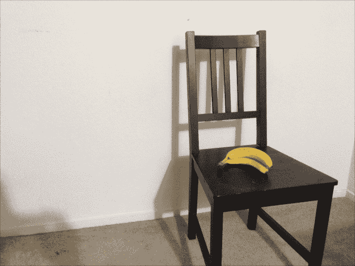

现在，如果我们从不同的角度捕捉相同的场景，它将看起来像这样：

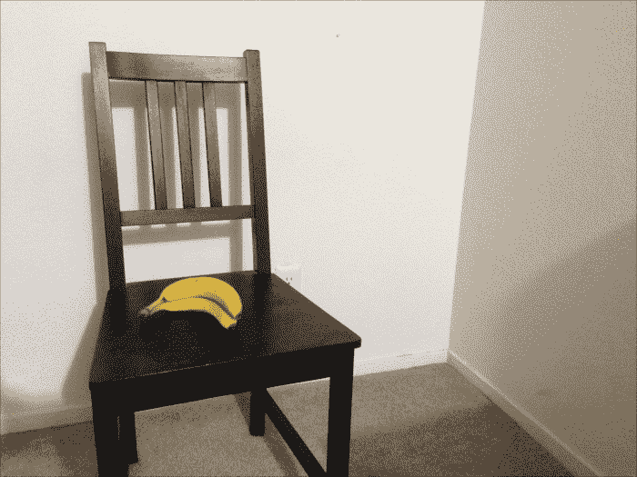

如你所见，图像中物体的位置有大量的移动。如果你考虑像素坐标，这两个图像中初始位置和最终位置的值将有很大的差异。考虑以下图像：

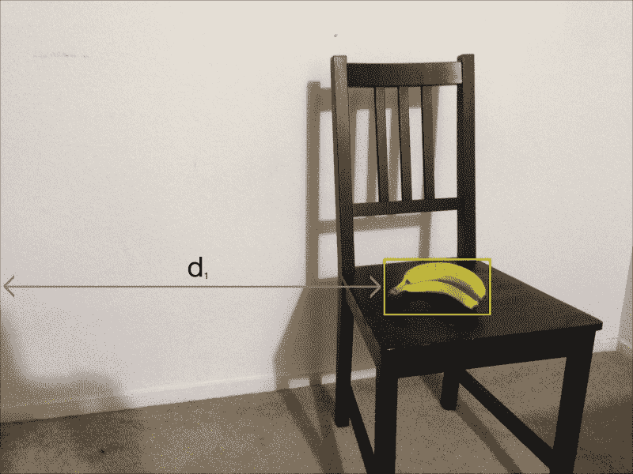

如果我们在第二张图像中考虑相同的距离线，它将看起来像这样：

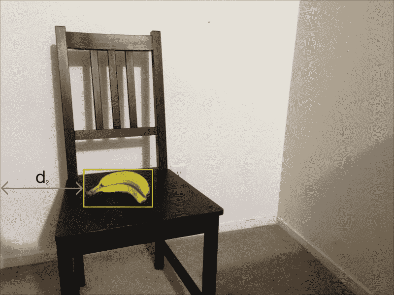

**d1** 和 **d2** 之间的差异很大。现在，让我们将盒子靠近摄像机：

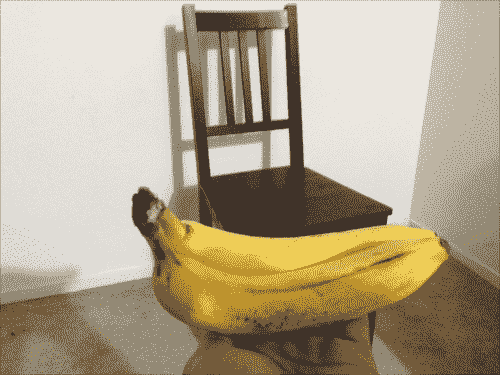

现在，让我们将摄像机移动与之前相同，并从这个角度捕捉相同的场景：

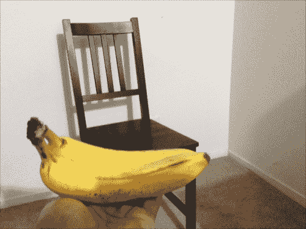

如你所见，物体位置之间的移动并不大。如果你考虑像素坐标，你会看到它们的值很接近。第一张图像中的距离将是：

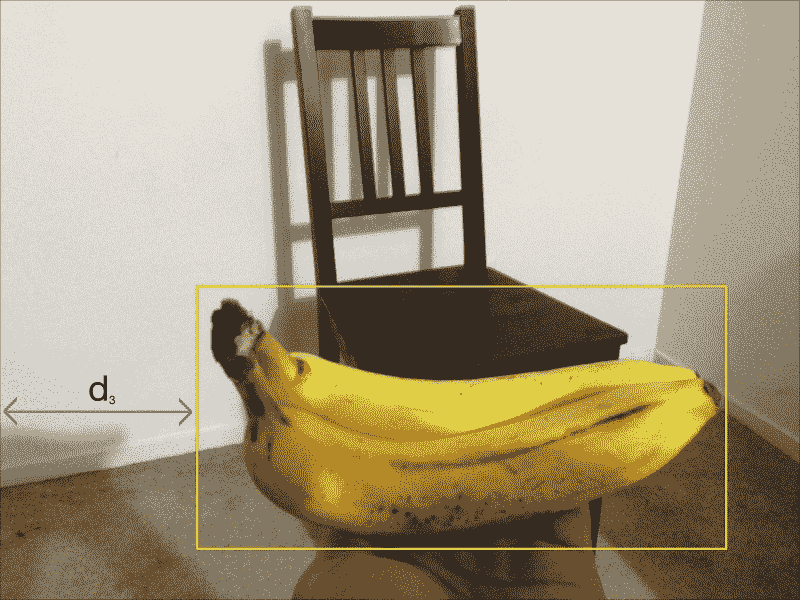

如果我们在第二张图像中考虑相同的距离线，它将如下所示：

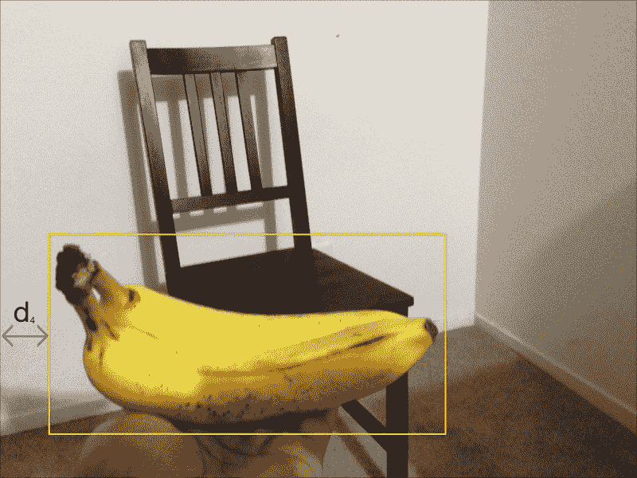

**d3** 和 **d4** 之间的差异很小。我们可以说，**d1** 和 **d2** 之间的绝对差异大于 **d3** 和 **d4** 之间的绝对差异。尽管相机移动了相同的距离，但初始位置和最终位置之间的视距差异很大。这是因为我们可以将物体移得更近；从不同角度捕捉两个图像时，视距的明显变化会减小。这是立体对应背后的概念：我们捕捉两个图像，并利用这些知识从给定的场景中提取深度信息。

# 什么是极线几何？

在讨论极线几何之前，让我们讨论一下当我们从两个不同的视角捕捉同一场景的两个图像时会发生什么。考虑以下图示：

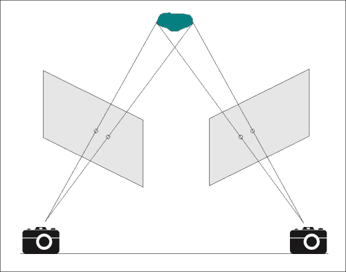

让我们看看在现实生活中它是如何发生的。考虑以下图像：

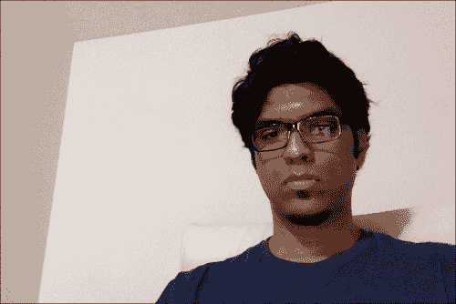

现在，让我们从不同的视角捕捉相同的场景：

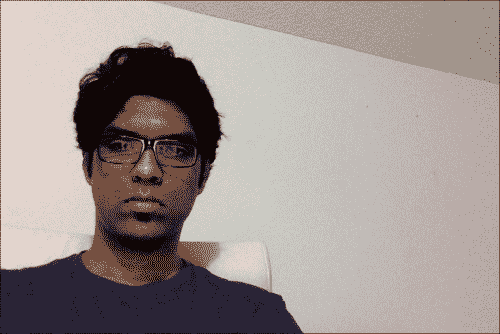

我们的目标是将这两幅图像中的关键点匹配起来，以提取场景信息。我们这样做是通过提取一个矩阵，该矩阵可以关联两个立体图像之间的对应点。这被称为 **基础矩阵**。

如我们之前在相机图示中看到的，我们可以画线来看它们在哪里相交。这些线被称为 **极线**。极线相交的点称为极点。如果你使用 SIFT 匹配关键点，并画出指向左图会合点的线条，它将看起来像这样：

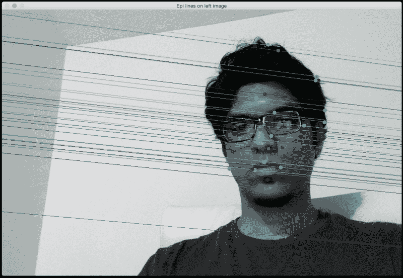

以下是在右图中的匹配特征点：

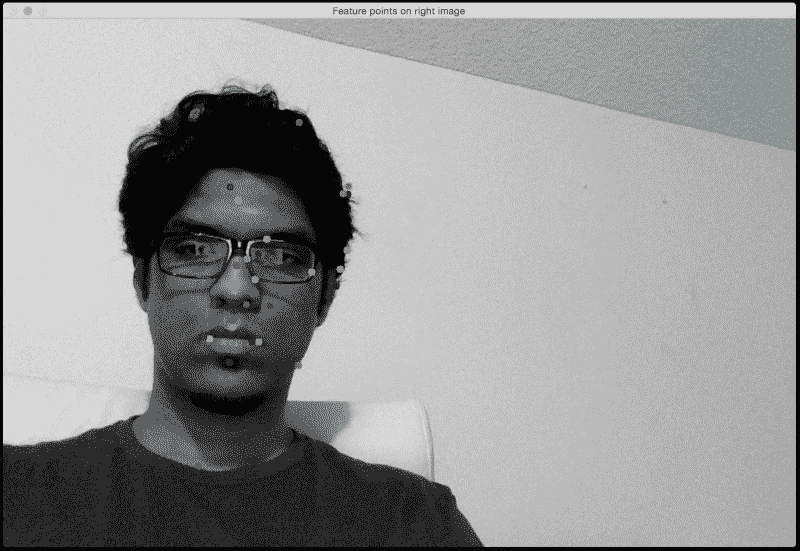

这些线条是极线。如果你以第二幅图像为参考，它们将看起来如下：

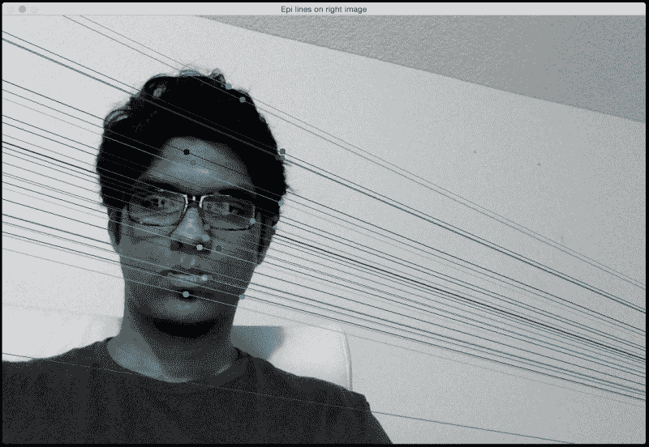

以下是在第一张图像中的匹配特征点：

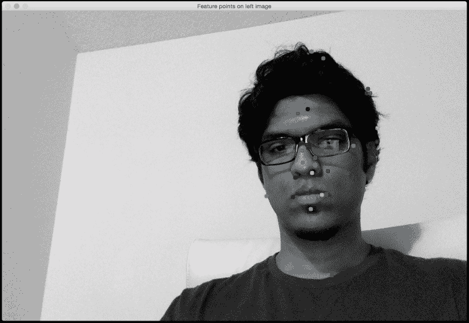

理解极线几何以及我们如何绘制这些线条非常重要。如果两个帧在三维空间中定位，那么两个帧之间的每条极线都必须与每个帧中相应的特征点和每个相机的原点相交。这可以用来估计相机相对于三维环境的姿态。我们将在稍后使用这些信息，从场景中提取三维信息。让我们看看代码：

```py
import argparse

import cv2
import numpy as np

def build_arg_parser():
    parser = argparse.ArgumentParser(description='Find fundamental matrix \
            using the two input stereo images and draw epipolar lines')
    parser.add_argument("--img-left", dest="img_left", required=True,
            help="Image captured from the left view")
    parser.add_argument("--img-right", dest="img_right", required=True,
            help="Image captured from the right view")
    parser.add_argument("--feature-type", dest="feature_type",
            required=True, help="Feature extractor that will be used; can be either 'sift' or 'surf'")
    return parser

def draw_lines(img_left, img_right, lines, pts_left, pts_right):
    h,w = img_left.shape
    img_left = cv2.cvtColor(img_left, cv2.COLOR_GRAY2BGR)
    img_right = cv2.cvtColor(img_right, cv2.COLOR_GRAY2BGR)

    for line, pt_left, pt_right in zip(lines, pts_left, pts_right):
        x_start,y_start = map(int, [0, -line[2]/line[1] ])
        x_end,y_end = map(int, [w, -(line[2]+line[0]*w)/line[1] ])
        color = tuple(np.random.randint(0,255,2).tolist())
        cv2.line(img_left, (x_start,y_start), (x_end,y_end), color,1)
        cv2.circle(img_left, tuple(pt_left), 5, color, -1)
        cv2.circle(img_right, tuple(pt_right), 5, color, -1)

    return img_left, img_right

def get_descriptors(gray_image, feature_type):
    if feature_type == 'surf':
        feature_extractor = cv2.SURF()

    elif feature_type == 'sift':
        feature_extractor = cv2.SIFT()

    else:
        raise TypeError("Invalid feature type; should be either 'surf' or 'sift'")

    keypoints, descriptors = feature_extractor.detectAndCompute(gray_image, None)
    return keypoints, descriptors

if __name__=='__main__':
    args = build_arg_parser().parse_args()
    img_left = cv2.imread(args.img_left,0)  # left image
    img_right = cv2.imread(args.img_right,0)  # right image
    feature_type = args.feature_type

    if feature_type not in ['sift', 'surf']:
        raise TypeError("Invalid feature type; has to be either 'sift' or 'surf'")

    scaling_factor = 1.0
    img_left = cv2.resize(img_left, None, fx=scaling_factor,
                fy=scaling_factor, interpolation=cv2.INTER_AREA)
    img_right = cv2.resize(img_right, None, fx=scaling_factor,
                fy=scaling_factor, interpolation=cv2.INTER_AREA)

    kps_left, des_left = get_descriptors(img_left, feature_type)
    kps_right, des_right = get_descriptors(img_right, feature_type)

    # FLANN parameters
    FLANN_INDEX_KDTREE = 0
    index_params = dict(algorithm = FLANN_INDEX_KDTREE, trees = 5)
    search_params = dict(checks=50)

    # Get the matches based on the descriptors
    flann = cv2.FlannBasedMatcher(index_params, search_params)
    matches = flann.knnMatch(des_left, des_right, k=2)

    pts_left_image = []
    pts_right_image = []

    # ratio test to retain only the good matches
    for i,(m,n) in enumerate(matches):
        if m.distance < 0.7*n.distance:
            pts_left_image.append(kps_left[m.queryIdx].pt)
            pts_right_image.append(kps_right[m.trainIdx].pt)

    pts_left_image = np.float32(pts_left_image)
    pts_right_image = np.float32(pts_right_image)
    F, mask = cv2.findFundamentalMat(pts_left_image, pts_right_image, cv2.FM_LMEDS)

    # Selecting only the inliers
    pts_left_image = pts_left_image[mask.ravel()==1]
    pts_right_image = pts_right_image[mask.ravel()==1]

    # Drawing the lines on left image and the corresponding feature points on the right image
    lines1 = cv2.computeCorrespondEpilines (pts_right_image.reshape(-1,1,2), 2, F)
    lines1 = lines1.reshape(-1,3)
    img_left_lines, img_right_pts = draw_lines(img_left, img_right, lines1, pts_left_image, pts_right_image)

    # Drawing the lines on right image and the corresponding feature points on the left image
    lines2 = cv2.computeCorrespondEpilines (pts_left_image.reshape(-1,1,2), 1,F)
    lines2 = lines2.reshape(-1,3)
    img_right_lines, img_left_pts = draw_lines(img_right, img_left, lines2, pts_right_image, pts_left_image)

    cv2.imshow('Epi lines on left image', img_left_lines)
    cv2.imshow('Feature points on right image', img_right_pts)
    cv2.imshow('Epi lines on right image', img_right_lines)
    cv2.imshow('Feature points on left image', img_left_pts)
    cv2.waitKey()
    cv2.destroyAllWindows()
```

让我们看看如果我们使用 **SURF** 特征提取器会发生什么。左图中的线条将看起来像这样：

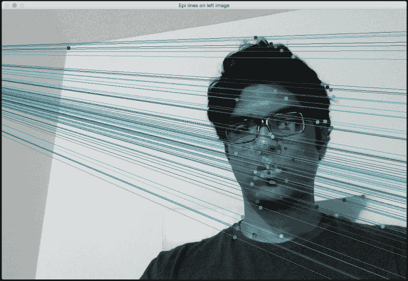

以下是在右图中的匹配特征点：

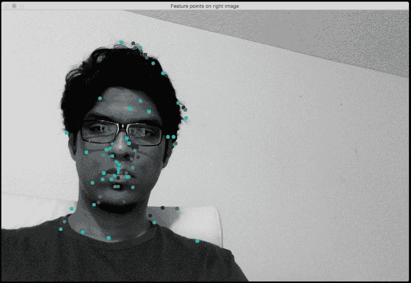

如果您以第二幅图像为参考，您将看到以下类似图像：

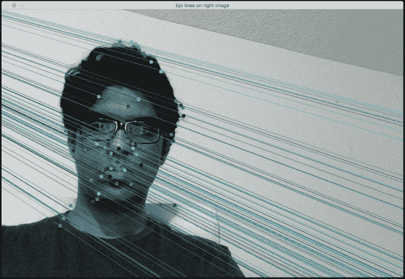

这些是第一幅图像中的匹配特征点：

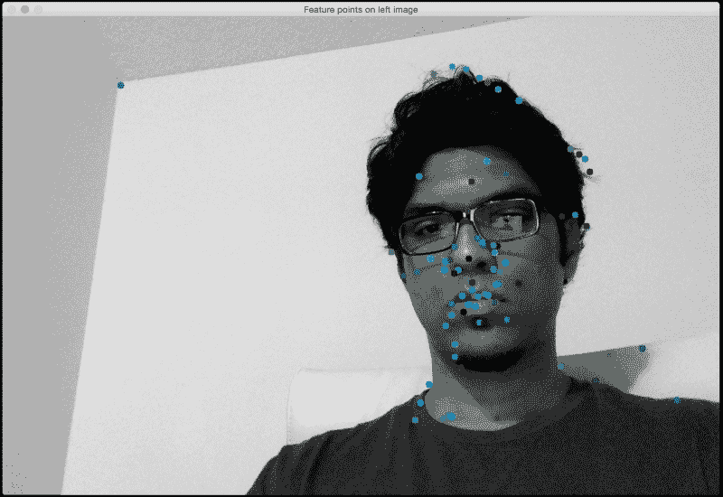

## 与 SIFT 相比，为什么线条不同？

SURF 检测到一组不同的特征点，因此相应的极线线也相应地不同。正如您在图像中看到的那样，当我们使用 SURF 时，检测到的特征点更多。由于我们比以前有更多信息，相应的极线线也会相应地改变。

# 构建 3D 地图

现在我们已经熟悉了极线几何，让我们看看如何使用它根据立体图像构建 3D 地图。让我们考虑以下图：

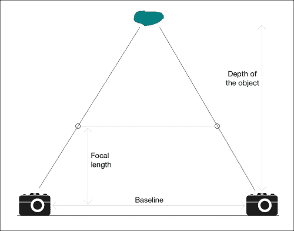

第一步是从两幅图像中提取视差图。如果您看图，当我们沿着连接线从摄像机靠近物体时，点之间的距离减小。使用这些信息，我们可以推断每个点与摄像机的距离。这被称为深度图。一旦我们在两幅图像中找到匹配点，我们就可以使用极线线来施加极线约束，从而找到视差。

让我们考虑以下图像：

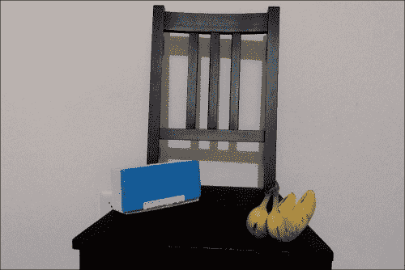

如果我们从不同的位置捕捉相同的场景，我们会得到以下图像：

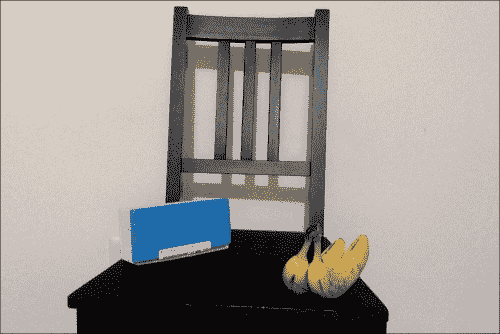

如果我们重建 3D 地图，它将看起来像这样：

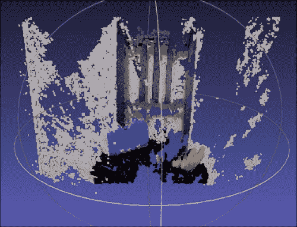

请记住，这些图像不是使用完美对齐的立体相机拍摄的。这就是 3D 地图看起来如此嘈杂的原因！这只是为了展示我们如何使用立体图像重建现实世界。让我们考虑使用正确对齐的立体相机捕获的图像对。以下为左侧视图图像：

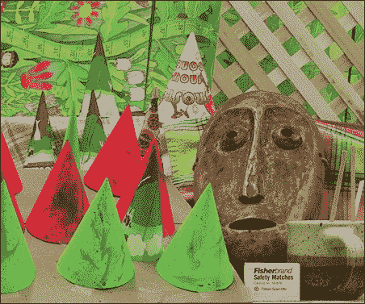

接下来是相应的右侧视图图像：

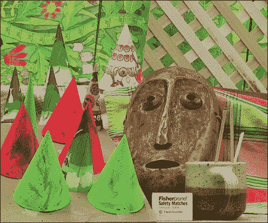

如果您提取深度信息并构建 3D 地图，它将看起来像这样：

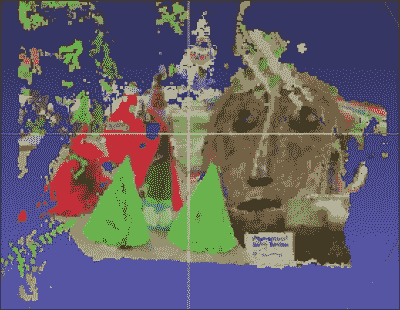

让我们旋转它，看看场景中不同物体的深度是否正确：

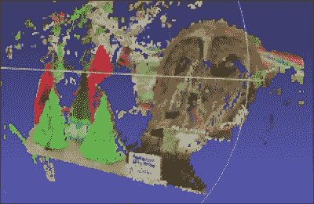

您需要一个名为**MeshLab**的软件来可视化 3D 场景。我们很快就会讨论它。正如我们在前面的图像中看到的那样，项目根据它们与摄像机的距离正确对齐。我们可以直观地看到它们以正确的方式排列，包括面具的倾斜位置。我们可以使用这项技术来构建许多有趣的东西。

让我们看看如何在 OpenCV-Python 中实现它：

```py
import argparse

import cv2
import numpy as np

def build_arg_parser():
    parser = argparse.ArgumentParser(description='Reconstruct the 3D map from \
            the two input stereo images. Output will be saved in \'output.ply\'')
    parser.add_argument("--image-left", dest="image_left", required=True,
            help="Input image captured from the left")
    parser.add_argument("--image-right", dest="image_right", required=True,
            help="Input image captured from the right")
    parser.add_argument("--output-file", dest="output_file", required=True,
            help="Output filename (without the extension) where the point cloud will be saved")
    return parser

def create_output(vertices, colors, filename):
    colors = colors.reshape(-1, 3)
    vertices = np.hstack([vertices.reshape(-1,3), colors])

    ply_header = '''ply
        format ascii 1.0
        element vertex %(vert_num)d
        property float x
        property float y
        property float z
        property uchar red
        property uchar green
        property uchar blue
        end_header
    '''

    with open(filename, 'w') as f:
        f.write(ply_header % dict(vert_num=len(vertices)))
        np.savetxt(f, vertices, '%f %f %f %d %d %d')

if __name__ == '__main__':
    args = build_arg_parser().parse_args()
    image_left = cv2.imread(args.image_left)
    image_right = cv2.imread(args.image_right)
    output_file = args.output_file + '.ply'

    if image_left.shape[0] != image_right.shape[0] or \
            image_left.shape[1] != image_right.shape[1]:
        raise TypeError("Input images must be of the same size")

    # downscale images for faster processing
    image_left = cv2.pyrDown(image_left)
    image_right = cv2.pyrDown(image_right)

    # disparity range is tuned for 'aloe' image pair
    win_size = 1
    min_disp = 16
    max_disp = min_disp * 9
    num_disp = max_disp - min_disp   # Needs to be divisible by 16
    stereo = cv2.StereoSGBM(minDisparity = min_disp,
        numDisparities = num_disp,
        SADWindowSize = win_size,
        uniquenessRatio = 10,
        speckleWindowSize = 100,
        speckleRange = 32,
        disp12MaxDiff = 1,
        P1 = 8*3*win_size**2,
        P2 = 32*3*win_size**2,
        fullDP = True
    )

    print "\nComputing the disparity map ..."
    disparity_map = stereo.compute(image_left, image_right).astype(np.float32) / 16.0

    print "\nGenerating the 3D map ..."
    h, w = image_left.shape[:2]
    focal_length = 0.8*w

    # Perspective transformation matrix
    Q = np.float32([[1, 0, 0, -w/2.0],
                    [0,-1, 0,  h/2.0],
                    [0, 0, 0, -focal_length],
                    [0, 0, 1, 0]])

    points_3D = cv2.reprojectImageTo3D(disparity_map, Q)
    colors = cv2.cvtColor(image_left, cv2.COLOR_BGR2RGB)
    mask_map = disparity_map > disparity_map.min()
    output_points = points_3D[mask_map]
    output_colors = colors[mask_map]

    print "\nCreating the output file ...\n"
    create_output(output_points, output_colors, output_file)
```

为了可视化输出，您需要从[`meshlab.sourceforge.net`](http://meshlab.sourceforge.net)下载 MeshLab。

只需使用 MeshLab 打开`output.ply`文件，你就能看到 3D 图像。你可以旋转它以获得重建场景的完整 3D 视图。MeshLab 的一些替代品包括 OS X 和 Windows 上的 Sketchup，以及 Linux 上的 Blender。

# 摘要

在本章中，我们学习了立体视觉和 3D 重建。我们讨论了如何使用不同的特征提取器提取基本矩阵。我们学习了如何生成两张图像之间的视差图，并使用它来重建给定场景的 3D 地图。

在下一章中，我们将讨论增强现实，以及我们如何构建一个酷炫的应用程序，在这个应用程序中，我们可以在实时视频上叠加图形到现实世界物体之上。
