# 第十二章 增强现实

在本章中，你将学习关于增强现实以及如何使用它来构建酷炫应用的知识。我们将讨论姿态估计和平面跟踪。你将学习如何将坐标从二维映射到三维，以及我们如何可以在实时视频上叠加图形。

到本章结束时，你将知道：

+   增强现实的前提是什么

+   姿态估计是什么

+   如何跟踪平面对象

+   如何将坐标从三维映射到二维

+   如何在实时视频上叠加图形

# 增强现实的前提是什么？

在我们跳入所有有趣的内容之前，让我们先了解什么是增强现实。你可能已经在各种背景下看到过“增强现实”这个术语被使用。因此，在我们开始讨论实现细节之前，我们应该理解增强现实的前提。增强现实指的是计算机生成的输入，如图像、声音、图形和文本，叠加在现实世界之上的叠加。

增强现实试图通过无缝融合信息和增强我们所看到和感受到的内容，来模糊现实与计算机生成内容之间的界限。实际上，它与一个称为中介现实的概念密切相关，其中计算机修改了我们对现实的看法。因此，这项技术通过增强我们对现实的当前感知来工作。现在的挑战是让用户感觉它看起来是无缝的。仅仅在输入视频上叠加一些东西很容易，但我们需要让它看起来像是视频的一部分。用户应该感觉到计算机生成的输入紧密跟随现实世界。这就是我们构建增强现实系统时想要实现的目标。

在这个背景下，计算机视觉研究探索了如何将计算机生成的图像应用于实时视频流，以便我们可以增强对现实世界的感知。增强现实技术有各种各样的应用，包括但不限于头戴式显示器、汽车、数据可视化、游戏、建筑等等。现在我们有了强大的智能手机和更智能的机器，我们可以轻松构建高端增强现实应用。

# 增强现实系统看起来是什么样的？

让我们考虑以下图示：

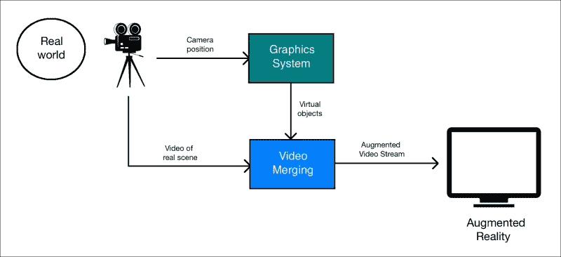

正如我们所看到的，摄像头捕捉现实世界的视频以获取参考点。图形系统生成需要叠加到视频上的虚拟对象。现在，视频合并块是所有魔法发生的地方。这个块应该足够智能，能够理解如何以最佳方式将虚拟对象叠加到现实世界之上。

# 增强现实中的几何变换

增强现实的结果令人惊叹，但下面有很多数学运算在进行。增强现实利用了很多几何变换和相关的数学函数来确保一切看起来无缝。当我们谈论增强现实的实时视频时，我们需要精确地注册虚拟物体在现实世界之上的位置。为了更好地理解，让我们把它想象成两个摄像机的对齐——一个是真实的，通过它我们看到世界，另一个是虚拟的，它投射出计算机生成的图形物体。

为了构建一个增强现实系统，需要建立以下几何变换：

+   **对象到场景**：这种变换指的是将虚拟对象的 3D 坐标转换，并在我们现实世界的场景坐标系中表达它们。这确保了我们将虚拟物体定位在正确的位置。

+   **场景到摄像机**：这种变换指的是摄像机在现实世界中的姿态。通过“姿态”，我们指的是摄像机的方向和位置。我们需要估计摄像机的视角，以便我们知道如何叠加虚拟物体。

+   **摄像机到图像**：这指的是摄像机的校准参数。这定义了我们可以如何将 3D 物体投影到 2D 图像平面上。这是我们最终将看到的图像。

考虑以下图像：

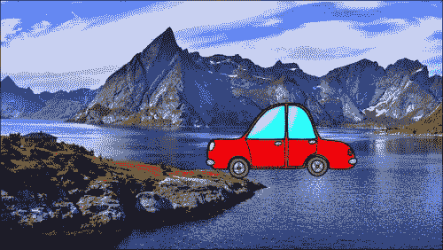

正如我们所看到的，这辆车试图适应场景，但它看起来非常不自然。如果我们不能正确转换坐标，它看起来就不自然。这就是我们之前所说的对象到场景变换！一旦我们将虚拟物体的 3D 坐标转换到现实世界的坐标系中，我们需要估计摄像机的姿态：

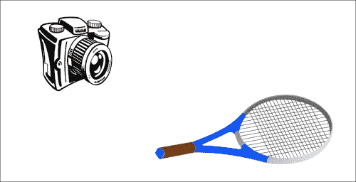

我们需要理解摄像机的位置和旋转，因为这就是用户将看到的。一旦我们估计出摄像机的姿态，我们就可以将这个 3D 场景放置到 2D 图像上。

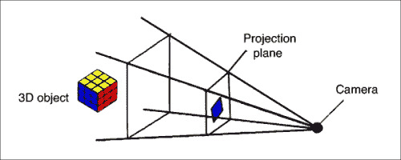

一旦我们有了这些变换，我们就可以构建完整的系统。

# 什么是姿态估计？

在我们继续之前，我们需要了解如何估计摄像机的姿态。这是增强现实系统中的一个非常关键的步骤，如果我们想要我们的体验无缝，我们必须做对。在增强现实的世界里，我们实时地在物体上叠加图形。为了做到这一点，我们需要知道摄像机的位置和方向，而且我们需要快速做到。这就是姿态估计变得非常重要的地方。如果你不能正确跟踪姿态，叠加的图形看起来就不会自然。

考虑以下图像：

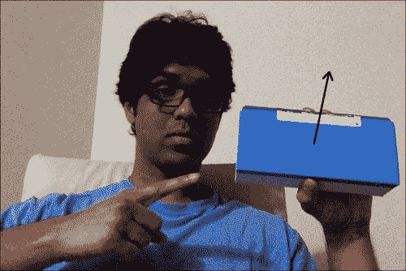

箭头线表示表面是法线。假设物体改变了其方向：

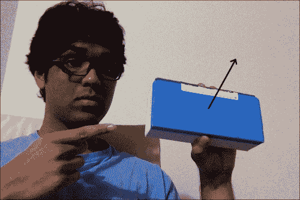

现在尽管位置相同，但方向已经改变。我们需要这个信息，以便叠加的图形看起来自然。我们需要确保它与此方向以及位置对齐。

# 如何追踪平面物体？

现在你已经理解了姿态估计是什么，让我们看看你如何可以使用它来追踪平面物体。让我们考虑以下平面物体：

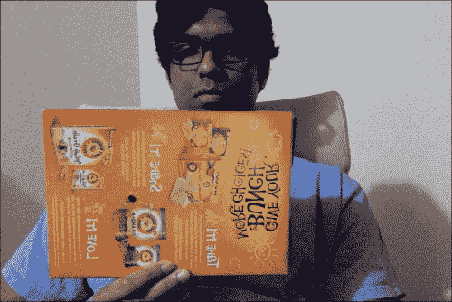

现在如果我们从这个图像中提取特征点，我们会看到类似这样的东西：

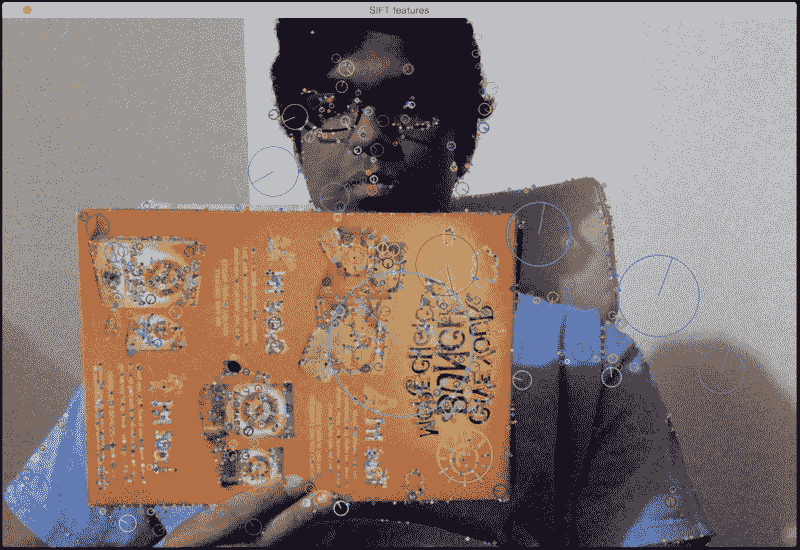

让我们倾斜纸板：

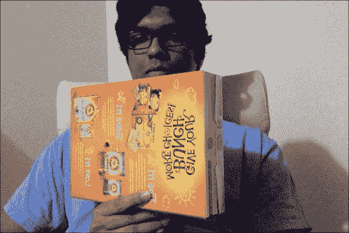

如我们所见，在这个图像中纸板是倾斜的。现在如果我们想确保我们的虚拟物体叠加在这个表面上，我们需要收集这个平面倾斜信息。一种方法是通过使用那些特征点的相对位置。如果我们从前面的图像中提取特征点，它将看起来像这样：

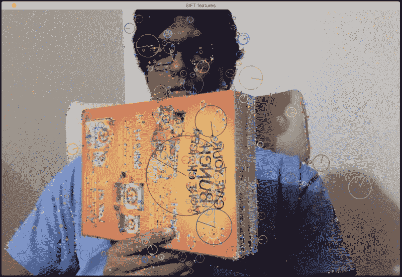

如你所见，特征点在平面的远端水平上比近端更靠近。

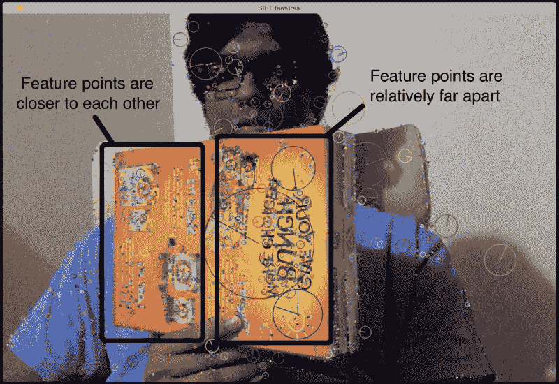

因此，我们可以利用这些信息从图像中提取方向信息。如果你还记得，我们在讨论几何变换以及全景成像时详细讨论了透视变换。我们所需做的只是使用这两组点并提取单应性矩阵。这个单应性矩阵将告诉我们纸板是如何转动的。

考虑以下图像：

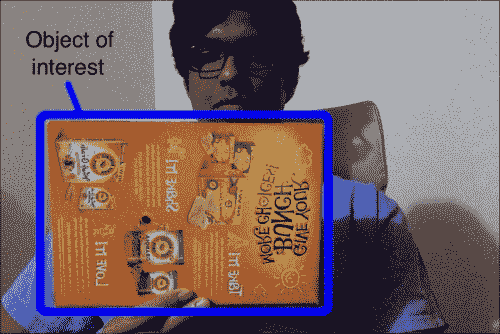

我们首先选择感兴趣的区域。

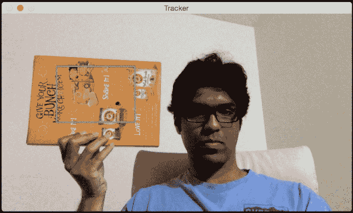

我们然后从感兴趣的区域提取特征点。由于我们正在追踪平面物体，算法假设这个感兴趣的区域是一个平面。这是显而易见的，但最好明确地说明！所以当你选择这个感兴趣的区域时，确保你手里有一张纸板。此外，如果纸板上有许多模式和独特的点，那么检测和追踪其上的特征点会更容易。

让追踪开始！我们将移动纸板来观察会发生什么：

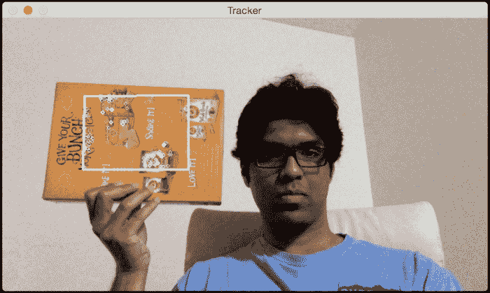

如你所见，特征点在感兴趣区域内被追踪。让我们倾斜它并看看会发生什么：

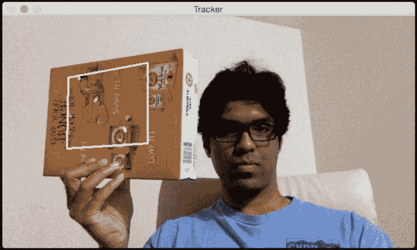

看起来特征点被正确追踪。正如我们所见，叠加的矩形根据纸板的表面改变其方向。

这里是完成这个任务的代码：

```py
import sys
from collections import namedtuple

import cv2
import numpy as np

class PoseEstimator(object):
    def __init__(self):
        # Use locality sensitive hashing algorithm
        flann_params = dict(algorithm = 6, table_number = 6,
                key_size = 12, multi_probe_level = 1)

        self.min_matches = 10
        self.cur_target = namedtuple('Current', 'image, rect, keypoints, descriptors, data')
        self.tracked_target = namedtuple('Tracked', 'target, points_prev, points_cur, H, quad')

        self.feature_detector = cv2.ORB(nfeatures=1000)
        self.feature_matcher = cv2.FlannBasedMatcher(flann_params, {})
        self.tracking_targets = []

    # Function to add a new target for tracking
    def add_target(self, image, rect, data=None):
        x_start, y_start, x_end, y_end = rect
        keypoints, descriptors = [], []
        for keypoint, descriptor in zip(*self.detect_features(image)):
            x, y = keypoint.pt
            if x_start <= x <= x_end and y_start <= y <= y_end:
                keypoints.append(keypoint)
                descriptors.append(descriptor)

        descriptors = np.array(descriptors, dtype='uint8')
        self.feature_matcher.add([descriptors])
        target = self.cur_target(image=image, rect=rect, keypoints=keypoints,
                    descriptors=descriptors, data=None)
        self.tracking_targets.append(target)

    # To get a list of detected objects
    def track_target(self, frame):
        self.cur_keypoints, self.cur_descriptors = self.detect_features(frame)
        if len(self.cur_keypoints) < self.min_matches:
            return []

        matches = self.feature_matcher.knnMatch(self.cur_descriptors, k=2)
        matches = [match[0] for match in matches if len(match) == 2 and
                    match[0].distance < match[1].distance * 0.75]
        if len(matches) < self.min_matches:
            return []

        matches_using_index = [[] for _ in xrange(len(self.tracking_targets))]
        for match in matches:
            matches_using_index[match.imgIdx].append(match)

        tracked = []
        for image_index, matches in enumerate(matches_using_index):
            if len(matches) < self.min_matches:
                continue

            target = self.tracking_targets[image_index]
            points_prev = [target.keypoints[m.trainIdx].pt for m in matches]
            points_cur = [self.cur_keypoints[m.queryIdx].pt for m in matches]
            points_prev, points_cur = np.float32((points_prev, points_cur))
            H, status = cv2.findHomography(points_prev, points_cur, cv2.RANSAC, 3.0)
            status = status.ravel() != 0
            if status.sum() < self.min_matches:
                continue

            points_prev, points_cur = points_prev[status], points_cur[status]

            x_start, y_start, x_end, y_end = target.rect
            quad = np.float32([[x_start, y_start], [x_end, y_start], [x_end, y_end], [x_start, y_end]])
            quad = cv2.perspectiveTransform(quad.reshape(1, -1, 2), H).reshape(-1, 2)

            track = self.tracked_target(target=target, points_prev=points_prev,
                        points_cur=points_cur, H=H, quad=quad)
            tracked.append(track)

        tracked.sort(key = lambda x: len(x.points_prev), reverse=True)
        return tracked

    # Detect features in the selected ROIs and return the keypoints and descriptors
    def detect_features(self, frame):
        keypoints, descriptors = self.feature_detector.detectAndCompute(frame, None)
        if descriptors is None:
            descriptors = []

        return keypoints, descriptors

    # Function to clear all the existing targets
    def clear_targets(self):
        self.feature_matcher.clear()
        self.tracking_targets = []

class VideoHandler(object):
    def __init__(self):
        self.cap = cv2.VideoCapture(0)
        self.paused = False
        self.frame = None
        self.pose_tracker = PoseEstimator()

        cv2.namedWindow('Tracker')
        self.roi_selector = ROISelector('Tracker', self.on_rect)

    def on_rect(self, rect):
        self.pose_tracker.add_target(self.frame, rect)

    def start(self):
        while True:
            is_running = not self.paused and self.roi_selector.selected_rect is None

            if is_running or self.frame is None:
                ret, frame = self.cap.read()
                scaling_factor = 0.5
                frame = cv2.resize(frame, None, fx=scaling_factor, fy=scaling_factor,
                        interpolation=cv2.INTER_AREA)
                if not ret:
                    break

                self.frame = frame.copy()

            img = self.frame.copy()
            if is_running:
                tracked = self.pose_tracker.track_target(self.frame)
                for item in tracked:
                    cv2.polylines(img, [np.int32(item.quad)], True, (255, 255, 255), 2)
                    for (x, y) in np.int32(item.points_cur):
                        cv2.circle(img, (x, y), 2, (255, 255, 255))

            self.roi_selector.draw_rect(img)
            cv2.imshow('Tracker', img)
            ch = cv2.waitKey(1)
            if ch == ord(' '):
                self.paused = not self.paused
            if ch == ord('c'):
                self.pose_tracker.clear_targets()
            if ch == 27:
                break

class ROISelector(object):
    def __init__(self, win_name, callback_func):
        self.win_name = win_name
        self.callback_func = callback_func
        cv2.setMouseCallback(self.win_name, self.on_mouse_event)
        self.selection_start = None
        self.selected_rect = None

    def on_mouse_event(self, event, x, y, flags, param):
        if event == cv2.EVENT_LBUTTONDOWN:
            self.selection_start = (x, y)

        if self.selection_start:
            if flags & cv2.EVENT_FLAG_LBUTTON:
                x_orig, y_orig = self.selection_start
                x_start, y_start = np.minimum([x_orig, y_orig], [x, y])
                x_end, y_end = np.maximum([x_orig, y_orig], [x, y])
                self.selected_rect = None
                if x_end > x_start and y_end > y_start:
                    self.selected_rect = (x_start, y_start, x_end, y_end)
            else:
                rect = self.selected_rect
                self.selection_start = None
                self.selected_rect = None
                if rect:
                    self.callback_func(rect)

    def draw_rect(self, img):
        if not self.selected_rect:
            return False

        x_start, y_start, x_end, y_end = self.selected_rect
        cv2.rectangle(img, (x_start, y_start), (x_end, y_end), (0, 255, 0), 2)
        return True

if __name__ == '__main__':
    VideoHandler().start()
```

## 代码内部发生了什么？

首先，我们有一个`PoseEstimator`类，它在这里做了所有繁重的工作。我们需要某种东西来检测图像中的特征，以及某种东西来匹配连续图像之间的特征。因此，我们使用了 ORB 特征检测器和 Flann 特征匹配器。正如我们所见，我们在构造函数中用这些参数初始化了类。

每当我们选择一个感兴趣的区域时，我们就调用`add_target`方法将其添加到我们的跟踪目标列表中。这个方法只是从感兴趣的区域中提取特征并存储在类的一个变量中。现在我们有了目标，我们就可以准备跟踪它了！

`track_target`方法处理所有的跟踪。我们取当前帧并提取所有的关键点。然而，我们并不真正对视频当前帧中的所有关键点感兴趣。我们只想找到属于我们的目标物体的关键点。所以现在，我们的任务是找到当前帧中最接近的关键点。

现在我们有了当前帧中的一组关键点，我们还从前一帧的目标物体中得到了另一组关键点。下一步是从这些匹配点中提取单应性矩阵。这个单应性矩阵告诉我们如何变换叠加的矩形，使其与纸板表面对齐。我们只需要将这个单应性矩阵应用到叠加的矩形上，以获得所有点的新的位置。

# 如何增强我们的现实？

既然我们已经知道了如何跟踪平面物体，让我们看看如何将 3D 物体叠加到现实世界之上。这些物体是 3D 的，但屏幕上的视频是 2D 的。所以这里的第一个步骤是理解如何将这些 3D 物体映射到 2D 表面上，使其看起来更真实。我们只需要将这些 3D 点投影到平面表面上。

## 从 3D 到 2D 的坐标映射

一旦我们估计了姿态，我们就将点从 3D 投影到 2D。考虑以下图像：

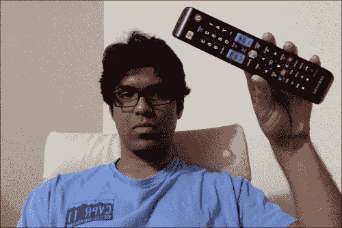

正如我们在这里看到的，电视遥控器是一个 3D 物体，但我们看到的是它在 2D 平面上。现在如果我们移动它，它看起来会是这样：

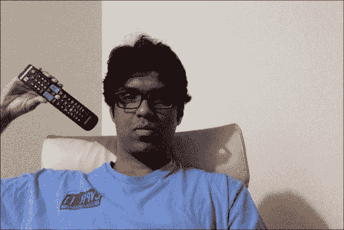

这个 3D 物体仍然在 2D 平面上。物体移动到了不同的位置，并且与摄像机的距离也发生了变化。我们如何计算这些坐标？我们需要一个机制将这个 3D 物体映射到 2D 表面上。这就是 3D 到 2D 投影变得非常重要的地方。

我们只需要估计初始相机姿态来开始。现在，假设相机的内在参数已经知道。因此，我们可以直接使用 OpenCV 中的 `solvePnP` 函数来估计相机的姿态。这个函数用于使用一组点来估计物体的姿态。你可以在[`docs.opencv.org/modules/calib3d/doc/camera_calibration_and_3d_reconstruction.html#bool solvePnP(InputArray objectPoints, InputArray imagePoints, InputArray cameraMatrix, InputArray distCoeffs, OutputArray rvec, OutputArray tvec, bool useExtrinsicGuess, int flags)`](http://docs.opencv.org/modules/calib3d/doc/camera_calibration_and_3d_reconstruction.html#bool%20solvePnP(InputArray%20objectPoints,%20InputArray%20imagePoints,%20InputArray%20cameraMatrix,%20InputArray%20distCoeffs,%20OutputArray%20rvec,%20OutputArray%20tvec,%20bool%20useExtrinsicGuess,%20int%20flags))中了解更多信息。一旦我们这样做，我们需要将这些点投影到 2D 平面上。我们使用 OpenCV 函数 `projectPoints` 来完成这个任务。这个函数计算那些 3D 点在 2D 平面上的投影。

## 如何在视频中叠加 3D 对象？

现在我们有了所有不同的模块，我们准备构建最终的系统。假设我们想在纸箱上叠加一个金字塔，就像这里展示的那样：

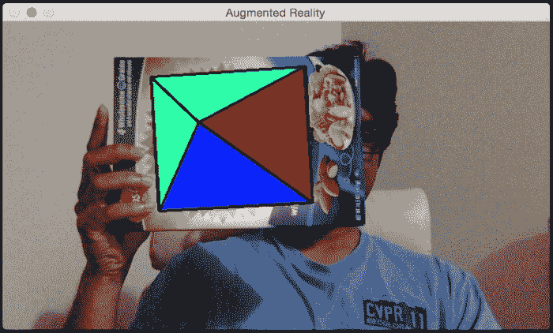

让我们倾斜纸箱来看看会发生什么：

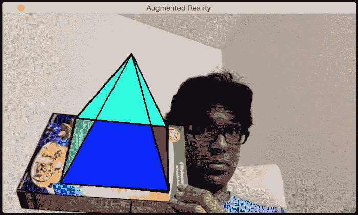

看起来金字塔正在跟随表面。让我们添加第二个目标：

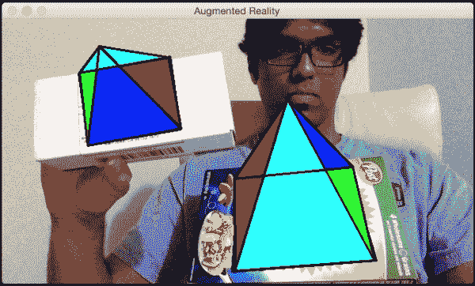

你可以继续添加更多目标，所有这些金字塔都将被很好地跟踪。让我们看看如何使用 OpenCV Python 来实现这一点。确保将之前的文件保存为 `pose_estimation.py`，因为我们将从那里导入几个类：

```py
import cv2
import numpy as np

from pose_estimation import PoseEstimator, ROISelector

class Tracker(object):
    def __init__(self):
        self.cap = cv2.VideoCapture(0)
        self.frame = None
        self.paused = False
        self.tracker = PoseEstimator()

        cv2.namedWindow('Augmented Reality')
        self.roi_selector = ROISelector('Augmented Reality', self.on_rect)

        self.overlay_vertices = np.float32([[0, 0, 0], [0, 1, 0], [1, 1, 0], [1, 0, 0],
                               [0.5, 0.5, 4]])
        self.overlay_edges = [(0, 1), (1, 2), (2, 3), (3, 0),
                    (0,4), (1,4), (2,4), (3,4)]
        self.color_base = (0, 255, 0)
        self.color_lines = (0, 0, 0)

    def on_rect(self, rect):
        self.tracker.add_target(self.frame, rect)

    def start(self):
        while True:
            is_running = not self.paused and self.roi_selector.selected_rect is None
            if is_running or self.frame is None:
                ret, frame = self.cap.read()
                scaling_factor = 0.5
                frame = cv2.resize(frame, None, fx=scaling_factor, fy=scaling_factor,
                        interpolation=cv2.INTER_AREA)
                if not ret:
                    break

                self.frame = frame.copy()

            img = self.frame.copy()
            if is_running:
                tracked = self.tracker.track_target(self.frame)
                for item in tracked:
                    cv2.polylines(img, [np.int32(item.quad)], True, self.color_lines, 2)
                    for (x, y) in np.int32(item.points_cur):
                        cv2.circle(img, (x, y), 2, self.color_lines)

                    self.overlay_graphics(img, item)

            self.roi_selector.draw_rect(img)
            cv2.imshow('Augmented Reality', img)
            ch = cv2.waitKey(1)
            if ch == ord(' '):
                self.paused = not self.paused
            if ch == ord('c'):
                self.tracker.clear_targets()
            if ch == 27:
                break

    def overlay_graphics(self, img, tracked):
        x_start, y_start, x_end, y_end = tracked.target.rect
        quad_3d = np.float32([[x_start, y_start, 0], [x_end, y_start, 0],
                    [x_end, y_end, 0], [x_start, y_end, 0]])
        h, w = img.shape[:2]
        K = np.float64([[w, 0, 0.5*(w-1)],
                        [0, w, 0.5*(h-1)],
                        [0, 0, 1.0]])
        dist_coef = np.zeros(4)
        ret, rvec, tvec = cv2.solvePnP(quad_3d, tracked.quad, K, dist_coef)
        verts = self.overlay_vertices * [(x_end-x_start), (y_end-y_start),
                    -(x_end-x_start)*0.3] + (x_start, y_start, 0)
        verts = cv2.projectPoints(verts, rvec, tvec, K, dist_coef)[0].reshape(-1, 2)

        verts_floor = np.int32(verts).reshape(-1,2)
        cv2.drawContours(img, [verts_floor[:4]], -1, self.color_base, -3)
        cv2.drawContours(img, [np.vstack((verts_floor[:2], verts_floor[4:5]))],
                    -1, (0,255,0), -3)
        cv2.drawContours(img, [np.vstack((verts_floor[1:3], verts_floor[4:5]))],
                    -1, (255,0,0), -3)
        cv2.drawContours(img, [np.vstack((verts_floor[2:4], verts_floor[4:5]))],
                    -1, (0,0,150), -3)
        cv2.drawContours(img, [np.vstack((verts_floor[3:4], verts_floor[0:1],
                    verts_floor[4:5]))], -1, (255,255,0), -3)

        for i, j in self.overlay_edges:
            (x_start, y_start), (x_end, y_end) = verts[i], verts[j]
            cv2.line(img, (int(x_start), int(y_start)), (int(x_end), int(y_end)), self.color_lines, 2)

if __name__ == '__main__':
    Tracker().start()
```

## 让我们看看代码

`Tracker` 类用于执行这里的所有计算。我们使用通过边和顶点定义的金字塔结构初始化该类。我们用于跟踪表面的逻辑与之前讨论的相同，因为我们使用的是同一个类。我们只需要使用 `solvePnP` 和 `projectPoints` 来将 3D 金字塔映射到 2D 表面上。

# 让我们添加一些动作

现在我们知道了如何添加一个虚拟金字塔，让我们看看是否可以添加一些动作。让我们看看如何动态地改变金字塔的高度。当你开始时，金字塔看起来会是这样：

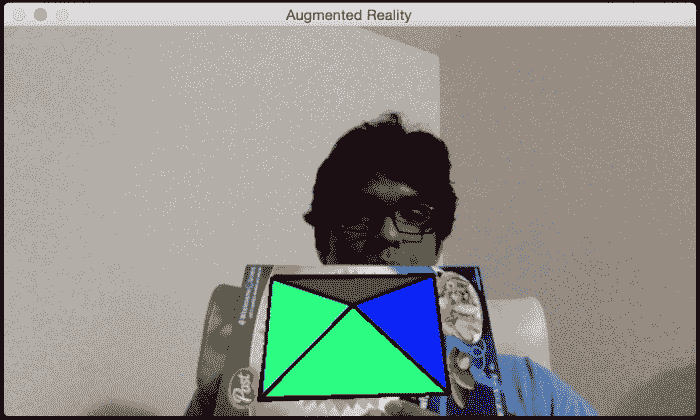

如果你等待一段时间，金字塔会变高，看起来会是这样：

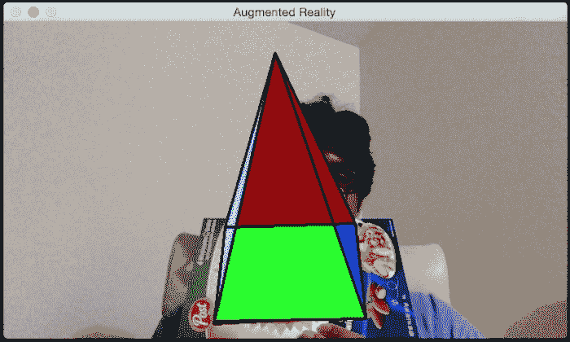

让我们看看如何在 OpenCV Python 中实现它。在我们刚刚讨论的增强现实代码中，在 `Tracker` 类的 `__init__` 方法末尾添加以下片段：

```py
self.overlay_vertices = np.float32([[0, 0, 0], [0, 1, 0], [1, 1, 0], [1, 0, 0], [0.5, 0.5, 4]])
self.overlay_edges = [(0, 1), (1, 2), (2, 3), (3, 0),
            (0,4), (1,4), (2,4), (3,4)]
self.color_base = (0, 255, 0)
self.color_lines = (0, 0, 0)

self.graphics_counter = 0
self.time_counter = 0
```

现在我们有了结构，我们需要添加代码来动态地改变高度。用以下方法替换 `overlay_graphics()` 方法：

```py
def overlay_graphics(self, img, tracked):
    x_start, y_start, x_end, y_end = tracked.target.rect
    quad_3d = np.float32([[x_start, y_start, 0], [x_end, y_start, 0],
                [x_end, y_end, 0], [x_start, y_end, 0]])
    h, w = img.shape[:2]
    K = np.float64([[w, 0, 0.5*(w-1)],
                    [0, w, 0.5*(h-1)],
                    [0, 0, 1.0]])
    dist_coef = np.zeros(4)
    ret, rvec, tvec = cv2.solvePnP(quad_3d, tracked.quad, K, dist_coef)

    self.time_counter += 1
    if not self.time_counter % 20:
        self.graphics_counter = (self.graphics_counter + 1) % 8

    self.overlay_vertices = np.float32([[0, 0, 0], [0, 1, 0], [1, 1, 0], [1, 0, 0],
                           [0.5, 0.5, self.graphics_counter]])

    verts = self.overlay_vertices * [(x_end-x_start), (y_end-y_start),
                -(x_end-x_start)*0.3] + (x_start, y_start, 0)
    verts = cv2.projectPoints(verts, rvec, tvec, K, dist_coef)[0].reshape(-1, 2)

    verts_floor = np.int32(verts).reshape(-1,2)
    cv2.drawContours(img, [verts_floor[:4]], -1, self.color_base, -3)
    cv2.drawContours(img, [np.vstack((verts_floor[:2], verts_floor[4:5]))],
                -1, (0,255,0), -3)
    cv2.drawContours(img, [np.vstack((verts_floor[1:3], verts_floor[4:5]))],
                -1, (255,0,0), -3)
    cv2.drawContours(img, [np.vstack((verts_floor[2:4], verts_floor[4:5]))],
                -1, (0,0,150), -3)
    cv2.drawContours(img, [np.vstack((verts_floor[3:4], verts_floor[0:1],
                verts_floor[4:5]))], -1, (255,255,0), -3)

    for i, j in self.overlay_edges:
        (x_start, y_start), (x_end, y_end) = verts[i], verts[j]
        cv2.line(img, (int(x_start), int(y_start)), (int(x_end), int(y_end)), self.color_lines, 2)
```

现在我们知道了如何改变高度，让我们继续让金字塔为我们跳舞。我们可以让金字塔的尖端以优雅的周期性方式振荡。所以当你开始时，它将看起来像这样：

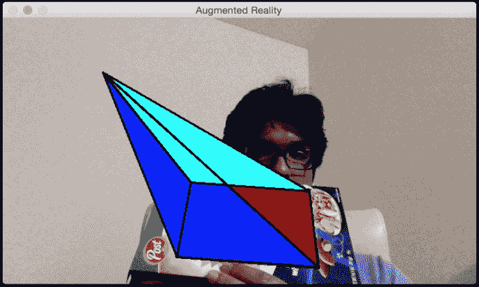

如果你等待一段时间，它将看起来像这样：

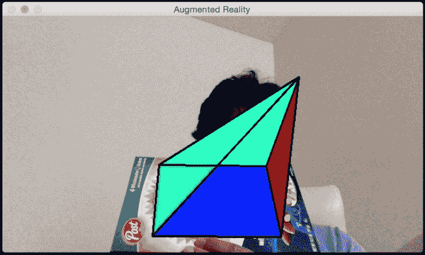

你可以查看`augmented_reality_motion.py`以了解实现细节。

在我们的下一个实验中，我们将使整个金字塔围绕感兴趣的区域移动。我们可以让它以任何我们想要的方式移动。让我们先从在所选感兴趣区域添加线性对角线运动开始。当你开始时，它将看起来像这样：

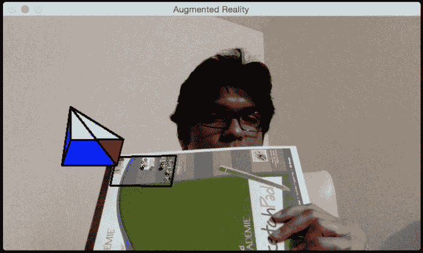

经过一段时间，它将看起来像这样：

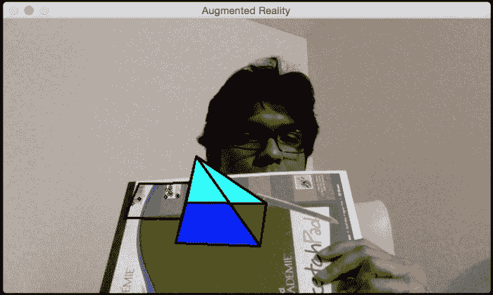

参考到`augmented_reality_dancing.py`来了解如何更改`overlay_graphics()`方法以使其跳舞。让我们看看我们能否让金字塔围绕我们的感兴趣区域旋转。当你开始时，它将看起来像这样：

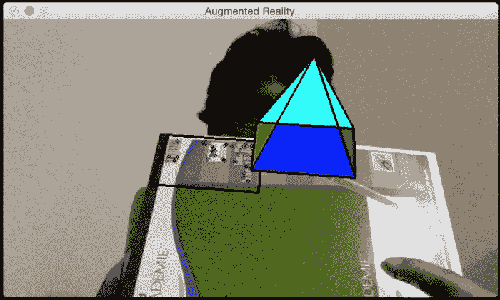

经过一段时间，它将移动到新的位置：

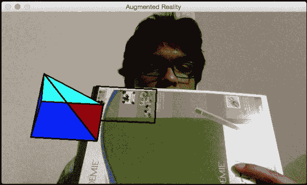

你可以参考`augmented_reality_circular_motion.py`来了解如何实现这一点。你可以让它做任何你想做的事情。你只需要想出正确的数学公式，金字塔就会真的按照你的旋律跳舞！你还可以尝试其他虚拟物体，看看你能用它做什么。你可以用很多不同的物体做很多事情。这些例子提供了一个很好的参考点，在此基础上，你可以构建许多有趣的增强现实应用。

# 摘要

在本章中，你了解了增强现实的前提，并了解了增强现实系统看起来是什么样子。我们讨论了增强现实所需的几何变换。你学习了如何使用这些变换来估计相机姿态。你学习了如何跟踪平面物体。我们讨论了如何在现实世界之上添加虚拟物体。你学习了如何以不同的方式修改虚拟物体以添加酷炫效果。记住，计算机视觉的世界充满了无限的可能性！这本书旨在教你开始各种项目所需的必要技能。现在，取决于你和你自己的想象力，使用你在这里获得的技能来构建一些独特且有趣的东西。
