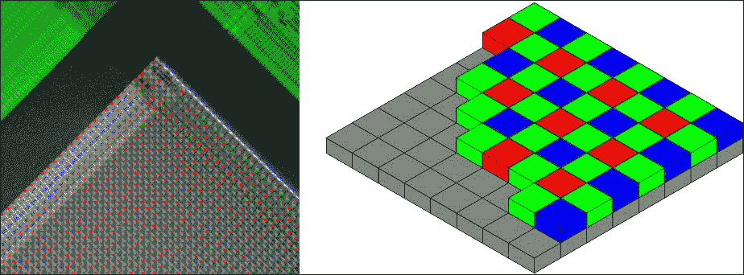

# 第一章. 充分利用您的相机系统

克劳德·莫奈，法国印象派绘画的创始人之一，教导他的学生只画他们**看到**的，而不是他们**知道**的。他甚至走得更远，说：

> “我希望我生来就是盲人，然后突然恢复视力，这样我就可以在不知道面前看到的是什么物体的情况下开始绘画。”

莫奈拒绝传统的艺术主题，这些主题往往具有神秘、英雄、军事或革命性质。相反，他依靠自己对中产阶级生活的观察：社会远足；阳光明媚的花园、池塘、河流和海滨；雾蒙蒙的林荫大道和火车站；以及私人损失。他带着深深的悲伤告诉他的朋友，乔治·克雷孟梭（未来的法国总统）：

> “有一天，我发现自己在看着我最爱的妻子的死人脸，然后系统地根据自动反射来记录颜色！”

莫奈根据他个人的印象画了一切。晚年，他甚至画出了自己视力衰退的症状。当他患有白内障时，他采用了红色调色板，而在白内障手术后，由于他的眼睛对光更敏感，可能接近紫外范围，他采用了明亮的蓝色调色板。

就像莫奈的学生一样，我们作为计算机视觉学者必须面对**看到**和**知道**之间的区别，以及输入和处理之间的区别。光、镜头、相机和数字成像管道可以赋予计算机一种**视觉**感。从产生的图像数据中，**机器学习（ML）**算法可以提取**知识**或者至少是一套元感知，如检测、识别和重建（扫描）。如果没有适当的感觉或数据，系统的学习潜力将受到限制，甚至可能是零。因此，在设计任何计算机视觉系统时，我们必须考虑照明条件、镜头、相机和成像管道的基础要求。

为了清晰地看到某个特定对象，我们需要什么？这是我们第一章的核心问题。在这个过程中，我们将解决五个子问题：

+   我们需要什么才能看到快速运动或光的变化？

+   我们需要什么才能看到远处的物体？

+   我们需要什么才能拥有深度感知？

+   我们在黑暗中需要看到什么？

+   在购买镜头和相机时，我们如何获得物有所值？

### 小贴士

对于许多计算机视觉的实际应用，环境并不是一个光线充足、白色的房间，而且主题也不是距离 0.6 米（2 英尺）的人脸！

硬件的选择对这些问题至关重要。不同的相机和镜头针对不同的成像场景进行了优化。然而，软件也可以决定解决方案的成功或失败。在软件方面，我们将关注 OpenCV 的高效使用。幸运的是，OpenCV 的**videoio**模块支持许多类型的相机系统，包括以下几种：

+   在 Windows，Mac 和 Linux 中通过以下框架使用网络摄像头，这些框架是大多数操作系统版本的标准部分：

    +   **Windows**: Microsoft Media Foundation (MSMF), DirectShow 或 Video for Windows (VfW)

    +   **Mac**: QuickTime

    +   **Linux**: Video4Linux (V4L), Video4Linux2 (V4L2), 或 libv4l

+   iOS 和 Android 设备中的内置摄像头

+   通过 OpenNI 或 OpenNI2 兼容的深度相机，OpenNI 和 OpenNI2 是在 Apache 许可证下开源的

+   通过专有的 Intel Perceptual Computing SDK 使用其他深度相机

+   通过 libgphoto2 使用照相机，libgphoto2 是在 GPL 许可证下开源的。有关 libgphoto2 支持的照相机列表，请参阅[`gphoto.org/proj/libgphoto2/support.php`](http://gphoto.org/proj/libgphoto2/support.php)。

    ### 注意

    注意，GPL 许可证不适用于闭源软件的使用。

+   通过 libdc1394 兼容的 IIDC/DCAM 工业相机，libdc1394 是在 LGPLv2 许可证下开源的

+   对于 Linux，unicap 可以用作 IIDC/DCAM 兼容相机的替代接口，但 unicap 是 GPL 许可证，因此不适用于闭源软件。

+   其他工业相机通过以下专有框架：

    +   Allied Vision Technologies (AVT) PvAPI 用于 GigE Vision 相机

    +   Smartek Vision Giganetix SDK 用于 GigE Vision 相机

    +   XIMEA API

### 注意

OpenCV 3 中的 videoio 模块是新的。在 OpenCV 2 中，视频捕获和录制是 highgui 模块的一部分，但在 OpenCV 3 中，highgui 模块仅负责 GUI 功能。有关 OpenCV 模块的完整索引，请参阅官方文档[`docs.opencv.org/3.0.0/`](http://docs.opencv.org/3.0.0/)。

然而，我们不仅限于 videoio 模块的功能；我们可以使用其他 API 来配置相机和捕获图像。如果一个 API 可以捕获图像数据数组，OpenCV 可以轻松地使用这些数据，通常无需任何复制操作或转换。例如，我们将通过 OpenNI2（无需 videoio 模块）捕获和使用深度相机的图像，以及通过 Point Grey Research (PGR)的 FlyCapture SDK 捕获工业相机的图像。

### 注意

工业相机或**机器视觉相机**通常具有可互换的镜头，高速硬件接口（例如 FireWire，千兆以太网，USB 3.0 或 Camera Link），以及所有相机设置的完整编程接口。

大多数工业相机都为 Windows 和 Linux 提供 SDK。PGR 的 FlyCapture SDK 支持 Windows 上的单相机和多相机设置，以及 Linux 上的单相机设置。PGR 的一些竞争对手，如 Allied Vision Technologies (AVT)，在 Linux 上提供更好的多相机设置支持。

我们将学习不同类别相机之间的差异，并将测试几种特定镜头、相机和配置的能力。到本章结束时，你将更有资格为自己、实验室、公司或客户设计消费级或工业级视觉系统。我希望通过每个价格点的可能结果来让你感到惊讶！

# 调色光

人类眼睛对某些电磁辐射的波长很敏感。我们把这些波长称为“可见光”、“颜色”，有时也只称为“光”。然而，我们对“可见光”的定义是以人为中心的，因为不同的动物看到不同的波长。例如，蜜蜂对红光视而不见，但可以看到紫外线（这对人类来说是不可见的）。此外，机器可以根据几乎任何刺激（如光、辐射、声音或磁性）组装出人类可见的图像。为了拓宽我们的视野，让我们考虑八种电磁辐射及其常见来源。以下是按波长递减顺序的列表：

+   **无线电波** 来自某些天体和闪电。它们也由无线电子设备（无线电、Wi-Fi、蓝牙等）产生。

+   **微波** 从大爆炸辐射出来，作为宇宙中的背景辐射存在。微波炉也能产生微波。

+   **远红外线 (FIR) 光** 是来自温暖或热物体（如热血动物和热水管）的无形光芒。

+   **近红外线 (NIR) 光** 从我们的太阳、火焰和红热或几乎红热的金属中明亮地辐射出来。然而，它在常见的电照明中是一个相对较弱的组成部分。叶子和其他植被会明亮地反射 NIR 光。皮肤和某些织物对 NIR 稍微透明。

+   **可见光** 从我们的太阳和常见的电光源中明亮地辐射出来。可见光包括红、橙、黄、绿、蓝和紫（按波长递减的顺序）。

+   **紫外线 (UV) 光** 在阳光下也很丰富。在晴朗的日子里，紫外线可以烧伤我们的皮肤，并且可以以远处的蓝灰色雾霾的形式对我们稍微可见。常见的硅酸盐玻璃对紫外线几乎是透明的，所以我们站在窗户后面（室内或车内）时不会晒伤。同样地，紫外线相机系统依赖于由非硅酸盐材料（如石英）制成的镜头。许多花朵上有紫外线标记，这些标记对昆虫来说是可见的。某些体液（如血液和尿液）对紫外线的透明度比对可见光的透明度更高。

+   **X 射线** 来自某些天体，如黑洞。在地球上，氡气和某些其他放射性元素是自然的 X 射线来源。

+   **伽马射线** 来自核爆炸，包括超新星爆炸。伽马射线的一些来源还包括放射性衰变和闪电。

美国国家航空航天局提供了以下与每种光线或辐射相关的波长和温度的视觉表示：


**被动**成像系统依赖于前面所述的**环境**（常见）光线或辐射源。**主动**成像系统包括自己的光源，这样光线或辐射可以以更可预测的方式**结构化**。例如，一个主动夜视仪可能使用一个近红外线相机和一个近红外线光源。

对于天文学，被动成像在整个电磁谱上都是可行的；浩瀚的宇宙充满了来自新旧来源的各种光线和辐射。然而，对于地球（地面）用途，被动成像主要限于远红外线、近红外线、可见光和紫外线范围。主动成像在整个谱上都是可行的，但功耗、安全性和干扰（在我们的用例与其他用例之间）的实用性限制了我们可以将过多的光线和辐射倾注到环境中的程度。

不论是主动还是被动，成像系统通常使用镜头将光线或辐射聚焦到相机传感器的表面。镜头及其涂层会传输某些波长的光线，同时阻挡其他波长的光线。可以在镜头或传感器前面放置额外的滤光片以阻挡更多波长的光线。最后，传感器本身表现出变化的**光谱响应**，这意味着对于某些波长的光线，传感器会记录一个强烈的（明亮）信号，而对于其他波长的光线，则记录一个微弱的（暗淡）信号或没有信号。通常，大规模生产的数字传感器对绿色的响应最强，其次是红色、蓝色和近红外线。根据使用情况，这样的传感器可能会配备一个滤光片来阻挡一定范围内的光线（无论是近红外线还是可见光）以及/或一个滤光片来叠加不同颜色的图案。后者允许捕获多通道图像，如 RGB 图像，而未过滤的传感器将捕获**单色**（灰色）图像。

传感器的表面由许多敏感点或**像素**组成。这些与捕获的数字图像中的像素类似。然而，像素和像素不一定是一对一对应的。根据相机系统的设计和配置，几个像素的信号可能会混合在一起，以创建一个多通道像素的邻域、一个更亮的像素或一个更少噪声的像素。

考虑以下成对的图像。它们展示了一个带有拜耳滤光片的传感器，这是一种常见的颜色滤光片，每个红色或蓝色像素旁边有两个绿色像素。为了计算单个 RGB 像素，需要混合多个像素值。左侧图像是显微镜下过滤传感器的照片，而右侧图像是展示滤光片和下方像素的剖视图：



### 注意

前面的图像来自维基媒体。它们是由用户 Natural Philo 贡献的，遵循 Creative Commons Attribution-Share Alike 3.0 Unported 许可协议（左侧），以及 Cburnett 贡献的，遵循 GNU 自由文档许可协议（右侧）。

如此例所示，一个简单的模型（RGB 像素）可能会隐藏关于数据捕获和存储方式的重要细节。为了构建高效的图像处理管道，我们需要考虑的不仅仅是像素，还包括通道和**宏像素**——共享某些数据通道的像素邻域，它们作为一个块被捕获、存储和处理。让我们考虑三种图像格式类别：

+   **原始图像**是光电传感器的光电信号的实际表示，缩放到某些范围，如 8、12 或 16 位。对于传感器给定行中的光电传感器，数据是连续的，但对于给定列中的光电传感器，数据不是连续的。

+   **打包图像**将每个像素或宏像素连续存储在内存中。也就是说，数据是按照它们的邻域进行排序的。如果我们的大部分处理都涉及多个颜色组件，这是一个高效的格式。对于典型的彩色相机，原始图像*不是*打包的，因为每个邻域的数据分布在多行中。打包彩色图像通常使用 RGB 通道，但也可以使用**YUV 通道**，其中 Y 是亮度（灰度），U 是蓝色（与绿色相对），V 是红色（也与绿色相对）。

+   **平面图像**将每个通道连续存储在内存中。也就是说，数据是按照它们所代表的颜色组件进行排序的。如果我们的大部分处理都涉及单个颜色组件，这是一个高效的格式。打包彩色图像通常使用 YUV 通道。在平面格式中有一个 Y 通道对于计算机视觉来说效率很高，因为许多算法都是设计用来处理灰度数据的。

一张来自单色相机的图像可以有效地以原始格式存储和处理，或者（如果它必须无缝集成到彩色成像管道中）作为平面 YUV 格式中的 Y 平面。在本章的后续部分，在*Supercharging the PlayStation Eye*和*Supercharging the GS3-U3-23S6M-C and other Point Grey Research cameras*等节中，我们将讨论示例代码，展示如何高效处理各种图像格式。

到目前为止，我们已经简要介绍了光、辐射和颜色的分类——它们的来源、与光学和传感器的相互作用，以及它们作为通道和邻域的表示。现在，让我们探索图像捕获的一些更多维度：时间和空间。

# 在瞬间捕捉主题

罗伯特·卡帕，一位报道过五场战争并在奥马哈海滩拍摄了 D-Day 登陆第一波次的摄影记者，给出了以下建议：

> “如果你的照片不够好，那是因为你离得不够近。”

就像计算机视觉程序一样，摄影师是镜头背后的智慧。（有些人会说摄影师是镜头背后的灵魂。）一位优秀的摄影师会持续执行检测和跟踪任务——扫描环境，选择主题，预测将创造正确拍照时刻的动作和表情，并选择最有效地框定主题的镜头、设置和视角。

通过“足够接近”主题和动作，摄影师可以用肉眼快速观察细节，并且因为距离短且设备通常较轻（与三脚架上的长焦镜头相比），可以快速移动到其他视角。此外，近距离、广角拍摄将摄影师和观众拉入事件的第一人称视角，就像我们成为主题或主题的同伴，在那一刻一样。

照片美学在第二章中进一步探讨，即*使用自动相机拍摄自然和野生动物*。现在，我们只需确立两条基本规则：不要错过主体，不要错过时机！能见度差和时机不佳是摄影师或计算机视觉实践者能给出的最糟糕的借口。为了自我监督，让我们定义一些与这些基本规则相关的测量标准。

**分辨率**是镜头和相机能看到的细节的最精细程度。对于许多计算机视觉应用来说，可识别的细节是工作的主题，如果系统的分辨率差，我们可能会完全错过这个主题。分辨率通常用传感器的像素计数或捕获图像的像素计数来表示，但最好的这些测量只能告诉我们一个限制因素。一个更好的、经验性的测量，它反映了镜头、传感器和设置的各个方面，被称为**每毫米线对数**（lp/mm）。这意味着在给定设置中，镜头和相机可以分辨的最大黑白线条密度。在高于这个密度的任何情况下，捕获图像中的线条会模糊在一起。请注意，lp/mm 会随着主题的距离和镜头的设置（包括变焦镜头的焦距（光学变焦））而变化。当你接近主题，放大或用长焦镜头替换短焦镜头时，系统当然应该捕捉到更多的细节！然而，当你裁剪（数字变焦）捕获的图像时，lp/mm 不会变化。

照明条件和相机的**ISO 速度**设置也会影响 lp/mm。高 ISO 速度在低光下使用，它们增强了信号（在低光中较弱）和噪声（始终很强）。因此，在高 ISO 速度下，一些细节被增强的噪声所掩盖。

要接近其潜在分辨率，镜头必须正确对焦。当代摄影师丹特·斯特拉描述了现代相机技术的一个问题：

> *"首先，它缺乏……思维控制的预测自动对焦。"*

这意味着，当其算法与特定、智能的使用或场景中条件变化的特定模式不匹配时，自动对焦可能会完全失败。长焦镜头在不当对焦方面尤其不容忍。景深（焦点最近点和最远点之间的距离）在长焦镜头中较浅。对于某些计算机视觉设置——例如，悬挂在装配线上的相机——主题的距离是高度可预测的，在这种情况下，手动对焦是一个可接受的解决方案。

**视野（FOV）**是镜头视野的范围。通常，视野是以角度来测量的，但也可以测量为从镜头特定深度处两个可观察到的边缘点的距离。例如，90 度的视野也可以表示为在 1 米深度处的 2 米视野或在 2 米深度处的 4 米视野。除非另有说明，否则视野通常指的是对角线视野（镜头视野的对角线），而不是水平视野或垂直视野。长焦镜头的视野较窄。通常，长焦镜头也有更高的分辨率和更少的畸变。如果我们的主题超出了视野范围，我们就会完全错过主题！在视野的边缘，分辨率往往会降低，畸变往往会增加，因此，视野最好足够宽，以便在主题周围留出一定的空间。

相机的**吞吐量**是它捕获图像数据的速率。对于许多计算机视觉应用，视觉事件可能在一瞬间开始和结束，如果吞吐量低，我们可能会完全错过这一刻，或者我们的图像可能会受到运动模糊的影响。通常，吞吐量以每秒帧数（FPS）来衡量，但将其作为比特率来衡量也可能很有用。吞吐量受以下因素的影响：

+   **快门速度**（曝光时间）：对于曝光良好的图像，快门速度受光照条件、镜头的**光圈设置**和相机的 ISO 速度设置限制。（相反，较慢的快门速度允许更窄的光圈设置或更慢的 ISO 速度。）在讨论完这个列表后，我们将讨论光圈设置。

+   **快门类型**：全局快门会在所有光电传感器上同步捕获。滚动快门则不会；相反，捕获是顺序进行的，传感器底部的光电传感器比顶部的光电传感器晚记录信号。滚动快门较差，因为它会在物体或相机快速移动时使物体看起来倾斜。（这有时被称为“果冻效应”，因为视频与摇摆的果冻山相似。）此外，在快速闪烁的照明下，滚动快门会在图像中创建明暗条纹。如果捕获的开始是同步的，但结束不是，则该快门被称为**全局重置的滚动快门**。

+   **相机内置图像处理程序**，例如将原始光电传感器信号转换为给定格式中给定数量的像素。随着像素数和每像素字节数的增加，吞吐量会降低。

+   **相机与主机计算机之间的接口**：按位速率递减的顺序，常见的相机接口包括 CoaXPress 全、Camera Link 全、USB 3.0、CoaXPress 基础、Camera Link 基础、千兆以太网、IEEE 1394b（FireWire 全）、USB 2.0 和 IEEE 1394（FireWire 基础）。

宽光圈设置可以让更多的光线进入，以便允许更快的曝光、更低的 ISO 速度或更明亮的图像。然而，窄光圈具有提供更大景深的优点。镜头支持有限的光圈设置范围。根据镜头的不同，某些光圈设置比其他设置具有更高的分辨率。长焦镜头往往在光圈设置上表现出更稳定的分辨率。

镜头的光圈大小以**f 值**或**f 挡**表示，这是镜头焦距与其光圈直径的比率。粗略地说，**焦距**与镜头的长度有关。更精确地说，当镜头聚焦于无限远的目标时，它是相机传感器与镜头系统光学中心之间的距离。焦距不应与**焦距**混淆——即对焦物体的距离。以下图表说明了焦距和焦距以及视场（FOV）的含义：


使用更高的 f 值（即比例更窄的光圈），镜头会传输更少的光。具体来说，传输光的强度与 f 值的平方成反比。例如，当比较两个镜头的最大光圈时，摄影师可能会写，“f/2 镜头比 f/2.8 镜头快一倍。”这意味着前一个镜头可以传输两倍的光强度，允许在半数时间内进行等效曝光。

镜头的**效率**或**透射率**（透射光的比例）不仅取决于光圈数，还取决于非理想因素。例如，一些光线被镜头元件反射而不是透射。**T 数**或**T 挡**是根据特定镜头的透射率经验发现对光圈数进行调整。例如，无论其光圈数如何，T/2.4 镜头的透射率与理想 f/2.4 镜头相同。对于电影镜头，制造商通常提供 T 数规格，但对于其他镜头，更常见的是只提供光圈数规格。

传感器的**效率**是指镜头传输的光线中到达光电元件并转换为信号的比例。如果效率低下，传感器会错过大部分光线！效率更高的传感器倾向于在更广泛的相机设置、镜头设置和光照条件下拍摄曝光良好的图像。因此，效率为系统提供了更多自由度来自动选择对分辨率和吞吐量最优的设置。对于前一小节中描述的常见传感器类型，*彩色光线*，颜色滤光片的选取对效率有很大影响。设计用于以灰度形式捕捉可见光的相机具有高效率，因为它可以在每个光电元件上接收所有可见波长。设计用于在多个颜色通道中捕捉可见光的相机通常效率较低，因为每个光电元件会过滤掉一些波长。仅设计用于捕捉近红外光（NIR）的相机，通过过滤掉所有可见光，通常具有更低的效率。

效率是系统在多种光照（或辐射）条件下形成某种图像能力的好指标。然而，根据主题和实际光照，一个相对低效的系统可能具有更高的对比度和更好的分辨率。选择性过滤波长的优势并不一定反映在 lp/mm 上，这是衡量黑白分辨率的指标。

到现在为止，我们已经看到了许多可量化的权衡，这些权衡使得我们捕捉瞬间的主题变得复杂。正如罗伯特·卡帕的建议所暗示的，使用短焦距镜头靠近主题是一个相对稳健的方案。它允许以最小的风险获得良好的分辨率，并且不太可能完全错过构图或焦点。另一方面，这种设置存在高畸变和定义上的短工作距离。超越卡帕时代的相机功能，我们还考虑了允许高吞吐量和高效视频捕获的功能和配置。

在了解了波长、图像格式、相机、镜头、捕获设置和摄影师的常识之后，我们现在可以挑选几个系统来研究。

# 收集不同寻常的嫌疑人

本章的演示应用程序使用三台摄像头进行测试，这些摄像头在以下表格中描述。演示程序也与许多其他摄像头兼容；我们将在每个演示的详细描述中讨论兼容性。这三台选定的摄像头在价格和功能方面差异很大，但每台都能做普通网络摄像头做不到的事情！

| 名称 | 价格 | 用途 | 模式 | 光学 |
| --- | --- | --- | --- | --- |
| 索尼 PlayStation Eye | $10 | 在可见光中进行被动、彩色成像 | 640x480 @ 60 FPS320x240 @ 187 FPS | 视场角：75 度或 56 度（两种缩放设置） |
| 华硕 Xtion PRO Live | $230 | 在可见光中进行被动、彩色成像，在近红外光中进行主动、单色成像，深度估计 | 彩色或近红外：1280x1024 @ 60 FPS 深度：640x480 @ 30 FPS | 视场角：70 度 |
| PGR Grasshopper 3 GS3-U3-23S6M-C | $1000 | 在可见光中进行被动、单色成像 | 1920x1200 @ 162 FPS | C-mount 镜头（不包括） |

### 注意

关于我们可以在 GS3-U3-23S6M-C 摄像头中使用的镜头示例，请参阅本章后面的“选购玻璃”部分。

我们将尝试将这些摄像头的性能推到极限。使用多个库，我们将编写应用程序来访问不寻常的捕获模式，并快速处理帧，以便输入成为瓶颈。借用 1950 年代肌肉车设计师的术语，我们可以说我们想要“超级充电”我们的系统；我们希望向它们提供专业或过剩的输入，看看它们能做什么！

# Supercharging the PlayStation Eye

索尼于 2007 年开发了 Eye 摄像头，作为 PlayStation 3 游戏的输入设备。最初，没有其他系统支持 Eye。从那时起，第三方为 Linux、Windows 和 Mac 开发了驱动程序和 SDK。以下列表描述了这些第三方项目的一些当前状态：

+   对于 Linux 系统，gspca_ov534 驱动程序支持 PlayStation Eye，并且与 OpenCV 的 videoio 模块配合使用时无需额外设置。此驱动程序是大多数最新 Linux 发行版的标准配置。当前版本的驱动程序支持高达 320x240 @ 125 FPS 和 640x480 @ 60 FPS 的模式。即将发布的版本将增加对 320x240 @ 187 FPS 的支持。如果您想今天升级到这个未来版本，您需要熟悉 Linux 内核开发的基础知识，并自行构建驱动程序。

    ### 注意

    在 [`github.com/torvalds/linux/blob/master/drivers/media/usb/gspca/ov534.c`](https://github.com/torvalds/linux/blob/master/drivers/media/usb/gspca/ov534.c) 查看驱动程序的最新源代码。简要来说，您需要获取您 Linux 发行版内核的源代码，合并新的 `ov534.c` 文件，将驱动程序作为内核的一部分构建，最后加载新构建的 gspca_ov534 驱动程序。

+   对于 Mac 和 Windows，开发人员可以使用名为 PS3EYEDriver 的 SDK 将 PlayStation Eye 支持添加到他们的应用程序中，该 SDK 可在[`github.com/inspirit/PS3EYEDriver`](https://github.com/inspirit/PS3EYEDriver)找到。尽管名称如此，此项目不是一个驱动程序；它在应用程序级别支持摄像头，但在操作系统级别不支持。支持的模式包括 320x240 @ 187 FPS 和 640x480 @ 60 FPS。该项目附带示例应用程序代码。PS3EYEDriver 中的大部分代码源自 GPL 许可的 gspca_ov534 驱动程序，因此，PS3EYEDriver 的使用可能仅适用于也是 GPL 许可的项目。

+   对于 Windows，可以从 Code Laboratories (CL) 购买商业驱动程序和 SDK，网址为[`codelaboratories.com/products/eye/driver/`](https://codelaboratories.com/products/eye/driver/)。在撰写本文时，CL-Eye Driver 的价格为 3 美元。然而，该驱动程序与 OpenCV 3 的 videoio 模块不兼容。依赖于驱动程序的 CL-Eye Platform SDK，额外费用为 5 美元。支持的最快模式是 320x240 @ 187 FPS 和 640x480 @ 75 FPS。

+   对于较新的 Mac 版本，没有可用的驱动程序。一个名为 macam 的驱动程序可在[`webcam-osx.sourceforge.net/`](http://webcam-osx.sourceforge.net/)找到，但它最后一次更新是在 2009 年，并且不适用于 Mac OS X Mountain Lion 和更新的版本。

因此，Linux 中的 OpenCV 可以直接从 Eye 摄像头捕获数据，但 Windows 或 Mac 中的 OpenCV 需要另一个 SDK 作为中介。

首先，对于 Linux，让我们考虑一个使用 OpenCV 根据 Eye 的高速输入录制慢动作视频的 C++应用程序的最小示例。此外，程序应记录其帧率。让我们称这个应用程序为“不眨眼”Eye。

### 注意

“不眨眼”Eye 的源代码和构建文件位于本书 GitHub 仓库的[`github.com/OpenCVBlueprints/OpenCVBlueprints/tree/master/chapter_1/UnblinkingEye`](https://github.com/OpenCVBlueprints/OpenCVBlueprints/tree/master/chapter_1/UnblinkingEye)。

注意，此示例代码也应适用于其他与 OpenCV 兼容的摄像头，尽管与 Eye 相比，帧率较慢。

“不眨眼”Eye 可以实现在一个名为`UnblinkingEye.cpp`的单个文件中，包含这些几行代码：

```py
#include <stdio.h>
#include <time.h>

#include <opencv2/core.hpp>
#include <opencv2/videoio.hpp>

int main(int argc, char *argv[]) {

  const int cameraIndex = 0;
  const bool isColor = true;
  const int w = 320;
  const int h = 240;
  const double captureFPS = 187.0;
  const double writerFPS = 60.0;
  // With MJPG encoding, OpenCV requires the AVI extension.
  const char filename[] = "SlowMo.avi";
  const int fourcc = cv::VideoWriter::fourcc('M','J','P','G');
  const unsigned int numFrames = 3750;

  cv::Mat mat;

  // Initialize and configure the video capture.
  cv::VideoCapture capture(cameraIndex);
  if (!isColor) {
    capture.set(cv::CAP_PROP_MODE, cv::CAP_MODE_GRAY);
  }
  capture.set(cv::CAP_PROP_FRAME_WIDTH, w);
  capture.set(cv::CAP_PROP_FRAME_HEIGHT, h);
  capture.set(cv::CAP_PROP_FPS, captureFPS);

  // Initialize the video writer.
  cv::VideoWriter writer(
      filename, fourcc, writerFPS, cv::Size(w, h), isColor);

  // Get the start time.
  clock_t startTicks = clock();

  // Capture frames and write them to the video file.
  for (unsigned int i = 0; i < numFrames;) {
    if (capture.read(mat)) {
      writer.write(mat);
      i++;
    }
  }

  // Get the end time.
  clock_t endTicks = clock();

  // Calculate and print the actual frame rate.
  double actualFPS = numFrames * CLOCKS_PER_SEC /
      (double)(endTicks - startTicks);
  printf("FPS: %.1f\n", actualFPS);
}
```

注意，摄像头指定的模式是 320x240 @ 187 FPS。如果我们的 gspca_ov534 驱动程序版本不支持此模式，我们预计它将回退到 320x240 @ 125 FPS。同时，视频文件指定的模式是 320x240 @ 60 FPS，这意味着视频将以慢于实际速度的速度播放，作为特殊效果。可以使用以下终端命令构建“不眨眼”Eye：

```py
$ g++ UnblinkingEye.cpp -o UnblinkingEye -lopencv_core -lopencv_videoio

```

构建“不眨眼”Eye，运行它，记录一个移动的物体，观察帧率，并播放录制的视频`SlowMo.avi`。你的物体在慢动作中看起来如何？

在 CPU 或存储速度较慢的机器上，Unblinking Eye 可能会因为视频编码或文件输出的瓶颈而丢弃一些捕获的帧。不要被低分辨率所迷惑！在 320x240 @ 187 FPS 模式下，摄像头的数据传输速率大于在 1280x720 @ 15 FPS 模式下（一个稍微卡顿的 HD 分辨率）。通过将像素乘以帧率，可以看到每种模式下每秒传输了多少像素。

假设我们想要通过捕获和记录单色视频来减少每帧的数据量。当 OpenCV 3 在 Linux 上构建时，如果启用了 libv4l 支持，则此选项可用。（相关的 CMake 定义是`WITH_LIBV4L`，默认开启。）通过更改 Unblinking Eye 中的以下代码行并重新构建，我们可以切换到灰度捕获：

```py
const bool isColor = false;
```

注意，对这个布尔值的更改会影响以下代码中突出显示的部分：

```py
  cv::VideoCapture capture(cameraIndex);
  if (!isColor) {
 capture.set(cv::CAP_PROP_MODE, cv::CAP_MODE_GRAY);
 }
  capture.set(cv::CAP_PROP_FRAME_WIDTH, w);
  capture.set(cv::CAP_PROP_FRAME_HEIGHT, h);
  capture.set(cv::CAP_PROP_FPS, captureFPS);

  cv::VideoWriter writer(
      filename, fourcc, writerFPS, cv::Size(w, h), isColor);
```

在幕后，`VideoCapture`和`VideoWriter`对象现在使用平面 YUV 格式。捕获的 Y 数据被复制到一个单通道的 OpenCV `Mat`中，并最终存储在视频文件的 Y 通道中。同时，视频文件的 U 和 V 颜色通道只是填充了中间值，128，用于灰度。U 和 V 的分辨率低于 Y，因此在捕获时，YUV 格式只有每像素 12 位（bpp），而 OpenCV 的默认 BGR 格式为 24 bpp。

### 注意

OpenCV 视频 io 模块中的 libv4l 接口目前支持以下`cv::CAP_PROP_MODE`的值：

+   `cv::CAP_MODE_BGR`（默认）以 BGR 格式捕获 24 bpp 颜色（每个通道 8 bpp）。

+   `cv::CAP_MODE_RGB`以 RGB 格式捕获 24 bpp 颜色（每个通道 8 bpp）。

+   `cv::CAP_MODE_GRAY`从 12 bpp 平面 YUV 格式中提取 8 bpp 灰度。

+   `cv::CAP_MODE_YUYV`以打包的 YUV 格式（Y 为 8 bpp，U 和 V 各为 4 bpp）捕获 16 bpp 颜色。

对于 Windows 或 Mac，我们应该使用 PS3EYEDriver、CL-Eye Platform SDK 或其他库来捕获数据，然后创建一个引用数据的 OpenCV `Mat`。以下部分代码示例展示了这种方法：

```py
int width = 320, height = 240;
int matType = CV_8UC3; // 8 bpp per channel, 3 channels
void *pData;

// Use the camera SDK to capture image data.
someCaptureFunction(&pData);

// Create the matrix. No data are copied; the pointer is copied.
cv::Mat mat(height, width, matType, pData);
```

事实上，几乎任何数据源集成到 OpenCV 的方法都是相同的。相反，为了将 OpenCV 作为其他库的数据源使用，我们可以获取存储在矩阵中的数据的指针：

```py
void *pData = mat.data;
```

在本章的后面部分，在*Supercharging the GS3-U3-23S6M-C and other Point Grey Research cameras*中，我们介绍了一个将 OpenCV 与其他库集成的微妙示例，特别是 FlyCapture2 用于捕获和 SDL2 用于显示。PS3EYEDriver 附带了一个类似的示例，其中捕获数据的指针被传递到 SDL2 进行显示。作为一个练习，你可能想要调整这两个示例来构建一个集成 OpenCV 与 PS3EYEDriver 进行捕获和 SDL2 进行显示的演示。

希望经过一些实验后，你会得出结论，PlayStation Eye 相机比其 $10 的价格标签所暗示的更具有能力。对于快速移动的物体，它的高帧率是低分辨率的良好折衷。消除运动模糊！

如果我们愿意投资硬件修改，Eye 相机还有更多隐藏的技巧（或在其插座中）。镜头和红外阻挡滤光片相对容易更换。副厂镜头和滤光片可以允许进行近红外捕捉。此外，副厂镜头可以提供更高的分辨率、不同的视场角、更少的畸变和更高的效率。Peau Productions 不仅销售预修改的 Eye 相机，还提供 DIY 套件，详情请见 [`peauproductions.com/store/index.php?cPath=136_1`](http://peauproductions.com/store/index.php?cPath=136_1)。公司的修改支持带有 m12 或 CS 螺纹接口的互换镜头（两种不同的螺纹接口标准）。网站根据镜头特性（如畸变和红外传输）提供详细的推荐。Peau 的预修改近红外 Eye 相机加镜头的价格起价约为 $85。更昂贵的选项，包括畸变校正镜头，最高可达 $585。然而，在这些价格下，建议在多个供应商之间比较镜头价格，正如本章后面的 *购物指南* 部分所述。

接下来，我们将考察一款缺乏高速模式的相机，但设计用于分别捕捉可见光和近红外光，并带有主动近红外照明。

# 为 ASUS Xtion PRO Live 和其他 OpenNI 兼容的深度相机提供加速

ASUS 于 2012 年推出了 Xtion PRO Live，作为动作控制游戏、自然用户界面（NUI）和计算机视觉研究的输入设备。它是基于 PrimeSense 设计的传感器的六款类似相机之一，PrimeSense 是一家以色列公司，苹果公司在 2013 年收购并关闭了该公司。有关 Xtion PRO Live 与使用 PrimeSense 传感器的其他设备的简要比较，请参阅以下表格：

| 名称 | 价格和可用性 | 最高分辨率近红外模式 | 最高分辨率彩色模式 | 最高分辨率深度模式 | 深度范围 |
| --- | --- | --- | --- | --- | --- |
| 微软 Xbox 360 Kinect | $135 可用 | 640x480 @ 30 FPS | 640x480 @ 30 FPS | 640x480 @ 30 FPS | 0.8m 至 3.5m |
| ASUS Xtion PRO | $200 已停售 | 1280x1024 @ 60 FPS | 无 | 640x480 @ 30 FPS | 0.8m 至 3.5m |
| ASUS Xtion PRO Live | $230 可用 | 1280x1024 @ 60 FPS | 1280x1024 @ 60 FPS | 640x480 @ 30 FPS | 0.8m 至 3.5m |
| PrimeSense Carmine 1.08 | $300 已停售 | 1280x960 @ 60 FPS | 1280x960 @ 60 FPS | 640x480 @ 30 FPS | 0.8m 至 3.5m |
| PrimeSense Carmine 1.09 | $325 已停售 | 1280x960 @ 60 FPS | 1280x960 @ 60 FPS | 640x480 @ 30 FPS | 0.35m 至 1.4m |
| 结构传感器 | $380 可用 | 640x480 @ 30 FPS | 无 | 640x480 @ 30 FPS | 0.4m 至 3.5m |

所有这些设备都包含一个近红外 (NIR) 摄像头和近红外照明源。光源投射出近红外点图案，可能在 0.8m 到 3.5m 的距离内被检测到，具体取决于型号。大多数设备还包含一个 RGB 彩色摄像头。基于主动 NIR 图像（点图案）和被动 RGB 图像，设备可以估计距离并生成所谓的 **深度图**，包含 640x480 点的距离估计。因此，该设备最多有三种模式：NIR（摄像头图像）、彩色（摄像头图像）和深度（处理后的图像）。

### 注意

关于在深度成像中有用的主动照明或结构光类型的信息，请参阅以下论文：

David Fofi, Tadeusz Sliwa, Yvon Voisin, "A comparative survey on invisible structured light", *SPIE Electronic Imaging - Machine Vision Applications in Industrial Inspection XII*, San José, USA, pp. 90-97, January, 2004.

论文可在以下网址在线获取：[`www.le2i.cnrs.fr/IMG/publications/fofi04a.pdf`](http://www.le2i.cnrs.fr/IMG/publications/fofi04a.pdf)。

Xtion、Carmine 和 Structure Sensor 设备以及某些版本的 Kinect 与名为 OpenNI 和 OpenNI2 的开源 SDK 兼容。OpenNI 和 OpenNI2 都可在 Apache 许可证下使用。在 Windows 上，OpenNI2 随带对许多相机的支持。然而，在 Linux 和 Mac 上，Xtion、Carmine 和 Structure Sensor 设备的支持是通过一个名为 PrimeSense Sensor 的额外模块提供的，该模块也是开源的，并遵循 Apache 许可证。Sensor 模块和 OpenNI2 有独立的安装程序，Sensor 模块必须首先安装。根据您的操作系统，从以下 URL 获取 Sensor 模块：

+   Linux x64: [`nummist.com/opencv/Sensor-Bin-Linux-x64-v5.1.6.6.tar.bz2`](http://nummist.com/opencv/Sensor-Bin-Linux-x64-v5.1.6.6.tar.bz2)

+   Linux x86: [`nummist.com/opencv/Sensor-Bin-Linux-x86-v5.1.6.6.tar.bz2`](http://nummist.com/opencv/Sensor-Bin-Linux-x86-v5.1.6.6.tar.bz2)

+   Linux ARM: [`nummist.com/opencv/Sensor-Bin-Linux-Arm-v5.1.6.6.tar.bz2`](http://nummist.com/opencv/Sensor-Bin-Linux-Arm-v5.1.6.6.tar.bz2)

+   Mac: [`nummist.com/opencv/Sensor-Bin-MacOSX-v5.1.6.6.tar.bz2`](http://nummist.com/opencv/Sensor-Bin-MacOSX-v5.1.6.6.tar.bz2)

下载此存档后，解压缩它并运行解压缩文件夹内的 `install.sh`。

### 注意

对于 Kinect 兼容性，尝试传感器模块的 SensorKinect 分支。SensorKinect 的下载可在[`github.com/avin2/SensorKinect/downloads`](https://github.com/avin2/SensorKinect/downloads)找到。SensorKinect 仅支持 Xbox 360 的 Kinect，不支持型号 1473。（型号编号打印在设备底部。）此外，SensorKinect 仅与 OpenNI（而不是 OpenNI2）的老版本开发构建兼容。有关旧版 OpenNI 的下载链接，请参阅[`nummist.com/opencv/`](http://nummist.com/opencv/)。

现在，在任意操作系统上，我们需要从源代码构建 OpenNI2 的最新开发版本。（较旧、稳定的版本在 Xtion PRO Live 上不工作，至少在某些系统上。）源代码可以作为一个 ZIP 存档从[`github.com/occipital/OpenNI2/archive/develop.zip`](https://github.com/occipital/OpenNI2/archive/develop.zip)下载，或者可以使用以下命令将其作为 Git 仓库克隆：

```py
$ git clone –b develop https://github.com/occipital/OpenNI2.git

```

让我们将解压后的目录或本地仓库目录称为`<openni2_path>`。此路径应包含 Windows 的 Visual Studio 项目和一个 Linux 或 Mac 的 Makefile。构建项目（使用 Visual Studio 或`make`命令）。库文件生成在如`<openni2_path>/Bin/x64-Release`和`<openni2_path>/Bin/x64-Release/OpenNI2/Drivers`（或其他架构的类似名称）的目录中。在 Windows 上，将这些两个文件夹添加到系统的`Path`中，以便应用程序可以找到`dll`文件。在 Linux 或 Mac 上，编辑您的`~/.profile`文件，并添加以下类似的行以创建与 OpenNI2 相关的环境变量：

```py
export OPENNI2_INCLUDE="<openni2_path>/Include"
export OPENNI2_REDIST="<openni2_path>/Bin/x64-Release"
```

到目前为止，我们已经设置了支持传感器模块的 OpenNI2，因此我们可以为 Xtion PRO Live 或其他基于 PrimeSense 硬件的相机创建应用程序。源代码、Visual Studio 项目和几个示例的 Makefiles 可以在`<openni2_path>/Samples`中找到。

### 注意

可选地，可以将 OpenCV 的 videoio 模块编译为支持通过 OpenNI 或 OpenNI2 捕获图像。然而，我们将直接从 OpenNI2 捕获图像，然后将其转换为与 OpenCV 一起使用。通过直接使用 OpenNI2，我们可以获得更多控制相机模式选择的能力，例如原始近红外捕获。

Xtion 设备是为 USB 2.0 设计的，它们的标准固件不与 USB 3.0 端口兼容。为了实现 USB 3.0 兼容性，我们需要一个非官方的固件更新。固件更新程序只能在 Windows 上运行，但更新应用后，设备在 Linux 和 Mac 上也能实现 USB 3.0 兼容。要获取并应用更新，请按照以下步骤操作：

1.  从[`github.com/nh2/asus-xtion-fix/blob/master/FW579-RD1081-112v2.zip?raw=true`](https://github.com/nh2/asus-xtion-fix/blob/master/FW579-RD1081-112v2.zip?raw=true)下载更新，并将其解压到任何目标位置，我们将此位置称为`<xtion_firmware_unzip_path>`。

1.  确保 Xtion 设备已连接。

1.  打开命令提示符并运行以下命令：

    ```py
    > cd <xtion_firmware_unzip_path>\UsbUpdate
    > !Update-RD108x!

    ```

    如果固件更新器打印出错误，这些错误并不一定是致命的。请继续使用我们在此展示的演示应用程序测试相机。

为了了解 Xtion PRO Live 作为主动或被动 NIR 相机的功能，我们将构建一个简单的应用程序来捕获和显示设备中的图像。让我们称这个应用程序为 Infravision。

### 注意

Infravision 的源代码和构建文件位于本书 GitHub 仓库的[`github.com/OpenCVBlueprints/OpenCVBlueprints/tree/master/chapter_1/Infravision`](https://github.com/OpenCVBlueprints/OpenCVBlueprints/tree/master/chapter_1/Infravision)。

此项目只需要一个源文件，即`Infravision.cpp`。从 C 标准库中，我们将使用格式化和打印字符串的功能。因此，我们的实现从以下导入语句开始：

```py
#include <stdio.h>
#include <stdlib.h>
```

Infravision 将使用 OpenNI2 和 OpenCV。从 OpenCV 中，我们将使用核心和 imgproc 模块进行基本的图像处理，以及 highgui 模块进行事件处理和显示。以下是相关的导入语句：

```py
#include <opencv2/core.hpp>
#include <opencv2/highgui.hpp>
#include <opencv2/imgproc.hpp>
#include <OpenNI.h>
```

### 注意

OpenNI2 以及 OpenNI 的文档可以在网上找到，地址为[`structure.io/openni`](http://structure.io/openni)。

Infravision 中只有一个函数，即`main`函数。它从定义两个常量开始，我们可能需要配置这些常量。第一个常量指定通过 OpenNI 捕获的传感器数据类型。这可以是`SENSOR_IR`（红外相机的单色输出）、`SENSOR_COLOR`（彩色相机的 RGB 输出）或`SENSOR_DEPTH`（处理过的、反映每个点估计距离的混合数据）。第二个常量是应用程序窗口的标题。以下是相关的定义：

```py
int main(int argc, char *argv[]) {

  const openni::SensorType sensorType = openni::SENSOR_IR;
//  const openni::SensorType sensorType = openni::SENSOR_COLOR;
//  const openni::SensorType sensorType = openni::SENSOR_DEPTH;
  const char windowName[] = "Infravision";
```

根据捕获模式，我们将定义相应的 OpenCV 矩阵的格式。红外和深度模式是单色的，位深为 16 位。彩色模式有三个通道，每个通道位深为 8 位，如下面的代码所示：

```py
  int srcMatType;
  if (sensorType == openni::SENSOR_COLOR) {
    srcMatType = CV_8UC3;
  } else {
    srcMatType = CV_16U;
  }
```

让我们通过几个步骤来初始化 OpenNI2、连接到相机、配置它并开始捕获图像。以下是第一步的代码，初始化库：

```py
  openni::Status status;

  status = openni::OpenNI::initialize();
  if (status != openni::STATUS_OK) {
    printf(
        "Failed to initialize OpenNI:\n%s\n",
        openni::OpenNI::getExtendedError());
    return EXIT_FAILURE;
  }
```

接下来，我们将连接到任何可用的 OpenNI 兼容相机：

```py
  openni::Device device;
  status = device.open(openni::ANY_DEVICE);
  if (status != openni::STATUS_OK) {
    printf(
        "Failed to open device:\n%s\n",
        openni::OpenNI::getExtendedError());
    openni::OpenNI::shutdown();
    return EXIT_FAILURE;
  }
```

我们将通过尝试获取有关该传感器的信息来确保设备具有适当的传感器类型：

```py
  const openni::SensorInfo *sensorInfo =
      device.getSensorInfo(sensorType);
  if (sensorInfo == NULL) {
    printf("Failed to find sensor of appropriate type\n");
    device.close();
    openni::OpenNI::shutdown();
    return EXIT_FAILURE;
  }
```

我们还将创建一个流，但尚未启动：

```py
  openni::VideoStream stream;
  status = stream.create(device, sensorType);
  if (status != openni::STATUS_OK) {
    printf(
        "Failed to create stream:\n%s\n",
        openni::OpenNI::getExtendedError());
    device.close();
    openni::OpenNI::shutdown();
    return EXIT_FAILURE;
  }
```

我们将查询支持的视频模式，并遍历它们以找到具有最高分辨率的模式。然后，我们将选择此模式：

```py
  // Select the video mode with the highest resolution.
  {
    const openni::Array<openni::VideoMode> *videoModes =
        &sensorInfo->getSupportedVideoModes();
    int maxResolutionX = -1;
    int maxResolutionIndex = 0;
    for (int i = 0; i < videoModes->getSize(); i++) {
      int resolutionX = (*videoModes)[i].getResolutionX();
      if (resolutionX > maxResolutionX) {
        maxResolutionX = resolutionX;
        maxResolutionIndex = i;
      }
    }
    stream.setVideoMode((*videoModes)[maxResolutionIndex]);
  }
```

我们将开始从相机流式传输图像：

```py
  status = stream.start();
  if (status != openni::STATUS_OK) {
    printf(
        "Failed to start stream:\n%s\n",
        openni::OpenNI::getExtendedError());
    stream.destroy();
    device.close();
    openni::OpenNI::shutdown();
    return EXIT_FAILURE;
  }
```

为了准备捕获和显示图像，我们将创建一个 OpenNI 帧、一个 OpenCV 矩阵和一个窗口：

```py
  openni::VideoFrameRef frame;
  cv::Mat dstMat;
  cv::namedWindow(windowName);
```

接下来，我们将实现应用程序的主循环。在每次迭代中，我们将通过 OpenNI 捕获一帧，将其转换为典型的 OpenCV 格式（要么是 8 bpp 的灰度，要么是每个通道 8 bpp 的 BGR），并通过 highgui 模块显示它。循环在用户按下任何键时结束。以下是实现代码：

```py
  // Capture and display frames until any key is pressed.
  while (cv::waitKey(1) == -1) {
    status = stream.readFrame(&frame);
    if (frame.isValid()) {
      cv::Mat srcMat(
          frame.getHeight(), frame.getWidth(), srcMatType,
          (void *)frame.getData(), frame.getStrideInBytes());
      if (sensorType == openni::SENSOR_COLOR) {
        cv::cvtColor(srcMat, dstMat, cv::COLOR_RGB2BGR);
      } else {
        srcMat.convertTo(dstMat, CV_8U);
      }
      cv::imshow(windowName, dstMat);
    }
  }
```

### 注意

OpenCV 的高级 GUI 模块存在许多不足。它不允许处理标准退出事件，例如点击窗口的 **X** 按钮。因此，我们基于按键来退出。此外，highgui 在轮询事件（如按键）时至少会引入 1ms 的延迟（但可能更多，取决于操作系统在线程之间切换的最小时间）。对于演示低帧率相机（如具有 30 FPS 限制的 Xtion PRO Live）的目的，这种延迟不应产生影响。然而，在下一节“超级提升 GS3-U3-23S6M-C 和其他 Point Gray 研究相机”中，我们将探讨 SDL2 作为比 highgui 更高效的替代方案。

在循环结束（由于用户按下键）后，我们将清理窗口和所有 OpenNI 资源，如下面的代码所示：

```py
  cv::destroyWindow(windowName);

  stream.stop();
  stream.destroy();
  device.close();
  openni::OpenNI::shutdown();
}
```

这标志着源代码的结束。在 Windows 上，Infravision 可以在 Visual Studio 中构建为 Visual C++ Win32 控制台项目。请记住右键单击项目并编辑其**项目属性**，以便**C++** | **通用** | **附加包含目录**列出 OpenCV 和 OpenNI 的 `include` 目录的路径。此外，编辑**链接器** | **输入** | **附加依赖项**，以便它列出 `opencv_core300.lib` 和 `opencv_imgproc300.lib`（或类似命名的 `lib` 文件，用于除 3.0.0 之外的其他 OpenCV 版本）以及 `OpenNI2.lib` 的路径。最后，确保 OpenCV 和 OpenNI 的 `dll` 文件位于系统的 `Path` 中。

在 Linux 或 Mac 上，可以使用以下终端命令（假设 `OPENNI2_INCLUDE` 和 `OPENNI2_REDIST` 环境变量已按本节前面所述定义）编译 Infravision：

```py
$ g++ Infravision.cpp -o Infravision \
 -I include -I $OPENNI2_INCLUDE -L $OPENNI2_REDIST \
 -Wl,-R$OPENNI2_REDIST -Wl,-R$OPENNI2_REDIST/OPENNI2 \
 -lopencv_core -lopencv_highgui -lopencv_imgproc -lOpenNI2

```

### 注意

`-Wl,-R` 标志指定了可执行文件在运行时搜索库文件的附加路径。

在构建 Infravision 后，运行它并观察 Xtion PRO Live 投射到附近物体上的 NIR 点的模式。当从远处的物体反射时，点稀疏分布，但当从附近的物体反射时，点密集分布或甚至难以区分。因此，点的密度是距离的预测指标。以下是显示在阳光照射的房间中效果的截图，其中 NIR 光来自 Xtion 和窗户：


或者，如果你想将 Xtion 用作一个被动近红外相机，只需覆盖住相机的近红外发射器。你的手指不会完全阻挡发射器的光线，但一块电工胶带可以。现在，将相机对准一个中等亮度近红外照明的场景。例如，Xtion 应该能够在阳光照射的房间里或夜晚篝火旁拍摄到良好的被动近红外图像。然而，相机在阳光明媚的户外场景中表现不佳，因为这与设备设计的条件相比要亮得多。以下是截图，显示了与上一个示例相同的阳光照射的房间，但这次 Xtion 的近红外发射器被覆盖了：


注意，所有的点都消失了，新的图像看起来像一张相对正常的黑白照片。然而，是否有任何物体看起来有奇怪的发光？

随意修改代码，使用`SENSOR_DEPTH`或`SENSOR_COLOR`而不是`SENSOR_IR`。重新编译，重新运行应用程序，并观察效果。深度传感器提供深度图，在附近的区域看起来较亮，而在远处的区域或未知距离的区域看起来较暗。颜色传感器提供基于可见光谱的正常外观图像，如下面的同一阳光照射的房间截图所示：


比较前两个截图。注意，玫瑰的叶子在近红外图像中要亮得多。此外，在玫瑰下面的脚凳上的印刷图案在近红外图像中是不可见的。（当设计师选择颜料时，他们通常不会考虑物体在近红外光下的外观！）

可能你想将 Xtion 用作一个主动近红外成像设备——能够在短距离内进行夜视，但你不想看到近红外点的图案。只需用一些东西覆盖照明器以扩散近红外光，比如你的手指或一块布料。

作为这种扩散照明的例子，看看以下截图，显示了女性手腕的近红外图像：


注意，静脉在可见光中比在近红外光中更容易辨认。同样，主动近红外相机在捕捉人眼虹膜中可识别的细节方面具有优越的能力，如第六章中所示，*利用生物特征进行高效人员识别*。你能找到其他在近红外和可见光波长下看起来大不相同的事物的例子吗？

到目前为止，我们已经看到 OpenNI 兼容的相机可以通过编程和物理方式配置来捕捉多种类型的图像。然而，这些相机是为特定任务——室内场景中的深度估计——设计的，它们可能不适合其他用途，如户外近红外成像。接下来，我们将探讨一个更多样化、更可配置且更昂贵的相机系列。

# 为 GS3-U3-23S6M-C 和其他 Point Grey Research 相机提供超级加速

Point Grey Research（PGR），一家加拿大公司，制造具有各种功能的工业相机。以下表格列出了一些例子：

| Family and Model | Price | Color Sensitivity | Highest Res Mode | Sensor Format and Lens Mount | Interface | Shutter |
| --- | --- | --- | --- | --- | --- | --- |
| --- | --- | --- | --- | --- | --- | --- |
| Firefly MVFMVU-03MTC-CS | $275 | 彩色 | 752x480 @ 60 FPS | 1/3"CS mount | USB 2.0 | 全局 |
| Firefly MVFMVU-03MTM-CS | $275 | 由可见光产生的灰色 | 752x480 @ 60 FPS | 1/3"CS mount | USB 2.0 | 全局 |
| Flea 3FL3-U3-88S2C-C | $900 | 彩色 | 4096x2160 @ 21 FPS | 1/2.5"C mount | USB 3.0 | 具有全局复位功能 |
| Grasshopper 3GS3-U3-23S6C-C | $1,000 | 彩色 | 1920x1200 @ 162 FPS | 1/1.2"C mount | USB 3.0 | 全局 |
| Grasshopper 3GS3-U3-23S6M-C | $1,000 | 由可见光产生的灰色 | 1920x1200 @ 162 FPS | 1/1.2"C mount | USB 3.0 | 全局 |
| Grasshopper 3GS3-U3-41C6C-C | $1,300 | 彩色 | 2048x2048 @ 90 FPS | 1"C mount | USB 3.0 | 全局 |
| Grasshopper 3GS3-U3-41C6M-C | $1,300 | 由可见光产生的灰色 | 2048x2048 @ 90 FPS | 1"C mount | USB 3.0 | 全局 |
| Grasshopper 3GS3-U3-41C6NIR-C | $1,300 | 由近红外光产生的灰色 | 2048x2048 @ 90 FPS | 1"C mount | USB 3.0 | 全局 |
| GazelleGZL-CL-22C5M-C | $1,500 | 由可见光产生的灰色 | 2048x1088 @ 280 FPS | 2/3"C mount | Camera Link | 全局 |
| GazelleGZL-CL-41C6M-C | $2,200 | 由可见光产生的灰色 | 2048x2048 @ 150 FPS | 1"C mount | Camera Link | 全局 |

### 备注

要浏览更多 PGR 相机的功能，请查看公司提供的相机选择工具：[`www.ptgrey.com/Camera-selector`](http://www.ptgrey.com/Camera-selector)。有关 PGR 相机中传感器的性能统计信息，请参阅公司发布的相机传感器评论系列出版物，例如在[`www.ptgrey.com/press-release/10545`](http://www.ptgrey.com/press-release/10545)上发布的那些。

关于传感器格式和镜头安装的更多信息，请参阅本章后面的“选购镜头”部分。

PGR 的一些最新相机使用索尼 Pregius 品牌的传感器。这种传感器技术以其高分辨率、高帧率和效率的组合而著称，如 PGR 在其白皮书[`ptgrey.com/white-paper/id/10795`](http://ptgrey.com/white-paper/id/10795)中所述。例如，GS3-U3-23S6M-C（单色相机）和 GS3-U3-23S6C-C（彩色相机）使用名为索尼 IMX174 CMOS 的 Pregius 传感器。得益于传感器和快速的 USB 3.0 接口，这些相机能够以 1920x1200 @ 162 FPS 的帧率捕捉图像。

本节中的代码已在 GS3-U3-23S6M-C 相机上进行了测试。然而，它也应该适用于其他 PGR 相机。作为一个单色相机，GS3-U3-23S6M-C 使我们能够看到传感器的分辨率和效率的完整潜力，而不需要任何颜色滤镜。

GS3-U3-23S6M-C 与大多数 PGR 相机一样，不附带镜头；而是使用标准 C 型接口来安装可互换镜头。本章后面的*购物指南*部分将讨论这种接口的低成本镜头示例。

GS3-U3-23S6M-C 需要 USB 3.0 接口。对于台式电脑，可以通过 PCIe 扩展卡添加 USB 3.0 接口，这可能需要花费 15 到 60 美元。PGR 销售保证与其相机兼容的 PCIe 扩展卡；然而，我也使用过其他品牌并取得了成功。

一旦我们配备了必要的硬件，我们需要获取一个名为 FlyCapture2 的应用程序来配置和测试我们的 PGR 相机。与此应用程序一起，我们将获得 FlyCapture2 SDK，这是我们 PGR 相机所有功能的完整编程接口。请访问[`www.ptgrey.com/support/downloads`](http://www.ptgrey.com/support/downloads)并下载相关的安装程序。（如果您尚未注册用户账户，您将被提示注册。）在撰写本文时，相关的下载链接具有以下名称：

+   FlyCapture 2.8.3.1 SDK - Windows (64-bit)

+   FlyCapture 2.8.3.1 SDK - Windows (32-bit)

+   FlyCapture 2.8.3.1 SDK - Linux Ubuntu (64-bit)

+   FlyCapture 2.8.3.1 SDK - Linux Ubuntu (32-bit)

+   FlyCapture 2.8.3.1 SDK - ARM Hard Float

### 注意

PGR 不提供适用于 Mac 的应用程序或 SDK。然而，原则上，第三方应用程序或 SDK 可能能够使用 PGR 相机在 Mac 上运行，因为大多数 PGR 相机都符合 IIDC/DCAM 等标准。

对于 Windows，运行您下载的安装程序。如果不确定，当提示时选择**完整**安装。一个快捷方式，**Point Grey FlyCap2**，应该出现在您的**开始**菜单中。

对于 Linux，解压缩下载的存档。按照解压缩文件夹中的 README 文件中的安装说明进行操作。一个启动器，**FlyCap2**，应该出现在您的应用程序菜单中。

安装完成后，请插入您的 PGR 相机并打开应用程序。您应该会看到一个标题为**FlyCapture2 相机选择**的窗口，如下面的截图所示：


确保您的相机已选中，然后点击**配置所选**按钮。应该会出现另一个窗口。其标题包括相机名称，例如**Point Grey Research Grasshopper3 GS3-U3-23S6M**。所有相机设置都可以在这个窗口中配置。我发现**相机视频模式**标签页特别有用。选择它。您应该会看到有关捕获模式、像素格式、裁剪区域（称为**感兴趣区域**或**ROI**）和数据传输的选项，如下面的截图所示：


关于可用模式和其它设置的更多信息，请参阅相机的技术参考手册，可以从[`www.ptgrey.com/support/downloads`](http://www.ptgrey.com/support/downloads)下载。请不要担心您可能会永久损坏任何设置；每次您拔掉相机时，它们都会重置。当您对设置满意时，点击**应用**并关闭窗口。现在，在**相机选择**窗口中，点击**确定**按钮。在 Linux 上，FlyCapture2 应用程序现在退出。在 Windows 上，我们应该看到一个新窗口，其标题栏中也包含相机的名称。此窗口显示实时视频流和统计数据。为了确保整个视频可见，选择菜单选项**视图**|**拉伸以适应**。现在，您应该会看到视频在窗口内以信封式显示，如下面的截图所示：


如果视频看起来损坏（例如，如果您一次看到多个帧的片段），最可能的原因是主机计算机无法以足够高的速度处理数据传输。有两种可能的方法可以解决这个问题：

+   我们可以传输更少的数据。例如，回到配置窗口的**相机视频模式**标签页，选择一个较小的感兴趣区域或分辨率较低的模式。

+   我们可以配置操作系统和 BIOS，将处理传入数据任务的高优先级。有关详细信息，请参阅 PGR 的以下技术应用笔记（TAN）：[`www.ptgrey.com/tan/10367`](http://www.ptgrey.com/tan/10367)。

随意尝试 FlyCapture2 应用程序的其他功能，例如视频录制。完成后，关闭应用程序。

既然我们已经看到了 PGR 相机的实际应用，让我们编写自己的应用程序来以高速捕获和显示帧。它将支持 Windows 和 Linux。我们将把这个应用程序命名为 LookSpry。（“Spry”意味着敏捷、灵活或活泼，拥有这些特质的人被称为“看起来敏捷”。如果我们的高速相机应用程序是一个人，我们可能会这样描述它。）

### 注意

LookSpry 的源代码和构建文件可以在本书的 GitHub 仓库中找到，网址为 [`github.com/OpenCVBlueprints/OpenCVBlueprints/tree/master/chapter_1/LookSpry`](https://github.com/OpenCVBlueprints/OpenCVBlueprints/tree/master/chapter_1/LookSpry)。

与本章中我们的其他演示一样，LookSpry 可以在一个源文件 `LookSpry.cpp` 中实现。要开始实现，我们需要导入 C 标准库的一些功能，包括字符串格式化和计时：

```py
#include <stdio.h>
#include <stdlib.h>
#include <string.h>
#include <time.h>
```

LookSpry 将使用三个额外的库：**FlyCapture2 SDK**（**FC2**）、OpenCV 和 **Simple DirectMedia Layer 2**（**SDL2**）。（SDL2 是用于编写多媒体应用的跨平台硬件抽象层。）从 OpenCV 中，我们将使用核心和 imgproc 模块进行基本的图像处理，以及 objdetect 模块进行人脸检测。在这个演示中，人脸检测的作用仅仅是展示我们可以使用高分辨率输入和高帧率执行真正的计算机视觉任务。以下是相关的导入语句：

```py
#include <flycapture/C/FlyCapture2_C.h>
#include <opencv2/core.hpp>
#include <opencv2/imgproc.hpp>
#include <opencv2/objdetect.hpp>
#include <SDL2/SDL.h>
```

### 注意

FC2 是闭源软件，但 PGR 相机所有者可以获得使用它的许可证。库的文档可以在安装目录中找到。

SDL2 在 zlib 许可下是开源的。库的文档可以在网上找到，网址为 [`wiki.libsdl.org`](https://wiki.libsdl.org)。

在 LookSpry 的整个过程中，我们使用一个字符串格式化函数——要么是 Microsoft Visual C 库中的 `sprintf_s`，要么是标准 C 库中的 `snprintf`。对于我们的目的，这两个函数是等效的。我们将使用以下宏定义，以便在 Windows 上将 `snprintf` 映射到 `sprintf_s`：

```py
#ifdef _WIN32
#define snprintf sprintf_s
#endif
```

在几个点上，应用程序在调用 FlyCapture2 或 SDL2 中的函数时可能会遇到错误。这种错误应该在对话框中显示。以下两个辅助函数从 FC2 或 SDL2 获取并显示相关的错误消息：

```py
void showFC2Error(fc2Error error) {
  if (error != FC2_ERROR_OK) {
    SDL_ShowSimpleMessage(SDL_MESSAGEBOX_ERROR,
            "FlyCapture2 Error",
            fc2ErrorToDescription(error), NULL);
  }
}

void showSDLError() {
  SDL_ShowSimpleMessageBox(
      SDL_MESSAGEBOX_ERROR, "SDL2 Error", SDL_GetError(), NULL);
}
```

LookSpry 的其余部分简单地实现在 `main` 函数中。在函数的开始，我们将定义几个可能需要配置的常量，包括图像捕获、人脸检测、帧率测量和显示的参数：

```py
int main(int argc, char *argv[]) {

  const unsigned int cameraIndex = 0u;
  const unsigned int numImagesPerFPSMeasurement = 240u;
  const int windowWidth = 1440;
  const int windowHeight = 900;
  const char cascadeFilename[] = "haarcascade_frontalface_alt.xml";
  const double detectionScaleFactor = 1.25;
  const int detectionMinNeighbours = 4;
  const int detectionFlags = CV_HAAR_SCALE_IMAGE;
  const cv::Size detectionMinSize(120, 120);
  const cv::Size detectionMaxSize;
  const cv::Scalar detectionDrawColor(255.0, 0.0, 255.0);
  char strBuffer[256u];
  const size_t strBufferSize = 256u;
```

我们将声明一个图像格式，这将帮助 OpenCV 解释捕获的图像数据。（当开始捕获图像时，将为此变量分配一个值。）我们还将声明一个 OpenCV 矩阵，它将存储捕获图像的均衡、灰度版本。声明如下：

```py
  int matType;
  cv::Mat equalizedGrayMat;
```

### 注意

均衡是一种对比度调整，它使输出图像中所有亮度级别都同样常见。这种调整使主题的外观在光照变化方面更加稳定。因此，在尝试检测或识别图像中的主题（如人脸）之前，通常会对图像进行均衡。

对于人脸检测，我们将创建一个`CascadeClassifier`对象（来自 OpenCV 的 objdetect 模块）。分类器加载一个级联文件，对于 Windows 系统，我们必须指定一个绝对路径；对于 Unix 系统，则指定一个相对路径。以下代码构建了路径、分类器和用于存储人脸检测结果的向量：

```py
#ifdef _WIN32
  snprintf(strBuffer, strBufferSize, "%s/../%s", argv[0], cascadeFilename);
  cv::CascadeClassifier detector(strBuffer);
#else
  cv::CascadeClassifier detector(cascadeFilename);
#endif
  if (detector.empty()) {
    snprintf(strBuffer, strBufferSize, "%s could not be loaded.",
              cascadeFilename);
    SDL_ShowSimpleMessageBox(
      SDL_MESSAGEBOX_ERROR, "Failed to Load Cascade File", strBuffer,NULL);
    return EXIT_FAILURE;
  }
  std::vector<cv::Rect> detectionRects;
```

现在，我们必须设置与 FlyCapture2 相关的一些事情。首先，以下代码创建了一个图像头，它将接收捕获的数据和元数据：

```py
  fc2Error error;

  fc2Image image;
  error = fc2CreateImage(&image);
  if (error != FC2_ERROR_OK) {
    showFC2Error(error);
    return EXIT_FAILURE;
  }
```

以下代码创建了一个 FC2 上下文，它负责查询、连接和从可用的摄像头捕获：

```py
  fc2Context context;
  error = fc2CreateContext(&context);
  if (error != FC2_ERROR_OK) {
    showFC2Error(error);
    return EXIT_FAILURE;
  }
```

以下行使用上下文获取指定索引的摄像头的标识符：

```py
  fc2PGRGuid cameraGUID;
  error = fc2GetCameraFromIndex(context, cameraIndex, &cameraGUID);
  if (error != FC2_ERROR_OK) {
    showFC2Error(error);
    return EXIT_FAILURE;
  }
```

我们连接到摄像头：

```py
  error = fc2Connect(context, &cameraGUID);
  if (error != FC2_ERROR_OK) {
    showFC2Error(error);
    return EXIT_FAILURE;
  }
```

我们通过启动捕获会话来完成 FC2 变量的初始化：

```py
  error = fc2StartCapture(context);
  if (error != FC2_ERROR_OK) {
    fc2Disconnect(context);
    showFC2Error(error);
    return EXIT_FAILURE;
  }
```

我们使用 SDL2 也需要几个初始化步骤。首先，我们必须加载库的主模块和视频模块，如下所示：

```py
  if (SDL_Init(SDL_INIT_VIDEO) < 0) {
    fc2StopCapture(context);
    fc2Disconnect(context);
    showSDLError();
    return EXIT_FAILURE;
  }
```

接下来，在以下代码中，我们创建了一个具有指定标题和大小的窗口：

```py
  SDL_Window *window = SDL_CreateWindow(
      "LookSpry", SDL_WINDOWPOS_UNDEFINED, SDL_WINDOWPOS_UNDEFINED,
      windowWidth, windowHeight, 0u);
  if (window == NULL) {
    fc2StopCapture(context);
    fc2Disconnect(context);
    showSDLError();
    return EXIT_FAILURE;
  }
```

我们将创建一个渲染器，能够将纹理（图像数据）绘制到窗口表面。以下代码中的参数允许 SDL2 选择任何渲染设备和任何优化：

```py
  SDL_Renderer *renderer = SDL_CreateRenderer(window, -1, 0u);
  if (renderer == NULL) {
    fc2StopCapture(context);
    fc2Disconnect(context);
    SDL_DestroyWindow(window);
    showSDLError();
    return EXIT_FAILURE;
  }
```

接下来，我们将查询渲染器以查看 SDL2 选择了哪个渲染后端。可能包括 Direct3D、OpenGL 和软件渲染。根据后端，我们可能需要请求高质量的缩放模式，以便在缩放视频时不会出现像素化。以下是查询和配置渲染器的代码：

```py
  SDL_RendererInfo rendererInfo;
  SDL_GetRendererInfo(renderer, &rendererInfo);

  if (strcmp(rendererInfo.name, "direct3d") == 0) {
    SDL_SetHint(SDL_HINT_RENDER_SCALE_QUALITY, "best");
  } else if (strcmp(rendererInfo.name, "opengl") == 0) {
    SDL_SetHint(SDL_HINT_RENDER_SCALE_QUALITY, "linear");
  }
```

为了向用户提供反馈，我们将在窗口标题栏中显示渲染后端的名称：

```py
  snprintf(strBuffer, strBufferSize, "LookSpry | %s",
      rendererInfo.name);
  SDL_SetWindowTitle(window, strBuffer);
```

我们将声明与每一帧渲染的图像数据相关的变量。SDL2 使用纹理作为这些数据的接口：

```py
  SDL_Texture *videoTex = NULL;
  void *videoTexPixels;
  int pitch;
```

我们还将声明与帧率测量相关的变量：

```py
  clock_t startTicks = clock();
  clock_t endTicks;
  unsigned int numImagesCaptured = 0u;
```

另外三个变量将跟踪应用程序的状态——是否应该继续运行，是否应该检测人脸，以及是否应该镜像图像（水平翻转）以进行显示。以下是相关声明：

```py
  bool running = true;
  bool detecting = true;
  bool mirroring = true;
```

现在，我们准备进入应用程序的主循环。在每次迭代中，我们轮询 SDL2 事件队列以获取任何事件。退出事件（例如，当点击窗口的关闭按钮时）会导致`running`标志被清除，并在迭代结束时退出`main`循环。当用户按下*D*或*M*时，`detecting`或`mirroring`标志将被反转。以下代码实现了事件处理逻辑：

```py
  SDL_Event event;
  while (running) {
    while (SDL_PollEvent(&event)) {
      if (event.type == SDL_QUIT) {
        running = false;
        break;
      } else if (event.type == SDL_KEYUP) {
        switch(event.key.keysym.sym) {
        // When 'd' is pressed, start or stop [d]etection.
        case SDLK_d:
          detecting = !detecting;
          break;
        // When 'm' is pressed, [m]irror or un-mirror the video.
        case SDLK_m:
          mirroring = !mirroring;
          break;
        default:
          break;
        }
      }
    }
```

仍然在主循环中，我们尝试从摄像头获取下一张图像。以下代码以同步方式执行此操作：

```py
    error = fc2RetrieveBuffer(context, &image);
    if (error != FC2_ERROR_OK) {
       fc2Disconnect(context);
       SDL_DestroyTexture(videoTex);
       SDL_DestroyRenderer(renderer);
       SDL_DestroyWindow(window);
       showFC2Error(error);
       return EXIT_FAILURE;
    }
```

### 小贴士

考虑到 GS3-U3-23S6M-C 和其他许多 Point Grey 相机的较高吞吐量，同步捕获在这里是合理的。图像来得如此之快，以至于我们可以预期在缓冲帧可用之前几乎没有或可以忽略不计的等待时间。因此，用户在事件处理过程中不会体验到任何可感知的延迟。然而，FC2 也提供了通过`fc2SetCallbck`函数的回调异步捕获。对于低吞吐量相机，这种异步选项可能更好，在这种情况下，捕获和渲染不会在事件轮询的同一循环中发生。

如果我们刚刚捕获了应用程序这次运行的第一帧，我们仍然需要初始化几个变量；例如，纹理是`NULL`。根据捕获图像的尺寸，我们可以设置均衡矩阵和渲染器（预缩放）缓冲区的大小，如下面的代码所示：

```py
    if (videoTex == NULL) {
      equalizedGrayMat.create(image.rows, image.cols, CV_8UC1);
      SDL_RenderSetLogicalSize(renderer, image.cols, image.rows);
```

根据捕获图像的像素格式，我们可以选择与 OpenCV 矩阵和 SDL2 纹理紧密匹配的格式。对于单色捕获——以及我们假设为单色的原始捕获——我们将使用单通道矩阵和 YUV 纹理（具体来说，是 Y 通道）。以下代码处理相关情况：

```py
      Uint32 videoTexPixelFormat;
      switch (image.format) {
        // For monochrome capture modes, plan to render captured data
        // to the Y plane of a planar YUV texture.
        case FC2_PIXEL_FORMAT_RAW8:
        case FC2_PIXEL_FORMAT_MONO8:
          videoTexPixelFormat = SDL_PIXELFORMAT_YV12;
          matType = CV_8UC1;
          break;
```

对于 YUV、RGB 或 BGR 格式的彩色捕获，我们将根据格式每像素的字节数选择匹配的纹理格式和矩阵通道数：

```py
        // For color capture modes, plan to render captured data
        // to the entire space of a texture in a matching color
        // format.
        case FC2_PIXEL_FORMAT_422YUV8:
          videoTexPixelFormat = SDL_PIXELFORMAT_UYVY;
          matType = CV_8UC2;
          break;
        case FC2_PIXEL_FORMAT_RGB:
          videoTexPixelFormat = SDL_PIXELFORMAT_RGB24;
          matType = CV_8UC3;
          break;
        case FC2_PIXEL_FORMAT_BGR:
          videoTexPixelFormat = SDL_PIXELFORMAT_BGR24;
          matType = CV_8UC3;
          break;
```

一些捕获格式，包括每通道 16 bpp 的格式，目前在 LookSpry 中不受支持，被视为失败案例，如下面的代码所示：

```py
        default:
          fc2StopCapture(context);
          fc2Disconnect(context);
          SDL_DestroyTexture(videoTex);
          SDL_DestroyRenderer(renderer);
          SDL_DestroyWindow(window);
                SDL_ShowSimpleMessageBox(
          SDL_MESSAGEBOX_ERROR,
          "Unsupported FlyCapture2 Pixel Format",
          "LookSpry supports RAW8, MONO8, 422YUV8, RGB, and BGR.",
          NULL);
          return EXIT_FAILURE;
      }
```

我们将创建一个具有给定格式和与捕获图像相同大小的纹理：

```py
      videoTex = SDL_CreateTexture(
          renderer, videoTexPixelFormat, SDL_TEXTUREACCESS_STREAMING,
          image.cols, image.rows);
      if (videoTex == NULL) {
        fc2StopCapture(context);
        fc2Disconnect(context);
        SDL_DestroyRenderer(renderer);
        SDL_DestroyWindow(window);
        showSDLError();
        return EXIT_FAILURE;
      }
```

使用以下代码，让我们更新窗口标题栏以显示捕获图像和渲染图像的像素尺寸，以像素为单位：

```py
      snprintf(
          strBuffer, strBufferSize, "LookSpry | %s | %dx%d --> %dx%d",
          rendererInfo.name, image.cols, image.rows, windowWidth,
          windowHeight);
      SDL_SetWindowTitle(window, strBuffer);
    }
```

接下来，如果应用程序处于人脸检测模式，我们将图像转换为均衡的灰度版本，如下面的代码所示：

```py
    cv::Mat srcMat(image.rows, image.cols, matType, image.pData,
            image.stride);
    if (detecting) {
      switch (image.format) {
        // For monochrome capture modes, just equalize.
        case FC2_PIXEL_FORMAT_RAW8:
        case FC2_PIXEL_FORMAT_MONO8:
          cv::equalizeHist(srcMat, equalizedGrayMat);
          break;
        // For color capture modes, convert to gray and equalize.
        cv::cvtColor(srcMat, equalizedGrayMat,
               cv::COLOR_YUV2GRAY_UYVY);
          cv::equalizeHist(equalizedGrayMat, equalizedGrayMat);
          break;
        case FC2_PIXEL_FORMAT_RGB:
          cv::cvtColor(srcMat, equalizedGrayMat, cv::COLOR_RGB2GRAY);
          cv::equalizeHist(equalizedGrayMat, equalizedGrayMat);
          break;
        case FC2_PIXEL_FORMAT_BGR:
          cv::cvtColor(srcMat, equalizedGrayMat, cv::COLOR_BGR2GRAY);
          cv::equalizeHist(equalizedGrayMat, equalizedGrayMat);
          break;
        default:
          break;
      }
```

我们将在均衡图像上执行人脸检测。然后，在原始图像中，我们将围绕任何检测到的人脸绘制矩形：

```py
      // Run the detector on the equalized image.
      detector.detectMultiScale(
          equalizedGrayMat, detectionRects, detectionScaleFactor,
          detectionMinNeighbours, detectionFlags, detectionMinSize,
          detectionMaxSize);
      // Draw the resulting detection rectangles on the original image.
      for (cv::Rect detectionRect : detectionRects) {
        cv::rectangle(srcMat, detectionRect, detectionDrawColor);
      }
    }
```

在这个阶段，我们已经完成了这一帧的计算机视觉任务，需要考虑我们的输出任务。图像数据将被复制到纹理中，然后进行渲染。首先，我们将锁定纹理，这意味着我们将获得对其内存的写入访问权。这通过以下 SDL2 函数调用完成：

```py
    SDL_LockTexture(videoTex, NULL, &videoTexPixels, &pitch);
```

记住，如果相机处于单色捕获模式（或我们假设为单色的原始模式），我们正在使用 YUV 纹理。我们需要用中间值 128 填充 U 和 V 通道，以确保纹理是灰度的。以下代码通过使用 C 标准库中的`memset`函数有效地完成此操作：

```py
    switch (image.format) {
    case FC2_PIXEL_FORMAT_RAW8:
    case FC2_PIXEL_FORMAT_MONO8:
      // Make the planar YUV video gray by setting all bytes in its U
      // and V planes to 128 (the middle of the range).
      memset(((unsigned char *)videoTexPixels + image.dataSize), 128,
             image.dataSize / 2u);
      break;
    default:
      break;
    }
```

现在，我们已经准备好将图像数据复制到纹理中。如果设置了`mirroring`标志，我们将同时复制和镜像数据。为了高效地完成这项任务，我们将目标数组包装在 OpenCV 的`Mat`中，然后使用 OpenCV 的`flip`函数同时翻转和复制数据。如果未设置`mirroring`标志，我们将简单地使用标准的 C `memcpy`函数复制数据。以下代码实现了这两种替代方案：

```py
    if (mirroring) {
      // Flip the image data while copying it to the texture.
      cv::Mat dstMat(image.rows, image.cols, matType, videoTexPixels,
                     image.stride);
      cv::flip(srcMat, dstMat, 1);
    } else {
      // Copy the image data, as-is, to the texture.
      // Note that the PointGrey image and srcMat have pointers to the
      // same data, so the following code does reference the data that
      // we modified earlier via srcMat.
      memcpy(videoTexPixels, image.pData, image.dataSize);
    }
```

### 提示

通常，`memcpy`函数（来自 C 标准库）编译为块传输指令，这意味着它为复制大型数组提供了最佳可能的硬件加速。然而，它不支持在复制过程中对数据进行修改或重新排序。David Nadeau 的一篇文章对`memcpy`与四种其他复制技术进行了基准测试，每种技术使用四个编译器，可以在以下位置找到：[`nadeausoftware.com/articles/2012/05/c_c_tip_how_copy_memory_quickly`](http://nadeausoftware.com/articles/2012/05/c_c_tip_how_copy_memory_quickly)。

现在我们已经将帧的数据写入纹理，我们将解锁纹理（可能会将数据上传到 GPU），并告诉渲染器渲染它：

```py
    SDL_UnlockTexture(videoTex);
    SDL_RenderCopy(renderer, videoTex, NULL, NULL);
    SDL_RenderPresent(renderer);
```

在指定数量的帧之后，我们将更新我们的 FPS 测量值，并在窗口标题栏中显示它，如下面的代码所示：

```py
    numImagesCaptured++;
    if (numImagesCaptured >= numImagesPerFPSMeasurement) {
      endTicks = clock();
      snprintf(
        strBuffer, strBufferSize,
        "LookSpry | %s | %dx%d --> %dx%d | %ld FPS",
        rendererInfo.name, image.cols, image.rows, windowWidth,
        windowHeight,
        numImagesCaptured * CLOCKS_PER_SEC /
         (endTicks - startTicks));
      SDL_SetWindowTitle(window, strBuffer);
      startTicks = endTicks;
      numImagesCaptured = 0u;
    }
  }
```

应用程序的主循环中没有其他内容。一旦循环结束（由于用户关闭窗口），我们将清理 FC2 和 SDL2 资源并退出：

```py
  fc2StopCapture(context);
  fc2Disconnect(context);
  SDL_DestroyTexture(videoTex);
  SDL_DestroyRenderer(renderer);
  SDL_DestroyWindow(window);
  return EXIT_SUCCESS;
}
```

在 Windows 上，可以在 Visual Studio 中将 LookSpry 构建为 Visual C++ Win32 控制台项目。请记住，右键单击项目并编辑其**项目属性**，以便**C++** | **通用** | **附加包含目录**列出 OpenCV 的、FlyCapture 2 的以及 SDL 2 的`include`目录的路径。同样，编辑**链接器** | **输入** | **附加依赖项**，以便它列出`opencv_core300.lib`、`opencv_imgproc300.lib`和`opencv_objdetect300.lib`（或 3.0.0 以外的其他 OpenCV 版本的类似命名的`lib`文件）以及`FlyCapture2_C.lib`、`SDL2.lib`和`SDL2main.lib`的路径。最后，确保 OpenCV 的`dll`文件在系统的`Path`中。

在 Linux 上，以下终端命令应该可以成功构建 LookSpry：

```py
$ g++ LookSpry.cpp -o LookSpry `sdl2-config --cflags --libs` \
 -lflycapture-c -lopencv_core -lopencv_imgproc -lopencv_objdetect

```

确保 GS3-U3-23S6M-C 相机（或另一个 PGR 相机）已连接，并且已使用 FlyCap2 GUI 应用程序正确配置。请记住，每次拔掉相机时都会重置配置。

### 注意

FlyCap2 GUI 应用程序中的所有相机设置也可以通过 FlyCapture2 SDK 进行编程设置。请参阅 SDK 的官方文档和示例。

当你对相机的配置满意时，关闭 FlyCap2 GUI 应用程序并运行 LookSpry。通过按*M*键取消镜像或镜像视频，按*D*键停止或重新启动检测来尝试不同的图像处理模式。每种模式下每秒处理多少帧？检测模式中的帧率如何受人脸数量的影响？


希望你已经观察到，在某些或所有模式下，LookSpry 处理帧的速度比典型显示器的 60Hz 刷新率快得多。如果我们在一个高质量的 144Hz 游戏显示器上观看实时视频，它看起来会更加平滑。然而，即使刷新率是瓶颈，我们仍然可以欣赏到这种实时视频的低延迟或响应速度。

由于 GS3-U3-23S6M-C 和其他 PGR 相机使用可互换的 C 口镜头，我们现在应该学习如何承担购买镜头的重大责任！

# 玻璃的采购

没有什么能比得上一件经过多年岁月考验且因有人呵护而继续闪耀的精心制作的玻璃制品。在我家的壁炉架上，我父母有一些这样的纪念品。其中之一是一朵小小的彩色玻璃花，它来自巴黎的一个购物中心，我和哥哥在我们第一次离家和家人的旅行中在那里吃了许多便宜但美味的饭菜。其他物品比我记得还要早。

我使用的一些二手镜头已有 30 或 40 年的历史；它们的制造国家已不复存在；然而，它们的玻璃和涂层仍然处于完美状态。我喜欢想这些镜头通过为前任主人拍摄许多精美的照片而赢得了如此好的照顾，也许它们在 40 年后仍然能为其他人拍摄精美的照片。

玻璃持久耐用。镜头设计也是如此。例如，蔡司 Planar T*镜头，这个行业中最受尊敬的品牌之一，其光学设计始于 19 世纪 90 年代，涂层工艺始于 20 世纪 30 年代。镜头增加了电子和电动组件以支持自动曝光、自动对焦和图像稳定。然而，光学和涂层的进化相对缓慢。从机械角度来看，许多老镜头都非常出色。

### 小贴士

**色差和球差**

理想镜头会使所有入射光线汇聚到一个焦点。然而，实际镜头存在像差，光线不会精确地汇聚到同一个点。如果不同颜色或波长的光线汇聚到不同的点，镜头就会产生**色差**，这在图像中表现为高对比度边缘周围的彩色光环。如果来自镜头中心和边缘的光线汇聚到不同的点，镜头就会产生**球差**，这在图像中表现为在失焦区域高对比度边缘周围的明亮光环。

从 20 世纪 70 年代开始，新的制造技术使得高端镜头在色差和球差方面的校正更好。阿波罗色差或“APO”镜头使用高折射率材料（通常是稀土元素）来校正色差。非球面或“ASPH”镜头使用复杂的曲线来校正球差。这些校正镜头通常更贵，但你应该留意它们，因为它们有时可能以优惠价格出现。

由于景深较浅，大光圈会产生最明显的像差。即使是非 APO 和非 ASPH 镜头，在大多数光圈设置和大多数场景下，像差可能微不足道。

通过一些讨价还价的技巧，我们可以用一只新镜头的价格找到六只 20 世纪 60 年代到 80 年代的好镜头。此外，即使是最近推出的镜头型号，在二手市场上也可能以 50%的折扣出售。在讨论具体优惠的例子之前，让我们考虑在购买任何二手镜头时可能遵循的五个步骤：

1.  理解需求。正如我们在“捕捉瞬间的主题”部分之前讨论的那样，镜头和相机的许多参数相互作用，以确定我们是否能够拍摄到清晰及时的照片。至少，我们应该考虑适当的焦距、光圈数或 T 数，以及针对特定应用和相机的最近对焦距离。我们还应该尝试评估高分辨率和低畸变对特定应用的重要性。光的波长也很重要。例如，如果镜头针对可见光进行了优化（如大多数镜头那样），它可能并不一定高效地传输近红外光。

1.  研究供应。如果你住在大城市，也许当地商家有大量价格低廉的二手镜头。否则，通常可以在 eBay 等拍卖网站上找到最低价格。根据我们在第一步中定义的需求进行搜索，例如，如果我们正在寻找 100mm 焦距和 2.8 的光圈数或 T 数，就搜索“100 2.8 镜头”。你找到的一些镜头可能没有与你的相机相同的类型。检查是否可以提供适配器。适配镜头通常是一个经济的选择，尤其是在长焦镜头的情况下，它们往往不会为小感光器的相机大量生产。创建一个似乎以有吸引力的价格满足要求的可用镜头型号的简短列表。

1.  学习镜头模型。在线上，用户们发布了详细的规格、样本图像、测试数据、比较和意见吗？MFlenses ([`www.mflenses.com/`](http://www.mflenses.com/)) 是关于旧式手动对焦镜头的极好信息来源。它提供了许多评论和一个活跃的论坛。像 Flickr ([`www.flickr.com/`](https://www.flickr.com/)) 这样的图片和视频托管网站也是寻找旧式和特殊镜头（包括电影镜头、夜视仪等）评论和样本输出的好地方！了解每种镜头模型在其制造年份中的变化。例如，某个镜头的早期版本可能是单层涂层的，而较新的版本则可能是多层涂层，以提高透射率、对比度和耐用性。

1.  选择状况良好的物品。镜头应无霉斑或雾气。最好是没有划痕或清洁痕迹（涂层上的污点），尽管如果损坏在前镜片元素（离相机最远的元素）上，对图像质量的影响可能很小。

    镜头内部有一点灰尘不应影响图像质量。光圈和聚焦机制应平滑移动，最好是没有油光圈叶片。

1.  参与竞标，出价，或者以卖家的价格购买。如果你认为竞标或谈判的价格过高，就为另一笔交易保存你的钱。记住，尽管卖家可能会告诉你，大多数廉价物品并不罕见，大多数廉价价格将会再次出现。继续寻找！

一些品牌因卓越的品质而享有持久的声誉。在 1860 年至 1930 年之间，卡尔·蔡司、莱卡和施耐德·克鲁斯纳赫等德国制造商巩固了他们作为优质光学产品创造者的名声。（施耐德·克鲁斯纳赫以电影镜头最为知名。）其他值得尊敬的欧洲品牌包括瑞士的 Alpa 和法国的 Angéniuex，它们都以其电影镜头最为知名。到 1950 年代，尼康开始获得认可，成为第一个能够与德国镜头质量相媲美的日本制造商。随后，富士和佳能成为电影和摄影相机高端镜头制造商。

尽管 Willy Loman（来自亚瑟·米勒的戏剧《推销员的死亡》）可能会建议我们购买“一个广受欢迎的机器”，但这并不一定是最好的交易。假设我们购买镜头是为了其实用价值而不是收藏价值，如果我们发现量产的无品牌镜头质量优秀，我们会很高兴。一些镜头相当接近这个理想。

东德和苏联大量生产了用于照相机、电影摄像机、投影仪、显微镜、夜视仪和其他设备的优质镜头。光学在从潜艇到宇宙飞船等重大项目中也同样重要！东德制造商包括卡尔·蔡司耶拿、迈耶和潘塔孔。苏联（后来是俄罗斯、乌克兰和白俄罗斯）制造商包括 KMZ、BelOMO、KOMZ、沃洛格达、LOMO、阿森纳等许多其他公司。通常，镜头设计和制造工艺在东欧集团的多家制造商中被复制和修改，赋予了这个地区和这个时代的镜头一个可识别的特征。

### 备注

东欧集团的一些镜头没有制造商的名称，因此它们是无名商品。一些型号，为了出口，只是标有“制造于苏联”或“aus JENA”（来自东德耶拿）。然而，大多数苏联镜头都带有符号和序列号，这些符号和序列号编码了制造地点和日期。有关这些标记的目录及其历史意义的描述，请参阅 Nathan Dayton 的文章“尝试消除迷雾”，见[`www.commiecameras.com/sov/`](http://www.commiecameras.com/sov/)。

一些不太知名的日本品牌也倾向于是廉价的选择。例如，宾得制造出好的镜头，但它从未像其竞争对手那样享有同样的高端地位。公司的老款摄影镜头采用 M42 接口，这些镜头在低价位上特别丰富。此外，寻找公司的 C 接口电影镜头，这些镜头以前被品牌为 Cosmicar。

让我们看看如何将一些廉价镜头与 GS3-U3-23S6M-C 配合使用，以产生优质图像。记住，GS3-U3-23S6M-C 具有 C 接口和 1/1.2 英寸格式的传感器。对于 C 接口和 CS 接口的相机，传感器格式的名称并不指代传感器实际的任何尺寸！相反，由于历史原因，如 1/1.2 英寸这样的测量值指的是如果视频相机仍然使用真空管，那么真空管的直径！以下表格列出了常见传感器格式与传感器实际尺寸之间的转换：

| 格式名称 | 典型镜头接口 | 典型用途 | 对角线（毫米） | 宽度（毫米） | 高度（毫米） | 宽高比 |
| --- | --- | --- | --- | --- | --- | --- |
| 1/4 英寸 | CS | 机械视觉 | 4.0 | 3.2 | 2.4 | 4:3 |
| 1/3 英寸 | CS | 机械视觉 | 6.0 | 4.8 | 3.6 | 4:3 |
| 1/2.5 英寸 | C | 机械视觉 | 6.4 | 5.1 | 3.8 | 4:3 |
| 1/2 英寸 | C | 机械视觉 | 8.0 | 6.4 | 4.8 | 4:3 |
| 1/1.8 英寸 | C | 机械视觉 | 9.0 | 7.2 | 5.4 | 4:3 |
| 2/3 英寸 | C | 机械视觉 | 11.0 | 8.8 | 6.6 | 4:3 |
| 16 毫米 | C | 电影 | 12.7 | 10.3 | 7.5 | 4:3 |
| 1/1.2 英寸 | C | 机械视觉 | 13.3 | 10.7 | 8.0 | 4:3 |
| 超级 16 毫米 | C | 电影 | 14.6 | 12.5 | 7.4 | 5:3 |
| 1 英寸 | C | 机械视觉 | 16.0 | 12.8 | 9.6 | 4:3 |
| 四第三 | 四第三微四第三 | 摄影 | 电影 | 21.6 | 17.3 | 13.0 | 4:3 |
| APS-C | 诸如尼康 F 等各种专有 | 摄影 | 27.3 | 22.7 | 15.1 | 3:2 |
| 35mm("全画幅") | M42 各种专有型号，如尼康 F | 摄影 | 43.3 | 36.0 | 24.0 | 3:2 |

### 注意

有关机器视觉相机中典型传感器尺寸的更多信息，请参阅 Vision-Doctor.co.uk 的以下文章：[`www.vision-doctor.co.uk/camera-technology-basics/sensor-and-pixel-sizes.html`](http://www.vision-doctor.co.uk/camera-technology-basics/sensor-and-pixel-sizes.html)。

镜头投射出圆形图像，需要足够大的直径以覆盖传感器的对角线。否则，捕获的图像将出现**暗角**，意味着角落会模糊且暗。例如，在 Janet Howse 的画作《雪猴》的以下图像中，暗角很明显。该图像使用 1/1.2"传感器捕获，但镜头是为 1/2"传感器设计的，因此图像模糊且暗，除了中心的一个圆形区域：


为一个格式设计的镜头可以覆盖任何大小相似或更小的格式，而不会出现暗角；然而，我们可能需要一个适配器来安装镜头。系统的对角线视场角（以度为单位），取决于传感器的对角线大小和镜头的焦距，根据以下公式：

```py
diagonalFOVDegrees =
  2 * atan(0.5 * sensorDiagonal / focalLength) * 180/pi
```

例如，如果一个镜头的焦距与传感器的对角线相同，其对角线视场角为 53.1 度。这样的镜头被称为**标准镜头**（相对于给定的传感器格式），53.1 度的视场角既不算宽也不算窄。

咨询上表，我们看到 1/1.2"格式与 16mm 和 Super 16 格式相似。因此，GS3-U3-23S6M-C（以及类似相机）应该能够使用大多数 C 口电影镜头而不会出现暗角，无需适配器，并且具有与镜头设计师意图相近的视场角。

假设我们想要一个窄视场角来拍摄远处的物体。我们可能需要一个长焦距，这在 C 口并不常见。比较对角线大小，注意 35mm 格式比 1/1.2"格式大 3.25 倍。当安装到 1/1.2"格式时，35mm 格式的标准镜头变成了具有 17.5 度视场角的长焦镜头！一个 M42 到 C 口的适配器可能需要 30 美元，并让我们可以使用大量的镜头！

假设我们想要拍摄近距离的物体，但我们的镜头都无法足够接近地聚焦。这个问题有一个低技术含量的解决方案——**延长管**，它可以增加镜头和相机之间的距离。对于 C 口，一套不同长度的几个延长管可能需要 30 美元。当镜头的总延伸（从管子加上其内置对焦机构）等于焦距时，物体以 1:1 的放大率投影到传感器上。例如，一个 13.3mm 的物体将填满 1/1.2"传感器 13.3mm 的对角线。以下公式成立：

```py
magnificationRatio = totalExtension / focalLength
```

然而，为了获得高放大倍数，主题必须非常靠近前镜片元件才能对焦。有时，使用延伸筒会创建一个不切实际的光学系统，甚至无法对焦到其前镜片元件那么远！其他时候，主题的一部分和镜头外壳（如内置镜头遮光罩）可能会相互碰撞。可能需要进行一些实验，以确定镜头延伸的实际极限。

以下表格列出了我为 GS3-U3-23S6M-C 最近购买的某些镜头和镜头配件：

| 名称 | 价格 | 产地 | 座位和预期格式 | 焦距（mm） | 1/1.2"传感器视野（度） | 最大 f 数或 T 数 |
| --- | --- | --- | --- | --- | --- | --- |
| Cosmicar TV 镜头 12.5mm 1:1.8 | $41 | 日本 1980 年代？ | CSuper 16 | 12.5 | 56.1 | T/1.8 |
| Vega-73 | $35 | LZOS 工厂利特卡里诺，苏联 1984 | CSuper 16 | 20.0 | 36.9 | T/2.0 |
| Jupiter-11A | $50 | KOMZ 工厂喀山，苏联 1975 | M4235mm | 135.0 | 5.7 | f/4.0 |
| C 座延伸筒：10mm、20mm 和 40mm | $30 | 日本新品 | C | - | - | - |
| Fotodiox M42 to C 适配器 | $30 | 美国新品 | M42 to C | - | - | - |

为了比较，请考虑以下表格，其中给出了专门为机器视觉设计的镜头的示例：

| 名称 | 价格 | 产地 | 座位和预期格式 | 焦距（mm） | 1/1.2"传感器视野（度） | 最大 f 数或 T 数 |
| --- | --- | --- | --- | --- | --- | --- |
| Fujinon CF12.5HA-1 | $268 | 日本新品 | C1" | 12.5 | 56.1 | T/1.4 |
| Fujinon CF25HA-1 | $270 | 日本新品 | C1" | 25.0 | 29.9 | T/1.4 |
| Fujinon CF50HA-1 | $325 | 日本新品 | C1" | 50.0 | 15.2 | T/1.8 |
| Fujinon CF75HA-1 | $320 | 日本新品 | C1" | 75.0 | 10.2 | T/1.4 |

### 备注

上述表格中的价格来自 B&H（[`www.bhphotovideo.com`](http://www.bhphotovideo.com)），它是美国的主要摄影和视频供应商。它提供了一系列机器视觉镜头，通常比工业供应商列出的价格低。

这些新的机器视觉镜头可能非常出色。我还没有测试它们。然而，让我们看看我们选择的旧、二手、摄影和电影镜头的一些样本照片，它们的成本比这低六倍或更多。所有图像都是使用 FlyCapture2 以 1920x1200 的分辨率捕获的，但它们被调整大小以包含在这本书中。

首先，让我们尝试 Cosmicar 12.5mm 镜头。对于这种广角镜头，一个有许多直线的场景可以帮助我们判断畸变程度。以下样本照片显示了一个有许多书架的阅览室：


为了更好地看到细节，例如书籍背面的文本，请查看以下从图像中心裁剪的 480x480 像素（原始宽度的 25%）的图像：


以下图像是我眼睛血管的特写，使用 Vega-73 镜头和 10mm 延伸筒捕获：


再次强调，细节可以在中心 480x480 的裁剪中更好地欣赏，如下所示：


最后，让我们用 Jupiter-11A 捕捉一个远处的物体。这是在晴朗的夜晚的月亮：


再次，让我们检查图像中心的 480x480 裁剪，以了解镜头捕捉到的细节水平：


到目前为止，我们关于廉价镜头的讨论已经跨越了许多年代，从这里到月亮的距离！我鼓励你进一步探索。在给定的预算内，你能组装出哪些最有趣和功能强大的光学系统？ 

# 摘要

本章为我们提供了一个机会来考虑计算机视觉系统在硬件和软件层面的输入。此外，我们还解决了从输入阶段到处理和输出阶段高效调度图像数据的需求。我们的具体成就包括以下内容：

+   理解不同波长的光和辐射之间的差异

+   理解传感器、镜头和图像的各种特性

+   使用 PlayStation Eye 相机和 OpenCV 的视频 io 模块捕捉和记录慢动作视频

+   使用 ASUS Xtion PRO Live 相机和 OpenNI2 以及 OpenCV 的高 gui 模块比较可见光和近红外光下物体的外观

+   使用 FlyCapture2、OpenCV、SDL2 和 GS3-U3-23S6M-C 相机在高速捕捉人脸的同时捕捉和渲染高清视频

+   购买便宜、旧、二手的镜头，它们出奇地好！

接下来，在第二章《使用自动相机拍摄自然和野生动物》中，我们将随着构建一个捕捉和编辑自然环境纪录片片段的智能相机，加深我们对高质量图像的欣赏！
